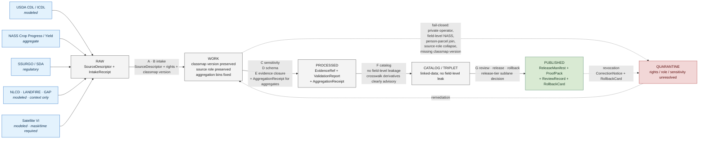

<!-- [KFM_META_BLOCK_V2]
doc_id: kfm://doc/<TODO-uuid>
title: Agriculture · Sublane · Cropland
type: standard
subtype: domain-topical-sublane-profile
version: v0.1 (draft)
status: draft
contract_version: "3.0.0"
domain: agriculture
sublane_axis: topical
sublane_value: cropland
owners: <TODO: Docs steward + Agriculture domain steward + Source steward + Sensitivity reviewer (per ai-build-operating-contract.md §0 reviewer pattern)>
created: 2026-05-26
updated: 2026-05-26
policy_label: public
related:
  - docs/doctrine/ai-build-operating-contract.md
  - docs/doctrine/directory-rules.md
  - docs/doctrine/trust-membrane.md
  - docs/doctrine/policy-aware.md
  - docs/doctrine/lifecycle-law.md
  - docs/doctrine/evidence-first.md
  - docs/domains/agriculture/README.md
  - docs/domains/agriculture/sublanes/README.md
  - docs/domains/agriculture/policy/README.md
  - docs/domains/agriculture/runbooks/README.md
  - docs/runbooks/agriculture/SOURCE_REFRESH_RUNBOOK.md
  - policy/sensitivity/agriculture/
  - policy/domains/agriculture/
  - schemas/contracts/v1/domains/agriculture/
  - data/registry/sources/agriculture/
tags: [kfm, domain, agriculture, sublane, topical, cropland, cdl, landcover, nass, ssurgo, aggregate, fail-closed]
notes:
  - This document profiles the **cropland** topical sublane of the agriculture domain. It composes against the five-axis sublane framework in `docs/domains/agriculture/sublanes/README.md` (PROPOSED term — see OQ-AG-SUB-01).
  - "Cropland" is CONFIRMED KFM coverage per `KFM_Unified_Implementation_Architecture_Build_Manual.md` §10.7 ("Agriculture and landcover").
  - USDA Cropland Data Layer (CDL) is CONFIRMED admitted per atlas card KFM-P2-IDEA-0028; NASS Crop Progress with ICDL version watcher per atlas card KFM-P25-PROG-0005.
  - Pinned to `CONTRACT_VERSION = "3.0.0"` per `ai-build-operating-contract.md` §0 / §37.
  - All concrete paths are PROPOSED until verified against the live repository.
[/KFM_META_BLOCK_V2] -->

# Agriculture · Sublane · Cropland

> **The cropland topical sublane of KFM's agriculture domain — covering cropland landcover (USDA CDL), crop history, crop progress (NASS), crop rotation, yield observations, field candidates, and the public-safe aggregate products derived from them — all under the source-role anti-collapse rule and the fail-closed-for-private-data default.**


<!-- TODO — wire repo-level Shields endpoints (CI status; cropland-sublane-coverage) once workflows are verified. -->

**Status:** Draft · **Owners:** *TODO — Docs steward + Agriculture domain steward + Source steward + Sensitivity reviewer* `[NEEDS VERIFICATION]` · **Last updated:** 2026-05-26 · **Pinned to:** `CONTRACT_VERSION = "3.0.0"`

> [!IMPORTANT]
> **Cropland is a topical sublane, not a domain.** This document profiles **one value** on the **topical axis** of the agriculture sublane framework established in [`docs/domains/agriculture/sublanes/README.md`](./README.md). Cropland material is **simultaneously** classified along the other four axes (sensitivity / source-role / release-tier / cross-lane); §3 lists those classifications. The classification framework itself (term "sublane") is PROPOSED — see OQ-AG-SUB-01 in the parent README.
>
> The canonical machine artifacts that enforce cropland's posture live under `policy/sensitivity/agriculture/`, `policy/domains/agriculture/`, `schemas/contracts/v1/domains/agriculture/`, `contracts/domains/agriculture/`, and `data/registry/sources/agriculture/` — never duplicated here. `[CONFIRMED rule — directory-rules.md §6.5.]`

> [!WARNING]
> **Source-role discipline is acute for cropland.** USDA CDL is a **`modeled`** classification of satellite imagery — not an `observed` ground-truth product. NASS Crop Progress is an **`aggregate`** report — not a field-level claim. Conflating these source roles, even subtly, is the dominant cropland anti-pattern (§10). Crosswalks between landcover authorities (CDL ↔ NLCD ↔ LANDFIRE ↔ GAP) are **advisory only**, not authoritative. `[CONFIRMED — atlas KFM-P2-IDEA-0028; build-manual §10.7.]`

---

## Contents

1. [Scope — what counts as "cropland"](#1-scope--what-counts-as-cropland)
2. [Definitions](#2-definitions)
3. [Five-axis classification for cropland material](#3-five-axis-classification-for-cropland-material)
4. [Source families that feed the cropland sublane](#4-source-families-that-feed-the-cropland-sublane)
5. [Object families in cropland scope](#5-object-families-in-cropland-scope)
6. [Cropland pipeline shape](#6-cropland-pipeline-shape)
7. [Cropland-specific policy posture](#7-cropland-specific-policy-posture)
8. [Cross-lane relations for cropland](#8-cross-lane-relations-for-cropland)
9. [Map and viewing products](#9-map-and-viewing-products)
10. [Anti-patterns specific to cropland](#10-anti-patterns-specific-to-cropland)
11. [Validators and CI for the cropland sublane](#11-validators-and-ci-for-the-cropland-sublane)
12. [Acceptance checklist](#12-acceptance-checklist)
13. [Open questions register](#13-open-questions-register)
14. [FAQ](#14-faq)
15. [Related docs](#15-related-docs)
16. [Appendix](#16-appendix)

---

## 1. Scope — what counts as "cropland"

The cropland sublane covers the **cropland surface** in Kansas and its derived observations, classifications, and aggregates — exactly the coverage listed in [`KFM_Unified_Implementation_Architecture_Build_Manual.md`](../../../KFM_Unified_Implementation_Architecture_Build_Manual.md) §10.7 ("Agriculture and landcover"). `[CONFIRMED.]`

### 1.1 In scope

- **Cropland landcover** — modeled annual classification (USDA CDL); per-pixel crop class with native vocabulary preserved.
- **Crop history** — multi-year crop rotation reconstruction from CDL stacks.
- **Crop progress** — NASS county-week aggregate condition and stage reports.
- **Yield observation** — NASS county-year yield aggregates.
- **Field candidates** — internal-only candidate field-resolution units derived from CDL + ancillary; not public-safe by default.
- **Drought stress on cropland** — modeled drought stress indicators attributed to cropland pixels / counties.
- **Pest stress on cropland** — pest stress indicators where Agriculture owns the indicator and Fauna provides taxonomic identity. `[CONFIRMED — Atlas §24.4.5.]`
- **Vegetation indices over cropland** — modeled NDVI / EVI / similar over CDL-classified cropland pixels (mask + time metadata required).
- **Soil-crop suitability** — cross-lane to Soil; Soil owns canonical soil semantics. `[CONFIRMED — Atlas §24.4.7.]`
- **Conservation practice context on cropland** — Conservation Practice records as **context**, never as instruction. `[CONFIRMED — Atlas §24.4.4.]`

### 1.2 Out of scope

- **Cropland landcover from non-admitted authorities** — only the admitted four (CDL, NLCD, LANDFIRE, GAP) per atlas card KFM-P2-IDEA-0028 plus any source admitted under documented terms.
- **Operator-level private records** — proprietary yield, pesticide records, planting logs. These fail closed and are owned by the agriculture lane's `restricted_private_operator` sensitivity sublane, not by the cropland topical sublane. `[CONFIRMED — Atlas §9.I.]`
- **Person-parcel joins** — owned by the People/Land lane; cropland material MUST NOT silently resolve to identifiable operators or owners. `[CONFIRMED — Atlas §24.4.7.]`
- **Pasture / rangeland** — generally not "cropland" in the CDL sense; classified separately and lives in adjacent topical sublanes (forage, range).
- **Agronomic instruction** — KFM is never an instructional or alert authority for cropland; conservation-practice surfaces are framed, not prescriptive. `[CONFIRMED — Atlas §24.4.4 / §24.9.2 anti-pattern row.]`
- **Real-time emergency response** — cropland drought / pest stress surfaces are analytical context, not alert authority. `[CONFIRMED — build-manual §10.7 public posture; §10.10 hazards posture.]`

> [!NOTE]
> The boundary between "cropland" and "agriculture overall" is a topical-axis distinction. Agriculture also covers livestock, supply chain, agricultural economy, and irrigation infrastructure (Hydrology-cross-lane). Cropland is the **landcover-and-crop-product** slice. `[INFERRED from Atlas §9.B object families + build-manual §10.7 coverage.]`

[⬆ Back to top](#agriculture--sublane--cropland)

---

## 2. Definitions

| Term | Status | Meaning here |
|---|---|---|
| **Cropland** | `[CONFIRMED — build-manual §10.7.]` | The cropped-surface landcover class and its observations, classifications, and aggregates. A topical sublane of the agriculture domain. |
| **CDL** | `[CONFIRMED — KFM-P2-IDEA-0028.]` | USDA **C**ropland **D**ata **L**ayer. Annual modeled classification of satellite imagery into crop / non-crop / specific-crop classes. Source role: `modeled`. |
| **ICDL** | `[CONFIRMED — KFM-P25-PROG-0005.]` | The intermediate / iterated CDL release sequence. Watchers preserve NASS report dates, CDL/ICDL release timestamps, classmap version, and provenance. |
| **NLCD** | `[CONFIRMED — KFM-P2-IDEA-0028.]` | National Land Cover Database. Multi-year, broader-scope landcover authority; native classification preserved. |
| **LANDFIRE** | `[CONFIRMED — KFM-P2-IDEA-0028.]` | Fire-related landcover authority. Admitted for fire-context use only; not authoritative for crop classification. |
| **GAP** | `[CONFIRMED — KFM-P2-IDEA-0028.]` | Gap Analysis Program. Biodiversity-focused landcover authority. Admitted for biodiversity-context use only. |
| **NASS** | `[CONFIRMED — atlas references.]` | USDA National Agricultural Statistics Service. Aggregate-authority source for crop progress, yield, condition. Source role: `aggregate`. |
| **PLANTS** | `[CONFIRMED — build-manual §10.7.]` | USDA PLANTS database. Taxonomic authority for plant identity; consumed by Flora and cross-cited from cropland for crop-taxonomy resolution. |
| **SSURGO / SDA** | `[CONFIRMED — Atlas §9.K SSURGO/SDA lineage tests.]` | NRCS Soil Survey Geographic / Soil Data Access. Soil-canonical source consumed by cropland via the Soil cross-lane edge (MUKEY joins). |
| **CLU** | `[INFERRED — common ag vocabulary; PROPOSED for KFM admission.]` | FSA Common Land Unit. A field-boundary product; treated as **restricted / steward-only** in KFM until rights are confirmed. |
| **Classmap version** | `[CONFIRMED — KFM-P25-PROG-0005.]` | The version identifier for the CDL/ICDL classification scheme; MUST be preserved through reprocessing. |
| **Crosswalk** | `[CONFIRMED — KFM-P2-IDEA-0028.]` | A mapping between two landcover classification schemes. **Advisory only**, not authoritative; each source's native classification is preserved. |
| **Material-change watcher** | `[CONFIRMED — build-manual §10.7.]` | A watcher that proposes work when a cropland landcover change is materially detected; never publishes directly. Watcher-as-non-publisher invariant applies. |
| **Field-level claim** | `[CONFIRMED — Atlas §9.K policy denial test.]` | A public-facing assertion at field resolution derived from a source whose authority is aggregate (e.g., NASS). Denied by default. |
| **County-week / county-year aggregate** | `[CONFIRMED — Atlas §24.4.7.]` | The standard bin units for NASS crop progress (county-week) and NASS yield (county-year). `AggregationReceipt` records bin semantics. |

[⬆ Back to top](#agriculture--sublane--cropland)

---

## 3. Five-axis classification for cropland material

Cropland is one value on the **topical axis** (axis 3). Cropland material is simultaneously classified on the other four axes per [`docs/domains/agriculture/sublanes/README.md`](./README.md) §7.

| Axis | Default classification(s) for cropland | Notes |
|---|---|---|
| **1. Sensitivity class** | Mixed: `public_safe_aggregate` (county aggregates, generalized landcover) · `restricted_field_level_aggregate_derived` (field-level NASS) · `restricted_private_operator` (operator-level yield / pesticide) · `denied_person_parcel_join` (cross to operator identity). `[CONFIRMED — Atlas §9.I.]` | Most cropland material is mixed; classification is per artifact, not blanket. |
| **2. Source role** | `modeled` (CDL/ICDL, vegetation indices) · `aggregate` (NASS crop progress, NASS yield, county aggregates) · `observed` (field sensors where admitted) · `regulatory` (FSA / USDA program records) · `admin` (registry entries). | **Source role is acute.** CDL is `modeled`, NEVER `observed`. NASS is `aggregate`, NEVER field-level. `[CONFIRMED — Atlas §24.9.3.]` |
| **3. Topical scope** | `cropland` *(this document)*. | Composes with adjacent topical sublanes — yield, soil-moisture, vegetation-index, drought-stress, pest-stress, conservation-practice, soil-crop-suitability. |
| **4. Release tier** | `public` for county aggregates and generalized landcover; `partner` / `steward` for finer products under explicit terms; `internal` for field candidates and pre-promotion work; `denied` for private operator data. | Per Atlas card KFM-P9-PROG-0069 audience class. |
| **5. Cross-lane interface** | Agriculture × Soil (MUKEY, suitability) · Agriculture × Hydrology (irrigation, drought, water-use) · Agriculture × Atmosphere (weather, vegetation stress) · Agriculture × People/Land (operator/parcel — fail closed) · Agriculture × Habitat (conservation framing — context only) · Agriculture × Fauna (pest taxonomic identity) · Agriculture × Hazards (drought / pest context — not regulatory) · Agriculture × Frontier Matrix (county-year aggregates as cell inputs). | `[CONFIRMED — Atlas §24.4.7.]` |

> [!TIP]
> Before admitting any cropland material, classify it on all five axes. If you can't answer one, you're not ready to admit it. See [`docs/domains/agriculture/sublanes/README.md`](./README.md) §10 composition rules and §17 Appendix C (quick-reference card).

[⬆ Back to top](#agriculture--sublane--cropland)

---

## 4. Source families that feed the cropland sublane

CONFIRMED-admitted landcover authorities for KFM are listed in atlas card KFM-P2-IDEA-0028: **USDA CDL, NLCD, LANDFIRE, GAP**. Each is ingested with native classification preserved and cross-walked to a common vocabulary where possible. Crosswalks are **advisory**, not authoritative. `[CONFIRMED.]`

### 4.1 Primary cropland sources

| Source family | Source role | Cadence (PROPOSED) | Audience role | Authority constraint |
|---|---|---|---|---|
| **USDA CDL** | `modeled` | Annual + intermediate (ICDL) releases | `public_safe_aggregate` for cropland landcover surface | Crop classification at pixel resolution; **modeled, not observed**. Native classmap version preserved. `[CONFIRMED — KFM-P2-IDEA-0028, KFM-P25-PROG-0005.]` |
| **NASS Crop Progress** | `aggregate` | Weekly (state / region during growing season) | `public_safe_aggregate` for county/state-week roll-ups | County-week bin; `AggregationReceipt` required. Field-level claims fail closed. `[CONFIRMED — Atlas §9.K.]` |
| **NASS Crop Production / Yield** | `aggregate` | Multiple annual + final | `public_safe_aggregate` for county-year roll-ups | County-year bin; `AggregationReceipt` required. |
| **NLCD** | `modeled` | Multi-year | `public_safe_aggregate` for broader landcover context | Non-crop landcover authority; cropland coverage advisory only. |
| **LANDFIRE** | `modeled` | Periodic | `public_safe_aggregate` for fire-context only | NOT authoritative for crop classification. `[CONFIRMED — KFM-P2-IDEA-0028.]` |
| **GAP** | `modeled` | Periodic | `public_safe_aggregate` for biodiversity-context only | NOT authoritative for crop classification. `[CONFIRMED — KFM-P2-IDEA-0028.]` |
| **USDA PLANTS** | `regulatory` | Periodic | Taxonomic identity reference | Crop taxonomy authority; consumed cross-domain. `[CONFIRMED — build-manual §10.7.]` |
| **SSURGO / SDA** | `regulatory` | Periodic | `public_safe_aggregate` for soil-crop suitability | Soil-canonical authority consumed via Soil cross-lane edge. `[CONFIRMED — Atlas §9.K SSURGO/SDA lineage tests.]` |
| **FSA Common Land Unit (CLU)** | `regulatory` | Periodic (where admitted) | `restricted` / `steward` by default | Field-boundary product; rights confirmation required at admission. `[INFERRED — common ag vocabulary; PROPOSED for KFM admission posture pending rights review.]` |
| **Satellite vegetation indices** (NDVI / EVI from Landsat / Sentinel / MODIS) | `modeled` | Variable (weekly to monthly) | `public_safe_aggregate` for cropland-masked products | Mask / time metadata required. `[CONFIRMED — Atlas §9.K vegetation index mask/time tests.]` |

### 4.2 Source admission discipline

Each cropland source MUST be admitted with a `SourceDescriptor` that records: source identity, **source role**, rights, sensitivity tag, citation policy, update cadence, classmap version (where applicable), and verification status. `[CONFIRMED — `kfm_unified_doctrine_synthesis.md` §10.]`

**CONFIRMED sourcing rules specific to cropland:**

- **CDL/ICDL admission** MUST preserve the classmap version. A pixel labeled "soybean" in CDL v2024 and "soybean" in CDL v2025 are NOT silently the same observation. `[CONFIRMED — KFM-P25-PROG-0005 watcher invariant.]`
- **Landcover authority crosswalks** are advisory, not authoritative. Each source's native classification is preserved; crosswalk derivatives are research artifacts with caveats. `[CONFIRMED — KFM-P2-IDEA-0028.]`
- **NASS reports** are aggregate-authority and field-level inferences from them are denied. `[CONFIRMED — Atlas §9.K.]`
- **FSA CLU** is rights-sensitive; until rights are confirmed, CLU material is `restricted` / `steward` only.

### 4.3 Watchers

Per atlas card KFM-P25-PROG-0005, a **NASS crop progress / ICDL version watcher** preserves NASS report dates, CDL/ICDL release timestamps, classmap version, and provenance before reprocessing county products. **Watchers propose work; they do not publish.** `[CONFIRMED — watcher-as-non-publisher invariant.]`

[⬆ Back to top](#agriculture--sublane--cropland)

---

## 5. Object families in cropland scope

The following object families from Atlas §9.B classify under the cropland topical sublane (some primarily, some by cross-cut). Each is `CONFIRMED` as an agriculture-owned object family; the cropland-sublane assignment here is `INFERRED`.

| Object family | Cropland-sublane role | Primary axis-1 classification |
|---|---|---|
| **Crop Observation** | Primary — cropland landcover and crop-class observations. | `public_safe_aggregate` (county) · `restricted_field_level_aggregate_derived` (field). |
| **Crop Rotation** | Primary — multi-year crop sequences derived from CDL stacks. | `public_safe_aggregate` (county) · `restricted` (field). |
| **Yield Observation** | Primary — NASS county-year yield aggregates; private operator yields fail closed. | `public_safe_aggregate` (county) · `restricted_private_operator` (operator-level). |
| **Field Candidate** | Cropland-derived — candidate field-resolution units; `internal` by default. | `restricted` / `internal` always. |
| **Drought Stress Indicator** | Cropland-attributed when over cropland pixels / counties. | `public_safe_aggregate`. |
| **Pest Stress Indicator** | Cropland-attributed for cropland-relevant pest contexts. | `public_safe_aggregate`. |
| **Conservation Practice** | Cropland-relevant when practice applies to cropped surface. | `public_safe_aggregate` as **context only**; never instructional. |
| **Soil Crop Suitability** | Cross-lane to Soil; consumed by cropland for suitability framing. | `public_safe_aggregate`; source-role-preserved across edge. |
| **Aggregation Receipt** | Mandatory accompaniment for every cropland aggregate. | Receipt class; not a content classification. |

> [!NOTE]
> **Object meaning is owned by `contracts/domains/agriculture/`, not by this doc.** This sublane profile cites the object families and explains how they classify under cropland; the canonical meaning lives in the contracts root. `[CONFIRMED rule — directory-rules.md §6.3, §6.4.]`

[⬆ Back to top](#agriculture--sublane--cropland)

---

## 6. Cropland pipeline shape

The cropland sublane follows the canonical agriculture pipeline (`RAW → WORK / QUARANTINE → PROCESSED → CATALOG / TRIPLET → PUBLISHED`) from [`lifecycle-law.md`](../../../doctrine/lifecycle-law.md), with cropland-specific checks at each gate. Operational procedures for these gates are indexed at [`docs/domains/agriculture/runbooks/README.md`](../runbooks/README.md) and live canonically under [`docs/runbooks/agriculture/`](../../../runbooks/agriculture/).



### 6.1 Cropland-specific gate checks

| Gate | Letter-form | Cropland-specific question | Cropland-specific receipt(s) |
|---|---|---|---|
| **Intake** | `A` · `B` | Is this an admitted cropland source under known role, cadence, terms, and (for CDL/ICDL) classmap version? | `SourceDescriptor` (with explicit `source_role` and `classmap_version`) + `IntakeReceipt`. |
| **Verification (sensitivity)** | `C` | Does this material expose private operator/field data, a person-parcel join, or a field-level claim derived from an aggregate authority? | `PolicyDecision` + `RedactionReceipt` (if transformed). |
| **Verification (schema/evidence)** | `D` · `E` | Does the unit close as a valid cropland object with resolved `EvidenceRef`, preserved classmap version, and (for aggregates) an `AggregationReceipt`? | `EvidenceBundle` + `ValidationReport` + `AggregationReceipt`. |
| **Catalog** | `F` | Is the indexed form free of inferential leaks to private records, and are crosswalk derivatives clearly labeled advisory? | Catalog record + crosswalk-advisory marker. |
| **Publication** | `G` | MAY this be exposed under the operative release tier, with rollback in place, source-role preserved, and classmap version surfaced in the Evidence Drawer? | `PromotionDecision` + `ReleaseManifest` + `ProofPack` + `ReviewRecord` + `RollbackCard`. |

[⬆ Back to top](#agriculture--sublane--cropland)

---

## 7. Cropland-specific policy posture

Cropland inherits the agriculture-domain policy posture from [`docs/domains/agriculture/policy/README.md`](../policy/README.md) and adds cropland-specific concerns. `[CONFIRMED — Atlas §9.I; build-manual §10.7.]`

### 7.1 Cropland fail-closed defaults

| Surface | Default disposition | Doctrine basis |
|---|---|---|
| **Operator-level CLU joined to crop / yield records.** | `DENY` (public + partner). | Private-operator fails closed. `[CONFIRMED — Atlas §9.I.]` |
| **Field-level NASS / aggregate-source claim.** | `DENY` (public). | Aggregate-as-place-observation anti-pattern. `[CONFIRMED — Atlas §24.9.2.]` |
| **Person-parcel join via cropland field candidate.** | `DENY` (default; steward review for any allow). | Person-parcel deny default. `[CONFIRMED — Atlas §24.4.7.]` |
| **CDL-classified pixel served as "observed."** | `DENY` (source-role collapse). | Source-role anti-collapse. `[CONFIRMED — Atlas §24.9.3.]` |
| **NLCD / LANDFIRE / GAP cited as cropland authority.** | `ABSTAIN` (crosswalk is advisory). | Crosswalks are advisory; CDL is the admitted crop authority. `[CONFIRMED — KFM-P2-IDEA-0028.]` |
| **Vegetation-index product without mask / time metadata.** | `ABSTAIN` / `DENY` per gate. | Mask / time test. `[CONFIRMED — Atlas §9.K.]` |
| **Conservation-practice rendered as instruction.** | `DENY`. | Context only; never instruction. `[CONFIRMED — Atlas §24.4.4.]` |
| **Drought / pest stress rendered as alert.** | `DENY`. | KFM is not an alert authority. `[CONFIRMED — Atlas §24.9.2 anti-pattern row.]` |

### 7.2 Cropland public-safe lane

The cropland public-safe lane includes:

- County and state aggregates from NASS (with `AggregationReceipt`);
- CDL/ICDL annual landcover at native resolution with classmap version and source-role badge visible;
- Multi-year crop-rotation derivatives at county scope or coarser;
- Vegetation indices over cropland-masked pixels with explicit time and mask metadata;
- Drought / pest stress indicators as context (never alerts);
- Soil-crop suitability through the Soil cross-lane edge.

### 7.3 Cropland restricted lane

The cropland restricted lane (steward-reviewed) includes:

- FSA CLU and any operator-resolvable field boundary product;
- Field candidates derived for internal cross-lane joins;
- Per-operator yield, pesticide, planting, or program-participation records.

[⬆ Back to top](#agriculture--sublane--cropland)

---

## 8. Cross-lane relations for cropland

Cropland is one of agriculture's most cross-cutting sublanes. The edges below restate the agriculture cross-lane table in Atlas §24.4.7 with cropland-specific framing.

| Cross-lane edge | Cropland-specific concern | Default disposition |
|---|---|---|
| **Cropland × Soil** | MUKEY joins (CDL pixel → SSURGO mapunit); suitability support. Soil owns canonical soil semantics. | `ALLOW` with source-role preservation. `[CONFIRMED — Atlas §24.4.7.]` |
| **Cropland × Hydrology** | Irrigation context (Ogallala-overlying counties especially); drought attribution. Facility-specific irrigation `DENY`. | `ALLOW` for context. |
| **Cropland × Atmosphere/Air** | Weather, heat, smoke, vegetation stress attribution. Source-role preservation across edge. | `ALLOW`. |
| **Cropland × People/Land** | Field candidate → operator / parcel: **FAIL CLOSED**. | `DENY` by default. `[CONFIRMED — Atlas §24.4.7.]` |
| **Cropland × Habitat** | Conservation-practice context **framed by** habitat-quality scores; never instructional. | `ALLOW` as context only. `[CONFIRMED — Atlas §24.4.4.]` |
| **Cropland × Fauna** | Pest stress: Agriculture owns the indicator; Fauna provides taxonomic identity only. | `ALLOW` with strict role boundary. `[CONFIRMED — Atlas §24.4.5.]` |
| **Cropland × Flora** | Invasive-plant context informs cropland management framing; never an instruction. | `ALLOW` as context only. `[CONFIRMED — Atlas §24.4.6.]` |
| **Cropland × Geology** | Soil-parent material context, advisory only. | `ALLOW` as advisory. `[CONFIRMED — Atlas §24.4.8.]` |
| **Cropland × Frontier Matrix** | County-year crop / yield aggregates feed matrix cells **with `AggregationReceipt`**. | `ALLOW` only with receipt. `[CONFIRMED — Atlas §24.4.7.]` |
| **Cropland × Hazards** | Drought / pest stress on cropland provides analytical context; **never regulatory, never alert**. | `ALLOW` as context only. `[CONFIRMED — Atlas §24.4.7.]` |

[⬆ Back to top](#agriculture--sublane--cropland)

---

## 9. Map and viewing products

Cropland-relevant public-safe map viewing products, drawn from Atlas §9.G and the build-manual §10.7 public posture. All public-safe; sensitive material denied or generalized. `[CONFIRMED — Atlas §9.G; build-manual §10.7.]`

| Product | Surface | Cropland-specific badges |
|---|---|---|
| **Public-safe crop progress map** | Public county-week aggregate. | Source-role: `aggregate`; `AggregationReceipt` cited; classmap version surfaced in Evidence Drawer. |
| **Aggregate crop-condition view** | Public county-week / state-week. | As above. |
| **CDL annual landcover view** | Public CDL native resolution. | Source-role: `modeled`; classmap version visible; crosswalk advisories noted. |
| **Crop-rotation derivative view** | Public county or coarser. | Multi-year provenance; pixel-level claims hidden by default. |
| **Soil-crop suitability map** | Public; cross-lane to Soil. | Soil-canonical authority cited; MUKEY join visible. |
| **Satellite / grid moisture context** | Public; cross-lane to Atmosphere. | Mask + time metadata required; source-role: `modeled`. |
| **Vegetation-index context** | Public over cropland-masked pixels. | Mask + time + classmap version. |
| **Drought / pest stress indicators** | Public context; never alert. | Reality-boundary note: "context only — not regulatory, not an alert authority." |

Cross-cutting viewing products — Evidence Drawer, time-aware state, trust badges, sensitivity-redacted view, correction / stale-state view, and governed Focus Mode — apply per [`map-first.md`](../../../doctrine/map-first.md). `[CONFIRMED — Atlas C2 doctrine callout.]`

[⬆ Back to top](#agriculture--sublane--cropland)

---

## 10. Anti-patterns specific to cropland

The following are CONFIRMED-rejection patterns drawn from Atlas §24.9.2 / §24.9.3 plus the build-manual §10.7 risks list ("noisy annual changes, source-drift false positives, private land inference, over-precise field-level claims"). Each MUST fail closed.

| Anti-pattern | What goes wrong | Failing gate | Corrective rule |
|---|---|---|---|
| **CDL pixel served as "observed."** | Source-role collapse: a modeled classification of satellite imagery presented as ground-truth observation. | Verification gate (`C` / `D`). | Source role fixed at admission. `[CONFIRMED — Atlas §24.9.3; KFM-P2-IDEA-0028 modeled posture.]` |
| **NASS aggregate cited as per-place observation.** | Aggregate-as-place-observation; a county-year yield read as a field measurement. | Verification gate (`C`). | `AggregationReceipt` mandatory; field-level `DENY`. `[CONFIRMED — Atlas §24.9.2.]` |
| **Crosswalk derivative cited as authoritative.** | NLCD-to-CDL crosswalk used to assert crop class authority. | Catalog gate (`F`). | Crosswalks are advisory; CDL is the admitted authority. `[CONFIRMED — KFM-P2-IDEA-0028.]` |
| **CDL classmap version lost in reprocessing.** | "Soybean" in v2024 and "soybean" in v2025 silently merged. | Verification gate (`D`); watcher invariant. | Watcher preserves classmap version. `[CONFIRMED — KFM-P25-PROG-0005.]` |
| **Noisy annual CDL change served as material landcover change.** | CDL year-to-year noise (~10–15% typical depending on region) treated as real landcover change. | Verification gate (`C` / `D`); watcher proposal logic. | Watcher proposes; reviewer confirms; never auto-publish. `[CONFIRMED — build-manual §10.7 "material-change watchers propose work only."]` |
| **Field candidate → operator identity surfaced.** | Cropland field-candidate joined to FSA CLU or person-parcel resolved to a named operator. | Verification gate (`C`); cross-lane policy gate. | `DENY` by default. `[CONFIRMED — Atlas §24.4.7.]` |
| **Vegetation index served without mask / time.** | NDVI rendered over cropland without specifying which pixels are crop-masked or when. | Verification gate (`D`). | Mask + time metadata mandatory. `[CONFIRMED — Atlas §9.K.]` |
| **LANDFIRE / GAP cited as crop authority.** | Fire-context or biodiversity-context landcover used to assert crop classification. | Catalog gate (`F`). | Each authority used in its admitted scope. `[CONFIRMED — KFM-P2-IDEA-0028.]` |
| **Drought / pest stress on cropland served as alert.** | Stress indicator presented as regulatory or life-safety alert. | Publication gate (`G`). | KFM is not an alert authority. `[CONFIRMED — Atlas §24.9.2.]` |
| **Conservation practice on cropland served as instruction.** | Practice candidate rendered as agronomic guidance. | Publication gate (`G`). | Context only; never instructional. `[CONFIRMED — Atlas §24.4.4.]` |
| **Cropland aggregate without `AggregationReceipt`.** | Aggregate object emitted with no record of bin / cell semantics. | Verification gate (`D`). | `AggregationReceipt` mandatory. `[CONFIRMED — Atlas §24.13.]` |
| **Source-drift false positive published.** | A change driven by CDL classification drift treated as real cropland change. | Verification gate; watcher logic. | Differentiate classmap-version drift from material change. `[CONFIRMED — build-manual §10.7 risks.]` |
| **Private land inference from public-safe layers.** | A combination of public-safe aggregates inferentially identifies operator activity. | Cross-lane gate. | Compound-inference check at cross-lane review. `[CONFIRMED — build-manual §10.7 risks.]` |

[⬆ Back to top](#agriculture--sublane--cropland)

---

## 11. Validators and CI for the cropland sublane

The following validators / CI jobs are **PROPOSED to create** for cropland-specific discipline. Each lives under `tests/domains/agriculture/cropland/` or `tools/validators/`. Names align with the agriculture validator pattern in [`docs/domains/agriculture/policy/README.md`](../policy/README.md) §11 and the agriculture-sublane validators in [`docs/domains/agriculture/sublanes/README.md`](./README.md) §12.

| Validator / CI job | Purpose | Acceptance gate |
|---|---|---|
| `cropland-cdl-source-role-modeled-tests` | Verify CDL/ICDL admission records `source_role = modeled`; never `observed`. | Mismatch → `FAIL`. |
| `cropland-cdl-classmap-version-preservation-tests` | Verify watcher preserves classmap version across reprocessing per KFM-P25-PROG-0005. | Lost classmap version → `FAIL`. |
| `cropland-nass-aggregate-only-tests` | Verify NASS-derived public claims emit only at aggregate scope (county-week / county-year). | Field-level NASS claim → `FAIL`. |
| `cropland-aggregation-receipt-required-tests` | Verify every cropland aggregate carries an `AggregationReceipt` with bin / cell semantics. | Missing receipt → `FAIL`. |
| `cropland-vegetation-index-mask-time-tests` | Verify vegetation-index products carry mask and time metadata. Mirrors Atlas §9.K test. | Missing metadata → `FAIL`. |
| `cropland-crosswalk-advisory-only-tests` | Verify NLCD / LANDFIRE / GAP cross-classifications are rendered as advisory, not authoritative. | Authoritative claim from non-CDL → `FAIL`. |
| `cropland-landfire-gap-scope-tests` | Verify LANDFIRE used only for fire context, GAP only for biodiversity context. | Out-of-scope authority claim → `FAIL`. |
| `cropland-field-level-deny-tests` | Verify public surfaces deny field-level cropland claims derived from aggregate authority. | Field-level `ANSWER` → `FAIL`. |
| `cropland-clu-restricted-tests` | Verify FSA CLU material is `restricted` / `steward` only by default. | Public exposure of CLU without explicit rights → `FAIL`. |
| `cropland-field-candidate-internal-only-tests` | Verify Field Candidate objects do not appear in `public` or `partner` envelopes. | Field candidate in public envelope → `FAIL`. |
| `cropland-person-parcel-join-deny-tests` | Verify public-facing cropland material does not join to identifiable operators / owners. | Any identifiable join in public envelope → `FAIL`. |
| `cropland-ssurgo-sda-lineage-tests` | Verify cross-lane joins to Soil preserve SSURGO/SDA lineage. Mirrors Atlas §9.K. | Broken lineage → `FAIL`. |
| `cropland-watcher-non-publisher-tests` | Verify NASS / CDL watchers propose work but do not publish. | Watcher direct-publish path → `FAIL`. |
| `cropland-noisy-change-vs-material-change-tests` | Verify watcher logic distinguishes classmap drift / annual noise from material landcover change. | Auto-publish on noisy change → `FAIL`. |
| `cropland-conservation-practice-not-instructional-tests` | Verify Conservation Practice surfaces render as context, not instruction. | Instructional payload → `FAIL`. |
| `cropland-drought-pest-not-alert-tests` | Verify drought / pest stress indicators on cropland do not surface as alerts. | Alert keying or imperative payload → `FAIL`. |
| `cropland-compound-inference-audit` | Audit combinations of public-safe cropland aggregates for inferential reach to private operator activity. | Inferable private identity → `FAIL`. |

> [!NOTE]
> Each validator MUST ship with both **valid** and **invalid** fixtures, and the invalid fixtures MUST fail *for the expected reason*. A test that fails for the wrong reason is not a passing negative test. `[CONFIRMED posture — ai-build-operating-contract.md §6.]`

[⬆ Back to top](#agriculture--sublane--cropland)

---

## 12. Acceptance checklist

A repository implementation of the cropland sublane conforms to this profile when **all** of the following hold:

- [ ] Every admitted cropland source has a `SourceDescriptor` recording `source_role`, cadence, rights, sensitivity, and (where applicable) `classmap_version`.
- [ ] CDL/ICDL sources are recorded as `source_role = modeled`, never `observed`.
- [ ] NASS sources are recorded as `source_role = aggregate`, never field-level.
- [ ] Every cropland aggregate carries a resolvable `AggregationReceipt` with bin / cell semantics.
- [ ] Watcher (per KFM-P25-PROG-0005) preserves NASS report dates, CDL/ICDL release timestamps, classmap version, and provenance through reprocessing.
- [ ] No public envelope serves field-level cropland claims derived from aggregate authority.
- [ ] No public envelope joins cropland material to identifiable operator / owner records.
- [ ] FSA CLU material is `restricted` / `steward` only absent explicit rights confirmation.
- [ ] Field Candidate objects do not appear in `public` or `partner` envelopes.
- [ ] Crosswalk derivatives (NLCD ↔ CDL ↔ LANDFIRE ↔ GAP) are rendered as advisory, not authoritative.
- [ ] LANDFIRE used only in fire-context surfaces; GAP only in biodiversity-context surfaces.
- [ ] Vegetation-index products carry mask and time metadata.
- [ ] Conservation-practice surfaces are non-instructional.
- [ ] Drought / pest stress on cropland surfaces are non-alert.
- [ ] Source-drift / annual noise is distinguished from material landcover change before publication.
- [ ] Cross-lane joins to Soil, Hydrology, Atmosphere, People/Land, Habitat, Fauna, Flora, Geology, Frontier Matrix, and Hazards preserve ownership, source role, sensitivity, and `EvidenceBundle` support.
- [ ] Every AI-authored cropland-doctrine merge emits a `GENERATED_RECEIPT.json` with `contract_version = "3.0.0"`. `[CONFIRMED — ai-build-operating-contract.md §34.]`

[⬆ Back to top](#agriculture--sublane--cropland)

---

## 13. Open questions register

| ID | Question | Owner role | Resolution path |
|---|---|---|---|
| **OQ-AG-CROPLAND-01** | Should this profile live at `docs/domains/agriculture/sublanes/cropland.md` (single-file per topical sublane) or under `docs/domains/agriculture/sublanes/cropland/README.md` (folder-per-sublane)? Parallels OQ-AG-SUB-02. | Docs steward | Repo inspection; ADR if consolidated. |
| **OQ-AG-CROPLAND-02** | Is FSA Common Land Unit (CLU) admitted under KFM, and if so under what terms? CLU rights posture is not yet CONFIRMED in this session's evidence. | Source steward + Rights-holder representative | Source admission ADR or `SourceActivationDecision`. |
| **OQ-AG-CROPLAND-03** | What is the canonical bin granularity for cropland `AggregationReceipt` — county-year for yield (CONFIRMED), county-week for crop progress (CONFIRMED), but what about state-week aggregates, ZIP-code-area aggregates, HUC-area aggregates, or CRD (Crop Reporting District) aggregates? | Agriculture domain steward | Per-source review. |
| **OQ-AG-CROPLAND-04** | Should CDL/ICDL classmap version be encoded as a first-class field on `SourceDescriptor`, on `LayerManifest`, on `EvidenceBundle`, or all three? | Architecture steward | ADR — touches schema home. |
| **OQ-AG-CROPLAND-05** | What threshold distinguishes "annual CDL noise" from "material landcover change" in the watcher? Per-class % thresholds? Spatial coherence checks? Multi-year persistence? | Agriculture domain steward + Source steward | Per-class threshold ADR; cited in `KFM-P25-PROG-0005` follow-up. |
| **OQ-AG-CROPLAND-06** | How should the cropland sublane handle Kansas Ogallala-overlying counties where cropland sustainability is hydrology-coupled? Is this a cropland sublane concern, a hydrology concern, or a cross-lane joint surface? | Agriculture domain steward + Hydrology domain steward | Cross-domain ADR. |
| **OQ-AG-CROPLAND-07** | Should the cropland sublane have its own `LayerManifest` template (with cropland-specific badges — classmap version, source-role, mask/time, aggregation bin) or inherit the agriculture-default? | Architecture steward + Map surface steward | Reconcile with [`map-first.md`](../../../doctrine/map-first.md). |
| **OQ-AG-CROPLAND-08** | Does USDA NASS Census of Agriculture (5-year) feed cropland separately from annual NASS Crop Progress / Production, and do its restricted-cell rules need their own treatment? | Source steward | Source admission review. |

[⬆ Back to top](#agriculture--sublane--cropland)

---

## 14. FAQ

**Why is CDL `modeled` rather than `observed`?**
Because CDL is the **output of a classification model** applied to satellite imagery (Landsat / Sentinel-2 / others), not a record of ground inspection. A CDL pixel labeled "corn" is the model's classification of reflectance signatures at that pixel — useful, well-validated for many uses, but **not** equivalent to a person standing in the field. Calling it `observed` would collapse a CONFIRMED source-role distinction and is a CONFIRMED anti-pattern. `[CONFIRMED — Atlas §24.9.3; KFM-P2-IDEA-0028.]`

**Why are NLCD / LANDFIRE / GAP admitted if they aren't authoritative for cropland?**
Because they ARE authoritative for **their own scope** — NLCD for broader landcover context, LANDFIRE for fire-related landcover, GAP for biodiversity. KFM admits each in its scope and uses **crosswalks** only as advisory derivatives. Citing LANDFIRE for crop classification would be an out-of-scope authority claim. `[CONFIRMED — KFM-P2-IDEA-0028.]`

**What's "noisy annual change" and why does it matter?**
CDL has known year-to-year classification noise — pixels switch between adjacent crop classes at a non-trivial rate even when the actual landcover did not change. Treating that noise as material landcover change drives false positives downstream. The watcher (KFM-P25-PROG-0005) preserves classmap version and timestamps; a reviewer confirms material change before publication. `[CONFIRMED — build-manual §10.7 risks list.]`

**Can I infer a specific operator's planting from CDL + adjacent public data?**
Possibly — and that's exactly the compound-inference risk. The build-manual §10.7 names "private land inference" as a CONFIRMED cropland risk. The `cropland-compound-inference-audit` validator (§11) is the proposed defense; the disposition for any flagged combination is steward review with default `DENY`. `[CONFIRMED — build-manual §10.7.]`

**Can AI summarize cropland EvidenceBundles?**
Yes. AI MAY summarize released cropland `EvidenceBundle`s, compare evidence across years or classmap versions, and explain limitations. AI MUST `ABSTAIN` when evidence is insufficient and `DENY` where policy, rights, sensitivity, or release state blocks the request. AI MUST NOT compress source-role distinctions ("CDL says corn here" without naming `modeled` source role). `[CONFIRMED — Atlas §9.L.]`

**What about livestock?**
Not in scope here. Livestock is a separate agriculture topical concern (a different sublane value on axis 3). Some materials may classify under both (e.g., a forage / grazing crop), in which case the most restrictive applicable sensitivity sublane wins. `[CONFIRMED composition rule — sublanes/README.md §10.1.]`

**Is Kansas hemp / cannabis included in "cropland"?**
Topically yes (cropland landcover includes any crop CDL classifies, regardless of regulatory class), but regulated-crop categories carry **sensitivity** considerations that may shift exposure posture. Per the policy README §6, regulated-crop categories should be treated as a sensitivity dimension; per [`docs/domains/agriculture/policy/README.md`](../policy/README.md) FAQ, steward review is required for any allow path on public exposure of regulated-crop locations. `[CONFIRMED — policy README §6; OQ-AG-POL flagged.]`

**Where do the actual NASS / CDL refresh procedures live?**
At `docs/runbooks/agriculture/SOURCE_REFRESH_RUNBOOK.md` (PROPOSED), indexed from [`docs/domains/agriculture/runbooks/README.md`](../runbooks/README.md). This profile describes **what** cropland is and **how** it classifies; the runbook describes **how to refresh** it step by step.

[⬆ Back to top](#agriculture--sublane--cropland)

---

## 15. Related docs

> [!NOTE]
> All paths below are PROPOSED until verified against the live repository.

**Operating doctrine**

- [`docs/doctrine/ai-build-operating-contract.md`](../../../doctrine/ai-build-operating-contract.md) — canonical operating contract (`CONTRACT_VERSION = "3.0.0"`). `[CONFIRMED sibling.]`
- [`docs/doctrine/directory-rules.md`](../../../doctrine/directory-rules.md) — placement protocol. `[CONFIRMED sibling.]`

**Trust-boundary doctrine**

- [`docs/doctrine/trust-membrane.md`](../../../doctrine/trust-membrane.md) — the trust contract. `[CONFIRMED sibling.]`
- [`docs/doctrine/policy-aware.md`](../../../doctrine/policy-aware.md) — finite policy outcomes. `[CONFIRMED sibling.]`
- [`docs/doctrine/lifecycle-law.md`](../../../doctrine/lifecycle-law.md) — `RAW → … → PUBLISHED`. `[CONFIRMED sibling.]`
- [`docs/doctrine/evidence-first.md`](../../../doctrine/evidence-first.md) — cite-or-abstain. `[CONFIRMED sibling.]`
- [`docs/doctrine/corrections-are-first-class.md`](../../../doctrine/corrections-are-first-class.md) — `CorrectionNotice` workflow. `[CONFIRMED sibling.]`
- [`docs/doctrine/authority-ladder.md`](../../../doctrine/authority-ladder.md) — source authority hierarchy. `[CONFIRMED sibling.]`

**Agriculture domain orientation**

- [`docs/domains/agriculture/README.md`](../README.md) — agriculture domain index. `[PROPOSED.]`
- [`docs/domains/agriculture/sublanes/README.md`](./README.md) — sublane framework (parent of this doc). `[PROPOSED sibling.]`
- [`docs/domains/agriculture/policy/README.md`](../policy/README.md) — agriculture policy aspect. `[PROPOSED sibling.]`
- [`docs/domains/agriculture/runbooks/README.md`](../runbooks/README.md) — agriculture runbooks aspect. `[PROPOSED sibling.]`
- [`docs/domains/agriculture/architecture/README.md`](../architecture/README.md) — agriculture architecture aspect. `[PROPOSED.]`

**Sibling topical sublane profiles (PROPOSED)**

- `docs/domains/agriculture/sublanes/yield.md` — yield observation profile.
- `docs/domains/agriculture/sublanes/soil-moisture.md` — soil-moisture profile.
- `docs/domains/agriculture/sublanes/vegetation-index.md` — vegetation-index profile.
- `docs/domains/agriculture/sublanes/drought-stress.md` — drought-stress profile.
- `docs/domains/agriculture/sublanes/pest-stress.md` — pest-stress profile.
- `docs/domains/agriculture/sublanes/conservation-practice.md` — conservation-practice profile.
- `docs/domains/agriculture/sublanes/soil-crop-suitability.md` — soil-crop suitability profile.
- `docs/domains/agriculture/sublanes/irrigation.md` — irrigation profile.
- `docs/domains/agriculture/sublanes/agricultural-economy.md` — ag economy profile.
- `docs/domains/agriculture/sublanes/supply-chain.md` — supply-chain profile.

**Canonical artifacts (PROPOSED paths)**

- [`policy/sensitivity/agriculture/`](../../../../policy/sensitivity/agriculture/) — sensitivity sublanes (incl. cropland-relevant rows).
- [`policy/domains/agriculture/cross_lane/`](../../../../policy/domains/agriculture/cross_lane/) — cross-lane edges.
- [`policy/release/agriculture/`](../../../../policy/release/agriculture/) — release-tier sublanes.
- [`data/registry/sources/agriculture/`](../../../../data/registry/sources/agriculture/) — `SourceDescriptor` for each admitted cropland source (CDL, NASS, SSURGO, NLCD, LANDFIRE, GAP, PLANTS, vegetation-index sources).
- [`schemas/contracts/v1/domains/agriculture/`](../../../../schemas/contracts/v1/domains/agriculture/) — cropland-relevant object family schemas.
- [`contracts/domains/agriculture/`](../../../../contracts/domains/agriculture/) — cropland-relevant object family meaning.
- [`docs/runbooks/agriculture/SOURCE_REFRESH_RUNBOOK.md`](../../../runbooks/agriculture/SOURCE_REFRESH_RUNBOOK.md) — CDL / NASS refresh procedures.

**Atlas and synthesis evidence basis**

- `KFM_Domains_v1_1_plus_Pass23_Pass32_Consolidated_Atlas` §9 (Agriculture chapter), §9.B (object families), §9.I (sensitivity posture), §9.K (validator list incl. SSURGO/SDA, crop progress aggregate-only, vegetation index mask/time, field-level NASS deny), §24.4 (cross-lane edges), §24.9.2 / §24.9.3 (anti-patterns), §24.13 (responsibility-root crosswalk).
- Atlas card **KFM-P2-IDEA-0028** — USDA CDL, NLCD, LANDFIRE, GAP for land cover; each ingested with native classification preserved and cross-walked advisorily.
- Atlas card **KFM-P25-PROG-0005** — NASS crop progress / ICDL version watcher; preserves NASS report dates, CDL/ICDL release timestamps, classmap version, and provenance.
- Atlas card **KFM-P25-PROG-0004** — Drought Monitor adaptive threshold updater (drought-stress sublane neighbor).
- Atlas card **KFM-P9-PROG-0069** — API audience class (release-tier sublane source).
- `KFM_Unified_Implementation_Architecture_Build_Manual.md` §10.7 — "Agriculture and landcover" coverage / risks / public posture.
- `kfm_unified_doctrine_synthesis.md` §10 (object families incl. `AggregationReceipt`, `RedactionReceipt`).

[⬆ Back to top](#agriculture--sublane--cropland)

---

## 16. Appendix

<details>
<summary><strong>A. Glossary used in this profile</strong></summary>

| Term | Meaning here |
|---|---|
| **CDL** | USDA Cropland Data Layer; annual modeled crop classification. Source role: `modeled`. |
| **ICDL** | Iterated / intermediate CDL release; classmap version preserved by watcher. |
| **Classmap version** | The version identifier for the CDL/ICDL classification scheme; MUST persist through reprocessing. |
| **Crosswalk** | Mapping between two landcover classification schemes; advisory only, not authoritative. |
| **NASS Crop Progress** | Weekly NASS county / state aggregate of crop condition and stage. Source role: `aggregate`. |
| **NASS Yield / Crop Production** | NASS county-year aggregate. Source role: `aggregate`. |
| **CLU** | FSA Common Land Unit; field-boundary product. `restricted` / `steward` by default. |
| **Material-change watcher** | Watcher that proposes work upon detected material landcover change; never publishes. |
| **Field candidate** | Internal-only candidate field-resolution unit derived from CDL + ancillary. `internal` by default. |
| **County-week / county-year** | Standard aggregation bins for NASS products. |
| **Aggregate-as-place-observation** | The CONFIRMED-rejection pattern of citing an aggregate as if it were a per-place observation. |
| **Source-drift / annual noise** | The year-to-year classification noise in CDL; distinguished from material landcover change. |
| **Reality-boundary note** | Required caveat distinguishing reconstruction / model from observation. `[CONFIRMED — corpus-wide.]` |

</details>

<details>
<summary><strong>B. Worked example — a cropland claim across all five axes</strong></summary>

**Scenario.** A reviewer asks: *"Show me the 2024 cropland classification for these four counties in west-central Kansas."*

**Five-axis classification of the request:**

| Axis | Classification | Resolution |
|---|---|---|
| **Sensitivity class** | `public_safe_aggregate` (county scope) — `ALLOW` candidate. | Pass. |
| **Source role** | `modeled` (CDL is the relevant authority). | Pass; classmap version surfaced in result. |
| **Topical scope** | `cropland` — this sublane. | Pass. |
| **Release tier** | `public` (county scope) — `ALLOW`. | Pass. |
| **Cross-lane interface** | Cropland × Soil (potentially), Cropland × Hydrology (Ogallala counties), Cropland × People/Land (deny on operator resolution). | Pass for county scope; would `DENY` if drilled to identifiable operators. |

**What the runtime returns:**

```json
{
  "decision": "ANSWER",
  "reason_code": "ok.warranted",
  "citations": [
    "kfm://evidence/bundle/2024-cdl-ks-067",
    "kfm://evidence/bundle/2024-cdl-ks-093",
    "kfm://evidence/bundle/2024-cdl-ks-129",
    "kfm://evidence/bundle/2024-cdl-ks-181"
  ],
  "policy_refs": [
    "kfm://policy/sensitivity/agriculture/public_safe_aggregate/v1",
    "kfm://policy/release/agriculture/public/v1"
  ],
  "source_role": "modeled",
  "classmap_version": "cdl-2024",
  "aggregation": {
    "bin": "county",
    "year": 2024,
    "receipt": "kfm://evidence/aggregation_receipt/2024-cdl-ks-county"
  },
  "freshness": { "as_of": "2024-02-15T00:00:00Z", "next_expected": "2025-02-15T00:00:00Z" },
  "release": "kfm://release/2024-cdl-ks-public",
  "carrier_note": "Modeled classification of satellite imagery; not field-observed ground truth.",
  "contract_version": "3.0.0"
}
```

**Now flip the request:** *"Show me the 2024 cropland classification for this specific quarter-section in Ellsworth County."*

| Axis | Classification | Resolution |
|---|---|---|
| **Sensitivity class** | `restricted_field_level_aggregate_derived` — field-level claim from modeled aggregate. | `ABSTAIN` per Atlas §9.K policy denial test. |
| **Topical scope** | `cropland`. | (would pass) |
| **Source role** | `modeled` (CDL). | (would pass — CDL has pixel resolution, but…) |
| **Cross-lane interface** | Cropland × People/Land — quarter-section resolves to an identifiable parcel and operator. | `DENY` per Atlas §24.4.7 person-parcel deny default. |
| **Composite result** | `DENY` (one axis denies → composite denies). | Per sublanes/README §10.1 fail-closed-from-any-axis. |

**What the runtime returns:**

```json
{
  "decision": "DENY",
  "reason_code": "policy.person_parcel_join",
  "exposure": "public",
  "guidance": "Field-resolution cropland claims unavailable for public surfaces. County-scope CDL classification available at /public/cropland/county.",
  "ui_negative_state": "DENIED_BY_POLICY",
  "contract_version": "3.0.0"
}
```

**Why this matters.** The same source (CDL), same year (2024), same topical sublane (cropland) returns radically different runtime outcomes based on the **sensitivity + cross-lane axes**. The five-axis framework is what makes the difference auditable.

</details>

<details>
<summary><strong>C. Cropland sublane quick-reference</strong></summary>

```text
CROPLAND SUBLANE QUICK REFERENCE
================================

WHAT IS IT
  Topical sublane of Agriculture; covers cropland landcover (CDL),
  crop history, crop progress (NASS), yield aggregates, field
  candidates, drought/pest stress on cropland, vegetation indices
  over cropland, soil-crop suitability (× Soil), conservation-practice
  context.

ADMITTED LANDCOVER AUTHORITIES (per KFM-P2-IDEA-0028)
  USDA CDL     - crop class authority    - source_role: modeled
  NLCD         - broader landcover       - source_role: modeled (context)
  LANDFIRE     - fire-related landcover  - source_role: modeled (fire only)
  GAP          - biodiversity landcover  - source_role: modeled (biodiv only)

PRIMARY AGGREGATE AUTHORITY
  NASS Crop Progress (county-week) - source_role: aggregate
  NASS Yield / Crop Production    - source_role: aggregate (county-year)

CROSS-DOMAIN AUTHORITIES
  PLANTS  (Flora-side)  - taxonomic identity
  SSURGO  (Soil-side)   - soil-canonical via MUKEY join

FAIL-CLOSED DEFAULTS
  • Field-level NASS claim                       -> DENY
  • Operator-level private records                -> DENY
  • Person-parcel join                            -> DENY (default)
  • CDL pixel served as "observed"                -> DENY (source-role collapse)
  • Aggregate without AggregationReceipt          -> DENY
  • LANDFIRE / GAP cited as crop authority        -> ABSTAIN (advisory only)
  • Vegetation index without mask/time            -> DENY (Atlas §9.K)
  • Conservation practice as instruction          -> DENY
  • Drought/pest stress as alert                  -> DENY (not an alert authority)

WATCHER INVARIANTS (per KFM-P25-PROG-0005)
  Preserve: NASS report dates · CDL/ICDL release timestamps ·
            classmap version · provenance
  Posture:  Watcher proposes; reviewer confirms; never auto-publish.

REQUIRED PER PUBLISHED CROPLAND ARTIFACT
  SourceDescriptor (with source_role + classmap_version if applicable)
  EvidenceBundle (with resolvable EvidenceRefs)
  ValidationReport
  PolicyDecision
  AggregationReceipt (for any aggregate)
  ReleaseManifest + ProofPack + ReviewRecord + RollbackCard

CROSS-LANE EDGES (per Atlas §24.4.7)
  × Soil          (MUKEY, suitability)     - role-preserved ALLOW
  × Hydrology     (irrigation, drought)    - context ALLOW; facility DENY
  × Atmosphere    (weather, vegetation)    - role-preserved ALLOW
  × People/Land   (operator, parcel)       - FAIL CLOSED (deny default)
  × Habitat       (conservation framing)   - context only
  × Fauna         (pest taxonomy)          - strict role boundary
  × Flora         (invasive context)       - context only
  × Geology       (soil-parent material)   - advisory only
  × Frontier Mx   (county-year cells)      - ALLOW with AggregationReceipt
  × Hazards       (drought/pest context)   - context only; not regulatory
```

</details>

---

### Related docs (compact)

[`ai-build-operating-contract.md`](../../../doctrine/ai-build-operating-contract.md) · [`trust-membrane.md`](../../../doctrine/trust-membrane.md) · [`policy-aware.md`](../../../doctrine/policy-aware.md) · [`lifecycle-law.md`](../../../doctrine/lifecycle-law.md) · [`docs/domains/agriculture/sublanes/README.md`](./README.md) · [`docs/domains/agriculture/policy/README.md`](../policy/README.md) · [`docs/domains/agriculture/runbooks/README.md`](../runbooks/README.md)

**Last updated:** 2026-05-26 · **Version:** v0.1 (draft) · **Status:** awaiting review · **Pinned to:** `CONTRACT_VERSION = "3.0.0"`

[⬆ Back to top](#agriculture--sublane--cropland)
