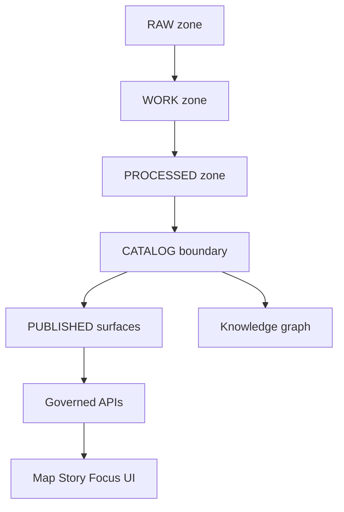

<!-- [KFM_META_BLOCK_V2]
doc_id: kfm://doc/c4e998ba-a5d8-4f5a-b400-6077c76151a5
title: Air Domain Pipelines
type: standard
version: v1
status: draft
owners: TBD
created: 2026-03-04
updated: 2026-03-04
policy_label: public
related: [
  "kfm://doc/<tbd-air-datasets>",
  "../../data/air-quality/README.md",
  "../../events/environmental/soil-air-ingestion-overview.md",
  "../../../src/pipelines/air_quality/fusion/"
]
tags: [kfm, air, pipelines]
notes: [
  "This file is the domain-level pipeline registry + contracts for Air.",
  "Claims are explicitly labeled CONFIRMED / PROPOSED / UNKNOWN."
]
[/KFM_META_BLOCK_V2] -->

# Air Domain Pipelines
One place to track *what the Air domain ingests/derives/publishes*, and the promotion gates that keep Air layers auditable.

> **Status:** draft  
> **Owners:** TBD  
> **Last updated:** 2026-03-04  
>
> **Jump to:** [Legend](#legend) · [Where this fits](#where-this-fits) · [Pipeline inventory](#pipeline-inventory) · [Lifecycle and promotion](#lifecycle-and-promotion) · [Pipeline specs](#pipeline-specs) · [Run receipts](#run-receipts) · [Definition of done](#definition-of-done) · [Open questions](#open-questions)

---

## Legend

KFM evidence discipline for this document:

- **CONFIRMED** — stated in existing KFM docs/specs (still may require repo/runtime verification).
- **PROPOSED** — design intent or suggested pattern; not yet verified as canonical.
- **UNKNOWN** — not found in available docs; includes the smallest verification step to confirm.

---

## Where this fits

**Purpose (this file):**
- Provide a **registry** of Air pipelines and their **inputs/outputs/contracts**.
- Encode **promotion gates** so Air layers can be trusted in Map/Story/Focus.

**Upstream/Downstream:**
- Upstream: public/environmental providers (OpenAQ, CAMS NRT, EPA AQS, AirNow, PurpleAir, HRRR-Smoke, etc.).
- Downstream: catalogs (STAC/DCAT/PROV), knowledge graph, governed APIs, Map UI, Story Nodes, Focus Mode.

**Related docs (expected to exist; verify if missing):**
- `../../data/air-quality/README.md` (module/runbook) — **CONFIRMED (doc referenced elsewhere), UNKNOWN (presence in this workspace)**
- `../../events/environmental/soil-air-ingestion-overview.md` (soil + air ingestion overview) — **CONFIRMED (referenced elsewhere), UNKNOWN (presence in this workspace)**
- `../../../src/pipelines/air_quality/fusion/` (PM2.5 fusion pipeline code/spec) — **CONFIRMED (documented path), UNKNOWN (presence in this workspace)**

---

## Acceptable inputs

Air-domain pipelines may ingest:

- **Point time-series** (stations/sensors): PM2.5, O₃, etc. (**PROPOSED**)
- **Modeled gridded fields** (rasters or cubes): CAMS NRT, HRRR-Smoke priors (**CONFIRMED for CAMS NRT and HRRR-Smoke as priors in the fusion spec; see pipeline spec**)
- **Derived analysis outputs**: fused PM2.5 “best estimate” surfaces, QC metrics, tiles, quicklooks (**CONFIRMED for PM2.5 fusion spec**)
- **Event geometries relevant to air impacts**: smoke plumes / alerts (**PROPOSED**; often owned by `events` or `hazards` domains)

---

## Exclusions

This folder should *not* define:

- “Weather” operational forecasting pipelines (belongs under `weather`/`met` domain) (**PROPOSED**)
- Long-horizon climate downscaling (belongs under `climate` domain) (**PROPOSED**)
- Road/infra incidents (belongs under `transportation` domain) (**PROPOSED**)

If you need cross-links, add them under **Related cross-domain pipelines** in this file.

---

## Pipeline inventory

> Interpretation note: this table tracks **documented intent** vs **runtime reality**.
> - “Doc status” can be CONFIRMED even when “Runtime status” is UNKNOWN.

| Pipeline ID | Doc status | Runtime status | Primary purpose | Main outputs | Notes / verification |
|---|---:|---:|---|---|---|
| `air.openaq_v3.ingest_harmonize` | **CONFIRMED** | **UNKNOWN** | Ingest OpenAQ v3 observations; normalize/harmonize into KFM | `air_quality.parquet` + graph entities | Verify: find pipeline code or orchestrator entry referencing OpenAQ v3; confirm output path and schema. |
| `air.cams_nrt.modeled_fields` | **CONFIRMED** | **UNKNOWN** | Fetch CAMS NRT modeled fields as “modeled” complement to sparse observations | `ModeledAirField` entities + provenance links | Verify: locate code writing `ModeledAirField` nodes and `source_id="cams-nrt"`. |
| `air.pm25_fusion.v0_3_0` | **CONFIRMED** | **UNKNOWN** | Daily PM2.5 fused analysis using priors + monitors + sensors | COG GeoTIFF + tiles + STAC/DCAT/PROV + metrics | Verify: confirm `src/pipelines/air_quality/fusion/` exists and `run_daily` entrypoint works. |
| `air.smoke_events.join` | **PROPOSED** | **UNKNOWN** | Fuse FIRMS → HMS → NWS CAP into smoke-event Items | STAC Collection `smoke-events` + run receipts | Likely owned by `events` domain; included here because smoke impacts air. Verify domain ownership + canonical location. |

---

## Lifecycle and promotion

### Required lifecycle zones

**CONFIRMED:** KFM uses a staged lifecycle to make “what is raw vs derived” explicit.



### Canonical directory intent

**CONFIRMED (global convention, but verify implementation):**
- Raw inputs land under `data/raw/<domain>/`
- Intermediate outputs under `data/work/<domain>/`
- Final outputs under `data/processed/<domain>/`
- Catalog “boundary artifacts” exist for publish: STAC, DCAT, PROV

**UNKNOWN:** some Air specs show domain-local catalog paths like `data/air-quality/stac/...` rather than the global `data/stac/...`.  
**Smallest verification step:** search repo for `data/stac/collections` and `data/air-quality/stac` and pick one canonical scheme; migrate or symlink the other.

---

## Pipeline specs

### air.openaq_v3.ingest_harmonize

**Doc status:** **CONFIRMED**  
**Runtime status:** **UNKNOWN** (verify in repo)

**What it does**
- **CONFIRMED:** KFM has adopted **OpenAQ v3** for air-quality ingestion (v1/v2 retired; v3 released 2025).  
- **CONFIRMED:** Normalizes units/schemas and can ingest into the knowledge graph.  
- **CONFIRMED:** Produces a harmonized table named `air_quality.parquet`.

**Inputs**
- OpenAQ v3 measurements + station/location metadata (**PROPOSED**: exact endpoints/filters)
- Optional: provider-level metadata for source attribution (**PROPOSED**)

**Outputs**
- `air_quality.parquet` (**CONFIRMED:** artifact name; **UNKNOWN:** exact path)
- Graph entities for stations/readings (**PROPOSED:** exact labels/properties)
- Catalog boundary artifacts (STAC/DCAT/PROV) (**PROPOSED:** expected, but verify)

**Governance rules**
- Keep “aggregator” provenance explicit: **PROPOSED** requirement to store original provider/source identifiers and license terms *per record batch*.

**Verification steps (smallest)**
1. `rg -n "openaq" src/ docs/`  
2. Confirm output artifact path for `air_quality.parquet`.  
3. Confirm STAC/DCAT/PROV emission on publish.

---

### air.cams_nrt.modeled_fields

**Doc status:** **CONFIRMED**  
**Runtime status:** **UNKNOWN**

**What it does**
- Fetches CAMS NRT modeled air-quality fields to fill spatial gaps where observations are sparse. (**CONFIRMED**)
- Stores modeled outputs as distinct entities:
  - `ModeledAirField` with `source_id="cams-nrt"` (**CONFIRMED**)
  - `DERIVED_FROM` relations linking modeled fields to observed inputs / sources (**CONFIRMED**)

**Inputs**
- CAMS NRT modeled fields (spatiotemporal grids) (**CONFIRMED source; UNKNOWN retrieval details**)

**Outputs**
- Knowledge graph `ModeledAirField` nodes + provenance links (**CONFIRMED**)
- Optional gridded artifacts (COGs, Zarr) (**PROPOSED**)

**Governance rules**
- **CONFIRMED (principle):** modeled data must not overwrite observed measurements; it must be separately typed and linked by provenance.

**Verification steps (smallest)**
1. Locate schema/ontology definition for `ModeledAirField`.  
2. Locate ingest job that writes `source_id="cams-nrt"` and `DERIVED_FROM`.

---

### air.pm25_fusion.v0_3_0

**Doc status:** **CONFIRMED**  
**Runtime status:** **UNKNOWN** (despite a documented quickstart)

**Spec anchor**
- Expected code/spec location: `src/pipelines/air_quality/fusion/` (**CONFIRMED**)
- Version: `v0.3.0` (**CONFIRMED**)
- Last updated: `2026-01-06` (**CONFIRMED**)

**What it does (high level)**
- Produces a *daily* fused PM2.5 analysis over Kansas using:
  - Model priors: CAMS NRT + HRRR-Smoke (**CONFIRMED**)
  - Observations: EPA AQS monitors + PurpleAir (corrected/QC’d) (**CONFIRMED**)
- Includes QC gating, bias correction, assimilation (EnKF), and publishes analysis rasters + catalogs. (**CONFIRMED**)

**Primary outputs**
- GeoTIFF analysis grid with COG + overviews (**CONFIRMED**)
- Tiles + quicklooks (**CONFIRMED**)
- STAC Item per day with assets including `{cog, quicklook, priors, qc, metrics.json}` (**CONFIRMED**)
- DCAT dataset (rolling window) (**CONFIRMED**)
- PROV bundle per day/run referencing entities (CAMS, HRRR, AQS, PurpleAir) and activities (fetch, qc, bias, enkf) (**CONFIRMED**)
- Minimal metrics logged via OpenTelemetry (**CONFIRMED**)
- Kill-switch / rollback behavior for publishing last-good output (**CONFIRMED**)

**Suggested output layout (from spec)**
- `data/air-quality/processed/pm25_fusion/<YYYY>/<DOY>/...` (**CONFIRMED**)
- Validation scripts appear as:
  - `scripts/validate_stac.py`
  - `scripts/validate_prov.py`
  (**CONFIRMED in spec text; UNKNOWN if scripts exist in repo**)

**Operational knobs (from spec)**
- Env vars:
  - `PA_READ_KEY`
  - `KFM_AIRQ_FUSION_DISABLE`
  - `KFM_AIRQ_FUSION_ROLLBACK_TAG`
  (**CONFIRMED**)

**Quickstart (dev)**
> If the entrypoint differs in-repo, treat the snippet below as **PROPOSED** and update.

```bash
# creds
export PA_READ_KEY="xxxxx"
export KFM_AIRQ_FUSION_DISABLE=0
export KFM_AIRQ_FUSION_ROLLBACK_TAG=""

# run
python -m src.pipelines.air_quality.fusion.run_daily \
  --as-of "2026-01-06T18:00:00Z" \
  --config src/pipelines/air_quality/fusion/config.yaml
```

**Verification steps (smallest)**
1. Confirm `src/pipelines/air_quality/fusion/` exists.  
2. Run `python -m ...run_daily --help` and confirm config path.  
3. Confirm artifacts emitted to PROCESSED + catalogs validate.

---

### Related cross-domain pipelines

#### air.smoke_events.join

**Doc status:** **PROPOSED** (air-relevant; might be `events`-owned)  
**Runtime status:** **UNKNOWN**

**What it does**
- Creates smoke-event features by joining:
  - FIRMS VIIRS points → HMS smoke polygons → NWS CAP alerts (**PROPOSED**, but fully specified as a pattern)
- Emits run receipts and fail-closed promotion gates. (**PROPOSED**, consistent with KFM invariants)

**Key invariants (should apply if adopted)**
- Fail-closed publish if required provenance/checksums are missing.
- Promote RAW → WORK → PROCESSED only after geometry + join validation.
- Emit STAC/DCAT/PROV + per-run receipt.

**Verification step (smallest)**
- Decide domain ownership (`air` vs `events`) and register the pipeline under the correct domain registry; link here as “related”.

---

## Run receipts

**CONFIRMED:** pipelines should emit a minimal run receipt so downstream (especially Focus Mode) can cite the run, reproduce it, and enforce policy gates.

**Minimum recommended receipt fields (baseline)**
- `run_id`
- `pipeline_id` and/or `pipeline_sha256`
- `inputs[]` with `{name, url_or_uri, sha256}`
- `parameters` (redacted if sensitive)
- `artifacts[]` emitted (paths + checksums)
- `policy_version` and gate outcomes (**PROPOSED unless your policy engine already writes this**)

> **Rule:** If the receipt is missing or incomplete, publishing must fail closed. (**PROPOSED**, but consistent with KFM invariants)

---

## Definition of done

When you add or change an Air pipeline, it is not promotable unless:

- [ ] Dataset identity exists (stable dataset_id, versioning) (**PROPOSED**)
- [ ] Schema exists + validated (contract-first) (**PROPOSED**)
- [ ] License recorded (SPDX where possible) (**PROPOSED**)
- [ ] Sensitivity classification recorded (**PROPOSED**)
- [ ] Validation thresholds defined + enforced (with explicit pass/fail) (**PROPOSED**)
- [ ] PROV lineage emitted (inputs, transforms, tool versions) (**PROPOSED**)
- [ ] Checksums/integrity proofs emitted (inputs + outputs) (**PROPOSED**)
- [ ] Run receipt emitted + stored with artifacts (**CONFIRMED as a system pattern**)
- [ ] STAC + DCAT records emitted and validated (**PROPOSED**)
- [ ] Downstream policy boundary honored (no UI direct-to-storage) (**PROPOSED**)

---

## Open questions

- **UNKNOWN:** Should Air catalogs be domain-local (`data/air-quality/stac/...`) or global (`data/stac/...`)?  
  - Smallest verification step: pick canonical based on current master guide; migrate or symlink.
- **UNKNOWN:** Exact schema for `air_quality.parquet` (columns, units, QA flags).  
  - Smallest verification step: locate the file or its schema contract.
- **UNKNOWN:** Where is the authoritative Air domain module doc: `docs/data/air-quality/README.md` vs `docs/domains/air/*`?  
  - Smallest verification step: confirm which is canonical; link the other as an alias.

---

### Back to top
[Back to top](#air-domain-pipelines)
