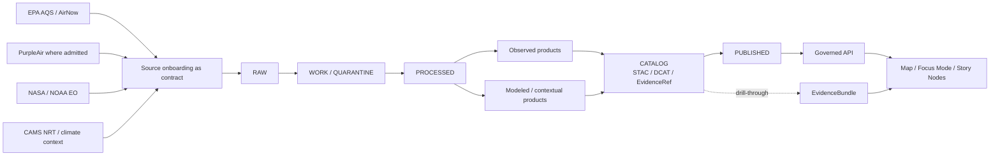

<!-- [KFM_META_BLOCK_V2]
doc_id: kfm://doc/NEEDS_UUID
title: KFM Air Domain
type: standard
version: v1
status: draft
owners: NEEDS_VERIFICATION
created: YYYY-MM-DD
updated: YYYY-MM-DD
policy_label: NEEDS_VERIFICATION
related: [docs/governance/ROOT_GOVERNANCE.md, docs/analyses/remote-sensing/README.md]
tags: [kfm, air, atmosphere, climate, smoke, remote-sensing]
notes: [Meta block fields remain placeholders until current repo metadata, ownership, and document registry values are surfaced and verified.]
[/KFM_META_BLOCK_V2] -->

# KFM Air Domain

Kansas-first domain guide for air quality, smoke, atmospheric context, and air-coupled earth observation under KFM’s governed evidence model.

> **Status:** Draft  
> **Owners:** NEEDS VERIFICATION  
>      
> **Quick jumps:** [Scope](#scope) · [Repo fit](#repo-fit) · [Inputs](#inputs) · [Quickstart](#quickstart) · [Usage](#usage) · [Diagram](#diagram) · [Definition of done](#definition-of-done) · [FAQ](#faq)

> [!IMPORTANT]
> This README covers the `air` directory as the air-facing slice of KFM’s broader atmosphere lane. In the mounted session used to draft this file, current repo topology, live connectors, tests, manifests, and deployments were **not** directly reverified. Anything implementation-shaped is therefore marked **INFERRED** or **NEEDS VERIFICATION** rather than presented as settled repo fact.

## Scope

This directory is for domain-facing documentation that explains how KFM handles:

- air quality observations
- smoke and atmospheric context
- climate-adjacent air interpretation
- air-coupled earth observation
- release and publication burdens for public-safe air products

### What this README is for

This file should help maintainers answer four questions quickly:

1. What counts as “air” in KFM?
2. Which source families belong to this lane?
3. What domain-specific burdens must stay visible at release time?
4. What does **not** belong here?

### Domain boundary

KFM’s broader lane is not limited to regulatory monitor readings. The governing lane spans **atmosphere, air quality, climate, earth observation, elevation, and scientific extension**. In practice, `docs/domains/air/` is the most natural place to document the air-facing subset of that broader lane: pollutant observations, smoke context, atmospheric masking, calibration rules, and air-coupled release guidance.

## Status map

| Area | Status | Reading rule |
|---|---:|---|
| Broader atmosphere lane exists in KFM doctrine | **CONFIRMED** | Treat as stable domain framing |
| Air is a strong follow-on lane after hydrology | **CONFIRMED** | Good candidate for near-term domain expansion |
| File-level relation to remote-sensing readiness material | **CONFIRMED** | This README is already named as a related doc in attached project material |
| Specific object names like `AirObservation` or `ModeledAirField` | **INFERRED** | Useful cues, but verify against current repo before hardening |
| Current directory contents, tests, workflows, manifests | **UNKNOWN** | Do not imply mounted implementation depth |

## Repo fit

| Item | Value |
|---|---|
| Path | `docs/domains/air/README.md` |
| Role | Domain anchor for the air-facing slice of KFM’s broader atmosphere lane |
| Upstream doctrine | [`../../governance/ROOT_GOVERNANCE.md`](../../governance/ROOT_GOVERNANCE.md) |
| Adjacent analysis | [`../../analyses/remote-sensing/README.md`](../../analyses/remote-sensing/README.md) |
| Downstream consumers | Governed APIs, trust-visible map surfaces, Focus Mode, Story Nodes, and released STAC/DCAT assets |

> [!NOTE]
> The two related links above are included because attached project material explicitly names them alongside this README. Their current in-repo presence still needs direct re-verification in a mounted checkout.

## Inputs

### Accepted inputs

| Source family | Status | What belongs here | What must stay visible |
|---|---:|---|---|
| EPA AQS | **CONFIRMED** | Regulatory air-quality measurements and monitor context | Method, time basis, unit, and release scope |
| AirNow | **CONFIRMED** | Public-facing air-quality context and index-oriented products | Freshness basis and distinction from raw monitor measurements |
| PurpleAir **where admitted** | **CONFIRMED** | Community-sensor inputs admitted under explicit rules | Calibration basis, admission policy, and support limits |
| NASA / NOAA EO products | **CONFIRMED** | Smoke, drought context, satellite-derived conditions, atmospheric context layers | Acquisition date, processing method, and support semantics |
| 3DEP / USGS elevation | **CONFIRMED** | Terrain and elevation context for scientific interpretation | That it is contextual terrain support, not an air observation |
| OpenAQ v3 API | **INFERRED** | Harmonized Kansas air-observation intake | Verify current connector and schema against mounted repo |
| CAMS NRT | **INFERRED** | Modeled atmospheric fields used for gap fill or contextual support | Must remain visibly modeled, not silently merged into observations |

### Air-coupled remote-sensing inputs

The attached readiness-tile draft shows a concrete air-adjacent pattern in which atmospheric conditions gate whether downstream NDVI-style outputs are safe to emit.

| Source | Role in that pattern |
|---|---|
| `ABI L2 CMIP` | Cloud and radiance context |
| `HMS Smoke` | Smoke classification |
| `MAIAC AOD` | Aerosol density |
| `HRRR Smoke` | Near-term plume prediction |

These belong here when the air lane is being used to support smoke masking, AOD-aware readiness, or other governed release decisions for earth-observation products.

## Exclusions

| Does **not** belong here | Why | Goes instead |
|---|---|---|
| Raw vendor blobs or monitor dumps without descriptor, rights posture, or time basis | KFM treats onboarding as a contract, not a download | `RAW` or `WORK / QUARANTINE` |
| Silent blends of observed and modeled air data | Observation and model layers must remain decomposable | Separate derived product with explicit lineage |
| Emergency-alert or public-warning logic | The corpus bounds this lane toward historical and analytical context, not on-the-fly public warning | Hazard / operational alert surfaces |
| Generic NDVI computation steps | Air may influence readiness, but NDVI computation itself is not this lane’s job | Remote-sensing analysis docs |
| Unverified community-sensor “truth” | Admitted community sensors still need visible calibration and support limits | Quarantine, review, or clearly labeled derived outputs |
| Unresolved rights / sensitivity / provenance cases | Public-safe release cannot start from ambiguous admissibility | Review-bearing staging materials |

## Directory tree

```text
docs/
└── domains/
    └── air/
        ├── README.md   # this file
        └── …           # current directory contents NEEDS VERIFICATION
```

## Quickstart

### When adding a new air-domain artifact

1. Declare the source family first.
2. Mark whether the data is **observed**, **modeled**, or **derived**.
3. Record time basis, spatial support, method, and calibration state.
4. Route the material through the KFM truth path.
5. Register public-safe outputs only after metadata and evidence closure.

### Minimal descriptor shape

The example below is **illustrative**. It is intentionally conservative and should be adapted to whatever descriptor contract the mounted repo actually uses.

```json
{
  "source_id": "NEEDS_VERIFICATION",
  "source_class": "regulatory_observation | community_sensor | satellite | model | contextual_scientific_layer",
  "observation_basis": "observed | modeled | derived",
  "time_basis": "observation_time | acquisition_time | issue_time | valid_time",
  "calibration_basis": "NEEDS_VERIFICATION",
  "rights_posture": "NEEDS_VERIFICATION",
  "evidence_ref": "kfm://evidence/NEEDS_VERIFICATION"
}
```

### Fast maintainer checklist

- Does the artifact say whether it is observed, modeled, or derived?
- Is the time basis explicit?
- Are calibration and admission rules visible where community sensors are involved?
- Are modeled fields still visibly separate from observations?
- Is there a path from public output back to `EvidenceRef -> EvidenceBundle`?

## Usage

### 1. Observation-facing products

Use this directory for rules and reference material around:

- pollutant observations
- station metadata
- monitor-network interpretation
- public-safe summaries that still preserve method and time clarity

This is the right place to describe the boundary between regulatory measurements, community sensors, and harmonized observation views.

### 2. Model and context products

Use this directory to document how KFM handles:

- smoke context layers
- atmospheric model fields
- drought-context products when they inform air interpretation
- terrain or elevation context used to sharpen atmospheric reasoning

The core rule is simple: **modeled products must not quietly impersonate observations**.

### 3. Air-coupled earth observation

Air is not only a standalone lane. It also acts as a release constraint on other products.

Typical cases include:

- smoke masking for imagery interpretation
- aerosol-aware readiness decisions
- earth-observation products that must abstain when atmospheric contamination is too high

If an analysis needs smoke, AOD, or forecast-plume logic before it can publish, document the air-side burdens here and the product-side logic in the relevant analysis README.

### 4. Trust-visible surface behavior

Public-facing air products should inherit KFM’s normal trust posture:

- governed API delivery rather than direct canonical-store reads
- evidence drill-through
- visible uncertainty or abstention
- correction-friendly release behavior
- no bluffing when evidence or admissibility is insufficient

### 5. Illustrative object families

The names below are useful **INFERRED** cues from attached repo-grounded material. Keep them provisional until direct repo inspection confirms them.

| Term | Status | Intended role |
|---|---:|---|
| `AirObservation` | **INFERRED** | Individual pollutant reading with value, unit, timestamp, and location |
| `SensorNode` | **INFERRED** | Monitoring-station metadata |
| `SourceNetwork` | **INFERRED** | Operating network or agency |
| `ParameterUnit` | **INFERRED** | Normalized pollutant and unit reference |
| `ModeledAirField` | **INFERRED** | Modeled atmospheric field kept distinct from observations |

## Diagram



## Burden matrix

| Burden | What must be explicit | Why it matters |
|---|---|---|
| Method visibility | Regulatory, model, satellite, and community-sensor pathways | Air data sources do not carry the same trust weight |
| Time basis | Observation, acquisition, issue, valid, and as-of times where relevant | Atmospheric interpretation is time-sensitive |
| Calibration | Especially for community sensors and fused products | “Where admitted” is not the same as “automatically authoritative” |
| Observed vs modeled split | Separate assets, records, or graph nodes | Prevents silent truth inflation |
| Rights and admissibility | Source posture before release | KFM admits governed resources, not inert files |
| Public posture | Historical / analytical context, not alert theater | Keeps the lane bounded and reviewable |
| Correction path | Supersession, narrowing, or withdrawal must remain visible | Atmospheric products can change with revised support or calibration |

## Definition of done

- [ ] Source family declared
- [ ] Observation basis marked as observed, modeled, or derived
- [ ] Time basis documented
- [ ] Spatial support documented
- [ ] Calibration or admission logic documented where relevant
- [ ] Rights posture and provenance path declared
- [ ] Observation/model distinction preserved in data and prose
- [ ] Public-safe release surface identified
- [ ] Evidence drill-through route identified
- [ ] Air-coupled remote-sensing constraints documented when smoke/AOD gating is involved
- [ ] Adjacent docs updated when this lane changes shared burdens

## FAQ

### Is this directory only for regulatory air-quality data?

No. In KFM doctrine, the broader lane includes air quality, smoke, drought context, satellite-derived conditions, elevation, terrain, and other contextual scientific layers.

### Can community-sensor data be published here?

Yes, but only **where admitted** and only with visible calibration, time basis, and support limits.

### Can modeled products fill gaps in sparse-monitor areas?

Yes, but they must remain explicitly modeled and traceable. They should not quietly replace observations.

### Is this lane an operational public-warning system?

No. The attached corpus frames air and atmospheric use primarily as historical and analytical context, not as on-the-fly public warning.

### Does this README prove the current repo already has these connectors and objects?

No. Current repo topology and implementation depth were not directly mounted in this session. The README preserves doctrine confidently and implementation shape cautiously.

## Appendix

<details>
<summary><strong>Evidence posture for this file</strong></summary>

This README deliberately separates three layers:

| Layer | What it means here |
|---|---|
| **CONFIRMED** | Broader atmosphere-lane doctrine, representative source families, publication burden, and the fact that this README is already named in attached project material |
| **INFERRED** | Repo-grounded implementation cues such as specific object names, OpenAQ/CAMS normalization flow, and concrete graph-facing terms |
| **UNKNOWN** | Current directory contents, ownership metadata, tests, workflows, manifests, deployments, and live runtime depth |

</details>

<details>
<summary><strong>Suggested future companions</strong></summary>

These are reasonable next docs for the air lane, but they are not asserted here as current repo facts:

- source-family registry for air inputs
- calibration and admission note for community sensors
- modeled-vs-observed publication rule
- smoke/AOD readiness profile
- correction and stale-visible runbook for air products

</details>

[Back to top](#kfm-air-domain)
