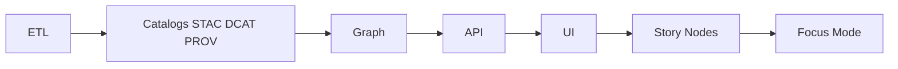
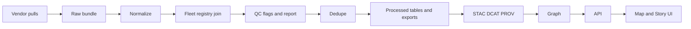

<!-- [KFM_META_BLOCK_V2]
doc_id: kfm://doc/2d0f2d4b-28b8-4c83-90ef-1be7adf9bb02
title: Air Domain
type: standard
version: v1
status: draft
owners: [TBD Air Domain Steward, Docs]
created: 2026-03-04
updated: 2026-03-04
policy_label: public
related:
  - ../../MASTER_GUIDE_v13.md
  - ../../governance/ROOT_GOVERNANCE.md
  - ../../../data/air-quality/
tags: [kfm, domain, air, air-quality, atmosphere]
notes:
  - This is a domain-level index/runbook entry point. It should point to canonical data/run artifacts in /data and /src.
[/KFM_META_BLOCK_V2] -->

# Air Domain
Domain documentation for **atmospheric and air-quality evidence** in Kansas Frontier Matrix (KFM): what belongs in the domain, how it fits the governed pipeline, and how to publish air-related datasets safely.

> **Status:** draft (experimental)  
> **Owners:** TBD (Air Domain Steward) • Docs  
> **Badges:**     
>
> **Quick links:**  
> - [Scope](#scope) • [Where it fits](#where-it-fits-in-kfm) • [Inputs](#acceptable-inputs) • [Exclusions](#exclusions)  
> - [Directory tree](#directory-tree) • [Quickstart](#quickstart) • [Dataset matrix](#dataset-matrix)  
> - [Artifacts and contracts](#required-artifacts-and-contracts) • [Diagrams](#diagrams) • [Gates](#promotion-gates-definition-of-done) • [FAQ](#faq)

---

## Evidence labels
KFM requires “cite-or-abstain” behavior. This README uses the following labels:

- **CONFIRMED** — explicitly required by governing KFM pipeline/contract docs.
- **PROPOSED** — described in drafts/notes; intended pattern but not yet verified in repo state.
- **UNKNOWN** — not evidenced in available docs; needs verification before treating as true.

> IMPORTANT: If something here is **PROPOSED** or **UNKNOWN**, do **not** implement/publish it as if it were established without completing the verification steps in [Verification checklist](#verification-checklist).

---

## Scope

### In scope
- **CONFIRMED:** Governing documentation for how air/atmospheric datasets move through KFM’s non-negotiable pipeline (ETL → catalogs → graph → API → UI → Story Nodes → Focus Mode).  
- **PROPOSED:** Air-quality observation ingestion (multi-source) and publication patterns, including QA/QC flags, deterministic dedupe, and provenance-first promotion.
- **PROPOSED:** Atmospheric model “gap-fill” evidence products (model-derived fields published as distinct, traceable artifacts).

### Out of scope
- **CONFIRMED:** Storing raw/processed data *inside* `docs/` (docs are not a data lake).  
- **PROPOSED:** Forward-looking air-quality forecasting products (this domain focuses on evidence products with provenance, not forecasts).  
- **UNKNOWN:** Any domain-specific UI design beyond what KFM’s governed API surfaces allow.

[Back to top](#air-domain)

---

## Where it fits in KFM

### Canonical pipeline placement
- **CONFIRMED:** KFM pipeline ordering is inviolable:  
  `ETL → STAC/DCAT/PROV catalogs → Graph → API → UI → Story Nodes → Focus Mode`
- **CONFIRMED:** The UI must **never** query the graph directly; all access must cross the governed API boundary.

### Canonical repo homes (expected)
This domain doc lives in `docs/` and *points to* canonical locations:

- **PROPOSED:** Data lifecycle for the air-quality dataset family:
  - `data/raw/<domain>/` — verbatim source pulls
  - `data/work/<domain>/` — intermediate normalized frames and QC outputs
  - `data/processed/<domain>/` — publishable outputs (GeoParquet/PMTiles/etc.)
- **CONFIRMED:** Publication boundary artifacts (required before downstream use):
  - `data/stac/` (STAC collections/items)
  - `data/catalog/dcat/` (DCAT dataset entries)
  - `data/prov/` (PROV lineage bundles)

### Suggested cross-links
If present in your repo, link these as the domain’s “source of truth” documents:

- `../../MASTER_GUIDE_v13.md` (canonical pipeline + invariants)
- `../../governance/ROOT_GOVERNANCE.md` (review gates, roles, redaction/classification policy)
- `../../events/environmental/soil-air-ingestion-overview.md` (air/soil ingestion overview) **(UNKNOWN: verify file exists)**

[Back to top](#air-domain)

---

## Acceptable inputs
What belongs **in this directory (`docs/domains/air/`)**:

- **CONFIRMED:** Runbook-style documentation that explains contracts, gates, and “where things go” (no raw data).
- **PROPOSED:** Source inventories (what feeds exist, what they contain, licensing notes).
- **PROPOSED:** Domain ADRs (design decisions that affect air ingestion/QC/provenance).
- **PROPOSED:** Mapping notes describing how “observed” vs “modeled” air evidence is represented and kept distinct.

---

## Exclusions
What must **not** go here:

- **CONFIRMED:** No raw dumps, parquet tiles, or large binaries inside `docs/`.
- **CONFIRMED:** No secrets (API keys, tokens), even in examples.
- **CONFIRMED:** No unsourced narrative claims. Narrative belongs in governed Story Nodes with evidence refs.
- **CONFIRMED:** No direct-to-DB patterns in docs or client code; all access must use governed APIs.
- **CONFIRMED:** No inference or publication of sensitive locations if sensitivity is unclear—fail closed and route to governance review.

[Back to top](#air-domain)

---

## Directory tree

Current minimum:

```text
docs/domains/air/
└── README.md
```

Planned additions (do not assume present):

- **PROPOSED:** `docs/domains/air/sources/` — source inventories and licensing notes
- **PROPOSED:** `docs/domains/air/runbooks/` — operational playbooks (ingest, validate, promote)
- **PROPOSED:** `docs/domains/air/adr/` — domain-level ADRs
- **PROPOSED:** `docs/domains/air/contracts/` — pointers to schemas/OpenAPI extensions (canonical files live in `/schemas` and `/docs/templates`)

---

## Quickstart

### 1) Run an air-quality ingest lane (example)
> PSEUDOCODE: adjust dataset slugs/targets to match your repo tooling.

```bash
# bootstrap toolchain (example)
make bootstrap

# dry-run ingest + validate (example)
make ingest dataset=air-quality/example mode=dryrun
make validate dataset=air-quality/example

# attest + preview (example)
make attest dataset=air-quality/example keyless=true
make preview dataset=air-quality/example open=true
```

### 2) Operational flow (domain pattern)
> This is the intended pattern for air-quality ETL → publish.

1. **PROPOSED:** Acquire raw feeds and store verbatim under `data/air-quality/raw/{vendor}/YYYY/MM/DD/`.
2. **PROPOSED:** Normalize to a common observation schema (timestamp, device IDs, lat/lon, pollutants, met fields, QA flags).
3. **PROPOSED:** Join against a **fleet registry** (canonical hardware identity).
4. **PROPOSED:** Run QC checks (range, drift, humidity correction), producing a QC report artifact (never silently drop).
5. **PROPOSED:** Deterministic dedupe using stable keys and tolerance windows.
6. **PROPOSED:** Export/publish via SensorThings (or equivalent), idempotently upserting Things/Sensors/Datastreams.
7. **CONFIRMED:** Emit STAC/DCAT/PROV before any graph/UI usage.
8. **CONFIRMED:** Apply governance/attestation and fail closed on policy/schema/QA failures.

[Back to top](#air-domain)

---

## Dataset matrix
This matrix is **documentation-level intent** (not proof of implementation).

| Source / Product | Evidence type | Typical variables | Proposed raw path | Publication note | Status |
|---|---|---|---|---|---|
| OpenAQ (v3) | Observed (aggregated) | PM2.5, PM10, O₃, NO₂, etc. | `data/air-quality/raw/openaq/` | Normalize + QC + publish as versioned dataset | PROPOSED |
| PurpleAir | Observed (low-cost sensors) | PM2.5, PM10 (+ met) | `data/air-quality/raw/purpleair/` | Requires QC flags + correction models | PROPOSED |
| AirNow | Observed (feeds) | AQI, pollutant measures | `data/air-quality/raw/airnow/` | Treat as distinct upstream source with license notes | PROPOSED |
| EPA AQS | Observed (reference monitors) | Regulatory pollutant measures | `data/air-quality/raw/aqs/` | Useful for calibration/ground-truth QC | PROPOSED |
| CAMS NRT | Modeled (gap-fill) | Modeled PM2.5, O₃, etc. | `data/air-quality/raw/cams-nrt/` | Must remain **distinct** from observed data (DERIVED_FROM links) | PROPOSED |

> NOTE: Add license + sensitivity fields per row before promotion to PUBLISHED.

---

## Required artifacts and contracts
KFM treats “boundary artifacts” as required before anything is considered published/consumable downstream.

| Artifact | Stage | Canonical location | Gate | Status |
|---|---|---|---|---|
| Raw vendor bundle | RAW | `data/raw/air-quality/...` | Integrity checks + immutability expectations | PROPOSED |
| Normalized tables (e.g., GeoParquet) | WORK/PROCESSED | `data/work/air-quality/...` and/or `data/processed/air-quality/...` | Schema validation + determinism | PROPOSED |
| QC report | WORK/PROCESSED | `data/work/air-quality/.../qc_report.*` | Required when QC runs | PROPOSED |
| STAC Collection + Item(s) | PUBLISHED boundary | `data/stac/...` | Schema/profile validation | CONFIRMED |
| DCAT dataset entry | PUBLISHED boundary | `data/catalog/dcat/...` | Discovery + distribution links | CONFIRMED |
| PROV bundle | PUBLISHED boundary | `data/prov/...` | End-to-end lineage | CONFIRMED |
| Evidence resolver output (EvidenceBundle) | API boundary | served via API | Must be policy-checked, auditable | CONFIRMED |
| Promotion manifest + run receipt | Promotion | release or run ledger | Must include digests, policy label, QA status | CONFIRMED |

---

## Diagrams

### A) KFM pipeline (non-negotiable)


### B) Air-quality ingest pattern (intended)


[Back to top](#air-domain)

---

## Promotion gates definition of done
A dataset or evidence artifact must not be promoted unless it passes these gates.

### Required gates (checklist)
- [ ] **CONFIRMED:** Identity + versioning are present (dataset version ID + deterministic spec hash).
- [ ] **CONFIRMED:** Artifacts exist with **digests** and recorded media types.
- [ ] **CONFIRMED:** STAC/DCAT/PROV are schema-valid and cross-links resolve.
- [ ] **CONFIRMED:** Policy label assigned; default-deny tests pass.
- [ ] **CONFIRMED:** QA/validation reports present; failures quarantined.
- [ ] **CONFIRMED:** Audit run receipt emitted; approvals captured where required.
- [ ] **CONFIRMED:** Any UI exposure uses governed APIs; no bypass to graph/storage.

### Verification checklist
Smallest steps to convert key **UNKNOWN/PROPOSED** items into **CONFIRMED**:

1. Confirm whether `data/air-quality/` exists and matches the documented lifecycle layout.
2. Confirm whether `src/pipelines/air_quality/` exists and which scripts are canonical for ingest/normalize/QC/publish.
3. Confirm whether `schemas/air/` exists and which schema versions are enforced in CI.
4. Locate the canonical Air Quality runbook (often referenced as `docs/data/air-quality/README.md`) and link it here.
5. Confirm governance classification defaults for citizen sensor locations and any redaction/generalization obligations.

---

## FAQ

### How do we handle modeled air fields vs observed sensor readings?
- **PROPOSED:** Keep modeled fields as distinct entities/assets (e.g., “ModeledAirField”) and link them to observations via explicit derivation relationships instead of mixing values into the same observation stream.

### Where should raw OpenAQ / PurpleAir / AirNow / AQS pulls go?
- **PROPOSED:** Store verbatim pulls under `data/air-quality/raw/{vendor}/YYYY/MM/DD/` so the raw layer is immutable and auditable.

### Can the UI read the air dataset directly from the graph or storage?
- **CONFIRMED:** No. The UI must access evidence only through governed APIs that apply policy and redaction.

---

<details>
<summary><strong>Appendix: QC/dedupe pseudocode snippet</strong></summary>

> PSEUDOCODE: illustrative glue for QC flags + deterministic keys.

```python
# Assumes df: normalized records
df["qc_flags"] = df.apply(lambda r: qc_check(r), axis=1)

# vendor jitter smoothing
df["ts_rounded"] = df["timestamp"].dt.round("1min")

# deterministic key: hardware + property + rounded time
df["key"] = (
  df["hardware_id"].astype(str) + "::" +
  df["observed_property"].astype(str) + "::" +
  df["ts_rounded"].astype(str)
)

# choose preferred record per key (policy: lowest qc severity, stable tie-breakers)
df["sev"] = df["qc_flags"].apply(severity_score)
df = (
  df.sort_values(["key", "sev", "firmware", "vendor_priority"])
    .drop_duplicates("key", keep="first")
)
```

</details>

---

## Version history
| Version | Date | Notes |
|---|---:|---|
| v1 | 2026-03-04 | Initial `docs/domains/air/` README scaffold (draft). |

[Back to top](#air-domain)
