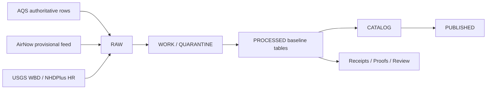
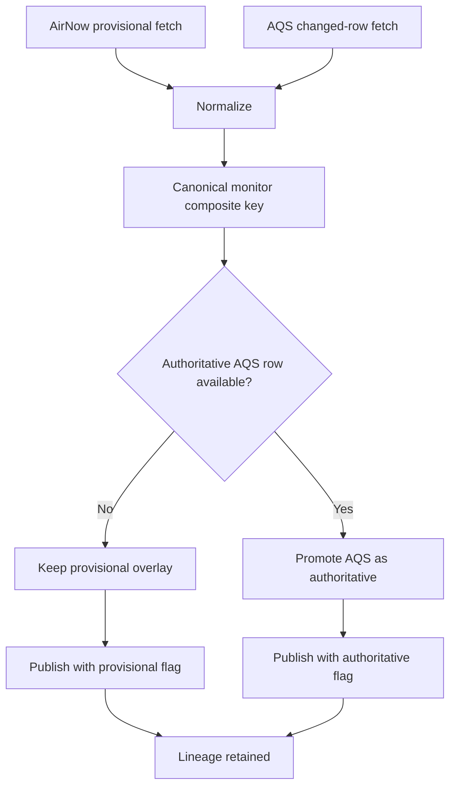

<!-- [KFM_META_BLOCK_V2]
doc_id: kfm://doc/<NEEDS-VERIFICATION-UUID>
title: Kansas Air Quality Baseline Specification (AQS + AirNow + Hydrologic Join)
type: standard
version: v1
status: draft
owners: NEEDS VERIFICATION
created: YYYY-MM-DD
updated: YYYY-MM-DD
policy_label: public
related: [README.md, docs/README.md, docs/domains/README.md, docs/domains/air/README.md, docs/domains/hydrology/README.md, data/README.md, pipelines/README.md]
tags: [kfm, air, aqs, airnow, hydrology, provenance]
notes: [Target path was not supplied in the task; this draft assumes a proposed child document under docs/domains/air/. Current public-main implementation depth for an AQS/AirNow lane remains NEEDS VERIFICATION.]
[/KFM_META_BLOCK_V2] -->

# 🌎 Kansas Air Quality Baseline Specification  
A KFM-aligned handling model for authoritative air baselines, provisional overlays, and watershed-aware spatial joins.

> **Status:** draft  
> **Owners:** NEEDS VERIFICATION  
> **Path target:** `docs/domains/air/aqs-airnow-hydrologic-baselines.md` **(PROPOSED)**  
> **Repo fit:** child domain specification beneath `docs/domains/air/`  
> **Upstream:** `docs/domains/air/README.md`, `docs/domains/hydrology/README.md`, `data/README.md`, `pipelines/README.md`  
> **Downstream:** future contracts, schemas, ETL lanes, catalog entries, receipts, and review gates for Kansas air-quality packaging


**Quick jumps:** [Scope](#scope) · [Repo fit](#repo-fit) · [Source profile](#source-profile) · [Authority posture](#authority-posture) · [Join strategy](#canonical-identity--join-strategy) · [Data model](#canonical-record-shape) · [Governance](#governance--promotion) · [Definition of done](#definition-of-done) · [Appendix](#appendix)

> [!IMPORTANT]
> This file is written as a **repo-ready domain specification**, not as proof that a public-main AQS/AirNow pipeline already exists. Where current public-main implementation is not visible, this document marks the path or behavior as **PROPOSED** or **NEEDS VERIFICATION**.

> [!CAUTION]
> **AQS is the authoritative baseline. AirNow is a provisional overlay.** AirNow can support current-state interpretation and public-health context, but it must never silently replace the regulatory record.

---

## Scope

This document defines how Kansas Frontier Matrix should assemble and govern a Kansas air-quality baseline that combines:

- **EPA AQS** for validated, regulatory-grade baseline measurements
- **AirNow** for preliminary, near-real-time overlay values
- **USGS hydrologic units** for watershed-aware aggregation and contextual joins

It is intended to answer four practical questions:

1. What belongs in the air baseline lane?
2. Which source wins when AQS and AirNow disagree or differ in maturity?
3. How should monitor identity and hydrologic joins be handled?
4. Which receipts, checks, and publication gates are required before downstream use?

---

## Repo fit

### Why this looks like a child domain spec

The current public-main repository visibly contains an `air` domain directory and uses domain-local Markdown to define lane purpose, boundaries, and operating rules. Public-main also shows strong child-spec patterns under adjacent domains such as hydrology. This file therefore fits best as a **new air-domain child document**, not as a replacement for the root repo README or a speculative pipeline README.

### Proposed placement

```text
docs/
└── domains/
    ├── air/
    │   ├── README.md                                  # current public-main file
    │   ├── atmosphere/
    │   │   └── README.md                             # current public-main placeholder
    │   └── aqs-airnow-hydrologic-baselines.md        # PROPOSED target for this document
    └── hydrology/
        └── README.md
```

### Current public-main evidence snapshot

| Item | Status | Notes |
|---|---|---|
| `docs/domains/air/` exists | **CONFIRMED** | Air lane exists on current public main |
| `docs/domains/air/atmosphere/README.md` exists | **CONFIRMED** | Public-main placeholder visible |
| Child-spec pattern under adjacent domains | **CONFIRMED** | Hydrology documents provide the strongest style match |
| A checked-in public-main AQS/AirNow pipeline path | **NEEDS VERIFICATION** | Not surfaced in the currently visible public `pipelines/` tree |
| Exact target filename for this document | **INFERRED** | User did not provide a path; this draft proposes one |

---

## Accepted inputs

This document is for **source and packaging guidance** covering:

- AQS monitor/site metadata
- AQS sample-level or daily pollutant data
- AQS QA and revision/change-window fields
- AirNow current observations and monitor-site overlays
- Watershed indexing via **WBD HUC12**
- Optional flow-network enrichment via **NHDPlus HR**
- Kansas-specific station crosswalk metadata where formally documented
- Receipts, manifests, hashes, proof objects, and review requirements tied to this lane

---

## Exclusions

This document does **not** define or authorize:

- regulatory determinations or compliance judgments
- forecast modeling as a substitute for measured baseline
- uncited public claims from provisional data alone
- undocumented fusion of AQS and AirNow into a single “truth” field
- silent replacement of watershed units with political boundaries
- a checked-in execution path that has not been surfaced from the repo
- a public-facing product that hides freshness, provisionality, or evidence posture

**Put elsewhere instead:**

- **Forecasts / smoke outlooks / transport risk models:** climate, hazards, or logistics documentation
- **UI behavior and presentation:** shell or visualization docs
- **Machine-enforced contracts:** `contracts/`, `schemas/`, and policy bundles once verified
- **Operational runbooks:** `pipelines/` or lane runbooks after execution paths are confirmed

---

## Directory context

This file assumes the KFM truth path and public-main data structure already visible in the repo.



### Placement consequences

- Raw fetches belong to **RAW**
- normalization, reconciliation, and QA belong to **WORK / QUARANTINE**
- authoritative baseline tables belong to **PROCESSED**
- STAC / DCAT / PROV package surfaces belong to **CATALOG**
- public-safe releases belong to **PUBLISHED**
- receipts, proofs, and review artifacts must remain inspectable and linked

---

## Source profile

| Source family | Role in this lane | Truth label | Expected use |
|---|---|---:|---|
| **EPA AQS** | authoritative measurements, monitor metadata, QA/revision-aware baseline | **CONFIRMED backbone** | baseline record, trendable measurements, regulatory-grade history |
| **AirNow** | preliminary, near-real-time operational overlay | **CONFIRMED secondary** | current context, AQI/NowCast-style overlays, provisional status |
| **USGS WBD HUC12** | watershed aggregation frame | **CONFIRMED primary spatial index** | stable environmental rollups independent of political boundaries |
| **USGS NHDPlus HR** | optional hydrologic network reference | **CONFIRMED optional enrichment** | network-aware joins, catchment or flowline context when needed |
| **KDHE or other state network metadata** | possible crosswalk aid | **INFERRED / NEEDS VERIFICATION** | align local station labels to federal identifiers if formally documented |

---

## Authority posture

### Source precedence inside this lane

| Precedence | Source | Why it wins |
|---:|---|---|
| 1 | **AQS** | validated, revision-aware, authoritative baseline |
| 2 | **AirNow** | preliminary overlay for timeliness, not regulation |
| 3 | **Derived products** | useful only when their upstream evidence remains visible and inspectable |

### Consequence-bearing handling rules

1. **AQS rows are the baseline record.**  
   They should populate the canonical long-horizon measurement layer.

2. **AirNow rows are provisional.**  
   They can appear in current-state views, but must carry freshness and provisionality flags.

3. **When an AQS row arrives for the same monitor/parameter/POC/time context, it supersedes the provisional AirNow representation.**  
   The old provisional record should not be erased without lineage; its replacement should remain traceable.

4. **Hydrologic enrichment is contextual, not sovereign.**  
   Watershed joins add environmental structure; they do not redefine the source truth of a pollutant measurement.

5. **Public-facing summaries must remain explicit about basis.**  
   Users should be able to tell whether a number is authoritative, provisional, or derived.

---

## Canonical identity & join strategy

### Monitor identity

The baseline should center a stable **monitor composite** key shaped as:

```text
<state_code>-<county_code>-<site_number>-<parameter_code>-<POC>
```

Example:

```text
20-173-0050-88101-1
```

### Why this matters

AQS and AirNow can both expose monitor-related records, but they do not serve the same purpose or maturity level. A stable composite key lets KFM:

- reconcile provisional and authoritative records deterministically
- preserve multiple instruments for the same pollutant via **POC**
- avoid flattening different monitors into one ambiguous “site” record
- keep resumable changed-row harvesting and replacement logic simple

### Secondary keys to retain

Keep these as support fields, not primary identity:

- latitude / longitude
- local agency or network labels
- state dashboard station names
- internal fetch IDs
- reporting-area labels from public AQI products

### Hydrologic join policy

> [!NOTE]
> Use **HUC12** as the primary watershed aggregation frame.  
> Use **NHDPlus HR `NHDPlusID`** when current hydrologic network linkage is needed.  
> Reserve **legacy `COMID`** only for explicitly documented NHDPlus V2 crosswalks or downstream dependencies that still require it.

---

## Recommended acquisition pattern

### 1. AQS harvest

Harvest AQS in a way that preserves revision history and avoids unnecessary full reloads.

**Preferred components**

- monitor/site metadata
- sample-level observations where row-level detail matters
- daily summaries where the product requires day-grain packaging
- change-window pulls using AQS change filters

**Expected handling**

- loop year-by-year when endpoint constraints require calendar-year partitioning
- keep request parameters and credentials out of published artifacts
- preserve returned row count and payload digest in the run receipt

### 2. AirNow harvest

Use AirNow as a **current-state overlay**, not as the regulatory record.

**Expected handling**

- fetch current or near-real-time observations needed for overlays
- keep provisional feed metadata
- capture AirNow freshness and fetch time explicitly
- store NowCast or AQI values as **derived/provisional context**, not as baseline replacements

### 3. Hydrologic enrichment

Attach environmental spatial context after source normalization.

**Preferred sequence**

1. standardize monitor geometry
2. intersect with **WBD HUC12**
3. optionally associate nearest or intersecting **NHDPlus HR** feature context
4. write watershed-aware rollup fields
5. keep the original monitor point intact

---

## Reconciliation pattern



### Reconciliation rule of thumb

- **No AQS match yet:** keep the AirNow row as provisional
- **AQS match exists:** publish the AQS row as authoritative and mark the AirNow row as superseded or reconciled
- **Conflicting metadata:** prefer AQS for authoritative monitor identity, while preserving source-specific context in lineage fields

---

## Canonical record shape

A minimal lane-level record model should preserve source maturity and spatial context.

| Field | Purpose | Notes |
|---|---|---|
| `state_code` | AQS monitor key segment | string |
| `county_code` | AQS monitor key segment | string |
| `site_number` | AQS monitor key segment | string |
| `parameter_code` | pollutant identity | 5-digit code |
| `poc` | instrument occurrence | preserve even when only one seems present |
| `observation_time` | time of record | timezone-aware |
| `basis` | truth posture | `authoritative` \| `provisional` \| `derived` |
| `value` | measured or reported value | numeric |
| `unit` | display and analysis unit | preserve source unit |
| `aqi_value` | public-health index if present | optional; mostly AirNow/current-state |
| `qa_flag` | quality or interpretive flag | source-specific |
| `source_system` | origin system | `AQS` \| `AirNow` |
| `source_uri` | fetch or source reference | provenance |
| `spec_hash` | canonical request/schema digest | provenance |
| `payload_sha256` | payload digest | provenance |
| `returned_row_count` | fetch-level sanity | provenance |
| `huc12` | watershed rollup key | preferred hydrologic unit |
| `nhdplus_id` | optional current HR network join | optional |
| `comid_legacy` | optional legacy crosswalk | only if intentionally documented |
| `freshness_basis` | interpretation aid | fetch time, source update time, or both |
| `lineage_status` | reconciliation visibility | `raw` \| `reconciled` \| `superseded` |

---

## Example run receipt payload

```json
{
  "lane": "air.baseline.kansas",
  "run_id": "2026-04-08T00:00:00Z-air-baseline-001",
  "spec_hash": "sha256:<NEEDS_VERIFICATION>",
  "source_requests": [
    {
      "source": "AQS",
      "endpoint": "dailyData/bySite",
      "params": {
        "state": "20",
        "param": "88101",
        "cbdate": "20260401",
        "cedate": "20260408"
      },
      "payload_sha256": "sha256:<NEEDS_VERIFICATION>",
      "returned_row_count": 0
    },
    {
      "source": "AirNow",
      "endpoint": "<NEEDS_VERIFICATION>",
      "params": {
        "state": "KS"
      },
      "payload_sha256": "sha256:<NEEDS_VERIFICATION>",
      "returned_row_count": 0
    }
  ],
  "spatial_enrichment": {
    "wbd_huc12_version": "<NEEDS_VERIFICATION>",
    "nhdplus_hr_version": "<NEEDS_VERIFICATION>"
  },
  "validation": {
    "status": "pending",
    "checks": [
      "schema",
      "canonical-key",
      "freshness",
      "provisional-vs-authoritative-basis",
      "hydrologic-join"
    ]
  }
}
```

---

## Governance & promotion

### Required outputs per run

Every material run in this lane should emit:

- a **run receipt**
- an **evidence bundle reference**
- normalized work artifacts
- reviewable diff or summary where promotion matters
- STAC / DCAT / PROV catalog records when publishable
- clear public-safe outcome semantics for downstream interfaces

### Minimum governance rules

1. **Provisional and authoritative records must stay distinguishable.**
2. **Every fetch must be resumable and auditable.**
3. **Changed-row harvesting should prefer stable request contracts and explicit hashes.**
4. **Hydrologic joins must not erase original monitor identity.**
5. **Promotion should fail closed when source evidence, schema, or lineage is incomplete.**

### Promotion posture

| Gate | Purpose | Expected outcome |
|---|---|---|
| Source receipt complete | proves what was fetched | pass / block |
| Schema and type checks | prevents malformed lane outputs | pass / block |
| Key integrity | preserves monitor identity | pass / block |
| Basis visibility | prevents silent AQS/AirNow flattening | pass / block |
| Freshness visibility | prevents ambiguous “current” claims | pass / block |
| Hydrologic join sanity | prevents false spatial context | pass / block |
| Catalog integrity | ensures published discoverability and provenance | pass / block |

---

## Runtime behavior

Downstream KFM surfaces using this lane should emit finite governed outcomes:

- `ANSWER` — enough evidence and basis visibility exists
- `ABSTAIN` — insufficient or ambiguous source support
- `DENY` — policy or rights posture blocks use
- `ERROR` — system/runtime failure

### Lane-specific interpretation rule

A public or steward surface using this air baseline should not answer as though it has a settled record when:

- only provisional AirNow data is available and the user is asking for authoritative history
- freshness is unclear
- the monitor cannot be reconciled confidently
- hydrologic enrichment failed or is missing where the product requires it

---

## Quickstart shape (documentation-level)

This is a **documentation-level** quickstart, not a claim about a checked-in public-main execution path.

```bash
# 1) Fetch authoritative changed rows from AQS
# 2) Fetch provisional current overlay from AirNow
# 3) Normalize to canonical monitor composite key
# 4) Join HUC12 (and optional NHDPlus HR context)
# 5) Emit receipt + work artifact + publishable catalog records
```

### Pseudocode sketch

```python
def monitor_key(row):
    return f"{row['state_code']}-{row['county_code']}-{row['site_number']}-{row['parameter_code']}-{row['poc']}"

def reconcile(airnow_rows, aqs_rows):
    aqs_index = {monitor_key(r): r for r in aqs_rows}
    for row in airnow_rows:
        key = monitor_key(row)
        if key in aqs_index:
            yield {"basis": "authoritative", **aqs_index[key]}
        else:
            yield {"basis": "provisional", **row}
```

---

## Task list

### Thin-slice build order

- [ ] Confirm the target path and owning maintainers
- [ ] Add or verify a lane-level README link from `docs/domains/air/README.md`
- [ ] Define the lane contract for canonical monitor identity
- [ ] Define the run receipt schema for AQS/AirNow reconciliation
- [ ] Add source descriptors for AQS, AirNow, WBD HUC12, and optional NHDPlus HR
- [ ] Add validation fixtures for authoritative/provisional basis handling
- [ ] Add one hydrology-aware promotion example with HUC12 attached
- [ ] Add one negative-path example showing `ABSTAIN` when only provisional context exists
- [ ] Add one reviewable proof object for publication readiness
- [ ] Confirm whether a public-main or private execution path already exists before documenting code locations

---

## Definition of done

This document is complete enough to merge when:

- [ ] the target path is confirmed
- [ ] owners and dates are replaced with grounded values
- [ ] adjacent docs link to it cleanly
- [ ] AQS/AirNow precedence is explicit and consistent throughout
- [ ] HUC12 / NHDPlus HR guidance is clear and non-conflicting
- [ ] no section implies a checked-in pipeline that has not been verified
- [ ] at least one future contract or schema path is linked once confirmed
- [ ] the file reads naturally alongside existing KFM domain docs

---

## FAQ

### Why not use AirNow alone?

Because AirNow is valuable for **timeliness**, not for the authoritative regulatory record.

### Why not treat hydrologic context as optional decoration?

Because watershed-aware aggregation is one of the environmental framing moves that makes this lane fit KFM rather than a generic station table.

### Why HUC12 first?

Because hydrologic units provide a stable environmental aggregation frame that is not tied to county lines or other political boundaries.

### Why mention `NHDPlusID` and `COMID` separately?

Because the current high-resolution NHDPlus line uses **`NHDPlusID`**, while **`COMID`** is a legacy identifier from older NHDPlus contexts. Treating them as interchangeable without documentation invites drift.

### Does this file prove a live air pipeline exists on public main?

No. It defines the lane shape KFM should enforce and marks current public-main execution depth as **NEEDS VERIFICATION** where direct repo evidence is absent.

---

## Appendix

<details>
<summary><strong>Parameter starter set</strong></summary>

| Pollutant | Parameter code | Notes |
|---|---:|---|
| PM2.5 Local Conditions | `88101` | common baseline starter |
| Ozone | `44201` | common baseline starter |

</details>

<details>
<summary><strong>Suggested lane labels</strong></summary>

| Label | Use |
|---|---|
| `authoritative` | validated AQS-backed measurement |
| `provisional` | current AirNow-backed overlay |
| `derived` | AQI / NowCast / rollup / anomaly output |
| `reconciled` | provisional row formally mapped to authoritative source |
| `superseded` | kept only for lineage, not active truth |

</details>

<details>
<summary><strong>Reference links</strong></summary>

- [AQS API]
- [AirNow About the Data]
- [AirNow API]
- [AQS Pollutant Summaries]
- [WBD]
- [NHDPlus HR]

[AQS API]: https://aqs.epa.gov/aqsweb/documents/data_api.html
[AirNow About the Data]: https://www.airnow.gov/about-the-data
[AirNow API]: https://docs.airnowapi.org/webservices
[AQS Pollutant Summaries]: https://www.epa.gov/aqs/aqs-pollutant-summaries
[WBD]: https://www.usgs.gov/national-hydrography/watershed-boundary-dataset
[NHDPlus HR]: https://www.usgs.gov/core-science-systems/ngp/national-hydrography/nhdplus-high-resolution

</details>

[Back to top](#-kansas-air-quality-baseline-specification)
