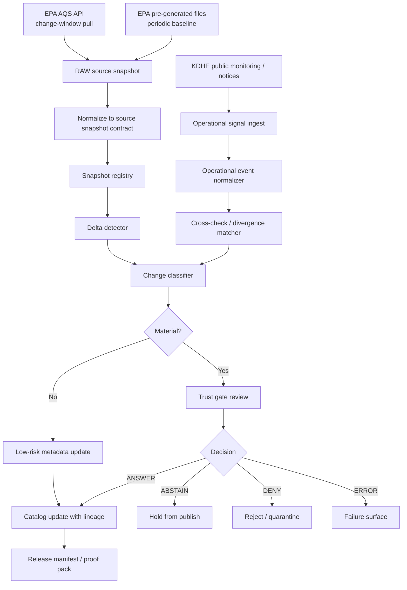
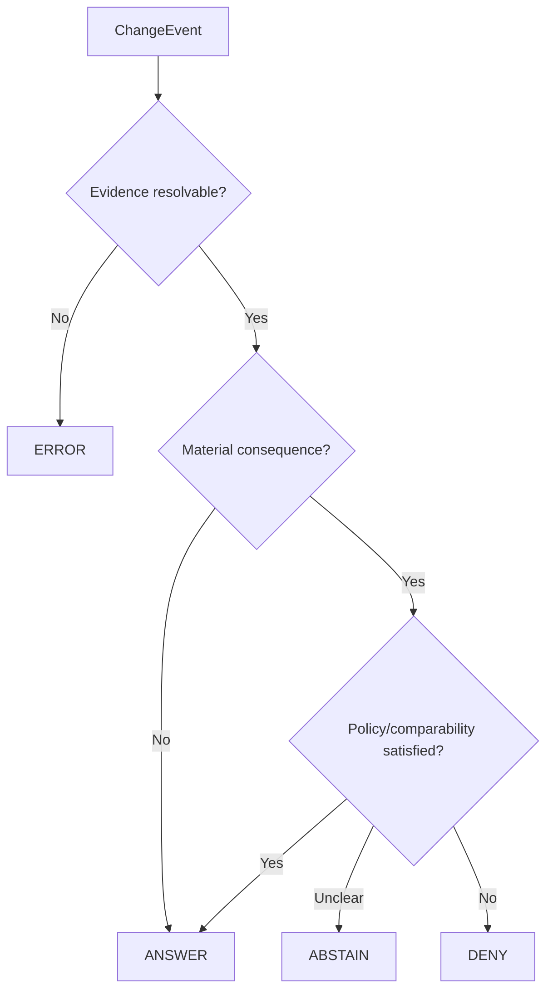

<!--
doc_id: NEEDS VERIFICATION
title: EPA AQS Delta Ingestion and Trust-Gated Publication Spec
type: standard
version: v1
status: draft
owners: [@bartytime4life, NEEDS VERIFICATION]
created: 2026-04-02
updated: 2026-04-02
policy_label: public
related: [
  docs/domains/README.md,
  docs/governance/ROOT_GOVERNANCE.md,
  docs/governance/ETHICS.md,
  docs/domains/air/README.md,
  docs/domains/air/atmosphere/NEEDS_VERIFICATION
]
tags: [kfm, air, atmosphere, epa, aqs, kdhe, delta-ingestion, trust-visible, provenance]
notes: [
  Path placement is PROPOSED and needs in-repo verification,
  Owners and related links need confirmation against mounted repo,
  External source behavior is cited; implementation status inside KFM is not claimed
]
-->

# EPA AQS Delta Ingestion and Trust-Gated Publication Spec

One-line purpose: define a KFM-governed ingestion pattern for EPA AQS and Kansas state monitoring signals that captures only material changes, preserves lineage, and gates publication on visible evidence.

**Status:**      
**Owners:** @bartytime4life, **NEEDS VERIFICATION**  
**Quick links:** [Scope](#scope) · [Repo fit](#repo-fit) · [Inputs](#accepted-inputs) · [Exclusions](#exclusions) · [Architecture](#architecture) · [Change classes](#change-classes) · [Decision model](#decision-model) · [Quickstart](#quickstart) · [Task list](#task-list)

---

## Scope

This specification defines a **delta-first, trust-gated ingestion workflow** for ambient air monitoring metadata and related operational signals, centered on the U.S. EPA Air Quality System (AQS) API and optionally cross-checked against Kansas Department of Health and Environment (KDHE) public monitoring signals.

The design goal is straightforward:

- detect **only what changed**
- distinguish **material** changes from low-risk corrections
- preserve **historical lineage**
- avoid quiet publication of non-comparable or spatially invalid data
- expose uncertainty and review decisions instead of hiding them

**CONFIRMED:** EPA AQS API v2 is the primary EPA interface for row-level AQS data, and AQS contains ambient sample data, monitoring station descriptive information, geographic location, and quality information. :contentReference[oaicite:0]{index=0}

**CONFIRMED:** AQS supports `cbdate` and `cedate` filters keyed to each record’s “date of last change,” allowing change-window retrieval. `cbdate` returns records changed on or after the supplied date; `cedate` returns records changed on or before the supplied date. :contentReference[oaicite:1]{index=1}

**CONFIRMED:** KDHE publishes current AQI and hourly averaged air monitoring data and explicitly warns that the public-facing values have not yet undergone final QA review. :contentReference[oaicite:2]{index=2}

> [!IMPORTANT]
> This document is a **specification**, not a claim that the pipeline is already implemented in KFM. Where repository implementation cannot be verified in-session, items are marked **PROPOSED** or **NEEDS VERIFICATION**.

[Back to top](#epa-aqs-delta-ingestion-and-trust-gated-publication-spec)

---

## Repo fit

**PROPOSED path:** `docs/domains/air/atmosphere/aqs-delta-pipeline.md`

| Field | Value |
|---|---|
| Domain lane | Air / atmosphere |
| Upstream sources | EPA AQS API, AQS pre-generated data files, KDHE public monitoring pages |
| Downstream consumers | Catalog/provenance systems, domain watchers, publication manifests, trust-visible UI surfaces |
| Adjacent docs | `docs/domains/air/README.md` **NEEDS VERIFICATION** |
| Governance anchors | `docs/governance/ROOT_GOVERNANCE.md`, `docs/governance/ETHICS.md` |

### Why this belongs here

This spec sits at the intersection of:

- **domain ingestion**
- **governed publication**
- **evidence-visible change detection**
- **authoritative-vs-operational source reconciliation**

It is therefore not just an ETL note; it is a domain standard with governance consequences.

[Back to top](#epa-aqs-delta-ingestion-and-trust-gated-publication-spec)

---

## Accepted inputs

The pipeline accepts the following inputs.

| Input | Type | Status | Notes |
|---|---|---:|---|
| EPA AQS API row-level responses | JSON | CONFIRMED | AQS API is the primary row-level interface. :contentReference[oaicite:3]{index=3} |
| EPA AQS pre-generated files | Flat files / downloads | CONFIRMED | EPA publishes pre-generated files and notes the same data is available via the API. :contentReference[oaicite:4]{index=4} |
| EPA monitor/site metadata extracts | JSON / tabular | INFERRED | Endpoint-specific use in KFM needs implementation verification. |
| KDHE Air Monitoring Data page | HTML / operational signal | CONFIRMED | Current AQI and hourly averages; not final QA-certified. :contentReference[oaicite:5]{index=5} |
| KDHE annual network plans / assessments | Documents | CONFIRMED | KDHE exposes annual plan/archive navigation on the public monitoring page. :contentReference[oaicite:6]{index=6} |
| Internal KFM snapshot store | Versioned records | PROPOSED | Required by this design; repo implementation not verified. |
| Internal KFM catalog / evidence contracts | Structured metadata | INFERRED | Consistent with KFM doctrine; specific schemas need repo confirmation. |

### Accepted temporal patterns

- **Scheduled delta pulls** using AQS change-window filters (`cbdate`, `cedate`)
- **Periodic full snapshots** for rollback, diffing, and lineage support
- **Event-side checks** against KDHE public operational signals where useful

[Back to top](#epa-aqs-delta-ingestion-and-trust-gated-publication-spec)

---

## Exclusions

This specification does **not** cover:

- real-time public AQI serving or forecasting
- sensor fusion with non-authoritative third-party consumer sensors
- regulatory interpretation of attainment or nonattainment
- raw sample-value QA/QC methodology beyond change-gating implications
- public map styling or dashboard UX beyond trust-visible status requirements
- automated publication of all observed deltas without review

> [!CAUTION]
> EPA notes that AQS does **not** contain real-time air quality data and may lag collection by six months or more. Real-time public operations must not treat AQS as a live feed. :contentReference[oaicite:7]{index=7}

[Back to top](#epa-aqs-delta-ingestion-and-trust-gated-publication-spec)

---

## Directory shape

**PROPOSED** directory shape for domain documentation and companion artifacts:

```text
docs/domains/air/
├── README.md                                  # NEEDS VERIFICATION
└── atmosphere/
    ├── aqs-delta-pipeline.md                  # this spec
    ├── comparability-rules.md                 # PROPOSED
    ├── source-roster.md                       # PROPOSED
    ├── kdhe-operational-signals.md            # PROPOSED
    └── schemas/                               # PROPOSED
        ├── decision-envelope.schema.json
        ├── evidence-bundle.schema.json
        ├── source-snapshot.schema.json
        └── change-event.schema.json
```

[Back to top](#epa-aqs-delta-ingestion-and-trust-gated-publication-spec)

---

## Architecture

This pipeline is intentionally split between **authoritative ingestion**, **snapshot comparison**, and **publication gating**.



### Design principles

| Principle | Meaning in this spec |
|---|---|
| Evidence before publication | Every consequential change must resolve to a visible evidence path. |
| Delta over blind refresh | Prefer change-window pulls and snapshot diffs over destructive replacement. |
| Authoritative subordination | Derived catalog state remains subordinate to authoritative source state unless explicitly promoted. |
| Correction lineage | Site/monitor supersession, relocation, narrowing, or retirement must preserve lineage. |
| Operational signals are advisory | KDHE public operational pages may corroborate or warn, but do not silently override authoritative EPA history. |

[Back to top](#epa-aqs-delta-ingestion-and-trust-gated-publication-spec)

---

## Source behavior and trust posture

### EPA AQS

**CONFIRMED:** AQS contains ambient sample data, monitor descriptive information, geographic location, and sample quality information. :contentReference[oaicite:8]{index=8}

**CONFIRMED:** AQS change filtering is supported through `cbdate` and `cedate`, each based on the value’s date of last change. :contentReference[oaicite:9]{index=9}

**CONFIRMED:** EPA also offers pre-generated files for users who want large extracts. :contentReference[oaicite:10]{index=10}

### KDHE

**CONFIRMED:** KDHE’s public monitoring page presents current AQI and hourly data. :contentReference[oaicite:11]{index=11}

**CONFIRMED:** KDHE warns those public values are not yet finally quality-assured and may include invalid data due to outages or equipment malfunction. :contentReference[oaicite:12]{index=12}

### KFM source precedence

| Source class | Role | Publication authority |
|---|---|---|
| EPA AQS authoritative metadata/history | Canonical historical network metadata | High |
| EPA pre-generated files | Bulk baseline / reconciliation | High |
| KDHE public monitoring pages | Operational corroboration / divergence signal | Medium |
| Internal KFM derived layers | Convenience, indexing, watch surfaces | Subordinate |

> [!NOTE]
> This precedence model is **INFERRED** from KFM doctrine and aligned with “derived layers remain subordinate to authoritative truth unless explicitly promoted.”

[Back to top](#epa-aqs-delta-ingestion-and-trust-gated-publication-spec)

---

## Data model

This spec proposes four core contracts.

| Contract | Purpose | Status |
|---|---|---:|
| `SourceSnapshot` | Exact capture of source-visible metadata at a pull time | PROPOSED |
| `ChangeEvent` | Normalized description of a detected delta | PROPOSED |
| `DecisionEnvelope` | Finite publication outcome with rationale | INFERRED |
| `EvidenceBundle` | Resolvable evidence path for review and release | INFERRED |

### Minimal `SourceSnapshot`

```json
{
  "source_name": "epa_aqs",
  "snapshot_id": "NEEDS_VERIFICATION",
  "captured_at": "2026-04-02T12:00:00Z",
  "source_window": {
    "cbdate": "20260326",
    "cedate": "20260402"
  },
  "entity_type": "monitor",
  "entity_key": "state-county-site-parameter-poc",
  "payload_hash": "sha256:NEEDS_VERIFICATION",
  "payload": {}
}
```

### Minimal `ChangeEvent`

```json
{
  "change_id": "NEEDS_VERIFICATION",
  "entity_key": "state-county-site-parameter-poc",
  "detected_at": "2026-04-02T12:05:00Z",
  "change_class": "METHOD_CHANGE",
  "severity": "high",
  "previous_snapshot_id": "NEEDS_VERIFICATION",
  "current_snapshot_id": "NEEDS_VERIFICATION",
  "diff_summary": {
    "field": "method_code",
    "from": "88101",
    "to": "88502"
  }
}
```

### Minimal `DecisionEnvelope`

```json
{
  "decision_id": "NEEDS_VERIFICATION",
  "change_id": "NEEDS_VERIFICATION",
  "decision": "ABSTAIN",
  "reason_code": "COMPARABILITY_REVIEW_REQUIRED",
  "evidence_refs": [
    "kfm://evidence/source-snapshot/prev",
    "kfm://evidence/source-snapshot/curr"
  ],
  "review_status": "pending"
}
```

### Minimal `EvidenceBundle`

```json
{
  "bundle_id": "NEEDS_VERIFICATION",
  "change_id": "NEEDS_VERIFICATION",
  "members": [
    {"type": "source_snapshot", "ref": "kfm://..."},
    {"type": "normalized_diff", "ref": "kfm://..."},
    {"type": "external_signal", "ref": "kfm://...", "optional": true}
  ]
}
```

[Back to top](#epa-aqs-delta-ingestion-and-trust-gated-publication-spec)

---

## Change classes

The system must classify deltas semantically, not just syntactically.

| Change class | Trigger | Default severity | Default gate |
|---|---|---:|---|
| `SITE_CREATED` | New site appears | medium | review |
| `SITE_RETIRED` | Existing site disappears or is marked inactive | medium | review |
| `MONITOR_CREATED` | New monitor/POC appears | medium | review |
| `MONITOR_RETIRED` | Monitor/POC disappears or is retired | medium | review |
| `LOCATION_SHIFT_MINOR` | Coordinates changed but within small threshold | medium | review |
| `LOCATION_SHIFT_MATERIAL` | Coordinates changed beyond material threshold | high | hold |
| `METHOD_CHANGE` | `method_code` or materially equivalent method metadata changed | high | hold |
| `PARAMETER_REASSIGNMENT` | Parameter/POC continuity changes | high | hold |
| `NAME_OR_TEXT_EDIT` | Station or monitor descriptive text changed only | low | auto-accept candidate |
| `AGENCY_OR_OPERATOR_CHANGE` | Agency/operator field changed | medium | review |
| `STATUS_CHANGE` | Active/inactive/suspended changed | high | review |
| `UNKNOWN_SCHEMA_DRIFT` | New or missing fields disrupt interpretation | high | fail visible |

### Materiality thresholds

The values below are **PROPOSED defaults** and should be treated as policy-controlled, not hard-coded truth.

| Rule | Proposed threshold | Rationale |
|---|---:|---|
| Material lat/lon movement | `> 250 m` | Large enough to signal likely relocation rather than numeric cleanup |
| Minor coordinate edit | `<= 250 m` | Still reviewable where siting matters |
| Method change | any change in `method_code` | Comparability may break even if parameter remains constant |
| POC continuity risk | any reassignment affecting published series identity | Avoid silent series discontinuity |

> [!WARNING]
> The `250 m` relocation threshold is a **PROPOSED policy default**, not an EPA rule cited here. It requires domain-owner confirmation before enforcement.

[Back to top](#epa-aqs-delta-ingestion-and-trust-gated-publication-spec)

---

## Comparability rules

Method and monitor continuity changes are where silent breakage is most likely.

**CONFIRMED:** EPA API examples explicitly include PM2.5 parameter codes `88101` and `88502` in summary-data requests. :contentReference[oaicite:13]{index=13}

This spec therefore requires a dedicated comparability layer.

### Required comparability checks

| Check | Why it matters |
|---|---|
| `method_code` changed | Instrument or method equivalence may differ |
| `method_name` changed materially | Method family or certification posture may have changed |
| parameter code changed | Series identity may no longer be comparable |
| POC changed | Apparent continuity may hide instrument-channel replacement |
| collocation context changed | Historical comparability may need interpretation |
| site moved | Time-series continuity may remain but spatial interpretation may not |

### Default action policy

| Condition | Action |
|---|---|
| Pure text edit only | auto-accept candidate |
| Method code changed | require review |
| Parameter or POC continuity changed | require review |
| Material relocation + active publication dependency | hold publish |
| Unknown change shape | abstain or error |

[Back to top](#epa-aqs-delta-ingestion-and-trust-gated-publication-spec)

---

## Decision model

This spec adopts KFM’s finite outcome model.



### Decision meanings

| Decision | Meaning |
|---|---|
| `ANSWER` | Publish/update is allowed; lineage and evidence remain attached |
| `ABSTAIN` | System cannot safely resolve comparability or truth; do not publish quietly |
| `DENY` | Change conflicts with policy or trusted interpretation |
| `ERROR` | Pipeline failure, schema break, or unresolved evidence path |

### Review rules

A human review step is **PROPOSED** for:

- method changes
- material coordinate changes
- lifecycle transitions affecting published products
- any divergence between authoritative EPA history and KDHE operational signals that cannot be reconciled automatically

[Back to top](#epa-aqs-delta-ingestion-and-trust-gated-publication-spec)

---

## Delta workflow

### Weekly operating rhythm

1. pull AQS deltas using `cbdate` / `cedate`
2. write immutable raw snapshots
3. normalize into `SourceSnapshot`
4. compare against previous accepted snapshot
5. emit `ChangeEvent` records
6. classify severity and materiality
7. consult KDHE operational signals where relevant
8. issue `DecisionEnvelope`
9. update catalog only on allowed outcomes
10. publish release manifest / proof pack

### Snapshot cadence

| Snapshot type | Proposed cadence | Purpose |
|---|---|---|
| delta pull | daily or weekly | catch recent changes efficiently |
| full baseline snapshot | weekly or monthly | rollback, reconciliation, drift detection |
| release snapshot | per publication | exact evidence for published state |

> [!TIP]
> A delta-only pipeline should still maintain periodic full baselines. Deltas reduce cost; baselines preserve recoverability.

[Back to top](#epa-aqs-delta-ingestion-and-trust-gated-publication-spec)

---

## KDHE operational cross-checks

KDHE public monitoring signals should be treated as **operational corroboration**, not silent truth replacement.

### Suggested uses

- detect apparent outages or temporary anomalies before final AQS history catches up
- corroborate smoke-event or operational disruptions
- flag divergence when an AQS site appears stable but state operational pages suggest interruption
- attach operational context to `EvidenceBundle`

### Guardrails

| Guardrail | Rule |
|---|---|
| no silent override | KDHE public page does not replace authoritative AQS metadata history |
| keep QA distinction visible | KDHE current values are not final certified data |
| attach as evidence, not truth promotion | operational signals enrich review, not automatic sovereignty |
| preserve divergence | if EPA and KDHE differ, record the mismatch visibly |

**CONFIRMED:** KDHE explicitly states its public monitoring values are for awareness, not final certified data. :contentReference[oaicite:14]{index=14}

[Back to top](#epa-aqs-delta-ingestion-and-trust-gated-publication-spec)

---

## Provenance and lineage requirements

Every accepted or withheld change must preserve enough provenance to answer:

- what changed
- when it changed
- which source exposed the change
- what evidence supported the interpretation
- whether publication was allowed, held, denied, or failed
- what prior state was superseded

### Mandatory provenance fields

| Field | Requirement |
|---|---|
| source identifier | required |
| source query window | required |
| snapshot timestamp | required |
| prior snapshot reference | required when diffed |
| normalized entity key | required |
| diff summary | required |
| decision outcome | required |
| evidence references | required |
| release association | required for publication |

[Back to top](#epa-aqs-delta-ingestion-and-trust-gated-publication-spec)

---

## Failure modes

The pipeline should fail **calmly but visibly**.

| Failure mode | Expected behavior |
|---|---|
| EPA API unavailable | emit visible error state; do not synthesize missing truth |
| schema drift in source payload | quarantine parse result; open visible error |
| duplicate entity identity | abstain or error until resolved |
| conflicting relocation interpretation | hold publish |
| KDHE divergence without resolution | attach divergence and abstain where consequential |
| evidence bundle cannot be built | error and block publication |

### Non-goals during failure

Do **not**:

- backfill guessed values
- silently continue with stale metadata
- overwrite historical accepted snapshots with unresolved source output
- imply comparability where review did not occur

[Back to top](#epa-aqs-delta-ingestion-and-trust-gated-publication-spec)

---

## Security and policy considerations

This lane is public-data oriented, but governance still matters.

| Concern | Requirement |
|---|---|
| source authenticity | use official EPA and KDHE sources only |
| derived layer sovereignty | keep derived indices subordinate to source truth |
| policy visibility | show holds, denials, and uncertainty rather than suppressing them |
| correction law | preserve supersession lineage rather than destructive replacement |
| public interpretation | distinguish observed, derived, and operational-but-unreviewed values |

[Back to top](#epa-aqs-delta-ingestion-and-trust-gated-publication-spec)

---

## Quickstart

This section is **PROPOSED** and describes the operating sequence, not a verified script path.

### 1) Establish a baseline snapshot

```bash
# PROPOSED command shape — implementation path NEEDS VERIFICATION
python scripts/air/aqs_snapshot.py \
  --source epa_aqs \
  --mode baseline \
  --output data/raw/air/aqs/baseline/
```

### 2) Pull change-window deltas

```bash
# PROPOSED command shape — implementation path NEEDS VERIFICATION
python scripts/air/aqs_snapshot.py \
  --source epa_aqs \
  --mode delta \
  --cbdate 20260326 \
  --cedate 20260402 \
  --output data/raw/air/aqs/delta/2026-04-02/
```

### 3) Classify and gate

```bash
# PROPOSED command shape — implementation path NEEDS VERIFICATION
python scripts/air/aqs_classify.py \
  --input data/raw/air/aqs/delta/2026-04-02/ \
  --previous data/catalog/air/aqs/latest.json \
  --emit-change-events \
  --emit-decision-envelopes
```

### 4) Publish only allowed outcomes

```bash
# PROPOSED command shape — implementation path NEEDS VERIFICATION
python scripts/air/aqs_publish.py \
  --decision answer \
  --build-release-manifest \
  --build-proof-pack
```

[Back to top](#epa-aqs-delta-ingestion-and-trust-gated-publication-spec)

---

## Example decision table

| Example | Observed delta | Outcome | Why |
|---|---|---|---|
| typo fix in site name | text-only change | `ANSWER` | low consequence |
| lat/lon changed 12 m | minor coordinate edit | `ABSTAIN` or review | spatial meaning still matters |
| lat/lon changed 1.4 km | likely relocation | `ABSTAIN` | published spatial continuity is at risk |
| PM2.5 method code changed | method change | `ABSTAIN` | comparability review required |
| site retired | lifecycle change | `ANSWER` after review | valid if lineage preserved |
| source payload loses expected key | schema drift | `ERROR` | cannot trust normalization |
| KDHE page shows outage but AQS unchanged | divergence | `ABSTAIN` when consequential | operational mismatch needs visible handling |

[Back to top](#epa-aqs-delta-ingestion-and-trust-gated-publication-spec)

---

## Task list

- [ ] Confirm final path under `docs/domains/air/` **NEEDS VERIFICATION**
- [ ] Confirm adjacent domain README and owners **NEEDS VERIFICATION**
- [ ] Create JSON schemas for `SourceSnapshot`, `ChangeEvent`, `DecisionEnvelope`, `EvidenceBundle`
- [ ] Decide policy thresholds for location materiality
- [ ] Define allowed/required reviewers for method and relocation changes
- [ ] Document parameter/method comparability policy for PM2.5 and ozone
- [ ] Implement immutable raw snapshot storage
- [ ] Implement diff engine with field-level materiality rules
- [ ] Add visible failure surfaces for abstain/deny/error outcomes
- [ ] Add release manifest / proof pack emission
- [ ] Add KDHE operational signal watcher
- [ ] Add tests for lifecycle, relocation, method change, and schema drift cases

### Definition of done

This spec is ready to move from draft when:

1. path and ownership are verified in-repo  
2. schemas exist and validate example objects  
3. review gates are policy-backed rather than placeholder defaults  
4. at least one executable watcher pipeline exists or is clearly linked  
5. publication behavior for `ANSWER`, `ABSTAIN`, `DENY`, and `ERROR` is test-covered

[Back to top](#epa-aqs-delta-ingestion-and-trust-gated-publication-spec)

---

## FAQ

### Does this spec depend on real-time EPA data?
No. In fact, it explicitly must not assume that. EPA states that AQS is not real-time and may lag data collection substantially. :contentReference[oaicite:15]{index=15}

### Why not just overwrite metadata each week?
Because quiet replacement destroys lineage, hides consequential changes, and can silently break spatial or temporal comparability.

### Why involve KDHE if EPA is authoritative?
Because operational state and public monitoring context can appear there earlier or in more operationally useful form. KDHE signals should inform review while remaining subordinate to authoritative historical metadata.

### Are PM2.5 changes always publish blockers?
Not always, but method, parameter, and POC continuity changes are high-risk and should not pass silently.

### Is the `250 m` relocation threshold final?
No. It is only a **PROPOSED** policy default pending owner confirmation.

[Back to top](#epa-aqs-delta-ingestion-and-trust-gated-publication-spec)

---

## Appendix A — External source notes

### EPA AQS API notes

- AQS API v2 is EPA’s primary row-level AQS interface. :contentReference[oaicite:16]{index=16}
- AQS includes monitor descriptions and geographic location. :contentReference[oaicite:17]{index=17}
- `cbdate` and `cedate` filter by each value’s “date of last change.” :contentReference[oaicite:18]{index=18}
- EPA also provides pre-generated files for large extractions. :contentReference[oaicite:19]{index=19}

### KDHE notes

- KDHE public monitoring page provides current AQI and hourly averaged data. :contentReference[oaicite:20]{index=20}
- KDHE warns those public values are not final until certified by staff. :contentReference[oaicite:21]{index=21}

---

## Appendix B — Suggested follow-on docs

- `docs/domains/air/atmosphere/comparability-rules.md`
- `docs/domains/air/atmosphere/kdhe-operational-signals.md`
- `docs/domains/air/atmosphere/source-roster.md`
- `docs/domains/air/atmosphere/schemas/decision-envelope.schema.json`
- `docs/domains/air/atmosphere/schemas/evidence-bundle.schema.json`
