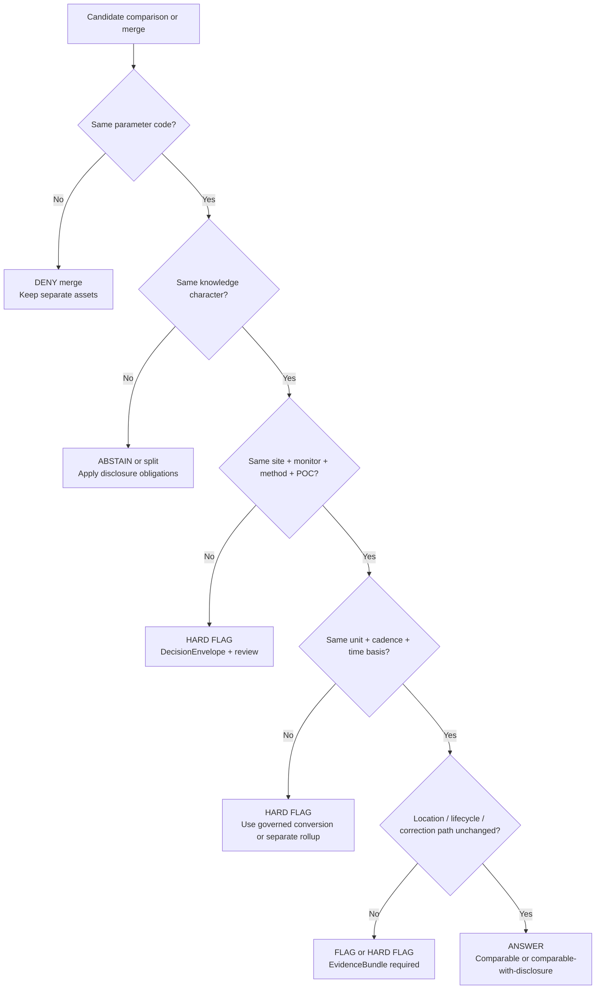

<!-- [KFM_META_BLOCK_V2]
doc_id: kfm://doc/<TODO-uuid>
title: Atmosphere Comparability Rules
type: standard
version: v1
status: draft
owners: <TODO: verify owner>
created: 2026-04-09
updated: 2026-04-09
policy_label: <TODO: verify>
related: [docs/domains/air/atmosphere/aqs-delta-pipeline.md, docs/data/air-quality/README.md, docs/data/air-quality/unit-conversion/README.md, docs/events/environmental/soil-air-ingestion-overview.md]
tags: [kfm, air, atmosphere, comparability, aqs, openaq, cams]
notes: [Mounted repo tree was not directly visible in this session; related paths are corpus-named and require repo verification.]
[/KFM_META_BLOCK_V2] -->

# Atmosphere Comparability Rules

_Governed rules for deciding when atmospheric observations, public-reporting feeds, modeled fields, and anomaly layers may be compared, merged, fused, or shown side-by-side in KFM._

| Field | Value |
|---|---|
| Status | Draft |
| Target path | `docs/domains/air/atmosphere/comparability-rules.md` |
| Evidence posture | **CONFIRMED** doctrine · **PROPOSED** packaging · **UNKNOWN** mounted implementation depth |
| Primary audience | Data, policy, graph, API, Story Node, Focus Mode, and review/steward lanes |
| Repo fit | Standard domain rule file for the air / atmosphere lane |
| Path verification | **NEEDS VERIFICATION** for adjacent corpus-named paths |

**Quick jump:** [Scope](#1-scope) · [Comparability states](#2-comparability-is-earned-not-assumed) · [Test families](#3-comparability-test-families) · [Knowledge classes](#4-knowledge-character-classes) · [Hard flags](#5-hard-flags-and-series-split-rules) · [PM2.5 rules](#7-pm25-special-rules) · [Decision flow](#8-decision-flow) · [Required outputs](#9-required-outputs) · [Definition of done](#10-definition-of-done)

> [!IMPORTANT]
> In KFM, comparability is **not** inferred from a shared pollutant name, a shared station label, or a convenient map overlay. Comparability is earned only when identity, spatial support, temporal support, method, unit, provenance, and knowledge character remain explicit and defensible.

## 1. Scope

### Purpose

This document turns KFM air-lane doctrine into a practical comparability contract.

It exists to stop quiet category errors such as:

- treating public AQI as if it were the same thing as row-level regulatory measurements
- rolling method changes into one “continuous” time series without disclosure
- mixing modeled overlays into observed series
- letting aggregator provenance erase upstream monitor identity
- publishing fusion products without naming what was fused, how, and with what uncertainty

### Repo fit

| Role | Path or artifact | Notes |
|---|---|---|
| This file | `docs/domains/air/atmosphere/comparability-rules.md` | Target file requested in this session |
| Likely upstream source governance | `docs/data/air-quality/README.md` | Corpus-named; mounted-path verification still needed |
| Likely sibling pipeline rule | `docs/domains/air/atmosphere/aqs-delta-pipeline.md` | Corpus-named; complements delta detection and site-change handling |
| Likely unit guidance | `docs/data/air-quality/unit-conversion/README.md` | Corpus-named; this file does **not** replace explicit conversion guidance |
| Likely broader ingestion overview | `docs/events/environmental/soil-air-ingestion-overview.md` | Corpus-named environmental ingest context |

### Accepted inputs

This file applies to atmospheric assets and series such as:

- row-level air observations
- public AQI or alert/reporting layers
- state or local operational notices relevant to monitor continuity
- community-sensor raw and corrected outputs, when admitted
- modeled or assimilated atmospheric fields
- smoke, aerosol, or anomaly-derived context layers
- cross-source fusion products intended for Story Nodes, Focus Mode, or derived datasets

### Exclusions

This file does **not** define:

- pollutant-specific chemistry or conversion equations
- ingestion mechanics for one particular provider
- full rights/licensing policy for each source family
- downstream UI copy
- whether a source is admitted into KFM in the first place

Those belong in source governance, unit-conversion, source-descriptor, and pipeline-specific documents.

---

## 2. Comparability is earned, not assumed

KFM doctrine already requires explicit identity alignment, spatial support compatibility, temporal support compatibility, method and unit comparability, and conflict handling before independent sources are treated as corroborative or composable. This file applies that rule to the air / atmosphere lane.

### 2.1 Comparability states

| Comparability state | Meaning | Default runtime consequence |
|---|---|---|
| `comparable` | Same knowledge character and continuity checks pass across identity, spatial, temporal, method, and unit dimensions | `ANSWER` |
| `comparable_with_disclosure` | Comparison is allowed, but only if the surface discloses method, correction, aggregation, or derivation status | `ANSWER` + disclosure obligation |
| `source_dependent` | Comparison may be usable, but only if source drift, aggregation routing, or incomplete evidence is made visible | usually `ABSTAIN` until evidence closes the gap |
| `conflicted` | Independent evidence paths disagree materially and the disagreement is not yet resolved | `ABSTAIN` or surface as conflicted |
| `non_comparable` | Shared pollutant or place name hides incompatible method, identity, time basis, unit basis, or knowledge character | `DENY` merge; keep separate assets |
| `error` | Comparison could not be evaluated because required evidence or validation failed | `ERROR` |

### 2.2 Practical rule

Two atmospheric things are **not** automatically comparable because they share any one of the following:

- the same pollutant label
- the same site name
- the same county or city
- the same timestamp
- the same map point
- a visually similar chart

A comparison or merge is admissible only when the required fields and checks below pass.

---

## 3. Comparability test families

| Test family | What must be explicit | Pass condition | Default fail consequence |
|---|---|---|---|
| Identity | `site_id`, `parameter_code`, `monitor_id`, `poc`, `method_code`, `method_name` | Series identity is stable or the continuity break is explicitly classified | split series or `ABSTAIN` |
| Spatial support | site geometry, CRS, relocation evidence, support type (point vs gridded field) | Geometry is stable enough for the intended claim | flag relocation or deny point-to-point continuity |
| Temporal support | cadence, time zone, aggregation level, start/end window, historical vs current scope | Time basis matches the intended comparison | split hourly/daily/AQI/anomaly products |
| Method / instrument | sampler/analyzer family, method code, method name, correction path, variant | Method continuity is intact or disclosed | `HARD FLAG` |
| Unit / conditioning | unit, reference basis, conversion path, conditioning assumptions | Units and reference conditions are either identical or converted through a governed path | deny silent rollup |
| Knowledge character | observed, public-reporting, modeled, assimilated, anomaly-derived, corrected, fused | Comparison class is declared and appropriate for the intended use | `disclose_modeled`, `ABSTAIN`, or keep separate |
| Provenance / routing | provider, network, source descriptor, upstream origin, EvidenceBundle | Upstream identity is reconstructible | do not promote beyond source-dependent state |
| Lifecycle | active/inactive/retired, opened/closed/replaced, temporary deployment, relocation | Site continuity is explicitly classified | closure marker, review, or split |
| Policy / publication burden | release state, disclosure obligations, audience | Comparison is allowed on the requested surface | withhold, generalize, or review |

> [!WARNING]
> A time series that survives ingestion is not automatically a time series that survives publication. KFM still requires visible method, time-basis, and provenance distinctions at the point of use.

---

## 4. Knowledge-character classes

The strongest corpus rule in this lane is that **observed air quality, public AQI reporting, modeled atmospheric fields, and anomaly layers must remain visibly distinct**. The class names below are a practical packaging of that doctrine.

### 4.1 Default classes

| Source family or product type | Required class | Use it for | Never silently treat it as |
|---|---|---|---|
| EPA AQS row-level observations | `observed` | authoritative row-level observation history | public AQI, anomaly layer, or modeled field |
| AirNow-style AQI outputs | `public-reporting` | public-facing AQI context and alerts | raw regulatory concentration series |
| OpenAQ-routed measurements | `observed_via_aggregator` | discovery and harmonized fetch path, with upstream provider retained | automatically regulatory-grade truth |
| Community-sensor raw feeds | `community_sensor_raw` | dense contextual observations | regulatory or corrected outputs |
| Community-sensor corrected outputs | `community_sensor_corrected` | disclosed corrected context series | raw series or regulatory anchor |
| CAMS forecast-like fields | `modeled` | gridded atmospheric context | direct observed series |
| Reanalysis or observation-constrained model fields | `assimilated` | backfilled contextual fields | raw observed record |
| Climate or anomaly surfaces | `anomaly_derived` | contextual departures, not direct pollutant observations | monitor series |
| Explicit fusion outputs | `fused_best_estimate` | derived best-estimate surfaces or series with uncertainty | any one source family by itself |

### 4.2 Non-negotiable separation rule

These classes may appear in one dossier, one Focus scope, or one Story Node, but they do **not** become the same thing by co-presence.

Examples:

- AQS + AirNow may coexist in one view; that does **not** make AQI equivalent to a raw hourly observation.
- OpenAQ may route an observed measurement into KFM; that does **not** erase the need to retain the original provider/network burden.
- CAMS may fill spatial gaps; that does **not** allow model fields to overwrite observed values.
- A climate anomaly surface may explain a period; that does **not** make it a substitute for air concentration measurements.

---

## 5. Hard flags and series split rules

Operational thresholds below are intentionally conservative. Unless a stronger mounted rule already exists, these should be treated as the default fail-closed posture.

| Trigger | Status | Default severity | Required action |
|---|---|---|---|
| `method_code` changes | **CONFIRMED** corpus rule | `HARD FLAG` | split continuity, emit `DecisionEnvelope`, require review if series is externally visible |
| `method_name` changes | **CONFIRMED** corpus rule | `HARD FLAG` | same as above |
| `parameter_code` changes | **INFERRED** from identity doctrine | `HARD FLAG` | treat as different series unless a documented mapping rule says otherwise |
| `poc` changes | **PROPOSED** default | `FLAG` | treat as a new physical monitor unless explicit continuity evidence exists |
| `monitor_id` changes | **PROPOSED** default | `FLAG` | do not preserve continuity silently |
| site moves more than `250 m` | **PROPOSED** default from packet-family rule | `FLAG` | require relocation review; may escalate to `HARD FLAG` for point-based continuity claims |
| cadence or aggregation changes (hourly ↔ daily ↔ AQI ↔ anomaly) | **INFERRED** | `HARD FLAG` | keep separate assets and explicit rollup labels |
| unit changes or undocumented conversion path | **INFERRED** | `HARD FLAG` | deny merge until governed conversion evidence exists |
| knowledge-character shift (observed ↔ modeled ↔ public-reporting ↔ anomaly-derived) | **CONFIRMED** doctrine | `HARD FLAG` | keep separate classes; apply disclosure obligations |
| correction model or low-cost-sensor variant changes | **PROPOSED** | `HARD FLAG` | version the correction path and split derived series where needed |
| provider or network changes through an aggregator | **PROPOSED** | `FLAG` | retain upstream provider identity; do not treat as silent continuity |
| site lifecycle changes `Active → Inactive → Retired` | **CONFIRMED** packet-family rule | `FLAG` | trigger closure logic and lineage preservation |
| metadata typo only, with identity unchanged | **PROPOSED** | low | allow narrow correction path with audit trail |

### 5.1 When a flag becomes a denial

A flag should escalate from review to denial when any of the following are true:

- the series would otherwise be promoted as continuous history
- the comparison supports a consequential outward claim
- the surface cannot disclose the break cleanly
- the upstream evidence needed to resolve the break is missing
- the comparison would blur observed and modeled material into one sovereign-looking truth object

---

## 6. Source-family rules

### 6.1 EPA AQS

Use AQS-style row-level observations as the authoritative anchor for monitor-level atmospheric history.

Rules:

1. Keep method, monitor, and POC visible.
2. Do not collapse multiple methods into one “clean” regulatory series without an explicit rule.
3. Keep hourly, daily, annual, and derived rollups separate.
4. If AQS metadata and an aggregator copy disagree, preserve the AQS-side identity as the anchor and treat the aggregator discrepancy as source-dependent.

### 6.2 AirNow or equivalent public AQI reporting

Use public AQI reporting for public-facing air-quality context, not as a substitute for row-level monitor history.

Rules:

1. Classify as `public-reporting`.
2. Compare AQI to AQI, not AQI to raw concentration as if they were the same series.
3. If a Story Node or Focus answer uses AQI beside raw observations, the surface must label the difference in knowledge character.

### 6.3 OpenAQ v3 or other aggregator routes

Use an aggregator as a routing or harmonization path, not as a magic source-normalizer.

Rules:

1. Keep upstream provider, network, and station lineage visible.
2. Deduplicate using stable source-side identity, not only display-friendly fields.
3. Do not assume “OpenAQ measurement” is automatically regulatory-grade.
4. If the upstream provider changes, re-check comparability before continuing a long series.

### 6.4 CAMS and other modeled / assimilated atmosphere products

Use modeled or assimilated products as contextual fields, not as silent replacements for observed records.

Rules:

1. Store modeled fields as separate assets and entities.
2. Keep `modeled` or `assimilated` visible in metadata and trust surfaces.
3. Do not overwrite observed grids or station values.
4. If a model field is joined onto an observation grid, preserve both classes separately.

### 6.5 Community sensors and correction pipelines

Use community-sensor data only through explicit classing and correction provenance.

Rules:

1. Preserve raw and corrected outputs separately.
2. Record the sensor variant used.
3. Record the correction model, its version, and uncertainty outputs.
4. If a corrected community-sensor product participates in a fusion layer, the fusion result becomes a new derived series class, not “cleaned AQS.”

### 6.6 State notices, monitor notices, and local operational context

Use state or local notices to corroborate continuity events such as:

- temporary shutdowns
- relocations
- method swaps
- smoke monitor additions
- lifecycle changes

These notices support classification. They do **not** retroactively rewrite prior snapshots.

---

## 7. PM2.5 special rules

PM2.5 is the pollutant family most likely to tempt silent category collapse. Do not permit that.

### 7.1 Minimum PM2.5 identity rule

For PM2.5, treat method and monitor identity as part of the series key.

```text
series_id = (site, parameter, monitor, method, poc)
```

That key is the minimum continuity anchor for method-aware harmonization.

### 7.2 Required PM2.5 output families

A PM2.5 workflow may publish several valid products, but they must remain explicitly named:

| Output family | What it is | What it is not |
|---|---|---|
| `raw_series` | source-native PM2.5 observations | already-harmonized truth |
| `regulatory_series` | PM2.5 series admitted for regulatory-grade continuity in the pipeline | every PM2.5 feed |
| `public_reporting_series` | AQI/reporting-oriented PM2.5 representation | row-level regulatory series |
| `corrected_lowcost_series` | corrected community-sensor output with explicit provenance and uncertainty | raw community-sensor output |
| `best_estimate_series` | explicitly fused or modeled PM2.5 product | a direct observation |

### 7.3 Parameter and method boundaries

For PM2.5, do **not** assume that `88101` and `88502` are interchangeable for continuity or regulatory interpretation.

Default rule:

- never continue the same `regulatory_series` across `88101 ↔ 88502` without an explicit, review-bearing rule
- keep the switch visible even when both are retained for public AQI or best-estimate context
- if the intended use is fused or contextual rather than regulatory, label the product accordingly

### 7.4 Low-cost PM2.5 rule

If a low-cost PM2.5 source is used:

- store the raw variant used
- store the corrected output separately
- store correction uncertainty
- do not overwrite the regulatory anchor
- disclose the correction family in metadata and outward surfaces

### 7.5 Illustrative PM2.5 metadata shape

```yaml
series_identity:
  pollutant: PM2.5
  site_id: "20-173-0005"
  parameter_code: "88101"
  monitor_id: "<required>"
  poc: "<required>"
  method_code: "<required>"
  method_name: "<required>"

comparability:
  knowledge_character: observed
  series_class: regulatory_series
  cadence: hourly
  unit: "ug/m3"
  aggregation_level: raw
  source_network: "EPA AQS"
  correction_model: null
  upstream_provider: "EPA"
```

Use this as the minimum shape for any PM2.5 asset that claims continuity.

---

## 8. Decision flow



---

## 9. Required outputs

Comparability decisions must leave evidence behind.

### 9.1 Minimum artifacts

| Artifact | When required | Minimum contents |
|---|---|---|
| `snapshot_prev` | any continuity comparison | prior machine-readable state |
| `snapshot_curr` | any continuity comparison | current machine-readable state |
| `delta diff` | any detected change | fields changed, old/new values, impact notes |
| `ValidationReport` | every reviewed comparison | pass/fail by test family |
| `DecisionEnvelope` | every hard flag or policy-bearing outcome | decision, impact, evidence refs, reason codes |
| `EvidenceBundle` | any abstain/deny/review outcome | prior snapshot, current snapshot, diff, external corroboration if available |
| STAC/DCAT/PROV update | promoted or published outputs | release-scoped metadata and lineage |
| closure / retirement marker | lifecycle breaks | visible continuity stop or replacement link |

### 9.2 Decision envelope example

```json
{
  "site_id": "20-XXX-XXXX",
  "change_type": "METHOD_CHANGE",
  "detected_on": "YYYY-MM-DD",
  "impact": "HIGH",
  "comparability_state": "non_comparable",
  "decision": "ABSTAIN",
  "evidence_refs": ["snapshot_prev", "snapshot_curr", "delta_diff"]
}
```

### 9.3 Output consequences

| Outcome | Minimum consequence |
|---|---|
| `ANSWER` | comparison is publishable, with any required disclosure attached |
| `ABSTAIN` | no confident outward continuity claim; EvidenceBundle remains inspectable |
| `DENY` | merge, fusion, or promoted publication blocked |
| `ERROR` | processing failed before a valid decision could be made |

---

## 10. Definition of done

A comparability rule implementation is not done until all of the following are true:

- [ ] Every atmospheric asset declares a knowledge character.
- [ ] Every series that claims continuity has explicit identity fields.
- [ ] Method changes, parameter changes, and knowledge-character shifts cannot pass silently.
- [ ] Point relocations and lifecycle changes emit review-bearing artifacts.
- [ ] Observed, public-reporting, modeled, assimilated, anomaly-derived, and fused products remain separate in metadata and outward surfaces.
- [ ] Unit conversion is referenced through a governed path rather than hidden in arbitrary transforms.
- [ ] PM2.5 products do not collapse `88101`, `88502`, community-sensor raw, corrected, and fused outputs into one unlabeled line.
- [ ] STAC/DCAT/PROV updates preserve the split between observational and modeled assets.
- [ ] Story Nodes and Focus Mode can disclose fact vs interpretation vs speculation when atmospheric layers are combined.
- [ ] Negative outcomes remain first-class: `ABSTAIN`, `DENY`, and `ERROR` are acceptable results.

---

## 11. Open verification items

The following remain intentionally visible because the mounted repo tree was not directly inspected in this session:

1. Whether `docs/domains/air/atmosphere/` already exists in the mounted repository.
2. Whether `comparability-rules.md` is the intended canonical file or whether a `comparability/` directory already owns this concern.
3. Whether `docs/data/air-quality/README.md` and `docs/data/air-quality/unit-conversion/README.md` exist at exactly those paths.
4. Whether project schemas already define a preferred enum for knowledge-character fields.
5. Whether the `250 m` relocation threshold is already standardized elsewhere or should remain only a proposed default.
6. Whether KDHE or other state-lane watchers already exist as mounted code.
7. Which owner, policy label, and durable document UUID should replace the placeholders in the meta block.

<details>
<summary>Appendix — illustrative obligation codes</summary>

These align this file to broader KFM runtime/policy language.

| Obligation code | Use in this lane |
|---|---|
| `disclose_modeled` | required whenever modeled, assimilated, or anomaly-derived material is shown beside observed air data |
| `review_required` | required when hard flags break continuity and human/steward review is needed |
| `withhold` | use when publication would create a false continuity claim |
| `cite` | use when a comparison supports an outward-facing claim and evidence must remain inspectable |
| `log_audit` | use for all comparability decisions that alter publishable outputs |
| `correction_notice` | use when a previously published continuity claim must be narrowed or reversed |

</details>

---

## 12. Maintainer note

This file is intentionally strict.

Atmospheric data become misleading faster than they become beautiful. The lane stays trustworthy only if the system refuses to flatten observations, public-reporting products, model fields, anomaly layers, and fused estimates into one soothing but false continuity story.

[Back to top](#atmosphere-comparability-rules)