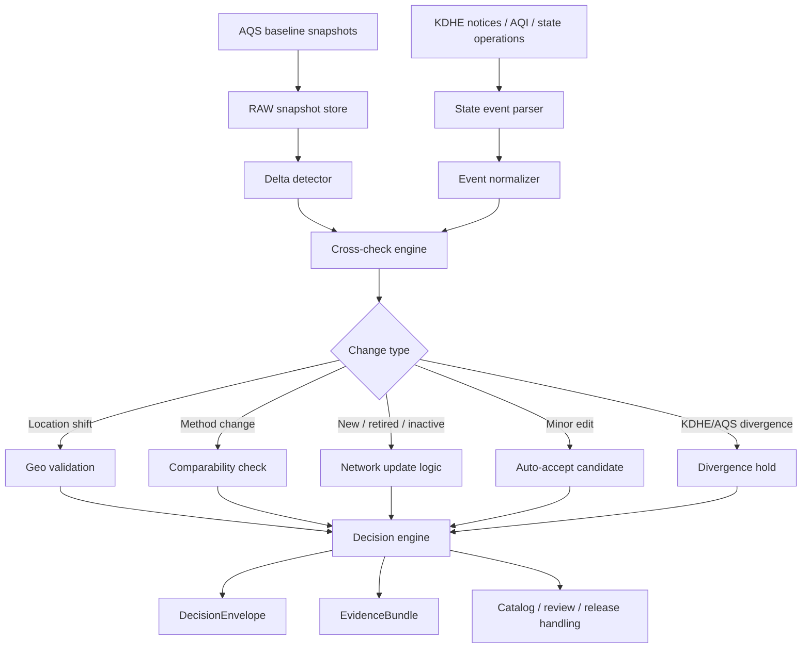

<!-- [KFM_META_BLOCK_V2]
doc_id: kfm://doc/<NEEDS-UUID>
title: Kansas Frontier Matrix — KDHE Operational Signals
type: standard
version: v1
status: draft
owners: <NEEDS-OWNER>
created: YYYY-MM-DD
updated: YYYY-MM-DD
policy_label: <NEEDS-POLICY-LABEL>
related: [docs/events/environmental/soil-air-ingestion-overview.md, <NEEDS-VERIFICATION: docs/domains/air/atmosphere/aqs-delta-pipeline.md>]
tags: [kfm, air, atmosphere, kdhe, operational-signals]
notes: [Repo metadata, owners, and adjacent atmosphere-file verification were not directly visible in the current session; companion atmosphere paths are inferred from attached corpus.]
[/KFM_META_BLOCK_V2] -->

# Kansas Frontier Matrix — KDHE Operational Signals

Govern how Kansas Department of Health and Environment operational air signals inform the atmosphere lane without silently replacing EPA AQS, public AQI reporting, or modeled atmospheric context.

> [!IMPORTANT]
> This document treats **KDHE operational signals** as a governed **cross-check lane**, not as an automatic override of canonical air records. Operational state may be urgent, important, and decision-relevant while still being different in role from regulatory repository data, public AQI reporting, and modeled atmospheric fields.

## Document posture

| Layer | Status | Meaning here |
|---|---|---|
| Core KFM doctrine | **CONFIRMED** | KFM requires explicit source roles, visible evidence state, fail-closed behavior, and machine-readable decision/audit objects. |
| KDHE operational-signal pattern | **PROPOSED** | The attached corpus strongly suggests a KDHE-aware atmosphere pattern, but mounted implementation depth was not directly visible. |
| Exact repo integration details | **UNKNOWN** | Current session evidence was PDF-rich only; actual source tree, schemas, tests, workflows, and live connectors were not directly inspected. |

## 1. Purpose and scope

This document defines how **KDHE-origin operational signals** should be interpreted, classified, reviewed, and surfaced inside the KFM atmosphere lane.

It exists to solve a very specific problem: air-monitor networks and public-facing air products can change in ways that matter operationally before those changes are fully reflected in canonical metadata or downstream derived products. A monitor may move, a method may change, a site may be temporarily shut down, a smoke monitor may be added, or a state advisory may appear before the broader federal record fully catches up. KFM should not ignore those changes, but it also must not flatten them into one undifferentiated “truth stream.”

This document is in scope for:

- monitor-state signals that originate from KDHE notices, operational AQI context, or other state-level atmosphere operations,
- cross-checking those signals against **EPA AQS** and adjacent atmosphere-lane sources,
- classifying the resulting changes,
- emitting governed evidence and decision objects,
- defining shell-visible behavior when comparability or continuity is at risk.

This document is out of scope for:

- a full AQS ingestion spec,
- a general public alerting system,
- community-sensor calibration policy in full,
- end-to-end schema definitions for every output object,
- claims that a live KDHE watcher, CI gate, or production route is already mounted.

## 2. Why this document exists

The atmosphere lane carries different source families with different epistemic burdens. KFM doctrine already treats this as non-negotiable: regulatory observations, public AQI reporting, modeled or assimilated atmospheric fields, anomaly layers, and community-contributed sensors are useful precisely because they are **not the same thing**.

KDHE operational signals matter because they capture state-level operational reality that may affect comparability, freshness, or user interpretation before canonical federal records fully reflect the change. That is especially important when KFM is expected to preserve:

- historical continuity,
- visible method distinctions,
- comparable time series,
- trustworthy map and timeline behavior,
- evidence-linked answers in Focus Mode,
- public-safe release behavior downstream of review and policy.

## 3. Core doctrine for KDHE operational signals

### 3.1 Operational signals are not automatic canonical truth

KDHE operational signals may be highly relevant without being the same class of object as an EPA AQS record. KFM should therefore ingest them as **governed state context** first, then decide whether they:

1. confirm an already visible change,
2. warn of a likely pending change,
3. diverge from federal metadata and require review,
4. narrow what may be published or compared.

### 3.2 Source roles must remain explicit

KFM should keep the role of each atmosphere source family visible at point of use.

| Source family | Suggested `knowledge_character` | Primary use | Must not be silently treated as |
|---|---|---|---|
| **EPA AQS** | `regulatory-observed` | Canonical regulatory measurements and monitor metadata baseline | Real-time operational notice stream |
| **AirNow** | `public-reporting` | Public AQI communication and public-facing reporting context | Regulatory repository |
| **KDHE notices / AQI feeds / state operations** | `state-operational` | Operational monitor status, advisory context, temporary changes, state-side divergence signals | Automatic replacement for AQS canonical metadata |
| **OpenAQ v3** | `observed-aggregation` | Broader air-observation intake and cross-network environmental context | Unreviewed regulatory truth |
| **CAMS NRT / smoke masks / modeled atmospheric fills** | `modeled` or `assimilated` | Gap-filling, contextual atmospheric interpretation, masking support | Direct monitor observation |
| **Community sensors where admitted** | `community-contributed` or `calibrated-community` | Local supplementary context when explicitly admitted and governed | Regulatory-grade baseline by default |

### 3.3 Comparability breaks must become visible state

When a site moves, changes method, enters a temporary operational state, or is retired, KFM should not preserve apparent continuity by convenience. If continuity becomes uncertain, KFM should surface a **comparability break** rather than allow users to infer false stability.

### 3.4 Negative outcomes are valid outcomes

If evidence is incomplete, contradictory, or not yet review-ready, the correct system behavior may be:

- **ABSTAIN**
- **HOLD**
- **DIVERGENCE FLAG**
- **GENERALIZE**
- **DENY EXPORT**
- **STALE-VISIBLE**

That is not failure theater. It is correct KFM behavior.

## 4. Signal classes

| Signal class | Typical source pattern | Why it matters | Default posture |
|---|---|---|---|
| **Location shift** | Same site identity, materially different coordinates | Spatial joins, dashboards, and local interpretation may become invalid or misleading | Flag and review |
| **Method change** | `method_code` or `method_name` changes | Time-series comparability may break even if site identity stays stable | Hard flag |
| **Lifecycle change** | Active → inactive → retired; shutdown or reactivation | Dataset closure, availability expectations, and lineage visibility change | Preserve state transition |
| **State/federal divergence** | KDHE reports change not yet reflected in AQS, or vice versa | Evidence classes are out of sync; shell must not imply more certainty than exists | Hold and surface divergence |
| **Operational event augmentation** | Wildfire/smoke monitor additions, temporary event sensors, special advisories | Temporary infrastructure may be important but should not be mistaken for long-term baseline | Mark as event-bound |
| **Minor metadata edit** | Typo, display-name fix, harmless descriptive patch | Does not necessarily break comparability or continuity | Candidate for auto-accept after validation |

## 5. Detection workflow



## 6. Detection rules

The rules below are grounded where the corpus is explicit and marked where they remain realization guidance.

### 6.1 Location shift

**PROPOSED rule:** if the distance between old and new coordinates exceeds **250 meters**, classify as a location shift requiring review.

Why this matters:

- map placement changes,
- nearby population and exposure joins may change,
- neighborhood-scale dashboards may become misleading,
- historical continuity may need an explicit break or note.

**Default consequence:** do not silently preserve the old geographic meaning.

### 6.2 Method change

**PROPOSED rule:** if `method_code` **or** `method_name` changes, emit a **hard flag**.

This is especially important for:

- **PM2.5** method families,
- **ozone analyzers**,
- **speciation monitors**.

**Default consequence:** no automatic claim of strict time-series continuity across the change boundary.

### 6.3 Site lifecycle

A site moving through **Active → Inactive → Retired** should be treated as a lifecycle event, not just a metadata edit.

**Default consequences:**

- preserve lineage,
- evaluate dataset closure logic,
- surface lifecycle state in the shell,
- prevent silent disappearance of previously valid records.

### 6.4 KDHE/AQS divergence

When KDHE and EPA AQS disagree in timing or state, KFM should not choose a winner invisibly. It should preserve both evidence classes, classify the mismatch, and surface the result machine-readably.

A divergence may mean:

- the state has published operational context ahead of federal metadata,
- one feed is stale,
- a temporary state change has not yet propagated,
- a source needs manual review.

**Default consequence:** emit a divergence-aware `DecisionEnvelope` and route to evidence-backed review.

### 6.5 Smoke and temporary-event augmentation

Temporary smoke monitors, event-bound advisories, or emergency operational additions are valuable context. They should be admitted as atmosphere-lane signals, but not normalized into a false long-term baseline by default.

**Default consequence:** mark them as event-bound and time-explicit.

## 7. Decision outputs

KFM doctrine already expects typed decision and evidence objects. This document aligns to that contract family, while keeping exact mounted schema locations **UNKNOWN**.

### 7.1 `DecisionEnvelope`

A KDHE operational-signal review should result in a machine-readable decision object.

**Minimum expectations**

- subject
- action
- lane
- result
- reason codes
- obligation codes where applicable
- policy basis
- `audit_ref`
- effective window

**Illustrative example**

```json
{
  "object_type": "DecisionEnvelope",
  "lane": "atmosphere",
  "subject": "site:20-XXX-XXXX",
  "action": "preserve_comparability",
  "result": "ABSTAIN",
  "reason_codes": ["METHOD_CHANGE", "REGULATORY_DIVERGENCE"],
  "obligation_codes": ["REVIEW_REQUIRED", "SURFACE_COMPARABILITY_NOTE"],
  "policy_basis": ["source-role-separation", "fail-closed", "no-silent-time-series-merge"],
  "audit_ref": "audit:air:2026-04-02:site-20-XXX-XXXX",
  "effective_window": {
    "start": "2026-04-02T00:00:00Z",
    "end": null
  }
}
```

### 7.2 `EvidenceBundle`

The decision should be reconstructable from evidence, not just from prose.

**Minimum expectations**

- bundle ID
- source basis
- dataset references
- lineage summary
- transform receipts where relevant
- rights/sensitivity state
- preview policy
- `audit_ref`

**Illustrative example**

```json
{
  "object_type": "EvidenceBundle",
  "bundle_id": "eb:air:site-20-XXX-XXXX:2026-04-02",
  "source_basis": [
    "AQS snapshot previous",
    "AQS snapshot current",
    "KDHE notice or AQI signal"
  ],
  "dataset_refs": [
    "dataset:aqs-monitor-snapshot-prev",
    "dataset:aqs-monitor-snapshot-curr"
  ],
  "lineage_summary": "KDHE signal cross-checked against AQS monitor delta",
  "preview_policy": "internal-review",
  "rights_sensitivity_state": "public-safe pending comparability review",
  "audit_ref": "audit:air:2026-04-02:site-20-XXX-XXXX"
}
```

### 7.3 Release and catalog effects

Where a signal changes what can safely be published, the consequence should extend beyond the detector itself.

Possible outcomes include:

- update of catalog metadata,
- visible comparability note on derived products,
- release narrowing,
- withheld export,
- correction or supersession path if an outward artifact has already been published.

## 8. Shell and runtime consequences

KDHE operational signals matter only if they become visible where users make judgments.

| Surface | Required consequence |
|---|---|
| **Map Explorer** | Show signal status, as-of time, and affected monitor/site state without implying silent continuity |
| **Timeline** | Mark the start of a comparability break, lifecycle change, or divergence interval |
| **Dossier** | Preserve site identity, method notes, lifecycle history, and operational-context links |
| **Story surface** | Require evidence-linked treatment; no narrative smoothing of unresolved divergence |
| **Evidence Drawer** | Expose previous snapshot, current snapshot, delta diff, KDHE evidence, and review state |
| **Focus Mode** | Cite the governing evidence or return a bounded negative outcome when divergence is unresolved |
| **Export** | Carry release linkage and comparability notes, or deny outward export when policy requires it |

> [!NOTE]
> A “more recent state signal” is not enough on its own. KFM surfaces should remain one hop from inspectable evidence and should show the **kind** of evidence being used.

## 9. Fail-closed conditions

KDHE operational signals should block or narrow outward behavior when any of the following conditions are met:

1. the previous/current baseline snapshots are missing,
2. a claimed change cannot be reconstructed from preserved evidence,
3. method or location changes are detected but unresolved,
4. the source role of the signal is unclear,
5. rights, redistribution, or audience posture is not clear for the requested surface,
6. shell-facing continuity would be misleading without a visible caveat,
7. an outward artifact would imply comparability the evidence does not support.

## 10. Review checks

The following checks are appropriate before a consequential atmosphere update is treated as release-safe.

- [ ] Previous and current baseline snapshots preserved
- [ ] KDHE-origin signal preserved or referenced
- [ ] Change type classified
- [ ] Method and location rules evaluated
- [ ] Lifecycle transition handled where relevant
- [ ] `DecisionEnvelope` emitted
- [ ] `EvidenceBundle` emitted
- [ ] Catalog or release consequence evaluated
- [ ] Shell-visible state defined
- [ ] Negative-path behavior verified for unresolved divergence

## 11. Intended neighboring artifacts

Because current-session repo inspection did not directly surface the target directory tree, this section distinguishes what is confirmed from what is only inferred from the attached corpus.

| Path | Status | Role |
|---|---|---|
| `docs/events/environmental/soil-air-ingestion-overview.md` | **CONFIRMED in corpus / NEEDS REPO VERIFICATION** | Adjacent atmosphere/soil ingestion overview and metadata/style cue |
| `docs/domains/air/atmosphere/aqs-delta-pipeline.md` | **PROPOSED** | Full AQS snapshot, delta, and comparability pipeline spec |
| `docs/domains/air/atmosphere/monitors/` | **PROPOSED** | Monitor-state and roster reference material |
| `docs/domains/air/atmosphere/comparability/` | **PROPOSED** | Method-comparability notes, especially PM2.5 and related monitor classes |
| `docs/domains/air/atmosphere/advisories/` | **PROPOSED** | Public-facing or steward-facing advisory behavior, if later formalized |

## 12. Open verification items

The corpus is strong enough to justify this document’s doctrine and structure, but not strong enough to overclaim mounted implementation.

### Needs direct repo verification

- whether `kdhe-operational-signals.md` already exists and, if so, its current substance,
- whether `aqs-delta-pipeline.md` already exists,
- exact schema locations for `DecisionEnvelope` and `EvidenceBundle`,
- actual workflow names, test files, and CI gate names,
- whether a KDHE watcher module is already present in code.

### Needs design decision

- whether KDHE operational signals should be classified as a dedicated source role or as a subtype of `state-operational`,
- whether a 250 m shift threshold is final or should vary by monitor class,
- exact comparability policy for PM2.5 method-family transitions,
- whether divergence states should be surfaced as `partial`, `stale-visible`, `abstained`, or a more specific air-lane state.

### Needs implementation proof

- one example previous/current snapshot pair,
- one emitted `DecisionEnvelope`,
- one emitted `EvidenceBundle`,
- one shell-visible divergence example,
- one negative-path Focus response tied to unresolved atmosphere divergence.

## 13. Minimal next move

The highest-value next move is not a broad atmosphere rewrite. It is a **thin, receipt-bearing watcher slice** that proves the following sequence on one monitor-change example:

1. snapshot previous AQS state,
2. snapshot current AQS state,
3. ingest one KDHE operational signal,
4. classify the change,
5. emit `DecisionEnvelope`,
6. assemble `EvidenceBundle`,
7. surface one shell-visible consequence,
8. preserve a negative-path example when comparability is unresolved.

That thin slice is small enough to verify and large enough to prove the doctrine.

---

**Working rule:** KDHE operational signals should make the atmosphere lane more truthful, more time-explicit, and more inspectable—not more opaque, more automatic, or more rhetorically confident than the evidence allows.