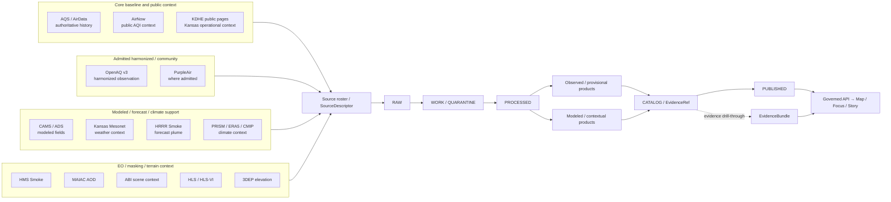

<!-- [KFM_META_BLOCK_V2]
doc_id: kfm://doc/NEEDS-VERIFICATION-UUID
title: KFM Atmosphere Source Roster
type: standard
version: v1
status: draft
owners: @bartytime4life (broad /docs fallback), NEEDS VERIFICATION
created: YYYY-MM-DD
updated: 2026-04-09
policy_label: public
related: [./README.md, ../README.md, ../aqs-airnow-hydrologic-baselines.md, ../../../governance/ROOT_GOVERNANCE.md, ../../../governance/ETHICS.md, ../../../analyses/remote-sensing/README.md]
tags: [kfm, air, atmosphere, source-roster, domain-docs]
notes: [Replaces the current placeholder file; created date, area-specific ownership, and source-specific schema paths still need verification.]
[/KFM_META_BLOCK_V2] -->

# KFM Atmosphere Source Roster

Governed source-family register for authoritative, provisional, harmonized, modeled, and air-coupled context inputs used in KFM’s air-facing atmosphere lane.

> **Status:** draft  
> **Owners:** `@bartytime4life` *(broad `/docs/` fallback on current public `main`; area-specific ownership still needs verification)*  
>       
> **Quick jumps:** [Scope](#scope) · [Repo fit](#repo-fit) · [Accepted inputs](#accepted-inputs) · [Exclusions](#exclusions) · [Classification rules](#source-classification-rules) · [Roster](#source-roster) · [Handoffs](#handoffs-and-adjacent-docs) · [Diagram](#diagram) · [Quickstart](#quickstart) · [Task list](#task-list--definition-of-done) · [FAQ](#faq) · [Appendix](#appendix)  
> **Repo fit:** `docs/domains/air/atmosphere/source-roster.md` → upstream [`./README.md`](./README.md), [`../README.md`](../README.md), [`../aqs-airnow-hydrologic-baselines.md`](../aqs-airnow-hydrologic-baselines.md) · governance [`../../../governance/ROOT_GOVERNANCE.md`](../../../governance/ROOT_GOVERNANCE.md), [`../../../governance/ETHICS.md`](../../../governance/ETHICS.md) · adjacent analysis [`../../../analyses/remote-sensing/README.md`](../../../analyses/remote-sensing/README.md)

> [!IMPORTANT]
> This file is a **source roster and interpretation guide**, not proof that every listed connector, schema, watcher, or release surface is already implemented on the current branch.

> [!NOTE]
> Use this file to answer **which source family belongs in the lane, what it is allowed to mean, and what must stay visible at publication time**.  
> Use [`./README.md`](./README.md) for atmosphere-side ingestion and trust-gating shape.  
> Use [`../aqs-airnow-hydrologic-baselines.md`](../aqs-airnow-hydrologic-baselines.md) for AQS/AirNow baseline assembly and watershed-aware joins.

> [!CAUTION]
> In this lane, **observation, public AQI reporting, harmonized intake, community-sensor coverage, modeled fields, smoke masks, and terrain context are not interchangeable**. KFM gets weaker when those classes are flattened into one synthetic “air truth” layer.

## Scope

This document keeps the atmosphere lane’s source ecosystem inspectable.

It exists to name the source families that feed KFM’s air-facing work and to state, in plain terms, what each source can and cannot safely stand for. The file is intentionally roster-first:

- **what the source family is**
- **what knowledge character it carries**
- **what role it should play in KFM**
- **what must stay explicit when it reaches a public-safe surface**

### What this file should help a maintainer answer

1. Which source family should be used for this atmosphere-facing task?
2. Is the source authoritative, provisional, harmonized, modeled, forecast, or contextual?
3. What publication burden travels with that source family?
4. Which adjacent document should own the deeper implementation or policy details?

### Status vocabulary used here

| Label | Use in this file |
|---|---|
| **CONFIRMED** | Directly supported by current public repo docs or stable KFM doctrine |
| **INFERRED** | Strongly suggested by repo-grounded materials, but not directly proven as a current checked-in connector or runtime |
| **PROPOSED** | Good repo-ready packaging or next-step guidance |
| **UNKNOWN** | Not verified strongly enough to present as current fact |
| **NEEDS VERIFICATION** | Specific owner, path, schema, or implementation detail to check before merge |

[Back to top](#kfm-atmosphere-source-roster)

---

## Repo fit

| Item | Value |
|---|---|
| Path | `docs/domains/air/atmosphere/source-roster.md` |
| Role | Source-family register and interpretation boundary for the atmosphere sublane |
| Parent lane | [`../README.md`](../README.md) |
| Sibling atmosphere doc | [`./README.md`](./README.md) |
| Adjacent baseline doc | [`../aqs-airnow-hydrologic-baselines.md`](../aqs-airnow-hydrologic-baselines.md) |
| Governance anchors | [`../../../governance/ROOT_GOVERNANCE.md`](../../../governance/ROOT_GOVERNANCE.md) · [`../../../governance/ETHICS.md`](../../../governance/ETHICS.md) |
| Cross-lane handoff | [`../../../analyses/remote-sensing/README.md`](../../../analyses/remote-sensing/README.md) |
| Typical downstreams | source descriptors, lane-specific child specs, trust-visible UI surfaces, EvidenceRef/EvidenceBundle closure, review and release notes |
| This file should **not** become | a pipeline README, API contract, policy bundle, schema registry, or runtime proof surface |

### Current visible companion surfaces

| Visible checked-in doc | Role here |
|---|---|
| [`../README.md`](../README.md) | air-lane boundary and broader atmosphere framing |
| [`./README.md`](./README.md) | atmosphere-side AQS/KDHE delta-ingestion and trust-gating spec |
| [`../aqs-airnow-hydrologic-baselines.md`](../aqs-airnow-hydrologic-baselines.md) | baseline assembly, source precedence, and hydrologic join guidance |

### Why this file belongs beside `./README.md`

The current atmosphere README is already shaped like an ingestion/specification surface.  
This file should do the complementary work:

- keep source families legible
- prevent silent source-role drift
- give maintainers one compact roster to update when a new source is admitted or a current one changes status
- keep detailed ETL, comparability, and gating logic out of the roster unless they directly affect source meaning

[Back to top](#kfm-atmosphere-source-roster)

---

## Accepted inputs

Use this file for:

- source-family inventories
- source-role and knowledge-character notes
- authoritative vs provisional vs modeled distinctions
- calibration or admission notes that must stay visible at release time
- air-coupled earth-observation source notes
- relative links to deeper source-specific or baseline-specific docs
- explicit `CONFIRMED` / `INFERRED` / `PROPOSED` / `NEEDS VERIFICATION` labels

### Good examples of material that belongs here

- “AQS is the row-level baseline; AirNow is public AQI context.”
- “PurpleAir is admitted only under visible calibration and screening.”
- “CAMS fields remain modeled and must not quietly replace observations.”
- “3DEP belongs here only as contextual terrain support, not as an air observation.”
- “HMS Smoke and MAIAC AOD are release-gating context for downstream EO products.”

[Back to top](#kfm-atmosphere-source-roster)

---

## Exclusions

Do **not** use this file for the following.

| Does not belong here | Why | Better home |
|---|---|---|
| Full ETL or watcher implementation steps | This is a roster, not a pipeline runbook | [`./README.md`](./README.md) or pipeline docs once verified |
| JSON Schema, Rego, fixtures, or executable policy | Those are contract surfaces, not source-family prose | contracts / schemas / policy / tests |
| Forecast or alert-serving logic presented as already operational | This lane is bounded toward governed context, not alert theater | hazards or operational alert docs |
| Raw dumps, sample payload archives, or large endpoint notebooks | Truth-path artifacts are not roster content | `RAW`, `WORK / QUARANTINE`, or catalog artifacts |
| Unlabeled blends of observed and modeled data | Breaks KFM’s authoritative-versus-derived rule | separate derived product with explicit lineage |
| Source claims that current public `main` does not verify | Turns docs into false implementation evidence | mark `INFERRED` / `NEEDS VERIFICATION` or move to backlog |

> [!WARNING]
> The fastest way to make this doc untrustworthy is to let it become a quiet endpoint catalog full of implementation claims the branch does not actually prove.

[Back to top](#kfm-atmosphere-source-roster)

---

## Source classification rules

Before adding or editing a roster entry, classify the source family first.

| Source class | Meaning in KFM | Typical examples | Common failure mode |
|---|---|---|---|
| **Authoritative observation / history** | Direct monitor or source-authoritative record used as the long-horizon baseline | AQS | Treated like a live feed |
| **Public operational context** | Timely public-facing reporting with lighter QA and stronger freshness needs | AirNow, KDHE public pages | Quietly promoted to regulatory truth |
| **Harmonized observation service** | Cross-network or cross-owner service that standardizes access or metadata | OpenAQ | Misread as the authority that outranks the origin source |
| **Community sensor** | Admitted lower-cost network data with explicit screening and calibration burdens | PurpleAir where admitted | Published as truth without visible correction logic |
| **Modeled / forecast field** | Assimilated, forecast, or synthetic field used for support, gap-fill, or context | CAMS, HRRR Smoke, climate-downscaled fields | Quietly merged into observed records |
| **EO / masking context** | Satellite or analyst-reviewed context used to gate or qualify interpretation | HMS Smoke, MAIAC AOD, ABI scene context | Mistaken for direct pollutant concentration |
| **Contextual scientific layer** | Supporting non-air layer that sharpens interpretation but is not itself an air measurement | 3DEP elevation | Misrepresented as part of the core air record |

### Lane-wide minimums for every roster entry

Every admitted source family should be describable in terms of:

- **knowledge character** — observed, provisional, modeled, derived, or contextual
- **time basis** — observation, acquisition, issue, valid, or as-of time
- **spatial support** — point, plume, raster, tile, statewide context, watershed context
- **authority posture** — baseline, secondary, corroborative, contextual, or subordinate
- **release burden** — what must stay visible when a downstream product uses it

[Back to top](#kfm-atmosphere-source-roster)

---

## Source roster

### 1. Core baseline and public context

| Source family | Status | Knowledge character | Primary KFM use | What must stay visible |
|---|---:|---|---|---|
| **EPA AQS API / AQS raw or AirData-backed extracts** | **CONFIRMED** | authoritative observation / regulatory history | row-level baseline measurements, monitor metadata, QA-aware historical series | not real-time; parameter/method/POC continuity; returned time basis; payload or snapshot lineage |
| **AirNow** | **CONFIRMED** | public operational AQI / preliminary context | current AQI-facing interpretation, public-health context, provisional overlays | public AQI purpose; preliminary vs certified distinction; freshness basis; pollutant scope |
| **KDHE public monitoring pages** | **CONFIRMED** | Kansas public operational signal | Kansas-specific corroboration, network context, hourly public-facing views | public QA caveat; Kansas-specific scope; not a silent replacement for federal baseline history |

### 2. Admitted harmonized and community-facing inputs

| Source family | Status | Knowledge character | Primary KFM use | What must stay visible |
|---|---:|---|---|---|
| **OpenAQ v3** | **INFERRED** | harmonized observation service | cross-network Kansas observation intake, station/provider/owner metadata, normalized parameter views | current connector and auth posture need verification; provider/owner distinction; licensing and attribution; harmonized access is not higher authority than origin systems |
| **PurpleAir where admitted** | **CONFIRMED family** · **NEEDS VERIFICATION** exact admission contract | community sensor | admitted supplemental coverage, public-context comparison, smoke-era situational support | calibration basis, screening/admission rule, support limits, provisionality, and lineage back to the community-sensor network |

### 3. Modeled, forecast, and climatic support layers

| Source family | Status | Knowledge character | Primary KFM use | What must stay visible |
|---|---:|---|---|---|
| **CAMS / Atmosphere Data Store access** | **INFERRED** | modeled atmospheric field | modeled fills or contextual pollutant fields where direct observations are sparse | modeled status, issue/valid time, derivation chain, and separate asset identity from observations |
| **Kansas Mesonet REST services** | **INFERRED** | contextual weather or environmental feed | Kansas-local weather context that may explain smoke, dryness, or air-quality interpretation | CSV service shape, data-usage/citation posture, non-air-primary role, and source-specific freshness |
| **HRRR Smoke** | **INFERRED** | forecast plume context | near-term smoke or plume gating for readiness decisions and context surfaces | forecast horizon, model status, and that it is a support input rather than direct measurement |
| **PRISM / ERA5 / CMIP-class downscaling inputs** | **INFERRED** | climatological or modeled context | anomaly, bias-correction, or climate-context layers that inform cross-lane interpretation | baseline period, spatial resolution, bias-correction status, and non-equivalence to current ambient observations |

### 4. EO, masking, and terrain context

| Source family | Status | Knowledge character | Primary KFM use | What must stay visible |
|---|---:|---|---|---|
| **HMS Smoke** | **CONFIRMED family** | EO / analyst-reviewed smoke mask | smoke classification, masking, and release gating for downstream imagery or interpretation | analyst mask semantics, smoke class, detection limits, and non-quantitative meaning |
| **MAIAC AOD** | **CONFIRMED family** | EO aerosol field | aerosol contamination screening and atmospheric masking | aerosol optical depth is not ground concentration; product version and time basis must remain visible |
| **ABI L2 scene context (`CMIP` and related cloud/radiance support)** | **CONFIRMED family** | EO scene-quality / context | cloud, radiance, or scene-condition support for readiness and masking decisions | acquisition time, screening logic, and limited interpretive scope |
| **HLS / HLS-VI** | **CONFIRMED cross-lane dependency** | downstream EO product, not primary air record | land-surface products that may need air-side smoke/AOD gating before release | air burden lives here; vegetation or surface-product logic belongs in EO / remote-sensing docs |
| **3DEP / USGS elevation** | **CONFIRMED** | contextual scientific layer | terrain support for atmospheric interpretation, visualization, or EO context | terrain is contextual support only, not an air observation or pollutant signal |

### Working precedence inside this roster

1. **AQS baseline outranks provisional or harmonized views** when the question is historical or regulatory-grade air record.
2. **AirNow and KDHE public pages support current-state interpretation**, not quiet replacement of baseline history.
3. **OpenAQ and PurpleAir are admitted only with visible source-role discipline.**
4. **Modeled or forecast fields stay separate from observed records.**
5. **EO and terrain context can gate release or sharpen interpretation, but they do not become the pollutant record.**

[Back to top](#kfm-atmosphere-source-roster)

---

## Handoffs and adjacent docs

| If the question is mainly about… | Read this | Why |
|---|---|---|
| air-lane boundary and what belongs in air at all | [`../README.md`](../README.md) | lane-level framing and publication burden |
| AQS/KDHE change detection and trust-gated ingestion | [`./README.md`](./README.md) | atmosphere-side ingestion spec |
| AQS + AirNow baseline packaging and watershed joins | [`../aqs-airnow-hydrologic-baselines.md`](../aqs-airnow-hydrologic-baselines.md) | baseline assembly and reconciliation model |
| product-side EO or smoke/AOD readiness rules | [`../../../analyses/remote-sensing/README.md`](../../../analyses/remote-sensing/README.md) | keep air burden and product logic separated |
| root trust law, review triggers, and public-safe posture | [`../../../governance/ROOT_GOVERNANCE.md`](../../../governance/ROOT_GOVERNANCE.md) | governance law and truth-path constraints |
| ethics, harm, and interpretation restraint | [`../../../governance/ETHICS.md`](../../../governance/ETHICS.md) | policy and stewardship consequences |

[Back to top](#kfm-atmosphere-source-roster)

---

## Diagram



[Back to top](#kfm-atmosphere-source-roster)

---

## Quickstart

### When adding or updating a roster entry

1. Start with the **source class**, not the endpoint.
2. Declare whether the source is **authoritative, provisional, harmonized, modeled, derived, or contextual**.
3. Record the **time basis** that matters for interpretation.
4. State the **release burden** in one sentence.
5. Link to the deeper doc that owns ingestion or packaging logic.
6. Keep any unverified connector, schema, auth, or workflow detail visibly labeled.

### Minimal roster-entry shape

```yaml
source_id: NEEDS_VERIFICATION
source_family: regulatory_observation | public_operational | harmonized_observation | community_sensor | modeled_field | eo_context | contextual_scientific_layer
status: CONFIRMED | INFERRED | PROPOSED | UNKNOWN | NEEDS VERIFICATION
knowledge_character: authoritative | provisional | harmonized | modeled | forecast | contextual
time_basis: observation_time | acquisition_time | issue_time | valid_time | as_of_time
primary_use: ""
must_keep_visible:
  - ""
related_docs:
  - ./README.md
  - ../README.md
```

### Fast maintainer check

- Does the entry say whether the source is **observed, provisional, modeled, or contextual**?
- Is the **time basis** explicit?
- Is the **publication burden** visible in human language?
- Does the entry avoid turning harmonized or public-facing services into silent authority inflation?
- Is there a clear route from the source family to a deeper spec or EvidenceRef path?

[Back to top](#kfm-atmosphere-source-roster)

---

## Task list / definition of done

- [ ] Every roster row has a visible **source class**
- [ ] Every roster row has a visible **knowledge character**
- [ ] Every roster row names the **primary KFM use**
- [ ] Every roster row states what must remain visible at release time
- [ ] Observed, provisional, harmonized, modeled, and contextual rows are not flattened together
- [ ] Relative links resolve to current checked-in docs
- [ ] New source families are marked `INFERRED` or `NEEDS VERIFICATION` until branch-local evidence is visible
- [ ] No row implies an already-mounted connector, schema, or watcher unless the current branch proves it
- [ ] Cross-lane EO sources are routed to remote-sensing analysis docs for product logic
- [ ] Governance anchors remain one hop away

[Back to top](#kfm-atmosphere-source-roster)

---

## FAQ

### Is this file the authority on AQS ingestion rules?

No. This file names the **source family and its meaning**.  
Use [`./README.md`](./README.md) for atmosphere-side ingestion and trust-gating shape, and use [`../aqs-airnow-hydrologic-baselines.md`](../aqs-airnow-hydrologic-baselines.md) for baseline assembly and watershed-aware joins.

### Can OpenAQ replace AQS in KFM?

No. OpenAQ is useful as a harmonized access layer, but it should not silently outrank AQS when the question requires authoritative or regulatory-grade history.

### Are PurpleAir readings allowed?

Potentially, yes — but only **where admitted** and only with visible calibration, screening, and support limits.

### Why are HLS and 3DEP in an atmosphere source roster?

Because the broader KFM atmosphere lane is not just raw pollutant readings. It also includes air-coupled EO gating, smoke/AOD context, elevation, and other scientific-support layers that materially affect what downstream products are allowed to say.

### Is Kansas Mesonet an air source here?

Usually not as a primary air-observation backbone. In this roster it is treated as **supporting Kansas-local context** that may help explain smoke, dryness, or weather conditions relevant to interpretation.

### Does this file prove the current repo already has live connectors for every listed family?

No. Current public docs prove the lane framing and some checked-in child documents. They do **not** prove that every source family is already wired to a current connector, schema, workflow, or release path.

[Back to top](#kfm-atmosphere-source-roster)

---

## Appendix

<details>
<summary><strong>Starter SourceDescriptor field checklist</strong></summary>

Use this as a review-facing checklist until a branch-verified machine schema is confirmed.

| Field | Why it matters |
|---|---|
| `source_id` | stable local identifier for the source family or feed |
| `source_name` | human-readable name |
| `source_class` | authoritative observation, operational context, harmonized observation, community sensor, modeled field, EO context, or scientific support |
| `knowledge_character` | authoritative, provisional, modeled, forecast, derived, contextual |
| `owner_or_operator` | who runs the source |
| `provider_or_gateway` | who distributes or brokers it |
| `access_mode` | public URL, API key, restricted, mirrored, staged |
| `rights_posture` | public, admitted with restrictions, needs review, or other governed posture |
| `time_basis` | observation, acquisition, issue, valid, or as-of time |
| `cadence_or_refresh` | expected freshness window |
| `spatial_support` | point, raster, plume, tile, statewide, watershed-linked, etc. |
| `calibration_or_admission_basis` | especially important for community sensors and fused products |
| `quality_or_validation_notes` | what qualifies the source and what it cannot safely claim |
| `related_docs` | where the deeper spec or runbook lives |
| `evidence_ref` | how the source resolves into KFM evidence closure |

</details>

<details>
<summary><strong>Recommended triggers for updating this roster</strong></summary>

Update this file when any of the following happen:

- a new atmosphere-facing source family is admitted
- a current source changes authority posture or timeliness expectations
- community-sensor admission rules change
- a modeled or forecast family becomes publication-bearing
- an EO or masking source becomes a routine release gate
- a checked-in child doc takes ownership of a currently inferred source family
- a current relative link or file role drifts on the branch

</details>

[Back to top](#kfm-atmosphere-source-roster)