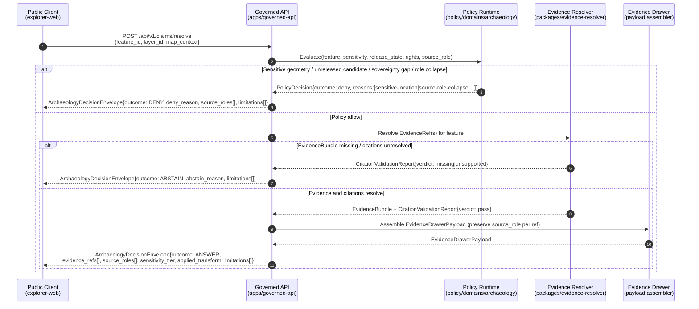

<!-- [KFM_META_BLOCK_V2]
doc_id: kfm://doc/archaeology-api-contracts
title: Archaeology — API Contracts
type: standard
version: v0.2
status: draft
owners: <TODO: archaeology-domain-steward; cultural-review-board; governed-API-owner; security-steward; docs-steward>
created: 2026-05-15
updated: 2026-05-27
policy_label: public
related:
  - docs/doctrine/ai-build-operating-contract.md
  - docs/doctrine/directory-rules.md
  - docs/doctrine/trust-membrane.md
  - docs/doctrine/truth-posture.md
  - docs/doctrine/lifecycle-law.md
  - docs/architecture/governed-api.md
  - docs/domains/archaeology/README.md
  - docs/domains/archaeology/SENSITIVITY.md
  - docs/domains/archaeology/VERIFICATION_BACKLOG.md
  - docs/domains/archaeology/runbooks/README.md
  - docs/domains/archaeology/runbooks/rollback-drill.md
  - contracts/runtime/decision_envelope.md
  - contracts/runtime/runtime_response_envelope.md
  - contracts/evidence/evidence_bundle.md
  - schemas/contracts/v1/runtime/
  - schemas/contracts/v1/domains/archaeology/
  - policy/domains/archaeology/
  - policy/sensitivity/archaeology/
  - docs/adr/ADR-0001-schema-home.md
tags: [kfm, archaeology, api, contracts, governed-api, sensitivity, trust-membrane, source-role-anti-collapse]
notes:
  - CONTRACT_VERSION = "3.0.0" (pinned per ai-build-operating-contract.md §37).
  - Doctrine-adjacent reference; canonical authority lives in contracts/, schemas/, policy/, tests/.
  - Repository NOT mounted in this session; every path, route, schema file, and contract file is PROPOSED until verified.
  - Source-role anti-collapse (Atlas v1.1 Ch. 24.1) is load-bearing for this lane; threaded throughout §§3, 5, 6, 8.
  - Inherits Archaeology sensitivity envelope: T4 site coords default; T4 forever for human remains / sacred sites.
[/KFM_META_BLOCK_V2] -->

# Archaeology — API Contracts

> Governed API surface, DTOs, finite outcomes, source-role discipline, and sensitivity gates for the Archaeology and Cultural Heritage domain. This document **explains**; canonical authority lives in `contracts/`, `schemas/`, `policy/`, and `tests/`.

  
  
  
  
  
  
  
  
  
  
  
  <!-- TODO: replace with live Shields.io endpoints (CI status, last-updated, ADR coverage, route verification status) once paths are verified against the mounted repo. -->

**Status:** draft · **Owners:** _TODO: archaeology-domain-steward · cultural-review-board · governed-API-owner · security-steward · docs-steward_ · **Last updated:** 2026‑05‑27

> [!IMPORTANT]
> Archaeology is a **deny-by-default** domain. Exact site locations, burial, human remains, sacred sites, unresolved cultural sensitivity, collection security, private-landowner details, and looting-risk exposure **MUST fail closed** at the API boundary. No request, regardless of authentication tier, releases unredacted exact geometry at T0 (Open) without explicit sovereignty / cultural review and an attached `RedactionReceipt`. See [§8](#8-sensitivity-gates-baked-into-the-contract-surface).

---

## 0. Status & Authority

| Field | Value |
|---|---|
| **Document type** | API-contracts reference (standard doc, doctrine-adjacent, domain-scoped). |
| **Edition** | v0.2 draft (v0.1 → v0.2, MINOR; see [§15 Changelog](#15-changelog)). |
| **Proposed repo path** | `docs/domains/archaeology/api-contracts.md` (lowercase-with-hyphens, matching the `atmosphere-stress.md` / `rollback-drill.md` convention). |
| **Placement basis** | **CONFIRMED** — Directory Rules §4 Step 3 (domain-segment under canonical responsibility root `docs/`); KFM Encyclopedia §6.2 (per-domain dossiers under `docs/domains/<domain>/`). |
| **Operating contract** | `ai-build-operating-contract.md` — `CONTRACT_VERSION = "3.0.0"`. |
| **Conformance language** | **RFC 2119 / RFC 8174** per `ai-build-operating-contract.md` §5.1.1 — `MUST` / `MUST NOT` / `SHOULD` / `SHOULD NOT` / `MAY`. |
| **Authority posture** | **Explanation only.** Canonical authority: `contracts/domains/archaeology/`, `contracts/runtime/`, `schemas/contracts/v1/runtime/`, `schemas/contracts/v1/domains/archaeology/`, `policy/domains/archaeology/`, `policy/sensitivity/archaeology/`, `tests/domains/archaeology/`. |
| **Sensitivity envelope** | **T4 inherited** — site coords default; **T4 forever** for human remains and sacred sites (Atlas v1.1 Ch. 24.5.2). |
| **Source-role posture** | **Anti-collapse strictly enforced** — seven canonical roles (Atlas v1.1 Ch. 24.1.1) preserved through every promotion; collapses are DENY conditions (Atlas v1.1 Ch. 24.1.2). |
| **Atlas anchor** | **Atlas v1.0 Ch. 15 §J** (API / contract / schema surfaces) + **§L** (governed AI) + **§N** (verification backlog). Atlas v1.1 Ch. 24.1 / 24.5 / 24.13 navigational. |
| **Status of this file in any repo** | `draft` until reviewed and merged. AI-revised — `GENERATED_RECEIPT.json` required at merge per contract §34. |
| **Required reviewers** | Docs steward + archaeology-domain steward + cultural-review-board representative + sovereignty-review liaison + policy steward + governed-API owner + security steward + AI surface steward. |

---

## Contents

1. [Scope and authority](#1-scope-and-authority)
2. [Trust-membrane recap](#2-trust-membrane-recap)
3. [Finite-outcome contract](#3-finite-outcome-contract)
4. [Governed API surfaces (archaeology lane)](#4-governed-api-surfaces-archaeology-lane)
5. [Object families and DTOs](#5-object-families-and-dtos)
6. [`ArchaeologyDecisionEnvelope` (PROPOSED)](#6-archaeologydecisionenvelope-proposed)
7. [EvidenceBundle linkage and cite-or-abstain](#7-evidencebundle-linkage-and-cite-or-abstain)
8. [Sensitivity gates baked into the contract surface](#8-sensitivity-gates-baked-into-the-contract-surface)
9. [Click-to-drawer sequence (diagram)](#9-click-to-drawer-sequence-diagram)
10. [Negative-outcome register](#10-negative-outcome-register)
11. [Governed AI behavior on this lane](#11-governed-ai-behavior-on-this-lane)
12. [Cross-references — where these objects actually live](#12-cross-references--where-these-objects-actually-live)
13. [Open questions register](#13-open-questions-register)
14. [Open verification backlog](#14-open-verification-backlog)
15. [Changelog](#15-changelog)
16. [Definition of done](#16-definition-of-done)
17. [Related docs](#17-related-docs)

---

## 1. Scope and authority

This document is the **archaeology lane's reading guide** to the KFM governed API. It enumerates the API surfaces a public client, steward console, or Focus Mode runtime will touch when consuming archaeology data, and it names the DTOs that flow across those surfaces.

**What this doc is.**

- A human-facing **explanation** of the API surface as it applies to the Archaeology and Cultural Heritage lane.
- An index of object families, finite outcomes, source-role discipline, and sensitivity gates **that already live elsewhere** in canonical homes.
- A cross-reference map between `contracts/`, `schemas/`, `policy/`, and `docs/`.

**What this doc is not.**

- It is **not** an authority. Material decisions live in:
  - **Object meaning** → `contracts/domains/archaeology/` and `contracts/runtime/` (Markdown).
  - **Machine shape** → `schemas/contracts/v1/domains/archaeology/` and `schemas/contracts/v1/runtime/` (JSON Schema, per ADR-0001).
  - **Admissibility** → `policy/domains/archaeology/` and `policy/sensitivity/archaeology/`.
  - **Enforceability proof** → `tests/domains/archaeology/` + `fixtures/domains/archaeology/`.
- It is **not** an inventory of implemented routes. The repository is **not mounted** in this session; every route, schema path, and contract path here is `PROPOSED` until verified. Directory Rules §13.5 names _"Documentation as truth"_ as an anti-pattern; this doc explains, it does not decide.

[Back to top](#contents)

---

## 2. Trust-membrane recap

The archaeology API obeys KFM's universal trust-membrane rules. Recapped here for context — these are not local to archaeology:

| Rule | Source | Domain-specific consequence |
|---|---|---|
| Public clients **MUST** consume governed APIs, not canonical or internal stores. | Directory Rules §11; trust-membrane doctrine; contract §1 Operating Law | No archaeology browser code reads `data/raw/archaeology/` or `data/catalog/`. |
| **MUST NOT** instantiate a direct model client. Focus Mode **MUST** go through governed API. | Whole-UI Governed AI Expansion; Master MapLibre §10; contract §22 | Archaeology Focus Mode answers carry `AIReceipt` and finite outcomes. |
| **MUST NOT** load an unreleased tile. `addSource` / `addLayer` is blocked unless `LayerManifest`, `TileArtifactManifest`, `MapReleaseManifest`, `PolicyDecision`, and release status allow it. | Master MapLibre §10 | Archaeology layers require explicit release status, even for steward consoles. |
| **MUST NOT** hide sensitive geometry only by style. | Master MapLibre §10; Atlas v1.1 §24.5.1 | Exact archaeology geometry is **generalized at the data layer** (e.g., H3 r7 cell or coarser; threshold NEEDS VERIFICATION — see [§8](#8-sensitivity-gates-baked-into-the-contract-surface)), not at the style layer. |
| **MUST NOT** treat a popup as an Evidence Drawer substitute. | Master MapLibre §10 | Archaeology feature claims surface via `EvidenceDrawerPayload`, never as raw popup text. |
| **MUST NOT** export uncited content. | Master MapLibre §10; cite-or-abstain doctrine; contract §1.5 | Archaeology screenshots, story nodes, and Focus answers carry `CitationValidationReport` references. |
| Promotion **MUST** be a governed state transition, not a file move. | Lifecycle invariant; Directory Rules §0; contract §10.1 | Archaeology candidates do not appear on public layers without `PromotionDecision`. |
| **MUST NOT** collapse source-role across promotions. | **Atlas v1.1 Ch. 24.1** (Master Source-Role Anti-Collapse Register) | Modeled / Observed / Regulatory / Aggregate / Administrative / Candidate / Synthetic stay distinct through every gate. See [§5](#5-object-families-and-dtos), [§6](#6-archaeologydecisionenvelope-proposed), [§8](#8-sensitivity-gates-baked-into-the-contract-surface). |

[Back to top](#contents)

---

## 3. Finite-outcome contract

Every governed API call into the archaeology lane **MUST** resolve to **one of four** outcomes. This is non-negotiable and applies uniformly across read, query, and AI-mediated endpoints. Ambiguous truth states **MUST NOT** be permitted.

| Outcome | Meaning | When it fires (archaeology) |
|---|---|---|
| `ANSWER` | Released, cited, policy-cleared content. | Public-safe generalized geometry; survey-coverage summaries; chronology assertions backed by an `EvidenceBundle` whose citations resolve and pass `CitationValidationReport`. |
| `ABSTAIN` | Cannot answer with the evidence at hand. | Missing or unresolved `EvidenceRef`; no released `EvidenceBundle` covers the requested claim; stale state where freshness materially matters; insufficient corroboration for a contested chronology. |
| `DENY` | Allowed evidence exists, but policy/rights/sensitivity/release state blocks release at the requested tier. | Exact site coordinates, burial / sacred / human-remains content, restricted collection records, unreleased candidate features, sovereignty review absent. |
| `ERROR` | Validation or gate execution failed. | Schema mismatch; malformed feature reference; digest mismatch; release-manifest integrity failure. |

Optional extended outcomes (per contract §8 / §21.2) **MAY** appear on the wire as `NARROWED` (scope tightened — e.g., "answer is for the county, not the field") or `BOUNDED` (answer issued with explicit confidence bounds — e.g., chronology with date uncertainty). They are extensions of `ANSWER`, not substitutes for `DENY` or `ABSTAIN`.

> [!CAUTION]
> `DENY` and `ABSTAIN` are **not interchangeable**. A request for an exact burial coordinate that returns `ABSTAIN` instead of `DENY` would leak the fact that evidence exists but is being withheld. Conversely, a request for content where no evidence exists at all **MUST** return `ABSTAIN`, not `DENY`. The policy layer is responsible for choosing the correct outcome and emitting a `PolicyDecision` with reason codes.

> [!IMPORTANT]
> **Source-role MUST be preserved through every outcome.** Atlas v1.1 Ch. 24.1 reading note: _"the role of a source is set at admission (`SourceDescriptor`) and is preserved through every promotion. Promotion does not upgrade an observation to a regulation, or a model to an aggregate, or a candidate to a verified record."_ The `ArchaeologyDecisionEnvelope` ([§6](#6-archaeologydecisionenvelope-proposed)) MUST carry the source role(s) of the evidence supporting the outcome; collapsing roles in the response is itself a `DENY` condition ([§8](#8-sensitivity-gates-baked-into-the-contract-surface), [§10](#10-negative-outcome-register)).

[Back to top](#contents)

---

## 4. Governed API surfaces (archaeology lane)

The archaeology lane **reuses** the general KFM governed API surface. There are no archaeology-specific routes; the lane is identified by the domain segment in the request (or by the layer / claim / evidence id resolving to archaeology). Atlas v1.0 Ch. 15 §J records the Archaeology API surface as PROPOSED with **routes TBD**.

The following surfaces are PROPOSED and have been documented in upstream architecture material; specific path strings are illustrative until verified against `apps/governed-api/`.

| Surface | Proposed route (illustrative) | DTO out | Finite outcomes | Status |
|---|---|---|---|---|
| Layer catalog | `GET /api/v1/layers` (filter: `domain=archaeology`) | `LayerManifest[]` | `ANSWER` / `ABSTAIN` / `ERROR` | PROPOSED |
| Layer descriptor | `GET /api/v1/layers/{layer_id}` | `LayerManifest` | `ANSWER` / `DENY` / `ERROR` | PROPOSED |
| Layer release manifest | `GET /api/v1/layers/{layer_id}/manifest` | `MapReleaseManifest` | `ANSWER` / `ABSTAIN` / `DENY` / `ERROR` | PROPOSED |
| Map feature claim | `POST /api/v1/claims/resolve` | `EvidenceDrawerPayload` | `ANSWER` / `ABSTAIN` / `DENY` / `ERROR` | PROPOSED |
| Evidence bundle | `GET /api/v1/evidence/{bundle_id}` | `EvidenceBundle` | `ANSWER` / `DENY` / `ERROR` | PROPOSED |
| Focus Mode (archaeology context) | `POST /api/v1/focus/query` | `FocusModeResponse` + `AIReceipt` | `ANSWER` / `ABSTAIN` / `DENY` / `ERROR` | PROPOSED |
| Correction submit | `POST /api/v1/corrections` | `CorrectionNoticeCandidate` ack | `ACCEPTED` / `DENY` / `ERROR` | PROPOSED |
| Review decision (steward) | `POST /api/v1/review/{queue}/{id}/decision` | `ReviewRecord` | `ALLOW` / `RESTRICT` / `DENY` / `ERROR` | PROPOSED |
| Steward read-only queue | `GET /api/v1/review/queue` (filter: `domain=archaeology`) | `ReviewRecord[]` | `ANSWER` / `DENY` / `ERROR` | PROPOSED |

> [!NOTE]
> Routes are PROPOSED. The Whole-UI Governed AI Expansion records `apps/governed-api/src/routes/*.ts` paths as **VERIFY THEN CREATE/ADAPT**, with the explicit note that if the actual repo uses `apps/governed_api/` or `packages/api/`, paths must be adapted and an ADR recorded. The same caveat applies to every row above.

[Back to top](#contents)

---

## 5. Object families and DTOs

The DTOs the archaeology lane emits and consumes. **None of these are archaeology-only** — they are cross-cutting object families. The archaeology lane participates by:

1. Naming its own object types in `contracts/domains/archaeology/` (e.g., `ArchaeologicalSite`, `SurveyProject`, `Feature`, `ArtifactRecord`, `CandidateFeature`, `RemoteSensingAnomaly`, `CollectionRepositoryRecord`, `SensitivityTransform`, `PublicationTransformReceipt`).
2. Carrying a domain segment in `LayerManifest.layer_id` and in evidence claims.
3. Inheriting the universal envelope shapes.

Field intents below are PROPOSED summaries drawn from architecture material; the canonical field list lives in the named contract / schema home.

| Object family | Field intent (PROPOSED) | Canonical contract home (PROPOSED) | Canonical schema home (PROPOSED) |
|---|---|---|---|
| `SourceDescriptor` | `source_id`, **`source_role`** ∈ `{Observed, Regulatory, Modeled, Aggregate, Administrative, Candidate, Synthetic}` (Atlas v1.1 Ch. 24.1.1; ADR-S-04 evolution rule), `authority`, `rights`, `cadence`, `access`, `sensitivity`, citation rules. | `contracts/source/source_descriptor.md` | `schemas/contracts/v1/source/source_descriptor.schema.json` |
| `EvidenceRef` | Pointer that resolves to an `EvidenceBundle`; carries expected `spec_hash`. | `contracts/evidence/evidence_ref.md` | `schemas/contracts/v1/evidence/evidence_ref.schema.json` |
| `EvidenceBundle` | `bundle_id`, `source_refs`, `claims`, `citations`, `spec_hash` (notation `jcs:sha256:<hex>` per Pass-10 C1-02), `rights_status`, `sensitivity`, `limitations`, `receipts`, optional DSSE signatures. | `contracts/evidence/evidence_bundle.md` | `schemas/contracts/v1/evidence/evidence_bundle.schema.json` |
| `EvidenceDrawerPayload` | `feature_id`, `layer_id`, `evidence_bundle_refs`, source summary (preserving `source_role`), citations, policy state, release state, limitations. | `contracts/ui/evidence_drawer_payload.md` | `schemas/contracts/v1/ui/evidence_drawer_payload.schema.json` |
| `LayerManifest` | `layer_id`, `title`, `geometry_type`, `source_id`, `source_layer`, `evidence_ref_field`, `temporal_fields`, `policy_label`, `release_state`, `public_safe`, `sensitivity`. | `contracts/release/layer_manifest.md` | `schemas/contracts/v1/map/layer_manifest.schema.json` |
| `TileArtifactManifest` | `artifact_id`, `type`, `url`, `digest`, `zooms`, `bounds`, `format`, `source_layers`, attestation. | `contracts/release/tile_artifact_manifest.md` | `schemas/contracts/v1/map/tile_artifact_manifest.schema.json` |
| `MapReleaseManifest` | `release_id`, `layer_manifests`, `style_manifest`, `tile_artifacts`, `release_time`, `supersedes`, `rollback_target`, `cache_keys`. | `contracts/release/map_release_manifest.md` | `schemas/contracts/v1/map/map_release_manifest.schema.json` |
| `DecisionEnvelope` | Finite-outcome wrapper used by APIs, runtime, UI/AI payloads to avoid ambiguous truth states. | `contracts/runtime/decision_envelope.md` | `schemas/contracts/v1/runtime/decision_envelope.schema.json` |
| `RuntimeResponseEnvelope` | Governed AI/API response wrapper carrying outcome, evidence context, citations, policy state, validation result, optional `NARROWED` / `BOUNDED` extensions. | `contracts/runtime/runtime_response_envelope.md` | `schemas/contracts/v1/runtime/runtime_response_envelope.schema.json` |
| `PolicyDecision` | `decision_id`, `input_ref`, `policy_id`, `outcome`, `obligations`, `reasons`, timestamps, reviewer. | `contracts/runtime/policy_decision.md` | `schemas/contracts/v1/policy/policy_decision.schema.json` |
| `PromotionDecision` | `promotion_id`, `candidate_ref`, gates, outcome, reviewer, `rollback_target`, reasons. Source-role MUST NOT change across the decision. | `contracts/release/promotion_decision.md` | `schemas/contracts/v1/release/promotion_decision.schema.json` |
| `AIReceipt` | `receipt_id`, `model_provider`, `model_id`, `context_hash`, `evidence_ids`, `citation_report_id`, `policy_ids`, runtime, `outcome`. **Never a substitute for `EvidenceBundle`.** | `contracts/runtime/ai_receipt.md` | `schemas/contracts/v1/ai/ai_receipt.schema.json` |
| `GENERATED_RECEIPT.json` | Per-artifact provenance for AI-authored patches / schemas / fixtures / validators / policies / docs / connectors. Distinct from `AIReceipt`. Required when AI authored any file in the diff (contract §34). | `contracts/runtime/generated_receipt.md` (PROPOSED) | `schemas/contracts/v1/receipts/generated_receipt.schema.json` (PROPOSED per contract §47) |
| `CitationValidationReport` | `report_id`, `answer_id`, `citation_refs`, `resolved`, `missing`, `unsupported`, `verdict`. | `contracts/evidence/citation_validation_report.md` | `schemas/contracts/v1/evidence/citation_validation_report.schema.json` |
| `ReviewRecord` | Steward review state, notes, decisions, release / correction references. | `contracts/governance/review_record.md` | `schemas/contracts/v1/review/review_record.schema.json` |
| `CorrectionNotice` | Public correction lineage object linked to claims and releases. | `contracts/correction/correction_notice.md` | `schemas/contracts/v1/review/correction_notice.schema.json` |
| `RedactionReceipt` / `SensitivityTransform` | Receipt of the transform applied to lift a record from T4/T3 to T2/T1 (generalization, aggregation, fuzzing). | `contracts/domains/archaeology/sensitivity_transform.md` | `schemas/contracts/v1/domains/archaeology/sensitivity_transform.schema.json` |

[Back to top](#contents)

---

## 6. `ArchaeologyDecisionEnvelope` (PROPOSED)

Atlas v1.0 Ch. 15 §J names `ArchaeologyDecisionEnvelope` as the **archaeology feature / detail resolver's** outbound DTO. It is a **lane-specific specialization** of `DecisionEnvelope` / `RuntimeResponseEnvelope`, not a parallel envelope family.

> [!NOTE]
> `ArchaeologyDecisionEnvelope` is PROPOSED. It MAY collapse into a generic `DecisionEnvelope` with a domain-tagged payload, or it MAY exist as a named subtype. Resolution requires an ADR and inspection of `contracts/runtime/` and `schemas/contracts/v1/runtime/`. See [OQ-AR-API-01](#13-open-questions-register).

Field intent (PROPOSED):

| Field | Intent |
|---|---|
| `outcome` | Finite — `ANSWER` / `ABSTAIN` / `DENY` / `ERROR`. Optional extensions `NARROWED` / `BOUNDED` per contract §8. |
| `feature_id` | Domain-scoped feature identifier (e.g., a generalized site cell, a survey extent, a candidate anomaly). **MUST NOT** be an exact-coordinate identifier on public surfaces. |
| `layer_id` | The `LayerManifest.layer_id` the feature belongs to. |
| `evidence_refs[]` | `EvidenceRef` list; each **MUST** resolve to a released `EvidenceBundle` for `ANSWER` outcomes. Each MUST carry the originating `source_role`. |
| `source_roles[]` | Distinct list of source roles supporting the outcome (Atlas v1.1 Ch. 24.1.1: `Observed` / `Regulatory` / `Modeled` / `Aggregate` / `Administrative` / `Candidate` / `Synthetic`). Multi-role responses MUST keep roles disjoint and labeled; **MUST NOT** be flattened into a single "evidence" string. |
| `policy_decision` | `PolicyDecision` reference covering sensitivity, rights, release state. |
| `citation_validation` | `CitationValidationReport` reference; `ANSWER` requires `verdict = pass`. |
| `release_state` | Current state of the underlying record (published, candidate, restricted, denied). |
| `sensitivity_tier` | Effective tier at the **time of release**, post-transform: T0 / T1 / T2 / T3 / T4 (Atlas v1.1 §24.5.1). |
| `applied_transform` | Reference to `SensitivityTransform` / `RedactionReceipt` when generalization, aggregation, or redaction was applied. |
| `limitations[]` | Human-readable statements (e.g., _"geometry generalized to H3 r7 cell; exact location withheld"_, _"derived from Modeled source — not an observed site"_). |
| `correction_ref` | Optional `CorrectionNotice` reference if a public correction supersedes earlier content. |
| `rollback_target` | Optional pointer to the prior released version. |
| `abstain_reason` / `deny_reason` / `error_reason` | Reason codes; populated only on non-`ANSWER` outcomes. |
| `freshness` | Retrieval / observed / valid time context where material; `SOURCE_STALE` if applicable (contract §9.2). |

**Invariants** (PROPOSED, to be enforced by `tests/domains/archaeology/`):

- `outcome == ANSWER` ⇒ `evidence_refs.length ≥ 1` AND every ref resolves AND `citation_validation.verdict == pass` AND `policy_decision.outcome == allow` AND `source_roles[]` is non-empty.
- `outcome == DENY` ⇒ `policy_decision.outcome ∈ {deny, restrict}` AND `deny_reason` carries a structured reason code (e.g., `sensitive-location`, `unreleased-candidate`, `rights-unresolved`, `sovereignty-review-required`, `source-role-collapse`).
- `outcome == ABSTAIN` ⇒ `evidence_refs.length == 0` OR `citation_validation.verdict ∈ {missing, unsupported}`.
- For sensitive object classes (burial, human remains, sacred sites), **no transform exists that releases the record to T0**. `ANSWER` at T0 is impossible by contract.
- Source-role MUST be preserved from the originating `SourceDescriptor` through to `source_roles[]`; a response that paraphrases a Modeled `RemoteSensingAnomaly` as an Observed site **MUST** fail with `source-role-collapse`.

[Back to top](#contents)

---

## 7. EvidenceBundle linkage and cite-or-abstain

Every `ANSWER` outcome in the archaeology lane is anchored in an `EvidenceBundle`. The bundle is the **truth-bearing object**; the envelope is the **delivery wrapper**.

Properties carried over from KFM evidence doctrine (Pass-10 C4-04 / C8-04, CONFIRMED):

- `EvidenceBundle` is a JSON-LD document packaging a graph fragment (entities, claims, places, events), the run receipts that justify each claim, and authority crosswalks (Wikidata, LCNAF, VIAF, ISNI, GNIS, ITIS — and where archaeology-relevant: state SHPO IDs, NRHP IDs, trinomial site numbers; all PROPOSED for inclusion).
- The bundle is content-addressed by `spec_hash` computed via **RFC 8785 JCS + SHA-256** and recorded as `jcs:sha256:<hex>` (Pass-10 C1-02). URDNA2015 + SHA-256 is an alternative for RDF-graph documents; the choice **MUST** be recorded in the receipt.
- A consumer that fetches the bundle can verify it offline: validate against schema, recompute `spec_hash`, resolve each `evidence_refs[*].uri`, recompute its digest, and verify any DSSE signatures.
- Source-role MUST be preserved per `source_refs[*].source_role`; the bundle is the canonical place where role-by-claim mapping lives. Downstream envelopes ([§6](#6-archaeologydecisionenvelope-proposed)) project from this.

**Cite-or-abstain rule (CONFIRMED doctrine; contract §1.5).**

- An archaeology claim with no `EvidenceBundle` does **not** flow to the public surface as an `ANSWER`. The contract requires `ABSTAIN`.
- A claim whose citations exist but fail resolution returns `ABSTAIN` with `citation_validation.verdict == missing`.
- A claim whose citations resolve but do not support the claim returns `ABSTAIN` with `citation_validation.verdict == unsupported`.

> [!IMPORTANT]
> AI-mediated answers (`FocusModeResponse`) inherit this rule strictly. The Whole-UI Governed AI Expansion records the universal AI behavior: **DENY direct RAW / WORK / QUARANTINE access, sensitive-location exposure, restricted personal/DNA inference, emergency-alerting replacement, or uncited authoritative claims.** For archaeology specifically: AI summaries **MUST** state explicitly that clusters are _generalized cultural activity zones, not exact archaeological locations_, when underlying geometry has been generalized — and **MUST** name the originating source-role (e.g., _"derived from Modeled LiDAR anomalies, not Observed survey records"_).

[Back to top](#contents)

---

## 8. Sensitivity gates baked into the contract surface

The archaeology lane's API is shaped by Atlas v1.1 §24.5 sensitivity tiers and v1.0 §20.5 Deny-by-Default Register. These are not policy bolted onto the API — they are **contract invariants**.

| Object class | Default tier | Default source-role | What the API returns at T0 (public) | Lift path |
|---|---|---|---|---|
| Site location (general) | **T4** | `Observed` (SHPO) or `Administrative` (NRHP listing) | `DENY` for exact coordinates; `ANSWER` only when generalized geometry (e.g., H3 r7 or coarser cell) is requested and `SensitivityTransform` / `RedactionReceipt` is attached. | Steward + cultural review + generalized geometry → T2 (steward) or T1 (public). |
| Human remains, burial, sacred sites | **T4 forever** | `Observed` / `Administrative` | `DENY` at every audience. No transform releases this to T0. | T3 only under explicit named sovereignty authorization. |
| Survey project record | T1 (default, PROPOSED) | `Observed` (field survey) | `ANSWER` for coverage extent and project-level metadata. | Per-survey review MAY restrict to T2/T3. |
| Candidate feature (LiDAR / geophysics / remote-sensing) | T2 (PROPOSED) | **`Modeled`** (must remain Modeled, not relabeled as Observed) | `ABSTAIN` or `DENY` until promoted; `ANSWER` only after `PromotionDecision`. Even when answered, response MUST carry `source_role: Modeled`. | Steward review elevates from candidate to feature; source-role transitions Modeled → Observed **MUST NOT** happen automatically. |
| Collection accession (security-relevant) | T3 (PROPOSED) | `Administrative` | `DENY` for storage location; `ANSWER` for cataloging metadata without security detail. | Named-agreement only. |
| Chronology assertion | T0 (PROPOSED) | `Modeled` (typological) or `Observed` (dated) | `ANSWER` when `EvidenceBundle` present; MUST cite source-role to distinguish typological inference from absolute dating. | n/a — public-safe by nature. |
| Steward-only review map | T2 / T3 | varies | `DENY` outside the steward console; `ANSWER` inside a role-gated request. | Restricted to authenticated reviewers / domain stewards. |

**Source-role anti-collapse rule (CONFIRMED, Atlas v1.1 Ch. 24.1.2).** The archaeology lane is subject to the same role-collapse DENY conditions as every governed lane. Three patterns are particularly acute here:

- **Modeled labeled as Observed.** A LiDAR-detected anomaly cited as "an archaeological site" rather than "a candidate anomaly awaiting ground-truth survey" is a `source-role-collapse` DENY.
- **Aggregate cited as per-place truth.** A county survey-coverage statistic ("63% of County X surveyed") presented as if it covered a specific parcel is a `source-role-collapse` DENY.
- **Candidate exposed on a public surface.** An unresolved candidate record (Modeled or Observed-pending-review) released as PUBLISHED without `PromotionDecision` is a `candidate-not-site` DENY (Atlas v1.0 Ch. 15 §K validator).

**Sensitive-geometry hard rule.** Master MapLibre material records that **any geometry below H3 r7 is prohibited for sensitive archaeology products without review**. The contract layer enforces this — sensitive geometry hidden only by style is a contract violation, not a styling preference.

> [!WARNING]
> Examples of geometry resolution above are **illustrative**. The exact threshold (H3 r7 vs. an alternative scheme; per-class deltas) is **NEEDS VERIFICATION** against the live `policy/sensitivity/archaeology/` rules and the `SensitivityTransform` schema. Do not implement a numeric threshold from this document alone.

[Back to top](#contents)

---

## 9. Click-to-drawer sequence (diagram)

This sequence illustrates the **happy-path `ANSWER`** for a public client clicking a released archaeology layer feature, plus the two most common branch points (`DENY` on sensitivity, `ABSTAIN` on missing evidence).

> [!NOTE]
> The diagram reflects **PROPOSED** trust-membrane structure consolidated from the Whole-UI Governed AI Expansion (governed API routes), Master MapLibre §10 (no popup as drawer; no direct model client), and Atlas v1.0 §15.J–L + v1.1 Ch. 24.1 (envelope + source-role anti-collapse). Actor names map to canonical roots (`apps/governed-api/`, `policy/`, `packages/evidence-resolver/`) per Directory Rules §6–§7; these are PROPOSED paths.

[Back to top](#contents)

---

## 10. Negative-outcome register

A compact register of the reason codes that should be present at each non-`ANSWER` outcome. Reason codes are PROPOSED; the canonical list lives in `policy/domains/archaeology/` and `contracts/runtime/policy_decision.md`.

<b>DENY reason codes (PROPOSED)</b>

| Code | Trigger | Example |
|---|---|---|
| `sensitive-location` | Request would expose exact geometry of a T4 record. | Click on a generalized cell that resolves to a burial site. |
| `sovereignty-review-required` | Cultural or tribal sovereignty review not on file. | Sacred-site-related claim from a sovereignty-tagged source. |
| `rights-unresolved` | Source rights uncertain or restricted. | Licensed survey report without redistribution clause. |
| `unreleased-candidate` | `release_state ∉ {published}`. | LiDAR anomaly still in QUARANTINE or PROCESSED. |
| `restricted-collection` | Collection accession with security restrictions. | Storage-location detail on a portable artifact record. |
| `human-remains` | Human-remains content; T4 absolute. | Any direct request for human-remains location or imagery. |
| `looting-risk` | Steward judgment: release would meaningfully increase looting risk. | Coarse cell still informative enough to be denied. |
| `private-landowner` | Private-landowner identifying information present. | Survey parcel join not aggregated. |
| `release-manifest-missing` | Layer lacks `MapReleaseManifest`. | Layer staged but not released. |
| **`source-role-collapse`** | Response would conflate source roles (Atlas v1.1 Ch. 24.1.2). | Modeled LiDAR anomaly cited as Observed site; Aggregate survey-coverage cited as per-parcel truth; Candidate exposed without `PromotionDecision`. |
| **`synthetic-as-observed`** | AI-summarized / interpolated content rendered without `RealityBoundaryNote`. | Focus Mode paraphrases generalized clusters as "the site is at X." |

<b>ABSTAIN reason codes (PROPOSED)</b>

| Code | Trigger |
|---|---|
| `evidence-missing` | No `EvidenceBundle` covers the requested claim. |
| `citation-unresolved` | One or more `EvidenceRef.uri` failed to resolve. |
| `citation-unsupported` | Citations resolved but did not support the claim. |
| `stale-state` | Freshness gate failed for a freshness-material claim (`SOURCE_STALE` per contract §9.2). |
| `digest-mismatch` | `spec_hash` mismatch on the underlying bundle. |
| `insufficient-corroboration` | Contested chronology, conflicting authoritative sources, no resolved disagreement. |

<b>ERROR reason codes (PROPOSED)</b>

| Code | Trigger |
|---|---|
| `schema-mismatch` | Inbound or outbound DTO failed schema validation. |
| `malformed-feature-ref` | `feature_id` does not parse. |
| `gate-execution-failure` | Policy bundle or validator crashed. |
| `release-manifest-integrity` | `MapReleaseManifest` integrity check failed. |
| `unavailable-evidence-store` | Evidence resolver upstream failure. |

[Back to top](#contents)

---

## 11. Governed AI behavior on this lane

Atlas v1.0 Ch. 15 §L and the Whole-UI Governed AI Expansion together set the rules for AI on this lane, reinforced by operating contract §22 (governed AI) and §38 (anti-patterns).

**AI MAY** (CONFIRMED doctrine / PROPOSED implementation):

- Summarize **released** archaeology `EvidenceBundle`s.
- Compare evidence across released bundles.
- Explain limitations of an answer (e.g., _"this cluster represents generalized cultural activity, not an exact site"_; _"this is a Modeled LiDAR anomaly, not an Observed site"_).
- Draft **steward-review notes** that are returned to a steward, not to the public.

**AI MUST `ABSTAIN`** when:

- No released `EvidenceBundle` supports the claim.
- `CitationValidationReport.verdict ∈ {missing, unsupported}`.
- The map context contains only candidate or restricted layers.
- The supporting bundle is `SOURCE_STALE` and freshness is material.

**AI MUST `DENY`** when:

- Policy, rights, sensitivity, or release state blocks the request.
- The request would imply or supply exact location for a T3/T4 record.
- The user attempts to bypass the evidence layer (_"just guess where the site is"_).
- The request would collapse source-roles (e.g., _"summarize Modeled anomalies as if they were Observed sites"_).

**AI MUST NOT** (anti-patterns from contract §38; selection):

| # | Anti-pattern (contract §38) | Archaeology-lane consequence |
|---|---|---|
| §38.1 | _"The map shows it, so it is true."_ | A rendered cluster is not evidence; cite the `EvidenceBundle`. |
| §38.2 | _"The model said it, so it is true."_ | A Modeled anomaly is not an Observed site; preserve `source_role`. |
| §38.7 | _"A popup is enough evidence."_ | Drawer requires `EvidenceBundle` + `CitationValidationReport`. |
| §38.10 | _"Style filters are geoprivacy."_ | Generalize at the data layer, not via style. |
| §38.15 | _"A good narrative can cover evidence gaps."_ | Fluent AI prose does not lift `ABSTAIN` to `ANSWER`. |
| §38.21 | _"`GENERATED_RECEIPT` absent because the artifact is small."_ | If AI authored any artifact on the doc-emission path, the receipt is required. |
| §38.22 | _"A confident summary is a substitute for opening the file."_ | AI MUST resolve `EvidenceRef` to bundle; not paraphrase from memory. |

**AI is never the root truth source.** `AIReceipt` is an accountability record per inference (contract §9.2), not a substitute for `EvidenceBundle`. `GENERATED_RECEIPT.json` is the per-artifact receipt for AI-authored outputs (contract §34). Whole-UI doctrine: AI sits **behind** the governed API; `apps/explorer-web/` has no direct model client.

[Back to top](#contents)

---

## 12. Cross-references — where these objects actually live

This section is a **single-source-of-pointer table** so readers do not look here for canonical authority.

| If you want… | Look at (PROPOSED) |
|---|---|
| Object meaning (semantic Markdown) | `contracts/runtime/`, `contracts/evidence/`, `contracts/release/`, `contracts/domains/archaeology/` |
| Machine shape (JSON Schema) | `schemas/contracts/v1/runtime/`, `schemas/contracts/v1/evidence/`, `schemas/contracts/v1/policy/`, `schemas/contracts/v1/map/`, `schemas/contracts/v1/domains/archaeology/`, `schemas/contracts/v1/receipts/` |
| Admissibility / allow / deny / restrict | `policy/domains/archaeology/`, `policy/sensitivity/archaeology/`, `policy/rights/`, `policy/release/` |
| Test proof | `tests/domains/archaeology/` |
| Valid / invalid / golden samples | `fixtures/domains/archaeology/` |
| Actual route implementations | `apps/governed-api/src/routes/` (verify name and convention against mounted repo) |
| Source-role discipline | Atlas v1.1 Ch. 24.1 (roles + collapse patterns); ADR-S-04 (enum evolution) |
| Sensitivity tier scheme (T0–T4) | Atlas v1.1 §24.5; `docs/domains/archaeology/SENSITIVITY.md` (PROPOSED) |
| Domain doctrine (orientation, ubiquitous language, sources, FAQ) | `docs/domains/archaeology/` (this folder) |
| Universal governed-API doctrine | `docs/architecture/governed-api.md`, `docs/doctrine/trust-membrane.md` |
| Schema-home convention | `docs/doctrine/directory-rules.md` §7.4; `docs/adr/ADR-0001-schema-home.md` |
| Operating contract | `docs/doctrine/ai-build-operating-contract.md` (`CONTRACT_VERSION = "3.0.0"`) |
| Rollback drill | `docs/domains/archaeology/runbooks/rollback-drill.md` (Pattern C placement under ADR review per OQ-AR-RB-01) |
| Per-domain verification backlog | `docs/domains/archaeology/VERIFICATION_BACKLOG.md` |

> [!NOTE]
> Every path above is PROPOSED. Operating contract §7.3 requires path-bearing artifacts produced without a mounted repo to carry a visible posture note; this section serves that purpose for this doc.

[Back to top](#contents)

---

## 13. Open questions register

PROPOSED. Questions specific to this API-contracts reference, distinct from the Archaeology domain's general verification items.

| ID | Question | Owner role | Resolution path |
|---|---|---|---|
| **OQ-AR-API-01** | Is `ArchaeologyDecisionEnvelope` a named subtype of `DecisionEnvelope` / `RuntimeResponseEnvelope`, or a generic envelope with a domain-tagged payload? | Governed-API owner + docs steward | ADR + inspection of `contracts/runtime/` and `schemas/contracts/v1/runtime/`. Connects to ADR-S-01 schema-home question. |
| **OQ-AR-API-02** | Canonical list of authority crosswalks the archaeology `EvidenceBundle` MUST carry (SHPO IDs, NRHP IDs, trinomial site numbers, Wikidata, LCNAF, VIAF, ISNI, GNIS, optionally KSHS / KHRI). | Archaeology-domain steward + evidence-bundle owner | `contracts/evidence/evidence_bundle.md` + steward review. |
| **OQ-AR-API-03** | Numeric generalization thresholds: H3 r7 vs. alternative (geohash, quad-key); per-class deltas. | Policy steward + cultural-review-board representative | `policy/sensitivity/archaeology/` + `SensitivityTransform` schema + steward + cultural review sign-off. |
| **OQ-AR-API-04** | Is `apps/governed-api/` the canonical executable trust-membrane path, or does the live repo use `apps/governed_api/` / `packages/api/`? | Governed-API owner | Mounted repo inspection + ADR. |
| **OQ-AR-API-05** | Source-role enum (Atlas v1.1 Ch. 24.1.1) — evolution rule and additions. Tied to ADR-S-04. | Docs steward + governed-API owner | ADR-S-04. |
| **OQ-AR-API-06** | Steward review queue routing for archaeology (named queues, role bindings; integration with `docs/domains/archaeology/runbooks/`). | Archaeology-domain steward + review-console owner | `policy/domains/archaeology/` + `apps/review-console/`. |
| **OQ-AR-API-07** | Should this file be renamed to `docs/domains/archaeology/api-contracts.md` (lowercase-with-hyphens) to match sibling dossier docs (`atmosphere-stress.md`, `rollback-drill.md`)? | Docs steward | Rename in same PR; preserve `doc_id`. |

[Back to top](#contents)

---

## 14. Open verification backlog

PROPOSED. Items that remain `NEEDS VERIFICATION` for this doc before promotion from `draft` to `published`. Cross-referenced to `docs/registers/VERIFICATION_BACKLOG.md` (canonical) and `docs/domains/archaeology/VERIFICATION_BACKLOG.md` (domain-scoped) where applicable.

1. Confirm placement at `docs/domains/archaeology/api-contracts.md` (per OQ-AR-API-07) or retain current `doc_id`.
2. Confirm `ArchaeologyDecisionEnvelope` shape against `contracts/runtime/` and `schemas/contracts/v1/runtime/` — resolve OQ-AR-API-01.
3. Confirm reason-code lists in [§10](#10-negative-outcome-register) against `policy/domains/archaeology/` and `tests/domains/archaeology/` negative fixtures.
4. Confirm generalization threshold against `policy/sensitivity/archaeology/` and `schemas/contracts/v1/domains/archaeology/sensitivity_transform.schema.json` — resolve OQ-AR-API-03.
5. Confirm `apps/governed-api/` path convention against mounted repo — resolve OQ-AR-API-04.
6. Confirm `EvidenceBundle` authority-crosswalk list against `contracts/evidence/evidence_bundle.md` — resolve OQ-AR-API-02.
7. Confirm steward review queue routing against `policy/domains/archaeology/` and `apps/review-console/` — resolve OQ-AR-API-06.
8. Confirm steward authority and confidentiality terms for archaeology source agreements (Atlas v1.0 Ch. 15 §N item 1).
9. Confirm linkage between this doc and `docs/domains/archaeology/runbooks/rollback-drill.md` once the parent runbook ADR (OQ-AR-RB-01) is filed.
10. Confirm `GENERATED_RECEIPT.json` for this revision is emitted at merge and references `CONTRACT_VERSION = "3.0.0"`.
11. Confirm source-role enum (Atlas v1.1 Ch. 24.1.1) is implemented in `SourceDescriptor` schema — resolve OQ-AR-API-05 / ADR-S-04.
12. Confirm seven required reviewer roles (§0) are defined in `CODEOWNERS`.

[Back to top](#contents)

---

## 15. Changelog

Per `ai-build-operating-contract.md` §37 lifecycle (MAJOR / MINOR / PATCH).

| Version | Date | Change | Type (per §37) | Reason |
|---|---|---|---|---|
| v0.1 (draft) | 2026-05-15 | Initial draft. 14 sections covering scope, trust-membrane recap, finite outcomes, governed-API surfaces, DTO table, `ArchaeologyDecisionEnvelope`, EvidenceBundle linkage, sensitivity gates, click-to-drawer diagram, negative-outcome register, governed-AI behavior, cross-references, verification backlog, related docs. | new | First placement of archaeology API-contracts explanation doc. |
| v0.2 (draft) | 2026-05-27 | Threaded **source-role anti-collapse** (Atlas v1.1 Ch. 24.1) through §§2, 3, 5, 6, 8, 9, 10. Added §0 Status & Authority table. Added `CONTRACT_VERSION = "3.0.0"` pin (meta + badges + footer). Added RFC 2119 conformance language pass per contract §5.1.1. Added doctrine companion sections: §13 Open questions register (7 OQs), §14 Open verification backlog (renumbered, expanded), §15 Changelog (this section), §16 Definition of done. Added `GENERATED_RECEIPT.json` row to §5 DTO table and §11 AI-must-not table. Added `source-role-collapse` and `synthetic-as-observed` DENY codes to §10. Added `jcs:sha256:<hex>` notation per Pass-10 C1-02 to §7. Added `NARROWED` / `BOUNDED` optional outcome extensions to §3 and §6. Added cross-link to `docs/domains/archaeology/runbooks/rollback-drill.md` in §12. | MINOR — clarification + new sections + threading existing doctrine | Aligns with operating contract v3.0; closes gap on source-role doctrine; adds companion sections. No prior text removed; all v0.1 anchors §§1–12 preserved. |

> **Backward compatibility.** §§1–12 anchors preserved unchanged. Old §13 (Verification backlog) → new §14 (Open verification backlog). Old §14 (Related docs) → new §17 (Related docs). External links to `#13-verification-backlog` should be updated to `#14-open-verification-backlog`; links to `#14-related-docs` should be updated to `#17-related-docs`.

[Back to top](#contents)

---

## 16. Definition of done

This document is done enough to enter the repository when:

- it is placed at `docs/domains/archaeology/api-contracts.md` per Directory Rules §4 Step 3 (or retains its current location per OQ-AR-API-07);
- docs steward, archaeology-domain steward, cultural-review-board representative, sovereignty-review liaison, policy steward, governed-API owner, security steward, and AI surface steward have reviewed and approved it;
- it is linked from `docs/domains/archaeology/README.md` and from `docs/architecture/governed-api.md`;
- it does not conflict with accepted ADRs, including ADR-0001 (schema home) and any of ADR-S-01 / ADR-S-04 / ADR-S-05 once filed;
- any conflict with current repo conventions is logged in `docs/registers/DRIFT_REGISTER.md`;
- the `GENERATED_RECEIPT.json` planned for AI authorship is wired into CI per contract §34 with `CONTRACT_VERSION = "3.0.0"`;
- §§13–14 (Open questions, Open verification backlog) are stable enough to merge as draft (resolution does not block first placement; OQ-AR-API-01 / OQ-AR-API-03 remain the most consequential);
- future changes follow contract §37 lifecycle and update §15 accordingly.

[Back to top](#contents)

---

## 17. Related docs

PROPOSED. Targets below are PROPOSED; verify before linking from other docs.

- [`docs/doctrine/ai-build-operating-contract.md`](../../doctrine/ai-build-operating-contract.md) — _TODO_ — operating contract v3.0; `CONTRACT_VERSION = "3.0.0"`.
- [`docs/doctrine/directory-rules.md`](../../doctrine/directory-rules.md) — _TODO_ — placement law.
- [`docs/doctrine/trust-membrane.md`](../../doctrine/trust-membrane.md) — _TODO_ — membrane in human terms.
- [`docs/doctrine/truth-posture.md`](../../doctrine/truth-posture.md) — _TODO_ — cite-or-abstain.
- [`docs/doctrine/lifecycle-law.md`](../../doctrine/lifecycle-law.md) — _TODO_ — `RAW → PUBLISHED`.
- [`./README.md`](./README.md) — _TODO_ — Archaeology domain landing and lane pattern.
- [`./SENSITIVITY.md`](./SENSITIVITY.md) — _TODO_ — T0–T4 tier matrix, allowed transforms, gates.
- [`./SOURCES.md`](./SOURCES.md) — _TODO_ — source families, rights, sensitivity, cadence.
- [`./PIPELINE.md`](./PIPELINE.md) — _TODO_ — RAW → PUBLISHED gates for this lane.
- [`./CROSS_DOMAIN.md`](./CROSS_DOMAIN.md) — _TODO_ — edges to Spatial Foundation, Roads / Rail, Settlements, Hazards, People / Land.
- [`./VALIDATORS.md`](./VALIDATORS.md) — _TODO_ — test / fixture / validator inventory.
- [`./VERIFICATION_BACKLOG.md`](./VERIFICATION_BACKLOG.md) — _TODO_ — Archaeology verification backlog.
- [`./runbooks/README.md`](./runbooks/README.md) — Archaeology runbooks folder README (Pattern C placement under ADR review).
- [`./runbooks/rollback-drill.md`](./runbooks/rollback-drill.md) — Rollback drill runbook (Atlas v1.0 Ch. 15 §N item 4 anchor).
- [`docs/architecture/governed-api.md`](../../architecture/governed-api.md) — _TODO_ — universal trust-membrane and route doctrine.
- [`docs/adr/ADR-0001-schema-home.md`](../../adr/ADR-0001-schema-home.md) — _TODO_ — schemas live under `schemas/contracts/v1/...`.

---

> [!NOTE]
> **Last updated:** 2026-05-27 · **Edition:** v0.2 draft · **`CONTRACT_VERSION = "3.0.0"`** · **Authority:** explanation only — canonical homes named above govern. **Repository inspection:** not mounted in this session. **Conformance:** RFC 2119 / RFC 8174.

[↑ Back to top](#contents)
