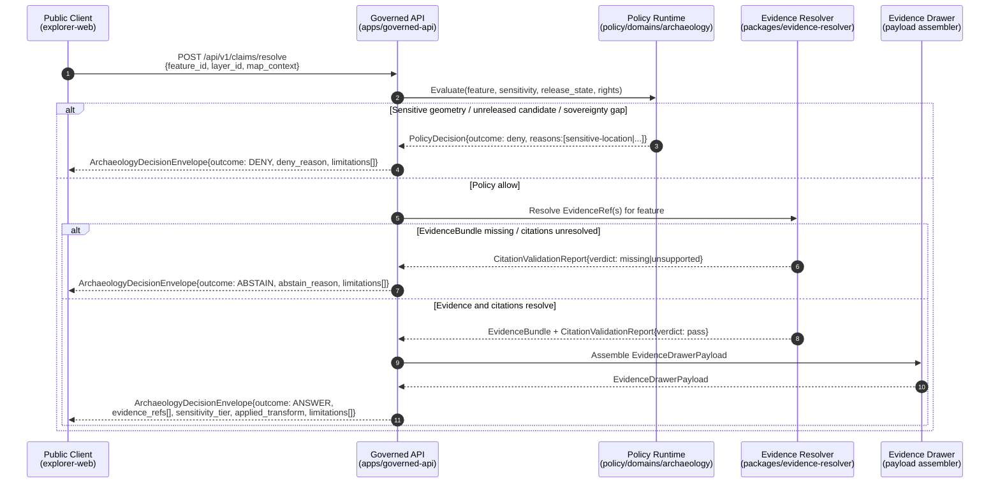

# Archaeology — API Contracts

> Governed API surface, DTOs, finite outcomes, and sensitivity gates for the Archaeology and Cultural Heritage domain. This document **explains**; canonical authority lives in `contracts/`, `schemas/`, and `policy/`.

<!-- [KFM_META_BLOCK_V2]
doc_id: kfm://doc/archaeology-api-contracts
title: Archaeology — API Contracts
type: standard
version: v0.1
status: draft
owners: TBD — Archaeology domain steward; Cultural review board; Governed API owner; Security steward
created: 2026-05-15
updated: 2026-05-15
policy_label: public
related: [
  docs/domains/archaeology/README.md,
  docs/domains/archaeology/SENSITIVITY.md,
  docs/architecture/governed-api.md,
  contracts/runtime/decision_envelope.md,
  contracts/runtime/runtime_response_envelope.md,
  contracts/evidence/evidence_bundle.md,
  schemas/contracts/v1/runtime/,
  schemas/contracts/v1/domains/archaeology/,
  policy/domains/archaeology/,
  docs/doctrine/directory-rules.md
]
tags: [kfm, archaeology, api, contracts, governed-api, sensitivity, trust-membrane]
notes: [Repository is NOT mounted in this session. Every path, route, route name, schema file, contract file, and policy bundle reference is PROPOSED until verified against the live repo.]
[/KFM_META_BLOCK_V2] -->

**Status:** draft &nbsp;·&nbsp; **Owners:** TBD (Archaeology domain steward · Cultural review board · API owner) &nbsp;·&nbsp; **Last updated:** 2026‑05‑15

---

## Contents

1. [Scope and authority](#1-scope-and-authority)
2. [Trust-membrane recap](#2-trust-membrane-recap)
3. [Finite-outcome contract](#3-finite-outcome-contract)
4. [Governed API surfaces (archaeology lane)](#4-governed-api-surfaces-archaeology-lane)
5. [Object families and DTOs](#5-object-families-and-dtos)
6. [`ArchaeologyDecisionEnvelope` (PROPOSED)](#6-archaeologydecisionenvelope-proposed)
7. [EvidenceBundle linkage and cite-or-abstain](#7-evidencebundle-linkage-and-cite-or-abstain)
8. [Sensitivity gates baked into the contract surface](#8-sensitivity-gates-baked-into-the-contract-surface)
9. [Click-to-drawer sequence (diagram)](#9-click-to-drawer-sequence-diagram)
10. [Negative-outcome register](#10-negative-outcome-register)
11. [Governed AI behavior on this lane](#11-governed-ai-behavior-on-this-lane)
12. [Cross-references — where these objects actually live](#12-cross-references--where-these-objects-actually-live)
13. [Verification backlog](#13-verification-backlog)
14. [Related docs](#14-related-docs)

---

## 1. Scope and authority

This document is the **archaeology lane's reading guide** to the KFM governed API. It enumerates the API surfaces a public client, steward console, or Focus Mode runtime will touch when consuming archaeology data, and it names the DTOs that flow across those surfaces.

**What this doc is.**

- A human-facing **explanation** of the API surface as it applies to the Archaeology and Cultural Heritage lane.
- An index of object families, finite outcomes, and sensitivity gates **that already live elsewhere** in canonical homes.
- A cross-reference map between `contracts/`, `schemas/`, `policy/`, and `docs/`.

**What this doc is not.**

- It is **not** an authority. Material decisions live in:
  - **Object meaning** → `contracts/domains/archaeology/` and `contracts/runtime/` (Markdown).
  - **Machine shape** → `schemas/contracts/v1/domains/archaeology/` and `schemas/contracts/v1/runtime/` (JSON Schema, per ADR-0001).
  - **Admissibility** → `policy/domains/archaeology/` and `policy/sensitivity/archaeology/`.
  - **Enforceability proof** → `tests/domains/archaeology/` + `fixtures/domains/archaeology/`.
- It is **not** an inventory of implemented routes. The repository is **not mounted** in this session; every route, schema path, and contract path here is `PROPOSED` until verified. Directory Rules §13.5 names "Documentation as truth" as an anti-pattern; this doc explains, it does not decide.

> [!IMPORTANT]
> Archaeology is a **deny-by-default** domain. Exact site locations, burial, human remains, sacred sites, unresolved cultural sensitivity, collection security, private-landowner details, and looting-risk exposure **fail closed** at the API boundary. No request, regardless of authentication tier, releases unredacted exact geometry at T0 (Open) without explicit cultural review and an attached `RedactionReceipt`. See [§8](#8-sensitivity-gates-baked-into-the-contract-surface).

[Back to top](#contents)

---

## 2. Trust-membrane recap

The archaeology API obeys KFM's universal trust-membrane rules. Recapped here for context only — these are not local to archaeology:

| Rule | Source | Domain-specific consequence |
|---|---|---|
| Public clients consume **governed APIs**, not canonical or internal stores. | Directory Rules §11; trust-membrane doctrine | No archaeology browser code reads `data/raw/archaeology/` or `data/catalog/`. |
| **No direct model client.** Focus Mode goes through governed API. | Whole-UI Governed AI Expansion; Master MapLibre §10 | Archaeology Focus Mode answers carry `AIReceipt` and finite outcomes. |
| **No unreleased tile load.** `addSource`/`addLayer` blocked unless `LayerManifest`, `TileArtifactManifest`, `MapReleaseManifest`, `PolicyDecision`, and release status allow it. | Master MapLibre §10 | Archaeology layers require explicit release status, even for steward consoles. |
| **No sensitive geometry hidden only by style.** | Master MapLibre §10; Atlas v1.1 §24.5.1 | Exact archaeology geometry is **generalized at the data layer** (e.g., H3 r7 cell or coarser), not at the style layer. |
| **No popup as Evidence Drawer substitute.** | Master MapLibre §10 | Archaeology feature claims surface via `EvidenceDrawerPayload`, never as raw popup text. |
| **No uncited export.** | Master MapLibre §10; cite-or-abstain doctrine | Archaeology screenshots, story nodes, and Focus answers carry `CitationValidationReport` references. |
| Promotion is a **governed state transition**, not a file move. | Lifecycle invariant; Directory Rules §0 | Archaeology candidates do not appear on public layers without `PromotionDecision`. |

[Back to top](#contents)

---

## 3. Finite-outcome contract

Every governed API call into the archaeology lane resolves to **one of four** outcomes. This is non-negotiable and applies uniformly across read, query, and AI-mediated endpoints. Ambiguous truth states are not permitted.

| Outcome | Meaning | When it fires (archaeology) |
|---|---|---|
| `ANSWER` | Released, cited, policy-cleared content. | Public-safe generalized geometry; survey-coverage summaries; chronology assertions backed by an `EvidenceBundle` whose citations resolve and pass `CitationValidationReport`. |
| `ABSTAIN` | Cannot answer with the evidence at hand. | Missing or unresolved `EvidenceRef`; no released `EvidenceBundle` covers the requested claim; stale state where freshness materially matters; insufficient corroboration for a contested chronology. |
| `DENY` | Allowed evidence exists, but policy/rights/sensitivity/release state blocks release at the requested tier. | Exact site coordinates, burial/sacred/human-remains content, restricted collection records, unreleased candidate features, sovereignty review absent. |
| `ERROR` | Validation or gate execution failed. | Schema mismatch; malformed feature reference; digest mismatch; release-manifest integrity failure. |

> [!CAUTION]
> `DENY` and `ABSTAIN` are **not interchangeable**. A request for an exact burial coordinate that returns `ABSTAIN` instead of `DENY` would leak the fact that evidence exists but is being withheld. Conversely, a request for content where no evidence exists at all must return `ABSTAIN`, not `DENY`. The policy layer is responsible for choosing the correct outcome and emitting a `PolicyDecision` with reason codes.

[Back to top](#contents)

---

## 4. Governed API surfaces (archaeology lane)

The archaeology lane **reuses** the general KFM governed API surface. There are no archaeology-specific routes; the lane is identified by the domain segment in the request (or by the layer / claim / evidence id resolving to archaeology). Atlas v1.1 §15.J records the Archaeology API surface as PROPOSED with **routes TBD**.

The following surfaces are PROPOSED and have been documented in upstream architecture material; specific path strings are illustrative until verified against `apps/governed-api/`.

| Surface | Proposed route (illustrative) | DTO out | Finite outcomes | Status |
|---|---|---|---|---|
| Layer catalog | `GET /api/v1/layers` (filter: `domain=archaeology`) | `LayerManifest[]` | `ANSWER` / `ABSTAIN` / `ERROR` | PROPOSED |
| Layer descriptor | `GET /api/v1/layers/{layer_id}` | `LayerManifest` | `ANSWER` / `DENY` / `ERROR` | PROPOSED |
| Layer release manifest | `GET /api/v1/layers/{layer_id}/manifest` | `MapReleaseManifest` | `ANSWER` / `ABSTAIN` / `DENY` / `ERROR` | PROPOSED |
| Map feature claim | `POST /api/v1/claims/resolve` | `EvidenceDrawerPayload` | `ANSWER` / `ABSTAIN` / `DENY` / `ERROR` | PROPOSED |
| Evidence bundle | `GET /api/v1/evidence/{bundle_id}` | `EvidenceBundle` | `ANSWER` / `DENY` / `ERROR` | PROPOSED |
| Focus Mode (archaeology context) | `POST /api/v1/focus/query` | `FocusModeResponse` + `AIReceipt` | `ANSWER` / `ABSTAIN` / `DENY` / `ERROR` | PROPOSED |
| Correction submit | `POST /api/v1/corrections` | `CorrectionNoticeCandidate` ack | `ACCEPTED` / `DENY` / `ERROR` | PROPOSED |
| Review decision (steward) | `POST /api/v1/review/{queue}/{id}/decision` | `ReviewRecord` | `ALLOW` / `RESTRICT` / `DENY` / `ERROR` | PROPOSED |
| Steward read-only queue | `GET /api/v1/review/queue` (filter: `domain=archaeology`) | `ReviewRecord[]` | `ANSWER` / `DENY` / `ERROR` | PROPOSED |

> [!NOTE]
> Routes are PROPOSED. The Whole-UI Governed AI Expansion records `apps/governed-api/src/routes/*.ts` paths as **VERIFY THEN CREATE/ADAPT**, with the explicit note that if the actual repo uses `apps/governed_api/` or `packages/api/`, paths must be adapted and an ADR recorded. The same caveat applies to every row above.

[Back to top](#contents)

---

## 5. Object families and DTOs

The DTOs the archaeology lane emits and consumes. **None of these are archaeology-only** — they are cross-cutting object families. The archaeology lane participates by:

1. Naming its own object types in `contracts/domains/archaeology/` (e.g., `Archaeological Site`, `Survey`, `Feature`, `ArtifactRecord`, `CandidateFeature`, `RemoteSensingAnomaly`, `SensitivityTransform`).
2. Carrying a domain segment in `LayerManifest.layer_id` and in evidence claims.
3. Inheriting the universal envelope shapes.

Field intents below are PROPOSED summaries drawn from architecture material; the canonical field list lives in the named contract / schema home.

| Object family | Field intent (PROPOSED) | Canonical contract home (PROPOSED) | Canonical schema home (PROPOSED) |
|---|---|---|---|
| `SourceDescriptor` | `source_id`, `source_role`, `authority`, `rights`, `cadence`, `access`, `sensitivity`, citation rules. | `contracts/source/source_descriptor.md` | `schemas/contracts/v1/source/source_descriptor.schema.json` |
| `EvidenceRef` | Pointer that resolves to an `EvidenceBundle`. | `contracts/evidence/evidence_ref.md` | `schemas/contracts/v1/evidence/evidence_ref.schema.json` |
| `EvidenceBundle` | `bundle_id`, `source_refs`, `claims`, `citations`, `spec_hash` (JCS+SHA-256), `rights_status`, `sensitivity`, `limitations`, `receipts`. | `contracts/evidence/evidence_bundle.md` | `schemas/contracts/v1/evidence/evidence_bundle.schema.json` |
| `EvidenceDrawerPayload` | `feature_id`, `layer_id`, `evidence_bundle_refs`, source summary, citations, policy state, release state, limitations. | `contracts/ui/evidence_drawer_payload.md` | `schemas/contracts/v1/ui/evidence_drawer_payload.schema.json` |
| `LayerManifest` | `layer_id`, `title`, `geometry_type`, `source_id`, `source_layer`, `evidence_ref_field`, `temporal_fields`, `policy_label`, `release_state`, `public_safe`, `sensitivity`. | `contracts/release/layer_manifest.md` | `schemas/contracts/v1/map/layer_manifest.schema.json` |
| `TileArtifactManifest` | `artifact_id`, `type`, `url`, `digest`, `zooms`, `bounds`, `format`, `source_layers`, attestation. | `contracts/release/tile_artifact_manifest.md` | `schemas/contracts/v1/map/tile_artifact_manifest.schema.json` |
| `MapReleaseManifest` | `release_id`, `layer_manifests`, `style_manifest`, `tile_artifacts`, `release_time`, `supersedes`, `rollback_target`, `cache_keys`. | `contracts/release/map_release_manifest.md` | `schemas/contracts/v1/map/map_release_manifest.schema.json` |
| `DecisionEnvelope` | Finite-outcome wrapper used by APIs, runtime, UI/AI payloads to avoid ambiguous truth states. | `contracts/runtime/decision_envelope.md` | `schemas/contracts/v1/runtime/decision_envelope.schema.json` |
| `RuntimeResponseEnvelope` | Governed AI/API response wrapper carrying outcome, evidence context, citations, policy state, validation result. | `contracts/runtime/runtime_response_envelope.md` | `schemas/contracts/v1/runtime/runtime_response_envelope.schema.json` |
| `PolicyDecision` | `decision_id`, `input_ref`, `policy_id`, `outcome`, `obligations`, `reasons`, timestamps, reviewer. | `contracts/runtime/policy_decision.md` | `schemas/contracts/v1/policy/policy_decision.schema.json` |
| `PromotionDecision` | `promotion_id`, `candidate_ref`, gates, outcome, reviewer, `rollback_target`, reasons. | `contracts/release/promotion_decision.md` | `schemas/contracts/v1/release/promotion_decision.schema.json` |
| `AIReceipt` | `receipt_id`, `model_provider`, `model_id`, `context_hash`, `evidence_ids`, `citation_report_id`, `policy_ids`, runtime, `outcome`. **Never a substitute for `EvidenceBundle`.** | `contracts/runtime/ai_receipt.md` | `schemas/contracts/v1/ai/ai_receipt.schema.json` |
| `CitationValidationReport` | `report_id`, `answer_id`, `citation_refs`, `resolved`, `missing`, `unsupported`, `verdict`. | `contracts/evidence/citation_validation_report.md` | `schemas/contracts/v1/evidence/citation_validation_report.schema.json` |
| `ReviewRecord` | Steward review state, notes, decisions, release / correction references. | `contracts/governance/review_record.md` | `schemas/contracts/v1/review/review_record.schema.json` |
| `CorrectionNotice` | Public correction lineage object linked to claims and releases. | `contracts/correction/correction_notice.md` | `schemas/contracts/v1/review/correction_notice.schema.json` |
| `RedactionReceipt` / `SensitivityTransform` | Receipt of the transform applied to lift a record from T4/T3 to T2/T1 (generalization, aggregation, fuzzing). | `contracts/domains/archaeology/sensitivity_transform.md` | `schemas/contracts/v1/domains/archaeology/sensitivity_transform.schema.json` |

[Back to top](#contents)

---

## 6. `ArchaeologyDecisionEnvelope` (PROPOSED)

Atlas v1.1 §15.J names `ArchaeologyDecisionEnvelope` as the **archaeology feature / detail resolver's** outbound DTO. It is a **lane-specific specialization** of `DecisionEnvelope` / `RuntimeResponseEnvelope`, not a parallel envelope family.

> [!NOTE]
> `ArchaeologyDecisionEnvelope` is PROPOSED. It may collapse into a generic `DecisionEnvelope` with a domain-tagged payload, or it may exist as a named subtype. Resolution requires an ADR and inspection of `contracts/runtime/` and `schemas/contracts/v1/runtime/`.

Field intent (PROPOSED):

| Field | Intent |
|---|---|
| `outcome` | Finite — `ANSWER` / `ABSTAIN` / `DENY` / `ERROR`. |
| `feature_id` | Domain-scoped feature identifier (e.g., a generalized site cell, a survey extent, a candidate anomaly). **Never an exact-coordinate identifier on public surfaces.** |
| `layer_id` | The `LayerManifest.layer_id` the feature belongs to. |
| `evidence_refs[]` | `EvidenceRef` list; each MUST resolve to a released `EvidenceBundle` for `ANSWER` outcomes. |
| `policy_decision` | `PolicyDecision` reference covering sensitivity, rights, release state. |
| `citation_validation` | `CitationValidationReport` reference; `ANSWER` requires `verdict = pass`. |
| `release_state` | Current state of the underlying record (published, candidate, restricted, denied). |
| `sensitivity_tier` | Effective tier at the **time of release**, post-transform: T0 / T1 / T2 / T3 / T4 (Atlas v1.1 §24.5.1). |
| `applied_transform` | Reference to `SensitivityTransform` / `RedactionReceipt` when generalization, aggregation, or redaction was applied. |
| `limitations[]` | Human-readable statements (e.g., "geometry generalized to H3 r7 cell; exact location withheld"). |
| `correction_ref` | Optional `CorrectionNotice` reference if a public correction supersedes earlier content. |
| `rollback_target` | Optional pointer to the prior released version. |
| `abstain_reason` / `deny_reason` / `error_reason` | Reason codes; populated only on non-`ANSWER` outcomes. |
| `freshness` | Retrieval/observed/valid time context where material. |

**Invariants** (PROPOSED, to be enforced by `tests/domains/archaeology/`):

- `outcome == ANSWER` ⇒ `evidence_refs.length ≥ 1` AND every ref resolves AND `citation_validation.verdict == pass` AND `policy_decision.outcome == allow`.
- `outcome == DENY` ⇒ `policy_decision.outcome ∈ {deny, restrict}` AND `deny_reason` carries a structured reason code (e.g., `sensitive-location`, `unreleased-candidate`, `rights-unresolved`, `sovereignty-review-required`).
- `outcome == ABSTAIN` ⇒ `evidence_refs.length == 0` OR `citation_validation.verdict ∈ {missing, unsupported}`.
- For sensitive object classes (burial, human remains, sacred sites), **no transform exists that releases the record to T0**. `ANSWER` at T0 is impossible by contract.

[Back to top](#contents)

---

## 7. EvidenceBundle linkage and cite-or-abstain

Every `ANSWER` outcome in the archaeology lane is anchored in an `EvidenceBundle`. The bundle is the **truth-bearing object**; the envelope is the **delivery wrapper**.

Properties carried over from KFM evidence doctrine (Pass 10, C8-04):

- `EvidenceBundle` is a JSON-LD document packaging a graph fragment (entities, claims, places, events), the run receipts that justify each claim, and authority crosswalks (Wikidata, LCNAF, GNIS, ITIS, and where archaeology-relevant: state SHPO IDs, NRHP IDs, trinomial site numbers — all PROPOSED for inclusion).
- The bundle is content-addressed by `spec_hash` computed via **JCS + SHA-256**.
- A consumer that fetches the bundle can verify it offline: validate against schema, recompute `spec_hash`, resolve each `evidence_refs[*].uri`, recompute its digest, and verify any DSSE signatures.

**Cite-or-abstain rule (CONFIRMED doctrine).**

- An archaeology claim with no `EvidenceBundle` does **not** flow to the public surface as an `ANSWER`. The contract requires `ABSTAIN`.
- A claim whose citations exist but fail resolution returns `ABSTAIN` with `citation_validation.verdict == missing`.
- A claim whose citations resolve but do not support the claim returns `ABSTAIN` with `citation_validation.verdict == unsupported`.

> [!IMPORTANT]
> AI-mediated answers (`FocusModeResponse`) inherit this rule strictly. The Whole-UI Governed AI Expansion records the universal AI behavior: **DENY direct RAW/WORK/QUARANTINE access, sensitive-location exposure, restricted personal/DNA inference, emergency-alerting replacement, or uncited authoritative claims.** For archaeology specifically: AI summaries explain that clusters are **generalized cultural activity zones, not exact archaeological locations**, when underlying geometry has been generalized.

[Back to top](#contents)

---

## 8. Sensitivity gates baked into the contract surface

The archaeology lane's API is shaped by Atlas v1.1 §24.5 sensitivity tiers and §20.5 Deny-by-Default Register. These are not policy bolted onto the API — they are **contract invariants**.

| Object class | Default tier | What the API will return at T0 (public) | Lift path |
|---|---|---|---|
| Site location (general) | **T4** | `DENY` for exact coordinates; `ANSWER` only when generalized geometry (e.g., H3 r7 or coarser cell) is requested and `SensitivityTransform` / `RedactionReceipt` is attached to the underlying record. | Steward review + cultural review + generalized geometry → T2 (steward) or T1 (public). |
| Human remains, burial, sacred sites | **T4** | `DENY` at every audience. No transform releases this to T0. | T3 only under explicit named sovereignty authorization. |
| Survey project record | T1 (default, PROPOSED) | `ANSWER` for coverage extent and project-level metadata. | Per-survey review may restrict to T2/T3. |
| Candidate feature (LiDAR / geophysics / remote-sensing) | T2 (PROPOSED) | `ABSTAIN` or `DENY` until promoted; `ANSWER` only after `PromotionDecision`. | Steward review elevates from candidate to feature. |
| Collection accession (security-relevant) | T3 (PROPOSED) | `DENY` for storage location; `ANSWER` for cataloging metadata without security detail. | Named-agreement only. |
| Chronology assertion | T0 (PROPOSED) | `ANSWER` when EvidenceBundle present. | n/a — public-safe by nature. |
| Steward-only review map | T2 / T3 | `DENY` outside the steward console; `ANSWER` inside a role-gated request. | Restricted to authenticated reviewers / domain stewards. |

**Sensitive-geometry hard rule.** Master MapLibre material records that **any geometry below H3 r7 is prohibited for sensitive archaeology products without review**. The contract layer enforces this — sensitive geometry hidden only by style is a contract violation, not a styling preference.

> [!WARNING]
> Examples of geometry resolution above are **illustrative**. The exact threshold (H3 r7 vs. another resolution; an alternative scheme such as Geohash or quad-key; the per-class deltas) is **NEEDS VERIFICATION** against the live `policy/sensitivity/archaeology/` rules and the `SensitivityTransform` schema. Do not implement a numeric threshold from this document alone.

[Back to top](#contents)

---

## 9. Click-to-drawer sequence (diagram)

This sequence illustrates the **happy-path `ANSWER`** for a public client clicking a released archaeology layer feature, plus the two most common branch points (`DENY` on sensitivity, `ABSTAIN` on missing evidence).

> [!NOTE]
> The diagram reflects **proposed** trust-membrane structure consolidated from the Whole-UI Governed AI Expansion (governed API routes), Master MapLibre §10 (no popup as drawer; no direct model client), and Atlas v1.1 §15.J–L (archaeology API surface + AI rules). Actor names map to canonical roots (`apps/governed-api/`, `policy/`, `packages/evidence-resolver/`) per Directory Rules §6–§7; these are PROPOSED paths.

[Back to top](#contents)

---

## 10. Negative-outcome register

A compact register of the reason codes that should be present at each non-`ANSWER` outcome. Reason codes are PROPOSED; the canonical list lives in `policy/domains/archaeology/` and `contracts/runtime/policy_decision.md`.

<b>DENY reason codes (PROPOSED)</b>

| Code | Trigger | Example |
|---|---|---|
| `sensitive-location` | Request would expose exact geometry of a T4 record. | Click on a generalized cell that resolves to a burial site. |
| `sovereignty-review-required` | Cultural or tribal sovereignty review not on file. | Sacred-site related claim from a sovereignty-tagged source. |
| `rights-unresolved` | Source rights uncertain or restricted. | Licensed survey report without redistribution clause. |
| `unreleased-candidate` | `release_state ∉ {published}`. | LiDAR anomaly still in QUARANTINE or PROCESSED. |
| `restricted-collection` | Collection accession with security restrictions. | Storage-location detail on a portable artifact record. |
| `human-remains` | Human-remains content; T4 absolute. | Any direct request for human-remains location or imagery. |
| `looting-risk` | Steward judgment: release would meaningfully increase looting risk. | Coarse cell still informative enough to be denied. |
| `private-landowner` | Private-landowner identifying information present. | Survey parcel join not aggregated. |
| `release-manifest-missing` | Layer lacks `MapReleaseManifest`. | Layer staged but not released. |

<b>ABSTAIN reason codes (PROPOSED)</b>

| Code | Trigger |
|---|---|
| `evidence-missing` | No `EvidenceBundle` covers the requested claim. |
| `citation-unresolved` | One or more `EvidenceRef.uri` failed to resolve. |
| `citation-unsupported` | Citations resolved but did not support the claim. |
| `stale-state` | Freshness gate failed for a freshness-material claim. |
| `digest-mismatch` | `spec_hash` mismatch on the underlying bundle. |
| `insufficient-corroboration` | Contested chronology, conflicting authoritative sources, no resolved disagreement. |

<b>ERROR reason codes (PROPOSED)</b>

| Code | Trigger |
|---|---|
| `schema-mismatch` | Inbound or outbound DTO failed schema validation. |
| `malformed-feature-ref` | `feature_id` does not parse. |
| `gate-execution-failure` | Policy bundle or validator crashed. |
| `release-manifest-integrity` | `MapReleaseManifest` integrity check failed. |
| `unavailable-evidence-store` | Evidence resolver upstream failure. |

[Back to top](#contents)

---

## 11. Governed AI behavior on this lane

Atlas v1.1 §15.L and the Whole-UI Governed AI Expansion together set the rules for AI on this lane.

**AI may** (CONFIRMED doctrine / PROPOSED implementation):

- Summarize **released** archaeology `EvidenceBundle`s.
- Compare evidence across released bundles.
- Explain limitations of an answer (e.g., "this cluster represents generalized cultural activity, not an exact site").
- Draft **steward-review notes** that are returned to a steward, not to the public.

**AI must `ABSTAIN`** when:

- No released `EvidenceBundle` supports the claim.
- `CitationValidationReport.verdict ∈ {missing, unsupported}`.
- The map context contains only candidate or restricted layers.

**AI must `DENY`** when:

- Policy, rights, sensitivity, or release state blocks the request.
- The request would imply or supply exact location for a T3/T4 record.
- The user attempts to ask the AI to bypass the evidence layer ("just guess where the site is").

**AI is never the root truth source.** `AIReceipt` is an accountability record, not a substitute for `EvidenceBundle`. Whole-UI doctrine: AI sits **behind** the governed API; `apps/explorer-web/` has no direct model client.

[Back to top](#contents)

---

## 12. Cross-references — where these objects actually live

This section is a **single-source-of-pointer table** so readers do not look here for canonical authority.

| If you want… | Look at (PROPOSED) |
|---|---|
| Object meaning (semantic Markdown) | `contracts/runtime/`, `contracts/evidence/`, `contracts/release/`, `contracts/domains/archaeology/` |
| Machine shape (JSON Schema) | `schemas/contracts/v1/runtime/`, `schemas/contracts/v1/evidence/`, `schemas/contracts/v1/policy/`, `schemas/contracts/v1/map/`, `schemas/contracts/v1/domains/archaeology/` |
| Admissibility / allow / deny / restrict | `policy/domains/archaeology/`, `policy/sensitivity/archaeology/`, `policy/rights/`, `policy/release/` |
| Test proof | `tests/domains/archaeology/` |
| Valid / invalid / golden samples | `fixtures/domains/archaeology/` |
| Actual route implementations | `apps/governed-api/src/routes/` (verify name and convention against mounted repo) |
| Domain doctrine (orientation, ubiquitous language, sensitivity tiers, sources, FAQ) | `docs/domains/archaeology/` (this folder) |
| Universal governed-API doctrine | `docs/architecture/governed-api.md`, `docs/doctrine/trust-membrane.md` |
| Schema-home convention | `docs/doctrine/directory-rules.md` §7.4; `docs/adr/ADR-0001-schema-home.md` |
| Sensitivity tier scheme (T0–T4) | Atlas v1.1 §24.5; `docs/domains/archaeology/SENSITIVITY.md` (PROPOSED) |

> [!NOTE]
> Every path above is PROPOSED. Directory Rules §0 records that "Authority of any specific path quoted here [is] PROPOSED until verified against mounted-repo evidence." This document inherits that posture.

[Back to top](#contents)

---

## 13. Verification backlog

These items are explicitly **not resolved** by this document. They MUST be tracked in `docs/registers/VERIFICATION_BACKLOG.md` (PROPOSED) and resolved via inspection of the mounted repo, an ADR, or both.

| # | Open item | What would settle it |
|---|---|---|
| 1 | Is the envelope `ArchaeologyDecisionEnvelope` a named subtype or a generic `DecisionEnvelope` with a domain-tagged payload? | ADR + inspection of `contracts/runtime/` and `schemas/contracts/v1/runtime/`. |
| 2 | Exact set of `DENY` / `ABSTAIN` / `ERROR` reason codes for archaeology. | `policy/domains/archaeology/` policy bundle + `tests/domains/archaeology/` negative fixtures. |
| 3 | Generalization threshold (H3 r7 vs. alternative) and per-object-class deltas. | `policy/sensitivity/archaeology/` + `schemas/contracts/v1/domains/archaeology/sensitivity_transform.schema.json` + steward and cultural review sign-off. |
| 4 | Whether `apps/governed-api/` is the canonical executable trust-membrane path in the live repo, or whether `apps/governed_api/` / `packages/api/` is used (an ADR is required either way per Whole-UI report). | Mounted repo inspection + ADR. |
| 5 | Canonical list of authority crosswalks the archaeology `EvidenceBundle` MUST carry (e.g., SHPO IDs, NRHP IDs, trinomial site numbers, Wikidata, LCNAF, GNIS). | `contracts/evidence/evidence_bundle.md` + steward review. |
| 6 | Steward review queue routing for archaeology (named queues, role bindings). | `policy/domains/archaeology/` + `apps/review-console/`. |
| 7 | Rollback drill for an archaeology emergency public-layer disablement (carried over from Atlas v1.1 §15.N). | Documented runbook + dry-run rollback card. |
| 8 | Verification of the steward authority and confidentiality terms for archaeology source agreements. | Source ledger + signed agreements (out-of-band). |

[Back to top](#contents)

---

## 14. Related docs

> [!NOTE]
> Targets below are PROPOSED. Verify before linking from other docs.

- `docs/domains/archaeology/README.md` — domain landing and lane pattern.
- `docs/domains/archaeology/SENSITIVITY.md` — T0–T4 tier matrix, allowed transforms, gates.
- `docs/domains/archaeology/SOURCES.md` — source families, rights, sensitivity, cadence.
- `docs/domains/archaeology/PIPELINE.md` — RAW → PUBLISHED gates for this lane.
- `docs/domains/archaeology/CROSS_DOMAIN.md` — edges to Spatial Foundation, Roads/Rail, Settlements, Hazards, People/Land.
- `docs/domains/archaeology/VALIDATORS.md` — test/fixture/validator inventory.
- `docs/architecture/governed-api.md` — universal trust-membrane and route doctrine.
- `docs/doctrine/trust-membrane.md` — the membrane in human terms.
- `docs/doctrine/truth-posture.md` — cite-or-abstain.
- `docs/doctrine/lifecycle-law.md` — RAW → PUBLISHED.
- `docs/doctrine/directory-rules.md` — placement law.
- `docs/adr/ADR-0001-schema-home.md` — schemas live under `schemas/contracts/v1/...`.

---

<b>Last updated:</b> 2026-05-15 &nbsp;·&nbsp; <b>Authority:</b> explanation only — canonical homes named above govern. &nbsp;·&nbsp; <b>Repository inspection:</b> not mounted in this session. &nbsp;·&nbsp; <a href="#archaeology--api-contracts">↑ Back to top</a>
