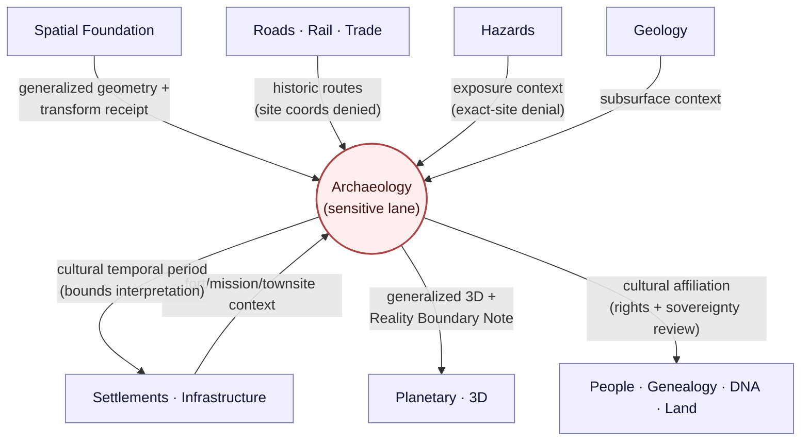

<!-- [KFM_META_BLOCK_V2]
doc_id: kfm://doc/domain-archaeology-architecture
title: Archaeology Domain — Architecture
type: standard
version: v1.2
status: draft
owners: TODO — Archaeology domain steward · Sensitivity reviewer · Cultural/sovereignty review liaison · Docs steward · Release authority
created: 2026-05-15
updated: 2026-05-29
policy_label: public
related:
  - docs/doctrine/ai-build-operating-contract.md
  - docs/doctrine/directory-rules.md
  - docs/doctrine/lifecycle-law.md
  - docs/doctrine/trust-membrane.md
  - docs/doctrine/truth-posture.md
  - docs/doctrine/authority-ladder.md
  - docs/architecture/governed-api.md
  - docs/domains/archaeology/README.md
  - docs/domains/archaeology/CANONICAL_PATHS.md          # path-namespace authority for this lane
  - docs/domains/archaeology/CONTINUITY_INVENTORY.md     # continuity register
  - docs/domains/archaeology/CROSS_DOMAIN.md             # cross-lane boundary register
  - docs/runbooks/archaeology/PROMOTION_RUNBOOK.md
  - docs/runbooks/archaeology/ROLLBACK_RUNBOOK.md
  - contracts/domains/archaeology/
  - schemas/contracts/v1/domains/archaeology/
  - policy/sensitivity/archaeology/
tags: [kfm, domain, archaeology, architecture, sensitive-lane, deny-default, doctrine-adjacent]
notes:
  - "Pinned to CONTRACT_VERSION = \"3.0.0\" per ai-build-operating-contract.md §1.3 / §8 (truth labels) and §37 (versioning + CONTRACT_VERSION pinning convention)."
  - "Doctrine is CONFIRMED from [ENCY] §7.13, Atlas v1.1 §24.13, [DOM-ARCH], [DIRRULES] §12, and the v3.0 §23.2 sensitive-domain matrix (matrix itself PROPOSED pending steward ratification). Implementation maturity is UNKNOWN until verified against mounted-repo evidence."
  - "v1.2 RECONCILES the path namespace: this file now uses the Directory Rules §12 form (contracts/domains/archaeology/, schemas/contracts/v1/domains/archaeology/), matching CANONICAL_PATHS.md, CONTINUITY_INVENTORY.md, and CROSS_DOMAIN.md. The Atlas v1.1 §24.13 / ENCY §7.13 shorthand (contracts/archaeology/) is recorded as LINEAGE. Resolution basis: §2.1 authority order — Directory Rules §12 (CONFIRMED rule) outranks the Atlas crosswalk (PROPOSED). Closes OQ-ARCH-01 in favor of the §12 form; a uniform ADR-domains-segment may still revisit it repo-wide."
  - "DOM-ARCH names two overlapping object lists — the §B/ENCY collapsed set and the §E decomposed spine. Both are preserved; the casing/decomposition conflict is tracked as OQ-ARCH-04 / OQ-CI-01."
[/KFM_META_BLOCK_V2] -->

# Archaeology Domain — Architecture

Governed, evidence-first, sensitivity-bounded architecture for KFM's Archaeology and Cultural Heritage lane — where **exact site locations deny by default** and every public claim must be downstream of evidence, rights, steward review, and release state.


| Field | Value |
|---|---|
| **Status** | Draft · doctrine CONFIRMED · implementation PROPOSED · path namespace RECONCILED to Directory Rules §12 (v1.2) |
| **Pinned contract** | `CONTRACT_VERSION = "3.0.0"` (per `ai-build-operating-contract.md` §1.3 / §8, §37) |
| **Owners** | TODO — Archaeology domain steward · Sensitivity reviewer · Cultural/sovereignty review liaison |
| **Required additional reviewer (§23.2)** | Tribal/cultural reviewer · rights-holder representative |
| **Authority basis** | `[CONTRACT v3.0]` §23.2 · `[ENCY]` §7.13 · Atlas v1.1 §24.13, §24.14 · `[DOM-ARCH]` · `[DIRRULES]` §12, §13 · `[GAI]` |
| **Public posture** | `DENY` exact site coordinates by default · generalize to county/region · `RedactionReceipt` required before any release |
| **Lifecycle** | RAW → WORK / QUARANTINE → PROCESSED → CATALOG / TRIPLET → PUBLISHED |
| **Last updated** | 2026-05-29 |

> [!CAUTION]
> This domain is on the **sensitive lane**. Per `ai-build-operating-contract.md` §23.2 (sensitive-domain decision matrix), the default disposition for archaeology site locations is **`DENY` exact coordinates** — generalize to county/region. The §23.2 matrix is **PROPOSED** as of v3.0 (steward ratification pending); until ratified, the **most restrictive applicable row applies**, which only strengthens the gate. Burial / human-remains records and sacred-place attributes are **`DENY` exact location** with cultural reviewer and rights-holder rep gates. **No section of this document authorizes a release**; releases are governed by `ReleaseManifest`, `MapReleaseManifest`, `EvidenceBundle`, `RedactionReceipt`, `PolicyDecision`, and an explicit cultural / steward `ReviewRecord`.

---

## Mini-TOC

1. [Mission and boundary](#1-mission-and-boundary)
2. [Scope — owned and not owned](#2-scope--owned-and-not-owned)
3. [Ubiquitous language](#3-ubiquitous-language)
4. [Lane layout](#4-lane-layout)
5. [Canonical object families](#5-canonical-object-families)
6. [Source families and source roles](#6-source-families-and-source-roles)
7. [Lifecycle and pipeline shape](#7-lifecycle-and-pipeline-shape)
8. [Sensitivity, rights, and publication posture](#8-sensitivity-rights-and-publication-posture)
9. [Cross-lane relations](#9-cross-lane-relations)
10. [Governed API surfaces and finite outcomes](#10-governed-api-surfaces-and-finite-outcomes)
11. [Governed AI behavior](#11-governed-ai-behavior)
12. [Validators, tests, and fixtures](#12-validators-tests-and-fixtures)
13. [Publication, correction, and rollback](#13-publication-correction-and-rollback)
14. [Open verification backlog](#14-open-verification-backlog)
15. [Open questions register & open ADRs](#15-open-questions-register--open-adrs)
16. [Changelog](#16-changelog)
17. [Definition of done](#17-definition-of-done)
18. [Related docs](#18-related-docs)

---

## 1. Mission and boundary

**CONFIRMED doctrine** — The Archaeology lane preserves archaeological and cultural heritage knowledge through strict sensitivity, cultural / steward review, a candidate-versus-confirmed distinction, and exact-location denial by default. It owns archaeological sites, surveys, artifacts, features, contexts, excavation units, remote-sensing anomalies, LiDAR candidates, geophysics, 3D documentation, collections / accessions, and chronology. It **MUST NOT** publish exact sites, sacred places, burial / human-remains records, or culturally sensitive material without proper review. (`[ENCY]` §7.13; `[DOM-ARCH]` §A–B; `[CONTRACT v3.0]` §23.2 row "Archaeology — site locations")

**CONFIRMED doctrine** — A `CandidateFeature` (e.g., a LiDAR anomaly, a remote-sensing signature) is **not** an `ArchaeologicalSite`. Promotion from candidate to confirmed is a **governed state transition**, never a file move or a UI label change. (`[DOM-ARCH]` §E; `[DIRRULES]` §12; `[CONTRACT v3.0]` §10.1)

**CONFIRMED doctrine** — Archaeology operates inside KFM's **trust membrane**: public clients and normal UI surfaces consume governed APIs, not canonical or internal stores; AI may summarize or compare released evidence but is never a root truth source. (`[DIRRULES]` §7.1; `[GAI]`; `[CONTRACT v3.0]` §10.2, §38)

> [!NOTE]
> The mission statement is **doctrine-bearing** and `CONFIRMED`. Specific implementation paths quoted later in this document are **`PROPOSED`** until verified against mounted-repo evidence; doctrine itself remains `CONFIRMED`. As of v1.2 the contracts/schemas/policy path namespace is **no longer `CONFLICTED`** within the archaeology lane — it is reconciled to the Directory Rules §12 form (see §4.1).

[Back to top ↑](#archaeology-domain--architecture)

---

## 2. Scope — owned and not owned

### 2.1 Owned by this lane

**CONFIRMED / PROPOSED** — Archaeology owns the following object families. Two overlapping lists exist in the corpus and both are preserved here pending reconciliation (`OQ-ARCH-04`):

The **`[ENCY]` §7.13 / DOM-ARCH §B collapsed set** (verbatim from DOM-ARCH §B):

- `ArchaeologicalSite` · `Survey` · `Artifact` · `Feature` · `Context` · `ExcavationUnit`
- `RemoteSensingAnomaly` · `LiDARCandidate` · `GeophysicsObservation` · `ThreeDDocumentation`
- `CulturalReview` · `StewardReview` · `CollectionAccession` · `ChronologyAssertion` · `SensitivityTransform`

The **DOM-ARCH §E decomposed spine** (verbatim from DOM-ARCH §E main object families):

- `ArchaeologicalSite` · `SiteComponent` · `CulturalTemporalPeriod` · `SurveyProject` · `SurveyTransect` · `ShovelTest` · `TestUnit` · `ExcavationUnit` · `ProvenienceContext` · `StratigraphicUnit` · `ArtifactRecord` · `Sample` · `CollectionRepositoryRecord` · `CandidateFeature` · `PublicationTransformReceipt`

Cross-cutting, co-emitted with every public archaeology release per `[CONTRACT v3.0]` §23.2:

- `RedactionReceipt` · `PolicyDecision` · `MapReleaseManifest`

> [!NOTE]
> The §B/ENCY collapsed list and the §E decomposed spine name overlapping-but-distinct families with different casing and decomposition (`Survey` vs `SurveyProject`+`SurveyTransect`; `Context` vs `ProvenienceContext`; `CollectionAccession` vs `CollectionRepositoryRecord`; `ChronologyAssertion` vs `CulturalTemporalPeriod`). This is the same drift the sibling `CONTINUITY_INVENTORY.md` Appendix A.2 tracks as `OQ-CI-01`; here it is `OQ-ARCH-04`. Both lists are CONFIRMED as corpus terms; the canonical realization is held for ADR.

### 2.2 Explicitly not owned

**CONFIRMED** — Per DOM-ARCH §B: "Roads/Rail, People/Land, Geology, Hazards, and Spatial Foundation supply context but cannot confirm sites or bypass archaeological sensitivity."

| Lane | Provides context for | Forbidden behavior |
|---|---|---|
| Spatial Foundation | Base geometry, CRS, generalization profiles | Asserting site identity or releasing exact archaeological geometry |
| Roads / Rail / Trade | Historic routes, cultural paths | Promoting a route to a site without steward review |
| Settlements / Infrastructure | Forts, missions, townsites, reservation communities | Folding archaeological provenience into settlement metadata |
| Hazards | Threat, erosion, fire, flood, exposure context | Re-exposing exact-site geometry through a hazard surface |
| Geology | Subsurface and surficial geology context | Treating geophysics anomalies as confirmed cultural features |
| People / Genealogy / DNA / Land | Cultural affiliations, ownership context | Bypassing sovereignty / rights review |

### 2.3 Architectural posture

```text
Archaeology is a SENSITIVE LANE.
  → Default outcome for ambiguous exposure = DENY.
  → Public claim authority      = EvidenceBundle + ReleaseManifest + ReviewRecord
                                  + PolicyDecision(allow) + RedactionReceipt.
  → AI authority                = ABSTAIN unless released EvidenceBundle exists.
  → Promotion authority         = governed state transition, never a file move.
  → §23.2 matrix row            = "Archaeology — site locations": DENY exact;
                                  generalize to county/region; cultural reviewer +
                                  rights-holder rep required. (matrix PROPOSED;
                                  most-restrictive-row applies until ratified)
```

[Back to top ↑](#archaeology-domain--architecture)

---

## 3. Ubiquitous language

**CONFIRMED term / PROPOSED field realization** — Each term is used inside this domain with meaning constrained by source role, evidence, time, and release state (`[DOM-ARCH]` §C; `[ENCY]` §7.13; `[CONTRACT v3.0]` §9 glossary).

| Term | Role | Notes |
|---|---|---|
| `ArchaeologicalSite` | Confirmed cultural / archaeological location with provenance and review | Public exact geometry **`DENY`** by default |
| `SiteComponent` | Sub-element of a site (e.g., feature cluster, occupation) | Inherits parent sensitivity |
| `CulturalTemporalPeriod` | Cultural / chronological framework (period, phase, complex) | Distinct from absolute date ranges |
| `SurveyProject` | Authorized field / desktop survey activity | Source for survey coverage products |
| `SurveyTransect` | Spatial unit within a `SurveyProject` | Coverage geometry is generalizable; raw transect geometry may be restricted |
| `ShovelTest` / `TestUnit` | Discrete subsurface testing loci within a survey/excavation | Access-controlled; preserve grid context |
| `ExcavationUnit` | Controlled excavation locus (e.g., test unit, block) | Access-controlled; preserves stratigraphic context |
| `ProvenienceContext` | Spatial / stratigraphic placement of an `ArtifactRecord` | Identity tied to `ExcavationUnit` + `StratigraphicUnit` |
| `StratigraphicUnit` | Discrete depositional / disturbance unit | Required for interpretive chronology |
| `ArtifactRecord` | Catalogued artifact with provenience | Public release requires collection-rights review |
| `Sample` | Material sample drawn for lab analysis | Method receipts required |
| `CollectionRepositoryRecord` | Museum / accession-level record | Includes accession ID, repository, access class |
| `CandidateFeature` | Remote-sensing / LiDAR / geophysics anomaly **not** confirmed as a site | **MUST NOT** be served on public surfaces as a site |
| `PublicationTransformReceipt` | Audit record of every public-safe transform (generalization, redaction, suppression) | Attaches to the released artifact |
| `RedactionReceipt` | Record of public-safe field / geometry transformation; required by `[CONTRACT v3.0]` §23.2 for any archaeology release | Co-emitted with `PolicyDecision` and `MapReleaseManifest` |
| `SensitivityTransform` | The transform operation itself (e.g., 1 km offset, cell aggregation, attribute drop) | Parameterized, reviewable, reversible only by re-promotion |
| `CulturalReview` | Cultural-authority / community review record | Holds release state where required |
| `StewardReview` | Domain-steward review record | Governs promotion and rollback |
| `MapReleaseManifest` | Map-layer release record listing layers, generalization profile, freshness, rollback target | Required by §23.2 for archaeology map releases |
| `ReleaseManifest` | Release decision artifact for a publication unit | Carries policy posture and rollback target |

> [!TIP]
> KFM terminology is preserved exactly. Do not paraphrase `EvidenceBundle` → "evidence package", `CandidateFeature` → "candidate site", `RedactionReceipt` → "redaction record", or `SensitivityTransform` → "redaction" in code, schemas, or release artifacts. Drift is filed in `docs/registers/DRIFT_REGISTER.md` per `[CONTRACT v3.0]` §38.

[Back to top ↑](#archaeology-domain--architecture)

---

## 4. Lane layout

### 4.1 Path namespace status (RECONCILED in v1.2)

> [!NOTE]
> **RECONCILED (v1.2).** Earlier drafts of this file (v1.0, v1.1) carried the contracts/schemas path namespace as `CONFLICTED` and rendered the **Atlas v1.1 §24.13 shorthand** (`contracts/archaeology/`) as the working assumption. That has been reversed to match the sibling `CANONICAL_PATHS.md`, `CONTINUITY_INVENTORY.md`, and `CROSS_DOMAIN.md`, which all use the **Directory Rules §12 form**. The resolution basis is the §2.1 authority order:
>
> | Source | Pattern | Truth label |
> |---|---|---|
> | **`[DIRRULES]` §12 Domain Placement Law** | `contracts/domains/archaeology/`, `schemas/contracts/v1/domains/archaeology/`, `policy/domains/archaeology/`, etc. | **CONFIRMED** (lane pattern lists `archaeology` explicitly with the `domains/` segment) |
> | **`[CONTRACT v3.0]` §11** | Domain is a segment inside a responsibility root; silent on the `domains/` intermediate segment | **CONFIRMED rule / silent on segment** |
> | **Atlas v1.1 §24.13 (row 15)** | `contracts/archaeology/`, `schemas/contracts/v1/archaeology/`, `policy/sensitivity/archaeology/` | **LINEAGE / PROPOSED** (crosswalk is PROPOSED, lower in §2.1 order) |
> | **`[ENCY]` §7.13** | `schemas/contracts/v1/archaeology/`, `policy/sensitivity/archaeology/` | **LINEAGE / PROPOSED** |
>
> Because Directory Rules §12 is a **CONFIRMED rule** and the Atlas/ENCY crosswalks are **PROPOSED**, the §12 form wins. This closes `OQ-ARCH-01` in favor of `contracts/domains/archaeology/`. A repo-wide `ADR-domains-segment` may still elect to drop the `domains/` segment uniformly across *all* lanes; until such an ADR is accepted, the §12 form is canonical and the Atlas/ENCY shorthand is `LINEAGE` only. Note that `policy/sensitivity/archaeology/` is **unchanged** — that path has no `domains/` segment in either convention.

### 4.2 Lane map (Mermaid)

```mermaid
flowchart LR
  classDef doctrine fill:#eef,stroke:#88a,color:#113
  classDef code fill:#efe,stroke:#7a7,color:#131
  classDef data fill:#fef,stroke:#a7a,color:#311
  classDef proof fill:#ffe,stroke:#aa7,color:#331

  subgraph DOC["docs/"]
    D1["docs/domains/archaeology/<br/>ARCHITECTURE.md (this file)"]:::doctrine
    D2["docs/runbooks/archaeology/<br/>PROMOTION · ROLLBACK · INTAKE"]:::doctrine
    D3["docs/adr/<br/>(archaeology-relevant ADRs)"]:::doctrine
  end

  subgraph DEFN["meaning + shape + admissibility"]
    C1["contracts/domains/archaeology/"]:::code
    S1["schemas/contracts/v1/domains/archaeology/"]:::code
    P1["policy/sensitivity/archaeology/<br/>policy/domains/archaeology/"]:::code
  end

  subgraph PROOF["enforcement"]
    T1["tests/domains/archaeology/"]:::proof
    F1["fixtures/domains/archaeology/"]:::proof
    V1["tools/validators/<br/>(shared, lane-aware)"]:::proof
  end

  subgraph RUN["runtime"]
    PK1["packages/domains/archaeology/"]:::code
    PL1["pipelines/domains/archaeology/<br/>pipeline_specs/archaeology/"]:::code
  end

  subgraph LIFE["lifecycle data"]
    R1["data/raw/archaeology/"]:::data
    W1["data/work/archaeology/<br/>data/quarantine/archaeology/"]:::data
    PR1["data/processed/archaeology/"]:::data
    CT1["data/catalog/domain/archaeology/<br/>data/triplets/...<br/>data/published/layers/archaeology/"]:::data
    REG1["data/registry/sources/archaeology/"]:::data
  end

  subgraph REL["release"]
    RC1["release/candidates/archaeology/"]:::doctrine
    RM1["release/manifests/<br/>(ReleaseManifest + MapReleaseManifest)"]:::doctrine
    RB1["release/rollback_cards/"]:::doctrine
  end

  D1 --> DEFN
  DEFN --> PROOF
  DEFN --> RUN
  RUN --> LIFE
  LIFE --> REL
  REL --> RM1
```



### 4.3 Proposed lane paths

**PROPOSED — every path is governed by `[DIRRULES]` §12; none is asserted as present. The namespace is the Directory Rules §12 form per §4.1.**

<details>
<summary><strong>Show / hide the full proposed path list</strong></summary>

```text
docs/domains/archaeology/
contracts/domains/archaeology/                          # DR §12 form (was contracts/archaeology/ in v1.1)
schemas/contracts/v1/domains/archaeology/               # DR §12 form (ADR-0001 schema home)
policy/domains/archaeology/                             # admissibility / release-gate rules
policy/sensitivity/archaeology/                         # §23.2 enforcement (no domains/ segment in either convention)
policy/release/archaeology/                             # PROPOSED — public-safe release rules (see OQ-ARCH-02)
tests/domains/archaeology/
fixtures/domains/archaeology/
packages/domains/archaeology/
pipelines/domains/archaeology/
pipeline_specs/archaeology/
data/raw/archaeology/
data/work/archaeology/
data/quarantine/archaeology/
data/processed/archaeology/
data/catalog/domain/archaeology/
data/published/layers/archaeology/
data/receipts/redaction/                                # RedactionReceipt (domain tag via payload)
data/receipts/generated/                                # GENERATED_RECEIPT.json per [CONTRACT v3.0] §34
data/proofs/publication_transform/                      # PublicationTransformReceipt
data/proofs/evidence_bundle/                            # EvidenceBundle (domain tag via payload)
data/registry/sources/archaeology/
data/registry/sensitivity/archaeology/
release/candidates/archaeology/
release/manifests/                                      # ReleaseManifest + MapReleaseManifest live here
release/rollback_cards/
docs/runbooks/archaeology/
```

</details>

> [!NOTE]
> The exact receipt/proof subsegmentation (`data/receipts/<class>/` vs `data/receipts/archaeology/`) is a cross-cutting question shared with the sibling docs; see `CANONICAL_PATHS.md` §9 items 4 and 12. This file follows the receipt-class-first form used by the operating contract's `GENERATED_RECEIPT` example (`[CONTRACT v3.0]` §34, §47).

### 4.4 Authority split (cross-reference)

| Layer | Owns | Does **not** own |
|---|---|---|
| `contracts/` | Object meaning (Markdown) — what `ArchaeologicalSite` *is* | Machine validation, admissibility |
| `schemas/` | Machine-checkable shape (JSON Schema, JSON-LD context) | Object meaning, allow/deny |
| `policy/` | Admissibility, allow / deny / restrict / abstain | Object meaning, shape |
| `tests/` + `fixtures/` | Proof that contracts, schemas, and policy are enforceable | Source of canonical decision |
| `release/` | Release decisions, manifests, rollback cards | Generation of evidence; that lives in `data/receipts/`, `data/proofs/` |

This split is doctrinal (`[DIRRULES]` §6; `[CONTRACT v3.0]` §11). Schemas live under `schemas/contracts/v1/...` per ADR-0001; any divergence between `contracts/<x>.schema.json` and `schemas/contracts/v1/...` is **drift** and **MUST** be migrated (`[DIRRULES]` §13.1; `[CONTRACT v3.0]` §38).

[Back to top ↑](#archaeology-domain--architecture)

---

## 5. Canonical object families

**CONFIRMED doctrine / PROPOSED implementation** — Identity is deterministic: `source_id + object_role + temporal_scope + normalized_digest`. Source, observed, valid, retrieval, release, and correction times stay distinct where material (`[DOM-ARCH]` §E; `[CONTRACT v3.0]` §10.10). Sensitivity defaults are from Atlas v1.1 §24.14, whose sensitivity-default column is itself labeled PROPOSED.

| Object family | Purpose | Identity rule | Sensitivity default (Atlas §24.14, PROPOSED) |
|---|---|---|---|
| `ArchaeologicalSite` | Confirmed cultural / archaeological location | PROPOSED deterministic basis (see above) | **T4 default; T1 generalized only after steward review** |
| `SiteComponent` | Sub-element of a site | Inherits parent identity scope | Inherits parent sensitivity |
| `Survey` / `SurveyProject` | Authorized survey activity | Project identifier + steward authority + temporal scope | Coverage generalizable; raw transect restricted |
| `SurveyTransect` | Spatial unit within a `SurveyProject` | Project + transect index + geometry digest | Restricted by default |
| `ShovelTest` / `TestUnit` | Subsurface testing loci | Project + unit identifier + grid | Access-controlled |
| `ExcavationUnit` | Controlled excavation locus | Project + unit identifier + temporal scope | Access-controlled |
| `Artifact` / `ArtifactRecord` | Catalogued artifact | Repository + accession + catalog identifier | Collection-rights review required |
| `Sample` | Material sample for lab analysis | Parent unit + sample id + method | Method receipts required |
| `Feature` | In-context cultural feature | Parent site / unit + feature identifier | Inherits parent sensitivity |
| `Context` / `ProvenienceContext` | Spatial / stratigraphic placement | Excavation unit + stratigraphic unit | Required for interpretive chronology |
| `StratigraphicUnit` | Discrete depositional / disturbance unit | Excavation unit + unit identifier | Required; access-controlled |
| `RemoteSensingAnomaly` | Anomaly from imagery, multispectral, etc. | Source acquisition + geometry digest | **Not a site**; quarantine until reviewed |
| `LiDARCandidate` | LiDAR-derived candidate feature | Acquisition + footprint + geometry digest | **Not a site**; quarantine until reviewed |
| `GeophysicsObservation` | Magnetometry, GPR, resistivity record | Acquisition + grid + measurement profile | Source-rights bounded |
| `ThreeDDocumentation` | 3D site / object models | Acquisition method + processing receipt | Access-controlled; **Reality Boundary Note** required |
| `CollectionAccession` / `CollectionRepositoryRecord` | Museum / repository accession | Repository + accession identifier | Rights bounded |
| `ChronologyAssertion` / `CulturalTemporalPeriod` | Period / phase / absolute-date claim | Source + method + scope | `CulturalTemporalPeriod` is **T0** (Atlas §24.14); cite-or-abstain |
| `CulturalReview` | Cultural-authority review record | Subject + reviewer authority + decision time | Required for sensitive promotion |
| `StewardReview` | Domain-steward review record | Subject + steward + decision time | Required for promotion |
| `SensitivityTransform` | Public-safe transform operation | Method + parameters + input digest | Receipts retained |
| `PublicationTransformReceipt` | Audit record of public-safe transform | `SensitivityTransform` + output digest | Attached to released artifact |
| `RedactionReceipt` | §23.2-required transform record | Input digest + transform method + output digest + reviewer | **REQUIRED** before public release |
| `CandidateFeature` | Pre-review candidate (LiDAR / RS / geophys) | Source + acquisition + geometry digest | **Public `DENY`** until promoted |

[Back to top ↑](#archaeology-domain--architecture)

---

## 6. Source families and source roles

### 6.1 Source families (CONFIRMED domain doctrine / NEEDS VERIFICATION rights & cadence per source)

**CONFIRMED** — DOM-ARCH §D lists each source family's role as "authority / observation / context / model as source role requires," with "rights and current terms NEEDS VERIFICATION; sensitive joins fail closed."

| Source family | Role(s) (`source_role`) | Rights / sensitivity | Status |
|---|---|---|---|
| State site inventory / SHPO or equivalent | `authority` / `observation` / `context` / `model` as role requires | NEEDS VERIFICATION; sensitive joins fail closed | `[DOM-ARCH]` `[ENCY]` |
| Public NRHP-like listings | `authority` / `context` | NEEDS VERIFICATION; sensitive joins fail closed | `[DOM-ARCH]` `[ENCY]` |
| Field survey forms | `observation` | NEEDS VERIFICATION; restricted by default | `[DOM-ARCH]` `[ENCY]` |
| Excavation records and provenience packets | `observation` / `context` | NEEDS VERIFICATION; restricted | `[DOM-ARCH]` `[ENCY]` |
| Artifact / collection / repository records | `observation` / `context` | NEEDS VERIFICATION; rights bounded | `[DOM-ARCH]` `[ENCY]` |
| Lab reports (dating, residue, materials) | `observation` / `model` | NEEDS VERIFICATION; method receipts required | `[DOM-ARCH]` `[ENCY]` |
| Historic maps / plats / land records / newspapers | `context` | NEEDS VERIFICATION; vintage-specific | `[DOM-ARCH]` `[ENCY]` |
| Oral history and cultural knowledge | `authority` (cultural) / `context` | NEEDS VERIFICATION; **steward / community protocol required** | `[DOM-ARCH]` `[ENCY]` |

> [!NOTE]
> LiDAR / remote sensing / geophysics are listed in `[ENCY]` §7.13 as candidate-producing acquisition sources; their outputs enter as `CandidateFeature` / `RemoteSensingAnomaly` / `LiDARCandidate` / `GeophysicsObservation`, never directly as `ArchaeologicalSite`. Public outputs are generalized only.

### 6.2 Source-role vocabulary (PROPOSED — pending ADR; cross-cutting)

**CONFIRMED / PROPOSED** — `source_role` is a `SourceDescriptor` field with the enum below (Atlas v1.1 §24.1 source-role anti-collapse register). Its canonical schema home defaults to `schemas/contracts/v1/source/source_descriptor.schema.json` per ADR-0001.

| `source_role` value | Meaning | Archaeology-lane behavior |
|---|---|---|
| `observed` | Direct measurement / survey / observation | May feed `Feature`, `Artifact`, `ExcavationUnit` evidence |
| `regulatory` | Authority designation (e.g., NRHP listing) | Listing ≠ site evidence; preserve role |
| `modeled` | Derived from a model (e.g., predictive surface) | Always carries `role_model_run_ref`; never a confirmed site |
| `aggregate` | Spatial / temporal aggregation | Geometry-scope guard; matrix-cell semantics |
| `administrative` | Compiled / collated record | Role-tag preserved; not promoted to observed event |
| `candidate` | Pre-review LiDAR / RS / geophysics anomaly | `role_candidate_disposition` ∈ {pending, merged, rejected, quarantined}; **PUBLISHED edge forbidden until merged** |
| `synthetic` | Modeled or generated representation | `role_synthetic_basis` + Reality Boundary Note required |

> [!IMPORTANT]
> Source role **MUST NOT** be inferred from convenience. A LiDAR anomaly is `candidate`, not `observed`, until a `CulturalReview` and `StewardReview` promote it. Source-role anti-collapse is enforced by validator. (Atlas v1.1 §24.1; `[DOM-ARCH]` §K; `[CONTRACT v3.0]` §38)

[Back to top ↑](#archaeology-domain--architecture)

---

## 7. Lifecycle and pipeline shape

### 7.1 Pipeline (Mermaid)

```mermaid
flowchart LR
  RAW["RAW<br/>SourceDescriptor exists<br/>rights · sensitivity · citation · time · hash"]
  WORK["WORK / QUARANTINE<br/>normalize schema, geometry, time,<br/>identity, evidence, rights, policy"]
  PROC["PROCESSED<br/>EvidenceRef · ValidationReport · digest closure<br/>public-safe candidates"]
  CAT["CATALOG / TRIPLET<br/>EvidenceBundle · graph projection<br/>release candidates"]
  PUB["PUBLISHED<br/>ReleaseManifest · MapReleaseManifest<br/>RedactionReceipt · correction · rollback"]

  RAW -->|"admission +<br/>source activation"| WORK
  WORK -->|"validation +<br/>policy gate pass"| PROC
  WORK -.->|"failure"| Q["quarantine<br/>(reason recorded)"]
  PROC -->|"catalog / proof closure"| CAT
  CAT -->|"governed promotion<br/>(steward + cultural review +<br/>rights-holder rep)"| PUB
  PUB -.->|"correction"| CN["CorrectionNotice"]
  PUB -.->|"rollback drill"| RB["RollbackCard"]

  classDef raw fill:#fee,stroke:#a77,color:#311
  classDef work fill:#feb,stroke:#a87,color:#321
  classDef proc fill:#eef,stroke:#77a,color:#113
  classDef cat fill:#efe,stroke:#7a7,color:#131
  classDef pub fill:#dfd,stroke:#5a5,color:#020
  class RAW raw
  class WORK,Q work
  class PROC proc
  class CAT cat
  class PUB,CN,RB pub
```



### 7.2 Stage handling and gates

**CONFIRMED doctrine / PROPOSED lane application** (`[DIRRULES]` §12 lifecycle invariant; `[DOM-ARCH]` §H; `[CONTRACT v3.0]` §10.1):

| Stage | Handling | Gate | Status |
|---|---|---|---|
| **RAW** | Capture immutable source payload or reference with source role, rights, sensitivity, citation, time, and hash | `SourceDescriptor` exists | PROPOSED |
| **WORK / QUARANTINE** | Normalize schema, geometry, time, identity, evidence, rights, and policy; hold failures with a recorded quarantine reason | Validation **and** policy gate pass, or `quarantine_reason` recorded | PROPOSED |
| **PROCESSED** | Emit validated normalized objects, receipts, and public-safe candidates | `EvidenceRef` + `ValidationReport` + digest closure exist | PROPOSED |
| **CATALOG / TRIPLET** | Emit catalog records, `EvidenceBundle`s, graph / triplet projections, release candidates | Catalog / proof closure passes | PROPOSED |
| **PUBLISHED** | Serve released public-safe artifacts through governed APIs and manifests | `ReleaseManifest` + `MapReleaseManifest` (if maps) + `RedactionReceipt` + correction path + rollback target + review / policy state exist | PROPOSED |

> [!WARNING]
> **Watcher-as-non-publisher.** Connectors and watchers emit to `data/raw/archaeology/` or `data/quarantine/archaeology/` only. They **MUST NOT** write to `data/processed/`, `data/catalog/`, `data/published/`, or `release/`. Promotion is a **governed state transition**, never a file move. (`[DIRRULES]` §13.5 watcher-publishes / connector-publishes anti-patterns; `[CONTRACT v3.0]` §10.2, §38.11)

[Back to top ↑](#archaeology-domain--architecture)

---

## 8. Sensitivity, rights, and publication posture

This is the **load-bearing section** of the Archaeology lane. Everything else inherits from it.

### 8.1 The §23.2 row, applied verbatim

**CONFIRMED row text / PROPOSED matrix** — from `ai-build-operating-contract.md` §23.2 (sensitive-domain decision matrix). The matrix is marked PROPOSED in v3.0; until domain stewards ratify, **the most restrictive applicable row applies**.

| Field | Value (verbatim from `[CONTRACT v3.0]` §23.2) |
|---|---|
| **Default disposition at public surface** | `DENY` exact coordinates; generalize to county/region |
| **Required transform before any release** | Geometry generalization; redact precise UTM |
| **Required reviewer beyond domain steward** | Tribal/cultural reviewer; rights-holder rep |
| **Required receipts/manifests** | `RedactionReceipt`; `PolicyDecision`; `MapReleaseManifest` |

For burial / sacred sites, the §23.2 row is stricter: **`DENY` exact location · buffer/generalize or full denial · cultural reviewer + rights-holder rep · `RedactionReceipt` + `PolicyDecision`**.

### 8.2 Deny-by-default register

**CONFIRMED** — From the cross-cutting sensitive / deny-by-default register (`[ENCY]` §13; `[CONTRACT v3.0]` §23.1):

| Class | Examples | Default outcome | Required controls | Source |
|---|---|---|---|---|
| **Archaeology — site coordinates** | Site centroids, exact polygons, exact LiDAR-candidate coordinates | **`DENY` exact public location by default** (T4) | Cultural / steward review · suppression / generalization · `SensitivityTransform` + `PublicationTransformReceipt` + `RedactionReceipt` | `[DOM-ARCH]` · `[CONTRACT v3.0]` §23.2 |
| **Burial / human remains / sacred materials** | Burial loci, ossuary records, repatriation-relevant collections | **`DENY` exact location** (T4; no transform to T0) | Sovereignty review · cultural reviewer + rights-holder rep · `RedactionReceipt` + `PolicyDecision` | `[DOM-ARCH]` · Atlas §24.5.2 |
| **Sacred / culturally sensitive places** | Oral history, cultural routes, sacred sites | **`DENY` until steward review and access class approve** | Consultation record · `SensitivityTransform` · `RedactionReceipt` | `[DOM-ARCH]` |
| **Source-rights-limited records** | Licensed, restricted, no-redistribution, uncertain terms | **`DENY` public release until terms resolved** | Rights register · attribution · no public derivative if barred | `[DOM-ARCH]` · `[ENCY]` |
| **Exact sensitive locations** | Any exact point that increases harm risk | **`DENY` by default** | Redaction / generalization · audit | `[DIRRULES]` · `[CONTRACT v3.0]` §23.1 |

### 8.3 Sensitivity tier scheme (Atlas v1.1 §24.5.1 — PROPOSED)

| Tier | Name | Definition | Archaeology default |
|---|---|---|---|
| **T0** | Open | Public-safe with no transformations | `CulturalTemporalPeriod` (period-level, no geometry) |
| **T1** | Generalized | Public-safe after generalization / fuzzing / aggregation; transform recorded | Site geometry after `RedactionReceipt`-recorded generalization (steward review) |
| **T2** | Reviewer | Released only to authenticated reviewers / stewards | Steward-only review maps |
| **T3** | Restricted | Released under named agreement (rights, sovereignty, consent) | Named-authority research access |
| **T4** | Denied | Not released to any audience | Exact site geometry · burial · sacred · human remains |

### 8.4 Closing rule (CONFIRMED)

> [!CAUTION]
> Unclear rights, unresolved source role, missing evidence, unresolved sensitivity, or absent release state **blocks** public promotion. The safe state is quarantine, denial, restriction, or abstention until rights, source role, access conditions, cadence, and release class are recorded. (`[ENCY]`; `[DIRRULES]`; `[CONTRACT v3.0]` §10.4, §10.6, §23)

### 8.5 Public viewing products (PROPOSED)

**PROPOSED — derived from `[DOM-ARCH]` §G**:

- Public generalized site summaries (T1; `RedactionReceipt` attached)
- Public survey-coverage summaries (geometry generalized, raw transects withheld)
- Candidate-feature surfaces (clearly labeled, **never** as confirmed sites)
- Remote-sensing anomaly surfaces (generalized, candidate-tagged)
- Steward-only review maps (T2; **not** on public surfaces)
- Restricted exact-geometry review (T3; steward / authorized researchers only)
- Chronology / context views (period-level, source-tagged)
- Threat / risk review views (with exact-site denial)

**CONFIRMED cross-cutting viewing products** (`[MAP-MASTER]`; `[GAI]`): Evidence Drawer · time-aware state · trust badges · sensitivity-redacted view · correction / stale-state view · governed Focus Mode.

### 8.6 Sensitivity transform contract (PROPOSED)

Every public release of an archaeology-derived artifact **MUST** carry a `PublicationTransformReceipt` **and** a `RedactionReceipt` that record:

- the input digest (canonical, hashed)
- the `SensitivityTransform` method and parameters
- the output digest
- the cultural / steward `ReviewRecord` reference
- the `PolicyDecision` reference
- the rights basis

A release without a matching `RedactionReceipt` **MUST** fail at the `policy/release/archaeology/` (or `policy/sensitivity/archaeology/`, per `OQ-ARCH-02`) gate (`[CONTRACT v3.0]` §23.2). The relationship between `PublicationTransformReceipt` and `RedactionReceipt` is tracked as `OQ-ARCH-04`.

[Back to top ↑](#archaeology-domain--architecture)

---

## 9. Cross-lane relations

### 9.1 Inbound and outbound relations (CONFIRMED / PROPOSED)

From `[DOM-ARCH]` §F and Atlas v1.1 §24.4.13. Every relation **must** preserve ownership, source role, sensitivity, and `EvidenceBundle` support. The full boundary register, including which edges archaeology *owns* vs *consumes* vs is *cited by*, lives in the sibling `CROSS_DOMAIN.md`; this is the architecture summary.

| This domain | Related lane | Relation | Constraint |
|---|---|---|---|
| Archaeology | Spatial Foundation | Exact / public geometry split and transform receipts | Public surface receives generalized geometry only |
| Archaeology | Roads / Rail | Historic routes and cultural paths | Site coords denied; cultural routes steward-reviewed |
| Archaeology | Settlements | Forts, missions, townsites, reservation communities | Cultural temporal period bounds settlement interpretation; site coords denied |
| Archaeology | Hazards | Threat, erosion, fire, flood, exposure context | Exact-site denial preserved through hazard surfaces |
| Archaeology | Planetary / 3D | Generalized 3D representation | Admitted only with steward review + **Reality Boundary Note** (Atlas §24.4.13 / §24.4.16) |
| Archaeology | People / Genealogy / DNA / Land | Cultural affiliations | Cited with rights, sovereignty, and steward review |

> [!NOTE]
> Per Atlas v1.1 §24.4.13, the three edges archaeology **owns** are Settlements, Planetary/3D, and People/Land; the four it **consumes** (DOM-ARCH §F) are Spatial Foundation, Roads/Rail, Settlements, and Hazards. The owner/consumer/cited-by distinction and the cross-lane join policy (ADR-S-14, a PROPOSED Atlas backlog item) are detailed in `CROSS_DOMAIN.md`.

### 9.2 Relation map (Mermaid)



[Back to top ↑](#archaeology-domain--architecture)

---

## 10. Governed API surfaces and finite outcomes

### 10.1 Surfaces (PROPOSED; exact routes UNKNOWN until verified)

Every Archaeology API surface returns a **finite outcome** from KFM's outcome envelope (`[GAI]`; `[DOM-ARCH]` §J; `[CONTRACT v3.0]` §8):

| Surface | DTO / artifact | Finite outcomes | Status |
|---|---|---|---|
| Archaeology feature / detail resolver | `RuntimeResponseEnvelope` | `ANSWER` / `ABSTAIN` / `DENY` / `ERROR` | PROPOSED governed API surface; exact route UNKNOWN |
| Archaeology layer manifest resolver | `LayerManifest` / domain layer descriptor | `ANSWER` / `DENY` / `ERROR` | PROPOSED; public-safe release only |
| Evidence Drawer payload | `EvidenceDrawerPayload` + `EvidenceBundle` projection | `ANSWER` / `ABSTAIN` / `DENY` / `ERROR` | PROPOSED; evidence and policy filtered |
| Focus Mode answer | `RuntimeResponseEnvelope` + `AIReceipt` | `ANSWER` / `ABSTAIN` / `DENY` / `ERROR` / `NARROWED` / `BOUNDED` | PROPOSED; AI never root truth |
| Correction submit | `CorrectionNotice` candidate | `ACCEPTED` / `DENY` / `ERROR` | PROPOSED |
| Review decision | `ReviewRecord` | `ALLOW` / `RESTRICT` / `DENY` / `ERROR` | PROPOSED |

### 10.2 Outcome semantics (CONFIRMED doctrine)

| Outcome | When |
|---|---|
| `ANSWER` | Evidence sufficient · policy permits · release state allows · review state (if required) recorded |
| `ABSTAIN` | Evidence insufficient / incomplete · AI cannot cite · stale with no released alternative |
| `DENY` | Policy, rights, sensitivity, or release state forbids. **Sensitive lanes default here.** |
| `ERROR` | Missing schema, malformed query, contract violation, infrastructure failure |
| `NARROWED` | Original scope refused; a narrower scope answered (per `[CONTRACT v3.0]` §8 extended labels) |
| `BOUNDED` | Answer constrained by an explicit guardrail (precision, time window, audience) |
| `HOLD` | Promotion / release / correction paused pending steward, rights-holder, or policy review |
| `SOURCE_STALE` | Released artifact past freshness threshold; flagged or rolled back (`[CONTRACT v3.0]` §22.2 UI negative state) |
| `PASS` / `FAIL` | Validator-class outcomes; internal to admission and promotion gates |

> [!NOTE]
> **Trust membrane.** Public clients and normal UI surfaces consume `apps/governed-api/` only. They **MUST NOT** read `data/processed/`, `data/catalog/`, or `data/published/` directly. (`[DIRRULES]` §7.1; `[CONTRACT v3.0]` §10.2)

[Back to top ↑](#archaeology-domain--architecture)

---

## 11. Governed AI behavior

**CONFIRMED doctrine / PROPOSED implementation** (`[GAI]`; `[DOM-ARCH]` §L; `[CONTRACT v3.0]` §10.5, §21):

| AI behavior | Rule |
|---|---|
| **Permitted** | Summarize released Archaeology `EvidenceBundle`s · compare evidence across released artifacts · explain limitations and uncertainty · draft `StewardReview` notes for human approval |
| **Required abstention** | `ABSTAIN` when `EvidenceBundle` is missing, citations cannot be validated, source roles conflict, temporal scope is insufficient, or the user asks for unsupported inference |
| **Required denial** | `DENY` direct RAW / WORK / QUARANTINE access · sensitive-location exposure · uncited authoritative claims · emergency-alert replacement · exact-site geometry exposure |
| **Required narrowing / bounding** | `NARROWED` or `BOUNDED` when a narrower-scope or guard-railed answer can be supported by released evidence |
| **Receipt** | Emit `AIReceipt` and `RuntimeResponseEnvelope` with `outcome`, `evidence_refs`, `policy_decision`, and citation-validation references. Private chain-of-thought is **never** stored as authority (`[CONTRACT v3.0]` §26.2). |

> [!IMPORTANT]
> AI text is **never** evidence. AI surfaces consume released `EvidenceBundle`s; they do not author them. The anti-pattern register explicitly flags "the model said it, so it is true" and "a good narrative can cover evidence gaps" as `DENY` cases. (`[CONTRACT v3.0]` §38.2, §38.15; `[ENCY]`)

[Back to top ↑](#archaeology-domain--architecture)

---

## 12. Validators, tests, and fixtures

**PROPOSED test families** (`[DOM-ARCH]` §K; cross-cutting `[ENCY]`; `[CONTRACT v3.0]` §35):

- **EvidenceBundle-required tests** — every public Archaeology claim must resolve `EvidenceRef → EvidenceBundle`
- **Candidate-not-site tests** — `CandidateFeature` and `LiDARCandidate` **MUST NOT** appear on public surfaces as a confirmed `ArchaeologicalSite`
- **Public no-leak tests** — no exact site geometry, burial / sacred attributes, or oral-history payload reaches a public surface without an explicit, reviewed `RedactionReceipt` + `PublicationTransformReceipt`
- **Rights and cultural-review tests** — releases lacking `CulturalReview` (where required) or rights basis fail at the promotion gate
- **§23.2 receipt-presence test** — every published archaeology artifact carries a resolvable `RedactionReceipt`, `PolicyDecision`, and (for map layers) `MapReleaseManifest`
- **Exact sensitive geometry denial** — explicit `DENY` fixtures for exact-site, burial, sacred, and oral-history geometry; H3 r7 floor enforced (Master MapLibre ML-061-159)
- **Catalog closure tests** — `EvidenceBundle`, `ValidationReport`, and digest closure exist before catalog promotion
- **AI exact-location denial** — Focus Mode and Evidence Drawer surfaces deny exact-site coordinates regardless of phrasing
- **Stale-state handling** — released artifacts past freshness thresholds are flagged or rolled back (`SOURCE_STALE`), not silently served
- **Rollback drill** — `RollbackCard` produces a verifiable rollback target before any sensitive release
- **Watcher-as-non-publisher test** — `data/processed/`, `data/catalog/`, `data/published/`, and `release/` reject writes from connector / watcher identities

Cross-cutting test surfaces (CONFIRMED): schema validation · source-descriptor validation · rights validation · sensitivity validation · evidence closure · temporal logic · geometry validity · policy deny tests · citation validation · release-manifest validation · no-network fixtures · non-regression tests.

> [!TIP]
> Validators live under `tools/validators/` (canonical) and are exercised by `tests/domains/archaeology/`. A validator that lives only in a test file is an anti-pattern (`[DIRRULES]` §13.5).

[Back to top ↑](#archaeology-domain--architecture)

---

## 13. Publication, correction, and rollback

**CONFIRMED doctrine / PROPOSED implementation** (`[DOM-ARCH]` §M; `[CONTRACT v3.0]` §23.2, §34):

Every Archaeology publication **MUST** carry the following before crossing the trust membrane to a public surface:

1. **`ReleaseManifest`** — the published artifact set with digests, policy posture, and rollback target
2. **`MapReleaseManifest`** (for map layers) — layers, generalization profile, freshness, rollback target — required by §23.2
3. **`EvidenceBundle`** — resolved evidence with source, provenance, scope, citation, and review context
4. **`RedactionReceipt`** — §23.2-required transform record
5. **`ValidationReport`** + `PolicyDecision` — schema, rights, sensitivity, evidence closure
6. **Review state** — `CulturalReview` (where required), `StewardReview`, and any rights-holder consultation `ReviewRecord`
7. **Correction path** — `CorrectionNotice` route exists; users can submit corrections; releases reachable for tombstoning
8. **Stale-state rule** — freshness threshold and `SOURCE_STALE` handling are declared
9. **Rollback target** — `RollbackCard` produced; rollback drill verifies the path
10. **`GENERATED_RECEIPT.json`** (if AI-authored) — per `[CONTRACT v3.0]` §34, with `contract_version: "3.0.0"`, model identity, validation gates, and human-review state

> [!CAUTION]
> **Separation of duties** applies. The same actor **SHOULD NOT** simultaneously author content, approve cultural / steward review, and authorize release. The release authority, sensitivity reviewer, domain steward, tribal/cultural reviewer, and rights-holder rep are distinct roles. (`[DIRRULES]` §16; `[ENCY]`; `[CONTRACT v3.0]` §33)

[Back to top ↑](#archaeology-domain--architecture)

---

## 14. Open verification backlog

**NEEDS VERIFICATION** — items this document cannot resolve without mounted-repo evidence, fixtures, manifests, logs, or accepted ADRs (`[DOM-ARCH]` §N; `[CONTRACT v3.0]` §50). These items remain `NEEDS VERIFICATION` before promotion from `draft` to `published`:

<details>
<summary><strong>Show / hide the verification backlog</strong></summary>

1. **Steward authority and confidentiality.** Who holds `StewardReview` authority for each `SourceDescriptor` family? What confidentiality contract binds reviewers?
2. **Tribal/cultural reviewer roster and rights-holder rep designations** per `[CONTRACT v3.0]` §23.2. Replace placeholder owners with grounded entries; wire to `CODEOWNERS`.
3. **Public geometry thresholds and transform profiles.** Define generalization radius, cell-aggregation buckets, attribute-drop policies, and the per-class `SensitivityTransform` profiles. §23.2 names "generalize to county/region" as the default; ML-061-156/159 specify H3 r7–r9; per-class detail unresolved.
4. **`RedactionReceipt` schema home.** Confirm canonical schema location (likely `schemas/contracts/v1/receipts/redaction_receipt.schema.json`, parallel to the §47 `GENERATED_RECEIPT` layout, or domain-local `schemas/contracts/v1/domains/archaeology/`). Cross-cutting decision shared with `CANONICAL_PATHS.md`.
5. **`MapReleaseManifest` schema home and fields.** §23.2 names the artifact but the field list is unresolved here.
6. **Oral history / cultural knowledge protocol.** Codify the consultation, consent, attribution, and revocation flow before any oral-history payload approaches a public surface.
7. **Emergency public-layer disablement and rollback drill.** Verify a reversible kill-switch path for archaeology layers and a periodic rollback drill cadence.
8. **`policy/release/archaeology/` vs `policy/sensitivity/archaeology/`** — whether the release-gate rules live in a separate `policy/release/` home (parallels Hazards `policy/release/hazards/` in Atlas §24.13) or inside `policy/sensitivity/`. See `OQ-ARCH-02`.
9. **Single-file vs folder pattern.** Decide whether `docs/domains/<domain>/ARCHITECTURE.md` (single file, as here) or `docs/domains/<domain>/architecture/` (folder, as Flora drafted) is the cross-domain convention; apply uniformly. See `OQ-ARCH-03`.
10. **Source endpoints, cadence, rights.** Verify endpoints, freshness, redistribution terms, and sensitivity flags for every source family in §6.1.
11. **Governed API framework.** Confirm framework, routing convention, DTO style, and the canonical route for Archaeology surfaces.
12. **Policy engine.** Confirm OPA / Conftest availability and parity-test approach for `policy/sensitivity/archaeology/` and `policy/domains/archaeology/`.
13. **CI conventions.** Confirm `.github/workflows/` pattern before introducing `archaeology-ci.yml`, `archaeology-promotion.yml`, etc.
14. **`GENERATED_RECEIPT.json` schema availability** at `schemas/contracts/v1/receipts/generated_receipt.schema.json` per `[CONTRACT v3.0]` §34.1, §47.
15. **Health-signal collection** per `[CONTRACT v3.0]` §35 for this lane (abstain rate, deny rate, citation pass rate, drift-register inflow).
16. **DOM-ARCH §B vs §E object-list reconciliation** (`OQ-ARCH-04` / `OQ-CI-01`). Which casing and decomposition is canonical?
17. **Repo state.** No claim in this document about path presence, route existence, schema URI, test coverage, or release maturity is verified against the live repo (`[CONTRACT v3.0]` §7).

</details>

[Back to top ↑](#archaeology-domain--architecture)

---

## 15. Open questions register & open ADRs

### 15.1 Open questions register

| ID | Question | Owner role | Resolution path |
|---|---|---|---|
| **OQ-ARCH-01** | ~~Is `contracts/archaeology/` (Atlas) or `contracts/domains/archaeology/` (prior draft) canonical?~~ **RESOLVED in v1.2** in favor of the Directory Rules §12 form (`contracts/domains/archaeology/`), per the §2.1 authority order. Remaining: whether a repo-wide `ADR-domains-segment` drops the `domains/` segment for *all* lanes uniformly. | Docs steward + architecture steward | `ADR-domains-segment` (repo-wide); until accepted, §12 form stands. Aligns with `OQ-CP-01`, `OQ-CI-02`, `OQ-CD-02`. |
| **OQ-ARCH-02** | Does `policy/sensitivity/archaeology/` cover release rules, or is a separate `policy/release/archaeology/` required? | Policy steward + archaeology steward | ADR (proposed: `ADR-archaeology-policy-split`); cross-check with `policy/release/hazards/` precedent (Atlas §24.13) |
| **OQ-ARCH-03** | Cross-domain doc-pattern: single-file `ARCHITECTURE.md` (this file) or folder `architecture/` (Flora) for each lane? | Docs steward | ADR (proposed: `ADR-domain-architecture-doc-pattern`); apply uniformly across lanes |
| **OQ-ARCH-04** | Are `RedactionReceipt` and `PublicationTransformReceipt` the same object or sibling objects? And which object list — DOM-ARCH §B collapsed or §E decomposed — is canonical? §23.2 names `RedactionReceipt`; both lists appear in the corpus. | Encyclopedia steward + archaeology steward | ADR + glossary reconciliation; update §2.1, §3, §5, §13. Aligns with `OQ-CI-01`, `OQ-CD-03`. |
| **OQ-ARCH-05** | Who are the standing tribal/cultural reviewers and rights-holder reps required by §23.2 for KFM's covered geography? | Archaeology steward + release authority | Standing roster + `CODEOWNERS` entry |
| **OQ-ARCH-06** | What is the per-class generalization profile (county / region / coarse cell / H3 r7–r9) for `T4 → T1` movement? §23.2 names "county/region" generically; ML-061-156/159 specify H3 r7–r9. | Archaeology steward + spatial-foundation steward | ADR (proposed: `ADR-archaeology-sensitivity-policy`) |
| **OQ-ARCH-07** | Cadence and ownership of the rollback drill for archaeology public layers. | Release authority + archaeology steward | Runbook + scheduled CI job |

### 15.2 Open ADRs

**OPEN — ADRs likely required before stable promotion of this lane:**

| Proposed ADR | Question | Citation basis |
|---|---|---|
| `ADR-domains-segment` | Resolve the repo-wide `domains/` segment question (this file already adopts the §12 form per §4.1) | `[DIRRULES]` §12; Atlas v1.1 §24.13; ENCY §7.13 |
| `ADR-archaeology-source-roles` | Lock the source-role enum for the Archaeology lane (cross-reference Atlas §24.1) | Atlas v1.1 §24.1 |
| `ADR-archaeology-sensitivity-policy` | Define exact-internal vs public-safe geometry thresholds, precision buckets, and `SensitivityTransform` parameter library | `[DOM-ARCH]` §I; `[ENCY]` §13; `[CONTRACT v3.0]` §23.2 |
| `ADR-archaeology-cultural-review-protocol` | Codify cultural / community / steward review obligations, consent, and revocation | `[DOM-ARCH]` §B; `[ENCY]` §7.13 |
| `ADR-archaeology-public-layer-strategy` | Define the MapLibre public layer set, generalization method, candidate-vs-confirmed UX, freshness chips, and `MapReleaseManifest` shape | `[DOM-ARCH]` §G; `[MAP-MASTER]`; `[CONTRACT v3.0]` §23.2 |
| `ADR-archaeology-3d-admission-policy` *(Atlas `ADR-S-07`)* | Constrain `ThreeDDocumentation` admission to the public path (Reality Boundary Note, generalized representation) | Atlas v1.1 §24.4.16, §24.12 ADR-S-07; `[MAP-MASTER]` |
| `ADR-domain-architecture-doc-pattern` | Decide single-file `ARCHITECTURE.md` vs `architecture/` folder uniformly across all domain lanes | cross-domain |
| `ADR-redaction-vs-publication-receipt` | Resolve `OQ-ARCH-04` glossary + object-list reconciliation | `[CONTRACT v3.0]` §23.2 vs `[DOM-ARCH]` §E/§M |
| `ADR-archaeology-policy-split` | Resolve `OQ-ARCH-02` — `policy/release/` vs `policy/sensitivity/` | Directory Rules §12; Atlas §24.13 Hazards row |

[Back to top ↑](#archaeology-domain--architecture)

---

## 16. Changelog

### v1.1 → v1.2

| Change | Type (per `[CONTRACT v3.0]` §37) | Reason |
|---|---|---|
| **Reconciled path namespace to the Directory Rules §12 form** (`contracts/domains/archaeology/`, `schemas/contracts/v1/domains/archaeology/`, `policy/domains/archaeology/`); removed `CONFLICTED` status; recorded the Atlas/ENCY shorthand as `LINEAGE` | **reconciliation** | `[DIRRULES]` §12 is a CONFIRMED rule and names `archaeology` with the `domains/` segment; the Atlas §24.13 crosswalk is PROPOSED and lower in the §2.1 authority order. Brings this file into agreement with the sibling `CANONICAL_PATHS.md`, `CONTINUITY_INVENTORY.md`, and `CROSS_DOMAIN.md`. Closes `OQ-ARCH-01`. |
| Updated meta block `related` + `contracts/` + `schemas/` entries to the §12 form; added the three sibling docs | reconciliation | Same. |
| Changed the §4.1 `CONFLICTED` table to a RECONCILED resolution table; updated Mermaid lane map and §4.3 path list | reconciliation | Same. |
| Flipped the "paths: CONFLICTED" badge to "paths: reconciled to DR §12" | refresh | Same. |
| Corrected contract section citations: `§0` → §1.3 / §8 / §37; `§10.4` lifecycle → §10.1; `§13` current-session → §7; "no chain-of-thought" → §26.2; watcher anti-pattern → Directory Rules §13.5 + contract §38.11; source-role register → Atlas §24.1; tier scheme → Atlas §24.5 | correction | Prior draft cited a non-existent §0 and mis-numbered several invariants; aligned to the verified v3.0 section map. |
| Labeled the §23.2 matrix PROPOSED with most-restrictive-row fallback (CAUTION callout, §8.1) | correction | The v3.0 §23.2 matrix is explicitly PROPOSED pending steward ratification. |
| Preserved both DOM-ARCH object lists (§B collapsed + §E decomposed) in §2.1 and §5; flagged the drift as `OQ-ARCH-04` | gap closure | Prior draft mixed the two lists without flagging; the casing/decomposition conflict is real (matches `OQ-CI-01`). |
| Reframed `ADR-S-07` / `ADR-S-14` as Atlas §24.12 PROPOSED backlog items, not OPEN ADRs | correction | The Atlas backlog is "intended for triage, not for execution." |
| Pointed cross-lane detail to the sibling `CROSS_DOMAIN.md`; added §24.14 sensitivity defaults to §5 | gap closure | Avoids duplicating the boundary register; grounds the tier defaults. |

### v1.0 → v1.1 (prior)

Pinned `CONTRACT_VERSION`; added §23.2 row verbatim; added `RedactionReceipt` / `MapReleaseManifest` through glossary, lifecycle, validators, and publication checklist; added the T0–T4 tier scheme; added `NARROWED`/`BOUNDED`/`SOURCE_STALE`; added the `GENERATED_RECEIPT.json` publication step; added Open Questions Register, Changelog, and Definition of Done. *(That revision marked the path namespace `CONFLICTED` and rendered the Atlas shorthand as working canonical — reversed in v1.2.)*

> **Backward compatibility.** All H2 anchors are preserved. The body path forms changed from `contracts/archaeology/` to `contracts/domains/archaeology/` (and siblings) — this is a **deliberate namespace change** recorded above; any code, fixture, or doc that adopted the v1.1 Atlas-shorthand paths from this file MUST migrate, and the migration is logged in `docs/registers/DRIFT_REGISTER.md`.

[Back to top ↑](#archaeology-domain--architecture)

---

## 17. Definition of done

This document is done enough to enter the repository when:

- it is placed according to `[DIRRULES]` §12 (Domain Placement Law) under `docs/domains/archaeology/ARCHITECTURE.md` (or per the resolution of `OQ-ARCH-03`);
- the docs steward, archaeology domain steward, sensitivity reviewer, and cultural/sovereignty review liaison review it;
- a tribal/cultural reviewer and rights-holder rep have been named per `[CONTRACT v3.0]` §23.2;
- it is linked from the docs index, the domain index, and the three sibling archaeology docs (`CANONICAL_PATHS.md`, `CONTINUITY_INVENTORY.md`, `CROSS_DOMAIN.md`);
- it does not conflict with accepted ADRs (`OQ-ARCH-01` through `OQ-ARCH-07` are accepted or explicitly deferred);
- any conflict with current repo conventions — including the v1.1→v1.2 path-namespace migration — is logged in `docs/registers/DRIFT_REGISTER.md`;
- the `GENERATED_RECEIPT.json` planned for this AI-authored revision is wired into CI per `[CONTRACT v3.0]` §34, §48;
- future changes to this document follow the `[CONTRACT v3.0]` §37 lifecycle.

[Back to top ↑](#archaeology-domain--architecture)

---

## 18. Related docs

<details>
<summary><strong>Lane companions, doctrine, ADRs, and runbooks (PROPOSED paths)</strong></summary>

- **Doctrine roots** (CONFIRMED rule / PROPOSED placement):
  [`../../doctrine/ai-build-operating-contract.md`](../../doctrine/ai-build-operating-contract.md) ·
  [`../../doctrine/directory-rules.md`](../../doctrine/directory-rules.md) ·
  [`../../doctrine/lifecycle-law.md`](../../doctrine/lifecycle-law.md) ·
  [`../../doctrine/trust-membrane.md`](../../doctrine/trust-membrane.md) ·
  [`../../doctrine/truth-posture.md`](../../doctrine/truth-posture.md) ·
  [`../../doctrine/authority-ladder.md`](../../doctrine/authority-ladder.md)
- **Sibling archaeology docs** (PROPOSED):
  [`README.md`](README.md) ·
  [`CANONICAL_PATHS.md`](CANONICAL_PATHS.md) — path-namespace authority for this lane ·
  [`CONTINUITY_INVENTORY.md`](CONTINUITY_INVENTORY.md) — continuity register ·
  [`CROSS_DOMAIN.md`](CROSS_DOMAIN.md) — cross-lane boundary register ·
  [`SENSITIVITY.md`](SENSITIVITY.md) · [`PIPELINE.md`](PIPELINE.md) · [`VIEWING_PRODUCTS.md`](VIEWING_PRODUCTS.md) · [`VERIFICATION_BACKLOG.md`](VERIFICATION_BACKLOG.md)
- **Architecture neighbors**:
  [`../../architecture/governed-api.md`](../../architecture/governed-api.md) ·
  [`../../architecture/contract-schema-policy-split.md`](../../architecture/contract-schema-policy-split.md) ·
  [`../../architecture/map-shell.md`](../../architecture/map-shell.md)
- **Runbooks** (PROPOSED, partly drafted):
  [`../../runbooks/archaeology/PROMOTION_RUNBOOK.md`](../../runbooks/archaeology/PROMOTION_RUNBOOK.md) ·
  [`../../runbooks/archaeology/ROLLBACK_RUNBOOK.md`](../../runbooks/archaeology/ROLLBACK_RUNBOOK.md) ·
  [`../../runbooks/FIRST_GOVERNED_PR_RUNBOOK.md`](../../runbooks/FIRST_GOVERNED_PR_RUNBOOK.md)
- **Cross-domain neighbors**:
  [`../settlements-infrastructure/ARCHITECTURE.md`](../settlements-infrastructure/ARCHITECTURE.md) ·
  [`../people-dna-land/ARCHITECTURE.md`](../people-dna-land/ARCHITECTURE.md) ·
  [`../roads-rail-trade/ARCHITECTURE.md`](../roads-rail-trade/ARCHITECTURE.md) ·
  [`../hazards/ARCHITECTURE.md`](../hazards/ARCHITECTURE.md) ·
  [`../geology/ARCHITECTURE.md`](../geology/ARCHITECTURE.md) ·
  [`../flora/architecture/README.md`](../flora/architecture/README.md) *(folder pattern — see `OQ-ARCH-03`)*
- **ADRs (proposed)**: [`../../adr/`](../../adr/) — see §15.2
- **Registers**:
  [`../../registers/AUTHORITY_LADDER.md`](../../registers/AUTHORITY_LADDER.md) ·
  [`../../registers/DRIFT_REGISTER.md`](../../registers/DRIFT_REGISTER.md) ·
  [`../../registers/VERIFICATION_BACKLOG.md`](../../registers/VERIFICATION_BACKLOG.md)
- **Schemas (PROPOSED; DR §12 form per §4.1)**:
  [`schemas/contracts/v1/domains/archaeology/`](../../../schemas/contracts/v1/domains/archaeology/) ·
  [`schemas/contracts/v1/receipts/generated_receipt.schema.json`](../../../schemas/contracts/v1/receipts/generated_receipt.schema.json) ·
  [`schemas/contracts/v1/receipts/redaction_receipt.schema.json`](../../../schemas/contracts/v1/receipts/redaction_receipt.schema.json)

</details>

[Back to top ↑](#archaeology-domain--architecture)

---

<sub>Authority basis: `[CONTRACT v3.0]` §23.2 · `[ENCY]` §7.13 · Atlas v1.1 §24.13, §24.14, §24.5 · `[DOM-ARCH]` · `[DIRRULES]` §12, §13 · `[GAI]` · `[MAP-MASTER]`. Pinned: `CONTRACT_VERSION = "3.0.0"`. Every implementation path is `PROPOSED` until verified against mounted-repo evidence; doctrine is `CONFIRMED`. Path namespace reconciled to Directory Rules §12 in v1.2 (closes `OQ-ARCH-01`). Last reviewed: 2026-05-29.</sub>

[Back to top ↑](#archaeology-domain--architecture)
