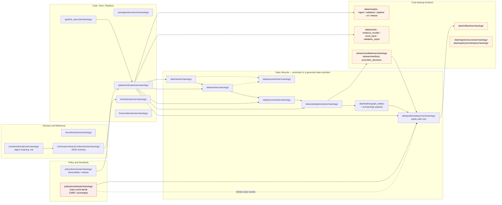

<!-- [KFM_META_BLOCK_V2]
doc_id: kfm://doc/docs-domains-archaeology-canonical-paths
title: Canonical Paths — Archaeology Domain
type: standard
version: v1
status: draft
owners: TODO — Docs steward + Archaeology domain steward
created: 2026-05-15
updated: 2026-05-15
policy_label: public
related:
  - docs/doctrine/directory-rules.md
  - docs/adr/ADR-0001-schema-home.md
  - docs/domains/archaeology/README.md          # PROPOSED
  - docs/atlases/KFM_Domains_Culmination_Atlas_v1_1.md  # PROPOSED
tags: [kfm, archaeology, directory-rules, placement, governance]
notes:
  - Authority of placement rules: CONFIRMED (Directory Rules §12).
  - Authority of any specific path quoted: PROPOSED until verified against mounted-repo evidence.
  - Surfaces one form-conflict between Directory Rules §6.3/§6.4/§12 and Atlas §24.13 — see §2.4.
[/KFM_META_BLOCK_V2] -->

# Canonical Paths — Archaeology Domain

> The single page that says **where every archaeology file belongs** in the Kansas Frontier Matrix repository — derived from Directory Rules §12 (Domain Placement Law), specialized for the sensitivity, sovereignty, and exact-location-denial posture of the Archaeology and Cultural Heritage domain.

[](#)
[](#)
[](#)
[](#)
[](#)
[](#)

| Field | Value |
|---|---|
| **Status** | `draft` |
| **Owners** | `TODO` — Docs steward + Archaeology domain steward (CODEOWNERS) |
| **Last updated** | 2026-05-15 |
| **Authority** | Placement rules **CONFIRMED** (Directory Rules §12). Quoted paths **PROPOSED** until mounted-repo inspection. |

---

## Mini-TOC

1. [Purpose & scope](#1-purpose--scope)
2. [Authority & references](#2-authority--references)
3. [Canonical lane table for archaeology](#3-canonical-lane-table-for-archaeology)
4. [Lane layout diagram](#4-lane-layout-diagram)
5. [Per-root canonical paths](#5-per-root-canonical-paths)
6. [Sensitivity-aware path guidance](#6-sensitivity-aware-path-guidance)
7. [Cross-cutting & multi-domain files](#7-cross-cutting--multi-domain-files)
8. [Anti-patterns specific to archaeology placement](#8-anti-patterns-specific-to-archaeology-placement)
9. [Verification backlog](#9-verification-backlog)
10. [Related docs](#10-related-docs)

---

## 1. Purpose & scope

This document is the **per-domain canonical paths reference** for the **Archaeology and Cultural Heritage** lane. It answers one question for contributors and reviewers:

> *"I have an archaeology-specific file. Where does it go?"*

It does not redefine placement rules — it **specializes** the existing rules to the archaeology lane:

- It transcribes the Directory Rules §12 lane pattern with `<domain>` substituted by `archaeology`.
- It flags archaeology-specific path constraints driven by sensitivity, cultural sovereignty, and exact-location denial.
- It surfaces one form-conflict between Directory Rules (`contracts/domains/archaeology/`) and the Atlas v1.1 crosswalk (`contracts/archaeology/`) so it can be resolved by ADR rather than by silent drift.

> [!NOTE]
> **Authority status.** The **rules** governing placement are **CONFIRMED** from Directory Rules §§3–6, §9, §12. **Specific paths** quoted in this document are **PROPOSED** until verified against mounted-repo evidence. No path here may be cited as proof that the path exists in the live repository.

### What this doc is *not*

It is **not** the archaeology domain README, the archaeology contracts map, the archaeology policy bundle, or the archaeology schema index. Those live in their respective responsibility roots and are linked from §10.

[⬆ Back to top](#canonical-paths--archaeology-domain)

---

## 2. Authority & references

### 2.1 Authority order (mirrors Directory Rules §2.1)

When sources disagree about an archaeology-specific path:

1. **KFM core invariants and doctrine.** Lifecycle law, truth posture (cite-or-abstain), trust membrane, watcher-as-non-publisher.
2. **Accepted ADRs** that explicitly amend Directory Rules (e.g., **ADR-0001** schema home).
3. **Directory Rules** (`docs/doctrine/directory-rules.md`).
4. **Per-root `README.md` files** — refine, never contradict.
5. **Domain dossiers** (Archaeology Architecture Plan, Atlas §24.13, encyclopedia §7.13) — lineage / proposed only.
6. **Convention from the current mounted repo state.** When it conflicts, raise as a `docs/registers/DRIFT_REGISTER.md` entry, not as new authority.

### 2.2 Primary references

| Reference | Section | What it gives this doc |
|---|---|---|
| `docs/doctrine/directory-rules.md` | §6.1, §6.3–§6.5, §9, §12 | CONFIRMED placement rules, lane pattern, lifecycle invariant. |
| `docs/adr/ADR-0001-schema-home.md` | full | Schema-home rule: `schemas/contracts/v1/...` is canonical. |
| KFM Domains Atlas v1.1 | §24.13 | Atlas crosswalk row for Archaeology / Cultural Heritage. |
| KFM Encyclopedia v0.1 | §7.13, §4 (Operating Law) | Archaeology mission, boundary, object families, sensitivity posture. |
| DOM-ARCH (Archaeology Architecture Plan) | §§1–24 | Exact-location denial, candidate-vs-confirmed split, steward review. |
| Master MapLibre report (ML-061 set) | Q. Sensitive Geometry | H3 r7 floor, CARE labels, sovereignty notice chips. |

### 2.3 Lifecycle invariant (applies to all archaeology data paths)

> **RAW → WORK / QUARANTINE → PROCESSED → CATALOG / TRIPLET → PUBLISHED**
> Promotion is a **governed state transition, not a file move.**

A path-level move that bypasses validators, policy gates, EvidenceBundle creation, catalog closure, and release-decision recording is a violation of the invariant regardless of which directory the bytes ended up in.

### 2.4 Surfaced conflict — `contracts/domains/archaeology/` vs `contracts/archaeology/`

There is a path-form conflict in the source materials that this document **must not silently smooth over**:

| Source | Path form | Truth label |
|---|---|---|
| Directory Rules §12 (lane pattern) | `contracts/domains/archaeology/` | **CONFIRMED** (canonical placement rule) |
| Directory Rules §6.3 (`contracts/` tree) | `contracts/domains/<domain>/` | **CONFIRMED** |
| Directory Rules §6.4 (`schemas/` tree) | `schemas/contracts/v1/domains/<domain>/` | **CONFIRMED** |
| Atlas v1.1 §24.13 (crosswalk row 15) | `contracts/archaeology/`, `schemas/contracts/v1/archaeology/` | **LINEAGE / PROPOSED** |

> [!IMPORTANT]
> This document **follows Directory Rules** per the §2.1 authority order: the canonical archaeology paths include the `domains/` segment (`contracts/domains/archaeology/`, `schemas/contracts/v1/domains/archaeology/`). The Atlas shorthand is recorded as **LINEAGE** and may be resolved by a one-line ADR if the project wishes to drop the `domains/` segment at some future point. Either choice MUST be made through ADR §2.4 of Directory Rules, not by ad-hoc adoption.

[⬆ Back to top](#canonical-paths--archaeology-domain)

---

## 3. Canonical lane table for archaeology

The Directory Rules §12 lane pattern, with `<domain>` substituted by **`archaeology`**.

| Responsibility root | Archaeology path (PROPOSED) | Owns | Status |
|---|---|---|---|
| `docs/` | `docs/domains/archaeology/` | Human-facing domain doctrine, README, this CANONICAL_PATHS doc, ADR pointers. | CONFIRMED rule / PROPOSED path |
| `contracts/` | `contracts/domains/archaeology/` | Semantic **meaning** of archaeology object families (`.md`). | CONFIRMED rule / PROPOSED path |
| `schemas/` | `schemas/contracts/v1/domains/archaeology/` | Machine-checkable **shape** (JSON Schema) for archaeology DTOs. | CONFIRMED rule (ADR-0001) / PROPOSED path |
| `policy/` (domain) | `policy/domains/archaeology/` | Admissibility / release policy bundles bounded to the archaeology lane. | CONFIRMED rule / PROPOSED path |
| `policy/` (sensitivity) | `policy/sensitivity/archaeology/` | Sensitivity classification, exact-coord denial, sovereignty/CARE rules. | CONFIRMED rule / PROPOSED path |
| `tests/` | `tests/domains/archaeology/` | Enforceability proofs for archaeology contracts, schemas, policy. | CONFIRMED rule / PROPOSED path |
| `fixtures/` | `fixtures/domains/archaeology/` | Golden / valid / invalid sample data for archaeology tests. | CONFIRMED rule / PROPOSED path |
| `packages/` | `packages/domains/archaeology/` | Shared library code that is archaeology-specific and reused by multiple deployables. | CONFIRMED rule / PROPOSED path |
| `pipelines/` | `pipelines/domains/archaeology/` *(or `pipelines/<phase>/` with archaeology subsegments)* | Executable pipeline logic for archaeology ingest, normalize, validate, catalog, publish. | CONFIRMED rule / PROPOSED path |
| `pipeline_specs/` | `pipeline_specs/archaeology/` | Declarative pipeline configuration for the archaeology lane. | CONFIRMED rule / PROPOSED path |
| `connectors/` *(domain-bounded outputs only)* | `connectors/<source_org>/...` → emit into `data/raw/archaeology/...` | Source-specific fetchers / admitters. **Connectors do not publish.** | CONFIRMED rule |
| `data/raw/` | `data/raw/archaeology/<source_id>/<run_id>/` | Immutable source-edge captures with retrieval metadata + checksums. | CONFIRMED rule / PROPOSED path |
| `data/work/` | `data/work/archaeology/<run_id>/` | Normalized intermediates and candidate assertions. | CONFIRMED rule / PROPOSED path |
| `data/quarantine/` | `data/quarantine/archaeology/<reason>/<run_id>/` | Failed validation, unresolved rights/sensitivity, over-precise geometry. | CONFIRMED rule / PROPOSED path |
| `data/processed/` | `data/processed/archaeology/<dataset_id>/<version>/` | Validated canonical records (not public yet). | CONFIRMED rule / PROPOSED path |
| `data/catalog/` | `data/catalog/domain/archaeology/` (+ entries also under `data/catalog/stac/`, `data/catalog/dcat/`, `data/catalog/prov/`) | STAC / DCAT / PROV records and domain catalog entries. | CONFIRMED rule / PROPOSED path |
| `data/triplets/` | `data/triplets/graph_deltas/...` (archaeology projections recorded with `domain=archaeology` payload field — domain subsegment **PROPOSED**) | Relationship projections and graph-compatible triples. | NEEDS VERIFICATION |
| `data/published/` | `data/published/layers/archaeology/` (and `data/published/api_payloads/...`, `pmtiles/...`, `geoparquet/...` for archaeology-tagged outputs) | **Public-safe** released artifacts only. | CONFIRMED rule / PROPOSED path |
| `data/receipts/` | `data/receipts/{ingest,validation,pipeline,ai,release}/...` (archaeology tagging via payload — domain subsegment **PROPOSED**) | Process memory: run, validation, AI, ingest, release receipts. | NEEDS VERIFICATION |
| `data/proofs/` | `data/proofs/{evidence_bundle,proof_pack,validation_report,citation_validation}/...` (archaeology tagging via payload — domain subsegment **PROPOSED**) | EvidenceBundle, ProofPack, integrity bundles for archaeology claims. | NEEDS VERIFICATION |
| `data/rollback/` | `data/rollback/archaeology/<release_id>/` | Rollback cards and alias-revert receipts for archaeology releases. | CONFIRMED rule / PROPOSED path |
| `data/registry/` | `data/registry/sources/archaeology/` (sources); `data/registry/sensitivity/archaeology/` (sensitivity tier records) | Append-only source / layer / dataset / rights / sensitivity records. | CONFIRMED rule / PROPOSED path |
| `release/` | `release/candidates/archaeology/` | Archaeology-lane release candidate dossiers. Manifests / promotion decisions / rollback cards / correction notices live in their `release/<subtree>/` siblings keyed by `release_id`. | CONFIRMED rule / PROPOSED path |

> [!TIP]
> **Reading the table.** "CONFIRMED rule" means Directory Rules sets the lane pattern; "PROPOSED path" means the specific archaeology instantiation has not been verified in a mounted repo this session. The combination is the strongest claim this document can make without a `git ls-tree`-equivalent inspection.

[⬆ Back to top](#canonical-paths--archaeology-domain)

---

## 4. Lane layout diagram

The archaeology lane as a fan-out from responsibility roots. Trust-bearing surfaces (proof, release, public-safe published) are colored separately to remind reviewers that crossing into them is a **governed state transition**, not a file move.



> [!NOTE]
> The diagram is a **structural reference** for archaeology lane placement, not a runtime data-flow guarantee. Live runtime topology (which pipeline emits which receipt, which validator gates which transition) is **NEEDS VERIFICATION** against mounted-repo workflows, tests, and manifests.

[⬆ Back to top](#canonical-paths--archaeology-domain)

---

## 5. Per-root canonical paths

Expanded trees for each responsibility root, archaeology-specialized.

### 5.1 `docs/domains/archaeology/` — domain doctrine and reference

```text
docs/
└── domains/
    └── archaeology/
        ├── README.md                    # PROPOSED — landing page, scope, links
        ├── CANONICAL_PATHS.md           # PROPOSED — this file
        ├── OBJECT_FAMILIES.md           # PROPOSED — ArchaeologicalSite, SiteComponent, ...
        ├── SOURCE_FAMILIES.md           # PROPOSED — SHPO, NRHP-like, surveys, ...
        ├── SENSITIVITY.md               # PROPOSED — exact-coord denial, CARE, sovereignty
        ├── PIPELINE.md                  # PROPOSED — RAW→PUBLISHED applied to archaeology
        ├── VIEWING_PRODUCTS.md          # PROPOSED — generalized public layers, candidate surfaces
        ├── CROSS_LANE_RELATIONS.md      # PROPOSED — relations to Spatial Foundation, Roads/Rail, Settlements, Hazards
        └── VERIFICATION_BACKLOG.md      # PROPOSED — open archaeology questions
```

### 5.2 `contracts/domains/archaeology/` — object meaning

```text
contracts/
└── domains/
    └── archaeology/
        ├── README.md                            # PROPOSED — per-root contract (§15)
        ├── archaeological_site.md               # PROPOSED — ArchaeologicalSite meaning
        ├── site_component.md                    # PROPOSED
        ├── cultural_temporal_period.md          # PROPOSED
        ├── survey_project.md                    # PROPOSED
        ├── survey_transect.md                   # PROPOSED
        ├── shovel_test.md                       # PROPOSED
        ├── test_unit.md                         # PROPOSED
        ├── excavation_unit.md                   # PROPOSED
        ├── provenience_context.md               # PROPOSED
        ├── stratigraphic_unit.md                # PROPOSED
        ├── collection_repository_record.md      # PROPOSED
        ├── candidate_feature.md                 # PROPOSED — candidate-not-site rule
        └── publication_transform_receipt.md     # PROPOSED — generalization log object
```

> [!NOTE]
> Object names above are **CONFIRMED** as terms used in the domain doctrine (Atlas §15-E, DOM-ARCH §§9–18, encyclopedia §7.13-C). Field-level realization is **PROPOSED** until schemas land under `schemas/contracts/v1/domains/archaeology/`.

### 5.3 `schemas/contracts/v1/domains/archaeology/` — machine shape

Canonical home per **ADR-0001**. Pairs with `contracts/domains/archaeology/` 1:1 by object family.

```text
schemas/
└── contracts/
    └── v1/
        └── domains/
            └── archaeology/
                ├── archaeological_site.schema.json           # PROPOSED
                ├── site_component.schema.json                # PROPOSED
                ├── cultural_temporal_period.schema.json      # PROPOSED
                ├── survey_project.schema.json                # PROPOSED
                ├── survey_transect.schema.json               # PROPOSED
                ├── shovel_test.schema.json                   # PROPOSED
                ├── test_unit.schema.json                     # PROPOSED
                ├── excavation_unit.schema.json               # PROPOSED
                ├── provenience_context.schema.json           # PROPOSED
                ├── stratigraphic_unit.schema.json            # PROPOSED
                ├── collection_repository_record.schema.json  # PROPOSED
                ├── candidate_feature.schema.json             # PROPOSED
                └── publication_transform_receipt.schema.json # PROPOSED
```

### 5.4 `policy/domains/archaeology/` and `policy/sensitivity/archaeology/`

Two policy homes coexist for archaeology — domain-bounded admissibility/release vs. sensitivity-class rules.

```text
policy/
├── domains/
│   └── archaeology/
│       ├── README.md                         # PROPOSED
│       ├── admissibility.rego                # PROPOSED
│       ├── release_gate.rego                 # PROPOSED
│       ├── candidate_vs_confirmed.rego       # PROPOSED — candidate-not-site enforcement
│       └── steward_review_required.rego      # PROPOSED — cultural/steward review trigger
└── sensitivity/
    └── archaeology/
        ├── README.md                         # PROPOSED
        ├── exact_coord_denial.rego           # PROPOSED — DENY exact site coords by default
        ├── h3_floor.rego                     # PROPOSED — H3 r7 floor for sensitive layers
        ├── sovereignty_chip_required.rego    # PROPOSED — CARE / sovereignty notice
        ├── burial_human_remains.rego         # PROPOSED — fail-closed for human remains
        ├── sacred_sites.rego                 # PROPOSED — fail-closed for sacred sites
        └── looting_risk.rego                 # PROPOSED — looting-risk exposure denial
```

> [!CAUTION]
> The sensitivity rules above are **deny-by-default** for archaeology per Operating Law (Encyclopedia §4 "Sensitivity and rights posture") and DOM-ARCH §17–§24. Removing a rule from `policy/sensitivity/archaeology/` MUST require a documented, reviewed ADR. Quiet relaxation is a publication-gate violation regardless of which directory the change lands in.

### 5.5 `tests/domains/archaeology/` and `fixtures/domains/archaeology/`

```text
tests/
└── domains/
    └── archaeology/
        ├── README.md                                  # PROPOSED
        ├── test_schema_validity.py                    # PROPOSED
        ├── test_evidence_bundle_required.py           # PROPOSED
        ├── test_candidate_not_site.py                 # PROPOSED
        ├── test_public_no_leak.py                     # PROPOSED — exact-coord leak guard
        ├── test_rights_and_cultural_review.py         # PROPOSED
        ├── test_exact_sensitive_geometry_denial.py    # PROPOSED
        ├── test_catalog_closure.py                    # PROPOSED
        ├── test_ai_exact_location_denial.py           # PROPOSED
        └── test_h3_r7_floor.py                        # PROPOSED — H3 r7 floor enforcement

fixtures/
└── domains/
    └── archaeology/
        ├── valid/                                     # PROPOSED — golden examples
        ├── invalid/                                   # PROPOSED — schema-failing examples
        ├── sensitive_deny/                            # PROPOSED — exact coords, sacred, burial
        ├── candidate_features/                        # PROPOSED — LiDAR / geophysics anomalies
        └── generalized_public_safe/                   # PROPOSED — H3-generalized footprints
```

### 5.6 `pipelines/domains/archaeology/` and `pipeline_specs/archaeology/`

```text
pipelines/
└── domains/
    └── archaeology/
        ├── ingest/             # PROPOSED — connector → data/raw/archaeology/
        ├── normalize/          # PROPOSED — work-phase normalization
        ├── validate/           # PROPOSED — schema + policy + evidence gates
        ├── catalog/            # PROPOSED — STAC/DCAT/PROV emission
        ├── triplets/           # PROPOSED — graph projection
        ├── publish/            # PROPOSED — public-safe layer emission
        └── rollback/           # PROPOSED — release withdrawal

pipeline_specs/
└── archaeology/
    ├── ingest.spec.yaml         # PROPOSED
    ├── normalize.spec.yaml      # PROPOSED
    ├── validate.spec.yaml       # PROPOSED
    ├── catalog.spec.yaml        # PROPOSED
    ├── publish.spec.yaml        # PROPOSED
    └── rollback.spec.yaml       # PROPOSED
```

### 5.7 `data/...` — lifecycle homes (archaeology)

```text
data/
├── raw/archaeology/<source_id>/<run_id>/                  # PROPOSED — immutable captures
├── work/archaeology/<run_id>/                             # PROPOSED — normalized intermediates
├── quarantine/archaeology/<reason>/<run_id>/              # PROPOSED — failed validation / sensitivity
├── processed/archaeology/<dataset_id>/<version>/          # PROPOSED — validated canonical records
├── catalog/
│   ├── stac/...                                           # archaeology entries by collection id (PROPOSED)
│   ├── dcat/...                                           # archaeology dataset descriptions (PROPOSED)
│   ├── prov/...                                           # PROV records (PROPOSED)
│   └── domain/archaeology/                                # PROPOSED — domain catalog
├── triplets/
│   ├── graph_deltas/...                                   # archaeology projections (domain tag in payload, PROPOSED)
│   └── exports/...                                        # PROPOSED
├── receipts/
│   ├── ingest/...                                         # archaeology runs tagged (PROPOSED)
│   ├── validation/...                                     # PROPOSED
│   ├── pipeline/...                                       # PROPOSED
│   ├── ai/...                                             # AIReceipts for archaeology answers (PROPOSED)
│   └── release/...                                        # PROPOSED
├── proofs/
│   ├── evidence_bundle/...                                # archaeology EvidenceBundles (PROPOSED)
│   ├── proof_pack/...                                     # PROPOSED
│   ├── validation_report/...                              # PROPOSED
│   └── citation_validation/...                            # PROPOSED
├── published/
│   ├── layers/archaeology/                                # PROPOSED — public-safe generalized layers
│   ├── pmtiles/...                                        # archaeology-tagged PMTiles (PROPOSED)
│   ├── geoparquet/...                                     # PROPOSED
│   └── api_payloads/...                                   # PROPOSED
├── rollback/archaeology/<release_id>/                     # PROPOSED — rollback cards / alias-revert receipts
└── registry/
    ├── sources/archaeology/                               # PROPOSED — source descriptors
    └── sensitivity/archaeology/                           # PROPOSED — sensitivity-tier records
```

> [!WARNING]
> **`data/raw/archaeology/` and `data/quarantine/archaeology/` are never public surfaces.** They MUST NOT be served by `apps/explorer-web/`, MUST NOT feed AI context directly, and MUST NOT be exposed by any route. Public clients reach archaeology data only via `apps/governed-api/` after promotion to `data/published/layers/archaeology/`. (Directory Rules §7.1 trust membrane; §9.1 lifecycle phase rules.)

### 5.8 `release/candidates/archaeology/` and siblings

```text
release/
├── candidates/
│   └── archaeology/
│       └── <release_id>/                       # PROPOSED — candidate dossiers
├── manifests/<release_id>/release_manifest.json   # PROPOSED — ReleaseManifest (cross-domain by release_id)
├── promotion_decisions/<release_id>/...          # PROPOSED — PromotionDecision records
├── rollback_cards/<release_id>/...               # PROPOSED — rollback artifacts
├── correction_notices/<release_id>/...           # PROPOSED — public corrections
└── signatures/<release_id>/...                   # PROPOSED — DSSE / Sigstore artifacts
```

> [!IMPORTANT]
> **`data/published/` vs `release/`** — keep these distinct. `data/published/layers/archaeology/` holds the **public-safe artifacts** consumers read. `release/` holds the **release decisions** (manifest, proof closure, rollback / correction path, signatures). Mixing them is the §13.2 drift pattern in Directory Rules.

[⬆ Back to top](#canonical-paths--archaeology-domain)

---

## 6. Sensitivity-aware path guidance

Archaeology is one of the lanes where placement choices interact directly with **sovereignty, looting risk, and cultural sensitivity**. This section is specifically callouts that other domains may not need.

### 6.1 Default-deny posture (CONFIRMED)

Per Operating Law (Encyclopedia §4) and DOM-ARCH §§17–24, the following **fail closed**:

- Exact archaeological locations.
- Burial sites and human remains.
- Sacred sites and unresolved cultural sensitivity.
- Collection security details.
- Private landowner details.
- Looting-risk exposure.

Files matching any of the above MUST land in `data/quarantine/archaeology/<reason>/` until rights, sensitivity, source-role, evidence, and release state are resolved. They MUST NOT short-circuit into `data/processed/archaeology/` or `data/published/...`.

### 6.2 Generalization is recorded in `publication_transform_receipt`

Generalization is **validation evidence**, not metadata cosmetics. Per Master MapLibre evidence (ML-061-159 to ML-061-163, SRC-061 pp.224–229) and DOM-ARCH:

- Any archaeology geometry below **H3 r7** is prohibited for public products without steward review.
- Cultural / heritage public footprints use **H3 r7–r9** generalization.
- Each public-safe transform emits a `PublicationTransformReceipt` recording inputs, transform, parameters, reviewer, and date.

Transform receipts belong under `data/proofs/...` (as `validation_report/` evidence) and are referenced from the `ReleaseManifest` and the published layer's catalog entry — not stashed alongside the published artifact.

### 6.3 CARE labels and sovereignty notice chips

Per Master MapLibre ML-061-160 and ML-059-029/043/046/055/058/068, **CARE annotations and sovereignty notice chips are UI requirements** for any archaeology public surface. The corresponding governance content lives in:

- `policy/sensitivity/archaeology/sovereignty_chip_required.rego` — PROPOSED policy enforcement.
- `data/registry/sensitivity/archaeology/` — PROPOSED sensitivity-tier records linking each layer to its CARE status (public / generalized / restricted) and reviewers.
- `contracts/domains/archaeology/publication_transform_receipt.md` — PROPOSED meaning of the receipt.

### 6.4 AI exact-location denial

Per encyclopedia §7.13-H and Master MapLibre ML-061-162/163, governed AI for archaeology MUST:

- Summarize **generalized** cultural activity zones, not precise sites.
- ABSTAIN when evidence is insufficient.
- DENY where policy, rights, sensitivity, or release state blocks the request.

Tests proving this live at `tests/domains/archaeology/test_ai_exact_location_denial.py` (PROPOSED). Focus Mode adapter code belongs in `packages/domains/archaeology/` or `packages/...` depending on whether it is archaeology-specific or cross-cutting — **not** in any `web/`, `ui/`, or `apps/explorer-web/` location, which are renderer-side.

[⬆ Back to top](#canonical-paths--archaeology-domain)

---

## 7. Cross-cutting & multi-domain files

Per Directory Rules §12 "Multi-domain and cross-cutting files": a file that legitimately spans archaeology and another lane (e.g., **Archaeology × Roads/Rail**, **Archaeology × Settlements**, **Archaeology × Hazards**, **Archaeology × Spatial Foundation**) goes under the **lowest common responsibility root without a domain segment**, not under `docs/domains/archaeology/` or any single-lane home.

| Cross-cutting file type | Canonical placement (PROPOSED) | Rationale |
|---|---|---|
| Shared geometry / generalization validator usable by archaeology + flora + fauna | `tools/validators/geometry/...` | Validator is repo-wide; archaeology is one consumer. |
| Cross-domain schema for `PublicationTransformReceipt` used by archaeology + people + fauna | `schemas/contracts/v1/release/publication_transform_receipt.schema.json` | Shape is cross-cutting; lives in `release/` subsegment. |
| Cross-domain doctrine for sovereignty / CARE that governs archaeology + people | `docs/architecture/sovereignty-care.md` | Cross-lane doctrine, not domain doctrine. |
| Spatial-foundation join policy used by archaeology cross-lane queries | `policy/runtime/cross_lane/...` | Cross-lane runtime gate, not domain policy. |
| Archaeology × Roads/Rail historic alignment object meaning | Defer to ADR — likely `contracts/domains/transport/` or `contracts/domains/archaeology/` with explicit cross-reference. | Cross-lane object meaning is ambiguous; resolve by ADR (Atlas §24 ADR-S-14 cross-lane join policy is **OPEN**). |

> [!NOTE]
> The cross-lane join policy ADR (Atlas back-matter item VB-11-09, ADR-S-14) is **NEEDS VERIFICATION / PROPOSED**. Until accepted, cross-lane archaeology files default to `docs/architecture/<topic>.md` for doctrine and `tools/validators/<topic>/` for code, **never** to a parallel domain folder.

[⬆ Back to top](#canonical-paths--archaeology-domain)

---

## 8. Anti-patterns specific to archaeology placement

Directory Rules §13 lists general placement anti-patterns. These are the archaeology-specialized ones reviewers should call out.

| # | Anti-pattern | Symptom | Fix | Citation |
|---|---|---|---|---|
| A1 | **Archaeology as a root folder** | `archaeology/` at repo root with its own `data/`, `schemas/`, `policy/`, `docs/`. | Apply Directory Rules §12 lane pattern. Archaeology files live as segments under responsibility roots. | Directory Rules §12, §13.4 |
| A2 | **Exact coords in `data/processed/archaeology/`** | Validated normalized records contain raw, ungeneralized site coordinates. | Move to `data/quarantine/archaeology/exact_geometry/` until sensitivity review completes. Generalize before `processed/`. | DOM-ARCH §17–§24; Encyclopedia §4 |
| A3 | **Public layer in `data/published/layers/archaeology/` without `PublicationTransformReceipt`** | A public PMTiles or layer manifest exists but no transform receipt in `data/proofs/`. | Block publication; emit the transform receipt; re-promote through release gate. | DOM-ARCH §17–§24; ML-061-161 |
| A4 | **Candidate anomaly published as confirmed site** | LiDAR / geophysics anomaly in `data/published/layers/archaeology/` labeled as a site. | Send back to `data/work/archaeology/` as `CandidateFeature`; require steward review and EvidenceBundle closure. | Atlas §15-E; DOM-ARCH §§2–6 |
| A5 | **Sensitivity rule in `policy/domains/archaeology/` instead of `policy/sensitivity/archaeology/`** | Exact-coord denial / CARE rules sit beside generic admissibility, weakening cross-lane reuse. | Split: keep admissibility in `policy/domains/archaeology/`, sensitivity in `policy/sensitivity/archaeology/`. | Directory Rules §12, §6.5; Atlas §24.13 |
| A6 | **AI receipt in `release/`** | An AIReceipt about archaeology lands under `release/` (which is for release decisions). | Move to `data/receipts/ai/...`. Release-decision artifacts only in `release/`. | Directory Rules §13.2 |
| A7 | **Connector publishing archaeology directly to `processed/` or `published/`** | An ingestion script writes outside `data/raw/archaeology/`. | Per Directory Rules §7.3, connectors emit only to `data/raw/<...>/` or `data/quarantine/`. Pipelines promote. | Directory Rules §7.3, §13.5 |
| A8 | **Schemas under `contracts/domains/archaeology/`** | JSON Schema files in the contracts root (Markdown home), conflicting with ADR-0001. | Migrate `.schema.json` to `schemas/contracts/v1/domains/archaeology/`. `contracts/` retains semantic Markdown only. | ADR-0001; Directory Rules §6.4, §13.1 |
| A9 | **MapLibre archaeology layer reads `data/processed/archaeology/` directly** | `apps/explorer-web/` bypasses the governed API. | Public path goes through `apps/governed-api/`. Renderer is downstream of trust. | Directory Rules §7.1, §13.5; Encyclopedia §4 (map-renderer boundary) |

[⬆ Back to top](#canonical-paths--archaeology-domain)

---

## 9. Verification backlog

Open items that must be settled by **mounted-repo inspection or accepted ADR**, not by editing this document.

<details>
<summary><strong>Click to expand verification backlog</strong></summary>

| Item | Evidence that would settle it | Status |
|---|---|---|
| Whether the live repo uses `contracts/domains/archaeology/` (Directory Rules §12) or `contracts/archaeology/` (Atlas §24.13 shorthand). | Mounted repo + ADR text. | **NEEDS VERIFICATION** — see §2.4. |
| Whether `policy/` (singular) or `policies/` (plural) is canonical in the live repo. Default per Directory Rules: `policy/`. | Mounted repo + ADR. | NEEDS VERIFICATION |
| Whether `data/triplets/` (plural) or `data/triplet/` (singular) is the chosen form. Default per Directory Rules: `triplets/`. | One-line ADR + repo state. | NEEDS VERIFICATION |
| Whether `data/receipts/`, `data/proofs/`, `data/triplets/` carry an explicit `archaeology/` subsegment or tag domain via payload. | Mounted repo + emitted-receipt samples. | NEEDS VERIFICATION |
| Steward authority and confidentiality posture for the archaeology lane (who signs the CulturalReview / StewardReview record). | Mounted-repo CODEOWNERS, governance docs, signed review records. | NEEDS VERIFICATION (DOM-ARCH §N) |
| Public geometry thresholds and transform profiles (H3 r7 as floor; r7–r9 for public footprints; per-layer thresholds). | Policy fixtures + reviewer approval + ADR. | NEEDS VERIFICATION |
| Oral history / cultural knowledge protocol — handling, redaction, consent records. | Mounted policy bundle + reviewer records. | NEEDS VERIFICATION |
| Emergency public-layer disablement and rollback drill — confirmed for archaeology lane. | Mounted rollback drill receipt. | NEEDS VERIFICATION |
| Cross-lane join policy ADR (ADR-S-14, Atlas VB-11-09). Until accepted, archaeology × roads/rail × settlements files default to `docs/architecture/<topic>.md`. | ADR text. | **PROPOSED / OPEN** |
| Whether `pipelines/domains/<domain>/` or `pipelines/<phase>/domains/<domain>/` is the chosen pipeline-substructure form. | Mounted repo + ADR. | NEEDS VERIFICATION |

</details>

[⬆ Back to top](#canonical-paths--archaeology-domain)

---

## 10. Related docs

- `docs/doctrine/directory-rules.md` — placement rules (CONFIRMED).
- `docs/adr/ADR-0001-schema-home.md` — schema-home rule (CONFIRMED in doctrine; mounted-repo presence NEEDS VERIFICATION).
- `docs/domains/archaeology/README.md` — domain landing page (**PROPOSED**).
- `docs/domains/archaeology/OBJECT_FAMILIES.md` — object meaning catalog (**PROPOSED**).
- `docs/domains/archaeology/SENSITIVITY.md` — exact-coord denial, CARE, sovereignty (**PROPOSED**).
- `docs/domains/archaeology/PIPELINE.md` — RAW→PUBLISHED applied to archaeology (**PROPOSED**).
- `docs/sources/SOURCE_DESCRIPTOR_STANDARD.md` — source-descriptor doctrine (**PROPOSED**).
- `docs/registers/DRIFT_REGISTER.md` — drift entries against this doc (**PROPOSED**).
- `docs/registers/VERIFICATION_BACKLOG.md` — central verification queue (**PROPOSED**).
- `docs/atlases/KFM_Domains_Culmination_Atlas_v1_1.md` §15, §24.13 — archaeology atlas row (**PROPOSED** as md path; PDF lineage CONFIRMED).
- Encyclopedia §7.13 — Archaeology and Cultural Heritage (CONFIRMED doctrine).

---

<sub>📍 <strong>Last updated:</strong> 2026-05-15 · <strong>Authority:</strong> placement rules CONFIRMED (Directory Rules §12) · specific paths PROPOSED · <strong>Owners:</strong> <code>TODO</code> Docs steward + Archaeology domain steward · <a href="#canonical-paths--archaeology-domain">⬆ Back to top</a></sub>
