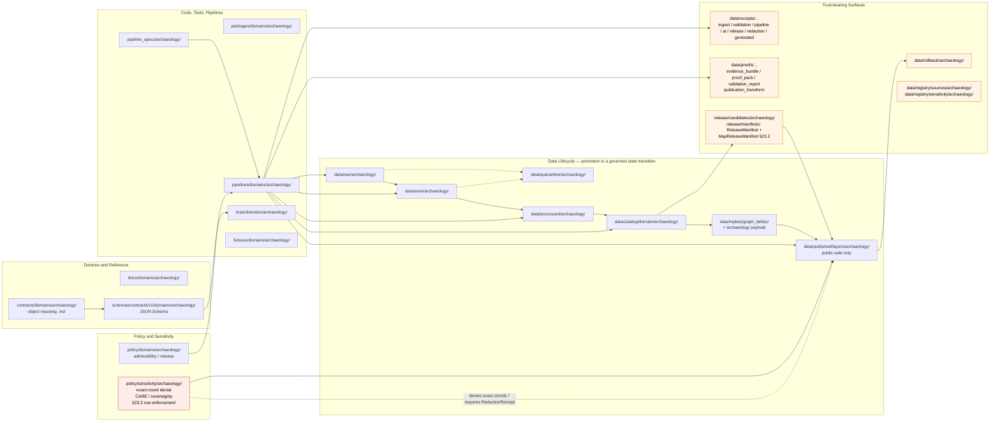

<!-- [KFM_META_BLOCK_V2]
doc_id: kfm://doc/docs-domains-archaeology-canonical-paths
title: Canonical Paths — Archaeology Domain
type: standard
version: v1.1
status: draft
owners: TODO — Docs steward + Archaeology domain steward
created: 2026-05-15
updated: 2026-05-29
policy_label: public
related:
  - docs/doctrine/ai-build-operating-contract.md
  - docs/doctrine/directory-rules.md
  - docs/doctrine/authority-ladder.md
  - docs/adr/ADR-0001-schema-home.md
  - docs/domains/archaeology/ARCHITECTURE.md            # PROPOSED — see §11 changelog note
  - docs/domains/archaeology/README.md                  # PROPOSED
  - docs/domains/archaeology/CONTINUITY_INVENTORY.md    # PROPOSED — sibling continuity register
  - docs/domains/archaeology/CROSS_DOMAIN.md            # PROPOSED — sibling cross-lane register
  - docs/atlases/KFM_Domains_Culmination_Atlas_v1_1.md  # PROPOSED
tags: [kfm, archaeology, directory-rules, placement, governance, doctrine-adjacent]
notes:
  - "Pinned to CONTRACT_VERSION = \"3.0.0\" per ai-build-operating-contract.md §1.3 / §8 (truth labels) and §37 (versioning + CONTRACT_VERSION pinning convention)."
  - "Authority of placement rules: CONFIRMED (Directory Rules §12 Domain Placement Law; [CONTRACT v3.0] §11)."
  - "Authority of any specific path quoted: PROPOSED until verified against mounted-repo evidence ([CONTRACT v3.0] §7 current-session evidence limit)."
  - "Surfaces and resolves the contracts/domains/archaeology/ vs contracts/archaeology/ form-conflict in favor of Directory Rules §12 per the §2.1 authority order — see §2.4. The Atlas v1.1 §24.13 row 15 and ENCY §7.13 both use the no-domains/ shorthand."
  - "§6.1 quotes [CONTRACT v3.0] §23.2 (Archaeology — site locations) verbatim; the §23.2 matrix is itself PROPOSED in v3.0 pending steward ratification, with most-restrictive-applicable-row fallback. RedactionReceipt and MapReleaseManifest threaded through §3, §5.7, §5.8, §6, and §8."
[/KFM_META_BLOCK_V2] -->

# Canonical Paths — Archaeology Domain

> The single page that says **where every archaeology file belongs** in the Kansas Frontier Matrix repository — derived from Directory Rules §12 (Domain Placement Law), specialized for the sensitivity, sovereignty, and exact-location-denial posture of the Archaeology and Cultural Heritage domain, and aligned with `ai-build-operating-contract.md` v3.0 §11 (placement) and §23.2 (sensitive-domain matrix).

[](#)
[](#)
[](#)
[](#)
[](#)
[](#)
[](#)
[](#)
[](#)
[](#)

| Field | Value |
|---|---|
| **Status** | `draft` · v1.1 · placement rules CONFIRMED · quoted paths PROPOSED |
| **Pinned contract** | `CONTRACT_VERSION = "3.0.0"` (per `ai-build-operating-contract.md` §1.3 / §8, §37) |
| **Owners** | `TODO` — Docs steward + Archaeology domain steward (CODEOWNERS) |
| **Required additional reviewer (§23.2)** | Tribal/cultural reviewer · rights-holder representative |
| **Authority** | Placement rules **CONFIRMED** (Directory Rules §12; `[CONTRACT v3.0]` §11). Quoted paths **PROPOSED** until mounted-repo inspection. |
| **Last updated** | 2026-05-29 |

> [!CAUTION]
> This document specializes placement for a **sensitive lane**. Per `ai-build-operating-contract.md` §23.2 (sensitive-domain decision matrix), archaeology site locations **default to `DENY` exact coordinates · generalize to county/region · tribal/cultural reviewer + rights-holder rep required · `RedactionReceipt` + `PolicyDecision` + `MapReleaseManifest` required**. The §23.2 matrix is **PROPOSED** as of v3.0 (steward ratification pending); until ratified, the **most restrictive applicable row applies**, which only strengthens the gate. **No path in this document authorizes a release**; this doc only governs *where files belong*, not whether they should exist or be published.

---

## Mini-TOC

1. [Purpose & scope](#1-purpose--scope)
2. [Authority & references](#2-authority--references)
3. [Canonical lane table for archaeology](#3-canonical-lane-table-for-archaeology)
4. [Lane layout diagram](#4-lane-layout-diagram)
5. [Per-root canonical paths](#5-per-root-canonical-paths)
6. [Sensitivity-aware path guidance](#6-sensitivity-aware-path-guidance)
7. [Cross-cutting & multi-domain files](#7-cross-cutting--multi-domain-files)
8. [Anti-patterns specific to archaeology placement](#8-anti-patterns-specific-to-archaeology-placement)
9. [Open verification backlog](#9-open-verification-backlog)
10. [Open questions register & open ADRs](#10-open-questions-register--open-adrs)
11. [Changelog v1.0 → v1.1](#11-changelog-v10--v11)
12. [Definition of done](#12-definition-of-done)
13. [Related docs](#13-related-docs)

---

## 1. Purpose & scope

This document is the **per-domain canonical paths reference** for the **Archaeology and Cultural Heritage** lane. It answers one question for contributors and reviewers:

> *"I have an archaeology-specific file. Where does it go?"*

It does **not** redefine placement rules — it **specializes** the existing rules to the archaeology lane:

- It transcribes the Directory Rules §12 lane pattern with `<domain>` substituted by `archaeology`.
- It flags archaeology-specific path constraints driven by sensitivity, cultural sovereignty, and exact-location denial.
- It surfaces and **resolves** the form-conflict between Directory Rules (`contracts/domains/archaeology/`) and the Atlas v1.1 crosswalk shorthand (`contracts/archaeology/`) per the §2.1 authority order, so it can be locked by ADR rather than left to silent drift.
- It threads the `[CONTRACT v3.0]` §23.2 sensitive-domain matrix requirements (`RedactionReceipt`, `PolicyDecision`, `MapReleaseManifest`) through the path tables and anti-pattern list.

> [!NOTE]
> **Authority status.** The **rules** governing placement are **CONFIRMED** from Directory Rules §§4–6, §9, §12 and from `ai-build-operating-contract.md` §11. **Specific paths** quoted in this document are **PROPOSED** until verified against mounted-repo evidence. No path here may be cited as proof that the path exists in the live repository (`[CONTRACT v3.0]` §7).

### What this doc is *not*

It is **not** the archaeology domain README, the archaeology architecture doc, the archaeology contracts map, the archaeology policy bundle, or the archaeology schema index. Those live in their respective responsibility roots and are linked from §13.

[⬆ Back to top](#canonical-paths--archaeology-domain)

---

## 2. Authority & references

### 2.1 Authority order (mirrors Directory Rules §2.1 and `[CONTRACT v3.0]` §5)

When sources disagree about an archaeology-specific path:

1. **`ai-build-operating-contract.md` v3.0** — canonical operating contract. `CONTRACT_VERSION = "3.0.0"` is pinned. §1 Operating Law (the 16-rule spine) wins on any conflict; if the elaborated manual contradicts §1, the short form wins.
2. **KFM core invariants and doctrine.** Lifecycle law, truth posture (cite-or-abstain), trust membrane, watcher-as-non-publisher (`[CONTRACT v3.0]` §10; watcher-as-non-publisher specifically Directory Rules §13.5).
3. **Accepted ADRs** that explicitly amend Directory Rules (e.g., **ADR-0001** schema home).
4. **Directory Rules** (`docs/doctrine/directory-rules.md`).
5. **Per-root `README.md` files** — refine, never contradict.
6. **Domain dossiers** (Archaeology Architecture Plan, Atlas §24.13, Encyclopedia §7.13) — lineage / proposed only.
7. **Convention from the current mounted repo state.** When it conflicts, raise as a `docs/registers/DRIFT_REGISTER.md` entry, not as new authority (`[CONTRACT v3.0]` §38).

### 2.2 Primary references

| Reference | Section | What it gives this doc |
|---|---|---|
| `docs/doctrine/ai-build-operating-contract.md` v3.0 | §10, §11, §23.1–§23.2, §34, §37, §38 | CONFIRMED operating contract; pins `CONTRACT_VERSION = "3.0.0"`; sensitive-domain matrix row; `GENERATED_RECEIPT` requirements. |
| `docs/doctrine/directory-rules.md` | §5, §6, §9, §12, §13 | CONFIRMED placement rules, lane pattern, lifecycle invariant, domain-anti-pattern (incl. §13.5 watcher-as-non-publisher). |
| `docs/doctrine/authority-ladder.md` v1.1 | full | Truth-label vocabulary including `CONFLICTED`, `LINEAGE`, `EXPLORATORY`, `EXTERNAL`. |
| `docs/adr/ADR-0001-schema-home.md` | full | Schema-home rule: `schemas/contracts/v1/...` is canonical. |
| KFM Domains Atlas v1.1 | §24.13 | Atlas crosswalk row 15 for Archaeology / Cultural Heritage (shorthand form — LINEAGE). |
| KFM Encyclopedia v0.1 | §7.13, §4 (Operating Law), §13 | Archaeology mission, boundary, object families, sensitivity posture, deny-by-default register. |
| DOM-ARCH (Archaeology Architecture Plan) | §§A–N | Exact-location denial, candidate-vs-confirmed split, steward review. |
| Master MapLibre report (ML-061 set) | §Q Sensitive Geometry | H3 r7 floor, CARE labels, sovereignty notice chips. |

### 2.3 Lifecycle invariant (applies to all archaeology data paths)

> **RAW → WORK / QUARANTINE → PROCESSED → CATALOG / TRIPLET → PUBLISHED**
> Promotion is a **governed state transition, not a file move.** (`[CONTRACT v3.0]` §10.1)

A path-level move that bypasses validators, policy gates, `EvidenceBundle` creation, catalog closure, and release-decision recording is a violation of the invariant regardless of which directory the bytes ended up in.

### 2.4 Surfaced & resolved conflict — `contracts/domains/archaeology/` vs `contracts/archaeology/`

There is a path-form conflict in the source materials that this document **does not silently smooth over** but does resolve per the §2.1 authority order:

| Source | Path form | Truth label |
|---|---|---|
| `[CONTRACT v3.0]` §11 (placement rule) | Domain is a **segment inside** a responsibility root; specific intermediate segment unspecified | **CONFIRMED rule / silent on `domains/` segment** |
| Directory Rules §12 (Domain Placement Law lane pattern) | `contracts/domains/archaeology/` | **CONFIRMED** (canonical placement rule) |
| Directory Rules §6 (`contracts/` tree) | `contracts/domains/<domain>/` | **CONFIRMED** |
| Directory Rules §6 / §13.1 (`schemas/` tree, ADR-0001) | `schemas/contracts/v1/domains/<domain>/` | **CONFIRMED** |
| Atlas v1.1 §24.13 (crosswalk row 15) | `contracts/archaeology/`, `schemas/contracts/v1/archaeology/`, `policy/sensitivity/archaeology/` | **LINEAGE / PROPOSED** |
| Encyclopedia §7.13 | `schemas/contracts/v1/archaeology/`, `policy/sensitivity/archaeology/` | **LINEAGE / PROPOSED** |

> [!IMPORTANT]
> **Resolution.** This document **follows Directory Rules** per the §2.1 authority order: the canonical archaeology paths include the `domains/` segment — `contracts/domains/archaeology/`, `schemas/contracts/v1/domains/archaeology/`. Directory Rules §12 lists the lane pattern with this segment and names `archaeology` explicitly among the domains it applies to. The Atlas §24.13 and ENCY §7.13 shorthand forms are recorded as **`LINEAGE`** and may be deprecated by a one-line ADR if the project wishes to drop the `domains/` segment uniformly. Either choice **MUST** be made through an ADR per Directory Rules §2.4, not by ad-hoc adoption. Tracked as **`OQ-CP-01`** in §10.

> [!NOTE]
> **Downstream correction needed.** Any prior KFM doc that adopted the Atlas/ENCY shorthand as the working canonical form (e.g., the v1.1 draft of `docs/domains/archaeology/ARCHITECTURE.md`) is **inconsistent with this canonical paths doc** and **MUST** be reconciled to use the Directory Rules §12 form. The sibling `CONTINUITY_INVENTORY.md` and `CROSS_DOMAIN.md` already use the §12 form and agree with this resolution. Tracked as **`OQ-CP-02`** in §10.

[⬆ Back to top](#canonical-paths--archaeology-domain)

---

## 3. Canonical lane table for archaeology

The Directory Rules §12 lane pattern, with `<domain>` substituted by **`archaeology`** and `[CONTRACT v3.0]` §23.2 receipts threaded through.

| Responsibility root | Archaeology path (PROPOSED) | Owns | Status |
|---|---|---|---|
| `docs/` | `docs/domains/archaeology/` | Human-facing domain doctrine, README, this CANONICAL_PATHS doc, ARCHITECTURE doc, ADR pointers. | CONFIRMED rule / PROPOSED path |
| `contracts/` | `contracts/domains/archaeology/` | Semantic **meaning** of archaeology object families (`.md`). | CONFIRMED rule / PROPOSED path |
| `schemas/` | `schemas/contracts/v1/domains/archaeology/` | Machine-checkable **shape** (JSON Schema) for archaeology DTOs. | CONFIRMED rule (ADR-0001) / PROPOSED path |
| `policy/` (domain) | `policy/domains/archaeology/` | Admissibility / release policy bundles bounded to the archaeology lane. | CONFIRMED rule / PROPOSED path |
| `policy/` (sensitivity) | `policy/sensitivity/archaeology/` | Sensitivity classification, exact-coord denial, sovereignty/CARE rules; §23.2 row enforcement. | CONFIRMED rule / PROPOSED path |
| `tests/` | `tests/domains/archaeology/` | Enforceability proofs for archaeology contracts, schemas, policy, §23.2 receipt-presence. | CONFIRMED rule / PROPOSED path |
| `fixtures/` | `fixtures/domains/archaeology/` | Golden / valid / invalid sample data for archaeology tests. | CONFIRMED rule / PROPOSED path |
| `packages/` | `packages/domains/archaeology/` | Shared library code that is archaeology-specific and reused by multiple deployables. | CONFIRMED rule / PROPOSED path |
| `pipelines/` | `pipelines/domains/archaeology/` *(or phase-first form — see `OQ-CP-06`)* | Executable pipeline logic for archaeology ingest, normalize, validate, catalog, publish. | CONFIRMED rule / PROPOSED path |
| `pipeline_specs/` | `pipeline_specs/archaeology/` | Declarative pipeline configuration for the archaeology lane. | CONFIRMED rule / PROPOSED path |
| `connectors/` *(domain-bounded outputs only)* | `connectors/<source_org>/...` → emit into `data/raw/archaeology/...` | Source-specific fetchers / admitters. **Connectors do not publish.** | CONFIRMED rule |
| `data/raw/` | `data/raw/archaeology/<source_id>/<run_id>/` | Immutable source-edge captures with retrieval metadata + checksums. | CONFIRMED rule / PROPOSED path |
| `data/work/` | `data/work/archaeology/<run_id>/` | Normalized intermediates and candidate assertions. | CONFIRMED rule / PROPOSED path |
| `data/quarantine/` | `data/quarantine/archaeology/<reason>/<run_id>/` | Failed validation, unresolved rights/sensitivity, over-precise geometry. | CONFIRMED rule / PROPOSED path |
| `data/processed/` | `data/processed/archaeology/<dataset_id>/<version>/` | Validated canonical records (not public yet). | CONFIRMED rule / PROPOSED path |
| `data/catalog/` | `data/catalog/domain/archaeology/` (+ entries also under `data/catalog/stac/`, `data/catalog/dcat/`, `data/catalog/prov/`) | STAC / DCAT / PROV records and domain catalog entries. | CONFIRMED rule / PROPOSED path |
| `data/triplets/` | `data/triplets/graph_deltas/...` (archaeology projections recorded with `domain=archaeology` payload field — domain subsegment **PROPOSED**) | Relationship projections and graph-compatible triples. | NEEDS VERIFICATION |
| `data/published/` | `data/published/layers/archaeology/` (and `data/published/api_payloads/...`, `pmtiles/...`, `geoparquet/...` for archaeology-tagged outputs) | **Public-safe** released artifacts only. | CONFIRMED rule / PROPOSED path |
| `data/receipts/` | `data/receipts/{ingest,validation,pipeline,ai,release,redaction,generated}/...` *(archaeology tagging via payload — domain subsegment **PROPOSED**; `redaction/` subtree is **PROPOSED** per `[CONTRACT v3.0]` §23.2; `generated/` per §34)* | Process memory: run, validation, AI, ingest, release, **`RedactionReceipt`**, and **`GENERATED_RECEIPT.json`** records. | NEEDS VERIFICATION |
| `data/proofs/` | `data/proofs/{evidence_bundle,proof_pack,validation_report,citation_validation,publication_transform}/...` *(archaeology tagging via payload — `publication_transform/` subtree **PROPOSED**)* | `EvidenceBundle`, `ProofPack`, integrity bundles, and `PublicationTransformReceipt` for archaeology claims. | NEEDS VERIFICATION |
| `data/rollback/` | `data/rollback/archaeology/<release_id>/` | Rollback cards and alias-revert receipts for archaeology releases. | CONFIRMED rule / PROPOSED path |
| `data/registry/` | `data/registry/sources/archaeology/` (sources); `data/registry/sensitivity/archaeology/` (sensitivity tier records) | Append-only source / layer / dataset / rights / sensitivity records. | CONFIRMED rule / PROPOSED path |
| `release/` | `release/candidates/archaeology/` (candidates); `release/manifests/<release_id>/{release_manifest,map_release_manifest}.json` (`ReleaseManifest` + **`MapReleaseManifest`** per §23.2); `release/{promotion_decisions,rollback_cards,correction_notices,signatures}/<release_id>/` | Archaeology-lane release candidate dossiers + cross-domain release artifacts keyed by `release_id`. | CONFIRMED rule / PROPOSED path |

> [!TIP]
> **Reading the table.** "CONFIRMED rule" means Directory Rules §12 + `[CONTRACT v3.0]` §11 set the lane pattern; "PROPOSED path" means the specific archaeology instantiation has not been verified in a mounted repo this session. The combination is the strongest claim this document can make without a `git ls-tree`-equivalent inspection. Per `[CONTRACT v3.0]` §7, cross-session memory is not evidence.

[⬆ Back to top](#canonical-paths--archaeology-domain)

---

## 4. Lane layout diagram

The archaeology lane as a fan-out from responsibility roots. Trust-bearing surfaces (proof, release, public-safe published) are colored separately to remind reviewers that crossing into them is a **governed state transition**, not a file move (`[CONTRACT v3.0]` §10.1).



> [!NOTE]
> The diagram is a **structural reference** for archaeology lane placement, not a runtime data-flow guarantee. Live runtime topology (which pipeline emits which receipt, which validator gates which transition) is **NEEDS VERIFICATION** against mounted-repo workflows, tests, and manifests.

[⬆ Back to top](#canonical-paths--archaeology-domain)

---

## 5. Per-root canonical paths

Expanded trees for each responsibility root, archaeology-specialized.

### 5.1 `docs/domains/archaeology/` — domain doctrine and reference

```text
docs/
└── domains/
    └── archaeology/
        ├── README.md                    # PROPOSED — landing page, scope, links
        ├── ARCHITECTURE.md              # PROPOSED — sibling architecture doc (see OQ-CP-02)
        ├── CANONICAL_PATHS.md           # PROPOSED — this file
        ├── CONTINUITY_INVENTORY.md      # PROPOSED — sibling continuity register
        ├── CROSS_DOMAIN.md              # PROPOSED — sibling cross-lane boundary register
        ├── OBJECT_FAMILIES.md           # PROPOSED — ArchaeologicalSite, SiteComponent, ...
        ├── SOURCE_FAMILIES.md           # PROPOSED — SHPO, NRHP-like, surveys, ...
        ├── SENSITIVITY.md               # PROPOSED — exact-coord denial, CARE, sovereignty, §23.2
        ├── PIPELINE.md                  # PROPOSED — RAW→PUBLISHED applied to archaeology
        ├── VIEWING_PRODUCTS.md          # PROPOSED — generalized public layers, candidate surfaces
        └── VERIFICATION_BACKLOG.md      # PROPOSED — open archaeology questions
```

> [!NOTE]
> Cross-lane relations were previously planned as a `CROSS_LANE_RELATIONS.md` file here; that content now lives in the sibling **`CROSS_DOMAIN.md`** (cross-lane boundary register). Avoid creating both — one canonical home per Directory Rules §13.1.

### 5.2 `contracts/domains/archaeology/` — object meaning

```text
contracts/
└── domains/
    └── archaeology/
        ├── README.md                            # PROPOSED — per-root contract
        ├── archaeological_site.md               # PROPOSED — ArchaeologicalSite meaning
        ├── site_component.md                    # PROPOSED
        ├── cultural_temporal_period.md          # PROPOSED
        ├── survey_project.md                    # PROPOSED
        ├── survey_transect.md                   # PROPOSED
        ├── shovel_test.md                       # PROPOSED
        ├── test_unit.md                         # PROPOSED
        ├── excavation_unit.md                   # PROPOSED
        ├── provenience_context.md               # PROPOSED
        ├── stratigraphic_unit.md                # PROPOSED
        ├── collection_repository_record.md      # PROPOSED
        ├── candidate_feature.md                 # PROPOSED — candidate-not-site rule
        ├── publication_transform_receipt.md     # PROPOSED — generalization log object
        └── redaction_receipt.md                 # PROPOSED — §23.2-required record (see OQ-CP-03)
```

> [!NOTE]
> Object names above are **CONFIRMED** as terms used in the domain doctrine (Atlas §15-E / DOM-ARCH §E, Encyclopedia §7.13.C, `[CONTRACT v3.0]` §29 object-family table). Field-level realization is **PROPOSED** until schemas land under `schemas/contracts/v1/domains/archaeology/`. The relationship between `PublicationTransformReceipt` (DOM-ARCH) and `RedactionReceipt` (`[CONTRACT v3.0]` §23.2, §29) is tracked as **`OQ-CP-03`** in §10.

### 5.3 `schemas/contracts/v1/domains/archaeology/` — machine shape

Canonical home per **ADR-0001**. Pairs with `contracts/domains/archaeology/` 1:1 by object family.

```text
schemas/
└── contracts/
    └── v1/
        └── domains/
            └── archaeology/
                ├── archaeological_site.schema.json           # PROPOSED
                ├── site_component.schema.json                # PROPOSED
                ├── cultural_temporal_period.schema.json      # PROPOSED
                ├── survey_project.schema.json                # PROPOSED
                ├── survey_transect.schema.json               # PROPOSED
                ├── shovel_test.schema.json                   # PROPOSED
                ├── test_unit.schema.json                     # PROPOSED
                ├── excavation_unit.schema.json               # PROPOSED
                ├── provenience_context.schema.json           # PROPOSED
                ├── stratigraphic_unit.schema.json            # PROPOSED
                ├── collection_repository_record.schema.json  # PROPOSED
                ├── candidate_feature.schema.json             # PROPOSED
                ├── publication_transform_receipt.schema.json # PROPOSED
                └── redaction_receipt.schema.json             # PROPOSED — pairs with §23.2
```

> [!NOTE]
> A cross-cutting `RedactionReceipt` schema may instead live at `schemas/contracts/v1/receipts/redaction_receipt.schema.json` if the receipt shape is shared across lanes (parallels `[CONTRACT v3.0]` §47's `generated_receipt.schema.json` placement and the Atlas ADR-S-03 receipt-home backlog item). Resolution is **`OQ-CP-03`** / **`OQ-CP-04`**.

### 5.4 `policy/domains/archaeology/` and `policy/sensitivity/archaeology/`

Two policy homes coexist for archaeology — domain-bounded admissibility/release vs. sensitivity-class rules.

```text
policy/
├── domains/
│   └── archaeology/
│       ├── README.md                         # PROPOSED
│       ├── admissibility.rego                # PROPOSED
│       ├── release_gate.rego                 # PROPOSED — enforces §23.2 receipt presence
│       ├── candidate_vs_confirmed.rego       # PROPOSED — candidate-not-site enforcement
│       └── steward_review_required.rego      # PROPOSED — cultural/steward review trigger
└── sensitivity/
    └── archaeology/
        ├── README.md                         # PROPOSED
        ├── exact_coord_denial.rego           # PROPOSED — DENY exact site coords by default (§23.2)
        ├── h3_floor.rego                     # PROPOSED — H3 r7 floor for sensitive layers
        ├── sovereignty_chip_required.rego    # PROPOSED — CARE / sovereignty notice
        ├── burial_human_remains.rego         # PROPOSED — fail-closed for human remains
        ├── sacred_sites.rego                 # PROPOSED — fail-closed for sacred sites
        ├── looting_risk.rego                 # PROPOSED — looting-risk exposure denial
        └── redaction_receipt_required.rego   # PROPOSED — §23.2 receipt-presence gate
```

> [!CAUTION]
> The sensitivity rules above are **deny-by-default** for archaeology per Operating Law (Encyclopedia §4 "Sensitivity and rights posture"; `[CONTRACT v3.0]` §10.4), DOM-ARCH §I, and `[CONTRACT v3.0]` §23.2 row "Archaeology — site locations". Removing or relaxing a rule from `policy/sensitivity/archaeology/` **MUST** require a documented, reviewed ADR with sign-off from the docs steward, policy steward, archaeology steward, **and** the tribal/cultural reviewer + rights-holder rep named by §23.2. Quiet relaxation is a publication-gate violation regardless of which directory the change lands in.

### 5.5 `tests/domains/archaeology/` and `fixtures/domains/archaeology/`

```text
tests/
└── domains/
    └── archaeology/
        ├── README.md                                  # PROPOSED
        ├── test_schema_validity.py                    # PROPOSED
        ├── test_evidence_bundle_required.py           # PROPOSED
        ├── test_candidate_not_site.py                 # PROPOSED
        ├── test_public_no_leak.py                     # PROPOSED — exact-coord leak guard
        ├── test_rights_and_cultural_review.py         # PROPOSED
        ├── test_exact_sensitive_geometry_denial.py    # PROPOSED
        ├── test_catalog_closure.py                    # PROPOSED
        ├── test_ai_exact_location_denial.py           # PROPOSED
        ├── test_h3_r7_floor.py                        # PROPOSED — H3 r7 floor enforcement
        ├── test_redaction_receipt_required.py         # PROPOSED — §23.2 receipt-presence
        ├── test_map_release_manifest_required.py      # PROPOSED — §23.2 manifest presence
        └── test_watcher_non_publisher.py              # PROPOSED — connector/watcher write guard

fixtures/
└── domains/
    └── archaeology/
        ├── valid/                                     # PROPOSED — golden examples
        ├── invalid/                                   # PROPOSED — schema-failing examples
        ├── sensitive_deny/                            # PROPOSED — exact coords, sacred, burial
        ├── candidate_features/                        # PROPOSED — LiDAR / geophysics anomalies
        ├── generalized_public_safe/                   # PROPOSED — H3-generalized footprints
        ├── redaction_receipts/                        # PROPOSED — valid + invalid §23.2 receipts
        └── map_release_manifests/                     # PROPOSED — valid + invalid §23.2 manifests
```

### 5.6 `pipelines/domains/archaeology/` and `pipeline_specs/archaeology/`

```text
pipelines/
└── domains/
    └── archaeology/
        ├── ingest/             # PROPOSED — connector → data/raw/archaeology/
        ├── normalize/          # PROPOSED — work-phase normalization
        ├── validate/           # PROPOSED — schema + policy + evidence gates
        ├── catalog/            # PROPOSED — STAC/DCAT/PROV emission
        ├── triplets/           # PROPOSED — graph projection
        ├── publish/            # PROPOSED — public-safe layer emission + §23.2 receipts
        └── rollback/           # PROPOSED — release withdrawal

pipeline_specs/
└── archaeology/
    ├── ingest.spec.yaml         # PROPOSED
    ├── normalize.spec.yaml      # PROPOSED
    ├── validate.spec.yaml       # PROPOSED
    ├── catalog.spec.yaml        # PROPOSED
    ├── publish.spec.yaml        # PROPOSED
    └── rollback.spec.yaml       # PROPOSED
```

> [!NOTE]
> Whether pipeline logic nests lane-first (`pipelines/domains/archaeology/<phase>/`) or phase-first (`pipelines/<phase>/domains/archaeology/`) is tracked as **`OQ-CP-06`**. Directory Rules §12 shows the lane-first form in its example; it is treated as the working default here.

### 5.7 `data/...` — lifecycle homes (archaeology)

```text
data/
├── raw/archaeology/<source_id>/<run_id>/                  # PROPOSED — immutable captures
├── work/archaeology/<run_id>/                             # PROPOSED — normalized intermediates
├── quarantine/archaeology/<reason>/<run_id>/              # PROPOSED — failed validation / sensitivity
├── processed/archaeology/<dataset_id>/<version>/          # PROPOSED — validated canonical records
├── catalog/
│   ├── stac/...                                           # archaeology entries by collection id (PROPOSED)
│   ├── dcat/...                                           # archaeology dataset descriptions (PROPOSED)
│   ├── prov/...                                           # PROV records (PROPOSED)
│   └── domain/archaeology/                                # PROPOSED — domain catalog
├── triplets/
│   ├── graph_deltas/...                                   # archaeology projections (domain tag in payload, PROPOSED)
│   └── exports/...                                        # PROPOSED
├── receipts/
│   ├── ingest/...                                         # archaeology runs tagged (PROPOSED)
│   ├── validation/...                                     # PROPOSED
│   ├── pipeline/...                                       # PROPOSED
│   ├── ai/...                                             # AIReceipts for archaeology answers (PROPOSED)
│   ├── release/...                                        # PROPOSED
│   ├── redaction/...                                      # PROPOSED — §23.2 RedactionReceipt records
│   └── generated/...                                      # PROPOSED — GENERATED_RECEIPT.json per [CONTRACT v3.0] §34
├── proofs/
│   ├── evidence_bundle/...                                # archaeology EvidenceBundles (PROPOSED)
│   ├── proof_pack/...                                     # PROPOSED
│   ├── validation_report/...                              # PROPOSED
│   ├── citation_validation/...                            # PROPOSED
│   └── publication_transform/...                          # PROPOSED — PublicationTransformReceipt records
├── published/
│   ├── layers/archaeology/                                # PROPOSED — public-safe generalized layers
│   ├── pmtiles/...                                        # archaeology-tagged PMTiles (PROPOSED)
│   ├── geoparquet/...                                     # PROPOSED
│   └── api_payloads/...                                   # PROPOSED
├── rollback/archaeology/<release_id>/                     # PROPOSED — rollback cards / alias-revert receipts
└── registry/
    ├── sources/archaeology/                               # PROPOSED — source descriptors
    └── sensitivity/archaeology/                           # PROPOSED — sensitivity-tier records
```

> [!WARNING]
> **`data/raw/archaeology/` and `data/quarantine/archaeology/` are never public surfaces.** They **MUST NOT** be served by `apps/explorer-web/`, **MUST NOT** feed AI context directly, and **MUST NOT** be exposed by any route. Public clients reach archaeology data only via `apps/governed-api/` after promotion to `data/published/layers/archaeology/`. (Directory Rules §7.1 trust membrane; §9 lifecycle phase rules; `[CONTRACT v3.0]` §10.2.)

### 5.8 `release/candidates/archaeology/` and siblings

```text
release/
├── candidates/
│   └── archaeology/
│       └── <release_id>/                                # PROPOSED — candidate dossiers
├── manifests/<release_id>/
│   ├── release_manifest.json                            # PROPOSED — ReleaseManifest (cross-domain by release_id)
│   └── map_release_manifest.json                        # PROPOSED — MapReleaseManifest per [CONTRACT v3.0] §23.2
├── promotion_decisions/<release_id>/...                 # PROPOSED — PromotionDecision records
├── rollback_cards/<release_id>/...                      # PROPOSED — rollback artifacts
├── correction_notices/<release_id>/...                  # PROPOSED — public corrections
└── signatures/<release_id>/...                          # PROPOSED — DSSE / Sigstore artifacts
```

> [!IMPORTANT]
> **`data/published/` vs `release/`** — keep these distinct. `data/published/layers/archaeology/` holds the **public-safe artifacts** consumers read. `release/` holds the **release decisions** (`ReleaseManifest`, `MapReleaseManifest`, proof closure, rollback / correction path, signatures). Mixing them is the Directory Rules §13.2 drift pattern and is named in `[CONTRACT v3.0]` §38 anti-patterns.

[⬆ Back to top](#canonical-paths--archaeology-domain)

---

## 6. Sensitivity-aware path guidance

Archaeology is one of the lanes where placement choices interact directly with **sovereignty, looting risk, and cultural sensitivity**. This section is specifically callouts that other domains may not need.

### 6.1 The `[CONTRACT v3.0]` §23.2 row, applied verbatim

**CONFIRMED row text / PROPOSED matrix** — from `ai-build-operating-contract.md` §23.2 (sensitive-domain decision matrix). The matrix is marked PROPOSED in v3.0; until domain stewards ratify, **the most restrictive applicable row applies**.

| Field | Value (verbatim from `[CONTRACT v3.0]` §23.2) | Path implication |
|---|---|---|
| **Domain** | Archaeology — site locations | This canonical-paths doc governs lane file placement; `policy/sensitivity/archaeology/` enforces the row. |
| **Default disposition at public surface** | `DENY` exact coordinates; generalize to county/region | `data/published/layers/archaeology/` accepts only generalized geometry. |
| **Required transform before any release** | Geometry generalization; redact precise UTM | Transform applied in `pipelines/domains/archaeology/publish/`; receipt under `data/proofs/publication_transform/`. |
| **Required reviewer beyond domain steward** | Tribal/cultural reviewer; rights-holder rep | Review records under `data/registry/sensitivity/archaeology/` + `CODEOWNERS` entries. |
| **Required receipts/manifests** | `RedactionReceipt`; `PolicyDecision`; `MapReleaseManifest` | `data/receipts/redaction/`; `data/receipts/validation/`; `release/manifests/<release_id>/map_release_manifest.json`. |

For burial / sacred sites, `[CONTRACT v3.0]` §23.2 is stricter: **`DENY` exact location · buffer/generalize or full denial · cultural reviewer + rights-holder rep · `RedactionReceipt` + `PolicyDecision`** (sensitivity tier **T4**, no transform to T0, per Atlas v1.1 §24.5.2).

### 6.2 Default-deny posture (CONFIRMED)

Per Operating Law (Encyclopedia §4), DOM-ARCH §I, and `[CONTRACT v3.0]` §23.1, the following **fail closed**:

- Exact archaeological locations.
- Burial sites and human remains.
- Sacred sites and unresolved cultural sensitivity.
- Collection security details.
- Private landowner details.
- Looting-risk exposure.

Files matching any of the above **MUST** land in `data/quarantine/archaeology/<reason>/` until rights, sensitivity, source-role, evidence, and release state are resolved. They **MUST NOT** short-circuit into `data/processed/archaeology/` or `data/published/...`.

### 6.3 Generalization is recorded in `PublicationTransformReceipt` and `RedactionReceipt`

Generalization is **validation evidence**, not metadata cosmetics. Per Master MapLibre evidence (ML-061-159 to ML-061-163, SRC-061 pp.224–229), DOM-ARCH, and `[CONTRACT v3.0]` §23.2:

- Any archaeology geometry below **H3 r7** is prohibited for public products without steward review (ML-061-159).
- Cultural / heritage public footprints use **H3 r7–r9** generalization (ML-061-156).
- Each public-safe transform emits a **`PublicationTransformReceipt`** recording inputs, transform, parameters, reviewer, and date (ML-061-161).
- Each public-safe transform additionally emits a **`RedactionReceipt`** (`[CONTRACT v3.0]` §23.2) recording input digest, transform method, parameters, output digest, reviewer reference, and `PolicyDecision` reference.

Transform receipts belong under `data/proofs/publication_transform/`; redaction receipts under `data/receipts/redaction/`. Both are referenced from the `ReleaseManifest` / `MapReleaseManifest` and the published layer's catalog entry — not stashed alongside the published artifact.

The relationship between these two receipt families (overlapping, sibling, or rename) is tracked as **`OQ-CP-03`** in §10.

### 6.4 CARE labels and sovereignty notice chips

Per Master MapLibre ML-061-160 / ML-061-164 (and the earlier ML-059 cultural-symbol set), **CARE annotations and sovereignty notice chips are UI requirements** for any archaeology public surface. The corresponding governance content lives in:

- `policy/sensitivity/archaeology/sovereignty_chip_required.rego` — PROPOSED policy enforcement.
- `data/registry/sensitivity/archaeology/` — PROPOSED sensitivity-tier records linking each layer to its CARE status (public / generalized / restricted) and reviewers.
- `contracts/domains/archaeology/publication_transform_receipt.md` — PROPOSED meaning of the transform receipt.
- `contracts/domains/archaeology/redaction_receipt.md` — PROPOSED meaning of the §23.2 receipt.

### 6.5 AI exact-location denial

Per Encyclopedia §7.13.L, Master MapLibre ML-061-162/163/164, and `[CONTRACT v3.0]` §10.5 / §21, governed AI for archaeology **MUST**:

- Summarize **generalized** cultural activity zones, not precise sites.
- `ABSTAIN` when evidence is insufficient.
- `DENY` where policy, rights, sensitivity, or release state blocks the request.
- Emit an `AIReceipt` with `outcome`, `evidence_refs`, `policy_decision`, and citation-validation references — and **never store private chain-of-thought as authority** (`[CONTRACT v3.0]` §26.2).
- Use `NARROWED` or `BOUNDED` outcomes (`[CONTRACT v3.0]` §8 extended labels) when a narrower-scope or guard-railed answer can be supported by released evidence.

Tests proving this live at `tests/domains/archaeology/test_ai_exact_location_denial.py` (PROPOSED). Focus Mode adapter code belongs in `packages/domains/archaeology/` or `packages/...` depending on whether it is archaeology-specific or cross-cutting — **not** in any `web/`, `ui/`, or `apps/explorer-web/` location, which are renderer-side.

[⬆ Back to top](#canonical-paths--archaeology-domain)

---

## 7. Cross-cutting & multi-domain files

Per Directory Rules §12 "Multi-domain and cross-cutting files" and `[CONTRACT v3.0]` §11: a file that legitimately spans archaeology and another lane (e.g., **Archaeology × Roads/Rail**, **Archaeology × Settlements**, **Archaeology × Hazards**, **Archaeology × Spatial Foundation**) goes under the **lowest common responsibility root without a domain segment**, not under `docs/domains/archaeology/` or any single-lane home. (Directory Rules §12 gives the canonical examples: `tools/validators/<topic>/`, `schemas/contracts/v1/<topic>/`, `docs/architecture/<topic>.md`.)

| Cross-cutting file type | Canonical placement (PROPOSED) | Rationale |
|---|---|---|
| Shared geometry / generalization validator usable by archaeology + flora + fauna | `tools/validators/geometry/...` | Validator is repo-wide; archaeology is one consumer (Directory Rules §12 example). |
| Cross-domain schema for `PublicationTransformReceipt` used by archaeology + people + fauna | `schemas/contracts/v1/release/publication_transform_receipt.schema.json` | Shape is cross-cutting; lives in a non-domain `release/` subsegment. |
| Cross-domain schema for `RedactionReceipt` (§23.2) used by every sensitive lane | `schemas/contracts/v1/receipts/redaction_receipt.schema.json` | Parallels `[CONTRACT v3.0]` §47 `generated_receipt.schema.json` placement; Atlas ADR-S-03 receipt-home is OPEN. |
| Cross-domain schema for `MapReleaseManifest` (§23.2) used by all map-producing lanes | `schemas/contracts/v1/release/map_release_manifest.schema.json` | Map release shape is repo-wide. |
| Cross-domain schema for `GENERATED_RECEIPT.json` | `schemas/contracts/v1/receipts/generated_receipt.schema.json` | `[CONTRACT v3.0]` §47 placement. |
| Cross-domain doctrine for sovereignty / CARE that governs archaeology + people | `docs/architecture/sovereignty-care.md` | Cross-lane doctrine, not domain doctrine (Directory Rules §12 example). |
| Spatial-foundation join policy used by archaeology cross-lane queries | `policy/runtime/cross_lane/...` | Cross-lane runtime gate, not domain policy. |
| Archaeology × Roads/Rail historic alignment object meaning | Defer to ADR — likely `contracts/domains/transport/` or `contracts/domains/archaeology/` with explicit cross-reference. | Cross-lane object meaning is ambiguous; resolve by ADR (Atlas ADR-S-14 cross-lane join policy is a PROPOSED backlog item). |

> [!NOTE]
> The cross-lane join policy ADR (**ADR-S-14**, Atlas v1.1 §24.12 Master Open-ADR Backlog) is a **PROPOSED backlog item** — the Atlas labels the backlog "intended for triage, not for execution," so it is not yet opened or accepted. Until a ratifying ADR lands, cross-lane archaeology files default to `docs/architecture/<topic>.md` for doctrine and `tools/validators/<topic>/` for code, **never** to a parallel domain folder. See the sibling `CROSS_DOMAIN.md` §9 for the interim join-policy defaults.

[⬆ Back to top](#canonical-paths--archaeology-domain)

---

## 8. Anti-patterns specific to archaeology placement

Directory Rules §13 and `[CONTRACT v3.0]` §38 list general placement anti-patterns. These are the archaeology-specialized ones reviewers should call out.

| # | Anti-pattern | Symptom | Fix | Citation |
|---|---|---|---|---|
| A1 | **Archaeology as a root folder** | `archaeology/` at repo root with its own `data/`, `schemas/`, `policy/`, `docs/`. | Apply Directory Rules §12 lane pattern. Archaeology files live as segments under responsibility roots. | Directory Rules §12, §13.4; `[CONTRACT v3.0]` §11 |
| A2 | **Exact coords in `data/processed/archaeology/`** | Validated normalized records contain raw, ungeneralized site coordinates. | Move to `data/quarantine/archaeology/exact_geometry/` until sensitivity review completes. Generalize before `processed/`. | DOM-ARCH §I; Encyclopedia §4; `[CONTRACT v3.0]` §23.2 |
| A3 | **Public layer without `RedactionReceipt` + `MapReleaseManifest`** | A public PMTiles or layer manifest exists but no §23.2-required receipts in `data/receipts/redaction/` or `release/manifests/<release_id>/map_release_manifest.json`. | Block publication; emit both receipts; re-promote through release gate. | DOM-ARCH §I; ML-061-161; **`[CONTRACT v3.0]` §23.2** |
| A4 | **Candidate anomaly published as confirmed site** | LiDAR / geophysics anomaly in `data/published/layers/archaeology/` labeled as a site. | Send back to `data/work/archaeology/` as `CandidateFeature`; require steward review and `EvidenceBundle` closure. | Atlas §15-E / DOM-ARCH §E; ML-061-167 |
| A5 | **Sensitivity rule in `policy/domains/archaeology/` instead of `policy/sensitivity/archaeology/`** | Exact-coord denial / CARE rules sit beside generic admissibility, weakening cross-lane reuse. | Split: keep admissibility in `policy/domains/archaeology/`, sensitivity in `policy/sensitivity/archaeology/`. | Directory Rules §12; Atlas §24.13 |
| A6 | **AI receipt in `release/`** | An `AIReceipt` about archaeology lands under `release/` (which is for release decisions). | Move to `data/receipts/ai/...`. Release-decision artifacts only in `release/`. | Directory Rules §13.2; `[CONTRACT v3.0]` §34 |
| A7 | **Connector / watcher publishing archaeology directly to `processed/` or `published/`** | An ingestion script or watcher writes outside `data/raw/archaeology/`. | Per Directory Rules §13.5 (watcher-as-non-publisher; connector-publishes anti-pattern), connectors and watchers emit only to `data/raw/<...>/` or `data/quarantine/`; pipelines promote. | Directory Rules §13.5; `[CONTRACT v3.0]` §10.2, §38.11 |
| A8 | **Schemas under `contracts/domains/archaeology/`** | JSON Schema files in the contracts root (Markdown home), conflicting with ADR-0001. | Migrate `.schema.json` to `schemas/contracts/v1/domains/archaeology/`. `contracts/` retains semantic Markdown only. | ADR-0001; Directory Rules §6, §13.1 |
| A9 | **MapLibre archaeology layer reads `data/processed/archaeology/` directly** | `apps/explorer-web/` bypasses the governed API. | Public path goes through `apps/governed-api/`. Renderer is downstream of trust. | Directory Rules §7.1, §13.5; Encyclopedia §4; `[CONTRACT v3.0]` §10.2 |
| A10 | **`GENERATED_RECEIPT.json` missing for AI-authored archaeology Markdown** | An AI-authored archaeology doc lands in the repo without an accompanying `GENERATED_RECEIPT.json` under `data/receipts/generated/`. | Block merge; emit the receipt with `contract_version: "3.0.0"`, model identity, validation gates, and human-review state. | `[CONTRACT v3.0]` §34, §38.21 |
| A11 | **Adopting `contracts/archaeology/` (Atlas/ENCY shorthand) without ADR** | A file lands at `contracts/archaeology/...` instead of `contracts/domains/archaeology/...`. | Migrate to the Directory Rules §12 form, or open an ADR (see `OQ-CP-01`) deprecating the `domains/` segment uniformly across all lanes. | Directory Rules §12; this doc §2.4 |

[⬆ Back to top](#canonical-paths--archaeology-domain)

---

## 9. Open verification backlog

Open items that **MUST** be settled by **mounted-repo inspection or accepted ADR**, not by editing this document. These items remain `NEEDS VERIFICATION` before promotion from `draft` to `published`.

<details>
<summary><strong>Click to expand verification backlog</strong></summary>

1. Whether the live repo uses `contracts/domains/archaeology/` (Directory Rules §12 — this doc's resolution) or `contracts/archaeology/` (Atlas §24.13 / ENCY §7.13 shorthand). **Mounted repo + ADR text required.** See §2.4 and `OQ-CP-01`.
2. Whether `policy/` (singular) or `policies/` (plural) is canonical in the live repo. Default per Directory Rules: `policy/`. **Mounted repo + ADR required.**
3. Whether `data/triplets/` (plural) or `data/triplet/` (singular) is the chosen form. Default per Directory Rules: `triplets/`. **One-line ADR + repo state required.**
4. Whether `data/receipts/`, `data/proofs/`, `data/triplets/` carry an explicit `archaeology/` subsegment or tag domain via payload. **Mounted repo + emitted-receipt samples required.**
5. Steward authority and confidentiality posture for the archaeology lane (who signs the `CulturalReview` / `StewardReview` record). **Mounted-repo `CODEOWNERS`, governance docs, signed review records required.** (DOM-ARCH §N)
6. Tribal/cultural reviewer roster and rights-holder rep designations per `[CONTRACT v3.0]` §23.2. **Standing roster + `CODEOWNERS` entry required.**
7. Public geometry thresholds and transform profiles (H3 r7 as floor; r7–r9 for public footprints; per-layer thresholds). **Policy fixtures + reviewer approval + ADR required.**
8. Oral history / cultural knowledge protocol — handling, redaction, consent records. **Mounted policy bundle + reviewer records required.**
9. Emergency public-layer disablement and rollback drill — confirmed for archaeology lane. **Mounted rollback drill receipt required.**
10. Cross-lane join policy ADR (**ADR-S-14**, Atlas v1.1 §24.12 backlog). Until a ratifying ADR lands, archaeology × roads/rail × settlements files default to `docs/architecture/<topic>.md`. **ADR text required.** Status: **PROPOSED backlog item**.
11. Whether `pipelines/domains/<domain>/<phase>/` (lane-first) or `pipelines/<phase>/domains/<domain>/` (phase-first) is the chosen pipeline-substructure form. Directory Rules §12 example uses lane-first. **Mounted repo + ADR required.** See `OQ-CP-06`.
12. Canonical schema home for `RedactionReceipt`, `MapReleaseManifest`, and `GENERATED_RECEIPT.json` — domain-local versus cross-cutting (`schemas/contracts/v1/receipts/`, `schemas/contracts/v1/release/`). **ADR required (Atlas backlog ADR-S-03).** See `OQ-CP-03` / `OQ-CP-04`.
13. Relationship between `PublicationTransformReceipt` (DOM-ARCH terminology) and `RedactionReceipt` (`[CONTRACT v3.0]` §23.2 / §29 terminology) — same object, sibling objects, or rename. **Glossary reconciliation ADR required.** See `OQ-CP-03`.
14. Health-signal collection per `[CONTRACT v3.0]` §35 for this lane (abstain rate, deny rate, citation pass rate, drift-register inflow). **Dashboard placement and metric collection required.**

</details>

[⬆ Back to top](#canonical-paths--archaeology-domain)

---

## 10. Open questions register & open ADRs

### 10.1 Open questions register

| ID | Question | Owner role | Resolution path |
|---|---|---|---|
| **OQ-CP-01** | Is `contracts/domains/archaeology/` (Directory Rules §12 — this doc's working canonical) or `contracts/archaeology/` (Atlas v1.1 §24.13 / ENCY §7.13 shorthand) the project-wide canonical form? Same question for `schemas/contracts/v1/...` and `policy/domains/...`. | Docs steward + architecture steward | ADR (proposed: `ADR-domains-segment`); update §2.4, §3, and all `<root>/domains/archaeology/` paths if ADR drops the segment |
| **OQ-CP-02** | The v1.1 draft of `docs/domains/archaeology/ARCHITECTURE.md` was authored under the Atlas shorthand assumption (no `domains/` segment) and is **inconsistent with this doc** and the sibling `CONTINUITY_INVENTORY.md` / `CROSS_DOMAIN.md`. How is the inconsistency reconciled? | Docs steward + archaeology steward | Re-issue `ARCHITECTURE.md` v1.2 aligned with this doc's §2.4 resolution; log conflict in `docs/registers/DRIFT_REGISTER.md` |
| **OQ-CP-03** | Are `RedactionReceipt` (`[CONTRACT v3.0]` §23.2, §29) and `PublicationTransformReceipt` (DOM-ARCH) the same object, sibling objects, or does one supersede the other? | Encyclopedia steward + archaeology steward | Glossary reconciliation ADR; update §3, §5.2, §5.3, §6.3 |
| **OQ-CP-04** | Canonical schema home for cross-cutting receipts — `schemas/contracts/v1/receipts/` (parallels `[CONTRACT v3.0]` §47; Atlas ADR-S-03) versus `schemas/contracts/v1/release/`? | Architecture steward + policy steward | ADR; update §7 cross-cutting table |
| **OQ-CP-05** | Does `policy/sensitivity/archaeology/` enforce §23.2 receipt-presence (e.g., `redaction_receipt_required.rego`), or does a separate `policy/release/archaeology/` cover release-gate rules (parallels Hazards `policy/release/hazards/` in Atlas §24.13)? | Policy steward + archaeology steward | ADR (proposed: `ADR-archaeology-policy-split`); update §5.4 |
| **OQ-CP-06** | Pipeline-substructure form — `pipelines/domains/<domain>/<phase>/` (lane-first, Directory Rules §12 example) or `pipelines/<phase>/domains/<domain>/` (phase-first)? | Architecture steward + pipelines steward | ADR; update §3 and §5.6 |
| **OQ-CP-07** | Where do `GENERATED_RECEIPT.json` files for AI-authored archaeology Markdown land — `data/receipts/generated/<release_id>/` (cross-cutting) or `data/receipts/ai/...` (domain-tagged)? | Docs steward + AI surface steward | ADR; update §5.7; note `[CONTRACT v3.0]` §34.5 retention classes |
| **OQ-CP-08** | Standing tribal/cultural reviewers and rights-holder reps for KFM's covered geography per `[CONTRACT v3.0]` §23.2. | Archaeology steward + release authority | Standing roster + `CODEOWNERS` entry |

### 10.2 Open ADRs

> [!NOTE]
> The `ADR-S-*` items reference the Atlas v1.1 §24.12 "Master Open-ADR Backlog," which the Atlas labels **PROPOSED** and "intended for triage, not for execution." They are *candidate* ADRs, not opened or accepted decisions.

| Proposed ADR | Question | Citation basis |
|---|---|---|
| `ADR-domains-segment` | Resolve `OQ-CP-01` — keep or drop the `domains/` intermediate segment | Directory Rules §12; Atlas v1.1 §24.13; ENCY §7.13 |
| `ADR-archaeology-architecture-doc-reconciliation` | Resolve `OQ-CP-02` — reconcile `ARCHITECTURE.md` with this canonical paths doc | This doc §2.4 |
| `ADR-redaction-vs-publication-receipt` | Resolve `OQ-CP-03` — glossary reconciliation | `[CONTRACT v3.0]` §23.2 / §29 vs DOM-ARCH §E/§M |
| `ADR-cross-cutting-receipts-home` *(Atlas `ADR-S-03`)* | Resolve `OQ-CP-04` — receipts schema home | `[CONTRACT v3.0]` §47; Atlas §24.12 ADR-S-03 |
| `ADR-archaeology-policy-split` | Resolve `OQ-CP-05` — `policy/domains/` vs `policy/release/` split | Directory Rules §12; Atlas §24.13 Hazards row |
| `ADR-pipelines-substructure` | Resolve `OQ-CP-06` — lane-first vs phase-first pipelines | Directory Rules §12 |
| `ADR-generated-receipt-placement` | Resolve `OQ-CP-07` — `GENERATED_RECEIPT.json` lifecycle home | `[CONTRACT v3.0]` §34 |
| `ADR-S-14` (Atlas v1.1 §24.12 backlog) | Cross-lane join policy | Atlas v1.1 §24.12 |

[⬆ Back to top](#canonical-paths--archaeology-domain)

---

## 11. Changelog v1.0 → v1.1

| Change | Type (per `[CONTRACT v3.0]` §37) | Reason |
|---|---|---|
| Pinned `CONTRACT_VERSION = "3.0.0"` in meta block, badge row, field table, and authority order | new | v3.0 doctrine-adjacent docs emit the pin (`[CONTRACT v3.0]` §37.1). |
| Added §6.1 with `[CONTRACT v3.0]` §23.2 row applied verbatim; labeled the matrix PROPOSED with most-restrictive-row fallback | new / correction | Prior draft paraphrased §23.2 obliquely; verbatim row removes ambiguity, and the v3.0 PROPOSED status of the matrix is now stated. |
| Threaded `RedactionReceipt` and `MapReleaseManifest` through §3, §5.2, §5.3, §5.4, §5.5, §5.7, §5.8, §6.3, §7, §8 | gap closure | `[CONTRACT v3.0]` §23.2 explicitly names both; prior draft used only `PublicationTransformReceipt`. |
| Added §23.2 row badge, CONTRACT_VERSION badge, RFC 2119 badge, last-updated badge | refresh | v3.0 polish standard. |
| Added §2.4 "Downstream correction needed" callout flagging inconsistency with prior `ARCHITECTURE.md` v1.1 draft | reconciliation | This canonical paths doc and the v1.1 `ARCHITECTURE.md` draft resolved the same conflict in opposite directions. This doc wins per its own §2.1 authority order; the sibling continuity/cross-domain docs agree. Tracked as `OQ-CP-02`. |
| Added §10 Open Questions Register with `OQ-CP-NN` IDs | new | Doctrine-doc companion section per `[CONTRACT v3.0]` §49 / authority-ladder v1.1. |
| Added §11 Changelog (this section) | new | Doctrine-doc companion section. |
| Added §12 Definition of done | new | Doctrine-doc companion section (analog of `[CONTRACT v3.0]` §51). |
| Reformatted §9 Verification backlog as numbered list per doctrine-doc companion template | housekeeping | Match template in `ai-build-operating-contract.md` §50. |
| Added anti-pattern A10 (`GENERATED_RECEIPT.json` missing) and A11 (Atlas shorthand without ADR) to §8 | new | `[CONTRACT v3.0]` §34 / §38.21 and this doc §2.4. |
| Added `redaction_receipt.md`, `redaction_receipt.schema.json`, `redaction_receipt_required.rego`, `test_redaction_receipt_required.py`, `test_map_release_manifest_required.py`, `test_watcher_non_publisher.py`, `redaction/` and `generated/` receipt subtrees, `publication_transform/` proof subtree, `map_release_manifest.json` to per-root trees | gap closure | `[CONTRACT v3.0]` §23.2 and §34 receipt requirements. |
| Updated `related` block to include `ai-build-operating-contract.md`, `authority-ladder.md`, `ARCHITECTURE.md`, `CONTINUITY_INVENTORY.md`, `CROSS_DOMAIN.md` | new | Doctrine-adjacent linkage; sibling cross-references. |
| Renumbered §10 Related docs → §13 | housekeeping | Companion sections inserted between Verification backlog and Related docs. |
| **v1.1.1 correction pass:** corrected contract section citations (no §0; `CONTRACT_VERSION` pinning is §37; lifecycle invariant is §10.1 not §10.4; chain-of-thought exclusion is §26.2; current-session evidence limit is §7; watcher-as-non-publisher is Directory Rules §13.5 + contract §38.11; ADR-S-14 reframed as PROPOSED backlog, not OPEN). | correction | Prior draft cited non-existent §0, §10.4-lifecycle, §13.4-as-only-domain-anti-pattern, §34.7; aligned to the verified v3.0 and Directory Rules section maps. |

> **Backward compatibility.** Anchors `#1-` through `#8-` are unchanged. `#9-verification-backlog` is now `#9-open-verification-backlog` — minor anchor change. `#10-related-docs` is now `#13-related-docs` — **anchor change**; inbound links from companion docs SHOULD be updated. The path forms in the body (`contracts/domains/archaeology/`, etc.) are **unchanged** — this revision preserves the v1.0 resolution of §2.4.

[⬆ Back to top](#canonical-paths--archaeology-domain)

---

## 12. Definition of done

This document is done enough to enter the repository when:

- it is placed at `docs/domains/archaeology/CANONICAL_PATHS.md` per Directory Rules §12 (Domain Placement Law);
- the docs steward, archaeology domain steward, sensitivity reviewer, and cultural/sovereignty review liaison review it;
- a tribal/cultural reviewer and rights-holder rep have been named per `[CONTRACT v3.0]` §23.2;
- it is linked from the docs index, the domain index, and `docs/domains/archaeology/README.md`;
- `ARCHITECTURE.md` has been reconciled to this doc's §2.4 resolution (`OQ-CP-02`), consistent with the sibling `CONTINUITY_INVENTORY.md` and `CROSS_DOMAIN.md`;
- it does not conflict with accepted ADRs (`OQ-CP-01` through `OQ-CP-08` are accepted or explicitly deferred);
- any conflict with current repo conventions is logged in `docs/registers/DRIFT_REGISTER.md`;
- the `GENERATED_RECEIPT.json` planned for this AI-authored revision is wired into CI per `[CONTRACT v3.0]` §34, §34.4 (well-formedness gates), §48;
- the §2.4 conflict is resolved by `ADR-domains-segment` (whichever way it resolves);
- future changes to this document follow the `[CONTRACT v3.0]` §37 lifecycle.

[⬆ Back to top](#canonical-paths--archaeology-domain)

---

## 13. Related docs

<details>
<summary><strong>Doctrine, ADRs, sibling lane docs, and registers (PROPOSED paths)</strong></summary>

- **Doctrine roots** (CONFIRMED rule / PROPOSED placement):
  [`../../doctrine/ai-build-operating-contract.md`](../../doctrine/ai-build-operating-contract.md) — operating contract (CONFIRMED; pinned `CONTRACT_VERSION = "3.0.0"`) ·
  [`../../doctrine/directory-rules.md`](../../doctrine/directory-rules.md) — placement rules (CONFIRMED) ·
  [`../../doctrine/authority-ladder.md`](../../doctrine/authority-ladder.md) — truth labels and authority order ·
  [`../../doctrine/lifecycle-law.md`](../../doctrine/lifecycle-law.md) ·
  [`../../doctrine/trust-membrane.md`](../../doctrine/trust-membrane.md) ·
  [`../../doctrine/truth-posture.md`](../../doctrine/truth-posture.md)
- **ADRs**:
  [`../../adr/ADR-0001-schema-home.md`](../../adr/ADR-0001-schema-home.md) — schema-home rule (CONFIRMED in doctrine; mounted-repo presence NEEDS VERIFICATION) ·
  [`../../adr/`](../../adr/) — proposed ADRs in §10.2
- **Sibling archaeology docs** (PROPOSED):
  [`README.md`](README.md) — domain landing page ·
  [`ARCHITECTURE.md`](ARCHITECTURE.md) — architecture doc (see `OQ-CP-02`) ·
  [`CONTINUITY_INVENTORY.md`](CONTINUITY_INVENTORY.md) — continuity register ·
  [`CROSS_DOMAIN.md`](CROSS_DOMAIN.md) — cross-lane boundary register ·
  [`OBJECT_FAMILIES.md`](OBJECT_FAMILIES.md) ·
  [`SOURCE_FAMILIES.md`](SOURCE_FAMILIES.md) ·
  [`SENSITIVITY.md`](SENSITIVITY.md) ·
  [`PIPELINE.md`](PIPELINE.md) ·
  [`VIEWING_PRODUCTS.md`](VIEWING_PRODUCTS.md) ·
  [`VERIFICATION_BACKLOG.md`](VERIFICATION_BACKLOG.md)
- **Source-descriptor doctrine** (PROPOSED):
  [`../../sources/SOURCE_DESCRIPTOR_STANDARD.md`](../../sources/SOURCE_DESCRIPTOR_STANDARD.md)
- **Registers** (PROPOSED):
  [`../../registers/AUTHORITY_LADDER.md`](../../registers/AUTHORITY_LADDER.md) ·
  [`../../registers/DRIFT_REGISTER.md`](../../registers/DRIFT_REGISTER.md) ·
  [`../../registers/VERIFICATION_BACKLOG.md`](../../registers/VERIFICATION_BACKLOG.md)
- **Atlas & encyclopedia**:
  [`../../atlases/KFM_Domains_Culmination_Atlas_v1_1.md`](../../atlases/KFM_Domains_Culmination_Atlas_v1_1.md) §24.13 row 15, §24.14 (PROPOSED as md path; PDF lineage CONFIRMED) ·
  Encyclopedia §7.13 — Archaeology and Cultural Heritage (CONFIRMED doctrine)
- **Schemas (PROPOSED; subject to `OQ-CP-01`, `OQ-CP-03`, and `OQ-CP-04`)**:
  [`schemas/contracts/v1/domains/archaeology/`](../../../schemas/contracts/v1/domains/archaeology/) ·
  [`schemas/contracts/v1/receipts/redaction_receipt.schema.json`](../../../schemas/contracts/v1/receipts/redaction_receipt.schema.json) ·
  [`schemas/contracts/v1/receipts/generated_receipt.schema.json`](../../../schemas/contracts/v1/receipts/generated_receipt.schema.json) ·
  [`schemas/contracts/v1/release/map_release_manifest.schema.json`](../../../schemas/contracts/v1/release/map_release_manifest.schema.json)

</details>

---

<sub>📍 <strong>Last updated:</strong> 2026-05-29 · <strong>Pinned:</strong> <code>CONTRACT_VERSION = "3.0.0"</code> · <strong>Authority:</strong> placement rules CONFIRMED (Directory Rules §12; <code>[CONTRACT v3.0]</code> §11) · specific paths PROPOSED · <strong>§23.2 row:</strong> Archaeology — site locations (matrix PROPOSED) · <strong>Owners:</strong> <code>TODO</code> Docs steward + Archaeology domain steward · <a href="#canonical-paths--archaeology-domain">⬆ Back to top</a></sub>
