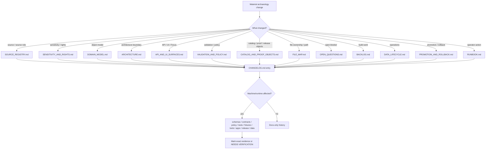

<!-- [KFM_META_BLOCK_V2]
doc_id: kfm://doc/NEEDS-VERIFICATION-docs-domains-archaeology-changelog
title: Archaeology Changelog
type: standard
version: v1
status: draft
owners: TODO-NEEDS-OWNER
created: TODO-NEEDS-GIT-HISTORY-YYYY-MM-DD
updated: 2026-05-06
policy_label: NEEDS-VERIFICATION-public-or-restricted
related: [docs/domains/archaeology/README.md, docs/domains/archaeology/architecture/ARCHITECTURE.md, docs/domains/archaeology/architecture/DOMAIN_MODEL.md, docs/domains/archaeology/architecture/API_AND_UI_SURFACES.md, docs/domains/archaeology/governance/SOURCE_REGISTRY.md, docs/domains/archaeology/governance/SENSITIVITY_AND_RIGHTS.md, docs/domains/archaeology/governance/VALIDATION_AND_POLICY.md, docs/domains/archaeology/governance/CATALOG_AND_PROOF_OBJECTS.md, docs/domains/archaeology/governance/FILE_MAP.md, docs/domains/archaeology/governance/OPEN_QUESTIONS.md, docs/domains/archaeology/governance/BACKLOG.md, docs/domains/archaeology/operations/DATA_LIFECYCLE.md, docs/domains/archaeology/operations/PROMOTION_AND_ROLLBACK.md, docs/domains/archaeology/operations/RUNBOOK.md]
tags: [kfm, archaeology, changelog, governance, documentation-control, sensitivity, rights, release, rollback]
notes: [Revises the existing thin archaeology changelog into a governed change ledger. Target file was inspected on GitHub main; local checkout was not mounted. doc_id, owners, created date, policy label, CODEOWNERS coverage, link-check output, executable schema/policy/test/CI enforcement, release artifacts, runtime routes, steward review process, and live source posture remain NEEDS VERIFICATION.]
[/KFM_META_BLOCK_V2] -->

# Archaeology Changelog

Human-readable history for material changes to the KFM Archaeology documentation lane, especially changes that affect evidence, sensitivity, public geometry, source roles, release, correction, or rollback posture.

  
  
  
  
  
  
  

  <a href="#status">Status</a> ·
  <a href="#scope">Scope</a> ·
  <a href="#change-log">Change log</a> ·
  <a href="#entry-rules">Entry rules</a> ·
  <a href="#impact-map">Impact map</a> ·
  <a href="#maintenance-checklist">Checklist</a> ·
  <a href="#open-verification">Open verification</a>

> [!IMPORTANT]
> This changelog records **documentation and governance history** for `docs/domains/archaeology/`. It is not a release manifest, proof pack, source registry, schema, policy bundle, validator output, runtime log, or publication approval.

> [!WARNING]
> Archaeology is a fail-closed lane. Changes that affect exact site locations, burial or human-remains context, sacred or culturally sensitive places, private-land access, collection security, source rights, public geometry, Focus Mode, exports, or release state must preserve the default posture: **exact public archaeological locations are denied unless a reviewed public-safe release explicitly permits the outward form**.

---

## Status

| Field | Value |
|---|---|
| File | `docs/domains/archaeology/CHANGELOG.md` |
| Owning root | `docs/` — human-facing control plane and domain documentation |
| Lane | `archaeology` |
| Status | `draft` |
| Owners | `TODO-NEEDS-OWNER` |
| Last updated | `2026-05-06` |
| Current evidence boundary | Target file and adjacent archaeology docs were checked on GitHub `main`; local checkout was not mounted |
| Default exact public location posture | `DENY` |
| Default unknown-rights posture | `DENY public release` / `QUARANTINE` |
| Runtime posture | Governed API and released public-safe artifacts only |
| Enforcement maturity | `NEEDS VERIFICATION` for executable schemas, policies, validators, tests, CI workflows, release artifacts, route handlers, UI components, and runtime behavior |

### Reading rule

Use the narrowest truthful label when a changelog entry records implementation-adjacent work.

| Label | Use in changelog entries |
|---|---|
| `CONFIRMED` | Verified from current repo evidence, adjacent docs, current-session command output, emitted artifacts, or governing KFM doctrine. |
| `PROPOSED` | Recommended or planned change not yet verified as implemented. |
| `UNKNOWN` | Not verified from current repo files, tests, workflows, runtime logs, dashboards, release artifacts, or steward records. |
| `NEEDS VERIFICATION` | Checkable item that must be confirmed before maintainers rely on it. |
| `DENY` | Policy blocks the requested public action or release. |
| `ABSTAIN` | Evidence, source role, rights, or scope is insufficient for a claim. |
| `ERROR` | Tooling, resolver, schema, validator, catalog, release, or runtime failure prevents trustworthy handling. |

[Back to top](#top)

---

## Scope

This changelog tracks material changes to the archaeology documentation surface, including:

- lane README and navigation changes;
- architecture, domain model, API/UI, and runtime-boundary documentation;
- source registry, sensitivity, rights, validation, policy, catalog, proof, file-map, open-question, and backlog documentation;
- data lifecycle, promotion, rollback, runbook, incident, correction, and withdrawal documentation;
- changes that affect public-safe geometry, EvidenceBundle closure, source-role discipline, release manifests, correction notices, rollback cards, or Focus Mode behavior;
- newly discovered verification gaps that affect the archaeology lane.

This changelog does **not** claim:

- live archaeology source activation;
- executable schema, policy, validator, CI, or runtime enforcement;
- public archaeology publication;
- route names, UI component names, dashboards, logs, branch protection, or deployment posture;
- steward, tribal, cultural, agency, landowner, collection, or rights-review completion.

Those claims require direct evidence from the active repository, emitted artifacts, test results, review records, or release records.

[Back to top](#top)

---

## Change log

### Unreleased

No unreleased archaeology documentation changes are recorded yet.

Use this section for upcoming changes that have not been merged, published, or otherwise accepted into the active branch. Move entries into a dated section when the change is landed and reviewed.

Expected entry style:

- **Added** for new files, sections, docs, fixtures, or guidance.
- **Changed** for revised behavior, wording, posture, links, or ownership.
- **Fixed** for repaired broken links, metadata, contradictions, or unsafe wording.
- **Deprecated** for files or concepts retained as lineage but no longer preferred.
- **Removed** for deleted or withdrawn material, with successor path or rationale.
- **Security / policy** for exact-location, rights, sensitivity, steward-review, public DTO, Focus Mode, export, or release-boundary changes.
- **Verification** for evidence-status changes, newly verified surfaces, or newly discovered unknowns.

---

### 2026-05-06 — Governed changelog revision

#### Added

- Added KFM Meta Block V2 to make this changelog discoverable by the documentation control plane.
- Added a status block, badges, quick navigation, scope, reading rule, entry rules, impact map, maintenance checklist, open verification table, and reviewer quick card.
- Added explicit changelog labels for `CONFIRMED`, `PROPOSED`, `UNKNOWN`, `NEEDS VERIFICATION`, `DENY`, `ABSTAIN`, and `ERROR`.
- Added archaeology-specific entry rules so changes that affect exact public locations, rights, sensitivity, evidence closure, public geometry, Focus Mode, exports, correction, and rollback are recorded with the correct trust burden.
- Added a preservation rule for the prior `2026-04-27` entry so the original companion-documentation milestone remains visible.

#### Changed

- Expanded the file from a short date-and-bullet history into a governed change ledger for `docs/domains/archaeology/`.
- Aligned the changelog with the current archaeology documentation surface: README, architecture, domain model, API/UI surfaces, source registry, sensitivity and rights, validation and policy, catalog and proof objects, file map, open questions, backlog, data lifecycle, promotion and rollback, and runbook.
- Clarified that documentation changes are not equivalent to executable enforcement, public publication, source activation, route implementation, workflow execution, dashboard readiness, or release maturity.
- Made the exact-location rule visible in the changelog itself: public exact archaeological site disclosure remains `DENY` by default.
- Routed machine and runtime changes back to their responsibility roots rather than letting this changelog become a source registry, schema, policy bundle, release manifest, proof pack, test report, or runtime record.

#### Verification

- `CONFIRMED`: A prior `docs/domains/archaeology/CHANGELOG.md` existed on GitHub `main` and contained a `2026-04-27` archaeology documentation-set entry.
- `CONFIRMED`: The archaeology documentation surface contains the companion docs linked from this changelog.
- `NEEDS VERIFICATION`: owners, stable `doc_id`, original creation date, policy label, CODEOWNERS coverage, link-check output, schema-home authority, executable policy runtime, tests, CI workflow coverage, release object locations, runtime route names, UI component paths, live source rights, and steward-review process.

#### No release claim

This revision does **not** claim a public archaeology release, live source connector, exact-location exception, release manifest, proof pack, production route, dashboard, or CI-enforced gate.

---

### 2026-04-27 — Archaeology companion documentation set

#### Added

- Added archaeology companion documentation set to complete the `docs/domains/archaeology/` directory scaffold.
- Added architecture, domain model, source registry, sensitivity/rights, validation/policy, catalog/proof, API/UI, lifecycle, promotion/rollback, file map, runbook, open questions, and backlog docs.

#### Notes

- This entry records a documentation-surface milestone.
- It does not by itself prove executable schemas, policies, validators, CI workflows, release artifacts, route handlers, UI components, live source activation, steward review, or public publication.
- Future changes that materially revise those companion docs should add dated entries here and update the affected docs together.

[Back to top](#top)

---

## Entry rules

Record changes here when they affect the archaeology lane’s trust posture, not just prose style.

### Always record

| Change type | Changelog requirement |
|---|---|
| New archaeology doc | Record path, purpose, owner placeholder or owner, and whether downstream machine/runtime surfaces are verified. |
| File moved, renamed, or deprecated | Record old path, new path, successor, compatibility note, and link impact. |
| Sensitivity or rights rule changes | Record public exposure effect, denial behavior, review burden, and related docs. |
| Public geometry rule changes | Record public geometry class, transform receipt implication, and rollback impact. |
| Source-role changes | Record which claim types the source role can or cannot support. |
| EvidenceBundle or citation changes | Record whether public answers, drawer payloads, stories, exports, or catalog records are affected. |
| API/UI/Focus changes | Record whether public DTOs, MapLibre layers, Evidence Drawer, Focus Mode, review console, stories, exports, or screenshots are affected. |
| Promotion or rollback changes | Record release packet, correction, withdrawal, rollback, alias, cache, tile, catalog, proof, and public-surface implications. |
| Verification status changes | Record what changed from `UNKNOWN` / `NEEDS VERIFICATION` to `CONFIRMED`, including evidence source. |
| Incident or correction | Record public-safe summary, affected surface, correction/withdrawal status, and rollback follow-up. |

### Do not overclaim

| Tempting changelog wording | Safer wording |
|---|---|
| “Implemented archaeology policy.” | “Documented archaeology policy posture; executable policy remains `NEEDS VERIFICATION` unless policy files/tests are verified.” |
| “Published archaeology layer.” | “Documented public-safe layer requirements; publication remains `NEEDS VERIFICATION` unless release artifacts and layer manifests are verified.” |
| “Added Focus Mode support.” | “Documented Focus Mode boundary; route/component/runtime implementation remains `NEEDS VERIFICATION`.” |
| “Confirmed source.” | “Added source descriptor guidance; live source rights, activation, and source-role support remain `NEEDS VERIFICATION`.” |
| “Generalized site locations.” | “Documented public-geometry transform requirement; transform receipt and public DTO leak tests remain `NEEDS VERIFICATION` unless verified.” |

[Back to top](#top)

---

## Impact map

Use this map before adding a changelog entry. It keeps history tied to the docs and responsibility roots that must move together.

### Companion-doc update matrix

| If the changelog entry mentions… | Also check… |
|---|---|
| `README.md` navigation, scope, inputs, exclusions | [`README.md`](README.md), [`governance/FILE_MAP.md`](governance/FILE_MAP.md) |
| Architecture, lifecycle boundary, public geometry posture | [`architecture/ARCHITECTURE.md`](architecture/ARCHITECTURE.md), [`operations/DATA_LIFECYCLE.md`](operations/DATA_LIFECYCLE.md) |
| Object families, relationships, geometry profiles, temporal model | [`architecture/DOMAIN_MODEL.md`](architecture/DOMAIN_MODEL.md) |
| Governed API, MapLibre, Evidence Drawer, Focus Mode, review, story, export | [`architecture/API_AND_UI_SURFACES.md`](architecture/API_AND_UI_SURFACES.md) |
| Source admission or source-role support | [`governance/SOURCE_REGISTRY.md`](governance/SOURCE_REGISTRY.md) |
| Rights, sensitivity, public geometry, denial triggers | [`governance/SENSITIVITY_AND_RIGHTS.md`](governance/SENSITIVITY_AND_RIGHTS.md) |
| Validation gates, reason codes, obligations, fixture targets | [`governance/VALIDATION_AND_POLICY.md`](governance/VALIDATION_AND_POLICY.md) |
| EvidenceBundle, catalog, proof, release, correction, rollback objects | [`governance/CATALOG_AND_PROOF_OBJECTS.md`](governance/CATALOG_AND_PROOF_OBJECTS.md), [`operations/PROMOTION_AND_ROLLBACK.md`](operations/PROMOTION_AND_ROLLBACK.md) |
| Missing owners, schema-home, CI, runtime, steward review, source rights | [`governance/OPEN_QUESTIONS.md`](governance/OPEN_QUESTIONS.md), [`governance/BACKLOG.md`](governance/BACKLOG.md) |
| Runbook or incident response | [`operations/RUNBOOK.md`](operations/RUNBOOK.md), [`operations/PROMOTION_AND_ROLLBACK.md`](operations/PROMOTION_AND_ROLLBACK.md) |

[Back to top](#top)

---

## Maintenance checklist

Before merging a changelog revision:

- [ ] One H1 is present.
- [ ] KFM Meta Block V2 is present and unresolved values are clearly marked.
- [ ] The new entry is dated or kept under `Unreleased`.
- [ ] The entry separates documentation changes from executable implementation claims.
- [ ] Exact public archaeology location posture remains `DENY` by default.
- [ ] Unknown rights and unknown sensitivity are not described as public-safe.
- [ ] Candidate remote-sensing, LiDAR, aerial, satellite, geophysical, or model features are not described as confirmed sites unless review/evidence is verified.
- [ ] Public geometry changes mention transform receipts when relevant.
- [ ] Evidence, source-role, review, release, correction, and rollback impacts are recorded when relevant.
- [ ] Companion docs are updated or the gap is listed under [Open verification](#open-verification).
- [ ] Machine/runtime claims name their evidence or remain `NEEDS VERIFICATION`.
- [ ] No raw source data, restricted coordinates, private/steward details, secrets, or operational credentials are added to this file.
- [ ] Links are checked from `docs/domains/archaeology/CHANGELOG.md`.

[Back to top](#top)

---

## Open verification

| Item | Status | Why it remains open |
|---|---:|---|
| Stable `doc_id` | `NEEDS VERIFICATION` | Must come from the document registry or accepted ID generation process, not from guesswork. |
| Owner / CODEOWNERS mapping | `TODO-NEEDS-OWNER` | Required for review, escalation, source activation, release approval, and incident response. |
| Created date | `TODO-NEEDS-GIT-HISTORY-YYYY-MM-DD` | Should be filled from Git history or a document registry. |
| Policy label | `NEEDS VERIFICATION` | Determines whether the changelog is public, restricted, or mixed. |
| Link-check output | `NEEDS VERIFICATION` | GitHub links should be verified in the active branch before publication. |
| Schema-home authority | `NEEDS VERIFICATION` | Prevents `contracts/` and `schemas/` drift. |
| Executable policy runtime | `UNKNOWN` | Documentation names policy outcomes; enforcement must be verified separately. |
| Archaeology fixtures and validators | `UNKNOWN` | No fixture/test/validator maturity is claimed by this file. |
| CI workflow coverage | `UNKNOWN` | Workflow enforcement cannot be claimed from documentation alone. |
| Release manifests, proof packs, receipts, correction notices, rollback cards | `UNKNOWN` | Publication maturity must be verified from emitted artifacts. |
| Governed API routes and UI components | `UNKNOWN` | Route/component names and runtime behavior require repo inspection. |
| Live source rights and steward review | `NEEDS VERIFICATION` | Public release cannot proceed without rights, sensitivity, and review evidence. |
| Runtime logs, dashboards, deployments, branch protections | `UNKNOWN` | Not established by this changelog or by companion docs alone. |

[Back to top](#top)

---

## Appendix: reviewer quick card

<strong>Changelog review card</strong>

| Check | Required answer |
|---|---|
| What changed? | Documentation only / docs + machine contract / docs + policy / docs + runtime / release / rollback / correction |
| Which files are affected? | List exact paths and statuses. |
| Does the change affect public exposure? | yes / no |
| Does it affect exact or sensitive location handling? | yes / no |
| Does it affect source roles or claim support? | yes / no |
| Does it affect EvidenceBundle or citation closure? | yes / no |
| Does it affect API, MapLibre, Evidence Drawer, Focus Mode, story, export, graph, search, vector, or catalog output? | yes / no |
| Does it require a transform receipt? | yes / no |
| Does it require policy or fixture updates? | yes / no |
| Does it require release/correction/rollback updates? | yes / no |
| What is confirmed? | Evidence source or path. |
| What remains `NEEDS VERIFICATION`? | Owner, date, policy label, schema, policy, tests, CI, routes, release, steward review, etc. |

<strong>Anti-patterns this changelog should prevent</strong>

| Anti-pattern | Correct response |
|---|---|
| Treating a documentation entry as release proof | Require release manifest, proof refs, policy decision, correction path, and rollback target. |
| Claiming enforcement because a rule is written down | Mark executable enforcement `NEEDS VERIFICATION` until policy/tests/CI are verified. |
| Treating a source registry note as source activation | Require source descriptor, rights/sensitivity review, activation state, fixtures, and review record. |
| Saying “site data published” without geometry posture | Require public geometry class and transform receipt. |
| Letting a UI change hide sensitive data client-side | Require server-side public DTO allowlist and no-leak tests. |
| Letting Focus Mode answer from map properties or model memory | Require released EvidenceBundle context, citation validation, and finite outcomes. |
| Removing a bad public artifact silently | Use correction, withdrawal, supersession, or rollback lineage. |

[Back to top](#top)
