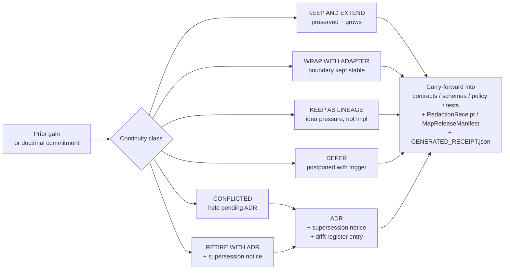
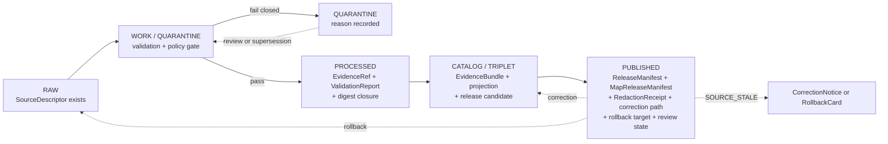

<!-- [KFM_META_BLOCK_V2]
doc_id: kfm://doc/domains/archaeology/continuity-inventory
title: Archaeology Domain — Continuity Inventory
type: standard
version: v1.1
status: draft
owners: archaeology-domain-steward + docs-steward    # PLACEHOLDER — NEEDS VERIFICATION
created: 2026-05-15
updated: 2026-05-29
policy_label: public                                 # Document is public; subject content is sensitivity-gated
related:
  - docs/doctrine/ai-build-operating-contract.md     # CONFIRMED authority; pins CONTRACT_VERSION = "3.0.0"
  - docs/doctrine/directory-rules.md                 # PROPOSED canonical home
  - docs/doctrine/authority-ladder.md                # PROPOSED
  - docs/doctrine/lifecycle-law.md                   # PROPOSED
  - docs/doctrine/truth-posture.md                   # PROPOSED
  - docs/domains/archaeology/README.md               # PROPOSED
  - docs/domains/archaeology/ARCHITECTURE.md         # PROPOSED — sibling (see OQ-CI-02)
  - docs/domains/archaeology/CANONICAL_PATHS.md      # PROPOSED — sibling (path-namespace authority for this lane)
  - docs/domains/archaeology/CROSS_DOMAIN.md         # PROPOSED — sibling (cross-lane boundary register)
  - docs/domains/README.md                           # PROPOSED
  - docs/registers/VERIFICATION_BACKLOG.md           # PROPOSED
  - docs/registers/DRIFT_REGISTER.md                 # PROPOSED
  - docs/registers/CANONICAL_LINEAGE_EXPLORATORY.md  # PROPOSED
  - docs/architecture/ui/CONTINUITY_NOTES.md         # PROPOSED — sibling pattern
  - docs/architecture/governed-ai/CONTINUITY_NOTES.md# PROPOSED — sibling pattern
  - policy/domains/archaeology/README.md             # PROPOSED
  - policy/sensitivity/archaeology/                  # PROPOSED — §23.2 enforcement home (ENCY §7.13)
  - schemas/contracts/v1/domains/archaeology/        # PROPOSED — schema home (ADR-0001)
tags: [kfm, archaeology, continuity, governance, evidence, sensitivity, doctrine-adjacent]
notes:
  - "Pinned to CONTRACT_VERSION = \"3.0.0\" per ai-build-operating-contract.md §1.3 / §8 (truth labels) and §37 (versioning + CONTRACT_VERSION pinning convention)."
  - "All file-path-shaped claims are PROPOSED until verified against a mounted repository ([CONTRACT v3.0] §7 current-session evidence limit)."
  - "Path namespace contracts/domains/archaeology/ is consistent with CANONICAL_PATHS.md v1.1 §2.4 resolution (Directory Rules §12 form). Atlas v1.1 §24.13 shorthand (contracts/archaeology/) and ENCY §7.13 (schemas/contracts/v1/archaeology/) kept as LINEAGE."
  - "Exact archaeological site locations DENY by default per [CONTRACT v3.0] §23.2 row 'Archaeology — site locations' (the §23.2 matrix is itself PROPOSED in v3.0 pending steward ratification; until ratified the most restrictive applicable row applies, which only strengthens the gate); this inventory does not record them."
  - "Terminology drift exists between DOM-ARCH (Culmination Atlas §E) and ENCY §7.13 (encyclopedia) object lists — flagged in §4 and Appendix A.2 as CONFLICTED; resolution path is ADR."
  - "v1.1 adds [CONTRACT v3.0] §23.2 row, RedactionReceipt / MapReleaseManifest continuity entries, NARROWED/BOUNDED/SOURCE_STALE finite outcomes, GENERATED_RECEIPT.json discipline (§34), Open Questions Register, Changelog, and Definition of Done."
[/KFM_META_BLOCK_V2] -->

# Archaeology Domain — Continuity Inventory

> A KFM register of prior gains, identity-bearing object families, lifecycle gates, and carry-forward responsibilities for the **Archaeology** domain — explicit about what must persist across changes, what may extend, what is deferred, and what currently has no evidence of implementation. Aligned with `ai-build-operating-contract.md` v3.0 (`CONTRACT_VERSION = "3.0.0"`) and the §23.2 sensitive-domain matrix.

<!-- TODO: replace placeholder badges with workflow / version targets once CI and ADR identifiers exist. -->

**Status:** draft · v1.1  ·  **Pinned contract:** `CONTRACT_VERSION = "3.0.0"`  ·  **Owners:** `archaeology-domain-steward + docs-steward` *(placeholder — NEEDS VERIFICATION)*  ·  **Required additional reviewer (§23.2):** tribal/cultural reviewer · rights-holder rep  ·  **Last updated:** 2026-05-29  ·  **Path basis:** Directory Rules §4 (responsibility root = `docs/` for human-facing explanation), §12 (Domain Placement Law: domain segment under responsibility root), and `[CONTRACT v3.0]` §11. *Per-root presence in the live repo: PROPOSED until verified.*

> [!IMPORTANT]
> **Sensitivity posture.** Per `ai-build-operating-contract.md` §23.2 (sensitive-domain decision matrix), the default disposition for archaeology site locations is **`DENY` exact coordinates · generalize to county/region · tribal/cultural reviewer + rights-holder rep required · `RedactionReceipt` + `PolicyDecision` + `MapReleaseManifest` required**. The §23.2 matrix is **PROPOSED** as of v3.0 (steward ratification pending); until ratified, the **most restrictive applicable row applies**, which only strengthens the gate. Exact archaeological site coordinates, burial/human-remains records, sacred or culturally sensitive places, restricted cultural archives, and any geometry below **H3 r7** for sensitive archaeology products **DENY by default**. This document records the *continuity* of those rules — it does not host, link to, or describe exact-location data.

---

## 📑 Quick jump

- [1. Purpose and scope](#1-purpose-and-scope)
- [2. Authority and truth-label posture](#2-authority-and-truth-label-posture)
- [3. Continuity classification](#3-continuity-classification)
- [4. Prior gains and continuity inventory](#4-prior-gains-and-continuity-inventory)
- [5. Object-identity continuity](#5-object-identity-continuity)
- [6. Lifecycle continuity (RAW → PUBLISHED)](#6-lifecycle-continuity-raw--published)
- [7. Cross-lane continuity](#7-cross-lane-continuity)
- [8. Sensitivity, rights, and deny-by-default continuity](#8-sensitivity-rights-and-deny-by-default-continuity)
- [9. Carry-forward responsibilities](#9-carry-forward-responsibilities)
- [10. Verification backlog](#10-verification-backlog)
- [11. Open questions register & open ADRs](#11-open-questions-register--open-adrs)
- [12. Changelog v1.0 → v1.1](#12-changelog-v10--v11)
- [13. Definition of done](#13-definition-of-done)
- [14. Related docs](#14-related-docs)
- [Appendix A. Terminology continuity register](#appendix-a-terminology-continuity-register)
- [Appendix B. Update-propagation cells (this doc)](#appendix-b-update-propagation-cells-this-doc)

---

## 1. Purpose and scope

CONFIRMED doctrine. The Kansas Frontier Matrix carries forward prior design positions, doctrinal commitments, and identity-bearing objects across every run, pass, and revision; nothing is silently retired. The Whole-UI + Governed AI Expansion Report and `ai-build-operating-contract.md` v3.0 formalize this as a **continuity inventory** — a register that classifies each prior gain as *kept and extended*, *wrapped with an adapter*, *kept as lineage*, *deferred*, *conflicted*, or *retired with ADR*, names its evidence basis, and states the preserved next behavior. This file applies that pattern to the **Archaeology** domain.

PROPOSED scope. This inventory records:

- Doctrinal commitments specific to Archaeology (sensitivity, candidate-vs-confirmed, exact-location denial, steward review, `[CONTRACT v3.0]` §23.2 row).
- Object families that require entity-identity continuity — DDD's "thread of identity that runs through time and often across distinct representations."
- Source families and source-role posture that must be preserved across source-registry updates.
- Lifecycle gates (RAW → WORK / QUARANTINE → PROCESSED → CATALOG / TRIPLET → PUBLISHED) as they apply to Archaeology.
- Cross-lane relations whose ownership, source-role, and sensitivity constraints must not be silently weakened by adjacent-domain changes.
- Receipt and manifest families (`RedactionReceipt`, `PublicationTransformReceipt`, `MapReleaseManifest`, `GENERATED_RECEIPT.json`) whose presence is enforced by §23.2 and §34.
- Verification items that block treating any of the above as implemented.

This inventory **does not**:

- Host, link to, or describe exact-location data, sacred-site coordinates, or restricted cultural archives.
- Decide whether a file *should* exist (that is a `contracts/`, `schemas/`, `policy/`, ADR, and review responsibility).
- Substitute for tests, fixtures, validators, manifests, or release decisions. Documentation is part of the working system but **never the source of canonical decision** (`[CONTRACT v3.0]` §25, §38).

> [!NOTE]
> **Path basis.** This file lives at `docs/domains/archaeology/CONTINUITY_INVENTORY.md` per Directory Rules §4 (Step 1: "explains something to humans" → `docs/`), §12 (Domain Placement Law: domain segments under responsibility roots, never as root folders), and `[CONTRACT v3.0]` §11. The path itself is PROPOSED until verified against the mounted repository. The `domains/` intermediate segment is preserved per `CANONICAL_PATHS.md` v1.1 §2.4 resolution (Directory Rules §12 wins on the §2.1 authority order). The Atlas §24.13 crosswalk and ENCY §7.13 render the *contracts/schemas* forms without the `domains/` segment; that conflict is tracked as `OQ-CI-02`.

[Back to top ↑](#-quick-jump)

---

## 2. Authority and truth-label posture

CONFIRMED authority order (lifted from `ai-build-operating-contract.md` v3.0 §1.2 / §5, Directory Rules §2.1, and the Encyclopedia's "Inspectable claim" / "Evidence hierarchy" laws):

1. **`ai-build-operating-contract.md` v3.0** — canonical operating contract; `CONTRACT_VERSION = "3.0.0"` is pinned; §1 Operating Law (the 16-rule spine) wins on any conflict; if the elaborated manual contradicts §1, the short form wins and the manual section becomes a CONFLICTED ADR candidate.
2. **KFM core invariants and doctrine** — lifecycle law, cite-or-abstain, trust membrane, authority ladder, watcher-as-non-publisher (`[CONTRACT v3.0]` §10; watcher-as-non-publisher specifically per Directory Rules §13).
3. **Accepted ADRs** that explicitly amend doctrine.
4. **Canonical doctrine docs** — Directory Rules, lifecycle law, truth posture, authority ladder.
5. **This inventory** (refines but never overrides the above).
6. **Per-root and per-package READMEs.**
7. **Domain dossiers and prior architecture reports** — lineage / proposed only.

| Label | Meaning in this document | Default for new archaeology claims |
|---|---|---|
| **CONFIRMED** | Verified this session from attached project documents, doctrine, or workspace evidence. | Doctrinal statements only. |
| **INFERRED** | Reasonably derivable from visible evidence but not directly stated. | Use sparingly; prefer to upgrade or downgrade with evidence. |
| **PROPOSED** | Design, path, schema, route, or recommendation not yet verified in implementation. | Any path, schema, validator, fixture, or workflow claim; the §23.2 matrix defaults; the §24.5 tier scheme. |
| **UNKNOWN** | Not resolvable without more evidence (mounted repo, runtime, logs). | Repo presence, branch state, deployment state. |
| **NEEDS VERIFICATION** | Checkable, but not yet checked strongly enough to act as fact. | Rights, source-vintage, package versions, current terms. |
| **CONFLICTED** | Two project sources disagree; resolution requires an ADR or steward decision. | See Appendix A for the active terminology conflict. |
| **LINEAGE** | Useful as historical context, idea pressure, or proposed-design source; not treated as current authority. | Earlier domain dossiers, scaffold reports, Atlas v1.1 §24.13 shorthand. |
| **EXTERNAL** | Sourced from authoritative external research (W3C, OGC, ISO, vendor docs). | Not used in this file; no external research was performed. |

> [!NOTE]
> **Memory is not evidence.** Recollection, guessed paths, likely behavior, and generic best practice are not facts (`[CONTRACT v3.0]` §1.3, §9.5, anti-pattern §38.25). Cross-session "I previously verified this" does NOT make a claim CONFIRMED in the current session. Where this inventory carries forward a prior gain, the evidence basis is named explicitly.

[Back to top ↑](#-quick-jump)

---

## 3. Continuity classification

CONFIRMED pattern. The Whole-UI + Governed AI Expansion Report introduced six continuity classifications. This inventory uses them for Archaeology, plus two explicit additions: `RETIRE WITH ADR` (which the broader corpus assumes implicitly through ADR discipline, `[CONTRACT v3.0]` §28, §37) and the operating contract's `[CONTRACT v3.0]` §37 lifecycle types.

| Class | Meaning | When to use |
|---|---|---|
| **KEEP AND EXTEND** | The prior gain is preserved and may grow; behavior is carried forward into the next surface. | Doctrinal commitments, object-family spines, sensitivity rules, lifecycle gates, §23.2-required receipts. |
| **WRAP WITH ADAPTER** | Preserve the prior gain behind a port/adapter boundary so the renderer, runtime, or external tool can change without touching truth. | MapLibre renderer for archaeology layers; 3D viewer; AI model adapter. |
| **KEEP AS LINEAGE** | Useful as historical context, idea pressure, or proposed-design source; not treated as current implementation. | Earlier domain dossiers, scaffold reports, indicative trees, Atlas v1.1 §24.13 shorthand path form. |
| **DEFER** | Intentionally postponed until a trigger condition is met; not retired. | Cesium/3D runtime for archaeology; LiDAR-candidate auto-classification; live SHPO connectors. |
| **DEFER IF ABSENT** | Build only if an upstream prerequisite materializes (e.g., a GraphQL layer, a 3D pipeline). | 3D Tiles publication for excavation models without 2D evidence parity. |
| **CONFLICTED** | Two project sources disagree; the entry is held pending an ADR. | Terminology drift between DOM-ARCH and ENCY §7.13 (Appendix A.2). |
| **RETIRE WITH ADR** | A prior gain is intentionally dropped; requires ADR, supersession notice, and a drift-register entry. | None currently applied in this inventory. |

> [!TIP]
> **Continuity determination:** *prior gains are not discarded. They are carried forward as doctrine, lineage, or proposed design pressure. None are represented as mounted implementation without repo evidence.* This is the operating-contract analog of `[CONTRACT v3.0]` §37 versioning lifecycle: every change is traceable, reversible, and labeled.

[Back to top ↑](#-quick-jump)

---

## 4. Prior gains and continuity inventory

The table below is the **core register** of this document. Each row is a prior gain or doctrinal commitment relevant to Archaeology, with its continuity class, evidence basis, and preserved next behavior.

| Surface or prior gain | Class | Evidence basis | Preserved next behavior | Status |
|---|---|---|---|---|
| `[CONTRACT v3.0]` operating law (`CONTRACT_VERSION = "3.0.0"`) | KEEP AND EXTEND | `ai-build-operating-contract.md` v3.0 §1, §37 | Pinned in every doctrine-adjacent doc, PR body (§27.1), and `GENERATED_RECEIPT.json` (§34, §37.1) for archaeology work. | CONFIRMED |
| `[CONTRACT v3.0]` §23.2 sensitive-domain matrix row "Archaeology — site locations" | KEEP AND EXTEND | `ai-build-operating-contract.md` v3.0 §23.2 (row text CONFIRMED; matrix PROPOSED pending ratification) | Default `DENY` exact coords · generalize to county/region · tribal/cultural reviewer + rights-holder rep · `RedactionReceipt` + `PolicyDecision` + `MapReleaseManifest`. Most-restrictive-applicable-row rule applies until ratified. | CONFIRMED row text / PROPOSED matrix + enforcement |
| Lifecycle law: RAW → WORK / QUARANTINE → PROCESSED → CATALOG / TRIPLET → PUBLISHED | KEEP AND EXTEND | Directory Rules §0; ENCY §4; DOM-ARCH §H; `[CONTRACT v3.0]` §10.1 | Promotion remains a **governed state transition, not a file move**; all archaeology lanes traverse every phase. | CONFIRMED doctrine / PROPOSED lane application |
| Cite-or-abstain truth posture | KEEP AND EXTEND | ENCY §4 (Operating Law); `[CONTRACT v3.0]` §10.3 | Public archaeology claims resolve to `EvidenceBundle` or `ABSTAIN`; AI `ABSTAIN`s when evidence is insufficient. | CONFIRMED |
| Trust membrane (public clients use governed APIs, not canonical stores) | KEEP AND EXTEND | ENCY §4; Directory Rules §13; `[CONTRACT v3.0]` §10.2 | Archaeology routes go through `apps/governed-api/`; no direct browser access to RAW/WORK/QUARANTINE/PROCESSED archaeology stores. | CONFIRMED doctrine |
| Watcher-as-non-publisher invariant | KEEP AND EXTEND | Directory Rules §13; `[CONTRACT v3.0]` §38.11 ("a watcher saw a change, so publish") | Connectors/watchers emit only to `data/raw/archaeology/` or `data/quarantine/archaeology/`; promotion is governed. | CONFIRMED doctrine / PROPOSED test |
| Exact archaeological location denial by default | KEEP AND EXTEND | DOM-ARCH §I; ENCY §13 (Sensitive Register); `[CONTRACT v3.0]` §10.4, §23.2 | All public archaeology layers serve generalized geometry only; exact joins fail closed. | CONFIRMED doctrine / PROPOSED enforcement |
| H3 r7 floor for sensitive archaeology products; H3 r7–r9 generalization for cultural/landscape layers | KEEP AND EXTEND | Master MapLibre §Q (ML-061-156, ML-061-158, ML-061-159) | Validators enforce the floor; release fails closed below it; profile parameters tracked as `OQ-CI-04`. | CONFIRMED source rule / PROPOSED validator |
| Steward / cultural / tribal review surface | KEEP AND EXTEND | ENCY §7.13; DOM-ARCH §I,L; `[CONTRACT v3.0]` §23.2 (required reviewer beyond domain steward), §33 | Promotion of sensitive archaeology objects requires recorded `StewardReview` / `CulturalReview` outcome + rights-holder rep sign-off. | CONFIRMED doctrine / PROPOSED review record schema |
| Candidate-vs-confirmed distinction (`RemoteSensingAnomaly`, `LiDARCandidate` ≠ `ArchaeologicalSite`) | KEEP AND EXTEND | ENCY §7.13; Master MapLibre ML-061-155, ML-061-167; Domains Atlas §B | `CandidateFeature` never promotes silently to a site; promotion is a governed transition with `EvidenceBundle`. | CONFIRMED doctrine / PROPOSED tests |
| Object-family spine: `Archaeological Site, SiteComponent, CulturalTemporalPeriod, SurveyProject, SurveyTransect, ShovelTest, TestUnit, ExcavationUnit, ProvenienceContext, StratigraphicUnit, CollectionRepositoryRecord, CandidateFeature, PublicationTransformReceipt` | KEEP AND EXTEND | DOM-ARCH §E (Main object families) | All thirteen carry forward; identity rule is deterministic basis = source id + object role + temporal scope + normalized digest. | CONFIRMED term / PROPOSED implementation |
| Encyclopedia object list: `ArchaeologicalSite, Survey, Artifact, Feature, Context, ExcavationUnit, RemoteSensingAnomaly, LiDARCandidate, GeophysicsObservation, ThreeDDocumentation, CulturalReview, StewardReview, CollectionAccession, ChronologyAssertion, SensitivityTransform` | **CONFLICTED** | ENCY §7.13.C vs DOM-ARCH §E | Two project sources name overlapping-but-distinct object families with different casing. Hold until ADR resolves (`OQ-CI-01`). | CONFLICTED — see Appendix A.2 |
| `RedactionReceipt` — `[CONTRACT v3.0]` §23.2-required transform record | KEEP AND EXTEND | `[CONTRACT v3.0]` §23.2, §29 object-family table, §9.2 glossary; `kfm_unified_doctrine_synthesis.md` glossary | Every public archaeology release emits a `RedactionReceipt` co-located with `PolicyDecision` and `MapReleaseManifest`; relationship to `PublicationTransformReceipt` tracked as `OQ-CI-03`. | CONFIRMED doctrine / PROPOSED schema home |
| `MapReleaseManifest` — `[CONTRACT v3.0]` §23.2-required map-layer manifest | KEEP AND EXTEND | `[CONTRACT v3.0]` §23.2, §9.2 glossary; Master MapLibre §M (ML-061-166) | Every published archaeology map layer carries a `MapReleaseManifest` listing layers, generalization profile, freshness, rollback target. | CONFIRMED doctrine / PROPOSED schema home |
| `GENERATED_RECEIPT.json` for AI-authored archaeology Markdown | KEEP AND EXTEND | `[CONTRACT v3.0]` §34 (inline doctrine), §46 (example), §47 (schema home); Pass 10 C12-03 | Every AI-authored archaeology doc (including this one) carries a receipt with `contract_version: "3.0.0"`, model identity, validation gates, and `human_review.state` (§34.3, §34.4). | CONFIRMED doctrine / PROPOSED schema home |
| `EvidenceBundle`, `EvidenceRef`, `SourceDescriptor`, `RunReceipt`, `ValidationReport`, `DecisionEnvelope`/`RuntimeResponseEnvelope`, `ReleaseManifest`, `CorrectionNotice`, `RollbackCard`, `ReviewRecord` proof-object vocabulary | KEEP AND EXTEND | ENCY §7.13.H; `[CONTRACT v3.0]` §9.2, §29 | Archaeology decision envelopes carry `spec_hash`, `EvidenceBundle` reference, and finite outcome. | CONFIRMED term / PROPOSED schema home |
| Finite outcomes: `ANSWER` / `ABSTAIN` / `DENY` / `ERROR` / `NARROWED` / `BOUNDED` / `SOURCE_STALE` | KEEP AND EXTEND | ENCY §4; `[CONTRACT v3.0]` §8 (extended label set); §22.2 (`SOURCE_STALE` UI negative state) | All archaeology API surfaces (feature resolver, layer manifest, Evidence Drawer payload, Focus Mode) return a typed finite outcome; `NARROWED`/`BOUNDED` used when a narrower-scope or guard-railed answer holds; `SOURCE_STALE` triggers rollback or flagging. | CONFIRMED doctrine / PROPOSED route names |
| Public-safe map products (generalized site summaries, survey-coverage summaries, candidate-feature surfaces, chronology views) | KEEP AND EXTEND | DOM-ARCH §G | Each viewing product gates on `EvidenceBundle` support, sensitivity transform, `RedactionReceipt`, and review state. | PROPOSED |
| Steward-only review maps (exact geometry view, threat/risk review view) | WRAP WITH ADAPTER | DOM-ARCH §G | Restricted views run behind an authenticated steward surface (T2 audience); no public-path leakage. | PROPOSED |
| Evidence Drawer for archaeology features | KEEP AND EXTEND | ENCY §7.13.H,K; `[CONTRACT v3.0]` §9.3 (Evidence Drawer) | Every consequential archaeology claim is one hop from `EvidenceBundle` / `EvidenceRef` resolution. | PROPOSED component |
| Focus Mode for archaeology summaries | KEEP AND EXTEND | Master MapLibre ML-061-162, ML-061-163, ML-061-164; ENCY §7.13.L; `[CONTRACT v3.0]` §21 | Cluster summaries explicitly say zones are generalized, not precise sites; citation validation runs before render; private chain-of-thought is never stored as authority (`[CONTRACT v3.0]` §26.2). | PROPOSED |
| MapLibre as disciplined 2D renderer (downstream of trust) | WRAP WITH ADAPTER | ENCY §4 (Map-renderer boundary); Master MapLibre §A | Renderer remains behind adapter; never authoritative; renders released artifacts only. | CONFIRMED doctrine / PROPOSED adapter |
| 3D / Cesium documentation viewer for excavation/site models | DEFER | KFM_Whole_UI §12; DOM-ARCH §G; Master MapLibre ML-061-157 | Add only after 2D MapLibre/evidence parity passes, access controls + transform receipts are in place, and a Reality Boundary Note is wired into every 3D admission. | DEFERRED |
| Source families: State site inventory / SHPO, NRHP-like listings, field survey forms, excavation records, artifact/collection/repository records, lab reports, historic maps/plats, oral history and cultural knowledge | KEEP AND EXTEND | DOM-ARCH §D; ENCY §7.13.B | Each enters via `SourceDescriptor` with source role, rights, sensitivity, cadence, attribution, and public-release class recorded before connector/watcher activation. | CONFIRMED term / NEEDS VERIFICATION on current terms |
| Source-role anti-collapse (`observed` ≠ `regulatory` ≠ `modeled` ≠ `aggregate` ≠ `administrative` ≠ `candidate` ≠ `synthetic`) | KEEP AND EXTEND | Atlas v1.1 §24.1; `[CONTRACT v3.0]` §38 anti-patterns | LiDAR/RS anomalies are `candidate`, not `observed`, until cultural + steward review promotes them. | CONFIRMED doctrine / PROPOSED validator |
| Sensitive geometry deny / generalized-geometry allow tests; precise-location leakage regression tests | KEEP AND EXTEND | DOM-ARCH §K; Master MapLibre ML-061-156…159, ML-061-167 | Negative-fixture suite gates promotion; failure leaves the candidate quarantined. | PROPOSED |
| CARE-label and sovereignty-notice chips in archaeology UI | KEEP AND EXTEND | Master MapLibre ML-061-160, ML-061-164 | UI exposes trust state visibly; UI badges never substitute for evidence. | PROPOSED |
| Generalization logs as validation evidence for sensitive map products | KEEP AND EXTEND | Master MapLibre ML-061-161 | Each public-safe transform emits a `PublicationTransformReceipt` describing the generalization; a paired `RedactionReceipt` covers the §23.2-required record. | CONFIRMED source rule / PROPOSED emission path |
| AI exact-location denial | KEEP AND EXTEND | DOM-ARCH §K,L; ENCY §7.13.L; `[CONTRACT v3.0]` §10.5, §21, §23.2 | AI may summarize *released* archaeology `EvidenceBundle`s only; `DENY` for exact-location prompts; `ABSTAIN` where evidence is insufficient; `NARROWED`/`BOUNDED` where a narrower-scope answer holds. | CONFIRMED doctrine / PROPOSED gate |
| Domain scaffold reports (KFM_Archaeology_Architecture_Plan_PDF_Only and similar) | KEEP AS LINEAGE | Master MapLibre source ledger | Preserve path patterns, fixtures, validators, and rollback ideas; do not treat scaffold as repo implementation. | LINEAGE |
| Atlas v1.1 §24.13 path shorthand (`contracts/archaeology/`, `schemas/contracts/v1/archaeology/`) | KEEP AS LINEAGE | Atlas v1.1 §24.13 (row 15); ENCY §7.13 | Lineage form only; canonical lane paths use Directory Rules §12 form (`contracts/domains/archaeology/`, etc.) per `CANONICAL_PATHS.md` v1.1 §2.4. Deprecation candidate via `OQ-CI-02` (cross-doc resolution). | LINEAGE / CONFLICTED |
| Bitemporal time discipline: source / observed / valid / retrieval / release / correction times stay distinct where material | KEEP AND EXTEND | DOM-ARCH §E (Temporal handling); `[CONTRACT v3.0]` §10.10 (deterministic identity); Master MapLibre ML-061-165 | Archaeology objects expose all material temporal axes; correction lineage stays auditable. | CONFIRMED doctrine / PROPOSED field realization |
| Separation of duties (author ≠ reviewer ≠ release authority ≠ steward ≠ cultural reviewer ≠ rights-holder rep) | KEEP AND EXTEND | Directory Rules §16; `[CONTRACT v3.0]` §33, §23.2 | Five+ distinct roles for sensitive archaeology releases; no single actor combines authorship, review, and release authorization. | CONFIRMED doctrine / PROPOSED CODEOWNERS realization |

> *PROPOSED diagram: classification flow from prior-gain register to downstream carry-forward responsibilities, including the §23.2 receipt families and the §34 `GENERATED_RECEIPT.json`. The diagram is doctrinal, not a runtime topology.*

[Back to top ↑](#-quick-jump)

---

## 5. Object-identity continuity

CONFIRMED doctrine. Per the Domain-Driven Design reference inside the project corpus, **entities require lifecycle continuity, identity, unique distinction, and model-defined sameness.** Mistaken identity can lead to data corruption. Archaeology object families are entities — they represent a thread of identity that runs through time, across surveys, across releases, and across corrections, even though their attributes (geometry generalization, sensitivity class, review state) may change.

The identity rule for every archaeology entity is the same PROPOSED deterministic basis:

`identity = source_id + object_role + temporal_scope + normalized_digest`

| Object family (DOM-ARCH §E spine) | Purpose (verbatim from corpus) | Identity continuity status | Temporal axes preserved |
|---|---|---|---|
| **Archaeological Site** | Represents Archaeological Site evidence or released derivative within Archaeology. | PROPOSED deterministic basis | source, observed, valid, retrieval, release, correction — distinct where material |
| **SiteComponent** | Represents SiteComponent evidence or released derivative within Archaeology. | PROPOSED deterministic basis | source, observed, valid, retrieval, release, correction |
| **CulturalTemporalPeriod** | Represents CulturalTemporalPeriod evidence or released derivative within Archaeology. | PROPOSED deterministic basis | source, observed, valid, retrieval, release, correction |
| **SurveyProject** | Represents SurveyProject evidence or released derivative within Archaeology. | PROPOSED deterministic basis | source, observed, valid, retrieval, release, correction |
| **SurveyTransect** | Represents SurveyTransect evidence or released derivative within Archaeology. | PROPOSED deterministic basis | source, observed, valid, retrieval, release, correction |
| **ShovelTest** | Represents ShovelTest evidence or released derivative within Archaeology. | PROPOSED deterministic basis | source, observed, valid, retrieval, release, correction |
| **TestUnit** | Represents TestUnit evidence or released derivative within Archaeology. | PROPOSED deterministic basis | source, observed, valid, retrieval, release, correction |
| **ExcavationUnit** | Represents ExcavationUnit evidence or released derivative within Archaeology. | PROPOSED deterministic basis | source, observed, valid, retrieval, release, correction |
| **ProvenienceContext** | Represents ProvenienceContext evidence or released derivative within Archaeology. | PROPOSED deterministic basis | source, observed, valid, retrieval, release, correction |
| **StratigraphicUnit** | Represents StratigraphicUnit evidence or released derivative within Archaeology. | PROPOSED deterministic basis | source, observed, valid, retrieval, release, correction |
| **CollectionRepositoryRecord** | Represents CollectionRepositoryRecord evidence or released derivative within Archaeology. | PROPOSED deterministic basis | source, observed, valid, retrieval, release, correction |
| **CandidateFeature** | Represents CandidateFeature evidence or released derivative within Archaeology. | PROPOSED deterministic basis; **MUST NOT silently promote to `Archaeological Site`** (`[CONTRACT v3.0]` §38) | source, observed, valid, retrieval, release, correction |
| **PublicationTransformReceipt** | Represents PublicationTransformReceipt evidence or released derivative within Archaeology. | PROPOSED deterministic basis; receipt is part of release proof, not a sovereign object (`[CONTRACT v3.0]` §10.7) | source, observed, valid, retrieval, release, correction |
| **RedactionReceipt** *(`[CONTRACT v3.0]` §23.2 / §29)* | Records public-safe field or geometry transformation; required for archaeology release. | PROPOSED deterministic basis; relationship to `PublicationTransformReceipt` tracked as `OQ-CI-03` | source, observed, retrieval, release |
| **MapReleaseManifest** *(`[CONTRACT v3.0]` §23.2 / §9.2)* | Records map-layer release: layers, generalization profile, freshness, rollback target. | PROPOSED deterministic basis; one per release per published-map domain | release, correction |

> [!WARNING]
> **Identity-rename discipline.** A rename that changes what an archaeology object *means* is a content change, not a placement change. Per Directory Rules §14 and `[CONTRACT v3.0]` §28 (ADR-before-rename) and §37 (versioning lifecycle), it requires an ADR, schema version bump, compatibility map for old fixtures, old-fixture parity tests, and `CorrectionNotice` for any released artifacts that referenced the old identity. Continuity is preserved by carrying forward the prior identity in a crosswalk, **never by overwriting it**.

[Back to top ↑](#-quick-jump)

---

## 6. Lifecycle continuity (RAW → PUBLISHED)

CONFIRMED doctrine / PROPOSED lane application. Archaeology follows the canonical lifecycle invariant verbatim. Each stage has a gate that must hold for continuity to be preserved across promotions (`[CONTRACT v3.0]` §10.1).

| Stage | Handling | Gate | Sensitivity-aware constraint (Archaeology) | Status |
|---|---|---|---|---|
| **RAW** | Capture immutable source payload or reference with source role, rights, sensitivity, citation, time, and hash. | `SourceDescriptor` exists. | Exact coordinates may exist in RAW but are sealed to canonical / restricted access; never reachable from public clients. | PROPOSED |
| **WORK / QUARANTINE** | Normalize schema, geometry, time, identity, evidence, rights, and policy; hold failures. | Validation and policy gate pass, **or** quarantine reason is recorded. | Sensitive joins fail closed; rights ambiguity quarantines. | PROPOSED |
| **PROCESSED** | Emit validated normalized objects, receipts, and public-safe candidates. | `EvidenceRef`, `ValidationReport`, and digest closure exist. | Public-safe candidates use generalized geometry (H3 r7+); a `PublicationTransformReceipt` records the transform. | PROPOSED |
| **CATALOG / TRIPLET** | Emit catalog records, `EvidenceBundle`s, graph/triplet projections, and release candidates. | Catalog/proof closure passes. | Sensitive-class records may exist in catalog but are gated on `StewardReview` / `CulturalReview` + rights-holder rep sign-off before promotion. | PROPOSED |
| **PUBLISHED** | Serve released public-safe artifacts through governed APIs and manifests. | `ReleaseManifest`, `MapReleaseManifest` (for map layers), `RedactionReceipt`, correction path, rollback target, and review/policy state exist. | Only generalized, review-approved derivatives are public-reachable; emergency disable + rollback drill must be operable; `SOURCE_STALE` triggers flagging or rollback. | PROPOSED |

> [!NOTE]
> **Lifecycle continuity rule.** A pipeline that writes directly from `data/raw/archaeology/` to `data/published/layers/archaeology/` is an anti-pattern (Directory Rules §13: *lifecycle skip*; `[CONTRACT v3.0]` §10.1, §38). All phases run. Promotion is a **governed state transition, not a file move**.

[Back to top ↑](#-quick-jump)

---

## 7. Cross-lane continuity

CONFIRMED / PROPOSED cross-lane relations from DOM-ARCH §F and Atlas v1.1 §24.4.13. Each relation must preserve **ownership, source role, sensitivity, and `EvidenceBundle` support**; adjacent-lane changes must not silently weaken any of the four. The full boundary register lives in the sibling `CROSS_DOMAIN.md`; this section is the continuity summary.

| This domain | Related lane | Relation type | Continuity constraint |
|---|---|---|---|
| Archaeology | Spatial Foundation | exact / public geometry split and transform receipts | Generalization profile, `PublicationTransformReceipt`, and `RedactionReceipt` are owned by Archaeology, not by the spatial-foundation lane; cross-lane geometry transforms record the receipts. |
| Archaeology | Roads / Rail | historic routes and cultural paths | Cultural-path attributions remain attached to archaeology's source roles; the roads lane does not relabel them. |
| Archaeology | Settlements / Infrastructure | forts, missions, townsites, reservation communities | Joint records preserve archaeology's sensitivity gates even when settlements publishes a public-safe view. |
| Archaeology | Hazards | threat, erosion, fire, flood, exposure context with exact-site denial | Hazard-context views NEVER reveal exact archaeology sites; aggregation or generalization must apply before any joint render. |
| Archaeology | Planetary / 3D | generalized 3D representation | Admitted only with steward review + **Reality Boundary Note**; Atlas v1.1 §24.4.13 / §24.4.16. |
| Archaeology | People / Genealogy / DNA / Land | cultural affiliations | Cited with rights, sovereignty, and steward review; living-person + DNA gates dominate when joined. |

> [!IMPORTANT]
> **Asymmetric continuity.** Cross-lane changes that *strengthen* sensitivity (e.g., the Hazards lane adding a deny rule) propagate freely. Cross-lane changes that *relax* archaeology constraints — even via convenience joins, vector indexes, search snippets, or graph projections — require steward review, tribal/cultural reviewer + rights-holder rep sign-off per `[CONTRACT v3.0]` §23.2, and an explicit policy update. **Derivative artifacts are not sovereign** (`[CONTRACT v3.0]` §10.7, §38).

[Back to top ↑](#-quick-jump)

---

## 8. Sensitivity, rights, and deny-by-default continuity

### 8.1 The `[CONTRACT v3.0]` §23.2 row, applied verbatim

**CONFIRMED row text / PROPOSED matrix** — from `ai-build-operating-contract.md` §23.2 (sensitive-domain decision matrix). The matrix is marked PROPOSED in v3.0; until domain stewards ratify, **the most restrictive applicable row applies**.

| Field | Value (verbatim from `[CONTRACT v3.0]` §23.2) | Continuity implication |
|---|---|---|
| **Domain** | Archaeology — site locations | This inventory carries the matrix row forward across every archaeology change. |
| **Default disposition at public surface** | `DENY` exact coordinates; generalize to county/region | Public layers receive only generalized geometry; the default does not silently invert. |
| **Required transform before any release** | Geometry generalization; redact precise UTM | `PublicationTransformReceipt` + `RedactionReceipt` co-emitted; both are KEEP AND EXTEND in §4. |
| **Required reviewer beyond domain steward** | Tribal/cultural reviewer; rights-holder rep | Two additional reviewers gate every promotion; separation of duties per `[CONTRACT v3.0]` §33. |
| **Required receipts/manifests** | `RedactionReceipt`; `PolicyDecision`; `MapReleaseManifest` | Each is a KEEP AND EXTEND row in §4 and an entity in §5. |

For burial / sacred sites, `[CONTRACT v3.0]` §23.2 is stricter: **`DENY` exact location · buffer/generalize or full denial · cultural reviewer + rights-holder rep · `RedactionReceipt` + `PolicyDecision`** (sensitivity tier **T4** with no transform to T0 per Atlas v1.1 §24.5.2 / `kfm_unified_doctrine_synthesis.md` §16).

### 8.2 Sensitive / Deny-by-Default Register entries for Archaeology

CONFIRMED entries (ENCY §13; DOM-ARCH §I; `[CONTRACT v3.0]` §23.1; Atlas v1.1 §24.5.2 tier defaults are PROPOSED):

| Class | Examples | Default outcome | Required controls | Continuity status |
|---|---|---|---|---|
| Archaeology — site coordinates | Site centroids, exact polygons, exact LiDAR-candidate coordinates | `DENY` exact public location by default (tier T4) | Cultural / steward / rights-holder review; suppression / generalization (≥ H3 r7); `PublicationTransformReceipt` + `RedactionReceipt` + `MapReleaseManifest` | CONFIRMED doctrine / PROPOSED enforcement |
| Burial, human remains, sacred materials | Burial loci, ossuary records, repatriation-relevant collections | `DENY` until steward + tribal review approves access class (tier T4; no transform to T0) | Sovereignty review; consultation record; `SensitivityTransform`; restricted catalog; `RedactionReceipt` + `ReviewRecord` + `PolicyDecision` | CONFIRMED doctrine / NEEDS VERIFICATION on protocol |
| Sacred / culturally sensitive places | Oral-history sites, sacred springs, cultural routes | `DENY` until steward review and access class approve | Consultation record; sensitivity transform; CARE labels; `RedactionReceipt` | CONFIRMED doctrine / PROPOSED protocol |
| Source-rights-limited records | Licensed survey reports, restricted SHPO records, no-redistribution terms | `DENY` public release until terms resolved | `SourceDescriptor` rights field; attribution requirements; no public derivative if barred | NEEDS VERIFICATION on current terms |
| Private landowner-sensitive data | Field-survey forms keyed to private parcels | `DENY` exact / public if rights unclear | Aggregation; permissions; policy review | NEEDS VERIFICATION |

> [!CAUTION]
> **Continuity of fail-closed.** Any change that converts a current `DENY` into `ALLOW` **MUST** (a) cite the policy bundle change, (b) record the steward + cultural / tribal reviewer + rights-holder rep `ReviewRecord` that authorized it, (c) emit a `PublicationTransformReceipt` **and** a `RedactionReceipt` describing the transform, (d) carry an updated `MapReleaseManifest` if the change affects a map layer, and (e) pass the negative-fixture suite. The default **never** quietly inverts (`[CONTRACT v3.0]` §38.18 "public-safe can be decided after publication" is an anti-pattern).

### 8.3 Master MapLibre §Q rules carried forward verbatim

- **ML-061-156** — Archaeology / cultural landscape map layers use spatially generalized footprints (H3 r7–r9).
- **ML-061-158** — Exact coordinates of sacred sites, burials, and restricted archives are prohibited without review.
- **ML-061-159** — Any geometry below H3 r7 is prohibited for sensitive archaeology products.
- **ML-061-160** — CARE labels and sovereignty-notice chips are required in UI.
- **ML-061-161** — Generalization logs are validation evidence for sensitive map products.
- **ML-061-167** — Archaeological anomaly or cluster layers must not be interpreted as precise site evidence.

[Back to top ↑](#-quick-jump)

---

## 9. Carry-forward responsibilities

PROPOSED. When a material change affects an archaeology entity, schema, policy, or surface, this is the propagation set (modeled on the Whole-UI Expansion Report update-propagation matrix, adapted to the archaeology lane and `[CONTRACT v3.0]` §34 receipt discipline).

| Material change | Owning README *(PROPOSED)* | Object meaning | Fixtures / tests *(PROPOSED)* | Policy *(PROPOSED)* | Receipts / manifests | Continuity entry | Rollback target |
|---|---|---|---|---|---|---|---|
| `Archaeological Site` schema change | `docs/domains/archaeology/README.md` | `contracts/domains/archaeology/` | `tests/fixtures/domains/archaeology/sites/` | `policy/domains/archaeology/` | `GENERATED_RECEIPT.json` if AI-authored | this file (§5) | `release/rollback_cards/<release_id>/` |
| `CandidateFeature → Archaeological Site` promotion rule | `docs/domains/archaeology/README.md` | `contracts/domains/archaeology/` | `tests/fixtures/domains/archaeology/promotion/` | `policy/domains/archaeology/promotion/` | `EvidenceBundle` closure + `ReviewRecord` | this file (§4, §6) | `release/rollback_cards/<release_id>/` |
| H3 r7 floor or generalization profile change | `docs/domains/archaeology/README.md` | `contracts/domains/archaeology/PublicationTransformReceipt.md` | `tests/fixtures/domains/archaeology/sensitive_geometry/` | `policy/sensitivity/archaeology/` | `RedactionReceipt` + `MapReleaseManifest` re-issue | this file (§8) | revert profile bundle; fail closed |
| Source descriptor change for SHPO / NRHP-like / tribal review feed | `docs/domains/archaeology/README.md` | `contracts/source/` | `tests/fixtures/domains/archaeology/source/` | `policy/domains/archaeology/source/` | `SourceDescriptor` change log | this file (§4) | source-activation rollback |
| Steward / cultural / tribal review record schema | `docs/domains/archaeology/README.md` | `contracts/governance/ReviewRecord.md` | `tests/fixtures/domains/archaeology/review/` | `policy/domains/archaeology/review/` | `ReviewRecord` schema bump | this file (§4) | revert review bundle |
| Archaeology API surface (feature resolver, layer manifest, Evidence Drawer payload, Focus Mode answer) | `docs/architecture/governed-api/archaeology.md` *(PROPOSED)* | `contracts/runtime/RuntimeResponseEnvelope.md` | `tests/fixtures/domains/archaeology/api/` | `policy/runtime/archaeology/` | `AIReceipt` + `RuntimeResponseEnvelope` | this file (§4) | revert route + feature flag |
| `RedactionReceipt` schema home or shape change | `docs/domains/archaeology/README.md` + cross-cutting | `contracts/domains/archaeology/redaction_receipt.md` *or* `contracts/receipts/redaction_receipt.md` (per `OQ-CI-03`) | `tests/fixtures/receipts/redaction/` | `policy/sensitivity/archaeology/` | schema bump + `CorrectionNotice` for prior receipts | this file (§4, §5) | revert schema; preserve prior version |
| `MapReleaseManifest` schema home or shape change | cross-cutting | `contracts/release/map_release_manifest.md` | `tests/fixtures/release/map_release_manifest/` | `policy/release/archaeology/` | schema bump | this file (§4, §5) | revert schema |

> [!NOTE]
> **Documentation is part of the working system but never the source of canonical decision** (`[CONTRACT v3.0]` §25, §38.20). If a change is published on a page without the corresponding schema / policy / test / receipt update, the page is the drift, not the truth.

[Back to top ↑](#-quick-jump)

---

## 10. Verification backlog

`NEEDS VERIFICATION` items lifted from DOM-ARCH §N, Master MapLibre §14, `[CONTRACT v3.0]` §50, and current-session limits (§7). These items remain `NEEDS VERIFICATION` before promotion from `draft` to `published`.

<strong>Click to expand verification backlog</strong>

1. Steward authority and confidentiality for archaeology records. **Mounted repo `policy/domains/archaeology/`; review-record schema; `CODEOWNERS`; consultation log required.**
2. Tribal/cultural reviewer roster and rights-holder rep designations per `[CONTRACT v3.0]` §23.2. **Standing roster + `CODEOWNERS` entry required.**
3. Public-geometry thresholds and transform profiles. **Mounted repo `schemas/contracts/v1/domains/archaeology/`; `PublicationTransformReceipt` schema; `RedactionReceipt` schema; H3 floor validator required.**
4. Oral-history / cultural-knowledge protocol. **Mounted policy bundle; consultation record schema; access-class rules required.**
5. Emergency public-layer disablement and rollback drill. **`release/rollback_cards/<release_id>/`; runbook; drill receipt required.**
6. Archaeology H3 minimum and consent rules. **Steward-governed policy review; deny fixtures required.**
7. LiDAR vertical datum and vintage for terrain joins. **Terrain-manifest tests; vintage register required.**
8. Remote-sensing QA thresholds for candidate features. **Per-product QA acceptance fixtures required.**
9. Rights, attribution, current terms for SHPO / NRHP-like / museum sources. **`SourceDescriptor` rights field; source-activation decision; license register required.**
10. Whether `Archaeological Site` (DOM-ARCH spaced) or `ArchaeologicalSite` (ENCY camelCase) is canonical. **ADR resolving terminology drift; migration map for fixtures required.** Status: **CONFLICTED** — see Appendix A.2 and `OQ-CI-01`.
11. Schema home for archaeology contracts — `schemas/contracts/v1/domains/archaeology/` per ADR-0001 default vs `schemas/contracts/v1/archaeology/` (Atlas §24.13 / ENCY §7.13 form). **Mounted repo inspection; ADR-0001 verification; namespace reconciliation required.** See `OQ-CI-02`.
12. Schema home for `RedactionReceipt` and `MapReleaseManifest` — domain-local versus cross-cutting (`schemas/contracts/v1/receipts/`, `schemas/contracts/v1/release/`). **ADR required (Atlas backlog ADR-S-03).** See `OQ-CI-03`.
13. Relationship between `PublicationTransformReceipt` (DOM-ARCH terminology) and `RedactionReceipt` (`[CONTRACT v3.0]` §23.2 / §29 terminology). **Glossary reconciliation ADR required.** See `OQ-CI-03`.
14. Existence of `docs/domains/archaeology/README.md`, `policy/domains/archaeology/`, `policy/sensitivity/archaeology/`, `tests/domains/archaeology/`, `data/raw/archaeology/`, etc. **`git ls-tree`-equivalent mount inspection required.** Status: **UNKNOWN**.
15. CI workflow that enforces archaeology negative-fixture suite. **`.github/workflows/` inspection; workflow output log required.** Status: **UNKNOWN**.
16. Current branch state, deployment state, public-release state for archaeology layers. **Mounted repo + dashboards + release manifests required.** Status: **UNKNOWN**.
17. `GENERATED_RECEIPT.json` schema availability at `schemas/contracts/v1/receipts/generated_receipt.schema.json` per `[CONTRACT v3.0]` §34.1, §47.
18. Health-signal collection per `[CONTRACT v3.0]` §35 for this lane (abstain rate, deny rate, citation pass rate, drift-register inflow).
19. Reconciliation of the prior `ARCHITECTURE.md` v1.1 draft's `CONFLICTED` resolution of the path namespace. `CANONICAL_PATHS.md` v1.1 and this doc use `contracts/domains/archaeology/` (Directory Rules §12 form); `ARCHITECTURE.md` v1.1 used the Atlas shorthand. **`ARCHITECTURE.md` v1.2 re-issue required.** See `OQ-CI-02`.

[Back to top ↑](#-quick-jump)

---

## 11. Open questions register & open ADRs

### 11.1 Open questions register

| ID | Question | Owner role | Resolution path |
|---|---|---|---|
| **OQ-CI-01** | Is `Archaeological Site` (DOM-ARCH spaced) or `ArchaeologicalSite` (ENCY camelCase) the canonical name? Same question for the DOM-ARCH-decomposed vs ENCY-collapsed object model. | Encyclopedia steward + archaeology steward | ADR (proposed: `ADR-archaeology-object-family-naming`); update §4, §5, Appendix A.1 and A.2 |
| **OQ-CI-02** | The v1.1 draft of `ARCHITECTURE.md` resolved the path-namespace conflict in favor of the Atlas shorthand (`contracts/archaeology/`, also used by Atlas §24.13 and ENCY §7.13). This Continuity Inventory and `CANONICAL_PATHS.md` v1.1 use the Directory Rules §12 form (`contracts/domains/archaeology/`). How is the inconsistency reconciled? | Docs steward + archaeology steward | Re-issue `ARCHITECTURE.md` v1.2 aligned with this doc and `CANONICAL_PATHS.md` v1.1; log conflict in `docs/registers/DRIFT_REGISTER.md`; proposed ADR: `ADR-archaeology-architecture-doc-reconciliation` |
| **OQ-CI-03** | Are `RedactionReceipt` (`[CONTRACT v3.0]` §23.2 / §29) and `PublicationTransformReceipt` (DOM-ARCH) the same object, sibling objects, or does one supersede the other? What is the canonical schema home — `schemas/contracts/v1/domains/archaeology/` or cross-cutting `schemas/contracts/v1/receipts/`? | Encyclopedia steward + archaeology steward | Glossary reconciliation ADR (proposed: `ADR-redaction-vs-publication-receipt`); cross-reference Atlas backlog ADR-S-03; update §3, §4, §5, §8, §9 |
| **OQ-CI-04** | What is the per-class generalization profile (county / region / coarse cell / H3 r7 → r9) for `T4 → T1` movement? `[CONTRACT v3.0]` §23.2 names "county/region" generically; ML-061-156 / -158 / -159 specify H3 r7–r9. | Archaeology steward + spatial-foundation steward | ADR (proposed: `ADR-archaeology-sensitivity-policy`); update §4 H3 row and §8.2 |
| **OQ-CI-05** | Standing tribal/cultural reviewers and rights-holder reps for KFM's covered geography per `[CONTRACT v3.0]` §23.2. | Archaeology steward + release authority | Standing roster + `CODEOWNERS` entry |
| **OQ-CI-06** | Cadence and ownership of the rollback drill for archaeology public layers. | Release authority + archaeology steward | Runbook + scheduled CI job |
| **OQ-CI-07** | Does `policy/sensitivity/archaeology/` cover release rules, or is a separate `policy/release/archaeology/` required (parallels Hazards `policy/release/hazards/` precedent in Atlas §24.13)? | Policy steward + archaeology steward | ADR (proposed: `ADR-archaeology-policy-split`) |
| **OQ-CI-08** | Where do `GENERATED_RECEIPT.json` files for AI-authored archaeology Markdown land — `data/receipts/generated/<release_id>/` (cross-cutting) or `data/receipts/ai/...` (domain-tagged)? | Docs steward + AI surface steward | ADR (proposed: `ADR-generated-receipt-placement`); update §9; note §34.5 retention classes |

### 11.2 Open ADRs

**OPEN — ADRs likely required before stable promotion of this lane:**

| Proposed ADR | Question | Citation basis |
|---|---|---|
| `ADR-archaeology-object-family-naming` | Resolve `OQ-CI-01` — DOM-ARCH spine vs ENCY object list | DOM-ARCH §E; ENCY §7.13.C |
| `ADR-archaeology-architecture-doc-reconciliation` | Resolve `OQ-CI-02` — reconcile `ARCHITECTURE.md` v1.1 with this doc and `CANONICAL_PATHS.md` v1.1 | This doc §1 path-basis note; `CANONICAL_PATHS.md` v1.1 §2.4 |
| `ADR-redaction-vs-publication-receipt` | Resolve `OQ-CI-03` — glossary reconciliation and schema-home decision | `[CONTRACT v3.0]` §23.2, §29; DOM-ARCH §E/§M; Atlas backlog ADR-S-03 |
| `ADR-archaeology-sensitivity-policy` | Resolve `OQ-CI-04` — generalization profile parameters | `[CONTRACT v3.0]` §23.2; ML-061-156/158/159 |
| `ADR-archaeology-policy-split` | Resolve `OQ-CI-07` — `policy/sensitivity/` vs `policy/release/` split | Directory Rules §12; Atlas §24.13 Hazards row |
| `ADR-generated-receipt-placement` | Resolve `OQ-CI-08` — `GENERATED_RECEIPT.json` lifecycle home | `[CONTRACT v3.0]` §34, §47 |
| `ADR-domains-segment` *(cross-doc with CANONICAL_PATHS.md `OQ-CP-01`)* | Decide whether to keep or drop the `domains/` intermediate segment uniformly | Directory Rules §12; Atlas v1.1 §24.13; ENCY §7.13 |

[Back to top ↑](#-quick-jump)

---

## 12. Changelog v1.0 → v1.1

| Change | Type (per `[CONTRACT v3.0]` §37) | Reason |
|---|---|---|
| Pinned `CONTRACT_VERSION = "3.0.0"` in meta block, badge row, header status line, and authority order | new | v3.0 doctrine-adjacent docs emit the pin (`[CONTRACT v3.0]` §37.1). |
| Added §8.1 with `[CONTRACT v3.0]` §23.2 row applied verbatim; labeled the matrix PROPOSED with most-restrictive-row fallback | new / correction | Prior draft summarized §23.2 obliquely via ML-061 rules; verbatim row removes ambiguity, and the v3.0 PROPOSED status of the matrix is now stated. |
| Added §4 rows for `[CONTRACT v3.0]` operating law, §23.2 matrix row, `RedactionReceipt`, `MapReleaseManifest`, `GENERATED_RECEIPT.json`, watcher-as-non-publisher invariant, source-role anti-collapse, separation of duties | gap closure | `[CONTRACT v3.0]` §10, §23.2, §29, §33, §34, §38 surfaces not previously enumerated in the continuity register. |
| Added §5 rows for `RedactionReceipt` and `MapReleaseManifest` as entities with identity continuity | gap closure | `[CONTRACT v3.0]` §23.2 names them; prior draft tracked only `PublicationTransformReceipt`. |
| Extended finite-outcomes row to include `NARROWED`, `BOUNDED`, `SOURCE_STALE` | new | `[CONTRACT v3.0]` §8 extended labels; §22.2 UI negative state. |
| Threaded `RedactionReceipt`, `MapReleaseManifest`, `GENERATED_RECEIPT.json` through §6 (PUBLISHED gate), §7 (cross-lane), §8 (fail-closed inversion controls), §9 (carry-forward responsibilities) | gap closure | Same as above. |
| Added §7 rows for Archaeology × Planetary/3D (Reality Boundary Note) and Archaeology × People/DNA/Land; pointed to sibling `CROSS_DOMAIN.md` | new | DOM-ARCH §F + Atlas v1.1 §24.4.13 surfaces not previously enumerated. |
| Added Atlas v1.1 §24.13 shorthand to §4 as `LINEAGE / CONFLICTED` row | reconciliation | This doc uses Directory Rules §12 path form (`contracts/domains/archaeology/`); Atlas/ENCY shorthand is `LINEAGE` only, deprecation candidate. Tracked as `OQ-CI-02`. |
| Added §11 Open Questions Register with `OQ-CI-NN` IDs and Open ADRs | new | Doctrine-doc companion section per `[CONTRACT v3.0]` §49 / authority-ladder v1.1. |
| Added §12 Changelog (this section) | new | Doctrine-doc companion section. |
| Added §13 Definition of done | new | Doctrine-doc companion section (analog of `[CONTRACT v3.0]` §51). |
| Renumbered §11 Related docs → §14 | housekeeping | Companion sections inserted between Verification backlog and Related docs. |
| Reformatted §10 Verification backlog as numbered list per doctrine-doc companion template; added items 17–19 | refresh | Match template in `ai-build-operating-contract.md` §50; added `GENERATED_RECEIPT` schema availability, health signals, and `ARCHITECTURE.md` reconciliation. |
| Added `CONTRACT_VERSION` badge, §23.2 row badge, RFC 2119 badge, last-updated badge | refresh | v3.0 polish standard. |
| Extended truth-label table in §2 to include `LINEAGE` and `EXTERNAL` per `authority-ladder.md` v1.1 | refresh | Alignment with extended label vocabulary. |
| Updated `related` block to include `ai-build-operating-contract.md`, `authority-ladder.md`, `ARCHITECTURE.md`, `CANONICAL_PATHS.md`, `CROSS_DOMAIN.md`, `policy/sensitivity/archaeology/` | new | Doctrine-adjacent linkage; sibling cross-references. |
| Added `RETIRE WITH ADR` row to §3 classification table | clarification | Promotes implicit corpus convention (`[CONTRACT v3.0]` §28, §37) to a named class. |
| Strengthened Appendix B with `RedactionReceipt` / `MapReleaseManifest` / `GENERATED_RECEIPT.json` triggers | gap closure | Match new §4 and §5 entries. |
| **v1.1.1 correction pass:** corrected contract section citations (no §0; `CONTRACT_VERSION` pinning is §37; invariants are §10.x; memory-is-not-evidence is §1.3/§9.5/§38.25; chain-of-thought exclusion is §26.2; lifecycle skip and watcher rules cite Directory Rules §13). | correction | Prior draft cited non-existent §0, §13.5, §34.7, §10.4-watcher; aligned to the v3.0 section map. |

> **Backward compatibility.** Anchors `#1-purpose-and-scope` through `#10-verification-backlog` are unchanged. `#11-related-docs` is now `#14-related-docs` — **anchor change**; inbound links from companion docs should be updated. Appendix anchors are unchanged. All existing path forms (`contracts/domains/archaeology/`, etc.) are unchanged — this revision preserves the v1.0 path conventions, which already used the Directory Rules §12 form.

[Back to top ↑](#-quick-jump)

---

## 13. Definition of done

This document is done enough to enter the repository when:

- it is placed at `docs/domains/archaeology/CONTINUITY_INVENTORY.md` per Directory Rules §12 (Domain Placement Law) and `[CONTRACT v3.0]` §11;
- the docs steward, archaeology domain steward, sensitivity reviewer, and cultural/sovereignty review liaison review it;
- a tribal/cultural reviewer and rights-holder rep have been named per `[CONTRACT v3.0]` §23.2;
- it is linked from the docs index, the domain index, `docs/domains/archaeology/README.md`, and the sibling doctrine docs (`ARCHITECTURE.md`, `CANONICAL_PATHS.md`, `CROSS_DOMAIN.md`);
- `ARCHITECTURE.md` has been reconciled to a single path namespace and the `contracts/archaeology/` vs `contracts/domains/archaeology/` conflict is resolved (`OQ-CI-02`);
- it does not conflict with accepted ADRs (`OQ-CI-01` through `OQ-CI-08` are accepted or explicitly deferred);
- any conflict with current repo conventions is logged in `docs/registers/DRIFT_REGISTER.md`;
- the `GENERATED_RECEIPT.json` planned for this AI-authored revision is wired into CI per `[CONTRACT v3.0]` §34, §34.4 (well-formedness gates), §48;
- the DOM-ARCH vs ENCY terminology conflict (Appendix A.2 and `OQ-CI-01`) is held by ADR until resolved;
- future changes to this document follow the `[CONTRACT v3.0]` §37 lifecycle (MAJOR/MINOR/PATCH triggers).

[Back to top ↑](#-quick-jump)

---

## 14. Related docs

> [!NOTE]
> All paths below are **PROPOSED** until verified against the mounted repository. They follow Directory Rules §4 (responsibility roots), §12 (Domain Placement Law), and `[CONTRACT v3.0]` §11; they are not asserted as present.

<strong>Doctrine, sibling lane docs, registers, schemas (PROPOSED paths)</strong>

- **Doctrine roots** (CONFIRMED rule / PROPOSED placement):
  [`docs/doctrine/ai-build-operating-contract.md`](../../doctrine/ai-build-operating-contract.md) — operating contract (CONFIRMED; pinned `CONTRACT_VERSION = "3.0.0"`) ·
  [`docs/doctrine/directory-rules.md`](../../doctrine/directory-rules.md) — placement law (CONFIRMED) ·
  [`docs/doctrine/authority-ladder.md`](../../doctrine/authority-ladder.md) — truth labels and authority order ·
  [`docs/doctrine/lifecycle-law.md`](../../doctrine/lifecycle-law.md) — RAW → PUBLISHED governance ·
  [`docs/doctrine/truth-posture.md`](../../doctrine/truth-posture.md) — cite-or-abstain ·
  [`docs/doctrine/trust-membrane.md`](../../doctrine/trust-membrane.md) — public-client boundary
- **Sibling archaeology docs** (PROPOSED):
  [`docs/domains/archaeology/README.md`](./README.md) — Archaeology domain landing page ·
  [`docs/domains/archaeology/ARCHITECTURE.md`](./ARCHITECTURE.md) — Archaeology architecture doc (see `OQ-CI-02`) ·
  [`docs/domains/archaeology/CANONICAL_PATHS.md`](./CANONICAL_PATHS.md) — per-domain canonical paths reference (path-namespace authority for this lane) ·
  [`docs/domains/archaeology/CROSS_DOMAIN.md`](./CROSS_DOMAIN.md) — cross-lane boundary register
- **Registers** (PROPOSED):
  [`docs/registers/VERIFICATION_BACKLOG.md`](../../registers/VERIFICATION_BACKLOG.md) — repo-wide verification queue ·
  [`docs/registers/DRIFT_REGISTER.md`](../../registers/DRIFT_REGISTER.md) — drift entries ·
  [`docs/registers/CANONICAL_LINEAGE_EXPLORATORY.md`](../../registers/CANONICAL_LINEAGE_EXPLORATORY.md) — canon / lineage / exploratory classification
- **Architecture neighbors** (PROPOSED):
  [`docs/architecture/ui/CONTINUITY_NOTES.md`](../../architecture/ui/CONTINUITY_NOTES.md) — UI continuity (sibling pattern) ·
  [`docs/architecture/governed-ai/CONTINUITY_NOTES.md`](../../architecture/governed-ai/CONTINUITY_NOTES.md) — Governed-AI continuity (sibling pattern)
- **Domain index** (PROPOSED):
  [`docs/domains/README.md`](../README.md)
- **Policy / contracts / schemas** (PROPOSED; subject to `OQ-CI-02`, `OQ-CI-03`, and `OQ-CI-07`):
  [`policy/domains/archaeology/`](../../../policy/domains/archaeology/) — archaeology policy bundle ·
  [`policy/sensitivity/archaeology/`](../../../policy/sensitivity/archaeology/) — §23.2 enforcement home (ENCY §7.13) ·
  [`schemas/contracts/v1/domains/archaeology/`](../../../schemas/contracts/v1/domains/archaeology/) — archaeology schemas (ADR-0001 default; vs `schemas/contracts/v1/archaeology/` in Atlas §24.13 / ENCY §7.13 — `OQ-CI-02`) ·
  [`contracts/domains/archaeology/`](../../../contracts/domains/archaeology/) — archaeology object-meaning Markdown ·
  [`schemas/contracts/v1/receipts/redaction_receipt.schema.json`](../../../schemas/contracts/v1/receipts/redaction_receipt.schema.json) — §23.2 receipt schema ·
  [`schemas/contracts/v1/release/map_release_manifest.schema.json`](../../../schemas/contracts/v1/release/map_release_manifest.schema.json) — §23.2 manifest schema ·
  [`schemas/contracts/v1/receipts/generated_receipt.schema.json`](../../../schemas/contracts/v1/receipts/generated_receipt.schema.json) — `GENERATED_RECEIPT.json` schema (`[CONTRACT v3.0]` §34.1, §47)
- **ADR entries**: <!-- TODO: link archaeology-relevant ADRs (sensitive-geometry policy, candidate-promotion rule, steward-authority model, OQ-CI-01–08 proposals) once filed. -->

[Back to top ↑](#-quick-jump)

---

## Appendix A. Terminology continuity register

<strong>Click to expand: archaeology terminology preserved, with a flagged conflict</strong>

### A.1 KFM-specific terms preserved verbatim (no paraphrasing)

The following KFM terms must be carried forward **exactly** as the corpus uses them. Generic industry translations (e.g., "site" for `Archaeological Site`, "bundle" for `EvidenceBundle`, "redaction record" for `RedactionReceipt`) are not acceptable substitutes (`[CONTRACT v3.0]` §38 anti-patterns: terminology drift).

**Object families (DOM-ARCH §E spine):** `Archaeological Site`, `SiteComponent`, `CulturalTemporalPeriod`, `SurveyProject`, `SurveyTransect`, `ShovelTest`, `TestUnit`, `ExcavationUnit`, `ProvenienceContext`, `StratigraphicUnit`, `CollectionRepositoryRecord`, `CandidateFeature`, `PublicationTransformReceipt`.

**Encyclopedia object families (ENCY §7.13.C):** `ArchaeologicalSite`, `Survey`, `Artifact`, `Feature`, `Context`, `ExcavationUnit`, `RemoteSensingAnomaly`, `LiDARCandidate`, `GeophysicsObservation`, `ThreeDDocumentation`, `CulturalReview`, `StewardReview`, `CollectionAccession`, `ChronologyAssertion`, `SensitivityTransform`.

**Proof-object vocabulary (cross-domain, `[CONTRACT v3.0]` §9.2):** `EvidenceBundle`, `EvidenceRef`, `SourceDescriptor`, `RunReceipt`, `ValidationReport`, `PromotionDecision`, `ReleaseManifest`, `CorrectionNotice`, `RollbackCard`, `ReviewRecord`, `LayerManifest`, `AIReceipt`, `RuntimeResponseEnvelope`, `CitationValidationReport`, `PolicyDecision`.

**`[CONTRACT v3.0]` receipt vocabulary:** `RedactionReceipt`, `MapReleaseManifest`, `GENERATED_RECEIPT.json`, `AggregationReceipt`, `RepresentationReceipt`.

**Finite outcomes:** `ANSWER`, `ABSTAIN`, `DENY`, `ERROR`, `NARROWED`, `BOUNDED`, `SOURCE_STALE`, `HOLD`, `PASS`, `FAIL`.

**Lifecycle phases:** `RAW`, `WORK`, `QUARANTINE`, `PROCESSED`, `CATALOG`, `TRIPLET`, `PUBLISHED`.

**Cross-cutting concepts:** `trust membrane`, `cite-or-abstain`, `watcher-as-non-publisher`, `anti-collapse rule`, `Reality Boundary Note`, `governed state transition`, `spec_hash`.

### A.2 Active terminology conflict — held pending ADR

**CONFLICTED.** The Domains Culmination Atlas (DOM-ARCH §E) and the Encyclopedia (ENCY §7.13.C) name overlapping-but-distinct archaeology object families with different casing conventions. Tracked as `OQ-CI-01`.

| Concept | DOM-ARCH form | ENCY §7.13 form | Note |
|---|---|---|---|
| Site | `Archaeological Site` (spaced) | `ArchaeologicalSite` (camel) | Same concept; casing drift |
| Survey | `SurveyProject` + `SurveyTransect` | `Survey` | DOM-ARCH decomposes; ENCY collapses |
| Artifact | (implicit via `CollectionRepositoryRecord`) | `Artifact` | DOM-ARCH does not name `Artifact` as a top-level family |
| Feature | (implicit via `SiteComponent` / `CandidateFeature`) | `Feature` | DOM-ARCH does not name `Feature` directly |
| Context | `ProvenienceContext` | `Context` | DOM-ARCH names the archaeological provenience sense explicitly |
| Excavation unit | `ExcavationUnit` | `ExcavationUnit` | Agree |
| Remote-sensing candidate | `CandidateFeature` (generic) | `RemoteSensingAnomaly`, `LiDARCandidate` (typed) | DOM-ARCH generic; ENCY typed |
| Review | (implicit) | `CulturalReview`, `StewardReview` | ENCY names review-record subtypes |
| Collection / accession | `CollectionRepositoryRecord` | `CollectionAccession` | Same concept; naming drift |
| 3D documentation | (implicit) | `ThreeDDocumentation` | ENCY explicit |
| Chronology | `CulturalTemporalPeriod` | `ChronologyAssertion` | Different semantics: period (taxon) vs assertion (claim) |
| Sensitivity transform | `PublicationTransformReceipt` (receipt-shape) | `SensitivityTransform` (rule-shape) | Different object kinds; both may belong |
| Public-safe transform record | `PublicationTransformReceipt` (DOM-ARCH §M) | `RedactionReceipt` (`[CONTRACT v3.0]` §23.2 / §29) | Likely overlap; resolution tracked as `OQ-CI-03` |

**Resolution path:** ADR resolving (a) casing convention, (b) DOM-ARCH-decomposed vs ENCY-collapsed model, (c) whether candidate features are generic or typed, (d) the receipt-vs-rule split for sensitivity transforms, and (e) the `PublicationTransformReceipt` / `RedactionReceipt` relationship. Until the ADR lands, **both lists are preserved**; downstream contracts **MUST** cite the chosen authority and supply a crosswalk for the other.

### A.3 Source-family terms preserved verbatim

`State site inventory / SHPO or equivalent`, `public NRHP-like listings`, `field survey forms`, `excavation records and provenience packets`, `artifact/collection/repository records`, `lab reports`, `historic maps/plats/land records/newspapers`, `oral history and cultural knowledge`, `tribal/steward review`, `museum/collection accessions`, `LiDAR/remote sensing/geophysics`, `3D documentation`.

[Back to top ↑](#-quick-jump)

---

## Appendix B. Update-propagation cells (this doc)

<strong>Click to expand: which sections of this inventory must update when other parts of the archaeology lane change</strong>

This appendix mirrors §9 (Carry-forward responsibilities) from the perspective of **this file** — i.e., when something changes elsewhere in the archaeology lane, which sections here must be updated, and which downstream artifacts must be re-verified.

| Trigger | Updates here | Downstream re-verification |
|---|---|---|
| New or renamed archaeology object family | §4 inventory row, §5 identity-continuity table, Appendix A.1 terminology list | Schema home; contracts Markdown; fixtures; tests; identity validator |
| Generalization profile change (H3 floor, jitter, snap-to-grid) | §4 sensitivity row, §8.1 §23.2 row applicability, §8.2 register, §10 backlog item | `PublicationTransformReceipt` schema; `RedactionReceipt` schema; sensitivity-deny tests; `MapReleaseManifest` re-issue; release manifest |
| New SHPO / tribal / museum source | §4 source-families row, §10 NEEDS VERIFICATION list | `SourceDescriptor`; source-activation decision; rights register |
| New archaeology API surface (route, DTO) | §4 API row, §9 carry-forward row | Governed-API client; OpenAPI / GraphQL schema; route tests |
| Steward / cultural / tribal review-record schema change | §4 governance row, §9 carry-forward row | `ReviewRecord` schema; promotion gate; policy bundle |
| 3D / Cesium activation for archaeology | §4 DEFER row → KEEP AND EXTEND row | Adapter boundary ADR; 2D / 3D parity tests; Story Node integration; Reality Boundary Note wiring |
| Resolution of the DOM-ARCH vs ENCY terminology conflict (Appendix A.2 / `OQ-CI-01`) | §4 CONFLICTED row removed; §5 + Appendix A.1 reconciled; §10 backlog item closed | All archaeology fixtures, schema names, route names, doc references; `CorrectionNotice` for any prior public artifacts |
| Resolution of the `PublicationTransformReceipt` / `RedactionReceipt` overlap (`OQ-CI-03`) | §4 receipt rows merged or split; §5 entity table; §8.2 register; §9 carry-forward; Appendix A.1 receipt vocabulary | Schema home decision; receipt validators; release manifests; correction lineage for prior receipts |
| `[CONTRACT v3.0]` version bump | §1 path basis, §2 authority order, §4 contract row, header status line, badge row, meta block | All KFM doctrine docs across the repo; `GENERATED_RECEIPT.json` re-emission with new `contract_version` (§34.6 model-version-change handling) |
| Acceptance of `OQ-CI-02` reconciliation ADR | Cross-doc note in §1; `ARCHITECTURE.md` re-issued | `ARCHITECTURE.md` v1.2; drift register entry closed |

[Back to top ↑](#-quick-jump)

---

**Related:** [Operating Contract v3.0](../../doctrine/ai-build-operating-contract.md) · [Directory Rules](../../doctrine/directory-rules.md) · [Authority Ladder](../../doctrine/authority-ladder.md) · [Architecture](./ARCHITECTURE.md) · [Canonical Paths](./CANONICAL_PATHS.md) · [Cross-Domain](./CROSS_DOMAIN.md) · [Verification Backlog](../../registers/VERIFICATION_BACKLOG.md) · [Drift Register](../../registers/DRIFT_REGISTER.md) · [UI Continuity Notes](../../architecture/ui/CONTINUITY_NOTES.md) · [Governed-AI Continuity Notes](../../architecture/governed-ai/CONTINUITY_NOTES.md) *(all PROPOSED until mounted-repo evidence verifies presence)*

**Last updated:** 2026-05-29 · **Pinned:** <code>CONTRACT_VERSION = "3.0.0"</code> · **Doc type:** standard (continuity register) · **§23.2 row:** Archaeology — site locations (matrix PROPOSED) · **Authority:** refines but never overrides core invariants, ADRs, or canonical doctrine docs · [Back to top ↑](#-quick-jump)
