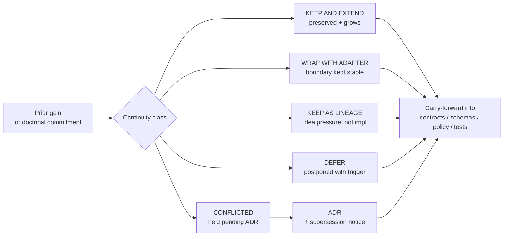
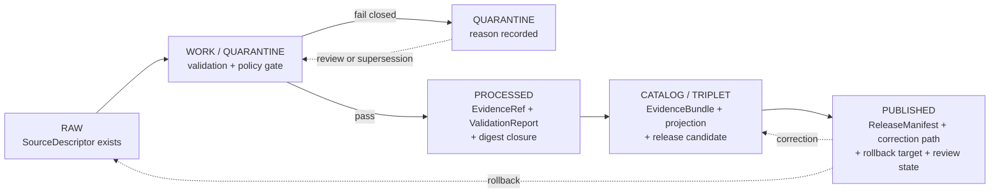

<!-- [KFM_META_BLOCK_V2]
doc_id: kfm://doc/domains/archaeology/continuity-inventory
title: Archaeology Domain — Continuity Inventory
type: standard
version: v1
status: draft
owners: archaeology-domain-steward + docs-steward    # PLACEHOLDER — NEEDS VERIFICATION
created: 2026-05-15
updated: 2026-05-15
policy_label: public                                 # Document is public; subject content is sensitivity-gated
related:
  - docs/domains/archaeology/README.md               # PROPOSED
  - docs/domains/README.md                           # PROPOSED
  - docs/registers/VERIFICATION_BACKLOG.md           # PROPOSED
  - docs/registers/DRIFT_REGISTER.md                 # PROPOSED
  - docs/registers/CANONICAL_LINEAGE_EXPLORATORY.md  # PROPOSED
  - docs/doctrine/directory-rules.md                 # PROPOSED canonical home
  - docs/doctrine/lifecycle-law.md                   # PROPOSED
  - docs/doctrine/truth-posture.md                   # PROPOSED
  - docs/architecture/ui/CONTINUITY_NOTES.md         # PROPOSED — sibling pattern
  - docs/architecture/governed-ai/CONTINUITY_NOTES.md# PROPOSED — sibling pattern
  - policy/domains/archaeology/README.md             # PROPOSED
  - schemas/contracts/v1/domains/archaeology/        # PROPOSED — schema home (ADR-0001)
tags: [kfm, archaeology, continuity, governance, evidence, sensitivity]
notes:
  - "All file-path-shaped claims are PROPOSED until verified against a mounted repository."
  - "Exact archaeological site locations DENY by default; this inventory does not record them."
  - "Terminology drift exists between DOM-ARCH (Culmination Atlas) and ENCY §7.13 (encyclopedia) object lists — flagged in §4."
[/KFM_META_BLOCK_V2] -->

# Archaeology Domain — Continuity Inventory

> A KFM register of prior gains, identity-bearing object families, lifecycle gates, and carry-forward responsibilities for the **Archaeology** domain — explicit about what must persist across changes, what may extend, what is deferred, and what currently has no evidence of implementation.

<!-- TODO: replace placeholder badges with workflow / version targets once CI and ADR identifiers exist. -->

**Status:** draft  ·  **Owners:** `archaeology-domain-steward + docs-steward` *(placeholder — NEEDS VERIFICATION)*  ·  **Last updated:** 2026-05-15  ·  **Path basis:** Directory Rules §4 (responsibility root = `docs/` for human-facing explanation) and §12 (Domain Placement Law: domain segment under responsibility root). *Per-root presence in the live repo: PROPOSED until verified.*

> [!IMPORTANT]
> **Sensitivity posture.** Exact archaeological site coordinates, burial/human-remains records, sacred or culturally sensitive places, restricted cultural archives, and any geometry below **H3 r7** for sensitive archaeology products **DENY by default**. This document records the *continuity* of those rules — it does not host, link to, or describe exact-location data.

---

## 📑 Quick jump

- [1. Purpose and scope](#1-purpose-and-scope)
- [2. Authority and truth-label posture](#2-authority-and-truth-label-posture)
- [3. Continuity classification](#3-continuity-classification)
- [4. Prior gains and continuity inventory](#4-prior-gains-and-continuity-inventory)
- [5. Object-identity continuity](#5-object-identity-continuity)
- [6. Lifecycle continuity (RAW → PUBLISHED)](#6-lifecycle-continuity-raw--published)
- [7. Cross-lane continuity](#7-cross-lane-continuity)
- [8. Sensitivity, rights, and deny-by-default continuity](#8-sensitivity-rights-and-deny-by-default-continuity)
- [9. Carry-forward responsibilities](#9-carry-forward-responsibilities)
- [10. Verification backlog](#10-verification-backlog)
- [11. Related docs](#11-related-docs)
- [Appendix A. Terminology continuity register](#appendix-a-terminology-continuity-register)
- [Appendix B. Update-propagation cells (this doc)](#appendix-b-update-propagation-cells-this-doc)

---

## 1. Purpose and scope

CONFIRMED doctrine. The Kansas Frontier Matrix carries forward prior design positions, doctrinal commitments, and identity-bearing objects across every run, pass, and revision; nothing is silently retired. The Whole-UI + Governed AI Expansion Report formalizes this as a **continuity inventory** — a register that classifies each prior gain as *kept and extended*, *wrapped with an adapter*, *kept as lineage*, *deferred*, or *retired*, names its evidence basis, and states the preserved next behavior. This file applies that pattern to the **Archaeology** domain.

PROPOSED scope. This inventory records:

- Doctrinal commitments specific to Archaeology (sensitivity, candidate-vs-confirmed, exact-location denial, steward review).
- Object families that require entity-identity continuity — DDD's "thread of identity that runs through time and often across distinct representations."
- Source families and source-role posture that must be preserved across source-registry updates.
- Lifecycle gates (RAW → WORK / QUARANTINE → PROCESSED → CATALOG / TRIPLET → PUBLISHED) as they apply to Archaeology.
- Cross-lane relations whose ownership, source-role, and sensitivity constraints must not be silently weakened by adjacent-domain changes.
- Verification items that block treating any of the above as implemented.

This inventory **does not**:

- Host, link to, or describe exact-location data, sacred-site coordinates, or restricted cultural archives.
- Decide whether a file *should* exist (that is a `contracts/`, `schemas/`, `policy/`, ADR, and review responsibility).
- Substitute for tests, fixtures, validators, manifests, or release decisions. Documentation is part of the working system but **never the source of canonical decision**.

> [!NOTE]
> **Path basis.** This file lives at `docs/domains/archaeology/CONTINUITY_INVENTORY.md` per Directory Rules §4 (Step 1: "explains something to humans" → `docs/`) and §12 (Domain Placement Law: domain segments under responsibility roots, never as root folders). The path itself is PROPOSED until verified against the mounted repository.

[Back to top ↑](#-quick-jump)

---

## 2. Authority and truth-label posture

CONFIRMED authority order (lifted from Directory Rules §2.1 and the Encyclopedia's "Inspectable claim" / "Evidence hierarchy" laws):

1. **KFM core invariants and doctrine** — lifecycle law, cite-or-abstain, trust membrane, authority ladder, watcher-as-non-publisher.
2. **Accepted ADRs** that explicitly amend doctrine.
3. **Canonical doctrine docs** — Directory Rules, lifecycle law, truth posture, authority ladder.
4. **This inventory** (refines but never overrides the above).
5. **Per-root and per-package READMEs.**
6. **Domain dossiers and prior architecture reports** — lineage / proposed only.

| Label | Meaning in this document | Default for new archaeology claims |
|---|---|---|
| **CONFIRMED** | Verified this session from attached project documents, doctrine, or workspace evidence. | Doctrinal statements only. |
| **INFERRED** | Reasonably derivable from visible evidence but not directly stated. | Use sparingly; prefer to upgrade or downgrade with evidence. |
| **PROPOSED** | Design, path, schema, route, or recommendation not yet verified in implementation. | Any path, schema, validator, fixture, or workflow claim. |
| **UNKNOWN** | Not resolvable without more evidence (mounted repo, runtime, logs). | Repo presence, branch state, deployment state. |
| **NEEDS VERIFICATION** | Checkable, but not yet checked strongly enough to act as fact. | Rights, source-vintage, package versions, current terms. |
| **CONFLICTED** | Two project sources disagree; resolution requires an ADR or steward decision. | See Appendix A for the active terminology conflict. |
| **EXTERNAL** | Sourced from authoritative external research (W3C, OGC, ISO, vendor docs). | Not used in this file; no external research was performed. |

> [!NOTE]
> **Memory is not evidence.** Recollection, guessed paths, likely behavior, and generic best practice are not facts. Where this inventory carries forward a prior gain, the evidence basis is named explicitly.

[Back to top ↑](#-quick-jump)

---

## 3. Continuity classification

CONFIRMED pattern. The Whole-UI + Governed AI Expansion Report introduced six continuity classifications. This inventory uses them unchanged for Archaeology, with one addition (`RETIRE WITH ADR`) that the broader corpus assumes implicitly through ADR discipline (§14.3, Directory Rules) but does not name as a continuity class.

| Class | Meaning | When to use |
|---|---|---|
| **KEEP AND EXTEND** | The prior gain is preserved and may grow; behavior is carried forward into the next surface. | Doctrinal commitments, object-family spines, sensitivity rules, lifecycle gates. |
| **WRAP WITH ADAPTER** | Preserve the prior gain behind a port/adapter boundary so the renderer, runtime, or external tool can change without touching truth. | MapLibre renderer for archaeology layers; 3D viewer; AI model adapter. |
| **KEEP AS LINEAGE** | Useful as historical context, idea pressure, or proposed-design source; not treated as current implementation. | Earlier domain dossiers, scaffold reports, indicative trees. |
| **DEFER** | Intentionally postponed until a trigger condition is met; not retired. | Cesium/3D runtime for archaeology; LiDAR-candidate auto-classification; live SHPO connectors. |
| **DEFER IF ABSENT** | Build only if an upstream prerequisite materializes (e.g., a GraphQL layer, a 3D pipeline). | 3D Tiles publication for excavation models without 2D evidence parity. |
| **CONFLICTED** | Two project sources disagree; the entry is held pending an ADR. | Terminology drift between DOM-ARCH and ENCY §7.13 (Appendix A). |
| **RETIRE WITH ADR** *(added here for completeness)* | A prior gain is intentionally dropped; requires ADR, supersession notice, and a drift-register entry. | None currently applied in this inventory. |

> [!TIP]
> **Continuity determination:** *prior gains are not discarded. They are carried forward as doctrine, lineage, or proposed design pressure. None are represented as mounted implementation without repo evidence.*

[Back to top ↑](#-quick-jump)

---

## 4. Prior gains and continuity inventory

The table below is the **core register** of this document. Each row is a prior gain or doctrinal commitment relevant to Archaeology, with its continuity class, evidence basis, and preserved next behavior.

| Surface or prior gain | Class | Evidence basis | Preserved next behavior | Status |
|---|---|---|---|---|
| Lifecycle law: RAW → WORK / QUARANTINE → PROCESSED → CATALOG / TRIPLET → PUBLISHED | KEEP AND EXTEND | Directory Rules §0; ENCY §4; DOM-ARCH §H | Promotion remains a **governed state transition, not a file move**; all archaeology lanes traverse every phase. | CONFIRMED doctrine / PROPOSED lane application |
| Cite-or-abstain truth posture | KEEP AND EXTEND | ENCY §4 (Operating Law); doctrine | Public archaeology claims resolve to EvidenceBundle or ABSTAIN; AI ABSTAINS when evidence is insufficient. | CONFIRMED |
| Trust membrane (public clients use governed APIs, not canonical stores) | KEEP AND EXTEND | ENCY §4; Directory Rules §13.5 | Archaeology routes go through `apps/governed-api/`; no direct browser access to RAW/WORK/QUARANTINE/PROCESSED archaeology stores. | CONFIRMED doctrine |
| Exact archaeological location denial by default | KEEP AND EXTEND | DOM-ARCH §I; ENCY §13 (Sensitive Register) | All public archaeology layers serve generalized geometry only; exact joins fail closed. | CONFIRMED doctrine / PROPOSED enforcement |
| H3 r7 floor for sensitive archaeology products; H3 r7–r9 generalization for cultural/landscape layers | KEEP AND EXTEND | Master MapLibre §Q (ML-061-156, ML-061-158, ML-061-159) | Validators enforce the floor; release fails closed below it. | CONFIRMED source rule / PROPOSED validator |
| Steward / cultural / tribal review surface | KEEP AND EXTEND | ENCY §7.13; DOM-ARCH §I,L | Promotion of sensitive archaeology objects requires recorded `StewardReview` / `CulturalReview` outcome. | CONFIRMED doctrine / PROPOSED review record schema |
| Candidate-vs-confirmed distinction (RemoteSensingAnomaly, LiDARCandidate ≠ ArchaeologicalSite) | KEEP AND EXTEND | ENCY §7.13; Master MapLibre §X (ML-061-155); Domains Atlas §B | `CandidateFeature` never promotes silently to `Archaeological Site`; promotion is a governed transition with EvidenceBundle. | CONFIRMED doctrine / PROPOSED tests |
| Object-family spine: `Archaeological Site, SiteComponent, CulturalTemporalPeriod, SurveyProject, SurveyTransect, ShovelTest, TestUnit, ExcavationUnit, ProvenienceContext, StratigraphicUnit, CollectionRepositoryRecord, CandidateFeature, PublicationTransformReceipt` | KEEP AND EXTEND | DOM-ARCH §E (Main object families) | All thirteen carry forward; identity rule is deterministic basis = source id + object role + temporal scope + normalized digest. | CONFIRMED term / PROPOSED implementation |
| Encyclopedia object list: `ArchaeologicalSite, Survey, Artifact, Feature, Context, ExcavationUnit, RemoteSensingAnomaly, LiDARCandidate, GeophysicsObservation, ThreeDDocumentation, CulturalReview, StewardReview, CollectionAccession, ChronologyAssertion, SensitivityTransform` | **CONFLICTED** | ENCY §7.13.C vs DOM-ARCH §E | Two project sources name overlapping-but-distinct object families with different casing. Hold until ADR resolves. | CONFLICTED — see Appendix A |
| `EvidenceBundle`, `EvidenceRef`, `SourceDescriptor`, `RunReceipt`, `ValidationReport`, `DecisionEnvelope`, `ReleaseManifest`, `CorrectionNotice`, `RollbackCard`, `ReviewRecord` proof-object vocabulary | KEEP AND EXTEND | ENCY §7.13.H; SRC-P19; SRC-PROMO | Archaeology DecisionEnvelopes carry `spec_hash`, EvidenceBundle reference, and finite outcome. | CONFIRMED term / PROPOSED schema home |
| Finite outcomes: ANSWER / ABSTAIN / DENY / ERROR | KEEP AND EXTEND | ENCY §4; SRC-OLLAMA; SRC-PROMO | All archaeology API surfaces (feature resolver, layer manifest, Evidence Drawer payload, Focus Mode) return a typed finite outcome. | CONFIRMED doctrine / PROPOSED route names |
| Public-safe map products (generalized site summaries, survey-coverage summaries, candidate-feature surfaces, chronology views) | KEEP AND EXTEND | DOM-ARCH §G | Each viewing product gates on EvidenceBundle support, sensitivity transform, and review state. | PROPOSED |
| Steward-only review maps (exact geometry view, threat/risk review view) | WRAP WITH ADAPTER | DOM-ARCH §G | Restricted views run behind an authenticated steward surface; no public-path leakage. | PROPOSED |
| Evidence Drawer for archaeology features | KEEP AND EXTEND | ENCY §7.13.H,K; SRC-UI | Every consequential archaeology claim is one hop from EvidenceBundle / EvidenceRef resolution. | PROPOSED component |
| Focus Mode for archaeology summaries | KEEP AND EXTEND | Master MapLibre ML-061-162, ML-061-163; ENCY §7.13.L | Cluster summaries explicitly say zones are generalized, not precise sites; citation validation runs before render. | PROPOSED |
| MapLibre as disciplined 2D renderer (downstream of trust) | WRAP WITH ADAPTER | ENCY §4 (Map-renderer boundary); SRC-UI; SRC-MLECO | Renderer remains behind adapter; never authoritative; renders released artifacts only. | CONFIRMED doctrine / PROPOSED adapter |
| 3D / Cesium documentation viewer for excavation/site models | DEFER | KFM_Whole_UI §12; DOM-ARCH §G | Add only after 2D MapLibre/evidence parity passes and access controls + transform receipts are in place. | DEFERRED |
| Source families: State site inventory / SHPO, NRHP-like listings, field survey forms, excavation records, artifact/collection/repository records, lab reports, historic maps/plats, oral history and cultural knowledge | KEEP AND EXTEND | DOM-ARCH §D; ENCY §7.13.B | Each enters via `SourceDescriptor` with source role, rights, sensitivity, cadence, attribution, and public-release class recorded before connector/watcher activation. | CONFIRMED term / NEEDS VERIFICATION on current terms |
| Sensitive geometry deny / generalized-geometry allow tests; precise-location leakage regression tests | KEEP AND EXTEND | DOM-ARCH §K; Master MapLibre ML-061-156…159 | Negative-fixture suite gates promotion; failure leaves the candidate quarantined. | PROPOSED |
| CARE-label and sovereignty-notice chips in archaeology UI | KEEP AND EXTEND | Master MapLibre ML-061-160 | UI exposes trust state visibly; UI badges never substitute for evidence. | PROPOSED |
| Generalization logs as validation evidence for sensitive map products | KEEP AND EXTEND | Master MapLibre ML-061-161 | Each public-safe transform emits a `PublicationTransformReceipt` describing the generalization. | CONFIRMED term / PROPOSED emission path |
| AI exact-location denial | KEEP AND EXTEND | DOM-ARCH §K,L; ENCY §7.13.L | AI may summarize *released* archaeology EvidenceBundles only; DENY for exact-location prompts; ABSTAIN where evidence is insufficient. | CONFIRMED doctrine / PROPOSED gate |
| Domain scaffold reports (KFM_Archaeology_Architecture_Plan_PDF_Only and similar) | KEEP AS LINEAGE | Master MapLibre source ledger SRC-029 | Preserve path patterns, fixtures, validators, and rollback ideas; do not treat scaffold as repo implementation. | LINEAGE |
| Bitemporal time discipline: source / observed / valid / retrieval / release / correction times stay distinct where material | KEEP AND EXTEND | DOM-ARCH §E (Temporal handling); Pass 18 KFM-P18-INV-463 | Archaeology objects expose all material temporal axes; correction lineage stays auditable. | CONFIRMED doctrine / PROPOSED field realization |

> *PROPOSED diagram: classification flow from prior-gain register to downstream carry-forward responsibilities. The diagram is doctrinal, not a runtime topology.*

[Back to top ↑](#-quick-jump)

---

## 5. Object-identity continuity

CONFIRMED doctrine. Per the Domain-Driven Design reference inside the project corpus, **entities require lifecycle continuity, identity, unique distinction, and model-defined sameness.** Mistaken identity can lead to data corruption. Archaeology object families are entities — they represent a thread of identity that runs through time, across surveys, across releases, and across corrections, even though their attributes (geometry generalization, sensitivity class, review state) may change.

The identity rule for every archaeology entity is the same PROPOSED deterministic basis:

`identity = source_id + object_role + temporal_scope + normalized_digest`

| Object family (DOM-ARCH §E spine) | Purpose (verbatim from corpus) | Identity continuity status | Temporal axes preserved |
|---|---|---|---|
| **Archaeological Site** | Represents Archaeological Site evidence or released derivative within Archaeology. | PROPOSED deterministic basis | source, observed, valid, retrieval, release, correction — distinct where material |
| **SiteComponent** | Represents SiteComponent evidence or released derivative within Archaeology. | PROPOSED deterministic basis | source, observed, valid, retrieval, release, correction |
| **CulturalTemporalPeriod** | Represents CulturalTemporalPeriod evidence or released derivative within Archaeology. | PROPOSED deterministic basis | source, observed, valid, retrieval, release, correction |
| **SurveyProject** | Represents SurveyProject evidence or released derivative within Archaeology. | PROPOSED deterministic basis | source, observed, valid, retrieval, release, correction |
| **SurveyTransect** | Represents SurveyTransect evidence or released derivative within Archaeology. | PROPOSED deterministic basis | source, observed, valid, retrieval, release, correction |
| **ShovelTest** | Represents ShovelTest evidence or released derivative within Archaeology. | PROPOSED deterministic basis | source, observed, valid, retrieval, release, correction |
| **TestUnit** | Represents TestUnit evidence or released derivative within Archaeology. | PROPOSED deterministic basis | source, observed, valid, retrieval, release, correction |
| **ExcavationUnit** | Represents ExcavationUnit evidence or released derivative within Archaeology. | PROPOSED deterministic basis | source, observed, valid, retrieval, release, correction |
| **ProvenienceContext** | Represents ProvenienceContext evidence or released derivative within Archaeology. | PROPOSED deterministic basis | source, observed, valid, retrieval, release, correction |
| **StratigraphicUnit** | Represents StratigraphicUnit evidence or released derivative within Archaeology. | PROPOSED deterministic basis | source, observed, valid, retrieval, release, correction |
| **CollectionRepositoryRecord** | Represents CollectionRepositoryRecord evidence or released derivative within Archaeology. | PROPOSED deterministic basis | source, observed, valid, retrieval, release, correction |
| **CandidateFeature** | Represents CandidateFeature evidence or released derivative within Archaeology. | PROPOSED deterministic basis; **must not silently promote to `Archaeological Site`** | source, observed, valid, retrieval, release, correction |
| **PublicationTransformReceipt** | Represents PublicationTransformReceipt evidence or released derivative within Archaeology. | PROPOSED deterministic basis; receipt is part of release proof, not a sovereign object | source, observed, valid, retrieval, release, correction |

> [!WARNING]
> **Identity-rename discipline.** A rename that changes what an archaeology object *means* is a content change, not a placement change. Per Directory Rules §14.3, it requires an ADR, schema version bump, compatibility map for old fixtures, old-fixture parity tests, and correction notices for any released artifacts that referenced the old identity. Continuity is preserved by carrying forward the prior identity in a crosswalk, never by overwriting it.

[Back to top ↑](#-quick-jump)

---

## 6. Lifecycle continuity (RAW → PUBLISHED)

CONFIRMED doctrine / PROPOSED lane application. Archaeology follows the canonical lifecycle invariant verbatim. Each stage has a gate that must hold for continuity to be preserved across promotions.

| Stage | Handling | Gate | Sensitivity-aware constraint (Archaeology) | Status |
|---|---|---|---|---|
| **RAW** | Capture immutable source payload or reference with source role, rights, sensitivity, citation, time, and hash. | `SourceDescriptor` exists. | Exact coordinates may exist in RAW but are sealed to canonical / restricted access; never reachable from public clients. | PROPOSED |
| **WORK / QUARANTINE** | Normalize schema, geometry, time, identity, evidence, rights, and policy; hold failures. | Validation and policy gate pass, **or** quarantine reason is recorded. | Sensitive joins fail closed; rights ambiguity quarantines. | PROPOSED |
| **PROCESSED** | Emit validated normalized objects, receipts, and public-safe candidates. | `EvidenceRef`, `ValidationReport`, and digest closure exist. | Public-safe candidates use generalized geometry (H3 r7+); a `PublicationTransformReceipt` records the transform. | PROPOSED |
| **CATALOG / TRIPLET** | Emit catalog records, `EvidenceBundle`s, graph/triplet projections, and release candidates. | Catalog/proof closure passes. | Sensitive-class records may exist in catalog but are gated on `StewardReview` / `CulturalReview` before promotion. | PROPOSED |
| **PUBLISHED** | Serve released public-safe artifacts through governed APIs and manifests. | `ReleaseManifest`, correction path, rollback target, and review/policy state exist. | Only generalized, review-approved derivatives are public-reachable; emergency disable + rollback drill must be operable. | PROPOSED |

> [!NOTE]
> **Lifecycle continuity rule.** A pipeline that writes directly from `data/raw/archaeology/` to `data/published/layers/archaeology/` is an anti-pattern (Directory Rules §13.5: *lifecycle skip*). All phases run. Promotion is a governed state transition, not a file move.

[Back to top ↑](#-quick-jump)

---

## 7. Cross-lane continuity

CONFIRMED / PROPOSED cross-lane relations from DOM-ARCH §F. Each relation must preserve **ownership, source role, sensitivity, and EvidenceBundle support**; adjacent-lane changes must not silently weaken any of the four.

| This domain | Related lane | Relation type | Continuity constraint |
|---|---|---|---|
| Archaeology | Spatial Foundation | exact / public geometry split and transform receipts | Generalization profile and `PublicationTransformReceipt` are owned by Archaeology, not by the spatial-foundation lane; cross-lane geometry transforms record the receipt. |
| Archaeology | Roads / Rail | historic routes and cultural paths | Cultural-path attributions remain attached to archaeology's source roles; the roads lane does not relabel them. |
| Archaeology | Settlements / Infrastructure | forts, missions, townsites, reservation communities | Joint records preserve archaeology's sensitivity gates even when settlements publishes a public-safe view. |
| Archaeology | Hazards | threat, erosion, fire, flood, exposure context with exact-site denial | Hazard-context views NEVER reveal exact archaeology sites; aggregation or generalization must apply before any joint render. |

> [!IMPORTANT]
> **Asymmetric continuity.** Cross-lane changes that *strengthen* sensitivity (e.g., the Hazards lane adding a deny rule) propagate freely. Cross-lane changes that *relax* archaeology constraints — even via convenience joins, vector indexes, search snippets, or graph projections — require steward review and an explicit policy update. Derivative artifacts are not sovereign.

[Back to top ↑](#-quick-jump)

---

## 8. Sensitivity, rights, and deny-by-default continuity

CONFIRMED Sensitive / Deny-by-Default Register entries for Archaeology (ENCY §13; DOM-ARCH §I):

| Class | Examples | Default outcome | Required controls | Continuity status |
|---|---|---|---|---|
| Archaeology — site coordinates | Site centroids, exact polygons, exact LiDAR-candidate coordinates | DENY exact public location by default | Cultural / steward review; suppression / generalization (≥ H3 r7); `PublicationTransformReceipt` | CONFIRMED doctrine / PROPOSED enforcement |
| Burial, human remains, sacred materials | Burial loci, ossuary records, repatriation-relevant collections | DENY until steward + tribal review approves access class | Consultation record; `SensitivityTransform`; restricted catalog | CONFIRMED doctrine / NEEDS VERIFICATION on protocol |
| Sacred / culturally sensitive places | Oral-history sites, sacred springs, cultural routes | DENY until steward review and access class approve | Consultation record; sensitivity transform; CARE labels | CONFIRMED doctrine / PROPOSED protocol |
| Source-rights-limited records | Licensed survey reports, restricted SHPO records, no-redistribution terms | DENY public release until terms resolved | `SourceDescriptor` rights field; attribution requirements; no public derivative if barred | NEEDS VERIFICATION on current terms |
| Private landowner-sensitive data | Field-survey forms keyed to private parcels | DENY exact / public if rights unclear | Aggregation; permissions; policy review | NEEDS VERIFICATION |

> [!CAUTION]
> **Continuity of fail-closed.** Any change that converts a current DENY into ALLOW must (a) cite the policy bundle change, (b) record the steward / cultural / tribal review that authorized it, (c) emit a `PublicationTransformReceipt` describing the transform, and (d) pass the negative-fixture suite. The default never quietly inverts.

Master MapLibre §Q rules carried forward verbatim:

- **ML-061-156** — Archaeology / cultural landscape map layers use H3-generalized footprints (r7–r9).
- **ML-061-158** — Exact coordinates of sacred sites, burials, and restricted archives are prohibited without review.
- **ML-061-159** — Any geometry below H3 r7 is prohibited for sensitive archaeology products.
- **ML-061-160** — CARE labels and sovereignty-notice chips are required in UI.
- **ML-061-161** — Generalization logs are validation evidence for sensitive map products.

[Back to top ↑](#-quick-jump)

---

## 9. Carry-forward responsibilities

PROPOSED. When a material change affects an archaeology entity, schema, policy, or surface, this is the propagation set (modeled on the Whole-UI Expansion Report §24 update-propagation matrix, adapted to the archaeology lane).

| Material change | Owning README *(PROPOSED)* | Object meaning | Fixtures / tests *(PROPOSED)* | Policy *(PROPOSED)* | Continuity entry | Rollback target |
|---|---|---|---|---|---|---|
| `Archaeological Site` schema change | `docs/domains/archaeology/README.md` | `contracts/domains/archaeology/` | `tests/fixtures/domains/archaeology/sites/` | `policy/domains/archaeology/` | this file (§5) | `release/rollback/archaeology/` |
| `CandidateFeature → Archaeological Site` promotion rule | `docs/domains/archaeology/README.md` | `contracts/domains/archaeology/` | `tests/fixtures/domains/archaeology/promotion/` | `policy/domains/archaeology/promotion/` | this file (§4, §6) | `release/rollback/archaeology/` |
| H3 r7 floor or generalization profile change | `docs/domains/archaeology/README.md` | `contracts/domains/archaeology/PublicationTransformReceipt.md` | `tests/fixtures/domains/archaeology/sensitive_geometry/` | `policy/domains/archaeology/sensitivity/` | this file (§8) | revert profile bundle; fail closed |
| Source descriptor change for SHPO / NRHP-like / tribal review feed | `docs/domains/archaeology/README.md` | `contracts/source/` | `tests/fixtures/domains/archaeology/source/` | `policy/domains/archaeology/source/` | this file (§4) | source-activation rollback |
| Steward / cultural / tribal review record schema | `docs/domains/archaeology/README.md` | `contracts/governance/ReviewRecord.md` | `tests/fixtures/domains/archaeology/review/` | `policy/domains/archaeology/review/` | this file (§4) | revert review bundle |
| Archaeology API surface (feature resolver, layer manifest, Evidence Drawer payload, Focus Mode answer) | `docs/architecture/governed-api/archaeology.md` *(PROPOSED)* | `contracts/runtime/DecisionEnvelope.md` | `tests/fixtures/domains/archaeology/api/` | `policy/runtime/archaeology/` | this file (§4) | revert route + feature flag |

> [!NOTE]
> **Documentation is part of the working system but never the source of canonical decision.** If a change is published on a page without the corresponding schema / policy / test / receipt update, the page is the drift, not the truth.

[Back to top ↑](#-quick-jump)

---

## 10. Verification backlog

NEEDS VERIFICATION items lifted from DOM-ARCH §N, Master MapLibre §14, and current-session limits.

| Item to verify | Evidence that would settle it | Status |
|---|---|---|
| Steward authority and confidentiality for archaeology records | Mounted repo `policy/domains/archaeology/`; review-record schema; CODEOWNERS; consultation log | NEEDS VERIFICATION |
| Public-geometry thresholds and transform profiles | Mounted repo `schemas/contracts/v1/domains/archaeology/`; `PublicationTransformReceipt` schema; H3 floor validator | NEEDS VERIFICATION |
| Oral-history / cultural-knowledge protocol | Mounted policy bundle; consultation record schema; access-class rules | NEEDS VERIFICATION |
| Emergency public-layer disablement and rollback drill | `release/rollback/archaeology/`; runbook; drill receipt | NEEDS VERIFICATION |
| Archaeology H3 minimum and consent rules | Steward-governed policy review; deny fixtures | NEEDS VERIFICATION |
| LiDAR vertical datum and vintage for terrain joins | Terrain-manifest tests; vintage register | NEEDS VERIFICATION |
| Remote-sensing QA thresholds for candidate features | Per-product QA acceptance fixtures | NEEDS VERIFICATION |
| Rights, attribution, current terms for SHPO / NRHP-like / museum sources | `SourceDescriptor` rights field; source-activation decision; license register | NEEDS VERIFICATION |
| Whether `Archaeological Site` (DOM-ARCH spaced) or `ArchaeologicalSite` (ENCY camelCase) is canonical | ADR resolving terminology drift; migration map for fixtures | **CONFLICTED** — see Appendix A |
| Schema home for archaeology contracts (`schemas/contracts/v1/domains/archaeology/` per ADR-0001 default) | Mounted repo inspection; ADR-0001 verification | NEEDS VERIFICATION |
| Existence of `docs/domains/archaeology/README.md`, `policy/domains/archaeology/`, `tests/domains/archaeology/`, `data/raw/archaeology/`, … | `git ls-tree`-equivalent mount inspection | UNKNOWN |
| CI workflow that enforces archaeology negative-fixture suite | `.github/workflows/` inspection; workflow output log | UNKNOWN |
| Current branch state, deployment state, public-release state for archaeology layers | Mounted repo + dashboards + release manifests | UNKNOWN |

[Back to top ↑](#-quick-jump)

---

## 11. Related docs

> [!NOTE]
> All paths below are **PROPOSED** until verified against the mounted repository. They follow Directory Rules §4 (responsibility roots) and §12 (Domain Placement Law) and are not asserted as present.

- [`docs/domains/archaeology/README.md`](./README.md) — Archaeology domain landing page *(PROPOSED)*
- [`docs/domains/README.md`](../README.md) — Domains index *(PROPOSED)*
- [`docs/doctrine/directory-rules.md`](../../doctrine/directory-rules.md) — Placement law *(PROPOSED canonical home)*
- [`docs/doctrine/lifecycle-law.md`](../../doctrine/lifecycle-law.md) — RAW → PUBLISHED governance *(PROPOSED)*
- [`docs/doctrine/truth-posture.md`](../../doctrine/truth-posture.md) — Cite-or-abstain *(PROPOSED)*
- [`docs/doctrine/trust-membrane.md`](../../doctrine/trust-membrane.md) — Public-client boundary *(PROPOSED)*
- [`docs/registers/VERIFICATION_BACKLOG.md`](../../registers/VERIFICATION_BACKLOG.md) — Repo-wide verification queue *(PROPOSED)*
- [`docs/registers/DRIFT_REGISTER.md`](../../registers/DRIFT_REGISTER.md) — Drift entries *(PROPOSED)*
- [`docs/registers/CANONICAL_LINEAGE_EXPLORATORY.md`](../../registers/CANONICAL_LINEAGE_EXPLORATORY.md) — Canon / lineage / exploratory classification *(PROPOSED)*
- [`docs/architecture/ui/CONTINUITY_NOTES.md`](../../architecture/ui/CONTINUITY_NOTES.md) — UI continuity (sibling pattern) *(PROPOSED)*
- [`docs/architecture/governed-ai/CONTINUITY_NOTES.md`](../../architecture/governed-ai/CONTINUITY_NOTES.md) — Governed-AI continuity (sibling pattern) *(PROPOSED)*
- [`policy/domains/archaeology/`](../../../policy/domains/archaeology/) — Archaeology policy bundle *(PROPOSED)*
- [`schemas/contracts/v1/domains/archaeology/`](../../../schemas/contracts/v1/domains/archaeology/) — Archaeology schemas (ADR-0001 default) *(PROPOSED)*
- [`contracts/domains/archaeology/`](../../../contracts/domains/archaeology/) — Archaeology object-meaning Markdown *(PROPOSED)*
- ADR entries: <!-- TODO: link archaeology-relevant ADRs (sensitive-geometry policy, candidate-promotion rule, steward-authority model) once filed. -->

[Back to top ↑](#-quick-jump)

---

## Appendix A. Terminology continuity register

<strong>Click to expand: archaeology terminology preserved, with a flagged conflict</strong>

### A.1 KFM-specific terms preserved verbatim (no paraphrasing)

The following KFM terms must be carried forward **exactly** as the corpus uses them. Generic industry translations (e.g., "site" for `Archaeological Site`, "bundle" for `EvidenceBundle`) are not acceptable substitutes.

**Object families (DOM-ARCH §E spine):** `Archaeological Site`, `SiteComponent`, `CulturalTemporalPeriod`, `SurveyProject`, `SurveyTransect`, `ShovelTest`, `TestUnit`, `ExcavationUnit`, `ProvenienceContext`, `StratigraphicUnit`, `CollectionRepositoryRecord`, `CandidateFeature`, `PublicationTransformReceipt`.

**Encyclopedia object families (ENCY §7.13.C):** `ArchaeologicalSite`, `Survey`, `Artifact`, `Feature`, `Context`, `ExcavationUnit`, `RemoteSensingAnomaly`, `LiDARCandidate`, `GeophysicsObservation`, `ThreeDDocumentation`, `CulturalReview`, `StewardReview`, `CollectionAccession`, `ChronologyAssertion`, `SensitivityTransform`.

**Proof-object vocabulary (cross-domain):** `EvidenceBundle`, `EvidenceRef`, `SourceDescriptor`, `RunReceipt`, `ValidationReport`, `DecisionEnvelope`, `ReleaseManifest`, `CorrectionNotice`, `RollbackCard`, `ReviewRecord`, `LayerManifest`, `LayerDescriptor`, `DatasetVersion`, `AIReceipt`, `EvidenceDrawerPayload`, `RuntimeResponseEnvelope`.

**Finite outcomes:** `ANSWER`, `ABSTAIN`, `DENY`, `ERROR`.

**Lifecycle phases:** `RAW`, `WORK`, `QUARANTINE`, `PROCESSED`, `CATALOG`, `TRIPLET`, `PUBLISHED`.

### A.2 Active terminology conflict — held pending ADR

**CONFLICTED.** The Domains Culmination Atlas (DOM-ARCH §E) and the Encyclopedia (ENCY §7.13.C) name overlapping-but-distinct archaeology object families with different casing conventions.

| Concept | DOM-ARCH form | ENCY §7.13 form | Note |
|---|---|---|---|
| Site | `Archaeological Site` (spaced) | `ArchaeologicalSite` (camel) | Same concept; casing drift |
| Survey | `SurveyProject` + `SurveyTransect` | `Survey` | DOM-ARCH decomposes; ENCY collapses |
| Artifact | (implicit via `CollectionRepositoryRecord`) | `Artifact` | DOM-ARCH does not name `Artifact` as a top-level family |
| Feature | (implicit via `SiteComponent` / `CandidateFeature`) | `Feature` | DOM-ARCH does not name `Feature` directly |
| Context | `ProvenienceContext` | `Context` | DOM-ARCH names the archaeological provenience sense explicitly |
| Excavation unit | `ExcavationUnit` | `ExcavationUnit` | Agree |
| Remote-sensing candidate | `CandidateFeature` (generic) | `RemoteSensingAnomaly`, `LiDARCandidate` (typed) | DOM-ARCH generic; ENCY typed |
| Review | (implicit) | `CulturalReview`, `StewardReview` | ENCY names review-record subtypes |
| Collection / accession | `CollectionRepositoryRecord` | `CollectionAccession` | Same concept; naming drift |
| 3D documentation | (implicit) | `ThreeDDocumentation` | ENCY explicit |
| Chronology | `CulturalTemporalPeriod` | `ChronologyAssertion` | Different semantics: period (taxon) vs assertion (claim) |
| Sensitivity transform | `PublicationTransformReceipt` (receipt-shape) | `SensitivityTransform` (rule-shape) | Different object kinds; both may belong |

**Resolution path:** ADR resolving (a) casing convention, (b) DOM-ARCH-decomposed vs ENCY-collapsed model, (c) whether candidate features are generic or typed, and (d) the receipt-vs-rule split for sensitivity transforms. Until the ADR lands, **both lists are preserved**; downstream contracts MUST cite the chosen authority and supply a crosswalk for the other.

### A.3 Source-family terms preserved verbatim

`State site inventory / SHPO or equivalent`, `public NRHP-like listings`, `field survey forms`, `excavation records and provenience packets`, `artifact/collection/repository records`, `lab reports`, `historic maps/plats/land records/newspapers`, `oral history and cultural knowledge`, `tribal/steward review`, `museum/collection accessions`, `LiDAR/remote sensing/geophysics`, `3D documentation`.

[Back to top ↑](#-quick-jump)

---

## Appendix B. Update-propagation cells (this doc)

<strong>Click to expand: which sections of this inventory must update when other parts of the archaeology lane change</strong>

This appendix mirrors §9 (Carry-forward responsibilities) from the perspective of **this file** — i.e., when something changes elsewhere in the archaeology lane, which sections here must be updated, and which downstream artifacts must be re-verified.

| Trigger | Updates here | Downstream re-verification |
|---|---|---|
| New or renamed archaeology object family | §4 inventory row, §5 identity-continuity table, Appendix A.1 terminology list | Schema home; contracts Markdown; fixtures; tests; identity validator |
| Generalization profile change (H3 floor, jitter, snap-to-grid) | §4 sensitivity row, §8 register, §10 backlog item | `PublicationTransformReceipt` schema; sensitivity-deny tests; release manifest |
| New SHPO / tribal / museum source | §4 source-families row, §10 NEEDS VERIFICATION list | `SourceDescriptor`; source-activation decision; rights register |
| New archaeology API surface (route, DTO) | §4 API row, §9 carry-forward row | Governed-API client; OpenAPI / GraphQL schema; route tests |
| Steward / cultural / tribal review-record schema change | §4 governance row, §9 carry-forward row | `ReviewRecord` schema; promotion gate; policy bundle |
| 3D / Cesium activation for archaeology | §4 DEFER row → KEEP AND EXTEND row | Adapter boundary ADR; 2D / 3D parity tests; Story Node integration |
| Resolution of the DOM-ARCH vs ENCY terminology conflict (Appendix A.2) | §4 CONFLICTED row removed; §5 + Appendix A.1 reconciled; §10 backlog item closed | All archaeology fixtures, schema names, route names, doc references; correction notices for any prior public artifacts |

[Back to top ↑](#-quick-jump)

---

**Related:** [Directory Rules](../../doctrine/directory-rules.md) · [Verification Backlog](../../registers/VERIFICATION_BACKLOG.md) · [Drift Register](../../registers/DRIFT_REGISTER.md) · [UI Continuity Notes](../../architecture/ui/CONTINUITY_NOTES.md) · [Governed-AI Continuity Notes](../../architecture/governed-ai/CONTINUITY_NOTES.md) *(all PROPOSED until mounted-repo evidence verifies presence)*

**Last updated:** 2026-05-15 · **Doc type:** standard (continuity register) · **Authority:** refines but never overrides core invariants, ADRs, or canonical doctrine docs · [Back to top ↑](#-quick-jump)
