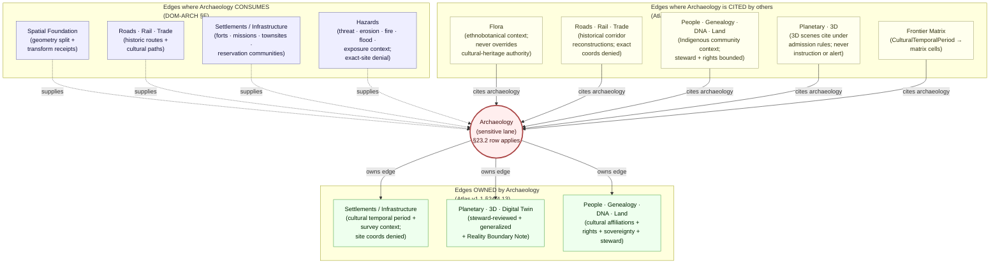

<!-- [KFM_META_BLOCK_V2]
doc_id: kfm://doc/domains/archaeology/cross-domain
title: Archaeology Domain — Cross-Domain Relations
type: standard
version: v1
status: draft
owners: archaeology-domain-steward + docs-steward    # PLACEHOLDER — NEEDS VERIFICATION
created: 2026-05-27
updated: 2026-05-27
policy_label: public                                  # Document is public; subject content is sensitivity-gated
related:
  - docs/doctrine/ai-build-operating-contract.md      # CONFIRMED authority; pins CONTRACT_VERSION = "3.0.0"
  - docs/doctrine/directory-rules.md                  # PROPOSED canonical home
  - docs/doctrine/authority-ladder.md                 # PROPOSED
  - docs/doctrine/lifecycle-law.md                    # PROPOSED
  - docs/doctrine/truth-posture.md                    # PROPOSED
  - docs/doctrine/trust-membrane.md                   # PROPOSED
  - docs/domains/archaeology/README.md                # PROPOSED
  - docs/domains/archaeology/ARCHITECTURE.md          # PROPOSED — sibling (see OQ-CD-02)
  - docs/domains/archaeology/CANONICAL_PATHS.md       # PROPOSED — sibling (path-namespace authority)
  - docs/domains/archaeology/CONTINUITY_INVENTORY.md  # PROPOSED — sibling (continuity register)
  - docs/domains/archaeology/SENSITIVITY.md           # PROPOSED — sibling
  - docs/registers/VERIFICATION_BACKLOG.md            # PROPOSED
  - docs/registers/DRIFT_REGISTER.md                  # PROPOSED
  - policy/sensitivity/archaeology/                   # PROPOSED — §23.2 enforcement home
  - policy/runtime/cross_lane/                        # PROPOSED — cross-lane runtime gate
tags: [kfm, archaeology, cross-domain, cross-lane, governance, evidence, sensitivity, doctrine-adjacent]
notes:
  - "Pinned to CONTRACT_VERSION = \"3.0.0\" per ai-build-operating-contract.md §0 and §37."
  - "Cross-lane sensitivity gate: [CONTRACT v3.0] §23.2 row 'Archaeology — site locations' applies to every join surface in this document. Joins involving People/DNA/Land additionally fail closed on living-person + DNA fields per §23.2 row 'Living-person data' and 'Genealogy / DNA'."
  - "Atlas v1.1 §24.4.13 names three edges OWNED by Archaeology (Settlements, Planetary/3D, People/Land). DOM-ARCH §F names four edges Archaeology CONSUMES (Spatial Foundation, Roads/Rail, Settlements, Hazards). Atlas §24.4.6 / §24.4.11 / §24.4.14 catalog three reciprocal edges where Archaeology is cited by other lanes (Flora, Roads/Rail, People/Land)."
  - "All path-shaped claims PROPOSED until verified against a mounted repository ([CONTRACT v3.0] §13). The contracts/domains/archaeology/ form is preserved per CANONICAL_PATHS.md v1.1 §2.4 (Directory Rules §12 wins on §2.1 authority order)."
  - "Cross-lane join policy is ADR-S-14 in Atlas v1.1 §24.12 (OPEN). Until accepted, every cross-lane archaeology join defers to the most restrictive applicable §23.2 row."
[/KFM_META_BLOCK_V2] -->

# Archaeology Domain — Cross-Domain Relations

> The single page that says **how archaeology relates to every other KFM lane** — which edges archaeology owns, which it consumes, which sensitivity gates dominate at the boundary, and which joins are deny-by-default until ADR-S-14 lands. Aligned with `ai-build-operating-contract.md` v3.0 (`CONTRACT_VERSION = "3.0.0"`) and the §23.2 sensitive-domain matrix.

**Status:** draft · v1.0 (initial)  ·  **Pinned contract:** `CONTRACT_VERSION = "3.0.0"`  ·  **Owners:** `archaeology-domain-steward + docs-steward` *(placeholder — NEEDS VERIFICATION)*  ·  **Required additional reviewer at every cross-lane boundary (§23.2):** tribal/cultural reviewer · rights-holder rep  ·  **Path basis:** Directory Rules §4 (`docs/` responsibility root for human-facing explanation), §12 (Domain Placement Law), `[CONTRACT v3.0]` §11. *Per-root presence in the live repo: PROPOSED until verified.*

> [!CAUTION]
> **Sensitivity dominates at every boundary.** Per `ai-build-operating-contract.md` §23.2 (sensitive-domain decision matrix), the default disposition for archaeology site locations at the public surface is **`DENY` exact coordinates · generalize to county/region · tribal/cultural reviewer + rights-holder rep required · `RedactionReceipt` + `PolicyDecision` + `MapReleaseManifest` required**. **No edge in this document authorizes a cross-lane join that bypasses §23.2.** When archaeology joins People/DNA/Land, the stricter of the two rows applies (living-person and DNA fields fail closed). When archaeology joins Planetary/3D, the **Reality Boundary Note** is required.

---

## 📑 Quick jump

- [1. Purpose and scope](#1-purpose-and-scope)
- [2. Authority and truth-label posture](#2-authority-and-truth-label-posture)
- [3. The §23.2 row as the master cross-lane gate](#3-the-232-row-as-the-master-cross-lane-gate)
- [4. Edges owned by Archaeology](#4-edges-owned-by-archaeology)
- [5. Edges where Archaeology is the consumer](#5-edges-where-archaeology-is-the-consumer)
- [6. Edges where Archaeology is cited by other lanes](#6-edges-where-archaeology-is-cited-by-other-lanes)
- [7. Cross-domain object-family registry](#7-cross-domain-object-family-registry)
- [8. Cross-lane edge graph](#8-cross-lane-edge-graph)
- [9. Cross-lane join policy and ADR-S-14](#9-cross-lane-join-policy-and-adr-s-14)
- [10. Asymmetric continuity rule](#10-asymmetric-continuity-rule)
- [11. Cross-domain anti-patterns](#11-cross-domain-anti-patterns)
- [12. Open verification backlog](#12-open-verification-backlog)
- [13. Open questions register & open ADRs](#13-open-questions-register--open-adrs)
- [14. Initial release notes v1.0](#14-initial-release-notes-v10)
- [15. Definition of done](#15-definition-of-done)
- [16. Related docs](#16-related-docs)

---

## 1. Purpose and scope

CONFIRMED doctrine. This document is the **per-domain cross-lane relations reference** for the **Archaeology and Cultural Heritage** lane. It answers four questions for contributors and reviewers:

1. *"Which other lanes does archaeology own an edge to?"* → §4, from Atlas v1.1 §24.4.13.
2. *"Which other lanes does archaeology consume from?"* → §5, from DOM-ARCH §F.
3. *"Which other lanes cite archaeology as context?"* → §6, from Atlas v1.1 §24.4.6 / §24.4.11 / §24.4.14 / §24.13 master object-family matrix.
4. *"What gates apply at every boundary?"* → §3 (`[CONTRACT v3.0]` §23.2), §10 (asymmetric continuity rule), §9 (cross-lane join policy).

PROPOSED scope. This inventory records:

- Bidirectional cross-lane edges where archaeology is owner, consumer, or cited context.
- Cross-cutting object families that traverse lane boundaries (`ArchaeologicalSite`, `CulturalTemporalPeriod`, `SourceDescriptor`, `EvidenceBundle`, `RedactionReceipt`, `MapReleaseManifest`).
- The sensitivity / receipt / reviewer requirements that dominate at each boundary.
- Cross-lane anti-patterns reviewers should call out.
- Verification items that block treating any edge as implemented.

This document **does not**:

- Host, link to, or describe exact-location data, sacred-site coordinates, or restricted cultural archives.
- Replace the per-lane architecture, canonical-paths, or continuity-inventory docs — it is a **boundary register**, not a lane architecture (`[CONTRACT v3.0]` §11).
- Authorize any cross-lane release. Releases are governed by `ReleaseManifest`, `MapReleaseManifest`, `EvidenceBundle`, `RedactionReceipt`, `PolicyDecision`, and explicit cultural / steward / rights-holder rep review.

> [!NOTE]
> **Path basis.** This file lives at `docs/domains/archaeology/CROSS_DOMAIN.md` per Directory Rules §4 (Step 1: "explains something to humans" → `docs/`), §12 (Domain Placement Law: domain segments under responsibility roots, never as root folders), and `[CONTRACT v3.0]` §11. The path itself is PROPOSED until verified against the mounted repository. The `domains/` intermediate segment is preserved per `CANONICAL_PATHS.md` v1.1 §2.4 (Directory Rules §12 wins the §2.1 authority order).

[Back to top ↑](#-quick-jump)

---

## 2. Authority and truth-label posture

CONFIRMED authority order (lifted from `ai-build-operating-contract.md` v3.0 §5, Directory Rules §2.1, `authority-ladder.md` v1.1):

1. **`ai-build-operating-contract.md` v3.0** — canonical operating contract; `CONTRACT_VERSION = "3.0.0"` is pinned; §1 Operating Law wins on any conflict; **§23.2** is the verbatim authority for sensitive-domain disposition.
2. **KFM core invariants and doctrine** — lifecycle law, cite-or-abstain, trust membrane, watcher-as-non-publisher (`[CONTRACT v3.0]` §10).
3. **Accepted ADRs** — including the still-open **ADR-S-14** (cross-lane join policy).
4. **Canonical doctrine docs** — Directory Rules, authority ladder.
5. **Atlas v1.1 §24.4.x** "edges owned by" register — CONFIRMED doctrine for cross-lane edges.
6. **DOM-ARCH §F** archaeology-side cross-lane relations — CONFIRMED doctrine.
7. **Sibling archaeology docs** (`ARCHITECTURE.md`, `CANONICAL_PATHS.md`, `CONTINUITY_INVENTORY.md`) — refine but never override.
8. **Per-root and per-package READMEs.**
9. **Convention from the current mounted repo state.** When it conflicts, raise as a `docs/registers/DRIFT_REGISTER.md` entry, not as new authority.

| Label | Use in this document |
|---|---|
| **CONFIRMED** | Doctrinal statements from Atlas v1.1 §24.4.x, DOM-ARCH §F, ENCY §7.13, `[CONTRACT v3.0]` §23.2. |
| **PROPOSED** | Any path, schema URI, route name, validator, or fixture claim. |
| **NEEDS VERIFICATION** | Cross-lane reviewer rosters, edge-specific transform profiles, source-rights status, repo presence. |
| **CONFLICTED** | Reciprocal-edge text differs between Atlas §24.4.x and DOM-ARCH §F (held pending ADR — see `OQ-CD-04`). |
| **LINEAGE** | Atlas v1.0 §F per-domain tables — superseded by Atlas v1.1 §24.4.x where they differ; v1.0 governs where Atlas v1.1 is silent (per Atlas v1.1 completeness note). |
| **UNKNOWN** | Live deployment, route names, branch state, current CI workflow state. |
| **EXTERNAL** | Not used in this file; no external research was performed. |

> [!NOTE]
> **Memory is not evidence** (`[CONTRACT v3.0]` §13.5). Recollection, guessed paths, and likely behavior are not facts. Every cross-lane edge in this document carries a citation back to Atlas v1.1, DOM-ARCH, the master object-family matrix, or `[CONTRACT v3.0]` §23.2.

[Back to top ↑](#-quick-jump)

---

## 3. The §23.2 row as the master cross-lane gate

**CONFIRMED** — from `ai-build-operating-contract.md` §23.2 (sensitive-domain decision matrix). Every cross-lane edge in this document inherits these requirements. The most restrictive applicable row applies when archaeology joins another sensitive lane.

| Field | Value (verbatim from `[CONTRACT v3.0]` §23.2 row "Archaeology — site locations") | Cross-lane implication |
|---|---|---|
| **Default disposition at public surface** | `DENY` exact coordinates; generalize to county/region | Any cross-lane join surfacing exact archaeology geometry to public clients fails closed. |
| **Required transform before any release** | Geometry generalization; redact precise UTM | Cross-lane joins emit `RedactionReceipt` + `PublicationTransformReceipt` before crossing the trust membrane. |
| **Required reviewer beyond domain steward** | Tribal/cultural reviewer; rights-holder rep | Five-role separation applies at every archaeology boundary (`[CONTRACT v3.0]` §33). |
| **Required receipts/manifests** | `RedactionReceipt`; `PolicyDecision`; `MapReleaseManifest` | Every cross-lane release that includes archaeology context carries all three. |

For burial / sacred sites, the §23.2 row is stricter: **`DENY` exact location · buffer/generalize or full denial · cultural reviewer + rights-holder rep · `RedactionReceipt` + `PolicyDecision`**.

**Multi-lane sensitivity stack.** When archaeology joins another sensitive lane, the rows compound:

| Lane joined to | §23.2 row that ALSO applies | Compound effect |
|---|---|---|
| People / Genealogy / DNA / Land | "Living-person data" · "Genealogy / DNA" · "Private land assertions" | Living-person identifiers, DNA fields, and ownership claims fail closed *in addition to* exact archaeology geometry. |
| Hazards | "Hazards / emergency" | Archaeology context never reframes a hazard answer as an alert; `BOUNDED` outcomes only; defer to official sources. |
| Fauna (rare-species) | "Rare species (occurrence)" | Joint records use the *coarser* of the two generalization profiles; ethnobotanical / faunal context never re-exposes exact coords. |
| Planetary / 3D | (3D admission policy — ADR-S-07 OPEN) | **Reality Boundary Note** required for any 3D admission of archaeology context. |
| Critical infrastructure (Settlements) | "Critical infrastructure" | Both default to coarse-only depiction; security reviewer added. |

> [!IMPORTANT]
> Cross-lane joins are **inference-risk multipliers** — Atlas v1.1 §24.12 ADR-S-14 names this explicitly. A join that is safe in either lane in isolation can become deny-class when composed. Reviewers MUST check the §23.2 row of *every* lane in the join, not just archaeology's.

[Back to top ↑](#-quick-jump)

---

## 4. Edges owned by Archaeology

**CONFIRMED doctrine** from Atlas v1.1 §24.4.13 ("Edges owned by Archaeology / Cultural Heritage"). Archaeology owns three outbound edges. *Ownership* here means archaeology authority dictates the edge semantics, the sensitivity gate, and the required receipts — the receiving lane consumes archaeology context but **MUST NOT** weaken archaeology's constraints.

| Owner | Receiving lane | Relation (verbatim from Atlas v1.1 §24.4.13) | Required gates | Citation |
|---|---|---|---|---|
| **Archaeology** | **Settlements / Infrastructure** | "Cultural temporal period and survey context bound historical settlement interpretation; site coords denied." | `CulturalTemporalPeriod` (T0) freely cited; `ArchaeologicalSite` exact geometry stays T4. Settlements public-safe views never re-expose archaeology exact coords. | `[DOM-ARCH]` `[DOM-SETTLE]` Atlas §24.4.13 |
| **Archaeology** | **Planetary / 3D / Digital Twin / Synthetic** | "Sites are admitted only via steward-reviewed, generalized 3D representation with reality-boundary note." | `ThreeDDocumentation` admission requires `StewardReview` + `CulturalReview` + `Reality Boundary Note` + `RedactionReceipt`. ADR-S-07 (3D admission policy) is OPEN. | `[DOM-ARCH]` `[MAP-MASTER]` Atlas §24.4.13 |
| **Archaeology** | **People / Genealogy / DNA / Land** | "Cultural affiliations cited with rights, sovereignty, and steward review." | Tribal/cultural reviewer + rights-holder rep required (`[CONTRACT v3.0]` §23.2). Living-person + DNA fields fail closed *separately* per §23.2 rows "Living-person data" / "Genealogy / DNA". | `[DOM-ARCH]` `[DOM-PEOPLE]` Atlas §24.4.13 |

### 4.1 Per-edge receipt set

| Edge | `RedactionReceipt` | `PublicationTransformReceipt` | `MapReleaseManifest` | `Reality Boundary Note` | Additional reviewer beyond domain steward |
|---|---|---|---|---|---|
| Archaeology → Settlements | Required if exact geometry would otherwise leak | Required for generalized footprint exposure | Required if join produces a map layer | n/a (2D) | Tribal/cultural reviewer; rights-holder rep |
| Archaeology → Planetary/3D | Required | Required | n/a (3D scene) | **Required** | Tribal/cultural reviewer; rights-holder rep; 3D admission reviewer |
| Archaeology → People/Land | Required | Required when geometry is involved | Required if join produces a map layer | n/a (2D) | Tribal/cultural reviewer; rights-holder rep; privacy reviewer |

[Back to top ↑](#-quick-jump)

---

## 5. Edges where Archaeology is the consumer

**CONFIRMED doctrine** from DOM-ARCH §F. Archaeology consumes from four other lanes. The relation **MUST** preserve **ownership, source role, sensitivity, and `EvidenceBundle` support** — the four-fold constraint named in DOM-ARCH §F applies to every row.

| Archaeology consumes from | Relation (verbatim from DOM-ARCH §F) | Boundary constraint | Citation |
|---|---|---|---|
| **Spatial Foundation** | "exact/public geometry split and transform receipts" | Generalization profile (≥ H3 r7 for sensitive layers) and `PublicationTransformReceipt` + `RedactionReceipt` are archaeology-owned; spatial foundation supplies CRS, geometry primitives, transform machinery. Public surface receives generalized geometry only. | `[DOM-ARCH]` `[MAP-MASTER]` DOM-ARCH §F |
| **Roads / Rail / Trade** | "historic routes and cultural paths" | Historic corridor reconstructions cited as context only; exact archaeological coordinates denied (Atlas §24.4.11 reciprocal). Cultural-path attributions remain attached to archaeology's source roles; roads lane does not relabel them. | `[DOM-ARCH]` `[DOM-ROADS]` DOM-ARCH §F; Atlas §24.4.11 |
| **Settlements / Infrastructure** | "forts, missions, townsites, reservation communities" | Joint records preserve archaeology's sensitivity gates even when Settlements publishes a public-safe view (T0 settlement → joined record inherits T4 archaeology default for exact site geometry). Settlement object families (`Fort`, `Mission`, `Townsite`, `ReservationCommunity`) provide context; archaeology authority bounds interpretation. | `[DOM-ARCH]` `[DOM-SETTLE]` DOM-ARCH §F |
| **Hazards** | "threat, erosion, fire, flood, exposure context with exact-site denial" | Hazard-context views **NEVER** reveal exact archaeology sites; aggregation or generalization applies before any joint render. KFM is never an alert authority (`[CONTRACT v3.0]` §23.2 "Hazards / emergency" row); archaeology context cannot upgrade a hazard answer to actionable alert. | `[DOM-ARCH]` `[DOM-HAZ]` DOM-ARCH §F |

### 5.1 PROPOSED extensions (DOM-ARCH §F is silent; Atlas §24.4.x consumer-side rows imply these)

These rows are PROPOSED for ratification by ADR; DOM-ARCH §F lists only the four CONFIRMED rows above, but Atlas v1.1 §24.4.6 / §24.4.14 imply two more reciprocal consumer edges:

| Archaeology consumes from (PROPOSED) | Relation | Boundary constraint | Status |
|---|---|---|---|
| **Flora** | Ethnobotanical context (steward-reviewed) bounds site interpretation | Never overrides cultural-heritage authority; rare-plant exact location denied separately. | PROPOSED — Atlas v1.1 §24.4.6 names this as a Flora-owned edge into Archaeology |
| **People / Genealogy / DNA / Land** | Indigenous community context, steward-reviewed and rights-bounded | Reciprocal of §4 edge; living-person + DNA fields fail closed. | PROPOSED — Atlas v1.1 §24.4.14 names this as a People/Land-owned edge into Archaeology |

> [!NOTE]
> The two PROPOSED rows above represent the same edges as Atlas §24.4.6 (Flora → Archaeology, ethnobotanical context) and §24.4.14 (People/Land → Archaeology, Indigenous context). DOM-ARCH §F does not list them on archaeology's consumer side. Whether DOM-ARCH §F is incomplete or whether these edges are genuinely owner-side only is tracked as **`OQ-CD-04`** in §13.

[Back to top ↑](#-quick-jump)

---

## 6. Edges where Archaeology is cited by other lanes

**CONFIRMED doctrine** from Atlas v1.1 §24.4.6, §24.4.11, §24.4.14, §24.4.16, and the §24.14 master object-family × domain matrix. These are edges where another lane *owns* the edge but cites archaeology as context.

| Owner lane | Cites archaeology for | Constraint (verbatim from Atlas v1.1) | Citation |
|---|---|---|---|
| **Flora** | Ethnobotanical context | "Ethnobotanical context (steward-reviewed) may bound site interpretation; never overrides cultural-heritage authority." | `[DOM-FLORA]` `[DOM-ARCH]` Atlas §24.4.6 |
| **Roads / Rail / Trade Routes** | Historical corridor reconstructions | "Historical corridor reconstructions cited as context only; exact archaeological coordinates denied." | `[DOM-ROADS]` `[DOM-ARCH]` Atlas §24.4.11 |
| **People, Genealogy, DNA, Land Ownership** | Indigenous community context | "Indigenous community context: steward-reviewed and rights-bounded." | `[DOM-PEOPLE]` `[DOM-ARCH]` Atlas §24.4.14 |
| **Planetary / 3D / Digital Twin / Synthetic Spatial** | 3D scene context | "3D scenes may cite domain releases under admission rules; never an instruction or alert surface." Reality Boundary Note required. | `[ENCY]` `[MAP-MASTER]` `[UIAI]` Atlas §24.4.16 |
| **Settlements / Infrastructure** | `ArchaeologicalSite` context | Master matrix: `ArchaeologicalSite` owned by Archaeology, cited by Settlements (historical context, generalized); T4 default; T1 generalized only after steward review. | `[DOM-SETTLE]` `[DOM-ARCH]` Atlas §24.14 |
| **Frontier Matrix** | `CulturalTemporalPeriod` cell input | Master matrix: `CulturalTemporalPeriod` owned by Archaeology, cited by Settlements + Frontier Matrix; T0. | `[ENCY]` `[UNIFIED]` Atlas §24.14 |

> [!IMPORTANT]
> **Citation is not authority transfer.** When another lane cites archaeology, archaeology's sensitivity gates, source-role posture, and `EvidenceBundle` requirements travel with the citation. Settlements citing `ArchaeologicalSite` cannot quietly drop the T4 default; Frontier Matrix citing `CulturalTemporalPeriod` cannot embed it in a cell that bypasses the matrix's own correction/rollback discipline.

[Back to top ↑](#-quick-jump)

---

## 7. Cross-domain object-family registry

**CONFIRMED doctrine** from Atlas v1.1 §24.14 (Master Object Family × Domain Reference Matrix), with archaeology-relevant rows extracted.

### 7.1 Archaeology-owned families that travel into other lanes

| Object family | Owner | Citing domains | Sensitivity default | Citation |
|---|---|---|---|---|
| `ArchaeologicalSite` | Archaeology | Settlements (historical context, generalized); Planetary/3D (admission-gated) | T4 default; T1 generalized only after steward review | Atlas §24.14 |
| `CulturalTemporalPeriod` | Archaeology | Settlements; Frontier Matrix | T0 | Atlas §24.14 |
| `SiteComponent` (DOM-ARCH §E spine) | Archaeology | Settlements (where component-level context bounds interpretation) | Inherits parent site sensitivity | DOM-ARCH §E |
| `CandidateFeature` | Archaeology | **None — public DENY** | Public DENY until promoted to `ArchaeologicalSite` | DOM-ARCH §E; `[CONTRACT v3.0]` §38 |
| `PublicationTransformReceipt` | Archaeology *(receipt-owner question — see `OQ-CD-03`)* | All lanes consuming archaeology context | n/a (receipt) | DOM-ARCH §M; `kfm_unified_doctrine_synthesis.md` glossary |

### 7.2 Cross-cutting families that bound archaeology joins

| Object family | Owner | Archaeology-side use | Sensitivity default | Citation |
|---|---|---|---|---|
| `SourceDescriptor` | Cross-cutting (source steward) | Every archaeology source carries one with role, rights, sensitivity, citation | Varies by source | Atlas §24.14; `[CONTRACT v3.0]` §29 |
| `EvidenceBundle` | Cross-cutting (ENCY doctrine) | Every public archaeology claim resolves to one | Mirrors claim's tier | Atlas §24.14 |
| `GeographyVersion` | Spatial Foundation | All archaeology spatial products carry one | T0 | Atlas §24.14 |
| `CoordinateReferenceProfile` | Spatial Foundation | All archaeology map producers cite one | T0 | Atlas §24.14 |
| `RedactionReceipt` *(`[CONTRACT v3.0]` §23.2 / §29)* | Cross-cutting (receipts) | Required for every public archaeology release | n/a (receipt) | `[CONTRACT v3.0]` §23.2 |
| `MapReleaseManifest` *(`[CONTRACT v3.0]` §23.2)* | Cross-cutting (release) | Required for every published archaeology map layer | n/a (manifest) | `[CONTRACT v3.0]` §23.2 |
| `Reality Boundary Note` | Cross-cutting (Planetary/3D + UIAI doctrine) | Required for every archaeology admission into a 3D scene | n/a (caveat) | Atlas §24.4.16; `[MAP-MASTER]`; `[UIAI]` |
| `GENERATED_RECEIPT.json` | Cross-cutting (`[CONTRACT v3.0]` §34) | Required for every AI-authored archaeology Markdown (including this file) | n/a (receipt) | `[CONTRACT v3.0]` §34 |

### 7.3 Families archaeology cites from other lanes

| Object family | Owner | Archaeology-side citation | Sensitivity default | Citation |
|---|---|---|---|---|
| `RoadSegment` / `RailSegment` / `CorridorRoute` | Roads/Rail | Historic-route and cultural-path context | T0 | Atlas §24.14 |
| `Settlement` / `Municipality` / `GhostTown` / `Fort` / `Mission` / `Townsite` / `ReservationCommunity` | Settlements | Historical settlement context for site interpretation | T0; critical infrastructure T4 | Atlas §24.14; `[DOM-SETTLE]` |
| `HazardEvent` / `HazardObservation` | Hazards | Threat, erosion, fire, flood exposure context (with exact-site denial) | T0 | Atlas §24.14; `[DOM-HAZ]` |
| `RarePlantRecord` | Flora | Ethnobotanical context (steward-reviewed, public-safe derivative only) | T4 default; T1 via generalization | Atlas §24.14; `[DOM-FLORA]` |
| `PersonAssertion` / cultural affiliation | People/Genealogy | Cultural affiliation citation (rights, sovereignty, steward review) | T1/T2 (living-person fields denied); aggregate T0 | Atlas §24.14; `[DOM-PEOPLE]` |
| `LandParcel` | People/Land | Land ownership context for site historical record | NEEDS VERIFICATION; private joins denied by default | Atlas §24.4.7; `[DOM-PEOPLE]` |
| `GeologicUnit` / `Lithology` | Geology | Subsurface context (advisory; never confirms cultural feature) | T0 | Atlas §24.14; `[DOM-GEOL]` |

[Back to top ↑](#-quick-jump)

---

## 8. Cross-lane edge graph

> *Doctrinal diagram from Atlas v1.1 §24.4.13 (owned edges), DOM-ARCH §F (consumer edges), and Atlas v1.1 §24.4.6 / §24.4.11 / §24.4.14 / §24.4.16 (cited-by edges). Not a runtime topology.*

### 8.1 Reading the graph

- **Solid arrows from `Archaeology` outward** — edges archaeology owns. Archaeology authority dictates the gates.
- **Dotted arrows into `Archaeology`** — edges archaeology consumes. Source lane supplies context; archaeology's sensitivity gates still dominate at the public surface.
- **Solid arrows into `Archaeology` from cited-by lanes** — edges another lane owns but cites archaeology. The owning lane runs the citation through its own gates; archaeology's gates are inherited via the cited object family.

[Back to top ↑](#-quick-jump)

---

## 9. Cross-lane join policy and ADR-S-14

**OPEN — `ADR-S-14` (Atlas v1.1 §24.12 "Cross-lane join policy: which joins require steward review, which are denied, which are open") is NOT YET ACCEPTED.** Until it is, the following PROPOSED defaults apply:

| Join type | Default disposition | Required additional reviewer | Receipts required |
|---|---|---|---|
| **Archaeology × Spatial Foundation** | `ALLOW` for generalized geometry; `DENY` for exact geometry public exposure | Domain steward only (no extra) | `RedactionReceipt` + `PublicationTransformReceipt` |
| **Archaeology × Roads/Rail** | `ALLOW` for historic-corridor context at T0; `DENY` for joins that re-expose exact site coords | Tribal/cultural reviewer | `RedactionReceipt`; `EvidenceBundle` |
| **Archaeology × Settlements** | `ALLOW` for generalized + steward-reviewed; `DENY` for exact-site within settlement boundary | Tribal/cultural reviewer | `RedactionReceipt`; `MapReleaseManifest` (if map) |
| **Archaeology × Hazards** | `BOUNDED` — hazard answers cited with archaeology context as advisory only, never alert | Hazards steward (per §23.2 row "Hazards / emergency") | `CitationValidationReport`; `PolicyDecision` |
| **Archaeology × Geology** | `ALLOW` for subsurface context (advisory); `DENY` for joins treating geophysics anomaly as confirmed cultural feature | Domain steward only | `EvidenceBundle` |
| **Archaeology × Flora** | `ALLOW` for ethnobotanical context (steward-reviewed only); never overrides cultural-heritage authority | Tribal/cultural reviewer | `RedactionReceipt`; rare-plant transform receipt |
| **Archaeology × Fauna** | `ALLOW` only after both lanes generalize to coarser of the two profiles | Wildlife steward + tribal/cultural reviewer | Both lanes' `RedactionReceipt`s |
| **Archaeology × Planetary/3D** | `DENY` by default; admit only with `StewardReview` + `CulturalReview` + `Reality Boundary Note` | 3D admission reviewer + tribal/cultural reviewer + rights-holder rep | `RedactionReceipt`; admission decision; Reality Boundary Note |
| **Archaeology × People/Land — non-living context** | `ALLOW` with steward + rights-holder rep review | Tribal/cultural reviewer; rights-holder rep | `RedactionReceipt`; `PolicyDecision` |
| **Archaeology × People/Land — living-person or DNA** | `DENY` (both §23.2 rows compound) | Privacy reviewer + tribal/cultural reviewer + rights-holder rep | None — denied |
| **Archaeology × Frontier Matrix** | `ALLOW` only for `CulturalTemporalPeriod` (T0) and aggregate counts; `DENY` for exact site exposure through matrix-cell snapshots | Matrix steward + tribal/cultural reviewer | `RedactionReceipt`; matrix-cell receipt |
| **Archaeology × Agriculture** | `ALLOW` only for non-private context; `DENY` for joins that expose private parcels or exact archaeology coords | Privacy reviewer + tribal/cultural reviewer | `AggregationReceipt`; `RedactionReceipt` |

> [!CAUTION]
> **Until `ADR-S-14` lands**, any cross-lane archaeology join not enumerated above defaults to **`DENY`** until reviewed (`[CONTRACT v3.0]` §23.2 "the most restrictive applicable row applies"). Convenience joins, vector indexes, search snippets, and graph projections are subject to the same gates as map releases — derivative artifacts are not sovereign (`[CONTRACT v3.0]` §38).

### 9.1 Join inference-risk multiplier

Atlas v1.1 §24.12 notes that **cross-lane joins are inference-risk multipliers**. A T0 archaeology object joined to a T0 settlement record at a fine enough spatial resolution can re-derive exact location even when neither input is exact. Validators MUST:

- Test the *joint* output against the negative-fixture suite, not just each input.
- Apply the *coarser* of the two lanes' generalization profiles to the joint output.
- Fail closed if the joint geometry would otherwise resolve below the H3 r7 floor.

[Back to top ↑](#-quick-jump)

---

## 10. Asymmetric continuity rule

**CONFIRMED doctrine** (preserved from `CONTINUITY_INVENTORY.md` v1.1 §7 and `[CONTRACT v3.0]` §38).

> Cross-lane changes that **strengthen** sensitivity propagate freely.
> Cross-lane changes that **relax** archaeology constraints — even via convenience joins, vector indexes, search snippets, or graph projections — require:
>
> 1. Steward review (archaeology domain steward).
> 2. Tribal/cultural reviewer + rights-holder rep sign-off per `[CONTRACT v3.0]` §23.2.
> 3. An explicit policy update with `PolicyDecision` record.
> 4. A `CorrectionNotice` for any previously released artifacts that depended on the prior (stricter) gate.
> 5. Passing the joint negative-fixture suite per §9.1.

**Derivative artifacts are not sovereign.** A vector index, summary text, graph projection, search snippet, AI answer, or map tile derived from archaeology data carries archaeology's gates. The fact that the artifact is "downstream" does not exempt it from §23.2 (`[CONTRACT v3.0]` §38 anti-pattern register).

### 10.1 Stale-state propagation

**CONFIRMED doctrine / OPEN ADR** — `ADR-S-10` (Atlas v1.1 §24.12 "Stale-state propagation") is OPEN. Until accepted, the PROPOSED default is:

- When archaeology releases a `CorrectionNotice` or `RollbackCard`, every cross-lane consumer that cited the affected `EvidenceBundle` MUST be flagged `SOURCE_STALE` until they re-resolve.
- When a cross-lane consumer releases a correction that depended on archaeology context, archaeology emits a corresponding `CorrectionNotice` if the archaeology evidence itself was wrong.
- Stale-state is *not* silently inherited; consumers MUST surface it on their own surfaces (Evidence Drawer, Focus Mode, map layer).

[Back to top ↑](#-quick-jump)

---

## 11. Cross-domain anti-patterns

Directory Rules §13 and `[CONTRACT v3.0]` §38 list general anti-patterns. These are the cross-lane-specific ones reviewers should call out when archaeology context is involved.

| # | Anti-pattern | Symptom | Fix | Citation |
|---|---|---|---|---|
| X1 | **Settlement re-exposes archaeology exact coords** | A `Townsite` or `Fort` record in `data/published/layers/settlement/` embeds exact `ArchaeologicalSite` coordinates. | Move to `data/quarantine/`; emit `CorrectionNotice` for the settlement release; re-promote with generalized geometry. | Atlas §24.4.13; `[CONTRACT v3.0]` §23.2 |
| X2 | **Roads/Rail historic corridor labels a site** | A historic corridor record is promoted to an `ArchaeologicalSite` claim without `EvidenceBundle` + cultural review. | `DENY`; corridor stays in roads/rail lane; archaeology authority is required to promote anything to a site. | Atlas §24.4.11; DOM-ARCH §B |
| X3 | **Hazard answer reframed as alert via archaeology context** | A hazard summary citing archaeology context implies actionable instruction. | `BOUNDED` only; KFM is never an alert authority. Strip alert framing; defer to official sources. | `[CONTRACT v3.0]` §23.2 "Hazards / emergency"; `[DOM-HAZ]` |
| X4 | **3D scene admits archaeology without Reality Boundary Note** | A `Scene Manifest` includes archaeology 3D documentation without the required note. | Block admission; require `StewardReview` + `CulturalReview` + Reality Boundary Note + `RedactionReceipt`. | Atlas §24.4.16; ADR-S-07 |
| X5 | **People/Land join leaks living-person + archaeology cultural-affiliation combo** | A joint record exposes a living person's cultural affiliation in a way that would not be acceptable on either lane alone. | Both §23.2 rows compound; `DENY`. Strip living-person fields *and* coarsen archaeology context. | `[CONTRACT v3.0]` §23.2; Atlas §24.4.14 |
| X6 | **Frontier Matrix cell embeds exact site geometry** | A matrix-cell snapshot includes `ArchaeologicalSite` exact coords as a cell attribute. | Matrix cells use `CulturalTemporalPeriod` (T0) only; exact geometry never enters a cell snapshot. Re-issue cell. | Atlas §24.4.15; `[CONTRACT v3.0]` §23.2 |
| X7 | **Cross-lane vector index re-derives exact location** | A search index over archaeology + settlement + roads enables nearest-neighbor reconstruction of exact archaeology coords. | Apply §9.1 inference-risk multiplier rule; coarsen index input or block index. | Atlas §24.12 ADR-S-14; `[CONTRACT v3.0]` §38 |
| X8 | **AI summary across lanes drops archaeology citations** | A Focus Mode answer joining archaeology + roads context omits archaeology `EvidenceRef` or omits `RedactionReceipt` from the `AIReceipt`. | `ABSTAIN` or re-issue with full citation + receipts; `AIReceipt` carries all cross-lane `evidence_refs`. | `[CONTRACT v3.0]` §§19, 21, 34 |
| X9 | **Flora ethnobotanical context overrides cultural-heritage authority** | A Flora release promotes ethnobotanical interpretation as archaeology authority. | `DENY`; ethnobotanical context may bound site interpretation but never overrides archaeology authority. | Atlas §24.4.6 |
| X10 | **Cross-lane join published without joint receipt set** | A joint release includes `RedactionReceipt` from one lane but not the other. | Block release; require all involved lanes' receipts. | `[CONTRACT v3.0]` §23.2; §9 above |
| X11 | **Anticorruption-layer absent at lane boundary** | Archaeology terminology, identity rules, or sensitivity gates leak into another lane's contracts or schemas verbatim, eroding bounded-context discipline. | Per DDD reference (project corpus), introduce an anticorruption layer at the boundary; translate identity + sensitivity at the edge, do not share the model wholesale. | `[DDD]` Anticorruption Layer pattern |

[Back to top ↑](#-quick-jump)

---

## 12. Open verification backlog

`NEEDS VERIFICATION` items lifted from DOM-ARCH §N, Atlas v1.1 §24.12 open ADRs, and current-session limits. These items remain `NEEDS VERIFICATION` before promotion from `draft` to `published`.

<strong>Click to expand verification backlog</strong>

1. Whether `ADR-S-14` (cross-lane join policy) has been accepted, deferred, or amended. **ADR text required.** Atlas v1.1 §24.12 lists it as OPEN.
2. Whether `ADR-S-07` (3D admission policy) has been accepted; the Archaeology × Planetary/3D edge depends on it.
3. Whether `ADR-S-10` (stale-state propagation) has been accepted; §10.1 default applies until then.
4. Whether `ADR-S-08` (Frontier Matrix cell semantics) has been accepted; the Archaeology × Frontier Matrix edge depends on it.
5. Per-edge transform profile parameters (H3 floor by edge; UTM redaction precision). **Policy fixtures + reviewer approval + ADR required.**
6. Standing tribal/cultural reviewers and rights-holder reps per edge (Settlements, Planetary/3D, People/Land, Flora). **`CODEOWNERS` + roster required.** See `OQ-CD-06`.
7. Whether DOM-ARCH §F is the authoritative consumer-edge list, or whether Flora/People-Land edges from Atlas §24.4.6/§24.4.14 should be added to §F. **ADR + atlas-supplement reconciliation required.** See `OQ-CD-04`.
8. Whether the cross-lane runtime gate lives at `policy/runtime/cross_lane/` (PROPOSED here) or a different home. **ADR required.** See `OQ-CD-05`.
9. Receipt schema homes — domain-local versus cross-cutting `schemas/contracts/v1/receipts/` per `[CONTRACT v3.0]` §47. **ADR required.** See `OQ-CD-03`.
10. Existence of `policy/sensitivity/archaeology/`, `policy/runtime/cross_lane/`, `tests/cross_lane/`, `fixtures/cross_lane/`. **`git ls-tree`-equivalent mount inspection required.** Status: **UNKNOWN**.
11. CI workflow enforcing cross-lane negative-fixture suite (§9.1 inference-risk multiplier). **`.github/workflows/` inspection required.** Status: **UNKNOWN**.
12. Validator implementation for the §9.1 joint-coarseness rule (apply coarser of two lanes' generalization profiles). **Validator code required.**
13. `GENERATED_RECEIPT.json` schema availability at `schemas/contracts/v1/receipts/generated_receipt.schema.json` per `[CONTRACT v3.0]` §47.
14. Health-signal collection per `[CONTRACT v3.0]` §35 for cross-lane joins (deny rate, abstain rate, `BOUNDED`-outcome rate, `SOURCE_STALE` propagation latency).
15. Whether the prior `ARCHITECTURE.md` v1.1 draft's Atlas-shorthand path namespace has been reconciled to the Directory Rules §12 form used here and in `CANONICAL_PATHS.md` v1.1. See `OQ-CD-02`.

[Back to top ↑](#-quick-jump)

---

## 13. Open questions register & open ADRs

### 13.1 Open questions register

| ID | Question | Owner role | Resolution path |
|---|---|---|---|
| **OQ-CD-01** | When does `ADR-S-14` (cross-lane join policy) land? Until accepted, the §9 PROPOSED defaults apply. | Architecture steward + policy steward | Atlas-supplement ADR pipeline; cross-reference Atlas v1.1 §24.12 |
| **OQ-CD-02** | The v1.1 draft of `ARCHITECTURE.md` resolved the path-namespace conflict in favor of the Atlas shorthand (`contracts/archaeology/`). This document, `CANONICAL_PATHS.md` v1.1, and `CONTINUITY_INVENTORY.md` v1.1 use the Directory Rules §12 form (`contracts/domains/archaeology/`). Reconciliation? | Docs steward + archaeology steward | Re-issue `ARCHITECTURE.md` v1.2; proposed ADR: `ADR-archaeology-architecture-doc-reconciliation` |
| **OQ-CD-03** | Canonical schema home for cross-cutting receipts (`RedactionReceipt`, `PublicationTransformReceipt`, `MapReleaseManifest`, `GENERATED_RECEIPT.json`) — `schemas/contracts/v1/receipts/` (cross-cutting) vs `schemas/contracts/v1/domains/archaeology/` (domain-local)? | Architecture steward + policy steward | ADR (proposed: `ADR-cross-cutting-receipts-home`); cross-reference `ADR-S-03` |
| **OQ-CD-04** | Is DOM-ARCH §F (four consumer edges) authoritative, or do Atlas v1.1 §24.4.6 / §24.4.14 imply Archaeology also consumes from Flora and People/Land? §5.1 lists these as PROPOSED extensions. | Encyclopedia steward + archaeology steward | ADR (proposed: `ADR-archaeology-consumer-edges-completeness`); update §5 and §7 |
| **OQ-CD-05** | Where do cross-lane runtime gates live? §9 PROPOSES `policy/runtime/cross_lane/`; `CANONICAL_PATHS.md` §7 also names it. | Architecture steward + policy steward | ADR (proposed: `ADR-cross-lane-policy-home`) |
| **OQ-CD-06** | Standing tribal/cultural reviewers and rights-holder reps per cross-lane edge. §23.2 requires them at every archaeology boundary. | Archaeology steward + release authority | Standing roster + `CODEOWNERS` entry per edge |
| **OQ-CD-07** | How is the §9.1 inference-risk multiplier enforced — by validator, by reviewer, or both? | Architecture steward + policy steward | ADR + validator implementation |
| **OQ-CD-08** | Stale-state propagation cadence for cross-lane archaeology citations (`ADR-S-10` dependency). | Release authority + cross-lane stewards | ADR-S-10 acceptance |

### 13.2 Open ADRs

**OPEN — ADRs likely required before stable promotion of this lane:**

| Proposed ADR | Question | Citation basis |
|---|---|---|
| **`ADR-S-14`** (Atlas v1.1 §24.12) | Cross-lane join policy: which joins require steward review, which are denied, which are open | Atlas v1.1 §24.12 |
| **`ADR-S-07`** (Atlas v1.1 §24.12) | 3D admission policy: minimum required receipts, deny lanes, reality-boundary disclosure | Atlas v1.1 §24.12 |
| **`ADR-S-10`** (Atlas v1.1 §24.12) | Stale-state propagation across lanes | Atlas v1.1 §24.12 |
| **`ADR-S-08`** (Atlas v1.1 §24.12) | Frontier Matrix cell semantics — including archaeology citation rules | Atlas v1.1 §24.12 |
| `ADR-archaeology-consumer-edges-completeness` | Resolve `OQ-CD-04` — DOM-ARCH §F vs Atlas §24.4.6/§24.4.14 | DOM-ARCH §F; Atlas v1.1 §24.4.6, §24.4.14 |
| `ADR-cross-cutting-receipts-home` | Resolve `OQ-CD-03` — receipt schema home | `[CONTRACT v3.0]` §47; `ADR-S-03` |
| `ADR-cross-lane-policy-home` | Resolve `OQ-CD-05` — `policy/runtime/cross_lane/` placement | Directory Rules §6; `[CONTRACT v3.0]` §11 |
| `ADR-archaeology-architecture-doc-reconciliation` | Resolve `OQ-CD-02` — reconcile `ARCHITECTURE.md` v1.1 with sibling docs | This doc §2; `CANONICAL_PATHS.md` v1.1 §2.4 |

[Back to top ↑](#-quick-jump)

---

## 14. Initial release notes v1.0

This is the **initial release** of `docs/domains/archaeology/CROSS_DOMAIN.md`. Per `[CONTRACT v3.0]` §37, initial drafts of doctrine-adjacent docs are **MINOR** versions of the archaeology lane doc set (no prior version of this file exists).

| Section | Source authority | Notes |
|---|---|---|
| §3 §23.2 master gate | `[CONTRACT v3.0]` §23.2 (verbatim) | Multi-lane sensitivity-stack table derived from §23.1 sensitive-domain list. |
| §4 Owned edges | Atlas v1.1 §24.4.13 (verbatim) | Three edges: Settlements, Planetary/3D, People/Land. |
| §5 Consumer edges | DOM-ARCH §F (verbatim) | Four edges: Spatial Foundation, Roads/Rail, Settlements, Hazards. §5.1 lists two PROPOSED extensions (Flora, People/Land) per Atlas v1.1 §24.4.6/§24.4.14 — flagged as `OQ-CD-04`. |
| §6 Cited-by edges | Atlas v1.1 §24.4.6, §24.4.11, §24.4.14, §24.4.16, §24.14 | Six cited-by edges. |
| §7 Cross-domain object-family registry | Atlas v1.1 §24.14 master object-family × domain matrix | Owned (§7.1) + cross-cutting (§7.2) + cited-from (§7.3) tables. |
| §8 Edge graph | Atlas v1.1 §24.4.x; DOM-ARCH §F | Three-subgraph Mermaid diagram. |
| §9 Cross-lane join policy | Atlas v1.1 §24.12 ADR-S-14 (OPEN); `[CONTRACT v3.0]` §23.2 | 12 join-type rows; PROPOSED defaults until ADR-S-14 lands. §9.1 inference-risk multiplier rule. |
| §10 Asymmetric continuity | `CONTINUITY_INVENTORY.md` v1.1 §7; `[CONTRACT v3.0]` §38 | Preserved verbatim from continuity register. |
| §11 Anti-patterns | Atlas v1.1 §24.4.x; `[CONTRACT v3.0]` §38; DDD reference | 11 cross-lane anti-patterns; X11 cites the DDD Anticorruption Layer pattern. |
| §12 Verification backlog | Composite | 15 items; 10–11 are UNKNOWN (repo not mounted). |
| §13 Open questions register | `[CONTRACT v3.0]` §49; authority-ladder v1.1 §7 | 8 questions tied to Atlas open ADRs and cross-doc reconciliation. |
| §14 Initial release notes (this section) | `[CONTRACT v3.0]` §37 | Replaces "Changelog" section for an initial release. |
| §15 Definition of done | `[CONTRACT v3.0]` §51 (analog) | Standard doctrine-doc DoD. |
| §16 Related docs | Sibling archaeology docs + doctrine roots | All paths PROPOSED. |

> **Backward compatibility.** Not applicable — this is v1.0 initial release. No prior anchors exist to preserve.

[Back to top ↑](#-quick-jump)

---

## 15. Definition of done

This document is done enough to enter the repository when:

- it is placed at `docs/domains/archaeology/CROSS_DOMAIN.md` per Directory Rules §12 (Domain Placement Law) and `[CONTRACT v3.0]` §11;
- the docs steward, archaeology domain steward, sensitivity reviewer, and cultural/sovereignty review liaison review it;
- a tribal/cultural reviewer and rights-holder rep have been named per `[CONTRACT v3.0]` §23.2;
- the **owning lanes** of every edge in §4, §5, §6 sign off on archaeology's characterization of the relation (Settlements, Planetary/3D, People/Land for §4; Spatial Foundation, Roads/Rail, Settlements, Hazards for §5; Flora, Roads/Rail, People/Land, Planetary/3D, Frontier Matrix for §6);
- it is linked from the docs index, the domain index, `docs/domains/archaeology/README.md`, and the three sibling doctrine docs (`ARCHITECTURE.md`, `CANONICAL_PATHS.md`, `CONTINUITY_INVENTORY.md`);
- `ARCHITECTURE.md` has been reconciled to the `contracts/domains/archaeology/` path namespace (`OQ-CD-02`);
- it does not conflict with accepted ADRs (`OQ-CD-01` through `OQ-CD-08` are accepted or explicitly deferred);
- the four Atlas-named ADRs (`ADR-S-07`, `ADR-S-08`, `ADR-S-10`, `ADR-S-14`) are at minimum acknowledged in §13.2 with status;
- any conflict with current repo conventions is logged in `docs/registers/DRIFT_REGISTER.md`;
- the `GENERATED_RECEIPT.json` planned for this AI-authored initial release is wired into CI per `[CONTRACT v3.0]` §34, §48;
- the §9.1 inference-risk multiplier rule has a corresponding validator under `tools/validators/cross_lane/` (PROPOSED);
- future changes follow the `[CONTRACT v3.0]` §37 lifecycle.

[Back to top ↑](#-quick-jump)

---

## 16. Related docs

> [!NOTE]
> All paths below are **PROPOSED** until verified against the mounted repository (`[CONTRACT v3.0]` §13).

<strong>Doctrine, sibling lane docs, related-lane cross-references, registers, schemas</strong>

- **Doctrine roots** (CONFIRMED rule / PROPOSED placement):
  [`docs/doctrine/ai-build-operating-contract.md`](../../doctrine/ai-build-operating-contract.md) — operating contract (CONFIRMED; pinned `CONTRACT_VERSION = "3.0.0"`) ·
  [`docs/doctrine/directory-rules.md`](../../doctrine/directory-rules.md) — placement law (CONFIRMED) ·
  [`docs/doctrine/authority-ladder.md`](../../doctrine/authority-ladder.md) — truth labels and authority order ·
  [`docs/doctrine/lifecycle-law.md`](../../doctrine/lifecycle-law.md) ·
  [`docs/doctrine/trust-membrane.md`](../../doctrine/trust-membrane.md) ·
  [`docs/doctrine/truth-posture.md`](../../doctrine/truth-posture.md)
- **Sibling archaeology docs** (PROPOSED):
  [`docs/domains/archaeology/README.md`](./README.md) — Archaeology domain landing page ·
  [`docs/domains/archaeology/ARCHITECTURE.md`](./ARCHITECTURE.md) — Archaeology architecture doc (see `OQ-CD-02`) ·
  [`docs/domains/archaeology/CANONICAL_PATHS.md`](./CANONICAL_PATHS.md) — per-domain canonical paths reference ·
  [`docs/domains/archaeology/CONTINUITY_INVENTORY.md`](./CONTINUITY_INVENTORY.md) — continuity register ·
  [`docs/domains/archaeology/SENSITIVITY.md`](./SENSITIVITY.md) — exact-coord denial, CARE, sovereignty, §23.2 ·
  [`docs/domains/archaeology/SOURCE_FAMILIES.md`](./SOURCE_FAMILIES.md) ·
  [`docs/domains/archaeology/PIPELINE.md`](./PIPELINE.md) ·
  [`docs/domains/archaeology/VIEWING_PRODUCTS.md`](./VIEWING_PRODUCTS.md)
- **Related-lane architecture docs** (PROPOSED — one per cross-lane edge):
  [`docs/domains/spatial/ARCHITECTURE.md`](../spatial/ARCHITECTURE.md) — Spatial Foundation ·
  [`docs/domains/roads-rail-trade/ARCHITECTURE.md`](../roads-rail-trade/ARCHITECTURE.md) — Roads/Rail/Trade ·
  [`docs/domains/settlements-infrastructure/ARCHITECTURE.md`](../settlements-infrastructure/ARCHITECTURE.md) — Settlements/Infrastructure ·
  [`docs/domains/hazards/ARCHITECTURE.md`](../hazards/ARCHITECTURE.md) — Hazards ·
  [`docs/domains/geology/ARCHITECTURE.md`](../geology/ARCHITECTURE.md) — Geology ·
  [`docs/domains/flora/architecture/README.md`](../flora/architecture/README.md) — Flora ·
  [`docs/domains/fauna/ARCHITECTURE.md`](../fauna/ARCHITECTURE.md) — Fauna ·
  [`docs/domains/people-dna-land/ARCHITECTURE.md`](../people-dna-land/ARCHITECTURE.md) — People/Genealogy/DNA/Land ·
  [`docs/domains/frontier-matrix/ARCHITECTURE.md`](../frontier-matrix/ARCHITECTURE.md) — Frontier Matrix ·
  [`docs/domains/planetary-3d/ARCHITECTURE.md`](../planetary-3d/ARCHITECTURE.md) — Planetary/3D
- **Architecture neighbors** (PROPOSED):
  [`docs/architecture/cross-lane.md`](../../architecture/cross-lane.md) — cross-lane doctrine (PROPOSED) ·
  [`docs/architecture/sovereignty-care.md`](../../architecture/sovereignty-care.md) — sovereignty / CARE cross-cutting
- **Registers** (PROPOSED):
  [`docs/registers/VERIFICATION_BACKLOG.md`](../../registers/VERIFICATION_BACKLOG.md) ·
  [`docs/registers/DRIFT_REGISTER.md`](../../registers/DRIFT_REGISTER.md) ·
  [`docs/registers/AUTHORITY_LADDER.md`](../../registers/AUTHORITY_LADDER.md)
- **Policy / schemas** (PROPOSED; subject to `OQ-CD-03` and `OQ-CD-05`):
  [`policy/sensitivity/archaeology/`](../../../policy/sensitivity/archaeology/) — §23.2 enforcement home ·
  [`policy/runtime/cross_lane/`](../../../policy/runtime/cross_lane/) — cross-lane runtime gate (PROPOSED) ·
  [`schemas/contracts/v1/domains/archaeology/`](../../../schemas/contracts/v1/domains/archaeology/) — archaeology schemas (ADR-0001 default) ·
  [`schemas/contracts/v1/receipts/redaction_receipt.schema.json`](../../../schemas/contracts/v1/receipts/redaction_receipt.schema.json) ·
  [`schemas/contracts/v1/release/map_release_manifest.schema.json`](../../../schemas/contracts/v1/release/map_release_manifest.schema.json) ·
  [`schemas/contracts/v1/receipts/generated_receipt.schema.json`](../../../schemas/contracts/v1/receipts/generated_receipt.schema.json) ·
  [`tools/validators/cross_lane/`](../../../tools/validators/cross_lane/) — joint negative-fixture validator (PROPOSED per §9.1)
- **Atlas & encyclopedia**:
  Atlas v1.1 §24.4.6 (Flora → Archaeology) · §24.4.11 (Roads/Rail → Archaeology) · §24.4.13 (Archaeology owned edges) · §24.4.14 (People/Land → Archaeology) · §24.4.16 (Planetary/3D citation rules) · §24.12 (open ADRs `ADR-S-07`, `ADR-S-08`, `ADR-S-10`, `ADR-S-14`) · §24.14 (master object-family × domain matrix) ·
  Encyclopedia §7.13 (Archaeology) · §13 (sensitive register) ·
  DOM-ARCH §F (cross-lane relations)
- **DDD reference** (project corpus): Anticorruption Layer pattern (§11 X11)

[Back to top ↑](#-quick-jump)

---

**Related:** [Operating Contract v3.0](../../doctrine/ai-build-operating-contract.md) · [Directory Rules](../../doctrine/directory-rules.md) · [Authority Ladder](../../doctrine/authority-ladder.md) · [Archaeology Architecture](./ARCHITECTURE.md) · [Canonical Paths](./CANONICAL_PATHS.md) · [Continuity Inventory](./CONTINUITY_INVENTORY.md) *(all PROPOSED until mounted-repo evidence verifies presence)*

**Last updated:** 2026-05-27 · **Pinned:** <code>CONTRACT_VERSION = "3.0.0"</code> · **Doc type:** standard (cross-domain register) · **§23.2 row:** Archaeology — site locations · **Join policy:** `ADR-S-14` OPEN · **Authority:** refines but never overrides core invariants, ADRs, or canonical doctrine docs · [Back to top ↑](#-quick-jump)
