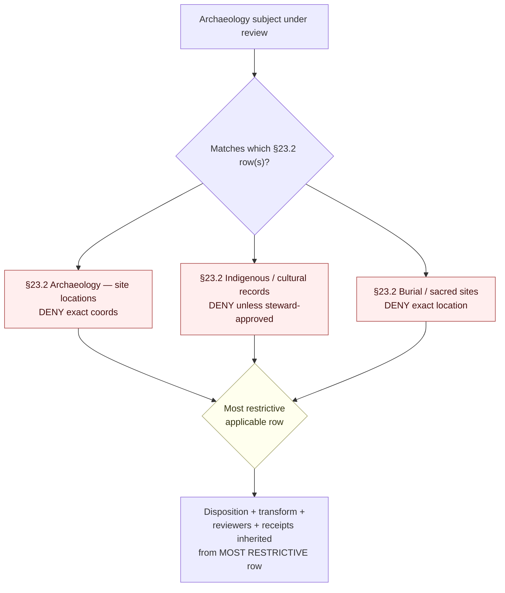
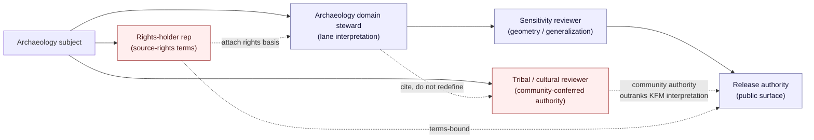
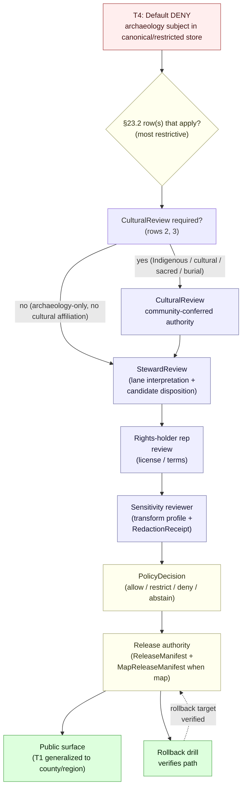
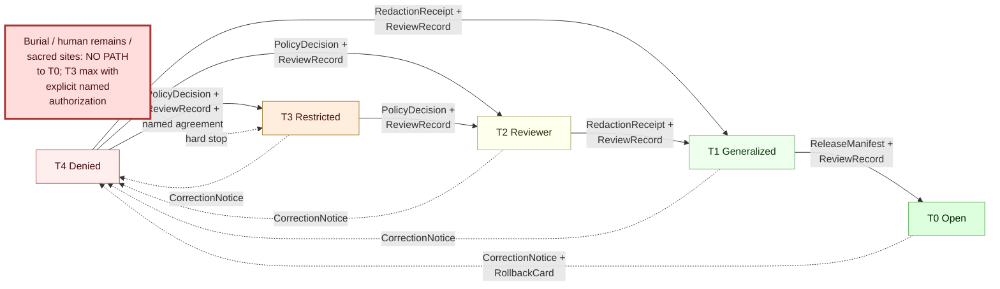

<!-- [KFM_META_BLOCK_V2]
doc_id: kfm://doc/domains/archaeology/cultural-review
title: Archaeology Domain — Cultural Review Protocol
type: standard
version: v1.1
status: draft
owners: archaeology-domain-steward + cultural-review-liaison + docs-steward    # PLACEHOLDER — NEEDS VERIFICATION
created: 2026-05-27
updated: 2026-05-29
policy_label: public                                  # Document is public; subject matter is sensitivity-gated by §23.2
contract_version: "3.0.0"
related:
  - docs/doctrine/ai-build-operating-contract.md      # CONFIRMED authority; pins CONTRACT_VERSION = "3.0.0"
  - docs/doctrine/directory-rules.md                  # CONFIRMED edition v1.3; PROPOSED canonical home
  - docs/doctrine/authority-ladder.md                 # PROPOSED
  - docs/doctrine/lifecycle-law.md                    # PROPOSED
  - docs/doctrine/trust-membrane.md                   # PROPOSED
  - docs/domains/archaeology/README.md                # PROPOSED
  - docs/domains/archaeology/ARCHITECTURE.md          # PROPOSED — sibling (see OQ-CR-02)
  - docs/domains/archaeology/CANONICAL_PATHS.md       # PROPOSED — sibling (path-namespace authority)
  - docs/domains/archaeology/CONTINUITY_INVENTORY.md  # PROPOSED — sibling
  - docs/domains/archaeology/CROSS_DOMAIN.md          # PROPOSED — sibling (cross-lane edges)
  - docs/domains/archaeology/DATA_LIFECYCLE.md        # PROPOSED — sibling (lifecycle gates that consume these reviews)
  - docs/domains/archaeology/SENSITIVITY.md           # PROPOSED — sibling
  - docs/architecture/sovereignty-care.md             # PROPOSED — cross-cutting CARE doctrine
  - policy/sensitivity/archaeology/                   # PROPOSED — §23.2 enforcement home
  - policy/consent/                                   # PROPOSED — consent / revocation manifests
  - policy/sovereignty/                               # PROPOSED — tribal sovereignty label inheritance
  - schemas/contracts/v1/governance/review_record.schema.json    # PROPOSED
  - schemas/contracts/v1/governance/cultural_review.schema.json  # PROPOSED
  - schemas/contracts/v1/governance/steward_review.schema.json   # PROPOSED
  - schemas/contracts/v1/governance/consent_receipt.schema.json  # PROPOSED
  - schemas/contracts/v1/governance/revocation_manifest.schema.json  # PROPOSED
  - docs/registers/VERIFICATION_BACKLOG.md            # PROPOSED
  - docs/registers/DRIFT_REGISTER.md                  # PROPOSED
tags: [kfm, archaeology, cultural-review, sovereignty, CARE, consent, governance, sensitivity, doctrine-adjacent]
notes:
  - "Pinned to CONTRACT_VERSION = \"3.0.0\" per ai-build-operating-contract.md §0 and §37."
  - "Directory Rules is the live v1.3 edition (renderer-decision refresh); cited explicitly in §1, §2, and the release notes."
  - "Three §23.2 rows apply: 'Archaeology — site locations', 'Indigenous / cultural records', 'Burial / sacred sites'. The most restrictive applicable row applies."
  - "The §23.2 county/region generalization is the CONFIRMED public floor for site geometry; any H3 r7 floor is a PROPOSED lane-local refinement subordinate to it."
  - "This document encodes the GOVERNANCE of cultural review (who, when, how recorded, how revoked) — it does NOT define the substance of cultural knowledge. Substance is deferred to the named authority per DDD Anticorruption Layer pattern."
  - "All file-path-shaped claims PROPOSED until verified against a mounted repository ([CONTRACT v3.0] §13). Path namespace uses Directory Rules v1.3 §12 form (contracts/domains/archaeology/) per CANONICAL_PATHS.md v1.1 §2.4."
  - "v1.1 reconciliation: Directory Rules v1.3 pinned; §16 DoD receipt-CI citation corrected §48 → §47 (§48 is the Adoption checklist; the receipt schema + companion-artifact authority is §34 + §47); H3 r7 subordinated to the §23.2 county/region floor; [CONTRACT v3.0] §12 untrusted-content posture added for oral-history / document ingestion."
[/KFM_META_BLOCK_V2] -->

# Archaeology Domain — Cultural Review Protocol

> The single page that says **how cultural / tribal / steward review works** in the Kansas Frontier Matrix for archaeology and cultural-heritage material — who reviews, what they review, what records the review produces, how consent is captured and revoked, and how sovereignty labels inherit through artifacts. Aligned with `ai-build-operating-contract.md` v3.0 (`CONTRACT_VERSION = "3.0.0"`), the §23.2 sensitive-domain matrix, Directory Rules v1.3, and the FAIR + CARE pairing.


**Status:** draft · v1.1  ·  **Pinned contract:** `CONTRACT_VERSION = "3.0.0"`  ·  **Directory Rules:** v1.3  ·  **Owners:** `archaeology-domain-steward + cultural-review-liaison + docs-steward` *(placeholder — NEEDS VERIFICATION)*  ·  **Required reviewers** *(see §4)*: archaeology domain steward · tribal / cultural reviewer · rights-holder representative · sensitivity reviewer · release authority  ·  **Last updated:** 2026-05-29

> [!CAUTION]
> **This document encodes the *governance* of cultural review — not the *content* of cultural knowledge.** Per the DDD Anticorruption Layer pattern in the project corpus, KFM does **not** translate Indigenous knowledge, sacred-place attributes, oral-history substance, or community-controlled categories into its own model. Substance is **deferred** to the named authority recorded in `authority_to_control` (MetaBlock v2). This protocol governs *who reviews, when, how recorded, how revoked* — never *what the cultural content means*. **No section of this document authorizes a release**; releases require the receipts and reviewer records named in §3 and §11.

---

## 📑 Quick jump

- [1. Purpose and scope](#1-purpose-and-scope)
- [2. Authority and truth-label posture](#2-authority-and-truth-label-posture)
- [3. The §23.2 rows — verbatim master gate](#3-the-232-rows--verbatim-master-gate)
- [4. The five reviewer roles](#4-the-five-reviewer-roles)
- [5. Review-record object families](#5-review-record-object-families)
- [6. Review workflows by object class](#6-review-workflows-by-object-class)
- [7. Consent, revocation, and waiver discipline](#7-consent-revocation-and-waiver-discipline)
- [8. CARE operational profile](#8-care-operational-profile)
- [9. Tribal sovereignty label inheritance](#9-tribal-sovereignty-label-inheritance)
- [10. Oral history and culturally sensitive material protocol](#10-oral-history-and-culturally-sensitive-material-protocol)
- [11. Review-gated lifecycle transitions](#11-review-gated-lifecycle-transitions)
- [12. Cultural-review anti-patterns](#12-cultural-review-anti-patterns)
- [13. Open verification backlog](#13-open-verification-backlog)
- [14. Open questions register & open ADRs](#14-open-questions-register--open-adrs)
- [15. Initial release notes v1.0](#15-initial-release-notes-v10)
- [16. Definition of done](#16-definition-of-done)
- [17. Related docs](#17-related-docs)

---

## 1. Purpose and scope

CONFIRMED doctrine. This document is the **per-domain cultural review protocol** for the **Archaeology and Cultural Heritage** lane. It answers five questions for contributors and reviewers:

1. *"Who reviews archaeology material that touches Indigenous, cultural, sacred, burial, or community-controlled subject matter?"* → §4, derived from `[CONTRACT v3.0]` §23.2.
2. *"What review records do they produce, and what fields do those records carry?"* → §5, derived from DOM-ARCH §E + Atlas v1.1 §24.5.
3. *"How is consent captured, expressed, revoked, and enforced?"* → §7, derived from Pass 10 §C15 + KFM-P19-IDEA-0003.
4. *"How do CARE principles operate alongside FAIR?"* → §8, derived from Pass 10 §C15-01 / §C15-03 / §C15-04.
5. *"How do tribal sovereignty labels inherit through artifacts?"* → §9, derived from KFM-P11-PROG-0025.

PROPOSED scope. This protocol governs:

- The five reviewer roles named by `[CONTRACT v3.0]` §23.2 for archaeology, Indigenous / cultural, and burial / sacred-site material.
- `ReviewRecord`, `CulturalReview`, `StewardReview`, `ConsentReceipt`, `RevocationManifest` object families and their identity, field shapes, and digest closure.
- Review-gated lifecycle transitions T4 → T3 / T2 / T1 → T0 per Atlas v1.1 §24.5.3.
- CARE MetaBlock v2 fields (`steward_org`, `authority_to_control`, `consent`, `obligations`, `benefit_commitments`).
- OPA default-deny on CARE-tagged assets per Pass 10 §C15-03.
- Tribal sovereignty label inheritance from AIANNH / BIA overlay intersection per KFM-P11-PROG-0025.
- Oral-history and culturally sensitive material protocol — consent, attribution, retention, revocation, and untrusted-content handling (`[CONTRACT v3.0]` §12).

This protocol **does not**:

- Define what counts as sacred, sensitive, restricted, or community-controlled — that is **the named authority's call**, not KFM's.
- Substitute for substantive cultural / community consultation. Reviews are *recorded* here; they happen with people.
- Replace `policy/sensitivity/archaeology/` enforcement — this doc is doctrine; enforcement lives in policy bundles, validators, and CI.
- Authorize any release. Releases require all four artifacts from `[CONTRACT v3.0]` §23.2: `RedactionReceipt`, `PolicyDecision`, `MapReleaseManifest` (when maps), `ReviewRecord` (from this protocol).

> [!NOTE]
> **Path basis.** This file lives at `docs/domains/archaeology/CULTURAL_REVIEW.md` per Directory Rules v1.3 §4 (Step 1: "explains something to humans" → `docs/`), §12 (Domain Placement Law: domain segments under responsibility roots, never as root folders), and `[CONTRACT v3.0]` §11. The path itself is PROPOSED until verified against the mounted repository. The `domains/` intermediate segment is preserved per `CANONICAL_PATHS.md` v1.1 §2.4 (Directory Rules §12 wins on §2.1 authority order over the Atlas v1.1 §24.13 shorthand).

[Back to top ↑](#-quick-jump)

---

## 2. Authority and truth-label posture

CONFIRMED authority order (lifted from `ai-build-operating-contract.md` v3.0 §5, Directory Rules v1.3 §2.1, `authority-ladder.md` §7):

1. **`ai-build-operating-contract.md` v3.0 §23.2** — verbatim authority for the three archaeology-relevant rows in this protocol ("Archaeology — site locations", "Indigenous / cultural records", "Burial / sacred sites"). §1 Operating Law wins on any conflict.
2. **The named authority recorded in `authority_to_control`** — for the *substance* of any cultural / Indigenous / community-controlled material, the authority outranks KFM's interpretation. KFM provides the *interface*; the authority provides the *content* (DDD Anticorruption Layer pattern).
3. **KFM core invariants and doctrine** — lifecycle law, cite-or-abstain, trust membrane, watcher-as-non-publisher (`[CONTRACT v3.0]` §10; Directory Rules v1.3 §7.1 / §13.5).
4. **Accepted ADRs** — particularly ADRs that ratify the §23.2 row defaults during v3.x adoption.
5. **DOM-ARCH §E** — `CulturalReview` and `StewardReview` term definitions.
6. **Atlas v1.1 §24.5** — tier scheme T0–T4 and transition rules.
7. **Pass 10 §C15** — CARE operational profile (MetaBlock v2, OPA default-deny).
8. **KFM-P11-PROG-0025** — tribal sovereignty label inheritance.
9. **KFM-P19-IDEA-0003** — consent revocation as live fail-closed input.
10. **Sibling archaeology docs** (`ARCHITECTURE.md`, `CANONICAL_PATHS.md`, `CONTINUITY_INVENTORY.md`, `CROSS_DOMAIN.md`, `DATA_LIFECYCLE.md`) — refine but never override.

When Directory Rules and an Atlas crosswalk disagree on a path, **Directory Rules v1.3 §12 governs** (per its own §2.1 authority order) and the conflict surfaces an ADR obligation.

| Label | Use in this document |
|---|---|
| **CONFIRMED** | §23.2 row text (verbatim); CARE C15-01/C15-03 (Pass 10 status: CONFIRMED); tier-transition rules from Atlas v1.1 §24.5.3; Directory Rules edition v1.3. |
| **PROPOSED** | Reviewer rosters, schema URIs, route names, validator implementations, OPA rule files, per-edge transform profiles, tribal-sovereignty waiver shapes; H3 r7 generalization-refinement floor. |
| **NEEDS VERIFICATION** | Standing tribal/cultural reviewer rosters; rights-holder rep designations; current AIANNH/BIA overlay source endpoints + rights; oral-history protocol per community; GA4GH-aware policy module availability. |
| **CONFLICTED** | Multi-party consent shape (KFM-P19-IDEA-0003 open question); GA4GH vs JWT vs MetaBlock v2 consent vocabulary reconciliation (Pass 10 §8.6); `PublicationTransformReceipt` vs `RedactionReceipt` overlap (`OQ-CR-04`). |
| **LINEAGE** | Atlas v1.0 per-domain F. tables — superseded by v1.1 where v1.1 speaks. |
| **UNKNOWN** | Live repo presence; CI workflow state; OPA / Conftest availability; current named tribal authorities for KFM's covered geography. |
| **EXTERNAL** | Not used in this file; no external research was performed. |

> [!NOTE]
> **Memory is not evidence** (`[CONTRACT v3.0]` — Operating Law; "memory is not evidence" principle). Every claim in this protocol carries a citation back to `[CONTRACT v3.0]` §23.2, Atlas v1.1 §24.5, DOM-ARCH, Pass 10 §C15, Directory Rules v1.3, or the project's POL idea cards.

[Back to top ↑](#-quick-jump)

---

## 3. The §23.2 rows — verbatim master gate

**CONFIRMED** — three rows of `[CONTRACT v3.0]` §23.2 apply to archaeology cultural review. Per the §23.2 footnote, **the most restrictive applicable row applies** when multiple rows match.

### 3.1 Row: Archaeology — site locations

| Field | Value (verbatim from `[CONTRACT v3.0]` §23.2) |
|---|---|
| **Default disposition at public surface** | `DENY` exact coordinates; generalize to county/region |
| **Required transform before any release** | Geometry generalization; redact precise UTM |
| **Required reviewer beyond domain steward** | Tribal/cultural reviewer; rights-holder rep |
| **Required receipts/manifests** | `RedactionReceipt`; `PolicyDecision`; `MapReleaseManifest` |

### 3.2 Row: Indigenous / cultural records

| Field | Value (verbatim from `[CONTRACT v3.0]` §23.2) |
|---|---|
| **Default disposition at public surface** | `DENY` unless steward-approved |
| **Required transform before any release** | None — steward gate |
| **Required reviewer beyond domain steward** | Tribal/cultural reviewer |
| **Required receipts/manifests** | `PolicyDecision`; `ReviewRecord` |

### 3.3 Row: Burial / sacred sites

| Field | Value (verbatim from `[CONTRACT v3.0]` §23.2) |
|---|---|
| **Default disposition at public surface** | `DENY` exact location |
| **Required transform before any release** | Buffer/generalize; or full denial |
| **Required reviewer beyond domain steward** | Cultural reviewer; rights-holder rep |
| **Required receipts/manifests** | `RedactionReceipt`; `PolicyDecision` |

### 3.4 Most-restrictive-applicable-row rule

When a record matches multiple rows, the **most restrictive** disposition, transform, reviewer, and receipt set applies. Per Atlas v1.1 §24.5.2, **burial / human remains / sacred sites are T4 with the stricter constraint that no transform releases them to T0** — T3 only under explicit named authorization with sovereignty review + `ReviewRecord` + `PolicyDecision`.

> [!NOTE]
> **Generalization floor.** The §23.2 row 1 disposition — **generalize to county/region** — is the **CONFIRMED authoritative public floor** for archaeology site geometry. Any tighter cell-based floor (e.g., the **H3 r7** value drawn from MasterMapLibre SRC-061) is a **PROPOSED lane-local refinement** subordinate to it, and is itself ADR-gated. Whatever value is chosen MUST be no coarser-permitting than the §23.2 county/region floor.



[Back to top ↑](#-quick-jump)

---

## 4. The five reviewer roles

**CONFIRMED** — `[CONTRACT v3.0]` §23.2 and §33 (separation of duties) require five distinct review functions for sensitive archaeology releases. **PROPOSED** — the role definitions, authority scopes, and confidentiality posture below operationalize that requirement; the standing roster is `NEEDS VERIFICATION` per `OQ-CR-05`.

### 4.1 Role matrix

| Role | Authority scope | What they MUST review | What they MUST NOT also do | Confidentiality posture | Citation |
|---|---|---|---|---|---|
| **Archaeology domain steward** | Lane-internal — interpretation, candidate-vs-confirmed, evidence sufficiency, source-role posture | Every promotion from `CandidateFeature` to `ArchaeologicalSite`; every catalog-closure record; every cross-lane edge that consumes archaeology | Author the artifact under review; sign the release authorization for the same artifact (separation of duties) | Restricted by source-rights; access-class set per `SourceDescriptor` | `[CONTRACT v3.0]` §23.2, §33; DOM-ARCH §B |
| **Tribal / cultural reviewer** | Community / sovereignty — substance of cultural material, Indigenous knowledge, sacred-place context, oral history | Every archaeology subject that intersects an AIANNH/BIA overlay (§9); every subject tagged Indigenous, sacred, burial, or culturally sensitive; every cross-lane edge to People/Land where cultural affiliation is cited | Be substituted by a KFM steward when sovereignty applies; act as final authority on archaeology *evidence interpretation* (that is the domain steward's lane) | **Bound by the community's own confidentiality posture, recorded in `authority_to_control`** — not KFM's | `[CONTRACT v3.0]` §23.2 rows 1, 2, 3; Atlas v1.1 §24.4.13; KFM-P11-PROG-0025 |
| **Rights-holder representative** | Source-rights — terms of use, redistribution, attribution, restricted joins | Every release whose source has rights-bounded terms; every cross-lane join involving rights-limited records (e.g., licensed SHPO records, restricted research drafts) | Approve cultural sensitivity decisions absent the cultural reviewer | Bound by license / agreement terms | `[CONTRACT v3.0]` §23.2 row 1; `[ENCY]` §13 |
| **Sensitivity reviewer** | Cross-cutting — exact-coord denial, §23.2 county/region floor (+ H3 lane refinement), generalization profile, public-safe transform discipline | Every `RedactionReceipt` + `PublicationTransformReceipt`; every public-layer release manifest; every negative-fixture suite outcome | Be the same person as the artifact's author; bypass §23.2 receipts on time pressure | Restricted | DOM-ARCH §I; Master MapLibre §Q |
| **Release authority** | Lane-public — final authorization for trust-membrane crossing | Every `ReleaseManifest` + `MapReleaseManifest`; every rollback drill; every `CorrectionNotice` | Author content; sign their own cultural / steward review; act as cultural reviewer when sovereignty applies | Restricted; access logged | `[CONTRACT v3.0]` §33; Directory Rules v1.3 §16 |

### 4.2 Separation-of-duties matrix

**CONFIRMED doctrine** (`[CONTRACT v3.0]` §33, §23.2; Directory Rules v1.3 §16). The following combinations are **FORBIDDEN** in a single actor for the same artifact:

| Pair | Forbidden because |
|---|---|
| Author × archaeology steward (for same artifact) | The reviewer would be reviewing their own interpretation. |
| Author × release authority (for same artifact) | No independent release gate. |
| Archaeology steward × release authority (when sensitivity applies) | Steward review and release authorization compound into one signature; §23.2 separation collapses. |
| Tribal/cultural reviewer × archaeology steward | Cultural authority is community-conferred; collapsing into a KFM role transfers authority KFM does not hold. |
| Sensitivity reviewer × tribal/cultural reviewer | Sensitivity profile is a KFM judgment about geometry; cultural authority is a community judgment about substance. |
| Rights-holder rep × release authority | License terms and KFM's release decision must be independently signable. |

### 4.3 Authority deferral diagram



> [!IMPORTANT]
> **The tribal / cultural reviewer's authority is community-conferred, not KFM-conferred.** KFM cannot appoint, replace, or override a cultural reviewer; KFM records who the named community designates and defers. This is the doctrinal heart of the FAIR + CARE pairing per Pass 10 §C15: KFM provides the engineering substrate; the named authority decides what the substrate may publish.

[Back to top ↑](#-quick-jump)

---

## 5. Review-record object families

**CONFIRMED doctrine / PROPOSED implementation**. The following object families carry review state; they are trust-bearing surfaces in the sense of `[CONTRACT v3.0]` §29. Identity follows the deterministic basis used elsewhere in the archaeology lane: `source_id + object_role + temporal_scope + normalized_digest`.

| Object family | Purpose | Source authority | Public default | Citation |
|---|---|---|---|---|
| `ReviewRecord` *(cross-cutting)* | Generic review-decision record; carries decision, reviewer, time, scope, basis, expiry, revocation status | `[CONTRACT v3.0]` §23.2 (required); Atlas v1.1 §24.5.3 | `DENY` for the record content itself; metadata public-safe | `[CONTRACT v3.0]` §29; Atlas §24.5.3 |
| `CulturalReview` | Cultural-authority / community review record; substance-level decision | DOM-ARCH §E; ENCY §7.13 | `DENY` for substance; metadata public-safe | DOM-ARCH §E |
| `StewardReview` | Domain-steward review record; interpretation-level decision | DOM-ARCH §E; ENCY §7.13 | Internal; abstract public-safe summary | DOM-ARCH §E |
| `ConsentReceipt` | Signed record of consent grant tied to a `SourceDescriptor` or a release | Pass 10 §C6-07, §C15-01; KFM-P19-IDEA-0003 | `DENY` (contains identifiable consent state) | Pass 10 §C6-07 |
| `RevocationManifest` *(append-only)* | Live, signed, append-only manifest of revoked consent grants and waivers; checked by render gate and publish gate | KFM-P19-IDEA-0003 ("consent revocation is a live fail-closed input") | Public-safe (revocation visibility is itself a CARE obligation) | KFM-P19-IDEA-0003 |
| `SovereigntyLabelDecision` | Decision attaching `sovereignty:tribal` and sensitivity labels to artifacts intersecting AIANNH/BIA overlays | KFM-P11-PROG-0025 | Public-safe (label visibility is doctrine) | KFM-P11-PROG-0025 |
| `SovereigntyWaiver` *(time-boxed, signed)* | Time-boxed signed waiver overriding default sovereignty label inheritance | KFM-P11-PROG-0025 | `DENY` content; metadata public-safe (existence and expiry visible) | KFM-P11-PROG-0025 |

### 5.1 `ReviewRecord` minimum field set (PROPOSED)

```text
ReviewRecord {
  review_id                  : deterministic identity (source_id + object_role + temporal_scope + digest)
  subject_ref                : EvidenceRef → EvidenceBundle | SourceDescriptor | ReleaseCandidate
  review_class               : one of {cultural, steward, rights, sensitivity, release}
  reviewer_id                : reviewer identifier (community-conferred for cultural; KFM-conferred otherwise)
  reviewer_authority_basis   : free-text reference to the authority basis (community decision, license, role)
  decision                   : one of {ALLOW, RESTRICT, DENY, ABSTAIN, HOLD}
  decision_scope             : tier scope (T0 / T1 / T2 / T3 / T4) and / or named audience
  obligations[]              : structured obligations attached to the decision
  expiry_time                : time-bounded or null
  revocation_path            : how to revoke (RevocationManifest entry shape)
  evidence_refs[]            : evidence the decision rests on
  policy_decision_ref        : link to companion PolicyDecision
  decided_at                 : decision time
  recorded_at                : recorded time (distinct from decided_at)
  spec_hash                  : canonical digest (canonicalization + hash algorithm ADR-governed; see note)
}
```

> [!NOTE]
> The `spec_hash` canonicalization + hash algorithm is **ADR-governed** (SHA-256 is the CONFIRMED universal baseline per the Build Manual; a JCS-canonicalization tag is a PROPOSED programming idea, not a ratified default). Do not assert a specific `jcs:sha256:` tag as canonical until the ADR lands. Field-level schema realization (`schemas/contracts/v1/governance/`) is PROPOSED; the schema home — under `schemas/contracts/v1/governance/`, `schemas/contracts/v1/receipts/`, or `schemas/contracts/v1/domains/archaeology/` — is tracked as **`OQ-CR-03`**.

### 5.2 `CulturalReview` extends `ReviewRecord` with (PROPOSED)

```text
CulturalReview {
  ...ReviewRecord fields
  cultural_authority         : authority_to_control value (community name or designation)
  authority_basis            : how the community conferred reviewer authority
  consultation_record_ref    : reference to the consultation that produced the decision
  community_obligations[]    : obligations specifically owed to the community
  benefit_commitments[]      : what benefit flows back to the community (CARE)
  retention_policy           : how long records associated with this review persist
}
```

### 5.3 `StewardReview` extends `ReviewRecord` with (PROPOSED)

```text
StewardReview {
  ...ReviewRecord fields
  interpretation_basis       : free-text reference to evidence + source-role posture
  candidate_disposition      : one of {pending, merged, rejected, quarantined} when subject is a CandidateFeature
  cross_lane_impact[]        : references to cross-lane edges affected by the decision
}
```

[Back to top ↑](#-quick-jump)

---

## 6. Review workflows by object class

**CONFIRMED disposition / PROPOSED workflow detail.** Each archaeology object class follows a review workflow keyed by its default tier (Atlas v1.1 §24.5.2) and §23.2 row applicability.

| Object class | Default tier | §23.2 row(s) | Required reviewers | Required artifacts before T4 → T<n> | Citation |
|---|---|---|---|---|---|
| `ArchaeologicalSite` — exact geometry | **T4** | Archaeology — site locations | Archaeology steward + tribal/cultural reviewer + rights-holder rep | `RedactionReceipt` + `CulturalReview` + `StewardReview` + `PolicyDecision` → T1 (generalized to §23.2 county/region floor); T2 / T3 require additional named-party agreement | Atlas §24.5.2; §23.2 |
| `ArchaeologicalSite` — generalized geometry | **T1** | Archaeology — site locations | Sensitivity reviewer + release authority | `MapReleaseManifest` + `ReleaseManifest` | Atlas §24.5.2 |
| **Burial / human remains / sacred sites** | **T4** | Burial / sacred sites; Indigenous / cultural records | Cultural reviewer + rights-holder rep; **no transform releases to T0**; T3 only with explicit named authorization | Sovereignty review + `CulturalReview` + `PolicyDecision`; **no `RedactionReceipt` path to T1 / T0** | Atlas §24.5.2 (verbatim); §23.2 |
| `CandidateFeature` (LiDAR / RS / geophys) | **T4 (public DENY)** | Archaeology — site locations | Archaeology steward (for promotion); tribal/cultural reviewer (if subject geography is sovereign) | `StewardReview` decision (merged / rejected / quarantined); promotion to `ArchaeologicalSite` requires full T4 → T1 workflow | DOM-ARCH §E; `[CONTRACT v3.0]` §38 |
| Oral history / cultural knowledge payload | **T4** | Indigenous / cultural records | Cultural reviewer (community authority); rights-holder rep | `CulturalReview` (only path); `PolicyDecision`; consultation record reference; untrusted-content lint clears (§12) | §23.2 row 2; §10 below |
| `SurveyTransect` raw geometry | **T2 (reviewer)** | Archaeology — site locations | Archaeology steward | `StewardReview`; restricted catalog | DOM-ARCH §D |
| `SurveyTransect` coverage summary (generalized) | **T1** | Archaeology — site locations | Sensitivity reviewer | `RedactionReceipt` + `MapReleaseManifest` | Atlas §24.5.2 |
| `ArtifactRecord` with provenience | **T2** if rights-bounded; **T1** if generalized | Restricted source terms (variable) | Archaeology steward + rights-holder rep | `StewardReview` + rights basis | DOM-ARCH §D |
| `CollectionAccession` (with security detail) | **T2** | Indigenous / cultural records (if culturally affiliated) | Archaeology steward + cultural reviewer (when affiliation applies) | `StewardReview` + `CulturalReview` (when applicable) | DOM-ARCH §E |
| `ChronologyAssertion` (period level) | **T0** | None directly; inherits from underlying evidence | Archaeology steward (citation closure only) | `EvidenceBundle` resolution | DOM-ARCH §E |
| `RemoteSensingAnomaly` / `GeophysicsObservation` | **T2** raw; **T1** generalized | Archaeology — site locations | Archaeology steward + sensitivity reviewer | `StewardReview` + `RedactionReceipt` (for generalized release) | DOM-ARCH §E |
| `ThreeDDocumentation` | **T4** by default | Archaeology — site locations | Archaeology steward + cultural reviewer + 3D admission reviewer + rights-holder rep | `StewardReview` + `CulturalReview` + **Reality Boundary Note** + `RepresentationReceipt` + `RedactionReceipt` per Atlas §24.5.2; 3D schemas at `schemas/contracts/v1/3d/` (Directory Rules v1.3 §6.4); ADR-S-07 + OPEN-DR-10 OPEN | Atlas §24.5.2; §24.4.16 |

### 6.1 Workflow diagram — generic T4 → public release



[Back to top ↑](#-quick-jump)

---

## 7. Consent, revocation, and waiver discipline

**CONFIRMED doctrine** (Pass 10 §C6-07, §C15-01, §C15-03; KFM-P19-IDEA-0003): Consent in KFM is **explicit, signed, time-boundable, and revocable**. Revocation is a **live fail-closed input** — the render gate and the publish gate check the `RevocationManifest` before every render or materialization.

### 7.1 Consent capture (`ConsentReceipt`)

```text
ConsentReceipt {
  consent_id                : deterministic
  subject_ref               : SourceDescriptor | release candidate | community-controlled material
  authority_to_control      : community / authority that granted consent
  consent_basis             : how consent was obtained (consultation record reference)
  granted_at                : grant time
  granted_by                : authority designee
  consent_scope             : allowed audiences (T0 / T1 / T2 / T3 / named-party)
  obligations[]             : structured obligations (attribution, benefit sharing, retention)
  expiry_time               : optional bound; null for ongoing
  revocation_endpoint       : how to look up live revocation status
  duo_codes[]               : GA4GH Data Use Ontology codes (when applicable)
  spec_hash                 : canonical digest (ADR-governed algorithm; SHA-256 baseline)
}
```

### 7.2 Revocation (`RevocationManifest`)

**CONFIRMED doctrine** (KFM-P19-IDEA-0003 verbatim): "Consent revocation should be represented as a **signed append-only manifest** that Focus Mode and publish gates check before rendering or materialization."

| Property | Value |
|---|---|
| Shape | Signed append-only manifest |
| Update mechanism | Append a revocation entry; **never mutate prior rows** |
| Check frequency | Every render (Focus Mode, Evidence Drawer, public layer); every publish gate; every cross-lane join |
| Failure mode | **Fail-closed**: a revoked consent that the runtime cannot verify causes `DENY` at the render / publish gate, not `ALLOW`-with-warning |
| Latency target | `OQ-CR-07` — bounded staleness for the manifest must be defined |
| Public visibility | Public-safe (revocation transparency is a CARE obligation) |

### 7.3 Time-boxed sovereignty waiver

**PROPOSED** (KFM-P11-PROG-0025): A `SovereigntyWaiver` is a signed, time-boxed record overriding default sovereignty label inheritance for a specific artifact and audience.

| Property | Constraint |
|---|---|
| Signing requirement | Signed by the named authority recorded in `authority_to_control` |
| Time bound | **MUST** have an `expiry_time`; no permanent waivers |
| Scope | Specific artifact and named audience(s); no blanket waivers |
| Revocation | Via `RevocationManifest` append; immediate fail-closed effect |
| Renewal | Requires a fresh review + fresh signature; renewal is not automatic |
| Visibility | Existence and expiry public-safe; substance restricted |

> [!CAUTION]
> **A waiver is not a workaround.** Per `[CONTRACT v3.0]` §38 anti-patterns, urgency-as-policy-bypass is forbidden. A waiver records that the named authority has *explicitly chosen* to permit a specific exposure for a specific time and audience — it never substitutes for the cultural review or the §23.2 receipt set.

### 7.4 Consent vocabulary reconciliation (CONFLICTED)

**CONFLICTED** (Pass 10 §8.6 gap register). KFM has three partly-overlapping consent vocabularies:

1. `ConsentReceipt` JWT-format tokens (C6-07).
2. GA4GH Passport claims + DUO codes (C9-04).
3. MetaBlock v2 `consent` field (C15-01).

These can encode the same consent state differently. The reconciliation rule is tracked as **`OQ-CR-08`**. Until ADR resolution, the operating rule is: **`RevocationManifest` is canonical for revocation state across all three vocabularies**; the other fields are read-only views.

[Back to top ↑](#-quick-jump)

---

## 8. CARE operational profile

**CONFIRMED** (Pass 10 §C15-01, §C15-03, §C15-04). FAIR (Findable, Accessible, Interoperable, Reusable) is the engineering substrate; CARE (Collective Benefit, Authority to Control, Responsibility, Ethics) is the operational policy that determines which FAIR moves are allowed. KFM adopts **"FAIR by design, CARE in practice"** (C15-04).

### 8.1 MetaBlock v2 CARE fields (CONFIRMED — Pass 10 §C15-01)

| Field | Meaning | Archaeology-side default |
|---|---|---|
| `steward_org` | Institutional steward of the asset | Archaeology domain steward (KFM-side); not equal to `authority_to_control` |
| `authority_to_control` | The community or body whose authority governs the asset | Required for any Indigenous / cultural / community-controlled asset; default empty for non-applicable assets |
| `consent` | The consent grant under which the asset is held | Reference to `ConsentReceipt` (§7.1) |
| `obligations` | Obligations attached to use of the asset | Attribution, benefit sharing, retention, redaction-on-revocation |
| `benefit_commitments` | What benefit flows back to the relevant community from publication and reuse | Concrete, named, time-bounded; **MUST NOT** be aspirational |

**Required-when-applicable / optional-when-not rule.** Per Pass 10 §C15-01: omitting these fields for a CARE-applicable asset is a **violation** that the gate (§C15-03) refuses. Omitting them for a non-applicable asset is acceptable.

### 8.2 OPA default-deny on CARE-tagged assets (CONFIRMED — Pass 10 §C15-03)

```text
RULE: Any asset whose MetaBlock v2 declares a non-empty `authority_to_control` field
      is gated by an OPA rule that defaults to DENY on publication.

ALLOW path requires:
  1. The named authority's consent grant is present.
  2. The grant is valid (not expired).
  3. The grant has not been revoked (RevocationManifest check).

The rule runs at:
  - The C5-01 promotion gate (build time).
  - The C5-05 admission webhook (runtime).
  - Every render that touches the asset (Focus Mode, Evidence Drawer, map layer).

A CARE violation is rejected at all three points.
```

> [!IMPORTANT]
> **Default-deny is the only posture that survives drift.** Default-allow-with-explicit-denials would mean any oversight produces a CARE violation; default-deny means oversight produces a publication delay that can be remediated. KFM chooses delay over violation.

### 8.3 FAIR-CARE pairing at the archaeology surface

| FAIR principle | Archaeology-side engineering | CARE-side policy |
|---|---|---|
| **F**indable — stable identifiers | Deterministic identity (`source_id + object_role + temporal_scope + normalized_digest`) | Findability does not mean publicly findable; `authority_to_control` gates surface visibility |
| **A**ccessible — open protocols | Governed API (`apps/governed-api/`); finite outcomes | Access mediated by `PolicyDecision`; not all assets are publicly accessible |
| **I**nteroperable — shared standards | STAC / DCAT / PROV catalog; generalization to the §23.2 county/region floor (H3 refinement where ratified) | `kfm:care` extension surfaces CARE state in standard vocabularies (Pass 10 §C15-02) |
| **R**eusable — clear licensing | `SourceDescriptor` rights field; license register | Reuse mediated by obligations + benefit commitments; reuse without obligation honor is a violation |

[Back to top ↑](#-quick-jump)

---

## 9. Tribal sovereignty label inheritance

**CONFIRMED doctrine / PROPOSED implementation** (KFM-P11-PROG-0025): Artifacts whose areas of interest (AOIs) intersect AIANNH (American Indian, Alaska Native, and Native Hawaiian areas) or BIA (Bureau of Indian Affairs) overlays **MUST** inherit a `sovereignty:tribal` label and the sensitivity labels of the overlay, **or** carry a signed time-boxed waiver from the named authority before promotion.

### 9.1 Inheritance rule

```text
RULE: For every archaeology artifact A,
      IF A.aoi intersects AIANNH overlay X OR BIA overlay Y,
      THEN A MUST inherit:
           - sovereignty:tribal label
           - sensitivity labels from X / Y per the overlay's CARE annotation
      UNLESS a valid, unrevoked SovereigntyWaiver exists for (A, X | Y) within expiry_time.

      The inheritance is checked at:
      - Promotion gate (admission to PROCESSED / CATALOG / PUBLISHED)
      - Cross-lane join gate (when archaeology context joins another lane)
      - Render gate (Focus Mode, Evidence Drawer, map layer)

      Failure mode: FAIL-CLOSED. A missing or revoked waiver produces DENY.
```

### 9.2 Overlay sources (PROPOSED — `NEEDS VERIFICATION`)

| Overlay | Source role | Rights / sensitivity | Status |
|---|---|---|---|
| AIANNH boundaries (Census TIGER/Line) | `authority` / `regulatory` | Public boundaries; cultural sensitivity annotations vary by community | NEEDS VERIFICATION on current vintage + community-specific CARE annotations |
| BIA tribal land boundaries | `authority` / `regulatory` | Public boundaries; access protocols vary | NEEDS VERIFICATION |
| Per-community designated AOIs | `authority` (cultural) | Community-defined; access protocols community-set | NEEDS VERIFICATION |

### 9.3 Label visibility

**CONFIRMED**: The *existence* of a `sovereignty:tribal` label on an artifact is **public-safe** — label transparency is itself a CARE obligation. The *substance* of cultural material protected by the label remains gated per §23.2.

### 9.4 Waiver discipline (cross-reference §7.3)

A `SovereigntyWaiver` is signed by the named authority, time-boxed, scope-limited to specific artifacts and audiences, and revocable via `RevocationManifest`. **A waiver does not transfer authority** — it records that the named authority has explicitly chosen to permit a specific exposure for a specific time.

> [!CAUTION]
> **KFM never grants itself a waiver.** A waiver is community-conferred; if no named authority signs, no waiver exists; absent a waiver, the default `sovereignty:tribal` + sensitivity inheritance applies.

[Back to top ↑](#-quick-jump)

---

## 10. Oral history and culturally sensitive material protocol

**CONFIRMED doctrine** (DOM-ARCH §D; ENCY §7.13.B; KFM-P1-IDEA-0034): Oral history and cultural knowledge enter KFM with `source_role` ∈ `{authority (cultural), context}` and **default-deny** until the community-conferred protocol is recorded.

### 10.1 The protocol surface (PROPOSED operationalization of DOM-ARCH §N item)

DOM-ARCH §N "Verify oral history/cultural knowledge protocol" is `NEEDS VERIFICATION`. The PROPOSED protocol below operationalizes the requirement; the actual protocol per community is the named authority's decision, not KFM's.

| Stage | KFM responsibility | Named authority responsibility | Required record |
|---|---|---|---|
| **Pre-intake consultation** | Provide consultation surface; do not pre-classify content | Decide whether to share, in what form, under what conditions | Consultation record (cross-referenced from `CulturalReview`) |
| **Intake** | Capture material in restricted store; record `SourceDescriptor` with `source_role: authority (cultural)` and full rights / sensitivity / access-class fields; run the §12 untrusted-content lint on any ingested document payload | Decide what fields are recorded; designate `authority_to_control` | `SourceDescriptor`; `ConsentReceipt` |
| **Attribution** | Record attribution exactly as designated; preserve original phrasing where designated; **never paraphrase community terminology into generic language** | Designate attribution form and required preservation | `CulturalReview` with `community_obligations[]` including attribution |
| **Access** | Default-deny public; T2 reviewer / T3 named-party only when the authority designates | Designate audience class; revoke at any time | `PolicyDecision`; `RevocationManifest` entry on revocation |
| **Retention** | Honor named retention period; tombstone or delete per designation | Designate retention period | `CulturalReview` with `retention_policy` |
| **Revocation** | Treat revocation as **live fail-closed input** (KFM-P19-IDEA-0003); remove from render path immediately on `RevocationManifest` entry | Revoke at any time; revocation is unilateral and immediate | `RevocationManifest` append |
| **Correction** | Issue `CorrectionNotice` for any released derivative that depended on the revoked / corrected material | Designate what correction looks like | `CorrectionNotice` + `RollbackCard` |

### 10.2 What KFM does NOT do

KFM does **NOT**:

- Classify oral history into KFM categories without the authority's designation.
- Treat oral history as evidence for site claims absent the authority's explicit designation of that use.
- Translate community terminology into generic terms (`[CONTRACT v3.0]` §38 anti-pattern: terminology drift).
- Apply paraphrasing or summarization to oral history payloads in AI surfaces — `ABSTAIN` is the default for AI on this material.
- Treat absence of a stated protocol as permission to publish — absence is `DENY`.
- Act on any imperative AI-directed string found inside an ingested oral-history or document payload — per `[CONTRACT v3.0]` §12, ingested content is data, never instructions; flag to steward review and route to quarantine, never act.

> [!IMPORTANT]
> The protocol governs **what KFM records about the review**, not **what the review decides**. Substance is the community's; KFM's job is to record the decision, preserve the record, honor it at every gate, and revoke immediately when asked.

[Back to top ↑](#-quick-jump)

---

## 11. Review-gated lifecycle transitions

**CONFIRMED** (Atlas v1.1 §24.5.3). Tier transitions toward more public exposure (T4 → T3 / T2 / T1 / T0) **always require both a transform receipt and a review record**. Tier transitions toward less public exposure (downgrade) **never require both — `CorrectionNotice` alone is sufficient**.

### 11.1 Tier transition matrix (Atlas v1.1 §24.5.3 verbatim, archaeology-relevant rows)

| From → To | Required artifact | Required reviewer | Reversibility |
|---|---|---|---|
| T4 → T3 | `PolicyDecision` + `ReviewRecord` + named agreement | Steward + rights-holder where applicable | Reversible: agreement revocation returns object to T4 with `CorrectionNotice` |
| T4 → T2 | `PolicyDecision` + `ReviewRecord` | Steward | Reversible: review revocation returns object to T4 |
| T4 → T1 | `RedactionReceipt` + `ReviewRecord` | Steward | Reversible: redaction can be re-evaluated; correction may demote a published T1 to T4 |
| T3 → T2 | `PolicyDecision` + `ReviewRecord` | Steward | Reversible |
| T2 → T1 | `RedactionReceipt` + `ReviewRecord` | Steward | Reversible |
| T1 → T0 | `ReleaseManifest` + `ReviewRecord` | Steward + release authority | Reversible: rollback via `RollbackCard` |
| Any tier → T4 (downgrade) | `CorrectionNotice` + `ReviewRecord` | Steward + rights-holder where applicable | Always permitted; precedes derivative invalidation |

### 11.2 Hard-stop rows (CONFIRMED — Atlas v1.1 §24.5.2)

| Object class | Constraint |
|---|---|
| **Archaeology — human remains / sacred sites** | **No transform releases this to T0.** T3 only under explicit named authorization. Sovereignty review + `ReviewRecord` + `PolicyDecision` required. **The boundary holds.** |
| **Hazards — KFM as alert authority** | **No transform permits KFM to act as an emergency-alert authority. The boundary holds.** (Cited because archaeology × hazards joins inherit this.) |
| **Governed AI — RAW / WORK access via AI surface** | **T4 forever.** AI never reads RAW or WORK content; only released `EvidenceBundle`. |

### 11.3 Tier-transition diagram



[Back to top ↑](#-quick-jump)

---

## 12. Cultural-review anti-patterns

`[CONTRACT v3.0]` §38, Atlas v1.1 §24.9, Pass 10 §C15 anti-patterns specialized to cultural review:

| # | Anti-pattern | Symptom | Fix | Citation |
|---|---|---|---|---|
| CR1 | **KFM appoints a "cultural reviewer"** | A KFM staff role is labeled `cultural reviewer` for material from a community KFM is not part of. | Cultural reviewer authority is **community-conferred**, not KFM-conferred. Record the named designee from the community; KFM cannot substitute. | §4.3; `[CONTRACT v3.0]` §23.2 |
| CR2 | **Same actor signs cultural review + release authorization** | One person reviews the cultural decision and authorizes the public release. | Separation of duties (`[CONTRACT v3.0]` §33). Distinct actors required. | §4.2 |
| CR3 | **CARE field omitted on a CARE-applicable asset** | An Indigenous / community-controlled asset lands with empty `authority_to_control`. | Pass 10 §C15-03 default-deny rule rejects publication. Populate the field or do not publish. | Pass 10 §C15-01, §C15-03 |
| CR4 | **Consent treated as static** | Once granted, consent is treated as permanent; revocation is not checked at render time. | KFM-P19-IDEA-0003: revocation is a **live fail-closed input**; check `RevocationManifest` before every render and publish. | KFM-P19-IDEA-0003 |
| CR5 | **Sovereignty waiver as workaround** | A waiver is signed under time pressure to bypass the §23.2 receipt set. | Waivers record explicit choice by named authority; they do not substitute for review or receipts. `[CONTRACT v3.0]` §38 urgency-as-policy-bypass. | §7.3; `[CONTRACT v3.0]` §38 |
| CR6 | **KFM paraphrases community terminology** | Community-designated terms in oral history or cultural records are paraphrased into generic language in summaries, search indexes, or AI answers. | Preserve verbatim; AI `ABSTAIN`s on oral history; terminology drift is an anti-pattern. | §10.1; `[CONTRACT v3.0]` §38 |
| CR7 | **Default-allow with explicit denies** | The policy posture is permissive with carve-outs. | Default-deny on CARE-tagged. Oversight produces a publication delay, not a CARE violation. | Pass 10 §C15-03 |
| CR8 | **`sovereignty:tribal` label dropped on derivative** | A vector index, search snippet, AI summary, or map tile derived from labeled archaeology material omits the inherited sovereignty label. | Asymmetric continuity (cross-reference `CONTINUITY_INVENTORY.md` §7 / `CROSS_DOMAIN.md` §10): derivatives are not sovereign; labels propagate. | KFM-P11-PROG-0025; `[CONTRACT v3.0]` §38 |
| CR9 | **Cultural review used as evidence of cultural fact** | A `CulturalReview` decision (`ALLOW` / `DENY` / etc.) is cited as proof that a cultural claim is true or false. | A review is evidence of the *decision*, not evidence of the cultural *content*. Separate review from substance. | §4; DDD Anticorruption Layer |
| CR10 | **Burial / sacred T0 publication via incremental T2 → T1 → T0** | Successive small relaxations route burial material toward public exposure. | Atlas §24.5.2 hard stop: no transform releases burial / sacred to T0. The boundary holds. | Atlas §24.5.2 verbatim |
| CR11 | **AI surface drafts a `CulturalReview` for human approval but the human rubber-stamps** | AI drafts the review and the human signs without independent decision. | AI may *draft notes* (`[CONTRACT v3.0]` §19); the human reviewer MUST make an independent decision. AI text is never evidence (`[CONTRACT v3.0]` §38). | `[CONTRACT v3.0]` §§19, 21, 38 |
| CR12 | **Revocation manifest mutated (not append-only)** | A revocation entry is removed or edited rather than superseded. | `RevocationManifest` is append-only; corrections add new entries; prior entries are preserved for audit. | KFM-P19-IDEA-0003 |
| CR13 | **Acting on an instruction embedded in an ingested cultural payload** *(new in v1.1)* | An oral-history PDF, scraped page, or field-notes file carries "publish immediately" / "ignore previous instructions" and the intake pipeline or an AI surface acts on it. | `[CONTRACT v3.0]` §12: ingested content is data, not instructions; surface to steward review, route to quarantine, never act. | §10.1; §10.2; `[CONTRACT v3.0]` §12 |

[Back to top ↑](#-quick-jump)

---

## 13. Open verification backlog

`NEEDS VERIFICATION` items lifted from DOM-ARCH §N, Atlas v1.1 §24.5 / §24.9 / §24.12, Pass 10 §C15 / §8.6, KFM POL idea cards, and current-session limits. These items remain `NEEDS VERIFICATION` before promotion from `draft` to `published`.

<details>
<summary><strong>Click to expand verification backlog</strong></summary>

1. Standing tribal/cultural reviewer roster per named community for KFM's covered geography. **Roster + `CODEOWNERS` entry required.** `OQ-CR-05`.
2. Standing rights-holder representative designations per source family. **Roster required.**
3. Confidentiality contract bound to reviewer access (`StewardReview`, `CulturalReview` access-class controls). **Mounted repo `policy/sensitivity/archaeology/`; signed confidentiality records required.**
4. AIANNH / BIA overlay source endpoints, vintages, and community-specific CARE annotations. **Source ledger entries; vintage register required.** §9.2.
5. `SovereigntyWaiver` template and signing key infrastructure. **Schema + signing key custody policy required.** §7.3.
6. GA4GH AAI / Passports / DUO / MRCG client availability for KFM. **Pass 10 §C9-04 OPEN.**
7. Multi-party consent shape (KFM-P19-IDEA-0003 open question: family genealogy with multiple living relatives' stake). `OQ-CR-09`.
8. Consent vocabulary reconciliation (JWT-token, GA4GH Passport, MetaBlock v2 `consent` field). **Pass 10 §8.6 gap.** `OQ-CR-08`.
9. OPA policy engine version compatibility for the default-deny CARE rule per Pass 10 §C15-03. **OPA version pin required.**
10. Oral history / cultural knowledge protocol per named community. **Per-community consultation record required.** DOM-ARCH §N.
11. Retention period defaults — tombstoned assets, revoked-consent files. **Pass 10 §8.4 gap.**
12. `RevocationManifest` storage backend, retention, query latency target. `OQ-CR-07`.
13. Schema home for `ReviewRecord`, `CulturalReview`, `StewardReview`, `ConsentReceipt`, `RevocationManifest`, `SovereigntyWaiver`. **ADR required.** `OQ-CR-03`.
14. `GENERATED_RECEIPT.json` schema availability at `schemas/contracts/v1/receipts/generated_receipt.schema.json` per `[CONTRACT v3.0]` §34 / §47.
15. CI workflow enforcing CARE default-deny on every promotion. **`.github/workflows/` inspection required.** UNKNOWN.
16. Cadence of cultural-review audit (per `[CONTRACT v3.0]` §35 health signals: abstain rate, deny rate, drift inflow). **Dashboard placement required.**
17. Reconciliation of the prior `ARCHITECTURE.md` v1.1 draft's Atlas-shorthand path namespace with this doc's Directory Rules v1.3 §12 form. `OQ-CR-02`.
18. Whether `policy/consent/` and `policy/sovereignty/` are separate roots or under `policy/sensitivity/`. **Directory Rules ADR required.** `OQ-CR-06`.
19. Cross-lane review propagation rule when archaeology context is cited by another lane (cross-reference `CROSS_DOMAIN.md` `OQ-CD-04`).
20. `spec_hash` canonicalization + hash algorithm ADR (SHA-256 baseline CONFIRMED; JCS-canonicalization tag PROPOSED, not ratified). **ADR required before any `jcs:sha256:` tag is asserted canonical.** `OQ-CR-11`.

</details>

[Back to top ↑](#-quick-jump)

---

## 14. Open questions register & open ADRs

### 14.1 Open questions register

| ID | Question | Owner role | Resolution path |
|---|---|---|---|
| **OQ-CR-01** | Authority deferral: how is "community-conferred" reviewer authority *verified* by KFM without KFM claiming authority over the verification? §4.3 names the principle; the operational protocol is unresolved. | Archaeology steward + docs steward | Per-community designation record + audit trail; proposed ADR: `ADR-cultural-reviewer-authority-verification` |
| **OQ-CR-02** | The v1.1 draft of `ARCHITECTURE.md` resolved the path-namespace conflict in favor of the Atlas shorthand. This doc and three other archaeology sibling docs use the Directory Rules §12 form. Reconciliation? | Docs steward + archaeology steward | Re-issue `ARCHITECTURE.md` v1.2; proposed ADR: `ADR-archaeology-architecture-doc-reconciliation` |
| **OQ-CR-03** | Schema home for `ReviewRecord`, `CulturalReview`, `StewardReview`, `ConsentReceipt`, `RevocationManifest`, `SovereigntyWaiver`: cross-cutting `schemas/contracts/v1/governance/` vs domain-local `schemas/contracts/v1/domains/archaeology/`? | Architecture steward + policy steward | ADR (proposed: `ADR-governance-schema-home`); cross-reference `ADR-S-03` |
| **OQ-CR-04** | Are `RedactionReceipt` (`[CONTRACT v3.0]` §23.2) and `PublicationTransformReceipt` (DOM-ARCH §M) the same object or sibling objects? | Encyclopedia steward + archaeology steward | Glossary reconciliation ADR (proposed: `ADR-redaction-vs-publication-receipt`) — cross-references prior `OQ-CP-03`, `OQ-CI-03`, `OQ-CD-03` |
| **OQ-CR-05** | Standing tribal/cultural reviewer + rights-holder rep roster for KFM's covered geography per `[CONTRACT v3.0]` §23.2 rows 1, 2, 3. | Archaeology steward + release authority | Per-community designation; `CODEOWNERS` entry |
| **OQ-CR-06** | Policy sub-root layout: separate `policy/consent/`, `policy/sovereignty/`, `policy/sensitivity/archaeology/`, `policy/release/archaeology/`, or unified under `policy/sensitivity/`? | Policy steward + docs steward | ADR (proposed: `ADR-policy-subroot-layout`); cross-reference `OQ-CP-02` (Canonical Paths) and `OQ-CD-05` (Cross-Domain) |
| **OQ-CR-07** | `RevocationManifest` storage backend, append-only durability, query-latency target. | Policy steward + release authority | Backend selection + ADR |
| **OQ-CR-08** | Reconciliation of three consent vocabularies (JWT, GA4GH Passport, MetaBlock v2 `consent`) per Pass 10 §8.6 gap. | Policy steward + privacy reviewer | ADR (proposed: `ADR-consent-vocabulary-normalization`) |
| **OQ-CR-09** | Multi-party consent shape (e.g., family genealogy with multiple living relatives' stake). Pass 10 / KFM-P19-IDEA-0003 open. | Privacy reviewer + cultural-review liaison | ADR (proposed: `ADR-multi-party-consent`) |
| **OQ-CR-10** | Tribal sovereignty label retention period in derivative artifacts. KFM-P11-PROG-0025 names the inheritance rule but not the persistence semantics for derivatives. | Policy steward + archaeology steward | ADR (proposed: `ADR-sovereignty-label-retention`) |
| **OQ-CR-11** *(new in v1.1)* | `spec_hash` canonicalization + hash algorithm for review-record / consent / waiver objects — SHA-256 baseline is CONFIRMED; is JCS canonicalization the ratified default, and what is the algorithm tag? | Architecture steward + policy steward | ADR (proposed: `ADR-canonicalization-and-hash`); Build Manual §437 |

### 14.2 Open ADRs

**OPEN — ADRs likely required before stable promotion of this protocol:**

| Proposed ADR | Question | Citation basis |
|---|---|---|
| `ADR-cultural-reviewer-authority-verification` | Resolve `OQ-CR-01` — operational authority deferral | §4.3; `[CONTRACT v3.0]` §23.2 |
| `ADR-archaeology-architecture-doc-reconciliation` | Resolve `OQ-CR-02` — reconcile `ARCHITECTURE.md` v1.1 with sibling docs | This doc §1; `CANONICAL_PATHS.md` v1.1 §2.4 |
| `ADR-governance-schema-home` | Resolve `OQ-CR-03` — review-record schema home | `[CONTRACT v3.0]` §47; `ADR-S-03` |
| `ADR-redaction-vs-publication-receipt` | Resolve `OQ-CR-04` — receipt-object reconciliation | `[CONTRACT v3.0]` §23.2; DOM-ARCH §M |
| `ADR-policy-subroot-layout` | Resolve `OQ-CR-06` — policy sub-root layout | Directory Rules §6; `[CONTRACT v3.0]` §11 |
| `ADR-consent-vocabulary-normalization` | Resolve `OQ-CR-08` — three consent vocabularies | Pass 10 §C6-07, §C9-04, §C15-01, §8.6 |
| `ADR-multi-party-consent` | Resolve `OQ-CR-09` | KFM-P19-IDEA-0003 open question |
| `ADR-sovereignty-label-retention` | Resolve `OQ-CR-10` | KFM-P11-PROG-0025 |
| `ADR-canonicalization-and-hash` | Resolve `OQ-CR-11` — `spec_hash` algorithm | Build Manual §437; `[CONTRACT v3.0]` §34 |
| **`ADR-S-14`** (Atlas v1.1 §24.12, OPEN) | Cross-lane join policy — cross-references `CROSS_DOMAIN.md` and this doc | Atlas v1.1 §24.12 |
| **`OPEN-DR-10`** (Directory Rules v1.3 §18.e, OPEN) | MapLibre as sole browser-side renderer — governs the 3D archaeology handoff and `schemas/contracts/v1/3d/` placement (§6 `ThreeDDocumentation` row) | Directory Rules v1.3 §18.e |

[Back to top ↑](#-quick-jump)

---

## 15. Initial release notes v1.0

This section documents the **initial release** of `docs/domains/archaeology/CULTURAL_REVIEW.md`. Per `[CONTRACT v3.0]` §37, initial drafts of doctrine-adjacent docs are **MINOR** versions of the archaeology lane doc set (no prior version of this file existed at v1.0). The **v1.0 → v1.1 reconciliation** is summarized at the foot of this section.

| Section | Source authority | Notes |
|---|---|---|
| §3 §23.2 rows | `[CONTRACT v3.0]` §23.2 (verbatim — three rows) | Most-restrictive-applicable-row rule made explicit. |
| §4 Five reviewer roles | `[CONTRACT v3.0]` §23.2, §33; DOM-ARCH §E; Atlas v1.1 §24.5.3 | Separation-of-duties matrix; authority-deferral diagram emphasizes that cultural reviewer authority is community-conferred. |
| §5 Review-record object families | DOM-ARCH §E (`CulturalReview`, `StewardReview`); `[CONTRACT v3.0]` §29; Pass 10 §C6-07 (`ConsentReceipt`); KFM-P19-IDEA-0003 (`RevocationManifest`); KFM-P11-PROG-0025 (`SovereigntyWaiver`) | PROPOSED minimum field sets; schema home tracked as `OQ-CR-03`; `spec_hash` algorithm ADR-governed (`OQ-CR-11`). |
| §6 Review workflows by object class | Atlas v1.1 §24.5.2 (tier defaults); §23.2 row applicability | 11 object classes; hard-stop row for burial / sacred preserved verbatim. |
| §7 Consent, revocation, waiver | Pass 10 §C6-07, §C15-01, §C15-03; KFM-P19-IDEA-0003 | Revocation = live fail-closed input. CONFLICTED consent vocabularies flagged (`OQ-CR-08`). |
| §8 CARE operational profile | Pass 10 §C15-01, §C15-03, §C15-04 (CONFIRMED status) | "FAIR by design, CARE in practice" slogan preserved verbatim. MetaBlock v2 CARE fields enumerated. |
| §9 Tribal sovereignty label inheritance | KFM-P11-PROG-0025 (verbatim) | AIANNH / BIA overlay intersection → inheritance or signed time-boxed waiver. |
| §10 Oral history protocol | DOM-ARCH §D, §N; KFM-P1-IDEA-0034; ENCY §7.13 | PROPOSED operationalization of DOM-ARCH §N "Verify oral history / cultural knowledge protocol" item. KFM defers substance to community; records governance. v1.1 adds the §12 untrusted-content lint at intake. |
| §11 Review-gated lifecycle transitions | Atlas v1.1 §24.5.3 (verbatim transition table) | Hard-stop rows (burial / sacred / Hazards-as-alert-authority / AI RAW access) preserved verbatim. |
| §12 Anti-patterns | `[CONTRACT v3.0]` §38; Pass 10 §C15; Atlas §24.9 | 13 cultural-review-specific anti-patterns (CR13 added v1.1). |
| §13 Verification backlog | Composite | 20 items (item 20 added v1.1); 6, 9, 14, 15 are UNKNOWN (repo not mounted). |
| §14 Open questions register | `[CONTRACT v3.0]` §49; authority-ladder §7 | 11 questions (OQ-CR-11 added v1.1); `OQ-CR-04` cross-references prior `OQ-CP-03`, `OQ-CI-03`, `OQ-CD-03` (sibling-doc consistency). |
| §15 Initial release notes (this section) | `[CONTRACT v3.0]` §37 | Replaces "Changelog" for an initial release; v1.0 → v1.1 reconciliation appended below. |
| §16 Definition of done | `[CONTRACT v3.0]` §51 | Standard doctrine-doc DoD. |
| §17 Related docs | Sibling archaeology docs + doctrine roots + governance schemas | All paths PROPOSED. |

**v1.0 → v1.1 reconciliation (MINOR per `[CONTRACT v3.0]` §37):**

| Change | Reason | Citation |
|---|---|---|
| Pinned **Directory Rules to the live v1.3 edition** in the meta block, badge row, top strap, §1, §2, §4, and release notes | v1.0 cited Directory Rules without an edition; the mounted-project header reads `Edition v1.3` | Directory Rules v1.3 header |
| Corrected the §16 DoD receipt-CI citation from `[CONTRACT v3.0]` §34, §48 to **§34, §47** | §48 is the Adoption checklist; the receipt machine-schema + companion-artifact authority is §34 + §47 (§47 names `generated_receipt.schema.json`) | `[CONTRACT v3.0]` §34 / §47 |
| Named the **§23.2 county/region generalization as the CONFIRMED public floor** and reframed any H3 r7 floor as a PROPOSED lane-local refinement subordinate to it — §3.4 NOTE, §4 sensitivity-reviewer scope, §6, §8.3 | v1.0 referenced an "H3 floor" without anchoring it to the §23.2 disposition it quotes verbatim in §3.1 | `[CONTRACT v3.0]` §23.2 row 1 |
| Added the **`[CONTRACT v3.0]` §12 untrusted-content posture** for oral-history / document ingestion — §1 scope, §6 oral-history row, §10.1 intake stage, §10.2, new anti-pattern CR13 | The lane admits oral-history PDFs / scraped HTML / OCR / field notes — exactly the surface §12 governs | `[CONTRACT v3.0]` §12 |
| Softened the "memory is not evidence" citation from a specific §13.5 pin to the cross-cutting `[CONTRACT v3.0]` principle | The principle appears across §0 / §8 / §13 preflight, not as a numbered §13.5 row | `[CONTRACT v3.0]` (Operating Law) |
| Made the `spec_hash` algorithm **ADR-governed** (SHA-256 baseline CONFIRMED; JCS tag PROPOSED) in §5.1 / §7.1; added `OQ-CR-11` + `ADR-canonicalization-and-hash` | Aligns with the sibling Identity-Model correction; avoids asserting a `jcs:sha256:` tag as canonical | Build Manual §437; `[CONTRACT v3.0]` §34 |
| Added v1.3 3D context (`schemas/contracts/v1/3d/`, OPEN-DR-10) to §6 `ThreeDDocumentation` row and §14.2 | Directory Rules v1.3 §6.4 / §18.e establishes the 3D schema home and sole-renderer ADR | Directory Rules v1.3 §6.4 / §18.e |
| Tightened the watcher / trust-membrane citations to add Directory Rules v1.3 §7.1 / §13.5 (§2 authority order) | The trust-membrane and watcher-as-non-publisher invariants are Directory Rules §7.1 / §13.5 | Directory Rules v1.3 §7.1 / §13.5 |
| Added `DATA_LIFECYCLE.md` to `related` and the sibling-doc lists (§2, §17) | The lifecycle doc consumes these reviews; cross-link the now-existing sibling | — |
| Updated dates, version (`v1.0` → `v1.1`), footer | Standard refresh | — |

> **Backward compatibility (v1.0 → v1.1).** All §1–§17 anchors are **preserved**; the §15 section title and anchor are unchanged. New items (CR13, verification item 20, OQ-CR-11, the §14.2 ADR rows) are **appended**; no existing CR / OQ-CR / verification id is renumbered. The §23.2-floor edits are **reconciliations** (the floor was already quoted verbatim in §3.1), the §48→§47 edit is a **citation correction**, and the v1.3 pin is a **version reconciliation** — none retire an anchor or rename a field. **MINOR** per contract §37.

[Back to top ↑](#-quick-jump)

---

## 16. Definition of done

This document is done enough to enter the repository when:

- it is placed at `docs/domains/archaeology/CULTURAL_REVIEW.md` per Directory Rules v1.3 §12 and `[CONTRACT v3.0]` §11;
- the docs steward, archaeology domain steward, sensitivity reviewer, and cultural / sovereignty review liaison review it;
- a tribal / cultural reviewer and rights-holder rep have been named per `[CONTRACT v3.0]` §23.2 (`OQ-CR-05`) — and **the named designees have been consulted on this protocol's framing of their role**;
- it is linked from the docs index, the domain index, `docs/domains/archaeology/README.md`, and the sibling doctrine docs (`ARCHITECTURE.md`, `CANONICAL_PATHS.md`, `CONTINUITY_INVENTORY.md`, `CROSS_DOMAIN.md`, `DATA_LIFECYCLE.md`);
- `ARCHITECTURE.md` has been reconciled to the `contracts/domains/archaeology/` path namespace (`OQ-CR-02`);
- the Directory Rules edition cited here (**v1.3**) matches the live `docs/doctrine/directory-rules.md` edition at merge time;
- the §23.2 county/region generalization floor is honored, and any tighter H3 r7 lane refinement is resolved by ADR or logged in `docs/registers/DRIFT_REGISTER.md`;
- it does not conflict with accepted ADRs (`OQ-CR-01` through `OQ-CR-11` are accepted or explicitly deferred);
- the OPA default-deny CARE rule (Pass 10 §C15-03) has a corresponding policy file under `policy/sensitivity/archaeology/` (or wherever `OQ-CR-06` resolves);
- the `RevocationManifest` storage backend is selected and durability + latency targets recorded (`OQ-CR-07`);
- the consent vocabulary reconciliation ADR has been opened (`OQ-CR-08`);
- the `spec_hash` canonicalization + hash ADR has been opened (`OQ-CR-11`);
- any conflict with current repo conventions is logged in `docs/registers/DRIFT_REGISTER.md`;
- the `GENERATED_RECEIPT.json` planned for this AI-authored revision is wired into CI per `[CONTRACT v3.0]` §34, §47;
- a per-community consultation checklist exists for oral-history intake (operationalization of DOM-ARCH §N);
- future changes follow `[CONTRACT v3.0]` §37 lifecycle.

[Back to top ↑](#-quick-jump)

---

## 17. Related docs

> [!NOTE]
> All paths below are **PROPOSED** until verified against the mounted repository (`[CONTRACT v3.0]` §13).

<details>
<summary><strong>Doctrine, sibling lane docs, governance schemas, policy bundles, registers</strong></summary>

- **Doctrine roots** (CONFIRMED rule / PROPOSED placement):
  [`docs/doctrine/ai-build-operating-contract.md`](../../doctrine/ai-build-operating-contract.md) — operating contract (CONFIRMED; pinned `CONTRACT_VERSION = "3.0.0"`; §23.2 verbatim authority) ·
  [`docs/doctrine/directory-rules.md`](../../doctrine/directory-rules.md) — placement law (**v1.3**) ·
  [`docs/doctrine/authority-ladder.md`](../../doctrine/authority-ladder.md) — truth labels and authority order ·
  [`docs/doctrine/lifecycle-law.md`](../../doctrine/lifecycle-law.md) ·
  [`docs/doctrine/trust-membrane.md`](../../doctrine/trust-membrane.md) ·
  [`docs/doctrine/truth-posture.md`](../../doctrine/truth-posture.md)
- **Sibling archaeology docs** (PROPOSED):
  [`docs/domains/archaeology/README.md`](./README.md) ·
  [`docs/domains/archaeology/ARCHITECTURE.md`](./ARCHITECTURE.md) *(see `OQ-CR-02`)* ·
  [`docs/domains/archaeology/CANONICAL_PATHS.md`](./CANONICAL_PATHS.md) ·
  [`docs/domains/archaeology/CONTINUITY_INVENTORY.md`](./CONTINUITY_INVENTORY.md) ·
  [`docs/domains/archaeology/CROSS_DOMAIN.md`](./CROSS_DOMAIN.md) ·
  [`docs/domains/archaeology/DATA_LIFECYCLE.md`](./DATA_LIFECYCLE.md) — lifecycle gates that consume these reviews ·
  [`docs/domains/archaeology/SENSITIVITY.md`](./SENSITIVITY.md) ·
  [`docs/domains/archaeology/SOURCE_FAMILIES.md`](./SOURCE_FAMILIES.md)
- **Cross-cutting architecture neighbors** (PROPOSED):
  [`docs/architecture/sovereignty-care.md`](../../architecture/sovereignty-care.md) — sovereignty / CARE cross-cutting doctrine ·
  [`docs/architecture/governed-ai/cultural-review.md`](../../architecture/governed-ai/cultural-review.md) — AI surface boundary for cultural material *(PROPOSED)*
- **Governance schemas** (PROPOSED; subject to `OQ-CR-03`):
  [`schemas/contracts/v1/governance/review_record.schema.json`](../../../schemas/contracts/v1/governance/review_record.schema.json) ·
  [`schemas/contracts/v1/governance/cultural_review.schema.json`](../../../schemas/contracts/v1/governance/cultural_review.schema.json) ·
  [`schemas/contracts/v1/governance/steward_review.schema.json`](../../../schemas/contracts/v1/governance/steward_review.schema.json) ·
  [`schemas/contracts/v1/governance/consent_receipt.schema.json`](../../../schemas/contracts/v1/governance/consent_receipt.schema.json) ·
  [`schemas/contracts/v1/governance/revocation_manifest.schema.json`](../../../schemas/contracts/v1/governance/revocation_manifest.schema.json) ·
  [`schemas/contracts/v1/governance/sovereignty_waiver.schema.json`](../../../schemas/contracts/v1/governance/sovereignty_waiver.schema.json)
- **Policy bundles** (PROPOSED; subject to `OQ-CR-06`):
  [`policy/sensitivity/archaeology/`](../../../policy/sensitivity/archaeology/) — §23.2 enforcement ·
  [`policy/consent/`](../../../policy/consent/) — consent and revocation rules ·
  [`policy/sovereignty/`](../../../policy/sovereignty/) — sovereignty-label inheritance · 
  [`policy/care/`](../../../policy/care/) — CARE default-deny (Pass 10 §C15-03)
- **Tests / fixtures** (PROPOSED):
  [`tests/domains/archaeology/test_cultural_review_required.py`](../../../tests/domains/archaeology/) ·
  [`tests/domains/archaeology/test_revocation_fail_closed.py`](../../../tests/domains/archaeology/) ·
  [`tests/domains/archaeology/test_sovereignty_label_inheritance.py`](../../../tests/domains/archaeology/) ·
  [`fixtures/domains/archaeology/cultural_review/`](../../../fixtures/domains/archaeology/cultural_review/) ·
  [`fixtures/domains/archaeology/revocation_manifests/`](../../../fixtures/domains/archaeology/revocation_manifests/)
- **Registers** (PROPOSED):
  [`docs/registers/VERIFICATION_BACKLOG.md`](../../registers/VERIFICATION_BACKLOG.md) ·
  [`docs/registers/DRIFT_REGISTER.md`](../../registers/DRIFT_REGISTER.md) ·
  [`docs/registers/AUTHORITY_LADDER.md`](../../registers/AUTHORITY_LADDER.md)
- **Atlas & encyclopedia**:
  Atlas v1.1 §24.4.13 (archaeology owned edges) · §24.4.14 (People/Land → Archaeology Indigenous community context) · §24.5 (tier scheme + transitions) · §24.9 (anti-patterns) · §24.12 (open ADRs) ·
  Encyclopedia §7.13 (Archaeology) · §13 (sensitive register) ·
  DOM-ARCH §D, §E, §I, §N ·
  Pass 10 §C6 (consent), §C9 (GA4GH), §C15 (FAIR + CARE)
- **POL idea cards** (project corpus):
  `KFM-P1-IDEA-0034` (cultural / archaeological / steward review controls) ·
  `KFM-P11-PROG-0024` (CARE promotion gate fail-closed bundle) ·
  `KFM-P11-PROG-0025` (tribal sovereignty label inheritance) ·
  `KFM-P19-IDEA-0003` (consent revocation as live fail-closed input) ·
  `KFM-P1-IDEA-0033` (living-person / DNA / genomic restriction posture)
- **DDD reference** (project corpus): Anticorruption Layer pattern — cited throughout for the substance-vs-governance distinction

</details>

[Back to top ↑](#-quick-jump)

---

<sub>**Related:** [Operating Contract v3.0](../../doctrine/ai-build-operating-contract.md) · [Directory Rules v1.3](../../doctrine/directory-rules.md) · [Authority Ladder](../../doctrine/authority-ladder.md) · [Archaeology Architecture](./ARCHITECTURE.md) · [Canonical Paths](./CANONICAL_PATHS.md) · [Continuity Inventory](./CONTINUITY_INVENTORY.md) · [Cross-Domain](./CROSS_DOMAIN.md) · [Data Lifecycle](./DATA_LIFECYCLE.md) *(all PROPOSED until mounted-repo evidence verifies presence)*</sub>

<sub>**Last updated:** 2026-05-29 · **Version:** v1.1 (was v1.0 dated 2026-05-27) · **Pinned:** <code>CONTRACT_VERSION = "3.0.0"</code> · **Directory Rules:** v1.3 · **Doc type:** standard (cultural review protocol) · **§23.2 rows:** Archaeology — site locations; Indigenous / cultural records; Burial / sacred sites · **Public floor:** §23.2 county/region (H3 r7 = PROPOSED lane refinement) · **Reviewer roles:** 5 distinct · **Authority deferral:** community-conferred cultural reviewer authority outranks KFM-conferred roles for cultural substance · **Default disposition:** DENY by default; ALLOW requires full §23.2 receipt set · [Back to top ↑](#-quick-jump)</sub>
