<!-- [KFM_META_BLOCK_V2]
doc_id: kfm://doc/archaeology-data-lifecycle
title: Archaeology Data Lifecycle
type: standard
version: v1
status: draft
owners: <archaeology domain steward — TBD>
created: 2026-05-15
updated: 2026-05-15
policy_label: public
related: [docs/doctrine/lifecycle-law.md, docs/domains/archaeology/README.md, docs/standards/PROV.md, policy/domains/archaeology/, schemas/contracts/v1/domains/archaeology/]
tags: [kfm, archaeology, lifecycle, governance, sensitivity]
notes: [All implementation paths are PROPOSED pending mounted-repo verification; owners and badge targets are placeholders; folder naming `archaeology` vs `archaeology-and-cultural-heritage` is unresolved]
[/KFM_META_BLOCK_V2] -->

# Archaeology Data Lifecycle

> Governance contract for moving archaeological and cultural-heritage material through KFM's `RAW → WORK / QUARANTINE → PROCESSED → CATALOG / TRIPLET → PUBLISHED` lane — with deny-by-default for exact site coordinates, burials, sacred places, and culturally sensitive content.

    

**Status:** draft · **Owners:** _archaeology domain steward (TBD)_ · **Last reviewed:** 2026-05-15

---

## Contents

1. [Scope and boundary](#1-scope-and-boundary)
2. [Repo fit](#2-repo-fit)
3. [Lifecycle at a glance](#3-lifecycle-at-a-glance)
4. [Pre-RAW: admission edge](#4-pre-raw-admission-edge)
5. [RAW: admitted source material](#5-raw-admitted-source-material)
6. [WORK / QUARANTINE: transformation and holding](#6-work--quarantine-transformation-and-holding)
7. [PROCESSED: validated normalized objects](#7-processed-validated-normalized-objects)
8. [CATALOG / TRIPLET: closure and release candidates](#8-catalog--triplet-closure-and-release-candidates)
9. [PUBLISHED: released public-safe surfaces](#9-published-released-public-safe-surfaces)
10. [Correction, rollback, and withdrawal](#10-correction-rollback-and-withdrawal)
11. [Sensitivity tiers and allowed transforms](#11-sensitivity-tiers-and-allowed-transforms)
12. [Receipts by lifecycle phase](#12-receipts-by-lifecycle-phase)
13. [Source families and source roles](#13-source-families-and-source-roles)
14. [Cross-lane denials](#14-cross-lane-denials)
15. [Validators and tests](#15-validators-and-tests)
16. [Open questions](#16-open-questions)
17. [Related docs](#17-related-docs)

---

## 1. Scope and boundary

> [!IMPORTANT]
> Archaeology is one of KFM's most sensitivity-bound domains. **Exact site coordinates, human remains, burials, sacred sites, unresolved cultural sensitivity, collection security details, private landowner details, and looting-risk exposure fail closed at every gate.** CONFIRMED doctrine.

**This document describes** how archaeological and cultural-heritage material moves through KFM's canonical data lifecycle — the gates, receipts, transforms, and review states that govern promotion from admitted source material to released public-safe artifact, and the correction and rollback paths that follow.

**In scope** — `ArchaeologicalSite`, `SiteComponent`, `CulturalTemporalPeriod`, `SurveyProject`, `SurveyTransect`, `ShovelTest`, `TestUnit`, `ExcavationUnit`, `ProvenienceContext`, `StratigraphicUnit`, `CollectionRepositoryRecord`, `CandidateFeature`, `RemoteSensingAnomaly`, `LiDARCandidate`, `GeophysicsObservation`, `ThreeDDocumentation`, `ChronologyAssertion`, `SensitivityTransform`, `PublicationTransformReceipt`. CONFIRMED object families per Atlas v1.1 §15 and Encyclopedia §7.13.

**Out of scope** — Spatial-foundation geometry primitives, hydrology, settlements, roads / rail networks, hazard events, and people / DNA / land records. Those domains carry context and may be cited from archaeology under cross-lane rules (§14), but they are governed by their own lifecycle documents.

**Authority** — This document **explains** how the doctrine applies to archaeology; it does **not** decide policy. Policy decisions live in `policy/domains/archaeology/` (PROPOSED path); schemas live in `schemas/contracts/v1/domains/archaeology/` (PROPOSED). When this document and policy disagree, **policy governs** and a correction is filed against this doc.

[Back to top](#contents)

## 2. Repo fit

Per Directory Rules §6.1 and §12, archaeology is a **domain segment under responsibility roots**, never a root folder. This document is the lifecycle reference for the archaeology lane and is read alongside the per-root READMEs.

| Concern | Path (per Directory Rules §12) | Status |
|---|---|---|
| Domain README | `docs/domains/archaeology/README.md` | PROPOSED |
| This doc | `docs/domains/archaeology/DATA_LIFECYCLE.md` | PROPOSED |
| Object meanings | `contracts/domains/archaeology/` | PROPOSED |
| Object shapes | `schemas/contracts/v1/domains/archaeology/` | PROPOSED |
| Policy decisions | `policy/domains/archaeology/` | PROPOSED |
| Tests | `tests/domains/archaeology/` | PROPOSED |
| Fixtures | `fixtures/domains/archaeology/` | PROPOSED |
| Pipelines (executable) | `pipelines/domains/archaeology/` | PROPOSED |
| Pipeline specs (declarative) | `pipeline_specs/archaeology/` | PROPOSED |
| Data — raw | `data/raw/archaeology/<source_id>/<run_id>/` | PROPOSED |
| Data — work | `data/work/archaeology/<run_id>/` | PROPOSED |
| Data — quarantine | `data/quarantine/archaeology/<reason>/<run_id>/` | PROPOSED |
| Data — processed | `data/processed/archaeology/<dataset_id>/<version>/` | PROPOSED |
| Data — catalog | `data/catalog/domain/archaeology/` | PROPOSED |
| Data — published | `data/published/layers/archaeology/` | PROPOSED |
| Release candidates | `release/candidates/archaeology/` | PROPOSED |

> [!NOTE]
> PROPOSED here means the placement is what Directory Rules §12 prescribes; **NEEDS VERIFICATION** against the mounted repository. No live repository is mounted in this session.

[Back to top](#contents)

## 3. Lifecycle at a glance

The KFM lifecycle invariant — `RAW → WORK / QUARANTINE → PROCESSED → CATALOG / TRIPLET → PUBLISHED` — is **CONFIRMED doctrine** that applies uniformly across domains. Promotion is a **governed state transition**, not a file move. Archaeology adds sovereignty review, cultural review, and exact-geometry denial on top of every gate.

```mermaid
flowchart LR
  subgraph PRE["Pre-RAW · admission edge"]
    direction TB
    EE["event_envelope"]
    PF["prefilter_output"]
    ER["event_run_receipt"]
    EE --> PF --> ER
  end

  RAW(("RAW<br/>admitted source<br/>under source identity"))
  WORK(("WORK<br/>transforms · candidates"))
  Q(("QUARANTINE<br/>rights · sensitivity ·<br/>validation defects"))
  PROC(("PROCESSED<br/>validated normalized<br/>objects"))
  CAT(("CATALOG / TRIPLET<br/>EvidenceBundles ·<br/>release candidates"))
  PUB(("PUBLISHED<br/>release-state<br/>public-safe artifacts"))

  ER --> RAW
  RAW -- "TransformReceipt<br/>ValidationReport<br/>PolicyDecision" --> WORK
  RAW -- "rights · sensitivity ·<br/>source-role defect" --> Q
  Q -- "remediation +<br/>steward review" --> WORK
  WORK -- "ValidationReport pass<br/>RedactionReceipt<br/>AggregationReceipt" --> PROC
  PROC -- "EvidenceBundle ·<br/>CatalogMatrix entry" --> CAT
  CAT -- "ReleaseManifest ·<br/>ReviewRecord ·<br/>rollback target" --> PUB

  classDef deny fill:#fff0f0,stroke:#c00,color:#900;
  classDef pub fill:#f0fff4,stroke:#0a7,color:#063;
  class Q deny;
  class PUB pub;
```

**Reading note** — every arrow is a governed transition; the labels are the **minimum required artifacts** for that transition. Missing artifacts mean the transition **fails closed** to the prior state, never silent promotion. CONFIRMED doctrine; PROPOSED archaeology specialization.

[Back to top](#contents)

## 4. Pre-RAW: admission edge

> [!NOTE]
> The pre-RAW edge is a PROPOSED addition (BLD-GREEN v1.1) that does not change the core invariant. It governs what happens **before** material is accepted into RAW — especially where automated watchers, GitOps emission, source refreshes, or model-assisted candidate generation could otherwise blur the observed-input / accepted-source boundary.

**Goal** — record the *attempt* to admit material so that a denied attempt is auditable and a successful attempt has a traceable origin.

| Artifact | Role | Status |
|---|---|---|
| `event_envelope` | Wraps the inbound payload or pointer with detection metadata | PROPOSED |
| `prefilter_output` | Decision: admit, hold for review, or reject | PROPOSED |
| `event_run_receipt` | Execution record for the admission attempt | PROPOSED |

**Archaeology specialization (PROPOSED)** — for source families with known cultural sensitivity (state site inventory / SHPO-equivalent, tribal / cultural steward records, excavation provenience packets), the prefilter **MUST NOT** auto-admit. A steward acknowledgment is required before the payload is permitted into RAW. Field-collected material carrying device coordinates is held until a sensitivity classification is recorded.

[Back to top](#contents)

## 5. RAW: admitted source material

**Definition (CONFIRMED doctrine).** RAW preserves admitted source material under source identity. It is **not a public surface**. Public clients, AI context, UI layers, and normalized records **MUST NOT** read RAW directly.

### 5.1 Required artifacts at the admission gate (— → RAW)

| Artifact | Required content | Failure-closed outcome |
|---|---|---|
| `SourceDescriptor` | source role, authority, rights, sensitivity, cadence, citation, time | source not admitted; logged as steward candidate |
| Payload hash | content digest or stable reference digest | admission denied; nothing reaches RAW |
| Source-role intent | `authority` / `observation` / `context` / `model` | quarantine pending steward classification |

CONFIRMED doctrine — admission requires a `SourceDescriptor`; a missing or incomplete descriptor halts admission. PROPOSED field realization for archaeology — descriptors record `tribal_review_status`, `rights_status`, and `sensitivity_class` even when the source advertises itself as public, because cultural sensitivity is **not** decided by publication state alone.

### 5.2 What RAW MAY hold for archaeology

- State site inventory captures and SHPO-equivalent steward records (source role: `authority`).
- Tribal / cultural steward records (source role: `authority`; T4 default unless an agreement says otherwise).
- Field survey forms, shovel-test notes, excavation provenience packets.
- LiDAR, remote-sensing, and geophysics rasters and derived anomaly products **as observed inputs only** (anomalies are candidates, not sites).
- Historical maps, plats, land records, and newspapers (source role: `context`).
- Oral history and cultural knowledge — **only after consent capture**; source role: `authority`; T3 or T4 default; rights handling per source family.
- Lab reports and artifact / collection / repository records.

### 5.3 What RAW MUST NOT do

- Be queried by public APIs, AI surfaces, or UI shells.
- Be mutated after admission — RAW is immutable.
- Be promoted to WORK or beyond without a `TransformReceipt`, `ValidationReport`, and `PolicyDecision`.
- Be read directly by connectors writing to other domains.

[Back to top](#contents)

## 6. WORK / QUARANTINE: transformation and holding

WORK is the transformation and candidate space; QUARANTINE is the governed holding state for defects. Both sit between RAW and PROCESSED and **MUST** apply the normalization gate every time material moves through.

### 6.1 Normalization gate (RAW → WORK / QUARANTINE)

**Pre-condition (CONFIRMED doctrine).** Schema, geometry, time, identity, evidence, rights, and policy rules are runnable for archaeology.

**Required artifacts.**

- `TransformReceipt` — every change to schema, projection, identity, or geometry is recorded.
- `ValidationReport` (working set) — even pre-pass results are recorded.
- `PolicyDecision` — the gate's allow / deny / restrict / abstain outcome.

**Failure-closed outcome.** Material with rights, sensitivity, validation, source-role, evidence, temporal, or policy defects is moved to `data/quarantine/archaeology/<reason>/...` with the reason recorded. Quarantine **never silently promotes**.

### 6.2 What goes into QUARANTINE for archaeology

| Reason | Examples |
|---|---|
| `rights_unresolved` | source terms unrecorded; redistribution class unknown |
| `sensitivity_unresolved` | exact coordinates with no `SensitivityTransform`; sacred-site flag unclear |
| `cultural_review_pending` | tribal / cultural steward review required and not complete |
| `source_role_ambiguous` | authority vs observation vs model classification not resolvable |
| `geometry_below_threshold` | exact-site geometry finer than the cultural-layer generalization floor (PROPOSED **H3 r7** per MasterMapLibre SRC-061) |
| `temporal_inconsistency` | observed / source / valid / retrieval times conflict materially |
| `evidence_unsupported` | claim cannot be linked to an `EvidenceRef` chain |

> [!CAUTION]
> Quarantine is **not deletion**. Material in quarantine remains addressable for steward remediation; nothing is silently discarded. A quarantine entry is itself an auditable record and may carry rollback implications for downstream derivatives.

### 6.3 What WORK MAY hold

- Normalized intermediates passing schema and policy gates.
- `CandidateFeature` records for remote-sensing / LiDAR / geophysics anomalies — PROPOSED doctrine: **a candidate is not a site**, and the WORK label is part of how that distinction is preserved.
- Working aggregates and provisional `EvidenceRef` chains.

### 6.4 What WORK MUST NOT do

- Surface to public clients, AI context, or UI layers.
- Be aliased into release manifests.
- Be confused with PROCESSED — release-style identifiers belong to PROCESSED outputs, not WORK candidates.

[Back to top](#contents)

## 7. PROCESSED: validated normalized objects

**Definition (CONFIRMED doctrine).** PROCESSED contains normalized outputs that have passed transformation checks but are **not automatically public**. PROCESSED records are inputs to catalog closure, not outputs to consumers.

### 7.1 Validation gate (WORK → PROCESSED)

**Pre-condition.** Validators are deterministic and tied to fixtures; required receipts present.

**Required artifacts.**

| Artifact | When required |
|---|---|
| `ValidationReport` (pass) | always |
| `RedactionReceipt` | whenever sensitivity transforms apply — typically every archaeology record at default tier |
| `AggregationReceipt` | whenever aggregation is the chosen public-safe transform (e.g., generalized survey-coverage layers) |
| `PublicationTransformReceipt` | CONFIRMED term / PROPOSED field realization — records the exact geometry transformation applied for public release |

**Failure-closed outcome.** Material stays in WORK with a structured FAIL outcome on the `RuntimeResponseEnvelope`. No public edge is created.

### 7.2 What PROCESSED holds for archaeology

- Validated normalized `ArchaeologicalSite`, `SiteComponent`, `SurveyProject`, `ShovelTest`, `TestUnit`, `ExcavationUnit`, `ProvenienceContext`, `StratigraphicUnit`, `CulturalTemporalPeriod`, and `ChronologyAssertion` records.
- Public-safe candidates with generalization already applied — geometry coarsened to the public threshold, identifiers stable, rights and sensitivity recorded.
- `CandidateFeature` records that have cleared validation but **have not** been promoted to site identity — the candidate-vs-confirmed distinction survives into PROCESSED.

> [!IMPORTANT]
> Archaeology PROCESSED records carry **two parallel geometry fields** by default: a steward-only exact geometry (T4) and a public-safe generalized geometry (T1 or T2 depending on review state). The exact field is **never** exposed by any governed-API surface reachable from public traffic.

[Back to top](#contents)

## 8. CATALOG / TRIPLET: closure and release candidates

**Definition (CONFIRMED doctrine).** CATALOG / TRIPLET records claim, layer, graph, provenance, and discovery surfaces downstream of evidence and processing. This is where release candidates are assembled but **not yet released**.

### 8.1 Catalog closure gate (PROCESSED → CATALOG / TRIPLET)

**Pre-condition.** `EvidenceRef` chains resolve and catalog matrix digests close.

**Required artifacts.**

- `CatalogMatrix` entry — STAC, DCAT, PROV, and domain catalog records.
- `EvidenceBundle` — the resolved support package for every claim entering catalog.
- Graph / triplet projections — only built from released or review-authorized evidence; never root truth.

**Failure-closed outcome.** Material **HOLDs at PROCESSED**; a structured FAIL outcome is emitted; no public edge changes.

### 8.2 Archaeology specifics in CATALOG

- **EvidenceBundle per claim** — every public-bound archaeology claim resolves an `EvidenceRef` to a full `EvidenceBundle`. AI surfaces never substitute generated text for the bundle.
- **CandidateFeature still labeled** — even at the catalog stage, anomaly-derived candidates retain their `candidate_feature_not_confirmed` status until steward review elevates them. PROPOSED, per Pass-18 idea KFM-P18-INV-019.
- **RealityBoundaryNote** — required for 3D documentation and reconstructed scenes; the note is a public-facing statement that the carrier is synthetic or reconstructed, not direct evidence.
- **PublicationTransformReceipt** — the public-safe geometry transform receipt is bound to the catalog entry, not detached.

[Back to top](#contents)

## 9. PUBLISHED: released public-safe surfaces

**Definition (CONFIRMED doctrine).** PUBLISHED serves only released, policy-allowed, reviewable, rollback-capable artifacts through governed APIs and manifests. **No raw, work, quarantine, or exact restricted geometry on this surface.**

### 9.1 Release gate (CATALOG / TRIPLET → PUBLISHED)

**Pre-condition.** Review state where required; **release authority distinct from the original author when materiality applies** — separation of duties.

**Required artifacts.**

| Artifact | Role |
|---|---|
| `ReleaseManifest` | the release decision; lists contents, digests, evidence refs, and the rollback target |
| `ReviewRecord` | required for tier upgrades and for any release that materially exposes sensitive material |
| Rollback target | a prior `ReleaseManifest` ID, or an explicit "not safe to roll back; forward fix only" reason |
| Correction path | the public-facing channel where corrections will be filed |

**Failure-closed outcome.** Material **HOLDs at CATALOG**; no public surface change.

### 9.2 What archaeology MAY publish

- Public **generalized** site summaries — generalized to the public threshold (PROPOSED H3 r7) with a `PublicationTransformReceipt`.
- Public survey-coverage summaries.
- `CulturalTemporalPeriod` records (chronology context) — default tier T0.
- Generalized `CandidateFeature` and remote-sensing anomaly surfaces — **labeled as candidates, not sites**.
- Reviewed, sovereignty-cleared 3D documentation — admission-gated; `RealityBoundaryNote` mandatory.

### 9.3 What archaeology MUST NOT publish

> [!WARNING]
> PROPOSED denials derived from CONFIRMED archaeology doctrine:
>
> - **Exact archaeological site locations** — T4 default; transformable to T1 / T2 only after steward review and cultural review.
> - **Burials and human remains** — never T0; T3 only under explicit named authorization. No transform releases these to a fully public surface.
> - **Sacred sites** — same posture as burials. Sovereignty review MUST precede any tier movement.
> - **Unresolved cultural sensitivity** — T4 until resolved.
> - **Collection security details** — repository locations, access controls, transport schedules.
> - **Private landowner details** — names, parcel-coordinate joins, contact information.
> - **Looting-risk exposure** — any combination of geometry + chronology + access that materially raises looting risk.

[Back to top](#contents)

## 10. Correction, rollback, and withdrawal

KFM is **correctable by design.** Released material that turns out to be wrong is not deleted silently — it is corrected, rolled back, or withdrawn with public-visible artifacts.

### 10.1 Correction gate (PUBLISHED → PUBLISHED′)

**Pre-condition.** Detected error or new evidence; downstream derivatives identified.

**Required artifacts.**

- `CorrectionNotice` — what changed, why, and which derivatives are invalidated.
- `ReviewRecord` — who reviewed, when, and on what basis.

### 10.2 Rollback gate

A `RollbackCard` records a rollback decision and the targeted prior release. Used when correction is insufficient — for example, when the release should never have happened.

### 10.3 Tier downgrades

| Transition | Required artifact | Reviewer |
|---|---|---|
| Any tier → T4 (downgrade) | `CorrectionNotice` + `ReviewRecord` | Steward + rights-holder where applicable |

> [!TIP]
> **Reading rule.** A tier *upgrade* (toward more public) always needs both a transform receipt and a review record. A tier *downgrade* (toward less public) never needs both — `CorrectionNotice` alone is sufficient to remove or restrict. CONFIRMED doctrine, Atlas v1.1 §24.5.3.

[Back to top](#contents)

## 11. Sensitivity tiers and allowed transforms

Archaeology defaults are aggressive. The tier scheme (Atlas v1.1 §24.5) is PROPOSED; the per-class defaults below are extracted from Atlas v1.1 §15 and Encyclopedia §7.13.

| Object class | Default tier | Allowed transforms (PROPOSED) | Required gates |
|---|---|---|---|
| Site location | **T4** | Steward review + cultural review + generalized geometry (coarse cell) + `RedactionReceipt` → T2 or T1 | `RedactionReceipt` + `ReviewRecord` + `PolicyDecision` |
| Human remains / sacred sites | **T4** | No transform releases this to T0; T3 only under explicit named authorization | Sovereignty review + `ReviewRecord` + `PolicyDecision` |
| `CulturalTemporalPeriod` | **T0** | Chronology context is public by default | Standard release gate |
| `CandidateFeature` (LiDAR / remote sensing / geophysics) | **T1** | Generalized footprint only; **must be labeled candidate, not site** | `RedactionReceipt` + steward review |
| 3D site documentation | **T2 / T4** | Generalized / clipped / withheld; `RealityBoundaryNote` + `RepresentationReceipt` → T1 or T2 where steward review supports | Steward review + `RedactionReceipt` + `RepresentationReceipt` |
| Collection / repository security | **T4** | Generally not transformable for public release | Steward + named-party agreement |
| Survey-coverage summaries | **T0 / T1** | Aggregate / generalized | `AggregationReceipt` or `RedactionReceipt` |

### 11.1 Tier definitions (PROPOSED)

| Tier | Name | Definition | Default audience |
|---|---|---|---|
| T0 | Open | Public-safe with no transformations required | Any public client via governed API |
| T1 | Generalized | Public-safe only after generalization, fuzzing, aggregation, or redaction; transform reviewed and recorded | Any public client via governed API |
| T2 | Reviewer | Released only to authenticated reviewers or domain stewards | Stewards, reviewers, named research collaborators |
| T3 | Restricted | Released only under a named agreement (rights, sovereignty, or consent) | Named authorized parties only |
| T4 | Denied | Not released to any audience; existence of a record may be released only as steward review permits | — |

[Back to top](#contents)

## 12. Receipts by lifecycle phase

Adapted from Atlas v1.1 §24.2.2. A `•` means the receipt is normally emitted, amended, or referenced at that phase. Receipts created earlier remain **referenced** at later phases via `EvidenceRef`, not duplicated.

| Receipt | RAW | WORK / QUARANTINE | PROCESSED | CATALOG / TRIPLET | PUBLISHED |
|---|:-:|:-:|:-:|:-:|:-:|
| `SourceDescriptor` | • | • | • | • | • |
| `TransformReceipt` |  | • | • | • |  |
| `RedactionReceipt` |  | • | • | • | • |
| `AggregationReceipt` |  | • | • | • | • |
| `ModelRunReceipt` |  | • | • | • |  |
| `RepresentationReceipt` |  | • | • | • |  |
| `AIReceipt` |  | • | • | • | • (Focus Mode only) |
| `ReviewRecord` |  | • | • | • | • |
| `PolicyDecision` | • | • | • | • | • |
| `ValidationReport` |  | • | • | • |  |
| `ReleaseManifest` |  |  |  | • | • |
| `CorrectionNotice` |  |  |  | • | • |
| `RollbackCard` |  |  |  | • | • |
| `RealityBoundaryNote` |  |  | • | • | • |
| `PublicationTransformReceipt` |  |  | • | • | • |
| `MatrixCellReceipt` |  |  | • | • | • |
| `StorySnapshot` |  |  |  | • | • |

[Back to top](#contents)

## 13. Source families and source roles

Archaeology source rights and current terms are **NEEDS VERIFICATION** for every family below — verify on a per-source basis at descriptor time. Sensitive joins **fail closed** by default.

<strong>Source family table</strong> — Atlas v1.1 §15.D and Encyclopedia §7.13

| Source family | Permitted source roles | Default sensitivity posture |
|---|---|---|
| State site inventory / SHPO-equivalent | `authority` / `observation` / `context` / `model` | T4 default; cultural review required for any motion |
| Public NRHP-like listings | `authority` / `context` | T1 default (already public-generalized); verify rights |
| Field survey forms | `observation` | T2 / T4 depending on coordinate precision |
| Excavation records and provenience packets | `observation` / `context` | T4 default; sovereignty review may apply |
| Artifact / collection / repository records | `authority` / `observation` / `context` | T2 / T4; collection security treated as T4 |
| Lab reports | `observation` / `context` / `model` | T2 default |
| Historic maps / plats / land records / newspapers | `context` | T0 / T1 depending on rights |
| Oral history and cultural knowledge | `authority` (the community is the authority) | T3 / T4 default; consent and stewardship governance required |

> [!NOTE]
> Source-role separation **MUST NOT collapse.** `authority`, `observation`, `context`, and `model` are distinct and tested by source-role-mismatch denial. Source authority confusion is named as a domain risk in the Encyclopedia.

[Back to top](#contents)

## 14. Cross-lane denials

Archaeology consumes from and is consumed by other lanes, but the boundary protects exact-site material at every edge. Adapted from Atlas v1.1 §24.4.13 and v1.0 §15.F.

| Other lane | Relation | Constraint |
|---|---|---|
| **Spatial Foundation** | Exact / public geometry split with transform receipts | Public surface receives only generalized geometry; exact stays steward-only |
| **Roads / Rail / Trade** | Historic routes and cultural paths | Route context may cite archaeology; site coordinates are not propagated |
| **Settlements / Infrastructure** | Forts, missions, townsites, reservation communities | Cultural temporal period feeds settlement context; settlement details do not unlock site coordinates |
| **Hazards** | Threat, erosion, fire, flood, exposure context | Exact-site denial maintained even under hazard urgency — KFM is never an alert authority |
| **People / Genealogy / DNA / Land** | Indigenous community context | Steward-reviewed and rights-bounded in both directions |
| **Planetary / 3D** | Admission-gated, generalized representation with `RealityBoundaryNote` | Sites admitted only after steward review |

[Back to top](#contents)

## 15. Validators and tests

All entries below are **PROPOSED** per Atlas v1.1 §15.K and Encyclopedia §7.13.K. Implementation maturity is **UNKNOWN** — no live repository inspection in this session.

| Validator / test family | What it proves |
|---|---|
| Schema validation | Records conform to `schemas/contracts/v1/domains/archaeology/` (PROPOSED path) |
| Source descriptor validation | Every admitted source has a complete `SourceDescriptor` |
| Rights validation | Rights terms recorded and consistent with redistribution class |
| Sensitivity validation | Sensitivity class recorded; tier defaults applied |
| Evidence closure | Every public claim resolves an `EvidenceRef` to an `EvidenceBundle` |
| Temporal logic | Source / observed / valid / retrieval / release / correction times stay distinct where material |
| Geometry validity | Public geometry meets the generalization threshold; exact-site geometry never crosses the trust membrane |
| Policy deny tests | Public no-leak; exact-sensitive-geometry denial; AI exact-location denial |
| Citation validation | Public-facing text resolves citations; cite-or-abstain enforced |
| Release manifest validation | Manifest references an existing rollback target and correction path |
| Rollback drill | Emergency public-layer disablement rehearsed and timed |
| No-network fixtures | Tests run without external network access |
| Candidate-not-site test | `CandidateFeature` records cannot be promoted to `ArchaeologicalSite` without steward review |
| Catalog closure test | Catalog entries never reference unresolved `EvidenceRef` |

[Back to top](#contents)

## 16. Open questions

These items are explicitly **not resolved** by this document and should be tracked in `docs/registers/VERIFICATION_BACKLOG.md` (PROPOSED path). They are surfaced here because they materially affect lifecycle behavior.

| Item | Evidence that would settle it | Status |
|---|---|---|
| Steward authority and confidentiality envelope | Mounted repo files, schemas, registry entries, tests, logs, emitted artifacts, review records, release manifests | NEEDS VERIFICATION |
| Public geometry thresholds and transform profiles | Confirmation that H3 r7 (or another threshold) is the chosen generalization floor for archaeology | NEEDS VERIFICATION |
| Oral history and cultural knowledge protocol | Consent capture mechanism, retention and revocation rules | NEEDS VERIFICATION |
| Emergency public-layer disablement and rollback drill | A successful drill run with timing and review record | NEEDS VERIFICATION |
| Folder naming: `archaeology` vs `archaeology-and-cultural-heritage` | An ADR or Directory Rules update resolving the Atlas v1.1 / Directory Rules naming conflict | NEEDS VERIFICATION |
| Sovereignty review path and named-authorization workflow | Documented review workflow with role-bearing entries | NEEDS VERIFICATION |
| `tribal_review_status` field on `SourceDescriptor` | Schema fragment under `schemas/contracts/v1/domains/archaeology/` | PROPOSED |
| Pre-RAW edge artifacts and admission integration | `event_envelope`, `prefilter_output`, `event_run_receipt` schemas wired into archaeology admission | PROPOSED |

[Back to top](#contents)

## 17. Related docs

- `docs/domains/archaeology/README.md` — domain landing page (PROPOSED)
- `docs/doctrine/lifecycle-law.md` — canonical lifecycle invariant (PROPOSED)
- `docs/doctrine/trust-membrane.md` — public surfaces vs canonical stores (PROPOSED)
- `docs/doctrine/truth-posture.md` — truth labels and cite-or-abstain (PROPOSED)
- `docs/architecture/governed-api.md` — public trust path (PROPOSED)
- `docs/standards/PROV.md` — W3C PROV-O and PAV provenance brief
- `docs/standards/PMTILES.md` — PMTiles v3 governance profile
- `docs/registers/VERIFICATION_BACKLOG.md` — open verification items (PROPOSED)
- `policy/domains/archaeology/` — policy decisions for this lane (PROPOSED)
- `schemas/contracts/v1/domains/archaeology/` — object shapes (PROPOSED)
- `contracts/domains/archaeology/` — object meanings (PROPOSED)

---

**Last reviewed:** 2026-05-15 · **Doctrine basis:** Directory Rules · Encyclopedia §7.13 · Atlas v1.1 §15 + §24 · **Implementation status:** PROPOSED across all paths · [Back to top](#contents)
