<!-- [KFM_META_BLOCK_V2]
doc_id: kfm://doc/domains/archaeology/data-lifecycle
title: Archaeology Data Lifecycle
type: standard
version: v2
status: draft
owners: archaeology-domain-steward + docs-steward + cultural-review-liaison    # PLACEHOLDER — NEEDS VERIFICATION
created: 2026-05-15
updated: 2026-05-27
policy_label: public                                       # Document is public; subject matter is sensitivity-gated by §23.2
related:
  - docs/doctrine/ai-build-operating-contract.md           # CONFIRMED authority; pins CONTRACT_VERSION = "3.0.0"
  - docs/doctrine/directory-rules.md                       # PROPOSED canonical home
  - docs/doctrine/authority-ladder.md                      # PROPOSED
  - docs/doctrine/lifecycle-law.md                         # PROPOSED
  - docs/doctrine/trust-membrane.md                        # PROPOSED
  - docs/doctrine/truth-posture.md                         # PROPOSED
  - docs/domains/archaeology/README.md                     # PROPOSED — sibling
  - docs/domains/archaeology/ARCHITECTURE.md               # PROPOSED — sibling (see OQ-DL-02)
  - docs/domains/archaeology/CANONICAL_PATHS.md            # PROPOSED — sibling (path-namespace authority)
  - docs/domains/archaeology/CONTINUITY_INVENTORY.md       # PROPOSED — sibling
  - docs/domains/archaeology/CROSS_DOMAIN.md               # PROPOSED — sibling
  - docs/domains/archaeology/CULTURAL_REVIEW.md            # PROPOSED — sibling (reviewer-record authority)
  - docs/domains/archaeology/SENSITIVITY.md                # PROPOSED — sibling
  - docs/domains/archaeology/SOURCE_FAMILIES.md            # PROPOSED — sibling
  - docs/standards/PROV.md                                 # CONFIRMED — provenance brief
  - docs/standards/PMTILES.md                              # CONFIRMED — tile governance profile
  - docs/registers/VERIFICATION_BACKLOG.md                 # PROPOSED
  - docs/registers/DRIFT_REGISTER.md                       # PROPOSED
  - schemas/contracts/v1/domains/archaeology/              # PROPOSED — domain schemas
  - schemas/contracts/v1/governance/                       # PROPOSED — review-record schemas (subject to OQ-CR-03)
  - schemas/contracts/v1/receipts/                         # PROPOSED — cross-cutting receipts (subject to ADR-S-03)
  - policy/sensitivity/archaeology/                        # PROPOSED — §23.2 enforcement home (replaces v1's policy/domains/)
  - policy/consent/                                        # PROPOSED — consent / revocation rules
  - policy/sovereignty/                                    # PROPOSED — sovereignty label inheritance
  - policy/care/                                           # PROPOSED — CARE default-deny rule
  - contracts/domains/archaeology/                         # PROPOSED — object meanings (Directory Rules §12 form)
tags: [kfm, archaeology, lifecycle, governance, sensitivity, doctrine-adjacent]
notes:
  - "v2 pinned to CONTRACT_VERSION = \"3.0.0\" per ai-build-operating-contract.md §0 and §37."
  - "v2 corrects v1 path namespace: policy/domains/archaeology/ → policy/sensitivity/archaeology/ (multi-segment policy layout per Atlas v1.1 §24.13 + sibling docs). See §19 Changelog."
  - "v2 resolves v1 open question on folder naming: archaeology is canonical per Directory Rules §12 + Atlas v1.1 §24.13 row 15. 'Cultural Heritage' is the domain title, not the slug. See §19 Changelog."
  - "All other path-shaped claims remain PROPOSED until verified against a mounted repository ([CONTRACT v3.0] §13)."
  - "Three §23.2 rows apply: 'Archaeology — site locations', 'Indigenous / cultural records', 'Burial / sacred sites'. Most-restrictive-applicable-row rule controls when rows compound."
  - "v2 anchor preservation: §1–§17 anchors retained from v1 exactly. New top-level sections appended as §18 (Anti-patterns), §19 (Changelog v1 → v2), §20 (Definition of Done). §11 and §16 expanded with subsections (anchors preserved)."
[/KFM_META_BLOCK_V2] -->

# Archaeology Data Lifecycle

> Governance contract for moving archaeological and cultural-heritage material through KFM's `RAW → WORK / QUARANTINE → PROCESSED → CATALOG / TRIPLET → PUBLISHED` lane — with deny-by-default for exact site coordinates, burials, sacred places, and culturally sensitive content. Aligned with `ai-build-operating-contract.md` v3.0 (`CONTRACT_VERSION = "3.0.0"`), the §23.2 sensitive-domain matrix, and the lifecycle invariant per `[CONTRACT v3.0]` §10.

**Status:** draft · v2 · **Pinned contract:** `CONTRACT_VERSION = "3.0.0"` · **Owners:** `archaeology-domain-steward + docs-steward + cultural-review-liaison` *(placeholder — NEEDS VERIFICATION)* · **Required reviewers at every public release** *(see §11.3)*: archaeology domain steward · tribal / cultural reviewer · rights-holder rep · sensitivity reviewer · release authority · **Last updated:** 2026-05-27

> [!CAUTION]
> **Three `[CONTRACT v3.0]` §23.2 rows apply.** Archaeology is named verbatim as a sensitive domain in `[CONTRACT v3.0]` §23.1 along with cultural heritage, Indigenous knowledge / treaty / oral-history / steward-controlled records, and burial / sacred / collection-security locations. The most restrictive applicable row dominates at every gate: **`DENY` exact coordinates · generalize to county/region · tribal/cultural reviewer + rights-holder rep · `RedactionReceipt` + `PolicyDecision` + `MapReleaseManifest`** is the floor; burial / sacred is stricter (no transform to T0). **No section of this document authorizes a release** — releases require the receipts named in §11 and the reviewer records named in `docs/domains/archaeology/CULTURAL_REVIEW.md`. The lifecycle invariant `RAW → WORK / QUARANTINE → PROCESSED → CATALOG / TRIPLET → PUBLISHED` is **CONFIRMED doctrine** per `[CONTRACT v3.0]` §10; archaeology specializes it with `§23.2` enforcement at every gate.

---

## Contents

1. [Scope and boundary](#1-scope-and-boundary)
2. [Repo fit](#2-repo-fit)
3. [Lifecycle at a glance](#3-lifecycle-at-a-glance)
4. [Pre-RAW: admission edge](#4-pre-raw-admission-edge)
5. [RAW: admitted source material](#5-raw-admitted-source-material)
6. [WORK / QUARANTINE: transformation and holding](#6-work--quarantine-transformation-and-holding)
7. [PROCESSED: validated normalized objects](#7-processed-validated-normalized-objects)
8. [CATALOG / TRIPLET: closure and release candidates](#8-catalog--triplet-closure-and-release-candidates)
9. [PUBLISHED: released public-safe surfaces](#9-published-released-public-safe-surfaces)
10. [Correction, rollback, and withdrawal](#10-correction-rollback-and-withdrawal)
11. [Sensitivity tiers and allowed transforms](#11-sensitivity-tiers-and-allowed-transforms)
12. [Receipts by lifecycle phase](#12-receipts-by-lifecycle-phase)
13. [Source families and source roles](#13-source-families-and-source-roles)
14. [Cross-lane denials](#14-cross-lane-denials)
15. [Validators and tests](#15-validators-and-tests)
16. [Open verification backlog and questions](#16-open-verification-backlog-and-questions)
17. [Related docs](#17-related-docs)
18. [Cultural-review anti-patterns at the lifecycle gates](#18-cultural-review-anti-patterns-at-the-lifecycle-gates) *(new in v2)*
19. [Changelog — v1 → v2](#19-changelog--v1--v2) *(new in v2)*
20. [Definition of done](#20-definition-of-done) *(new in v2)*

---

## 1. Scope and boundary

> [!IMPORTANT]
> Archaeology is one of KFM's most sensitivity-bound domains. **Exact site coordinates, human remains, burials, sacred sites, unresolved cultural sensitivity, collection security details, private landowner details, and looting-risk exposure fail closed at every gate.** CONFIRMED doctrine per `[CONTRACT v3.0]` §23.1 / §23.2.

**This document describes** how archaeological and cultural-heritage material moves through KFM's canonical data lifecycle — the gates, receipts, transforms, and review states that govern promotion from admitted source material to released public-safe artifact, and the correction and rollback paths that follow. **It does not** define cultural review record shapes — those live in `docs/domains/archaeology/CULTURAL_REVIEW.md` and are referenced here.

**In scope** — `ArchaeologicalSite`, `SiteComponent`, `CulturalTemporalPeriod`, `SurveyProject`, `SurveyTransect`, `ShovelTest`, `TestUnit`, `ExcavationUnit`, `ProvenienceContext`, `StratigraphicUnit`, `CollectionRepositoryRecord`, `CandidateFeature`, `RemoteSensingAnomaly`, `LiDARCandidate`, `GeophysicsObservation`, `ThreeDDocumentation`, `ChronologyAssertion`, `SensitivityTransform`, `PublicationTransformReceipt`. CONFIRMED object families per Atlas v1.1 §15 (Archaeology / Cultural Heritage) and Encyclopedia §7.13.

**Out of scope** — Spatial-foundation geometry primitives, hydrology, settlements, roads / rail networks, hazard events, and people / DNA / land records. Those domains carry context and may be cited from archaeology under cross-lane rules (§14 of this doc; `CROSS_DOMAIN.md` for the full register), but they are governed by their own lifecycle documents.

**Authority and truth-label posture (CONFIRMED — `[CONTRACT v3.0]` §5).** This document **explains** how the doctrine applies to archaeology; it does **not** decide policy. The authority order is:

1. `ai-build-operating-contract.md` v3.0 — operating contract; `CONTRACT_VERSION = "3.0.0"`; §23.2 is verbatim authority for sensitivity disposition.
2. Atlas v1.1 §15 / §24.4.13 / §24.5 / §24.6 — archaeology dossier + tier scheme + transition matrix + pipeline gates.
3. DOM-ARCH §A–§N — domain identity, ubiquitous language, source families, sensitivity posture, verification backlog.
4. Encyclopedia §7.13 — archaeology spine.
5. KFM Meta Block v2 + Pass 10 §C15 — CARE operational profile.
6. Sibling archaeology docs (`ARCHITECTURE.md`, `CANONICAL_PATHS.md`, `CONTINUITY_INVENTORY.md`, `CROSS_DOMAIN.md`, `CULTURAL_REVIEW.md`) — refine but never override.
7. Per-root and per-package READMEs.

When this document and **policy disagree, policy governs** and a correction is filed against this doc.

| Label | Use in this document |
|---|---|
| **CONFIRMED** | `[CONTRACT v3.0]` §23.2 row text; Atlas v1.1 §24.5.3 transition rules; lifecycle invariant per `[CONTRACT v3.0]` §10; DOM-ARCH §E object spine. |
| **PROPOSED** | Path-shaped claims; H3 r7 generalization floor; field realizations; CI workflow shape; reviewer roster. |
| **NEEDS VERIFICATION** | Source rights per family; current AIANNH / BIA overlay vintages; standing reviewer designations; mounted-repo path presence. |
| **CONFLICTED** | `RedactionReceipt` vs `PublicationTransformReceipt` overlap (`OQ-DL-04`, cross-referencing prior `OQ-CR-04` / `OQ-CD-03` / `OQ-CI-03` / `OQ-CP-03`). |
| **LINEAGE** | Atlas v1.0 §15.F per-domain table — superseded by Atlas v1.1 §24.4.13 where they differ. |
| **UNKNOWN** | Live deployment, branch state, current CI workflow state. |
| **EXTERNAL** | Not used in this file; no external research was performed in this revision. |

[Back to top](#contents)

## 2. Repo fit

Per Directory Rules §6.1 and §12, archaeology is a **domain segment under responsibility roots**, never a root folder. This document is the lifecycle reference for the archaeology lane and is read alongside the per-root READMEs and sibling archaeology docs.

| Concern | Path (per Directory Rules §12) | Status |
|---|---|---|
| Domain README | `docs/domains/archaeology/README.md` | PROPOSED |
| This doc | `docs/domains/archaeology/DATA_LIFECYCLE.md` | PROPOSED |
| Sibling: architecture | `docs/domains/archaeology/ARCHITECTURE.md` | PROPOSED *(see `OQ-DL-02`)* |
| Sibling: canonical paths | `docs/domains/archaeology/CANONICAL_PATHS.md` | PROPOSED |
| Sibling: continuity inventory | `docs/domains/archaeology/CONTINUITY_INVENTORY.md` | PROPOSED |
| Sibling: cross-domain | `docs/domains/archaeology/CROSS_DOMAIN.md` | PROPOSED |
| Sibling: cultural review | `docs/domains/archaeology/CULTURAL_REVIEW.md` | PROPOSED |
| Object meanings | `contracts/domains/archaeology/` | PROPOSED |
| Object shapes (domain) | `schemas/contracts/v1/domains/archaeology/` | PROPOSED |
| Object shapes (governance — review records) | `schemas/contracts/v1/governance/` | PROPOSED *(subject to `OQ-CR-03`)* |
| Object shapes (cross-cutting receipts) | `schemas/contracts/v1/receipts/` | PROPOSED *(subject to `ADR-S-03`)* |
| **Policy — sensitivity (§23.2 enforcement)** | `policy/sensitivity/archaeology/` | **PROPOSED — changed in v2; replaces v1's `policy/domains/archaeology/`** |
| Policy — consent / revocation | `policy/consent/` | PROPOSED *(subject to `OQ-CR-06`)* |
| Policy — sovereignty | `policy/sovereignty/` | PROPOSED *(subject to `OQ-CR-06`)* |
| Policy — CARE default-deny | `policy/care/` | PROPOSED *(subject to `OQ-CR-06`)* |
| Policy — release | `policy/release/archaeology/` | PROPOSED *(subject to `OQ-CR-06`)* |
| Tests | `tests/domains/archaeology/` | PROPOSED |
| Fixtures | `fixtures/domains/archaeology/` | PROPOSED |
| Pipelines (executable) | `pipelines/domains/archaeology/` | PROPOSED |
| Pipeline specs (declarative) | `pipeline_specs/archaeology/` | PROPOSED — `domains/` segment is `NEEDS VERIFICATION` |
| Data — raw | `data/raw/archaeology/<source_id>/<run_id>/` | PROPOSED |
| Data — work | `data/work/archaeology/<run_id>/` | PROPOSED |
| Data — quarantine | `data/quarantine/archaeology/<reason>/<run_id>/` | PROPOSED |
| Data — processed | `data/processed/archaeology/<dataset_id>/<version>/` | PROPOSED |
| Data — catalog | `data/catalog/domain/archaeology/` | PROPOSED |
| Data — published | `data/published/layers/archaeology/` | PROPOSED |
| Release candidates | `release/candidates/archaeology/` | PROPOSED |
| Receipts | `data/receipts/generated/<release_id>/` | PROPOSED *(per `[CONTRACT v3.0]` §34)* |

> [!NOTE]
> PROPOSED here means the placement is what Directory Rules §12 prescribes; **NEEDS VERIFICATION** against the mounted repository. No live repository is mounted in this session. The `contracts/domains/archaeology/` form is preserved per `CANONICAL_PATHS.md` v1.1 §2.4 (Directory Rules §12 wins on §2.1 authority order over the Atlas v1.1 §24.13 shorthand).

[Back to top](#contents)

## 3. Lifecycle at a glance

The KFM lifecycle invariant — `RAW → WORK / QUARANTINE → PROCESSED → CATALOG / TRIPLET → PUBLISHED` — is **CONFIRMED doctrine** per `[CONTRACT v3.0]` §10. Promotion is a **governed state transition**, not a file move. Archaeology adds **`[CONTRACT v3.0]` §23.2 enforcement, cultural review, exact-geometry denial, and sovereignty label inheritance** on top of every gate.

```mermaid
flowchart LR
  subgraph PRE["Pre-RAW · admission edge<br/>(PROPOSED — does not change invariant)"]
    direction TB
    EE["event_envelope"]
    PF["prefilter_output"]
    ER["event_run_receipt"]
    EE --> PF --> ER
  end

  RAW(("RAW<br/>admitted source<br/>under source identity<br/>NOT PUBLIC"))
  WORK(("WORK<br/>transforms · candidates<br/>NOT PUBLIC"))
  Q(("QUARANTINE<br/>rights · sensitivity ·<br/>cultural-review-pending ·<br/>validation defects"))
  PROC(("PROCESSED<br/>validated normalized<br/>objects · two-field<br/>geometry (T4 + T1)"))
  CAT(("CATALOG / TRIPLET<br/>EvidenceBundles ·<br/>release candidates"))
  PUB(("PUBLISHED<br/>release-state<br/>public-safe artifacts ·<br/>generalized only"))

  ER --> RAW
  RAW -- "TransformReceipt<br/>ValidationReport<br/>PolicyDecision" --> WORK
  RAW -- "rights · sensitivity ·<br/>source-role defect ·<br/>cultural-review-pending" --> Q
  Q -- "remediation +<br/>StewardReview +<br/>CulturalReview (where applicable)" --> WORK
  WORK -- "ValidationReport pass<br/>RedactionReceipt<br/>AggregationReceipt<br/>PublicationTransformReceipt" --> PROC
  PROC -- "EvidenceBundle ·<br/>CatalogMatrix entry ·<br/>RealityBoundaryNote (3D)" --> CAT
  CAT -- "ReleaseManifest ·<br/>MapReleaseManifest (maps) ·<br/>ReviewRecord ·<br/>rollback target" --> PUB

  classDef notpublic fill:#fee,stroke:#a44,color:#411,stroke-width:2px
  classDef deny fill:#fff0f0,stroke:#c00,color:#900,stroke-width:3px
  classDef processed fill:#eef,stroke:#77a,color:#113
  classDef catalog fill:#ffe,stroke:#aa7,color:#331
  classDef pub fill:#dfd,stroke:#5a5,color:#020,stroke-width:2px
  class RAW,WORK notpublic
  class Q deny
  class PROC processed
  class CAT catalog
  class PUB pub
```

**Reading note** — every arrow is a governed transition; the labels are the **minimum required artifacts** for that transition. Missing artifacts mean the transition **fails closed** to the prior state, never silent promotion. CONFIRMED doctrine; PROPOSED archaeology specialization.

[Back to top](#contents)

## 4. Pre-RAW: admission edge

> [!NOTE]
> The pre-RAW edge is a PROPOSED addition (BLD-GREEN v1.1 — `NEEDS VERIFICATION` for that version label) that **does not change the core invariant**. It governs what happens **before** material is accepted into RAW — especially where automated watchers, GitOps emission, source refreshes, or model-assisted candidate generation could otherwise blur the observed-input / accepted-source boundary. Watchers are observers, not publishers (`[CONTRACT v3.0]` §10 watcher-as-non-publisher invariant).

**Goal** — record the *attempt* to admit material so that a denied attempt is auditable and a successful attempt has a traceable origin.

| Artifact | Role | Status |
|---|---|---|
| `event_envelope` | Wraps the inbound payload or pointer with detection metadata | PROPOSED |
| `prefilter_output` | Decision: admit, hold for review, or reject | PROPOSED |
| `event_run_receipt` | Execution record for the admission attempt | PROPOSED |

**Archaeology specialization (PROPOSED)** — for source families with known cultural sensitivity (state site inventory / SHPO-equivalent, tribal / cultural steward records, excavation provenience packets, oral history captures), the prefilter **MUST NOT** auto-admit. A `StewardReview` acknowledgment is required before the payload is permitted into RAW. Field-collected material carrying device coordinates is held until a sensitivity classification is recorded. Sources whose AOI intersects an AIANNH / BIA overlay inherit `sovereignty:tribal` + sensitivity labels per `KFM-P11-PROG-0025`; admission requires either inheritance acknowledgment or a signed time-boxed `SovereigntyWaiver` from the named authority.

[Back to top](#contents)

## 5. RAW: admitted source material

**Definition (CONFIRMED doctrine — `[CONTRACT v3.0]` §10 lifecycle invariant).** RAW preserves admitted source material under source identity. It is **not a public surface**. Public clients, AI context, UI layers, and normalized records **MUST NOT** read RAW directly (per `[CONTRACT v3.0]` §10 trust-membrane invariant).

### 5.1 Required artifacts at the admission gate (— → RAW)

| Artifact | Required content | Failure-closed outcome |
|---|---|---|
| `SourceDescriptor` | source role, authority, rights, sensitivity, cadence, citation, time | source not admitted; logged as steward candidate |
| Payload hash | content digest or stable reference digest | admission denied; nothing reaches RAW |
| Source-role intent | `authority` / `observation` / `context` / `model` | quarantine pending steward classification |
| Sovereignty label inheritance check | AIANNH / BIA AOI intersection result | quarantine pending; sovereignty inheritance or waiver required |

CONFIRMED doctrine — admission requires a `SourceDescriptor`; a missing or incomplete descriptor halts admission. PROPOSED field realization for archaeology — descriptors record `tribal_review_status`, `rights_status`, `sensitivity_class`, and `sovereignty_label_inheritance` even when the source advertises itself as public, because cultural sensitivity is **not** decided by publication state alone (per `KFM-P11-PROG-0025`).

### 5.2 What RAW MAY hold for archaeology

- State site inventory captures and SHPO-equivalent steward records (source role: `authority`).
- Tribal / cultural steward records (source role: `authority`; T4 default unless an agreement says otherwise; `authority_to_control` populated per CARE / Pass 10 §C15-01).
- Field survey forms, shovel-test notes, excavation provenience packets.
- LiDAR, remote-sensing, and geophysics rasters and derived anomaly products **as observed inputs only** (anomalies are candidates, not sites).
- Historical maps, plats, land records, and newspapers (source role: `context`).
- Oral history and cultural knowledge — **only after `ConsentReceipt` capture**; source role: `authority`; T3 or T4 default; rights handling per source family; `CulturalReview` (community-conferred authority) required.
- Lab reports and artifact / collection / repository records.

### 5.3 What RAW MUST NOT do

- Be queried by public APIs, AI surfaces, or UI shells (per `[CONTRACT v3.0]` §10 trust-membrane).
- Be mutated after admission — RAW is immutable.
- Be promoted to WORK or beyond without a `TransformReceipt`, `ValidationReport`, and `PolicyDecision`.
- Be read directly by connectors writing to other domains (cross-lane joins respect §23.2 — see `CROSS_DOMAIN.md` §9).

[Back to top](#contents)

## 6. WORK / QUARANTINE: transformation and holding

WORK is the transformation and candidate space; QUARANTINE is the governed holding state for defects. Both sit between RAW and PROCESSED and **MUST** apply the normalization gate every time material moves through.

### 6.1 Normalization gate (RAW → WORK / QUARANTINE)

**Pre-condition (CONFIRMED doctrine).** Schema, geometry, time, identity, evidence, rights, and policy rules are runnable for archaeology.

**Required artifacts.**

- `TransformReceipt` — every change to schema, projection, identity, or geometry is recorded.
- `ValidationReport` (working set) — even pre-pass results are recorded.
- `PolicyDecision` — the gate's allow / deny / restrict / abstain outcome.

**Failure-closed outcome.** Material with rights, sensitivity, validation, source-role, evidence, temporal, or policy defects is moved to `data/quarantine/archaeology/<reason>/...` with the reason recorded. Quarantine **never silently promotes**.

### 6.2 What goes into QUARANTINE for archaeology

| Reason | Examples |
|---|---|
| `rights_unresolved` | source terms unrecorded; redistribution class unknown |
| `sensitivity_unresolved` | exact coordinates with no `SensitivityTransform`; sacred-site flag unclear |
| `cultural_review_pending` | tribal / cultural reviewer (community-conferred authority — see `CULTURAL_REVIEW.md` §4) required and not complete |
| `consent_pending` | oral history or cultural-knowledge payload admitted without `ConsentReceipt` |
| `consent_revoked` | `RevocationManifest` entry has been appended (live fail-closed input per `KFM-P19-IDEA-0003`) |
| `sovereignty_label_unset` | AIANNH / BIA AOI intersection requires inheritance or signed waiver; neither recorded |
| `source_role_ambiguous` | `authority` vs `observation` vs `context` vs `model` classification not resolvable |
| `geometry_below_threshold` | exact-site geometry finer than the cultural-layer generalization floor (PROPOSED **H3 r7** per MasterMapLibre SRC-061) |
| `temporal_inconsistency` | observed / source / valid / retrieval times conflict materially |
| `evidence_unsupported` | claim cannot be linked to an `EvidenceRef` chain |

> [!CAUTION]
> Quarantine is **not deletion**. Material in quarantine remains addressable for steward remediation; nothing is silently discarded. A quarantine entry is itself an auditable record and may carry rollback implications for downstream derivatives (per `[CONTRACT v3.0]` §38 anti-pattern register).

### 6.3 What WORK MAY hold

- Normalized intermediates passing schema and policy gates.
- `CandidateFeature` records for remote-sensing / LiDAR / geophysics anomalies — PROPOSED doctrine: **a candidate is not a site**, and the WORK label is part of how that distinction is preserved.
- Working aggregates and provisional `EvidenceRef` chains.

### 6.4 What WORK MUST NOT do

- Surface to public clients, AI context, or UI layers.
- Be aliased into release manifests.
- Be confused with PROCESSED — release-style identifiers belong to PROCESSED outputs, not WORK candidates.
- Be promoted to PROCESSED via AI summarization — AI ABSTAINs on archaeology candidate disposition (`[CONTRACT v3.0]` §19 / §21).

[Back to top](#contents)

## 7. PROCESSED: validated normalized objects

**Definition (CONFIRMED doctrine).** PROCESSED contains normalized outputs that have passed transformation checks but are **not automatically public**. PROCESSED records are inputs to catalog closure, not outputs to consumers.

### 7.1 Validation gate (WORK → PROCESSED)

**Pre-condition.** Validators are deterministic and tied to fixtures; required receipts present.

**Required artifacts.**

| Artifact | When required |
|---|---|
| `ValidationReport` (pass) | always |
| `RedactionReceipt` | whenever sensitivity transforms apply — typically every archaeology record at default tier (per `[CONTRACT v3.0]` §23.2 row 1) |
| `AggregationReceipt` | whenever aggregation is the chosen public-safe transform (e.g., generalized survey-coverage layers) |
| `PublicationTransformReceipt` | CONFIRMED term / PROPOSED field realization — records the exact geometry transformation applied for public release (see `OQ-DL-04` for overlap with `RedactionReceipt`) |
| `CulturalReview` reference | required when subject matches `[CONTRACT v3.0]` §23.2 row 2 (Indigenous / cultural records) or row 3 (Burial / sacred sites) |

**Failure-closed outcome.** Material stays in WORK with a structured FAIL outcome on the `RuntimeResponseEnvelope`. No public edge is created.

### 7.2 What PROCESSED holds for archaeology

- Validated normalized `ArchaeologicalSite`, `SiteComponent`, `SurveyProject`, `ShovelTest`, `TestUnit`, `ExcavationUnit`, `ProvenienceContext`, `StratigraphicUnit`, `CulturalTemporalPeriod`, and `ChronologyAssertion` records.
- Public-safe candidates with generalization already applied — geometry coarsened to the public threshold, identifiers stable, rights and sensitivity recorded.
- `CandidateFeature` records that have cleared validation but **have not** been promoted to site identity — the candidate-vs-confirmed distinction survives into PROCESSED.

> [!IMPORTANT]
> Archaeology PROCESSED records carry **two parallel geometry fields** by default: a steward-only exact geometry (T4) and a public-safe generalized geometry (T1 or T2 depending on review state). The exact field is **never** exposed by any governed-API surface reachable from public traffic. This is asymmetric continuity (per `CONTINUITY_INVENTORY.md` §7): strengthening sensitivity is free; relaxing requires steward + cultural reviewer + rights-holder rep sign-off.

[Back to top](#contents)

## 8. CATALOG / TRIPLET: closure and release candidates

**Definition (CONFIRMED doctrine).** CATALOG / TRIPLET records claim, layer, graph, provenance, and discovery surfaces downstream of evidence and processing. This is where release candidates are assembled but **not yet released**.

### 8.1 Catalog closure gate (PROCESSED → CATALOG / TRIPLET)

**Pre-condition.** `EvidenceRef` chains resolve and catalog matrix digests close.

**Required artifacts.**

- `CatalogMatrix` entry — STAC, DCAT, PROV, and domain catalog records.
- `EvidenceBundle` — the resolved support package for every claim entering catalog.
- Graph / triplet projections — only built from released or review-authorized evidence; never root truth.

**Failure-closed outcome.** Material **HOLDs at PROCESSED**; a structured FAIL outcome is emitted; no public edge changes.

### 8.2 Archaeology specifics in CATALOG

- **`EvidenceBundle` per claim** — every public-bound archaeology claim resolves an `EvidenceRef` to a full `EvidenceBundle`. AI surfaces never substitute generated text for the bundle (`[CONTRACT v3.0]` §38 governed-AI anti-pattern).
- **`CandidateFeature` still labeled** — even at the catalog stage, anomaly-derived candidates retain their `candidate_feature_not_confirmed` status until steward review elevates them. PROPOSED, per `KFM-P18-INV-019` (Pass-18 idea — `NEEDS VERIFICATION` for exact ID).
- **`Reality Boundary Note`** — required for 3D documentation and reconstructed scenes; the note is a public-facing statement that the carrier is synthetic or reconstructed, not direct evidence (per Atlas v1.1 §24.4.16; ADR-S-07 OPEN).
- **`PublicationTransformReceipt`** — the public-safe geometry transform receipt is bound to the catalog entry, not detached.
- **CARE MetaBlock v2 fields populated** — per Pass 10 §C15-01: `steward_org`, `authority_to_control`, `consent`, `obligations`, `benefit_commitments` are present (or explicitly empty for non-applicable assets); OPA default-deny rule (§C15-03) blocks publication if `authority_to_control` is non-empty without valid `ConsentReceipt`.

[Back to top](#contents)

## 9. PUBLISHED: released public-safe surfaces

**Definition (CONFIRMED doctrine).** PUBLISHED serves only released, policy-allowed, reviewable, rollback-capable artifacts through governed APIs and manifests. **No raw, work, quarantine, or exact restricted geometry on this surface.**

### 9.1 Release gate (CATALOG / TRIPLET → PUBLISHED)

**Pre-condition.** Review state where required; **release authority distinct from the original author when materiality applies** — separation of duties (per `[CONTRACT v3.0]` §33; five distinct reviewer roles per `CULTURAL_REVIEW.md` §4 — see also §11.3 below).

**Required artifacts.**

| Artifact | Role |
|---|---|
| `ReleaseManifest` | the release decision; lists contents, digests, evidence refs, and the rollback target |
| `MapReleaseManifest` | required when publication produces a map layer (per `[CONTRACT v3.0]` §23.2 row 1) |
| `ReviewRecord` | required for tier upgrades and for any release that materially exposes sensitive material (per Atlas v1.1 §24.5.3) |
| Rollback target | a prior `ReleaseManifest` ID, or an explicit "not safe to roll back; forward fix only" reason |
| Correction path | the public-facing channel where corrections will be filed |
| `RevocationManifest` live check | revocation status checked at publish time (KFM-P19-IDEA-0003 live fail-closed input) |

**Failure-closed outcome.** Material **HOLDs at CATALOG**; no public surface change.

### 9.2 What archaeology MAY publish

- Public **generalized** site summaries — generalized to the public threshold (PROPOSED H3 r7) with a `PublicationTransformReceipt`.
- Public survey-coverage summaries.
- `CulturalTemporalPeriod` records (chronology context) — default tier T0.
- Generalized `CandidateFeature` and remote-sensing anomaly surfaces — **labeled as candidates, not sites**.
- Reviewed, sovereignty-cleared 3D documentation — admission-gated; `Reality Boundary Note` mandatory.

### 9.3 What archaeology MUST NOT publish

> [!WARNING]
> CONFIRMED denials per `[CONTRACT v3.0]` §23.2 rows 1, 2, 3 + Atlas v1.1 §24.5.2 (verbatim):
>
> - **Exact archaeological site locations** — T4 default; transformable to T1 / T2 only after steward review + tribal/cultural reviewer + rights-holder rep + `RedactionReceipt`.
> - **Burials and human remains** — never T0; T3 only under explicit named authorization. **No transform releases these to a fully public surface (Atlas §24.5.2 hard-stop row, verbatim).**
> - **Sacred sites** — same posture as burials. Sovereignty review MUST precede any tier movement.
> - **Unresolved cultural sensitivity** — T4 until resolved.
> - **Collection security details** — repository locations, access controls, transport schedules.
> - **Private landowner details** — names, parcel-coordinate joins, contact information.
> - **Looting-risk exposure** — any combination of geometry + chronology + access that materially raises looting risk.

[Back to top](#contents)

## 10. Correction, rollback, and withdrawal

KFM is **correctable by design.** Released material that turns out to be wrong is not deleted silently — it is corrected, rolled back, or withdrawn with public-visible artifacts.

### 10.1 Correction gate (PUBLISHED → PUBLISHED′)

**Pre-condition.** Detected error or new evidence; downstream derivatives identified.

**Required artifacts.**

- `CorrectionNotice` — what changed, why, and which derivatives are invalidated.
- `ReviewRecord` — who reviewed, when, and on what basis.

### 10.2 Rollback gate

A `RollbackCard` records a rollback decision and the targeted prior release. Used when correction is insufficient — for example, when the release should never have happened.

### 10.3 Tier downgrades

| Transition | Required artifact | Reviewer |
|---|---|---|
| Any tier → T4 (downgrade) | `CorrectionNotice` + `ReviewRecord` | Steward + rights-holder where applicable |

> [!TIP]
> **Reading rule (Atlas v1.1 §24.5.3 verbatim).** A tier *upgrade* (toward more public) always needs both a transform receipt and a review record. A tier *downgrade* (toward less public) never needs both — `CorrectionNotice` alone is sufficient to remove or restrict. CONFIRMED doctrine.

### 10.4 Cross-lane stale-state propagation

**OPEN — `ADR-S-10`** (Atlas v1.1 §24.12 stale-state propagation). Until accepted, the PROPOSED default per `CROSS_DOMAIN.md` §10.1 is:

- When archaeology releases a `CorrectionNotice` or `RollbackCard`, every cross-lane consumer that cited the affected `EvidenceBundle` MUST be flagged `SOURCE_STALE` until they re-resolve.
- When a cross-lane consumer releases a correction that depended on archaeology context, archaeology emits a corresponding `CorrectionNotice` if the archaeology evidence itself was wrong.
- Stale-state is *not* silently inherited; consumers MUST surface it on their own surfaces (Evidence Drawer, Focus Mode, map layer).

[Back to top](#contents)

## 11. Sensitivity tiers and allowed transforms

Archaeology defaults are aggressive. The tier scheme (Atlas v1.1 §24.5) is PROPOSED; the per-class defaults below are extracted from Atlas v1.1 §15 + §24.5.2 and Encyclopedia §7.13. **`[CONTRACT v3.0]` §23.2 rows control the floor**; Atlas tier scheme is the operational refinement.

### 11.1 `[CONTRACT v3.0]` §23.2 rows — verbatim master gate

**CONFIRMED** — three rows of `[CONTRACT v3.0]` §23.2 apply to archaeology. Per the §23.2 footnote, **the most restrictive applicable row applies** when multiple rows match.

#### 11.1.1 Row: Archaeology — site locations *(verbatim)*

| Field | Value |
|---|---|
| Default disposition at public surface | `DENY` exact coordinates; generalize to county/region |
| Required transform before any release | Geometry generalization; redact precise UTM |
| Required reviewer beyond domain steward | Tribal/cultural reviewer; rights-holder rep |
| Required receipts/manifests | `RedactionReceipt`; `PolicyDecision`; `MapReleaseManifest` |

#### 11.1.2 Row: Indigenous / cultural records *(verbatim)*

| Field | Value |
|---|---|
| Default disposition at public surface | `DENY` unless steward-approved |
| Required transform before any release | None — steward gate |
| Required reviewer beyond domain steward | Tribal/cultural reviewer |
| Required receipts/manifests | `PolicyDecision`; `ReviewRecord` |

#### 11.1.3 Row: Burial / sacred sites *(verbatim)*

| Field | Value |
|---|---|
| Default disposition at public surface | `DENY` exact location |
| Required transform before any release | Buffer/generalize; or full denial |
| Required reviewer beyond domain steward | Cultural reviewer; rights-holder rep |
| Required receipts/manifests | `RedactionReceipt`; `PolicyDecision` |

### 11.2 Per-object-class tier defaults (Atlas v1.1 §15 + §24.5.2)

| Object class | Default tier | Allowed transforms (PROPOSED) | Required gates |
|---|---|---|---|
| `ArchaeologicalSite` — exact geometry | **T4** | Steward review + cultural review + generalized geometry (coarse cell) + `RedactionReceipt` → T2 or T1 | `RedactionReceipt` + `ReviewRecord` + `PolicyDecision` |
| **Human remains / sacred sites** | **T4** | **No transform releases this to T0** (Atlas §24.5.2 verbatim); T3 only under explicit named authorization | Sovereignty review + `ReviewRecord` + `PolicyDecision` |
| `CulturalTemporalPeriod` | **T0** | Chronology context is public by default | Standard release gate |
| `CandidateFeature` (LiDAR / RS / geophysics) | **T1** | Generalized footprint only; **must be labeled candidate, not site** | `RedactionReceipt` + steward review |
| 3D site documentation (`ThreeDDocumentation`) | **T2 / T4** | Generalized / clipped / withheld; `Reality Boundary Note` + `RepresentationReceipt` → T1 or T2 where steward review supports | Steward review + `RedactionReceipt` + `RepresentationReceipt` + ADR-S-07 (OPEN) |
| Collection / repository security | **T4** | Generally not transformable for public release | Steward + named-party agreement |
| Survey-coverage summaries | **T0 / T1** | Aggregate / generalized | `AggregationReceipt` or `RedactionReceipt` |

### 11.3 Required reviewer roles at the release gate

CONFIRMED — five distinct roles required at every public archaeology release per `[CONTRACT v3.0]` §23.2 + §33. Definitions, separation-of-duties matrix, and authority-deferral diagram live in `CULTURAL_REVIEW.md` §4; the short form for lifecycle reference is:

| Role | Lifecycle gate where signature is required |
|---|---|
| Archaeology domain steward | every `CandidateFeature` → `ArchaeologicalSite` promotion; every catalog closure |
| Tribal / cultural reviewer *(community-conferred authority)* | every subject matching §23.2 rows 2, 3; every AIANNH/BIA AOI intersection |
| Rights-holder representative | every release whose source has rights-bounded terms |
| Sensitivity reviewer | every `RedactionReceipt` + `PublicationTransformReceipt`; every public-layer release |
| Release authority | every `ReleaseManifest` + `MapReleaseManifest`; every rollback drill; every `CorrectionNotice` |

> [!CAUTION]
> **The tribal / cultural reviewer's authority is community-conferred, not KFM-conferred.** KFM cannot appoint, replace, or override a cultural reviewer; KFM records who the named community designates and defers per the DDD Anticorruption Layer pattern. See `CULTURAL_REVIEW.md` §4.3 for the authority-deferral diagram.

### 11.4 Tier definitions (PROPOSED)

| Tier | Name | Definition | Default audience |
|---|---|---|---|
| T0 | Open | Public-safe with no transformations required | Any public client via governed API |
| T1 | Generalized | Public-safe only after generalization, fuzzing, aggregation, or redaction; transform reviewed and recorded | Any public client via governed API |
| T2 | Reviewer | Released only to authenticated reviewers or domain stewards | Stewards, reviewers, named research collaborators |
| T3 | Restricted | Released only under a named agreement (rights, sovereignty, or consent) | Named authorized parties only |
| T4 | Denied | Not released to any audience; existence of a record may be released only as steward review permits | — |

### 11.5 Tier transitions (Atlas v1.1 §24.5.3 verbatim)

| From → To | Required artifact | Required reviewer | Reversibility |
|---|---|---|---|
| T4 → T3 | `PolicyDecision` + `ReviewRecord` + named agreement | Steward + rights-holder where applicable | Reversible: agreement revocation returns object to T4 with `CorrectionNotice` |
| T4 → T2 | `PolicyDecision` + `ReviewRecord` | Steward | Reversible: review revocation returns object to T4 |
| T4 → T1 | `RedactionReceipt` + `ReviewRecord` | Steward | Reversible: redaction can be re-evaluated; correction may demote a published T1 to T4 |
| T3 → T2 | `PolicyDecision` + `ReviewRecord` | Steward | Reversible |
| T2 → T1 | `RedactionReceipt` + `ReviewRecord` | Steward | Reversible |
| T1 → T0 | `ReleaseManifest` + `ReviewRecord` | Steward + release authority | Reversible: rollback via `RollbackCard` |
| Any tier → T4 (downgrade) | `CorrectionNotice` + `ReviewRecord` | Steward + rights-holder where applicable | Always permitted; precedes derivative invalidation |

[Back to top](#contents)

## 12. Receipts by lifecycle phase

Adapted from Atlas v1.1 §24.2.2 + DOM-ARCH §M + `CULTURAL_REVIEW.md` v1.0 §5. A `•` means the receipt is normally emitted, amended, or referenced at that phase. Receipts created earlier remain **referenced** at later phases via `EvidenceRef`, not duplicated.

| Receipt / record | RAW | WORK / QUARANTINE | PROCESSED | CATALOG / TRIPLET | PUBLISHED |
|---|:-:|:-:|:-:|:-:|:-:|
| `SourceDescriptor` | • | • | • | • | • |
| `TransformReceipt` |  | • | • | • |  |
| `RedactionReceipt` |  | • | • | • | • |
| `AggregationReceipt` |  | • | • | • | • |
| `ModelRunReceipt` |  | • | • | • |  |
| `RepresentationReceipt` |  | • | • | • |  |
| `AIReceipt` |  | • | • | • | • (Focus Mode only) |
| **`StewardReview`** *(new in v2)* |  | • | • | • | • |
| **`CulturalReview`** *(new in v2)* |  | • | • | • | • |
| **`ConsentReceipt`** *(new in v2)* | • | • | • | • | • |
| **`RevocationManifest`** *(new in v2 — live fail-closed)* | • | • | • | • | • |
| **`SovereigntyWaiver`** *(new in v2 — if applicable, time-boxed)* | • | • | • | • | • |
| `ReviewRecord` (generic) |  | • | • | • | • |
| `PolicyDecision` | • | • | • | • | • |
| `ValidationReport` |  | • | • | • |  |
| `ReleaseManifest` |  |  |  | • | • |
| **`MapReleaseManifest`** *(new in v2 — when map)* |  |  |  | • | • |
| `CorrectionNotice` |  |  |  | • | • |
| `RollbackCard` |  |  |  | • | • |
| `Reality Boundary Note` *(spelling normalized in v2)* |  |  | • | • | • |
| `PublicationTransformReceipt` |  |  | • | • | • |
| `MatrixCellReceipt` |  |  | • | • | • |
| `StorySnapshot` |  |  |  | • | • |
| **`GENERATED_RECEIPT.json`** *(new in v2 — AI-authored artifacts; `[CONTRACT v3.0]` §34)* |  | • | • | • | • |

[Back to top](#contents)

## 13. Source families and source roles

Archaeology source rights and current terms are **NEEDS VERIFICATION** for every family below — verify on a per-source basis at descriptor time. Sensitive joins **fail closed** by default. Full per-family treatment lives in `docs/domains/archaeology/SOURCE_FAMILIES.md` (PROPOSED); this section is the lifecycle-anchored summary.

<strong>Source family table</strong> — Atlas v1.1 §15.D and Encyclopedia §7.13

| Source family | Permitted source roles | Default sensitivity posture |
|---|---|---|
| State site inventory / SHPO-equivalent | `authority` / `observation` / `context` / `model` | T4 default; cultural review required for any motion |
| Public NRHP-like listings | `authority` / `context` | T1 default (already public-generalized); verify rights |
| Field survey forms | `observation` | T2 / T4 depending on coordinate precision |
| Excavation records and provenience packets | `observation` / `context` | T4 default; sovereignty review may apply |
| Artifact / collection / repository records | `authority` / `observation` / `context` | T2 / T4; collection security treated as T4 |
| Lab reports | `observation` / `context` / `model` | T2 default |
| Historic maps / plats / land records / newspapers | `context` | T0 / T1 depending on rights |
| Oral history and cultural knowledge | `authority` (the community is the authority) | T3 / T4 default; consent and stewardship governance required; DDD Anticorruption Layer pattern applies |

> [!NOTE]
> Source-role separation **MUST NOT collapse.** `authority`, `observation`, `context`, and `model` are distinct and tested by source-role-mismatch denial. Source authority confusion is named as a domain risk in the Encyclopedia and is anti-pattern X11 / CR6 in sibling docs.

[Back to top](#contents)

## 14. Cross-lane denials

Archaeology consumes from and is consumed by other lanes, but the boundary protects exact-site material at every edge. Adapted from Atlas v1.1 §24.4.13 (Archaeology owned edges), DOM-ARCH §F (Archaeology consumer edges), and Atlas v1.1 §24.4.6 / §24.4.11 / §24.4.14 / §24.4.16 (Archaeology cited-by edges). Full bidirectional register lives in `CROSS_DOMAIN.md`.

| Other lane | Relation | Constraint |
|---|---|---|
| **Spatial Foundation** | Exact / public geometry split with transform receipts | Public surface receives only generalized geometry; exact stays steward-only |
| **Roads / Rail / Trade** | Historic routes and cultural paths | Route context may cite archaeology; site coordinates are not propagated |
| **Settlements / Infrastructure** | Forts, missions, townsites, reservation communities | Cultural temporal period feeds settlement context; settlement details do not unlock site coordinates |
| **Hazards** | Threat, erosion, fire, flood, exposure context | Exact-site denial maintained even under hazard urgency — KFM is never an alert authority (§23.2 row "Hazards / emergency") |
| **People / Genealogy / DNA / Land** | Indigenous community context | Steward-reviewed and rights-bounded in both directions; living-person + DNA fields fail closed *separately* per §23.2 rows |
| **Planetary / 3D** | Admission-gated, generalized representation with `Reality Boundary Note` | Sites admitted only after steward review + cultural review; ADR-S-07 (OPEN) |
| **Frontier Matrix** | `CulturalTemporalPeriod` cell input (T0); aggregate counts | Exact site exposure through matrix-cell snapshots `DENY`'d; ADR-S-08 (OPEN) |
| **Flora** | Ethnobotanical context (steward-reviewed) | Never overrides cultural-heritage authority; rare-plant exact location denied separately |

**Cross-lane join inference-risk multiplier** *(Atlas v1.1 §24.12 ADR-S-14, OPEN)* — A T0 archaeology object joined to a T0 settlement record at a fine enough spatial resolution can re-derive exact location even when neither input is exact. Validators MUST test the joint output against the negative-fixture suite and apply the coarser of the two lanes' generalization profiles.

[Back to top](#contents)

## 15. Validators and tests

All entries below are **PROPOSED** per Atlas v1.1 §15.K and Encyclopedia §7.13.K. Implementation maturity is **UNKNOWN** — no live repository inspection in this session.

| Validator / test family | What it proves |
|---|---|
| Schema validation | Records conform to `schemas/contracts/v1/domains/archaeology/` (PROPOSED path) |
| Source descriptor validation | Every admitted source has a complete `SourceDescriptor` |
| Rights validation | Rights terms recorded and consistent with redistribution class |
| Sensitivity validation | Sensitivity class recorded; tier defaults applied; §23.2 row(s) identified |
| **Cultural-review-required validation** *(new in v2)* | Every subject matching §23.2 row 2 or 3 has a resolved `CulturalReview` reference |
| **Sovereignty-label-inheritance validation** *(new in v2)* | AIANNH/BIA AOI intersection produces label inheritance or valid time-boxed waiver |
| **Consent / revocation live check** *(new in v2)* | `RevocationManifest` checked at render + publish gates; fail-closed on revoked grants |
| **CARE default-deny validation** *(new in v2)* | `authority_to_control` non-empty assets blocked at publish gate without valid `ConsentReceipt` per Pass 10 §C15-03 |
| Evidence closure | Every public claim resolves an `EvidenceRef` to an `EvidenceBundle` |
| Temporal logic | Source / observed / valid / retrieval / release / correction times stay distinct where material |
| Geometry validity | Public geometry meets the generalization threshold; exact-site geometry never crosses the trust membrane |
| Policy deny tests | Public no-leak; exact-sensitive-geometry denial; AI exact-location denial |
| **Cross-lane joint-coarseness validation** *(new in v2)* | Joint output of archaeology × another lane respects the coarser generalization profile (per §14 inference-risk multiplier) |
| Citation validation | Public-facing text resolves citations; cite-or-abstain enforced |
| Release manifest validation | Manifest references an existing rollback target and correction path |
| Rollback drill | Emergency public-layer disablement rehearsed and timed |
| No-network fixtures | Tests run without external network access |
| Candidate-not-site test | `CandidateFeature` records cannot be promoted to `ArchaeologicalSite` without steward review |
| Catalog closure test | Catalog entries never reference unresolved `EvidenceRef` |

[Back to top](#contents)

## 16. Open verification backlog and questions

### 16.1 Open verification backlog

These items are explicitly **not resolved** by this document and should be tracked in `docs/registers/VERIFICATION_BACKLOG.md` (PROPOSED path). They are surfaced here because they materially affect lifecycle behavior.

| Item | Evidence that would settle it | Status |
|---|---|---|
| Steward authority and confidentiality envelope | Mounted repo files, schemas, registry entries, tests, logs, emitted artifacts, review records, release manifests | NEEDS VERIFICATION |
| Public geometry thresholds and transform profiles | Confirmation that H3 r7 (or another threshold) is the chosen generalization floor for archaeology | NEEDS VERIFICATION |
| Oral history and cultural knowledge protocol per community | Per-community consultation record; `CulturalReview` template; consent capture mechanism, retention and revocation rules | NEEDS VERIFICATION |
| Emergency public-layer disablement and rollback drill | A successful drill run with timing and review record | NEEDS VERIFICATION |
| Sovereignty review path and named-authorization workflow | Documented review workflow with role-bearing entries | NEEDS VERIFICATION |
| `tribal_review_status` / `sovereignty_label_inheritance` fields on `SourceDescriptor` | Schema fragment under `schemas/contracts/v1/domains/archaeology/` | PROPOSED |
| Pre-RAW edge artifacts and admission integration | `event_envelope`, `prefilter_output`, `event_run_receipt` schemas wired into archaeology admission | PROPOSED |
| `pipeline_specs/archaeology/` vs `pipeline_specs/domains/archaeology/` | Directory Rules amendment or ADR | NEEDS VERIFICATION |
| `RevocationManifest` storage backend, durability, latency target | Backend selection + ADR | NEEDS VERIFICATION |
| CI workflow enforcing CARE default-deny + cultural-review + sovereignty-inheritance | `.github/workflows/` inspection | UNKNOWN |
| `GENERATED_RECEIPT.json` schema at `schemas/contracts/v1/receipts/generated_receipt.schema.json` | Mounted repo evidence | NEEDS VERIFICATION |

### 16.2 Open questions register

| ID | Question | Owner role | Resolution path |
|---|---|---|---|
| **OQ-DL-01** | Is the Pre-RAW edge (`event_envelope`, `prefilter_output`, `event_run_receipt`) the canonical admission shape, or is it superseded by another pattern? | Architecture steward + connector steward | ADR (proposed: `ADR-pre-raw-edge-canonicalization`) |
| **OQ-DL-02** | The `ARCHITECTURE.md` v1.1 draft used the Atlas-shorthand path namespace. This doc + four other sibling docs (`CANONICAL_PATHS.md`, `CONTINUITY_INVENTORY.md`, `CROSS_DOMAIN.md`, `CULTURAL_REVIEW.md`) use Directory Rules §12 form. Reconciliation? | Docs steward + archaeology steward | Re-issue `ARCHITECTURE.md` v1.2; cross-references `OQ-CP-02` / `OQ-CI-02` / `OQ-CD-02` / `OQ-CR-02` |
| **OQ-DL-03** | Receipt schema home for `RedactionReceipt`, `AggregationReceipt`, `PublicationTransformReceipt`, `MapReleaseManifest`, `GENERATED_RECEIPT.json`: cross-cutting vs domain-local. | Architecture steward + policy steward | ADR (`ADR-S-03` Atlas open); cross-references `OQ-CR-03` / `OQ-CD-03` |
| **OQ-DL-04** | Are `RedactionReceipt` (`[CONTRACT v3.0]` §23.2) and `PublicationTransformReceipt` (DOM-ARCH §M) the same object or sibling objects? Cross-references `OQ-CP-03` / `OQ-CI-03` / `OQ-CD-03` / `OQ-CR-04` — fifth time surfaced. | Encyclopedia steward + archaeology steward | ADR (proposed: `ADR-redaction-vs-publication-receipt`) — **load-bearing** |
| **OQ-DL-05** | Policy sub-root layout — `policy/sensitivity/`, `policy/consent/`, `policy/sovereignty/`, `policy/care/`, `policy/release/`. Cross-references `OQ-CR-06`. | Policy steward + docs steward | ADR (proposed: `ADR-policy-subroot-layout`) |
| **OQ-DL-06** | Should `pipeline_specs/` use a `domains/` segment for consistency with `pipelines/domains/archaeology/`? | Architecture steward | Directory Rules amendment or ADR |
| **OQ-DL-07** | H3 r7 generalization floor — is r7 the agreed minimum or is it source-family-dependent? | Sensitivity reviewer + archaeology steward | ADR + policy fixture |
| **OQ-DL-08** | KFM-P18-INV-019 idea ID for "candidate-still-labeled in catalog" — verify exact card ID and current status. | Encyclopedia steward | Pass 18 idea index verification |
| **OQ-DL-09** | Cross-lane joint-coarseness validator implementation (per §14 inference-risk multiplier and `CROSS_DOMAIN.md` §9.1). | Architecture steward + policy steward | Validator implementation + ADR-S-14 (OPEN) |
| **OQ-DL-10** | Cross-lane stale-state propagation cadence and surface (per §10.4). | Release authority + cross-lane stewards | ADR-S-10 (OPEN) acceptance |

### 16.3 Open ADRs

**OPEN — ADRs likely required before stable promotion of this lifecycle doc:**

| Proposed ADR | Question | Citation basis |
|---|---|---|
| **`ADR-S-14`** *(Atlas v1.1 §24.12, OPEN)* | Cross-lane join policy | Atlas v1.1 §24.12 |
| **`ADR-S-07`** *(Atlas v1.1 §24.12, OPEN)* | 3D admission policy | Atlas v1.1 §24.12 |
| **`ADR-S-10`** *(Atlas v1.1 §24.12, OPEN)* | Stale-state propagation | Atlas v1.1 §24.12 |
| **`ADR-S-08`** *(Atlas v1.1 §24.12, OPEN)* | Frontier Matrix cell semantics — including archaeology citation rules | Atlas v1.1 §24.12 |
| `ADR-pre-raw-edge-canonicalization` | Resolve `OQ-DL-01` | This doc §4 |
| `ADR-archaeology-architecture-doc-reconciliation` | Resolve `OQ-DL-02` *(cross-references prior `OQ-CP-02` / `OQ-CI-02` / `OQ-CD-02` / `OQ-CR-02`)* | This doc §1; `CANONICAL_PATHS.md` v1.1 §2.4 |
| `ADR-redaction-vs-publication-receipt` | Resolve `OQ-DL-04` *(fifth time surfaced)* | `[CONTRACT v3.0]` §23.2; DOM-ARCH §M |
| `ADR-policy-subroot-layout` | Resolve `OQ-DL-05` | Directory Rules §6; `[CONTRACT v3.0]` §11 |

[Back to top](#contents)

## 17. Related docs

> [!NOTE]
> All paths below are **PROPOSED** until verified against the mounted repository (`[CONTRACT v3.0]` §13).

- **Doctrine roots:**
  [`docs/doctrine/ai-build-operating-contract.md`](../../doctrine/ai-build-operating-contract.md) — operating contract (CONFIRMED; pinned `CONTRACT_VERSION = "3.0.0"`) ·
  [`docs/doctrine/directory-rules.md`](../../doctrine/directory-rules.md) — placement law ·
  [`docs/doctrine/authority-ladder.md`](../../doctrine/authority-ladder.md) ·
  [`docs/doctrine/lifecycle-law.md`](../../doctrine/lifecycle-law.md) ·
  [`docs/doctrine/trust-membrane.md`](../../doctrine/trust-membrane.md) ·
  [`docs/doctrine/truth-posture.md`](../../doctrine/truth-posture.md)
- **Sibling archaeology docs:**
  [`docs/domains/archaeology/README.md`](./README.md) ·
  [`docs/domains/archaeology/ARCHITECTURE.md`](./ARCHITECTURE.md) *(see `OQ-DL-02`)* ·
  [`docs/domains/archaeology/CANONICAL_PATHS.md`](./CANONICAL_PATHS.md) ·
  [`docs/domains/archaeology/CONTINUITY_INVENTORY.md`](./CONTINUITY_INVENTORY.md) ·
  [`docs/domains/archaeology/CROSS_DOMAIN.md`](./CROSS_DOMAIN.md) ·
  [`docs/domains/archaeology/CULTURAL_REVIEW.md`](./CULTURAL_REVIEW.md) — reviewer-record authority for this doc's §11.3 ·
  [`docs/domains/archaeology/SENSITIVITY.md`](./SENSITIVITY.md) ·
  [`docs/domains/archaeology/SOURCE_FAMILIES.md`](./SOURCE_FAMILIES.md)
- **Architecture neighbors:**
  [`docs/architecture/governed-api.md`](../../architecture/governed-api.md) — public trust path ·
  [`docs/architecture/cross-lane.md`](../../architecture/cross-lane.md) ·
  [`docs/architecture/sovereignty-care.md`](../../architecture/sovereignty-care.md)
- **Standards:**
  [`docs/standards/PROV.md`](../../standards/PROV.md) — W3C PROV-O and PAV provenance brief ·
  [`docs/standards/PMTILES.md`](../../standards/PMTILES.md) — PMTiles v3 governance profile
- **Registers:**
  [`docs/registers/VERIFICATION_BACKLOG.md`](../../registers/VERIFICATION_BACKLOG.md) ·
  [`docs/registers/DRIFT_REGISTER.md`](../../registers/DRIFT_REGISTER.md)
- **Policy bundles** (PROPOSED; subject to `OQ-DL-05`):
  [`policy/sensitivity/archaeology/`](../../../policy/sensitivity/archaeology/) — §23.2 enforcement ·
  [`policy/consent/`](../../../policy/consent/) ·
  [`policy/sovereignty/`](../../../policy/sovereignty/) ·
  [`policy/care/`](../../../policy/care/) ·
  [`policy/release/archaeology/`](../../../policy/release/archaeology/)
- **Schemas:**
  [`schemas/contracts/v1/domains/archaeology/`](../../../schemas/contracts/v1/domains/archaeology/) — domain schemas ·
  [`schemas/contracts/v1/governance/`](../../../schemas/contracts/v1/governance/) — review-record schemas *(subject to `OQ-CR-03`)* ·
  [`schemas/contracts/v1/receipts/`](../../../schemas/contracts/v1/receipts/) — cross-cutting receipts *(subject to `ADR-S-03`)*
- **Contracts:**
  [`contracts/domains/archaeology/`](../../../contracts/domains/archaeology/) — object meanings *(Directory Rules §12 form, per `CANONICAL_PATHS.md` v1.1 §2.4)*
- **Atlas & encyclopedia:**
  Atlas v1.1 §15 (Archaeology dossier) · §24.4.13 (Archaeology owned edges) · §24.5.2/§24.5.3 (tier scheme + transitions) · §24.6 (master pipeline gate reference) · §24.9 (anti-patterns) · §24.12 (open ADRs) · §24.13 (responsibility-root crosswalk) · §24.14 (master object-family × domain matrix) ·
  Encyclopedia §7.13 (Archaeology) · §11 · §13 (sensitive register) ·
  DOM-ARCH §A–§N ·
  Pass 10 §C6 / §C9 / §C15 (consent + CARE)
- **POL idea cards** (project corpus):
  `KFM-P1-IDEA-0033` · `KFM-P1-IDEA-0034` · `KFM-P11-PROG-0024` · `KFM-P11-PROG-0025` · `KFM-P19-IDEA-0003`
- **DDD reference** (project corpus): Anticorruption Layer pattern (§11.3 caution; cross-references `CULTURAL_REVIEW.md` §4.3)

[Back to top](#contents)

## 18. Cultural-review anti-patterns at the lifecycle gates

*(new in v2)*

Anti-patterns specific to the lifecycle gates this doc governs. The general cultural-review anti-patterns (CR1–CR12) live in `CULTURAL_REVIEW.md` §12; this section covers gate-specific ones. Per `[CONTRACT v3.0]` §38, Atlas v1.1 §24.9, and Pass 10 §C15.

| # | Anti-pattern | Symptom | Fix | Citation |
|---|---|---|---|---|
| DL1 | **Pre-RAW auto-admission of sensitive sources** | An automated watcher admits a SHPO-equivalent / tribal steward / excavation provenience source to RAW without `StewardReview` acknowledgment. | §4 archaeology specialization: prefilter holds; steward acknowledgment required. | `[CONTRACT v3.0]` §10 watcher-as-non-publisher |
| DL2 | **Silent promotion through quarantine** | Material in `data/quarantine/` is moved back to WORK without a remediation record. | §6.2: quarantine never silently promotes; remediation requires `StewardReview` (+ `CulturalReview` where applicable). | §6.2 verbatim doctrine |
| DL3 | **Single-geometry-field PROCESSED record** | A PROCESSED `ArchaeologicalSite` carries only exact geometry (T4) or only generalized (T1) — not both. | §7.2: two parallel geometry fields required; exact T4 stays steward-only, generalized T1 is public-safe. | §7.2 IMPORTANT callout |
| DL4 | **`CandidateFeature` rendered as `ArchaeologicalSite`** | A LiDAR / RS / geophys anomaly is published with a site identifier and site styling. | Candidate vs site distinction survives RAW → PUBLISHED; promotion requires `StewardReview`. | §6.3, §7.2, §8.2; `KFM-P18-INV-019` |
| DL5 | **Release without `MapReleaseManifest` for map layers** | A public archaeology map layer ships with `ReleaseManifest` but no `MapReleaseManifest`. | `[CONTRACT v3.0]` §23.2 row 1: `MapReleaseManifest` is required for archaeology map releases. | §9.1 + §11.1.1 |
| DL6 | **`RevocationManifest` not checked at publish gate** | A revoked consent surfaces in a release because the gate only checks at admission. | KFM-P19-IDEA-0003: revocation is live fail-closed; check at render, publish, *and* cross-lane join. | §9.1; `CULTURAL_REVIEW.md` §7.2 |
| DL7 | **Cross-lane join with single-lane generalization** | Archaeology × Settlements joint output uses settlements' coarser-than-archaeology profile only (or vice versa). | §14 + §15 cross-lane joint-coarseness validator: apply *coarser* of two lanes' profiles. | Atlas v1.1 §24.12 ADR-S-14 (OPEN) |
| DL8 | **`Reality Boundary Note` omitted for reconstructed 3D scene** | An archaeology 3D documentation publishes without the note. | Atlas §24.4.16: reality-boundary note required for every 3D admission. | §8.2; ADR-S-07 (OPEN) |
| DL9 | **AI summary substitutes for `EvidenceBundle`** | A Focus Mode answer paraphrases archaeology context without resolving `EvidenceRef`. | `[CONTRACT v3.0]` §19 / §21 / §38: AI cites; AI does not author archaeology truth. | §8.2; `CULTURAL_REVIEW.md` §12 CR11 |
| DL10 | **Author signs release authorization for same artifact** | One actor authors, reviews, *and* signs release. | `[CONTRACT v3.0]` §33 separation of duties; `CULTURAL_REVIEW.md` §4.2 forbidden pairs. | §11.3 |
| DL11 | **Tier upgrade without transform receipt AND review record** | T4 → T1 promotion records `ReviewRecord` only; no `RedactionReceipt`. | Atlas §24.5.3 verbatim: upgrade requires both. Downgrade requires only `CorrectionNotice`. | §11.5 |
| DL12 | **Sovereignty label dropped on derivative** | A vector index, map tile, or AI snippet derived from a `sovereignty:tribal`-labeled record omits the label. | Asymmetric continuity (`CONTINUITY_INVENTORY.md` §7); derivatives carry inherited labels. | KFM-P11-PROG-0025; `[CONTRACT v3.0]` §38 |

[Back to top](#contents)

## 19. Changelog — v1 → v2

*(new in v2)*

This is the **v1 → v2 doctrine-doc revision**, MINOR per `[CONTRACT v3.0]` §37. All v1 anchors (§1–§17) are preserved; v2 adds §18–§20 as new top-level sections.

### 19.1 Doctrine alignment changes

| Change | Reason | Citation |
|---|---|---|
| **Added `CONTRACT_VERSION = "3.0.0"` pin** in metadata, badge row, and §1 authority block | v1 predated the operating contract pin discipline | `[CONTRACT v3.0]` §0, §37 |
| **Added §1 truth-label table** (CONFIRMED / PROPOSED / NEEDS VERIFICATION / CONFLICTED / LINEAGE / UNKNOWN / EXTERNAL) | Doctrine-doc standard pattern from sibling docs | `[CONTRACT v3.0]` §5 / §13 |
| **Added §1 authority order** (`[CONTRACT v3.0]` → Atlas v1.1 → DOM-ARCH → ENCY → sibling docs → READMEs) | Clarifies authority cascade | `[CONTRACT v3.0]` §5 |
| **Added §3 top-of-file CAUTION callout** with verbatim §23.2 reference and lifecycle invariant statement | Doctrine-doc standard pattern; sensitivity-load-bearing | `[CONTRACT v3.0]` §23.1 / §23.2 |
| **Expanded §11 with three §23.2 rows verbatim** (Archaeology — site locations; Indigenous / cultural records; Burial / sacred sites) | v1 paraphrased §23.2 content | `[CONTRACT v3.0]` §23.2 |
| **Added §11.3 five reviewer roles** (archaeology steward + tribal/cultural reviewer + rights-holder rep + sensitivity reviewer + release authority) with separation-of-duties cross-reference to `CULTURAL_REVIEW.md` §4 | v1 referenced "steward" generically | `[CONTRACT v3.0]` §23.2 / §33; `CULTURAL_REVIEW.md` v1.0 §4 |
| **Added §11.5 tier transitions table verbatim from Atlas v1.1 §24.5.3** | v1 referenced the rule but did not embed the table | Atlas v1.1 §24.5.3 |
| **Expanded §6.2 quarantine reasons** with `consent_pending`, `consent_revoked`, `sovereignty_label_unset` | v1 omitted CARE / consent / sovereignty quarantine paths | Pass 10 §C15-03; KFM-P11-PROG-0025; KFM-P19-IDEA-0003 |
| **Expanded §12 receipts table** with `StewardReview`, `CulturalReview`, `ConsentReceipt`, `RevocationManifest`, `SovereigntyWaiver`, `MapReleaseManifest`, `GENERATED_RECEIPT.json` | v1 omitted cultural-review record families and the `[CONTRACT v3.0]` §34 receipt | `CULTURAL_REVIEW.md` v1.0 §5; `[CONTRACT v3.0]` §34 |
| **Expanded §15 validators** with cultural-review-required, sovereignty-label-inheritance, consent / revocation live check, CARE default-deny, cross-lane joint-coarseness | v1 omitted these gate-level validators | Pass 10 §C15-03; KFM-P11-PROG-0025; KFM-P19-IDEA-0003; Atlas §24.12 ADR-S-14 |
| **Expanded §14 cross-lane denials** to include Frontier Matrix and Flora rows; added inference-risk multiplier note | v1 listed six lanes; `CROSS_DOMAIN.md` v1.0 catalogs more | Atlas v1.1 §24.4.13 / §24.4.6 / §24.4.14 / §24.4.16 |
| **Added §10.4 cross-lane stale-state propagation** | v1 did not address cross-lane staleness | Atlas v1.1 §24.12 ADR-S-10 (OPEN) |

### 19.2 Path namespace corrections

| Change | Reason | Citation |
|---|---|---|
| `policy/domains/archaeology/` **→** `policy/sensitivity/archaeology/` (primary) | Atlas v1.1 §24.13 row 15 uses `policy/sensitivity/archaeology/`; sibling docs use multi-segment `policy/sensitivity/` / `policy/consent/` / `policy/sovereignty/` / `policy/care/` / `policy/release/`. v1's `policy/domains/` was non-canonical. | Atlas v1.1 §24.13; `CULTURAL_REVIEW.md` v1.0 §17; `CROSS_DOMAIN.md` v1.0 §17 |
| Added `policy/consent/`, `policy/sovereignty/`, `policy/care/`, `policy/release/archaeology/` to §2 repo-fit table | Multi-segment policy layout per sibling docs | `CULTURAL_REVIEW.md` v1.0 §17 |
| Added `schemas/contracts/v1/governance/` to §2 repo-fit table | Review-record schemas home (subject to `OQ-CR-03`) | `CULTURAL_REVIEW.md` v1.0 §5 |
| Added `schemas/contracts/v1/receipts/` to §2 repo-fit table | Cross-cutting receipts home (subject to `ADR-S-03`) | `[CONTRACT v3.0]` §47 |
| Added `data/receipts/generated/<release_id>/` to §2 repo-fit table | `GENERATED_RECEIPT.json` home per `[CONTRACT v3.0]` §34 | `[CONTRACT v3.0]` §34 |
| `pipeline_specs/archaeology/` — `domains/` segment flagged as `NEEDS VERIFICATION` | v1 did not flag the inconsistency with `pipelines/domains/archaeology/` | Directory Rules §12 |

### 19.3 Open-question resolutions

| Change | Reason | Citation |
|---|---|---|
| **Resolved**: folder naming `archaeology` vs `archaeology-and-cultural-heritage`. **`archaeology` is canonical** (Directory Rules §12 + Atlas v1.1 §24.13 row 15 both use `archaeology/`; "Cultural Heritage" is part of the domain title, not the slug). | v1 listed this in metadata `notes` and §16 as open | Directory Rules §12; Atlas v1.1 §24.13 |
| **Normalized spelling**: `RealityBoundaryNote` → `Reality Boundary Note` (spaced) | Spaced form is canonical per Atlas v1.1 §24.4.16 and `CULTURAL_REVIEW.md` v1.0 §6.1 | Atlas v1.1 §24.4.16 |

### 19.4 New top-level sections

| Section | Purpose | Status |
|---|---|---|
| §18 Cultural-review anti-patterns at the lifecycle gates | DL1–DL12 anti-patterns specific to this lane's gates | NEW in v2 |
| §19 Changelog — v1 → v2 (this section) | `[CONTRACT v3.0]` §37 lifecycle discipline | NEW in v2 |
| §20 Definition of done | Standard doctrine-doc DoD | NEW in v2 |

### 19.5 Restructured sections (anchors preserved)

| Section | Change |
|---|---|
| §11 Sensitivity tiers and allowed transforms | Added §11.1 §23.2 rows verbatim · §11.2 (was §11 body) per-class defaults · §11.3 five reviewer roles · §11.4 (was §11.1) tier definitions · §11.5 tier transitions table verbatim |
| §16 Open questions | Restructured into §16.1 Open verification backlog (was §16 body) + §16.2 Open questions register (NEW with `OQ-DL-NN` IDs) + §16.3 Open ADRs (NEW) |

### 19.6 Cross-doc consistency status

This is the **6th archaeology doc** in the consistent series. Five docs now use the Directory Rules §12 path namespace consistently:

| Doc | Version | Path namespace | Status |
|---|---|---|---|
| `ARCHITECTURE.md` | v1.1 | Atlas-shorthand (wrong direction) | **Outstanding** — `OQ-DL-02` |
| `CANONICAL_PATHS.md` | v1.1 | Directory Rules §12 form | Consistent |
| `CONTINUITY_INVENTORY.md` | v1.1 | Directory Rules §12 form | Consistent |
| `CROSS_DOMAIN.md` | v1.0 | Directory Rules §12 form | Consistent |
| `CULTURAL_REVIEW.md` | v1.0 | Directory Rules §12 form | Consistent |
| `DATA_LIFECYCLE.md` | **v2 (this doc)** | Directory Rules §12 form | Consistent |

`ARCHITECTURE.md` v1.2 reconciliation remains the outstanding item across all six docs.

`OQ-DL-04` (`RedactionReceipt` vs `PublicationTransformReceipt`) is the **fifth time** this question has been surfaced — `OQ-CP-03` / `OQ-CI-03` / `OQ-CD-03` / `OQ-CR-04` / `OQ-DL-04` — `ADR-redaction-vs-publication-receipt` is increasingly load-bearing.

### 19.7 Backward compatibility

- **All v1 top-level anchors (§1–§17) preserved exactly.** Existing inbound links continue to work.
- §11 internal subsections renumbered (§11 body → §11.2; §11.1 → §11.4). External references to `#11-sensitivity-tiers-and-allowed-transforms` still resolve.
- §16 internal subsections renumbered (§16 body → §16.1). External references to `#16-open-questions` still resolve via `#16-open-verification-backlog-and-questions`. **Note: section *title* changed from "Open questions" to "Open verification backlog and questions"** — this is a non-breaking title change but the slug differs slightly. Both are listed below for redirection:
  - v1: `#16-open-questions`
  - v2: `#16-open-verification-backlog-and-questions`

[Back to top](#contents)

## 20. Definition of done

*(new in v2)*

This document is done enough to enter the repository at v2 when:

- it is placed at `docs/domains/archaeology/DATA_LIFECYCLE.md` per Directory Rules §12 and `[CONTRACT v3.0]` §11;
- the docs steward, archaeology domain steward, sensitivity reviewer, and cultural-review liaison review it;
- a tribal / cultural reviewer and rights-holder rep have been named per `[CONTRACT v3.0]` §23.2 (cross-references `OQ-CR-05`);
- it is linked from the docs index, the domain index, `docs/domains/archaeology/README.md`, and the five sibling doctrine docs (`ARCHITECTURE.md`, `CANONICAL_PATHS.md`, `CONTINUITY_INVENTORY.md`, `CROSS_DOMAIN.md`, `CULTURAL_REVIEW.md`);
- `ARCHITECTURE.md` has been reconciled to the `contracts/domains/archaeology/` path namespace (`OQ-DL-02`);
- it does not conflict with accepted ADRs (`OQ-DL-01` through `OQ-DL-10` are accepted or explicitly deferred);
- the four Atlas-named ADRs (`ADR-S-07`, `ADR-S-08`, `ADR-S-10`, `ADR-S-14`) are at minimum acknowledged in §16.3 with status;
- the policy sub-root layout ADR (`ADR-policy-subroot-layout`) has been opened or accepted (`OQ-DL-05`);
- the receipt-reconciliation ADR (`ADR-redaction-vs-publication-receipt`) is opened — this is now the **fifth** surface of `OQ-DL-04` and is **load-bearing**;
- the `GENERATED_RECEIPT.json` planned for this AI-authored v1 → v2 revision is wired into CI per `[CONTRACT v3.0]` §34, §48;
- the §15 validators have corresponding implementations under `tools/validators/` (PROPOSED);
- cross-lane joint-coarseness validator (per §14, §15, `OQ-DL-09`) is in place;
- `RevocationManifest` live-check is wired into the publish gate (per §9.1, `OQ-DL-04`);
- any conflict with current repo conventions is logged in `docs/registers/DRIFT_REGISTER.md`;
- future changes follow `[CONTRACT v3.0]` §37 lifecycle.

[Back to top](#contents)

---

**Related:** [Operating Contract v3.0](../../doctrine/ai-build-operating-contract.md) · [Directory Rules](../../doctrine/directory-rules.md) · [Authority Ladder](../../doctrine/authority-ladder.md) · [Archaeology Architecture](./ARCHITECTURE.md) · [Canonical Paths](./CANONICAL_PATHS.md) · [Continuity Inventory](./CONTINUITY_INVENTORY.md) · [Cross-Domain](./CROSS_DOMAIN.md) · [Cultural Review](./CULTURAL_REVIEW.md) *(all PROPOSED until mounted-repo evidence verifies presence)*

**Last reviewed:** 2026-05-27 · **Version:** v2 (was v1 dated 2026-05-15) · **Pinned:** <code>CONTRACT_VERSION = "3.0.0"</code> · **Doc type:** standard (data lifecycle) · **§23.2 rows:** 3 (Archaeology — site locations; Indigenous / cultural records; Burial / sacred sites) · **Default tier:** T4 deny · **Doctrine basis:** Directory Rules · Encyclopedia §7.13 · Atlas v1.1 §15 + §24.4.13 + §24.5 + §24.6 + §24.12 · Pass 10 §C15 · POL idea cards · `CULTURAL_REVIEW.md` v1.0 · **Implementation status:** PROPOSED across all paths · [Back to top](#contents)
