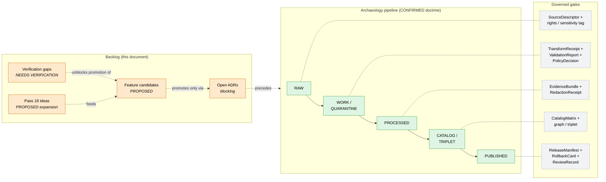

<!-- [KFM_META_BLOCK_V2]
doc_id: kfm://doc/docs-domains-archaeology-expansion-backlog
title: Archaeology & Cultural Heritage — Expansion Backlog
type: standard
version: v0.1
status: draft
owners: <Archaeology domain steward — TODO>, <Docs steward — TODO>
created: 2026-05-15
updated: 2026-05-15
policy_label: public
related: [
  docs/domains/archaeology/README.md,
  docs/doctrine/directory-rules.md,
  docs/atlases/KFM_Domains_Culmination_Atlas_v1_1.pdf,
  docs/registers/VERIFICATION_BACKLOG.md,
  docs/registers/DRIFT_REGISTER.md
]
tags: [kfm, archaeology, backlog, expansion, governance, sensitivity]
notes: [
  "PROPOSED placement per Directory Rules §12 (Domain Placement Law); no mounted repo verified this session.",
  "All implementation-shaped claims default to PROPOSED until repo evidence resolves them.",
  "External standards (CARE, H3, FAIR) referenced only through KFM project sources."
]
[/KFM_META_BLOCK_V2] -->

# Archaeology & Cultural Heritage — Expansion Backlog

> Forward-work register for the KFM Archaeology and Cultural Heritage domain — feature candidates, verification gaps, validator gaps, cross-lane edges, and Pass 18 expansion ideas, with truth labels preserved.

  
  
  
  
  
  

| | |
|---|---|
| **Status** | Draft — review pending |
| **Owners** | Archaeology domain steward · Docs steward *(names — TODO)* |
| **Last reviewed** | 2026-05-15 |
| **Authority class** | Doctrine-grounded planning register (subordinate to ADRs, Directory Rules, and per-root READMEs) |
| **Repository state** | UNKNOWN — no repo mounted this session; all path / route / file-presence claims are **PROPOSED** |

---

## Contents

- [1. Scope and intent](#1-scope-and-intent)
- [2. Status snapshot](#2-status-snapshot)
- [3. Pipeline and backlog flow](#3-pipeline-and-backlog-flow)
- [4. Feature backlog](#4-feature-backlog)
- [5. Verification backlog](#5-verification-backlog)
- [6. Validator and test backlog](#6-validator-and-test-backlog)
- [7. Cross-lane backlog](#7-cross-lane-backlog)
- [8. Pass 18 expansion ideas (FIE category)](#8-pass-18-expansion-ideas-fie-category)
- [9. Sensitivity, rights, and sovereignty backlog](#9-sensitivity-rights-and-sovereignty-backlog)
- [10. Open ADRs that gate this backlog](#10-open-adrs-that-gate-this-backlog)
- [11. Risks and mitigations](#11-risks-and-mitigations)
- [12. Thin-slice plan](#12-thin-slice-plan)
- [13. Process for adding or closing a backlog item](#13-process-for-adding-or-closing-a-backlog-item)
- [14. Related docs](#14-related-docs)

---

## 1. Scope and intent

This document is the **forward-work register** for the Archaeology and Cultural Heritage domain. It collects, in one place:

- features the domain plans to build or extend,
- verification gaps that block confident implementation claims,
- validator / test work that must precede public release,
- cross-lane edges with other KFM domains,
- Pass 18 idea-index cards relevant to archaeology, and
- the open architectural questions (ADRs) that gate any of the above.

**What this backlog is not.** It is not a release plan, not an ADR, not a policy decision, and not the schema home for any archaeology object family. Backlog entries describe candidate work; nothing here promotes itself to canon. Promotion remains a governed state transition, not a file move. **CONFIRMED doctrine** per Directory Rules §3 and Atlas v1.1 §8 (Pipeline Gate Reference).

**Scope of the Archaeology domain itself.** **CONFIRMED doctrine / PROPOSED implementation:** the domain owns `ArchaeologicalSite`, `Survey`, `Artifact`, `Feature`, `Context`, `ExcavationUnit`, `RemoteSensingAnomaly`, `LiDARCandidate`, `GeophysicsObservation`, `ThreeDDocumentation`, `CulturalReview`, `StewardReview`, `CollectionAccession`, `ChronologyAssertion`, and `SensitivityTransform`. It explicitly **does not** own Roads/Rail, People/Land, Geology, Hazards, or Spatial Foundation; those lanes provide context but cannot confirm sites or bypass archaeological sensitivity.

> [!IMPORTANT]
> Exact archaeological site locations are denied by default. Burial, human remains, sacred sites, unresolved cultural sensitivity, collection security, private-landowner details, and looting-risk exposure **fail closed**. No backlog item in this document loosens that posture; items that touch sensitive geometry must route through steward review and a recorded `SensitivityTransform` before promotion.

[↑ back to top](#contents)

---

## 2. Status snapshot

The table below separates what KFM doctrine treats as **CONFIRMED** from what current-session evidence can only support as **PROPOSED** or worse. The Atlas v1.0 / v1.1 dossiers carry doctrine; current-session repository evidence is **UNKNOWN** because no repo is mounted.

| Layer | Status | Source of confidence |
|---|---|---|
| Domain mission and boundary | **CONFIRMED doctrine** | Encyclopedia §7.13; Atlas v1.1 §15.A–B |
| Object families and ubiquitous language | **CONFIRMED doctrine / PROPOSED field realization** | Atlas v1.1 §15.C–E |
| Cross-lane relations | **CONFIRMED doctrine / PROPOSED** | Atlas v1.1 §15.F, §24.4.13 |
| Pipeline shape (RAW → PUBLISHED) | **CONFIRMED doctrine / PROPOSED lane application** | Directory Rules §0, §3; Atlas v1.1 §15.H, §8 |
| Sensitivity tier defaults (T4 for exact coords; T1 only after steward review) | **CONFIRMED doctrine** | Atlas v1.1 §24.5; MapLibre Master ML-061-159 |
| Schema home (`schemas/contracts/v1/archaeology/…`) | **PROPOSED** (per ADR-0001 default) | Atlas v1.1 §24.13 row 15; Directory Rules §7.4 |
| Policy home (`policy/sensitivity/archaeology/…`) | **PROPOSED** | Atlas v1.1 §24.13 row 15; Directory Rules §10/§12 |
| Specific routes / DTOs / runtime behavior | **UNKNOWN** (route TBD; pending mounted-repo inspection) | Atlas v1.1 §15.J |
| Test, fixture, and validator presence | **NEEDS VERIFICATION** | Atlas v1.1 §15.K |
| Steward identity, separation-of-duties, rollback drill | **NEEDS VERIFICATION** | Atlas v1.1 §15.N |

> [!NOTE]
> Truth labels in this document follow the four-label system codified in the Unified Build Manual §2.4 and Directory Rules §0: **CONFIRMED**, **PROPOSED**, **UNKNOWN**, **NEEDS VERIFICATION**. `DENY`, `ABSTAIN`, and `ERROR` remain runtime outcomes and are not used here as documentation labels.

[↑ back to top](#contents)

---

## 3. Pipeline and backlog flow

The archaeology pipeline follows the universal lifecycle invariant — `RAW → WORK / QUARANTINE → PROCESSED → CATALOG / TRIPLET → PUBLISHED` — with no domain shortcut and no direct path from `RAW` to `PUBLISHED`. Backlog items map to specific gates; nothing in the backlog can re-order them.

> [!NOTE]
> Gate labels above represent the **PROPOSED minimum** artifact set per Atlas v1.1 §8 (Master Pipeline Gate Reference). Whether each gate is implemented as code in the current repository remains **NEEDS VERIFICATION**.

[↑ back to top](#contents)

---

## 4. Feature backlog

These rows extend the Encyclopedia §7.13.L feature backlog and re-state it with archaeology-specific language and current-session truth labels. Every row is **PROPOSED** unless mounted-repo evidence raises it.

| Group | Feature | Actor / action | Evidence needed | Risk | Validation path | Status |
|---|---|---|---|---|---|---|
| Build first | Archaeology source registry + no-network fixture | steward / developer | `SourceDescriptor` + synthetic fixture | rights / source-role ambiguity | schema, source, rights validators | **PROPOSED** |
| Build first | Archaeology Evidence Drawer inspector for one generalized feature | public / researcher / steward | `EvidenceBundle` for one feature | uncited public claim | evidence-closure + citation tests | **PROPOSED** |
| Build first | Candidate-vs-confirmed UI distinction for `RemoteSensingAnomaly` / `LiDARCandidate` | public / researcher | candidate-not-site label rule | reading a candidate as a confirmed site | candidate-not-site fixture tests | **PROPOSED** |
| Build first | Public generalized site-summary tile (T1) wired to a `RedactionReceipt` | public / steward | `RedactionReceipt` + `ReviewRecord` | exact-coordinate leak | sensitive-geometry no-leak tests | **PROPOSED** |
| After proof lane | Archaeology time slider + compare mode | researcher / steward | versioned observations / layers | false temporal alignment | temporal-logic tests | **PROPOSED** |
| After proof lane | Survey-coverage public summary (`SurveyProject` / `SurveyTransect`) | researcher / steward | survey extents + coverage stats | implying confirmed sites in unsurveyed gaps | coverage-vs-find rate tests | **PROPOSED** |
| After proof lane | Chronology / `ChronologyAssertion` timeline view | researcher / steward | chronology assertions + uncertainty | overconfident period bands | uncertainty-band tests | **PROPOSED** |
| Ambitious / research | Cross-domain archaeology analytics and graph queries (with Roads / Settlements / Hazards) | researcher / AI assistant | source-backed triples + model receipts | derivative becomes truth | graph projection tests; cross-lane join policy | **PROPOSED** |
| Ambitious / research | 3D site documentation admission lane (`ThreeDDocumentation` + Scene Manifest) | steward | 3D admission policy + reality-boundary note | photorealism read as observation | 3D admission validator; renderer-boundary tests | **PROPOSED** (gated by **ADR-S-07**) |
| **DENY by default** | Unreviewed exact sensitive archaeology locations or private collection joins | public visitor | policy approval + `RedactionReceipt` | privacy / cultural / public-safety harm | policy deny tests | **DENY** *(runtime outcome — not a candidate)* |

> [!WARNING]
> The bottom row is not a "future feature." It is a permanent **DENY** lane, named here so that no later proposal accidentally reframes it as a backlog item to be unlocked. Any change that would soften this row requires an ADR routed through the rights-holder representative.

[↑ back to top](#contents)

---

## 5. Verification backlog

These items are taken directly from Atlas v1.1 §15.N and the Encyclopedia Appendix J / Appendix K, scoped to archaeology. Each is **NEEDS VERIFICATION** until mounted-repo or steward-review evidence settles it.

| ID *(local)* | Item to verify | Evidence that would settle it | Blocking | Status |
|---|---|---|---|---|
| ARCH-VER-01 | Steward authority and confidentiality scope for Archaeology lane | named stewards in repo governance; `ReviewRecord` examples | T1 / T2 publication of any site-derived summary | **NEEDS VERIFICATION** |
| ARCH-VER-02 | Public geometry thresholds and transform profiles (e.g., H3 r7 minimum; ≥5 km terrain generalization near sites) | a published `policy/sensitivity/archaeology/` profile; fixture tests | any generalized public layer | **NEEDS VERIFICATION** |
| ARCH-VER-03 | Oral history and cultural-knowledge handling protocol | a recorded protocol + steward sign-off + rights record | admission of oral-history sources | **NEEDS VERIFICATION** |
| ARCH-VER-04 | Emergency public-layer disablement and rollback drill | a dry-run drill log + `RollbackCard` artifact | any `PUBLISHED` archaeology layer | **NEEDS VERIFICATION** |
| ARCH-VER-05 | LiDAR vertical datum and vintage handling for candidate anomalies | terrain manifest test + vintage field on `LiDARCandidate` | promoting `LiDARCandidate` to `CandidateFeature` | **NEEDS VERIFICATION** |
| ARCH-VER-06 | Schema home for archaeology object families (default `schemas/contracts/v1/archaeology/`) | a tree under that path + ADR-0001 confirmation | every schema-tagged item below | **NEEDS VERIFICATION** *(pending **ADR-S-01**)* |
| ARCH-VER-07 | Specific governed-API route and DTO names for archaeology resolvers | route table or OpenAPI doc under `apps/governed-api/…` | runtime claims; client wiring | **UNKNOWN** |
| ARCH-VER-08 | Whether `policy/sensitivity/archaeology/` exists and is the canonical home (vs. `policies/`) | mounted-repo inspection; per-root README | every sensitivity claim below | **NEEDS VERIFICATION** *(pending **ADR-S-05**)* |

[↑ back to top](#contents)

---

## 6. Validator and test backlog

The Atlas v1.1 §15.K names seven **PROPOSED** validator classes for Archaeology. This backlog tracks each as a separate work item, with the fixture posture that should accompany it.

| ID *(local)* | Validator / test class | Purpose | Required fixtures | Status |
|---|---|---|---|---|
| ARCH-TST-01 | `EvidenceBundle`-required tests | refuse archaeology claims that lack a resolvable `EvidenceRef` → `EvidenceBundle` chain | positive (resolves) + negative (broken ref, missing bundle) | **PROPOSED** |
| ARCH-TST-02 | Candidate-not-site tests | refuse promotion of a `RemoteSensingAnomaly` or `LiDARCandidate` as a confirmed `ArchaeologicalSite` without `StewardReview` | candidate fixture + missing-review fixture | **PROPOSED** |
| ARCH-TST-03 | Public no-leak tests | refuse public emission of restricted fields (exact coords, internal identifiers, sensitive joins) | restricted-field corpus + redaction acceptance fixture | **PROPOSED** |
| ARCH-TST-04 | Rights and cultural-review tests | refuse promotion when `CulturalReview` / rights-holder representative sign-off is missing where required | review-present + review-absent fixtures | **PROPOSED** |
| ARCH-TST-05 | Exact sensitive geometry denial | refuse geometry below H3 r7 (or equivalent threshold once **ADR-S-05** lands) for sensitive lanes | sub-r7 geometry fixtures | **PROPOSED** |
| ARCH-TST-06 | Catalog closure tests | refuse release when `CatalogMatrix` entry, digests, or triplet projections do not close | closure-pass + closure-fail fixtures | **PROPOSED** |
| ARCH-TST-07 | AI exact-location denial | refuse AI generation of exact archaeology coordinates regardless of prompt phrasing | adversarial prompt fixtures + `AIReceipt` audit | **PROPOSED** |
| ARCH-TST-08 | Cultural-symbol policy tests *(from MapLibre ML-061 family)* | refuse style rules that use sacred symbols or tribal insignia for archaeology layers | symbol-set linter fixture | **PROPOSED** |
| ARCH-TST-09 | `PublicationTransformReceipt` parity tests | verify that every public archaeology artifact has a transform receipt that names method, threshold, and reviewer | receipt-present + receipt-missing fixtures | **PROPOSED** |

> [!TIP]
> The Encyclopedia §7.13.K test list applies uniformly across domains; the archaeology-specific additions are ARCH-TST-02, ARCH-TST-05, ARCH-TST-07, and ARCH-TST-08. When a shared validator covers both archaeology and another lane, prefer placement under `tools/validators/<topic>/…` per Directory Rules §12 "Multi-domain and cross-cutting files."

[↑ back to top](#contents)

---

## 7. Cross-lane backlog

These edges are owned by Archaeology and are restated here as backlog rows so the work is trackable per related lane. Each edge must preserve ownership, source role, sensitivity, and `EvidenceBundle` support. **CONFIRMED doctrine / PROPOSED implementation** throughout, per Atlas v1.1 §15.F and §24.4.13.

| Related lane | Relation (CONFIRMED doctrine) | Backlog work | Status |
|---|---|---|---|
| Spatial Foundation | Exact / public geometry split + transform receipts | Profile every public geometry with a `PublicationTransformReceipt`; record method + threshold | **PROPOSED** |
| Roads / Rail / Trade Routes | Historic routes and cultural paths | Bind site interpretation to historic route evidence; deny exact coords; allow generalized corridor overlays only | **PROPOSED** |
| Settlements / Infrastructure | Forts, missions, townsites, reservation communities | Cultural temporal period + survey context anchors historical settlement interpretation; site coords denied | **PROPOSED** |
| Hazards | Threat / erosion / fire / flood / exposure context | Hazard exposure may inform threat ranking for sensitive sites; KFM is **never** an alert authority for archaeology | **PROPOSED** |
| Planetary / 3D | Sites admitted only via steward-reviewed, generalized 3D representation with reality-boundary note | 3D admission lane (`ThreeDDocumentation` + Scene Manifest); reality-boundary note required | **PROPOSED** *(gated by **ADR-S-07**)* |
| People / Genealogy / Land | Cultural affiliations cited with rights, sovereignty, and steward review | Indigenous community context: steward-reviewed, rights-bounded; living-person fields fail closed | **PROPOSED** |
| Frontier Matrix | (Inbound) Settlement-status cells may reference archaeology context generalized | Verify generalization sufficiency before any matrix snapshot carries an archaeology-derived field | **NEEDS VERIFICATION** |

[↑ back to top](#contents)

---

## 8. Pass 18 expansion ideas (FIE category)

The Pass 18 Idea Index assigns **59 cards** to the **FIE — Field Capture, Remote Sensing, 3D, and Archaeological Interpretation** category. The subset below is the slice most relevant to archaeology promotion candidates. Each card is **PROPOSED** with **UNKNOWN** implementation maturity (no current-session repo evidence proves any card is already implemented).

<b>Archaeology-relevant Pass 18 FIE cards (click to expand)</b>

 

| Card ID | Title (normalized) | Carry state | Backlog implication |
|---|---|---|---|
| KFM-P18-INV-016 | 3D archaeology as evidence-rich spatial analysis | NEW | Define a `3DAssetAcquisitionReceipt` profile (method, instrument, processing, scale, CRS, uncertainty) |
| KFM-P18-INV-017 | 2.5D versus true 3D distinction | NEW | Add a representation-mode label to scene artifacts |
| KFM-P18-INV-019 | Trowel-edge anomaly detection as reviewed field inference | NEW | Treat field inference as `CandidateFeature`, never as confirmed site |
| KFM-P18-INV-020 | Subsurface, volume, and visibility analyses as derived evidence | NEW | Volumetric / visibility outputs require derivation receipts and uncertainty fields |
| KFM-P18-INV-089 | 3D GIS should support multi-model archaeological interpretation | EXPANDED | Add `interpretation_status`, `scenario_id`, `evidence_support_level`, and rejected-alternative links |
| KFM-P18-INV-090 | Volumetric and boundary models need acquisition and analysis lineage | EXPANDED | Define a `volumetric_derivative_receipt` for legacy inputs and density calculations |
| KFM-P18-INV-091 | 3D visualization settings are analytical choices | NEW | Record visualization-settings provenance with the asset |
| KFM-P18-INV-113 | 3D visibility analysis as bounded interpretive inference | NEW | Visibility analyses must travel with their `EvidenceBundle` and method receipt |
| KFM-P18-INV-248 | Offline field-capture packages need redaction and sync receipts | EXPANDED | Field-capture lane requires redaction-on-sync and a sync `RunReceipt` |
| KFM-P18-INV-294 | Trowel-edge 3D GIS becomes field-recording evidence | NEW | On-site 3D capture must record acquisition, scale, georeference, revision, and analyst |
| KFM-P18-INV-363 | Surface and subsurface 3D analysis as layered evidence rather than a single scene | EXPANDED | Separate surface, subsurface, point-cloud-derived, volume, and analysis layers |
| KFM-P18-INV-452 | Remote-sensing resolution metadata for raster and imagery layers | EXPANDED | Disclose sensor bands + spatial / temporal / radiometric resolution before derivative promotion |
| KFM-P18-INV-485 | 2.5D versus true 3D representation labels | NEW | Label elevation / scene artifacts as 2D, 2.5D, or true 3D where the distinction affects interpretation |
| **KFM-P18-INV-005** *(source-level)* | Surface / subsurface 3D analyses record preservation state, threat context, method, morphology-change | NEW | Add `preservation_state` and `threat_context` fields to archaeology 3D analysis records |

The Pass 18 Idea Index identifies the FIE category as containing **59 cards total**; rows above are the archaeology-relevant subset selected from Phase 5 batches 001, 003, 004, 010, 012, 015, 019, and 020. The remaining FIE cards primarily concern hazards, remote sensing of other phenomena, or generic 3D representation issues outside Archaeology's owning domain.

> [!NOTE]
> Pass 18 cards are inventory-level planning candidates with **CONFIRMED** source support but **UNKNOWN** repository implementation. They do not promote themselves to schema, contract, or policy entries; each must travel through the normal admission, validation, and ADR (where structural) gates before any path-shaped claim is made.

[↑ back to top](#contents)

---

## 9. Sensitivity, rights, and sovereignty backlog

The Archaeology lane is one of the highest-sensitivity lanes in KFM. The default tier is **T4** (fail-closed); generalized public release at **T1** requires `RedactionReceipt` + `ReviewRecord`. Tier transitions follow Atlas v1.1 §24.5 — upgrade (toward more public) always requires both a transform receipt and a review record; downgrade (toward less public) needs only a `CorrectionNotice`.

| Concern | Doctrine source | Backlog work | Status |
|---|---|---|---|
| Exact site coordinates fail closed by default | Atlas v1.1 §15.I; Encyclopedia §7.13.M | Reify in `policy/sensitivity/archaeology/` once **ADR-S-05** lands | **PROPOSED** |
| Geometry below H3 r7 prohibited for sensitive archaeology products without review | MapLibre Master ML-061-159 | Implement and fixture-test the threshold; record per-feature `transform_method` | **PROPOSED** |
| Terrain near archaeological locations needs ≥5 km coordinate generalization | MapLibre Master ML-059-055 | Encode in terrain manifest; require `RedactionReceipt` with method + scale | **PROPOSED** |
| CARE labels and sovereignty notice chips required in UI | MapLibre Master ML-061-160 | Wire `CulturalReview` outcome to Evidence Drawer and Focus Mode chips | **PROPOSED** |
| Cultural symbols must avoid sacred symbols / tribal insignia and use neutral accessible vector forms | MapLibre Master ML-059-058 | Symbol-set linter (ARCH-TST-08) + steward-approved symbol catalog | **PROPOSED** |
| Focus Mode must be sovereignty-aware and explain which evidence influenced answers | MapLibre Master ML-061-162 | Bind Focus Mode templates to `AIReceipt` + sovereignty gating; audit `ABSTAIN` and `DENY` rates | **PROPOSED** |
| Generalization logs are validation evidence for sensitive map products | MapLibre Master ML-061-161 | Emit generalization logs alongside published tiles; admit them as `ValidationReport` inputs | **PROPOSED** |
| Steward authority and confidentiality scope | Atlas v1.1 §15.N row 1; §24.7 (Reviewer roles) | Name a domain steward, sensitivity reviewer, and rights-holder representative for this lane | **NEEDS VERIFICATION** |
| Oral history and cultural-knowledge protocol | Atlas v1.1 §15.N row 3 | Draft a protocol with rights-holder co-authoring; record admission criteria | **NEEDS VERIFICATION** |
| Living-person and DNA fields appearing alongside archaeology context | People-lane doctrine via Atlas v1.1 §24.4.14 | Cross-lane join policy must deny living-person joins through archaeology surfaces by default | **PROPOSED** *(gated by **ADR-S-14**)* |

[↑ back to top](#contents)

---

## 10. Open ADRs that gate this backlog

These ADRs are drawn from the **Master Open-ADR Backlog** in Atlas v1.1 §24.12. They are **PROPOSED** at the Atlas level; none has been observed accepted in this session. Each blocks at least one backlog row above.

| ADR | Question | Blocks |
|---|---|---|
| **ADR-S-01** | Where is the canonical schema home? (Default: `schemas/contracts/v1/…` per ADR-0001.) | ARCH-VER-06; every schema-shaped backlog row |
| **ADR-S-03** | Receipt class home: shared `schemas/contracts/v1/receipts/` vs. per-domain `schemas/contracts/v1/<domain>/receipts/` | `RedactionReceipt`, `PublicationTransformReceipt`, `RunReceipt` placement |
| **ADR-S-05** | Sensitivity tier scheme (T0–T4) — adopt as canonical or revise | All sensitivity rows in §9; ARCH-TST-05 |
| **ADR-S-07** | 3D admission policy: minimum required receipts, deny lanes, reality-boundary disclosure | 3D admission lane in §4; `ThreeDDocumentation` rows in §7 and §8 |
| **ADR-S-09** | Reviewer role separation: when is separation enforced by tooling vs. custom | Steward authority items in §5 and §9 |
| **ADR-S-10** | Stale-state propagation: how does a stale upstream propagate to downstream claims | Time-slider and matrix-snapshot rows in §4 and §7 |
| **ADR-S-14** | Cross-lane join policy: which joins require steward review, which are denied, which are open | Cross-lane work in §7; living-person row in §9 |

> [!CAUTION]
> Any row that depends on an open ADR **must not** be implemented as if the ADR is already resolved. Pre-emptive implementation is one of the placement and authority anti-patterns named in Atlas v1.1 §24.9.1; it hardens drift into canon.

[↑ back to top](#contents)

---

## 11. Risks and mitigations

These rows specialize the Encyclopedia §7.13.M risk register to the archaeology lane. They are **CONFIRMED doctrine** at the risk level; specific mitigation implementations are **PROPOSED**.

| Risk | Mitigation (PROPOSED) |
|---|---|
| Rights uncertainty | Block public release until source terms and redistribution class are recorded on the `SourceDescriptor` |
| Sensitive-location exposure | Default redaction / generalization; restricted views; geoprivacy transform receipts; H3-r7 minimum |
| False precision | Show uncertainty / support, scale and source-role badges; `ABSTAIN` on over-precise claims |
| Source-authority confusion (observation vs. model vs. authority record) | Source-role registry; separate observation / model / authority / context contexts at the `SourceDescriptor` |
| Model hallucination | Citation validation; finite outcomes (`ANSWER` / `ABSTAIN` / `DENY` / `ERROR`); no direct model-to-public path |
| Stale data | Freshness badges; retrieval / source / release time fields; stale-state policy with downstream propagation |
| Rollback complexity | `ReleaseManifest` + `RollbackCard` + a periodic rollback drill for every public layer |
| Candidate-as-confirmed drift | Candidate-not-site fixture tests (ARCH-TST-02); UI label discipline; reviewer separation |
| Photorealistic 3D read as direct observation | Reality-boundary note on every admitted 3D asset; representation-mode label (KFM-P18-INV-485) |

[↑ back to top](#contents)

---

## 12. Thin-slice plan

The Encyclopedia §7.13 thin-slice for Archaeology — **CONFIRMED** as a doctrinal slice, **PROPOSED** as an implementation candidate — is:

> *Synthetic archaeology candidate fixture with exact geometry denied, public generalized tile, steward review record, and correction / rollback path.*

Restated as a checklist of artifacts the slice must produce (each **PROPOSED**):

- a synthetic `RemoteSensingAnomaly` and a synthetic `LiDARCandidate` fixture with deliberately invented coordinates,
- a `SourceDescriptor` for the synthetic source family,
- a `TransformReceipt` and `RedactionReceipt` showing the H3-r7 minimum generalization in action,
- a `CandidateFeature` record that does **not** assert it is an `ArchaeologicalSite`,
- a public generalized vector tile served only through the governed API path,
- a `ReviewRecord` showing steward sign-off on the generalization,
- a `ReleaseManifest` + `RollbackCard`,
- a dry-run rollback drill that restores the prior manifest,
- a `CorrectionNotice` round-trip showing a downgrade from a generalized state back to restricted.

> [!IMPORTANT]
> The thin slice's purpose is to prove the **trust membrane**, not to publish data. No real archaeology source should be admitted by this slice; all inputs must be deliberately synthetic until the verification rows in §5 are closed.

[↑ back to top](#contents)

---

## 13. Process for adding or closing a backlog item

Every change to this file should preserve the doctrine-to-implementation separation. A short discipline (PROPOSED for this document; not yet codified in repo tooling):

1. **Adding a row.** New rows arrive **PROPOSED** with at least one citation to project doctrine (Atlas, Encyclopedia, Pass 18 card, Directory Rules) or to a steward-recorded need. Rows without doctrine grounding belong in a discussion, not here.
2. **Promoting a row.** A backlog row does not become canon by being implemented. It promotes by: (a) the relevant ADR landing, (b) the artifact appearing in the repo at the **PROPOSED** path with a `ReviewRecord`, and (c) the matching validator producing a passing fixture run.
3. **Closing a row.** When closed, the row stays in the file with status `CLOSED` and a forward link to the artifact that closed it (ADR id, PR url, or release id). Removing rows silently is treated as drift.
4. **Conflicts.** If a row conflicts with a row in `docs/registers/VERIFICATION_BACKLOG.md` or with an accepted ADR, the ADR wins; if a row conflicts with Atlas v1.0 / v1.1, the Atlas governs and the conflict is logged in `docs/registers/DRIFT_REGISTER.md`.
5. **Cadence.** Recommend a quarterly steward review of this file with the open-ADR backlog open in another tab. Aging entries past two reviews without progress are candidates for explicit closure as `WONTFIX`, with reason.

> [!TIP]
> Backlog hygiene is part of the trust posture, not extra paperwork. A stale backlog is one of the documentation drift signals named in Atlas v1.1 §24.11.5.

[↑ back to top](#contents)

---

## 14. Related docs

Paths below are **PROPOSED** per Directory Rules §12 and the Atlas v1.1 §24.13 crosswalk; presence and exact filenames remain **NEEDS VERIFICATION** until a repo is mounted.

- `docs/domains/archaeology/README.md` — domain landing page *(TODO: confirm presence and link target)*
- `docs/doctrine/directory-rules.md` — placement and lifecycle doctrine
- `docs/atlases/KFM_Domains_Culmination_Atlas_v1_1.pdf` — Atlas v1.1, §15 (Archaeology) and §24
- `docs/registers/VERIFICATION_BACKLOG.md` — repo-wide verification backlog
- `docs/registers/DRIFT_REGISTER.md` — drift entries when repo state and doctrine disagree
- `schemas/contracts/v1/archaeology/` — **PROPOSED** schema home for archaeology object families
- `policy/sensitivity/archaeology/` — **PROPOSED** sensitivity policy home
- `contracts/archaeology/` — **PROPOSED** semantic Markdown for archaeology object families
- `tests/domains/archaeology/` — **PROPOSED** test home; cross-domain validators belong under `tools/validators/<topic>/`
- `fixtures/domains/archaeology/` — **PROPOSED** fixture home
- `release/candidates/archaeology/` — **PROPOSED** release-candidate staging

---

**Last reviewed:** 2026-05-15  ·  **Edition:** v0.1 draft  ·  [↑ back to top](#contents)
