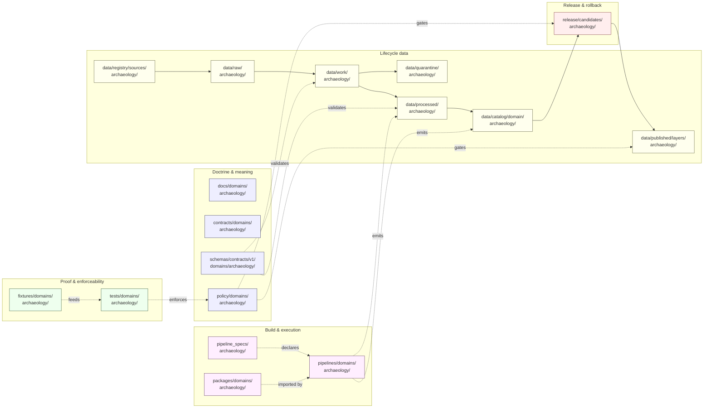

<!-- [KFM_META_BLOCK_V2]
doc_id: kfm://doc/domains/archaeology/file-system-plan
title: Archaeology Domain — File System Plan
type: standard
version: v1
status: draft
owners: TBD — Archaeology domain steward (NEEDS VERIFICATION)
created: 2026-05-15
updated: 2026-05-15
policy_label: public
related:
  - docs/doctrine/directory-rules.md
  - docs/domains/archaeology/README.md
  - schemas/contracts/v1/domains/archaeology/
  - policy/domains/archaeology/
  - tests/domains/archaeology/
  - release/candidates/archaeology/
tags: [kfm, domain, archaeology, directory-rules, lane-plan]
notes:
  - PROPOSED paths until verified against mounted-repo evidence.
  - Sensitivity posture is doctrine-grounded; implementation maturity is UNKNOWN.
[/KFM_META_BLOCK_V2] -->

# Archaeology Domain — File System Plan

> Lane-by-lane plan for where Archaeology files live across the KFM monorepo, what each lane owns, and what the trust membrane forbids. Doctrinal placement only — implementation maturity remains PROPOSED until verified against a mounted repository.

<!-- BADGES -->


<!-- TODO: replace badge endpoints with repo-verified Shields.io targets when CI/release wiring lands. -->

**Status:** `draft` · **Owners:** _TBD — Archaeology domain steward (`NEEDS VERIFICATION`)_ · **Last updated:** 2026-05-15

---

## Mini-TOC

- [1. Scope and purpose](#1-scope-and-purpose)
- [2. Repo fit and authority basis](#2-repo-fit-and-authority-basis)
- [3. Canonical lane map](#3-canonical-lane-map)
- [4. Lane fan-out and lifecycle diagram](#4-lane-fan-out-and-lifecycle-diagram)
- [5. Per-lane responsibilities](#5-per-lane-responsibilities)
- [6. What belongs here · what does not](#6-what-belongs-here--what-does-not)
- [7. Object families and where they appear](#7-object-families-and-where-they-appear)
- [8. Sensitivity, rights, and publication posture](#8-sensitivity-rights-and-publication-posture)
- [9. Cross-lane relations](#9-cross-lane-relations)
- [10. Validators, tests, fixtures — lane targets](#10-validators-tests-fixtures--lane-targets)
- [11. Open questions and verification backlog](#11-open-questions-and-verification-backlog)
- [12. Related docs](#12-related-docs)
- [Appendix A — Path index (collapsible)](#appendix-a--path-index-collapsible)

---

## 1. Scope and purpose

**CONFIRMED doctrine / PROPOSED implementation.** This plan enumerates where Archaeology and Cultural Heritage files live in the Kansas Frontier Matrix monorepo — across `docs/`, `contracts/`, `schemas/`, `policy/`, `tests/`, `fixtures/`, `packages/`, `pipelines/`, `pipeline_specs/`, `data/`, and `release/` — without ever promoting the domain itself to a root folder.

The plan is a *placement* artifact. It does not decide whether a file should exist (that belongs to `contracts/`, `schemas/`, `policy/`, source descriptors, ADRs, and reviews) and it does not authorize publication (that belongs to `release/` plus the policy, evidence, review, and rollback gates). It tells reviewers where to look, where to put new work, and where the domain's trust boundaries materialize on disk.

**Domain mission (CONFIRMED doctrine).** Preserve archaeological and cultural heritage knowledge through strict sensitivity, cultural/steward review, the candidate-vs-confirmed distinction, and exact-location denial by default. The domain owns archaeological sites, surveys, artifacts, features, contexts, excavation units, remote-sensing anomalies, LiDAR candidates, geophysics, 3D documentation, collections/accessions, and chronology. It MUST NOT publish exact sites, sacred places, burial or human remains, or culturally sensitive material without proper review.

> [!IMPORTANT]
> This document is a **placement plan**, not a release authority. No path quoted here is proof of repo state; every implementation-shaped claim is **PROPOSED** until verified against mounted-repo evidence, per Directory Rules §0 and §17 of the working contract.

[↑ Back to top](#archaeology-domain--file-system-plan)

---

## 2. Repo fit and authority basis

This plan sits inside the Archaeology domain documentation lane. Its placement and the lanes it enumerates are governed by the following authority order (per Directory Rules §2.1):

| Authority layer | Source | Bearing on this plan |
|---|---|---|
| KFM core invariants | Lifecycle law, trust membrane, cite-or-abstain, watcher-as-non-publisher | Non-negotiable. Lanes MUST preserve them. |
| Accepted ADRs | ADR-0001 (schema home), future archaeology ADRs | May amend specific paths. None known to override §12 here. |
| Directory Rules §12 — Domain Placement Law | `docs/doctrine/directory-rules.md` | **Canonical** lane pattern this plan applies. |
| Domain dossier | `[DOM-ARCH]` Archaeology Architecture Plan, Encyclopedia §7.13, Domains Culmination Atlas §15 | Lineage; PROPOSED content; not new authority. |
| Mounted-repo convention | _not inspected this session_ | Cannot be confirmed. Conflicts become drift entries. |

### Upstream and downstream links

- **Upstream doctrine:** `docs/doctrine/directory-rules.md` · `docs/doctrine/lifecycle-law.md` · `docs/doctrine/trust-membrane.md` · `docs/doctrine/truth-posture.md` (all paths **PROPOSED**).
- **Sibling domain plans:** `docs/domains/<domain>/FILE_SYSTEM_PLAN.md` (hydrology, soil, fauna, flora, habitat, geology, atmosphere, hazards, roads-rail-trade, settlements-infrastructure, agriculture, people-dna-land) — **PROPOSED**, expected pattern.
- **Downstream consumers:** path-validation reviewers (Directory Rules §16 checklist); promotion-gate tests (`tests/domains/archaeology/`); release candidates under `release/candidates/archaeology/`.

> [!NOTE]
> A divergence is visible between Directory Rules §12 (`schemas/contracts/v1/domains/<domain>/`) and shorthand schema paths quoted in some domain atlases (`schemas/contracts/v1/<domain>/`, without the `domains/` segment). This plan follows **Directory Rules §12** as canonical and flags the shorthand variant as `NEEDS VERIFICATION` pending an ADR.

[↑ Back to top](#archaeology-domain--file-system-plan)

---

## 3. Canonical lane map

**CONFIRMED doctrine / PROPOSED paths.** Every Archaeology file lives under one of the following responsibility roots, with `archaeology` appearing as a **segment**, never as a root folder. Patterns below are derived from Directory Rules §12 applied to this domain.

| # | Responsibility root | Archaeology lane path | What it owns | Status |
|---|---|---|---|---|
| 1 | Human-facing docs | `docs/domains/archaeology/` | Domain README, this plan, runbooks, design notes | PROPOSED |
| 2 | Object-meaning contracts | `contracts/domains/archaeology/` | Semantic markdown for archaeology object families | PROPOSED |
| 3 | Machine-checkable schemas | `schemas/contracts/v1/domains/archaeology/` | JSON Schemas for archaeology objects (per ADR-0001 schema home) | PROPOSED |
| 4 | Admissibility / release policy | `policy/domains/archaeology/` | Policy gates for promotion, redaction, denial | PROPOSED |
| 5 | Sensitivity sub-policy (cross-cutting) | `policy/sensitivity/archaeology/` _(if used)_ | Geo-privacy / generalization / steward-review gates | PROPOSED · NEEDS VERIFICATION |
| 6 | Enforceability proof | `tests/domains/archaeology/` | Validators, candidate-not-site tests, no-leak tests, AI denial tests | PROPOSED |
| 7 | Test inputs | `fixtures/domains/archaeology/` | Valid/invalid candidate fixtures, generalized public layer fixtures, review records | PROPOSED |
| 8 | Shared libraries | `packages/domains/archaeology/` | Domain-specific helpers consumed by pipelines and apps | PROPOSED |
| 9 | Executable pipelines | `pipelines/domains/archaeology/` | RAW→PUBLISHED stage logic for archaeology lane | PROPOSED |
| 10 | Declarative pipeline specs | `pipeline_specs/archaeology/` | Spec-side definitions consumed by `pipelines/` | PROPOSED |
| 11 | Lifecycle data — capture | `data/raw/archaeology/` | Immutable source payloads with descriptor + hash | PROPOSED |
| 12 | Lifecycle data — normalize | `data/work/archaeology/` | Normalization scratch (validated outputs only) | PROPOSED |
| 13 | Lifecycle data — failures | `data/quarantine/archaeology/` | Failed records with quarantine reason | PROPOSED |
| 14 | Lifecycle data — emit | `data/processed/archaeology/` | Validated normalized objects + receipts + public-safe candidates | PROPOSED |
| 15 | Lifecycle data — catalog | `data/catalog/domain/archaeology/` | CatalogMatrix entries, DatasetVersions, EvidenceBundles, graph projections | PROPOSED |
| 16 | Lifecycle data — published | `data/published/layers/archaeology/` | Released public-safe layers, generalized geometries | PROPOSED |
| 17 | Lifecycle data — registry | `data/registry/sources/archaeology/` | SourceDescriptor entries for archaeology source families | PROPOSED |
| 18 | Release decisions | `release/candidates/archaeology/` | Release candidates with manifest, review, rollback target | PROPOSED |
| 19 | Connectors _(if domain-specific)_ | `connectors/<source-name>/` (no domain segment by default) | Source-specific fetchers/admitters; output to `data/raw/archaeology/` | PROPOSED · NEEDS VERIFICATION |
| 20 | Runtime adapters | `runtime/model_adapters/` _(domain-aware, not domain-segmented)_ | Archaeology-aware AI adapters; never a public surface | PROPOSED |

> [!CAUTION]
> Lanes 19–20 are listed for cross-reference only. **Connectors and runtime adapters MUST NOT carry a `domain/<archaeology>` path segment** by default; they live by source identity or by adapter type. Apply Directory Rules §12's *multi-domain and cross-cutting files* rule when in doubt.

[↑ Back to top](#archaeology-domain--file-system-plan)

---

## 4. Lane fan-out and lifecycle diagram

The diagram below shows how the Archaeology domain segment fans out across responsibility roots, and how lifecycle data flows from RAW to PUBLISHED through the trust membrane. **PROPOSED** — illustrative of doctrine; specific paths require mounted-repo verification.



> [!NOTE]
> The diagram reflects **doctrine**, not verified implementation. Connectors emit only to `data/raw/` or `data/quarantine/`; watchers emit receipts and candidate decisions only. Promotion to `data/published/` and updates to `data/catalog/` are governed state transitions, never direct writes.

[↑ Back to top](#archaeology-domain--file-system-plan)

---

## 5. Per-lane responsibilities

Each lane below has a single primary responsibility. Multi-responsibility files MUST be split rather than placed at a "convenient" intersection.

### 5.1 Doctrine & meaning lanes

- **`docs/domains/archaeology/`** — Domain README, this `FILE_SYSTEM_PLAN.md`, design notes, runbooks specific to the lane. Explains; does not decide. PROPOSED.
- **`contracts/domains/archaeology/`** — Markdown that defines what each object family *means* (`ArchaeologicalSite`, `Survey`, `Artifact`, `Feature`, `Context` / `ProvenienceContext`, `ExcavationUnit`, `RemoteSensingAnomaly`, `LiDARCandidate`, `GeophysicsObservation`, `ThreeDDocumentation`, `CulturalReview`, `StewardReview`, `CollectionAccession`, `ChronologyAssertion`, `SensitivityTransform`, `StratigraphicUnit`). PROPOSED.
- **`schemas/contracts/v1/domains/archaeology/`** — JSON Schemas for those object families. Default home per ADR-0001 (schema home). PROPOSED.
- **`policy/domains/archaeology/`** — Admissibility, release, and denial policy specific to archaeology. Includes the deny-by-default register entries for exact site coordinates, sacred sites, burial/human remains, and looting-risk exposure. PROPOSED.

### 5.2 Proof & enforceability lanes

- **`tests/domains/archaeology/`** — At minimum: `EvidenceBundle`-required tests, candidate-not-site tests, public no-leak tests, rights-and-cultural-review tests, exact-sensitive-geometry denial tests, catalog-closure tests, AI exact-location denial tests. All PROPOSED per `[DOM-ARCH]` / `[ENCY]`.
- **`fixtures/domains/archaeology/`** — Synthetic candidate fixtures with exact geometry denied; generalized public tile fixtures; steward-review records; correction and rollback fixtures. No real source data without verified rights. PROPOSED.

### 5.3 Build & execution lanes

- **`packages/domains/archaeology/`** — Shared library code for archaeology workflows. Reusable across pipelines and apps. PROPOSED.
- **`pipeline_specs/archaeology/`** — Declarative *what should run* configuration. PROPOSED.
- **`pipelines/domains/archaeology/`** — Executable *how it runs* logic. Reads from `data/raw/archaeology/`; never publishes directly. PROPOSED.

### 5.4 Lifecycle data lanes (governed transitions)

The lifecycle invariant `RAW → WORK / QUARANTINE → PROCESSED → CATALOG / TRIPLET → PUBLISHED` is non-negotiable. Promotion is a **governed state transition, not a file move**.

| Stage | Path | Gate (PROPOSED) |
|---|---|---|
| RAW | `data/raw/archaeology/` | `SourceDescriptor` exists; rights, sensitivity, citation, time, hash recorded |
| WORK | `data/work/archaeology/` | Schema, geometry, time, identity, evidence, rights, policy normalized |
| QUARANTINE | `data/quarantine/archaeology/` | Quarantine reason recorded; no public exposure |
| PROCESSED | `data/processed/archaeology/` | `EvidenceRef`, `ValidationReport`, digest closure exist |
| CATALOG / TRIPLET | `data/catalog/domain/archaeology/` | Catalog/proof closure passes; `EvidenceBundle` resolves |
| PUBLISHED | `data/published/layers/archaeology/` | `ReleaseManifest`, correction path, rollback target, review/policy state exist |
| REGISTRY | `data/registry/sources/archaeology/` | Source-role taxonomy, rights register, source authority |

### 5.5 Release & rollback lane

- **`release/candidates/archaeology/`** — Release candidates with manifest, evidence support, validation/policy support, review state, correction path, and rollback target. Public publication only after gate closure. PROPOSED.

[↑ Back to top](#archaeology-domain--file-system-plan)

---

## 6. What belongs here · what does not

### Belongs in the Archaeology lane

- Archaeological site assertions, surveys, artifacts, features, contexts (incl. `ProvenienceContext`, `StratigraphicUnit`), excavation units
- Remote-sensing anomalies and LiDAR candidates **labeled as candidates, not confirmed sites**
- Geophysics observations, 3D documentation
- Cultural reviews, steward reviews, collection accessions, chronology assertions
- Sensitivity transforms and redaction receipts for archaeology objects
- Layer manifests for **public-safe generalized** archaeology surfaces only

### Does **not** belong in the Archaeology lane

| Material | Correct home | Reason |
|---|---|---|
| Spatial Foundation (CRS, base layers, projection transforms) | `schemas/contracts/v1/spatial-foundation/` (PROPOSED) | Owned by Spatial Foundation; archaeology cites, not owns |
| Roads, rail, historic trails | `docs/domains/roads-rail-trade/` and lanes | Owned by Roads/Rail; archaeology relates via cross-lane links |
| Settlement townsites, forts, missions | `docs/domains/settlements-infrastructure/` | Owned by Settlements/Infrastructure |
| Living-person, DNA, parcel-boundary truth | `docs/domains/people-dna-land/` | Owned by People/Genealogy/DNA/Land |
| Hazard threats, fire, flood, erosion as events | `docs/domains/hazards/` | Owned by Hazards; archaeology consumes context |
| Geology stratigraphy as geologic primary | `docs/domains/geology/` | Geology owns its truth; archaeology cites |
| Real-coordinate sacred-site geometry on a public path | _no public lane_ — **DENY** by policy | Sensitivity / cultural sovereignty |
| Shared geometry validators | `tools/validators/<topic>/` (no domain segment) | Cross-domain; place at lowest common responsibility root |
| Cross-domain doctrine | `docs/architecture/<topic>.md` | Not domain-specific |

> [!WARNING]
> **Exact archaeological site coordinates, burial, human remains, sacred sites, unresolved cultural sensitivity, collection security, private landowner details, and looting-risk exposure fail closed.** They do not have a "default public" home in the file system. Any path that would expose them on a public route is, by doctrine, an anti-pattern.

[↑ Back to top](#archaeology-domain--file-system-plan)

---

## 7. Object families and where they appear

The table below shows where each Archaeology object family is **defined** (semantic), **shaped** (schema), **gated** (policy), and **proved** (tests/fixtures). PROPOSED — names taken verbatim from `[DOM-ARCH]` and `[ENCY]`.

| Object family | `contracts/` | `schemas/` | `policy/` | `tests/` + `fixtures/` |
|---|---|---|---|---|
| ArchaeologicalSite | `contracts/domains/archaeology/site.md` | `schemas/contracts/v1/domains/archaeology/site.schema.json` | `policy/domains/archaeology/site.rego` | `tests/`+`fixtures/domains/archaeology/site/` |
| Survey | …`/survey.md` | …`/survey.schema.json` | …`/survey.rego` | …`/survey/` |
| Artifact | …`/artifact.md` | …`/artifact.schema.json` | …`/artifact.rego` | …`/artifact/` |
| Feature | …`/feature.md` | …`/feature.schema.json` | …`/feature.rego` | …`/feature/` |
| Context / ProvenienceContext | …`/provenience-context.md` | …`/provenience-context.schema.json` | …`/provenience-context.rego` | …`/provenience-context/` |
| ExcavationUnit | …`/excavation-unit.md` | …`/excavation-unit.schema.json` | …`/excavation-unit.rego` | …`/excavation-unit/` |
| RemoteSensingAnomaly | …`/remote-sensing-anomaly.md` | …`/remote-sensing-anomaly.schema.json` | …`/remote-sensing-anomaly.rego` | …`/remote-sensing-anomaly/` |
| LiDARCandidate | …`/lidar-candidate.md` | …`/lidar-candidate.schema.json` | …`/lidar-candidate.rego` | …`/lidar-candidate/` |
| GeophysicsObservation | …`/geophysics-observation.md` | …`/geophysics-observation.schema.json` | …`/geophysics-observation.rego` | …`/geophysics-observation/` |
| ThreeDDocumentation | …`/three-d-documentation.md` | …`/three-d-documentation.schema.json` | …`/three-d-documentation.rego` | …`/three-d-documentation/` |
| CulturalReview | …`/cultural-review.md` | …`/cultural-review.schema.json` | …`/cultural-review.rego` | …`/cultural-review/` |
| StewardReview | …`/steward-review.md` | …`/steward-review.schema.json` | …`/steward-review.rego` | …`/steward-review/` |
| CollectionAccession | …`/collection-accession.md` | …`/collection-accession.schema.json` | …`/collection-accession.rego` | …`/collection-accession/` |
| ChronologyAssertion | …`/chronology-assertion.md` | …`/chronology-assertion.schema.json` | …`/chronology-assertion.rego` | …`/chronology-assertion/` |
| SensitivityTransform | …`/sensitivity-transform.md` | …`/sensitivity-transform.schema.json` | …`/sensitivity-transform.rego` | …`/sensitivity-transform/` |
| StratigraphicUnit | …`/stratigraphic-unit.md` | …`/stratigraphic-unit.schema.json` | …`/stratigraphic-unit.rego` | …`/stratigraphic-unit/` |

> [!NOTE]
> File names above are **illustrative**. Filename conventions (kebab-case vs snake_case, `.schema.json` vs `.json`, `.rego` vs other policy formats) are PROPOSED and depend on the repo's accepted naming convention, which is not verified this session.

[↑ Back to top](#archaeology-domain--file-system-plan)

---

## 8. Sensitivity, rights, and publication posture

**CONFIRMED doctrine.** Archaeology is one of the Sensitive / Deny-by-Default Register classes. The file system MUST encode this: every path that touches Archaeology data inherits the sensitivity posture of its lane.

| Class | Examples | Default outcome | Required controls | Lane implication |
|---|---|---|---|---|
| Archaeology — site geometry | Site coordinates, exact polygons | **DENY** exact public location | Cultural/steward review · suppression/generalization · transform receipt | No exact geometry past `data/processed/archaeology/` without review |
| Sacred / culturally sensitive | Oral history, cultural routes, sacred sites | **DENY** until steward review + access class approve | Consultation record · sensitivity transform | No publication lane until review record resolves |
| Burial / human remains | NAGPRA-scope materials | **DENY** by default | Steward/tribal review · access controls | Restricted lanes only; no derivative public exposure |
| Looting-risk exposure | Any exact point that increases harm risk | **DENY** by default | Redaction/generalization · audit | Geometry generalization recorded in `SensitivityTransform` |
| Source-rights-limited | Licensed, restricted, no-redistribution | **DENY** public release until terms resolved | Rights register entry · attribution · no public derivative | Hold in `data/quarantine/archaeology/` |

> [!CAUTION]
> Unclear rights, unresolved source role, missing evidence, unresolved sensitivity, or absent release state **blocks public promotion**. A `data/published/layers/archaeology/` artifact MUST have a `ReleaseManifest`, a resolved `EvidenceBundle`, a `ValidationReport`, a `SensitivityTransform` receipt where geometry was generalized, a correction path, and a `RollbackCard` target.

### Governed AI behavior on the archaeology lane

**CONFIRMED doctrine / PROPOSED implementation.** AI may summarize released Archaeology `EvidenceBundle`s, compare evidence, explain limitations, and draft steward-review notes. AI **MUST ABSTAIN** when evidence is insufficient and **MUST DENY** where policy, rights, sensitivity, or release state blocks the request. AI is never the root truth source for an archaeological claim. Focus Mode summaries for archaeology MUST present clusters as generalized cultural activity zones, **not** exact archaeological locations.

[↑ Back to top](#archaeology-domain--file-system-plan)

---

## 9. Cross-lane relations

Archaeology participates in cross-domain joins, but **never weakens** its sensitivity posture for the convenience of another lane. PROPOSED relations from `[DOM-ARCH]`:

| This domain | Related lane | Relation type | Constraint |
|---|---|---|---|
| Archaeology | Spatial Foundation | Exact/public geometry split; transform receipts | Public derivative MUST carry transform receipt |
| Archaeology | Roads/Rail | Historic routes and cultural paths | No exact site exposure via corridor view |
| Archaeology | Settlements/Infrastructure | Forts, missions, townsites, reservation communities | Joint review where cultural sensitivity overlaps |
| Archaeology | Hazards | Threat, erosion, fire, flood, exposure context | Hazard context MUST NOT reveal exact site |
| Archaeology | Geology | Stratigraphic context | Stratigraphy is geology's truth; archaeology cites |
| Archaeology | Habitat / Fauna / Flora | Co-located ecological sensitivity | Combined denial if either side is restricted |

Cross-domain files (e.g., a validator that spans Archaeology × Spatial Foundation) live at the **lowest common responsibility root without a domain segment** — typically `tools/validators/<topic>/` or `schemas/contracts/v1/<topic>/`.

[↑ Back to top](#archaeology-domain--file-system-plan)

---

## 10. Validators, tests, fixtures — lane targets

PROPOSED test classes for `tests/domains/archaeology/`, drawn from `[DOM-ARCH]` / `[ENCY]`:

- **EvidenceBundle-required tests** — every public claim MUST resolve `EvidenceRef → EvidenceBundle`.
- **Candidate-not-site tests** — remote-sensing anomalies and LiDAR candidates MUST NOT be promoted to `ArchaeologicalSite` without review.
- **Public no-leak tests** — generalized public layers MUST NOT contain exact-coordinate fields.
- **Rights and cultural-review tests** — release candidates MUST carry resolved rights status and (where applicable) steward review record.
- **Exact sensitive geometry denial** — any geometry below an established generalization threshold MUST be denied on public surfaces. (Threshold value is **NEEDS VERIFICATION**; e.g., generalization-radius and/or H3-resolution floor.)
- **Catalog closure tests** — `EvidenceBundle`, `ValidationReport`, `RunReceipt`, and `ReleaseManifest` MUST be closed before promotion.
- **AI exact-location denial** — Focus Mode answers MUST refuse exact-site requests with `DENY` and explain generalization scope.

Fixtures under `fixtures/domains/archaeology/` should include at minimum a synthetic candidate anomaly with exact geometry denied, a generalized public tile, a steward-review record, and a correction/rollback path.

[↑ Back to top](#archaeology-domain--file-system-plan)

---

## 11. Open questions and verification backlog

The following items are **NEEDS VERIFICATION** until mounted-repo evidence (files, schemas, registry entries, tests, logs, emitted artifacts, review records, or release manifests) is available.

| # | Item | Evidence that would settle it | Status |
|---|---|---|---|
| 1 | Steward authority and confidentiality protocol | Steward registry · review-record schema · access-policy bundle | NEEDS VERIFICATION |
| 2 | Public geometry thresholds and transform profiles | Generalization threshold spec · `SensitivityTransform` fixture · validator | NEEDS VERIFICATION |
| 3 | Oral history / cultural knowledge protocol | Consultation-record schema · access-class policy · review workflow | NEEDS VERIFICATION |
| 4 | Emergency public-layer disablement and rollback drill | `RollbackCard` example · disablement runbook · drill receipt | NEEDS VERIFICATION |
| 5 | Schema-home shorthand reconciliation (`schemas/contracts/v1/archaeology/` vs `schemas/contracts/v1/domains/archaeology/`) | Accepted ADR amending or affirming Directory Rules §12 | NEEDS VERIFICATION |
| 6 | `policy/sensitivity/archaeology/` as distinct sublane or alias for `policy/domains/archaeology/` | Per-root policy README + ADR | NEEDS VERIFICATION |
| 7 | Connector ownership for archaeology source families (SHPO, tribal records, museum accessions, LiDAR providers) | Connector inventory · `data/registry/sources/archaeology/` entries | NEEDS VERIFICATION |
| 8 | Filename conventions (kebab vs snake; `.schema.json` vs alternatives) | Repo-wide naming README or lint rule | NEEDS VERIFICATION |
| 9 | Owner / CODEOWNERS entry for the lane | `.github/CODEOWNERS` or per-root README | NEEDS VERIFICATION |
| 10 | Whether 3D Tiles / glTF / point clouds get a sub-lane under `data/published/layers/archaeology/3d/` or join `data/published/layers/scene/` | ADR on 3D delivery placement | NEEDS VERIFICATION |

[↑ Back to top](#archaeology-domain--file-system-plan)

---

## 12. Related docs

- `docs/doctrine/directory-rules.md` — canonical placement law (esp. §4 Placement Protocol, §12 Domain Placement Law, §15 README Contract, §16 Path-Validation Checklist).
- `docs/domains/archaeology/README.md` — domain orientation (PROPOSED · TODO).
- `docs/doctrine/lifecycle-law.md` — RAW → PUBLISHED invariant (PROPOSED).
- `docs/doctrine/trust-membrane.md` — public-path discipline (PROPOSED).
- `docs/doctrine/truth-posture.md` — cite-or-abstain (PROPOSED).
- `docs/registers/DRIFT_REGISTER.md` — record any path conflict that surfaces during implementation (PROPOSED).
- `docs/registers/VERIFICATION_BACKLOG.md` — track the unresolved items in §11 (PROPOSED).
- `docs/adr/` — ADRs affecting archaeology placement (e.g., schema-home shorthand resolution, 3D delivery sub-lane) (PROPOSED · TODO).

[↑ Back to top](#archaeology-domain--file-system-plan)

---

## Appendix A — Path index (collapsible)

<details>
<summary><strong>Complete archaeology path index (PROPOSED)</strong></summary>

```text
# Doctrine & meaning
docs/domains/archaeology/
  README.md
  FILE_SYSTEM_PLAN.md           # this document
  runbooks/                     # PROPOSED · TODO
  design-notes/                 # PROPOSED · TODO

contracts/domains/archaeology/
  README.md
  site.md
  survey.md
  artifact.md
  feature.md
  provenience-context.md
  excavation-unit.md
  remote-sensing-anomaly.md
  lidar-candidate.md
  geophysics-observation.md
  three-d-documentation.md
  cultural-review.md
  steward-review.md
  collection-accession.md
  chronology-assertion.md
  sensitivity-transform.md
  stratigraphic-unit.md

schemas/contracts/v1/domains/archaeology/
  site.schema.json
  survey.schema.json
  artifact.schema.json
  feature.schema.json
  provenience-context.schema.json
  excavation-unit.schema.json
  remote-sensing-anomaly.schema.json
  lidar-candidate.schema.json
  geophysics-observation.schema.json
  three-d-documentation.schema.json
  cultural-review.schema.json
  steward-review.schema.json
  collection-accession.schema.json
  chronology-assertion.schema.json
  sensitivity-transform.schema.json
  stratigraphic-unit.schema.json

policy/domains/archaeology/
  README.md
  release.rego
  redaction.rego
  denial.rego
policy/sensitivity/archaeology/      # PROPOSED · NEEDS VERIFICATION
  geoprivacy.rego
  generalization.rego

# Proof & enforceability
tests/domains/archaeology/
  evidence-bundle-required/
  candidate-not-site/
  public-no-leak/
  rights-and-cultural-review/
  exact-sensitive-geometry-denial/
  catalog-closure/
  ai-exact-location-denial/

fixtures/domains/archaeology/
  candidates/
  public-generalized/
  steward-reviews/
  corrections-rollback/

# Build & execution
packages/domains/archaeology/
  README.md
  src/

pipeline_specs/archaeology/
  raw.yaml
  work.yaml
  processed.yaml
  catalog.yaml
  published.yaml

pipelines/domains/archaeology/
  README.md
  raw_ingest/
  normalize/
  promote/

# Lifecycle data (governed transitions)
data/registry/sources/archaeology/
  README.md
data/raw/archaeology/
data/work/archaeology/
data/quarantine/archaeology/
data/processed/archaeology/
data/catalog/domain/archaeology/
data/published/layers/archaeology/

# Release & rollback
release/candidates/archaeology/
  README.md
```

All paths above are **PROPOSED**; existence and exact shape are unverified this session.
</details>

[↑ Back to top](#archaeology-domain--file-system-plan)

---

**Last updated:** 2026-05-15 · **Authority basis:** Directory Rules §12 (Domain Placement Law) · **Lifecycle:** RAW → WORK / QUARANTINE → PROCESSED → CATALOG / TRIPLET → PUBLISHED · **Sensitivity:** deny-by-default for exact site geometry, burial, sacred sites, looting-risk exposure.

[↑ Back to top](#archaeology-domain--file-system-plan)
