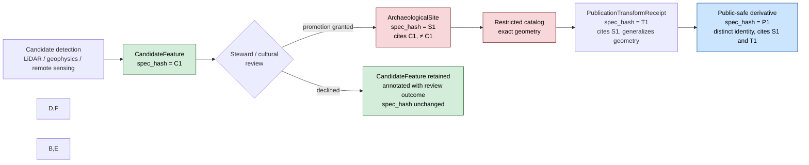
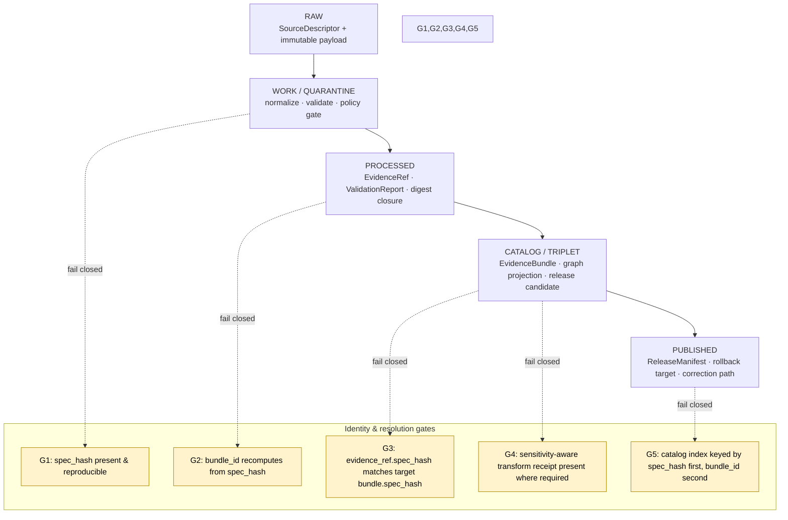

<!-- [KFM_META_BLOCK_V2]
doc_id: kfm://doc/archaeology-identity-model
title: Archaeology Domain Identity Model
type: standard
version: v1
status: draft
owners: <Archaeology domain steward — TODO> ; <Identity & Hashing steward — TODO>
created: 2026-05-15
updated: 2026-05-15
policy_label: public
related:
  - docs/doctrine/directory-rules.md
  - docs/doctrine/lifecycle-law.md
  - docs/doctrine/trust-membrane.md
  - docs/standards/PROV.md
  - docs/standards/CANONICALIZATION.md          # PROPOSED — see Open Questions
  - docs/architecture/contract-schema-policy-split.md
  - docs/domains/archaeology/README.md          # PROPOSED — sibling lane README
  - schemas/contracts/v1/domains/archaeology/   # PROPOSED — schema home
  - policy/domains/archaeology/                 # PROPOSED — policy lane
tags: [kfm, archaeology, identity, evidence, spec_hash, governance]
notes:
  - Identity rule for every Archaeology object family is PROPOSED v1 in [DOM-ARCH] §E.
  - Canonical spec_hash via RFC 8785 JCS + SHA-256 is CONFIRMED [C1-02].
  - bundle_id / evidence_ref_id derivation shown here is PROPOSED v1 [New Ideas 5-8-26].
[/KFM_META_BLOCK_V2] -->

# Archaeology Domain Identity Model

> How an Archaeology object earns a stable, deterministic, sensitivity-aware identifier across the RAW → WORK / QUARANTINE → PROCESSED → CATALOG / TRIPLET → PUBLISHED lifecycle — and how a client resolves an `EvidenceRef` to its `EvidenceBundle` without trusting mutable paths, timestamps, or environment.


**Status:** draft · **Owners:** Archaeology steward · Identity steward (placeholders, pending CODEOWNERS verification) · **Last updated:** 2026-05-15

---

## Mini-TOC

1. [Purpose & scope](#1-purpose--scope)
2. [Identity invariants](#2-identity-invariants)
3. [Identity composition formula](#3-identity-composition-formula)
4. [`spec_hash`, `bundle_id`, `evidence_ref_id`](#4-spec_hash-bundle_id-evidence_ref_id)
5. [Object-family identity table](#5-object-family-identity-table)
6. [Sensitivity-aware identity](#6-sensitivity-aware-identity)
7. [Temporal handling in identity](#7-temporal-handling-in-identity)
8. [Candidate vs. Confirmed](#8-candidate-vs-confirmed)
9. [Cross-lane identity preservation](#9-cross-lane-identity-preservation)
10. [Resolution path & lifecycle gates](#10-resolution-path--lifecycle-gates)
11. [Failure modes & required behavior](#11-failure-modes--required-behavior)
12. [Validators, tests, fixtures](#12-validators-tests-fixtures)
13. [Governed AI behavior on identity](#13-governed-ai-behavior-on-identity)
14. [Verification backlog & open questions](#14-verification-backlog--open-questions)
15. [Related docs](#15-related-docs)

---

## 1. Purpose & scope

**Purpose.** This document specifies how every Archaeology object — site, survey, feature, candidate, transform receipt, evidence bundle — earns a deterministic, content-derived identity that survives reruns, environment differences, and path changes; and how that identity interacts with the Archaeology domain's deny-by-default sensitivity posture.

**Scope (CONFIRMED doctrine / PROPOSED implementation).**

- **In scope.** Identity rule, identity composition fields, canonical hashing, ID derivation, resolution path, sensitivity coupling, candidate-vs-confirmed identity discipline, temporal-key separation, and cross-lane identity preservation — for the object families owned by the Archaeology lane: `ArchaeologicalSite`, `SiteComponent`, `CulturalTemporalPeriod`, `SurveyProject`, `SurveyTransect`, `ShovelTest`, `TestUnit`, `ExcavationUnit`, `ProvenienceContext`, `StratigraphicUnit`, `ArtifactRecord`, `CollectionRepositoryRecord`, `CandidateFeature`, and `PublicationTransformReceipt`. [DOM-ARCH §C–E, Atlas v1.1 pp. 97–101]
- **Out of scope.** Field-level schema shape (lives in `schemas/contracts/v1/domains/archaeology/` — **PROPOSED** home, pending mounted-repo verification), policy admissibility outcomes (lives in `policy/domains/archaeology/` — **PROPOSED** home), publication state transitions (governed by `release/`), and 3D representation receipts (renderer-level; consume the same identity but do not define it).

> [!IMPORTANT]
> Identity is **a property of the content**, not of the file or the run. Two files with the same canonical content **must** produce the same identity; the same logical content reformatted **must not** rotate IDs. This is the load-bearing claim every gate in this document depends on.

[Back to top ↑](#archaeology-domain-identity-model)

---

## 2. Identity invariants

The Archaeology identity model is bound by the following invariants. They are derived from KFM core invariants and the Archaeology lane atlas; they are **not** local conveniences.

| # | Invariant | Status | Citation |
|---|---|---|---|
| I-1 | Identity is deterministic across runs, machines, and serializers. | **CONFIRMED** doctrine / **PROPOSED** implementation | [C1-02], [New Ideas 5-8-26 §D2] |
| I-2 | Identity derives only from the normalized spec; no environment entropy (timestamps, URLs, signatures, nonces) participates. | **CONFIRMED** doctrine | [C1-02], [New Ideas 5-8-26 §D1] |
| I-3 | Promotion is a governed state transition, not a file move; identity persists across lifecycle phases for the same evidentiary content. | **CONFIRMED** doctrine | [DIRRULES §0, §12], [DOM-ARCH §H] |
| I-4 | `EvidenceRef` must resolve to `EvidenceBundle` whose `spec_hash` matches the ref's `spec_hash`. Any mismatch fails closed. | **CONFIRMED** doctrine / **PROPOSED** implementation | [New Ideas 5-8-26 §D3–D4] |
| I-5 | Sensitive Archaeology geometry is **denied by default**; sensitivity transforms produce **new** identities, not aliases of the exact geometry. | **CONFIRMED** doctrine | [DOM-ARCH §I], [ENCY §13 Sensitive / Deny-by-Default Register] |
| I-6 | `CandidateFeature` identities are categorically distinct from `ArchaeologicalSite` identities. A candidate is never a site by identity coincidence. | **CONFIRMED** doctrine | [DOM-ARCH §C, K], [ENCY 7.13.D] |
| I-7 | Source, observed, valid, retrieval, release, and correction times remain distinct in the identity envelope where material. | **CONFIRMED** doctrine | [Atlas v1.1 pp. 99–100] |
| I-8 | Identity outputs are reconstructable offline from a canonicalizable spec. No network access is required to verify. | **CONFIRMED** doctrine | [New Ideas 5-8-26 §5 T1–T8] |

[Back to top ↑](#archaeology-domain-identity-model)

---

## 3. Identity composition formula

> [!NOTE]
> The composition below is the **PROPOSED** v1 binding for the Archaeology lane. The Atlas v1.1 records the formula as `source id + object role + temporal scope + normalized digest` for every Archaeology object family (CONFIRMED term / PROPOSED field realization). [Atlas v1.1 p. 99]

```text
identity_seed(obj) :=
    canonical_spec({
        object_type      : <e.g., "ArchaeologicalSite" | "SurveyTransect" | ...>,
        schema_version   : "v1",
        source_id        : <SourceDescriptor.id>,            # WHO authored the evidence
        object_role      : <authority | observation | context | model>,  # WHAT role this evidence plays
        temporal_scope   : {                                 # WHEN it applies, distinct from when it was retrieved/released
            source_time      : <ISO-8601 | range | null>,
            observed_time    : <ISO-8601 | range | null>,
            valid_time       : <ISO-8601 | range | null>
        },
        evidence_refs    : [ <er-...>, ... ],                # closure into prior evidence
        object_refs      : [ <er-...> | <eb-...>, ... ],
        rights_status    : <kfm rights label>,
        sensitivity      : <kfm sensitivity class>,          # archaeology-specific: see §6
        policy_label     : <public | restricted | steward-only | ...>,
        # archaeology-aware fields that change evidentiary meaning:
        cultural_review_state : <none | requested | reviewed | declined>,
        steward_org           : <CARE: institutional steward, where applicable>,
        authority_to_control  : <CARE: community/body governing the asset>,
        transform_profile     : <only present on PublicationTransformReceipt>
    })

spec_hash(obj) := "jcs:sha256:" + hex( SHA-256( JCS_canonicalize( identity_seed(obj) ) ) )
```

**Excluded from the hash (transient / non-evidentiary):** timestamps of *retrieval*, *release*, and *correction*; storage URLs; mutable file paths; signing envelopes; orchestrator nonces; build SHAs. These travel in the `RunReceipt` and the release envelope, **not** in the identity. [C1-02], [New Ideas 5-8-26 §D1]

```mermaid
flowchart LR
    A[Source payload<br/>+ SourceDescriptor] --> B[Normalize<br/>schema · geometry · time · identity]
    B --> C{Compose identity_seed<br/>source_id · object_role · temporal_scope · evidence/rights/sensitivity}
    C --> D[JCS canonicalize<br/>RFC 8785]
    D --> E[SHA-256 digest]
    E --> F[spec_hash = jcs:sha256:&lt;hex&gt;]
    F --> G[bundle_id<br/>eb-base32(SHA-256(spec_hash))]
    F --> H[evidence_ref_id<br/>er-base32(SHA-256(target_spec_hash))]
    G --> I[(Catalog index<br/>keyed by spec_hash first,<br/>bundle_id second)]
    H --> I
    classDef note fill:#fff3cd,stroke:#b08800,color:#000
    F:::note
```

<sub>Diagram status: **PROPOSED** — depicts the v1 identity pipeline described in [New Ideas 5-8-26 §D1–D3] and [C1-02]. Awaits mounted-repo verification of validator and catalog index implementations.</sub>

[Back to top ↑](#archaeology-domain-identity-model)

---

## 4. `spec_hash`, `bundle_id`, `evidence_ref_id`

| Field | Form | Algorithm | Status | Citation |
|---|---|---|---|---|
| `spec_hash` | `"jcs:sha256:<hex>"` | RFC 8785 JCS canonicalization → SHA-256 | **CONFIRMED** (algorithm & form) | [C1-02], [C8-05] |
| `bundle_id` | `"eb-" + base32(lowercase(SHA-256(spec_hash)))[:26]` | SHA-256 over `spec_hash` bytes, base32, truncate | **PROPOSED** v1 | [New Ideas 5-8-26 §D2] |
| `evidence_ref_id` | `"er-" + base32(lowercase(SHA-256(target_bundle_spec_hash)))[:26]` | Same derivation pattern as `bundle_id`, keyed by the target's `spec_hash` | **PROPOSED** v1 | [New Ideas 5-8-26 §D2] |
| RDF-canonical alt | URDNA2015 → SHA-256, recorded separately in the receipt | URDNA2015 normalization of RDF datasets | **CONFIRMED** alternative for graph documents only; **JCS is the KFM default** | [C1-02], [C8-05] |

> [!CAUTION]
> JCS and URDNA2015 can produce **different** hashes for the same logical content because JSON-LD round-tripping is not an identity transformation. [C8-05] The Archaeology lane MUST default to JCS for `spec_hash`. If an Archaeology bundle is co-published as an RDF graph (e.g., for federated SPARQL), URDNA2015 may be recorded **alongside** `spec_hash`, never in place of it. The choice MUST be recorded in the `RunReceipt`.

**Hash algorithm stability.** `SHA-256` is fixed for v1. Migration to a different hash function (e.g., BLAKE3) requires an ADR and a dual-hash compatibility window. [New Ideas 5-8-26 §D5]

**Note on BLAKE3.** The KFM project uses BLAKE3 for *fast integrity hashing of large tile artifacts* (e.g., PMTiles root hash, byte-range manifests) inside the publication layer. BLAKE3 is **not** the identity-fingerprint algorithm for Archaeology objects; `spec_hash` (JCS + SHA-256) is. The two coexist with distinct roles — one fingerprints *meaning*, the other fingerprints *bytes-on-the-wire*. [PMTILES sidecar conventions; New Ideas 5-8-26 PMTiles section]

[Back to top ↑](#archaeology-domain-identity-model)

---

## 5. Object-family identity table

> **Note on rows.** Every row carries the same v1 composition formula. The "Identity notes" column captures the lane-specific nuance — what makes a `SurveyTransect` identity different in practice from a `CandidateFeature` identity, even though both are formally `source_id + object_role + temporal_scope + normalized_digest`.

| Object family | Object role(s) typically | Identity-distinguishing fields beyond formula | Identity notes (PROPOSED) |
|---|---|---|---|
| `ArchaeologicalSite` | authority / observation | site identifier from source registry; cultural review state; sensitivity class | **Exact-geometry sites and public-safe generalizations are distinct identities.** A published derivative carries a `PublicationTransformReceipt` link, not a path alias. |
| `SiteComponent` | observation / context | parent site `spec_hash` reference; component role | Composes upward: the component identity closes over its parent site's `spec_hash`. |
| `CulturalTemporalPeriod` | authority / context | period source; chronology reference | Temporal scope often carries calibrated-range uncertainty; the calibration choice **is** evidentiary and participates in the hash. |
| `SurveyProject` | authority | project id; coverage geometry hash | Distinct from individual transects; a survey's identity does not change because new transects are added — those transects get their own identities. |
| `SurveyTransect` | observation | parent `SurveyProject` `spec_hash`; transect index | Coverage identity, not feature identity. |
| `ShovelTest` / `TestUnit` / `ExcavationUnit` | observation | parent excavation context; provenience reference | Provenience binding is identity-bearing; orphaned provenience fails closed. |
| `ProvenienceContext` | context | excavation context id; stratigraphic position | Establishes the spatial-stratigraphic key for artifact attribution. |
| `StratigraphicUnit` | context | unit id; relations to adjacent units | Identity closure over relation set; reinterpretation rotates identity. |
| `ArtifactRecord` | observation | accession id; collection repository reference | Identity must close over `CollectionRepositoryRecord` for chain-of-custody. |
| `CollectionRepositoryRecord` | authority | repository id; accession id | Used as anchor for artifact identity closure. |
| `CandidateFeature` | observation / model | detection method; model spec hash; confidence band | **Never aliases an `ArchaeologicalSite`** — see §8. A candidate becomes a site only via a separate, reviewed promotion that mints a new site identity. |
| `PublicationTransformReceipt` | model / context | source `spec_hash`; transform profile; generalization parameters; sensitivity class | The transform receipt is its own evidentiary object with its own identity. Its existence is what makes a public-safe derivative admissible. |

<sub>All identity rules above are **PROPOSED** v1 realizations of the CONFIRMED Atlas v1.1 composition basis (`source id + object role + temporal scope + normalized digest`). [Atlas v1.1 pp. 99–101]</sub>

[Back to top ↑](#archaeology-domain-identity-model)

---

## 6. Sensitivity-aware identity

Archaeology is one of the **deny-by-default** lanes in the KFM Sensitivity Matrix. Identity must be a participant in that posture, not an exception to it.

| Sensitive class (Archaeology) | Default outcome | Identity implication |
|---|---|---|
| Exact site coordinates | **DENY** public release by default | The exact-geometry bundle gets an identity in restricted catalog only; no public alias points to it. [ENCY §13] |
| Burial / human remains | **DENY** | Identity exists only inside steward-only review surface; no public derivative. [DOM-ARCH §I] |
| Sacred / culturally sensitive places | **DENY** until cultural / steward review | Even existence of an identity may be restricted; surface only generalized siblings linked through `PublicationTransformReceipt`. [ENCY §13] |
| Looting-risk detail | **DENY** | As above. |
| Generalized public derivative | **ALLOW** only when supported by steward review, transform receipt, and EvidenceBundle | Carries a **distinct identity** linked to (but not equal to) the restricted source identity. [DOM-ARCH §I; ENCY §13] |

> [!WARNING]
> A public-safe Archaeology derivative MUST NOT share identity with its restricted source. The transform from exact to generalized geometry is **identity-rotating** by design. Reusing the source identity on a derivative would let a public consumer reverse-resolve the restricted record. The `PublicationTransformReceipt` is the bridge — it cites both identities and records the transform profile (e.g., the H3 floor used, the suppression rule applied).

**Geometric floor (PROPOSED, sourced).** Any geometry below H3 resolution r7 is prohibited for sensitive Archaeology products without review. [Master MapLibre Components, ML-061-159, SRC-061 pp. 228–229] This floor is a **policy threshold** that the publication transform must respect; identity for any sub-r7 sensitive object lives in the restricted catalog only.

**CARE-aligned fields (PROPOSED).** Where CARE applies (Indigenous, culturally sensitive, or sovereignty-implicating evidence), the `steward_org`, `authority_to_control`, `consent`, `obligations`, and `benefit_commitments` fields from MetaBlock v2 SHOULD participate in the identity seed where they change evidentiary meaning. Omitting these fields on a CARE-applicable asset is a policy violation independent of identity. [C15-01, MetaBlock v2]

[Back to top ↑](#archaeology-domain-identity-model)

---

## 7. Temporal handling in identity

The Atlas v1.1 records temporal handling for every Archaeology object family as CONFIRMED: **source, observed, valid, retrieval, release, and correction times stay distinct where material.** [Atlas v1.1 p. 99–100]

| Time field | In identity seed? | Rationale |
|---|---|---|
| `source_time` | **Yes** | Changes evidentiary meaning. |
| `observed_time` | **Yes, where material** | E.g., a re-survey of the same site is a new observation with new identity. |
| `valid_time` | **Yes, where material** | A revised cultural-period attribution is a new claim. |
| `retrieval_time` | **No** | Transport metadata; lives in `RunReceipt`. |
| `release_time` | **No** | Governance metadata; lives in `ReleaseManifest`. |
| `correction_time` | **No** (lives on `CorrectionNotice`) | A correction rotates identity through the *content change* that motivates it, not through the correction timestamp. |

> [!TIP]
> Reinterpretation rotates identity. If a cultural-temporal-period attribution for a feature changes from "Middle Ceramic" to "Late Prehistoric" because a new lab report supports the revision, the resulting object has a new `spec_hash`. The previous identity does not vanish — it remains catalogued and is linked from the `CorrectionNotice` so the audit chain stays intact. [ENCY 7.13.H, DOM-ARCH §M]

[Back to top ↑](#archaeology-domain-identity-model)

---

## 8. Candidate vs. Confirmed

The Archaeology lane explicitly distinguishes `CandidateFeature` (e.g., a LiDAR or geophysics anomaly) from `ArchaeologicalSite` (a reviewed, confirmed site). The identity model is what mechanically enforces that distinction.

- `CandidateFeature.object_type` is `"CandidateFeature"`, never `"ArchaeologicalSite"`. The two values normalize to different bytes under JCS, so their `spec_hash` values differ even when other fields coincide.
- Promotion from candidate to site is a **governed state transition** — it mints a *new* `ArchaeologicalSite` identity backed by an `EvidenceBundle` that **cites** the original `CandidateFeature.spec_hash` but does not equal it. [DOM-ARCH §K, ENCY 7.13.D]
- Public-facing summaries of candidate clusters MUST be labeled as generalized cultural-activity zones, not as precise archaeological sites. [Master MapLibre ML-061-163, SRC-061 pp. 340–344]



[Back to top ↑](#archaeology-domain-identity-model)

---

## 9. Cross-lane identity preservation

Archaeology cites and is cited by other lanes. Across every edge, ownership, source role, sensitivity, and `EvidenceBundle` support MUST be preserved. [Atlas v1.1 §F Cross-lane relations]

| Adjacent lane | Relation | Identity rule |
|---|---|---|
| Spatial Foundation | Exact / public geometry split via transform receipts | Each generalized derivative has its own identity; never reuse the exact-geometry identity. [DOM-ARCH §F] |
| Roads / Rail | Historic routes and cultural paths | Archaeology cites road/rail object identities; never asserts road/rail truth. [DOM-ARCH §F] |
| Settlements | Forts, missions, townsites, reservation communities | Cultural-temporal-period and survey context bind interpretation; site coordinates remain denied. [Atlas v1.1 §24.4.13] |
| Hazards | Threat, erosion, fire, flood, exposure context | Hazard context cited at coarsened geometry; exact-site denial preserved. [DOM-ARCH §F] |
| People / DNA / Land | Indigenous community context | Steward-reviewed, rights-bounded; cultural affiliations cited with sovereignty preservation. [Atlas v1.1 §24.4.13–14] |
| Planetary / 3D | Generalized 3D site representation only, with reality-boundary note | The 3D scene consumes the same `EvidenceBundle` as 2D; it is an alternate renderer, not an alternate truth path. [DIRRULES §11, Atlas v1.1 §24.4.16] |

[Back to top ↑](#archaeology-domain-identity-model)

---

## 10. Resolution path & lifecycle gates



**Client resolution (`EvidenceRef` → `EvidenceBundle`):**

1. Read `evidence_ref.spec_hash`.
2. Look up a bundle whose `spec_hash` equals the ref's hash in the governed catalog index.
3. Recompute `bundle.bundle_id` from the same `spec_hash`. If the recomputed value differs from the stored id, **DENY** with `ResolutionError.hash_mismatch`.
4. If sensitivity rules apply to the resolved bundle and the requesting surface is public, the resolver MUST follow the transform-receipt chain and serve the **public-safe derivative**, not the restricted source. [DOM-ARCH §I; New Ideas 5-8-26 §D3]

**Publication gate.** Publication requires matching `spec_hash` at promotion time. Any mismatch triggers `ABSTAIN` (validation) or `DENY` (policy), depending on posture. [New Ideas 5-8-26 §D4]

[Back to top ↑](#archaeology-domain-identity-model)

---

## 11. Failure modes & required behavior

| # | Failure | Required outcome | Error code (PROPOSED) |
|---|---|---|---|
| F-1 | Missing bundle: `EvidenceRef` resolves to nothing | `ABSTAIN` (validator) → `DENY` (publication) | `ResolutionError.missing_bundle` |
| F-2 | Inconsistent `spec_hash`: `ref.spec_hash` ≠ `bundle.spec_hash` | `DENY` | `ResolutionError.hash_mismatch` |
| F-3 | Non-deterministic serialization: same logical spec, different canonical bytes | `ERROR` | `NormalizationError.nondeterministic_serialization` |
| F-4 | Meaning-bearing field excluded from hash | `DENY` | `NormalizationError.field_exclusion_violation` |
| F-5 | Unexpected hash algorithm tag (anything other than `jcs:sha256:`) | `DENY` | `HashAlgoUnsupported` |
| F-6 | Public surface requests a restricted-only identity directly (no transform receipt) | `DENY` | `SensitivityError.exact_geometry_denied` |
| F-7 | `CandidateFeature` identity is presented as an `ArchaeologicalSite` (e.g., type-coerced before promotion) | `DENY` | `IdentityError.candidate_promoted_unreviewed` |
| F-8 | Living-person, sacred-site, or burial fields appear in a public bundle without steward / cultural review | `DENY` | `SensitivityError.review_state_missing` |

> [!IMPORTANT]
> All eight failure modes MUST fail closed. The Archaeology lane has no "best effort" fallback for identity violations. A surface that cannot resolve an identity cleanly refuses the request and emits the corresponding receipt. [DOM-ARCH §I, ENCY §13]

[Back to top ↑](#archaeology-domain-identity-model)

---

## 12. Validators, tests, fixtures

The Archaeology validator backlog (**PROPOSED** [DOM-ARCH §K]) intersects the identity model as follows. All tests below must pass with **no network access**.

| Test ID | Purpose | Pos/Neg | Status |
|---|---|---|---|
| T1 | Round-trip determinism of `spec_hash` across {Python, TypeScript, Go} on a canonical Archaeology fixture | both | **PROPOSED** |
| T2 | Whitespace / key-ordering irrelevance: variants normalize to same `spec_hash` | pos | **PROPOSED** |
| T3 | Semantic change rotates hash (e.g., flipping `rights_status` or `cultural_review_state` rotates `spec_hash` and IDs) | pos | **PROPOSED** |
| T4 | Resolution happy path: `EvidenceRef.spec_hash` → catalog lookup → bundle match → recomputed `bundle_id` equals stored id → `ANSWER` | pos | **PROPOSED** |
| T5 | Missing bundle → `ABSTAIN` / `DENY` with `ResolutionError.missing_bundle` | neg | **PROPOSED** |
| T6 | Hash mismatch → `DENY` with `ResolutionError.hash_mismatch` | neg | **PROPOSED** |
| T7 | Cross-run stability on different machines / containers → identical `spec_hash` and IDs | pos | **PROPOSED** |
| T8 | Algorithm-tag enforcement: non-`jcs:sha256:` input → `DENY` with `HashAlgoUnsupported` | neg | **PROPOSED** |
| T9 (Archaeology-specific) | Exact-geometry site identity NEVER served through public surface; only its `PublicationTransformReceipt`-bridged derivative is | neg | **PROPOSED** |
| T10 (Archaeology-specific) | `CandidateFeature` and `ArchaeologicalSite` for the same physical location yield distinct `spec_hash` values | pos | **PROPOSED** |
| T11 (Archaeology-specific) | Generalization to H3 < r7 for sensitive site is denied by validator | neg | **PROPOSED** |
| T12 (Archaeology-specific) | Cultural-review-state change (e.g., declined → reviewed) rotates `spec_hash` | pos | **PROPOSED** |

<details>
<summary><b>Reference fixture skeleton (illustrative)</b></summary>

```json
{
  "object_type": "ArchaeologicalSite",
  "schema_version": "v1",
  "source_id": "src:khri:site:14XX0001",
  "object_role": "authority",
  "temporal_scope": {
    "source_time": "1978-06-14",
    "observed_time": "1978-06-14",
    "valid_time": null
  },
  "evidence_refs": ["er-xxxxxxxxxxxxxxxxxxxxxxxxxx"],
  "object_refs": [],
  "rights_status": "restricted",
  "sensitivity": "site-coordinates",
  "policy_label": "steward-only",
  "cultural_review_state": "reviewed",
  "steward_org": "<TODO: steward org identifier>",
  "authority_to_control": "<TODO: where applicable>"
}
```

Status: **illustrative only**. Field names follow the Archaeology Atlas terminology and the C1-02 identity scheme; exact schema home (`schemas/contracts/v1/domains/archaeology/`) is **PROPOSED** pending mounted-repo verification.

</details>

<details>
<summary><b>Reference verifier responsibilities (illustrative, no path commitment)</b></summary>

A canonical Archaeology identity verifier MUST, at minimum:

1. Canonicalize the spec via RFC 8785 JCS.
2. Compute `SHA-256` over the canonical bytes; format as `jcs:sha256:<hex>`.
3. Derive `bundle_id` per §4 and compare against any stored `bundle_id`.
4. Walk every `evidence_ref` and confirm each ref's `spec_hash` resolves to a bundle in the governed index.
5. Refuse the bundle if any sensitivity class is present without the corresponding review state or transform receipt.
6. Emit a deterministic verifier receipt — never write to the catalog directly. (Watcher-as-non-publisher invariant. [DIRRULES §13])

The proposed validator home is `tools/validators/evidence/validate_identity.py` (**PROPOSED**, **NEEDS VERIFICATION**) per [New Ideas 5-8-26 §6]. The Archaeology-specific extensions (T9–T12) would live as sibling validators under the same `tools/validators/evidence/` tree, not as a parallel Archaeology validator root. [DIRRULES §12]

</details>

[Back to top ↑](#archaeology-domain-identity-model)

---

## 13. Governed AI behavior on identity

Governed AI is interpretive, not the root truth source. For identity questions:

- AI **MAY** summarize released Archaeology `EvidenceBundle` content, compare evidence, explain identity-resolution outcomes, and draft steward-review notes that cite `spec_hash` values it has observed in released bundles.
- AI **MUST ABSTAIN** when an `EvidenceRef` cannot be resolved, when `spec_hash` mismatch is detected, or when the user asks for exact-site identification absent steward authorization.
- AI **MUST DENY** when policy, rights, sensitivity, or release state blocks the request — including any request that would surface a restricted Archaeology identity through a public path.
- AI **MUST NOT** synthesize or guess `spec_hash`, `bundle_id`, or `evidence_ref_id` values. Identifiers are reproducible from canonical content only.

[DOM-ARCH §L, GAI doctrine]

[Back to top ↑](#archaeology-domain-identity-model)

---

## 14. Verification backlog & open questions

| Item | Evidence that would settle it | Status |
|---|---|---|
| Verify mounted-repo home for the Archaeology identity validator (proposed: `tools/validators/evidence/validate_identity.py`) | Mounted repo file presence + `pytest` run | **NEEDS VERIFICATION** |
| Verify schema home for Archaeology object families (proposed: `schemas/contracts/v1/domains/archaeology/`) per ADR-0001 | Mounted repo schema files + registry entry | **NEEDS VERIFICATION** |
| Confirm canonical home for JCS / URDNA2015 decision matrix (proposed: `docs/standards/CANONICALIZATION.md`) | Mounted doc file + ADR linkage | **NEEDS VERIFICATION** |
| Confirm CARE field set participating in `identity_seed` for Archaeology | MetaBlock v2 schema + Archaeology profile fixtures | **NEEDS VERIFICATION** |
| Define public-geometry threshold profile beyond H3 r7 (e.g., per-source overrides) | Steward review record + policy file | **NEEDS VERIFICATION** |
| Verify cultural / oral-history identity protocol (sovereignty review chain) | Mounted policy + review-record schema | **NEEDS VERIFICATION** |
| Verify emergency public-layer disablement and rollback drill for Archaeology releases | `release/`+ rollback drill artifacts | **NEEDS VERIFICATION** |
| Decide whether `bundle_id` truncation at 26 base32 chars is sufficient for the long-term Archaeology catalog cardinality | Cardinality analysis + collision-resistance memo | **OPEN QUESTION** |
| Decide whether `RunReceipt` carries OpenLineage `run_id` by value or by reference | ADR | **OPEN QUESTION** (cross-cut, [C1-01]) |

[Back to top ↑](#archaeology-domain-identity-model)

---

## 15. Related docs

- `docs/doctrine/directory-rules.md` — placement and authority law (Archaeology is a lane, never a root). [CONFIRMED]
- `docs/doctrine/lifecycle-law.md` — RAW → WORK / QUARANTINE → PROCESSED → CATALOG / TRIPLET → PUBLISHED. **PROPOSED** path.
- `docs/doctrine/trust-membrane.md` — public surface vs. canonical store separation. **PROPOSED** path.
- `docs/standards/PROV.md` — W3C PROV-O / PAV provenance standards as crosswalk targets.
- `docs/standards/CANONICALIZATION.md` — JCS vs. URDNA2015 decision matrix. **PROPOSED** — see [C1-02 expansion direction].
- `docs/architecture/contract-schema-policy-split.md` — separation of meaning, shape, and admissibility. **PROPOSED** path.
- `docs/domains/archaeology/README.md` — Archaeology lane landing page (sibling). **PROPOSED**.
- `docs/registers/VERIFICATION_BACKLOG.md` — KFM-wide verification queue. **PROPOSED** path.

---

<sup>**Last updated:** 2026-05-15 · **Doc id:** `kfm://doc/archaeology-identity-model` · **Identity scheme version:** v1 (PROPOSED) · [Back to top ↑](#archaeology-domain-identity-model)</sup>
