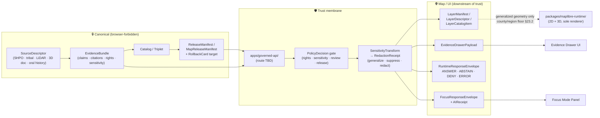
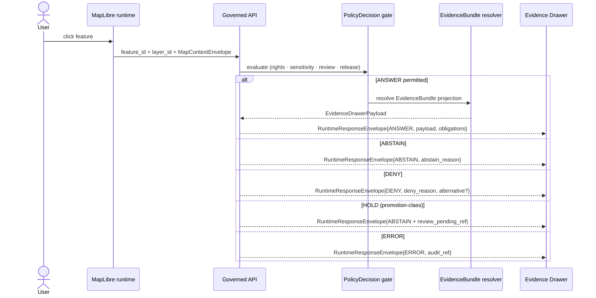

<!-- [KFM_META_BLOCK_V2]
doc_id: kfm://doc/archaeology-map-ui-contracts
title: Archaeology — Map / UI Contracts
type: standard
version: v0.3
status: draft
owners: TODO/REVIEW — Archaeology domain steward · Map shell steward · Governed AI surface steward · Sensitivity reviewer · Rights-holder representative
created: 2026-05-15
updated: 2026-05-29
policy_label: public
contract_version: "3.0.0"
related:
  - docs/doctrine/ai-build-operating-contract.md
  - docs/doctrine/directory-rules.md
  - docs/doctrine/trust-membrane.md
  - docs/doctrine/authority-ladder.md
  - docs/domains/archaeology/README.md
  - docs/domains/archaeology/SENSITIVITY.md
  - docs/domains/archaeology/MISSING_OR_PLANNED_FILES.md
  - docs/architecture/ui/README.md
  - docs/architecture/ui/LAYERING.md
  - docs/architecture/governed-ai/README.md
  - docs/architecture/governed-api.md
  - docs/architecture/map-shell.md
  - docs/architecture/maplibre-3d.md
  - docs/atlases/domains-v1.1/ch15-archaeology.md
  - docs/atlases/domains-v1.1/ch24-5-sensitivity-tier-reference.md
  - contracts/domains/archaeology/
  - schemas/contracts/v1/domains/archaeology/
  - policy/domains/archaeology/
  - policy/sensitivity/archaeology/
tags: [kfm, archaeology, map, ui, contracts, governed-ai, sensitivity, evidence, doctrine]
notes:
  - CONTRACT_VERSION pinned to 3.0.0 per ai-build-operating-contract.md §0 / §37.
  - Repository not mounted in this session; every concrete path is PROPOSED, CONFIRMED-via-doctrine, or NEEDS VERIFICATION as labeled.
  - v0.3 corrects the two residual "Directory Rules §12 (v1.2)" references to the live v1.3 edition; reconciles the geometry-generalization floor with operating contract §23.2 (county/region); and relabels HOLD as a promotion-class state rather than a contract §22.2 runtime outcome.
  - v0.3 is a MINOR bump per contract §37 (clarifications, reconciliations; no breaking anchor or schema changes; §§1–19 anchors preserved).
  - GENERATED_RECEIPT.json planned for repo-bound merge per contract §34.
[/KFM_META_BLOCK_V2] -->

# Archaeology — Map / UI Contracts

> The governed surfaces and payload contracts that bind the Archaeology lane to the Map shell, the Evidence Drawer, the time-aware UI, and Focus Mode — with sensitivity, rights, sovereignty, review state, and release state visible at every boundary.


**Status:** `draft` · **Owners:** _TODO/REVIEW_ — Archaeology domain steward · Map shell steward · Governed AI surface steward · Sensitivity reviewer · Rights-holder representative · **Last updated:** 2026-05-29 · **Operating contract:** `ai-build-operating-contract.md` v3.0.0 · **Directory Rules:** v1.3

> [!IMPORTANT]
> This document is **doctrine-grade for trust rules** and **PROPOSED for implementation surfaces**. The repository is **not mounted** in this session, so every concrete path, route name, package home, and DTO field list below is either **CONFIRMED via cited doctrine** (Directory Rules §6.1 / §12; operating contract §9 / §22 / §23) or **PROPOSED / NEEDS VERIFICATION** until verified against the live repo and relevant ADRs. Schema authority defaults to `schemas/contracts/v1/...` per ADR-0001.

---

## 📑 Contents

1. [Purpose & scope](#1-purpose--scope)
2. [Repo fit & authority basis](#2-repo-fit--authority-basis)
3. [Trust-membrane diagram](#3-trust-membrane-diagram)
4. [Contracts inventory](#4-contracts-inventory)
5. [Map layer contracts](#5-map-layer-contracts)
6. [Click-resolution & Evidence Drawer contracts](#6-click-resolution--evidence-drawer-contracts)
7. [Time-aware contracts](#7-time-aware-contracts)
8. [Focus Mode contracts (governed AI)](#8-focus-mode-contracts-governed-ai)
9. [Sensitivity tiers, geometry, and CARE controls](#9-sensitivity-tiers-geometry-and-care-controls)
10. [Trust-visible UI states](#10-trust-visible-ui-states)
11. [Finite outcomes & policy decisions](#11-finite-outcomes--policy-decisions)
12. [Validation, tests, and fixtures](#12-validation-tests-and-fixtures)
13. [Anti-patterns (must-not-do)](#13-anti-patterns-must-not-do)
14. [Open questions register](#14-open-questions-register)
15. [Open verification backlog](#15-open-verification-backlog)
16. [Changelog](#16-changelog)
17. [Definition of done](#17-definition-of-done)
18. [Related docs](#18-related-docs)
19. [Appendix](#19-appendix)

---

## 1. Purpose & scope

**Purpose.** This document defines the **contracts** — the DTOs, payload shapes, finite outcomes, and trust obligations — that the **Archaeology** lane exposes to KFM's **Map shell** and **UI surfaces** (catalog, popups, Evidence Drawer, time slider, Focus Mode, exports). It is the per-domain elaboration of cross-cutting Whole-UI / Governed-AI contracts; cross-cutting definitions live in their architecture homes, **not here**.

**Scope (in).**

- Domain-specific shape of `LayerManifest`, `LayerCatalogItem`, `LayerDescriptor`, `MapReleaseManifest`, `EvidenceDrawerPayload`, `RuntimeResponseEnvelope` (Archaeology projection), `FocusRequestEnvelope` / `FocusResponseEnvelope`, and related projections **as they apply to Archaeology**.
- Sensitivity, geometry-generalization, rights, sovereignty, and review obligations carried across every Map/UI boundary, expressed in the canonical **T0–T4 tier scheme** (Atlas v1.1 §24.5).
- The finite outcome grammar (`ANSWER` / `ABSTAIN` / `DENY` / `ERROR`, plus optional `NARROWED` / `BOUNDED`, the promotion-class `HOLD`, and validator-class `PASS` / `FAIL`) and the obligations that accompany each.
- Cross-references to the validators, tests, fixtures, and receipts that prove these contracts hold.

**Scope (out).**

- Cross-cutting DTO definitions — those belong under `docs/architecture/ui/`, `docs/architecture/governed-ai/`, and `contracts/`.
- Map renderer internals, MapLibre runtime-adapter wiring, plugin-host construction — see `docs/architecture/maplibre-3d.md` and `packages/maplibre-runtime/`.
- Ingestion, source-descriptor lifecycle, and `RAW → PROCESSED` transforms — see the domain README and `data/registry/sources/archaeology/`.
- Schema files themselves — those live under `schemas/contracts/v1/...`. This doc references them; it does not own them.

> [!NOTE]
> **CONFIRMED doctrine.** Public clients and normal UI surfaces use **governed APIs and released payloads only**. No browser path reads canonical or candidate stores. Maps, tiles, popups, and AI text are downstream of the trust membrane — never substitutes for it. Source: `ai-build-operating-contract.md` §22.3; Atlas §24.9.

[⬆ Back to top](#archaeology--map--ui-contracts)

---

## 2. Repo fit & authority basis

| Concern | Where it lives | Status |
|---|---|---|
| This doc | `docs/domains/archaeology/MAP_UI_CONTRACTS.md` | placement **CONFIRMED** (Directory Rules §6.1 lists `docs/domains/<domain>/`); filename casing follows the topical UPPERCASE convention |
| Operating contract | `docs/doctrine/ai-build-operating-contract.md` | **CONFIRMED** (doctrine); v3.0.0 pinned |
| Directory Rules | `docs/doctrine/directory-rules.md` | **CONFIRMED** (doctrine); **v1.3** active (MapLibre sole-renderer pending §18.e OPEN-DR-10) |
| Domain meaning (Markdown) | `contracts/domains/archaeology/` | **PROPOSED** placement per §12 Domain Placement Law; conflicts with Atlas §24.13 plain `contracts/archaeology/` — see OQ-AR-02 |
| Machine schemas (JSON Schema) | `schemas/contracts/v1/domains/archaeology/` | **PROPOSED** per ADR-0001 default + §12 Domain Placement Law; Atlas §24.13 uses plain `schemas/contracts/v1/archaeology/` — see OQ-AR-02 |
| Sensitivity & rights policy | `policy/domains/archaeology/` and `policy/sensitivity/archaeology/` | **PROPOSED** placement per §6.5; Atlas §24.13 lists `policy/sensitivity/archaeology/` only — see OQ-AR-03 |
| Fixtures (valid / invalid) | `tests/fixtures/domains/archaeology/` _or_ `fixtures/domains/archaeology/` | **NEEDS VERIFICATION** — Directory Rules §6.6 names both `tests/` and `fixtures/` and forbids two competing homes unless the README states the difference; the home for negative-case fixtures is OPEN |
| Tests (positive / negative) | `tests/domains/archaeology/` | **PROPOSED** |
| Governed API routes | `apps/governed-api/` (exact routes **UNKNOWN**) | **PROPOSED** |
| Map shell | `apps/explorer-web/` + `packages/ui/` + `packages/maplibre-runtime/` | **PROPOSED** per Directory Rules §13.x (v1.3 retires `packages/maplibre/` and any `packages/cesium*` — see §18.e OPEN-DR-10) |

**Directory Rules basis.**

- Per `directory-rules.md` **§6.1**, `docs/domains/archaeology/` is the **CONFIRMED** canonical home for domain-facing prose.
- Per **§12 (Domain Placement Law)**, the domain name MUST appear as a **segment** inside each responsibility root — never as a root folder. Domain segments live under `docs/domains/`, `contracts/domains/`, `schemas/contracts/v1/domains/`, `policy/domains/`, `tests/domains/`, `fixtures/domains/`, `data/<phase>/<domain>/`, etc.
- Per **§11 / §13.x** (v1.3), the public shell consolidates under `apps/explorer-web/`, `packages/ui/`, and **`packages/maplibre-runtime/`** (sole governed renderer adapter; supersedes v1.2 `packages/maplibre/` + retired `packages/cesium/` per §18.e OPEN-DR-10).

> [!CAUTION]
> **Known doctrine drift — `domains/` segment.** Atlas v1.1 §24.13 lists schema, contract, and policy homes **without** the `domains/` segment (e.g., `schemas/contracts/v1/archaeology/`, `contracts/archaeology/`, `policy/sensitivity/archaeology/`). Directory Rules **§12 (v1.3)** explicitly requires the segment (`schemas/contracts/v1/domains/archaeology/`). Per the Authority Ladder, Directory Rules governs placement; the conflict is a drift candidate for `docs/registers/DRIFT_REGISTER.md`. This doc adopts the §12 form and flags the conflict at **OQ-AR-02**.

[⬆ Back to top](#archaeology--map--ui-contracts)

---

## 3. Trust-membrane diagram

The diagram renders the **CONFIRMED doctrine** flow: canonical archaeology evidence is never read directly by the browser; the **governed API** resolves a finite `RuntimeResponseEnvelope` that carries the `EvidenceBundle` projection, the `PolicyDecision`, and any required obligations (CARE chip, sovereignty notice, `RedactionReceipt` reference) before pixels or text reach the client.



> [!NOTE]
> **Diagram status:** illustrative of doctrine; arrows reflect responsibility, not file paths. Final route names, package boundaries, and adapter wiring are **PROPOSED / NEEDS VERIFICATION** until the repo is inspected. The MapLibre sole-renderer posture is **PROPOSED** pending Directory Rules §18.e **OPEN-DR-10** acceptance. The geometry floor shown is the operating contract §23.2 **county/region** floor; any tighter H3-cell floor is a lane-local PROPOSED refinement (see [§9.2](#9-sensitivity-tiers-geometry-and-care-controls)).

[⬆ Back to top](#archaeology--map--ui-contracts)

---

## 4. Contracts inventory

The contracts below are the **Archaeology lane's projection** of cross-cutting DTOs. Each row carries the truth label that applies to its **implementation maturity**; the **shape doctrine** (what the object is for) is **CONFIRMED** across the project per the operating-contract glossary (§9) and Atlas §24.2.

| Contract | Purpose in Archaeology lane | PROPOSED schema home | Truth label |
|---|---|---|---|
| `RuntimeResponseEnvelope` (Archaeology projection) | Finite outcome wrapper for archaeology feature / detail, layer-manifest, drawer, and Focus Mode responses | `schemas/contracts/v1/runtime/runtime_response_envelope.schema.json` (domain-discriminated payload) | shape **CONFIRMED** (op-contract §9.2) · path **PROPOSED** |
| `DecisionEnvelope` (policy-output) | Normalized policy module output `{decision_id, outcome, policy_family, reasons[], obligations[], evaluated_at}` consumed by render gates and admission checks | `schemas/contracts/v1/runtime/decision_envelope.schema.json` | shape **CONFIRMED** (Atlas §24.3) · path **PROPOSED** |
| `PolicyDecision` | Carried inside `RuntimeResponseEnvelope`; records allow / deny / restrict / abstain and reason codes | `schemas/contracts/v1/policy/policy_decision.schema.json` | shape **CONFIRMED** · path **PROPOSED** |
| `LayerCatalogItem` | List-level metadata + trust-badge inputs for archaeology layers | `schemas/contracts/v1/layers/layer_catalog_item.schema.json` | shape **CONFIRMED** · path **PROPOSED** |
| `LayerDescriptor` | MapLibre source/layer descriptor with release / proof / manifest refs | `schemas/contracts/v1/layers/layer_descriptor.schema.json` | shape **CONFIRMED** · path **PROPOSED** |
| `LayerManifest` | Versioned layer payload with valid time, freshness, provenance, release state, and `sensitive_flag` per operating contract §23.2 | `schemas/contracts/v1/layers/layer_manifest.schema.json` | shape **CONFIRMED** · path **PROPOSED** |
| `MapReleaseManifest` | The release-decision artifact specifically required for archaeology public layers per §23.2; binds layer set to digests, signatures, rollback target | `schemas/contracts/v1/release/map_release_manifest.schema.json` | shape **CONFIRMED** · path **PROPOSED** |
| `KFMGeoManifest` | PMTiles / COG / 3D-Tiles release-candidate manifest (digest + signature) | `schemas/contracts/v1/evidence/kfm_geo_manifest.schema.json` | shape **CONFIRMED** · path **PROPOSED** |
| `EvidenceDrawerPayload` | Click / selection payload: claim, `EvidenceRef`s, `EvidenceBundle` refs, rights, sensitivity tier, transform receipts | `schemas/contracts/v1/ui/evidence_drawer_payload.schema.json` | shape **CONFIRMED** · path **PROPOSED** |
| `MapContextEnvelope` | Bounded map context (visible layers, bounds, time window, filters) for Focus Mode | `schemas/contracts/v1/ui/map_context_envelope.schema.json` | shape **CONFIRMED** · path **PROPOSED** |
| `FocusRequestEnvelope` | Focus Mode input: scope, question, viewport, time basis, policy context | `schemas/contracts/v1/focus/focus_request.schema.json` | shape **CONFIRMED** · path **PROPOSED** |
| `FocusResponseEnvelope` | Bounded synthesis answer + finite outcome + citations | `schemas/contracts/v1/focus/focus_response.schema.json` | shape **CONFIRMED** · path **PROPOSED** |
| `CitationValidationReport` | Proof that every cited `EvidenceRef` resolves and is admissible in scope | `schemas/contracts/v1/focus/citation_validation_report.schema.json` | shape **CONFIRMED** · path **PROPOSED** |
| `AIReceipt` | Audit trail for Focus Mode runs (no private reasoning stored) | `schemas/contracts/v1/ai/ai_receipt.schema.json` | shape **CONFIRMED** · path **PROPOSED** |
| `RedactionReceipt` | Receipt-of-record for geometry / attribute redaction, generalization, or suppression — required for any T1 / T2 release of T4-default archaeology objects | `schemas/contracts/v1/receipts/redaction_receipt.schema.json` | shape **CONFIRMED** · path **PROPOSED** |
| `ReviewRecord` | Steward / cultural / sovereignty review outcome — required for any sensitive-tier release | `schemas/contracts/v1/governance/review_record.schema.json` | shape **CONFIRMED** · path **PROPOSED** |
| `CorrectionNotice` / `RollbackCard` | Post-publication correction lineage and rollback target — required for every published archaeology layer | `schemas/contracts/v1/release/correction_notice.schema.json` · `.../rollback_card.schema.json` | shape **CONFIRMED** · path **PROPOSED** |
| `RepresentationReceipt` | Subtype of `RenderReceipt`; emitted per render-frame batch for any 3D-enabled archaeology layer | `schemas/contracts/v1/receipts/representation_receipt.schema.json` | shape **CONFIRMED** · path **PROPOSED** |
| `PublicationTransformReceipt` | Archaeology-specific record of any pre-publication transform (generalize, buffer, suppress) beyond the standard `RedactionReceipt` | `schemas/contracts/v1/domains/archaeology/publication_transform_receipt.schema.json` | shape **CONFIRMED** (Atlas Ch. 15 §C) · path **PROPOSED** |

> [!TIP]
> Field-by-field schemas are owned by `schemas/contracts/v1/...` (machine shape) and `contracts/domains/archaeology/` (semantic meaning). This doc references them; it does not duplicate them. Drift between the two homes is an ADR-class concern per Directory Rules §13.1.

[⬆ Back to top](#archaeology--map--ui-contracts)

---

## 5. Map layer contracts

Archaeology layers are **derived, public-safe surfaces** built downstream of admitted evidence and approved sensitivity transforms. They are **never** direct projections of canonical archaeology records.

### 5.1 Layer families exposed to the Map shell

| Layer family | Default tier (Atlas §24.5.2) | Visibility | Geometry posture | Source role |
|---|---|---|---|---|
| Public generalized site summaries | **T1** (post-`RedactionReceipt`) | public | generalized (county/region floor per §23.2) | derived / aggregated |
| Survey coverage summaries | T0 | public | survey-extent polygons | observation summary |
| Candidate-feature surfaces (LiDAR, remote sensing, geophysics anomalies) | **T1** | public, **clearly labeled candidate** | generalized | candidate, not site |
| Chronology / `CulturalTemporalPeriod` layers | T0 | public, time-aware | generalized | derived |
| Steward-only exact-geometry review | **T2** | **restricted** | exact, access-gated | review surface |
| 3D site documentation | **T2** _(or T1 if generalized + `RepresentationReceipt` admitted)_ | **restricted** unless generalized | generalized 3D + Reality Boundary Note | review surface |
| Threat / risk review views | **T2** | **restricted** | varies | review surface |
| Human remains / sacred sites | **T4** | **denied to all public tiers** | n/a | not released; existence may be acknowledged only as steward review permits |

> [!WARNING]
> **CONFIRMED doctrine (sensitivity, rights, publication posture).** Exact archaeological locations, burial, human remains, sacred sites, unresolved cultural sensitivity, collection security, private landowner details, and looting-risk exposure **fail closed**. Public layers carry **generalized** geometry only; precise coordinates are never exposed without steward / rights-holder review. Source: Atlas Ch. 15 §I; operating contract §23.2 rows "Archaeology — site locations" (`DENY` exact coordinates; generalize to county/region) and "Burial / sacred sites" (`DENY` exact location).

### 5.2 Required `LayerManifest` carry-over fields (Archaeology)

For every archaeology layer that reaches the public Map shell, the `LayerManifest` MUST carry, at minimum:

- `layer_id`, `title`, `geometry_type`, `source_id`, `source_layer`
- `evidence_ref_field` — links each feature to its `EvidenceBundle`
- `temporal_fields` — source / observed / valid / retrieval / release / correction times kept distinct (Atlas Ch. 15 §E)
- `policy_label` — e.g., `public`, `restricted`, `steward-only`
- `release_state` — released vs. candidate vs. review-only
- `sensitivity_tier` ∈ { `T0`, `T1`, `T2`, `T3`, `T4` } + `care_status`
- `sensitive_flag` — boolean per operating contract §23.2 (mirrors the "Rare species (occurrence)" `LayerManifest` sensitive-flag pattern, generalized to archaeology)
- `generalization_log_ref` — pointer to the `RedactionReceipt` / `PublicationTransformReceipt`
- `version`, `release_id` (resolves to a `MapReleaseManifest`), `rollback_target` (resolves to a `RollbackCard`)
- `freshness`, `stale_after`
- `correction_lineage` — `supersedes` / `superseded_by` chain

Field **set** is **CONFIRMED** doctrine; **exact field names are PROPOSED** until matched against the canonical schema.

### 5.3 3D handoff (sole renderer: `packages/maplibre-runtime/`)

> [!CAUTION]
> **Doctrine update (v1.3).** Directory Rules v1.3 names **MapLibre as the sole browser-side renderer**; the v1.2 dual-renderer (Cesium / MapLibre) posture is retired pending §18.e OPEN-DR-10 acceptance. **There is no separate Cesium handoff in the v1.3 doctrine target.** 3D scenes for archaeology are hosted **inside** `packages/maplibre-runtime/` via custom-layer wrappers (3D Tiles, glTF, LiDAR point clouds, deck.gl interleaved). The renderer is **not** the truth path; it consumes the same `EvidenceBundle`, `PolicyDecision`, and `RuntimeResponseEnvelope` as 2D layers.

3D scenes are **higher-exposure carriers**. Per **CONFIRMED doctrine**, 3D archaeology surfaces require:

- generalized or clipped geometry equivalent to the 2D public layer;
- a **Reality Boundary Note** distinguishing observed / modeled / synthetic surfaces (Atlas Ch. 18; operating contract §22.3);
- the **same** `EvidenceBundle` and `RuntimeResponseEnvelope` as the 2D path — 3D is an alternate **rendering mode**, not an alternate truth path;
- passage through the **3D Admission Decision** evaluator (`PolicyDecision` subtype) before any `setTerrain`, `setProjection({type:'globe'})`, or plugin-hosted layer is constructed (Directory Rules §7.x / §18.e);
- a `RepresentationReceipt` (subtype of `RenderReceipt`) emitted after each render-frame batch;
- an ADR before any public 3D archaeology surface goes live — the proposed *MapLibre as Sole Browser-Side Renderer* ADR is the controlling decision (§18.e OPEN-DR-10).

[⬆ Back to top](#archaeology--map--ui-contracts)

---

## 6. Click-resolution & Evidence Drawer contracts

A click on an archaeology feature does **not** read the rendered tile attributes as evidence. It produces a **governed lookup** that resolves to an `EvidenceDrawerPayload` or returns an `ABSTAIN` / `DENY` / `HOLD` with reasons.

### 6.1 Resolution flow



> [!NOTE]
> `HOLD` is a **promotion / review-pause state** (a layer is held pending steward, rights-holder, or policy review), not one of the operating contract §22.2 runtime UI-negative states. At the click-resolution boundary, a held layer surfaces to the client as an `ABSTAIN` carrying a `review_pending_ref`. See [§11](#11-finite-outcomes--policy-decisions) for the distinction.

### 6.2 Required `EvidenceDrawerPayload` carry-over (Archaeology)

Every archaeology drawer payload MUST surface:

- `claim` — what the user is being shown, in plain language;
- `evidence_bundle_refs` and `evidence_ref_summaries`;
- `source_role` and source family (e.g., SHPO record, tribal / steward review, LiDAR candidate, oral-history record);
- `valid_time` window and `release_time`;
- `rights_status`, `sensitivity_tier` (T0–T4), `care_status`, sovereignty notice (if applicable);
- `review_state` (e.g., reviewed / pending / not-required) → resolves to `ReviewRecord`;
- `correction_state` and `supersedes` / `superseded_by` links;
- `transforms_applied` — list of `RedactionReceipt` / `PublicationTransformReceipt` IDs;
- `limitations` — uncertainty, candidate-vs-confirmed disclaimer where applicable.

> [!IMPORTANT]
> **Anti-pattern guard.** The Evidence Drawer is the **drawer**, not a badge. Badges link to drawer entries; they do not replace them. A click must resolve to a drawer payload **or** return `ABSTAIN` / `DENY` — never silently produce uncited text. Source: operating contract §22.3 ("no popup as Evidence Drawer substitute"); Atlas §24.9.

[⬆ Back to top](#archaeology--map--ui-contracts)

---

## 7. Time-aware contracts

Archaeology layers are inherently temporal: cultural temporal periods, survey campaigns, candidate detections, and chronology assertions all carry distinct times that the UI MUST preserve and never collapse.

| Time field | Semantics | UI obligation |
|---|---|---|
| `source_time` | When the source asserted the fact | Surface in drawer; do **not** display as observed time |
| `observed_time` | When the field event occurred (excavation, survey, scan) | Drives temporal layer selection |
| `valid_time` | Window over which the claim is held to apply | Time slider scope |
| `retrieval_time` | When KFM fetched the source | Freshness inference |
| `release_time` | When the released artifact was published | Version-lock anchor |
| `correction_time` | When a correction or supersession applied | Stale / superseded badge |

**PROPOSED defaults (project-doctrine carryover):**

- Time slider state is **layer-scoped**; cross-domain joins MUST declare their time basis explicitly.
- A version-lock pins the released layer snapshot; the slider MUST NOT pull unreleased candidates (operating contract §22.3 — "no unreleased tile load").
- Cluster / heatmap layers for `CulturalTemporalPeriod` MUST be labeled as **generalized cultural activity zones**, not precise sites.

[⬆ Back to top](#archaeology--map--ui-contracts)

---

## 8. Focus Mode contracts (governed AI)

> [!IMPORTANT]
> **CONFIRMED doctrine.** AI is interpretive, **never** the root truth source. For Archaeology, Focus Mode MAY **summarize released `EvidenceBundle`s, compare evidence, explain limitations, and draft steward-review notes.** It MUST `ABSTAIN` when evidence is insufficient and `DENY` where policy, rights, sensitivity, or release state blocks the request. Source: Atlas Ch. 15 §L; operating contract §42–§43 worked examples.

### 8.1 Required input (`FocusRequestEnvelope`)

- `question` — bounded scope; archaeology-relevant intent;
- `map_context_envelope` — visible layers, bounds, zoom, time window, selected features; **all archaeology layers must already be released and public-safe**;
- `policy_context` — user role, sensitivity tier, sovereignty constraints;
- `requested_evidence_depth` — drawer-level vs. compare-mode.

### 8.2 Required output (`FocusResponseEnvelope`)

- `outcome` ∈ { `ANSWER`, `ABSTAIN`, `DENY`, `ERROR`, optional `NARROWED`, `BOUNDED` };
- `answer` text (only if `ANSWER`), every claim cited;
- `citations` — resolvable `EvidenceRef`s only;
- `citation_validation_report_id` → `CitationValidationReport`;
- `abstain_reason` / `deny_reason` — typed enum (see [Appendix B](#19-appendix));
- `evidence_used` — list of `EvidenceBundle` refs;
- `policy_decisions` — applied gates and obligations;
- `ai_receipt_id` → `AIReceipt`.

### 8.3 Archaeology-specific obligations

- **Sovereignty-aware summaries.** Focus Mode MUST surface CARE labels and explain what evidence influenced the answer.
- **Generalization disclaimer.** Cluster / period summaries MUST explicitly state they describe **generalized cultural activity zones**, not exact sites.
- **Exact-location denial.** Any prompt soliciting precise coordinates for sensitive archaeology → `DENY` with reason `SENSITIVITY_EXACT_GEOMETRY` (enum name **PROPOSED**). Mirrors operating contract §43 worked example for burial-site coords.
- **Uncited claim guard.** A Focus Mode answer with any uncited assertion fails citation validation and MUST downgrade to `ABSTAIN`.
- **RAW / WORK access denial.** AI never reads `RAW` or `WORK` content; only released `EvidenceBundle`. Atlas §24.5.2 lists this as T4 by construction.

[⬆ Back to top](#archaeology--map--ui-contracts)

---

## 9. Sensitivity tiers, geometry, and CARE controls

### 9.1 Sensitivity tier mapping (canonical — Atlas v1.1 §24.5)

KFM publishes only the safest representation that still answers the steward's and the public's reasonable needs. Archaeology objects map to the canonical T0–T4 scheme as follows:

| Archaeology object class | Default tier | Allowed transforms (PROPOSED) | Required gates |
|---|---|---|---|
| Site location (`ArchaeologicalSite`) | **T4** | Steward review + cultural review + generalized geometry (coarse cell) + `RedactionReceipt` → T2 or T1. **Op-contract §23.2 floor: generalize to county/region.** | `RedactionReceipt` + `ReviewRecord` + `PolicyDecision` |
| Human remains / sacred sites | **T4** | No transform releases this to T0; **T3 only under explicit named authorization** | Sovereignty review + `ReviewRecord` + `PolicyDecision` |
| `CulturalTemporalPeriod` (generalized chronology) | T0 | None required for the period concept itself | Standard Gates A–G |
| Survey coverage extent (`SurveyProject`, `SurveyTransect`) | T0 | None required for extent polygons | Standard Gates A–G |
| Candidate features (`RemoteSensingAnomaly`, `LiDARCandidate`, `GeophysicsObservation`) | **T1** | Geoprivacy generalization + `RedactionReceipt`; label retained as **candidate**, not site | `RedactionReceipt` + steward review |
| Artifact / collection records (`ArtifactRecord`, `CollectionRepositoryRecord`) | T1 / T2 | Strip collection-security exposure; aggregate where applicable | `RedactionReceipt`, optional `AggregationReceipt` |
| Oral-history / cultural-knowledge records | **T4** _(deny default)_ | Steward + sovereignty review → T2/T3 under named agreement | Sovereignty review + `ReviewRecord` + named-party agreement |
| Steward-only exact-geometry review surface | **T2** | None — review-class access | `ReviewRecord` + access log |
| 3D documentation (scene content) | **T2** _(or T1 with generalization)_ | Reality Boundary Note + `RepresentationReceipt` + generalization | Steward review + `RedactionReceipt` + `RepresentationReceipt` |

**Tier transition rule (Atlas §24.5.3, CONFIRMED reversibility doctrine):** Every tier promotion (T4 → T1, T2 → T1, T1 → T0) is **reversible**. Correction may demote a published T1 layer back to T4 via `CorrectionNotice` + `RollbackCard`.

### 9.2 Geometry generalization thresholds

> [!IMPORTANT]
> **The authoritative public floor is the operating contract §23.2 requirement: generalize archaeology site locations to county/region and `DENY` exact coordinates.** The H3-cell and buffer values below are **tighter, lane-local PROPOSED refinements** carried from project sources — they do not replace the §23.2 floor and have not been ratified by ADR.

- **`generalization_floor`** = H3 resolution **r7** (PROPOSED) — a candidate tighter floor for sensitive archaeology geometry, beneath which public products are prohibited. *(Source basis: project doctrine extracted from SRC-061; NEEDS VERIFICATION against the live policy bundle and the §23.2 county/region floor.)*
- **`min_buffer_distance`** = **5 km** (PROPOSED) coordinate generalization when archaeological terrain is hosted in `packages/maplibre-runtime/` 3D surfaces. *(Source basis: ML-059-055; NEEDS VERIFICATION.)*
- Every generalization is a **`SensitivityTransform` event** witnessed by a **`RedactionReceipt`** (and, when archaeology-specific, a **`PublicationTransformReceipt`**). The receipt ID is required in `LayerManifest.generalization_log_ref` and in `EvidenceDrawerPayload.transforms_applied[]`.

> [!CAUTION]
> Thresholds above are **PROPOSED defaults**. Final values are owned by the sensitivity policy bundle (`policy/sensitivity/archaeology/`) and **NEEDS VERIFICATION**. Where a lane-local value (H3 r7 / 5 km) would diverge from the §23.2 county/region floor, the divergence MUST be resolved by ADR or logged in `docs/registers/DRIFT_REGISTER.md`. The thresholds are **floors**, not ceilings — review may require coarser generalization.

### 9.3 CARE labels and sovereignty notice

- **CARE status** (Collective benefit · Authority to control · Responsibility · Ethics) is a **required field** on every archaeology layer payload.
- **Sovereignty notice chips** appear in the UI when the layer or feature traces to a sovereign or steward-held source.
- **Cultural symbols.** Archaeological / cultural symbols MUST avoid sacred symbols or tribal insignia, remain WCAG-accessible, use generalized geometry, and carry CARE metadata.
- **Rights-holder representative** is a required separate reviewer beyond the domain steward (operating contract §23.2 rows "Archaeology — site locations" / "Burial / sacred sites"; Atlas §24.7).

[⬆ Back to top](#archaeology--map--ui-contracts)

---

## 10. Trust-visible UI states

The UI MUST expose, **without substituting badges for evidence**, finite states that map to the underlying governance. State names align with the operating contract §22.2 UI negative-state enum (verified verbatim against the contract).

| Visible state | Underlying enum (op-contract §22.2) | Trigger | Drawer behavior |
|---|---|---|---|
| ✅ Verified | _(positive — ANSWER)_ | `EvidenceBundle` resolves; citations valid; release current | Show evidence + citations |
| ⏳ Pending review | _(promotion-class HOLD; surfaces as ABSTAIN)_ | `review_state = pending`; `ReviewRecord` open | Show drawer with "pending" notice; restrict export |
| ⚠ Stale | `SOURCE_STALE` | `release_time` past `stale_after` | Show drawer + stale chip; allow inspection |
| 🚫 Suppressed | `DENIED_BY_POLICY` | Sensitivity / rights deny public layer | Layer hidden; deny chip explains class, not content |
| 🌀 Generalized | `GENERALIZED_GEOMETRY` | `RedactionReceipt` applied | Generalization chip + transform-receipt link |
| 🔒 Restricted access | `RESTRICTED_ACCESS` | Access-class gate (steward / authorized party) | Layer not loaded in public client; explainer chip |
| 📭 Missing evidence | `MISSING_EVIDENCE` | `EvidenceBundle` not resolved | Drawer abstains; no claim emitted |
| ❌ Failed verification | `CITATION_FAILED` / `RUNTIME_ERROR` | Signature / digest / citation validation failed | No drawer payload; ERROR with diagnostic ref |
| 🔁 Conflict | `CONFLICTED_SUPPORT` | Two `EvidenceBundle`s disagree | Show both with conflict chip; do not pick a side |
| ↩ Withdrawn | `RELEASE_WITHDRAWN` | `RollbackCard` invalidated this release | Show withdrawal notice + correction link |
| 🕊 Sovereignty notice | _(badge layer)_ | CARE / tribal stewardship applies | Sovereignty chip + steward attribution |

> [!NOTE]
> The nine machine enum values (`MISSING_EVIDENCE`, `SOURCE_STALE`, `DENIED_BY_POLICY`, `GENERALIZED_GEOMETRY`, `RESTRICTED_ACCESS`, `CONFLICTED_SUPPORT`, `CITATION_FAILED`, `RELEASE_WITHDRAWN`, `RUNTIME_ERROR`) are **CONFIRMED** verbatim against operating contract §22.2. "Pending review" maps to the promotion-class `HOLD` state, which surfaces at the client as `ABSTAIN`; the sovereignty-notice chip is an additive badge layer, not a §22.2 enum value.

**Accessibility requirement (CONFIRMED doctrine carryover).** Trust badges MUST be keyboard-navigable, screen-reader-readable, and pass contrast checks; badge state MUST be testable via fixture.

[⬆ Back to top](#archaeology--map--ui-contracts)

---

## 11. Finite outcomes & policy decisions

Every governed surface in this lane returns one of the outcomes from the canonical KFM vocabulary. There is no "silent success without evidence."

| Outcome | Class | When it applies | Required carry-along |
|---|---|---|---|
| **`ANSWER`** | runtime (op-contract §9.1) | Evidence resolved · policy permits · release current | `EvidenceRef`s · citations · obligations |
| **`ABSTAIN`** | runtime | Evidence insufficient · scope undefined · uncited claim · evidence stale and no released alternative · or a held layer surfacing to the client | `abstain_reason` enum · suggested next action · `AIReceipt` |
| **`DENY`** | runtime | Rights / sensitivity / sovereignty / release blocks the answer | `deny_reason` enum (e.g., `SENSITIVITY_EXACT_GEOMETRY`, `RIGHTS_UNKNOWN`, `REVIEW_NEEDED`) · `PolicyDecision` |
| **`ERROR`** | runtime | Schema / integrity / signature / system failure | `audit_ref` for diagnostic |
| **`NARROWED`** _(optional)_ | runtime extension | Answer issued in a scope tighter than requested due to evidence or policy bounds | `RuntimeResponseEnvelope` extension |
| **`BOUNDED`** _(optional)_ | runtime extension | Answer issued with explicit confidence / coverage bounds | `RuntimeResponseEnvelope` extension |
| **`HOLD`** | **promotion / review-pause (not a §22.2 runtime UI-negative state)** | Promotion / correction paused pending steward, rights-holder, or policy review | `ReviewRecord` pending; surface remains in prior state; client sees `ABSTAIN` + `review_pending_ref` |
| **`PASS`** _(validator-class)_ | validator | Validator / admission check completed; input acceptable | `ValidationReport` PASS |
| **`FAIL`** _(validator-class)_ | validator | Validator / admission check completed; input unacceptable | `ValidationReport` with failure list |

> [!NOTE]
> **Outcome-class discipline.** The operating contract §9.1 runtime finite outcomes are `ANSWER` (also written `CONFIRMED` in worked examples), `ABSTAIN`, `DENY`, `ERROR`, plus optional `NARROWED` / `BOUNDED`. The §22.2 **UI negative-state** enum is a distinct set (see [§10](#10-trust-visible-ui-states)). `HOLD` is a **promotion / review-pause** state drawn from KFM lifecycle doctrine, **not** a member of either contract enum; it is included here because the lane surfaces it, but it resolves to `ABSTAIN` at the client boundary. `PASS` / `FAIL` are validator-class. Reason enums are **PROPOSED** in this doc; the canonical vocabulary is owned by `schemas/contracts/v1/runtime/runtime_response_envelope.schema.json` and the policy bundle, and is **ADR-class** per Directory Rules §2.4 (vocabulary stability). The operating contract §9.2 names `RuntimeResponseEnvelope`; the Atlas §24.3 names `DecisionEnvelope` for the policy-output envelope — both are CONFIRMED and serve distinct purposes (see [§4](#4-contracts-inventory)).

[⬆ Back to top](#archaeology--map--ui-contracts)

---

## 12. Validation, tests, and fixtures

These validators / tests are **PROPOSED** in implementation form but **CONFIRMED** as required by project doctrine. Each MUST have both positive and negative fixtures.

| Validator / test | What it proves | Status |
|---|---|---|
| `EvidenceBundle`-required test (Archaeology) | No public archaeology feature reaches the drawer without an `EvidenceBundle` | **PROPOSED** |
| Candidate-not-site test | Candidate anomalies / clusters are never serialized or labeled as confirmed sites | **PROPOSED** |
| Public no-leak test (tile-binary) | Sensitive exact geometry does not appear in any public layer, **tile binary**, popup, or export — not just the styled view | **PROPOSED** |
| Rights & cultural-review test | Layers with unresolved rights or pending steward review fail closed (HOLD → ABSTAIN, or DENY) | **PROPOSED** |
| Exact-sensitive-geometry denial | DENY outcome on prompts / queries soliciting precise coordinates for T3 / T4 objects | **PROPOSED** |
| Generalization-floor test | Public geometry meets the §23.2 county/region floor (and the tighter lane-local floor if ratified) | **PROPOSED** |
| Generalization-log presence | Every public archaeology layer manifest references a `RedactionReceipt` (and `PublicationTransformReceipt` where archaeology-specific) | **PROPOSED** |
| Catalog closure test | Released archaeology layers have catalog records, `EvidenceBundle`s, and rollback targets | **PROPOSED** |
| `MapReleaseManifest` closure | Every public archaeology layer set binds to a signed `MapReleaseManifest` with a resolvable `RollbackCard` target | **PROPOSED** |
| AI exact-location denial | Focus Mode DENYs precise-location prompts; ABSTAINs on insufficient evidence | **PROPOSED** |
| Citation validation | Every Focus Mode `ANSWER` passes `CitationValidationReport` | **PROPOSED** |
| Trust-badge a11y / state | Badges expose keyboard, contrast, and finite-state coverage | **PROPOSED** |
| Time-lock fixture | Time slider only loads released snapshots; missing-time and stale cases tested | **PROPOSED** |
| Rollback drill | Prior `MapReleaseManifest` restorable; cache keys invalidated; correction lineage intact | **PROPOSED** |
| Source-role anti-collapse | Survey / candidate / confirmed / aggregate roles never upcast in publication (Atlas §24.1) | **PROPOSED** |
| No-network fixture | Synthetic archaeology candidate fixture: exact geometry denied, public generalized tile, steward review record, correction / rollback path | **PROPOSED** |
| 3D admission test _(if any 3D archaeology surface)_ | Every 3D-enabled layer passes the **3D Admission Decision** before terrain / globe / plugin layer construction; `RepresentationReceipt` emitted | **PROPOSED** |

[⬆ Back to top](#archaeology--map--ui-contracts)

---

## 13. Anti-patterns (must-not-do)

> [!WARNING]
> The following are **explicit failure modes** for this lane. Each MUST be detectable by fixture and denied or quarantined at the policy gate. Source: Atlas §24.9; operating contract §22.3.

- **Treating MapLibre / tiles as truth.** Renderer output is downstream; tiles simplify and carry selected attributes, not source authority.
- **Treating a candidate as a site.** LiDAR / remote-sensing / geophysics candidates are not confirmed sites — UI labels, popups, exports, and Focus Mode answers MUST preserve the distinction.
- **Hiding exact sensitive geometry with style filters.** Public bytes still expose exact geometry; generalize / redact **before** tile build. Style-only hiding is explicitly denied (operating contract §22.3).
- **Publishing below the §23.2 floor.** Archaeology site geometry on any public surface MUST be generalized to county/region (or coarser); exact coordinates are `DENY`.
- **Using a badge as the evidence surface.** Badges link to the Evidence Drawer; they do not stand in for it.
- **Popup as Evidence Drawer substitute.** A click MUST resolve through the governed API to a drawer payload (or `ABSTAIN` / `DENY`); the popup never becomes the trust surface.
- **Uncited Focus Mode answer.** If a citation does not resolve, the answer downgrades to `ABSTAIN`.
- **Public route reading canonical store.** Map / UI clients reach archaeology data only through `apps/governed-api/`. No browser fetch of `data/raw/`, `data/work/`, or `data/quarantine/`.
- **3D as an alternate truth path.** Per v1.3 doctrine, `packages/maplibre-runtime/` is the **sole** renderer; it consumes the same evidence as 2D and never bypasses policy.
- **Direct renderer-library import in app code.** `apps/explorer-web/` (and any focus-mode app code) MUST NOT import `maplibre-gl`, `three`, `3d-tiles-renderer`, `deck.gl`, `maplibre-gl-lidar`, or `maplibre-three-plugin` directly — all access goes through `packages/maplibre-runtime/` (Directory Rules §7.x, §13.5 v1.3).
- **Generalization without a receipt.** Every generalization is a `RedactionReceipt` (and `PublicationTransformReceipt` where applicable) linked in the manifest and drawer.
- **Heatmap / cluster read as site locator.** Period clusters describe generalized cultural activity zones; the UI MUST say so plainly.
- **Aggregate cited as per-place observation.** Atlas §24.9 — source-role collapse violates matrix-cell semantics.
- **AI generation routed through admin shortcut.** Atlas §24.9 — admin bypass MUST NOT become a normal-path public route.
- **Release without `MapReleaseManifest` or rollback target.** Atlas §24.9 — public surfaces MUST be rollback-eligible.

[⬆ Back to top](#archaeology--map--ui-contracts)

---

## 14. Open questions register

| ID | Question | Owner role | Resolution path | Status |
|---|---|---|---|---|
| OQ-AR-01 | Exact governed-API route names for archaeology surfaces | Map shell steward + governed API owner | Inspect `apps/governed-api/` once mounted; ADR if naming differs from doctrine | **UNKNOWN** |
| OQ-AR-02 | Schema / contract / policy home — `…/domains/archaeology/` (Directory Rules §12) vs. `…/archaeology/` (Atlas §24.13) | Docs steward + domain steward | ADR resolving Directory Rules §12 vs. Atlas §24.13 conflict; drift entry in `docs/registers/DRIFT_REGISTER.md` | **CONFLICTED** |
| OQ-AR-03 | Sensitivity policy bundle layout — `policy/sensitivity/archaeology/` (Atlas) vs. `policy/domains/archaeology/` general + `policy/sensitivity/` transforms (§6.5 / §12) | Docs steward + sensitivity reviewer | Inspect `policy/` tree; align with §6.5 and §12 | **NEEDS VERIFICATION** |
| OQ-AR-04 | Geometry floor — op-contract §23.2 names **county/region**; lane-local H3 r7 / 5 km buffer is a tighter PROPOSED refinement. Which governs? | Sensitivity reviewer + Archaeology domain steward | ADR ("Public geometry thresholds"); confirm in policy bundle; DRIFT entry if lane value diverges from §23.2 | **PROPOSED** |
| OQ-AR-05 | Steward authority and sovereignty review workflow | Rights-holder representative + Archaeology domain steward | Inspect `governance/`, CODEOWNERS, review records | **NEEDS VERIFICATION** |
| OQ-AR-06 | MapLibre sole-renderer acceptance (governs 3D archaeology handoff) | Map shell steward + docs steward | Directory Rules §18.e **OPEN-DR-10** ADR acceptance | **PROPOSED** |
| OQ-AR-07 | `RuntimeResponseEnvelope` reason-code enum coverage for archaeology | Governed API owner + policy steward | ADR-class vocabulary stability per Directory Rules §2.4 | **PROPOSED** |
| OQ-AR-08 | Map shell migration state (`ui/`, `web/`, `packages/maplibre/`, `packages/cesium/` legacy vs. `apps/explorer-web/` + `packages/maplibre-runtime/`) | Map shell steward | Per Directory Rules §13.x / §11; verify migration progress and any retained `cesium*` segments (§18.e OPEN-DR-11) | **NEEDS VERIFICATION** |
| OQ-AR-09 | Rollback drill record for an archaeology layer | Release authority + correction reviewer | Run dry-run rollback; archive the `RollbackCard` | **PROPOSED** |
| OQ-AR-10 | Oral-history / cultural-knowledge protocol carry-over | Rights-holder representative | Inspect domain governance; carry into payload obligations | **NEEDS VERIFICATION** |
| OQ-AR-11 | Fixtures home — `tests/fixtures/domains/archaeology/` vs. `fixtures/domains/archaeology/` | Docs steward | Directory Rules §6.6 names both and forbids two competing homes unless README states the difference; clarify owner for negative-case fixtures | **NEEDS VERIFICATION** |
| OQ-AR-12 | `DecisionEnvelope` vs `RuntimeResponseEnvelope` naming reconciliation | Governed API owner + docs steward | Two distinct objects per Atlas §24.3 and operating contract §9.2; document the distinction in `contracts/runtime/` | **PROPOSED** |
| OQ-AR-13 | `HOLD` outcome formalization — promotion/review-pause state vs. runtime enum membership | Governed API owner + docs steward | ADR clarifying whether `HOLD` is surfaced only as `ABSTAIN + review_pending_ref` or admitted as a first-class runtime outcome | **PROPOSED** |

[⬆ Back to top](#archaeology--map--ui-contracts)

---

## 15. Open verification backlog

These items remain `NEEDS VERIFICATION` before promotion from `draft` → `published`:

1. Confirm `apps/governed-api/` route names for `archaeology/features`, `archaeology/layers/manifest`, `archaeology/evidence-drawer`, `archaeology/focus`. _(OQ-AR-01)_
2. Resolve schema/contract/policy-home conflict between Directory Rules §12 and Atlas §24.13; either an ADR or a drift entry MUST land. _(OQ-AR-02)_
3. Resolve policy-bundle home layout between Atlas `policy/sensitivity/archaeology/` and Directory Rules §6.5 `policy/domains/archaeology/` + `policy/sensitivity/`. _(OQ-AR-03)_
4. Inspect `policy/sensitivity/archaeology/` for the active geometry floor; confirm or amend the H3 r7 / 5 km lane-local defaults **relative to the §23.2 county/region floor**. _(OQ-AR-04)_
5. Inspect `governance/` and CODEOWNERS for the sovereignty / cultural review workflow and named reviewer roles. _(OQ-AR-05)_
6. Confirm `RuntimeResponseEnvelope` reason-code enum entries listed in [Appendix B](#19-appendix) land in `schemas/contracts/v1/runtime/`. _(OQ-AR-07, OQ-AR-12)_
7. Confirm `tests/fixtures/` vs. `fixtures/` home for negative-case archaeology fixtures. _(OQ-AR-11)_
8. Run an end-to-end no-network fixture drill against an Ellsworth-area generalized site summary; archive the `RollbackCard`. _(OQ-AR-09)_
9. Confirm the Directory Rules §18.e OPEN-DR-10 ADR status; until accepted, 3D archaeology surfaces remain frozen. _(OQ-AR-06)_
10. Confirm `MapReleaseManifest`, `RedactionReceipt`, `PublicationTransformReceipt`, `ReviewRecord`, `RepresentationReceipt`, and `RollbackCard` schemas exist at the paths listed in [§4](#4-contracts-inventory).
11. Confirm whether `HOLD` is admitted as a runtime outcome or surfaced only as `ABSTAIN + review_pending_ref`. _(OQ-AR-13)_

[⬆ Back to top](#archaeology--map--ui-contracts)

---

## 16. Changelog

### v0.2 → v0.3

| Change | Type (per contract §37) | Reason |
|---|---|---|
| Corrected the two residual "Directory Rules §12 (v1.2)" references (§2 CAUTION callout) to the live **v1.3** edition | reconciliation (MINOR) | The mounted-project Directory Rules header reads `Edition v1.3`. v0.2 cited v1.3 in the badge/repo-fit table but reverted to "(v1.2)" in the §2 drift callout. Aligned throughout; added a Directory Rules badge. |
| Reconciled the geometry floor: operating contract §23.2 specifies **generalize to county/region** for archaeology site locations; the lane-local **H3 r7 / 5 km buffer** is now labeled a tighter PROPOSED refinement rather than the operative floor | reconciliation (MINOR) | v0.2 presented H3 r7 as the operative floor without anchoring it to §23.2. Surfaced in §9.2, the diagram, §5.1, OQ-AR-04, and verification item #4. |
| Relabeled `HOLD` as a **promotion / review-pause** state that surfaces to the client as `ABSTAIN + review_pending_ref`, not a member of the §22.2 UI-negative or §9.1 runtime finite-outcome enum | reconciliation (MINOR) | The operating contract §22.2 enum and §9.1 finite outcomes were verified verbatim; `HOLD` is not in either. v0.2 listed `HOLD` as a peer finite outcome. Added OQ-AR-13 and verification item #11; adjusted §6.1 sequence diagram, §10, §11, and scope. |
| Confirmed the §10 UI-state enum **verbatim** against operating contract §22.2 and added a confirmation note | clarification (PATCH) | Strengthens the CONFIRMED label with explicit verification. |
| Added `RepresentationReceipt` as an explicit contracts-inventory row | gap closure (MINOR) | It was referenced in §5.3, §12, and the glossary but missing from the inventory table. |
| Added `MISSING_OR_PLANNED_FILES.md` to the meta-block `related` list | gap closure (PATCH) | Sibling planning ledger now cross-links this doc. |
| Renamed §16 from "Changelog v0.1 → v0.2" to "Changelog" and nested the prior table beneath the new v0.2→v0.3 table | housekeeping (PATCH) | Keeps the section anchor stable across future bumps; preserves history. |
| Adjusted Atlas citation pointers (§24.9.2 → §24.9; §3 → §24.1 for source-role anti-collapse; §24.7.1 → §24.7) | clarification (PATCH) | Match Atlas v1.1 chapter numbering. |
| Updated dates, version badge, and footer | housekeeping (PATCH) | Standard refresh. |

> **Backward compatibility (v0.2 → v0.3).** All section heading anchors `#1` through `#19` are **preserved**. No row deleted; the changes are corrections, one added inventory row, and label clarifications. No external link breakage expected. **MINOR** per contract §37.

### v0.1 → v0.2 (carried forward)

| Change | Type (per contract §37) | Reason |
|---|---|---|
| Pinned `CONTRACT_VERSION = "3.0.0"` in meta block and badge row | housekeeping | Required by `ai-build-operating-contract.md` v3.0 authoring rules. |
| Replaced bespoke `ArchaeologyDecisionEnvelope` with `RuntimeResponseEnvelope` (Archaeology projection) | reconciliation | Aligns with operating contract §9.2 glossary; `DecisionEnvelope` retained as the policy-output object per Atlas §24.3. Distinction surfaced in §4 and OQ-AR-12. |
| Added canonical sensitivity-tier mapping (T0–T4) in §9.1 | gap closure | Atlas §24.5 is the canonical tier scheme; v0.1 used an ad-hoc class register. |
| Added `MapReleaseManifest`, `RedactionReceipt`, `PublicationTransformReceipt`, `ReviewRecord`, `CorrectionNotice`, `RollbackCard`, `DecisionEnvelope` to contracts inventory | gap closure | Required carry-along artifacts per operating contract §23.2 and Atlas §24.2 / §24.5. |
| Reframed 3D handoff around `packages/maplibre-runtime/` as sole renderer | reconciliation | Directory Rules v1.3 retires `packages/cesium*` pending OPEN-DR-10; v0.1 still described a Cesium handoff. |
| Aligned UI state names to operating contract §22.2 enum | clarification | v0.1 used informal state labels. |
| Expanded outcome vocabulary | clarification | Per operating contract §9.1 + Atlas §24.3. |
| Reformatted open questions as `OQ-AR-NN` register; added open verification backlog, changelog, definition of done | housekeeping | Doctrine-doc companion sections. |
| Added anti-patterns from Atlas §24.9 and operating contract §22.3 | gap closure | v0.1 listed only the most obvious failure modes. |

[⬆ Back to top](#archaeology--map--ui-contracts)

---

## 17. Definition of done

This document is **done enough to enter the repository** when:

- it is placed at `docs/domains/archaeology/MAP_UI_CONTRACTS.md` per Directory Rules §6.1 / §12;
- the archaeology domain steward, map shell steward, governed AI surface steward, sensitivity reviewer, and rights-holder representative have reviewed it (separation-of-duties per Atlas §24.7);
- it is linked from `docs/domains/archaeology/README.md`, `docs/domains/archaeology/MISSING_OR_PLANNED_FILES.md`, and the doctrine index;
- it does not conflict with accepted ADRs (ADR-0001 schema home; **OPEN-DR-10** MapLibre sole renderer when accepted);
- the schema-home conflict (OQ-AR-02), policy-bundle-home conflict (OQ-AR-03), geometry-floor reconciliation (OQ-AR-04), and `HOLD` formalization (OQ-AR-13) are either resolved by ADR or logged in `docs/registers/DRIFT_REGISTER.md`;
- the Directory Rules edition cited here (**v1.3**) matches the live `docs/doctrine/directory-rules.md` edition at merge time;
- the `GENERATED_RECEIPT.json` planned in the authoring run is wired into CI;
- future changes follow `ai-build-operating-contract.md` §37 lifecycle.

[⬆ Back to top](#archaeology--map--ui-contracts)

---

## 18. Related docs

> Links are **PROPOSED** — verify each target exists at the path shown before promoting this doc.

- [`docs/doctrine/ai-build-operating-contract.md`](../../doctrine/ai-build-operating-contract.md) — operating contract v3.0.0
- [`docs/doctrine/directory-rules.md`](../../doctrine/directory-rules.md) — Directory Rules **v1.3**
- [`docs/doctrine/trust-membrane.md`](../../doctrine/trust-membrane.md) — _TODO: trust-membrane doctrine_
- [`docs/doctrine/authority-ladder.md`](../../doctrine/authority-ladder.md) — _TODO: authority ladder_
- [`docs/domains/archaeology/README.md`](./README.md) — _TODO: domain landing page_
- [`docs/domains/archaeology/SENSITIVITY.md`](./SENSITIVITY.md) — _TODO: sensitivity playbook_
- [`docs/domains/archaeology/MISSING_OR_PLANNED_FILES.md`](./MISSING_OR_PLANNED_FILES.md) — sibling planning ledger
- [`docs/architecture/ui/README.md`](../../architecture/ui/README.md) — _TODO: UI architecture_
- [`docs/architecture/ui/LAYERING.md`](../../architecture/ui/LAYERING.md) — _TODO: layering doctrine_
- [`docs/architecture/governed-ai/README.md`](../../architecture/governed-ai/README.md) — _TODO: governed AI architecture_
- [`docs/architecture/governed-api.md`](../../architecture/governed-api.md) — _TODO: governed API surface_
- [`docs/architecture/map-shell.md`](../../architecture/map-shell.md) — _TODO: map shell contract_
- [`docs/architecture/maplibre-3d.md`](../../architecture/maplibre-3d.md) — MapLibre 3D / sole-renderer doctrine (v1.3, PROPOSED via ADR)
- [`docs/atlases/domains-v1.1/ch15-archaeology.md`](../../atlases/domains-v1.1/ch15-archaeology.md) — _TODO: Atlas Ch. 15_
- [`docs/atlases/domains-v1.1/ch24-5-sensitivity-tier-reference.md`](../../atlases/domains-v1.1/ch24-5-sensitivity-tier-reference.md) — _TODO: Atlas §24.5_
- [`contracts/OBJECT_MAP.md`](../../../contracts/OBJECT_MAP.md) — _TODO: object family crosswalk_
- [`policy/domains/archaeology/`](../../../policy/domains/archaeology/) — _TODO: policy package_
- [`policy/sensitivity/archaeology/`](../../../policy/sensitivity/archaeology/) — _TODO: sensitivity policy bundle_
- [`schemas/contracts/v1/domains/archaeology/`](../../../schemas/contracts/v1/domains/archaeology/) — _TODO: schema package_

[⬆ Back to top](#archaeology--map--ui-contracts)

---

## 19. Appendix

<details>
<summary><strong>A. Glossary (domain terms used here)</strong></summary>

| Term | Definition (project-grounded) |
|---|---|
| `ArchaeologicalSite` | Domain object representing a site assertion or released derivative within Archaeology, constrained by source role, evidence, time, and release state. **T4 default** sensitivity. |
| `SiteComponent` | Sub-unit of an `ArchaeologicalSite` (Atlas Ch. 15 §C). |
| `CulturalTemporalPeriod` | Time-bound interpretive period (e.g., Late Prehistoric); always labeled as generalized cultural activity zones in public surfaces. **T0** default. |
| `SurveyProject` / `SurveyTransect` / `ShovelTest` / `TestUnit` | Survey-level records: extent, methodology, coverage. Survey coverage is public-safe; individual survey hits may not be. |
| `ArtifactRecord` / `CollectionRepositoryRecord` | A documented object, typically tied to a collection-repository record and a `ProvenienceContext`. |
| `ProvenienceContext` / `StratigraphicUnit` | Spatial / stratigraphic units; bind artifact-to-context. |
| `ExcavationUnit` | A defined excavation footprint with stratigraphy. |
| `RemoteSensingAnomaly` / `LiDARCandidate` / `GeophysicsObservation` / `CandidateFeature` | **Candidate** detections — not confirmed sites. T1 with generalization. |
| `ChronologyAssertion` | Time-bound interpretive assertions. |
| `CulturalReview` / `StewardReview` | Review-state records governing release. |
| `SensitivityTransform` | A receipt-bearing operation that generalized, suppressed, or redacted geometry / attributes prior to release. |
| `PublicationTransformReceipt` | Archaeology-specific record of any pre-publication transform (Atlas Ch. 15 §C). |
| `EvidenceBundle` | The truth-bearing evidence object that outranks generated language. |
| `EvidenceRef` | A pointer that MUST resolve to an `EvidenceBundle`. |
| `RuntimeResponseEnvelope` | The finite-outcome wrapper at runtime (op-contract §9.2). |
| `DecisionEnvelope` | The normalized policy-module output `{decision_id, outcome, policy_family, reasons[], obligations[], evaluated_at}` (Atlas §24.3). |
| `PolicyDecision` | Allow / deny / restrict / abstain decision record carried inside `RuntimeResponseEnvelope`. |
| `LayerManifest` | The versioned layer contract carrying provenance, release state, integrity references, and `sensitive_flag`. |
| `MapReleaseManifest` | The release-decision artifact required for archaeology public layers (op-contract §23.2). |
| `RedactionReceipt` | Receipt-of-record for the `SensitivityTransform` that took a T4-default object to a lower public-safe tier. |
| `ReviewRecord` | Steward / cultural / sovereignty review outcome. |
| `RollbackCard` | Rollback target / drill object; required for every published archaeology layer. |
| `RepresentationReceipt` | Subtype of `RenderReceipt`; required for any 3D-enabled archaeology layer hosted in `packages/maplibre-runtime/`. |
| `Reality Boundary Note` | Required marker on synthetic / modeled / 3D surfaces distinguishing them from observed reality. |
| `HOLD` | Promotion / review-pause state; surfaces to the client as `ABSTAIN + review_pending_ref` (not a §22.2 runtime UI-negative state). |
| **CARE** | Collective benefit · Authority to control · Responsibility · Ethics — required label on every archaeology layer payload. |

</details>

<details>
<summary><strong>B. Outcome-reason enum sketch (PROPOSED)</strong></summary>

The canonical enum is owned by the runtime / policy schemas. This sketch lists candidate reason codes.

```text
ABSTAIN
  EVIDENCE_INSUFFICIENT
  CITATION_UNRESOLVED
  SCOPE_UNDEFINED
  STALE_EVIDENCE
  SOURCE_STALE
  REVIEW_PENDING            # surfaced for a HOLD layer

DENY
  RIGHTS_UNKNOWN
  SENSITIVITY_EXACT_GEOMETRY
  SENSITIVITY_BURIAL_OR_HUMAN_REMAINS
  SENSITIVITY_SACRED_PLACE
  SENSITIVITY_COLLECTION_SECURITY
  SENSITIVITY_LOOTING_RISK
  REVIEW_NEEDED
  REVIEW_INSUFFICIENT
  REVIEW_REJECTED
  RELEASE_NOT_PUBLISHED
  RELEASE_WITHDRAWN
  SOVEREIGNTY_REVIEW_REQUIRED
  ROLE_COLLAPSE
  ROLE_DOWNCAST_FORBIDDEN
  BELOW_GENERALIZATION_FLOOR   # finer than §23.2 county/region floor

HOLD (promotion-class; client sees ABSTAIN + review_pending_ref)
  REVIEW_PENDING
  RIGHTS_PENDING
  STEWARD_REVIEW_PENDING
  CORRECTION_IN_FLIGHT

ERROR
  RELEASE_MANIFEST_INVALID
  ROLLBACK_TARGET_MISSING
  CITATION_VALIDATION_FAILED
  SIGNATURE_INVALID
  SCHEMA_INVALID
  CORRECTION_DERIVATIVES_UNRESOLVED
```

</details>

<details>
<summary><strong>C. PROPOSED file layout (responsibility-root view)</strong></summary>

```text
docs/domains/archaeology/
  ├── README.md                       # domain landing page (PROPOSED)
  ├── MAP_UI_CONTRACTS.md             # this doc
  ├── MISSING_OR_PLANNED_FILES.md     # sibling planning ledger
  ├── SENSITIVITY.md                  # sensitivity playbook (PROPOSED)
  └── CHRONOLOGY.md                   # chronology / cultural periods (PROPOSED)

contracts/domains/archaeology/             # semantic Markdown (PROPOSED — see OQ-AR-02)
schemas/contracts/v1/domains/archaeology/  # JSON Schema (PROPOSED; ADR-0001 + §12 — see OQ-AR-02)
policy/domains/archaeology/                # rights, release (PROPOSED — see OQ-AR-03)
policy/sensitivity/archaeology/            # sensitivity transforms (PROPOSED — see OQ-AR-03)
tests/domains/archaeology/                 # positive + negative tests (PROPOSED)
tests/fixtures/domains/archaeology/        # OR fixtures/domains/archaeology/ (NEEDS VERIFICATION — see OQ-AR-11)
data/registry/sources/archaeology/         # source registry (PROPOSED)
data/published/layers/archaeology/         # released public-safe layers (PROPOSED)
data/proofs/                               # EvidenceBundle storage (CONFIRMED root; archaeology has no special segment)
release/manifests/                         # MapReleaseManifest storage (CONFIRMED root)
release/rollback_cards/                    # RollbackCard storage (CONFIRMED root)
release/correction_notices/                # CorrectionNotice storage (CONFIRMED root)
release/candidates/archaeology/            # release candidates (PROPOSED)

apps/governed-api/                         # governed surface (route names UNKNOWN)
apps/explorer-web/                         # public shell (PROPOSED per §13.x)
packages/ui/                               # shared components (PROPOSED per §13.x)
packages/maplibre-runtime/                 # sole renderer adapter (PROPOSED per §11 / §7.x v1.3; pending OPEN-DR-10)
```

All paths above are **PROPOSED** per Directory Rules §12 (Domain Placement Law) unless otherwise CONFIRMED. Verify against the mounted repo before treating any as canonical.

</details>

---

**Related docs:** [Archaeology domain README](./README.md) · [Missing or Planned Files](./MISSING_OR_PLANNED_FILES.md) · [Sensitivity playbook](./SENSITIVITY.md) · [UI architecture](../../architecture/ui/README.md) · [Governed AI architecture](../../architecture/governed-ai/README.md) · [Directory Rules v1.3](../../doctrine/directory-rules.md) · [Operating contract v3.0](../../doctrine/ai-build-operating-contract.md) — _all marked PROPOSED until verified against the mounted repo._

**Last updated:** 2026-05-29 · **Status:** `draft` · **Version:** v0.3 · **CONTRACT_VERSION:** 3.0.0 · **Directory Rules:** v1.3 · [⬆ Back to top](#archaeology--map--ui-contracts)
