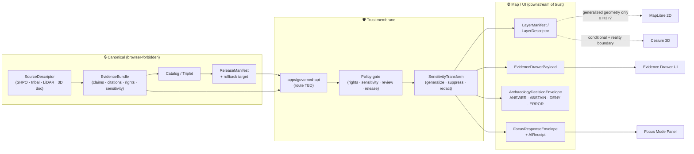
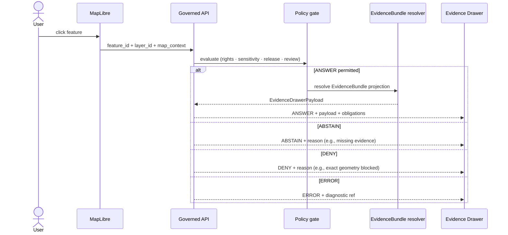

<!-- [KFM_META_BLOCK_V2]
doc_id: kfm://doc/archaeology-map-ui-contracts
title: Archaeology — Map / UI Contracts
type: standard
version: v0.1
status: draft
owners: TODO/REVIEW: Archaeology domain steward · Map shell steward · Governed AI surface steward
created: 2026-05-15
updated: 2026-05-15
policy_label: public
related:
  - docs/domains/archaeology/README.md
  - docs/domains/archaeology/SENSITIVITY.md
  - docs/architecture/ui/README.md
  - docs/architecture/ui/LAYERING.md
  - docs/architecture/governed-ai/README.md
  - docs/architecture/map-shell.md
  - docs/architecture/governed-api.md
  - contracts/OBJECT_MAP.md
  - schemas/contracts/v1/domains/archaeology/
  - policy/domains/archaeology/
  - docs/doctrine/trust-membrane.md
  - docs/doctrine/directory-rules.md
tags: [kfm, archaeology, map, ui, contracts, governed-ai, sensitivity, evidence]
notes:
  - All paths PROPOSED; no mounted repo verified in this session.
  - Route names, schema homes, and policy package layout pending ADR.
  - Coordinate-generalization thresholds (H3 r7, 5 km) are project-doctrine PROPOSED defaults; reconfirm against current sensitivity policy bundle.
[/KFM_META_BLOCK_V2] -->

# Archaeology — Map / UI Contracts

> The governed surfaces and payload contracts that bind the Archaeology lane to the Map shell, the Evidence Drawer, the time-aware UI, and Focus Mode — with sensitivity, rights, and review state visible at every boundary.


**Status:** draft · **Owners:** _TODO/REVIEW_ — Archaeology domain steward · Map shell steward · Governed AI surface steward · **Last updated:** 2026-05-15

> [!IMPORTANT]
> This document is **doctrine-grade for trust rules** and **PROPOSED for implementation surfaces**. The repository is not mounted in this session, so every concrete path, route name, package home, and DTO field list below is **PROPOSED** until verified against the live repo and the relevant ADRs. Schema authority defaults to `schemas/contracts/v1/...` per ADR-0001.

---

## 📑 Contents

1. [Purpose & scope](#1-purpose--scope)
2. [Repo fit & authority basis](#2-repo-fit--authority-basis)
3. [Trust-membrane diagram](#3-trust-membrane-diagram)
4. [Contracts inventory](#4-contracts-inventory)
5. [Map layer contracts](#5-map-layer-contracts)
6. [Click-resolution & Evidence Drawer contracts](#6-click-resolution--evidence-drawer-contracts)
7. [Time-aware contracts](#7-time-aware-contracts)
8. [Focus Mode contracts (governed AI)](#8-focus-mode-contracts-governed-ai)
9. [Sensitivity, geometry, and CARE controls](#9-sensitivity-geometry-and-care-controls)
10. [Trust-visible UI states](#10-trust-visible-ui-states)
11. [Finite outcomes & policy decisions](#11-finite-outcomes--policy-decisions)
12. [Validation, tests, and fixtures](#12-validation-tests-and-fixtures)
13. [Anti-patterns (must-not-do)](#13-anti-patterns-must-not-do)
14. [Open questions & verification backlog](#14-open-questions--verification-backlog)
15. [Related docs](#15-related-docs)
16. [Appendix](#16-appendix)

---

## 1. Purpose & scope

**Purpose.** This document defines the **contracts** — the DTOs, payload shapes, finite outcomes, and trust obligations — that the **Archaeology** lane exposes to KFM's **Map shell** and **UI surfaces** (catalog, popups, Evidence Drawer, time slider, Focus Mode, exports). It is the per-domain elaboration of the cross-cutting Whole-UI / Governed-AI contracts; cross-cutting definitions live in their architecture homes, **not here**.

**Scope (in).**

- Domain-specific shape of `LayerManifest`, `LayerDescriptor`, `EvidenceDrawerPayload`, `ArchaeologyDecisionEnvelope`, `FocusRequestEnvelope` / `FocusResponseEnvelope`, and related projections **as they apply to Archaeology**.
- Sensitivity, geometry-generalization, rights, sovereignty, and review obligations carried across every Map/UI boundary.
- The finite outcome grammar (`ANSWER` / `ABSTAIN` / `DENY` / `ERROR`) and the obligations that accompany each.
- Cross-references to the validators, tests, and fixtures that prove these contracts hold.

**Scope (out).**

- Cross-cutting DTO definitions (those belong under `docs/architecture/ui/`, `docs/architecture/governed-ai/`, and `contracts/`).
- Map renderer internals, MapLibre adapter wiring, Cesium handoff — see the map shell and renderer docs.
- Ingestion, source-descriptor lifecycle, and RAW → PROCESSED transforms — see the domain README and `data/registry/sources/archaeology/`.
- Schema files themselves — those live under `schemas/contracts/v1/...`. This doc references them; it does not own them.

> [!NOTE]
> **CONFIRMED doctrine:** Public clients and normal UI surfaces use **governed APIs and released payloads only**. No browser path reads canonical or candidate stores. Maps, tiles, popups, and AI text are downstream of the trust membrane — never substitutes for it.

[⬆ Back to top](#archaeology--map--ui-contracts)

---

## 2. Repo fit & authority basis

| Concern | Where it lives | Status |
|---|---|---|
| This doc | `docs/domains/archaeology/MAP_UI_CONTRACTS.md` | **PROPOSED** filename · path placement **CONFIRMED** by Directory Rules §6.1 |
| Domain meaning (Markdown) | `contracts/domains/archaeology/` | **PROPOSED** |
| Machine schemas (JSON Schema) | `schemas/contracts/v1/domains/archaeology/` | **PROPOSED** (per ADR-0001 default) |
| Sensitivity & rights policy | `policy/domains/archaeology/` and `policy/sensitivity/archaeology/` | **PROPOSED** |
| Fixtures (valid / invalid) | `tests/fixtures/domains/archaeology/` (or `fixtures/domains/archaeology/`) | **PROPOSED** · home **NEEDS VERIFICATION** |
| Tests (positive / negative) | `tests/domains/archaeology/` | **PROPOSED** |
| Governed API routes | `apps/governed-api/` (exact routes **UNKNOWN**) | **PROPOSED** |
| Map shell | `apps/explorer-web/` + `packages/maplibre/` + `packages/ui/` | **PROPOSED** per Directory Rules §13.3 migration target |

**Directory Rules basis.** Per `directory-rules.md` §6.1, `docs/domains/archaeology/` is the canonical home for domain-facing prose. Per §12 (Domain Placement Law), the domain name must appear as a **segment** under each responsibility root — never as a root folder. Per §13.3, the public shell consolidates under `apps/explorer-web/`, `packages/ui/`, and `packages/maplibre/` rather than legacy `ui/` / `web/`.

[⬆ Back to top](#archaeology--map--ui-contracts)

---

## 3. Trust-membrane diagram

The diagram below renders the **CONFIRMED doctrine** flow: canonical archaeology evidence is never read directly by the browser; the governed API resolves a finite envelope that carries the EvidenceBundle projection, the policy decision, and any required obligations (CARE chip, sovereignty notice, generalization log) before pixels or text reach the client.



> [!NOTE]
> **Diagram status:** illustrative of doctrine; arrows reflect responsibility, not file paths. Final route names, package boundaries, and adapter wiring are **PROPOSED / NEEDS VERIFICATION** until the repo is inspected.

[⬆ Back to top](#archaeology--map--ui-contracts)

---

## 4. Contracts inventory

The contracts below are the **Archaeology lane's projection** of cross-cutting DTOs. Each row carries the truth label that applies to its **implementation maturity**; the **shape doctrine** (what the object is for) is CONFIRMED across the project.

| Contract | Purpose in Archaeology lane | PROPOSED schema home | Truth label |
|---|---|---|---|
| `ArchaeologyDecisionEnvelope` | Finite outcome wrapper for archaeology feature/detail and gate decisions | `schemas/contracts/v1/runtime/decision_envelope.schema.json` (domain-discriminated) | shape **CONFIRMED** · path **PROPOSED** |
| `LayerCatalogItem` | List-level metadata + trust-badge inputs for archaeology layers | `schemas/contracts/v1/layers/layer_catalog_item.schema.json` | shape **CONFIRMED** · path **PROPOSED** |
| `LayerDescriptor` | MapLibre source/layer descriptor with release / proof / manifest refs | `schemas/contracts/v1/layers/layer_descriptor.schema.json` | shape **CONFIRMED** · path **PROPOSED** |
| `LayerManifest` | Versioned layer payload with valid time, freshness, provenance, release state | `schemas/contracts/v1/layers/layer_manifest.schema.json` | shape **CONFIRMED** · path **PROPOSED** |
| `KFMGeoManifest` | PMTiles / COG release-candidate manifest (digest + signature) | `schemas/contracts/v1/evidence/kfm_geo_manifest.schema.json` | shape **CONFIRMED** · path **PROPOSED** |
| `EvidenceDrawerPayload` | Click / selection payload: claim, EvidenceRefs, bundle refs, rights, sensitivity, transforms | `schemas/contracts/v1/ui/evidence_drawer_payload.schema.json` | shape **CONFIRMED** · path **PROPOSED** |
| `MapContextEnvelope` | Bounded map context (visible layers, bounds, time window, filters) for Focus Mode | `schemas/contracts/v1/ui/map_context_envelope.schema.json` | shape **CONFIRMED** · path **PROPOSED** |
| `FocusRequestEnvelope` | Focus Mode input: scope, query, viewport, time basis, policy context | `schemas/contracts/v1/focus/focus_request.schema.json` | shape **CONFIRMED** · path **PROPOSED** |
| `FocusResponseEnvelope` | Bounded synthesis answer + finite outcome + citations | `schemas/contracts/v1/focus/focus_response.schema.json` | shape **CONFIRMED** · path **PROPOSED** |
| `CitationValidationReport` | Proof that every cited EvidenceRef resolves and is admissible in scope | `schemas/contracts/v1/focus/citation_validation_report.schema.json` | shape **CONFIRMED** · path **PROPOSED** |
| `AIReceipt` | Audit trail for Focus Mode runs (no private reasoning stored) | `schemas/contracts/v1/ai/ai_receipt.schema.json` | shape **CONFIRMED** · path **PROPOSED** |
| `SensitivityTransform` (Archaeology) | Generalization / suppression / redaction receipt for archaeology geometry & attributes | `schemas/contracts/v1/domains/archaeology/sensitivity_transform.schema.json` | shape **CONFIRMED** · path **PROPOSED** |

> [!TIP]
> Field-by-field schemas are owned by `schemas/contracts/v1/...` (machine shape) and `contracts/domains/archaeology/` (semantic meaning). This doc references them; it does not duplicate them. Drift between the two homes is an ADR-class concern per Directory Rules §13.1.

[⬆ Back to top](#archaeology--map--ui-contracts)

---

## 5. Map layer contracts

Archaeology layers are **derived, public-safe surfaces** built downstream of admitted evidence and approved sensitivity transforms. They are **never** direct projections of canonical archaeology records.

### 5.1 Layer families exposed to the Map shell

| Layer family | Visibility default | Geometry posture | Source role |
|---|---|---|---|
| Public generalized site summaries | public | generalized (≥ H3 r7 PROPOSED) | derived / aggregated |
| Survey coverage summaries | public | survey-extent polygons | observation summary |
| Candidate-feature surfaces (LiDAR, remote sensing, geophysics anomalies) | public, **clearly labeled candidate** | generalized | candidate, not site |
| Chronology / cultural temporal period layers | public, time-aware | generalized | derived |
| Steward-only exact-geometry review | **restricted** | exact, access-gated | review surface |
| 3D site documentation | **restricted** unless generalized | generalized 3D + Reality Boundary Note | review surface |
| Threat / risk review views | **restricted** | varies | review surface |

> [!WARNING]
> **CONFIRMED doctrine (sensitivity, rights, publication posture).** Exact archaeological locations, burial, human remains, sacred sites, unresolved cultural sensitivity, collection security, private landowner details, and looting-risk exposure **fail closed**. Public layers carry **generalized** geometry only; precise coordinates are never exposed without steward / rights-holder review.

### 5.2 Required `LayerManifest` carry-over fields (Archaeology)

For every archaeology layer that reaches the public Map shell, the `LayerManifest` must carry, at minimum:

- `layer_id`, `title`, `geometry_type`, `source_id`, `source_layer`
- `evidence_ref_field` (links each feature to its `EvidenceBundle`)
- `temporal_fields` (source / observed / valid / retrieval / release / correction times kept distinct)
- `policy_label` (e.g., `public`, `restricted`, `steward-only`)
- `release_state` (released vs. candidate vs. review-only)
- `sensitivity` tier + `care_status`
- `generalization_log_ref` (pointer to the `SensitivityTransform` receipt)
- `version`, `release_id`, `rollback_target`
- `freshness`, `stale_after`

Field set is **CONFIRMED** doctrine; **field names are PROPOSED** in this exact form until matched against the canonical schema.

### 5.3 3D handoff (Cesium / 3D Tiles)

3D scenes are **higher-exposure carriers**. Per CONFIRMED doctrine, 3D handoff for archaeology requires:

- generalized or clipped geometry equivalent to the 2D public layer;
- a **Reality Boundary Note** distinguishing observed / modeled / synthetic surfaces;
- the **same** `EvidenceBundle` and `DecisionEnvelope` as the 2D path — Cesium is an alternate renderer, **not** an alternate truth path;
- an ADR (e.g., `ADR-story-node-3d-boundary.md`) before any public 3D archaeology surface goes live.

[⬆ Back to top](#archaeology--map--ui-contracts)

---

## 6. Click-resolution & Evidence Drawer contracts

A click on an archaeology feature does **not** read the rendered tile attributes as evidence. It produces a **governed lookup** that resolves to an `EvidenceDrawerPayload` or returns an `ABSTAIN` / `DENY` with reasons.

### 6.1 Resolution flow



### 6.2 Required `EvidenceDrawerPayload` carry-over (Archaeology)

Every archaeology drawer payload must surface:

- `claim` (what the user is being shown, in plain language);
- `evidence_bundle_refs` and `evidence_ref_summaries`;
- `source_role` and source family (e.g., SHPO record, tribal/steward review, LiDAR candidate);
- `valid_time` window and `release_time`;
- `rights_status`, `sensitivity` tier, `care_status`, sovereignty notice (if applicable);
- `review_state` (e.g., reviewed / pending / not-required);
- `correction_state` and `supersedes` / `superseded_by` links;
- `transforms_applied` (each `SensitivityTransform` carrying a transform-receipt ID);
- `limitations` (uncertainty, candidate-vs-confirmed disclaimer where applicable).

> [!IMPORTANT]
> **Anti-pattern guard.** The Evidence Drawer is the **drawer**, not a badge. Badges link to drawer entries; they do not replace them. A click must resolve to a drawer payload **or** abstain — never silently produce uncited text.

[⬆ Back to top](#archaeology--map--ui-contracts)

---

## 7. Time-aware contracts

Archaeology layers are inherently temporal: cultural temporal periods, survey campaigns, candidate detections, and chronology assertions all carry distinct times that the UI must preserve and never collapse.

| Time field | Semantics | UI obligation |
|---|---|---|
| `source_time` | When the source asserted the fact | Surface in drawer; do not display as observed time |
| `observed_time` | When the field event occurred (excavation, survey, scan) | Drives temporal layer selection |
| `valid_time` | Window over which the claim is held to apply | Time slider scope |
| `retrieval_time` | When KFM fetched the source | Freshness inference |
| `release_time` | When the released artifact was published | Version-lock anchor |
| `correction_time` | When a correction or supersession applied | Stale / superseded badge |

**PROPOSED defaults (project-doctrine carryover):**

- Time slider state is **layer-scoped**; cross-domain joins must declare their time basis explicitly.
- A version-lock pins the released layer snapshot; the slider cannot pull unreleased candidates.
- Cluster / heatmap layers for cultural temporal periods must be labeled as **generalized cultural activity zones**, not precise sites.

[⬆ Back to top](#archaeology--map--ui-contracts)

---

## 8. Focus Mode contracts (governed AI)

> [!IMPORTANT]
> **CONFIRMED doctrine.** AI is interpretive, never the root truth source. For Archaeology, Focus Mode may **summarize released `EvidenceBundle`s, compare evidence, explain limitations, and draft steward-review notes.** It must `ABSTAIN` when evidence is insufficient and `DENY` where policy, rights, sensitivity, or release state blocks the request.

### 8.1 Required input (`FocusRequestEnvelope`)

- `question` (bounded scope; archaeology-relevant intent)
- `map_context_envelope` (visible layers, bounds, zoom, time window, selected features → all archaeology layers must already be **released** and public-safe)
- `policy_context` (user role, sensitivity tier, sovereignty constraints)
- `requested_evidence_depth` (drawer-level vs. compare-mode)

### 8.2 Required output (`FocusResponseEnvelope`)

- `outcome` ∈ { `ANSWER`, `ABSTAIN`, `DENY`, `ERROR` }
- `answer` text (only if `ANSWER`), every claim cited
- `citations` (resolvable EvidenceRefs only)
- `citation_validation_report_id` → `CitationValidationReport`
- `abstain_reason` / `deny_reason` (typed enum)
- `evidence_used` (list of bundle refs)
- `policy_decisions` (applied gates and obligations)
- `ai_receipt_id` → `AIReceipt`

### 8.3 Archaeology-specific obligations

- **Sovereignty-aware summaries.** Focus Mode must surface CARE labels and explain what evidence influenced the answer.
- **Generalization disclaimer.** Cluster / period summaries must explicitly state they describe **generalized cultural activity zones**, not exact sites.
- **Exact-location denial.** Any prompt soliciting precise coordinates for sensitive archaeology → `DENY` with reason `SENSITIVITY_EXACT_GEOMETRY` (enum name **PROPOSED**).
- **Uncited claim guard.** A Focus Mode answer with any uncited assertion fails citation validation and must downgrade to `ABSTAIN`.

[⬆ Back to top](#archaeology--map--ui-contracts)

---

## 9. Sensitivity, geometry, and CARE controls

### 9.1 Sensitivity register row (CONFIRMED doctrine)

| Class | Examples | Default outcome | Required controls |
|---|---|---|---|
| Archaeology | Site coordinates, burial / sacred / culturally sensitive materials | **DENY** exact public location by default | cultural / steward review · suppression / generalization |
| Sacred / culturally sensitive places | Oral history, cultural routes, sacred sites | **DENY** until steward review and access class approve | consultation record · sensitivity transform |
| Exact sensitive locations | Any exact point that increases harm risk | **DENY** by default | redaction / generalization · audit |

### 9.2 Geometry generalization thresholds (PROPOSED defaults)

- **`generalization_floor`** = H3 resolution **r7** — any sensitive archaeology geometry below this is prohibited for public products. *(Source basis: project doctrine extracted from SRC-061.)*
- **`min_buffer_distance`** = **5 km** coordinate generalization when archaeological terrain is linked to 3D / Cesium. *(Source basis: ML-059-055.)*
- Every generalization is a **`SensitivityTransform`** with a receipt; the receipt ID is required in `LayerManifest.generalization_log_ref` and in the `EvidenceDrawerPayload.transforms_applied[]`.

> [!CAUTION]
> Thresholds above are **PROPOSED defaults** carried from project sources. Final values are owned by the sensitivity policy bundle (`policy/sensitivity/archaeology/`) and **NEEDS VERIFICATION** against the live policy package. The thresholds are floors, not ceilings — review may require coarser generalization.

### 9.3 CARE labels and sovereignty notice

- **CARE status** (Collective benefit · Authority to control · Responsibility · Ethics) is a required field on every archaeology layer payload.
- **Sovereignty notice chips** appear in the UI when the layer or feature traces to a sovereign or steward-held source.
- **Cultural symbols.** Archaeological / cultural symbols must avoid sacred symbols or tribal insignia, remain WCAG-accessible, use generalized geometry, and carry CARE metadata.

[⬆ Back to top](#archaeology--map--ui-contracts)

---

## 10. Trust-visible UI states

The UI must expose, **without substituting badges for evidence**, finite states that map to the underlying governance:

| State | Trigger | Drawer behavior |
|---|---|---|
| ✅ Verified | EvidenceBundle resolves; citations valid; release current | Show evidence + citations |
| ⏳ Pending review | `review_state = pending` | Show drawer with "pending" notice; restrict export |
| ⚠ Stale | `release_time` past `stale_after` | Show drawer + stale chip; allow inspection |
| 🚫 Suppressed | Sensitivity / rights deny public layer | Layer hidden; deny chip explains class, not content |
| ❌ Failed verification | Signature / digest / citation validation failed | No drawer payload; ERROR with diagnostic ref |
| 🌀 Generalized | `SensitivityTransform` applied | Generalization chip + transform-receipt link |
| 🕊 Sovereignty notice | CARE / tribal stewardship applies | Sovereignty chip + steward attribution |

**Accessibility requirement (CONFIRMED doctrine carryover).** Trust badges must be keyboard-navigable, screen-reader-readable, and pass contrast checks; badge state is testable via fixture.

[⬆ Back to top](#archaeology--map--ui-contracts)

---

## 11. Finite outcomes & policy decisions

Every governed surface in this lane returns one of four outcomes. There is no fifth path; "silent success without evidence" is not an outcome.

| Outcome | When it applies | Required carry-along |
|---|---|---|
| **ANSWER** | Evidence resolved · policy passes · release current | EvidenceRefs · citations · obligations |
| **ABSTAIN** | Evidence insufficient · scope undefined · uncited claim | `abstain_reason` enum · suggested next action |
| **DENY** | Rights / sensitivity / sovereignty / release blocks | `deny_reason` enum (e.g., `SENSITIVITY_EXACT_GEOMETRY`, `RIGHTS_UNKNOWN`, `REVIEW_NEEDED`) |
| **ERROR** | Schema / integrity / signature / system failure | `audit_ref` for diagnostic |

> [!NOTE]
> Reason enums are **PROPOSED** in this doc. The canonical enum vocabulary belongs in `schemas/contracts/v1/runtime/decision_envelope.schema.json` and the policy bundle — and is **ADR-class** per Directory Rules §2.4(4) (vocabulary stability).

[⬆ Back to top](#archaeology--map--ui-contracts)

---

## 12. Validation, tests, and fixtures

These validators / tests are **PROPOSED** in implementation form but **CONFIRMED** as required by project doctrine. Each must have both positive and negative fixtures.

| Validator / test | What it proves | Status |
|---|---|---|
| EvidenceBundle-required test (Archaeology) | No public archaeology feature reaches the drawer without an EvidenceBundle | **PROPOSED** |
| Candidate-not-site test | Candidate anomalies / clusters are never serialized or labeled as confirmed sites | **PROPOSED** |
| Public no-leak test | Sensitive exact geometry does not appear in any public layer, tile, popup, or export | **PROPOSED** |
| Rights & cultural-review test | Layers with unresolved rights or pending steward review fail closed | **PROPOSED** |
| Exact-sensitive-geometry denial | DENY outcome on prompts / queries soliciting precise coordinates | **PROPOSED** |
| Generalization-log presence | Every public archaeology layer manifest references a `SensitivityTransform` receipt | **PROPOSED** |
| Catalog closure test | Released archaeology layers have catalog records, EvidenceBundles, and rollback targets | **PROPOSED** |
| AI exact-location denial | Focus Mode DENYs precise-location prompts; ABSTAINs on insufficient evidence | **PROPOSED** |
| Citation validation | Every Focus Mode `ANSWER` passes `CitationValidationReport` | **PROPOSED** |
| Trust-badge a11y / state | Badges expose keyboard, contrast, and finite-state coverage | **PROPOSED** |
| Time-lock fixture | Time slider only loads released snapshots; missing-time and stale cases tested | **PROPOSED** |
| Rollback drill | Prior `ReleaseManifest` restorable; cache keys invalidated; correction lineage intact | **PROPOSED** |
| No-network fixture | Synthetic archaeology candidate fixture: exact geometry denied, public generalized tile, steward review record, correction / rollback path | **PROPOSED** |

[⬆ Back to top](#archaeology--map--ui-contracts)

---

## 13. Anti-patterns (must-not-do)

> [!WARNING]
> The following are **explicit failure modes** for this lane. Each must be detectable by fixture and denied or quarantined at the policy gate.

- **Treating MapLibre / tiles as truth.** Renderer output is downstream; tiles simplify and carry selected attributes, not source authority.
- **Treating a candidate as a site.** LiDAR / remote-sensing / geophysics candidates are not confirmed sites — UI labels, popups, exports, and Focus Mode answers must preserve the distinction.
- **Hiding exact sensitive geometry with style filters.** Public bytes still expose exact geometry; generalize / redact **before** tile build.
- **Using a badge as the evidence surface.** Badges link to the Evidence Drawer; they do not stand in for it.
- **Uncited Focus Mode answer.** If a citation does not resolve, the answer downgrades to `ABSTAIN`.
- **Public route reading canonical store.** Map / UI clients reach archaeology data only through `apps/governed-api/`.
- **3D as an alternate truth path.** Cesium / 3D Tiles render the same evidence as 2D; they never bypass policy or evidence.
- **Generalization without a receipt.** Every generalization is a `SensitivityTransform` with a receipt linked in the manifest and drawer.
- **Heatmap / cluster read as site locator.** Period clusters describe generalized cultural activity zones; the UI must say so plainly.

[⬆ Back to top](#archaeology--map--ui-contracts)

---

## 14. Open questions & verification backlog

| # | Item | Resolution path | Status |
|---|---|---|---|
| 1 | Exact governed-API route names for archaeology surfaces | Inspect `apps/governed-api/` once mounted; ADR if naming differs from doctrine | **UNKNOWN** |
| 2 | Schema home — `schemas/contracts/v1/domains/archaeology/` vs. `contracts/archaeology/` | ADR-0001 default is `schemas/...`; verify against repo, raise drift entry on mismatch | **NEEDS VERIFICATION** |
| 3 | Sensitivity policy bundle layout (`policy/sensitivity/archaeology/` vs. `policy/domains/archaeology/sensitivity/`) | Inspect `policy/` tree; align with Directory Rules §6.5 | **NEEDS VERIFICATION** |
| 4 | Generalization floor (H3 r7) and minimum buffer (5 km) | Confirm in policy bundle; ADR if tightened or loosened | **PROPOSED** |
| 5 | Steward authority and sovereignty review workflow | Inspect `governance/`, CODEOWNERS, review records | **NEEDS VERIFICATION** |
| 6 | Cesium / 3D handoff readiness for archaeology layers | ADR (`ADR-story-node-3d-boundary.md`) required before public 3D archaeology surface | **PROPOSED** |
| 7 | DecisionEnvelope `deny_reason` enum coverage for archaeology | ADR-class vocabulary stability per Directory Rules §2.4(4) | **PROPOSED** |
| 8 | Map shell migration state (`ui/`, `web/` legacy vs. `apps/explorer-web/`) | Per Directory Rules §13.3; verify migration progress | **NEEDS VERIFICATION** |
| 9 | Rollback drill record for an archaeology layer | Run dry-run rollback; archive the RollbackCard | **PROPOSED** |
| 10 | Oral-history / cultural-knowledge protocol carry-over | Inspect domain governance; carry into payload obligations | **NEEDS VERIFICATION** |

[⬆ Back to top](#archaeology--map--ui-contracts)

---

## 15. Related docs

> Links are **PROPOSED** — verify each target exists at the path shown.

- [`docs/domains/archaeology/README.md`](./README.md) — _TODO: domain landing page_
- [`docs/domains/archaeology/SENSITIVITY.md`](./SENSITIVITY.md) — _TODO: sensitivity playbook_
- [`docs/architecture/ui/README.md`](../../architecture/ui/README.md) — _TODO: UI architecture_
- [`docs/architecture/ui/LAYERING.md`](../../architecture/ui/LAYERING.md) — _TODO: layering doctrine_
- [`docs/architecture/governed-ai/README.md`](../../architecture/governed-ai/README.md) — _TODO: governed AI architecture_
- [`docs/architecture/map-shell.md`](../../architecture/map-shell.md) — _TODO: map shell contract_
- [`docs/architecture/governed-api.md`](../../architecture/governed-api.md) — _TODO: governed API surface_
- [`docs/doctrine/trust-membrane.md`](../../doctrine/trust-membrane.md) — _TODO: trust-membrane doctrine_
- [`docs/doctrine/directory-rules.md`](../../doctrine/directory-rules.md) — Directory Rules (this repo)
- [`contracts/OBJECT_MAP.md`](../../../contracts/OBJECT_MAP.md) — _TODO: object family crosswalk_
- [`policy/domains/archaeology/`](../../../policy/domains/archaeology/) — _TODO: policy package_
- [`schemas/contracts/v1/domains/archaeology/`](../../../schemas/contracts/v1/domains/archaeology/) — _TODO: schema package_

[⬆ Back to top](#archaeology--map--ui-contracts)

---

## 16. Appendix

<details>
<summary><strong>A. Glossary (domain terms used here)</strong></summary>

| Term | Definition (project-grounded) |
|---|---|
| `ArchaeologicalSite` | Domain object representing a site assertion or released derivative within Archaeology, constrained by source role, evidence, time, and release state. |
| `Survey` / `SurveyProject` / `SurveyTransect` | Survey-level records: extent, methodology, coverage. Survey coverage is public-safe; individual survey hits may not be. |
| `Artifact` / `ArtifactRecord` | A documented object, typically tied to a `CollectionAccession` and a `ProvenienceContext`. |
| `Feature` / `Context` | Spatial / stratigraphic units within a site; `ProvenienceContext` binds artifact-to-context. |
| `ExcavationUnit` | A defined excavation footprint with stratigraphy. |
| `RemoteSensingAnomaly` / `LiDARCandidate` / `GeophysicsObservation` | **Candidate** detections — not confirmed sites. |
| `ChronologyAssertion` / `CulturalTemporalPeriod` | Time-bound interpretive periods (e.g., Late Prehistoric); always labeled as generalized cultural activity zones in public surfaces. |
| `CulturalReview` / `StewardReview` | Review-state records governing release. |
| `SensitivityTransform` | A receipt-bearing operation that generalized, suppressed, or redacted geometry / attributes prior to release. |
| `EvidenceBundle` | The truth-bearing evidence object that outranks generated language. |
| `EvidenceRef` | A pointer that must resolve to an `EvidenceBundle`. |
| `DecisionEnvelope` | The finite-outcome wrapper. |
| `LayerManifest` | The versioned layer contract carrying provenance, release state, and integrity references. |
| `Reality Boundary Note` | Required marker on synthetic / modeled / 3D surfaces distinguishing them from observed reality. |

</details>

<details>
<summary><strong>B. Outcome-reason enum sketch (PROPOSED)</strong></summary>

This sketch lists candidate reason codes; the canonical enum is owned by the runtime / policy schemas.

```text
ABSTAIN
  EVIDENCE_INSUFFICIENT
  CITATION_UNRESOLVED
  SCOPE_UNDEFINED
  STALE_EVIDENCE

DENY
  RIGHTS_UNKNOWN
  SENSITIVITY_EXACT_GEOMETRY
  SENSITIVITY_BURIAL_OR_HUMAN_REMAINS
  SENSITIVITY_SACRED_PLACE
  SENSITIVITY_COLLECTION_SECURITY
  SENSITIVITY_LOOTING_RISK
  REVIEW_NEEDED
  REVIEW_INSUFFICIENT
  REVIEW_REJECTED
  RELEASE_NOT_PUBLISHED
  SOVEREIGNTY_REVIEW_REQUIRED

ERROR
  RELEASE_MANIFEST_INVALID
  ROLLBACK_TARGET_MISSING
  CITATION_VALIDATION_FAILED
  SIGNATURE_INVALID
  SCHEMA_INVALID
```

</details>

<details>
<summary><strong>C. PROPOSED file layout (responsibility-root view)</strong></summary>

```text
docs/domains/archaeology/
  ├── README.md                       # domain landing page (PROPOSED)
  ├── MAP_UI_CONTRACTS.md             # this doc
  ├── SENSITIVITY.md                  # sensitivity playbook (PROPOSED)
  └── CHRONOLOGY.md                   # chronology / cultural periods (PROPOSED)

contracts/domains/archaeology/        # semantic Markdown (PROPOSED)
schemas/contracts/v1/domains/archaeology/   # JSON Schema (PROPOSED; ADR-0001)
policy/domains/archaeology/           # rights, sensitivity, release (PROPOSED)
policy/sensitivity/archaeology/       # sensitivity transforms (PROPOSED)
tests/domains/archaeology/            # positive + negative tests (PROPOSED)
fixtures/domains/archaeology/         # no-network fixtures (PROPOSED — home NEEDS VERIFICATION)
data/registry/sources/archaeology/    # source registry (PROPOSED)
data/published/layers/archaeology/    # released public-safe layers (PROPOSED)
release/candidates/archaeology/       # release candidates (PROPOSED)
```

All paths above are **PROPOSED** per Directory Rules §12 (Domain Placement Law). Verify against the mounted repo before treating any as canonical.

</details>

---

**Related docs:** [Archaeology domain README](./README.md) · [Sensitivity playbook](./SENSITIVITY.md) · [UI architecture](../../architecture/ui/README.md) · [Governed AI architecture](../../architecture/governed-ai/README.md) · [Directory Rules](../../doctrine/directory-rules.md) — _all marked PROPOSED until verified against the mounted repo._

**Last updated:** 2026-05-15 · **Status:** draft · [⬆ Back to top](#archaeology--map--ui-contracts)
