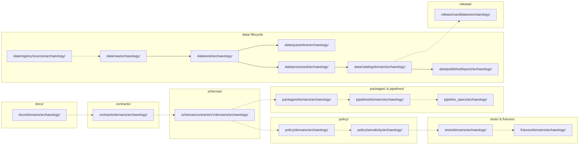

<!-- [KFM_META_BLOCK_V2]
doc_id: kfm://doc/docs/domains/archaeology/missing_or_planned_files
title: Archaeology — Missing or Planned Files
type: standard
version: v1.2
status: draft
owners: TODO/REVIEW — Archaeology domain stewards · Docs steward · Directory Rules reviewers
created: 2026-05-15
updated: 2026-05-29
policy_label: public
contract_version: "3.0.0"
related:
  - docs/doctrine/ai-build-operating-contract.md
  - docs/doctrine/directory-rules.md
  - docs/doctrine/lifecycle-law.md
  - docs/doctrine/trust-membrane.md
  - docs/doctrine/authority-ladder.md
  - docs/registers/VERIFICATION_BACKLOG.md
  - docs/registers/DRIFT_REGISTER.md
  - docs/registers/CANONICAL_LINEAGE_EXPLORATORY.md
  - docs/adr/ADR-0001-schema-home.md
  - docs/domains/archaeology/README.md
  - docs/domains/archaeology/MAP_UI_CONTRACTS.md
  - docs/atlases/domains-v1.1/ch15-archaeology.md
  - docs/atlases/domains-v1.1/ch24-5-sensitivity-tier-reference.md
  - docs/architecture/maplibre-3d.md
  - kfm://doc/docs/standards/PROV
tags: [kfm, archaeology, planning, directory-rules, backlog, doctrine]
notes:
  - CONTRACT_VERSION pinned to 3.0.0 per ai-build-operating-contract.md §0 / §37.
  - Repository not mounted in this session; every concrete path is PROPOSED, CONFIRMED-via-doctrine, or NEEDS VERIFICATION as labeled.
  - v1.2 corrects the Directory Rules edition reference from v1.2 to the live v1.3 (renderer-decision refresh) and reconciles the §23.2 generalization-floor claim with the operating contract (county/region) versus the lane-local H3-r7 proposal.
  - v1.2 is a MINOR bump per contract §37 (clarifications, reconciliations, gap closures; no breaking anchor changes — §§1–13 anchors preserved from v1.1).
  - This is a planning ledger, not a publication artifact. Promotion of any row from PLANNED to PRESENT requires mounted-repo evidence.
[/KFM_META_BLOCK_V2] -->

# 🏺 Archaeology — Missing or Planned Files

> Working inventory of every file the archaeology domain lane is **expected** to carry, what its placement should be under Directory Rules §12, and whether it is currently **present, planned, missing, deferred, or unverified**. This document is a planning ledger, not a publication artifact.

<p align="left">
  
  
  
  
  
  
  
  
  
  
  
</p>

**Status:** `draft` · **Owners:** _TODO/REVIEW_ — Archaeology domain stewards · Docs steward · Directory Rules reviewers _(placeholder pending CODEOWNERS)_ · **Last updated:** 2026-05-29 · **Operating contract:** `ai-build-operating-contract.md` v3.0.0 · **Directory Rules:** v1.3

> [!IMPORTANT]
> The Kansas Frontier Matrix repository is **not mounted in this session**. Every path and file in this ledger is **PROPOSED** under Directory Rules §12 and **NEEDS VERIFICATION** against the live repo before any row may be promoted to `🟢 PRESENT`. Do not treat this document as proof that any file exists.

> [!WARNING]
> **Archaeology fails closed by default (T4).** Exact archaeological-site geometry, burial and human remains, sacred sites, collection security, looting-risk exposure, and private-landowner detail MUST NOT be published, fixtured, schema'd, or test-sampled in a way that places sensitive precision in public-readable paths. Every row in this ledger that touches geometry, location, or steward-only material MUST route through generalization, redaction (`RedactionReceipt`), transform receipts (`PublicationTransformReceipt`), and review state (`ReviewRecord`) before any path is created. Source: Atlas v1.1 §24.5.2; operating contract §23.2.

---

## 📑 Contents

1. [Scope](#1-scope)
2. [How to read this file](#2-how-to-read-this-file)
3. [Expected lane shape](#3-expected-lane-shape)
4. [Files inventory by responsibility root](#4-files-inventory-by-responsibility-root)
   - [4.1 `docs/domains/archaeology/`](#41-docsdomainsarchaeology)
   - [4.2 `contracts/domains/archaeology/`](#42-contractsdomainsarchaeology)
   - [4.3 `schemas/contracts/v1/domains/archaeology/`](#43-schemascontractsv1domainsarchaeology)
   - [4.4 `policy/domains/archaeology/` & `policy/sensitivity/archaeology/`](#44-policydomainsarchaeology--policysensitivityarchaeology)
   - [4.5 `tests/domains/archaeology/`](#45-testsdomainsarchaeology)
   - [4.6 `fixtures/domains/archaeology/`](#46-fixturesdomainsarchaeology)
   - [4.7 `packages/domains/archaeology/`](#47-packagesdomainsarchaeology)
   - [4.8 `pipelines/domains/archaeology/`](#48-pipelinesdomainsarchaeology)
   - [4.9 `pipeline_specs/archaeology/`](#49-pipeline_specsarchaeology)
   - [4.10 `data/` lifecycle phases](#410-data-lifecycle-phases)
   - [4.11 `data/registry/sources/archaeology/`](#411-dataregistrysourcesarchaeology)
   - [4.12 `release/candidates/archaeology/` & release artifacts](#412-releasecandidatesarchaeology--release-artifacts)
5. [Cross-cutting and shared files](#5-cross-cutting-and-shared-files)
6. [ADRs that gate these files](#6-adrs-that-gate-these-files)
7. [Open questions register](#7-open-questions-register)
8. [Open verification backlog (file-level)](#8-open-verification-backlog-file-level)
9. [Changelog](#9-changelog)
10. [Definition of done](#10-definition-of-done)
11. [Update protocol](#11-update-protocol)
12. [Related docs](#12-related-docs)
13. [Appendix](#13-appendix)

---

## 1. Scope

This ledger enumerates the **archaeology-domain lane**: every file the archaeology domain is expected to carry across the canonical responsibility roots defined in `docs/doctrine/directory-rules.md` §12 (Domain Placement Law). Each row names a path under one responsibility root, a one-line purpose, and a planning status.

**In scope**

- File paths under `docs/domains/archaeology/`, `contracts/domains/archaeology/`, `schemas/contracts/v1/domains/archaeology/`, `policy/domains/archaeology/`, `policy/sensitivity/archaeology/`, `tests/domains/archaeology/`, `fixtures/domains/archaeology/` (or `tests/fixtures/domains/archaeology/` — see [OQ-AR-MO-11](#7-open-questions-register)), `packages/domains/archaeology/`, `pipelines/domains/archaeology/`, `pipeline_specs/archaeology/`, `data/<phase>/archaeology/`, `data/catalog/domain/archaeology/`, `data/published/layers/archaeology/`, `data/registry/sources/archaeology/`, and `release/candidates/archaeology/`.
- Archaeology-specific cross-references into shared roots (e.g., a domain-scoped validator under `tools/validators/domains/archaeology/`).
- ADRs that gate creation or shape of archaeology-lane files.

**Out of scope**

- Cross-domain files that legitimately span multiple domains (e.g., a habitat × archaeology validator) — those live under the lowest common responsibility root **without** a domain segment per Directory Rules §12. Cross-cutting items are listed in [§5](#5-cross-cutting-and-shared-files) only when they materially affect archaeology.
- Object-family **meaning** (lives under `contracts/`) and field-level **shape** (lives under `schemas/`). This document points to those files but does not redefine them.
- Promotion, release, correction, and rollback **decisions** for archaeology releases — those live under `release/` and the archaeology-lane runbooks, not here.
- Generic doctrine — see `docs/doctrine/ai-build-operating-contract.md`, `docs/doctrine/directory-rules.md`, `docs/doctrine/lifecycle-law.md`, `docs/doctrine/trust-membrane.md`, and the Domains Atlas chapter 15 for foundations.

### Source basis

| Source | Role | Truth label |
|---|---|---|
| `docs/doctrine/ai-build-operating-contract.md` v3.0 (`CONTRACT_VERSION = "3.0.0"`) | Operating law, truth labels, sensitive-domain matrix (§23.2), finite outcomes (§8 / §9.1), trust objects (§9.2), contract lifecycle (§37) | **CONFIRMED** doctrine |
| `docs/doctrine/directory-rules.md` **v1.3** §§4, 6.1, 6.5, 6.6, 7.4, 9, 11, 12, 13.x, 15, 16, 18.e | Placement law, README contract, path-validation checklist, MapLibre sole-renderer (§18.e OPEN-DR-10), `schemas/contracts/v1/<…>` home (§7.4 / ADR-0001) | **CONFIRMED** doctrine |
| Kansas Frontier Matrix Domain and Capability Encyclopedia §7.13 — Archaeology and Cultural Heritage | Canonical object families, source families, sensitivity posture, AI behavior | **CONFIRMED** doctrine |
| KFM Domains Culmination Atlas v1.1 §15 — Archaeology and Cultural Heritage | Ubiquitous language, pipeline gates, API/contract/schema surfaces, validators, verification backlog | **CONFIRMED** doctrine |
| KFM Domains Atlas v1.1 §24.5 — Sensitivity / Rights Tier Reference (T0–T4) | Canonical tier scheme; archaeology object class → tier mapping; tier transitions §24.5.3 | **CONFIRMED** doctrine |
| KFM Domains Atlas v1.1 §24.13 — Atlas ↔ Dossier ↔ Responsibility-Root Crosswalk | Names `schemas/contracts/v1/archaeology/` / `contracts/archaeology/` / `policy/sensitivity/archaeology/` (no `domains/` segment) | **CONFIRMED** doctrine — **CONFLICTED** against Directory Rules §12 |
| KFM Unified Implementation Architecture Build Manual §30.7 — Archaeology | Lane scope summary, sources of authority, open verification items | **CONFIRMED** doctrine |
| `docs/architecture/maplibre-3d.md` (status `draft (recommends ADR-PROPOSED)`) | MapLibre sole-renderer doctrine; 3D Admission Decision; `packages/maplibre-runtime/` | **CONFIRMED** authored / **PROPOSED** until ADR accepted |
| `docs/domains/archaeology/MAP_UI_CONTRACTS.md` v0.2 | Map / UI / governed-AI contract surface — sibling planning artifact | **CONFIRMED** authored (prior session) |
| Mounted repository state (`git ls-tree` or equivalent) | Path presence, file freshness, fixture content, test pass/fail | **UNKNOWN** — repository not mounted in this session |

[⬆ Back to top](#-archaeology--missing-or-planned-files)

---

## 2. How to read this file

### 2.1 Truth labels (KFM)

Per `ai-build-operating-contract.md` §8 and `directory-rules.md` §2.2:

| Label | Meaning |
|---|---|
| **CONFIRMED** | Verified in this session from attached doctrine docs, schemas, contracts, fixtures, or workspace evidence. |
| **PROPOSED** | Design or path not yet verified in implementation. Default for every path-shaped claim while the repo is unmounted. |
| **INFERRED** | Reasonably derivable from visible evidence but not directly stated. |
| **UNKNOWN** | Not resolvable without more evidence. |
| **NEEDS VERIFICATION** | Checkable, but not yet checked strongly enough to act as fact. |
| **CONFLICTED** | Two doctrine sources disagree; resolution pending ADR or drift entry. |

### 2.2 File-status legend

| Status | Meaning |
|---|---|
| 🟢 PRESENT | File exists in the mounted repo and matches the expected purpose. _(Cannot be confirmed in this session.)_ |
| 🟡 PLANNED | Design exists in KFM doctrine; expected path identified; not yet implemented. |
| 🔴 MISSING | Doctrine implies the file should exist but no expected path has been settled here. |
| ⚪ DEFERRED | Explicitly out of scope for the current phase; recorded for traceability. |
| ❓ UNKNOWN | Status not verifiable without mounted-repo evidence. **Default in this session.** |

> [!NOTE]
> Because the repo is not mounted, every row's **Present?** column reads `❓ UNKNOWN`. The **Plan status** column expresses doctrine-derived intent and is the actionable signal for now.

### 2.3 Path-validation reminder

Each row MUST pass Directory Rules §16 before promotion:

- Responsibility identified · right root · lifecycle phase correct (data only) · domain segment correct · no new root without ADR · no parallel authority · README present · trust-content placement · public-path discipline · compatibility-root discipline · migration discipline · rule cited.

[⬆ Back to top](#-archaeology--missing-or-planned-files)

---

## 3. Expected lane shape

The archaeology domain lane follows the uniform pattern declared in Directory Rules §12 (Domain Placement Law). The tree below is **PROPOSED**: it reflects what the lane *should* look like, not what is currently checked into any branch.

```text
# PROPOSED archaeology lane — verify against mounted repo before promotion
docs/domains/archaeology/
contracts/domains/archaeology/
schemas/contracts/v1/domains/archaeology/
policy/domains/archaeology/
policy/sensitivity/archaeology/
tests/domains/archaeology/
fixtures/domains/archaeology/                  # OR tests/fixtures/domains/archaeology/ (OQ-AR-MO-11)
packages/domains/archaeology/
pipelines/domains/archaeology/
pipeline_specs/archaeology/
data/raw/archaeology/
data/work/archaeology/
data/quarantine/archaeology/
data/processed/archaeology/
data/catalog/domain/archaeology/
data/published/layers/archaeology/
data/registry/sources/archaeology/
release/candidates/archaeology/
```

> [!CAUTION]
> **Known doctrine drift — `domains/` segment.** Atlas v1.1 §24.13 lists schema, contract, and policy homes **without** the `domains/` segment (`schemas/contracts/v1/archaeology/`, `contracts/archaeology/`, `policy/sensitivity/archaeology/`). Directory Rules §12 (v1.3) explicitly requires the lane segment (`schemas/contracts/v1/domains/archaeology/`, `contracts/domains/archaeology/`, `policy/domains/archaeology/`). Per the Authority Ladder, Directory Rules governs placement; the conflict is a drift candidate for `docs/registers/DRIFT_REGISTER.md`. This ledger adopts the §12 form throughout and flags the conflict at [OQ-AR-MO-02](#7-open-questions-register).



> [!NOTE]
> The diagram is doctrinal flow, **not** a build dependency graph. The dashed arrows indicate "evidence flows downstream"; the solid arrows trace the lifecycle path. Promotion between phases remains a governed state transition, not a file move.

[⬆ Back to top](#-archaeology--missing-or-planned-files)

---

## 4. Files inventory by responsibility root

Every row below is **PROPOSED** under Directory Rules §12 unless explicitly marked otherwise. The **Plan status** column reflects doctrine-derived intent; the **Present?** column will remain `❓ UNKNOWN` until the repo is mounted and inspected.

### 4.1 `docs/domains/archaeology/`

Human-facing doctrine, planning, and runbooks for the archaeology lane. Folder placement is **CONFIRMED** per Directory Rules §6.1 (the doc tree explicitly lists `docs/domains/<domain>/`).

| Proposed path | Purpose | Plan status | Present? | Truth label |
|---|---|---|---|---|
| `docs/domains/archaeology/README.md` | Lane orientation, scope, exclusions, inputs, related folders — per Directory Rules §15 README contract. | 🟡 PLANNED | ❓ | PROPOSED |
| `docs/domains/archaeology/MISSING_OR_PLANNED_FILES.md` | **This document.** Working inventory of expected lane files and their planning status. | 🟢 PRESENT _(this session)_ | ❓ | PROPOSED |
| `docs/domains/archaeology/MAP_UI_CONTRACTS.md` | Governed surfaces and payload contracts binding the archaeology lane to the Map shell, Evidence Drawer, time-aware UI, and Focus Mode (per `ai-build-operating-contract.md` §9 / §22 / §23). | 🟢 PRESENT _(authored prior session, v0.2)_ | ❓ | PROPOSED |
| `docs/domains/archaeology/SENSITIVITY.md` | Exact-location DENY-by-default policy, sacred/burial/human-remains rules, looting-risk handling, public-safe transform expectations, T0–T4 tier mapping for archaeology. | 🟡 PLANNED | ❓ | PROPOSED |
| `docs/domains/archaeology/CHRONOLOGY.md` | Chronology / `CulturalTemporalPeriod` doctrine for archaeology. | 🟡 PLANNED | ❓ | PROPOSED |
| `docs/domains/archaeology/ubiquitous-language.md` | Glossary of `ArchaeologicalSite`, `SiteComponent`, `CulturalTemporalPeriod`, `SurveyProject`, `SurveyTransect`, `ShovelTest`, `TestUnit`, `ExcavationUnit`, `ProvenienceContext`, `StratigraphicUnit`, `ArtifactRecord`, `CollectionRepositoryRecord`, `CandidateFeature`, `PublicationTransformReceipt`, and related terms — drawn verbatim from the Domains Atlas §15.C. | 🟡 PLANNED | ❓ | PROPOSED |
| `docs/domains/archaeology/source-families.md` | Source-role expectations for SHPO/state-inventory, NRHP-like listings, field-survey forms, excavation records, artifact/collection/repository records, lab reports, historic maps/plats, and oral history / cultural knowledge. | 🟡 PLANNED | ❓ | PROPOSED |
| `docs/domains/archaeology/cross-lane-relations.md` | Relations to Spatial Foundation, Roads/Rail, Settlements, and Hazards lanes — per Domains Atlas §15.F. | 🟡 PLANNED | ❓ | PROPOSED |
| `docs/domains/archaeology/pipeline-shape.md` | `RAW → WORK / QUARANTINE → PROCESSED → CATALOG / TRIPLET → PUBLISHED` gates as applied to archaeology. | 🟡 PLANNED | ❓ | PROPOSED |
| `docs/domains/archaeology/governed-ai-behavior.md` | `ANSWER` / `ABSTAIN` / `DENY` / `ERROR` posture for archaeology Focus Mode and Evidence Drawer; AI exact-location denial. | 🟡 PLANNED | ❓ | PROPOSED |
| `docs/domains/archaeology/verification-backlog.md` | Lane-local mirror of items recorded in `docs/registers/VERIFICATION_BACKLOG.md` that touch archaeology (steward authority, public-geometry thresholds, oral-history protocol, emergency public-layer disablement). | 🟡 PLANNED | ❓ | PROPOSED |
| `docs/domains/archaeology/runbooks/rollback-drill.md` | Archaeology-specific rollback rehearsal procedure tied to `MapReleaseManifest`, `RollbackCard`, and `CorrectionNotice`. | 🟡 PLANNED | ❓ | PROPOSED |

[⬆ Back to top](#-archaeology--missing-or-planned-files)

### 4.2 `contracts/domains/archaeology/`

Object-family **meaning** in semantic Markdown. Does not define shape. Placement is **PROPOSED** per Directory Rules §12 (Atlas §24.13 names plain `contracts/archaeology/`; see [OQ-AR-MO-02](#7-open-questions-register)).

| Proposed path | Purpose | Plan status | Present? | Truth label |
|---|---|---|---|---|
| `contracts/domains/archaeology/README.md` | Folder authority class, what belongs / does not belong, ADRs that govern it. | 🟡 PLANNED | ❓ | PROPOSED |
| `contracts/domains/archaeology/OBJECT_MAP.md` | Map of every archaeology object family to its schema home and policy gates. | 🟡 PLANNED | ❓ | PROPOSED |
| `contracts/domains/archaeology/archaeological_site.md` | Meaning, identity rule, temporal handling, source-role constraints for `ArchaeologicalSite`. **T4 default**. | 🟡 PLANNED | ❓ | PROPOSED |
| `contracts/domains/archaeology/site_component.md` | Meaning of `SiteComponent` and its part-of relation to `ArchaeologicalSite`. | 🟡 PLANNED | ❓ | PROPOSED |
| `contracts/domains/archaeology/survey_project.md` | Meaning of `SurveyProject`, including coverage vs. site distinction. | 🟡 PLANNED | ❓ | PROPOSED |
| `contracts/domains/archaeology/survey_transect.md` | Meaning of `SurveyTransect`. | 🟡 PLANNED | ❓ | PROPOSED |
| `contracts/domains/archaeology/shovel_test.md` | Meaning of `ShovelTest`. | 🟡 PLANNED | ❓ | PROPOSED |
| `contracts/domains/archaeology/test_unit.md` | Meaning of `TestUnit`. | 🟡 PLANNED | ❓ | PROPOSED |
| `contracts/domains/archaeology/excavation_unit.md` | Meaning of `ExcavationUnit`. | 🟡 PLANNED | ❓ | PROPOSED |
| `contracts/domains/archaeology/provenience_context.md` | Meaning of `ProvenienceContext`. | 🟡 PLANNED | ❓ | PROPOSED |
| `contracts/domains/archaeology/stratigraphic_unit.md` | Meaning of `StratigraphicUnit`. | 🟡 PLANNED | ❓ | PROPOSED |
| `contracts/domains/archaeology/artifact_record.md` | Meaning of `ArtifactRecord` and its relation to `CollectionRepositoryRecord`. | 🟡 PLANNED | ❓ | PROPOSED |
| `contracts/domains/archaeology/collection_repository_record.md` | Meaning of `CollectionRepositoryRecord` and `CollectionAccession`. | 🟡 PLANNED | ❓ | PROPOSED |
| `contracts/domains/archaeology/candidate_feature.md` | Meaning of `CandidateFeature` — candidate-vs-confirmed distinction. | 🟡 PLANNED | ❓ | PROPOSED |
| `contracts/domains/archaeology/remote_sensing_anomaly.md` | Meaning of `RemoteSensingAnomaly`. | 🟡 PLANNED | ❓ | PROPOSED |
| `contracts/domains/archaeology/lidar_candidate.md` | Meaning of `LiDARCandidate` and its candidate-not-site constraints. | 🟡 PLANNED | ❓ | PROPOSED |
| `contracts/domains/archaeology/geophysics_observation.md` | Meaning of `GeophysicsObservation`. | 🟡 PLANNED | ❓ | PROPOSED |
| `contracts/domains/archaeology/three_d_documentation.md` | Meaning of `ThreeDDocumentation`; access-control + transform-receipt requirements; hosted only via `packages/maplibre-runtime/` (Directory Rules v1.3). | 🟡 PLANNED | ❓ | PROPOSED |
| `contracts/domains/archaeology/cultural_review.md` | Meaning of `CulturalReview` and steward authority. | 🟡 PLANNED | ❓ | PROPOSED |
| `contracts/domains/archaeology/steward_review.md` | Meaning of `StewardReview`; ties to cross-cutting `ReviewRecord`. | 🟡 PLANNED | ❓ | PROPOSED |
| `contracts/domains/archaeology/chronology_assertion.md` | Meaning of `ChronologyAssertion` and `CulturalTemporalPeriod` (T0). | 🟡 PLANNED | ❓ | PROPOSED |
| `contracts/domains/archaeology/sensitivity_transform.md` | Meaning of `SensitivityTransform` and its archaeology-specific `PublicationTransformReceipt`. | 🟡 PLANNED | ❓ | PROPOSED |
| `contracts/domains/archaeology/publication_transform_receipt.md` | Meaning of archaeology-specific `PublicationTransformReceipt` (Atlas Ch. 15 §C); how it relates to the cross-cutting `RedactionReceipt`. | 🟡 PLANNED | ❓ | PROPOSED |
| `contracts/domains/archaeology/runtime_envelope_archaeology_projection.md` | How the cross-cutting `RuntimeResponseEnvelope` (operating contract §9.2) is projected for archaeology surfaces — finite outcomes `ANSWER` / `ABSTAIN` / `DENY` / `ERROR` (plus optional `NARROWED` / `BOUNDED` per §9.1), archaeology-specific `deny_reason` codes (`SENSITIVITY_EXACT_GEOMETRY`, `SENSITIVITY_BURIAL_OR_HUMAN_REMAINS`, `SENSITIVITY_SACRED_PLACE`, etc.). **Renames the v1.0 `archaeology_decision_envelope.md` — see [§9 Changelog](#9-changelog)**. | 🟡 PLANNED | ❓ | PROPOSED |
| `contracts/domains/archaeology/decision_envelope_archaeology_projection.md` | How the cross-cutting `DecisionEnvelope` (Atlas §24.3 Decision Outcome Envelope Reference — `{decision_id, outcome, policy_family, reasons[], obligations[], evaluated_at}`) is used in archaeology policy modules. | 🟡 PLANNED | ❓ | PROPOSED |

> [!TIP]
> The cross-cutting **shape** schemas for `RuntimeResponseEnvelope`, `DecisionEnvelope`, `EvidenceDrawerPayload`, `LayerManifest`, `MapReleaseManifest`, `RedactionReceipt`, `ReviewRecord`, `RollbackCard`, and `CorrectionNotice` live outside this domain at `schemas/contracts/v1/runtime/`, `.../ui/`, `.../layers/`, `.../release/`, `.../receipts/`, `.../governance/`. The contracts/ docs above describe the **archaeology projection** of those cross-cutting objects, not the objects themselves. See [§5](#5-cross-cutting-and-shared-files).

[⬆ Back to top](#-archaeology--missing-or-planned-files)

### 4.3 `schemas/contracts/v1/domains/archaeology/`

Machine **shape** for each domain-specific object family. Canonical schema home per **ADR-0001** / Directory Rules §7.4 (CONFIRMED doctrine; mounted-repo presence NEEDS VERIFICATION). Cross-cutting envelope shapes are tracked in [§5](#5-cross-cutting-and-shared-files).

| Proposed path | Purpose | Plan status | Present? | Truth label |
|---|---|---|---|---|
| `schemas/contracts/v1/domains/archaeology/README.md` | Folder authority class; ADR-0001 reference; archaeology object-family inventory. | 🟡 PLANNED | ❓ | PROPOSED |
| `schemas/contracts/v1/domains/archaeology/archaeological_site.schema.json` | Field-level shape for `ArchaeologicalSite`. | 🟡 PLANNED | ❓ | PROPOSED |
| `schemas/contracts/v1/domains/archaeology/site_component.schema.json` | Shape for `SiteComponent`. | 🟡 PLANNED | ❓ | PROPOSED |
| `schemas/contracts/v1/domains/archaeology/survey_project.schema.json` | Shape for `SurveyProject`. | 🟡 PLANNED | ❓ | PROPOSED |
| `schemas/contracts/v1/domains/archaeology/survey_transect.schema.json` | Shape for `SurveyTransect`. | 🟡 PLANNED | ❓ | PROPOSED |
| `schemas/contracts/v1/domains/archaeology/shovel_test.schema.json` | Shape for `ShovelTest`. | 🟡 PLANNED | ❓ | PROPOSED |
| `schemas/contracts/v1/domains/archaeology/test_unit.schema.json` | Shape for `TestUnit`. | 🟡 PLANNED | ❓ | PROPOSED |
| `schemas/contracts/v1/domains/archaeology/excavation_unit.schema.json` | Shape for `ExcavationUnit`. | 🟡 PLANNED | ❓ | PROPOSED |
| `schemas/contracts/v1/domains/archaeology/provenience_context.schema.json` | Shape for `ProvenienceContext`. | 🟡 PLANNED | ❓ | PROPOSED |
| `schemas/contracts/v1/domains/archaeology/stratigraphic_unit.schema.json` | Shape for `StratigraphicUnit`. | 🟡 PLANNED | ❓ | PROPOSED |
| `schemas/contracts/v1/domains/archaeology/artifact_record.schema.json` | Shape for `ArtifactRecord`. | 🟡 PLANNED | ❓ | PROPOSED |
| `schemas/contracts/v1/domains/archaeology/collection_repository_record.schema.json` | Shape for `CollectionRepositoryRecord` and `CollectionAccession`. | 🟡 PLANNED | ❓ | PROPOSED |
| `schemas/contracts/v1/domains/archaeology/candidate_feature.schema.json` | Shape for `CandidateFeature`. | 🟡 PLANNED | ❓ | PROPOSED |
| `schemas/contracts/v1/domains/archaeology/remote_sensing_anomaly.schema.json` | Shape for `RemoteSensingAnomaly`. | 🟡 PLANNED | ❓ | PROPOSED |
| `schemas/contracts/v1/domains/archaeology/lidar_candidate.schema.json` | Shape for `LiDARCandidate`. | 🟡 PLANNED | ❓ | PROPOSED |
| `schemas/contracts/v1/domains/archaeology/geophysics_observation.schema.json` | Shape for `GeophysicsObservation`. | 🟡 PLANNED | ❓ | PROPOSED |
| `schemas/contracts/v1/domains/archaeology/three_d_documentation.schema.json` | Shape for `ThreeDDocumentation`. | 🟡 PLANNED | ❓ | PROPOSED |
| `schemas/contracts/v1/domains/archaeology/cultural_review.schema.json` | Shape for `CulturalReview`. | 🟡 PLANNED | ❓ | PROPOSED |
| `schemas/contracts/v1/domains/archaeology/steward_review.schema.json` | Shape for `StewardReview`. | 🟡 PLANNED | ❓ | PROPOSED |
| `schemas/contracts/v1/domains/archaeology/chronology_assertion.schema.json` | Shape for `ChronologyAssertion` and `CulturalTemporalPeriod`. | 🟡 PLANNED | ❓ | PROPOSED |
| `schemas/contracts/v1/domains/archaeology/sensitivity_transform.schema.json` | Shape for `SensitivityTransform`. | 🟡 PLANNED | ❓ | PROPOSED |
| `schemas/contracts/v1/domains/archaeology/publication_transform_receipt.schema.json` | Shape for archaeology-specific `PublicationTransformReceipt`. Subtype of cross-cutting `RedactionReceipt`. | 🟡 PLANNED | ❓ | PROPOSED |
| `schemas/contracts/v1/domains/archaeology/payload_archaeology.schema.json` | Archaeology-discriminated payload variant carried by the cross-cutting `RuntimeResponseEnvelope` and `EvidenceDrawerPayload`. _(Replaces the v1.0 `archaeology_decision_envelope.schema.json` row — see [§9 Changelog](#9-changelog).)_ | 🟡 PLANNED | ❓ | PROPOSED |

> [!NOTE]
> **Removed from v1.0 of this ledger:** `archaeology_decision_envelope.schema.json`, `evidence_drawer_payload.schema.json`, `layer_manifest.schema.json`. These are **cross-cutting shapes**, not archaeology-specific. They live at `schemas/contracts/v1/runtime/`, `.../ui/`, and `.../layers/`. See [§5](#5-cross-cutting-and-shared-files).

[⬆ Back to top](#-archaeology--missing-or-planned-files)

### 4.4 `policy/domains/archaeology/` & `policy/sensitivity/archaeology/`

Allow / deny / restrict / abstain decisions and sensitivity-tier transform rules. Default posture is **DENY-by-default (T4) for exact location and sensitive material** per `ai-build-operating-contract.md` §23.2 and Atlas §24.5.2.

> [!CAUTION]
> **Two policy homes in tension.** Atlas §24.13 lists `policy/sensitivity/archaeology/` only; Directory Rules §6.5 shows a `policy/domains/<domain>/` segment alongside `policy/sensitivity/`. v1.1+ of this ledger assumes a split layout (rights & cultural review under `policy/domains/`; sensitivity transforms under `policy/sensitivity/`) and flags the conflict at [OQ-AR-MO-03](#7-open-questions-register).

| Proposed path | Purpose | Plan status | Present? | Truth label |
|---|---|---|---|---|
| `policy/domains/archaeology/README.md` | Folder authority class; default-deny posture statement. | 🟡 PLANNED | ❓ | PROPOSED |
| `policy/domains/archaeology/rights_and_cultural_review.rego` | Block public release when source rights, source role, or cultural review is unresolved; requires `ReviewRecord` + rights-holder representative sign-off. | 🟡 PLANNED | ❓ | PROPOSED |
| `policy/domains/archaeology/candidate_not_site.rego` | Enforce `CandidateFeature` and `LiDARCandidate` cannot be presented as confirmed sites without source evidence and steward review. | 🟡 PLANNED | ❓ | PROPOSED |
| `policy/domains/archaeology/ai_exact_location_deny.rego` | AI must `DENY` exact-location inference with reason `SENSITIVITY_EXACT_GEOMETRY` and public claims about restricted sites. | 🟡 PLANNED | ❓ | PROPOSED |
| `policy/domains/archaeology/oral_history_consent.rego` | Enforce community / oral-history consent and use-restriction terms — **protocol NEEDS VERIFICATION** ([OQ-AR-MO-10](#7-open-questions-register)). | 🟡 PLANNED | ❓ | PROPOSED |
| `policy/sensitivity/archaeology/README.md` | Sensitivity transform conventions; T0–T4 mapping; receipt requirements. | 🟡 PLANNED | ❓ | PROPOSED |
| `policy/sensitivity/archaeology/exact_location_deny.rego` | Deny exact site geometry on public paths (T4); require generalization with `RedactionReceipt` + `PublicationTransformReceipt`. **Generalization target is county/region per op-contract §23.2; the H3-r7 floor in `generalization_thresholds.rego` is a tighter lane-local PROPOSED refinement, not the contract floor.** | 🟡 PLANNED | ❓ | PROPOSED |
| `policy/sensitivity/archaeology/burial_and_human_remains_deny.rego` | Deny burial, human-remains, and sacred-site exposure regardless of source role (T4; no transform releases to T0; T3 only under explicit named authorization per Atlas §24.5.2). | 🟡 PLANNED | ❓ | PROPOSED |
| `policy/sensitivity/archaeology/sacred_site_deny.rego` | Deny sacred-site exposure; route to sovereignty review. | 🟡 PLANNED | ❓ | PROPOSED |
| `policy/sensitivity/archaeology/looting_risk_deny.rego` | Deny releases that could enable looting-risk exposure. | 🟡 PLANNED | ❓ | PROPOSED |
| `policy/sensitivity/archaeology/collection_security_deny.rego` | Deny collection-security-sensitive details on public paths. | 🟡 PLANNED | ❓ | PROPOSED |
| `policy/sensitivity/archaeology/generalization_thresholds.rego` | Enforce a `generalization_floor` and `min_buffer_distance` for any 3D-hosted archaeology terrain. **Exact radii (H3 r7, 5 km buffer) are PROPOSED lane-local values pending the public-geometry-thresholds ADR; the op-contract §23.2 floor is county/region generalization.** | 🟡 PLANNED | ❓ | PROPOSED |
| `policy/sensitivity/archaeology/tier_transitions.rego` | Enforce Atlas §24.5.3 tier-transition rules (T4 → T1 requires `RedactionReceipt` + `ReviewRecord` + `PolicyDecision`; T4 → T3 requires named-party agreement; all transitions reversible). | 🟡 PLANNED | ❓ | PROPOSED |

[⬆ Back to top](#-archaeology--missing-or-planned-files)

### 4.5 `tests/domains/archaeology/`

Proofs that the rules are enforceable. Test families derived from Domains Atlas §15.K and `ai-build-operating-contract.md` §22–§23.

| Proposed path | Purpose | Plan status | Present? | Truth label |
|---|---|---|---|---|
| `tests/domains/archaeology/README.md` | Test inventory, fixture references, run instructions. | 🟡 PLANNED | ❓ | PROPOSED |
| `tests/domains/archaeology/test_schema_validation.py` | Validate every archaeology schema in `schemas/contracts/v1/domains/archaeology/` parses and accepts / rejects fixtures correctly. | 🟡 PLANNED | ❓ | PROPOSED |
| `tests/domains/archaeology/test_source_descriptor.py` | Source descriptor + source-role validation for archaeology sources; source-role anti-collapse (Atlas §24.1 / §24.9). | 🟡 PLANNED | ❓ | PROPOSED |
| `tests/domains/archaeology/test_evidence_bundle_required.py` | Every claim-bearing artifact must resolve to an `EvidenceBundle`. | 🟡 PLANNED | ❓ | PROPOSED |
| `tests/domains/archaeology/test_candidate_not_site.py` | `CandidateFeature` / `LiDARCandidate` cannot be promoted to confirmed site without source evidence and steward review. | 🟡 PLANNED | ❓ | PROPOSED |
| `tests/domains/archaeology/test_public_no_leak.py` | Public layers, manifests, **tile binaries**, popups, and exports contain no exact-site geometry, sensitive attributes, or PII — not just the styled view (no style-only hiding of exact sensitive geometry). | 🟡 PLANNED | ❓ | PROPOSED |
| `tests/domains/archaeology/test_rights_and_cultural_review.py` | Releases without resolved rights or completed cultural review are denied (`DENY`) or held pending review. | 🟡 PLANNED | ❓ | PROPOSED |
| `tests/domains/archaeology/test_exact_sensitive_geometry_denial.py` | Exact sensitive geometry fixtures fail before tile build or public release with reason `SENSITIVITY_EXACT_GEOMETRY`. | 🟡 PLANNED | ❓ | PROPOSED |
| `tests/domains/archaeology/test_catalog_closure.py` | Catalog / proof closure passes for archaeology release candidates. | 🟡 PLANNED | ❓ | PROPOSED |
| `tests/domains/archaeology/test_map_release_manifest_closure.py` | Every public archaeology layer set binds to a signed `MapReleaseManifest` with a resolvable `RollbackCard` target. | 🟡 PLANNED | ❓ | PROPOSED |
| `tests/domains/archaeology/test_ai_exact_location_denial.py` | Governed AI denies exact-location inference (`DENY` + `SENSITIVITY_EXACT_GEOMETRY`) and abstains where evidence is insufficient. | 🟡 PLANNED | ❓ | PROPOSED |
| `tests/domains/archaeology/test_temporal_logic.py` | `source`, `observed`, `valid`, `retrieval`, `release`, and `correction` times stay distinct where material. | 🟡 PLANNED | ❓ | PROPOSED |
| `tests/domains/archaeology/test_release_manifest_validation.py` | Archaeology `MapReleaseManifest` references valid `EvidenceBundle`, `ValidationReport`, `RunReceipt`, and rollback target. | 🟡 PLANNED | ❓ | PROPOSED |
| `tests/domains/archaeology/test_rollback_drill.py` | Synthetic rollback drill against a candidate archaeology release; cache invalidation; correction lineage intact. | 🟡 PLANNED | ❓ | PROPOSED |
| `tests/domains/archaeology/test_tier_transitions.py` | Tier transitions (T4 → T1, T4 → T2, T4 → T3, T1 → T0) emit required artifacts (`RedactionReceipt` / `ReviewRecord` / `PolicyDecision`) and are reversible. | 🟡 PLANNED | ❓ | PROPOSED |
| `tests/domains/archaeology/test_generalization_log_presence.py` | Every public archaeology layer manifest references a `RedactionReceipt` (and `PublicationTransformReceipt` where archaeology-specific). | 🟡 PLANNED | ❓ | PROPOSED |
| `tests/domains/archaeology/test_3d_admission.py` | _(If any 3D archaeology surface)_ Every 3D-enabled layer passes the **3D Admission Decision** before terrain / globe / plugin construction; `RepresentationReceipt` emitted. Gated by Directory Rules §18.e OPEN-DR-10. | 🟡 PLANNED | ❓ | PROPOSED |
| `tests/domains/archaeology/test_no_network_fixtures.py` | All archaeology fixtures resolve without external network calls. | 🟡 PLANNED | ❓ | PROPOSED |

[⬆ Back to top](#-archaeology--missing-or-planned-files)

### 4.6 `fixtures/domains/archaeology/`

Golden, valid, and invalid sample data for tests. **All fixtures MUST be synthetic or public-safe — no real sensitive locations.**

> [!NOTE]
> Whether negative-case archaeology fixtures live at `fixtures/domains/archaeology/` or `tests/fixtures/domains/archaeology/` is **NEEDS VERIFICATION** ([OQ-AR-MO-11](#7-open-questions-register)). Directory Rules §6.6 names both `tests/` and `fixtures/` as canonical roots and permits `tests/fixtures/`, but forbids two competing fixture homes unless the README states the difference.

| Proposed path | Purpose | Plan status | Present? | Truth label |
|---|---|---|---|---|
| `fixtures/domains/archaeology/README.md` | Fixture conventions, redaction rules, "no real sensitive geometry" invariant. | 🟡 PLANNED | ❓ | PROPOSED |
| `fixtures/domains/archaeology/synthetic_candidate_feature/valid.json` | Synthetic `CandidateFeature` with exact geometry denied, generalized public surface — per Atlas §15 thin slice. | 🟡 PLANNED | ❓ | PROPOSED |
| `fixtures/domains/archaeology/synthetic_candidate_feature/sensitive_geometry_deny.json` | Synthetic exact-geometry fixture that **MUST** be rejected by the policy gate. | 🟡 PLANNED | ❓ | PROPOSED |
| `fixtures/domains/archaeology/synthetic_archaeological_site/public_generalized_tile.json` | Public-safe generalized representation paired with steward exact-site review record. | 🟡 PLANNED | ❓ | PROPOSED |
| `fixtures/domains/archaeology/synthetic_steward_review/approve.json` | Synthetic `StewardReview` / `ReviewRecord` approving a candidate-to-site promotion. | 🟡 PLANNED | ❓ | PROPOSED |
| `fixtures/domains/archaeology/synthetic_steward_review/deny.json` | Synthetic `StewardReview` denying promotion (looting-risk, sensitivity unresolved). | 🟡 PLANNED | ❓ | PROPOSED |
| `fixtures/domains/archaeology/synthetic_source_descriptor/shpo_like.json` | Synthetic state-inventory SHPO-like source descriptor (no real records). | 🟡 PLANNED | ❓ | PROPOSED |
| `fixtures/domains/archaeology/synthetic_publication_transform_receipt/generalize_to_county.json` | Synthetic generalization-transform receipt (county/region per §23.2); demonstrates transform audit chain. | 🟡 PLANNED | ❓ | PROPOSED |
| `fixtures/domains/archaeology/synthetic_redaction_receipt/t4_to_t1.json` | Synthetic `RedactionReceipt` for a T4 → T1 transition. | 🟡 PLANNED | ❓ | PROPOSED |
| `fixtures/domains/archaeology/synthetic_map_release_manifest/with_rollback_card.json` | Synthetic `MapReleaseManifest` bound to a `RollbackCard` target. | 🟡 PLANNED | ❓ | PROPOSED |
| `fixtures/domains/archaeology/synthetic_correction_notice/site_demoted_to_t4.json` | Synthetic `CorrectionNotice` demoting a published T1 site back to T4 with rollback chain. | 🟡 PLANNED | ❓ | PROPOSED |
| `fixtures/domains/archaeology/stale_source_fixture.json` | Stale source descriptor for stale-state badge and `SOURCE_STALE` enum tests. | 🟡 PLANNED | ❓ | PROPOSED |
| `fixtures/domains/archaeology/invalid/missing_evidence_ref.json` | Invalid fixture missing `EvidenceRef` — must be rejected by closure tests. | 🟡 PLANNED | ❓ | PROPOSED |

> [!CAUTION]
> Fixture authors MUST NEVER use **real coordinates** for sensitive archaeological sites — even in tests. Synthetic geometry only. A leaked fixture is a publication leak.

[⬆ Back to top](#-archaeology--missing-or-planned-files)

### 4.7 `packages/domains/archaeology/`

Reusable archaeology-specific libraries.

| Proposed path | Purpose | Plan status | Present? | Truth label |
|---|---|---|---|---|
| `packages/domains/archaeology/README.md` | Package authority class; public API surface; consumers. | 🟡 PLANNED | ❓ | PROPOSED |
| `packages/domains/archaeology/identity/` | Deterministic identity helpers (source id + object role + temporal scope + normalized digest). | 🟡 PLANNED | ❓ | PROPOSED |
| `packages/domains/archaeology/generalization/` | Geometry generalization, suppression, and `RedactionReceipt` / `PublicationTransformReceipt` emission. | 🟡 PLANNED | ❓ | PROPOSED |
| `packages/domains/archaeology/candidate-classifier/` | Candidate-vs-confirmed classification helpers (no model is root truth). | 🟡 PLANNED | ❓ | PROPOSED |
| `packages/domains/archaeology/evidence-projection/` | Archaeology-specific `EvidenceBundle` projection for `EvidenceDrawerPayload`. | 🟡 PLANNED | ❓ | PROPOSED |

### 4.8 `pipelines/domains/archaeology/`

Executable pipeline logic — *how* archaeology data is admitted, normalized, validated, cataloged, and released.

| Proposed path | Purpose | Plan status | Present? | Truth label |
|---|---|---|---|---|
| `pipelines/domains/archaeology/README.md` | Pipeline inventory, stages, dependencies. | 🟡 PLANNED | ❓ | PROPOSED |
| `pipelines/domains/archaeology/ingest/` | Connector-emitted raw admission into `data/raw/archaeology/`. | 🟡 PLANNED | ❓ | PROPOSED |
| `pipelines/domains/archaeology/normalize/` | Schema, geometry, time, identity, evidence, rights, and policy normalization with quarantine on failure. | 🟡 PLANNED | ❓ | PROPOSED |
| `pipelines/domains/archaeology/validate/` | Validation pass → `ValidationReport`; closure checks before promotion. | 🟡 PLANNED | ❓ | PROPOSED |
| `pipelines/domains/archaeology/catalog/` | Catalog / proof closure; `EvidenceBundle` and graph / triplet projection emission. | 🟡 PLANNED | ❓ | PROPOSED |
| `pipelines/domains/archaeology/publish/` | Public-safe artifact emission via governed API and `MapReleaseManifest`, after promotion gate. | 🟡 PLANNED | ❓ | PROPOSED |
| `pipelines/domains/archaeology/rollback/` | Rollback executor referencing `RollbackCard` and `CorrectionNotice`. | 🟡 PLANNED | ❓ | PROPOSED |

### 4.9 `pipeline_specs/archaeology/`

Declarative pipeline configuration — *what* should run.

| Proposed path | Purpose | Plan status | Present? | Truth label |
|---|---|---|---|---|
| `pipeline_specs/archaeology/README.md` | Spec inventory; `spec_hash` convention. | 🟡 PLANNED | ❓ | PROPOSED |
| `pipeline_specs/archaeology/ingest.spec.yaml` | Declarative ingest spec for archaeology connectors. | 🟡 PLANNED | ❓ | PROPOSED |
| `pipeline_specs/archaeology/normalize.spec.yaml` | Declarative normalization spec, including sensitivity transforms. | 🟡 PLANNED | ❓ | PROPOSED |
| `pipeline_specs/archaeology/validate.spec.yaml` | Declarative validation spec (schema, evidence closure, policy gates). | 🟡 PLANNED | ❓ | PROPOSED |
| `pipeline_specs/archaeology/catalog.spec.yaml` | Catalog / proof spec. | 🟡 PLANNED | ❓ | PROPOSED |
| `pipeline_specs/archaeology/publish.spec.yaml` | Publication spec — generalization profile, redaction, transform-receipt requirements, `MapReleaseManifest` binding. | 🟡 PLANNED | ❓ | PROPOSED |

[⬆ Back to top](#-archaeology--missing-or-planned-files)

### 4.10 `data/` lifecycle phases

Lifecycle data for archaeology. **Public clients and normal UI surfaces MUST read through governed APIs, never directly from these directories.**

| Proposed path | Purpose | Plan status | Present? | Truth label |
|---|---|---|---|---|
| `data/raw/archaeology/README.md` | Raw admission rules; immutable payload + `SourceDescriptor` contract. | 🟡 PLANNED | ❓ | PROPOSED |
| `data/raw/archaeology/<source_id>/<run_id>/` | Per-source, per-run raw payload tree. | 🟡 PLANNED | ❓ | PROPOSED |
| `data/work/archaeology/README.md` | In-flight normalization workspace. | 🟡 PLANNED | ❓ | PROPOSED |
| `data/quarantine/archaeology/README.md` | Quarantine bucket; reason files, hold-until conditions. | 🟡 PLANNED | ❓ | PROPOSED |
| `data/processed/archaeology/README.md` | Validated normalized objects with `EvidenceRef`, `ValidationReport`, digest closure. | 🟡 PLANNED | ❓ | PROPOSED |
| `data/catalog/domain/archaeology/README.md` | Catalog records, `EvidenceBundle`, graph / triplet projections, release candidates. | 🟡 PLANNED | ❓ | PROPOSED |
| `data/published/layers/archaeology/README.md` | Public-safe published artifacts served via governed APIs and manifests. | 🟡 PLANNED | ❓ | PROPOSED |
| `data/published/layers/archaeology/public-generalized-sites/` | Generalized public site summaries (T1, no exact geometry). | 🟡 PLANNED | ❓ | PROPOSED |
| `data/published/layers/archaeology/public-survey-coverage/` | Public survey-coverage summaries (T0). | 🟡 PLANNED | ❓ | PROPOSED |
| `data/published/layers/archaeology/candidate-features/` | Candidate-feature surfaces (labeled candidate, never site; T1 with `RedactionReceipt`). | 🟡 PLANNED | ❓ | PROPOSED |
| `data/published/layers/archaeology/remote-sensing-anomalies/` | Remote-sensing anomaly surfaces (labeled candidate). | 🟡 PLANNED | ❓ | PROPOSED |
| `data/published/layers/archaeology/chronology-views/` | `CulturalTemporalPeriod` views — labeled as generalized cultural activity zones, not precise sites. | 🟡 PLANNED | ❓ | PROPOSED |

[⬆ Back to top](#-archaeology--missing-or-planned-files)

### 4.11 `data/registry/sources/archaeology/`

Source registry for archaeology source families. Each entry records source role, rights, sensitivity, freshness, and authority context. Source roles follow the **anti-collapse** rule (Atlas §24.1): `authority` / `observation` / `context` / `model` are distinct and MUST NOT be flattened.

| Proposed path | Purpose | Plan status | Present? | Truth label |
|---|---|---|---|---|
| `data/registry/sources/archaeology/README.md` | Registry conventions; source-role taxonomy reference; anti-collapse rule. | 🟡 PLANNED | ❓ | PROPOSED |
| `data/registry/sources/archaeology/state_site_inventory.source.yaml` | SHPO / state-inventory source descriptor — **rights NEEDS VERIFICATION**. | 🟡 PLANNED | ❓ | PROPOSED |
| `data/registry/sources/archaeology/nrhp_listings.source.yaml` | Public NRHP-like listings. | 🟡 PLANNED | ❓ | PROPOSED |
| `data/registry/sources/archaeology/field_survey_forms.source.yaml` | Field-survey forms. | 🟡 PLANNED | ❓ | PROPOSED |
| `data/registry/sources/archaeology/excavation_records.source.yaml` | Excavation records and provenience packets. | 🟡 PLANNED | ❓ | PROPOSED |
| `data/registry/sources/archaeology/artifact_collection_repository.source.yaml` | Artifact / collection / repository records. | 🟡 PLANNED | ❓ | PROPOSED |
| `data/registry/sources/archaeology/lab_reports.source.yaml` | Lab reports. | 🟡 PLANNED | ❓ | PROPOSED |
| `data/registry/sources/archaeology/historic_maps_plats.source.yaml` | Historic maps, plats, land records, newspapers. | 🟡 PLANNED | ❓ | PROPOSED |
| `data/registry/sources/archaeology/oral_history_cultural_knowledge.source.yaml` | Oral history and cultural-knowledge sources — **protocol NEEDS VERIFICATION** (consent, attribution, use-restriction) ([OQ-AR-MO-10](#7-open-questions-register)). | 🟡 PLANNED | ❓ | PROPOSED |
| `data/registry/sources/archaeology/lidar_remote_sensing.source.yaml` | LiDAR / remote sensing / geophysics. | 🟡 PLANNED | ❓ | PROPOSED |
| `data/registry/sources/archaeology/three_d_documentation.source.yaml` | 3D documentation sources. | 🟡 PLANNED | ❓ | PROPOSED |

### 4.12 `release/candidates/archaeology/` & release artifacts

Release decisions, manifests, rollback targets, and correction notices specific to archaeology candidates. The **shared release roots** (`release/manifests/`, `release/rollback_cards/`, `release/correction_notices/`) are cross-cutting and listed in [§5](#5-cross-cutting-and-shared-files).

| Proposed path | Purpose | Plan status | Present? | Truth label |
|---|---|---|---|---|
| `release/candidates/archaeology/README.md` | Candidate-release conventions; promotion gate references; separation-of-duties (author ≠ release authority for T4-default lanes per Atlas §24.7). | 🟡 PLANNED | ❓ | PROPOSED |
| `release/candidates/archaeology/<candidate_id>/map_release_manifest.json` | Per-candidate `MapReleaseManifest` (operating contract §23.2 row for archaeology). | 🟡 PLANNED | ❓ | PROPOSED |
| `release/candidates/archaeology/<candidate_id>/promotion_decision.json` | `PromotionDecision` envelope with reviewer, rollback_target, reasons. | 🟡 PLANNED | ❓ | PROPOSED |
| `release/candidates/archaeology/<candidate_id>/evidence_bundle_ref.json` | Reference into the catalog `EvidenceBundle` supporting the candidate. | 🟡 PLANNED | ❓ | PROPOSED |
| `release/candidates/archaeology/<candidate_id>/rollback_target.json` | Reversible `RollbackCard` target. | 🟡 PLANNED | ❓ | PROPOSED |
| `release/candidates/archaeology/<candidate_id>/correction_notice.json` | `CorrectionNotice` template emitted on regression. | 🟡 PLANNED | ❓ | PROPOSED |
| `release/candidates/archaeology/<candidate_id>/policy_decision.json` | `PolicyDecision` bundle (rights · sensitivity · review · release) for the candidate. | 🟡 PLANNED | ❓ | PROPOSED |
| `release/candidates/archaeology/<candidate_id>/review_record.json` | `ReviewRecord` aggregating cultural / steward / sovereignty review outcomes for the candidate. | 🟡 PLANNED | ❓ | PROPOSED |

[⬆ Back to top](#-archaeology--missing-or-planned-files)

---

## 5. Cross-cutting and shared files

Files that **touch archaeology** but live outside the domain segment per Directory Rules §12 (multi-domain or cross-cutting responsibility). Listed here for traceability only; this ledger does not claim authority over them.

| Proposed path | Why it matters to archaeology | Plan status | Truth label |
|---|---|---|---|
| `schemas/contracts/v1/runtime/runtime_response_envelope.schema.json` | Cross-cutting finite-outcome wrapper (op-contract §9.2) consumed by archaeology surfaces. | 🟡 PLANNED | PROPOSED |
| `schemas/contracts/v1/runtime/decision_envelope.schema.json` | Normalized policy-output envelope (Atlas §24.3) consumed by archaeology policy modules. | 🟡 PLANNED | PROPOSED |
| `schemas/contracts/v1/policy/policy_decision.schema.json` | Allow / deny / restrict / abstain decision shape carried inside the runtime envelope. | 🟡 PLANNED | PROPOSED |
| `schemas/contracts/v1/policy/3d_admission_decision.schema.json` | 3D Admission Decision (`PolicyDecision` subtype) gating any 3D archaeology surface; referenced via `schemas/contracts/v1/maplibre/` and `schemas/contracts/v1/3d/` per Directory Rules v1.3. | 🟡 PLANNED | PROPOSED |
| `schemas/contracts/v1/ui/evidence_drawer_payload.schema.json` | Cross-cutting Evidence Drawer payload shape; archaeology projection lives in the runtime envelope payload. | 🟡 PLANNED | PROPOSED |
| `schemas/contracts/v1/ui/map_context_envelope.schema.json` | Bounded map context for Focus Mode. | 🟡 PLANNED | PROPOSED |
| `schemas/contracts/v1/layers/layer_manifest.schema.json` | Cross-cutting layer manifest shape (with `sensitive_flag` per op-contract §23.2). | 🟡 PLANNED | PROPOSED |
| `schemas/contracts/v1/layers/layer_catalog_item.schema.json` | Cross-cutting list-level layer metadata. | 🟡 PLANNED | PROPOSED |
| `schemas/contracts/v1/layers/layer_descriptor.schema.json` | MapLibre source/layer descriptor. | 🟡 PLANNED | PROPOSED |
| `schemas/contracts/v1/release/map_release_manifest.schema.json` | Cross-cutting release manifest required for archaeology per op-contract §23.2. | 🟡 PLANNED | PROPOSED |
| `schemas/contracts/v1/release/rollback_card.schema.json` | Cross-cutting rollback target shape. | 🟡 PLANNED | PROPOSED |
| `schemas/contracts/v1/release/correction_notice.schema.json` | Cross-cutting correction-notice shape. | 🟡 PLANNED | PROPOSED |
| `schemas/contracts/v1/receipts/redaction_receipt.schema.json` | Cross-cutting redaction receipt; archaeology emits a specialized `PublicationTransformReceipt` (see [§4.3](#43-schemascontractsv1domainsarchaeology)). | 🟡 PLANNED | PROPOSED |
| `schemas/contracts/v1/receipts/representation_receipt.schema.json` | Cross-cutting 3D representation receipt (gated by §18.e OPEN-DR-10). | 🟡 PLANNED | PROPOSED |
| `schemas/contracts/v1/governance/review_record.schema.json` | Cross-cutting steward / cultural / sovereignty review outcome shape. | 🟡 PLANNED | PROPOSED |
| `schemas/contracts/v1/focus/focus_request.schema.json` · `focus_response.schema.json` · `citation_validation_report.schema.json` | Cross-cutting Focus Mode schemas consumed by archaeology Focus Mode. | 🟡 PLANNED | PROPOSED |
| `schemas/contracts/v1/ai/ai_receipt.schema.json` | Cross-cutting AI receipt — archaeology Focus Mode emits one per inference. | 🟡 PLANNED | PROPOSED |
| `schemas/contracts/v1/evidence/kfm_geo_manifest.schema.json` | PMTiles / COG / 3D-Tiles release-candidate manifest. | 🟡 PLANNED | PROPOSED |
| `data/proofs/` | `EvidenceBundle` storage (CONFIRMED canonical root; archaeology has no special segment). | 🟡 PLANNED | PROPOSED |
| `release/manifests/` · `release/rollback_cards/` · `release/correction_notices/` | Cross-cutting release artifact homes (Directory Rules glossary). | 🟡 PLANNED | PROPOSED |
| `tools/validators/evidence_bundle/` | Generic `EvidenceBundle` validator consumed by archaeology tests and pipelines. | 🟡 PLANNED | PROPOSED |
| `tools/validators/source_descriptor/` | Generic source-descriptor validator. | 🟡 PLANNED | PROPOSED |
| `tools/validators/sensitive_geometry/` | Generic sensitive-geometry deny check (archaeology, infrastructure, people-dna-land all consume it). | 🟡 PLANNED | PROPOSED |
| `tools/validators/citation/` | Citation validation for cite-or-abstain posture. | 🟡 PLANNED | PROPOSED |
| `tools/validate_all.py` _(live-repo CONFIRMED-at-commit path per Directory Rules §0 / Repository Structure Guiding Document; doctrine path was `tools/validators/validate_all.py`; see §18 OPEN-DR-07)_ | Validator orchestrator. | 🟡 PLANNED | NEEDS VERIFICATION |
| `policy/sensitivity/` | Cross-domain sensitivity tier definitions (T0–T4); archaeology contributes burial / sacred / looting-risk tiers. | 🟡 PLANNED | PROPOSED |
| `policy/rights/` | Cross-domain rights and redistribution-class definitions. | 🟡 PLANNED | PROPOSED |
| `policy/maplibre/3d_admission.rego` · `plugin_admission.rego` _(Directory Rules v1.3 §6.5, §18.e OPEN-DR-10)_ | 3D admission policy for archaeology 3D surfaces hosted in `packages/maplibre-runtime/`. | 🟡 PLANNED | PROPOSED |
| `apps/governed-api/routes/domains/archaeology/` | Governed API surface for archaeology — exact route names **UNKNOWN** ([OQ-AR-MO-07](#7-open-questions-register)). | 🟡 PLANNED | PROPOSED |
| `apps/explorer-web/` | Public shell (Directory Rules §13.x; replaces legacy root `ui/` and `web/`). | 🟡 PLANNED | PROPOSED |
| `packages/ui/` | Shared UI components consuming archaeology layer / drawer / focus contracts. | 🟡 PLANNED | PROPOSED |
| **`packages/maplibre-runtime/`** _(Directory Rules v1.3 §11, sole renderer; supersedes the v1.2 `packages/maplibre/` + retired `packages/cesium/`)_ | Sole governed browser-side renderer adapter; hosts archaeology 3D surfaces. Gated by Directory Rules §18.e **OPEN-DR-10** ADR acceptance. | 🟡 PLANNED | PROPOSED |
| `docs/architecture/map-shell.md` · `docs/architecture/maplibre-3d.md` | Architecture statements governing 2D / 3D admission for archaeology layers. | 🟡 PLANNED | PROPOSED |
| `docs/standards/PROV.md` | W3C PROV-O / PAV conformance brief — archaeology `EvidenceBundle` participates in this provenance posture. | 🟡 PLANNED | PROPOSED |

> [!CAUTION]
> **v1.3 retirement of Cesium.** Directory Rules **v1.3** names **MapLibre as the sole browser-side renderer** and retires `packages/cesium*`, `policy/cesium*`, `schemas/contracts/v1/cesium*`, and `contracts/cesium*` pending §18.e OPEN-DR-10. Until the renderer-decision ADR is accepted, the v1.2 `packages/cesium/` placement is **frozen** — no new code, schemas, policies, or tests may land under a `cesium*` segment. v1.1+ of this ledger uses `packages/maplibre-runtime/` throughout; any pre-v1.3 reference is superseded. Reintroducing a parallel renderer requires a superseding ADR.

[⬆ Back to top](#-archaeology--missing-or-planned-files)

---

## 6. ADRs that gate these files

The following architectural decisions either exist as drafts in doctrine or are flagged in the open-ADR backlog. Each gates one or more archaeology-lane files.

| ADR | Topic | Why it gates archaeology files | Status |
|---|---|---|---|
| **ADR-0001** | Canonical schema home (`schemas/contracts/v1/...`) per Directory Rules §7.4 | Every row in [§4.3](#43-schemascontractsv1domainsarchaeology) depends on this. | **CONFIRMED** doctrine / NEEDS VERIFICATION in repo |
| **ADR — Schema/contract/policy `domains/` segment** _(needed)_ | Resolve Directory Rules §12 (`…/domains/archaeology/`) vs. Atlas §24.13 (no `domains/` segment). | Affects every row in [§4.2](#42-contractsdomainsarchaeology), [§4.3](#43-schemascontractsv1domainsarchaeology), and [§4.4](#44-policydomainsarchaeology--policysensitivityarchaeology). | **CONFLICTED** — needs ADR ([OQ-AR-MO-02](#7-open-questions-register)) |
| **ADR-S-03** _(open backlog)_ | Receipt class home: `schemas/contracts/v1/receipts/` vs. `schemas/contracts/v1/<domain>/receipts/` | Determines where `PublicationTransformReceipt`, `RunReceipt`, and `AIReceipt` schemas live for archaeology. | **PROPOSED** — open backlog |
| **ADR-S-04** _(open backlog)_ | Source-role enum vocabulary v1 | Affects every archaeology source descriptor. | **PROPOSED** — open backlog |
| **ADR-S-05** _(superseded by Atlas §24.5)_ | Sensitivity tier scheme (T0–T4) | The tier scheme itself is **CONFIRMED doctrine** in Atlas §24.5; ADR-S-05 is now reduced to "ratify and codify" rather than "design from scratch." | **CONFIRMED** scheme / **PROPOSED** formal ADR ratification |
| **ADR — MapLibre as sole browser-side renderer; retire Cesium** | Per `docs/architecture/maplibre-3d.md`; Directory Rules §18.e OPEN-DR-10. | Gates [§4.10](#410-data-lifecycle-phases) 3D archaeology surfaces and all `packages/maplibre-runtime/` references. | **PROPOSED** — pending acceptance |
| **ADR — Steward authority and confidentiality** _(needed)_ | Defines who counts as a steward, how reviews are signed, retention / confidentiality of steward content. | Gates `policy/domains/archaeology/rights_and_cultural_review.rego` and `contracts/domains/archaeology/steward_review.md`. | **NEEDS VERIFICATION** |
| **ADR — Public geometry thresholds & transform profiles** _(needed)_ | Generalization radii (H3 r7 PROPOSED) and suppression thresholds **relative to** the op-contract §23.2 county/region floor. | Gates `policy/sensitivity/archaeology/generalization_thresholds.rego` and `packages/domains/archaeology/generalization/`. | **NEEDS VERIFICATION** |
| **ADR — Oral history / cultural-knowledge protocol** _(needed)_ | Consent, attribution, use-restriction, redaction discipline. | Gates `data/registry/sources/archaeology/oral_history_cultural_knowledge.source.yaml` and `policy/domains/archaeology/oral_history_consent.rego`. | **NEEDS VERIFICATION** |
| **ADR — Runtime / Decision envelope split** _(needed)_ | Formalize the distinction between `RuntimeResponseEnvelope` (op-contract §9.2 runtime wrapper) and `DecisionEnvelope` (Atlas §24.3 policy-output envelope). | Gates the two new contracts/ docs in [§4.2](#42-contractsdomainsarchaeology) and [OQ-AR-MO-04](#7-open-questions-register). | **NEEDS VERIFICATION** |

> [!NOTE]
> Any file in §4 whose creation predates its gating ADR MUST be marked PROPOSED / CONFLICTED in `docs/registers/DRIFT_REGISTER.md` until the ADR is accepted.

[⬆ Back to top](#-archaeology--missing-or-planned-files)

---

## 7. Open questions register

| ID | Question | Owner role | Resolution path | Status |
|---|---|---|---|---|
| OQ-AR-MO-01 | What does the live repo look like for the archaeology lane? | Docs steward + Archaeology domain steward | Mount repo; run `git ls-tree` against current branch; resolve every `❓ UNKNOWN` row. | **UNKNOWN** |
| OQ-AR-MO-02 | Schema / contract / policy home — `…/domains/archaeology/` (Directory Rules §12) vs. `…/archaeology/` (Atlas §24.13) | Docs steward + domain steward | ADR resolving Directory Rules §12 vs. Atlas §24.13 conflict; drift entry in `docs/registers/DRIFT_REGISTER.md`. | **CONFLICTED** |
| OQ-AR-MO-03 | Policy bundle home — `policy/domains/archaeology/` (Directory Rules §6.5) vs. `policy/sensitivity/archaeology/` (Atlas §24.13) | Docs steward + sensitivity reviewer | Both may co-exist (general rights vs. sensitivity transforms); inspect mounted repo and align with §6.5 + §12. | **NEEDS VERIFICATION** |
| OQ-AR-MO-04 | `RuntimeResponseEnvelope` (op-contract §9.2) vs `DecisionEnvelope` (Atlas §24.3) — formalize both. | Governed API owner + docs steward | ADR documenting the distinction; ensure archaeology contracts/ docs name both. | **PROPOSED** |
| OQ-AR-MO-05 | Generalization floor — op-contract §23.2 names **county/region**; the lane-local H3-r7 / 5 km buffer is a tighter PROPOSED refinement. Which governs? | Sensitivity reviewer + Archaeology domain steward | ADR ("Public geometry thresholds"); confirm in `policy/sensitivity/archaeology/`; record in DRIFT_REGISTER if lane value diverges from §23.2. | **PROPOSED** |
| OQ-AR-MO-06 | Steward authority and sovereignty review workflow | Rights-holder representative + Archaeology domain steward | Inspect `governance/`, CODEOWNERS, review records. | **NEEDS VERIFICATION** |
| OQ-AR-MO-07 | Exact governed-API route names for archaeology surfaces | Map shell steward + governed API owner | Inspect `apps/governed-api/` once mounted; ADR if naming differs from doctrine. | **UNKNOWN** |
| OQ-AR-MO-08 | Map shell migration state (legacy `ui/`, `web/`, `packages/maplibre/`, `packages/cesium/` vs. `apps/explorer-web/` + `packages/maplibre-runtime/`) | Map shell steward | Per Directory Rules §13.x / §11 v1.3; verify migration progress and any retained `cesium*` segments (§18.e OPEN-DR-11). | **NEEDS VERIFICATION** |
| OQ-AR-MO-09 | MapLibre sole-renderer ADR acceptance | Map shell steward + docs steward | Directory Rules §18.e **OPEN-DR-10** ADR acceptance. | **PROPOSED** |
| OQ-AR-MO-10 | Oral-history / cultural-knowledge protocol carry-over | Rights-holder representative | Inspect domain governance; author dedicated ADR. | **NEEDS VERIFICATION** |
| OQ-AR-MO-11 | Fixtures home — `tests/fixtures/domains/archaeology/` vs. `fixtures/domains/archaeology/` | Docs steward | Directory Rules §6.6 names both and forbids two competing homes unless README states the difference; clarify owner for negative-case fixtures. | **NEEDS VERIFICATION** |
| OQ-AR-MO-12 | Receipt class home (ADR-S-03) — domain segment vs. cross-cutting `receipts/` | Domain steward + docs steward | ADR-S-03 acceptance; affects archaeology `PublicationTransformReceipt` placement. | **PROPOSED** |
| OQ-AR-MO-13 | Sensitivity tier scheme ratification (ADR-S-05) | Sensitivity reviewer + docs steward | The tier scheme is CONFIRMED in Atlas §24.5; ADR-S-05 reduces to ratification. | **PROPOSED** |
| OQ-AR-MO-14 | Rollback drill record for an archaeology layer | Release authority + correction reviewer | Run dry-run rollback; archive the `RollbackCard`. | **PROPOSED** |
| OQ-AR-MO-15 | Filename casing within `docs/domains/archaeology/` — UPPERCASE_WITH_UNDERSCORES (topical) vs. lowercase-with-hyphens (planning sub-pages) | Docs steward | Directory Rules §18.b OPEN-DR-04 addresses `docs/standards/` only; per-folder README sufficient; per-folder convention may differ. | **NEEDS VERIFICATION** |

[⬆ Back to top](#-archaeology--missing-or-planned-files)

---

## 8. Open verification backlog (file-level)

These items remain `NEEDS VERIFICATION` before promoting individual rows from PLANNED → PRESENT. They mirror, at file granularity, the archaeology open questions recorded in the Domains Atlas §15.N and the Unified Build Manual §30.7.

| # | Item | Files affected | Evidence that would settle it |
|---|---|---|---|
| 1 | Verify steward authority and confidentiality. | `contracts/domains/archaeology/steward_review.md`, `policy/domains/archaeology/rights_and_cultural_review.rego`, `tests/domains/archaeology/test_rights_and_cultural_review.py` | Mounted repo files, schemas, registry entries, tests, logs, emitted artifacts, review records, or release manifests. |
| 2 | Define public geometry thresholds and transform profiles **relative to the §23.2 county/region floor**. | `policy/sensitivity/archaeology/generalization_thresholds.rego`, `packages/domains/archaeology/generalization/`, `pipeline_specs/archaeology/publish.spec.yaml` | Same, plus the public-geometry-thresholds ADR. |
| 3 | Verify oral history / cultural-knowledge protocol. | `data/registry/sources/archaeology/oral_history_cultural_knowledge.source.yaml`, `policy/domains/archaeology/oral_history_consent.rego` | Same. |
| 4 | Verify emergency public-layer disablement and rollback drill. | `release/candidates/archaeology/<candidate_id>/rollback_target.json`, `tests/domains/archaeology/test_rollback_drill.py` | Same. |
| 5 | Verify canonical schema home (`schemas/contracts/v1/domains/...` per §12) against ADR-0001 and Atlas §24.13. | All rows in [§4.3](#43-schemascontractsv1domainsarchaeology). | Mounted-repo presence + ADR acceptance ([OQ-AR-MO-02](#7-open-questions-register)). |
| 6 | Verify live source rights for SHPO-like, NRHP-like, and excavation-records sources. | `data/registry/sources/archaeology/*.source.yaml` | Source-terms documentation + redistribution-class entries. |
| 7 | Verify archaeology governed-API route names. | `apps/governed-api/routes/domains/archaeology/` | API route registry + integration tests. |
| 8 | Verify whether `contracts/` or `schemas/contracts/v1/` is the live machine-schema authority. | All [§4.2](#42-contractsdomainsarchaeology) and [§4.3](#43-schemascontractsv1domainsarchaeology) rows. | Repo inspection + ADR-0001 reaffirmation. |
| 9 | Verify retirement of `packages/cesium*`, `policy/cesium*`, `schemas/contracts/v1/cesium*`, and `contracts/cesium*` segments per Directory Rules §18.e OPEN-DR-11. | All §5 cross-cutting references; any 3D archaeology test. | Mounted repo grep for `cesium*` paths. |
| 10 | Verify validator orchestrator path — `tools/validate_all.py` (live-repo CONFIRMED-at-commit per Directory Rules §0) vs. doctrine `tools/validators/validate_all.py` (§18 OPEN-DR-07). | All test-orchestrator references. | Repo inspection. |
| 11 | Verify fixture home (`tests/fixtures/` vs. `fixtures/`) for negative-case archaeology fixtures. | All [§4.6](#46-fixturesdomainsarchaeology) rows. | Repo inspection ([OQ-AR-MO-11](#7-open-questions-register)). |

> Lane-level verification backlog items SHOULD be **mirrored** (not duplicated) into `docs/registers/VERIFICATION_BACKLOG.md` to keep the global register canonical.

[⬆ Back to top](#-archaeology--missing-or-planned-files)

---

## 9. Changelog

### v1.1 → v1.2

| Change | Type (per contract §37) | Reason |
|---|---|---|
| Corrected the Directory Rules edition reference from **v1.2** to the live **v1.3** (renderer-decision refresh) throughout the source basis, §3, §5, §6, and OQ rows | reconciliation (MINOR) | The mounted-project Directory Rules header reads `Edition v1.3`. v1.1 of this ledger cited v1.2 in §3 and §1.1 of OQ-AR-MO-02, and referenced "§12 (v1.2)". Aligned to live doctrine. |
| Reconciled the generalization-floor claim: op-contract §23.2 specifies **county/region** generalization for archaeology site locations; the lane-local **H3 r7 / 5 km buffer** is now labeled a tighter PROPOSED refinement rather than the contract floor | reconciliation (MINOR) | v1.1 presented H3 r7 / 5 km as the operative floor without anchoring it to the §23.2 county/region requirement. Surfaced as a distinct decision in OQ-AR-MO-05 and verification item #2. |
| Renamed §9 from "Changelog v1 → v1.1" to "Changelog" and nested the v1.0→v1.1 table beneath the new v1.1→v1.2 table | housekeeping (PATCH) | Keeps the section stable across future bumps; preserves prior history. |
| Added `docs/architecture/maplibre-3d.md` to the meta-block `related` list and source basis | gap closure (MINOR) | v1.3 sole-renderer doctrine is now a direct evidentiary dependency of §5 and §6. |
| Added `3d_admission_decision.schema.json` and `policy/maplibre/3d_admission.rego` · `plugin_admission.rego` to [§5](#5-cross-cutting-and-shared-files) with correct Directory Rules v1.3 §6.5 paths (underscore, not hyphen) | gap closure (MINOR) | v1.1 used `3d-admission.rego` / `plugin-admission.rego`; Directory Rules v1.3 §6.5 lists `3d_admission` / `plugin_admission`. |
| Reframed `payload_archaeology.schema.json` and the two envelope-projection contracts as replacing the **v1.0** decision-envelope rows (not "v1") | clarification (PATCH) | Avoids confusion between schema version `v1` and ledger version. |
| Updated dates (`updated: 2026-05-29`), version badge, and footer | housekeeping (PATCH) | Standard refresh. |
| Adjusted §15.K, §24.1/§24.9, §24.3 citation pointers to match Atlas v1.1 chapter numbering | clarification (PATCH) | Source-role anti-collapse is Atlas §24.1; Decision Outcome Envelope is §24.3. |

> **Backward compatibility (v1.1 → v1.2).** All section heading anchors `#1` through `#13` are **preserved**. No row was deleted; the changes are corrections to version references, citation pointers, and one reconciliation note. No external link breakage expected. **MINOR** per contract §37.

### v1.0 → v1.1 (carried forward)

| Change | Type (per contract §37) | Reason |
|---|---|---|
| Pinned `CONTRACT_VERSION = "3.0.0"` in meta block and badge row | housekeeping | Required by `ai-build-operating-contract.md` v3.0 authoring rules for doctrine-adjacent docs. |
| Reframed `docs/domains/archaeology/` placement as **CONFIRMED** (Directory Rules §6.1 lists the path) | clarification | v1.0 marked the path PROPOSED only. |
| Added `MAP_UI_CONTRACTS.md` to [§4.1](#41-docsdomainsarchaeology) | gap closure | Sibling planning artifact. |
| Renamed `archaeology_decision_envelope.md` → `runtime_envelope_archaeology_projection.md` + added `decision_envelope_archaeology_projection.md` | reconciliation | Op-contract §9.2 names `RuntimeResponseEnvelope`; Atlas §24.3 names `DecisionEnvelope`. Both needed. |
| Removed cross-cutting schemas from [§4.3](#43-schemascontractsv1domainsarchaeology) and moved to [§5](#5-cross-cutting-and-shared-files); added `payload_archaeology.schema.json` | reconciliation | Those shapes are cross-cutting, not archaeology-specific. |
| Split [§4.4](#44-policydomainsarchaeology--policysensitivityarchaeology) into `policy/domains/` (rights & cultural review) and `policy/sensitivity/` (sensitivity transforms) | gap closure | Atlas §24.13 + Directory Rules §6.5. |
| Added `tier_transitions.rego` and `generalization_thresholds.rego` | gap closure | Atlas §24.5.3 tier-transition rules require enforceable policy. |
| Added `test_map_release_manifest_closure.py`, `test_tier_transitions.py`, `test_generalization_log_presence.py`, `test_3d_admission.py` | gap closure | Required coverage per op-contract §22–§23. |
| Added receipt / manifest / correction fixtures | gap closure | Cross-cutting receipts require synthetic exemplars. |
| Added `map_release_manifest.json`, `policy_decision.json`, `review_record.json` to [§4.12](#412-releasecandidatesarchaeology--release-artifacts) | gap closure | Op-contract §23.2 row for archaeology. |
| Replaced `packages/cesium/` + `packages/maplibre/` with `packages/maplibre-runtime/` | reconciliation | Directory Rules names MapLibre sole renderer. |
| Added §7 Open questions register; split v1.0 §7 into §7 + §8; added §9 Changelog and §10 Definition of done | clarification / housekeeping | Doctrine-doc companion sections. |

[⬆ Back to top](#-archaeology--missing-or-planned-files)

---

## 10. Definition of done

This document is **done enough to enter the repository** when:

- it is placed at `docs/domains/archaeology/MISSING_OR_PLANNED_FILES.md` per Directory Rules §6.1 / §12;
- the archaeology domain steward, docs steward, and at least one Directory Rules reviewer have reviewed it (separation-of-duties per Atlas §24.7);
- it is linked from `docs/domains/archaeology/README.md` and the doctrine / register index;
- it does not conflict with accepted ADRs (ADR-0001 schema home; **OPEN-DR-10** MapLibre sole renderer when accepted);
- the schema/contract/policy-home conflict ([OQ-AR-MO-02](#7-open-questions-register)), the policy-bundle-home conflict ([OQ-AR-MO-03](#7-open-questions-register)), and the generalization-floor reconciliation ([OQ-AR-MO-05](#7-open-questions-register)) are either resolved by ADR or logged in `docs/registers/DRIFT_REGISTER.md`;
- the Directory Rules edition cited here (**v1.3**) matches the live `docs/doctrine/directory-rules.md` edition at merge time;
- the file-level verification items in [§8](#8-open-verification-backlog-file-level) are mirrored into `docs/registers/VERIFICATION_BACKLOG.md`;
- a `GENERATED_RECEIPT.json` for the doc change is wired into CI;
- future changes follow `ai-build-operating-contract.md` §37 lifecycle and the [§11 Update protocol](#11-update-protocol) below.

[⬆ Back to top](#-archaeology--missing-or-planned-files)

---

## 11. Update protocol

This ledger is **working state**, not doctrine. It MUST be re-synced whenever the repo or its governing doctrine changes shape.

```text
update protocol
───────────────
1. Run a directory inspection (git ls-tree / repo browse) against the live branch.
2. Re-check the live edition of docs/doctrine/directory-rules.md and
   docs/doctrine/ai-build-operating-contract.md; align all version references here.
3. For each row:
   a. If the file now exists and matches the expected purpose → mark PRESENT.
   b. If the file exists but in a different path → open a DRIFT_REGISTER entry; do
      not silently rewrite this ledger.
   c. If the file is still absent → leave PLANNED with an updated NEEDS VERIFICATION date.
   d. If doctrine has moved the file out of scope → mark DEFERRED with a reason and a
      forward link.
4. Update the KFM Meta Block v2 `updated:` date and bump `version:` per contract §37.
5. Mirror file-level verification items into docs/registers/VERIFICATION_BACKLOG.md.
6. PR description must cite Directory Rules §16 and any affected ADRs.
7. Emit a GENERATED_RECEIPT.json for the doc change per contract §34.
```

> [!TIP]
> A row promotion from PLANNED → PRESENT is **not** a publication promotion. It only states that a file exists at the expected path. The file's own governance (validation, policy, evidence, release state, correction, rollback) still applies independently.

[⬆ Back to top](#-archaeology--missing-or-planned-files)

---

## 12. Related docs

> Links are **PROPOSED** — verify each target exists at the path shown before promoting this doc.

- [`docs/doctrine/ai-build-operating-contract.md`](../../doctrine/ai-build-operating-contract.md) — operating contract v3.0 (`CONTRACT_VERSION = "3.0.0"`)
- [`docs/doctrine/directory-rules.md`](../../doctrine/directory-rules.md) — Directory Rules **v1.3** §§4, 6, 7.4, 9, 11, 12, 15, 16, 18.e
- [`docs/doctrine/lifecycle-law.md`](../../doctrine/lifecycle-law.md) — `RAW → WORK / QUARANTINE → PROCESSED → CATALOG / TRIPLET → PUBLISHED`
- [`docs/doctrine/trust-membrane.md`](../../doctrine/trust-membrane.md) — Public-path discipline; governed API as sole route to canonical truth
- [`docs/doctrine/authority-ladder.md`](../../doctrine/authority-ladder.md) — Truth labels and authority precedence
- [`docs/registers/VERIFICATION_BACKLOG.md`](../../registers/VERIFICATION_BACKLOG.md) — Global verification register; mirror file-level items here
- [`docs/registers/DRIFT_REGISTER.md`](../../registers/DRIFT_REGISTER.md) — Where to log conflicts between this ledger and the live repo
- [`docs/registers/CANONICAL_LINEAGE_EXPLORATORY.md`](../../registers/CANONICAL_LINEAGE_EXPLORATORY.md) — Lineage notes for archaeology-lane moves
- [`docs/adr/ADR-0001-schema-home.md`](../../adr/ADR-0001-schema-home.md) — Canonical schema home decision
- [`docs/domains/archaeology/README.md`](./README.md) — Lane orientation _(PLANNED)_
- [`docs/domains/archaeology/MAP_UI_CONTRACTS.md`](./MAP_UI_CONTRACTS.md) — Sibling: governed surfaces and payload contracts
- [`docs/architecture/maplibre-3d.md`](../../architecture/maplibre-3d.md) — MapLibre sole-renderer doctrine (v1.3, PROPOSED via ADR)
- [`docs/standards/PROV.md`](../../standards/PROV.md) — W3C PROV-O / PAV conformance brief
- `KFM_Domains_Culmination_Atlas_v1_1.pdf` §15 — Archaeology and Cultural Heritage
- `KFM_Domains_Culmination_Atlas_v1_1.pdf` §24.5 — Sensitivity / Rights Tier Reference (T0–T4)
- `kfm_encyclopedia.pdf` §7.13 — Archaeology and Cultural Heritage
- `KFM_Unified_Implementation_Architecture_Build_Manual.pdf` §30.7 — Archaeology

[⬆ Back to top](#-archaeology--missing-or-planned-files)

---

## 13. Appendix

<details>
<summary><strong>A. Canonical archaeology object families (Domains Atlas §15.C / §15.E, Encyclopedia §7.13)</strong></summary>

The following terms are **CONFIRMED** in KFM doctrine; their field-level realization is **PROPOSED** until the schemas in [§4.3](#43-schemascontractsv1domainsarchaeology) land:

- `ArchaeologicalSite` _(T4 default)_
- `SiteComponent`
- `CulturalTemporalPeriod` _(T0 default)_
- `SurveyProject`
- `SurveyTransect`
- `ShovelTest`
- `TestUnit`
- `ExcavationUnit`
- `ProvenienceContext`
- `StratigraphicUnit`
- `ArtifactRecord`
- `CollectionRepositoryRecord`
- `CandidateFeature` _(T1 with `RedactionReceipt`)_
- `PublicationTransformReceipt`

Additional terms from the Encyclopedia §7.13 that round out the family:

- `Survey` / `Artifact` / `Feature` / `Context` _(general roles)_
- `RemoteSensingAnomaly`
- `LiDARCandidate`
- `GeophysicsObservation`
- `ThreeDDocumentation`
- `CulturalReview`
- `StewardReview`
- `CollectionAccession`
- `ChronologyAssertion`
- `SensitivityTransform`

Knowledge-system objects shared across domains: `SourceDescriptor`, `EvidenceRef`, `EvidenceBundle`, `DatasetVersion`, `ValidationReport`, `RunReceipt`, `AIReceipt`, `CitationValidationReport`, `RuntimeResponseEnvelope`, `DecisionEnvelope`, `PolicyDecision`, `LayerManifest`, `MapReleaseManifest`, `ReleaseManifest`, `CorrectionNotice`, `RollbackCard`, `RedactionReceipt`, `ReviewRecord`, `RepresentationReceipt`.

> All four object families per `ArchaeologicalSite` row carry the **CONFIRMED** deterministic identity basis from Atlas §15.E: `source id + object role + temporal scope + normalized digest` (PROPOSED field realization), and the **CONFIRMED** rule that source / observed / valid / retrieval / release / correction times stay distinct where material.

</details>

<details>
<summary><strong>B. Source families and source roles (Domains Atlas §15.D)</strong></summary>

Per Atlas §15.D, every archaeology source family carries the same four candidate source roles and the same fail-closed posture for sensitive joins. Rights status is uniformly **NEEDS VERIFICATION** in doctrine.

| Source family | Candidate source roles | Sensitivity posture | Rights status |
|---|---|---|---|
| State site inventory / SHPO or equivalent | authority / observation / context / model | sensitive joins fail closed | NEEDS VERIFICATION |
| Public NRHP-like listings | authority / observation / context / model | sensitive joins fail closed | NEEDS VERIFICATION |
| Field survey forms | authority / observation / context / model | sensitive joins fail closed | NEEDS VERIFICATION |
| Excavation records and provenience packets | authority / observation / context / model | sensitive joins fail closed | NEEDS VERIFICATION |
| Artifact / collection / repository records | authority / observation / context / model | sensitive joins fail closed | NEEDS VERIFICATION |
| Lab reports | authority / observation / context / model | sensitive joins fail closed | NEEDS VERIFICATION |
| Historic maps / plats / land records / newspapers | authority / observation / context / model | sensitive joins fail closed | NEEDS VERIFICATION |
| Oral history and cultural knowledge | authority / observation / context / model | sensitive joins fail closed | NEEDS VERIFICATION |
| LiDAR / remote sensing / geophysics | authority / observation / context / model | sensitive joins fail closed | NEEDS VERIFICATION |
| 3D documentation | authority / observation / context / model | sensitive joins fail closed | NEEDS VERIFICATION |

> [!NOTE]
> The four roles are listed as **candidates per source**, not as a single collapsed role. The source-role anti-collapse register (Atlas §24.1) requires that `authority`, `observation`, `context`, and `model` stay distinct for any given record.

</details>

<details>
<summary><strong>C. Cross-lane relations (Domains Atlas §15.F)</strong></summary>

| This domain | Related lane | Relation type | Constraint |
|---|---|---|---|
| Archaeology | Spatial Foundation | exact / public geometry split and transform receipts | Preserve ownership, source role, sensitivity, and `EvidenceBundle` support. |
| Archaeology | Roads / Rail | historic routes and cultural paths | Same. |
| Archaeology | Settlements | forts, missions, townsites, reservation communities | Same. |
| Archaeology | Hazards | threat, erosion, fire, flood, exposure context with exact-site denial | Same. |

</details>

<details>
<summary><strong>D. Sensitivity tier mapping for archaeology (Atlas v1.1 §24.5.2 / §24.5.3)</strong></summary>

| Archaeology object class | Default tier | Allowed transforms | Required gates |
|---|---|---|---|
| Site location (`ArchaeologicalSite`) | **T4** | Steward review + cultural review + generalized geometry (coarse cell) + `RedactionReceipt` → T2 or T1. **Op-contract §23.2 floor: generalize to county/region.** | `RedactionReceipt` + `ReviewRecord` + `PolicyDecision` |
| Human remains / sacred sites | **T4** | No transform releases to T0; T3 only under explicit named authorization | Sovereignty review + `ReviewRecord` + `PolicyDecision` |
| `CulturalTemporalPeriod` | T0 | None required | Standard Gates A–G |
| Survey coverage extent | T0 | None required | Standard Gates A–G |
| Candidate features (LiDAR / remote sensing / geophysics) | T1 | Geoprivacy generalization + `RedactionReceipt` | `RedactionReceipt` + steward review |
| Artifact / collection records | T1 / T2 | Strip collection-security exposure | `RedactionReceipt`, optional `AggregationReceipt` |
| Oral-history / cultural-knowledge records | T4 _(deny default)_ | Steward + sovereignty review → T2/T3 under named agreement | Sovereignty review + `ReviewRecord` + named-party agreement |
| Steward-only exact-geometry review surface | T2 | None — review-class access | `ReviewRecord` + access log |
| 3D documentation | T2 _(or T1 with generalization)_ | Reality Boundary Note + `RepresentationReceipt` + generalization | Steward review + `RedactionReceipt` + `RepresentationReceipt` |

**Tier transitions (Atlas §24.5.3) are reversible.** T4 → T1 requires `RedactionReceipt` + `ReviewRecord`; T4 → T2 requires `PolicyDecision` + `ReviewRecord`; T4 → T3 requires `PolicyDecision` + `ReviewRecord` + agreement; T1 → T0 requires `ReleaseManifest` + `ReviewRecord` and is rollback-supported via `RollbackCard`.

</details>

<details>
<summary><strong>E. Abbreviations</strong></summary>

| Term | Expansion |
|---|---|
| ADR | Architectural Decision Record |
| AI | Artificial Intelligence (governed AI in KFM context) |
| API | Application Programming Interface |
| CARE | Collective Benefit, Authority to Control, Responsibility, Ethics (Indigenous data principles) |
| CI | Continuous Integration |
| DCAT | Data Catalog Vocabulary |
| DENY | Finite outcome — request refused by policy |
| DNA | Deoxyribonucleic Acid (restricted in KFM) |
| DR | Directory Rules |
| FAIR | Findable, Accessible, Interoperable, Reusable |
| GEDCOM | Genealogical Data Communication standard |
| GeoJSON | Geographic JSON encoding |
| H3 | Uber's H3 hexagonal hierarchical geospatial index |
| LiDAR | Light Detection and Ranging |
| MVT | Mapbox Vector Tile |
| NRHP | National Register of Historic Places |
| OGC | Open Geospatial Consortium |
| PII | Personally Identifiable Information |
| PMTiles | Protomaps Tiles format |
| PR | Pull Request |
| PROV-O | PROV Ontology (W3C) |
| RAW | First lifecycle phase — immutable source payload |
| SHPO | State Historic Preservation Office |
| SLO | Service-Level Objective |
| STAC | SpatioTemporal Asset Catalog |
| T0–T4 | KFM sensitivity tier scheme (Atlas §24.5) |
| TBD | To Be Determined |
| UI | User Interface |
| W3C | World Wide Web Consortium |

</details>

---

**Related:** [Directory Rules v1.3](../../doctrine/directory-rules.md) · [Operating contract v3.0](../../doctrine/ai-build-operating-contract.md) · [Verification Backlog](../../registers/VERIFICATION_BACKLOG.md) · [Drift Register](../../registers/DRIFT_REGISTER.md) · [Archaeology README](./README.md) _(PLANNED)_ · [MAP_UI_CONTRACTS.md](./MAP_UI_CONTRACTS.md)

**Last updated:** 2026-05-29 · **Status:** `draft` · **Version:** v1.2 · **CONTRACT_VERSION:** 3.0.0 · **Directory Rules:** v1.3 · **Next review:** when repo is mounted, or within 6 months — whichever comes first.

[⬆ Back to top](#-archaeology--missing-or-planned-files)
