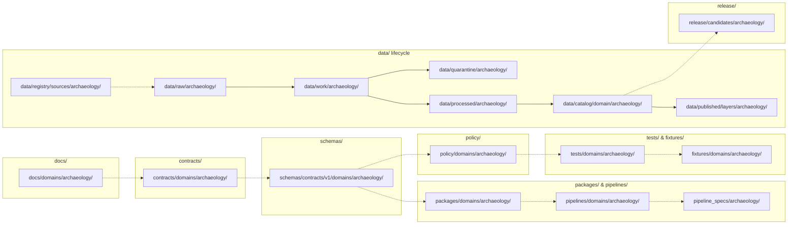

<!-- [KFM_META_BLOCK_V2]
doc_id: kfm://doc/docs/domains/archaeology/missing_or_planned_files
title: Archaeology — Missing or Planned Files
type: standard
version: v1
status: draft
owners: TBD — Archaeology domain stewards + Directory Rules reviewers
created: 2026-05-15
updated: 2026-05-15
policy_label: public
related:
  - docs/doctrine/directory-rules.md
  - docs/registers/VERIFICATION_BACKLOG.md
  - docs/registers/DRIFT_REGISTER.md
  - docs/domains/archaeology/README.md
  - kfm://doc/docs/standards/PROV
tags: [kfm, archaeology, planning, directory-rules, backlog]
notes:
  - Repository not mounted in this session; all path claims are PROPOSED.
  - Tracks the archaeology domain lane file inventory per Directory Rules §12.
[/KFM_META_BLOCK_V2] -->

# 🏺 Archaeology — Missing or Planned Files

> Working inventory of every file the archaeology domain lane is **expected** to carry, what its placement should be under Directory Rules §12, and whether it is currently **present, planned, missing, deferred, or unverified**. This document is a planning ledger, not a publication artifact.

<p align="left">
  
  
  
  
  
  
</p>

**Status:** draft &middot; **Owners:** Archaeology domain stewards + Directory Rules reviewers *(TBD; placeholder pending CODEOWNERS)* &middot; **Last updated:** 2026-05-15

> [!IMPORTANT]
> The Kansas Frontier Matrix repository is **not mounted in this session**. Every path and file in this ledger is **PROPOSED** under Directory Rules §12 and **NEEDS VERIFICATION** against the live repo before any row may be promoted to PRESENT. Do not treat this document as proof that any file exists.

> [!WARNING]
> **Archaeology fails closed by default.** Exact archaeological-site geometry, burial and human remains, sacred sites, collection security, looting-risk exposure, and private-landowner detail must not be published, fixtured, schema'd, or test-sampled in a way that places sensitive precision in public-readable paths. Every row in this ledger that touches geometry, location, or steward-only material **MUST** route through generalization, redaction, transform receipts, and review state before any path is created.

---

## Contents

1. [Scope](#1-scope)
2. [How to read this file](#2-how-to-read-this-file)
3. [Expected lane shape](#3-expected-lane-shape)
4. [Files inventory by responsibility root](#4-files-inventory-by-responsibility-root)
   - [4.1 `docs/domains/archaeology/`](#41-docsdomainsarchaeology)
   - [4.2 `contracts/domains/archaeology/`](#42-contractsdomainsarchaeology)
   - [4.3 `schemas/contracts/v1/domains/archaeology/`](#43-schemascontractsv1domainsarchaeology)
   - [4.4 `policy/domains/archaeology/`](#44-policydomainsarchaeology)
   - [4.5 `tests/domains/archaeology/`](#45-testsdomainsarchaeology)
   - [4.6 `fixtures/domains/archaeology/`](#46-fixturesdomainsarchaeology)
   - [4.7 `packages/domains/archaeology/`](#47-packagesdomainsarchaeology)
   - [4.8 `pipelines/domains/archaeology/`](#48-pipelinesdomainsarchaeology)
   - [4.9 `pipeline_specs/archaeology/`](#49-pipeline_specsarchaeology)
   - [4.10 `data/` lifecycle phases](#410-data-lifecycle-phases)
   - [4.11 `data/registry/sources/archaeology/`](#411-dataregistrysourcesarchaeology)
   - [4.12 `release/candidates/archaeology/`](#412-releasecandidatesarchaeology)
5. [Cross-cutting and shared files](#5-cross-cutting-and-shared-files)
6. [ADRs that gate these files](#6-adrs-that-gate-these-files)
7. [Verification backlog (file-level)](#7-verification-backlog-file-level)
8. [Update protocol](#8-update-protocol)
9. [Related docs](#9-related-docs)
10. [Appendix](#10-appendix)

---

## 1. Scope

This ledger enumerates the **archaeology-domain lane**: every file the archaeology domain is expected to carry across the canonical responsibility roots defined in `docs/doctrine/directory-rules.md` §12 (Domain Placement Law). Each row names a path under one responsibility root, a one-line purpose, and a planning status.

**In scope**

- File paths under `docs/domains/archaeology/`, `contracts/domains/archaeology/`, `schemas/contracts/v1/domains/archaeology/`, `policy/domains/archaeology/`, `tests/domains/archaeology/`, `fixtures/domains/archaeology/`, `packages/domains/archaeology/`, `pipelines/domains/archaeology/`, `pipeline_specs/archaeology/`, `data/<phase>/archaeology/`, `data/catalog/domain/archaeology/`, `data/published/layers/archaeology/`, `data/registry/sources/archaeology/`, and `release/candidates/archaeology/`.
- Archaeology-specific cross-references into shared roots (e.g., a domain-scoped validator under `tools/validators/domains/archaeology/`).
- ADRs that gate creation or shape of archaeology-lane files.

**Out of scope**

- Cross-domain files that legitimately span multiple domains (e.g., a habitat × archaeology validator) — those live under the lowest common responsibility root *without* a domain segment per Directory Rules §12. Cross-cutting items are listed in §5 only when they materially affect archaeology.
- Object-family **meaning** (lives under `contracts/`) and field-level **shape** (lives under `schemas/`). This document points to those files but does not redefine them.
- Promotion, release, correction, and rollback **decisions** for archaeology releases — those live under `release/` and the archaeology-lane runbooks, not here.
- Generic doctrine — see `docs/doctrine/directory-rules.md`, `docs/doctrine/lifecycle-law.md`, `docs/doctrine/trust-membrane.md`, and the Domains Atlas chapter 15 for foundations.

### Source basis

| Source | Role | Truth label |
|---|---|---|
| `docs/doctrine/directory-rules.md` §§4, 6, 9, 12, 15, 16 | Placement law, README contract, path-validation checklist | CONFIRMED doctrine |
| Kansas Frontier Matrix Domain and Capability Encyclopedia §7.13 — Archaeology and Cultural Heritage | Canonical object families, source families, sensitivity posture, AI behavior | CONFIRMED doctrine |
| KFM Domains Culmination Atlas v1.1 §15 — Archaeology and Cultural Heritage | Ubiquitous language, pipeline gates, API/contract/schema surfaces, validators, verification backlog | CONFIRMED doctrine |
| KFM Unified Implementation Architecture Build Manual §30.7 — Archaeology | Lane scope summary, sources of authority, open verification items | CONFIRMED doctrine |
| Mounted repository state (`git ls-tree` or equivalent) | Path presence, file freshness, fixture content, test pass/fail | **UNKNOWN — repository not mounted in this session** |

---

## 2. How to read this file

### 2.1 Truth labels (KFM)

| Label | Meaning |
|---|---|
| **CONFIRMED** | Verified in this session from attached doctrine docs, schemas, contracts, fixtures, or workspace evidence. |
| **PROPOSED** | Design or path not yet verified in implementation. Default for every path-shaped claim while the repo is unmounted. |
| **INFERRED** | Reasonably derivable from visible evidence but not directly stated. |
| **UNKNOWN** | Not resolvable without more evidence. |
| **NEEDS VERIFICATION** | Checkable, but not yet checked strongly enough to act as fact. |

### 2.2 File-status legend

| Status | Meaning |
|---|---|
| 🟢 PRESENT | File exists in the mounted repo and matches the expected purpose. *(Cannot be confirmed in this session.)* |
| 🟡 PLANNED | Design exists in KFM doctrine; expected path identified; not yet implemented. |
| 🔴 MISSING | Doctrine implies the file should exist but no expected path has been settled here. |
| ⚪ DEFERRED | Explicitly out of scope for the current phase; recorded for traceability. |
| ❓ UNKNOWN | Status not verifiable without mounted-repo evidence. **Default in this session.** |

> [!NOTE]
> Because the repo is not mounted, every row's **Present?** column reads `❓ UNKNOWN`. The **Plan status** column expresses doctrine-derived intent and is the actionable signal for now.

### 2.3 Path-validation reminder

Each row must pass Directory Rules §16 before promotion:

- Responsibility identified · right root · lifecycle phase correct (data only) · domain segment correct · no new root without ADR · no parallel authority · README present · trust-content placement · public-path discipline · compatibility-root discipline · migration discipline · rule cited.

[⬆ Back to top](#contents)

---

## 3. Expected lane shape

The archaeology domain lane follows the uniform pattern declared in Directory Rules §12. The tree below is **PROPOSED**: it reflects what the lane *should* look like, not what is currently checked into any branch.

```text
# PROPOSED archaeology lane — verify against mounted repo before promotion
docs/domains/archaeology/
contracts/domains/archaeology/
schemas/contracts/v1/domains/archaeology/
policy/domains/archaeology/
tests/domains/archaeology/
fixtures/domains/archaeology/
packages/domains/archaeology/
pipelines/domains/archaeology/
pipeline_specs/archaeology/
data/raw/archaeology/
data/work/archaeology/
data/quarantine/archaeology/
data/processed/archaeology/
data/catalog/domain/archaeology/
data/published/layers/archaeology/
data/registry/sources/archaeology/
release/candidates/archaeology/
```



> [!NOTE]
> The diagram is doctrinal flow, **not** a build dependency graph. The dashed arrows indicate "evidence flows downstream"; the solid arrows trace the lifecycle path. Promotion between phases remains a governed state transition, not a file move.

[⬆ Back to top](#contents)

---

## 4. Files inventory by responsibility root

Every row below is **PROPOSED** under Directory Rules §12. The **Plan status** column reflects doctrine-derived intent; the **Present?** column will remain `❓ UNKNOWN` until the repo is mounted and inspected.

### 4.1 `docs/domains/archaeology/`

Human-facing doctrine, planning, and runbooks for the archaeology lane.

| Proposed path | Purpose | Plan status | Present? | Truth label |
|---|---|---|---|---|
| `docs/domains/archaeology/README.md` | Lane orientation, scope, exclusions, inputs, related folders — per Directory Rules §15 README contract. | 🟡 PLANNED | ❓ | PROPOSED |
| `docs/domains/archaeology/MISSING_OR_PLANNED_FILES.md` | *This document.* Working inventory of expected lane files and their planning status. | 🟢 PRESENT *(this session)* | ❓ | PROPOSED |
| `docs/domains/archaeology/sensitivity-and-publication-posture.md` | Exact-location DENY-by-default policy, sacred/burial/human-remains rules, looting-risk handling, public-safe transform expectations. | 🟡 PLANNED | ❓ | PROPOSED |
| `docs/domains/archaeology/ubiquitous-language.md` | Glossary of `ArchaeologicalSite`, `SiteComponent`, `CulturalTemporalPeriod`, `SurveyProject`, `SurveyTransect`, `ShovelTest`, `TestUnit`, `ExcavationUnit`, `ProvenienceContext`, `StratigraphicUnit`, `ArtifactRecord`, `CollectionRepositoryRecord`, `CandidateFeature`, `PublicationTransformReceipt`, and related terms — drawn verbatim from the Domains Atlas §15.C. | 🟡 PLANNED | ❓ | PROPOSED |
| `docs/domains/archaeology/source-families.md` | Source-role expectations for SHPO/state-inventory, NRHP-like listings, field-survey forms, excavation records, artifact/collection/repository records, lab reports, historic maps/plats, and oral history / cultural knowledge. | 🟡 PLANNED | ❓ | PROPOSED |
| `docs/domains/archaeology/cross-lane-relations.md` | Relations to Spatial Foundation, Roads/Rail, Settlements, and Hazards lanes — per Domains Atlas §15.F. | 🟡 PLANNED | ❓ | PROPOSED |
| `docs/domains/archaeology/pipeline-shape.md` | RAW → WORK/QUARANTINE → PROCESSED → CATALOG/TRIPLET → PUBLISHED gates as applied to archaeology. | 🟡 PLANNED | ❓ | PROPOSED |
| `docs/domains/archaeology/governed-ai-behavior.md` | ANSWER / ABSTAIN / DENY / ERROR posture for archaeology Focus Mode and Evidence Drawer; AI exact-location denial. | 🟡 PLANNED | ❓ | PROPOSED |
| `docs/domains/archaeology/verification-backlog.md` | Lane-local mirror of the items recorded in `docs/registers/VERIFICATION_BACKLOG.md` that touch archaeology (steward authority, public-geometry thresholds, oral-history protocol, emergency public-layer disablement). | 🟡 PLANNED | ❓ | PROPOSED |
| `docs/domains/archaeology/runbooks/rollback-drill.md` | Archaeology-specific rollback rehearsal procedure tied to `ReleaseManifest`, `RollbackCard`, and `CorrectionNotice`. | 🟡 PLANNED | ❓ | PROPOSED |

### 4.2 `contracts/domains/archaeology/`

Object-family **meaning** in semantic Markdown. Does not define shape.

| Proposed path | Purpose | Plan status | Present? | Truth label |
|---|---|---|---|---|
| `contracts/domains/archaeology/README.md` | Folder authority class, what belongs / does not belong, ADRs that govern it. | 🟡 PLANNED | ❓ | PROPOSED |
| `contracts/domains/archaeology/OBJECT_MAP.md` | Map of every archaeology object family to its schema home and policy gates. | 🟡 PLANNED | ❓ | PROPOSED |
| `contracts/domains/archaeology/archaeological_site.md` | Meaning, identity rule, temporal handling, source-role constraints for `ArchaeologicalSite`. | 🟡 PLANNED | ❓ | PROPOSED |
| `contracts/domains/archaeology/site_component.md` | Meaning of `SiteComponent` and its part-of relation to `ArchaeologicalSite`. | 🟡 PLANNED | ❓ | PROPOSED |
| `contracts/domains/archaeology/survey_project.md` | Meaning of `SurveyProject`, including coverage vs. site distinction. | 🟡 PLANNED | ❓ | PROPOSED |
| `contracts/domains/archaeology/survey_transect.md` | Meaning of `SurveyTransect`. | 🟡 PLANNED | ❓ | PROPOSED |
| `contracts/domains/archaeology/shovel_test.md` | Meaning of `ShovelTest`. | 🟡 PLANNED | ❓ | PROPOSED |
| `contracts/domains/archaeology/test_unit.md` | Meaning of `TestUnit`. | 🟡 PLANNED | ❓ | PROPOSED |
| `contracts/domains/archaeology/excavation_unit.md` | Meaning of `ExcavationUnit`. | 🟡 PLANNED | ❓ | PROPOSED |
| `contracts/domains/archaeology/provenience_context.md` | Meaning of `ProvenienceContext`. | 🟡 PLANNED | ❓ | PROPOSED |
| `contracts/domains/archaeology/stratigraphic_unit.md` | Meaning of `StratigraphicUnit`. | 🟡 PLANNED | ❓ | PROPOSED |
| `contracts/domains/archaeology/artifact_record.md` | Meaning of `ArtifactRecord` and its relation to `CollectionRepositoryRecord`. | 🟡 PLANNED | ❓ | PROPOSED |
| `contracts/domains/archaeology/collection_repository_record.md` | Meaning of `CollectionRepositoryRecord` and `CollectionAccession`. | 🟡 PLANNED | ❓ | PROPOSED |
| `contracts/domains/archaeology/candidate_feature.md` | Meaning of `CandidateFeature` — candidate-vs-confirmed distinction. | 🟡 PLANNED | ❓ | PROPOSED |
| `contracts/domains/archaeology/remote_sensing_anomaly.md` | Meaning of `RemoteSensingAnomaly`. | 🟡 PLANNED | ❓ | PROPOSED |
| `contracts/domains/archaeology/lidar_candidate.md` | Meaning of `LiDARCandidate` and its candidate-not-site constraints. | 🟡 PLANNED | ❓ | PROPOSED |
| `contracts/domains/archaeology/geophysics_observation.md` | Meaning of `GeophysicsObservation`. | 🟡 PLANNED | ❓ | PROPOSED |
| `contracts/domains/archaeology/three_d_documentation.md` | Meaning of `ThreeDDocumentation`; access-control + transform-receipt requirements. | 🟡 PLANNED | ❓ | PROPOSED |
| `contracts/domains/archaeology/cultural_review.md` | Meaning of `CulturalReview` and steward authority. | 🟡 PLANNED | ❓ | PROPOSED |
| `contracts/domains/archaeology/steward_review.md` | Meaning of `StewardReview`. | 🟡 PLANNED | ❓ | PROPOSED |
| `contracts/domains/archaeology/chronology_assertion.md` | Meaning of `ChronologyAssertion` and `CulturalTemporalPeriod`. | 🟡 PLANNED | ❓ | PROPOSED |
| `contracts/domains/archaeology/sensitivity_transform.md` | Meaning of `SensitivityTransform` and `PublicationTransformReceipt`. | 🟡 PLANNED | ❓ | PROPOSED |
| `contracts/domains/archaeology/archaeology_decision_envelope.md` | Meaning of `ArchaeologyDecisionEnvelope` (ANSWER / ABSTAIN / DENY / ERROR) — per Atlas §15.J. | 🟡 PLANNED | ❓ | PROPOSED |

[⬆ Back to top](#contents)

### 4.3 `schemas/contracts/v1/domains/archaeology/`

Machine shape for each object family. Canonical schema home per **ADR-0001 (PROPOSED to confirm)**.

| Proposed path | Purpose | Plan status | Present? | Truth label |
|---|---|---|---|---|
| `schemas/contracts/v1/domains/archaeology/README.md` | Folder authority class; ADR-0001 reference. | 🟡 PLANNED | ❓ | PROPOSED |
| `schemas/contracts/v1/domains/archaeology/archaeological_site.schema.json` | Field-level shape for `ArchaeologicalSite`. | 🟡 PLANNED | ❓ | PROPOSED |
| `schemas/contracts/v1/domains/archaeology/site_component.schema.json` | Shape for `SiteComponent`. | 🟡 PLANNED | ❓ | PROPOSED |
| `schemas/contracts/v1/domains/archaeology/survey_project.schema.json` | Shape for `SurveyProject`. | 🟡 PLANNED | ❓ | PROPOSED |
| `schemas/contracts/v1/domains/archaeology/survey_transect.schema.json` | Shape for `SurveyTransect`. | 🟡 PLANNED | ❓ | PROPOSED |
| `schemas/contracts/v1/domains/archaeology/shovel_test.schema.json` | Shape for `ShovelTest`. | 🟡 PLANNED | ❓ | PROPOSED |
| `schemas/contracts/v1/domains/archaeology/test_unit.schema.json` | Shape for `TestUnit`. | 🟡 PLANNED | ❓ | PROPOSED |
| `schemas/contracts/v1/domains/archaeology/excavation_unit.schema.json` | Shape for `ExcavationUnit`. | 🟡 PLANNED | ❓ | PROPOSED |
| `schemas/contracts/v1/domains/archaeology/provenience_context.schema.json` | Shape for `ProvenienceContext`. | 🟡 PLANNED | ❓ | PROPOSED |
| `schemas/contracts/v1/domains/archaeology/stratigraphic_unit.schema.json` | Shape for `StratigraphicUnit`. | 🟡 PLANNED | ❓ | PROPOSED |
| `schemas/contracts/v1/domains/archaeology/artifact_record.schema.json` | Shape for `ArtifactRecord`. | 🟡 PLANNED | ❓ | PROPOSED |
| `schemas/contracts/v1/domains/archaeology/collection_repository_record.schema.json` | Shape for `CollectionRepositoryRecord` and `CollectionAccession`. | 🟡 PLANNED | ❓ | PROPOSED |
| `schemas/contracts/v1/domains/archaeology/candidate_feature.schema.json` | Shape for `CandidateFeature`. | 🟡 PLANNED | ❓ | PROPOSED |
| `schemas/contracts/v1/domains/archaeology/remote_sensing_anomaly.schema.json` | Shape for `RemoteSensingAnomaly`. | 🟡 PLANNED | ❓ | PROPOSED |
| `schemas/contracts/v1/domains/archaeology/lidar_candidate.schema.json` | Shape for `LiDARCandidate`. | 🟡 PLANNED | ❓ | PROPOSED |
| `schemas/contracts/v1/domains/archaeology/geophysics_observation.schema.json` | Shape for `GeophysicsObservation`. | 🟡 PLANNED | ❓ | PROPOSED |
| `schemas/contracts/v1/domains/archaeology/three_d_documentation.schema.json` | Shape for `ThreeDDocumentation`. | 🟡 PLANNED | ❓ | PROPOSED |
| `schemas/contracts/v1/domains/archaeology/cultural_review.schema.json` | Shape for `CulturalReview`. | 🟡 PLANNED | ❓ | PROPOSED |
| `schemas/contracts/v1/domains/archaeology/steward_review.schema.json` | Shape for `StewardReview`. | 🟡 PLANNED | ❓ | PROPOSED |
| `schemas/contracts/v1/domains/archaeology/chronology_assertion.schema.json` | Shape for `ChronologyAssertion` and `CulturalTemporalPeriod`. | 🟡 PLANNED | ❓ | PROPOSED |
| `schemas/contracts/v1/domains/archaeology/sensitivity_transform.schema.json` | Shape for `SensitivityTransform`. | 🟡 PLANNED | ❓ | PROPOSED |
| `schemas/contracts/v1/domains/archaeology/publication_transform_receipt.schema.json` | Shape for `PublicationTransformReceipt`. | 🟡 PLANNED | ❓ | PROPOSED |
| `schemas/contracts/v1/domains/archaeology/archaeology_decision_envelope.schema.json` | Shape for `ArchaeologyDecisionEnvelope` (ANSWER / ABSTAIN / DENY / ERROR). | 🟡 PLANNED | ❓ | PROPOSED |
| `schemas/contracts/v1/domains/archaeology/evidence_drawer_payload.schema.json` | Archaeology-projection of `EvidenceDrawerPayload` + `EvidenceBundle` projection. | 🟡 PLANNED | ❓ | PROPOSED |
| `schemas/contracts/v1/domains/archaeology/layer_manifest.schema.json` | Archaeology-specific `LayerManifest` shape (public-safe layers only). | 🟡 PLANNED | ❓ | PROPOSED |

### 4.4 `policy/domains/archaeology/`

Allow / deny / restrict / abstain decisions. Default posture is **DENY by default for exact location and sensitive material.**

| Proposed path | Purpose | Plan status | Present? | Truth label |
|---|---|---|---|---|
| `policy/domains/archaeology/README.md` | Folder authority class; default-deny posture statement. | 🟡 PLANNED | ❓ | PROPOSED |
| `policy/domains/archaeology/exact_location_deny.rego` *(or equivalent policy language)* | Deny exact site geometry on public paths; require generalization or steward-only review. | 🟡 PLANNED | ❓ | PROPOSED |
| `policy/domains/archaeology/burial_and_human_remains_deny.rego` | Deny burial, human-remains, and sacred-site exposure regardless of source role. | 🟡 PLANNED | ❓ | PROPOSED |
| `policy/domains/archaeology/sacred_site_deny.rego` | Deny sacred-site exposure; route to steward review. | 🟡 PLANNED | ❓ | PROPOSED |
| `policy/domains/archaeology/candidate_not_site.rego` | Enforce `CandidateFeature` and `LiDARCandidate` cannot be presented as confirmed sites. | 🟡 PLANNED | ❓ | PROPOSED |
| `policy/domains/archaeology/rights_and_cultural_review.rego` | Block public release when source rights, source-role, sensitivity, or cultural review is unresolved. | 🟡 PLANNED | ❓ | PROPOSED |
| `policy/domains/archaeology/looting_risk_deny.rego` | Deny releases that could enable looting-risk exposure. | 🟡 PLANNED | ❓ | PROPOSED |
| `policy/domains/archaeology/collection_security_deny.rego` | Deny collection-security-sensitive details on public paths. | 🟡 PLANNED | ❓ | PROPOSED |
| `policy/domains/archaeology/ai_exact_location_deny.rego` | AI must DENY exact-location inference and public claims about restricted sites. | 🟡 PLANNED | ❓ | PROPOSED |
| `policy/domains/archaeology/oral_history_consent.rego` | Enforce community/oral-history consent and use-restriction terms — **NEEDS VERIFICATION** of protocol shape. | 🟡 PLANNED | ❓ | PROPOSED |

[⬆ Back to top](#contents)

### 4.5 `tests/domains/archaeology/`

Proofs that the rules are enforceable. Test families derived from Domains Atlas §15.K.

| Proposed path | Purpose | Plan status | Present? | Truth label |
|---|---|---|---|---|
| `tests/domains/archaeology/README.md` | Test inventory, fixture references, run instructions. | 🟡 PLANNED | ❓ | PROPOSED |
| `tests/domains/archaeology/test_schema_validation.py` | Validate every archaeology schema in `schemas/contracts/v1/domains/archaeology/` parses and accepts/rejects fixtures correctly. | 🟡 PLANNED | ❓ | PROPOSED |
| `tests/domains/archaeology/test_source_descriptor.py` | Source descriptor + source-role validation for archaeology sources. | 🟡 PLANNED | ❓ | PROPOSED |
| `tests/domains/archaeology/test_evidence_bundle_required.py` | Every claim-bearing artifact must resolve to an `EvidenceBundle`. | 🟡 PLANNED | ❓ | PROPOSED |
| `tests/domains/archaeology/test_candidate_not_site.py` | `CandidateFeature` / `LiDARCandidate` cannot be promoted to confirmed site without source evidence and steward review. | 🟡 PLANNED | ❓ | PROPOSED |
| `tests/domains/archaeology/test_public_no_leak.py` | Public layers, manifests, and tile attributes contain no exact-site geometry, sensitive attributes, or PII. | 🟡 PLANNED | ❓ | PROPOSED |
| `tests/domains/archaeology/test_rights_and_cultural_review.py` | Releases without resolved rights or completed cultural review are denied. | 🟡 PLANNED | ❓ | PROPOSED |
| `tests/domains/archaeology/test_exact_sensitive_geometry_denial.py` | Exact sensitive geometry fixtures fail before tile build or public release. | 🟡 PLANNED | ❓ | PROPOSED |
| `tests/domains/archaeology/test_catalog_closure.py` | Catalog / proof closure passes for archaeology release candidates. | 🟡 PLANNED | ❓ | PROPOSED |
| `tests/domains/archaeology/test_ai_exact_location_denial.py` | Governed AI denies exact-location inference and abstains where evidence is insufficient. | 🟡 PLANNED | ❓ | PROPOSED |
| `tests/domains/archaeology/test_temporal_logic.py` | `source`, `observed`, `valid`, `retrieval`, `release`, and `correction` times stay distinct where material. | 🟡 PLANNED | ❓ | PROPOSED |
| `tests/domains/archaeology/test_release_manifest_validation.py` | Archaeology `ReleaseManifest` references valid `EvidenceBundle`, `ValidationReport`, `RunReceipt`, and rollback target. | 🟡 PLANNED | ❓ | PROPOSED |
| `tests/domains/archaeology/test_rollback_drill.py` | Synthetic rollback drill against a candidate archaeology release. | 🟡 PLANNED | ❓ | PROPOSED |
| `tests/domains/archaeology/test_no_network_fixtures.py` | All archaeology fixtures resolve without external network calls. | 🟡 PLANNED | ❓ | PROPOSED |

### 4.6 `fixtures/domains/archaeology/`

Golden, valid, and invalid sample data for tests. **All fixtures must be synthetic or public-safe — no real sensitive locations.**

| Proposed path | Purpose | Plan status | Present? | Truth label |
|---|---|---|---|---|
| `fixtures/domains/archaeology/README.md` | Fixture conventions, redaction rules, "no real sensitive geometry" invariant. | 🟡 PLANNED | ❓ | PROPOSED |
| `fixtures/domains/archaeology/synthetic_candidate_feature/valid.json` | Synthetic `CandidateFeature` with exact geometry denied, generalized public surface — per Atlas §15 thin slice. | 🟡 PLANNED | ❓ | PROPOSED |
| `fixtures/domains/archaeology/synthetic_candidate_feature/sensitive_geometry_deny.json` | Synthetic exact-geometry fixture that *must* be rejected by the policy gate. | 🟡 PLANNED | ❓ | PROPOSED |
| `fixtures/domains/archaeology/synthetic_archaeological_site/public_generalized_tile.json` | Public-safe generalized representation paired with steward exact-site review record. | 🟡 PLANNED | ❓ | PROPOSED |
| `fixtures/domains/archaeology/synthetic_steward_review/approve.json` | Synthetic `StewardReview` approving a candidate-to-site promotion. | 🟡 PLANNED | ❓ | PROPOSED |
| `fixtures/domains/archaeology/synthetic_steward_review/deny.json` | Synthetic `StewardReview` denying promotion (looting-risk, sensitivity unresolved). | 🟡 PLANNED | ❓ | PROPOSED |
| `fixtures/domains/archaeology/synthetic_source_descriptor/shpo_like.json` | Synthetic state-inventory SHPO-like source descriptor (no real records). | 🟡 PLANNED | ❓ | PROPOSED |
| `fixtures/domains/archaeology/synthetic_publication_transform_receipt/generalize_to_township.json` | Synthetic generalization-transform receipt; demonstrates transform audit chain. | 🟡 PLANNED | ❓ | PROPOSED |
| `fixtures/domains/archaeology/stale_source_fixture.json` | Stale source descriptor for stale-state badge and abstain/deny tests. | 🟡 PLANNED | ❓ | PROPOSED |
| `fixtures/domains/archaeology/invalid/missing_evidence_ref.json` | Invalid fixture missing `EvidenceRef` — must be rejected by closure tests. | 🟡 PLANNED | ❓ | PROPOSED |

> [!CAUTION]
> Fixture authors must never use **real coordinates** for sensitive archaeological sites — even in tests. Synthetic geometry only. A leaked fixture is a publication leak.

[⬆ Back to top](#contents)

### 4.7 `packages/domains/archaeology/`

Reusable archaeology-specific libraries.

| Proposed path | Purpose | Plan status | Present? | Truth label |
|---|---|---|---|---|
| `packages/domains/archaeology/README.md` | Package authority class; public API surface; consumers. | 🟡 PLANNED | ❓ | PROPOSED |
| `packages/domains/archaeology/identity/` | Deterministic identity helpers (source id + object role + temporal scope + normalized digest). | 🟡 PLANNED | ❓ | PROPOSED |
| `packages/domains/archaeology/generalization/` | Geometry generalization, suppression, and transform-receipt emission. | 🟡 PLANNED | ❓ | PROPOSED |
| `packages/domains/archaeology/candidate-classifier/` | Candidate-vs-confirmed classification helpers (no model is root truth). | 🟡 PLANNED | ❓ | PROPOSED |
| `packages/domains/archaeology/evidence-projection/` | Archaeology-specific `EvidenceBundle` projection for Evidence Drawer payloads. | 🟡 PLANNED | ❓ | PROPOSED |

### 4.8 `pipelines/domains/archaeology/`

Executable pipeline logic — *how* archaeology data is admitted, normalized, validated, cataloged, and released.

| Proposed path | Purpose | Plan status | Present? | Truth label |
|---|---|---|---|---|
| `pipelines/domains/archaeology/README.md` | Pipeline inventory, stages, dependencies. | 🟡 PLANNED | ❓ | PROPOSED |
| `pipelines/domains/archaeology/ingest/` | Connector-emitted raw admission into `data/raw/archaeology/`. | 🟡 PLANNED | ❓ | PROPOSED |
| `pipelines/domains/archaeology/normalize/` | Schema, geometry, time, identity, evidence, rights, and policy normalization with quarantine on failure. | 🟡 PLANNED | ❓ | PROPOSED |
| `pipelines/domains/archaeology/validate/` | Validation pass → `ValidationReport`; closure checks before promotion. | 🟡 PLANNED | ❓ | PROPOSED |
| `pipelines/domains/archaeology/catalog/` | Catalog/proof closure; `EvidenceBundle` and graph/triplet projection emission. | 🟡 PLANNED | ❓ | PROPOSED |
| `pipelines/domains/archaeology/publish/` | Public-safe artifact emission via governed API and manifest, after promotion gate. | 🟡 PLANNED | ❓ | PROPOSED |
| `pipelines/domains/archaeology/rollback/` | Rollback executor referencing `RollbackCard` and `CorrectionNotice`. | 🟡 PLANNED | ❓ | PROPOSED |

### 4.9 `pipeline_specs/archaeology/`

Declarative pipeline configuration — *what* should run.

| Proposed path | Purpose | Plan status | Present? | Truth label |
|---|---|---|---|---|
| `pipeline_specs/archaeology/README.md` | Spec inventory; spec_hash convention. | 🟡 PLANNED | ❓ | PROPOSED |
| `pipeline_specs/archaeology/ingest.spec.yaml` | Declarative ingest spec for archaeology connectors. | 🟡 PLANNED | ❓ | PROPOSED |
| `pipeline_specs/archaeology/normalize.spec.yaml` | Declarative normalization spec, including sensitivity transforms. | 🟡 PLANNED | ❓ | PROPOSED |
| `pipeline_specs/archaeology/validate.spec.yaml` | Declarative validation spec (schema, evidence closure, policy gates). | 🟡 PLANNED | ❓ | PROPOSED |
| `pipeline_specs/archaeology/catalog.spec.yaml` | Catalog/proof spec. | 🟡 PLANNED | ❓ | PROPOSED |
| `pipeline_specs/archaeology/publish.spec.yaml` | Publication spec — generalization profile, redaction, transform-receipt requirements. | 🟡 PLANNED | ❓ | PROPOSED |

[⬆ Back to top](#contents)

### 4.10 `data/` lifecycle phases

Lifecycle data for archaeology. **Public clients and normal UI surfaces must read through governed APIs, never directly from these directories.**

| Proposed path | Purpose | Plan status | Present? | Truth label |
|---|---|---|---|---|
| `data/raw/archaeology/README.md` | Raw admission rules; immutable payload + `SourceDescriptor` contract. | 🟡 PLANNED | ❓ | PROPOSED |
| `data/raw/archaeology/<source_id>/<run_id>/` | Per-source, per-run raw payload tree. | 🟡 PLANNED | ❓ | PROPOSED |
| `data/work/archaeology/README.md` | In-flight normalization workspace. | 🟡 PLANNED | ❓ | PROPOSED |
| `data/quarantine/archaeology/README.md` | Quarantine bucket; reason files, hold-until conditions. | 🟡 PLANNED | ❓ | PROPOSED |
| `data/processed/archaeology/README.md` | Validated normalized objects with `EvidenceRef`, `ValidationReport`, digest closure. | 🟡 PLANNED | ❓ | PROPOSED |
| `data/catalog/domain/archaeology/README.md` | Catalog records, `EvidenceBundle`, graph/triplet projections, release candidates. | 🟡 PLANNED | ❓ | PROPOSED |
| `data/published/layers/archaeology/README.md` | Public-safe published artifacts served via governed APIs and manifests. | 🟡 PLANNED | ❓ | PROPOSED |
| `data/published/layers/archaeology/public-generalized-sites/` | Generalized public site summaries (no exact geometry). | 🟡 PLANNED | ❓ | PROPOSED |
| `data/published/layers/archaeology/public-survey-coverage/` | Public survey-coverage summaries. | 🟡 PLANNED | ❓ | PROPOSED |
| `data/published/layers/archaeology/candidate-features/` | Candidate-feature surfaces (labeled candidate, never site). | 🟡 PLANNED | ❓ | PROPOSED |
| `data/published/layers/archaeology/remote-sensing-anomalies/` | Remote-sensing anomaly surfaces (labeled candidate). | 🟡 PLANNED | ❓ | PROPOSED |
| `data/published/layers/archaeology/chronology-views/` | Chronology / cultural-temporal-period views. | 🟡 PLANNED | ❓ | PROPOSED |

### 4.11 `data/registry/sources/archaeology/`

Source registry for archaeology source families. Each entry records source role, rights, sensitivity, freshness, and authority context.

| Proposed path | Purpose | Plan status | Present? | Truth label |
|---|---|---|---|---|
| `data/registry/sources/archaeology/README.md` | Registry conventions; source-role taxonomy reference. | 🟡 PLANNED | ❓ | PROPOSED |
| `data/registry/sources/archaeology/state_site_inventory.source.yaml` | SHPO / state-inventory source descriptor — **rights NEEDS VERIFICATION**. | 🟡 PLANNED | ❓ | PROPOSED |
| `data/registry/sources/archaeology/nrhp_listings.source.yaml` | Public NRHP-like listings. | 🟡 PLANNED | ❓ | PROPOSED |
| `data/registry/sources/archaeology/field_survey_forms.source.yaml` | Field-survey forms. | 🟡 PLANNED | ❓ | PROPOSED |
| `data/registry/sources/archaeology/excavation_records.source.yaml` | Excavation records and provenience packets. | 🟡 PLANNED | ❓ | PROPOSED |
| `data/registry/sources/archaeology/artifact_collection_repository.source.yaml` | Artifact / collection / repository records. | 🟡 PLANNED | ❓ | PROPOSED |
| `data/registry/sources/archaeology/lab_reports.source.yaml` | Lab reports. | 🟡 PLANNED | ❓ | PROPOSED |
| `data/registry/sources/archaeology/historic_maps_plats.source.yaml` | Historic maps, plats, land records, newspapers. | 🟡 PLANNED | ❓ | PROPOSED |
| `data/registry/sources/archaeology/oral_history_cultural_knowledge.source.yaml` | Oral history and cultural-knowledge sources — **protocol NEEDS VERIFICATION** (consent, attribution, use-restriction). | 🟡 PLANNED | ❓ | PROPOSED |
| `data/registry/sources/archaeology/lidar_remote_sensing.source.yaml` | LiDAR / remote sensing / geophysics. | 🟡 PLANNED | ❓ | PROPOSED |
| `data/registry/sources/archaeology/three_d_documentation.source.yaml` | 3D documentation sources. | 🟡 PLANNED | ❓ | PROPOSED |

### 4.12 `release/candidates/archaeology/`

Release decisions, manifests, rollback targets, and correction notices specific to archaeology.

| Proposed path | Purpose | Plan status | Present? | Truth label |
|---|---|---|---|---|
| `release/candidates/archaeology/README.md` | Candidate-release conventions; promotion gate references. | 🟡 PLANNED | ❓ | PROPOSED |
| `release/candidates/archaeology/<candidate_id>/release_manifest.json` | Per-candidate `ReleaseManifest`. | 🟡 PLANNED | ❓ | PROPOSED |
| `release/candidates/archaeology/<candidate_id>/promotion_decision.json` | `PromotionDecision` envelope with reviewer, rollback_target, reasons. | 🟡 PLANNED | ❓ | PROPOSED |
| `release/candidates/archaeology/<candidate_id>/evidence_bundle_ref.json` | Reference into the catalog `EvidenceBundle` supporting the candidate. | 🟡 PLANNED | ❓ | PROPOSED |
| `release/candidates/archaeology/<candidate_id>/rollback_target.json` | Reversible rollback target. | 🟡 PLANNED | ❓ | PROPOSED |
| `release/candidates/archaeology/<candidate_id>/correction_notice.json` | Correction-notice template emitted on regression. | 🟡 PLANNED | ❓ | PROPOSED |

[⬆ Back to top](#contents)

---

## 5. Cross-cutting and shared files

Files that **touch archaeology** but live outside the domain segment per Directory Rules §12 (multi-domain or cross-cutting responsibility). Listed here for traceability only; this ledger does not claim authority over them.

| Proposed path | Why it matters to archaeology | Plan status | Truth label |
|---|---|---|---|
| `tools/validators/evidence_bundle/` | Generic `EvidenceBundle` validator consumed by archaeology tests and pipelines. | 🟡 PLANNED | PROPOSED |
| `tools/validators/source_descriptor/` | Generic source-descriptor validator. | 🟡 PLANNED | PROPOSED |
| `tools/validators/sensitive_geometry/` | Generic sensitive-geometry deny check (archaeology, infrastructure, people-dna-land all consume it). | 🟡 PLANNED | PROPOSED |
| `tools/validators/citation/` | Citation validation for cite-or-abstain posture. | 🟡 PLANNED | PROPOSED |
| `policy/sensitivity/` | Cross-domain sensitivity tier definitions (archaeology contributes burial / sacred / looting-risk tiers). | 🟡 PLANNED | PROPOSED |
| `policy/rights/` | Cross-domain rights and redistribution-class definitions. | 🟡 PLANNED | PROPOSED |
| `apps/governed-api/routes/domains/archaeology/` | Governed API surface for archaeology — exact route names **UNKNOWN**. | 🟡 PLANNED | PROPOSED |
| `packages/cesium/` and `packages/maplibre/` | 2D and 3D renderers that consume archaeology `EvidenceBundle` and `DecisionEnvelope`; renderers are **not** truth paths. | 🟡 PLANNED | PROPOSED |
| `docs/architecture/map-shell.md` | Architecture statement governing 2D/3D admission for archaeology layers. | 🟡 PLANNED | PROPOSED |
| `docs/standards/PROV.md` | W3C PROV-O / PAV conformance brief — archaeology `EvidenceBundle` participates in this provenance posture. | 🟡 PLANNED | PROPOSED |

---

## 6. ADRs that gate these files

The following architectural decisions either exist as drafts in doctrine or are flagged in the open-ADR backlog. Each gates one or more archaeology-lane files.

| ADR | Topic | Why it gates archaeology files | Status |
|---|---|---|---|
| **ADR-0001** | Canonical schema home (`schemas/contracts/v1/...`) | Every row in §4.3 depends on this. | CONFIRMED doctrine / NEEDS VERIFICATION in repo |
| **ADR-S-03** *(open backlog)* | Receipt class home: `schemas/contracts/v1/receipts/` vs. `schemas/contracts/v1/<domain>/receipts/` | Determines where `PublicationTransformReceipt`, `RunReceipt`, and `AIReceipt` schemas live for archaeology. | PROPOSED — open backlog |
| **ADR-S-04** *(open backlog)* | Source-role enum vocabulary v1 | Affects every archaeology source descriptor. | PROPOSED — open backlog |
| **ADR-S-05** *(open backlog)* | Sensitivity tier scheme (T0–T4) | Affects archaeology sensitivity policy and transform receipts. | PROPOSED — open backlog |
| **ADR — Steward authority and confidentiality** *(needed)* | Defines who counts as a steward, how reviews are signed, retention/confidentiality of steward content. | Gates `policy/domains/archaeology/rights_and_cultural_review.rego` and `contracts/domains/archaeology/steward_review.md`. | NEEDS VERIFICATION |
| **ADR — Public geometry thresholds & transform profiles** *(needed)* | Generalization radii, suppression thresholds, township-cell vs. county vs. region generalization. | Gates `policy/domains/archaeology/exact_location_deny.rego` and `packages/domains/archaeology/generalization/`. | NEEDS VERIFICATION |
| **ADR — Oral history / cultural-knowledge protocol** *(needed)* | Consent, attribution, use-restriction, redaction discipline. | Gates `data/registry/sources/archaeology/oral_history_cultural_knowledge.source.yaml` and `policy/domains/archaeology/oral_history_consent.rego`. | NEEDS VERIFICATION |

> [!NOTE]
> Any file in §4 whose creation predates its gating ADR must be marked PROPOSED / CONFLICTED in `docs/registers/DRIFT_REGISTER.md` until the ADR is accepted.

[⬆ Back to top](#contents)

---

## 7. Verification backlog (file-level)

These items must be resolved before promoting individual rows from PLANNED → PRESENT. They mirror, at file granularity, the archaeology open questions recorded in the Domains Atlas §15.N and the Unified Build Manual §30.7.

| # | Item | Files affected | Evidence that would settle it |
|---|---|---|---|
| 1 | Verify steward authority and confidentiality. | `contracts/domains/archaeology/steward_review.md`, `policy/domains/archaeology/rights_and_cultural_review.rego`, `tests/domains/archaeology/test_rights_and_cultural_review.py` | Mounted repo files, schemas, registry entries, tests, logs, emitted artifacts, review records, or release manifests. |
| 2 | Define public geometry thresholds and transform profiles. | `policy/domains/archaeology/exact_location_deny.rego`, `packages/domains/archaeology/generalization/`, `pipeline_specs/archaeology/publish.spec.yaml` | Same. |
| 3 | Verify oral history / cultural-knowledge protocol. | `data/registry/sources/archaeology/oral_history_cultural_knowledge.source.yaml`, `policy/domains/archaeology/oral_history_consent.rego` | Same. |
| 4 | Verify emergency public-layer disablement and rollback drill. | `release/candidates/archaeology/<candidate_id>/rollback_target.json`, `tests/domains/archaeology/test_rollback_drill.py` | Same. |
| 5 | Verify canonical schema home (`schemas/contracts/v1/...`) against ADR-0001. | All rows in §4.3. | Mounted-repo presence + ADR acceptance. |
| 6 | Verify live source rights for SHPO-like, NRHP-like, and excavation-records sources. | `data/registry/sources/archaeology/*.source.yaml` | Source-terms documentation + redistribution-class entries. |
| 7 | Verify archaeology governed-API route names. | `apps/governed-api/routes/domains/archaeology/` | API route registry + integration tests. |
| 8 | Verify whether `contracts/` or `schemas/contracts/v1/` is the live machine-schema authority. | All §4.2 and §4.3 rows. | Repo inspection + ADR-0001 reaffirmation. |

> Lane-level verification backlog items should be **mirrored** (not duplicated) into `docs/registers/VERIFICATION_BACKLOG.md` to keep the global register canonical.

---

## 8. Update protocol

This ledger is **working state**, not doctrine. It must be re-synced whenever the repo changes shape.

```text
update protocol
───────────────
1. Run a directory inspection (git ls-tree / repo browse) against the live branch.
2. For each row:
   a. If the file now exists and matches the expected purpose → mark PRESENT.
   b. If the file exists but in a different path → open a DRIFT_REGISTER entry, do
      not silently rewrite this ledger.
   c. If the file is still absent → leave PLANNED with an updated NEEDS VERIFICATION date.
   d. If doctrine has moved the file out of scope → mark DEFERRED with a
      reason and a forward link.
3. Update the KFM Meta Block v2 `updated:` date.
4. Mirror file-level verification items into docs/registers/VERIFICATION_BACKLOG.md.
5. PR description must cite Directory Rules §16 and any affected ADRs.
```

> [!TIP]
> A row promotion from PLANNED → PRESENT is **not** a publication promotion. It only states that a file exists at the expected path. The file's own governance (validation, policy, evidence, release state, correction, rollback) still applies independently.

[⬆ Back to top](#contents)

---

## 9. Related docs

- `docs/doctrine/directory-rules.md` — Directory Rules §§4, 6, 9, 12, 15, 16 (placement law, README contract, path-validation checklist).
- `docs/doctrine/lifecycle-law.md` — RAW → WORK/QUARANTINE → PROCESSED → CATALOG/TRIPLET → PUBLISHED.
- `docs/doctrine/trust-membrane.md` — Public-path discipline; governed API as sole route to canonical truth.
- `docs/registers/VERIFICATION_BACKLOG.md` — Global verification register; mirror file-level items here.
- `docs/registers/DRIFT_REGISTER.md` — Where to log conflicts between this ledger and the live repo.
- `docs/registers/CANONICAL_LINEAGE_EXPLORATORY.md` — Lineage notes for archaeology-lane moves.
- `docs/adr/ADR-0001-schema-home.md` — Canonical schema home decision.
- `docs/domains/archaeology/README.md` — Lane orientation *(PLANNED)*.
- `docs/standards/PROV.md` — W3C PROV-O / PAV conformance brief.
- `KFM_Domains_Culmination_Atlas_v1_1.pdf` §15 — Archaeology and Cultural Heritage.
- `kfm_encyclopedia.pdf` §7.13 — Archaeology and Cultural Heritage.
- `KFM_Unified_Implementation_Architecture_Build_Manual.pdf` §30.7 — Archaeology.

---

## 10. Appendix

<details>
<summary><strong>A. Canonical archaeology object families (Domains Atlas §15.C, Encyclopedia §7.13.C)</strong></summary>

The following terms are **CONFIRMED** in KFM doctrine; their field-level realization is **PROPOSED** until the schemas in §4.3 land:

- `ArchaeologicalSite`
- `SiteComponent`
- `CulturalTemporalPeriod`
- `SurveyProject`
- `SurveyTransect`
- `ShovelTest`
- `TestUnit`
- `ExcavationUnit`
- `ProvenienceContext`
- `StratigraphicUnit`
- `ArtifactRecord`
- `CollectionRepositoryRecord`
- `CandidateFeature`
- `PublicationTransformReceipt`

Additional terms from the Encyclopedia §7.13.C that round out the family:

- `Survey` / `Artifact` / `Feature` / `Context` *(general roles)*
- `RemoteSensingAnomaly`
- `LiDARCandidate`
- `GeophysicsObservation`
- `ThreeDDocumentation`
- `CulturalReview`
- `StewardReview`
- `CollectionAccession`
- `ChronologyAssertion`
- `SensitivityTransform`

Knowledge-system objects shared across domains: `SourceDescriptor`, `EvidenceRef`, `EvidenceBundle`, `DatasetVersion`, `ValidationReport`, `RunReceipt`, `DecisionEnvelope`, `ReleaseManifest`, `LayerManifest`, `CorrectionNotice`, `RollbackCard`, `ReviewRecord`.

</details>

<details>
<summary><strong>B. Source families and source roles (Domains Atlas §15.D)</strong></summary>

| Source family | Default source role | Sensitivity posture | Rights status |
|---|---|---|---|
| State site inventory / SHPO or equivalent | authority / observation / context / model | sensitive joins fail closed | NEEDS VERIFICATION |
| Public NRHP-like listings | authority / observation / context / model | sensitive joins fail closed | NEEDS VERIFICATION |
| Field survey forms | authority / observation / context / model | sensitive joins fail closed | NEEDS VERIFICATION |
| Excavation records and provenience packets | authority / observation / context / model | sensitive joins fail closed | NEEDS VERIFICATION |
| Artifact / collection / repository records | authority / observation / context / model | sensitive joins fail closed | NEEDS VERIFICATION |
| Lab reports | authority / observation / context / model | sensitive joins fail closed | NEEDS VERIFICATION |
| Historic maps / plats / land records / newspapers | authority / observation / context / model | sensitive joins fail closed | NEEDS VERIFICATION |
| Oral history and cultural knowledge | authority / observation / context / model | sensitive joins fail closed | NEEDS VERIFICATION |
| LiDAR / remote sensing / geophysics | authority / observation / context / model | sensitive joins fail closed | NEEDS VERIFICATION |
| 3D documentation | authority / observation / context / model | sensitive joins fail closed | NEEDS VERIFICATION |

</details>

<details>
<summary><strong>C. Cross-lane relations (Domains Atlas §15.F)</strong></summary>

| This domain | Related lane | Relation type | Constraint |
|---|---|---|---|
| Archaeology | Spatial Foundation | exact / public geometry split and transform receipts | Preserve ownership, source role, sensitivity, and `EvidenceBundle` support. |
| Archaeology | Roads / Rail | historic routes and cultural paths | Same. |
| Archaeology | Settlements | forts, missions, townsites, reservation communities | Same. |
| Archaeology | Hazards | threat, erosion, fire, flood, exposure context with exact-site denial | Same. |

</details>

<details>
<summary><strong>D. Abbreviations</strong></summary>

| Term | Expansion |
|---|---|
| ADR | Architectural Decision Record |
| AI | Artificial Intelligence (governed AI in KFM context) |
| API | Application Programming Interface |
| CARE | Collective Benefit, Authority to Control, Responsibility, Ethics (Indigenous data principles) |
| CI | Continuous Integration |
| DCAT | Data Catalog Vocabulary |
| DENY | Finite outcome — request refused by policy |
| DNA | Deoxyribonucleic Acid (restricted in KFM) |
| FAIR | Findable, Accessible, Interoperable, Reusable |
| GEDCOM | Genealogical Data Communication standard |
| GeoJSON | Geographic JSON encoding |
| LiDAR | Light Detection and Ranging |
| MVT | Mapbox Vector Tile |
| NRHP | National Register of Historic Places |
| OGC | Open Geospatial Consortium |
| PII | Personally Identifiable Information |
| PMTiles | Protomaps Tiles format |
| PR | Pull Request |
| PROV-O | PROV Ontology (W3C) |
| RAW | First lifecycle phase — immutable source payload |
| SHPO | State Historic Preservation Office |
| SLO | Service-Level Objective |
| STAC | SpatioTemporal Asset Catalog |
| TBD | To Be Determined |
| UI | User Interface |
| W3C | World Wide Web Consortium |

</details>

---

**Related:** [Directory Rules](../../doctrine/directory-rules.md) &middot; [Verification Backlog](../../registers/VERIFICATION_BACKLOG.md) &middot; [Drift Register](../../registers/DRIFT_REGISTER.md) &middot; [Archaeology README](./README.md) *(PLANNED)*

**Last updated:** 2026-05-15 &middot; **Next review:** when repo is mounted, or within 6 months — whichever comes first.

[⬆ Back to top](#contents)
