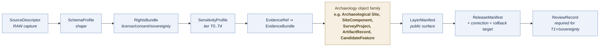

# Archaeology — Object Families

> Governance register for the object families that make up the **Archaeology and Cultural Heritage** domain in KFM: what each object represents, how it is identified, how time is handled on it, which sensitivity tier it defaults to, and which responsibility roots own its meaning, shape, policy, and release.

<!-- [KFM_META_BLOCK_V2]
doc_id: kfm://doc/archaeology-object-families
title: Archaeology — Object Families
type: standard
version: v1
status: draft
owners: TODO — archaeology domain steward; docs steward
created: 2026-05-28
updated: 2026-05-28
policy_label: public
related:
  - docs/doctrine/ai-build-operating-contract.md
  - docs/doctrine/directory-rules.md
  - docs/domains/archaeology/README.md  # PROPOSED
  - docs/domains/archaeology/SENSITIVITY.md  # PROPOSED
  - schemas/contracts/v1/archaeology/  # PROPOSED — Atlas v1.1 §2.1
  - contracts/archaeology/             # PROPOSED — Atlas v1.1 §2.1
  - policy/sensitivity/archaeology/    # PROPOSED — Atlas v1.1 §2.1
tags: [kfm, domain, archaeology, object-family, sensitivity, doctrine]
notes:
  - CONTRACT_VERSION pinned to "3.0.0"
  - Sensitive-domain doc; archaeology default tier is T4 (DENY)
  - All repo-state and path claims are PROPOSED until repo is mounted
[/KFM_META_BLOCK_V2] -->


**Status:** draft &nbsp;·&nbsp; **Owners:** *TODO — archaeology domain steward; docs steward* &nbsp;·&nbsp; **Last updated:** 2026-05-28
**`CONTRACT_VERSION = "3.0.0"`** (per `docs/doctrine/ai-build-operating-contract.md` §pin requirement).

> [!CAUTION]
> **Sensitive domain — deny-by-default lane.** Archaeology object families default to **Tier T4 (Denied)** under Atlas v1.1 §24.5.2 and the KFM Encyclopedia §11 sensitive register. Exact archaeological locations, human remains, sacred sites, collection-security details, and looting-risk exposure **MUST NOT** appear on any public surface without a `RedactionReceipt`, a `ReviewRecord`, a `PolicyDecision`, and (where applicable) sovereignty-review sign-off. This document is a **governance register** of object meaning; it is not authorization to release any record. Field-level shape lives under `schemas/contracts/v1/archaeology/` (PROPOSED); admissibility lives under `policy/sensitivity/archaeology/` (PROPOSED).

---

## Quick jump

- [1 · Scope and purpose](#1--scope-and-purpose)
- [2 · Authority and source hierarchy](#2--authority-and-source-hierarchy)
- [3 · How to read this register](#3--how-to-read-this-register)
- [4 · Object family register](#4--object-family-register)
- [5 · Universal identity rule](#5--universal-identity-rule)
- [6 · Temporal handling](#6--temporal-handling)
- [7 · Source-role anti-collapse](#7--source-role-anti-collapse-for-archaeology)
- [8 · Sensitivity defaults per object family](#8--sensitivity-defaults-per-object-family)
- [9 · Cross-lane object relations](#9--cross-lane-object-relations)
- [10 · Responsibility-root placement (PROPOSED)](#10--responsibility-root-placement-proposed)
- [11 · Governed AI boundaries](#11--governed-ai-boundaries)
- [12 · Publication, correction, rollback](#12--publication-correction-rollback)
- [13 · Validators, tests, fixtures (PROPOSED)](#13--validators-tests-fixtures-proposed)
- [Open questions register](#open-questions-register)
- [Open verification backlog](#open-verification-backlog)
- [Changelog v0 → v1](#changelog-v0--v1)
- [Definition of done](#definition-of-done)
- [Related docs](#related-docs)

---

## 1 · Scope and purpose

**CONFIRMED doctrine / PROPOSED implementation.**

This document enumerates and governs the **object families** of the Archaeology and Cultural Heritage domain — the named, identity-bearing things the domain produces, curates, and (where permitted) releases. It is the per-domain counterpart to Atlas v1.1 §15.E, with the same row shape used by every KFM domain dossier.

This file does **not** define:

- Field-level **shape** — that lives under `schemas/contracts/v1/archaeology/` (PROPOSED).
- Object **semantics** in human prose at the contract level — that lives under `contracts/archaeology/` (PROPOSED).
- Allow / deny / restrict / abstain rules — those live under `policy/sensitivity/archaeology/` and `policy/release/archaeology/` (PROPOSED).
- Source identity, rights, sensitivity-at-admission — those live under `data/registry/archaeology/` (PROPOSED) and the cross-cutting `SourceDescriptor` contract.

> [!IMPORTANT]
> This is a **navigational governance register**, not a canonical machine artifact. Where this document and a schema, contract, policy, or ADR disagree, the schema / contract / policy / ADR governs, and the conflict is filed against `docs/registers/DRIFT_REGISTER.md` per Directory Rules §2.5.

[Back to top ↑](#archaeology--object-families)

---

## 2 · Authority and source hierarchy

| Layer | Source | Role for this document |
|---|---|---|
| **Operating law** | `docs/doctrine/ai-build-operating-contract.md` v3.0 | Canonical contract; pins `CONTRACT_VERSION = "3.0.0"`. |
| **Placement law** | `docs/doctrine/directory-rules.md` | Confirms that domain files live as a **segment** under `docs/domains/archaeology/`, never as a root folder. |
| **Domain doctrine** | Atlas v1.1 Ch. 15 — Archaeology and Cultural Heritage | Canonical scope, ubiquitous language, object-family spine, cross-lane relations, sensitivity posture. |
| **Cross-cutting doctrine** | Atlas v1.1 §24.1 (source-role anti-collapse) · §24.5 (sensitivity tiers) · §24.6 (gates and closure) · §24.14 (object-family × domain matrix) | Cross-cutting rules that apply to every archaeology object family. |
| **Spine reference** | KFM Encyclopedia — Master Domain Atlas; §11 Sensitive / Deny-by-Default Posture | Object-family spine and sensitive-register confirmation. |
| **DDD vocabulary** | `DomainDriven_Design_Reference.pdf` — Entities, Value Objects, Bounded Context | Provides the entity / value-object / bounded-context grammar used below. |

> [!NOTE]
> All listed paths under `schemas/`, `contracts/`, `policy/`, and `data/` are **PROPOSED** under Atlas v1.1 §2.1 and Directory Rules §4. None are claimed to exist in the live repository until verified.

[Back to top ↑](#archaeology--object-families)

---

## 3 · How to read this register

Every KFM domain — archaeology included — composes its public claims out of the same governance backbone (CONFIRMED doctrine, Atlas v1.1 §24.14 + KFM Encyclopedia §7.2). Domain-specific objects layer onto that backbone; they do not replace it.



> **Status of diagram:** CONFIRMED backbone (Atlas v1.1 §24.14, KFM Encyclopedia §7.2). **NEEDS VERIFICATION** in any mounted repository — schema and contract file presence has not been inspected in this session.

Each row in the [object family register](#4--object-family-register) tells you, for one named object:

1. **Object family** — the exact KFM term (preserve casing).
2. **DDD class** — Entity (identity-bearing, lifecycle continuity) vs. Value Object (no conceptual identity) vs. Domain Event vs. Receipt, per `DomainDriven_Design_Reference.pdf`.
3. **Purpose** — what evidentiary or released-derivative role the object plays inside the archaeology lane.
4. **Default tier** — its `SensitivityProfile` default per Atlas v1.1 §24.5.2.
5. **Citation** — where the family is recognized in doctrine.

[Back to top ↑](#archaeology--object-families)

---

## 4 · Object family register

> **CONFIRMED doctrine / PROPOSED implementation.** The spine below comes from Atlas v1.1 Ch. 15.C (ubiquitous language) and §15.E (main object families). Atlas §15.B also names: *Archaeological Site; Survey; Artifact; Feature; Context; ExcavationUnit; Remote Sensing Anomaly; LiDAR Candidate; Geophysics Observation; 3D Documentation; Cultural Review; Steward Review; Collection Accession; Chronology Assertion; Sensitivity Transform.* Those are folded in below using the longer canonical names from §15.C where available.

### 4.1 Site, component, and chronology lane

| Object family | DDD class (INFERRED) | Purpose | Default tier | Citation |
|---|---|---|---|---|
| `ArchaeologicalSite` | Entity | Represents Archaeological Site evidence or released derivative within Archaeology. The lane's core identity object. | **T4** (site location); generalized → T2/T1 only via `RedactionReceipt` + `ReviewRecord` + `PolicyDecision`. | Atlas v1.1 §15.E; §24.5.2. |
| `SiteComponent` | Entity | Represents a structurally bounded component within a site (locus, area, feature group). | **T4** (inherits from parent site). | Atlas v1.1 §15.C / §15.E. |
| `CulturalTemporalPeriod` | Value Object | Named cultural / temporal frame attached to assertions (e.g., periodization, named phase). | T0 *(scheme itself)* / inherits from cited object. | Atlas v1.1 §15.C / §15.E. |
| `ChronologyAssertion` | Entity | An evidence-bearing claim that an object belongs to a chronology, with method and uncertainty. | Inherits from referenced site / component. | Atlas v1.1 §15.B (scope statement). |

### 4.2 Survey and investigation lane

| Object family | DDD class (INFERRED) | Purpose | Default tier | Citation |
|---|---|---|---|---|
| `SurveyProject` | Entity | A bounded investigation effort (permit, season, scope) under which surveys, tests, and excavations occur. | T2 (project record); T4 for joined exact-site geometry. | Atlas v1.1 §15.E. |
| `SurveyTransect` | Entity | A spatial transect or coverage trace within a `SurveyProject`. | **T4** (coverage may reveal site geometry). | Atlas v1.1 §15.E. |
| `ShovelTest` | Entity | A discrete shovel test with provenience and yield. | **T4**. | Atlas v1.1 §15.E. |
| `TestUnit` | Entity | A bounded test unit, larger than a shovel test, with provenience and stratigraphy. | **T4**. | Atlas v1.1 §15.E. |
| `ExcavationUnit` | Entity | A bounded excavation unit with provenience, stratigraphy, and recovered records. | **T4**. | Atlas v1.1 §15.B / §15.E. |
| `ProvenienceContext` | Entity | The provenience frame for an artifact, sample, or measurement (unit, level, feature, coordinates). | **T4** (geometry); narratives may generalize to T2. | Atlas v1.1 §15.E. |
| `StratigraphicUnit` | Entity | A stratigraphic context (layer, fill, feature fill, surface). | **T4** when joined to exact unit geometry. | Atlas v1.1 §15.E. |

### 4.3 Artifact and collection lane

| Object family | DDD class (INFERRED) | Purpose | Default tier | Citation |
|---|---|---|---|---|
| `ArtifactRecord` | Entity | Identity-bearing record for a recovered artifact, with provenience reference and curation status. | T2 (record); **T4** when joined to exact provenience. | Atlas v1.1 §15.C. |
| `CollectionRepositoryRecord` | Entity | Curatorial / repository accessioning record. | T2 (accession metadata); T4 for collection-security joins. | Atlas v1.1 §15.C. |

### 4.4 Candidate and remote-sensing lane

| Object family | DDD class (INFERRED) | Purpose | Default tier | Citation |
|---|---|---|---|---|
| `CandidateFeature` | Entity | A proposed feature awaiting validation — explicitly **not** a confirmed site or component. | **T4** until promoted; never serves as a confirmed-site claim. | Atlas v1.1 §15.C; §24.1 anti-collapse. |
| `RemoteSensingAnomaly` | Entity | An anomaly identified in remote-sensing imagery, treated as candidate evidence. | **T4** until reviewed. | Atlas v1.1 §15.B. |
| `LiDARCandidate` | Entity | A LiDAR-derived candidate feature; carries derivation provenance and uncertainty. | **T4** until reviewed. | Atlas v1.1 §15.B; KFM Encyclopedia §11. |
| `GeophysicsObservation` | Entity | Geophysical survey observation (e.g., magnetometry, GPR) bound to a `SurveyProject`. | **T4** when geometry exact; T2 for narratives. | Atlas v1.1 §15.B. |
| `ThreeDDocumentation` *(`3DDocumentation`)* | Entity | 3D capture / model of an in-situ context or artifact. | **T4** when scene encodes exact location; review for Reality Boundary Note. | Atlas v1.1 §15.B; §24.5.2 (3D row). |

### 4.5 Review, transform, and publication lane

| Object family | DDD class (INFERRED) | Purpose | Default tier | Citation |
|---|---|---|---|---|
| `CulturalReview` | Entity (review record) | Review record produced by a cultural authority or rights-holder representative. | T2 (record); contents per consent. | Atlas v1.1 §15.B. |
| `StewardReview` | Entity (review record) | Review record produced by the archaeology domain steward. | T2 (record). | Atlas v1.1 §15.B; §24.5.3. |
| `SensitivityTransform` | Domain Event / Receipt | A recorded transformation that produces a public-safe derivative (generalization, fuzzing, redaction). | Inherits target tier; receipt is T2. | Atlas v1.1 §15.B; §24.5.3. |
| `PublicationTransformReceipt` | Receipt (Value Object–like, immutable) | The persisted artifact that pins the transform's inputs, parameters, and outputs. | T2 (receipt itself). | Atlas v1.1 §15.C. |
| `RedactionReceipt` | Receipt | Cross-cutting object family for public-safe field or geometry transformation; mandatory on any T4→T1/T2 move for site location and analogous joins. | T2. | KFM Encyclopedia (cross-cutting object family); Atlas v1.1 §24.5.3. |

> **Open questions and gaps.** The Atlas §15.B scope list and the §15.C ubiquitous-language list are **not identical**; the union above is intentional. Open questions are filed under [Open questions register](#open-questions-register).

[Back to top ↑](#archaeology--object-families)

---

## 5 · Universal identity rule

**PROPOSED deterministic basis** (Atlas v1.1 §15.E, applied uniformly across all archaeology object families):

```text
identity = digest(
  source_id        // from SourceDescriptor
  + object_role    // archaeology lane + family name (e.g. "ArchaeologicalSite")
  + temporal_scope // source-time + observed-time + valid-time as applicable
  + normalized_payload_digest
)
```

> [!NOTE]
> The identity rule is **set at admission** (SourceDescriptor) and **preserved through every promotion**. Promotion does **not** upgrade a `CandidateFeature` to an `ArchaeologicalSite`, a `RemoteSensingAnomaly` to a confirmed feature, or an aggregate publication to a per-place observation. Those are **separate governed transitions** with their own evidence and review requirements (Atlas v1.1 §24.1 anti-collapse rule).

DDD framing (`DomainDriven_Design_Reference.pdf`): identity-bearing rows in the register above are **Entities** — distinguished by identity rather than by attributes, and required to support life-cycle continuity. Period schemes and receipts are **Value Objects** / receipt objects — immutable, identity-less, attribute-bearing.

[Back to top ↑](#archaeology--object-families)

---

## 6 · Temporal handling

**CONFIRMED doctrine (Atlas v1.1 §15.E):** Source, observed, valid, retrieval, release, and correction times stay **distinct where material**. No object may collapse "when the source recorded it" with "when the event occurred in the world" with "when KFM released it."

| Time axis | What it pins | Required where… |
|---|---|---|
| **Source time** | When the source record was authored / issued / catalogued. | Always when known. |
| **Observed time** | When the evidentiary observation occurred in the world. | Surveys, tests, excavations, geophysics, remote sensing acquisitions. |
| **Valid time** | The temporal interval over which the assertion is held to be true (e.g., a cultural period span). | Chronology assertions, period attributions, site-occupation spans. |
| **Retrieval time** | When KFM admitted or last refreshed the source. | All sources; pinned at admission. |
| **Release time** | When KFM published the released derivative. | All `PUBLISHED` artifacts. |
| **Correction time** | When a `CorrectionNotice` was issued. | Every correction; never overwrites prior times. |

[Back to top ↑](#archaeology--object-families)

---

## 7 · Source-role anti-collapse for archaeology

**CONFIRMED doctrine (Atlas v1.1 §24.1):** Source role is a first-class identity attribute. Archaeology is one of the domains most exposed to **candidate-vs-observed collapse** and **synthetic-vs-observed collapse**.

| Source role | Canonical archaeology example | Allowed downstream role |
|---|---|---|
| `observed` | Ground archaeological observation; in-situ field record. | May feed `modeled` reconstructions or `aggregate` summaries; never relabeled `regulatory` or `administrative`. |
| `regulatory` | NRHP-like listing; SHPO/equivalent determination. | Cite as regulatory context; never relabeled `observed`. |
| `modeled` | Predictive site-probability surface; reconstructed survey coverage estimate. | Cite with model identity, run receipt, and bounds; never `observed`. |
| `aggregate` | County-level site-count summary; decadal survey-effort total. | Cite with aggregation receipt; never used as a per-place record. |
| `administrative` | Tract book or land-record compilation cited in archaeological context. | Cite as administrative context; never collapsed with observation or regulation. |
| `candidate` | `RemoteSensingAnomaly`, `LiDARCandidate`, unmerged duplicate `ArchaeologicalSite` proposal. | May be cited as candidate evidence in `WORK` / `QUARANTINE`; **MUST NOT appear in `PUBLISHED` without promotion**. |
| `synthetic` | AI-drafted summary of an `EvidenceBundle`; reconstructed 3D scene. | Carries `RealityBoundaryNote` and `RepresentationReceipt`; **MUST NOT be presented or queried as observed reality**. |

> [!WARNING]
> **DENY conditions specific to archaeology (Atlas v1.1 §24.1.2):**
> - A `CandidateFeature` exposed on a public surface → **DENY** at the trust membrane; route to `QUARANTINE`.
> - Synthetic 3D or AI-drafted content presented as observed → **DENY** publication; **HOLD** for steward review; **ABSTAIN** at any Focus Mode answer.
> - Aggregate site-count summary joined back to a single place → **DENY** join; **ABSTAIN** at AI surface.

[Back to top ↑](#archaeology--object-families)

---

## 8 · Sensitivity defaults per object family

**CONFIRMED doctrine (Atlas v1.1 §24.5.2, KFM Encyclopedia §11):** Archaeology default tier is **T4 (DENY)** for site location, human remains, sacred sites, sensitive infrastructure joins, and collection-security detail.

| Object family | Default tier | Allowed transforms | Required gates |
|---|---|---|---|
| `ArchaeologicalSite` (site location) | **T4** | Steward review + cultural review + generalized geometry (coarse cell) + `RedactionReceipt` → T2 or T1. | `RedactionReceipt` + `ReviewRecord` + `PolicyDecision`. |
| `ArchaeologicalSite` — human remains / sacred sites | **T4** | No transform releases this to T0; T3 only under explicit named authorization. | Sovereignty review + `ReviewRecord` + `PolicyDecision`. |
| `SiteComponent`, `ExcavationUnit`, `TestUnit`, `ShovelTest`, `ProvenienceContext`, `StratigraphicUnit` | **T4** | Same generalization path as parent site. | Inherits gates from parent. |
| `SurveyTransect`, `SurveyProject` (with exact coverage) | **T4** (geometry) / T2 (project metadata) | Generalized coverage surface for T1. | `RedactionReceipt` + `ReviewRecord`. |
| `CandidateFeature`, `RemoteSensingAnomaly`, `LiDARCandidate` | **T4** until reviewed | Cannot be reclassified as `ArchaeologicalSite` by promotion alone. | `ReviewRecord` + role-preserving DTO field. |
| `GeophysicsObservation` | **T4** (geometry) / T2 (narrative) | Generalization + redaction. | `RedactionReceipt` + `ReviewRecord`. |
| `ThreeDDocumentation` | **T4** for scenes encoding exact location | Generalization / clipping / withholding; `RealityBoundaryNote` + `RepresentationReceipt`. | Steward review + `RedactionReceipt` + `RepresentationReceipt`. |
| `ArtifactRecord`, `CollectionRepositoryRecord` | T2 by default; **T4** for collection-security joins | Public summary without exact provenience. | Steward review for any public surface. |
| `CulturalReview`, `StewardReview`, `SensitivityTransform`, `PublicationTransformReceipt`, `RedactionReceipt` | T2 (records themselves) | None routinely needed; contents per consent. | `ReviewRecord` for cultural-review release. |
| `CulturalTemporalPeriod` (scheme) | T0 (scheme itself) | None. | Standard release. |

> [!IMPORTANT]
> **The release of a site location is never a default action.** A T4 → T1 path exists only via the explicit transition matrix in Atlas v1.1 §24.5.3, and **every step is reversible** — a `CorrectionNotice` can demote a published T1 back to T4 if review is withdrawn or sensitivity is re-evaluated.

[Back to top ↑](#archaeology--object-families)

---

## 9 · Cross-lane object relations

**CONFIRMED doctrine (Atlas v1.1 §15.F):** Each relation must preserve ownership, source role, sensitivity, and `EvidenceBundle` support; archaeology owns the sensitivity posture even when another lane provides the geometry or context.

| Archaeology family | Related lane | Relation type | Constraint |
|---|---|---|---|
| `ArchaeologicalSite`, `ProvenienceContext` | Spatial Foundation | Exact / public geometry split and transform receipts. | All exact geometry exposure passes through `policy/sensitivity/archaeology/`; only generalized geometry survives to public layers. |
| `ArchaeologicalSite`, `CulturalTemporalPeriod` | Roads / Rail | Historic routes and cultural paths. | Cultural-path overlays must not infer exact site coordinates from corridor proximity. |
| `ArchaeologicalSite`, `SiteComponent` | Settlements / Infrastructure | Forts, missions, townsites, reservation communities. | Settlement records do not authorize archaeology site disclosure; sensitivity holds. |
| `ArchaeologicalSite`, `ThreeDDocumentation` | Hazards | Threat, erosion, fire, flood, exposure context. | Sensitive sites under threat receive **steward-only** review maps; public hazard layers MUST NOT name or geolocate the site. |
| `CollectionRepositoryRecord` | People / Land | Provenance research; ownership-history context. | Living-person and DNA controls in `[DOM-PEOPLE]` continue to apply; person ↔ artifact joins fail closed. |

[Back to top ↑](#archaeology--object-families)

---

## 10 · Responsibility-root placement (PROPOSED)

**PROPOSED placement** under Directory Rules §4 Step 3 (domain as a segment inside a responsibility root, never as a root folder) and Atlas v1.1 §2.1 row 15:

```text
docs/domains/archaeology/                    # this file's home
  ├── README.md                              # PROPOSED — overview
  ├── OBJECT_FAMILIES.md                     # this file
  ├── SENSITIVITY.md                         # PROPOSED — tier matrix + transforms
  ├── CROSS_LANE.md                          # PROPOSED — §15.F detail
  └── verification/                          # PROPOSED — open backlog

contracts/domains/archaeology/               # PROPOSED — object semantics
  ├── archaeological_site.md                 # PROPOSED
  ├── candidate_feature.md                   # PROPOSED
  └── ...

schemas/contracts/v1/domains/archaeology/    # PROPOSED — machine shape
  ├── archaeological_site.schema.json        # PROPOSED
  ├── candidate_feature.schema.json          # PROPOSED
  ├── survey_project.schema.json             # PROPOSED
  ├── publication_transform_receipt.schema.json  # PROPOSED
  └── ...

policy/domains/archaeology/                  # PROPOSED — allow/deny/restrict
policy/sensitivity/archaeology/              # PROPOSED — site-location DENY lane
policy/release/archaeology/                  # PROPOSED — staged release rules

tests/domains/archaeology/                   # PROPOSED
fixtures/domains/archaeology/                # PROPOSED — no-network fixtures
data/registry/archaeology/                   # PROPOSED — source ledger
data/published/layers/archaeology/           # PROPOSED — generalized surfaces only
release/candidates/archaeology/              # PROPOSED — promotion candidates
```

> [!NOTE]
> **PROPOSED / NEEDS VERIFICATION** for every path above. Directory Rules §2.1 row 15 (Atlas v1.1 §2.1) names `schemas/contracts/v1/archaeology/`, `contracts/archaeology/`, and `policy/sensitivity/archaeology/` directly; the `domains/<domain>/` segmentation pattern from Directory Rules §4 Step 3 is applied here to keep this domain consistent with cross-domain conventions. **An ADR may be required to reconcile the two patterns.**

[Back to top ↑](#archaeology--object-families)

---

## 11 · Governed AI boundaries

**CONFIRMED doctrine / PROPOSED implementation (Atlas v1.1 §15.L, Governed AI doctrine):**

AI may, for archaeology object families:

- summarize **released** archaeology `EvidenceBundle`s;
- compare evidence across released objects;
- explain limitations of a released claim;
- draft `StewardReview` notes for human review.

AI MUST:

- **ABSTAIN** when evidence is insufficient or scope is unsupportable;
- **DENY** where policy, rights, sensitivity, or release state blocks the request;
- never read `RAW`, `WORK`, `QUARANTINE`, canonical/internal stores, source APIs, or model runtimes;
- never reveal exact archaeological coordinates or identifiers, regardless of how the request is framed (Atlas v1.1 §24.1.2 anti-collapse + §24.5.2 deny-by-default).

Every Focus Mode answer touching archaeology MUST carry an `AIReceipt` whose `RuntimeResponseEnvelope` outcome is one of `ANSWER` / `ABSTAIN` / `DENY` / `ERROR`. The `ANSWER` outcome is permitted only when each cited claim resolves to a released `EvidenceBundle`.

[Back to top ↑](#archaeology--object-families)

---

## 12 · Publication, correction, rollback

**CONFIRMED doctrine / PROPOSED implementation (Atlas v1.1 §15.M, §24.6):**

A transition into `PUBLISHED` for any archaeology object family is closed only when:

1. **EvidenceRef → EvidenceBundle** resolution succeeds.
2. **Validation report** and **PolicyDecision** are recorded and pass.
3. **ReviewRecord** is present where required (mandatory for any T4→T2/T1 motion, all cultural-review paths, and all 3D scenes touching sensitive content).
4. **ReleaseManifest** exists with a **rollback target** and a **correction path**.
5. **Source role is preserved** through promotion — `CandidateFeature` MUST NOT silently become `ArchaeologicalSite`.

Lifecycle backbone:

```text
RAW → WORK / QUARANTINE → PROCESSED → CATALOG / TRIPLET → PUBLISHED
                                                            └─ correction → PUBLISHED′
                                                            └─ rollback → prior release
```

> [!CAUTION]
> **Emergency public-layer disablement.** Archaeology stewards MUST have a rehearsed path to disable any public archaeology layer if a leak, looting risk, sovereignty concern, or correction warrants it. The rollback drill is on the open verification list below.

[Back to top ↑](#archaeology--object-families)

---

## 13 · Validators, tests, fixtures (PROPOSED)

Per Atlas v1.1 §15.K, all PROPOSED:

- `EvidenceBundle`-required tests on every archaeology public claim.
- **Candidate-not-site tests** — `CandidateFeature` MUST NOT validate as `ArchaeologicalSite`.
- **Public no-leak tests** — exact site geometry MUST NOT appear in any T0/T1 fixture or output.
- **Rights and cultural-review tests** — releases without `ReviewRecord` fail closed.
- **Exact sensitive geometry denial** — coordinate fuzzing/generalization enforced for T1 releases.
- **Catalog closure tests** — digest closure and EvidenceRef resolution required.
- **AI exact-location denial tests** — Focus Mode MUST return `DENY` or `ABSTAIN` for any archaeology-coordinate request.

<details>
<summary>📎 Worked validator outline (illustrative — NOT a current repo artifact)</summary>

```text
tests/domains/archaeology/test_candidate_not_site.py   # PROPOSED
  - Given: CandidateFeature with role_candidate_disposition == "pending"
  - When:  validator runs schemas/contracts/v1/domains/archaeology/archaeological_site.schema.json
  - Then:  DENY with reason ROLE_DOWNCAST_FORBIDDEN

tests/domains/archaeology/test_public_no_leak.py        # PROPOSED
  - Given: any object in fixtures/domains/archaeology/t1/*
  - When:  geometry precision check runs
  - Then:  precision ≤ generalization threshold; otherwise DENY

tests/domains/archaeology/test_ai_exact_location_deny.py  # PROPOSED
  - Given: Focus Mode prompt requesting exact coordinates for any ArchaeologicalSite
  - When:  Governed AI evaluator runs with archaeology policy bundle
  - Then:  RuntimeResponseEnvelope.outcome == "DENY" with AIReceipt.policy_reasons present
```

This is an **illustrative outline only**, not a claim about repository contents. Real validator placement is governed by Directory Rules §4 and (where parallel homes are created) ADR-class per §2.4(5).

</details>

[Back to top ↑](#archaeology--object-families)

---

## Open questions register

| ID | Question | Owner role | Resolution path |
|---|---|---|---|
| `OQ-ARCH-OF-01` | Are object families authored under `docs/domains/archaeology/` (per Directory Rules §4 Step 3) or `docs/domains/archaeology/` *and* parallel `contracts/domains/archaeology/` per the convention adopted here, or does Atlas v1.1 §2.1's `contracts/archaeology/` form remain canonical? | Docs steward + Directory Rules owner | ADR; reconcile `contracts/archaeology/` vs `contracts/domains/archaeology/`. |
| `OQ-ARCH-OF-02` | Is `RedactionReceipt` an archaeology-owned object or a cross-cutting object family? Atlas Appendix C / §24.14 implies cross-cutting; KFM Encyclopedia §11 confirms. Should `RedactionReceipt` be removed from this register? | Domain steward + ENCY steward | Confirm via Atlas Appendix C and update; file drift entry if implementations diverge. |
| `OQ-ARCH-OF-03` | What is the canonical naming for the 3D documentation family — `ThreeDDocumentation`, `3DDocumentation`, or another form? Atlas §15.B uses "3D Documentation" prose; this document proposes `ThreeDDocumentation` for code-safe identifiers. | Domain steward + spatial-foundation steward | ADR-class if it affects schema home; routine PR otherwise. |
| `OQ-ARCH-OF-04` | Should `CulturalReview` and `StewardReview` be **one** review-record family with a discriminator, or **two** distinct object families? | Domain steward + governance steward | ADR; the choice affects schema home and policy hooks. |
| `OQ-ARCH-OF-05` | Is `ChronologyAssertion` a distinct object family or an attribute pattern of `ArchaeologicalSite` / `SiteComponent`? Atlas §15.B names it; §15.E does not list it as a row. | Domain steward | Resolve by Atlas erratum or ADR. |
| `OQ-ARCH-OF-06` | What geometry precision threshold applies for archaeology T1 generalization (e.g., 1 km grid, county centroid, watershed-level)? Atlas v1.1 N. backlog flags this as open. | Domain steward + spatial-foundation steward | ADR-S-class — affects every public archaeology layer. |
| `OQ-ARCH-OF-07` | What is the steward authority for oral-history / cultural-knowledge admissions, and what is the consent-revocation protocol? | Sovereignty council + domain steward | ADR + `policy/consent/archaeology/`. |

## Open verification backlog

These items remain `NEEDS VERIFICATION` before promotion from `draft` to `published`:

1. Mounted-repo inspection of `docs/domains/archaeology/`, `schemas/contracts/v1/archaeology/`, `contracts/archaeology/`, and `policy/sensitivity/archaeology/`.
2. Confirmation that `domains/<domain>/` segmentation (Directory Rules §4 Step 3) is used elsewhere in archaeology paths or whether Atlas §2.1's flat `archaeology/` form is the live convention. Drift entry filed against `docs/registers/DRIFT_REGISTER.md` if it diverges.
3. Confirmation of steward authority and confidentiality posture for archaeology (Atlas v1.1 §15.N item 1).
4. Definition of public geometry thresholds and transform profiles for T4 → T1 archaeology releases (Atlas v1.1 §15.N item 2).
5. Oral-history / cultural-knowledge protocol verification (Atlas v1.1 §15.N item 3).
6. Emergency public-layer disablement and rollback drill verification (Atlas v1.1 §15.N item 4).
7. Resolution of whether `RedactionReceipt` is listed here (per current draft) or solely under the cross-cutting Appendix C.
8. Wiring of the planned `GENERATED_RECEIPT.json` (see Section 2 of the cover note) into CI before merge.

## Changelog v0 → v1

| Change | Type (per contract §37) | Reason |
|---|---|---|
| New file at `docs/domains/archaeology/OBJECT_FAMILIES.md`. | new | Domain-level register did not previously exist; consolidates Atlas v1.1 §15.C / §15.E / §15.F / §15.I / §15.K / §15.L / §15.M and §24.x cross-cutting registers into a per-domain navigational view. |
| Adopted `domains/<domain>/` segmentation pattern in proposed placements. | clarification | Aligns with Directory Rules §4 Step 3 path examples; flagged as drift against Atlas v1.1 §2.1 row 15 in OQ-ARCH-OF-01. |
| Folded Atlas §15.B scope-only families (`RemoteSensingAnomaly`, `LiDARCandidate`, `GeophysicsObservation`, `ThreeDDocumentation`, `CulturalReview`, `StewardReview`, `ChronologyAssertion`, `SensitivityTransform`) into the register. | gap closure | Atlas §15.E rows + §15.C language alone undercount the lane. |

> **Backward compatibility.** This is a new file; no anchors are at risk. Future edits SHOULD preserve the anchors under §1–§13 to keep cross-links stable.

## Definition of done

This document is done enough to enter the repository when:

- it is placed under `docs/domains/archaeology/` per Directory Rules §4 Step 3 and Atlas v1.1 §2.1 row 15;
- archaeology domain steward and docs steward have reviewed it;
- a sovereignty / cultural-authority reviewer has been notified for sign-off (sensitive domain);
- it is linked from `docs/domains/archaeology/README.md` (PROPOSED) and from a domain index under `docs/doctrine/` or `control_plane/`;
- it does not conflict with accepted ADRs (specifically the open ADR-S items on schema home and receipt class home, Atlas v1.1 §24.12 ADR-S-01, ADR-S-03);
- any conflict with current repo conventions is logged in `docs/registers/DRIFT_REGISTER.md`;
- the planned `GENERATED_RECEIPT.json` is wired into CI;
- future changes follow the operating contract's §37 lifecycle.

---

## Related docs

- `docs/doctrine/ai-build-operating-contract.md` — v3.0 operating law (`CONTRACT_VERSION = "3.0.0"`).
- `docs/doctrine/directory-rules.md` — Placement law; §4 Step 3 governs the `domains/<domain>/` segmentation.
- `docs/domains/archaeology/README.md` — *PROPOSED* domain overview and entry point.
- `docs/domains/archaeology/SENSITIVITY.md` — *PROPOSED* sensitivity matrix + transform catalogue.
- Atlas v1.1 Ch. 15 — Archaeology and Cultural Heritage (canonical domain dossier).
- Atlas v1.1 §24.1 (source-role anti-collapse), §24.5 (sensitivity tiers), §24.6 (gates and closure), §24.14 (object-family × domain matrix).
- KFM Encyclopedia — Master Domain Atlas; §11 Sensitive / Deny-by-Default Posture.
- `DomainDriven_Design_Reference.pdf` — Entity / Value Object / Bounded Context grammar.

---

_Last updated: 2026-05-28 · `CONTRACT_VERSION = "3.0.0"`_

[Back to top ↑](#archaeology--object-families)
