# Archaeology — Pipeline

> Governance reference for the **RAW → PUBLISHED** pipeline of the Archaeology and Cultural Heritage domain in KFM: which stages exist, which gates close each transition, which artifacts each gate requires, how sensitive-site material is held at each stage, and where the corresponding code, specs, fixtures, and policies live.

<!-- [KFM_META_BLOCK_V2]
doc_id: kfm://doc/archaeology-pipeline
title: Archaeology — Pipeline
type: standard
version: v1
status: draft
owners: TODO — archaeology domain steward; pipeline owner; release reviewer; docs steward
created: 2026-05-28
updated: 2026-05-28
policy_label: public
related:
  - docs/doctrine/ai-build-operating-contract.md
  - docs/doctrine/directory-rules.md
  - docs/domains/archaeology/README.md         # PROPOSED
  - docs/domains/archaeology/OBJECT_FAMILIES.md
  - docs/domains/archaeology/SENSITIVITY.md    # PROPOSED
  - pipelines/domains/archaeology/             # PROPOSED — executable code
  - pipeline_specs/archaeology/                # PROPOSED — declarative specs
  - schemas/contracts/v1/archaeology/          # PROPOSED — Atlas v1.1 §2.1
  - policy/sensitivity/archaeology/            # PROPOSED — Atlas v1.1 §2.1
  - policy/release/archaeology/                # PROPOSED
  - data/registry/archaeology/                 # PROPOSED — source ledger
tags: [kfm, domain, archaeology, pipeline, lifecycle, gates, sensitivity, doctrine]
notes:
  - CONTRACT_VERSION pinned to "3.0.0"
  - Sensitive-domain doc; archaeology default tier is T4 (DENY)
  - All repo-state and path claims are PROPOSED until repo is mounted
  - Companion to docs/domains/archaeology/OBJECT_FAMILIES.md
[/KFM_META_BLOCK_V2] -->


**Status:** draft &nbsp;·&nbsp; **Owners:** *TODO — archaeology steward; pipeline owner; release reviewer; docs steward* &nbsp;·&nbsp; **Last updated:** 2026-05-28
**`CONTRACT_VERSION = "3.0.0"`** (per `docs/doctrine/ai-build-operating-contract.md`).

> [!CAUTION]
> **Sensitive-domain lane — deny-by-default at every gate.** Archaeology objects default to **Tier T4 (Denied)** under Atlas v1.1 §24.5.2 and the KFM Encyclopedia §11 sensitive register. Exact site geometry, human remains, sacred sites, collection-security detail, and looting-risk exposure **MUST** be held at the earliest gate where the risk is detected and **MUST NOT** progress without `RedactionReceipt` + `ReviewRecord` + `PolicyDecision` + (where applicable) sovereignty review. **`CandidateFeature`, `RemoteSensingAnomaly`, and `LiDARCandidate` records have no public-edge path** — there is no admissible promotion from `WORK` / `QUARANTINE` to `PUBLISHED` for candidate-class objects without governed promotion to a different object family.

---

## Quick jump

- [1 · Scope and purpose](#1--scope-and-purpose)
- [2 · Authority and source hierarchy](#2--authority-and-source-hierarchy)
- [3 · Lifecycle backbone](#3--lifecycle-backbone)
- [4 · Source families and admission posture](#4--source-families-and-admission-posture)
- [5 · Pre-RAW — watcher signal stage](#5--pre-raw--watcher-signal-stage)
- [6 · RAW — admission](#6--raw--admission)
- [7 · WORK / QUARANTINE — normalization](#7--work--quarantine--normalization)
- [8 · PROCESSED — validation closure](#8--processed--validation-closure)
- [9 · CATALOG / TRIPLET — evidence and graph closure](#9--catalog--triplet--evidence-and-graph-closure)
- [10 · PUBLISHED — release](#10--published--release)
- [11 · Correction and rollback](#11--correction-and-rollback)
- [12 · Sensitivity transforms in the pipeline](#12--sensitivity-transforms-in-the-pipeline)
- [13 · Cross-cutting receipts and proof objects](#13--cross-cutting-receipts-and-proof-objects)
- [14 · Validators, tests, fixtures (PROPOSED)](#14--validators-tests-fixtures-proposed)
- [15 · Governed AI behavior in the pipeline](#15--governed-ai-behavior-in-the-pipeline)
- [16 · Anti-collapse rules](#16--anti-collapse-rules-in-the-archaeology-pipeline)
- [17 · Responsibility-root placement (PROPOSED)](#17--responsibility-root-placement-proposed)
- [Open questions register](#open-questions-register)
- [Open verification backlog](#open-verification-backlog)
- [Changelog v0 → v1](#changelog-v0--v1)
- [Definition of done](#definition-of-done)
- [Related docs](#related-docs)

---

## 1 · Scope and purpose

**CONFIRMED doctrine / PROPOSED implementation.**

This document is the per-domain pipeline reference for **Archaeology and Cultural Heritage**. It instantiates the canonical KFM lifecycle invariant — `RAW → WORK / QUARANTINE → PROCESSED → CATALOG / TRIPLET → PUBLISHED`, with `Pre-RAW`, `RECEIPTS`, `PROOFS`, `ROLLBACK`, and `REGISTRY` as cross-cutting partners — for the archaeology lane, and pins each gate to the receipts, evidence objects, and review records that doctrine already requires.

It does **not** define:

- Object **meaning** — see [`OBJECT_FAMILIES.md`](./OBJECT_FAMILIES.md).
- Field-level **shape** — see `schemas/contracts/v1/archaeology/` (PROPOSED).
- Allow / deny / restrict / abstain **rules** — see `policy/sensitivity/archaeology/` and `policy/release/archaeology/` (PROPOSED).
- Source identity, rights, and sensitivity **at admission** — see `data/registry/archaeology/` and the cross-cutting `SourceDescriptor` contract.
- Detailed sovereignty review **process** — see `docs/domains/archaeology/SENSITIVITY.md` (PROPOSED) and `policy/consent/archaeology/` (PROPOSED).

> [!IMPORTANT]
> This document is **navigational governance**, not a canonical machine artifact. The validator, schema, contract, ADR, or `ReleaseManifest` governs the actual decision. Where this document and any of those disagree, the machine-readable artifact wins and the conflict is filed against `docs/registers/DRIFT_REGISTER.md` per Directory Rules §2.5.

[Back to top ↑](#archaeology--pipeline)

---

## 2 · Authority and source hierarchy

| Layer | Source | Role for this document |
|---|---|---|
| **Operating law** | `docs/doctrine/ai-build-operating-contract.md` v3.0 | Pins `CONTRACT_VERSION = "3.0.0"`; governs invariants and gate posture. |
| **Placement law** | `docs/doctrine/directory-rules.md` | Confirms that domain files are **segments** under `pipelines/domains/archaeology/`, `pipeline_specs/archaeology/`, `policy/sensitivity/archaeology/`, etc., and never roots. |
| **Build doctrine** | `KFM_Unified_Implementation_Architecture_Build_Manual.md` §6.1 lifecycle table; §6.2 Gates A–G; §7.1 object map | Canonical gate set and object family list. |
| **Domain doctrine** | Atlas v1.1 Ch. 15 — Archaeology and Cultural Heritage; §15.D (source families); §15.H (pipeline shape); §15.I (sensitivity posture); §15.K (validators); §15.L (AI behavior); §15.M (publication / correction / rollback) | Canonical archaeology lane application. |
| **Cross-cutting doctrine** | Atlas v1.1 §24.1 (source-role anti-collapse); §24.5 (sensitivity tiers); §24.6 (Master Pipeline Gate Reference) | Cross-cutting rules applied to archaeology. |
| **Repository structure** | `kfm_repository_structure_guiding_document.md` — `pipelines/`, `pipeline_specs/`, `data/`, `connectors/` README contracts | Per-root contract for each pipeline-bearing root. |
| **Unified synthesis** | `kfm_unified_doctrine_synthesis.md` §6 (lifecycle law); §15 (T0–T4 tiers); §16 (per-domain sensitivity matrix); §29 (governance anti-patterns) | Lifecycle and anti-pattern reference. |

> [!NOTE]
> All paths under `pipelines/`, `pipeline_specs/`, `schemas/`, `contracts/`, `policy/`, and `data/` named in this document are **PROPOSED** under Atlas v1.1 §2.1 and Directory Rules §4 Step 3. None are claimed to exist in the live repository until verified.

[Back to top ↑](#archaeology--pipeline)

---

## 3 · Lifecycle backbone

**CONFIRMED doctrine (Atlas v1.1 §15.H + §24.6, Build Manual §6.1):** Archaeology follows the canonical lifecycle invariant. **Moving a file is not promotion** — promotion is a governed state transition with evidence closure, policy decision, review, manifest, correction path, and rollback target.

```mermaid
flowchart LR
  W[Watcher signal] -->|EventEnvelope| PRE[Pre-RAW]:::pre
  PRE -->|Gate A · Source identity| RAW[RAW]:::raw
  RAW -->|Gate B · Rights and terms| W1[WORK]:::work
  RAW -->|Gate C · Sensitivity| Q[QUARANTINE]:::quar
  W1 -->|Gate D · Schema/contract| PROC[PROCESSED]:::proc
  Q   -->|Steward review| W1
  PROC -->|Gate E · Evidence closure| CAT[CATALOG / TRIPLET]:::cat
  CAT  -->|Gate F · Catalog/provenance| CAT
  CAT  -->|Gate G · Release/rollback| PUB[PUBLISHED]:::pub
  PUB  -.->|CorrectionNotice| PUBp[PUBLISHED&prime;]:::pub
  PUB  -.->|RollbackCard| PUBprev[Prior release]:::pub
  classDef pre  fill:#eef3fb,stroke:#6685b8,color:#1a2b4a;
  classDef raw  fill:#f4eddb,stroke:#a3854a,color:#4a3a17;
  classDef work fill:#e5efe2,stroke:#5b8a55,color:#1f3d1b;
  classDef quar fill:#fbe6e6,stroke:#b34a4a,color:#5a1a1a;
  classDef proc fill:#e1eaf5,stroke:#3d6296,color:#152840;
  classDef cat  fill:#efe2f1,stroke:#7c4f88,color:#2e1438;
  classDef pub  fill:#dcefe1,stroke:#2b7a3f,color:#0e3a1e;
```



> **Status of diagram:** CONFIRMED backbone, applied to archaeology. **NEEDS VERIFICATION** in any mounted repository — actual code, specs, manifests, and CI workflows have not been inspected in this session.

[Back to top ↑](#archaeology--pipeline)

---

## 4 · Source families and admission posture

**CONFIRMED doctrine / PROPOSED implementation (Atlas v1.1 §15.D).** The eight named archaeology source families enter the pipeline through `connectors/` (or, for manual records, through a steward-initiated admission flow). **Source role is set at admission and preserved through every promotion** (Atlas v1.1 §24.1).

| Source family | Typical source role(s) | Rights / sensitivity at admission | Freshness |
|---|---|---|---|
| State site inventory / SHPO or equivalent | `authority` · `observation` · `context` | **Rights NEEDS VERIFICATION**; sensitive joins fail closed. | Source-vintage or cadence specific. |
| Public NRHP-like listings | `authority` · `regulatory` · `context` | **Rights NEEDS VERIFICATION**; sensitive joins fail closed. | Source-vintage or cadence specific. |
| Field survey forms | `observation` · `context` | **Rights NEEDS VERIFICATION**; sensitive joins fail closed. | Source-vintage or cadence specific. |
| Excavation records and provenience packets | `observation` · `context` | **Rights NEEDS VERIFICATION**; sensitive joins fail closed. | Source-vintage or cadence specific. |
| Artifact / collection / repository records | `observation` · `context` · `administrative` | **Rights NEEDS VERIFICATION**; sensitive joins fail closed. | Source-vintage or cadence specific. |
| Lab reports | `observation` · `modeled` (where dated / typed via methods) | **Rights NEEDS VERIFICATION**; sensitive joins fail closed. | Source-vintage or cadence specific. |
| Historic maps / plats / land records / newspapers | `administrative` · `context` | Rights vary by vintage; sensitive joins fail closed. | Source-vintage. |
| Oral history and cultural knowledge | `authority` · `observation` · `context` | **Sovereignty-controlled**; consent and revocation pathway required. | Cadence per sovereignty agreement. |

> [!WARNING]
> **Oral history and cultural knowledge** are sovereignty-controlled in archaeology and **MUST NOT** be admitted, retained, or republished without an explicit, revocable consent pathway tracked under `policy/consent/archaeology/` (PROPOSED). Default disposition when consent is unresolved: **QUARANTINE** with reason code, **DENY** any public-edge path.

[Back to top ↑](#archaeology--pipeline)

---

## 5 · Pre-RAW — watcher signal stage

**CONFIRMED doctrine / PROPOSED implementation (Build Manual §6.1, §7.1; KFM-P1-PROG-0008).**

Watchers monitor archaeology source endpoints (SHPO catalogs, NRHP feeds, lab portals, etc.) and emit **`EventEnvelope` + `EventRunReceipt`** when a change is detected. **Watchers are not publishers** — they MUST NOT write to `RAW`, `PROCESSED`, or `PUBLISHED`; they only signal that admission may be warranted.

| Aspect | Specification |
|---|---|
| **Inputs** | Source endpoint head; previously observed source state; watcher schedule. |
| **Outputs** | `EventEnvelope` (in `data/receipts/ingest/`); `EventRunReceipt` (signed); optional prefilter output. |
| **Required artifacts** | `EventEnvelope`, `EventRunReceipt`, HTTP-validator evidence (ETag / Last-Modified / content-length / manifest checksum) where applicable. |
| **Gate (transition to RAW)** | **Gate A · Source identity** — `SourceDescriptor` must exist, with archaeology source role, authority, rights, sensitivity, cadence, and limitations populated. |
| **Failure-closed outcome** | Source not admitted; event logged as candidate awaiting steward review; no `RAW` write. |
| **Anti-pattern** | A watcher silently writing to `data/raw/archaeology/` or, worse, `data/published/`. This collapses the admission gate and breaks the trust membrane (`kfm_unified_doctrine_synthesis.md` §29; Atlas v1.1 §24.9.2). |

**PROPOSED placement** (Directory Rules §7.3 / §7.4):

```text
connectors/archaeology/                 # source-specific fetchers + watchers
  └── <source>/...
pipelines/watchers/                     # generic watcher harness (cross-domain)
data/receipts/ingest/                   # EventEnvelope, EventRunReceipt
```

[Back to top ↑](#archaeology--pipeline)

---

## 6 · RAW — admission

**CONFIRMED doctrine / PROPOSED implementation (Atlas v1.1 §15.H — RAW row; §24.6 Admission gate).**

The `RAW` stage captures the immutable source payload (or a stable reference) together with its full admission metadata. **Nothing leaves `RAW` until Gate B (rights / terms) and Gate C (sensitivity) have at minimum been evaluated** for archaeology, even if the final decisions are made downstream.

| Aspect | Specification |
|---|---|
| **Handling** | Capture immutable source payload or reference with source role, rights, sensitivity, citation, time, and hash. |
| **Required artifacts** | `SourceDescriptor` (resolved); admission `RunReceipt`; payload hash; rights / sensitivity precheck. |
| **Gate (to WORK / QUARANTINE)** | **Gate B · Rights and terms** + **Gate C · Sensitivity** — `RightsReviewRecord` and a `PolicyDecision` are required. |
| **Failure-closed outcomes** | Unresolved rights → **HOLD** at RAW with `RIGHTS_UNKNOWN`. Unresolved or elevated sensitivity → route to **QUARANTINE** with reason code (`SENSITIVITY_UNRESOLVED`, `SOVEREIGNTY_REVIEW_PENDING`, `SACRED_SITE_FLAG`, `HUMAN_REMAINS_FLAG`, etc.). |
| **Trust-membrane rule** | No public client, no normal UI surface, and no released AI surface MAY reach RAW (Atlas v1.1 §24.6.2). |

**PROPOSED placement:**

```text
data/raw/archaeology/<source_id>/<run_id>/
data/registry/archaeology/sources/
policy/sensitivity/archaeology/              # gate C decision logic
```

[Back to top ↑](#archaeology--pipeline)

---

## 7 · WORK / QUARANTINE — normalization

**CONFIRMED doctrine / PROPOSED implementation (Atlas v1.1 §15.H; §24.6 Normalization gate).**

`WORK` normalizes schema, geometry, time, identity, evidence, rights, and policy onto the **archaeology object families** (see [`OBJECT_FAMILIES.md`](./OBJECT_FAMILIES.md)). `QUARANTINE` holds anything that fails — **never silently promotes** to a downstream stage.

| Aspect | Specification |
|---|---|
| **Handling** | Normalize schema, geometry, time, identity, evidence, rights, and policy; emit a `TransformReceipt`; route failures to `QUARANTINE` with a recorded reason. |
| **Required artifacts** | `TransformReceipt`; working `ValidationReport`; `PolicyDecision`; (for QUARANTINE) reason code + steward note. |
| **Gate (to PROCESSED)** | **Gate D · Schema / contract** — `SchemaValidationReport` PASS; sensitivity-aware normalization complete; `RedactionReceipt` if generalization applied; role-preserving DTO field set. |
| **Quarantine reasons (illustrative)** | `RIGHTS_UNKNOWN` · `SENSITIVITY_UNRESOLVED` · `SACRED_SITE_FLAG` · `HUMAN_REMAINS_FLAG` · `SOVEREIGNTY_REVIEW_PENDING` · `ROLE_COLLAPSE` (candidate ≠ site) · `SCHEMA_MISMATCH` · `MISSING_RECEIPT` · `MISSING_EVIDENCE`. |
| **Recovery** | Steward review; rights resolution; tier reassignment; re-normalize; back to WORK if PASS. |
| **Archaeology-specific rule** | `CandidateFeature`, `RemoteSensingAnomaly`, `LiDARCandidate` MUST be normalized as **candidate** records and MUST NOT validate as `ArchaeologicalSite`. (Atlas v1.1 §24.1 anti-collapse + §15.K candidate-not-site test.) |

**PROPOSED placement:**

```text
data/work/archaeology/<run_id>/
data/quarantine/archaeology/<reason>/<run_id>/
pipelines/normalize/                          # generic
pipelines/domains/archaeology/normalize/      # archaeology-specific normalizers
schemas/contracts/v1/archaeology/             # schemas referenced here
```

[Back to top ↑](#archaeology--pipeline)

---

## 8 · PROCESSED — validation closure

**CONFIRMED doctrine / PROPOSED implementation (Atlas v1.1 §15.H — PROCESSED row; §24.6 Validation gate).**

`PROCESSED` holds validated, normalized archaeology objects together with their receipts and any **public-safe candidate** derivatives. Validators are deterministic and tied to fixtures; nothing leaves PROCESSED without resolvable evidence references.

| Aspect | Specification |
|---|---|
| **Handling** | Emit validated normalized objects, receipts, and public-safe candidates. |
| **Required artifacts** | `EvidenceRef` (resolvable); `ValidationReport` PASS; digest closure; `RedactionReceipt` if applies; `AggregationReceipt` if applies. |
| **Gate (to CATALOG / TRIPLET)** | **Gate E · Evidence closure** — `EvidenceBundle` is constructible from resolvable refs; citations valid; `CitationValidationReport` PASS. |
| **Archaeology-specific validators (PROPOSED)** | EvidenceBundle-required tests; candidate-not-site tests; public no-leak tests; rights and cultural-review tests; exact sensitive-geometry denial; catalog closure tests; AI exact-location denial (Atlas v1.1 §15.K). |
| **Failure-closed outcome** | Stay in WORK; structured `FAIL` outcome with reason code; no public edge. |

**PROPOSED placement:**

```text
data/processed/archaeology/<dataset_id>/<version>/
data/receipts/pipeline/                       # RunReceipt
data/proofs/validation_report/                # ValidationReport
data/proofs/citation_validation/              # CitationValidationReport
tests/domains/archaeology/                    # validator tests
fixtures/domains/archaeology/                 # no-network fixtures
```

[Back to top ↑](#archaeology--pipeline)

---

## 9 · CATALOG / TRIPLET — evidence and graph closure

**CONFIRMED doctrine / PROPOSED implementation (Atlas v1.1 §15.H; §24.6 Catalog closure gate).**

`CATALOG` emits the bound `EvidenceBundle`, the STAC / DCAT / PROV catalog entries, and (where applicable) `TRIPLET` graph projections. **No public surface exists yet** — only release candidates ready for review.

| Aspect | Specification |
|---|---|
| **Handling** | Emit catalog records, `EvidenceBundle`s, graph / triplet projections, and release candidates. |
| **Required artifacts** | `CatalogMatrix` entry; `EvidenceBundle` (closed and signed); STAC / DCAT / PROV records; (if applicable) `TripletManifest`; `CatalogMatrixReport`. |
| **Gate (to PUBLISHED)** | **Gate F · Catalog / provenance** — `CatalogMatrixReport` PASS; all `EvidenceRef`s resolve; digests close. |
| **Failure-closed outcome** | **HOLD** at PROCESSED; structured `FAIL` outcome; no public edge. |
| **Archaeology-specific rule** | The `EvidenceBundle` for any archaeology release candidate MUST carry the tier label (T0–T4), the transform receipts that produced the public-safe geometry (if any), and the citations to the originating source families. |

**PROPOSED placement:**

```text
data/catalog/stac/archaeology/
data/catalog/dcat/archaeology/
data/catalog/prov/archaeology/
data/catalog/domain/archaeology/
data/triplets/                                # cross-domain
data/proofs/evidence_bundle/
release/candidates/archaeology/               # ready for Gate G
```

[Back to top ↑](#archaeology--pipeline)

---

## 10 · PUBLISHED — release

**CONFIRMED doctrine / PROPOSED implementation (Atlas v1.1 §15.H — PUBLISHED row; §15.M; §24.6 Release gate; Build Manual §6.2 Gate G).**

`PUBLISHED` serves **released public-safe** archaeology artifacts through governed APIs and manifests. **Public clients and normal UI surfaces read only from here**, through the trust membrane (Atlas v1.1 §24.6.2).

| Aspect | Specification |
|---|---|
| **Handling** | Serve released public-safe artifacts through governed APIs and manifests. |
| **Required artifacts** | `ReleaseManifest`; `PromotionDecision`; `ProofPack`; `RollbackCard` (rollback target named in advance); correction path; `ReviewRecord` (mandatory for archaeology release of any T4→T1/T2 motion). |
| **Gate (closing)** | **Gate G · Review / release / rollback** — separation of duties (release authority distinct from author for materiality), `PromotionReceipt` + `ReleaseManifest` + `RollbackCard`. |
| **Public surfaces (PROPOSED)** | Generalized site summaries; survey-coverage summaries; candidate-feature surfaces *(public-safe carrier only)*; remote-sensing anomaly surfaces *(public-safe carrier only)*; chronology / context views; threat / risk review views; Evidence Drawer payloads; Focus Mode answers. (Atlas v1.1 §15.G.) |
| **Restricted surfaces (PROPOSED)** | Steward-only review maps; exact-geometry review behind authentication; sovereignty-restricted overlays. |
| **Trust-membrane invariant** | No public surface MAY read `RAW`, `WORK`, `QUARANTINE`, canonical / internal stores, graph internals, vector indexes, source APIs, or model runtimes. |

**PROPOSED placement:**

```text
data/published/layers/archaeology/            # generalized, public-safe only
data/published/api_payloads/                  # governed API payloads
data/published/reports/archaeology/
data/published/stories/                       # cross-domain
release/manifests/archaeology/
release/candidates/archaeology/               # promotion queue
data/receipts/release/                        # PromotionReceipt
data/proofs/proof_pack/
```

[Back to top ↑](#archaeology--pipeline)

---

## 11 · Correction and rollback

**CONFIRMED doctrine / PROPOSED implementation (Atlas v1.1 §15.M; §24.6 Correction / Rollback transitions; Build Manual §7.1).**

| Transition | Pre-condition | Required artifacts | Failure-closed outcome |
|---|---|---|---|
| **Correction** `PUBLISHED → PUBLISHED′` | Detected error, new evidence, sensitivity re-evaluation, or sovereignty review change; downstream derivatives identified. | `CorrectionNotice`; `ReviewRecord`; invalidation list of downstream derivatives; `ReleaseManifest` update or supersession. | Stale-state announcement; **no silent edit**. |
| **Rollback** `PUBLISHED → prior release` | Failed release or post-publication failure; targeted prior release identified. | `RollbackCard`; `CorrectionNotice`; `ReleaseManifest` reverts to prior release; cache-invalidation records; downstream derivative invalidation. | Held at current state until rollback validated. |
| **Tier downgrade** any tier → T4 | Sovereignty / steward request, sensitivity re-evaluation, or rights revocation. | `CorrectionNotice` + `ReviewRecord`. | **Always permitted**; precedes derivative invalidation (Atlas v1.1 §24.5.3). |

> [!CAUTION]
> **Emergency public-layer disablement.** Archaeology stewards MUST have a rehearsed path to disable any public archaeology layer if a leak, looting risk, sovereignty concern, or correction warrants it. The rollback drill is an open verification item (Atlas v1.1 §15.N item 4).

**PROPOSED placement:**

```text
data/rollback/archaeology/<release_id>/
release/corrections/archaeology/
```

[Back to top ↑](#archaeology--pipeline)

---

## 12 · Sensitivity transforms in the pipeline

**CONFIRMED doctrine / PROPOSED implementation (Atlas v1.1 §24.5.2; KFM Encyclopedia §11).**

Every archaeology motion **toward more public** requires both a transform receipt and a review record; every motion **toward less public** needs only a `CorrectionNotice` + `ReviewRecord` (Atlas v1.1 §24.5.3 reading note).

| Path | Required artifacts | Stage at which transform occurs | Reviewer |
|---|---|---|---|
| **T4 → T2** (site location to reviewer-only) | `PolicyDecision` + `ReviewRecord` | WORK / PROCESSED | Steward |
| **T4 → T1** (site location to generalized public) | `RedactionReceipt` + `ReviewRecord` (steward + cultural review where applicable) | PROCESSED / CATALOG | Steward + cultural authority |
| **T4 → T3** (named-agreement restricted) | `PolicyDecision` + `ReviewRecord` + agreement record | PROCESSED / CATALOG | Steward + rights-holder |
| **T2 → T1** | `RedactionReceipt` + `ReviewRecord` | CATALOG / Release | Steward |
| **T1 → T0** *(rarely applicable to archaeology site location)* | `ReleaseManifest` + `ReviewRecord` | Release (Gate G) | Steward + release authority |
| **Any tier → T4** (downgrade) | `CorrectionNotice` + `ReviewRecord` | Correction / Rollback | Steward + rights-holder if applicable |

> [!IMPORTANT]
> **There is no transform that releases human remains or sacred-site locations to T0.** Under Atlas v1.1 §24.5.2, those object classes remain T4 unless a named, sovereignty-approved T3 agreement is in place. **AI Focus Mode MUST `DENY`** any request for exact archaeological coordinates regardless of how the request is framed.

[Back to top ↑](#archaeology--pipeline)

---

## 13 · Cross-cutting receipts and proof objects

**CONFIRMED doctrine (Build Manual §7.1; Atlas v1.1 §24.6).** The archaeology pipeline emits cross-cutting receipts and proof objects at every stage. None are themselves public claims; they are **process memory** that lets the trust membrane be audited.

| Object family | Where emitted | What it proves |
|---|---|---|
| `EventEnvelope` | Pre-RAW | A watcher detected a source-change signal. |
| `EventRunReceipt` | Pre-RAW | Signed admission of a pre-RAW event. |
| `SourceDescriptor` | Pre-RAW → RAW | Source identity, role, rights, sensitivity, cadence, authority. |
| `RunReceipt` | Every pipeline action | Inputs, outputs, tool versions, policy refs, `spec_hash`. |
| `AIReceipt` | Every Focus Mode answer | Model / tool invocation metadata; no private reasoning. |
| `TransformReceipt` | RAW → WORK; WORK → PROCESSED | Normalization, generalization, redaction, or aggregation parameters. |
| `RedactionReceipt` | WORK / PROCESSED (any T4→T1 path) | Public-safe field or geometry transformation pinned to inputs and parameters. |
| `ValidationReport` | WORK → PROCESSED | Schema, geometry, catalog, citation, policy check outcomes. |
| `CitationValidationReport` | PROCESSED → CATALOG | Citations resolve to `EvidenceBundle` / source ledger. |
| `EvidenceBundle` | PROCESSED / CATALOG | Resolved, policy-safe evidence package for a claim. |
| `CatalogMatrix` / `CatalogMatrixReport` | CATALOG | STAC / DCAT / PROV closure; digests bind. |
| `PolicyDecision` | Every gate | Allow / deny / abstain / error with reasons. |
| `ReviewRecord` | Wherever review required | Steward / cultural / release-authority sign-off. |
| `PromotionDecision` / `PromotionReceipt` | Gate G | Auditable state-transition record. |
| `ReleaseManifest` | PUBLISHED | Released layers, evidence, policy, review, correction, rollback targets. |
| `RollbackCard` | PUBLISHED (named in advance) | How to restore prior public state. |
| `CorrectionNotice` | PUBLISHED → PUBLISHED′ | Public correction / supersession; invalidation list. |
| `ProofPack` | PUBLISHED | Release-significant evidence / proof collection. |
| `RecompileManifest` | Cross-cutting | Deterministic inputs / outputs for recompiled docs and indexes. |

[Back to top ↑](#archaeology--pipeline)

---

## 14 · Validators, tests, fixtures (PROPOSED)

**PROPOSED, per Atlas v1.1 §15.K.** Default to **no-network fixture-first validation** (Build Manual; KFM-P1-PROG-0024). All listed validators are PROPOSED.

| Validator | What it enforces | Stage where it fires |
|---|---|---|
| **EvidenceBundle-required** | Every public claim resolves to a closed `EvidenceBundle`. | PROCESSED → CATALOG. |
| **Candidate-not-site** | `CandidateFeature`, `RemoteSensingAnomaly`, `LiDARCandidate` MUST NOT validate as `ArchaeologicalSite`. | WORK → PROCESSED. |
| **Public no-leak** | Exact site geometry MUST NOT appear in any T0 / T1 fixture or output. | PROCESSED, Release. |
| **Rights and cultural-review** | Releases without `ReviewRecord` fail closed. | CATALOG → PUBLISHED. |
| **Exact sensitive-geometry denial** | Coordinate fuzzing / generalization enforced for T1 releases. | PROCESSED / Release. |
| **Catalog closure** | Digest closure + `EvidenceRef` resolution. | CATALOG. |
| **AI exact-location denial** | Focus Mode MUST return `DENY` or `ABSTAIN` for any archaeology-coordinate request. | Runtime / AI surface. |
| **Sovereignty review presence** | Oral-history / cultural-knowledge admissions require an active consent record. | RAW → WORK. |
| **Source-role preservation** | `source_role` set at admission is never edited in place; corrections produce a new descriptor. | All transitions. |

<details>
<summary>📎 Worked validator outline (illustrative — NOT a current repo artifact)</summary>

```text
tests/domains/archaeology/test_candidate_not_site.py    # PROPOSED
  - Given:  CandidateFeature with role_candidate_disposition == "pending"
  - When:   validator runs against archaeological_site.schema.json
  - Then:   DENY with reason ROLE_DOWNCAST_FORBIDDEN

tests/domains/archaeology/test_public_no_leak.py         # PROPOSED
  - Given:  any object in fixtures/domains/archaeology/t1/*
  - When:   geometry precision check runs
  - Then:   precision ≤ generalization threshold; otherwise DENY

tests/domains/archaeology/test_emergency_rollback_drill.py  # PROPOSED
  - Given:  a current PUBLISHED archaeology layer with RollbackCard
  - When:   rollback drill runs
  - Then:   prior release served, cache invalidation receipts emitted,
            CorrectionNotice issued, downstream derivatives marked stale
```

This is an **illustrative outline only**, not a claim about repository contents. Real validator placement is governed by Directory Rules §4 and (where parallel homes are created) ADR-class per §2.4(5).

</details>

[Back to top ↑](#archaeology--pipeline)

---

## 15 · Governed AI behavior in the pipeline

**CONFIRMED doctrine / PROPOSED implementation (Atlas v1.1 §15.L; Governed AI doctrine).**

AI is **interpretive, not authoritative**, anywhere in the archaeology pipeline. Every AI interaction emits an `AIReceipt`; every Focus Mode answer carries a `RuntimeResponseEnvelope` with finite outcome `ANSWER` / `ABSTAIN` / `DENY` / `ERROR`.

| Stage | Allowed AI uses | Required posture |
|---|---|---|
| Pre-RAW / RAW | Triage suggestions for steward review only. | AI MUST NOT admit a source. |
| WORK / QUARANTINE | Draft normalizer hints; flag candidate-vs-site collapse risks. | AI MUST NOT promote candidates. |
| PROCESSED / CATALOG | Draft `StewardReview` notes; assist citation validation. | Citations must resolve; uncited language → ABSTAIN. |
| PUBLISHED | Summarize released `EvidenceBundle`s; compare evidence; explain limitations. | **DENY** any request for exact archaeological coordinates, regardless of framing. |

> [!WARNING]
> **AI never reads `RAW`, `WORK`, `QUARANTINE`, canonical / internal stores, source APIs, or model runtimes.** AI consumes **only released `EvidenceBundle`s and policy-safe context** (Atlas v1.1 §24.5.2 — *Governed AI — RAW / WORK access via AI surface = T4*).

[Back to top ↑](#archaeology--pipeline)

---

## 16 · Anti-collapse rules in the archaeology pipeline

**CONFIRMED doctrine (Atlas v1.1 §24.1; KFM Encyclopedia §11).** Archaeology is one of the highest-risk domains for **candidate-vs-observed** and **synthetic-vs-observed** collapse.

| Collapse pattern | Denied outcome | Guardrail | Stage |
|---|---|---|---|
| `CandidateFeature` exposed on a public surface | **DENY** at trust membrane; route to `QUARANTINE`. | Promotion gate; no `PUBLISHED` edge from `WORK` / `QUARANTINE`. | All stages. |
| Synthetic 3D / AI-drafted content presented as observed | **DENY** publication; **HOLD** for steward review; **ABSTAIN** at AI. | `RealityBoundaryNote` + `RepresentationReceipt`; UI badge. | CATALOG / Release / AI. |
| Aggregate site-count cited as a per-place truth | **DENY** join from aggregate cell to single record; **ABSTAIN** at AI. | Aggregation receipt; geometry-scope guard. | PROCESSED / AI. |
| Administrative compilation (deed index, county incorporation) cited as observed archaeology | **DENY** publication of compilation as observed timeline. | Source-role tag preserved; named record types. | WORK / PROCESSED. |
| `RemoteSensingAnomaly` / `LiDARCandidate` relabeled as `ArchaeologicalSite` by promotion alone | **DENY**; promotion is not a role upgrade. | Candidate-not-site validator. | WORK → PROCESSED. |
| Modeled predictive surface labeled as observation | **DENY** at publication; **ABSTAIN** at AI. | Run receipt + uncertainty surface + role-preserving DTO field. | PROCESSED / Release / AI. |

> [!IMPORTANT]
> **Source role is fixed at admission and never upgraded by promotion.** Atlas v1.1 §24.1: *"Promotion does not upgrade an observation to a regulation, or a model to an aggregate, or a candidate to a verified record — those are separate governed transitions with their own evidence and review requirements."*

[Back to top ↑](#archaeology--pipeline)

---

## 17 · Responsibility-root placement (PROPOSED)

**PROPOSED** under Directory Rules §4 Step 3 (domain as segment, never as root) and the per-root README contracts in `kfm_repository_structure_guiding_document.md`:

```text
docs/domains/archaeology/
  ├── README.md                              # PROPOSED — domain overview
  ├── OBJECT_FAMILIES.md                     # CONFIRMED draft sibling
  ├── PIPELINE.md                            # this file
  ├── SENSITIVITY.md                         # PROPOSED
  └── verification/                          # PROPOSED — open backlog

pipelines/domains/archaeology/               # PROPOSED — executable
  ├── ingest/
  ├── normalize/
  ├── validate/
  ├── catalog/
  ├── publish/
  └── rollback/

pipeline_specs/archaeology/                  # PROPOSED — declarative
connectors/archaeology/                      # PROPOSED — source-specific
schemas/contracts/v1/archaeology/            # PROPOSED — shape
contracts/archaeology/                       # PROPOSED — meaning
policy/sensitivity/archaeology/              # PROPOSED — DENY lane
policy/release/archaeology/                  # PROPOSED — staged release
policy/consent/archaeology/                  # PROPOSED — oral history / cultural
tests/domains/archaeology/                   # PROPOSED
fixtures/domains/archaeology/                # PROPOSED — no-network fixtures
data/registry/archaeology/                   # PROPOSED — source ledger
data/raw/archaeology/                        # PROPOSED — lifecycle
data/work/archaeology/                       # PROPOSED — lifecycle
data/quarantine/archaeology/                 # PROPOSED — lifecycle
data/processed/archaeology/                  # PROPOSED — lifecycle
data/catalog/{stac,dcat,prov,domain}/archaeology/  # PROPOSED — catalog
data/published/layers/archaeology/           # PROPOSED — generalized only
release/manifests/archaeology/               # PROPOSED
release/candidates/archaeology/              # PROPOSED — promotion queue
data/rollback/archaeology/                   # PROPOSED — rollback records
```

> [!NOTE]
> Atlas v1.1 §2.1 row 15 names `schemas/contracts/v1/archaeology/`, `contracts/archaeology/`, and `policy/sensitivity/archaeology/` in flat form; Directory Rules §4 Step 3 illustrates `schemas/contracts/v1/domains/<domain>/`, `policy/domains/<domain>/`, etc. **An ADR may be required to reconcile the two patterns** (see `OQ-ARCH-PIPE-01`).

[Back to top ↑](#archaeology--pipeline)

---

## Open questions register

| ID | Question | Owner role | Resolution path |
|---|---|---|---|
| `OQ-ARCH-PIPE-01` | Does archaeology use flat `archaeology/` segments under each responsibility root (per Atlas v1.1 §2.1) or `domains/archaeology/` (per Directory Rules §4 Step 3 illustration)? | Directory Rules owner + docs steward | ADR — reconcile §2.1 row 15 with §4 Step 3 path examples. |
| `OQ-ARCH-PIPE-02` | What are the **archaeology-specific quarantine reason codes** (sacred-site flag, human-remains flag, sovereignty-review-pending, etc.) and where is the canonical list? | Domain steward + policy owner | Author `policy/sensitivity/archaeology/quarantine_reasons.md` and a controlled enum in schema. |
| `OQ-ARCH-PIPE-03` | What is the canonical **public geometry generalization threshold** for archaeology T1 releases (e.g., 1 km grid, 10 km grid, watershed centroid)? | Domain steward + spatial-foundation steward | ADR — Atlas v1.1 §15.N item 2; affects every public archaeology layer. |
| `OQ-ARCH-PIPE-04` | Which sources from §15.D are admitted in **Phase 12** (sensitive-lane staged build, Atlas v1.1 §21) versus deferred? | Domain steward + release reviewer | Phase plan + connector activation ADRs. |
| `OQ-ARCH-PIPE-05` | What is the **sovereignty / cultural-authority review workflow** for oral-history admission and revocation? | Sovereignty council + domain steward | ADR + `policy/consent/archaeology/`. |
| `OQ-ARCH-PIPE-06` | Where do **`PromotionDecision`** records for archaeology live: `release/manifests/archaeology/`, `data/receipts/release/`, or both? | Release reviewer + Directory Rules owner | Confirm against Build Manual §7.1 and Directory Rules §6.5; file ADR if a parallel home is needed. |
| `OQ-ARCH-PIPE-07` | What is the **rollback-drill cadence** for archaeology, and which release authority approves drill execution against a live public layer? | Release reviewer + domain steward | Author runbook under `docs/runbooks/archaeology/` (PROPOSED). |
| `OQ-ARCH-PIPE-08` | Should **`PublicationTransformReceipt`** be archaeology-specific (per Atlas §15.C) or fold into the cross-cutting `RedactionReceipt` family? | Domain steward + ENCY steward | ADR; resolves a `OBJECT_FAMILIES.md OQ-ARCH-OF-02` adjacency. |

## Open verification backlog

These items remain `NEEDS VERIFICATION` before promotion from `draft` to `published`:

1. Mounted-repo inspection of `pipelines/domains/archaeology/`, `pipeline_specs/archaeology/`, `connectors/archaeology/`, `policy/sensitivity/archaeology/`, `policy/release/archaeology/`, `tests/domains/archaeology/`, and `data/registry/archaeology/`.
2. Inspection of CI workflows that gate archaeology promotions (Gate D / E / F / G).
3. Confirmation that `EventEnvelope` and `EventRunReceipt` are implemented for archaeology watchers and that watchers cannot publish.
4. Confirmation of steward authority and confidentiality posture for archaeology (Atlas v1.1 §15.N item 1).
5. Definition of public geometry thresholds and transform profiles for T4 → T1 archaeology releases (Atlas v1.1 §15.N item 2; `OQ-ARCH-PIPE-03`).
6. Oral-history / cultural-knowledge admission protocol (Atlas v1.1 §15.N item 3; `OQ-ARCH-PIPE-05`).
7. Emergency public-layer disablement and rollback drill (Atlas v1.1 §15.N item 4; `OQ-ARCH-PIPE-07`).
8. Wiring of the planned `GENERATED_RECEIPT.json` (see Section 2 of the cover note) into CI before merge.

## Changelog v0 → v1

| Change | Type (per contract §37) | Reason |
|---|---|---|
| New file at `docs/domains/archaeology/PIPELINE.md`. | new | Per-domain pipeline reference did not previously exist; consolidates Atlas v1.1 §15.H, §15.I, §15.K, §15.L, §15.M with §24.6 master gate reference and Build Manual §6.1 / §6.2 / §7.1 into a single archaeology-lane navigational view. |
| Adopted `pipelines/domains/<domain>/` and `pipeline_specs/<domain>/` placements. | clarification | Aligns with Directory Rules §4 Step 3 path examples and the repository-structure guiding document; flagged as drift against Atlas v1.1 §2.1 row 15 in `OQ-ARCH-PIPE-01`. |
| Made the Pre-RAW watcher signal stage explicit. | gap closure | Atlas v1.1 §15.H starts at RAW; KFM-P1-PROG-0008 and the Build Manual §7.1 object map make Pre-RAW a first-class phase. |
| Pinned each gate (A–G) to a stage transition and to the failure-closed reason codes. | gap closure | Atlas v1.1 §24.6.3 names reason codes; §15.H names stages; this file binds them per-stage for archaeology. |

> **Backward compatibility.** This is a new file; no anchors are at risk. Future edits SHOULD preserve anchors under §1–§17 to keep cross-links stable. The lifecycle invariant `RAW → WORK / QUARANTINE → PROCESSED → CATALOG / TRIPLET → PUBLISHED` and gate letters A–G MUST NOT be renamed without an accepted ADR.

## Definition of done

This document is done enough to enter the repository when:

- it is placed at `docs/domains/archaeology/PIPELINE.md` per Directory Rules §4 Step 3 and Atlas v1.1 §2.1 row 15;
- archaeology domain steward, pipeline owner, release reviewer, and docs steward have reviewed it;
- a sovereignty / cultural-authority reviewer has been notified for sign-off (sensitive domain);
- it is linked from `docs/domains/archaeology/README.md` (PROPOSED) and from a pipeline index or domain index under `docs/doctrine/` or `control_plane/`;
- it does not conflict with accepted ADRs (specifically ADR-S items on schema home and receipt class home, Atlas v1.1 §24.12 ADR-S-01 / ADR-S-03);
- any conflict with current repo conventions is logged in `docs/registers/DRIFT_REGISTER.md`;
- the planned `GENERATED_RECEIPT.json` is wired into CI;
- future changes follow the operating contract's §37 lifecycle.

---

## Related docs

- `docs/doctrine/ai-build-operating-contract.md` — v3.0 operating law (`CONTRACT_VERSION = "3.0.0"`).
- `docs/doctrine/directory-rules.md` — Placement law; §4 Step 3 governs the `domains/<domain>/` segmentation.
- `docs/domains/archaeology/OBJECT_FAMILIES.md` — Companion register of identity-bearing archaeology objects.
- `docs/domains/archaeology/README.md` — *PROPOSED* domain overview and entry point.
- `docs/domains/archaeology/SENSITIVITY.md` — *PROPOSED* tier matrix + transform catalogue.
- `docs/runbooks/archaeology/` — *PROPOSED* runbooks (admission, rollback drill, sovereignty review).
- Atlas v1.1 Ch. 15 — Archaeology and Cultural Heritage (canonical domain dossier).
- Atlas v1.1 §24.1, §24.5, §24.6 — source-role anti-collapse; sensitivity tiers; master pipeline gate reference.
- `KFM_Unified_Implementation_Architecture_Build_Manual.md` §6.1 / §6.2 / §7.1 — lifecycle, gates, object map.
- `kfm_repository_structure_guiding_document.md` — `pipelines/`, `pipeline_specs/`, `connectors/`, `data/`, `release/` per-root contracts.
- KFM Encyclopedia §11 — sensitive / deny-by-default register.
- `kfm_unified_doctrine_synthesis.md` §6 (lifecycle law); §29 (governance anti-patterns); §37 (good-architecture principles).

---

_Last updated: 2026-05-28 · `CONTRACT_VERSION = "3.0.0"`_

[Back to top ↑](#archaeology--pipeline)
