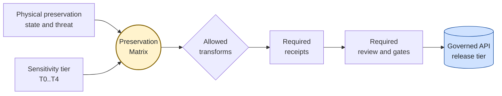
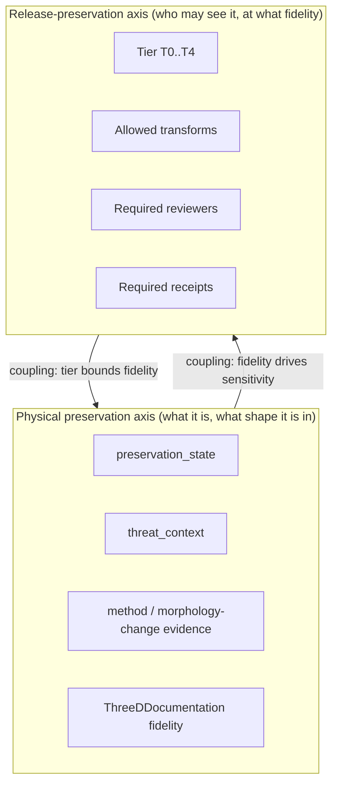
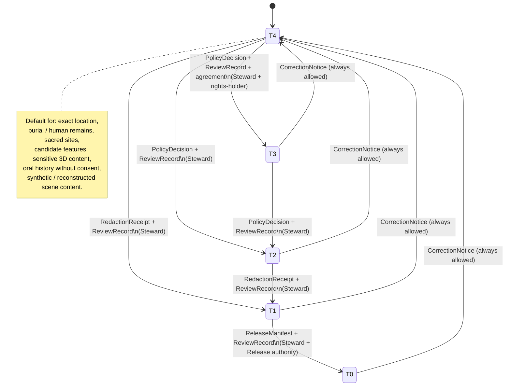

<!-- [KFM_META_BLOCK_V2]
doc_id: kfm://doc/archaeology-preservation-matrix
title: Archaeology · Preservation Matrix
type: standard
version: v0.2
status: draft
owners: Archaeology / Cultural Heritage Steward (TBD); Sensitivity Reviewer (TBD); Release Authority (TBD); Docs Steward (TBD)
created: 2026-05-15
updated: 2026-05-28
policy_label: public
related:
  - docs/doctrine/ai-build-operating-contract.md
  - docs/doctrine/directory-rules.md
  - docs/doctrine/trust-membrane.md          # PROPOSED — link target
  - docs/doctrine/lifecycle-law.md           # PROPOSED — link target
  - docs/domains/README.md                   # PROPOSED — link target
  - docs/domains/archaeology/README.md       # PROPOSED — link target
  - docs/domains/archaeology/OBJECT_FAMILIES.md
  - docs/domains/archaeology/PIPELINE.md
  - docs/domains/archaeology/SENSITIVITY.md  # PROPOSED — link target
  - contracts/domains/archaeology/           # PROPOSED — Atlas v1.1 §2.1 row 15
  - schemas/contracts/v1/domains/archaeology/ # PROPOSED — Directory Rules §4 Step 3
  - schemas/contracts/v1/receipts/           # PROPOSED — receipt schema home
  - policy/domains/archaeology/              # PROPOSED
  - policy/sensitivity/archaeology/          # PROPOSED — DENY lane
  - policy/consent/archaeology/              # PROPOSED — sovereignty / oral history
tags: [kfm, archaeology, sensitivity, preservation, tier-matrix, governance, doctrine]
notes:
  - CONTRACT_VERSION pinned to "3.0.0"
  - Mirrors Atlas v1.1 §24.5 (sensitivity tiers), §24.2 (receipts), §24.6 (gates) into a domain-scoped operational reference.
  - Sensitive-domain doc; archaeology default tier is T4 (DENY) for exact location, human remains, sacred sites.
  - Repository is not mounted in this session; all implementation-layer and path claims are PROPOSED.
  - Companion to docs/domains/archaeology/OBJECT_FAMILIES.md and docs/domains/archaeology/PIPELINE.md.
[/KFM_META_BLOCK_V2] -->

# 🏺 Archaeology · Preservation Matrix

> Two-axis reference for how archaeological evidence is **preserved as evidence** (physical condition, threat, fidelity) and how that evidence is **preserved from public exposure** (sensitivity tier, transform, gate). Every public archaeology surface must resolve on both axes before it leaves the trust membrane.

**Status:** draft &nbsp;·&nbsp; **Domain:** Archaeology / Cultural Heritage &nbsp;·&nbsp; **Owners:** Archaeology Steward · Sensitivity Reviewer · Release Authority · Docs Steward _(all TBD — placeholders pending CODEOWNERS verification)_ &nbsp;·&nbsp; **Last updated:** 2026-05-28
**`CONTRACT_VERSION = "3.0.0"`** _(per `docs/doctrine/ai-build-operating-contract.md`)._

---

## Quick jump

- [§1 Scope and one-page summary](#1-scope-and-one-page-summary)
- [§2 Two axes of preservation](#2-two-axes-of-preservation)
- [§3 Preservation-state axis (physical condition)](#3-preservation-state-axis-physical-condition)
- [§4 Sensitivity-tier axis — the matrix](#4-sensitivity-tier-axis--the-matrix)
- [§5 Allowed transforms](#5-allowed-transforms)
- [§6 Tier transitions and reversibility](#6-tier-transitions-and-reversibility)
- [§7 Pipeline gates (RAW → PUBLISHED)](#7-pipeline-gates-raw--published)
- [§8 Required receipts](#8-required-receipts)
- [§9 Governed AI behavior in this domain](#9-governed-ai-behavior-in-this-domain)
- [§10 Cross-lane interaction notes](#10-cross-lane-interaction-notes)
- [§11 Anti-collapse and source-role preservation](#11-anti-collapse-and-source-role-preservation)
- [§12 How to use this matrix — worked steward workflow](#12-how-to-use-this-matrix--worked-steward-workflow)
- [Open questions register](#open-questions-register)
- [Open verification backlog](#open-verification-backlog)
- [Changelog v0.1 → v0.2](#changelog-v01--v02)
- [Definition of done](#definition-of-done)
- [Related docs](#related-docs)

---

## 1. Scope and one-page summary

The **Preservation Matrix** is the per-domain operational view of three KFM doctrines, narrowed to Archaeology:

- **CONFIRMED doctrine.** The Master Sensitivity / Rights Tier Reference (T0 Open · T1 Generalized · T2 Reviewer · T3 Restricted · T4 Denied) governs what may leave the trust membrane and under what controls. _Source: Atlas v1.1 §24.5._
- **CONFIRMED doctrine.** The Master Pipeline Gate Reference (Admission → Normalization → Validation → Catalog closure → Release → Correction / Rollback) governs how a record moves through the lifecycle. _Source: Atlas v1.1 §24.6; Build Manual §6.2 Gates A–G._
- **CONFIRMED doctrine / PROPOSED implementation.** Archaeological evidence must record **physical preservation state, threat context, method, and morphology-change evidence** before supporting cultural-heritage claims. _Source: Pass 18 idea cards KFM-P18-INV-295 and KFM-P18-INV-459; SRC-P18-005 (Archaeological 3D GIS)._

This document binds those axes into one reference so a steward can answer, for any archaeology object: **what is its physical preservation context, what tier is it at, what transforms are allowed, what receipts are required, what may be released to whom, and at which gate it should be held if support is missing.** A worked end-to-end example for a steward decision is in §12.

> [!IMPORTANT]
> **Exact archaeological locations, burial / human remains, sacred sites, and culturally sensitive material default to T4 (Denied).** Promotion toward a more public tier always requires both a transform receipt and a review record. Demotion toward less public never requires both — a `CorrectionNotice` alone is sufficient. _Source: Atlas v1.1 §24.5.3; ENCY §20.5; DOM-ARCH._

> [!NOTE]
> **Companion docs.** This matrix is the **decision view** of the archaeology lane. For the **identity-bearing objects** the matrix operates on, see [`OBJECT_FAMILIES.md`](./OBJECT_FAMILIES.md). For the **lifecycle code-path and gate sequence**, see [`PIPELINE.md`](./PIPELINE.md). The three documents are designed to be cross-referenced and kept in sync.

**[⬆ Back to top](#-archaeology--preservation-matrix)**

---

## 2. Two axes of preservation

KFM's archaeology lane preserves two different things at once. The matrix is the place where the two reconcile.

| Axis | What it preserves | Primary doctrine | Status |
|---|---|---|---|
| **Physical preservation axis** | The archaeological resource itself: site fabric, stratigraphy, artifacts, 3D documentation, morphology change over time. | Pass 18 idea cards INV-295, INV-459 (PROPOSED fields `preservation_state`, `threat_context`). | CONFIRMED doctrine / PROPOSED field realization |
| **Release-preservation axis** | The public-safety, rights, and sovereignty controls that determine who sees what, at what fidelity, and under what review. | Atlas v1.1 §24.5 (tier reference); ENCY §20.5 (Deny-by-Default Register); DOM-ARCH §§I, M. | CONFIRMED doctrine / PROPOSED tier-bound implementation |

> [!NOTE]
> The two axes are **coupled, not independent**. A high-fidelity preservation-state record (e.g., a 3D damage assessment that pinpoints erosion or looting damage on a specific feature) is itself sensitivity-bearing — _"High-detail preservation evidence can increase exposure risk for vulnerable sites"_ (KFM-P18-INV-295). Decisions on one axis change permissible decisions on the other.

**[⬆ Back to top](#-archaeology--preservation-matrix)**

---

## 3. Preservation-state axis (physical condition)

CONFIRMED doctrine / PROPOSED field realization. Archaeological evidence with material claims about a site or feature should record the following before promotion. _Source: KFM-P18-INV-295 (preservation-state context); KFM-P18-INV-459 (damage-assessment evidence objects); SRC-P18-005._

| Field (PROPOSED) | Purpose | Owning object family | Notes |
|---|---|---|---|
| `preservation_state` | Categorical and/or graded statement of physical preservation (e.g., intact, eroded, looted, inundated, buried, destroyed). | `ArchaeologicalSite`, `SiteComponent`, `Feature`, `ProvenienceContext`. | Categorical vocabulary is **NEEDS VERIFICATION** — no canonical scheme pinned in this session. |
| `threat_context` | Active or potential threats (erosion, fire, flood, looting, development, agricultural disturbance, climate exposure). | `ArchaeologicalSite`, `SiteComponent`. | Cross-references **Archaeology ↔ Hazards** with exact-site denial. _Source: Atlas v1.1 chapter 15 §F._ |
| `method` | Acquisition method and limits — survey, geophysics, LiDAR, photogrammetry, excavation, archival. | `SurveyProject`, `SurveyTransect`, `ExcavationUnit`, `ThreeDDocumentation`, `GeophysicsObservation`. | Required for any 3D documentation. _Source: KFM-P18-INV-459._ |
| `morphology_change_evidence` | Comparative evidence of change over time (multi-epoch 3D, photo comparison, surface model differencing). | `ThreeDDocumentation`, `SiteComponent`. | Tied to `RepresentationReceipt` when surface fidelity differs from evidence fidelity. _Source: Atlas v1.1 §24.2.1._ |
| `quantification_limits` | Stated limits on what the method can measure or detect. | All measurement-bearing objects. | Required for any quantitative damage claim. _Source: KFM-P18-INV-459._ |
| `condition_observed_at` | When the condition was assessed (distinct from when the underlying feature exists / persists). | All preservation-state-bearing objects. | One of the time axes maintained distinctly per Atlas v1.1 §15.E temporal handling row. |
| `condition_source_role` | Source role of the condition observation (`observed` vs `modeled` vs `aggregate` vs `synthetic`). | All preservation-state-bearing objects. | Anti-collapse rule applies (§11). _Source: Atlas v1.1 §24.1._ |

> [!WARNING]
> A `preservation_state` value of "intact" or "well-preserved" combined with a precise location is one of the highest-risk publications in the entire archaeology lane — it can signal a desirable target for looting. **The Preservation Matrix must enforce that high-fidelity preservation-state evidence raises, not lowers, the default tier of the location it describes.** The corresponding matrix row in §4 (`preservation_state` + `threat_context` records) defaults to **T2**, and to **T4** when value implies precise active threat at a precise location.

**Open questions captured here (carried forward to [Open questions register](#open-questions-register)):**

- Which preservation-threat fields are public-releasable, which are generalized-only, which are steward-only? _Source: KFM-P18-INV-295 (NEEDS VERIFICATION)._
- Which damage metrics may be released publicly for sensitive sites? _Source: KFM-P18-INV-459 (NEEDS VERIFICATION)._
- How should KFM preserve **interim excavation interpretations** that are later revised? _Source: Pass 18 field 3D capture cards (NEEDS VERIFICATION)._

**[⬆ Back to top](#-archaeology--preservation-matrix)**

---

## 4. Sensitivity-tier axis — the matrix

CONFIRMED doctrine: tier scheme T0–T4 from Atlas v1.1 §24.5.1. The rows below extend ENCY §20.5's Deny-by-Default Register with allowed transforms and required gates for archaeology objects.

**How to read this matrix.** Each row answers four questions for a single object class: _What is its default sensitivity tier? Which transforms are allowed to move it toward a more public tier? Which review/policy gates must pass? Which other domains may cite it, and under what constraints?_

### 4.1 Tier scheme reference

| Tier | Name | Definition (PROPOSED) | Default audience |
|---|---|---|---|
| **T0** | Open | Public-safe with no transformations required; no rights, sensitivity, or steward gating beyond standard release. | Any public client via governed API. |
| **T1** | Generalized | Public-safe only after generalization, fuzzing, aggregation, or redaction; transform is reviewed and recorded. | Any public client via governed API. |
| **T2** | Reviewer | Released only to authenticated reviewers or domain stewards; policy-bounded; correction path active. | Stewards, reviewers, named research collaborators. |
| **T3** | Restricted | Released only under named agreement (rights, sovereignty, or consent) and recorded. | Named authorized parties only. |
| **T4** | Denied | Not released to any audience; the existence of a record may be released only as steward review permits. | — |

_Source: Atlas v1.1 §24.5.1._

### 4.2 Archaeology object-class tier matrix (PROPOSED)

| Object class / signal | Default tier | Allowed transforms toward a more public tier | Required gates | Notes |
|---|---|---|---|---|
| `ArchaeologicalSite` — exact site location | **T4** | Steward review + cultural review + generalized geometry (coarse cell) + `RedactionReceipt` → **T2** or **T1**. | `RedactionReceipt` + `ReviewRecord` + `PolicyDecision`. | _Source: Atlas v1.1 §24.5.2._ |
| `ArchaeologicalSite` — human remains / sacred sites | **T4** | No transform releases this to T0. **T3** only under explicit named authorization. | Sovereignty review + `ReviewRecord` + `PolicyDecision`. | Sovereignty review is non-optional. _Source: Atlas v1.1 §24.5.2; DOM-ARCH._ |
| `Survey` / `SurveyProject` / `SurveyTransect` coverage (generalized) | **T0** (generalized footprint) or **T1** if footprint reveals sensitive sites | Aggregate / coarse-cell summary; per-site detail stripped. | `AggregationReceipt` or `RedactionReceipt`; steward review when footprint approaches a sensitive locale. | _Inferred from G. Map and viewing products, DOM-ARCH._ |
| `RemoteSensingAnomaly` / `LiDARCandidate` / `GeophysicsObservation` (`CandidateFeature` class) | **T4** default; **T2** for steward review surface | Generalized cell + `RedactionReceipt` + candidate-not-site labeling → **T2** review-only. Public surfacing as confirmed sites is **denied**. | `RedactionReceipt` + `ReviewRecord` + `PolicyDecision`; candidate-not-site test. | A candidate is not a confirmed site (§11). _Source: DOM-ARCH §D; Encyclopedia §7.13._ |
| `ThreeDDocumentation` — sensitive 3D scene content | **T4** | Generalization / clipping / withholding; `RealityBoundaryNote` + `RepresentationReceipt` → **T1** or **T2** where steward review supports. | Steward review + `RedactionReceipt` + `RepresentationReceipt`. | 3D scene fidelity may differ from evidence fidelity; `RealityBoundaryNote` is mandatory. _Source: Atlas v1.1 §24.5.2; MAP-MASTER; UIAI._ |
| `ExcavationUnit` / `ShovelTest` / `TestUnit` — exact provenience | **T4** | Generalization to site-or-coarser geometry + steward review → **T2**. | `RedactionReceipt` + `ReviewRecord`. | _Inferred from Atlas chapter 15 §I and Encyclopedia §7.13._ |
| `ProvenienceContext` / `StratigraphicUnit` — context detail | **T2** by default (steward review surface) | Aggregation by site, period, or layer class → **T1**. | `AggregationReceipt` + `ReviewRecord`. | PROPOSED — confirmation pending steward sign-off. |
| `ArtifactRecord` / `Feature` — itemized records | **T2** default; **T1** for aggregate counts | Aggregation by site or period; collection-security-aware redaction → **T1** or **T0**. | `AggregationReceipt` + `RedactionReceipt` (when locational metadata present) + `ReviewRecord`. | Collection-security risk fails closed. _Source: DOM-ARCH §I._ |
| `CollectionAccession` / `CollectionRepositoryRecord` | **T2** | Aggregate counts and public-safe finding aids → **T1** / **T0**; itemized inventories stay at T2/T3 by collection-security policy. | `ReviewRecord` + `PolicyDecision`; collection-security review for itemized release. | _Source: DOM-ARCH §I (collection security)._ |
| `CulturalTemporalPeriod` (periodization vocabulary) | **T0** | None required; period vocabulary is public-safe. | Standard release. | _Source: Atlas v1.1 §24.4 cross-domain matrix._ |
| `ChronologyAssertion` | **T0** for period-level; **T1**/**T2** if it geolocates a sensitive feature | Generalization to period × region. | `AggregationReceipt` or `RedactionReceipt` if geolocating. | PROPOSED. |
| `preservation_state` + `threat_context` records (PROPOSED fields) | **T2** default; **T4** when value implies precise active threat at a precise location | Generalize to site-or-coarser; suppress active-threat detail; release qualitative state only. | `RedactionReceipt` + `ReviewRecord`; collaboration with `[DOM-HAZ]` lane on threat content. | _Source: KFM-P18-INV-295, INV-459 (NEEDS VERIFICATION which fields are publishable)._ |
| Oral history / cultural-knowledge records | **T4** until rights-holder review and access class approve. | Steward + rights-holder consent → **T3** named-party; public derivative only when consent is explicit. | Rights-holder representative + `ReviewRecord` + `PolicyDecision`. | _Source: ENCY §13 (Sensitive / Deny-by-Default Register: Sacred / culturally sensitive places); DOM-ARCH §N._ |
| Synthetic / reconstructed scene content (AI-drafted, simulated, reconstructed) | **T4** until reviewed | Generalization + `RealityBoundaryNote` + `RepresentationReceipt` → **T2** review-only; public surface only as labeled reconstruction. | `RealityBoundaryNote` + `RepresentationReceipt` + `ReviewRecord`; AI surface must `ABSTAIN` or carry citation. | Synthetic content is **never** observed reality (§11). _Source: Atlas v1.1 §24.1; GAI._ |

> [!CAUTION]
> Rows above are **PROPOSED** at the level of tier-bound implementation. The tier scheme itself (T0–T4) and the deny-by-default posture for exact archaeological locations, burial / human remains, and sacred sites are **CONFIRMED doctrine** per Atlas v1.1 §24.5 and ENCY §20.5. Where these differ for a given object, doctrine governs; this matrix is the operational application of doctrine, subject to ADR ratification.

**[⬆ Back to top](#-archaeology--preservation-matrix)**

---

## 5. Allowed transforms

CONFIRMED doctrine: transforms that move an object toward a more public tier are not optional steps — they are **governed operations that emit receipts**. _Source: Atlas v1.1 §24.5.2, §24.2.1._

| Transform | When used | Emits | Reversibility |
|---|---|---|---|
| **Generalization** (coarse cell, fuzzing, snap-to-grid, simplification) | Site location, candidate features, sensitive 3D content. | `RedactionReceipt` (+ `TransformReceipt` for the geometry op). | Reversible: redaction can be re-evaluated; a published T1 may be demoted to T4 via `CorrectionNotice`. |
| **Aggregation** (site → period × region; itemized → counts) | Artifact counts, survey coverage, chronology summaries. | `AggregationReceipt`. | Reversible: published aggregates can be retracted via `CorrectionNotice`. |
| **Suppression / withholding** | Active-threat detail, exact provenience, sovereignty-restricted material. | `RedactionReceipt` (with `removed_fields` populated). | Suppression is the default; lifting suppression requires `ReviewRecord` + `PolicyDecision`. |
| **Representation step** (3D scene from 2D evidence, synthetic terrain, tile downsampling) | `ThreeDDocumentation`, scene exports, PMTiles / 3D Tiles. | `RepresentationReceipt` + `RealityBoundaryNote`. | Reversible; surface fidelity may not exceed evidence fidelity. |
| **Named-party access** (T3) | Sovereign / rights-holder data; restricted research access. | `PolicyDecision` + `ReviewRecord` + agreement record. | Reversible: agreement revocation returns object to **T4** with `CorrectionNotice`. |
| **Tombstone / supersession** | Replacing a corrected publication; retaining lineage. | `CorrectionNotice` + supersession entry; `RollbackCard` where applicable. | One-way for the superseded version; the new version may itself be corrected. |

> [!NOTE]
> Transforms are **forward-only with respect to receipts**: every transform emits a receipt; receipts are referenced (not duplicated) at later lifecycle phases via `EvidenceRef`. _Source: Atlas v1.1 §24.2.2._

**[⬆ Back to top](#-archaeology--preservation-matrix)**

---

## 6. Tier transitions and reversibility

CONFIRMED doctrine. _Source: Atlas v1.1 §24.5.3._

### 6.1 Transition reading rules

| Direction | Required artifacts | Receipt economy |
|---|---|---|
| **Toward more public** (T4→T3, T3→T2, T2→T1, T1→T0) | Always both a **transform receipt** (`Redaction`, `Aggregation`, `Representation`, or policy artifact) **and** a `ReviewRecord`. | Receipts accumulate; never lost. |
| **Toward less public** (any tier → T4 downgrade) | Always permitted with a single `CorrectionNotice` + `ReviewRecord`. Derivative invalidation follows. | Single-artifact path; correction is the universal demotion. |

> [!IMPORTANT]
> **A tier upgrade always needs both a transform receipt and a review record. A tier downgrade never needs both — correction alone is sufficient to remove or restrict.** _Source: Atlas v1.1 §24.5.3 reading note._

**[⬆ Back to top](#-archaeology--preservation-matrix)**

---

## 7. Pipeline gates (RAW → PUBLISHED)

CONFIRMED doctrine / PROPOSED lane application: Archaeology follows the universal lifecycle invariant **Pre-RAW → RAW → WORK / QUARANTINE → PROCESSED → CATALOG / TRIPLET → PUBLISHED**, with promotion as a governed state transition. _Source: DIRRULES; Atlas v1.1 chapter 15 §H, §24.6.1; ENCY; Build Manual §6.1 / §6.2 / §7.1._

```mermaid
flowchart LR
    PR[Pre-RAW] -->|Admission gate<br/>SourceDescriptor + EventRunReceipt| A[RAW]
    A  -->|Normalization gate<br/>TransformReceipt + ValidationReport + PolicyDecision| B[WORK / QUARANTINE]
    B  -->|Validation gate<br/>RedactionReceipt + AggregationReceipt as applicable| C[PROCESSED]
    C  -->|Catalog closure<br/>EvidenceBundle + projections| D[CATALOG / TRIPLET]
    D  -->|Release gate<br/>ReleaseManifest + RollbackCard + ReviewRecord| E[PUBLISHED]
    E  -.->|Correction<br/>CorrectionNotice + RollbackCard| E

    classDef gateNode fill:#e7f5ff,stroke:#1c7ed6,color:#0b3d6e;
    class PR,A,B,C,D,E gateNode;
```

### 7.1 Per-gate preservation-aware checklist

| Lifecycle gate | Preservation-state checks | Sensitivity-tier checks | Failure-closed outcome |
|---|---|---|---|
| **Watcher signal** (— → Pre-RAW) | Watcher records source-change evidence; no preservation claim asserted. | Watcher emits `EventEnvelope` only; **no public surface**. | Watcher signal logged; no admission. |
| **Admission** (Pre-RAW → RAW) | `SourceDescriptor` records the source role (`authority` / `observation` / `regulatory` / `modeled` / `aggregate` / `administrative` / `candidate` / `synthetic`) for preservation-state evidence. | `SourceDescriptor` records initial sensitivity tag. | Source not admitted; logged as candidate awaiting steward. |
| **Normalization** (RAW → WORK / QUARANTINE) | `preservation_state`, `threat_context`, `method`, `quantification_limits`, `condition_observed_at`, `condition_source_role` populated where applicable. | Sensitive geometry isolated; `RedactionReceipt` draft prepared. | `QUARANTINE` with reason; never silently promotes. |
| **Validation** (WORK → PROCESSED) | Method limits validated; morphology-change evidence cross-checked. | Tier assignment validated; candidate-not-site test passes; exact-geometry leak test passes. | Stay in WORK; structured FAIL. |
| **Catalog closure** (PROCESSED → CATALOG / TRIPLET) | `EvidenceRefs` resolve; preservation-state and threat fields close; `CitationValidationReport` PASS. | `EvidenceBundle` reflects only released-tier content; sensitive content stays out of public projections. | HOLD at PROCESSED; no public edge. |
| **Release** (CATALOG → PUBLISHED) | Release manifest cites preservation-state evidence at the tier appropriate to it. | `ReleaseManifest` + `RollbackCard` + `ReviewRecord` (sovereignty review when applicable); `PromotionDecision` + `PromotionReceipt` + `ProofPack`. | HOLD at CATALOG; no public surface change. |
| **Correction** (PUBLISHED → PUBLISHED′) | Updated preservation-state or threat assessment triggers re-release or demotion. | Demote to T4 via `CorrectionNotice`; invalidate derivatives. | Always permitted; precedes derivative invalidation. |

_Source: Atlas v1.1 §24.6.1 lifecycle gates; chapter 15 §H Pipeline shape; Build Manual §6.2 Gates A–G._

> [!WARNING]
> **Lifecycle skip is forbidden.** A pipeline that writes directly to `data/published/` from `data/raw/` violates the lifecycle invariant. All phases must run; promotion is a governed state transition, not a file move. **Watchers are not publishers** — they emit Pre-RAW receipts and MUST NOT touch any other phase. _Source: DIRRULES §13.5 anti-patterns; ENCY core invariants; KFM-P1-PROG-0008._

> [!NOTE]
> See [`PIPELINE.md`](./PIPELINE.md) for the full code-path-level gate sequence, the canonical reason-code catalog, the watcher-as-non-publisher posture, and the proposed responsibility-root placements (`pipelines/domains/archaeology/`, `pipeline_specs/archaeology/`, etc.).

**[⬆ Back to top](#-archaeology--preservation-matrix)**

---

## 8. Required receipts

CONFIRMED doctrine: every consequential transformation in this domain emits a structured, persisted receipt with enough context for audit and rollback. _Source: Atlas v1.1 §24.2._

PROPOSED schema home: each receipt class lives under `schemas/contracts/v1/receipts/` unless an ADR relocates it. NEEDS VERIFICATION — actual file presence is not checkable in this session.

<b>Receipt family — purposes and triggering events</b>

| Receipt / proof object | Purpose | Triggered by (in this domain) | Citation |
|---|---|---|---|
| `EventEnvelope` | Captures a watcher / upload / source-change event before RAW. | Pre-RAW watcher signal on SHPO, NRHP, lab, or repository endpoints. | Build Manual §7.1; KFM-P1-PROG-0008. |
| `EventRunReceipt` | Signed Pre-RAW admission receipt. | Watcher dispatch; uploaded packets. | Build Manual §7.1. |
| `SourceDescriptor` | Records source identity, rights, role, sensitivity, cadence at admission. | Admission for state historic preservation records, tribal / steward sources, excavation reports, LiDAR / remote sensing, etc. | Atlas v1.1 §24.2; DOM-ARCH §B. |
| `RunReceipt` | Pins a pipeline / tool action to inputs, outputs, policy, hashes, tool versions. | Every pipeline action in this lane. | Build Manual §7.1. |
| `TransformReceipt` (Projection / Generalization) | Records a spatial or attribute transform (reprojection, generalization, snap, simplification). | Geometry normalization for any archaeology object with locational evidence. | Atlas v1.1 §24.2.1; MAP-MASTER. |
| `RedactionReceipt` | Records a public-safe transformation that removed, masked, fuzzed, or withheld content. | Sensitive-domain publication: archaeological coordinates, sacred sites, sensitive 3D content, oral history derivatives. | Atlas v1.1 §24.2.1; DOM-ARCH. |
| `AggregationReceipt` | Records an aggregation step (counts, period × region rollups). | Aggregate artifact / survey publications; matrix-cell computation when Archaeology feeds Frontier Matrix. | Atlas v1.1 §24.2.1. |
| `RepresentationReceipt` | Records a representation step where surface fidelity differs from evidence fidelity. | 3D scene publication; tile / PMTiles export; visual-only generalization. Pairs with `RealityBoundaryNote`. | Atlas v1.1 §24.2.1; MAP-MASTER; UIAI. |
| `ModelRunReceipt` | Records a modeled output: identity, version, inputs, parameters, uncertainty. | Candidate-prioritization models; viewshed / visibility analyses; predictive models. | Atlas v1.1 §24.2.1. |
| `EvidenceRef` | Small pointer to evidence requiring resolution. | Wherever a claim or layer references evidence. | Build Manual §7.1; Atlas v1.1 §24.6.2. |
| `EvidenceBundle` | Resolved, policy-safe evidence package for a claim. | PROCESSED → CATALOG; carried into PUBLISHED. | Atlas v1.1 §24.6.2; ENCY. |
| `CitationValidationReport` | Proves that citations resolve to `EvidenceBundle` / source ledger. | Validation gate (PROCESSED → CATALOG); AI surface citation check. | Build Manual §7.1. |
| `CatalogMatrix` / `CatalogMatrixReport` | Ties release objects across STAC / DCAT / PROV / digests / assets. | Catalog closure gate. | Build Manual §7.1; Atlas v1.1 §24.6.1. |
| `AIReceipt` | Records a governed AI answer: scope, evidence, policy decision, outcome class. | Focus Mode answers about archaeology; AI-drafted steward-review notes. | Atlas v1.1 §24.2.1; GAI; UIAI. |
| `ReviewRecord` | Records steward / rights-holder / policy review of a candidate transition. | Promotion gates; sensitive-lane publication; correction acceptance; sovereignty review. | Atlas v1.1 §24.2.1; DIRRULES. |
| `PolicyDecision` | Records a policy evaluation (which rule, target, outcome). | Every governed gate; rights / sensitivity / release checks. | Atlas v1.1 §24.2.1; DIRRULES. |
| `ValidationReport` | Records validator outcomes (passes, failures, deterministic inputs). | WORK → PROCESSED transition; release closure. | Atlas v1.1 §24.2.1. |
| `PromotionDecision` | Auditable state-transition decision at Gate G. | CATALOG → PUBLISHED transition. | Build Manual §7.1; DIRRULES §6.5. |
| `PromotionReceipt` | Auditable record of a promotion decision applied. | At successful Gate G. | Build Manual §7.1. |
| `ProofPack` | Release-significant evidence / proof collection (cosign / SLSA / Rekor verification, validators). | PUBLISHED stage; required at Gate G. | Build Manual §6.2 Gate G. |
| `ReleaseManifest` | Records contents, version, signatures, rollback target for a release. | PUBLISHED transition. | Atlas v1.1 §24.2.1. |
| `CorrectionNotice` | Records that a published claim was corrected; what changed, why, derivative invalidation. | Post-publication correction; tier demotion. | Atlas v1.1 §24.2.1. |
| `RollbackCard` | Records a rollback decision and the targeted prior release. | Failed release; sovereignty revocation; sensitivity reassessment. | Atlas v1.1 §24.2.1. |
| `RealityBoundaryNote` | Steward- or public-facing statement that a carrier is synthetic or reconstructed and not direct evidence. | Synthetic 3D scenes, reconstructed visualizations, AI-drafted summaries. | Atlas v1.1 §24.2.1; MAP-MASTER. |
| `SensitivityTransform` (domain object) | Domain-owned record of the transform decision; pairs with `RedactionReceipt` evidence. | Any archaeology object passing through generalization, suppression, or representation. | DOM-ARCH §C canonical object families; ENCY §7.13. |

### 8.1 Receipt × lifecycle dot-grid (Archaeology view)

| Receipt / proof object | Pre-RAW | RAW | WORK / QUARANTINE | PROCESSED | CATALOG / TRIPLET | PUBLISHED |
|---|:---:|:---:|:---:|:---:|:---:|:---:|
| `EventEnvelope` | ● |  |  |  |  |  |
| `EventRunReceipt` | ● |  |  |  |  |  |
| `SourceDescriptor` | ● | ● | ● | ● | ● | ● |
| `RunReceipt` |  | ● | ● | ● | ● | ● |
| `TransformReceipt` |  |  | ● | ● | ● |  |
| `RedactionReceipt` |  |  | ● | ● | ● | ● |
| `AggregationReceipt` |  |  | ● | ● | ● | ● |
| `ModelRunReceipt` |  |  | ● | ● | ● | ● |
| `RepresentationReceipt` |  |  |  | ● | ● | ● |
| `EvidenceRef` |  |  | ● | ● | ● | ● |
| `EvidenceBundle` |  |  |  | ● | ● | ● |
| `CitationValidationReport` |  |  |  | ● | ● |  |
| `CatalogMatrix(Report)` |  |  |  |  | ● | ● |
| `AIReceipt` |  |  |  |  | ● | ● _(Focus Mode only)_ |
| `ReviewRecord` |  |  | ● | ● | ● | ● |
| `PolicyDecision` |  | ● | ● | ● | ● | ● |
| `ValidationReport` |  |  | ● | ● | ● |  |
| `PromotionDecision` |  |  |  |  | ● | ● |
| `PromotionReceipt` |  |  |  |  |  | ● |
| `ProofPack` |  |  |  |  |  | ● |
| `ReleaseManifest` |  |  |  |  | ● | ● |
| `CorrectionNotice` |  |  |  |  |  | ● |
| `RollbackCard` |  |  |  |  |  | ● |
| `RealityBoundaryNote` |  |  | ● | ● | ● | ● |

_Reading note: a dot means the receipt is normally emitted, amended, or referenced at that phase. Receipts created earlier remain referenced (not duplicated) at later phases via `EvidenceRef`. Source: Atlas v1.1 §24.2.2; Build Manual §7.1._

**[⬆ Back to top](#-archaeology--preservation-matrix)**

---

## 9. Governed AI behavior in this domain

CONFIRMED doctrine / PROPOSED implementation. _Source: Atlas v1.1 chapter 15 §L; GAI; ENCY._

| Outcome | Conditions for this domain |
|---|---|
| **ANSWER** | AI may summarize released Archaeology `EvidenceBundles`, compare evidence, explain limitations, and draft steward-review notes — bounded by the released tier. |
| **ABSTAIN** | AI must abstain when evidence is insufficient, when source-role conflicts cannot be resolved, or when a `CitationValidationReport` fails. |
| **DENY** | AI must deny where policy, rights, sensitivity, or release state blocks the request — including exact-location queries about sensitive sites, queries about burial / human remains / sacred sites, and unreviewed candidate-feature queries. |
| **ERROR** | Reserved for missing schema, broken `EvidenceRef` resolution, or runtime failure of the governed gate itself. |

> [!IMPORTANT]
> **AI exact-location denial is a domain invariant.** Focus Mode summaries about Late Prehistoric clusters, candidate features, or any sensitive site must explain that zones are **generalized cultural activity zones, not exact archaeological locations**. _Source: Master MapLibre Components, idea ML-061-163; DOM-ARCH §L; GAI._

> [!CAUTION]
> AI never reads RAW or WORK content; AI surfaces consume only released `EvidenceBundle` projections. Direct model-to-public traffic is denied. _Source: ENCY §20.5 Deny-by-Default; GAI._

**[⬆ Back to top](#-archaeology--preservation-matrix)**

---

## 10. Cross-lane interaction notes

CONFIRMED / PROPOSED relations. Each must preserve ownership, source role, sensitivity, and `EvidenceBundle` support. _Source: Atlas v1.1 chapter 15 §F; §24.4.13._

| Related lane | Relation | Preservation-matrix consequence |
|---|---|---|
| Spatial Foundation | Exact / public geometry split and transform receipts. | Exact archaeology geometry never crosses into a public spatial product without a `RedactionReceipt`. |
| Roads / Rail | Historic routes and cultural paths. | Cultural-corridor segments may be denied or generalized even when the underlying transportation feature is T0. |
| Settlements / Infrastructure | Forts, missions, townsites, reservation communities. | Generalized historical-context release allowed; exact archaeology not surfaced via the Settlements lane. |
| Hazards | Threat, erosion, fire, flood, exposure context — **with exact-site denial**. | Threat overlays for archaeology use the same generalization profile as the archaeology layer they describe. |
| People / Genealogy / DNA / Land | Indigenous community context; steward-reviewed and rights-bounded. | Cultural affiliation joins require rights-holder review; living-person joins denied by default. |
| Planetary / 3D / Digital Twin | Sites admitted only via steward-reviewed, generalized 3D representation with `RealityBoundaryNote`. | Scene admission policy applies; representation receipts are mandatory. |
| Frontier Matrix | County × year cells citing archaeological context. | Aggregate cell only; per-place archaeology never exposed via matrix join. |

**[⬆ Back to top](#-archaeology--preservation-matrix)**

---

## 11. Anti-collapse and source-role preservation

**CONFIRMED doctrine (Atlas v1.1 §24.1; ENCY §11).** Archaeology is one of the highest-risk domains for **candidate-vs-observed** and **synthetic-vs-observed** collapse. Tier transitions in §6 **do not** authorize source-role upgrades.

### 11.1 Source role is fixed at admission

`source_role` is set on the `SourceDescriptor` at admission and is preserved through every promotion. A tier upgrade (T4 → T1, etc.) **does not** convert a `CandidateFeature` into an `ArchaeologicalSite`, a `RemoteSensingAnomaly` into a confirmed feature, an aggregate site-count into a per-place observation, or a synthetic reconstruction into an observation. Those are **separate governed transitions** with their own evidence and review requirements. _Source: Atlas v1.1 §24.1.1 reading note._

### 11.2 DENY conditions specific to the archaeology matrix

| Collapse pattern | Denied outcome | Required guardrail |
|---|---|---|
| `CandidateFeature` exposed on a public surface as if it were a confirmed site. | **DENY** at trust membrane; route to `QUARANTINE`; matrix never crosses candidate → site by tier upgrade alone. | Candidate-not-site test; role-preserving DTO field; promotion gate. |
| Synthetic 3D / AI-drafted content presented as observed. | **DENY** publication; **HOLD** for steward review; **ABSTAIN** at AI. | `RealityBoundaryNote` + `RepresentationReceipt`; UI badge. |
| Aggregate site-count cited as a per-place observation. | **DENY** join from aggregate cell to single record; **ABSTAIN** at AI. | `AggregationReceipt`; geometry-scope guard; matrix-cell semantics. |
| Administrative compilation (deed index, county incorporation, transport roster) cited as observed archaeology. | **DENY** publication of compilation as observed event timeline. | Source-role tag preserved; named record types. |
| `RemoteSensingAnomaly` / `LiDARCandidate` relabeled as `ArchaeologicalSite` by promotion alone. | **DENY**; promotion is not a role upgrade. | Candidate-not-site validator; explicit confirmation event with its own evidence. |
| Modeled predictive surface labeled as observation. | **DENY** at publication; **ABSTAIN** at AI. | `ModelRunReceipt` + uncertainty surface + role-preserving DTO field. |

> [!IMPORTANT]
> **The matrix moves tiers, not roles.** Two different governed transitions exist: (a) **tier transitions** governed by §6 of this document (T4 → T1, etc.), and (b) **role transitions** (candidate → confirmed, modeled → observed, synthetic → observed) which are **not** generally permitted and which have no row in this matrix. A candidate's tier can move from T4 to T2 for steward review without its role ever changing.

**[⬆ Back to top](#-archaeology--preservation-matrix)**

---

## 12. How to use this matrix — worked steward workflow

The matrix is read **per record, per release decision**. Below is a single worked workflow that walks a steward through both axes. The example is illustrative; values are not bound to any real site.

> [!NOTE]
> **Example.** A steward receives a high-resolution photogrammetric 3D model of a battlefield site with active erosion damage on a defensive earthwork. The dataset includes `preservation_state = "eroded"`, `threat_context = "active streambank erosion"`, `method = "UAV photogrammetry"`, and a `morphology_change_evidence` set comparing 2023 and 2026 surfaces. The steward must decide what, if anything, may be released.

### 12.1 Steward decision workflow

| Step | What the steward does | Matrix reference | Receipt(s) emitted |
|---|---|---|---|
| **1. Identify the object class.** | Match the record to a row in §4.2. *In the example: `ThreeDDocumentation` + `ArchaeologicalSite` + `preservation_state` / `threat_context` record.* | §4.2 rows: `ThreeDDocumentation`, `ArchaeologicalSite — exact site location`, `preservation_state + threat_context`. | None yet. |
| **2. Read the default tier.** | Take the most restrictive applicable default. *In the example: `ArchaeologicalSite — exact site location` → **T4**; `ThreeDDocumentation` (sensitive scene content) → **T4**; `preservation_state` + active threat at precise location → **T4**.* | §4.2; §4.1 tier scheme. | None yet. |
| **3. Check the physical preservation axis.** | Confirm `preservation_state`, `threat_context`, `method`, `morphology_change_evidence`, `quantification_limits`, `condition_observed_at`, `condition_source_role` are populated. *In the example: all populated; `condition_source_role = observed`.* | §3 table. | `RunReceipt`. |
| **4. Check the source-role axis.** | Confirm `SourceDescriptor.source_role` is correct and **not** changed by this release. *In the example: `observed` UAV photogrammetry; not synthetic.* | §11.1. | Existing `SourceDescriptor` referenced via `EvidenceRef`. |
| **5. Decide whether release is warranted at all.** | If T4 default and no transform is allowed (e.g., human remains, sacred sites), **STOP** — no release. *In the example: T4 site location with active threat → release would normally be denied, but a generalized public-safe representation may be admissible for hazard awareness.* | §4.2 (T4 rows); §6 (T4 → ?). | `PolicyDecision` (HOLD or DENY). |
| **6. Select the transform path.** | Choose the minimal transform(s) that achieve the public-safety goal: generalization of geometry, suppression of active-threat detail, representation step for the 3D surface. *In the example: snap-to-coarse-cell geometry + suppress exact erosion vector + `RealityBoundaryNote` + downsample 3D surface for a T2 review-only carrier.* | §5; §4.2. | `RedactionReceipt`, `TransformReceipt`, `RepresentationReceipt`. |
| **7. Determine target tier.** | The transform output's tier is bounded by the most restrictive remaining sensitivity. *In the example: **T2 (reviewer)** for the generalized 3D carrier; **T1** for the qualitative threat statement; **T4** retained for the unredacted record.* | §4.1 tier scheme; §4.2 rows. | Target tier recorded in `PolicyDecision`. |
| **8. Identify required reviewers.** | Apply §6.1 row "toward more public": steward + cultural review where applicable; release authority distinct from author. *In the example: archaeology steward + battlefield-heritage cultural reviewer; release authority for Gate G.* | §6.1. | `ReviewRecord`(s). |
| **9. Run the lifecycle gates.** | Confirm Pre-RAW → RAW → WORK → PROCESSED → CATALOG → PUBLISHED has resolvable artifacts at every gate (§7). | §7.1 checklist. | `ValidationReport`, `CitationValidationReport`, `EvidenceBundle`, `CatalogMatrixReport`. |
| **10. Close the release.** | Emit `PromotionDecision`, `PromotionReceipt`, `ReleaseManifest`, `RollbackCard`, `ProofPack`. Name the rollback target in advance. | §7.1 Release row; §8 receipt table. | `PromotionDecision`, `PromotionReceipt`, `ReleaseManifest`, `RollbackCard`, `ProofPack`. |
| **11. Configure AI surface scope.** | Focus Mode may summarize the **T2** carrier for authenticated reviewer audiences; exact-coordinate queries **DENY**; synthetic-reconstruction queries **ABSTAIN** without `RealityBoundaryNote`. | §9; §11.2. | `AIReceipt` per answer. |
| **12. Schedule the rollback drill.** | Confirm that the public-layer disablement runbook is rehearsed against this release. | §11 backlog item; PIPELINE.md §11. | Rollback-drill `ValidationReport`. |

> [!IMPORTANT]
> If at **any** step the answer is "not enough support to proceed," the correct action is **HOLD** at the current stage or **demote to T4 via `CorrectionNotice`**. There is no shortcut path through this workflow; the workflow is the trust membrane.

**[⬆ Back to top](#-archaeology--preservation-matrix)**

---

## Open questions register

| ID | Question | Owner role | Resolution path |
|---|---|---|---|
| `OQ-ARCH-PM-01` | Which `preservation_state` and `threat_context` fields are publishable, generalized-only, or steward-only, and what is the canonical categorical vocabulary for `preservation_state`? | Archaeology steward + policy owner | Schema PR introducing fields under `schemas/contracts/v1/domains/archaeology/`; policy rules under `policy/domains/archaeology/`; test fixtures. _Source: KFM-P18-INV-295._ |
| `OQ-ARCH-PM-02` | Which damage metrics may be released publicly for sensitive sites, and at what aggregation level? | Archaeology steward + sensitivity reviewer | Policy fixtures; `ReviewRecord` samples on damage-assessment releases. _Source: KFM-P18-INV-459._ |
| `OQ-ARCH-PM-03` | What is the **canonical generalization threshold** for archaeology T1 releases (coarse-cell sizing, minimum aggregation unit)? | Archaeology steward + spatial-foundation steward | ADR-class — affects every public archaeology layer. Atlas v1.1 §15.N item 2. |
| `OQ-ARCH-PM-04` | What is the **oral-history / cultural-knowledge admission and revocation protocol**, including which roles can authorize T3 named-party access? | Sovereignty council + archaeology steward | ADR + `policy/consent/archaeology/` + consultation-record templates. _Source: ENCY §13._ |
| `OQ-ARCH-PM-05` | How should KFM preserve **interim excavation interpretations** that are later revised — supersession registry vs. versioned `ProvenienceContext`? | Archaeology steward + docs steward | Versioning policy; `CorrectionNotice` templates; supersession registry under `docs/registers/`. |
| `OQ-ARCH-PM-06` | What is the canonical home for receipt schemas — `schemas/contracts/v1/receipts/` (cross-cutting) or `schemas/contracts/v1/domains/archaeology/receipts/` (domain-scoped)? Atlas v1.1 §24.12 ADR-S-03 flags this. | Schema-home owner + Directory Rules owner | ADR-class per Directory Rules §2.4(5). |
| `OQ-ARCH-PM-07` | Should the **Archaeology lane responsibility-root paths** use `schemas/contracts/v1/archaeology/` (per Atlas v1.1 §2.1 row 15) or `schemas/contracts/v1/domains/archaeology/` (per Directory Rules §4 Step 3 illustration)? | Directory Rules owner + docs steward | ADR — reconcile §2.1 row 15 with §4 Step 3 path examples. Same issue raised in `OBJECT_FAMILIES.md OQ-ARCH-OF-01` and `PIPELINE.md OQ-ARCH-PIPE-01`. |
| `OQ-ARCH-PM-08` | What is the **rollback-drill cadence** for archaeology and which release authority approves drill execution against a live public layer? | Release authority + archaeology steward | Author runbook under `docs/runbooks/archaeology/` (PROPOSED). |
| `OQ-ARCH-PM-09` | Publication of **uncertain or alternative observer scenarios** for viewshed / visibility analyses — multi-scenario `ModelRunReceipt` fixtures and UI labels. | Archaeology steward + UI owner | `ModelRunReceipt` fixtures with multi-scenario receipts; UI label fixtures. _Source: Pass 18 visibility cards._ |
| `OQ-ARCH-PM-10` | Should `SensitivityTransform` (DOM-ARCH §C) be retained as an archaeology-owned domain object, or folded into the cross-cutting `RedactionReceipt` family (ENCY)? | Archaeology steward + ENCY steward | ADR. Pair with `OBJECT_FAMILIES.md OQ-ARCH-OF-02`. |

## Open verification backlog

These items remain `NEEDS VERIFICATION` before promotion from `draft` to `published`:

1. Steward authority and confidentiality — which roles can authorize which transitions. Mounted repo files; `CODEOWNERS`; `control_plane/source_authority_register.yaml`; `ReviewRecord` fixtures.
2. Public geometry thresholds and transform profiles (coarse-cell sizing, minimum aggregation unit). Schemas under `schemas/contracts/v1/receipts/redaction/`; policy bundles under `policy/domains/archaeology/`.
3. Which `preservation_state` and `threat_context` fields are publishable, generalized-only, or steward-only. _Source: KFM-P18-INV-295._
4. Which damage metrics may be released publicly for sensitive sites. _Source: KFM-P18-INV-459._
5. Oral history / cultural-knowledge protocol (consultation record, sensitivity transform, named-party access). _Source: ENCY §13._
6. Emergency public-layer disablement and rollback drill — operational runbook for sensitive-layer takedown.
7. Publication of uncertain or alternative observer scenarios for viewshed / visibility analyses. _Source: Pass 18 visibility cards._
8. Preservation of interim excavation interpretations that are later revised. Versioning policy for `ProvenienceContext`; `CorrectionNotice` templates; supersession registry.
9. Path placement of receipt schemas (`schemas/contracts/v1/receipts/` vs. domain-scoped).
10. ADR resolving Archaeology lane responsibility-root paths (`schemas/contracts/v1/domains/archaeology/`, `contracts/domains/archaeology/`, `policy/domains/archaeology/`).
11. Wiring of the planned `GENERATED_RECEIPT.json` (see PR notes) into CI before merge.
12. Cross-document consistency between this file, `OBJECT_FAMILIES.md`, and `PIPELINE.md` for the same object classes, gates, and transforms.

## Changelog v0.1 → v0.2

| Change | Type (per contract §37) | Reason |
|---|---|---|
| Pinned `CONTRACT_VERSION = "3.0.0"` in meta block, badge row, and footer. | clarification | Doctrine-adjacent docs MUST pin the contract version. |
| Added **§11 Anti-collapse and source-role preservation**. | gap closure | Archaeology is one of the highest-risk domains for candidate-vs-observed and synthetic-vs-observed collapse; v0.1 surfaced it only implicitly in §4 rows. Atlas v1.1 §24.1 doctrine made explicit. |
| Added **§12 How to use this matrix — worked steward workflow**. | gap closure | The matrix is reference content; an end-to-end worked example was missing. New section walks a 12-step steward workflow with receipt emissions. |
| Restructured `§11 Verification backlog and open questions` (v0.1) into companion sections — **Open questions register** (ID-tagged) and **Open verification backlog** (numbered list). | clarification | Aligns with the doctrine-doc companion-section pattern in `ai-build-operating-contract.md` and the sibling docs (`OBJECT_FAMILIES.md`, `PIPELINE.md`). IDs introduced: `OQ-ARCH-PM-01..10`. |
| Added **Changelog** and **Definition of done** companion sections. | clarification | Required for doctrine-adjacent docs per contract §37 lifecycle. |
| Added **Pre-RAW** stage to §7 pipeline diagram and per-gate checklist. | gap closure | Build Manual §7.1 and `PIPELINE.md` recognize Pre-RAW as an explicit phase; v0.1 §7 started at RAW. |
| Corrected the §7 mermaid diagram gate labels — admission gate is into RAW (from Pre-RAW), normalization gate is out of RAW (into WORK / QUARANTINE). v0.1 had "Admission gate" on the RAW → WORK edge. | reconciliation | Aligns the diagram with §7.1 table and Atlas v1.1 §24.6.1 / Build Manual §6.2 gate sequence. |
| Expanded §3 with `condition_observed_at` and `condition_source_role` fields; added owning-object-family column. | gap closure | Strengthens coupling to `OBJECT_FAMILIES.md` and pins which families carry preservation-state evidence. |
| Expanded §4.2 with rows for synthetic / reconstructed scene content. | gap closure | §11 anti-collapse needed a matching row in §4.2 so the synthetic-vs-observed rule is visible in the matrix view. |
| Expanded §8 receipt table and dot-grid to include `EventEnvelope`, `EventRunReceipt`, `RunReceipt`, `EvidenceRef`, `EvidenceBundle`, `CitationValidationReport`, `CatalogMatrix(Report)`, `PromotionDecision`, `PromotionReceipt`, `ProofPack`. Added **Pre-RAW** column. | gap closure | Parity with `PIPELINE.md` §13 cross-cutting receipts and the Build Manual §7.1 object map. |
| Added **Tombstone / supersession** transform row in §5. | gap closure | Atlas v1.1 §24.5.3 mentions correction + supersession; v0.1 §5 omitted the supersession transform. |
| Added **Frontier Matrix** cross-lane row in §10. | gap closure | Atlas v1.1 §24.4 / §24.14 establish matrix-cell sensitivity; archaeology was a citing domain not previously listed. |
| Linked to sibling docs `OBJECT_FAMILIES.md` and `PIPELINE.md`. | clarification | The three documents form a coherent per-domain set; cross-links were missing in v0.1. |
| Refreshed badge row: added `version: v0.2`, `CONTRACT_VERSION`, `watcher: non-publisher`; updated `last-updated`; refreshed lifecycle badge to include Pre-RAW. | housekeeping | Reflects new content; no doctrine change. |
| `version: v0.1 → v0.2`; `updated: 2026-05-15 → 2026-05-28`. | housekeeping | Standard meta-block bump per contract §37 minor lifecycle. |

> **Backward compatibility.** All §1–§10 anchors are preserved. The v0.1 §11 (`#11-verification-backlog-and-open-questions`) and §12 (`#12-related-docs`) anchors are retired — §11 is now `#11-anti-collapse-and-source-role-preservation`, §12 is now `#12-how-to-use-this-matrix--worked-steward-workflow`, and the v0.1 §11 content is reorganized into unnumbered `#open-questions-register` and `#open-verification-backlog` companion sections. `#related-docs` is unnumbered. **The doc is v0.1 draft status with no known external link surface**, so the anchor changes are accepted; flagged here for completeness.

## Definition of done

This document is done enough to enter the repository when:

- it is placed at `docs/domains/archaeology/PRESERVATION_MATRIX.md` per Directory Rules §4 Step 3 and Atlas v1.1 §2.1 row 15;
- archaeology domain steward, sensitivity reviewer, release authority, and docs steward have reviewed it;
- a sovereignty / cultural-authority reviewer has been notified for sign-off (sensitive domain);
- it is linked from `docs/domains/archaeology/README.md` (PROPOSED) and from a doctrine or sensitivity index under `docs/doctrine/` or `control_plane/`;
- it is consistent with sibling docs [`OBJECT_FAMILIES.md`](./OBJECT_FAMILIES.md) and [`PIPELINE.md`](./PIPELINE.md) for shared object classes, gates, transforms, and tiers;
- it does not conflict with accepted ADRs (specifically Atlas v1.1 §24.12 ADR-S-01 schema home, ADR-S-03 receipt class home, ADR-S-05 tier scheme);
- any conflict with current repo conventions is logged in `docs/registers/DRIFT_REGISTER.md`;
- the planned `GENERATED_RECEIPT.json` is wired into CI;
- future changes follow the operating contract's §37 lifecycle.

**[⬆ Back to top](#-archaeology--preservation-matrix)**

---

## Related docs

> Links are repo-relative and point to PROPOSED locations. Existence of the targets is **NEEDS VERIFICATION** until repo inspection.

- [`docs/doctrine/ai-build-operating-contract.md`](../../doctrine/ai-build-operating-contract.md) — v3.0 operating law (`CONTRACT_VERSION = "3.0.0"`).
- [`docs/doctrine/directory-rules.md`](../../doctrine/directory-rules.md) — Directory Rules (§4 placement protocol; §6.1 placement; §15 README contract).
- [`docs/doctrine/trust-membrane.md`](../../doctrine/trust-membrane.md) — trust-membrane doctrine _(PROPOSED — link target)_.
- [`docs/doctrine/lifecycle-law.md`](../../doctrine/lifecycle-law.md) — RAW → PUBLISHED lifecycle invariant _(PROPOSED — link target)_.
- [`docs/domains/README.md`](../README.md) — domains index _(PROPOSED — link target)_.
- [`docs/domains/archaeology/README.md`](./README.md) — domain landing page _(PROPOSED — link target)_.
- [`docs/domains/archaeology/OBJECT_FAMILIES.md`](./OBJECT_FAMILIES.md) — Companion register of identity-bearing archaeology objects.
- [`docs/domains/archaeology/PIPELINE.md`](./PIPELINE.md) — Companion lifecycle / gate reference for the archaeology lane.
- [`docs/domains/archaeology/SENSITIVITY.md`](./SENSITIVITY.md) — *(PROPOSED — link target)* tier matrix + transform catalogue.
- [`docs/runbooks/archaeology/`](../../runbooks/archaeology/) — *(PROPOSED — link target)* runbooks (admission, rollback drill, sovereignty review).
- [`docs/standards/PROV.md`](../../standards/PROV.md) — W3C PROV-O / PAV provenance crosswalk _(PROPOSED — link target)_.
- [`contracts/domains/archaeology/`](../../../contracts/domains/archaeology/) — Archaeology object meaning _(PROPOSED path — NEEDS VERIFICATION)_.
- [`schemas/contracts/v1/domains/archaeology/`](../../../schemas/contracts/v1/domains/archaeology/) — Archaeology schemas _(PROPOSED path — NEEDS VERIFICATION)_.
- [`policy/domains/archaeology/`](../../../policy/domains/archaeology/) — Archaeology sensitivity / rights policy _(PROPOSED path — NEEDS VERIFICATION)_.
- [`schemas/contracts/v1/receipts/`](../../../schemas/contracts/v1/receipts/) — Receipt schemas (Redaction, Aggregation, Representation, …) _(PROPOSED home — NEEDS VERIFICATION)_.

---

Doctrinal anchors: Kansas Frontier Matrix Domains Culmination Atlas v1.1 §24.1 (Master Source-Role Anti-Collapse Register), §24.2 (Master Receipt Catalog), §24.5 (Master Sensitivity / Rights Tier Reference), §24.6.1 (Master Pipeline Gate Reference), chapter 15 (Archaeology and Cultural Heritage) · KFM Unified Implementation Architecture Build Manual §6.1 lifecycle table, §6.2 Gates A–G, §7.1 object map · Kansas Frontier Matrix Domain and Capability Encyclopedia v0.1 §7.13, §13, §20.5 · Pass 18 idea cards KFM-P18-INV-295, KFM-P18-INV-459 (source-supported by SRC-P18-005) · Master MapLibre Components ML-061-159..163 · Directory Rules §4 Step 3, §6.1, §13, §15 · KFM-P1-PROG-0008 (Pre-RAW events and watcher intake).

---

_Last reviewed: 2026-05-28 · `CONTRACT_VERSION = "3.0.0"` · Version v0.2 (draft)_
_Next review trigger: ADR ratification of archaeology-lane responsibility-root paths; first mounted-repo inspection._

**[⬆ Back to top](#-archaeology--preservation-matrix)**
