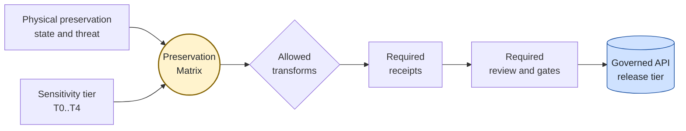
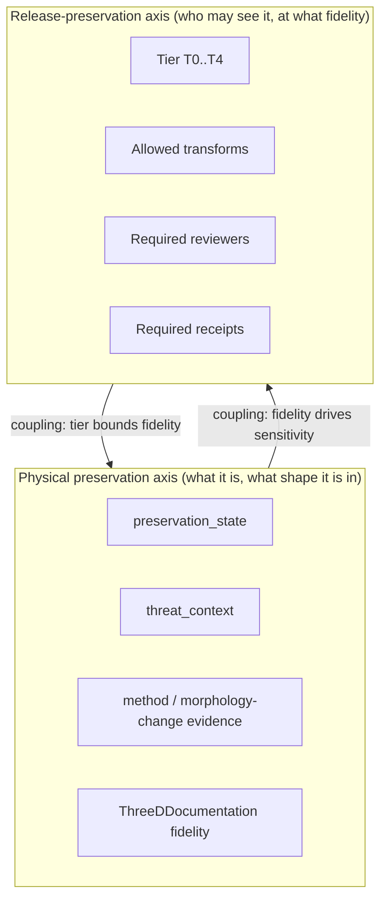
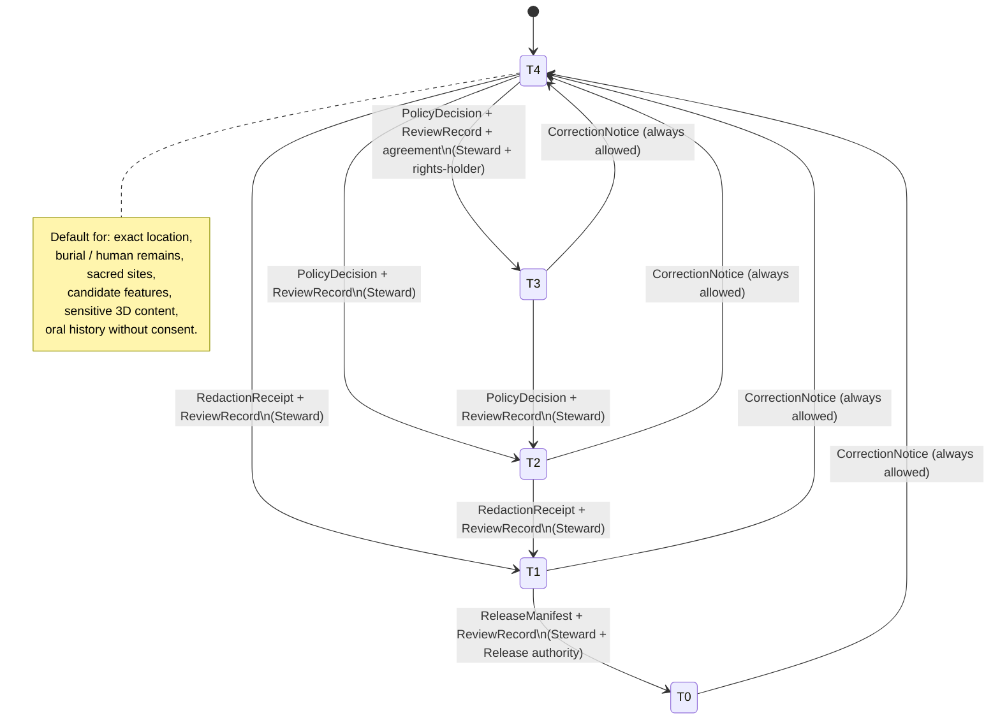
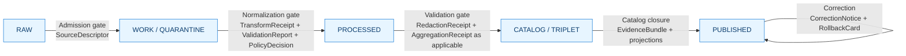

<!-- [KFM_META_BLOCK_V2]
doc_id: kfm://doc/archaeology-preservation-matrix
title: Archaeology · Preservation Matrix
type: standard
version: v0.1
status: draft
owners: Archaeology / Cultural Heritage Steward (TBD); Sensitivity Reviewer (TBD); Docs Steward (TBD)
created: 2026-05-15
updated: 2026-05-15
policy_label: public
related: [docs/domains/archaeology/README.md, docs/domains/README.md, docs/doctrine/trust-membrane.md, docs/doctrine/lifecycle-law.md, docs/doctrine/directory-rules.md, contracts/domains/archaeology/, schemas/contracts/v1/domains/archaeology/, policy/domains/archaeology/, schemas/contracts/v1/receipts/]
tags: [kfm, archaeology, sensitivity, preservation, tier-matrix, governance]
notes: [Mirrors Atlas v1.1 §24.5 (sensitivity tiers) and §24.2 (receipts) into a domain-scoped operational reference. Repository is not mounted in this session; all implementation-layer claims are PROPOSED.]
[/KFM_META_BLOCK_V2] -->

# 🏺 Archaeology · Preservation Matrix

> Two-axis reference for how archaeological evidence is **preserved as evidence** (physical condition, threat, fidelity) and how that evidence is **preserved from public exposure** (sensitivity tier, transform, gate). Every public archaeology surface must resolve on both axes before it leaves the trust membrane.

**Status:** draft · **Domain:** Archaeology / Cultural Heritage · **Owners:** Archaeology Steward · Sensitivity Reviewer · Docs Steward _(all TBD — placeholders pending CODEOWNERS verification)_ · **Last updated:** 2026-05-15

---

## Quick jump

- [§1 Scope and one-page summary](#1-scope-and-one-page-summary)
- [§2 Two axes of preservation](#2-two-axes-of-preservation)
- [§3 Preservation-state axis (physical condition)](#3-preservation-state-axis-physical-condition)
- [§4 Sensitivity-tier axis — the matrix](#4-sensitivity-tier-axis--the-matrix)
- [§5 Allowed transforms](#5-allowed-transforms)
- [§6 Tier transitions and reversibility](#6-tier-transitions-and-reversibility)
- [§7 Pipeline gates (RAW → PUBLISHED)](#7-pipeline-gates-raw--published)
- [§8 Required receipts](#8-required-receipts)
- [§9 Governed AI behavior in this domain](#9-governed-ai-behavior-in-this-domain)
- [§10 Cross-lane interaction notes](#10-cross-lane-interaction-notes)
- [§11 Verification backlog and open questions](#11-verification-backlog-and-open-questions)
- [§12 Related docs](#12-related-docs)

---

## 1. Scope and one-page summary

The **Preservation Matrix** is the per-domain operational view of two KFM doctrines, narrowed to Archaeology:

- **CONFIRMED doctrine:** the Master Sensitivity / Rights Tier Reference (T0 Open · T1 Generalized · T2 Reviewer · T3 Restricted · T4 Denied) governs what may leave the trust membrane and under what controls. _Source: Atlas v1.1 §24.5._
- **CONFIRMED doctrine / PROPOSED implementation:** archaeological evidence must record **physical preservation state, threat context, method, and morphology-change evidence** before supporting cultural-heritage claims. _Source: Pass 18 idea cards KFM-P18-INV-295 and KFM-P18-INV-459, source-supported by SRC-P18-005 (Archaeological 3D GIS)._

This document binds those two axes into one reference so a steward can answer, for any archaeology object: **what is its physical preservation context, what tier is it at, what transforms are allowed, what receipts are required, and what may be released to whom.**

> [!IMPORTANT]
> **Exact archaeological locations, burial / human remains, sacred sites, and culturally sensitive material default to T4 (Denied).** Promotion toward a more public tier always requires both a transform receipt and a review record. Demotion toward less public never requires both — a `CorrectionNotice` alone is sufficient. _Source: Atlas v1.1 §24.5.3, ENCY §20.5, DOM-ARCH._

**[⬆ Back to top](#-archaeology--preservation-matrix)**

---

## 2. Two axes of preservation

KFM's archaeology lane preserves two different things at once. The matrix is the place where the two reconcile.

| Axis | What it preserves | Primary doctrine | Status |
|---|---|---|---|
| Physical preservation axis | The archaeological resource itself: site fabric, stratigraphy, artifacts, 3D documentation, morphology change over time. | Pass 18 idea cards INV-295, INV-459 (PROPOSED fields `preservation_state`, `threat_context`). | CONFIRMED doctrine / PROPOSED field realization |
| Release-preservation axis | The public-safety, rights, and sovereignty controls that determine who sees what, at what fidelity, and under what review. | Atlas v1.1 §24.5 (tier reference); ENCY §20.5 (Deny-by-Default Register); DOM-ARCH §§I, M. | CONFIRMED doctrine / PROPOSED tier-bound implementation |

> [!NOTE]
> The two axes are **coupled, not independent**. A high-fidelity preservation-state record (e.g., a 3D damage assessment that pinpoints erosion or looting damage on a specific feature) is itself sensitivity-bearing — _"High-detail preservation evidence can increase exposure risk for vulnerable sites"_ (KFM-P18-INV-295). Decisions on one axis change permissible decisions on the other.

**[⬆ Back to top](#-archaeology--preservation-matrix)**

---

## 3. Preservation-state axis (physical condition)

CONFIRMED doctrine / PROPOSED field realization. Archaeological evidence with material claims about a site or feature should record the following before promotion. _Source: KFM-P18-INV-295 (preservation-state context), KFM-P18-INV-459 (damage-assessment evidence objects), SRC-P18-005._

| Field (PROPOSED) | Purpose | Notes |
|---|---|---|
| `preservation_state` | Categorical and/or graded statement of physical preservation (e.g., intact, eroded, looted, inundated, buried, destroyed). | Categorical scheme is **NEEDS VERIFICATION** — no canonical vocabulary has been pinned in this session. |
| `threat_context` | Active or potential threats (erosion, fire, flood, looting, development, agricultural disturbance). | Cross-references **Cross-lane relation: Archaeology ↔ Hazards** with exact-site denial. _Source: Atlas chapter 15, F. Cross-lane relations._ |
| `method` | Acquisition method and limits — survey, geophysics, LiDAR, photogrammetry, excavation, archival. | Required for any 3D documentation. _Source: KFM-P18-INV-459._ |
| `morphology_change_evidence` | Comparative evidence of change over time (multi-epoch 3D, photo comparison, surface model differencing). | Tied to `RepresentationReceipt` when surface fidelity differs from evidence fidelity. _Source: Atlas §24.2.1._ |
| `quantification_limits` | Stated limits on what the method can measure or detect. | Required for any quantitative damage claim. _Source: KFM-P18-INV-459._ |

> [!WARNING]
> A `preservation_state` value of "intact" or "well-preserved" combined with a precise location is one of the highest-risk publications in the entire archaeology lane — it can signal a desirable target for looting. The Preservation Matrix must enforce that **high-fidelity preservation-state evidence raises, not lowers, the default tier** of the location it describes.

**Open questions captured here (carried forward to §11):**

- Which preservation-threat fields are public-releasable, which are generalized-only, which are steward-only? _Source: KFM-P18-INV-295 (NEEDS VERIFICATION)._
- Which damage metrics may be released publicly for sensitive sites? _Source: KFM-P18-INV-459 (NEEDS VERIFICATION)._
- How should KFM preserve **interim excavation interpretations** that are later revised? _Source: KFM-P18-INV (field 3D capture cards), NEEDS VERIFICATION._

**[⬆ Back to top](#-archaeology--preservation-matrix)**

---

## 4. Sensitivity-tier axis — the matrix

CONFIRMED doctrine: tier scheme T0–T4 from Atlas v1.1 §24.5.1. The rows below extend ENCY §20.5's Deny-by-Default Register with allowed transforms and required gates for archaeology objects.

**How to read this matrix.** Each row answers four questions for a single object class: _What is its default sensitivity tier? Which transforms are allowed to move it toward a more public tier? Which review/policy gates must pass? Which other domains may cite it, and under what constraints?_

### 4.1 Tier scheme reference

| Tier | Name | Definition (PROPOSED) | Default audience |
|---|---|---|---|
| **T0** | Open | Public-safe with no transformations required; no rights, sensitivity, or steward gating beyond standard release. | Any public client via governed API. |
| **T1** | Generalized | Public-safe only after generalization, fuzzing, aggregation, or redaction; transform is reviewed and recorded. | Any public client via governed API. |
| **T2** | Reviewer | Released only to authenticated reviewers or domain stewards; policy-bounded; correction path active. | Stewards, reviewers, named research collaborators. |
| **T3** | Restricted | Released only under named agreement (rights, sovereignty, or consent) and recorded. | Named authorized parties only. |
| **T4** | Denied | Not released to any audience; the existence of a record may be released only as steward review permits. | — |

_Source: Atlas v1.1 §24.5.1._

### 4.2 Archaeology object-class tier matrix (PROPOSED)

| Object class / signal | Default tier | Allowed transforms toward a more public tier | Required gates | Notes |
|---|---|---|---|---|
| `ArchaeologicalSite` — exact site location | **T4** | Steward review + cultural review + generalized geometry (coarse cell) + `RedactionReceipt` → **T2** or **T1**. | `RedactionReceipt` + `ReviewRecord` + `PolicyDecision`. | _Source: Atlas v1.1 §24.5.2._ |
| `ArchaeologicalSite` — human remains / sacred sites | **T4** | No transform releases this to T0. **T3** only under explicit named authorization. | Sovereignty review + `ReviewRecord` + `PolicyDecision`. | Sovereignty review is non-optional. _Source: Atlas v1.1 §24.5.2; DOM-ARCH._ |
| `Survey` / `SurveyProject` / `SurveyTransect` coverage (generalized) | **T0** (generalized footprint) or **T1** if footprint reveals sensitive sites | Aggregate / coarse-cell summary; per-site detail stripped. | `AggregationReceipt` or `RedactionReceipt`; steward review when footprint approaches a sensitive locale. | _Inferred from G. Map and viewing products, DOM-ARCH._ |
| `RemoteSensingAnomaly` / `LiDARCandidate` / `GeophysicsObservation` (CandidateFeature) | **T4** default; **T2** for steward review surface | Generalized cell + `RedactionReceipt` + candidate-not-site labeling → **T2** review-only. Public surfacing as confirmed sites is **denied**. | `RedactionReceipt` + `ReviewRecord` + `PolicyDecision`; candidate-not-site test. | A candidate is not a confirmed site. _Source: DOM-ARCH §D; Encyclopedia §7.13._ |
| `ThreeDDocumentation` — sensitive 3D scene content | **T4** | Generalization / clipping / withholding; `RealityBoundaryNote` + `RepresentationReceipt` → **T1** or **T2** where steward review supports. | Steward review + `RedactionReceipt` + `RepresentationReceipt`. | 3D scene fidelity may differ from evidence fidelity; `RealityBoundaryNote` is mandatory. _Source: Atlas v1.1 §24.5.2, MAP-MASTER, UIAI._ |
| `ExcavationUnit` / `ShovelTest` / `TestUnit` — exact provenience | **T4** | Generalization to site-or-coarser geometry + steward review → **T2**. | `RedactionReceipt` + `ReviewRecord`. | _Inferred from Atlas chapter 15 §I and Encyclopedia §7.13._ |
| `ProvenienceContext` / `StratigraphicUnit` — context detail | **T2** by default (steward review surface) | Aggregation by site, period, or layer class → **T1**. | `AggregationReceipt` + `ReviewRecord`. | PROPOSED — confirmation pending steward sign-off. |
| `Artifact` / `Feature` — itemized records | **T2** default; **T1** for aggregate counts | Aggregation by site or period; collection-security-aware redaction → **T1** or **T0**. | `AggregationReceipt` + `RedactionReceipt` (when locational metadata present) + `ReviewRecord`. | Collection-security risk fails closed. _Source: DOM-ARCH §I._ |
| `CollectionAccession` / `CollectionRepositoryRecord` | **T2** | Aggregate counts and public-safe finding aids → **T1** / **T0**; itemized inventories stay at T2/T3 by collection-security policy. | `ReviewRecord` + `PolicyDecision`; collection-security review for itemized release. | _Source: DOM-ARCH §I (collection security)._ |
| `CulturalTemporalPeriod` (periodization) | **T0** | None required; period vocabulary is public-safe. | Standard release. | _Source: Atlas v1.1 §24.4 cross-domain matrix._ |
| `ChronologyAssertion` | **T0** for period-level; **T1**/**T2** if it geolocates a sensitive feature | Generalization to period × region. | `AggregationReceipt` or `RedactionReceipt` if geolocating. | PROPOSED. |
| `preservation_state` + `threat_context` records (PROPOSED fields) | **T2** default; **T4** when value implies precise active threat at a precise location | Generalize to site-or-coarser; suppress active-threat detail; release qualitative state only. | `RedactionReceipt` + `ReviewRecord`; collaboration with `[DOM-HAZ]` lane on threat content. | _Source: KFM-P18-INV-295, INV-459 (NEEDS VERIFICATION which fields are publishable)._ |
| Oral history / cultural-knowledge records | **T4** until rights-holder review and access class approve. | Steward + rights-holder consent → **T3** named-party; public derivative only when consent is explicit. | Rights-holder representative + `ReviewRecord` + `PolicyDecision`. | _Source: ENCY §13 (Sensitive / Deny-by-Default Register: Sacred/culturally sensitive places); DOM-ARCH §N._ |

> [!CAUTION]
> Rows above are **PROPOSED** at the level of tier-bound implementation. The tier scheme itself (T0–T4) and the deny-by-default posture for exact archaeological locations, burial / human remains, and sacred sites are **CONFIRMED doctrine** per Atlas v1.1 §24.5 and ENCY §20.5. Where these differ for a given object, doctrine governs; this matrix is the operational application of doctrine, subject to ADR ratification.

**[⬆ Back to top](#-archaeology--preservation-matrix)**

---

## 5. Allowed transforms

CONFIRMED doctrine: transforms that move an object toward a more public tier are not optional steps — they are **governed operations that emit receipts**. _Source: Atlas v1.1 §24.5.2, §24.2.1._

| Transform | When used | Emits | Reversibility |
|---|---|---|---|
| **Generalization** (coarse cell, fuzzing, snap-to-grid, simplification) | Site location, candidate features, sensitive 3D content. | `RedactionReceipt` (+ `TransformReceipt` for the geometry op). | Reversible: redaction can be re-evaluated; a published T1 may be demoted to T4 via `CorrectionNotice`. |
| **Aggregation** (site → period × region; itemized → counts) | Artifact counts, survey coverage, chronology summaries. | `AggregationReceipt`. | Reversible: published aggregates can be retracted via `CorrectionNotice`. |
| **Suppression / withholding** | Active-threat detail, exact provenience, sovereignty-restricted material. | `RedactionReceipt` (with `removed_fields` populated). | Suppression is the default; lifting suppression requires `ReviewRecord` + `PolicyDecision`. |
| **Representation step** (3D scene from 2D evidence, synthetic terrain, tile downsampling) | `ThreeDDocumentation`, scene exports, PMTiles/3D Tiles. | `RepresentationReceipt` + `RealityBoundaryNote`. | Reversible; surface fidelity may not exceed evidence fidelity. |
| **Named-party access** (T3) | Sovereign / rights-holder data; restricted research access. | `PolicyDecision` + `ReviewRecord` + agreement record. | Reversible: agreement revocation returns object to **T4** with `CorrectionNotice`. |

> [!NOTE]
> Transforms are **forward-only with respect to receipts**: every transform emits a receipt; receipts are referenced (not duplicated) at later lifecycle phases via `EvidenceRef`. _Source: Atlas v1.1 §24.2.2._

**[⬆ Back to top](#-archaeology--preservation-matrix)**

---

## 6. Tier transitions and reversibility

CONFIRMED doctrine. _Source: Atlas v1.1 §24.5.3._

### 6.1 Transition reading rules

| Direction | Required artifacts | Receipt economy |
|---|---|---|
| **Toward more public** (T4→T3, T3→T2, T2→T1, T1→T0) | Always both a **transform receipt** (`Redaction`, `Aggregation`, `Representation`, or policy artifact) **and** a `ReviewRecord`. | Receipts accumulate; never lost. |
| **Toward less public** (any tier → T4 downgrade) | Always permitted with a single `CorrectionNotice` + `ReviewRecord`. Derivative invalidation follows. | Single-artifact path; correction is the universal demotion. |

> [!IMPORTANT]
> **A tier upgrade always needs both a transform receipt and a review record. A tier downgrade never needs both — correction alone is sufficient to remove or restrict.** _Source: Atlas v1.1 §24.5.3 reading note._

**[⬆ Back to top](#-archaeology--preservation-matrix)**

---

## 7. Pipeline gates (RAW → PUBLISHED)

CONFIRMED doctrine / PROPOSED lane application: Archaeology follows the universal lifecycle invariant **RAW → WORK / QUARANTINE → PROCESSED → CATALOG / TRIPLET → PUBLISHED**, with promotion as a governed state transition. _Source: DIRRULES; Atlas v1.1 chapter 15 §H, §24.6.1; ENCY._

### 7.1 Per-gate preservation-aware checklist

| Lifecycle gate | Preservation-state checks | Sensitivity-tier checks | Failure-closed outcome |
|---|---|---|---|
| **Admission** (— → RAW) | `SourceDescriptor` records the source role (authority, observation, model, candidate, synthetic) for preservation-state evidence. | `SourceDescriptor` records initial sensitivity tag. | Source not admitted; logged as candidate awaiting steward. |
| **Normalization** (RAW → WORK) | `preservation_state`, `threat_context`, `method`, `quantification_limits` populated where applicable. | Sensitive geometry isolated; `RedactionReceipt` draft prepared. | `QUARANTINE` with reason; never silently promotes. |
| **Validation** (WORK → PROCESSED) | Method limits validated; morphology-change evidence cross-checked. | Tier assignment validated; candidate-not-site test passes; exact-geometry leak test passes. | Stay in WORK; structured FAIL. |
| **Catalog closure** (PROCESSED → CATALOG / TRIPLET) | `EvidenceRefs` resolve; preservation-state and threat fields close. | `EvidenceBundle` reflects only released-tier content; sensitive content stays out of public projections. | HOLD at PROCESSED; no public edge. |
| **Release** (CATALOG → PUBLISHED) | Release manifest cites preservation-state evidence at the tier appropriate to it. | `ReleaseManifest` + rollback target + `ReviewRecord` (sovereignty review when applicable). | HOLD at CATALOG; no public surface change. |
| **Correction** (PUBLISHED → PUBLISHED′) | Updated preservation-state or threat assessment triggers re-release or demotion. | Demote to T4 via `CorrectionNotice`; invalidate derivatives. | Always permitted; precedes derivative invalidation. |

_Source: Atlas v1.1 §24.6.1 lifecycle gates; chapter 15 §H Pipeline shape._

> [!WARNING]
> **Lifecycle skip is forbidden.** A pipeline that writes directly to `data/published/` from `data/raw/` violates the lifecycle invariant. All phases must run; promotion is a governed state transition, not a file move. _Source: DIRRULES §13.5 anti-patterns; ENCY core invariants._

**[⬆ Back to top](#-archaeology--preservation-matrix)**

---

## 8. Required receipts

CONFIRMED doctrine: every consequential transformation in this domain emits a structured, persisted receipt with enough context for audit and rollback. _Source: Atlas v1.1 §24.2._

PROPOSED schema home: each receipt class lives under `schemas/contracts/v1/receipts/` unless an ADR relocates it. NEEDS VERIFICATION — actual file presence is not checkable in this session.

<b>Receipt family — purposes and triggering events</b>

| Receipt | Purpose | Triggered by (in this domain) | Citation |
|---|---|---|---|
| `SourceDescriptor` | Records source identity, rights, role, sensitivity, cadence at admission. | Source admission for state historic preservation records, tribal/steward sources, excavation reports, LiDAR / remote sensing, etc. | Atlas v1.1 §24.2; DOM-ARCH §B. |
| `TransformReceipt` (Projection / Generalization) | Records a spatial or attribute transform (reprojection, generalization, snap, simplification). | Geometry normalization for any archaeology object with locational evidence. | Atlas v1.1 §24.2.1; MAP-MASTER. |
| `RedactionReceipt` | Records a public-safe transformation that removed, masked, fuzzed, or withheld content. | Sensitive-domain publication: archaeological coords, sacred sites, sensitive 3D content, oral history derivatives. | Atlas v1.1 §24.2.1; DOM-ARCH. |
| `AggregationReceipt` | Records an aggregation step (counts, period × region rollups). | Aggregate artifact / survey publications; matrix-cell computation when Archaeology feeds Frontier Matrix. | Atlas v1.1 §24.2.1. |
| `RepresentationReceipt` | Records a representation step where surface fidelity differs from evidence fidelity. | 3D scene publication; tile / PMTiles export; visual-only generalization. Pairs with `RealityBoundaryNote`. | Atlas v1.1 §24.2.1; MAP-MASTER; UIAI. |
| `ModelRunReceipt` | Records a modeled output: identity, version, inputs, parameters, uncertainty. | Candidate-prioritization models; viewshed / visibility analyses; predictive models. | Atlas v1.1 §24.2.1. |
| `AIReceipt` | Records a governed AI answer: scope, evidence, policy decision, outcome class. | Focus Mode answers about archaeology; AI-drafted steward-review notes. | Atlas v1.1 §24.2.1; GAI; UIAI. |
| `ReviewRecord` | Records steward / rights-holder / policy review of a candidate transition. | Promotion gates; sensitive-lane publication; correction acceptance; sovereignty review. | Atlas v1.1 §24.2.1; DIRRULES. |
| `PolicyDecision` | Records a policy evaluation (which rule, target, outcome). | Every governed gate; rights / sensitivity / release checks. | Atlas v1.1 §24.2.1; DIRRULES. |
| `ValidationReport` | Records validator outcomes (passes, failures, deterministic inputs). | WORK → PROCESSED transition; release closure. | Atlas v1.1 §24.2.1. |
| `ReleaseManifest` | Records contents, version, signatures, rollback target for a release. | PUBLISHED transition. | Atlas v1.1 §24.2.1. |
| `CorrectionNotice` | Records that a published claim was corrected; what changed, why, derivative invalidation. | Post-publication correction; tier demotion. | Atlas v1.1 §24.2.1. |
| `RollbackCard` | Records a rollback decision and the targeted prior release. | Failed release; sovereignty revocation; sensitivity reassessment. | Atlas v1.1 §24.2.1. |
| `RealityBoundaryNote` | Steward- or public-facing statement that a carrier is synthetic or reconstructed and not direct evidence. | Synthetic 3D scenes, reconstructed visualizations, AI-drafted summaries. | Atlas v1.1 §24.2.1; MAP-MASTER. |
| `SensitivityTransform` (domain object) | Domain-owned record of the transform decision; pairs with `RedactionReceipt` evidence. | Any archaeology object passing through generalization, suppression, or representation. | DOM-ARCH §C canonical object families; ENCY §7.13. |

### 8.1 Receipt × lifecycle dot-grid (Archaeology view)

| Receipt | RAW | WORK / QUARANTINE | PROCESSED | CATALOG / TRIPLET | PUBLISHED |
|---|:---:|:---:|:---:|:---:|:---:|
| `SourceDescriptor` | ● | ● | ● | ● | ● |
| `TransformReceipt` |  | ● | ● | ● |  |
| `RedactionReceipt` |  | ● | ● | ● | ● |
| `AggregationReceipt` |  | ● | ● | ● | ● |
| `ModelRunReceipt` |  | ● | ● | ● | ● |
| `RepresentationReceipt` |  |  | ● | ● | ● |
| `AIReceipt` |  |  |  | ● | ● (Focus Mode only) |
| `ReviewRecord` |  | ● | ● | ● | ● |
| `PolicyDecision` | ● | ● | ● | ● | ● |
| `ValidationReport` |  | ● | ● | ● |  |
| `ReleaseManifest` |  |  |  | ● | ● |
| `CorrectionNotice` |  |  |  |  | ● |
| `RollbackCard` |  |  |  |  | ● |
| `RealityBoundaryNote` |  | ● | ● | ● | ● |

_Reading note: a dot means the receipt is normally emitted, amended, or referenced at that phase. Receipts created earlier remain referenced (not duplicated) at later phases via `EvidenceRef`. Source: Atlas v1.1 §24.2.2._

**[⬆ Back to top](#-archaeology--preservation-matrix)**

---

## 9. Governed AI behavior in this domain

CONFIRMED doctrine / PROPOSED implementation. _Source: Atlas v1.1 chapter 15 §L; GAI; ENCY._

| Outcome | Conditions for this domain |
|---|---|
| **ANSWER** | AI may summarize released Archaeology `EvidenceBundles`, compare evidence, explain limitations, and draft steward-review notes — bounded by the released tier. |
| **ABSTAIN** | AI must abstain when evidence is insufficient, when source-role conflicts cannot be resolved, or when a `CitationValidationReport` fails. |
| **DENY** | AI must deny where policy, rights, sensitivity, or release state blocks the request — including exact-location queries about sensitive sites, queries about burial / human remains / sacred sites, and unreviewed candidate-feature queries. |
| **ERROR** | Reserved for missing schema, broken EvidenceRef resolution, or runtime failure of the governed gate itself. |

> [!IMPORTANT]
> **AI exact-location denial is a domain invariant.** Focus Mode summaries about Late Prehistoric clusters, candidate features, or any sensitive site must explain that zones are **generalized cultural activity zones, not exact archaeological locations**. _Source: Master MapLibre Components, idea ML-061-163; DOM-ARCH §L; GAI._

> [!CAUTION]
> AI never reads RAW or WORK content; AI surfaces consume only released `EvidenceBundle` projections. Direct model-to-public traffic is denied. _Source: ENCY §20.5 Deny-by-Default; GAI._

**[⬆ Back to top](#-archaeology--preservation-matrix)**

---

## 10. Cross-lane interaction notes

CONFIRMED / PROPOSED relations. Each must preserve ownership, source role, sensitivity, and `EvidenceBundle` support. _Source: Atlas v1.1 chapter 15 §F; §24.4.13._

| Related lane | Relation | Preservation-matrix consequence |
|---|---|---|
| Spatial Foundation | Exact / public geometry split and transform receipts. | Exact archaeology geometry never crosses into a public spatial product without a `RedactionReceipt`. |
| Roads / Rail | Historic routes and cultural paths. | Cultural-corridor segments may be denied or generalized even when the underlying transportation feature is T0. |
| Settlements / Infrastructure | Forts, missions, townsites, reservation communities. | Generalized historical-context release allowed; exact archaeology not surfaced via the Settlements lane. |
| Hazards | Threat, erosion, fire, flood, exposure context — **with exact-site denial**. | Threat overlays for archaeology use the same generalization profile as the archaeology layer they describe. |
| People / Genealogy / DNA / Land | Indigenous community context; steward-reviewed and rights-bounded. | Cultural affiliation joins require rights-holder review; living-person joins denied by default. |
| Planetary / 3D / Digital Twin | Sites admitted only via steward-reviewed, generalized 3D representation with `RealityBoundaryNote`. | Scene admission policy applies; representation receipts are mandatory. |

**[⬆ Back to top](#-archaeology--preservation-matrix)**

---

## 11. Verification backlog and open questions

| Item | Evidence that would settle it | Status |
|---|---|---|
| Steward authority and confidentiality (which roles can authorize which transitions). | Mounted repo files; CODEOWNERS; `control_plane/source_authority_register.yaml`; ReviewRecord fixtures. | NEEDS VERIFICATION |
| Public geometry thresholds and transform profiles (coarse-cell sizing, minimum aggregation unit). | Schemas under `schemas/contracts/v1/receipts/redaction/`; policy bundles under `policy/domains/archaeology/`. | NEEDS VERIFICATION |
| Which `preservation_state` and `threat_context` fields are publishable, generalized-only, or steward-only. | Schema PR introducing fields; policy rules; test fixtures. _Source: KFM-P18-INV-295._ | NEEDS VERIFICATION |
| Which damage metrics may be released publicly for sensitive sites. | Policy fixtures; review records on damage-assessment releases. _Source: KFM-P18-INV-459._ | NEEDS VERIFICATION |
| Oral history / cultural-knowledge protocol (consultation record, sensitivity transform, named-party access). | Tribal / steward consultation record templates; ReviewRecord fixtures. _Source: ENCY §13._ | NEEDS VERIFICATION |
| Emergency public-layer disablement and rollback drill (operational runbook for sensitive-layer takedown). | Runbook under `docs/runbooks/`; rollback drill ValidationReports. | NEEDS VERIFICATION |
| Publication of uncertain or alternative observer scenarios for viewshed / visibility analyses. | ModelRunReceipt fixtures with multi-scenario receipts; UI label fixtures. _Source: Pass 18 visibility cards._ | NEEDS VERIFICATION |
| Preservation of interim excavation interpretations that are later revised. | Versioning policy for ProvenienceContext; CorrectionNotice templates; supersession registry. | NEEDS VERIFICATION |
| Path placement of receipt schemas (`schemas/contracts/v1/receipts/` vs. domain-scoped). | ADR; repo evidence. | PROPOSED |
| ADR resolving Archaeology lane responsibility-root paths (`schemas/contracts/v1/domains/archaeology/`, `contracts/domains/archaeology/`, `policy/domains/archaeology/`). | ADR under `docs/adr/`. | PROPOSED |

**[⬆ Back to top](#-archaeology--preservation-matrix)**

---

## 12. Related docs

> Links are repo-relative and point to PROPOSED locations. Existence of the targets is **NEEDS VERIFICATION** until repo inspection.

- [docs/domains/archaeology/README.md](./README.md) — domain landing page _(TODO — link target)_
- [docs/domains/README.md](../README.md) — domains index _(TODO — link target)_
- [docs/doctrine/trust-membrane.md](../../doctrine/trust-membrane.md) — trust-membrane doctrine _(TODO — link target)_
- [docs/doctrine/lifecycle-law.md](../../doctrine/lifecycle-law.md) — RAW → PUBLISHED lifecycle invariant _(TODO — link target)_
- [docs/doctrine/directory-rules.md](../../doctrine/directory-rules.md) — Directory Rules (§6.1 placement; §15 README contract) _(TODO — link target)_
- [docs/standards/PROV.md](../../standards/PROV.md) — W3C PROV-O / PAV provenance crosswalk _(TODO — link target)_
- [contracts/domains/archaeology/](../../../contracts/domains/archaeology/) — Archaeology object meaning _(PROPOSED path — NEEDS VERIFICATION)_
- [schemas/contracts/v1/domains/archaeology/](../../../schemas/contracts/v1/domains/archaeology/) — Archaeology schemas _(PROPOSED path — NEEDS VERIFICATION)_
- [policy/domains/archaeology/](../../../policy/domains/archaeology/) — Archaeology sensitivity / rights policy _(PROPOSED path — NEEDS VERIFICATION)_
- [schemas/contracts/v1/receipts/](../../../schemas/contracts/v1/receipts/) — Receipt schemas (Redaction, Aggregation, Representation, …) _(PROPOSED home — NEEDS VERIFICATION)_

---

Doctrinal anchors: Kansas Frontier Matrix Domains Culmination Atlas v1.1 §24.2 (Master Receipt Catalog), §24.5 (Master Sensitivity / Rights Tier Reference), §24.6.1 (Master Pipeline Gate Reference), chapter 15 (Archaeology and Cultural Heritage) · Kansas Frontier Matrix Domain and Capability Encyclopedia v0.1 §7.13, §13, §20.5 · Pass 18 idea cards KFM-P18-INV-295, KFM-P18-INV-459 (source-supported by SRC-P18-005) · Master MapLibre Components ML-061-159..163 · Directory Rules §6.1, §15, §13.

---

**Last reviewed:** 2026-05-15 _(initial draft)_
**Next review trigger:** ADR ratification of archaeology-lane responsibility-root paths; first mounted-repo inspection.

**[⬆ Back to top](#-archaeology--preservation-matrix)**
