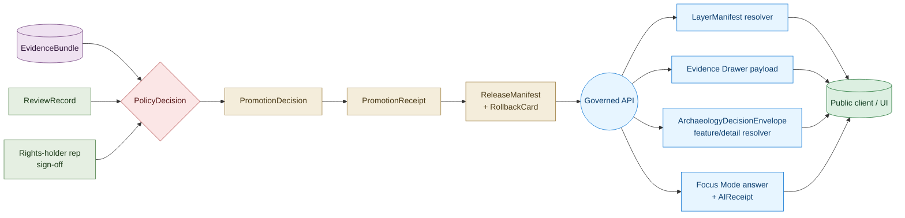
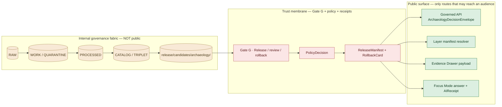

# Archaeology — Publication and Policy

> Governance reference for what crosses the trust membrane out of the archaeology lane and under what controls: the four governed API surfaces, the policy-as-code deny rules that close each promotion gate, the separation-of-duties matrix that authorizes archaeology releases, the receipts that bind every public claim to its evidence, and the correction / rollback / stale-state path that lets a release be reversed.

<!-- [KFM_META_BLOCK_V2]
doc_id: kfm://doc/archaeology-publication-and-policy
title: Archaeology — Publication and Policy
type: standard
version: v1
status: draft
owners: TODO — archaeology domain steward; sensitivity reviewer; rights-holder representative; release authority; AI surface steward; correction reviewer; docs steward
created: 2026-05-28
updated: 2026-05-28
policy_label: public
related:
  - docs/doctrine/ai-build-operating-contract.md
  - docs/doctrine/directory-rules.md
  - docs/domains/archaeology/README.md           # PROPOSED
  - docs/domains/archaeology/OBJECT_FAMILIES.md
  - docs/domains/archaeology/PIPELINE.md
  - docs/domains/archaeology/PRESERVATION_MATRIX.md
  - docs/domains/archaeology/SENSITIVITY.md      # PROPOSED
  - policy/domains/archaeology/                  # PROPOSED — allow / deny / restrict / abstain
  - policy/sensitivity/archaeology/              # PROPOSED — DENY lane
  - policy/release/archaeology/                  # PROPOSED — staged release
  - policy/consent/archaeology/                  # PROPOSED — sovereignty / oral history
  - schemas/contracts/v1/archaeology/            # PROPOSED — Atlas v1.1 §2.1
  - schemas/contracts/v1/receipts/               # PROPOSED — receipt home
  - release/manifests/archaeology/               # PROPOSED
  - release/candidates/archaeology/              # PROPOSED
  - data/published/layers/archaeology/           # PROPOSED — generalized only
tags: [kfm, domain, archaeology, publication, policy, release, governed-api, doctrine]
notes:
  - CONTRACT_VERSION pinned to "3.0.0"
  - Sensitive-domain doc; archaeology default tier is T4 (DENY) for site location, human remains, sacred sites
  - All repo-state and path claims are PROPOSED until repo is mounted
  - Companion to OBJECT_FAMILIES.md, PIPELINE.md, and PRESERVATION_MATRIX.md
[/KFM_META_BLOCK_V2] -->


**Status:** draft &nbsp;·&nbsp; **Owners:** *TODO — archaeology steward; sensitivity reviewer; rights-holder rep; release authority; AI surface steward; correction reviewer; docs steward* &nbsp;·&nbsp; **Last updated:** 2026-05-28
**`CONTRACT_VERSION = "3.0.0"`** _(per `docs/doctrine/ai-build-operating-contract.md`)._

> [!CAUTION]
> **Sensitive-domain lane — deny-by-default at every gate.** Archaeology objects default to **Tier T4 (Denied)** under Atlas v1.1 §24.5.2 and the KFM Encyclopedia §11 sensitive register. Exact site geometry, human remains, sacred sites, collection-security detail, and looting-risk exposure **MUST NOT** appear on any public surface without a `RedactionReceipt` + `ReviewRecord` + `PolicyDecision` + (where applicable) sovereignty-review sign-off. Release authority for the archaeology lane is **distinct from authorship** when materiality applies — sensitive-lane release requires author + sensitivity reviewer + release authority + rights-holder representative.

---

## Quick jump

- [1 · Scope and purpose](#1--scope-and-purpose)
- [2 · Authority and source hierarchy](#2--authority-and-source-hierarchy)
- [3 · The trust membrane for archaeology](#3--the-trust-membrane-for-archaeology)
- [4 · Governed API surfaces](#4--governed-api-surfaces)
- [5 · Policy-as-code · deny / abstain / allow](#5--policy-as-code--deny--abstain--allow)
- [6 · Release manifest contract](#6--release-manifest-contract)
- [7 · Gate G — Release / review / rollback](#7--gate-g--release--review--rollback)
- [8 · Separation of duties](#8--separation-of-duties)
- [9 · Correction and rollback discipline](#9--correction-and-rollback-discipline)
- [10 · Stale-state and supersession](#10--stale-state-and-supersession)
- [11 · AI surface — bounded public answers](#11--ai-surface--bounded-public-answers)
- [12 · Publication failure modes and anti-patterns](#12--publication-failure-modes-and-anti-patterns)
- [13 · Override and emergency-bypass discipline](#13--override-and-emergency-bypass-discipline)
- [14 · Audit and governance health indicators](#14--audit-and-governance-health-indicators)
- [15 · Responsibility-root placement (PROPOSED)](#15--responsibility-root-placement-proposed)
- [16 · Worked release walkthrough](#16--worked-release-walkthrough)
- [Open questions register](#open-questions-register)
- [Open verification backlog](#open-verification-backlog)
- [Changelog v0 → v1](#changelog-v0--v1)
- [Definition of done](#definition-of-done)
- [Related docs](#related-docs)

---

## 1 · Scope and purpose

**CONFIRMED doctrine / PROPOSED implementation.**

This document is the per-domain governance reference for **what may leave the archaeology lane to a public audience, and how**. It pins down:

- The four governed API surfaces through which archaeology evidence reaches public clients.
- The policy-as-code bundles that close each promotion gate.
- The release manifest contract, separation-of-duties matrix, and reviewer roles.
- The correction, rollback, stale-state, and supersession path that lets every release be reversed.
- The AI surface scope and citation discipline.
- The audit and governance-health indicators that surface drift.

It does **not** redefine:

- Object **meaning** — see [`OBJECT_FAMILIES.md`](./OBJECT_FAMILIES.md).
- The full **pipeline / Gates A–F** sequence — see [`PIPELINE.md`](./PIPELINE.md).
- The full **tier × transform decision matrix** — see [`PRESERVATION_MATRIX.md`](./PRESERVATION_MATRIX.md).

> [!IMPORTANT]
> This document is **navigational governance**, not a canonical machine artifact. The `ReleaseManifest`, `PolicyDecision`, schema, contract, ADR, and CI workflow govern actual release decisions. Where this document and any of those disagree, the machine-readable artifact wins and the conflict is filed against `docs/registers/DRIFT_REGISTER.md` per Directory Rules §2.5.



**[⬆ Back to top](#archaeology--publication-and-policy)**

---

## 2 · Authority and source hierarchy

| Layer | Source | Role for this document |
|---|---|---|
| **Operating law** | `docs/doctrine/ai-build-operating-contract.md` v3.0 | Pins `CONTRACT_VERSION = "3.0.0"`; governs publication / rights / sensitivity invariants. |
| **Placement law** | `docs/doctrine/directory-rules.md` | Confirms that publication / policy / release files live as **segments** under `policy/domains/archaeology/`, `release/manifests/archaeology/`, etc., never as roots. |
| **Domain doctrine** | Atlas v1.1 Ch. 15 — §15.I (sensitivity / rights / publication), §15.J (API / contract / schema), §15.K (validators), §15.L (governed AI), §15.M (publication / correction / rollback), §15.N (verification backlog). | Canonical archaeology lane publication doctrine. |
| **Cross-cutting doctrine** | Atlas v1.1 §24.1 (anti-collapse), §24.2 (receipts), §24.3 (decision-outcome envelope), §24.5 (tiers), §24.6 (gates + reason codes), §24.7 (reviewer roles + SoD matrix), §24.8 (stale-state + supersession), §24.9 (anti-patterns), §24.10 (risks), §24.11 (governance health indicators), §24.12 (open ADRs). | Cross-cutting publication and policy doctrine applied to archaeology. |
| **Build doctrine** | `KFM_Unified_Implementation_Architecture_Build_Manual.md` §6.2 Gates A–G; §7.1 object map. | Canonical gate set and release object families. |
| **Policy-as-code** | Pass-32 seed cards KFM-P22-PROG-0007 (Conftest OPA promotion deny rules), KFM-P29-PROG-0013 (sidecar Conftest policy), KFM-P29-PROG-0019 (archaeology basemap redaction validator), KFM-P29-IDEA-0019 (archaeology basemaps require generalization), KFM-P14-PROG-0001 (Rego v1 migration guard), KFM-P30-PROG-0017 (incident promotion Rego), KFM-P30-PROG-0021 (OPA verdict input schema). | PROPOSED policy bundle shape and deny rules. |
| **Anti-patterns / risks** | Atlas v1.1 §24.9 (anti-patterns), §24.10 (risk register); `kfm_unified_doctrine_synthesis.md` §29 (governance anti-patterns). | Failure modes to guard against in publication. |
| **Override discipline** | KFM-P3-IDEA-0003 (Override and Emergency-Bypass Discipline). | Signed-override rules. |

> [!NOTE]
> All paths under `policy/`, `release/`, `schemas/`, `contracts/`, and `data/published/` named in this document are **PROPOSED**. None are claimed to exist in the live repository until verified.

**[⬆ Back to top](#archaeology--publication-and-policy)**

---

## 3 · The trust membrane for archaeology

**CONFIRMED doctrine (Atlas v1.1 §24.6.2; ENCY §11; DOM-ARCH).** The trust membrane is the closed boundary between governed internal state and any public audience. For archaeology, every public surface MUST sit downstream of the membrane.



### 3.1 Trust-membrane invariants (CONFIRMED doctrine)

| Invariant | What it forbids |
|---|---|
| **No public read of RAW / WORK / QUARANTINE.** | Public clients, normal UI surfaces, and released AI surfaces MAY NOT read any pre-`PUBLISHED` archaeology phase, canonical / internal stores, graph internals, vector indexes, source APIs, or model runtimes. |
| **Map shell is not a public surface authority.** | The MapLibre shell consumes only `LayerManifest`s + tile artifacts that themselves passed Gate G; it never reads canonical / internal stores directly. |
| **AI is never root truth.** | Focus Mode reads only released `EvidenceBundle`s; uncited generation is `ABSTAIN`. |
| **No release without rollback.** | A `ReleaseManifest` without a named `RollbackCard` target fails closed at Gate G. |
| **Sensitive geometry must be transformed, not styled out.** | Style-only hiding of sensitive geometry fails the sensitivity test — the underlying tile MUST be transformed (generalized / redacted) before publication. _Source: Master MapLibre §N policy implication._ |
| **Watcher is not publisher.** | Watchers emit `EventEnvelope` + `EventRunReceipt` at Pre-RAW; they MAY NOT write to any other phase. |

> [!WARNING]
> **The only route to `ANSWER` is `PUBLISHED`.** The governed API may emit `ANSWER` only when the underlying record is in `PUBLISHED` state and its `EvidenceRef` resolves to a closed `EvidenceBundle`. Any other state forces `ABSTAIN`, `DENY`, or `ERROR`. _Source: Atlas v1.1 §24.6.2._

**[⬆ Back to top](#archaeology--publication-and-policy)**

---

## 4 · Governed API surfaces

**CONFIRMED doctrine / PROPOSED implementation (Atlas v1.1 §15.J).** Archaeology exposes exactly four governed API surfaces; the exact route names are PROPOSED.

| # | Endpoint or artifact | DTO / schema | Outcomes | Status |
|---|---|---|---|---|
| 1 | **Archaeology feature / detail resolver** — route TBD | `ArchaeologyDecisionEnvelope` | `ANSWER` · `ABSTAIN` · `DENY` · `ERROR` | PROPOSED governed API surface; exact route UNKNOWN. |
| 2 | **Archaeology layer manifest resolver** | `LayerManifest` / domain layer descriptor | `ANSWER` · `DENY` · `ERROR` | PROPOSED; public-safe release only. |
| 3 | **Archaeology Evidence Drawer payload** | `EvidenceDrawerPayload` + `EvidenceBundle` projection | `ANSWER` · `ABSTAIN` · `DENY` · `ERROR` | PROPOSED; evidence and policy filtered. |
| 4 | **Archaeology Focus Mode answer** | `RuntimeResponseEnvelope` + `AIReceipt` | `ANSWER` · `ABSTAIN` · `DENY` · `ERROR` | PROPOSED; AI never root truth. |

### 4.1 Per-surface contract notes

| Surface | What it returns (PROPOSED) | What it never returns |
|---|---|---|
| **1. Feature / detail resolver** | A single archaeology feature at its released tier (`T0` / `T1` / `T2` only via authentication), with its `EvidenceRef`, `source_role`, generalization parameters, `release_id`, and any active `CorrectionNotice`. | Exact geometry of T4 records; ungeneralized provenience; unredacted collection-security joins; candidate features framed as confirmed sites. |
| **2. Layer manifest resolver** | A `LayerManifest` for an archaeology layer, listing source descriptors, `TileArtifactManifest` references, `release_id`, `MapReleaseManifest` pin, and a `rollback_target`. | Tile artifacts whose `release_state` is not `PUBLISHED`; layers without a rollback target; layers whose source-rights are unresolved. |
| **3. Evidence Drawer payload** | The trust surface for a clicked feature — citations, source descriptors, policy state, review state, release state, limitations, and the `EvidenceBundle` projection at the released tier. | Source content that was never released; restricted-tier (T3 / T4) fields except when the caller is an authenticated reviewer; AI-generated text framed as evidence. |
| **4. Focus Mode answer** | A bounded AI answer with `AIReceipt`, citation-validation outcome, and a `RuntimeResponseEnvelope` outcome class. Archaeology Focus panels carry CARE labels, provenance-chain badges, and generalization / uncertainty explanations. _Source: ML-061-164._ | Exact archaeology coordinates (always `DENY`); uncited claims (always `ABSTAIN`); answers framed as observed reality when the underlying carrier is synthetic. |

### 4.2 Required input artifacts (per Master MapLibre v2.1, §N–§O)

| Surface | Required input artifacts |
|---|---|
| Feature / detail resolver | `SourceDescriptor`, `LayerManifest`, `EvidenceBundle`, `EvidenceRef`, `PolicyDecision`, `PromotionDecision`, `RunReceipt`, `ValidationReport`, `rollback target`. |
| Layer manifest resolver | `LayerManifest`, `StyleManifest`, `TileArtifactManifest`, `MapReleaseManifest`, `SourceDescriptor`, `PolicyDecision`, `release_state`, `rollback target`. |
| Evidence Drawer payload | `EvidenceDrawerPayload`, `EvidenceBundle`, citations, `PolicyDecision`, `ReviewRecord`, `release_state`, limitations. |
| Focus Mode answer | `MapContextEnvelope`, `FocusModeRequest`, `EvidenceBundle`, `CitationValidationReport`, `PolicyDecision` (pre and post), `AIReceipt`. |

> [!IMPORTANT]
> **AI exact-location denial is a domain invariant.** Focus Mode summaries about cluster surfaces, candidate features, or any sensitive site MUST explain that the surface represents *generalized cultural activity zones, not exact archaeological locations*. _Source: ML-061-163; DOM-ARCH §L; GAI._

**[⬆ Back to top](#archaeology--publication-and-policy)**

---

## 5 · Policy-as-code · deny / abstain / allow

**CONFIRMED doctrine / PROPOSED implementation.** Archaeology releases are gated by an OPA / Conftest policy bundle in `policy/domains/archaeology/` (PROPOSED). The bundle MUST be:

- **default-deny** (`allow` requires affirmative evidence that every required artifact is present, signed, and policy-conformant — _Source: KFM-P22-PROG-0007_);
- **fail-closed on missing schema, policy, rights, sensitivity, source, proof, or release fields** (_Source: KFM-P1-PROG-0025_);
- **finite-outcome**: every evaluation produces `PASS` / `DENY` / `ABSTAIN` / `ERROR` / `NEEDS_REVIEW` and emits a `PolicyDecision` receipt;
- **policy-parity** with runtime: the CI gate and the runtime resolver MUST evaluate the same policy bundle (_Source: C5-03 Policy Parity_).

### 5.1 Archaeology-specific deny rules (PROPOSED)

| Deny rule | What it blocks | Receipt / reason code (PROPOSED) | Citation |
|---|---|---|---|
| **`deny.no_exact_coords`** | A public-tier publication that carries exact archaeological coordinates instead of generalized geometry. | `SENSITIVITY_UNRESOLVED` / `EXACT_GEOMETRY_FORBIDDEN`. | KFM-P29-PROG-0019; KFM-P29-IDEA-0019. |
| **`deny.no_redaction_receipt_for_sensitive_lane`** | A T1 / T2 release of a T4-defaulted object class without a matching `RedactionReceipt`. | `MISSING_RECEIPT` / `REDACTION_RECEIPT_REQUIRED`. | Atlas v1.1 §24.5.3. |
| **`deny.candidate_as_site`** | A `CandidateFeature` (`RemoteSensingAnomaly`, `LiDARCandidate`, `GeophysicsObservation`) labeled or queryable as a confirmed `ArchaeologicalSite`. | `ROLE_COLLAPSE` / `ROLE_DOWNCAST_FORBIDDEN`. | Atlas v1.1 §24.1. |
| **`deny.synthetic_without_reality_boundary_note`** | A 3D scene, reconstructed visualization, or AI-drafted summary released without a `RealityBoundaryNote` + `RepresentationReceipt`. | `MISSING_RECEIPT` / `REALITY_BOUNDARY_NOTE_REQUIRED`. | Atlas v1.1 §24.5.2; MAP-MASTER. |
| **`deny.oral_history_without_consent`** | An oral-history / cultural-knowledge derivative released without an active rights-holder consent record. | `RIGHTS_UNKNOWN` / `CONSENT_MISSING`. | ENCY §13; DOM-ARCH §N. |
| **`deny.sacred_or_remains_to_public`** | Any path from a human-remains / sacred-site record to T0 / T1. (T3 only under named-agreement; T2 only with sovereignty review.) | `SENSITIVITY_UNRESOLVED` / `SOVEREIGNTY_REVIEW_REQUIRED`. | Atlas v1.1 §24.5.2; DOM-ARCH. |
| **`deny.style_only_hiding`** | A `StyleManifest` that hides sensitive geometry by style alone (opacity, filter, visibility) without an underlying transform. | `STYLE_ONLY_SENSITIVITY_HIDING`. | Master MapLibre §N policy implication. |
| **`deny.unreleased_tile`** | A public client loading a `TileArtifactManifest` whose `release_state` is not `PUBLISHED`. | `RELEASE_STATE_NOT_PUBLISHED`. | Master MapLibre §N validation tests. |
| **`deny.missing_rollback_target`** | A `ReleaseManifest` without a named `rollback_target` and reachable prior release. | `ROLLBACK_TARGET_MISSING`. | Atlas v1.1 §24.6.3. |
| **`deny.missing_spec_hash`** | A sidecar or release artifact without a `spec_hash` (JCS+SHA-256 of the canonical body). | `MISSING_SPEC_HASH`. | KFM-P29-PROG-0013. |
| **`deny.uncited_ai_text`** | A `FocusModeResponse` whose `CitationValidationReport` fails, or whose claims don't resolve to a released `EvidenceBundle`. | `MISSING_EVIDENCE` / `UNCITED_CLAIM`. | Atlas v1.1 §24.9.2; GAI. |
| **`deny.aggregate_as_per_place`** | A surface that joins an aggregate site-count cell back to a single place. | `ROLE_COLLAPSE` / `AGGREGATE_TO_PER_PLACE_FORBIDDEN`. | Atlas v1.1 §24.1.2. |
| **`deny.collection_security_join`** | A public join from `CollectionAccession` / `CollectionRepositoryRecord` to provenience or location. | `COLLECTION_SECURITY_FORBIDDEN`. | DOM-ARCH §I. |
| **`deny.unsigned_or_unapproved_provider`** | A release where the provider is missing, unapproved, or whose attestation chain (cosign / SLSA / Rekor) does not verify. | `PROVIDER_UNAPPROVED` / `ATTESTATION_INVALID`. | KFM-P22-PROG-0007; ML-063-055. |
| **`deny.review_missing_or_insufficient`** | A sensitive-lane release without `ReviewRecord` (steward + sensitivity + rights-holder where applicable). | `REVIEW_NEEDED` / `REVIEW_INSUFFICIENT` / `REVIEW_REJECTED`. | Atlas v1.1 §24.6.3. |

### 5.2 ABSTAIN conditions (PROPOSED)

| Condition | What it means at the public surface |
|---|---|
| `CitationValidationReport` PASS but underlying `EvidenceBundle` is `SOURCE_STALE`. | Surface returns `ABSTAIN` with a stale-state badge; does not silently refresh. |
| Source-role conflict cannot be resolved at AI surface. | `ABSTAIN`; record reason in `AIReceipt`. |
| Map context queried at a zoom / extent where no generalized layer is published. | `ABSTAIN` with reason `RELEASE_STATE_NOT_PUBLISHED_AT_SCOPE`. |

### 5.3 Policy bundle layout (PROPOSED)

```text
policy/domains/archaeology/
  ├── allow.rego                      # affirmative allow rule (default-deny)
  ├── deny/
  │   ├── exact_coords.rego
  │   ├── candidate_as_site.rego
  │   ├── synthetic_without_rbn.rego
  │   ├── style_only_hiding.rego
  │   ├── collection_security_join.rego
  │   └── review_missing.rego
  ├── input.schema.json               # OPA verdict input schema (KFM-P30-PROG-0021)
  ├── thresholds.json                 # generalization thresholds (KFM-P29-PROG-0002)
  ├── reasons.json                    # canonical reason-code catalog
  ├── bundle.tar.gz                   # signed bundle (cosign)
  └── README.md                       # per-root README (Directory Rules §15)

policy/sensitivity/archaeology/       # tier × transform matrix bindings
policy/release/archaeology/           # staged release rules
policy/consent/archaeology/           # oral history / cultural knowledge
```

> [!NOTE]
> The layout above is **PROPOSED**. Schema-home for the policy bundle is ADR-class per Directory Rules §2.4(3); receipt-class home (`schemas/contracts/v1/receipts/` vs domain-scoped) is ADR-class per Atlas v1.1 §24.12 ADR-S-03.

**[⬆ Back to top](#archaeology--publication-and-policy)**

---

## 6 · Release manifest contract

**CONFIRMED doctrine / PROPOSED implementation (Build Manual §7.1; Atlas v1.1 §24.2; Master MapLibre §M).** A `ReleaseManifest` is the auditable record of one archaeology release. It MUST carry the fields below; missing any field is a Gate G failure.

| Field (PROPOSED) | Purpose | Required? |
|---|---|---|
| `release_id` | Deterministic ID for the release (e.g., JCS+SHA-256 over a canonical body). | MUST |
| `release_time` | UTC timestamp of the promotion. | MUST |
| `domain` | `archaeology`. | MUST |
| `release_state` | `PUBLISHED` / `superseded` / `withdrawn`. | MUST |
| `contents` | List of released objects with their tier and source role. | MUST |
| `layer_manifests` | References to `LayerManifest`s included in the release. | MUST when applicable |
| `style_manifest` | Reference to the `StyleManifest` pinned to this release. | MUST when applicable |
| `tile_artifacts` | List of `TileArtifactManifest`s with digests and `release_state`. | MUST when applicable |
| `evidence_bundles` | References to the closed `EvidenceBundle`s the release rests on. | MUST |
| `policy_decisions` | References to `PolicyDecision`s recorded at every gate. | MUST |
| `review_records` | References to all required `ReviewRecord`s. | MUST for sensitive lanes |
| `promotion_decision` | Reference to the `PromotionDecision`. | MUST |
| `promotion_receipt` | Reference to the `PromotionReceipt`. | MUST |
| `proof_pack` | Signed `ProofPack` (cosign / SLSA / Rekor verification, validator results, signatures). | MUST |
| `rollback_target` | `release_id` of the prior release this release supersedes (or "initial" only for first release). | MUST |
| `correction_path` | URI / route describing how to file a correction against this release. | MUST |
| `supersedes` | `release_id` this release replaces. | MUST when applicable |
| `cache_keys` | Cache invalidation keys for downstream renderers. | MUST when applicable |
| `tier_summary` | Counts of objects published at each tier (T0..T4). | SHOULD |
| `redaction_receipt_refs` | References to `RedactionReceipt`s applied to public-safe content. | MUST when any tier upgrade was applied |
| `representation_receipt_refs` | References to `RepresentationReceipt`s for 3D / synthetic carriers. | MUST when 3D / synthetic content is released |
| `signatures` | cosign / SLSA / Rekor entries that bind the manifest to its build provenance. | MUST |
| `contract_version` | The KFM `CONTRACT_VERSION` under which the release was produced. | MUST |

### 6.1 Validation tests against a release manifest (PROPOSED)

- Manifest schema validates against `schemas/contracts/v1/release/release_manifest.schema.json`.
- Every `evidence_bundle` reference resolves.
- Every `policy_decision` reference resolves and was issued by the canonical bundle digest.
- `rollback_target` resolves to a reachable prior release **or** is explicitly marked as the first release.
- `proof_pack` signatures verify (cosign / SLSA / Rekor).
- `tier_summary` is consistent with `contents`.
- No tile artifact has `release_state != "PUBLISHED"`.
- Style does not hide sensitive geometry by style alone (`deny.style_only_hiding`).

_Source: Master MapLibre §M validation tests; Atlas v1.1 §24.6.2 closure rules._

**[⬆ Back to top](#archaeology--publication-and-policy)**

---

## 7 · Gate G — Release / review / rollback

**CONFIRMED doctrine (Build Manual §6.2 Gate G; Atlas v1.1 §24.6.1 Release row).** Gate G is the trust-membrane gate. It is the only route by which archaeology content reaches `PUBLISHED`.

### 7.1 Gate G closure conditions

A `CATALOG → PUBLISHED` transition is closed only when **all** of the following exist and resolve:

1. **PromotionDecision** — auditable state-transition decision.
2. **PromotionReceipt** — auditable record of the decision applied.
3. **ReleaseManifest** — with every required field of §6.
4. **ProofPack** — signed evidence / proof collection (cosign / SLSA / Rekor).
5. **RollbackCard** — names the prior release as rollback target.
6. **CorrectionPath** — route by which corrections can be filed.
7. **ReviewRecord(s)** — required for any sensitive-lane release.
8. **PolicyDecision** — affirmative `ALLOW` from the archaeology policy bundle at the same digest as the runtime bundle.
9. **Separation of duties** — release authority distinct from author when materiality applies (§8).
10. **Universal closure** — every `EvidenceRef` resolves to an `EvidenceBundle`, every `source_id` resolves to a `SourceDescriptor`, every `model_id` resolves to a `ModelRunReceipt`. _Source: Atlas v1.1 §24.6.2._

Missing **any** of the above means the transition **fails closed** and the prior state (`CATALOG / TRIPLET`) is preserved.

### 7.2 Gate G failure reason codes (PROPOSED, Atlas v1.1 §24.6.3)

| Failure family | Reason codes | Recovery |
|---|---|---|
| Missing required artifact | `MISSING_RECEIPT`, `MISSING_EVIDENCE`, `MISSING_REVIEW`, `MISSING_SPEC_HASH`. | Re-emit; re-run review; re-validate. |
| Schema / contract mismatch | `SCHEMA_MISMATCH`, `CONTRACT_DRIFT`. | Schema fix and/or ADR; re-run validator. |
| Rights / sensitivity unresolved | `RIGHTS_UNKNOWN`, `SENSITIVITY_UNRESOLVED`, `CONSENT_MISSING`, `SOVEREIGNTY_REVIEW_REQUIRED`. | Steward review; rights resolution; tier reassignment. |
| Source-role collapse risk | `ROLE_COLLAPSE`, `ROLE_DOWNCAST_FORBIDDEN`, `AGGREGATE_TO_PER_PLACE_FORBIDDEN`. | Restore source role; refuse upcast. |
| Review state inadequate | `REVIEW_NEEDED`, `REVIEW_INSUFFICIENT`, `REVIEW_REJECTED`. | Run required review; supply `ReviewRecord`. |
| Release infrastructure error | `RELEASE_MANIFEST_INVALID`, `ROLLBACK_TARGET_MISSING`, `ATTESTATION_INVALID`, `PROVIDER_UNAPPROVED`. | Manifest fix; supply rollback target; re-sign. |
| Correction lineage broken | `CORRECTION_DERIVATIVES_UNRESOLVED`, `CORRECTION_PRIOR_RELEASE_MISSING`. | Resolve derivatives; supersession entry. |

**[⬆ Back to top](#archaeology--publication-and-policy)**

---

## 8 · Separation of duties

**CONFIRMED doctrine (Atlas v1.1 §24.7; operating-law invariant 9).** Archaeology is a sensitive lane; release authority is **distinct from authorship** when materiality applies.

### 8.1 Reviewer roles in this lane

| Role | Scope (in archaeology) |
|---|---|
| **Source steward** | Owns admission of archaeology source families (SHPO / NRHP / field forms / excavation records / artifact-collection / lab reports / historic maps / oral history); confirms rights and sets initial sensitivity tag on `SourceDescriptor`. |
| **Domain steward** (archaeology) | Owns object meaning, contracts, validators, and review of domain-internal promotions. |
| **Sensitivity reviewer** | Reviews redaction, generalization, withholding, and tier decisions for archaeology — every T4 → T1/T2/T3 motion. |
| **Rights-holder representative** | Confirms sovereignty, cultural-heritage, or consent-based release decisions. **Mandatory** for oral history, sacred sites, human remains, and any T3 named-agreement path. |
| **Release authority** | Issues `ReleaseManifest`; authorizes the `PUBLISHED` transition; **distinct from authorship** when materiality applies. |
| **Correction reviewer** | Reviews `CorrectionNotice` and `RollbackCard` before they amend any published archaeology claim. |
| **AI surface steward** | Reviews Focus Mode templates, `AIReceipt` samples, and the archaeology policy bindings used by the AI surface. |
| **Docs steward** | Owns this and the sibling archaeology docs, the ADR index, and the drift register. |

### 8.2 Separation-of-duties matrix (archaeology view)

| Action | May the author also approve? | Required separation (PROPOSED) |
|---|---|---|
| Source admission (— → RAW) — routine archaeology source. | Yes for routine. | Source steward. |
| Source admission — oral history / cultural knowledge / SHPO-restricted source. | **No.** | Source steward + rights-holder representative. |
| Normalization / generalization receipts. | Yes for routine. | Domain steward; sensitivity reviewer when transform is sensitivity-relevant. |
| Validator authorship and run. | Yes (validators are deterministic). | Domain steward; periodic audit by docs steward. |
| Promotion to `PROCESSED` / `CATALOG` (non-sensitive routine). | Yes. | Domain steward. |
| Promotion to `PROCESSED` / `CATALOG` (sensitive lane). | **No.** | Domain steward + sensitivity reviewer. |
| Release to `PUBLISHED` (non-sensitive routine). | No when materiality applies. | Author ≠ release authority. |
| **Release to `PUBLISHED` (sensitive lane — archaeology default).** | **No.** | Author + sensitivity reviewer + release authority + rights-holder representative. |
| Correction / rollback (steward-significant). | **No.** | Author / detector + correction reviewer + release authority. |
| AI surface change (template / policy binding). | **No.** | AI surface steward + docs steward. |

> [!IMPORTANT]
> **Sensitive-lane release in archaeology is a four-role action.** No archaeology release that touches site location, human remains, sacred sites, oral history, or collection security may be approved by its author alone — author, sensitivity reviewer, release authority, **and** rights-holder representative are all required. _Source: Atlas v1.1 §24.7.2._

> [!NOTE]
> **Maturity note.** Directory Rules §2 and KFM operating law treat separation of duties as maturity-dependent. Early-stage doctrine work may be authored and approved by the same actor when materiality is low. As maturity rises and the public trust surface expands, separation MUST be enforced through tooling, not custom. This document does not pretend tooling enforcement exists yet. _Source: Atlas v1.1 §24.7.2 maturity note._

**[⬆ Back to top](#archaeology--publication-and-policy)**

---

## 9 · Correction and rollback discipline

**CONFIRMED doctrine (Atlas v1.1 §24.6.1; §24.5.3 reading note).**

### 9.1 Correction (PUBLISHED → PUBLISHED′)

| Aspect | Requirement |
|---|---|
| Trigger | Detected error, new evidence, sensitivity re-evaluation, sovereignty review change, rights revocation, or policy version change. |
| Required artifacts | `CorrectionNotice`; `ReviewRecord`; invalidation list of downstream derivatives; `ReleaseManifest` update or supersession entry. |
| Reviewer | Correction reviewer + release authority. |
| UI signal | Stale-state announcement; the corrected `release_id` is visible alongside the corrected claim. |
| Failure mode forbidden | **Silent edit.** A change to a published archaeology claim without a `CorrectionNotice` is an anti-pattern. _Source: Atlas v1.1 §24.6.1; §24.9.3._ |
| Derivative invalidation | The `CorrectionNotice` MUST name every downstream derivative (graphs, exports, stories, AI summaries) and invalidate them. Releases that fail to invalidate derivatives are a logged risk. _Source: Atlas v1.1 §24.10._ |

### 9.2 Rollback (PUBLISHED → prior release)

| Aspect | Requirement |
|---|---|
| Trigger | Failed release; post-publication failure; sovereignty revocation; sensitivity reassessment; leak or looting-risk discovery. |
| Required artifacts | `RollbackCard` (target prior release); `CorrectionNotice`; updated `ReleaseManifest` reverting to prior release; cache-invalidation records; downstream derivative invalidation. |
| Reviewer | Release authority + correction reviewer; rights-holder representative when sensitivity-relevant. |
| Pre-condition | Rollback target named in advance at Gate G (no surprise rollback path). |
| Post-condition | Prior release is the active public state; the failed release is retained with `release_state = "withdrawn"` and a forward link to the rollback. |
| Failure mode forbidden | Rollback that silently deletes history. _Source: Atlas v1.1 §24.6.1 reading note._ |

### 9.3 Tier downgrade (any tier → T4) — always permitted

A correction MAY demote any published archaeology object to T4 with a single `CorrectionNotice` + `ReviewRecord`. Tier downgrade never requires a transform receipt. _Source: Atlas v1.1 §24.5.3 reading note._

> [!CAUTION]
> **Emergency rollback drill.** A rehearsed runbook for emergency disablement of any public archaeology layer (leak, looting risk, sovereignty concern) MUST exist and MUST be drilled periodically. The drill cadence and authority are an open verification item (`OQ-ARCH-PP-07`). _Source: Atlas v1.1 §15.N item 4._

**[⬆ Back to top](#archaeology--publication-and-policy)**

---

## 10 · Stale-state and supersession

**CONFIRMED doctrine (Atlas v1.1 §24.8).** A published archaeology claim may become **stale** long before it is **wrong**. KFM separates the two; both have visible markers.

### 10.1 Stale-state markers relevant to archaeology

| Marker | Trigger | UI signal | Required action |
|---|---|---|---|
| **Source freshness expired** | Cadence in `SourceDescriptor` passed without re-admission. | Stale source badge in Evidence Drawer. | Re-admit or supersede; otherwise mark dependent claims stale. |
| **Schema version drift** | Object schema upgraded past the published claim's schema version. | Schema-drift badge; migration ADR link. | Migrate, re-validate, re-release; or mark stale. |
| **Geography version drift** | `GeographyVersion` replaced; the published claim is still bound to the prior version. | Geography-version banner with prior-version cite. | Rebind to current `GeographyVersion`; re-release; or mark stale. |
| **Time-scope outside support** | Claim's temporal scope falls outside current data support window. | Time-out-of-support indicator. | Mark stale; **do not refresh silently**. |
| **Model version superseded** | `ModelRunReceipt` references an older model than current (e.g., for candidate-prioritization or viewshed). | Model-version badge with new model identity. | Re-run; supersede; or mark stale. |
| **Review aged out** | `ReviewRecord` older than the review-cycle tolerance for the archaeology sensitive lane. | Review-aged badge. | Trigger steward review; potentially downgrade tier. |
| **Rights status changed** | Rights change in `SourceDescriptor` or rights-holder communication. | Rights-changed badge. | Re-evaluate tier; potentially downgrade; emit `CorrectionNotice` if necessary. |
| **Policy version changed** | Archaeology policy bundle referenced by `PolicyDecision` was superseded. | Policy-version badge. | Re-run gate; potentially supersede release. |

### 10.2 Supersession lineage

| Object class | Supersession rule | Required lineage artifact |
|---|---|---|
| `SourceDescriptor` | Replaced by a newer descriptor; old descriptor retained with `superseded_by`. | Supersession entry in `data/registry/archaeology/sources/`. |
| `EvidenceBundle` | Replaced when corrected; old bundle retained for audit. | `EvidenceBundle` + `CorrectionNotice` + supersession link. |
| `GeographyVersion` | Replaced by a newer version; both versions remain queryable for time-bound claims. | Version register entry + crosswalk. |
| `LayerManifest` / `StyleManifest` / `TileArtifactManifest` | Replaced by next release; rollback target remains valid. | Manifest history + rollback chain. |
| `ReleaseManifest` | Replaced by next release; rollback target remains valid. | Manifest history + rollback chain. |
| Schema under `schemas/contracts/v1/` | Replaced via ADR; old schema retained. | ADR + supersession link in schema header. |
| Archaeology policy bundle | Replaced via accepted ADR; old policy retained. | ADR + supersession link. |
| `AIReceipt` | Never superseded retroactively. Old answer retained; new answer is a new receipt. | Two distinct `AIReceipt`s with cross-reference. |

> [!NOTE]
> **A stale claim is not a wrong claim.** Stale means evidence, source freshness, dependent data, or context has aged past its declared tolerance. Wrong means the substance is incorrect and a `CorrectionNotice` is needed. The two states have distinct UI badges and distinct lifecycles. _Source: Atlas v1.1 §24.8._

**[⬆ Back to top](#archaeology--publication-and-policy)**

---

## 11 · AI surface — bounded public answers

**CONFIRMED doctrine / PROPOSED implementation (Atlas v1.1 §15.L; GAI; UIAI).**

### 11.1 Outcomes

| Outcome | Conditions in archaeology |
|---|---|
| **ANSWER** | AI may summarize released archaeology `EvidenceBundle`s, compare evidence, explain limitations, and draft steward-review notes — bounded by the released tier. |
| **ABSTAIN** | Evidence is insufficient; source-role conflicts unresolved; `CitationValidationReport` fails; map context queried at a scope where no generalized layer is published. |
| **DENY** | Policy, rights, sensitivity, or release state blocks the request — including exact-location queries about any archaeological site, queries about burial / human remains / sacred sites, unreviewed candidate-feature queries, and oral-history queries without consent. |
| **ERROR** | Missing schema, broken `EvidenceRef` resolution, or runtime failure of the governed gate itself. |

### 11.2 AI surface invariants

| Invariant | Citation |
|---|---|
| AI never reads `RAW` / `WORK` / `QUARANTINE` content; AI consumes only released `EvidenceBundle` projections. | ENCY §20.5; GAI. |
| Every Focus Mode answer carries an `AIReceipt` with citations, policy decision, and outcome class. | Atlas v1.1 §24.11.4. |
| Archaeology Focus panels carry CARE labels, provenance-chain badges, and generalization / uncertainty explanations. | ML-061-164. |
| Cluster surfaces are framed as **generalized cultural activity zones**, not exact archaeological locations. | ML-061-163. |
| Direct model-to-public traffic is denied; the AI surface is downstream of the governed API. | GAI; ENCY §20.5. |

### 11.3 AI-surface anti-patterns to guard against

| Anti-pattern | Counter-rule |
|---|---|
| AI returns uncited language. | Cite-or-abstain; `AIReceipt` evaluator; AI surface steward audit. |
| AI answers from `RAW` / `WORK` rather than `EvidenceBundle`. | Governed AI runtime; `AIReceipt` evaluator. |
| **Source-role upgrade by paraphrase** — AI quotes an aggregate as a per-place fact. | Periodic `AIReceipt` sampling; ban-list of upcasting phrases; paraphrase detection. _Source: Atlas v1.1 §24.10._ |
| AI presents synthetic content as observed reality. | `RealityBoundaryNote` + `RepresentationReceipt`; deny-by-default 3D admission; UI lint and `AIReceipt` language gates. |
| AI used to perform "release" by answering with content not actually in `PUBLISHED`. | AI surface is downstream of the governed API; `release_state` check before any `ANSWER`. |

**[⬆ Back to top](#archaeology--publication-and-policy)**

---

## 12 · Publication failure modes and anti-patterns

**CONFIRMED doctrine (Atlas v1.1 §24.9; `kfm_unified_doctrine_synthesis.md` §29).** Publication-specific anti-patterns are named below; do not assume reviewers will recognize them.

### 12.1 Trust-membrane anti-patterns

| Anti-pattern | What goes wrong | DENY surface |
|---|---|---|
| Public client reads `RAW` / `WORK` / `QUARANTINE`. | Trust membrane bypassed; promotion gates skipped. | Governed API; layer manifest resolver. |
| Map shell consumes canonical / internal store directly. | Renderer becomes the public surface and inherits no governance. | MapLibre shell wiring; layer registry. |
| AI generation routed through an admin shortcut. | Admin bypass becomes a normal-path public route. | Trust-membrane audit; infra; override register. |
| Sensitive content released without redaction. | `RedactionReceipt` missing; rights / sovereignty violation. | Release queue; sensitivity reviewer. |
| Aggregate cited as per-place observation. | Source-role collapse. | Validator; Focus Mode citation evaluator. |
| Synthetic surface presented without `RealityBoundaryNote`. | Reconstruction read as observation. | Scene admission gate; representation receipt validator. |
| Release without `ReleaseManifest` or rollback target. | Public surface cannot be rolled back; release not auditable. | Release queue; release authority. |
| KFM used as alert / instruction authority for hazard / archaeology threat. | Out-of-scope use; KFM is not an alert authority. | Hazards / Air / Hydrology surfaces. |

### 12.2 Governance-process anti-patterns

| Anti-pattern | Counter-rule |
|---|---|
| Documenting a change instead of validating it. | Docs never substitute for validators, fixtures, or schema. |
| Approving one's own release on the archaeology sensitive lane. | Separation-of-duties matrix §8; release authority distinct from author; rights-holder representative required. |
| Treating an Atlas summary or matrix as evidence. | Atlases and master matrices are reference views; `EvidenceBundle` remains authoritative. |
| Silent migrations between schema or policy homes. | ADR required (Directory Rules §2.4); migration plan; supersession entry. |
| Promotion that "upgrades" a source role (modeled → observed; candidate → site). | Source role is fixed at admission; never upgraded by promotion. _See §3, §5._ |
| Re-publishing a corrected claim without invalidating derivatives. | `CorrectionNotice` MUST list invalidated derivatives; `RollbackCard` if needed. |

**[⬆ Back to top](#archaeology--publication-and-policy)**

---

## 13 · Override and emergency-bypass discipline

**CONFIRMED doctrine / PROPOSED implementation (KFM-P3-IDEA-0003).**

In rare cases — emergency hotfixes, time-sensitive corrections — a release may need to bypass a non-blocking gate. KFM does not pretend overrides never happen; instead, **overrides are first-class events**.

An override MUST:

1. Be authorized in writing by the release authority + the docs steward + (for sensitivity-relevant overrides) the rights-holder representative.
2. Be recorded as a **signed override record** that names:
   - the override actor;
   - the gate bypassed;
   - the reason and scope;
   - the expected remediation and its deadline;
   - the new release authority for the override-free re-release.
3. Be visible in:
   - the `ReleaseManifest` (as `override_record_ref`);
   - the audit ledger;
   - the documentation badges (the affected layer carries an "override active" badge until remediation).
4. Trigger an automatic follow-up entry in `docs/registers/DRIFT_REGISTER.md` and an ADR-class issue if the override touches schema, policy, or canonical placement.

> [!WARNING]
> **Overrides are never silent.** An override that bypasses sensitivity, rights, or sovereignty gates on archaeology is **forbidden** regardless of materiality, urgency, or claimed authority. The deny-by-default posture for archaeology applies to overrides as to ordinary releases.

**[⬆ Back to top](#archaeology--publication-and-policy)**

---

## 14 · Audit and governance health indicators

**PROPOSED (Atlas v1.1 §24.11).** Indicators are **reported, not enforced** — enforcement is the validator's job. Together they describe a healthy archaeology publication posture.

### 14.1 Evidence and source integrity

| Indicator | What it measures | Healthy posture |
|---|---|---|
| `EvidenceRef` resolution rate | % of public-surface `EvidenceRef`s that resolve to an `EvidenceBundle` on demand. | > 99.9% over trailing release window. |
| Cite-or-abstain compliance | % of Focus Mode answers with non-empty, resolving evidence citations. | 100% (any miss is a defect to investigate). |
| Source-role distribution drift | Distribution of admitted source roles in archaeology over time. | No silent shift without ADR or steward note. |
| Stale source rate | % of admitted archaeology sources past their freshness cadence. | Stewards reviewed and dispositioned within tolerance. |
| Quarantine throughput | % of admitted archaeology records that quarantine and the rate of clearance. | Visible, with cause distribution; sustained high backlog is a defect. |

### 14.2 Release, correction, rollback

| Indicator | What it measures | Healthy posture |
|---|---|---|
| Release with rollback target | % of PUBLISHED archaeology releases that name a valid rollback target. | 100%. |
| Correction lead time | Median time from defect detection to `CorrectionNotice`. | Visibly tracked; trend not regressing. |
| Derivative-invalidation coverage | % of corrections that name and invalidate downstream derivatives. | Approaches 100% as coverage matures. |
| Rollback rehearsal rate | Number of rehearsed rollbacks per release window. | Non-zero; periodic, scheduled. |
| Supersession lineage gap | Number of supersessions without a forward link. | Zero. |

### 14.3 Sensitivity and rights

| Indicator | What it measures | Healthy posture |
|---|---|---|
| Sensitive-lane fail-closed rate | % of unauthorized sensitive-lane requests that DENY at the first gate. | 100% at the first gate. |
| `RedactionReceipt` coverage | % of public-safe transformations on archaeology that emit a `RedactionReceipt`. | 100% for sensitive lanes. |
| Review-aged-out incidence | Number of sensitive-lane archaeology claims past their review cadence. | Visibly tracked; trend not regressing. |
| Rights-change response time | Median time from rights-change detection to tier reassignment. | Within tolerance per source family. |
| Sensitive-content side-channel audit | Frequency of automated checks for label / popup / AI-text leaks. | Periodic; documented. |

### 14.4 AI surface health

| Indicator | What it measures | Healthy posture |
|---|---|---|
| `AIReceipt` presence rate | % of Focus Mode answers with an `AIReceipt`. | 100%. |
| `ABSTAIN` rate by template | How often each Focus Mode template abstains. | Visibly tracked; very low ABSTAIN suggests over-fitting; very high suggests evidence gaps. |
| `DENY` reason distribution | Reason codes returned by Focus Mode denials. | Stable; large new-reason spikes investigated. |
| Synthetic-claim incidence | % of audited AI answers flagged for presenting synthetic content as observed. | Approaches zero; never silently. |

**[⬆ Back to top](#archaeology--publication-and-policy)**

---

## 15 · Responsibility-root placement (PROPOSED)

**PROPOSED** under Directory Rules §4 Step 3 (domain as a segment, never as a root) and Atlas v1.1 §2.1 row 15:

```text
docs/domains/archaeology/
  ├── README.md                              # PROPOSED — domain overview
  ├── OBJECT_FAMILIES.md                     # CONFIRMED draft sibling
  ├── PIPELINE.md                            # CONFIRMED draft sibling
  ├── PRESERVATION_MATRIX.md                 # CONFIRMED draft sibling (v0.2)
  ├── PUBLICATION_AND_POLICY.md              # this file
  ├── SENSITIVITY.md                         # PROPOSED
  └── verification/                          # PROPOSED — open backlog

policy/domains/archaeology/                  # PROPOSED — allow / deny / restrict / abstain
policy/sensitivity/archaeology/              # PROPOSED — site-location DENY lane
policy/release/archaeology/                  # PROPOSED — staged release rules
policy/consent/archaeology/                  # PROPOSED — oral history / cultural

schemas/contracts/v1/archaeology/            # PROPOSED — shape (or domains/archaeology/ — see OQ-PP-01)
schemas/contracts/v1/receipts/               # PROPOSED — receipt class home (ADR-S-03)
schemas/contracts/v1/release/                # PROPOSED — ReleaseManifest, RollbackCard

release/manifests/archaeology/               # PROPOSED — released manifests
release/candidates/archaeology/              # PROPOSED — Gate G queue
release/corrections/archaeology/             # PROPOSED — CorrectionNotice records

data/published/layers/archaeology/           # PROPOSED — generalized, public-safe only
data/published/api_payloads/                 # PROPOSED — governed API payloads
data/rollback/archaeology/                   # PROPOSED — rollback records
data/receipts/release/                       # PROPOSED — PromotionReceipt
data/proofs/proof_pack/                      # PROPOSED — ProofPack signatures

docs/runbooks/archaeology/                   # PROPOSED — admission, rollback drill, sovereignty review
docs/registers/DRIFT_REGISTER.md             # cross-cutting drift register
control_plane/source_authority_register.yaml # PROPOSED — reviewer / authority register
```

> [!NOTE]
> Atlas v1.1 §2.1 row 15 names `schemas/contracts/v1/archaeology/`, `contracts/archaeology/`, and `policy/sensitivity/archaeology/` in flat form; Directory Rules §4 Step 3 illustrates `schemas/contracts/v1/domains/<domain>/`, `policy/domains/<domain>/`, etc. **An ADR may be required to reconcile the two patterns** (see `OQ-ARCH-PP-01`). This same question is tracked in sibling docs (`OBJECT_FAMILIES.md OQ-ARCH-OF-01`, `PIPELINE.md OQ-ARCH-PIPE-01`, `PRESERVATION_MATRIX.md OQ-ARCH-PM-07`).

**[⬆ Back to top](#archaeology--publication-and-policy)**

---

## 16 · Worked release walkthrough

The walkthrough below threads §3–§14 into a single end-to-end release. Values are illustrative; this is not a record of a real release.

> [!NOTE]
> **Example.** A steward has prepared a generalized archaeology layer covering a multi-county survey-coverage summary (no exact-site detail). The release is non-sensitive at the layer level, but two underlying objects (a sacred-site reference and a candidate LiDAR feature) are flagged T4 and are NOT included in the release. The steward must now run the release through Gate G.

### 16.1 Release walkthrough (12 steps)

| Step | Action | Section reference | Receipt emitted |
|---|---|---|---|
| **1.** | Confirm the layer contents are within the public-safe tier set (T0 / T1). | §3 trust-membrane invariants. | None yet. |
| **2.** | Confirm anti-collapse: the layer carries `source_role` per record; no candidate is queryable as a confirmed site; no synthetic carrier is presented as observed. | §5 deny rules. | `PolicyDecision` precheck. |
| **3.** | Confirm the policy bundle digest in `policy/domains/archaeology/` matches the runtime bundle digest. | §5.3 layout; C5-03 policy parity. | Bundle digest pin in `PolicyDecision`. |
| **4.** | Run validators: schema, no-leak, candidate-not-site, exact-geometry denial, citation closure, attestation. | §5; §6.1; `PIPELINE.md` §14. | `ValidationReport`, `CitationValidationReport`. |
| **5.** | Assemble the `ReleaseManifest` per §6: layers, styles, tiles, evidence bundles, policy decisions, review records, promotion decision, proof pack, **rollback target**, correction path, signatures. | §6 fields. | `ReleaseManifest` draft. |
| **6.** | Obtain `ReviewRecord`s — archaeology steward + sensitivity reviewer at minimum; rights-holder representative if any underlying source touches sovereignty. | §8.2 SoD matrix. | `ReviewRecord`s. |
| **7.** | The author submits the candidate to the release queue; **the release authority (≠ author) reviews**. | §8 separation of duties. | `PromotionDecision`. |
| **8.** | Sign the `ProofPack` (cosign / SLSA / Rekor); attestations verify. | §5 `deny.unsigned_or_unapproved_provider`; ML-063-055. | Signed `ProofPack`. |
| **9.** | Gate G evaluates: every required artifact present and resolving; policy bundle returns ALLOW; SoD satisfied. | §7 Gate G closure conditions. | `PromotionReceipt`. |
| **10.** | The transition `CATALOG → PUBLISHED` commits; the `ReleaseManifest` becomes the active public state for the layer; downstream caches invalidate per `cache_keys`. | §6 fields; Master MapLibre §M. | Cache-invalidation records. |
| **11.** | The Evidence Drawer and Focus Mode wire to the new release; archaeology Focus panels carry CARE labels and generalization explanations. | §4.1; §11. | `AIReceipt` (per AI answer). |
| **12.** | Schedule the rollback drill against this release per the runbook in `docs/runbooks/archaeology/`. | §9 rollback discipline. | Rollback-drill `ValidationReport`. |

### 16.2 What a failed release looks like

If at step 4 a `deny.candidate_as_site` fires (e.g., a LiDAR candidate slipped into the public layer with an inferred "site" attribute), Gate G fails closed with reason `ROLE_COLLAPSE` / `ROLE_DOWNCAST_FORBIDDEN`. The release is held at `CATALOG`; the prior published state remains active; the steward receives the failure receipt and the candidate must be re-quarantined or re-labeled before re-attempting Gate G. **No public surface changes until Gate G PASSes.**

**[⬆ Back to top](#archaeology--publication-and-policy)**

---

## Open questions register

| ID | Question | Owner role | Resolution path |
|---|---|---|---|
| `OQ-ARCH-PP-01` | Does the archaeology lane use flat `policy/sensitivity/archaeology/` segments (per Atlas v1.1 §2.1 row 15) or `policy/domains/archaeology/` segments (per Directory Rules §4 Step 3)? Same question tracked in sibling docs. | Directory Rules owner + docs steward | ADR — reconcile §2.1 row 15 with §4 Step 3. |
| `OQ-ARCH-PP-02` | What is the canonical home for the archaeology OPA / Conftest **policy bundle** and its signed digest? | Schema-home owner + policy owner | ADR-class per Directory Rules §2.4(3); pair with ADR-S-01 (Atlas v1.1 §24.12). |
| `OQ-ARCH-PP-03` | Should `ReleaseManifest`, `PromotionDecision`, `PromotionReceipt`, and `RollbackCard` schemas live under `schemas/contracts/v1/release/` (flat) or `schemas/contracts/v1/release/archaeology/` (domain-scoped)? | Schema-home owner + release authority | ADR — Atlas v1.1 §24.12 ADR-S-03 receipt-class home; carries through to release-class home. |
| `OQ-ARCH-PP-04` | What is the canonical **reviewer authority register** path — `control_plane/source_authority_register.yaml`, `docs/registers/REVIEWER_REGISTER.md`, or both? | Docs steward + Directory Rules owner | Routine PR + a per-root README; ADR if it touches `control_plane/`. |
| `OQ-ARCH-PP-05` | What are the exact route names for the four archaeology governed API surfaces? Atlas v1.1 §15.J marks routes as TBD / UNKNOWN. | API owner + domain steward | Routine PR after route-naming review. |
| `OQ-ARCH-PP-06` | What is the canonical `reasons.json` reason-code catalog and where does it live? | Policy owner | Author `policy/domains/archaeology/reasons.json` (PROPOSED) and reference it from `schemas/contracts/v1/release/release_manifest.schema.json`. |
| `OQ-ARCH-PP-07` | What is the rollback-drill cadence for archaeology, and which release authority approves drill execution against a live public layer? | Release authority + domain steward | Author runbook under `docs/runbooks/archaeology/` (PROPOSED). Same question raised in `PIPELINE.md OQ-ARCH-PIPE-07` and `PRESERVATION_MATRIX.md OQ-ARCH-PM-08`. |
| `OQ-ARCH-PP-08` | What is the override register surface — a file in `docs/registers/`, a schema-tracked artifact, or both? Pairs with KFM-P3-IDEA-0003. | Docs steward + release authority | Author `docs/registers/OVERRIDE_REGISTER.md` + schema-tracked `OverrideRecord` (PROPOSED). |
| `OQ-ARCH-PP-09` | How is **policy-bundle parity** between CI and runtime enforced and tested in the archaeology lane? | Policy owner + AI surface steward | Author parity test fixtures; document under `docs/runbooks/archaeology/`. |
| `OQ-ARCH-PP-10` | What is the SLA for each Gate G check (separation-of-duties acknowledgement, proof-pack verification, evidence resolution) in CI? Slow gates push merge latency. | Release authority + CI owner | Audit current required-checks against the gate matrix; close any gaps per C5-01. |

## Open verification backlog

These items remain `NEEDS VERIFICATION` before promotion from `draft` to `published`:

1. Mounted-repo inspection of `policy/domains/archaeology/`, `policy/sensitivity/archaeology/`, `policy/release/archaeology/`, `policy/consent/archaeology/`, `release/manifests/archaeology/`, `release/candidates/archaeology/`, `data/published/layers/archaeology/`, and `data/rollback/archaeology/`.
2. CI workflows that gate archaeology Gate G; required-checks branch protection; policy-parity test wiring.
3. Confirmation of which roles hold release authority, sensitivity reviewer, and rights-holder representative seats for archaeology in CODEOWNERS / `control_plane/source_authority_register.yaml`.
4. Verification that watchers cannot publish — `EventEnvelope` / `EventRunReceipt` implementation and no-publish tests.
5. Public-safe geometry generalization thresholds for archaeology T1 releases (Atlas v1.1 §15.N item 2).
6. Oral-history / cultural-knowledge admission and revocation protocol (Atlas v1.1 §15.N item 3).
7. Emergency public-layer disablement runbook and rollback drill (Atlas v1.1 §15.N item 4).
8. `AIReceipt` evaluator wiring, ban-list of upcasting phrases, and AI-surface steward audit cadence.
9. Wiring of the planned `GENERATED_RECEIPT.json` (see PR notes) into CI before merge.
10. Cross-document consistency between this file, `OBJECT_FAMILIES.md`, `PIPELINE.md`, and `PRESERVATION_MATRIX.md` for shared deny rules, gate sequence, transforms, and tiers.

## Changelog v0 → v1

| Change | Type (per contract §37) | Reason |
|---|---|---|
| New file at `docs/domains/archaeology/PUBLICATION_AND_POLICY.md`. | new | Per-domain publication / policy reference did not previously exist; consolidates Atlas v1.1 §15.I / §15.J / §15.L / §15.M with §24.1 / §24.2 / §24.5 / §24.6 / §24.7 / §24.8 / §24.9 / §24.11 into a single archaeology-lane view, paired with the policy-as-code pattern from KFM-P22 / KFM-P29 / KFM-P30. |
| Pinned `CONTRACT_VERSION = "3.0.0"` in meta block, badge row, and footer. | clarification | Doctrine-adjacent docs MUST pin the contract version. |
| Adopted `policy/domains/archaeology/` segmentation pattern in proposed placements. | clarification | Aligns with Directory Rules §4 Step 3 path examples; flagged as drift against Atlas v1.1 §2.1 row 15 in `OQ-ARCH-PP-01`. |
| Made the **separation-of-duties** matrix archaeology-specific (sensitive-lane release is a four-role action). | gap closure | Atlas v1.1 §24.7.2 specifies the requirement; this doc instantiates it for the archaeology lane. |
| Made the **override-and-emergency-bypass** discipline explicit. | gap closure | KFM-P3-IDEA-0003 defines first-class override records; this doc pins them as never-silent in the archaeology lane. |
| Added a **worked release walkthrough** (§16). | gap closure | Mirrors the worked-workflow pattern in `PRESERVATION_MATRIX.md` §12; threads §3–§14 into one concrete release path. |

> **Backward compatibility.** This is a new file; no anchors are at risk. Future edits SHOULD preserve anchors under §1–§16. The deny-rule names in §5 (`deny.no_exact_coords`, `deny.candidate_as_site`, etc.) and the Gate G reason codes in §7.2 MUST NOT be renamed without an accepted ADR.

## Definition of done

This document is done enough to enter the repository when:

- it is placed at `docs/domains/archaeology/PUBLICATION_AND_POLICY.md` per Directory Rules §4 Step 3 and Atlas v1.1 §2.1 row 15;
- archaeology domain steward, sensitivity reviewer, release authority, rights-holder representative, AI surface steward, correction reviewer, and docs steward have reviewed it;
- a sovereignty / cultural-authority reviewer has been notified for sign-off (sensitive domain);
- it is linked from `docs/domains/archaeology/README.md` (PROPOSED) and from a doctrine, policy, or release index under `docs/doctrine/` or `control_plane/`;
- it is consistent with sibling docs [`OBJECT_FAMILIES.md`](./OBJECT_FAMILIES.md), [`PIPELINE.md`](./PIPELINE.md), and [`PRESERVATION_MATRIX.md`](./PRESERVATION_MATRIX.md) for shared object classes, gates, transforms, tiers, deny rules, and review roles;
- it does not conflict with accepted ADRs (specifically Atlas v1.1 §24.12 ADR-S-01 schema home, ADR-S-03 receipt class home, ADR-S-04 source-role vocabulary, ADR-S-05 tier scheme);
- any conflict with current repo conventions is logged in `docs/registers/DRIFT_REGISTER.md`;
- the planned `GENERATED_RECEIPT.json` is wired into CI;
- future changes follow the operating contract's §37 lifecycle.

---

## Related docs

- [`docs/doctrine/ai-build-operating-contract.md`](../../doctrine/ai-build-operating-contract.md) — v3.0 operating law (`CONTRACT_VERSION = "3.0.0"`).
- [`docs/doctrine/directory-rules.md`](../../doctrine/directory-rules.md) — Placement law; §4 Step 3, §6.1, §15 README contract.
- [`docs/doctrine/trust-membrane.md`](../../doctrine/trust-membrane.md) — *(PROPOSED — link target)* trust-membrane doctrine.
- [`docs/doctrine/lifecycle-law.md`](../../doctrine/lifecycle-law.md) — *(PROPOSED — link target)* RAW → PUBLISHED lifecycle invariant.
- [`docs/domains/archaeology/OBJECT_FAMILIES.md`](./OBJECT_FAMILIES.md) — Companion register of identity-bearing archaeology objects.
- [`docs/domains/archaeology/PIPELINE.md`](./PIPELINE.md) — Companion lifecycle / gate reference for the archaeology lane.
- [`docs/domains/archaeology/PRESERVATION_MATRIX.md`](./PRESERVATION_MATRIX.md) — Companion tier × transform decision matrix.
- [`docs/domains/archaeology/SENSITIVITY.md`](./SENSITIVITY.md) — *(PROPOSED — link target)* tier matrix + transform catalogue.
- [`docs/domains/archaeology/README.md`](./README.md) — *(PROPOSED — link target)* domain landing page.
- [`docs/runbooks/archaeology/`](../../runbooks/archaeology/) — *(PROPOSED — link target)* runbooks (admission, rollback drill, sovereignty review, parity tests).
- [`docs/registers/DRIFT_REGISTER.md`](../../registers/DRIFT_REGISTER.md) — *(PROPOSED — link target)* drift register.
- [`docs/registers/OVERRIDE_REGISTER.md`](../../registers/OVERRIDE_REGISTER.md) — *(PROPOSED — link target)* override register (KFM-P3-IDEA-0003).
- Atlas v1.1 Ch. 15 — Archaeology and Cultural Heritage (§I, §J, §K, §L, §M, §N).
- Atlas v1.1 §24.1 (anti-collapse), §24.2 (receipts), §24.3 (decision-outcome envelope), §24.5 (tiers), §24.6 (gates + reason codes), §24.7 (reviewer roles + SoD matrix), §24.8 (stale-state + supersession), §24.9 (anti-patterns), §24.11 (governance health indicators), §24.12 (open ADRs).
- `KFM_Unified_Implementation_Architecture_Build_Manual.md` §6.2 Gates A–G; §7.1 object map.
- `Master_MapLibre_Components-Functions-Features_v2.1_FULL.md` §M (manifests), §N (Evidence Drawer payloads), §O (Focus Mode and Governed AI map context); ML-061-159..168; ML-063-055..060.
- KFM Encyclopedia §11 (sensitive / deny-by-default), §13 (sacred / culturally sensitive places), §20.5 (Deny-by-Default Register).
- Pass-32 seed cards: KFM-P22-PROG-0007 (Conftest OPA promotion deny rules), KFM-P29-PROG-0013 (sidecar Conftest policy), KFM-P29-PROG-0019 (archaeology basemap redaction validator), KFM-P29-IDEA-0019 (archaeology basemaps require generalization), KFM-P14-PROG-0001 (Rego v1 migration guard), KFM-P30-PROG-0017 (incident promotion Rego), KFM-P30-PROG-0021 (OPA verdict input schema), KFM-P3-IDEA-0003 (override and emergency-bypass discipline).

---

_Last updated: 2026-05-28 · `CONTRACT_VERSION = "3.0.0"` · Version v1 (draft)_
_Next review trigger: ADR ratification of archaeology-lane responsibility-root paths; first mounted-repo inspection; first parity test of CI policy bundle vs runtime bundle._

[⬆ Back to top](#archaeology--publication-and-policy)
