<!-- [KFM_META_BLOCK_V2]
doc_id: kfm://doc/TODO-NEEDS-UUID
title: Archaeology Domain Lane
type: standard
version: v1
status: draft
owners: TODO-NEEDS-OWNER
created: 2026-04-22
updated: 2026-05-06
policy_label: TODO-NEEDS-POLICY-REVIEW
related: [docs/domains/README.md, docs/domains/archaeology/architecture/ARCHITECTURE.md, docs/domains/archaeology/architecture/DOMAIN_MODEL.md, docs/domains/archaeology/architecture/API_AND_UI_SURFACES.md, docs/domains/archaeology/governance/SOURCE_REGISTRY.md, docs/domains/archaeology/governance/SENSITIVITY_AND_RIGHTS.md, docs/domains/archaeology/governance/VALIDATION_AND_POLICY.md, docs/domains/archaeology/governance/CATALOG_AND_PROOF_OBJECTS.md, docs/domains/archaeology/governance/FILE_MAP.md, docs/domains/archaeology/governance/OPEN_QUESTIONS.md, docs/domains/archaeology/governance/BACKLOG.md, docs/domains/archaeology/operations/DATA_LIFECYCLE.md, docs/domains/archaeology/operations/PROMOTION_AND_ROLLBACK.md, docs/domains/archaeology/operations/RUNBOOK.md, docs/domains/archaeology/CHANGELOG.md, docs/adr/ADR-0009-sensitive-location-policy.md]
tags: [kfm, archaeology, heritage, evidence, sensitivity, rights, public-safe-geometry, governed-api, maplibre, evidence-drawer, focus-mode]
notes: [Revised as the README-like entry point for the confirmed archaeology documentation surface. doc_id, owners, policy label, CODEOWNERS, executable schema/policy/test/CI/release/runtime enforcement, live source rights, steward review protocol, and public geometry thresholds remain NEEDS VERIFICATION.]
[/KFM_META_BLOCK_V2] -->

<a id="top"></a>

# Archaeology Domain Lane

KFM archaeology governs heritage evidence so site, survey, feature, artifact, source, and public-summary claims stay evidence-bound, rights-aware, sensitivity-safe, reviewable, correctable, and reversible.

<p align="center">
  
  
  
  
  
  
  
</p>

<p align="center">
  <a href="#scope">Scope</a> ·
  <a href="#repo-fit">Repo fit</a> ·
  <a href="#accepted-inputs">Inputs</a> ·
  <a href="#exclusions">Exclusions</a> ·
  <a href="#trust-rules">Trust rules</a> ·
  <a href="#source-roles">Source roles</a> ·
  <a href="#confirmed-docs-and-handoffs">Docs & handoffs</a> ·
  <a href="#lifecycle">Lifecycle</a> ·
  <a href="#api-and-ui-boundary">API/UI</a> ·
  <a href="#validation-gates">Validation</a> ·
  <a href="#quickstart">Quickstart</a> ·
  <a href="#definition-of-done">Done</a>
</p>

| Field | Value |
|---|---|
| Status | `draft` |
| Owners | `TODO-NEEDS-OWNER` |
| Path | `docs/domains/archaeology/README.md` |
| Owning root | `docs/` — human-facing control plane and domain documentation |
| Evidence checked | GitHub `main` archaeology documentation surface inspected; local workspace checkout not mounted |
| Default public exact-location posture | `DENY` |
| Default unknown-rights posture | `DENY public release` / `QUARANTINE` |
| Runtime posture | Governed API and released public-safe artifacts only |
| Maintenance trigger | Update when archaeology source roles, sensitivity, rights, public geometry, validation, release, API/UI, Evidence Drawer, Focus Mode, correction, or rollback posture changes |

> [!IMPORTANT]
> Public archaeology is never “just a layer.” Archaeological records can expose site locations, burial contexts, sacred places, culturally sensitive knowledge, looting targets, private-land access, collection-security details, or steward-controlled knowledge. When evidence, rights, sensitivity, source role, review state, release state, or public geometry treatment is unresolved, KFM fails closed.

> [!WARNING]
> Exact public archaeological site locations are denied by default. Public output requires reviewed public-safe geometry such as withholding, suppression, generalization, aggregation, delay, or another approved outward profile with transform receipts and rollback support.

---

## Scope

This README is the landing page for the KFM Archaeology lane.

It orients maintainers to:

- archaeology lane purpose and boundaries;
- source admission posture;
- exact-location and cultural-sensitivity controls;
- domain object families;
- public-safe geometry profiles;
- governed API, MapLibre, Evidence Drawer, Focus Mode, story, export, and optional 2.5D/3D boundaries;
- validation, proof, release, correction, and rollback expectations;
- confirmed adjacent documentation and downstream surfaces that still need executable verification.

This README does **not** activate sources, approve publication, implement policy-as-code, create schemas, run validators, prove CI enforcement, define route handlers, publish tiles, or certify runtime behavior.

### This lane covers

| Area | Included posture |
|---|---|
| Archaeological sites and components | Evidence-supported, sensitivity-aware, restricted by default unless public-safe release is approved |
| Features and stratigraphy | Context-specific records with observation method, interpretation, uncertainty, and review state |
| Survey and excavation | Projects, transects, observations, excavation/test units, field notes, coverage, and methods |
| Artifacts and assemblages | Material culture records with provenience, collection/repository context, and public-safety review |
| Samples and lab results | Analytical records, chronometric determinations, method, uncertainty, and sample lineage |
| Reports and archival support | Published reports, gray literature, historic maps, bibliographic sources, and documentary evidence |
| Steward or cultural knowledge | Role-gated, permission-aware, culturally sensitive, and public-deny by default unless approved |
| Remote sensing and geophysics | Candidate-feature evidence only until evidence and review support stronger classification |
| Public derivatives | Generalized summaries, survey coverage, public-safe layers, stories, exports, and Evidence Drawer payloads |

[Back to top](#top)

---

## Repo fit

| Relationship | Path | Status | Role |
|---|---|---:|---|
| This file | `docs/domains/archaeology/README.md` | `CONFIRMED` | Lane entry point and README-like orientation surface |
| Domain index | [`../README.md`](../README.md) | `CONFIRMED` | Cross-domain lane rules, source-role discipline, and documentation expectations |
| Root README | [`../../../README.md`](../../../README.md) | `CONFIRMED` | Repository-level KFM mission, trust law, and responsibility roots |
| Architecture boundary | [`architecture/ARCHITECTURE.md`](architecture/ARCHITECTURE.md) | `CONFIRMED` | Lifecycle, trust membrane, runtime boundaries, and archaeology architecture rule |
| Domain model | [`architecture/DOMAIN_MODEL.md`](architecture/DOMAIN_MODEL.md) | `CONFIRMED` | Object families, geometry profiles, relationships, source roles, temporal model |
| API/UI companion | [`architecture/API_AND_UI_SURFACES.md`](architecture/API_AND_UI_SURFACES.md) | `CONFIRMED` | Governed API, MapLibre, Evidence Drawer, Focus Mode, story/export, and runtime surface guidance |
| Source registry companion | [`governance/SOURCE_REGISTRY.md`](governance/SOURCE_REGISTRY.md) | `CONFIRMED` | Human source-admission rules, descriptor minimums, source roles, activation states |
| Sensitivity and rights | [`governance/SENSITIVITY_AND_RIGHTS.md`](governance/SENSITIVITY_AND_RIGHTS.md) | `CONFIRMED` | Rights, sensitivity, public geometry, release, and denial controls |
| Validation and policy | [`governance/VALIDATION_AND_POLICY.md`](governance/VALIDATION_AND_POLICY.md) | `CONFIRMED` | Validation gates, finite outcomes, mandatory denials, fixtures, validators |
| Catalog and proof | [`governance/CATALOG_AND_PROOF_OBJECTS.md`](governance/CATALOG_AND_PROOF_OBJECTS.md) | `CONFIRMED` | EvidenceBundle, catalog, proof, release, correction, rollback closure |
| File map | [`governance/FILE_MAP.md`](governance/FILE_MAP.md) | `CONFIRMED` | Documentation control map and update-impact guide |
| Open questions | [`governance/OPEN_QUESTIONS.md`](governance/OPEN_QUESTIONS.md) | `CONFIRMED` | Remaining owner, schema, policy, review, API/UI, release, and CI gaps |
| Backlog | [`governance/BACKLOG.md`](governance/BACKLOG.md) | `CONFIRMED` | Lane-local work queue where repo convention permits |
| Data lifecycle | [`operations/DATA_LIFECYCLE.md`](operations/DATA_LIFECYCLE.md) | `CONFIRMED` | Lane-specific RAW → PUBLISHED semantics |
| Promotion and rollback | [`operations/PROMOTION_AND_ROLLBACK.md`](operations/PROMOTION_AND_ROLLBACK.md) | `CONFIRMED` | Public release, correction, withdrawal, and rollback procedure |
| Runbook | [`operations/RUNBOOK.md`](operations/RUNBOOK.md) | `CONFIRMED` | Safe first-run and incident-handling checklist |
| Change history | [`CHANGELOG.md`](CHANGELOG.md) | `CONFIRMED` | Human-readable documentation changes |
| Sensitive-location ADR | [`../../../adr/ADR-0009-sensitive-location-policy.md`](../../../adr/ADR-0009-sensitive-location-policy.md) | `CONFIRMED` | Cross-domain default-deny exact-location policy |

### Directory Rules basis

This file belongs under `docs/domains/archaeology/` because archaeology is a domain lane and `docs/` is the human-facing control plane. Domain names should not become root-level folders. Machine schemas, contracts, policies, tests, fixtures, lifecycle data, validators, runtime code, release artifacts, and proof objects belong under their responsibility roots.

### Downstream handoffs

| Concern | Candidate responsibility root | Status |
|---|---|---:|
| Machine source descriptors | `data/registry/` | `NEEDS VERIFICATION` |
| Semantic contracts | `contracts/` | `NEEDS VERIFICATION` |
| Machine schemas | `schemas/` | `NEEDS VERIFICATION` |
| Policy-as-code | `policy/` | `NEEDS VERIFICATION` |
| Fixtures and tests | `fixtures/`, `tests/` | `NEEDS VERIFICATION` |
| Validators and helper tools | `tools/`, `packages/`, or repo-confirmed implementation roots | `NEEDS VERIFICATION` |
| Lifecycle data | `data/raw`, `data/work`, `data/quarantine`, `data/processed`, `data/catalog`, `data/triplets`, `data/receipts`, `data/proofs`, `data/published` | `NEEDS VERIFICATION` for archaeology-specific implementation |
| Governed API and UI runtime | `apps/`, `web/`, `ui/`, or repo-confirmed runtime roots | `NEEDS VERIFICATION` |
| Release operations | `release/` and/or repo-confirmed release/proof homes | `NEEDS VERIFICATION` |

[Back to top](#top)

---

## Accepted inputs

Accepted inputs are candidates for governed intake. They are not automatically publishable.

| Input family | What belongs here | Required admission posture |
|---|---|---|
| Source descriptors | Source owner, access mode, rights, source role, sensitivity defaults, cadence, citation rules | Descriptor review before connector activation |
| Field and survey packets | Survey projects, transects, observations, excavation/test units, field notes | Evidence refs, source role, method, spatial precision, rights, sensitivity, review state |
| Site and component records | Site records, cultural/temporal components, features, stratigraphic units, provenience contexts | Restricted by default until public profile is approved |
| Artifact and assemblage records | Artifact records, assemblages, collection/repository references | Provenience, collection context, rights, and storage/security review |
| Samples and lab records | Sample records, lab results, chronometric determinations, calibration notes | Method, uncertainty, sample context, lab/source citation |
| Reports and archival sources | Bibliographic records, gray literature, historic maps, archival descriptions | Citation, source-role mapping, rights review, and sensitivity review |
| Oral, steward, or cultural knowledge | Steward-reviewed cultural context, oral history, community-held knowledge | Permission, access role, cultural/steward review, and fail-closed public posture |
| Remote sensing and geophysics | LiDAR, aerial, satellite, GPR, magnetic, resistivity, model/anomaly surfaces | Candidate-feature handling only; no confirmed-site implication without review |
| Public derivatives | Generalized summaries, survey coverage, public story payloads, public layer descriptors | Transform receipt, catalog closure, policy decision, release manifest, rollback target |

[Back to top](#top)

---

## Exclusions

| Excluded material | Why it is excluded | Correct handling |
|---|---|---|
| Public exact archaeological site coordinates | Looting, cultural sensitivity, private-land, collection-security, and stewardship risk | `DENY` exact public location by default |
| Burial, human-remains, sacred-site, or culturally sensitive precise locations | High consequence and steward/cultural/legal review burden | Restricted review path; public withheld/generalized form only if approved |
| Private landowner identity, access routes, parcel links, or access permissions | Privacy and site-security risk | Restricted store and role-gated review |
| Collection storage or collection-security details | Collection and site protection risk | Restricted operations context |
| Unknown-rights source material | Rights and redistribution are unresolved | `QUARANTINE`, `DENY`, or hold for review |
| Unreviewed LiDAR/geophysical/ML anomaly labeled as a site | Candidate evidence is not confirmation | Candidate-feature record with review state |
| RAW, WORK, or QUARANTINE references in public payloads | Violates lifecycle law and trust membrane | Governed API DTOs backed by released artifacts only |
| Derived graph/search/vector/tile outputs as canonical truth | Derived projections are rebuildable carriers | Preserve evidence-backed canonical records and release manifests |
| Uncited Focus Mode or AI claims | Generated language is interpretive only | `ABSTAIN`, `DENY`, or evidence-bounded answer with validated citations |
| Secrets, credentials, private steward contacts, or security-sensitive source access details | Documentation must not leak operational access paths | Secret manager, restricted runbook, or steward-only channel |

[Back to top](#top)

---

## Trust rules

KFM archaeology follows the shared KFM truth path:

```text
SOURCE EDGE -> RAW -> WORK / QUARANTINE -> PROCESSED -> CATALOG / TRIPLET -> PUBLISHED
             -> governed API -> trust-visible UI
```

| Rule | Consequence |
|---|---|
| Exact public site geometry is denied by default. | Public outputs must use withheld, generalized, suppressed, aggregated, delayed, or otherwise approved public-safe profiles. |
| Candidate features are not confirmed sites. | Remote-sensing, geophysical, LiDAR, aerial, satellite, and model outputs stay candidate-only until reviewed. |
| Evidence is resolved before explanation. | Consequential claims resolve `EvidenceRef -> EvidenceBundle` or return `ABSTAIN`, `DENY`, or `ERROR`. |
| Source role is load-bearing. | Field observation, archival report, steward knowledge, administrative inventory, lab result, remote-sensing candidate, and derived public summary are not interchangeable. |
| Rights and sensitivity unknowns fail closed. | Unknown rights or unknown sensitivity blocks public release. |
| Public geometry transforms require receipts. | Generalization, suppression, aggregation, withholding, redaction, or delay must be auditable. |
| Promotion is a governed state transition. | Release requires validation, policy decision, review state, proof refs, release manifest, correction path, and rollback target. |
| UI and AI are downstream. | MapLibre, Evidence Drawer, Focus Mode, stories, exports, graph/search/vector projections, and optional 3D scenes consume governed payloads and released artifacts only. |

> [!CAUTION]
> A public map that hides a point while leaking the same location through a property field, source ID, centroid, bounding box, high-zoom tile, graph edge, Evidence Drawer payload, search result, export, screenshot, or AI context still leaks the point.

[Back to top](#top)

---

## Source roles

Source-role separation prevents false certainty.

| Source role | Best use | Must not become |
|---|---|---|
| Field / survey / excavation | Direct observation, provenience, transects, excavation units, controlled context | Unreviewed public site disclosure |
| Lab / analytical / chronometric | Material analysis, dates, method-specific support, uncertainty | General chronology without method and support |
| Archival / documentary / report | Historic maps, reports, bibliographic evidence, textual descriptions | Unsupported exact coordinate authority |
| Oral / steward / cultural knowledge | Steward-reviewed cultural context, interpretation, knowledge constraints | Public claim without permission and role-gated review |
| Regulatory / administrative / inventory | Administrative context, inventory/listing status, review status | Cultural truth, ownership truth, or exact public-location authority by itself |
| Remote sensing / geophysical / modeled | Candidate-feature detection, survey targeting, interpretation support | Confirmed site record without review |
| Collection / repository / museum | Collection custody, artifact context, accession or repository citation | Public storage/security or complete provenience unless source supports it |
| Derived public | Generalized summaries, survey coverage, safe story assets | Canonical record or restricted-data substitute |
| Restricted canonical / steward-only | Exact geometry, sensitive source detail, controlled review material | Public DTO, public tile, public graph edge, public export, or public Focus answer |

[Back to top](#top)

---

## Domain object families

| Family | Examples | Public posture |
|---|---|---|
| Site and component | `archaeology_site`, `archaeology_component` | Restricted by default; public summary only after review |
| Feature and stratigraphy | `archaeological_feature`, `stratigraphic_unit`, `provenience_context` | Context-sensitive; public precision requires review |
| Survey and excavation | `survey_project`, `survey_transect`, `survey_observation`, `excavation_unit`, `test_unit_record` | Public survey coverage may be safer than exact find locations |
| Artifacts and assemblages | `artifact_record`, `assemblage`, `collection_repository_record` | Avoid sensitive storage, security, and exact provenience leaks |
| Samples and lab work | `sample_record`, `lab_result`, `chronometric_determination` | Method, uncertainty, provenance, and evidence support required |
| Sources and citations | `report_bibliographic_source`, `historic_archival_source`, `steward_context_record` | Citation, rights, source-role mapping, and access obligations required |
| Candidate features | `geophysical_observation`, `remote_sensing_anomaly`, `model_candidate_feature` | Candidate-only; no confirmed-site implication without evidence and review |
| Public derivatives | generalized summaries, coverage layers, public stories, safe exports | Require transform receipt, policy decision, release manifest, and rollback path |
| Governance and release | `EvidenceBundle`, `DecisionEnvelope`, `ReleaseManifest`, `CatalogMatrix`, `CorrectionNotice`, `RollbackCard` | Visible according to public/steward role and release posture |

[Back to top](#top)

---

## Confirmed docs and handoffs

The archaeology documentation surface is confirmed in the inspected GitHub `main` branch. Executable enforcement remains `NEEDS VERIFICATION`.

<details>
<summary><strong>Confirmed archaeology documentation tree</strong></summary>

```text
docs/domains/archaeology/
├── README.md
├── CHANGELOG.md
├── architecture/
│   ├── ARCHITECTURE.md
│   ├── API_AND_UI_SURFACES.md
│   └── DOMAIN_MODEL.md
├── governance/
│   ├── BACKLOG.md
│   ├── CATALOG_AND_PROOF_OBJECTS.md
│   ├── FILE_MAP.md
│   ├── OPEN_QUESTIONS.md
│   ├── SENSITIVITY_AND_RIGHTS.md
│   ├── SOURCE_REGISTRY.md
│   └── VALIDATION_AND_POLICY.md
└── operations/
    ├── DATA_LIFECYCLE.md
    ├── PROMOTION_AND_ROLLBACK.md
    └── RUNBOOK.md
```

</details>

| Documentation layer | Confirmed file | Owns |
|---|---|---|
| Entry point | [`README.md`](README.md) | Scope, repo fit, inputs, exclusions, trust rules, source roles, lifecycle, and review entry point |
| Architecture | [`architecture/ARCHITECTURE.md`](architecture/ARCHITECTURE.md) | Boundary model, layer responsibilities, public geometry posture, runtime surfaces |
| Domain model | [`architecture/DOMAIN_MODEL.md`](architecture/DOMAIN_MODEL.md) | Semantic object families, relationship grammar, geometry profiles, temporal model |
| API/UI | [`architecture/API_AND_UI_SURFACES.md`](architecture/API_AND_UI_SURFACES.md) | Governed API, public DTOs, MapLibre, Evidence Drawer, Focus Mode, stories/exports |
| Source registry | [`governance/SOURCE_REGISTRY.md`](governance/SOURCE_REGISTRY.md) | Source descriptor minimums, source roles, admission flow, activation states |
| Sensitivity and rights | [`governance/SENSITIVITY_AND_RIGHTS.md`](governance/SENSITIVITY_AND_RIGHTS.md) | Rights, sensitivity classes, public geometry classes, release requirements, denial triggers |
| Validation and policy | [`governance/VALIDATION_AND_POLICY.md`](governance/VALIDATION_AND_POLICY.md) | Gate matrix, finite outcomes, mandatory denials, fixtures, validator expectations |
| Catalog and proof | [`governance/CATALOG_AND_PROOF_OBJECTS.md`](governance/CATALOG_AND_PROOF_OBJECTS.md) | Evidence, catalog, proof, release, correction, and rollback closure |
| File map | [`governance/FILE_MAP.md`](governance/FILE_MAP.md) | Documentation control, confirmed/planned surfaces, update-impact rules |
| Open questions | [`governance/OPEN_QUESTIONS.md`](governance/OPEN_QUESTIONS.md) | Verification backlog for owners, policy, schemas, runtime, steward review, and release |
| Backlog | [`governance/BACKLOG.md`](governance/BACKLOG.md) | Lane-local action items where repo convention permits |
| Data lifecycle | [`operations/DATA_LIFECYCLE.md`](operations/DATA_LIFECYCLE.md) | Lane-specific lifecycle semantics |
| Promotion and rollback | [`operations/PROMOTION_AND_ROLLBACK.md`](operations/PROMOTION_AND_ROLLBACK.md) | Release, correction, withdrawal, and rollback procedure |
| Runbook | [`operations/RUNBOOK.md`](operations/RUNBOOK.md) | Safe operating sequence and incident handling |
| Changelog | [`CHANGELOG.md`](CHANGELOG.md) | Documentation history and material revisions |

### Machine/runtime handoffs still requiring verification

| Handoff | Required before claiming enforcement |
|---|---|
| Source descriptors | Confirm registry layout, descriptor schema, rights/sensitivity review, and activation state |
| Schemas and contracts | Confirm schema-home ADR, object naming, fixtures, and validators |
| Policy-as-code | Confirm policy path, engine, reason/obligation registry, and deny tests |
| Validators | Confirm implementation language, entrypoints, CI wiring, and negative fixtures |
| API routes | Confirm governed API route names, DTOs, auth/access behavior, and public no-leak tests |
| UI components | Confirm MapLibre layer descriptors, Evidence Drawer payload, Focus Mode panel, and export/story handling |
| Release artifacts | Confirm ReleaseManifest, CatalogMatrix, proof pack, correction notice, rollback card, and promotion records |
| CI/workflows | Confirm workflow YAML and required checks before claiming automated enforcement |

[Back to top](#top)

---

## Lifecycle

```mermaid
flowchart LR
  subgraph Intake["Source edge and intake"]
    Source["SourceDescriptor<br/>role + rights + sensitivity + cadence"]
    Raw["RAW<br/>source-native capture"]
    Source --> Raw
  end

  subgraph Workbench["Processing and review interior"]
    Work["WORK<br/>normalize + classify + QA"]
    Quarantine["QUARANTINE<br/>unknown rights / sensitivity / support"]
    Processed["PROCESSED<br/>validated restricted candidate"]
    Raw --> Work
    Work -->|fail closed| Quarantine
    Quarantine -->|remediate with review| Work
    Work -->|validated| Processed
  end

  subgraph Closure["Evidence, catalog, proof, and release"]
    Catalog["CATALOG / TRIPLET<br/>catalog + provenance + relation projection"]
    Evidence["EvidenceRef -> EvidenceBundle"]
    Policy["PolicyDecision<br/>ALLOW / DENY / ABSTAIN / ERROR"]
    Review["ReviewRecord<br/>steward + rights + sensitivity"]
    Proof["ProofPack<br/>validation + digests + receipts"]
    Release["ReleaseManifest<br/>correction + rollback refs"]
    Published["PUBLISHED<br/>public-safe artifacts only"]
    Processed --> Catalog
    Catalog --> Evidence
    Evidence --> Policy
    Policy --> Review
    Review --> Proof
    Proof --> Release
    Release --> Published
  end

  subgraph Delivery["Governed delivery"]
    API["Governed API<br/>finite envelopes"]
    Map["MapLibre layer<br/>public-safe geometry"]
    Drawer["Evidence Drawer<br/>support + caveats"]
    Focus["Focus Mode<br/>ANSWER / ABSTAIN / DENY / ERROR"]
    Export["Story / export / dossier<br/>release-bound"]
    Published --> API
    API --> Map
    API --> Drawer
    API --> Focus
    API --> Export
  end

  Raw -. no public path .-> API
  Work -. no public path .-> API
  Quarantine -. no public path .-> API
  Processed -. not publication .-> Map

  Exact["Public exact site-location request"] -.-> Deny["DENY<br/>default safe outcome"]
```



[Back to top](#top)

---

## API and UI boundary

Runtime surfaces are consumers of governed state. They do not own archaeology truth.

| Surface | Requirement | Enforcement status |
|---|---|---:|
| Governed API | Emit finite `ANSWER`, `ABSTAIN`, `DENY`, `ERROR` envelopes with evidence, policy, review, release, freshness, correction, and rollback context where material | `NEEDS VERIFICATION` |
| MapLibre layer | Render only release-backed public-safe geometry and public-safe fields | `NEEDS VERIFICATION` |
| Evidence Drawer | Show source role, support, rights/sensitivity posture, transform state, review state, release state, caveats, correction state | `NEEDS VERIFICATION` |
| Focus Mode | Use released, policy-safe evidence context; deny exact-location disclosure; abstain on unsupported claims | `NEEDS VERIFICATION` |
| Review console | Role-gated, auditable steward/reviewer action surface | `NEEDS VERIFICATION` |
| Story / dossier / export | Release-bound public-safe narratives or artifacts that preserve citations and correction state | `NEEDS VERIFICATION` |
| Optional 2.5D / 3D scene | Conditional derivative for real evidentiary burden; same evidence, sensitivity, release, and rollback controls as 2D | `PROPOSED / NEEDS VERIFICATION` |

### Runtime outcome expectations

| Request condition | Expected outcome |
|---|---|
| Public asks for exact site location | `DENY` |
| Public asks why a site is generalized or withheld | `ANSWER` if the explanation cites public-safe policy/evidence |
| Claim lacks resolved EvidenceBundle | `ABSTAIN` or `ERROR` |
| Rights or sensitivity is unknown | `DENY` |
| Candidate feature is requested as confirmed site | `ABSTAIN` or `DENY` |
| Citation validation fails | `ABSTAIN` or `ERROR` |
| Public route attempts internal lifecycle access | `DENY` or test failure |
| Model/runtime adapter fails | `ERROR` |

[Back to top](#top)

---

## Validation gates

| Gate | Must prove | Failure outcome |
|---|---|---|
| Source descriptor | Source owner, role, rights posture, sensitivity defaults, cadence, citation expectations, activation state | `DENY`, `HOLD`, or `QUARANTINE` |
| Schema / contract | Object, DTO, manifest, receipt, and envelope shapes match accepted schema/contract homes | `ERROR` or blocked merge |
| Rights | Rights, redistribution eligibility, license/access restriction, consent/steward permission, attribution obligations are known | `DENY` public release |
| Sensitivity | Exact location, burial, human remains, sacred/cultural sensitivity, private landowner, collection-security, looting risk, and public geometry posture are classified | `DENY` |
| Evidence resolution | Consequential claims resolve `EvidenceRef -> EvidenceBundle` | `ABSTAIN`, `DENY`, or `ERROR` |
| Citation support | Public text, Focus answers, Evidence Drawer claims, stories, and exports have validated citations | `ABSTAIN` or `DENY` |
| Candidate-feature handling | Remote-sensing, LiDAR, aerial, satellite, geophysical, ML, or anomaly records are labeled candidate until reviewed | `DENY` stronger claim |
| Public geometry transform | Public generalized, redacted, aggregated, delayed, or suppressed geometry has a transform receipt | `DENY` publication |
| Public DTO safety | API, layer, drawer, Focus, story, search, graph, vector, export, and screenshot payloads omit restricted fields and internal refs | `DENY` public response |
| Catalog/proof closure | Catalog/provenance, release manifest, EvidenceBundle, transform receipt, policy decision, digests, correction, and rollback refs align | `ERROR` or release blocked |
| Review state | Required steward, cultural, rights, domain, policy, security, or release review is recorded | `HOLD_FOR_REVIEW` or `DENY` |
| Promotion readiness | Candidate has policy decision, proof refs, catalog refs, review state, release manifest, correction path, and rollback target | `DENY` promotion |

### Required negative-path fixtures

- Exact site point appears in public layer: deny.
- Burial, sacred, or culturally sensitive exact coordinate appears in public payload: deny.
- Unknown-rights source appears in public release candidate: deny.
- Candidate LiDAR/geophysical/model anomaly is labeled as confirmed site without review: deny.
- Public generalized geometry lacks transform receipt: deny.
- Evidence Drawer payload includes restricted coordinate, private access detail, or collection-security detail: deny.
- Focus Mode tries to reveal, infer, or reconstruct exact location: deny.
- Public API reads `RAW`, `WORK`, `QUARANTINE`, restricted store, graph internal, vector index, or model runtime directly: deny/test failure.
- Release manifest lacks correction path or rollback target: block promotion.
- Published correction silently overwrites prior artifact: error/release blocked.

[Back to top](#top)

---

## Quickstart

Use these commands for read-only verification after mounting or otherwise accessing the real repository. Do not treat them as proof of tests or enforcement unless they actually run in the active checkout.

```bash
# Confirm repository state before editing.
git status --short
git branch --show-current || true
git rev-parse --show-toplevel || true

# Inspect the archaeology documentation surface.
find docs/domains/archaeology -maxdepth 3 -type f | sort

# Inspect downstream machine/runtime surfaces without assuming they exist.
find data/registry \
     contracts \
     schemas \
     policy \
     fixtures \
     tests \
     tools \
     apps \
     release \
     data/receipts \
     data/proofs \
     data/catalog \
     -maxdepth 4 -type f 2>/dev/null | grep -Ei 'archaeology|sensitive|location|evidence|release|rollback' | sort
```

After repo-native schemas, policies, fixtures, and validators are confirmed, the first executable archaeology slice should be no-network and fixture-first:

```bash
# PROPOSED only — replace with repo-native commands after verification.
python tools/validators/archaeology/run_all.py \
  --fixtures tests/fixtures/archaeology

python tools/validators/archaeology/validate_no_sensitive_public_fields.py
python tools/validators/archaeology/validate_no_raw_public_refs.py
python tools/validators/archaeology/validate_catalog_closure.py
python tools/validators/archaeology/validate_focus_payload.py

python -m pytest tests/archaeology tests/fixtures/archaeology
```

> [!CAUTION]
> Do not activate live archaeology connectors, public layers, exact-site publication, Focus Mode answers, or export surfaces until source rights, steward review, public geometry profiles, fixtures, policy gates, catalog closure, release manifests, correction paths, and rollback targets are verified.

[Back to top](#top)

---

## Definition of done

A README revision is ready for review when:

- [ ] KFM Meta Block V2 is present and unresolved values are explicit.
- [ ] Owners, policy label, and `doc_id` are either verified or clearly marked `TODO` / `NEEDS VERIFICATION`.
- [ ] Confirmed links resolve from `docs/domains/archaeology/README.md`.
- [ ] Repo fit reflects the confirmed `architecture/`, `governance/`, and `operations/` subdirectory layout.
- [ ] Exact public archaeological site-location denial is visible near the top.
- [ ] Accepted inputs and exclusions route material to the correct responsibility roots.
- [ ] Source-role separation is explicit.
- [ ] Candidate features remain candidate-only until evidence and review support stronger status.
- [ ] EvidenceRef-to-EvidenceBundle resolution is required for consequential claims.
- [ ] Public geometry transform receipts are required for outward generalized/suppressed/aggregated/delayed geometry.
- [ ] Public API/UI/AI surfaces remain downstream of governed API and released artifacts.
- [ ] Validation gates include source, schema, rights, sensitivity, evidence, citation, candidate, transform, public DTO, catalog/proof, review, release, correction, and rollback checks.
- [ ] No tests, CI, policy, schemas, route handlers, dashboards, release objects, or runtime behavior are claimed without direct evidence.
- [ ] Open verification items remain visible.

[Back to top](#top)

---

## FAQ

### Can KFM show archaeology on a public map?

Yes, but only through a reviewed public profile. Public layers should use generalized, redacted, suppressed, aggregated, delayed, or withheld geometry and must carry evidence, sensitivity, rights, review, correction, and release context.

### Can KFM publish exact site coordinates?

Not by default. Exact archaeological site locations are denied on public surfaces unless a future policy and steward decision explicitly allows a narrower case.

### Are LiDAR, aerial, satellite, geophysical, or model anomalies archaeological sites?

No. They are candidate features until admissible evidence and review support stronger classification.

### Can Focus Mode answer “where is this site?”

For public users, exact-location requests should return `DENY` or a safe generalized explanation. Focus Mode may explain why precision is withheld, but it must not reveal restricted geometry or infer restricted coordinates.

### Can the UI hide restricted fields while the API still returns them?

No. UI filtering is not a security boundary. Public DTOs, tiles, catalogs, drawers, exports, stories, screenshots, graph/search/vector projections, and Focus context must already be public-safe.

[Back to top](#top)

---

## Open verification

| Item | Status | Why it matters |
|---|---:|---|
| Stable `doc_id` | `NEEDS VERIFICATION` | Required for durable document identity and registry links |
| Lane owners / CODEOWNERS | `NEEDS VERIFICATION` | Required for review, stewardship, source activation, and release escalation |
| Policy label | `NEEDS VERIFICATION` | Determines whether this README is public, restricted, or mixed |
| Schema-home authority | `NEEDS VERIFICATION` | Prevents `contracts/` versus `schemas/` drift |
| Machine registry layout | `NEEDS VERIFICATION` | Prevents parallel source descriptor homes |
| Executable exact-location policy | `NEEDS VERIFICATION` | The docs state the rule; enforcement needs policy/tests |
| Steward, tribal, cultural, landowner, collection, and rights review process | `NEEDS VERIFICATION` | Blocks sensitive source activation and public derivatives |
| Public generalization thresholds | `NEEDS VERIFICATION` | Required before public map/layer/export release |
| Live source rights and terms | `NEEDS VERIFICATION` | Blocks connector activation and public redistribution |
| Validator language and test runner | `UNKNOWN` | Commands must follow repo-native conventions |
| Archaeology-specific CI workflow coverage | `UNKNOWN` | Enforcement cannot be claimed without workflow/test evidence |
| Governed API route inventory | `UNKNOWN` | Prevents invented route claims |
| MapLibre/Evidence Drawer/Focus implementation paths | `UNKNOWN` | Prevents UI path drift and trust-surface bypass |
| Release/proof object implementation | `UNKNOWN` | Publication cannot be claimed without release/proof evidence |
| Runtime logs, dashboards, deployment posture | `UNKNOWN` | Operational maturity is not established by documentation |

[Back to top](#top)

---

## Appendix

<details>
<summary><strong>Status vocabulary used in this README</strong></summary>

| Label | Meaning |
|---|---|
| `CONFIRMED` | Verified from inspected repo evidence, attached KFM doctrine, or current-session evidence |
| `PROPOSED` | Recommended target path, contract, process, or implementation direction |
| `UNKNOWN` | Not verified from repo files, runtime, tests, workflows, logs, dashboards, or release artifacts |
| `NEEDS VERIFICATION` | A specific owner, branch, policy, source, rights, steward, runtime, schema, or enforcement check is required |
| `DENY` | Policy outcome blocks the requested action |
| `ABSTAIN` | Evidence, scope, rights, or support is insufficient to answer |
| `ERROR` | System, resolver, validator, catalog, schema, release, or runtime failure prevents trustworthy handling |
| `QUARANTINE` | Fail-closed lifecycle state for blocked, ambiguous, unsafe, unsupported, or unresolved material |

</details>

<details>
<summary><strong>Maintenance notes for future editors</strong></summary>

1. Keep exact-location denial visible near the top of this README.
2. Do not convert proposed machine/runtime paths into confirmed paths without repo evidence.
3. Do not add live source instructions until source rights, steward review, and public geometry treatment are verified.
4. When public geometry treatment changes, update sensitivity docs, validation/policy docs, catalog/proof docs, API/UI docs, fixtures, validators, release docs, and this README together.
5. Prefer one tested denial fixture over more prose.
6. Preserve correction and rollback history; do not rewrite old releases out of view.
7. Keep MapLibre, Evidence Drawer, Focus Mode, stories, exports, graph/search/vector projections, and optional 3D surfaces downstream of governed API and released artifacts.
8. Treat prior PDF plans and repeated doctrine as planning lineage unless direct repo evidence confirms implementation.

</details>

[Back to top](#top)
