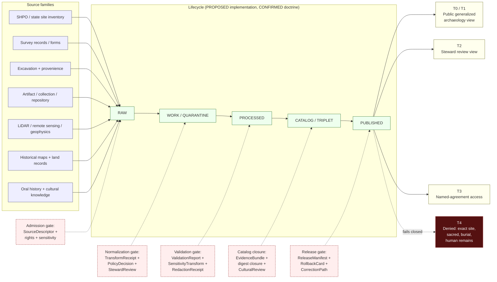

<!-- [KFM_META_BLOCK_V2]
doc_id: kfm://doc/docs-domains-archaeology-readme
title: Archaeology and Cultural Heritage — Domain Documentation
type: standard
version: v2
status: draft
owners: TODO — KFM archaeology steward; cultural-review reviewer; docs steward
created: 2026-05-15
updated: 2026-05-28
policy_label: public
related:
  - docs/domains/README.md
  - directory-rules.md
  - contracts/domains/archaeology/
  - schemas/contracts/v1/domains/archaeology/
  - policy/domains/archaeology/
  - data/published/layers/archaeology/
  - ai-build-operating-contract.md
tags: [kfm, domains, archaeology, cultural-heritage, sensitivity, care, t4]
notes:
  - CONTRACT_VERSION = "3.0.0" pinned (doctrine-adjacent landing doc).
  - All implementation-layer paths in this README are PROPOSED until verified against a mounted repository.
  - Sensitivity defaults follow Atlas v1.1 §24.5 (T0–T4); see Sensitivity section.
  - Per-source tier assignments in the Source families table are INFERRED, not Atlas §15.D doctrine (which leaves rights NEEDS VERIFICATION).
[/KFM_META_BLOCK_V2] -->

# Archaeology and Cultural Heritage — Domain Documentation

> Landing README for the **Archaeology and Cultural Heritage** domain lane:
> archaeological sites, surveys, artifacts, contexts, excavation units, remote-sensing
> and LiDAR candidates, geophysics, 3D documentation, cultural and steward review,
> chronology, sensitivity transforms, and public-safe summaries.


**Status:** draft · **Authority level:** canonical (documentation; implementation maturity PROPOSED) · **Owners:** TODO — archaeology steward, cultural-review reviewer, docs steward · **Last reviewed:** 2026-05-28

> [!IMPORTANT]
> **Exact-location denial is the default.** Exact archaeological geometry, burial sites, human remains, sacred sites, unresolved cultural sensitivity, collection security detail, private landowner detail, and looting-risk exposure **fail closed** at every gate. They MAY be released only after recorded cultural and steward review, a recorded SensitivityTransform, an EvidenceBundle, a ReleaseManifest, and a rollback target. Atlas v1.1 §24.5 sets these defaults at **T4**.

---

## Contents

1. [Purpose](#purpose)
2. [Authority level and status](#authority-level-and-status)
3. [Scope and boundary](#scope-and-boundary)
4. [Repo fit — lane pattern](#repo-fit--lane-pattern)
5. [What belongs in this folder](#what-belongs-in-this-folder)
6. [What does NOT belong here](#what-does-not-belong-here)
7. [Directory tree (PROPOSED)](#directory-tree-proposed)
8. [Lifecycle diagram](#lifecycle-diagram)
9. [Ubiquitous language](#ubiquitous-language)
10. [Source families](#source-families)
11. [Sensitivity and publication posture](#sensitivity-and-publication-posture)
12. [Cross-domain relations](#cross-domain-relations)
13. [API, contract, and schema surfaces (PROPOSED)](#api-contract-and-schema-surfaces-proposed)
14. [Validators, tests, fixtures (PROPOSED)](#validators-tests-fixtures-proposed)
15. [Governed AI posture](#governed-ai-posture)
16. [Publication, correction, and rollback](#publication-correction-and-rollback)
17. [Inputs](#inputs)
18. [Outputs](#outputs)
19. [Validation](#validation)
20. [Review burden](#review-burden)
21. [Related folders and docs](#related-folders-and-docs)
22. [ADRs](#adrs)
23. [Verification backlog and open questions](#verification-backlog-and-open-questions)
24. [Open questions register](#open-questions-register)
25. [Changelog](#changelog)
26. [Definition of done](#definition-of-done)
27. [FAQ](#faq)
28. [Appendix](#appendix)

---

## Purpose

CONFIRMED doctrine / PROPOSED implementation. This folder is the **human-facing documentation home** for the Archaeology and Cultural Heritage domain. It explains the domain's scope, ubiquitous language, source families, lifecycle, sensitivity posture, cross-lane relations, governed surfaces, and verification backlog. It does **not** define schemas, hold policy rules, store data, or carry releases — those live under `contracts/domains/archaeology/`, `schemas/contracts/v1/domains/archaeology/`, `policy/domains/archaeology/`, `data/.../archaeology/`, and `release/candidates/archaeology/` respectively.

The domain's mission, drawn from the *KFM Domains Culmination Atlas* v1.1 §15 and the *Encyclopedia* §7.13:

> *Preserve archaeological and cultural heritage knowledge through strict sensitivity, cultural and steward review, the candidate-vs-confirmed distinction, and exact-location denial by default.*

[Back to top](#contents)

---

## Authority level and status

| Field | Value |
|---|---|
| Authority level (per Directory Rules §5–6) | **Canonical (documentation)** — `docs/` is the human-facing control plane. |
| Status (per Directory Rules §15) | **CONFIRMED doctrine / PROPOSED implementation.** |
| Doctrine source | Atlas v1.1 §15 (Archaeology and Cultural Heritage); Atlas v1.1 §24.5 (Sensitivity tier matrix); Encyclopedia §7.13; Directory Rules (Domain Placement Law). |
| Operating contract | `ai-build-operating-contract.md`, `CONTRACT_VERSION = "3.0.0"`. |
| Implementation maturity | UNKNOWN in this session. Repository not mounted; paths, modules, tests, workflows, manifests, runtime behavior, branches, and policy rule presence cannot be verified here. |

> [!NOTE]
> The doctrine for this domain (scope, ownership, sensitivity defaults, governed-AI posture, publication gates) is **CONFIRMED** from attached KFM source material. The repo-state and implementation claims — paths, schemas, validators, CI, release artifacts — are **PROPOSED / NEEDS VERIFICATION** until a mounted repo confirms them.

[Back to top](#contents)

---

## Scope and boundary

### Owned object families (CONFIRMED doctrine / PROPOSED field realization)

The Archaeology domain owns the following object families. Each is constrained by source role, evidence, time, and release state, and each name is canonical KFM terminology (Atlas v1.1 §15.B–C):

- `ArchaeologicalSite`
- `Survey` · `SurveyProject` · `SurveyTransect`
- `Artifact` · `ArtifactRecord`
- `Feature` · `SiteComponent`
- `Context` · `ProvenienceContext`
- `ExcavationUnit`
- `StratigraphicUnit`
- `RemoteSensingAnomaly`
- `LiDARCandidate` · `CandidateFeature`
- `GeophysicsObservation`
- `ThreeDDocumentation`
- `CulturalReview` · `StewardReview`
- `CollectionAccession` · `CollectionRepositoryRecord`
- `ChronologyAssertion` · `CulturalTemporalPeriod`
- `SensitivityTransform` · `PublicationTransformReceipt`

> [!NOTE]
> **`CONFLICTED` — colloquial vs. formalized names.** Atlas §15.B lists owned concepts colloquially (Survey, Artifact, Feature, Context, Remote Sensing Anomaly, LiDAR Candidate, Collection Accession, Chronology Assertion, Sensitivity Transform), while §15.C lists formalized term names (`SurveyProject`, `ArtifactRecord`, `CandidateFeature`, `ProvenienceContext`, `CollectionRepositoryRecord`, `CulturalTemporalPeriod`, `PublicationTransformReceipt`). The pairings above are the likely mapping (`INFERRED`); the formalized names for `GeophysicsObservation`, `ThreeDDocumentation`, `CulturalReview`, and `StewardReview` have no §15.C glossary entry and are `NEEDS VERIFICATION`. See `docs/domains/archaeology/ubiquitous-language.md`.

### Explicit non-ownership (CONFIRMED doctrine)

The Archaeology domain **does not own** the following — these supply context but **cannot confirm sites or bypass archaeological sensitivity**:

- Roads/Rail (historical routes are *context*, not site confirmation)
- People/Land (genealogy, deeds, parcels)
- Geology and Natural Resources
- Hazards (erosion, fire, flood, exposure)
- Spatial Foundation

[Back to top](#contents)

---

## Repo fit — lane pattern

CONFIRMED placement (per Directory Rules `docs/` tree and the Domain Placement Law). The archaeology domain lives as a **segment** across responsibility roots, never as a root-level domain folder.

```text
docs/domains/archaeology/                  ← THIS FOLDER (human-facing doctrine)
contracts/domains/archaeology/             ← object meaning (semantic Markdown)
schemas/contracts/v1/domains/archaeology/  ← machine-checkable shape (per ADR-0001)
policy/domains/archaeology/                ← allow / deny / restrict / abstain rules
tests/domains/archaeology/                 ← enforcement proof
fixtures/domains/archaeology/              ← golden / valid / invalid samples
packages/domains/archaeology/              ← shared library code, if any
pipelines/domains/archaeology/             ← executable pipeline logic
pipeline_specs/archaeology/                ← declarative pipeline config
data/raw/archaeology/                      ← admitted RAW payloads
data/work/archaeology/                     ← in-process normalization
data/quarantine/archaeology/               ← failed-gate holds
data/processed/archaeology/                ← validated normalized objects
data/catalog/domain/archaeology/           ← catalog records, EvidenceBundles
data/published/layers/archaeology/         ← released public-safe artifacts
data/registry/sources/archaeology/         ← source descriptors
release/candidates/archaeology/            ← release decisions, manifests
```

All paths above are **PROPOSED** until verified against a mounted repository, but the *pattern* is **CONFIRMED** by the Directory Rules Domain Placement Law (domains are segments inside responsibility roots, never root folders).

[Back to top](#contents)

---

## What belongs in this folder

This folder (`docs/domains/archaeology/`) holds **only human-facing documentation** about the archaeology domain. Accepted file types and object families:

| File pattern | Purpose | Status |
|---|---|---|
| `README.md` | This landing doc — orientation, lane pattern, cross-links. | **CONFIRMED required** |
| `ubiquitous-language.md` | Term-by-term glossary (Atlas v1.1 §15.C). | PROPOSED (sibling exists) |
| `source-families.md` | Source families, rights, sensitivity, cadence. | PROPOSED (sibling exists) |
| `sensitivity-and-publication-posture.md` | T0–T4 tier matrix, allowed transforms, gates, CARE binding. | PROPOSED (sibling exists) |
| `pipeline-shape.md` | RAW → PUBLISHED gates for this lane. | PROPOSED (sibling exists) |
| `cross-lane-relations.md` | Edges to Spatial Foundation, Roads/Rail, Settlements, Hazards, People/Land. | PROPOSED (sibling exists) |
| `governed-ai-behavior.md` | Governed-AI posture (decision envelopes, Focus Mode, AIReceipt). | PROPOSED (sibling exists) |
| `verification-backlog.md` | Open questions, NEEDS VERIFICATION items. | PROPOSED (sibling exists) |
| `SCOPE.md` | Detailed scope, boundary, ownership / non-ownership (optional). | PROPOSED |
| `FAQ.md` | Frequent questions and clarifications (optional). | PROPOSED |
| `assets/*.{svg,png,mmd}` | Diagrams referenced from the docs above. | PROPOSED |

> [!NOTE]
> Several sibling docs in this lane already use lowercase-hyphenated filenames (`ubiquitous-language.md`, `source-families.md`, `sensitivity-and-publication-posture.md`, `pipeline-shape.md`, `cross-lane-relations.md`, `governed-ai-behavior.md`, `verification-backlog.md`). The earlier `UPPERCASE.md` names in this table have been reconciled to that convention; confirm the casing convention against the mounted repo and log any mismatch in `docs/registers/DRIFT_REGISTER.md`.

[Back to top](#contents)

---

## What does NOT belong here

> [!WARNING]
> The "do not put X here" list is as important as the "do put Y here" list.

- ❌ **Schemas** — go to `schemas/contracts/v1/domains/archaeology/` (per ADR-0001).
- ❌ **Policy rules** — go to `policy/domains/archaeology/`.
- ❌ **Contracts (semantic Markdown)** — go to `contracts/domains/archaeology/`.
- ❌ **Tests or fixtures** — go to `tests/domains/archaeology/` and `fixtures/domains/archaeology/`.
- ❌ **Pipeline code or specs** — go to `pipelines/domains/archaeology/` and `pipeline_specs/archaeology/`.
- ❌ **Source data of any phase (RAW / WORK / PROCESSED / CATALOG / PUBLISHED)** — go to `data/.../archaeology/`.
- ❌ **Release manifests, rollback cards, correction notices** — go to `release/candidates/archaeology/` or `data/published/`.
- ❌ **Receipts (transform, run, validation, redaction)** — go to `data/receipts/`.
- ❌ **Proofs (EvidenceBundle, digest closures)** — go to `data/proofs/`.
- ❌ **Exact site coordinates, sacred-site geometry, human-remains records** — NEVER in any doc here. Mention only as governance examples, never with real coordinates.
- ❌ **Generated reports, build outputs** — go to `docs/reports/` or `artifacts/`.
- ❌ **Treating this README as the canonical source of any decision** — promote material decisions to an ADR or to `control_plane/` ("Documentation as truth" anti-pattern).

[Back to top](#contents)

---

## Directory tree (PROPOSED)

> [!NOTE]
> The tree below is **PROPOSED**. The repository is not mounted in this session; actual contents may differ. Verify against the live repo before treating any path as canonical.

```text
docs/domains/archaeology/
├── README.md                              # this file — landing, orientation, lane pattern
├── ubiquitous-language.md                 # term-by-term glossary
├── source-families.md                     # source families, rights, cadence
├── sensitivity-and-publication-posture.md # T0–T4 tier matrix + CARE
├── pipeline-shape.md                      # RAW → PUBLISHED gates
├── cross-lane-relations.md                # cross-lane relations
├── governed-ai-behavior.md                # governed-AI posture
├── verification-backlog.md                # open questions
├── FAQ.md                                 # FAQ (optional)
└── assets/
    ├── lifecycle.mmd                       # Mermaid source for lifecycle diagram
    ├── cross-lane.mmd                      # Mermaid source for cross-lane edges
    └── tier-matrix.svg                     # Optional rendered tier matrix
```

[Back to top](#contents)

---

## Lifecycle diagram

CONFIRMED lifecycle invariant: **RAW → WORK / QUARANTINE → PROCESSED → CATALOG / TRIPLET → PUBLISHED** (Directory Rules placement protocol; Atlas v1.1 §24.6). Application to archaeology is PROPOSED implementation; gates and required artifacts are CONFIRMED doctrine.



[Back to top](#contents)

---

## Ubiquitous language

CONFIRMED terms / PROPOSED field realization (Atlas v1.1 §15.C). Each term is used inside this domain with meaning constrained by source role, evidence, time, and release state. KFM casing is preserved. The full glossary lives in `docs/domains/archaeology/ubiquitous-language.md`; the key terms:

| Term | One-line definition |
|---|---|
| `ArchaeologicalSite` | A bounded place where archaeological evidence has been confirmed under domain governance. |
| `SiteComponent` | A bounded sub-element of a site (occupation, feature cluster, etc.). |
| `CulturalTemporalPeriod` | A named cultural / chronological period asserted with evidence. |
| `SurveyProject` | A coherent surveying effort with scope, method, and authority. |
| `SurveyTransect` | A linear or area-bounded sub-unit of survey. |
| `ExcavationUnit` | A bounded excavation locus (test pit, unit, trench). |
| `ProvenienceContext` | The spatial, stratigraphic, and depositional context of an artifact or feature. |
| `StratigraphicUnit` | A named stratum or stratigraphic relation. |
| `ArtifactRecord` | A recorded artifact with provenience, repository, and identity rules. |
| `CollectionRepositoryRecord` | Repository accession data tying artifacts to a curating institution. |
| `CandidateFeature` | A possible feature from remote-sensing, LiDAR, or geophysics — **not a confirmed site**. |
| `PublicationTransformReceipt` | A signed record of the redaction / generalization applied before publication. |

> [!NOTE]
> **Candidate ≠ confirmed.** Atlas §15 makes this explicit. `CandidateFeature`, `RemoteSensingAnomaly`, and `LiDARCandidate` MUST NOT be labeled, indexed, or published as `ArchaeologicalSite` without cultural and steward review (ML-061-167).

[Back to top](#contents)

---

## Source families

CONFIRMED families (Atlas v1.1 §15.D; Encyclopedia §7.13.B). In Atlas §15.D each family carries the uniform role pattern *authority / observation / context / model as the source requires*, with **rights and current terms `NEEDS VERIFICATION`** and **sensitive joins fail closed**.

> [!NOTE]
> The "Likely role" and "Indicative tier" columns below are **`INFERRED`** drafting guidance, **not** Atlas §15.D doctrine (the Atlas does not assign per-family tiers). The actual source role is fixed per source at admission; the actual tier is set by the §24.5 object-class matrix, not by source family. Confirm both against a mounted repo.

| Source family | Likely role (INFERRED) | Indicative tier (INFERRED) | Rights status |
|---|---|---|---|
| State site inventory / SHPO or equivalent | authority / observation | T4 floor | NEEDS VERIFICATION |
| Public NRHP-like listings | regulatory / authority | T1 / T2 | NEEDS VERIFICATION |
| Field survey forms | observation | T2 / T4 | NEEDS VERIFICATION |
| Excavation records and provenience packets | observation | T2 / T4 | NEEDS VERIFICATION |
| Artifact / collection / repository records | administrative / observation | T2 / T4 | NEEDS VERIFICATION |
| Lab reports | observation / model | T2 / T4 | NEEDS VERIFICATION |
| Historic maps / plats / land records / newspapers | administrative / context | T0 / T1 | NEEDS VERIFICATION |
| Oral history and cultural knowledge | authority (steward-held) | T3 / T4 | NEEDS VERIFICATION (consent, sovereignty) |

> [!CAUTION]
> Sensitive joins **fail closed** by default (Atlas §15.D). An indicative tier is the *floor*, not the ceiling — any join, derivative, or aggregation that increases re-identification risk must trigger a fresh sensitivity review and a recorded `SensitivityTransform`. Oral history and steward-held records route through the Indigenous/cultural §23.2 row.

[Back to top](#contents)

---

## Sensitivity and publication posture

CONFIRMED doctrine: KFM publishes the safest representation that still answers the reasonable need (Atlas v1.1 §24.5). The Deny-by-Default Register (Atlas v1.0 §20.5) names the archaeology defaults; v1.1 §24.5.2 binds them to tiers and required gates.

### Archaeology tier defaults (Atlas v1.1 §24.5.2 — defaults PROPOSED until ADR-S-05)

| Object class | Default tier | Allowed transforms | Required gates |
|---|---|---|---|
| Archaeology — site location | **T4** | Steward review + cultural review + generalized geometry (coarse cell) + `RedactionReceipt` → T2 or T1. | `RedactionReceipt` + `ReviewRecord` + `PolicyDecision`. |
| Archaeology — human remains / sacred sites | **T4** | **No transform** releases this to T0; T3 only under explicit named authorization. | Sovereignty review + `ReviewRecord` + `PolicyDecision`. |
| `CulturalTemporalPeriod` | T0 | — | Standard release. |
| Survey coverage (generalized) | T0 / T1 | Generalization where survey areas are themselves sensitive. | Standard release / `RedactionReceipt`. |
| 3D site documentation | T2 / T4 | Generalization, clipping, withholding; Reality Boundary Note + Representation Receipt → T1 or T2 only after steward review. | Steward review + `RedactionReceipt` + Representation Receipt. |

### Tier scheme (Atlas v1.1 §24.5.1)

| Tier | Name | Audience |
|---|---|---|
| T0 | Open | Any public client via the governed API. |
| T1 | Generalized | Any public client, after recorded transform. |
| T2 | Reviewer | Authenticated reviewers, stewards, named collaborators. |
| T3 | Restricted | Named authorized parties under recorded agreement. |
| T4 | Denied | No release. Existence of the record may be acknowledged only as steward review permits. |

> [!IMPORTANT]
> **CARE binds the publication gate, not the badge.** Per Pass 10 Category C15 (C15-01, C15-03): a MetaBlock v2 asset whose `authority_to_control` is non-empty is gated by an OPA **default-deny** rule that fails closed unless an explicit allow rule (valid, unrevoked consent) is satisfied. FAIR/CARE badges in the UI are **not** release authority — `EvidenceBundle`, `PolicyDecision`, and `PromotionDecision` are (ML-061-160).

### Generalization thresholds (CONFIRMED source evidence, PROPOSED implementation)

From the Master MapLibre Components reference:

- Coordinate generalization of **at least 5 km** for terrain tied to archaeological locations (ML-059-055; enforced as a 3D-admission DENY in `maplibre-3d.md` §8.1).
- **Any geometry below H3 r7** is prohibited for sensitive archaeology products without review (ML-061-159).
- Sensitive / sacred symbols MUST NOT default to full public display; generalized or hidden tiers are required (ML-059-046).
- CARE labels and sovereignty notice chips are required in the UI for sensitive content (ML-061-160).
- Generalization logs are validation evidence and must accompany sensitive map products (ML-061-161).

[Back to top](#contents)

---

## Cross-domain relations

CONFIRMED edges (Atlas v1.1 §15.F). Each relation must preserve ownership, source role, sensitivity, and `EvidenceBundle` support. The full treatment lives in `docs/domains/archaeology/cross-lane-relations.md`.

| This domain | Related lane | Relation type | Constraint |
|---|---|---|---|
| Archaeology | Spatial Foundation | Exact / public geometry split; transform receipts. | Sensitivity preserved; exact-site denial holds. |
| Archaeology | Roads/Rail | Historic routes, cultural paths. | Roads/Rail does not confirm sites. |
| Archaeology | Settlements/Infrastructure | Forts, missions, townsites, reservation communities. | Generalized historical context only; no exact-site bypass. |
| Archaeology | Hazards | Threat, erosion, fire, flood, exposure context. | Hazards never confirms a site or weakens sensitivity. |

> [!NOTE]
> The four rows above are the `CONFIRMED` Atlas §15.F relations. Two further edges sometimes cited — **Flora** (ethnobotanical context) and **People/Land** (historic person-place links) — are **`INFERRED`** from adjacent-domain non-ownership statements, not from the §15.F table. Treat them as plausible context edges pending confirmation; both carry mutual exact-location denial and (for People/Land) living-person/consent controls.

[Back to top](#contents)

---

## API, contract, and schema surfaces (PROPOSED)

PROPOSED governed-API surface for archaeology (Atlas v1.1 §15.J). Exact routes, DTO names, and runtime behavior are UNKNOWN until verified against a mounted `apps/governed-api/` and `schemas/contracts/v1/domains/archaeology/`.

| Endpoint or artifact | DTO / schema | Outcomes | Status |
|---|---|---|---|
| Archaeology feature / detail resolver | `ArchaeologyDecisionEnvelope` | ANSWER · ABSTAIN · DENY · ERROR | PROPOSED — exact route UNKNOWN. |
| Archaeology layer manifest resolver | `LayerManifest` / domain layer descriptor | ANSWER · DENY · ERROR | PROPOSED — public-safe release only. |
| Archaeology Evidence Drawer payload | `EvidenceDrawerPayload` + `EvidenceBundle` projection | ANSWER · ABSTAIN · DENY · ERROR | PROPOSED — evidence- and policy-filtered. |
| Archaeology Focus Mode answer | Runtime Response Envelope + `AIReceipt` | ANSWER · ABSTAIN · DENY · ERROR | PROPOSED — AI never root truth. |
| Schema responsibility root | `schemas/contracts/v1/domains/archaeology/` | finite validator outcomes | PROPOSED per ADR-0001. |

> [!NOTE]
> Per the Trust Membrane, public clients **must** read through `apps/governed-api/`, not directly from `data/processed/`, `data/catalog/`, or `data/published/`. Cesium / 3D renderers, where present, consume the same `EvidenceBundle` and `DecisionEnvelope` as 2D — they are alternate renderers, not alternate truth paths.

[Back to top](#contents)

---

## Validators, tests, fixtures (PROPOSED)

PROPOSED test catalog (Atlas v1.1 §15.K). All names are illustrative; presence and behavior require verification against a mounted `tests/domains/archaeology/` and `fixtures/domains/archaeology/`. Each test must exercise its negative (`DENY`/`ABSTAIN`/`HOLD`) branch, not only the happy path.

- PROPOSED — `EvidenceBundle`-required tests (no public claim without bundle closure).
- PROPOSED — candidate-not-site tests (`CandidateFeature` cannot promote to `ArchaeologicalSite` without cultural and steward review).
- PROPOSED — public no-leak tests (exact geometry, burial / sacred / human-remains fields denied at every public surface).
- PROPOSED — rights and cultural-review tests.
- PROPOSED — exact sensitive geometry denial (H3 below r7; sub-5 km terrain tying).
- PROPOSED — catalog closure tests (`EvidenceRef` resolves, digests close).
- PROPOSED — AI exact-location denial (Focus Mode must DENY exact-coordinate queries).
- PROPOSED — generalization-log presence tests (Atlas v1.1 §24.5; ML-061-161).
- PROPOSED — CARE default-deny tests (C15-03; non-empty `authority_to_control` triggers OPA deny without valid consent).

[Back to top](#contents)

---

## Governed AI posture

CONFIRMED doctrine / PROPOSED implementation (Atlas v1.1 §15.L). Full treatment in `docs/domains/archaeology/governed-ai-behavior.md`:

> AI MAY summarize *released* Archaeology `EvidenceBundle`s, compare evidence, explain limitations, and draft steward-review notes. AI MUST `ABSTAIN` when evidence is insufficient and `DENY` where policy, rights, sensitivity, or release state blocks the request.

Applied constraints (from Master MapLibre supplement ML-061-162, ML-061-163, ML-061-164):

- Focus Mode for archaeology MUST be sovereignty-aware and explain which evidence influenced the answer.
- Cluster summaries (e.g., "Late Prehistoric activity zones") MUST state that zones are **generalized**, not precise sites.
- Focus Mode archaeology panels show CARE labels, provenance badges, and generalization/uncertainty explanations.
- AI never reads RAW or WORK content; it consumes only released `EvidenceBundle`s gated by `PolicyDecision` and tagged with an `AIReceipt`.

> [!IMPORTANT]
> **Fluent generation is not evidence.** Per the project's Governed AI Rule, AI is interpretive, not the root truth source. `EvidenceBundle` outranks generated language. A polished Focus Mode answer that lacks bundle support MUST `ABSTAIN`, not `ANSWER`.

[Back to top](#contents)

---

## Publication, correction, and rollback

CONFIRMED doctrine / PROPOSED implementation (Atlas v1.1 §15.M and Appendix E):

Archaeology publication requires:

1. `ReleaseManifest` (the release decision).
2. `EvidenceBundle` (evidence closure).
3. Validation and policy support (deterministic, fixture-bound).
4. `ReviewRecord` where required (cultural and / or steward review).
5. Correction path (a `CorrectionNotice` route that can be exercised).
6. Stale-state rule (released artifacts must declare when they age out of currency).
7. Rollback target (a `RollbackCard` naming the reversion state).

### Tier transitions (Atlas v1.1 §24.5.3)

| From → To | Required artifact | Reviewer | Reversibility |
|---|---|---|---|
| T4 → T3 | `PolicyDecision` + `ReviewRecord` + agreement | Steward + rights-holder | Reversible: agreement revocation returns to T4 + `CorrectionNotice`. |
| T4 → T2 | `PolicyDecision` + `ReviewRecord` | Steward | Reversible: review revocation returns to T4. |
| T4 → T1 | `RedactionReceipt` + `ReviewRecord` | Steward | Reversible. |
| T2 → T1 | `RedactionReceipt` + `ReviewRecord` | Steward | Reversible. |
| T1 → T0 | `ReleaseManifest` + `ReviewRecord` | Steward + release authority | Reversible via `RollbackCard`. |
| any → T4 (downgrade) | `CorrectionNotice` + `ReviewRecord` | Steward + rights-holder | Always permitted; precedes derivative invalidation. |

> [!TIP]
> **Tier motion is asymmetric.** A tier upgrade (more public) always needs both a transform receipt and a review record. A tier downgrade (less public) needs only a `CorrectionNotice` — correction alone is sufficient to remove or restrict.

[Back to top](#contents)

---

## Inputs

Where files in this folder come from:

- **Authored** by the archaeology steward, cultural-review reviewer, and docs steward, with mandatory cross-review for any change that touches sensitivity, sovereignty, or release posture.
- **Synchronized** from upstream doctrine: Atlas v1.1 §15 and §24.5; Encyclopedia §7.13; Directory Rules (Domain Placement Law); Pass 10 / Pass 18 idea cards; MapLibre supplement ML-059 / ML-061.
- **Not** generated by build tools, pipelines, or AI without explicit human review and a recorded `ReviewRecord`.

[Back to top](#contents)

---

## Outputs

What this folder supports downstream:

- **Documentation surfaces** — these docs are read by stewards, reviewers, contributors, and downstream documentation builds (`docs/architecture/`, `docs/runbooks/`, `docs/standards/`).
- **Doctrine references** for `contracts/domains/archaeology/`, `schemas/contracts/v1/domains/archaeology/`, `policy/domains/archaeology/`, and `pipelines/domains/archaeology/`. Code authors cite these docs; they do not redefine doctrine inside code.
- **Onboarding** for new stewards and reviewers.
- **Audit trail** of doctrine evolution (via version-control history + KFM Meta Block updates).

This folder does **not** emit data, schemas, policy rules, pipelines, manifests, or release decisions.

[Back to top](#contents)

---

## Validation

How this folder is checked. Validators below are **PROPOSED** until verified in a mounted `tools/` and `.github/workflows/`.

| Check | Tool / workflow (PROPOSED) | Failure mode |
|---|---|---|
| Markdown link integrity | `tools/validators/docs/link-check` | Fail PR. |
| KFM Meta Block v2 schema | `tools/validators/docs/meta-block` | Fail PR. |
| Cross-reference parity (terms match Atlas / Encyclopedia) | `tools/validators/docs/terminology-parity` | Fail PR. |
| Truth-label discipline (no unlabeled implementation claims) | `tools/validators/docs/truth-label-lint` | Warn → fail at maturity. |
| Stale-doc detection (last reviewed > 6 months) | `tools/validators/docs/stale-scan` | Auto-populate drift register. |

[Back to top](#contents)

---

## Review burden

PROPOSED. Final assignments require a CODEOWNERS entry verified against a mounted repository.

- **Required reviewers for any change:** archaeology steward; cultural-review reviewer; docs steward.
- **Additional required reviewers for changes that touch sensitivity, sovereignty, or release posture:** rights-holder representative (per `authority_to_control`); release authority for any change to the Publication, correction, and rollback section.
- **CODEOWNERS reference:** TODO — confirm path `/.github/CODEOWNERS` lists `docs/domains/archaeology/` with the above reviewers.

[Back to top](#contents)

---

## Related folders and docs

> [!NOTE]
> Links below are **PROPOSED** relative paths. Existence and exact filenames require verification against a mounted repository. The canonical location of the Directory Rules file is itself an open verification item (see Open questions register OQ-ARCH-RM-01).

- [`docs/domains/README.md`](../README.md) — domain documentation index.
- `directory-rules.md` — Domain Placement Law; Required README Contract. *(Canonical path NEEDS VERIFICATION — see OQ-ARCH-RM-01.)*
- `docs/doctrine/trust-membrane.md` — public-path discipline (PROPOSED path).
- `docs/doctrine/lifecycle-law.md` — RAW → PUBLISHED (PROPOSED path).
- [`docs/domains/archaeology/ubiquitous-language.md`](./ubiquitous-language.md) — full glossary.
- [`docs/domains/archaeology/source-families.md`](./source-families.md) — source families.
- [`docs/domains/archaeology/sensitivity-and-publication-posture.md`](./sensitivity-and-publication-posture.md) — tiers + CARE.
- [`docs/domains/archaeology/pipeline-shape.md`](./pipeline-shape.md) — RAW → PUBLISHED.
- [`docs/domains/archaeology/cross-lane-relations.md`](./cross-lane-relations.md) — cross-lane edges.
- [`docs/domains/archaeology/governed-ai-behavior.md`](./governed-ai-behavior.md) — governed-AI posture.
- [`docs/domains/archaeology/verification-backlog.md`](./verification-backlog.md) — open verification items.
- `docs/architecture/governed-api.md` — `DecisionEnvelope`, `EvidenceBundle` surfaces (PROPOSED path).
- `docs/standards/PROV.md` — provenance crosswalk (PROPOSED path).
- `docs/registers/VERIFICATION_BACKLOG.md` — repo-wide open verification items (PROPOSED path).
- `contracts/domains/archaeology/` · `schemas/contracts/v1/domains/archaeology/` · `policy/domains/archaeology/` · `tests/domains/archaeology/` · `release/candidates/archaeology/` — TODO once present.

[Back to top](#contents)

---

## ADRs

ADRs that govern or are relevant to this folder:

- **ADR-0001 — Schema home** (CONFIRMED reference): `schemas/contracts/v1/...` is canonical.
- **PROPOSED ADRs from the Master Open-ADR Backlog** (Atlas v1.1 §24.12 / ADR-S series) that touch archaeology:
  - **ADR-S-04** — Source-role enum vocabulary v1.
  - **ADR-S-05** — Sensitivity tier scheme (T0–T4) — adopt as canonical or revise.
  - **ADR-S-09** — Governed-AI provider-neutral adapter contract (Focus Mode / `AIReceipt`).
  - **ADR-S-11** — Cross-lane join policy + `most-restrictive-applicable` default.
  - **ADR-S-12** — Two-person-rule scope for T3/T4 promotion.
  - **ADR-S-NN (TODO — number)** — Cultural review process and authorities.
  - **ADR-S-NN (TODO — number)** — Generalization-threshold canon (≥5 km terrain; H3 r7 floor).
- TODO — confirm `docs/adr/` index entries when repo is mounted.

[Back to top](#contents)

---

## Verification backlog and open questions

Direct from Atlas v1.1 §15.N, plus this README's residual gaps. All are **NEEDS VERIFICATION** until a mounted repository confirms or refutes them. The lane-scoped backlog with IDs lives in `docs/domains/archaeology/verification-backlog.md`.

| Item | Evidence that would settle it | Status |
|---|---|---|
| Verify steward authority and confidentiality. | Mounted repo files, schemas, registry entries, tests, logs, emitted artifacts, review records, or release manifests. | NEEDS VERIFICATION |
| Define public geometry thresholds and transform profiles. | As above. | NEEDS VERIFICATION |
| Verify oral-history / cultural-knowledge protocol. | As above. | NEEDS VERIFICATION |
| Verify emergency public-layer disablement and rollback drill. | As above. | NEEDS VERIFICATION |
| Confirm CODEOWNERS entries for `docs/domains/archaeology/`. | Mounted `.github/CODEOWNERS`. | NEEDS VERIFICATION |
| Confirm presence of `schemas/contracts/v1/domains/archaeology/`. | Mounted schema tree. | NEEDS VERIFICATION |
| Confirm validator + workflow names referenced in Validation table. | Mounted `tools/` and `.github/workflows/`. | NEEDS VERIFICATION |
| Confirm ADR numbers for source-role enum, sensitivity tiers, generalization thresholds, cultural review. | Mounted `docs/adr/`. | NEEDS VERIFICATION |

[Back to top](#contents)

---

## Open questions register

| ID | Question | Owner role | Resolution path |
|---|---|---|---|
| OQ-ARCH-RM-01 | What is the canonical path/filename for the Directory Rules file (`directory-rules.md` vs `docs/doctrine/directory-rules.md` vs `Directory Rules.pdf`)? | docs steward | repo inspection / ADR |
| OQ-ARCH-RM-02 | Is the lane filename convention lowercase-hyphenated (siblings) or `UPPERCASE.md`? | docs steward | repo inspection / `DRIFT_REGISTER.md` |
| OQ-ARCH-RM-03 | Are the §15.F cross-lane edges only the four CONFIRMED rows, or do Flora and People/Land edges belong in the table? | archaeology steward | ADR / repo inspection |
| OQ-ARCH-RM-04 | Do per-source tiers exist, or is tier set solely by the §24.5 object-class matrix? | archaeology steward | steward ratification |
| OQ-ARCH-RM-05 | What ADR numbers cover cultural-review process and generalization-threshold canon? | docs steward | repo inspection |

[Back to top](#contents)

---

## Changelog

| Version | Change | Type (per contract §37) | Reason |
|---|---|---|---|
| v1 → v2 | Pinned `CONTRACT_VERSION = "3.0.0"`; added badge + meta field | clarification | Doctrine-adjacent doc requirement |
| v1 → v2 | Reconciled sibling filenames to lowercase-hyphenated; linked existing sibling docs | reconciliation | Match the lane's actual sibling docs |
| v1 → v2 | Relabeled per-source tiers in Source families as `INFERRED` (not §15.D doctrine) | reconciliation | Atlas §15.D assigns no per-family tiers; avoid overclaiming |
| v1 → v2 | Marked Flora / People/Land cross-lane rows `INFERRED` (not §15.F) | reconciliation | §15.F has four CONFIRMED rows only |
| v1 → v2 | Surfaced Directory Rules path and §15.B↔§15.C naming as `CONFLICTED`/open | reconciliation | Do not smooth over unresolved naming |
| v1 → v2 | Added Open questions register, Changelog, Definition of done | gap closure | Doctrine companion sections |
| v1 → v2 | Filled ADR-S numbers (04, 05, 09, 11, 12) from the backlog | gap closure | Replace generic placeholders with corpus-grounded IDs |

> **Backward compatibility.** All v1 section anchors are preserved (headings 1–25 unchanged in text). New sections (Open questions register, Changelog, Definition of done) were inserted before FAQ and Appendix; the Contents list was renumbered accordingly. No v1 content was removed.

[Back to top](#contents)

---

## Definition of done

This README is done enough to enter the repository when:

- it is placed according to Directory Rules (`docs/domains/archaeology/`);
- the archaeology steward, cultural-review reviewer, and docs steward review it;
- it is linked from `docs/domains/README.md` and the lane sibling docs;
- it does not conflict with accepted ADRs (notably ADR-0001);
- the Directory Rules path (OQ-ARCH-RM-01) and filename convention (OQ-ARCH-RM-02) are resolved or logged in `docs/registers/DRIFT_REGISTER.md`;
- owner and CODEOWNERS placeholders are replaced with verified values;
- the `GENERATED_RECEIPT.json` planned in Section 2 (Notes) is wired into CI;
- future changes follow the operating contract's §37 lifecycle.

[Back to top](#contents)

---

## FAQ

<details>
<summary><strong>Q: Why does this README mark so much as PROPOSED?</strong></summary>

The repository is not mounted in this session. Per Directory Rules and the project's Repository Preflight rule, any claim about repo state (paths, schemas, tests, CI, routes, branches) requires direct repository inspection. Doctrine — what the domain *should* govern, and how — is CONFIRMED from attached KFM source material. Everything below the doctrinal layer (file presence, runtime behavior, validator coverage) waits on a mounted repo.

</details>

<details>
<summary><strong>Q: Can a "Late Prehistoric activity zone" be shown on the public map?</strong></summary>

CONFIRMED doctrine: generalized cultural-temporal zones MAY be shown publicly when they are explicitly labeled as **generalized**, not precise sites (ML-061-163). Exact site geometry remains T4 by default. Any zone visualization must carry a `RedactionReceipt` and a CARE label.

</details>

<details>
<summary><strong>Q: What if oral-history or cultural-knowledge evidence conflicts with a state SHPO record?</strong></summary>

Conflicts are **surfaced, not smoothed** (Atlas v1.1 governance posture). Both records are retained as `EvidenceRef`s. The conflict appears in the `EvidenceBundle` and is rendered visibly in the Evidence Drawer. Steward and cultural-review records adjudicate; the public-facing surface reflects whichever (or neither) the review supports, with the conflict acknowledged.

</details>

<details>
<summary><strong>Q: Can AI Focus Mode answer "where exactly is site X?"</strong></summary>

No. Per the Governed AI posture and CARE default-deny rule, exact-coordinate queries about sensitive archaeology fail closed. Focus Mode must `DENY` with a recorded `AIReceipt`. Acceptable answers describe **generalized zones**, **cultural-temporal periods**, **survey coverage at coarse resolution**, and **non-sensitive collection summaries** — always citing released `EvidenceBundle`s.

</details>

<details>
<summary><strong>Q: Why is `CandidateFeature` distinct from `ArchaeologicalSite`?</strong></summary>

Atlas §15 explicitly marks the distinction: anomalies from LiDAR, remote sensing, and geophysics are *candidates*, not confirmed sites. A candidate cannot be labeled, indexed, or published as a site without cultural and steward review. This separation prevents anomaly-detection workflows from inadvertently confirming sites under the public layer (ML-061-159; ML-061-167).

</details>

[Back to top](#contents)

---

## Appendix

<details>
<summary><strong>A. Doctrine sources consulted for this README (CONFIRMED)</strong></summary>

- *KFM Domains Culmination Atlas* v1.1 — §15 (Archaeology and Cultural Heritage); §24.5 (Sensitivity tier matrix); §24.6 (Pipeline gates); §24.12 (Open-ADR backlog); Appendix G (Lineage).
- *KFM Domain and Capability Encyclopedia* — §7.13 (Archaeology and Cultural Heritage); §20.5 (Deny-by-Default Register).
- *Directory Rules* — Placement Protocol; `docs/` tree; Trust Membrane; Domain Placement Law; Anti-Patterns; Required README Contract; Path-Validation Checklist.
- *Master MapLibre Components-Functions-Features* v2.1 — ML-059 (CARE metadata, 5 km generalization: ML-059-046, ML-059-055); ML-061 (sensitive geometry / H3 r7: ML-061-159; CARE labels: ML-061-160; generalization logs: ML-061-161; sovereignty-aware Focus Mode: ML-061-162/163/164; candidate-not-site: ML-061-167).
- *maplibre-3d.md* — §8.1 default-deny matrix (Archaeology without ≥5 km generalization → DENY).
- *KFM Components Pass 10 Idea Index* — C15 (FAIR + CARE Reconciliation: C15-01 MetaBlock v2 CARE fields; C15-03 OPA default-deny on CARE-tagged assets).
- *KFM Pass 18 Idea Index* — KFM-P18-INV-019 and related (3D archaeology, candidate-not-site); *Pass 32* KFM-P9-FEAT-0012 (anomaly detection as reviewed inference).

</details>

<details>
<summary><strong>B. Glossary cross-reference (KFM terms preserved exactly)</strong></summary>

`EvidenceRef` · `EvidenceBundle` · `SourceDescriptor` · `RunReceipt` · `TransformReceipt` · `RedactionReceipt` · `AggregationReceipt` · `PublicationTransformReceipt` · `ValidationReport` · `DecisionEnvelope` · `RuntimeResponseEnvelope` · `ReleaseManifest` · `RollbackCard` · `CorrectionNotice` · `ReviewRecord` · `CulturalReview` · `StewardReview` · `LayerManifest` · `EvidenceDrawerPayload` · `AIReceipt` · `SensitivityTransform` · `PromotionDecision` · `MetaBlock v2`.

</details>

<details>
<summary><strong>C. Quick checklist for contributors</strong></summary>

Before opening a PR that touches this folder:

- [ ] Truth labels applied (CONFIRMED · PROPOSED · UNKNOWN · NEEDS VERIFICATION · EXTERNAL).
- [ ] KFM terminology preserved exactly (no silent renaming).
- [ ] Cross-references to Atlas / Encyclopedia / Directory Rules section numbers included.
- [ ] No exact coordinates, sacred-site geometry, or human-remains data in any doc.
- [ ] No schema, policy rule, pipeline code, or release artifact in `docs/domains/archaeology/`.
- [ ] KFM Meta Block v2 updated (`updated:`, `status:` if relevant).
- [ ] Cultural-review reviewer requested for any change touching sensitivity, sovereignty, or release posture.
- [ ] Stale-state and rollback implications considered if the change affects published surfaces.

</details>

[Back to top](#contents)

---

### Last reviewed
2026-05-28

### Related docs
[`docs/domains/README.md`](../README.md) · `directory-rules.md` · [`docs/domains/archaeology/sensitivity-and-publication-posture.md`](./sensitivity-and-publication-posture.md) · [`docs/domains/archaeology/governed-ai-behavior.md`](./governed-ai-behavior.md) · [`docs/domains/archaeology/verification-backlog.md`](./verification-backlog.md)

**CONTRACT_VERSION = "3.0.0"**

[⬆ Back to top](#archaeology-and-cultural-heritage--domain-documentation)
