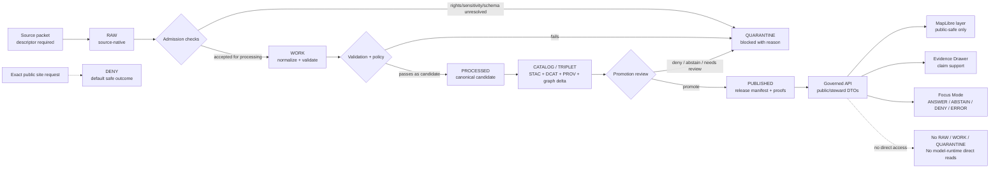

<!-- [KFM_META_BLOCK_V2]
doc_id: kfm://doc/TODO-NEEDS-UUID
title: Archaeology Domain Lane
type: standard
version: v1
status: draft
owners: TODO-NEEDS-OWNER
created: 2026-04-22
updated: 2026-04-22
policy_label: TODO-NEEDS-VERIFICATION
related: [docs/domains/archaeology/ARCHITECTURE.md, docs/domains/archaeology/DOMAIN_MODEL.md, docs/domains/archaeology/SENSITIVITY_AND_RIGHTS.md, docs/domains/archaeology/VALIDATION_AND_POLICY.md, docs/domains/archaeology/API_AND_UI_SURFACES.md, docs/adr/ADR-archaeology-location-sensitivity.md, docs/adr/ADR-archaeology-public-vs-restricted-geometry.md]
tags: [kfm, archaeology, heritage, evidence, sensitivity, rights, governed-api, maplibre, focus-mode]
notes: [Created from attached KFM archaeology architecture plan and shared KFM doctrine. Current repo checkout was not available in this session; owner, UUID, policy label, adjacent file existence, schema home, CI, API, UI, and validator implementation require verification.]
[/KFM_META_BLOCK_V2] -->

# Archaeology Domain Lane

Purpose: orient maintainers to the KFM Archaeology lane, its fail-closed publication posture, and the evidence, policy, catalog, API, and UI surfaces needed to admit, protect, publish, explain, correct, and roll back archaeology evidence.


> [!IMPORTANT]
> **Status:** experimental — **NEEDS VERIFICATION** after the real repository is mounted.  
> **Owners:** `TODO-NEEDS-OWNER`  
> **Path:** `docs/domains/archaeology/README.md`  
> **Impact:** This is the domain entry point for archaeology and heritage context. Public archaeological outputs must use reviewed generalized, redacted, or suppressed geometry. Exact site locations are denied by default.  
> **Quick jumps:** [Scope](#scope) · [Repo fit](#repo-fit) · [Inputs](#inputs) · [Exclusions](#exclusions) · [Trust rules](#trust-rules) · [Source roles](#source-roles) · [Lifecycle](#lifecycle) · [Directory tree](#directory-tree) · [Quickstart](#quickstart) · [API and UI](#api-and-ui) · [Validation gates](#validation-gates) · [Done means](#done-means) · [FAQ](#faq) · [Appendix](#appendix)

> [!WARNING]
> **Public archaeology is never “just a layer.”** Archaeological site locations can expose burial contexts, sacred places, culturally sensitive knowledge, collection-security targets, private-landowner details, or looting risk. KFM fails closed when rights, sensitivity, source role, review state, or public geometry treatment is unresolved.

---

## Scope

This README is the landing page for the KFM Archaeology lane.

It covers:

- archaeological sites, components, features, artifacts, assemblages, provenience, stratigraphy, survey records, excavation records, samples, lab results, chronometric determinations, reports, archival sources, and candidate features;
- heritage 2.5D/3D context when volumetric or spatial reasoning materially matters;
- source descriptors, rights review, sensitivity treatment, public geometry transformation, validation, catalog closure, proof objects, governed API contracts, MapLibre layer descriptors, Evidence Drawer payloads, Focus Mode behavior, correction notices, and rollback cards.

It does **not** prove that any repository files, schemas, routes, workflows, tests, validators, or UI components already exist. The attached planning corpus establishes the lane doctrine and proposed file families; implementation depth remains **UNKNOWN** until the real checkout is inspected.

[Back to top](#archaeology-domain-lane)

---

## Repo fit

| Field | Value |
|---|---|
| Target path | `docs/domains/archaeology/README.md` |
| Document role | Domain landing page, doctrine summary, source activation warning, and navigation surface |
| Baseline source | KFM Archaeology Architecture Plan PDF-only report |
| Upstream index | `TODO: docs/domains/README.md` — **NEEDS VERIFICATION** |
| Architecture docs | `ARCHITECTURE.md`, `DOMAIN_MODEL.md`, `DATA_LIFECYCLE.md` — **PROPOSED** |
| Governance docs | `SENSITIVITY_AND_RIGHTS.md`, `VALIDATION_AND_POLICY.md`, `PROMOTION_AND_ROLLBACK.md` — **PROPOSED** |
| Downstream machine surfaces | `data/registry/archaeology/`, `schemas/contracts/v1/archaeology/`, `policy/archaeology/`, `tools/validators/archaeology/` — **PROPOSED** |
| Downstream runtime surfaces | governed API, public MapLibre layer descriptors, Evidence Drawer payloads, Focus Mode payloads, Story/Dossier payloads — **PROPOSED** |
| Current implementation evidence | **UNKNOWN** — no mounted repo was available in this session |

> [!NOTE]
> Relative links to adjacent files are intentionally represented as repo paths until the checkout confirms those files exist. Convert the paths to clickable links only after the neighboring docs are present.

---

## Inputs

Accepted inputs are not automatically publishable. They are candidates for governed intake.

| Input family | What belongs here | Required admission gate |
|---|---|---|
| Source descriptors | Source owner, access mode, rights, sensitivity, source role, cadence, citation rules, validation checks | Descriptor review before connector activation |
| Field and survey packets | Survey projects, transects, observations, excavation/test units, field notes, controlled spatial context | Evidence refs, support, steward review, and sensitivity classification |
| Site and component records | Site records, components, features, stratigraphic units, provenience contexts | Restricted by default until public profile is approved |
| Artifact and assemblage records | Artifact records, collections context, assemblages, repository references | Provenience and rights required |
| Lab and chronometric records | Lab results, dates, methods, calibration/context notes | Method and uncertainty visible |
| Reports and bibliographic sources | Published reports, gray literature, archival descriptions, historic map references | Citation, rights, and source-role mapping |
| Oral, steward, or cultural knowledge | Steward-controlled knowledge, oral histories, cultural affiliation context | Permission, role-gated review, and fail-closed public posture |
| Remote sensing and geophysics | LiDAR, aerial, satellite, magnetic, resistivity, GPR, model, or anomaly surfaces | Candidate-feature handling only; cannot become confirmed sites without evidence and review |
| Public derivatives | Generalized summaries, survey coverage, candidate-feature surfaces, public story assets | Transform receipt, catalog closure, policy decision, release manifest |

---

## Exclusions

| Exclusion | Why it is excluded | Where it belongs instead |
|---|---|---|
| Public exact archaeological site coordinates | Exposure risk; denied by default | Restricted/steward-only store with governed access |
| Burial, human remains, sacred-site, or culturally sensitive exact locations | High sensitivity and cultural/steward review burden | Restricted review path; public generalized/suppressed representation only if approved |
| Private landowner identity or access details | Privacy and security risk | Restricted record with policy gate |
| Collection storage or security-sensitive details | Looting and collection risk | Restricted operations/security context |
| RAW, WORK, or QUARANTINE paths in public payloads | Breaks KFM lifecycle and trust membrane | Governed API DTOs backed by released artifacts |
| Unreviewed LiDAR/geophysical/ML anomaly labeled as a site | Candidate evidence is not confirmation | Candidate-feature record with review state |
| Unknown-rights source material in public release | Rights and redistribution are unresolved | QUARANTINE or DENY until rights are resolved |
| Uncited AI or Focus Mode answers | Generated language is not evidence | ABSTAIN, DENY, or return evidence-bounded answer with validated citations |
| Graph, vector, search, tile, or summary layer as canonical truth | Derived projections are rebuildable and subordinate | Canonical record plus EvidenceBundle and release manifest |

[Back to top](#archaeology-domain-lane)

---

## Trust rules

KFM archaeology follows the shared KFM truth path:

```text
RAW -> WORK / QUARANTINE -> PROCESSED -> CATALOG / TRIPLET -> PUBLISHED
     -> governed API -> trust-visible UI
```

Core lane rules:

1. **Exact public site geometry is denied by default.**
2. **Public output requires a reviewed publication profile.**
3. **Generalized, redacted, or suppressed public geometry requires a `publication_transform_receipt`.**
4. **Candidate features remain candidate features until evidence and review support stronger claims.**
5. **Every consequential claim resolves `EvidenceRef -> EvidenceBundle`.**
6. **Promotion is a governed state transition, not a file move.**
7. **Receipts, proofs, catalogs, review records, release manifests, corrections, and rollback cards remain separate objects.**
8. **MapLibre, Focus Mode, Story surfaces, exports, and dashboards consume governed DTOs and released artifacts only.**
9. **AI is interpretive support, not a source of archaeological truth.**

> [!CAUTION]
> A public map that “hides the point but leaks the tile, graph edge, source row, or unredacted drawer payload” still leaks the point. Validate public payloads, catalog records, layer descriptors, and exported artifacts together.

---

## Source roles

Source role separation prevents false certainty.

| Source role | Best use | Must not become |
|---|---|---|
| Field / survey / excavation | Direct field context, observations, provenience, transects, excavation units | Unreviewed public site disclosure |
| Lab / analytical / chronometric | Method-specific dating, material analysis, sample results | General chronology without uncertainty or support |
| Archival / documentary / report | Historic maps, reports, bibliographic sources, descriptions, citations | Decontextualized coordinates or unsupported site confirmation |
| Oral / steward / cultural knowledge | Steward-reviewed cultural context and interpretation | Public claim without permission and review |
| Regulatory / administrative / inventory | Administrative context and listing/inventory status | Cultural truth, ownership truth, or exact public location authority by itself |
| Remote sensing / geophysical / modeled | Candidate-feature detection, survey targeting, interpretation support | Confirmed site record without review |
| Derived public | Generalized summaries, public story assets, survey coverage, public-safe layers | Canonical truth or restricted-data substitute |
| Restricted canonical / steward-only | Exact geometry, sensitive records, controlled access review | Public DTO, public tile, public graph edge, or public export |

---

## Domain object families

| Family | Examples | Publication posture |
|---|---|---|
| Site and component | `archaeology_site`, `archaeology_component` | Restricted by default; public summary only after review |
| Feature and stratigraphy | `archaeological_feature`, `stratigraphic_unit`, `provenience_context` | Context-sensitive; public precision must be reviewed |
| Survey and excavation | `survey_project`, `survey_transect`, `survey_observation`, `excavation_unit`, `test_unit_record` | Public survey coverage may be safer than exact finds |
| Artifacts and assemblages | `artifact_record`, `assemblage`, `collection_repository_record` | Avoid exposing sensitive storage/security context |
| Samples and lab work | `sample_record`, `lab_result`, `chronometric_determination` | Method, uncertainty, and provenance required |
| Sources and citations | `report_bibliographic_source`, `historic_archival_source` | Citation and rights posture required |
| Candidate features | `geophysical_observation`, remote-sensing anomaly or model surface | Candidate only; must not be promoted to confirmed site without review |
| Public derivatives | generalized summaries, public layers, story nodes, export assets | Require transform receipt, catalog closure, release manifest, and rollback path |

---

## Lifecycle



[Back to top](#archaeology-domain-lane)

---

## Directory tree

> [!NOTE]
> The tree below is **PROPOSED** from the archaeology architecture plan. It is a target map for future implementation, not proof of current files.

<details>
<summary><strong>Proposed archaeology lane tree</strong></summary>

```text
docs/
  domains/archaeology/
    README.md
    ARCHITECTURE.md
    DOMAIN_MODEL.md
    SOURCE_REGISTRY.md
    SENSITIVITY_AND_RIGHTS.md
    VALIDATION_AND_POLICY.md
    CATALOG_AND_PROOF_OBJECTS.md
    API_AND_UI_SURFACES.md
    DATA_LIFECYCLE.md
    PROMOTION_AND_ROLLBACK.md
    FILE_MAP.md
    CHANGELOG.md
    OPEN_QUESTIONS.md
    BACKLOG.md
    RUNBOOK.md
  adr/
    ADR-archaeology-schema-home.md
    ADR-archaeology-location-sensitivity.md
    ADR-archaeology-public-vs-restricted-geometry.md
    ADR-archaeology-source-role-separation.md

data/
  registry/archaeology/
    sources.yaml
    datasets.yaml
    object_types.yaml
    sensitivity_policies.yaml
    publication_profiles.yaml
    verification_backlog.yaml
  raw/archaeology/
  work/archaeology/
  quarantine/archaeology/
  processed/archaeology/
  catalog/stac/archaeology/
  catalog/dcat/archaeology/
  catalog/prov/archaeology/
  triplets/archaeology/
  proofs/archaeology/
  receipts/archaeology/
  published/archaeology/

schemas/contracts/v1/archaeology/
  *.schema.json

policy/archaeology/
  *.rego
  tests/*.rego

tools/validators/archaeology/
  run_all.py
  validate_public_location_safety.py
  validate_evidence_bundle.py
  validate_decision_envelope.py
  validate_catalog_closure.py
  validate_ai_citations.py

tests/
  fixtures/archaeology/
  archaeology/
  e2e/runtime_proof/archaeology/

apps/
  governed_api/openapi/archaeology.openapi.yaml
  governed_api/routes/archaeology.*
  web/src/map/layers/archaeology.*
  web/src/components/evidence/ArchaeologyEvidenceDrawer.*
  web/src/components/focus/ArchaeologyFocusPanel.*
```

</details>

---

## Quickstart

Use this README first as a verification checklist. Do not activate live archaeology connectors from this document alone.

```bash
# From the repository root after the real checkout is mounted.
pwd
git status --short

# Confirm this README and neighboring archaeology docs.
test -f docs/domains/archaeology/README.md
find docs/domains/archaeology -maxdepth 1 -type f | sort

# Confirm whether proposed downstream surfaces exist.
find data/registry/archaeology \
     schemas/contracts/v1/archaeology \
     policy/archaeology \
     tools/validators/archaeology \
     tests/archaeology \
     tests/fixtures/archaeology \
     -maxdepth 2 -type f 2>/dev/null | sort
```

Expected first implementation slice:

1. Create or verify the documentation control plane.
2. Resolve schema-home authority through `docs/adr/ADR-archaeology-schema-home.md`.
3. Add source and sensitivity registries with no live fetch.
4. Add valid and invalid fixtures.
5. Add policy and validator stubs that fail closed.
6. Prove that public DTOs omit restricted geometry.
7. Prove that uncited or unsupported Focus Mode output is denied.
8. Keep live source connectors disabled until rights, stewards, terms, and public-release posture are verified.

---

## File family matrix

| File family | Status | Truth role | Update trigger | Authority / owner | Missing-file consequence |
|---|---:|---|---|---|---|
| `docs/domains/archaeology/*.md` | PROPOSED | Human doctrine and lane navigation | Domain rule, source, policy, schema, or release behavior changes | TODO-NEEDS-OWNER | Maintainers lose the public contract for the lane |
| `docs/adr/ADR-archaeology-*.md` | PROPOSED | Decision record | Schema home, sensitivity, public geometry, or source-role decision changes | Architecture / governance owner — NEEDS VERIFICATION | Future changes repeat unresolved debates |
| `data/registry/archaeology/*.yaml` | PROPOSED | Source, dataset, object, sensitivity, and publication registry | Source activation, source deactivation, rights change, cadence change | Steward / source registry owner — NEEDS VERIFICATION | Connectors outrun governance |
| `schemas/contracts/v1/archaeology/*.schema.json` | PROPOSED | Machine-readable contracts | Object family or DTO field changes | Schema owner — NEEDS VERIFICATION | Validators, API, UI, and fixtures drift |
| `policy/archaeology/*.rego` | PROPOSED | Release and access policy | Rights, sensitivity, source-role, or release gate changes | Policy owner — NEEDS VERIFICATION | Denials become narrative rather than executable |
| `tools/validators/archaeology/*` | PROPOSED | Local and CI validation | Schema, policy, catalog, or DTO change | Validator/tooling owner — NEEDS VERIFICATION | Bad public artifacts can reach review |
| `tests/fixtures/archaeology/*` | PROPOSED | Positive and negative proof examples | New object family, denial rule, source profile, or bug fix | Test owner — NEEDS VERIFICATION | Rules become untestable |
| `apps/governed_api/openapi/archaeology.openapi.yaml` | PROPOSED | Public/steward API contract | Route/DTO behavior changes | API owner — NEEDS VERIFICATION | UI may invent payload semantics |
| `apps/web/src/.../Archaeology*` | PROPOSED | Runtime UI consumption | Layer, drawer, Focus, Story, or export change | UI owner — NEEDS VERIFICATION | Trust cues may disappear at point of use |
| `.github/workflows/archaeology.yml` | PROPOSED | CI orchestration | Validator/test bundle lands | Delivery owner — NEEDS VERIFICATION | Policy gates remain manual |

---

## API and UI

All runtime paths are **PROPOSED** until the repo proves the API and UI conventions.

| Surface | Proposed contract | Rule |
|---|---|---|
| Public summary API | `GET /archaeology/public/summaries` | Published public summaries only; no exact sensitive geometry |
| Public layer API | `GET /archaeology/public/layers/{layer_id}` | Released public layer descriptor plus EvidenceBundle refs |
| Steward review API | `GET/POST /archaeology/steward/review/*` | Role-gated; audit receipt required; no public exposure |
| MapLibre layer descriptor | `apps/web/src/map/layers/archaeology.*` | No RAW, WORK, QUARANTINE, restricted store, graph-internal, or vector-index refs |
| Evidence Drawer payload | `archaeology_evidence_drawer_payload.schema.json` | Shows source role, rights, sensitivity, review state, transform refs, correction refs, freshness, audit refs |
| Focus Mode payload | `archaeology_focus_payload.schema.json` | Finite `ANSWER`, `ABSTAIN`, `DENY`, `ERROR`; exact-location requests deny by default |
| Story / dossier payload | `apps/web/src/stories/archaeology.*` | Public-safe narrative; released artifacts only; trust cues travel with claims |
| Export / share | release-bound artifact preview | Must preserve trust cues, policy context, correction status, and generalization context |

---

## Validation gates

| Gate | Deny or quarantine when |
|---|---|
| Source descriptor | owner, access mode, rights, cadence, source role, or sensitivity defaults are missing |
| Schema | object fails required schema or semantic validation |
| Rights | rights, redistribution posture, permissions, oral-history consent, or controlled-source terms are unresolved |
| Sensitivity | exact location, burial, human remains, sacred site, cultural sensitivity, private landowner, storage/security, or looting risk is exposed |
| Candidate feature | model, LiDAR, geophysical, or remote-sensing candidate is treated as confirmed site |
| Evidence | `EvidenceRef` cannot resolve to an `EvidenceBundle` |
| Citation | outward claim or Focus answer lacks validated citation support |
| Catalog closure | STAC/DCAT/PROV/release manifest/EvidenceBundle digests do not align |
| Public DTO | payload references RAW, WORK, QUARANTINE, restricted geometry, vector index, model runtime, graph internal, or canonical store directly |
| Promotion | reviewer, review record, rights/sensitivity review, proof objects, release manifest, and rollback plan are incomplete |
| AI / Focus | output lacks policy-safe context, finite `DecisionEnvelope`, EvidenceBundle, or citation validation |

---

## Change, growth, and retention rules

| Change event | Required behavior |
|---|---|
| New source family | Add source descriptor, rights/sensitivity posture, source role, cadence, validation plan, and disabled-by-default connector note |
| New schema version | Add successor mapping, fixtures, validator coverage, and migration notes; do not silently overwrite old schema meaning |
| Backfill | Emit run receipt, source snapshot refs, validation result, and catalog/proof delta |
| Public geometry transform | Emit `publication_transform_receipt`; preserve restricted-to-public lineage without leaking restricted geometry |
| Correction | Publish correction notice; update release/correction index; preserve old release history |
| Rollback | Use rollback card; repoint alias or disable artifact; never silently delete prior artifacts |
| Deprecated file | Mark deprecated with successor and removal conditions; keep lineage queryable |
| Generated artifact rebuild | Recompute identity anchors and digests from canonical inputs; compare receipts before comparing prose |
| Index or manifest refresh | Refresh catalog matrix, release manifest refs, proof refs, and EvidenceBundle closure |
| Policy denial change | Update Rego/Python parity tests, reason codes, docs, and fixtures in the same change set |

---

## Done means

A minimal archaeology README slice is done when:

- [ ] KFM Meta Block V2 has a real `doc_id`, owner, and policy label.
- [ ] Repo fit links are verified and converted from path placeholders where files exist.
- [ ] `docs/adr/ADR-archaeology-schema-home.md` resolves schema-home authority.
- [ ] Exact-location denial policy is represented in docs, policy, fixtures, and tests.
- [ ] Public-vs-restricted geometry separation has a transform receipt fixture.
- [ ] `data/registry/archaeology/sources.yaml` exists with at least one disabled, verified source descriptor example.
- [ ] Valid and invalid fixtures exist for restricted site, public generalized summary, candidate feature, EvidenceBundle, DecisionEnvelope, catalog closure, and release manifest.
- [ ] Public DTO tests prove restricted geometry is omitted.
- [ ] Evidence Drawer payload tests show source role, sensitivity, rights, review state, and correction/rollback context.
- [ ] Focus Mode tests deny exact-location requests and deny uncited answers.
- [ ] Catalog closure tests align release manifest, EvidenceBundle, STAC/DCAT/PROV, transform receipt, and policy decision.
- [ ] No live connector, public release, or exact-site publication occurs before rights and steward verification.

[Back to top](#archaeology-domain-lane)

---

## FAQ

### Can KFM show archaeology on a public map?

Yes, but only through a reviewed public profile. Public layers should use generalized, redacted, or suppressed geometry and must carry evidence, sensitivity, rights, review, and correction context.

### Can KFM publish exact site coordinates?

Not by default. Exact archaeological site locations are denied on public surfaces unless a future policy and steward decision explicitly allows a narrower case. This README assumes fail-closed behavior.

### Are LiDAR, aerial, satellite, or geophysical anomalies archaeological sites?

No. They are candidate features unless admissible evidence and review support a stronger classification.

### Can Focus Mode answer “where is this site?”

For public users, exact-location requests should return `DENY` or a safe generalized explanation. Focus Mode may explain why precision is withheld, but it must not reveal restricted geometry or substitute generated language for evidence.

### Can the UI read from raw files, quarantine, graph internals, vector indexes, or model runtime output?

No. Standard public and ordinary user surfaces should use governed API DTOs and released artifacts only.

---

## Open questions

| Question | Status | Why it matters |
|---|---:|---|
| Who owns the archaeology lane? | UNKNOWN | Required for review, CODEOWNERS, escalation, and release decisions |
| Is `schemas/contracts/v1/archaeology/` the actual schema home? | NEEDS VERIFICATION | Prevents contracts-versus-schemas drift |
| Which policy engine is repo-standard: OPA/Rego, Python parity, or both? | UNKNOWN | Determines executable gates |
| Which API app path is canonical? | UNKNOWN | Prevents route duplication |
| Which UI tree owns MapLibre layer descriptors and Evidence Drawer components? | UNKNOWN | Prevents bypassing the governed shell |
| Which archaeology source families are legally and ethically admissible? | NEEDS VERIFICATION | Blocks live connector activation |
| What steward, tribal, cultural, or landowner review process applies? | NEEDS VERIFICATION | Blocks public release of sensitive material |
| What exact public generalization thresholds are acceptable? | NEEDS VERIFICATION | Determines public layer precision and transform receipts |
| Which CI workflow names and commands are repo-native? | UNKNOWN | Prevents invented workflow claims |

---

## Appendix

<details>
<summary><strong>Status vocabulary used in this README</strong></summary>

| Label | Meaning |
|---|---|
| **CONFIRMED** | Verified from current-session evidence or attached KFM doctrine |
| **INFERRED** | Strongly implied by source hierarchy or adjacent doctrine but not directly implemented |
| **PROPOSED** | Recommended target path, contract, process, or implementation direction |
| **UNKNOWN** | Not verified because the real repo, runtime, tests, workflows, or logs were unavailable |
| **NEEDS VERIFICATION** | A specific branch, owner, rights, source, policy, or runtime check must happen before treating the item as settled |
| **DENY** | Policy outcome that blocks the requested action |
| **ABSTAIN** | Policy/runtime outcome when evidence is insufficient to answer |
| **QUARANTINE** | Fail-closed lifecycle state for blocked, ambiguous, unsafe, or unresolved material |

</details>

<details>
<summary><strong>Maintenance notes for future editors</strong></summary>

1. Keep exact-location denial visible near the top of this README.
2. Do not convert proposed paths into confirmed paths without repo evidence.
3. Do not add live source instructions until source rights and steward review are verified.
4. When public geometry treatment changes, update sensitivity docs, policy, fixtures, catalog/proof docs, API/UI payload docs, and this README in the same change set.
5. Prefer one tested fixture and one verified denial over more narrative prose.
6. Preserve correction and rollback history; do not rewrite old releases out of view.

</details>

[Back to top](#archaeology-domain-lane)
