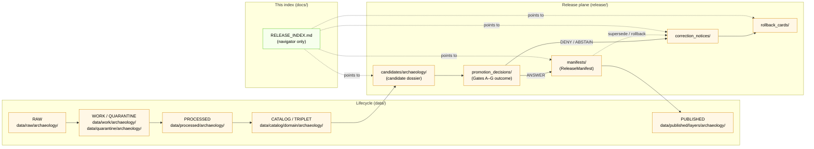

<!-- [KFM_META_BLOCK_V2]
doc_id: kfm://doc/docs-domains-archaeology-release-index
title: Archaeology · Release Index
type: index
version: v1
status: draft
owners: docs steward + archaeology domain owner + release steward
created: 2026-05-15
updated: 2026-05-15
policy_label: public
related: [docs/domains/archaeology/README.md, docs/doctrine/lifecycle-law.md, docs/doctrine/directory-rules.md, docs/adr/ADR-0001-schema-home.md, release/README.md, release/candidates/archaeology/, release/manifests/, release/promotion_decisions/, release/correction_notices/, release/rollback_cards/, data/published/layers/archaeology/, policy/domains/archaeology/, schemas/contracts/v1/release/]
tags: [kfm, archaeology, release, index, governance, sensitivity]
notes: [Repository not mounted; all path-shaped artifact claims are PROPOSED. Sensitive geometry MUST NOT appear in this index.]
[/KFM_META_BLOCK_V2] -->

# Archaeology · Release Index

> Single point of inspection for **released Archaeology artifacts**, **active release candidates**, **correction notices**, and **rollback cards** — without exposing exact sensitive geometry.


| Field        | Value                                                                                          |
| ------------ | ---------------------------------------------------------------------------------------------- |
| **Status**   | `draft` — PROPOSED structure; rows are placeholders until release plane is inspected           |
| **Owners**   | docs steward · archaeology domain owner · release steward *(placeholders — confirm via CODEOWNERS)* |
| **Updated**  | `2026-05-15`                                                                                   |
| **Audience** | Reviewers, stewards, and public clients reading via the governed API                           |

> [!IMPORTANT]
> This index is a **docs-plane navigator**, not a truth store. The authoritative release record for any entry below is the `ReleaseManifest` in `release/manifests/` (governed under [`directory-rules.md` §9.2](../../doctrine/directory-rules.md)). This page **MUST NOT** contain exact site coordinates, burial/human-remains geometry, sacred-site locations, or any T3–T4 payload — those publish through transforms and review, not through the index.

---

## Contents

1. [Scope](#1-scope)
2. [Repo fit](#2-repo-fit)
3. [What this index tracks](#3-what-this-index-tracks)
4. [What this index does **not** contain](#4-what-this-index-does-not-contain)
5. [Directory tree (PROPOSED)](#5-directory-tree-proposed)
6. [Release plane diagram](#6-release-plane-diagram)
7. [Released layers and manifests](#7-released-layers-and-manifests)
8. [Active release candidates](#8-active-release-candidates)
9. [Correction notices](#9-correction-notices)
10. [Rollback cards](#10-rollback-cards)
11. [Sensitivity tier mapping](#11-sensitivity-tier-mapping)
12. [Quickstart — add or update an entry](#12-quickstart--add-or-update-an-entry)
13. [Governance and AI behavior](#13-governance-and-ai-behavior)
14. [FAQ](#14-faq)
15. [Related docs](#15-related-docs)
16. [Appendix — minimum recorded fields](#16-appendix--minimum-recorded-fields)

---

## 1. Scope

**CONFIRMED doctrine / PROPOSED implementation.** This index aggregates **release-plane references** for the Archaeology domain so that reviewers, stewards, and the public-via-governed-API can answer four questions in one place:

- **What is currently released** under Archaeology, at what sensitivity tier, with which `release_id`?
- **What is in candidate review**, and which gates are still open?
- **What corrections** have been issued against previously released claims?
- **What rollback cards** are on file, and which prior release each rolls back to?

The doctrinal source for these objects is the **release plane** (`release/`) and the **published artifact plane** (`data/published/layers/archaeology/`), kept distinct under [`directory-rules.md` §9.2](../../doctrine/directory-rules.md). This page **explains** and **navigates**; it does not **decide**.

[⬆ Back to top](#archaeology--release-index)

---

## 2. Repo fit

**PROPOSED path.** This document lives at `docs/domains/archaeology/RELEASE_INDEX.md`, a docs-plane navigator paired with `docs/domains/archaeology/README.md`. The archaeology domain follows the **Domain Placement Law** ([`directory-rules.md` §12](../../doctrine/directory-rules.md)): a domain is a *segment* inside responsibility roots, never a root.

| Direction      | Repo neighbor (PROPOSED)                              | What flows                                                              |
| -------------- | ----------------------------------------------------- | ----------------------------------------------------------------------- |
| **Upstream**   | `docs/domains/archaeology/README.md`                  | Domain identity, scope, ubiquitous language, source families            |
| **Upstream**   | `docs/doctrine/lifecycle-law.md`                      | RAW → WORK/QUARANTINE → PROCESSED → CATALOG/TRIPLET → PUBLISHED         |
| **Upstream**   | `docs/doctrine/directory-rules.md` §9.2               | Release-plane vs. published-artifact-plane split                        |
| **Sibling**    | `docs/domains/archaeology/SENSITIVITY.md` *(if exists)* | Tier scheme, transforms, gates                                          |
| **Downstream** | `release/manifests/`                                  | `ReleaseManifest` by `release_id` (authoritative)                       |
| **Downstream** | `release/candidates/archaeology/`                     | Release candidate dossiers (per [§12](../../doctrine/directory-rules.md)) |
| **Downstream** | `release/promotion_decisions/`                        | `PromotionDecision` records (Gates A–G)                                 |
| **Downstream** | `release/correction_notices/`                         | `CorrectionNotice` records                                              |
| **Downstream** | `release/rollback_cards/`                             | `RollbackCard` records                                                  |
| **Downstream** | `data/published/layers/archaeology/`                  | Released public-safe artifacts (PMTiles, STAC, etc.)                    |
| **Policy**     | `policy/domains/archaeology/`                         | Sensitivity, rights, review-required gates                              |
| **Schema**     | `schemas/contracts/v1/release/`                       | Machine shape for release-plane objects (ADR-0001)                      |

> [!NOTE]
> **Repository is not mounted** in the drafting session. Every "Downstream" path above is a **PROPOSED** target consistent with `directory-rules.md` §6, §9, and §12; the exact tree shape requires `NEEDS VERIFICATION` against a mounted repo and any superseding ADR.

[⬆ Back to top](#archaeology--release-index)

---

## 3. What this index tracks

Each row in [§7](#7-released-layers-and-manifests)–[§10](#10-rollback-cards) is a **pointer** to a governed artifact, never the artifact itself.

- **Released layers** — public-safe map layers and catalog records currently published, keyed by `release_id` and `spec_hash`.
- **Release candidates** — dossiers under `release/candidates/archaeology/` that have not yet passed all promotion gates.
- **Correction notices** — `CorrectionNotice` records issued against any previously published archaeology release.
- **Rollback cards** — `RollbackCard` records targeting a prior safe release.
- **Sensitivity tier mapping** — the default tier for each archaeology object family and the allowed transforms before public release.

[⬆ Back to top](#archaeology--release-index)

---

## 4. What this index does *not* contain

> [!WARNING]
> The index is a docs-plane surface and is read by public clients. **Sensitive payload never lives here.** Violations of this list are sensitivity-policy violations regardless of intent.

- **No exact site geometry** — including burial sites, human remains, sacred sites, looting-risk locations, or any geometry finer than the H3 resolution permitted by archaeology policy *(see [§11](#11-sensitivity-tier-mapping); current floor: H3 r7 per `[ML-061-159]` — `NEEDS VERIFICATION` against mounted policy)*.
- **No RAW / WORK / QUARANTINE references** — the index points only to `release/` and `data/published/` artifacts. Internal lifecycle stages are not surfaced.
- **No restricted-access archive identifiers** — collection security and private-landowner records remain T3/T4.
- **No AI-generated narrative as truth** — Focus Mode summaries belong in the Evidence Drawer, never in this index. AI outputs are interpretive; `EvidenceBundle` outranks generated language.
- **No release manifests by value** — the index references `release_id` and links to `release/manifests/<release_id>.json`; it does not embed the manifest body.

[⬆ Back to top](#archaeology--release-index)

---

## 5. Directory tree (PROPOSED)

**PROPOSED neighbours of this file**, consistent with `directory-rules.md` §6, §9.2, and §12. Exact shape requires mounted-repo inspection.

```text
docs/
└── domains/
    └── archaeology/
        ├── README.md
        ├── RELEASE_INDEX.md          ← this file
        ├── SENSITIVITY.md            ← PROPOSED (tier scheme detail)
        └── SOURCES.md                ← PROPOSED (source families)

release/
├── README.md
├── candidates/
│   └── archaeology/
│       └── <candidate_id>/           ← release candidate dossiers
├── manifests/
│   └── <release_id>.json             ← ReleaseManifest (authoritative)
├── promotion_decisions/
│   └── <decision_id>.json            ← Gates A–G outcome
├── correction_notices/
│   └── <notice_id>.json
├── rollback_cards/
│   └── <card_id>.json
├── signatures/                       ← DSSE / Sigstore artifacts
└── changelog/

data/
└── published/
    └── layers/
        └── archaeology/
            └── <release_id>/         ← released public-safe artifacts
                ├── *.pmtiles
                ├── *.stac.json
                └── *.geojson         ← only if public-safe and generalized

policy/
└── domains/
    └── archaeology/
        └── *.rego                    ← sensitivity, rights, review gates

schemas/
└── contracts/
    └── v1/
        └── release/
            ├── release_manifest.schema.json
            ├── promotion_decision.schema.json
            ├── correction_notice.schema.json
            └── rollback_card.schema.json
```

> [!NOTE]
> The split between `data/published/` (released **artifacts**) and `release/` (release **decisions**) is one of the four named drift patterns in [`directory-rules.md` §13.2](../../doctrine/directory-rules.md). The index references both, but never inverts them.

[⬆ Back to top](#archaeology--release-index)

---

## 6. Release plane diagram

**PROPOSED implementation; CONFIRMED doctrine.** Promotion is a governed state transition, not a file move.



> [!NOTE]
> Diagram reflects KFM doctrine (lifecycle law + release-plane split). **Implementation maturity is `NEEDS VERIFICATION`** against the mounted repo.

[⬆ Back to top](#archaeology--release-index)

---

## 7. Released layers and manifests

**PROPOSED rows — placeholders until release plane is inspected.** Each row references one `ReleaseManifest` by `release_id`. No exact geometry. No source-secret identifiers.

| `release_id` | Layer (public-safe name) | Sensitivity tier | `spec_hash` | Published at | Manifest | Status |
|---|---|---|---|---|---|---|
| `TBD-rel-arch-survey-coverage-YYYY-NNN` | Survey coverage (generalized) | T1 | `TBD` | `YYYY-MM-DD` | `release/manifests/TBD.json` *(PROPOSED)* | `NEEDS VERIFICATION` |
| `TBD-rel-arch-chronology-YYYY-NNN`      | Chronology / context view     | T1 | `TBD` | `YYYY-MM-DD` | `release/manifests/TBD.json` *(PROPOSED)* | `NEEDS VERIFICATION` |
| `TBD-rel-arch-candidate-anomaly-YYYY-NNN` | Candidate anomaly surface (generalized) | T1 | `TBD` | `YYYY-MM-DD` | `release/manifests/TBD.json` *(PROPOSED)* | `NEEDS VERIFICATION` |

> [!IMPORTANT]
> **No T3/T4 row may carry a public link.** Reviewer-only entries (T2) and restricted entries (T3) appear in the steward console, not in this public index. T4 entries are listed by **count and existence only**, never by identity.

<details>
<summary><strong>Reviewer/restricted summary (counts only)</strong></summary>

| Tier | Count | Notes |
|---|---|---|
| T2 — Reviewer | `TBD` | Stewards/reviewers only. Resolves via governed API with auth context. |
| T3 — Restricted | `TBD` | Named-agreement gating; existence may be summarized, identity withheld. |
| T4 — Denied | `TBD` | Existence may be summarized only with steward approval. |

</details>

[⬆ Back to top](#archaeology--release-index)

---

## 8. Active release candidates

**PROPOSED rows.** Each row references a dossier in `release/candidates/archaeology/<candidate_id>/`. Promotion Gates A–G must all return `ANSWER` before promotion to `release/manifests/`.

| `candidate_id` | Proposed layer | Open gates | Reviewer queue | Dossier |
|---|---|---|---|---|
| `TBD-cand-arch-NNN` | `TBD` | `TBD` | `TBD` | `release/candidates/archaeology/TBD/` *(PROPOSED)* |

> [!TIP]
> A candidate that has been open beyond the verification-backlog SLA *(value `NEEDS VERIFICATION`)* should be flagged in `docs/registers/VERIFICATION_BACKLOG.md` rather than silently aging.

[⬆ Back to top](#archaeology--release-index)

---

## 9. Correction notices

**PROPOSED rows.** Corrections preserve the original release record; the corrected claim publishes through a **superseding release**, not by silent mutation.

| `notice_id` | Affected `release_id` | Defect class | Superseded by | Notice |
|---|---|---|---|---|
| `TBD-corr-arch-NNN` | `TBD` | evidence / source-role / rights / sensitivity / geometry / temporal / policy / validation / rendering / API / AI-output | `TBD-rel-arch-NNN` | `release/correction_notices/TBD.json` *(PROPOSED)* |

> [!NOTE]
> The defect-class taxonomy is doctrine; the row above is a placeholder. See `Correction and rollback model` in the Unified Build Manual for full semantics.

[⬆ Back to top](#archaeology--release-index)

---

## 10. Rollback cards

**PROPOSED rows.** Rollback restores a prior safe release; it is **never a hidden file copy**.

| `card_id` | From `release_id` | Rolled back to | Reason class | Card |
|---|---|---|---|---|
| `TBD-rb-arch-NNN` | `TBD` | `TBD` | `TBD` | `release/rollback_cards/TBD.json` *(PROPOSED)* |

[⬆ Back to top](#archaeology--release-index)

---

## 11. Sensitivity tier mapping

**CONFIRMED doctrine / PROPOSED transform realization.** Default tiers for Archaeology object families. Transforms and gates must produce auditable receipts (`RedactionReceipt`, `AggregationReceipt`, `PublicationTransformReceipt`) and a `ReviewRecord` before the object is eligible for the lower tier.

| Object class                                 | Default tier | Allowed transforms (PROPOSED)                                                                | Required gates                                              |
| -------------------------------------------- | ------------ | -------------------------------------------------------------------------------------------- | ----------------------------------------------------------- |
| Site location                                | **T4**       | Steward review + cultural review + generalized geometry (coarse H3 cell) + `RedactionReceipt` → T2 or T1 | `RedactionReceipt` + `ReviewRecord` + `PolicyDecision`      |
| Human remains / burials / sacred sites       | **T4**       | No transform releases to T0; T3 only under explicit named authorization                      | Sovereignty review + `ReviewRecord` + `PolicyDecision`      |
| Excavation records / provenience packets     | **T3**       | Generalization + redaction → T2 under steward review                                         | `RedactionReceipt` + `ReviewRecord` + `PolicyDecision`      |
| Collection / repository identifiers          | **T3**       | Identifier aliasing under steward agreement → T2                                             | `ReviewRecord` + `PolicyDecision`                           |
| Candidate-feature (remote-sensing anomaly)   | **T1**       | Generalized footprint (H3 r7 or coarser) + candidate-not-site labelling                      | `AggregationReceipt` + `PolicyDecision` + candidate-not-site test |
| Survey coverage summary                      | **T1**       | Aggregate / generalized public-safe layer                                                    | `AggregationReceipt` + `PolicyDecision`                     |
| Chronology / context view                    | **T0–T1**    | Public-safe if no exact geometry leaks                                                       | `PolicyDecision`                                            |
| AI summary (Focus Mode answer)               | **derived**  | Bounded by source tier of the underlying `EvidenceBundle`; AI must `ABSTAIN` if insufficient | `AIReceipt` + `CitationValidationReport`                    |

> [!CAUTION]
> The **H3 r7 floor** for sensitive archaeology products is sourced from the Master MapLibre v1.7 update packet (`[ML-061-159]`, EXTERNAL-INTERNAL reference within the KFM idea index). Treat this floor as **`NEEDS VERIFICATION`** against `policy/domains/archaeology/` until inspected on a mounted repo.

[⬆ Back to top](#archaeology--release-index)

---

## 12. Quickstart — add or update an entry

> [!IMPORTANT]
> This page is a **navigator**. Edits here do not promote, correct, or rollback anything. The release plane decides; this index records the pointer.

### Add a newly released layer (after `ANSWER` from Gates A–G)

1. Confirm a `ReleaseManifest` exists at `release/manifests/<release_id>.json` with `release_state: "PUBLISHED"`, valid `spec_hash`, and `rollback.rollback_supported: true`.
2. Confirm the released artifact is under `data/published/layers/archaeology/<release_id>/` and matches the manifest's `artifacts[].sha256`.
3. Confirm the layer's sensitivity tier and that no T3/T4 payload is referenced from a public row.
4. Append a row to [§7](#7-released-layers-and-manifests). Reference the manifest path; do **not** inline its body.
5. Update the `updated` field in the meta block at the top of this file.

### Open a candidate row

```bash
# PROPOSED command shapes — exact tools depend on mounted repo
# 1) Create the candidate dossier under the canonical release plane
mkdir -p release/candidates/archaeology/<candidate_id>

# 2) Place the dossier (spec, evidence_refs, validation report, policy decision)
#    Do NOT publish to data/published/ at this stage.

# 3) Append a row to §8 of this index pointing to the dossier.
```

### Record a correction or rollback

1. Generate the `CorrectionNotice` *or* `RollbackCard` through the governed release flow — never by editing this file alone.
2. Confirm the artifact validates against `schemas/contracts/v1/release/correction_notice.schema.json` or `schemas/contracts/v1/release/rollback_card.schema.json`.
3. Append the row to [§9](#9-correction-notices) or [§10](#10-rollback-cards).

[⬆ Back to top](#archaeology--release-index)

---

## 13. Governance and AI behavior

**CONFIRMED doctrine.** From the KFM Encyclopedia and Domains Atlas, applied to this index:

- The **trust membrane** governs every public read. Clients use the governed API (`apps/governed-api/`), not direct reads of `data/processed/` or `data/catalog/`. This index links to artifacts inside `data/published/` and `release/`, both of which are post-promotion.
- **AI is interpretive.** Focus Mode may summarize released Archaeology `EvidenceBundle`s with `ANSWER / ABSTAIN / DENY / ERROR` outcomes and `AIReceipt` accountability. AI **must DENY** any request that would expose exact archaeological location, restricted personal data, or any T3/T4 payload.
- **Cite-or-abstain** is the default truth posture for any claim sourced from this index. A row without a reachable `ReleaseManifest` is `UNKNOWN`, not `CONFIRMED`.
- **Promotion is a governed state transition**, not a file move. This index lags the release plane; it does not lead it.

[⬆ Back to top](#archaeology--release-index)

---

## 14. FAQ

> [!NOTE]
> **Why isn't there a direct link to the artifact bytes?**
> The index references `release_id` and the `ReleaseManifest`. The artifact bytes resolve through the governed API and the manifest's `artifacts[].path` + `artifacts[].sha256`. Linking artifact bytes from a docs page would invite consumption without manifest checks.

> [!NOTE]
> **Why is exact site geometry not listed even at coarse resolution?**
> The default tier for archaeological site locations is **T4**. A coarse representation is releasable only after a `RedactionReceipt` + `ReviewRecord` + `PolicyDecision` produce a T1 candidate — and even then the index lists the **layer**, not the geometry.

> [!NOTE]
> **What if the index disagrees with the release plane?**
> The release plane wins. The index is a navigator and is subject to drift. Disagreements should be filed against `docs/registers/DRIFT_REGISTER.md` *(PROPOSED path)*.

> [!NOTE]
> **Is this page generated or hand-edited?**
> CURRENT: hand-edited. PROPOSED: rendered from `control_plane/release_state_register.yaml` filtered to `domain == "archaeology"` by a docs tool in `tools/docs/` *(PROPOSED — `NEEDS VERIFICATION`)*. Until then, append rows by hand using [§12](#12-quickstart--add-or-update-an-entry).

[⬆ Back to top](#archaeology--release-index)

---

## 15. Related docs

- [`docs/domains/archaeology/README.md`](./README.md) — domain identity, ubiquitous language, source families *(PROPOSED — `NEEDS VERIFICATION`)*
- [`docs/doctrine/directory-rules.md`](../../doctrine/directory-rules.md) — §9.2 release plane, §12 domain placement, §13.2 drift patterns
- [`docs/doctrine/lifecycle-law.md`](../../doctrine/lifecycle-law.md) — RAW → … → PUBLISHED invariant *(PROPOSED path)*
- [`docs/adr/ADR-0001-schema-home.md`](../../adr/ADR-0001-schema-home.md) — schema canonicality
- [`release/README.md`](../../../release/README.md) — release plane authority and folder split
- [`policy/domains/archaeology/`](../../../policy/domains/archaeology/) — sensitivity, rights, review-required gates *(PROPOSED)*
- [`schemas/contracts/v1/release/`](../../../schemas/contracts/v1/release/) — `ReleaseManifest`, `PromotionDecision`, `CorrectionNotice`, `RollbackCard` schemas *(PROPOSED)*
- `docs/registers/VERIFICATION_BACKLOG.md` *(PROPOSED — TODO link once landed)*

[⬆ Back to top](#archaeology--release-index)

---

## 16. Appendix — minimum recorded fields

<details>
<summary><strong>A. <code>ReleaseManifest</code> fields required to qualify for a §7 row</strong></summary>

Per the schema in `schemas/contracts/v1/release/release_manifest.schema.json` *(PROPOSED canonical home, ADR-0001)*:

- `object_type: "ReleaseManifest"`
- `schema_version: "v1"`
- `release_id`
- `created` *(date-time)*
- `spec_hash`
- `release_state: "PUBLISHED"` *(for §7)*
- `policy_label`
- `rights_status`
- `sensitivity`
- `artifacts[].{artifact_id, kind, path, sha256, blake3?}`
- `evidence_refs[]`
- `rollback.{rollback_supported, previous_release, rollback_plan_ref?}`

The index row carries only: `release_id`, public-safe layer name, sensitivity tier, `spec_hash`, `created`, and a link to the manifest path. The remaining fields stay inside the manifest where they belong.

</details>

<details>
<summary><strong>B. <code>PromotionDecision</code> outcomes (Gates A–G)</strong></summary>

A candidate enters §7 only when the `PromotionDecision` for its `release_id` records `outcome: "ANSWER"` across the seven gates (Identity & Integrity, License & Provenance, Schema/Policy, Attestation, Steward Approval, Integration Smoke, Publish Ledger). Any other outcome — `ABSTAIN`, `DENY`, `ERROR` — keeps the row in §8 or moves it to §9/§10. *(PROPOSED implementation; CONFIRMED doctrine.)*

</details>

<details>
<summary><strong>C. <code>CorrectionNotice</code> and <code>RollbackCard</code> minimum fields</strong></summary>

- `CorrectionNotice`: `notice_id`, `affected_release_manifest_path`, `defect_class`, `superseded_by`, `created_utc`, `status`, `policy_posture`.
- `RollbackCard`: `card_id`, `release_id` (from), `rollback_to`, `reason`, `invalidates[]`, `review_ref`, `time`.

Field names follow the contract names in the Encyclopedia §App. E and the Unified Build Manual §Correction-and-rollback. **PROPOSED** until schemas at `schemas/contracts/v1/release/` are inspected.

</details>

<details>
<summary><strong>D. Sensitivity tier scheme (T0–T4) — full text</strong></summary>

| Tier | Name        | Definition                                                                                                   | Default audience                                |
| ---- | ----------- | ------------------------------------------------------------------------------------------------------------ | ----------------------------------------------- |
| T0   | Open        | Public-safe with no transformations required.                                                                | Any public client via governed API              |
| T1   | Generalized | Public-safe only after generalization, fuzzing, aggregation, or redaction; transform reviewed and recorded. | Any public client via governed API              |
| T2   | Reviewer    | Released only to authenticated reviewers or domain stewards; policy-bounded; correction path active.         | Stewards, reviewers, named research collaborators |
| T3   | Restricted  | Released only under named agreement (rights, sovereignty, or consent) and recorded.                          | Named authorized parties only                   |
| T4   | Denied      | Not released to any audience; existence of a record may be released only as steward review permits.          | —                                               |

</details>

[⬆ Back to top](#archaeology--release-index)

---

> **Last updated:** `2026-05-15` · **Status:** `draft` · **Repository state:** not mounted in drafting session — all release-plane row values are `PROPOSED` / `NEEDS VERIFICATION`.
>
> Related: [`README.md`](./README.md) · [`directory-rules.md`](../../doctrine/directory-rules.md) · [`release/README.md`](../../../release/README.md) · [`policy/domains/archaeology/`](../../../policy/domains/archaeology/)
>
> [⬆ Back to top](#archaeology--release-index)
