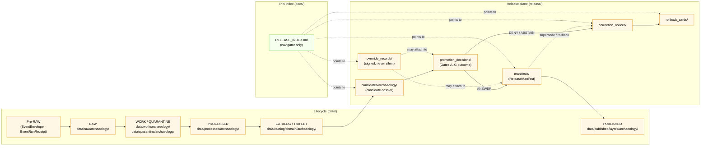

<!-- [KFM_META_BLOCK_V2]
doc_id: kfm://doc/docs-domains-archaeology-release-index
title: Archaeology · Release Index
type: index
version: v2
status: draft
owners: docs steward + archaeology domain steward + sensitivity reviewer + release authority + correction reviewer + AI surface steward
created: 2026-05-15
updated: 2026-05-28
policy_label: public
related:
  - docs/doctrine/ai-build-operating-contract.md
  - docs/doctrine/directory-rules.md
  - docs/doctrine/lifecycle-law.md                     # PROPOSED — link target
  - docs/adr/ADR-0001-schema-home.md
  - docs/domains/archaeology/README.md                 # PROPOSED — link target
  - docs/domains/archaeology/OBJECT_FAMILIES.md
  - docs/domains/archaeology/PIPELINE.md
  - docs/domains/archaeology/PRESERVATION_MATRIX.md
  - docs/domains/archaeology/PUBLICATION_AND_POLICY.md
  - docs/domains/archaeology/SENSITIVITY.md            # PROPOSED — link target
  - docs/runbooks/archaeology/                         # PROPOSED — link target
  - docs/registers/DRIFT_REGISTER.md                   # PROPOSED — link target
  - docs/registers/OVERRIDE_REGISTER.md                # PROPOSED — link target
  - docs/registers/VERIFICATION_BACKLOG.md             # PROPOSED — link target
  - release/README.md
  - release/candidates/archaeology/
  - release/manifests/
  - release/promotion_decisions/
  - release/correction_notices/
  - release/rollback_cards/
  - data/published/layers/archaeology/
  - policy/domains/archaeology/
  - schemas/contracts/v1/release/
tags: [kfm, archaeology, release, index, governance, sensitivity, doctrine]
notes:
  - CONTRACT_VERSION pinned to "3.0.0"
  - Repository not mounted; all path-shaped artifact claims are PROPOSED.
  - Sensitive geometry MUST NOT appear in this index.
  - Sensitive-domain doc; archaeology default tier is T4 (DENY) for exact site location, human remains, sacred sites.
  - Companion to OBJECT_FAMILIES.md, PIPELINE.md, PRESERVATION_MATRIX.md, and PUBLICATION_AND_POLICY.md.
[/KFM_META_BLOCK_V2] -->

# Archaeology · Release Index

> Single point of inspection for **released Archaeology artifacts**, **active release candidates**, **correction notices**, **rollback cards**, **override records**, **stale-state markers**, and **supersession lineage** — without exposing exact sensitive geometry.


| Field        | Value                                                                                          |
| ------------ | ---------------------------------------------------------------------------------------------- |
| **Status**   | `draft` — PROPOSED structure; rows are placeholders until release plane is inspected           |
| **Owners**   | docs steward · archaeology domain steward · sensitivity reviewer · release authority · correction reviewer · AI surface steward *(placeholders — confirm via CODEOWNERS)* |
| **Updated**  | `2026-05-28`                                                                                   |
| **Contract** | `CONTRACT_VERSION = "3.0.0"` (per [`docs/doctrine/ai-build-operating-contract.md`](../../doctrine/ai-build-operating-contract.md)) |
| **Audience** | Reviewers, stewards, and public clients reading via the governed API                           |

> [!IMPORTANT]
> This index is a **docs-plane navigator**, not a truth store. The authoritative release record for any entry below is the `ReleaseManifest` in `release/manifests/` (governed under [`directory-rules.md` §9.2](../../doctrine/directory-rules.md) and the release contract defined in [`PUBLICATION_AND_POLICY.md` §6](./PUBLICATION_AND_POLICY.md#6--release-manifest-contract)). This page **MUST NOT** contain exact site coordinates, burial / human-remains geometry, sacred-site locations, or any T3–T4 payload — those publish through transforms and review, not through the index.

> [!CAUTION]
> **Sensitive-domain lane — deny-by-default.** Archaeology objects default to **Tier T4 (Denied)** for exact site geometry, human remains, sacred sites, collection security, and looting-risk exposure. Adding a row to this index that points to a release violating that posture is itself a publication anti-pattern. The release plane decides; the index only mirrors what already PASSed Gate G.

---

## Contents

1. [Scope](#1-scope)
2. [Repo fit](#2-repo-fit)
3. [What this index tracks](#3-what-this-index-tracks)
4. [What this index does **not** contain](#4-what-this-index-does-not-contain)
5. [Directory tree (PROPOSED)](#5-directory-tree-proposed)
6. [Release plane diagram](#6-release-plane-diagram)
7. [Released layers and manifests](#7-released-layers-and-manifests)
8. [Active release candidates](#8-active-release-candidates)
9. [Correction notices](#9-correction-notices)
10. [Rollback cards](#10-rollback-cards)
11. [Sensitivity tier mapping](#11-sensitivity-tier-mapping)
12. [Quickstart — add or update an entry](#12-quickstart--add-or-update-an-entry)
13. [Governance and AI behavior](#13-governance-and-ai-behavior)
14. [FAQ](#14-faq)
15. [Related docs](#15-related-docs)
16. [Appendix — minimum recorded fields](#16-appendix--minimum-recorded-fields)

[Open questions register](#open-questions-register) · [Open verification backlog](#open-verification-backlog) · [Changelog v1 → v2](#changelog-v1--v2) · [Definition of done](#definition-of-done)

---

## 1. Scope

**CONFIRMED doctrine / PROPOSED implementation.** This index aggregates **release-plane references** for the Archaeology domain so that reviewers, stewards, and the public-via-governed-API can answer four questions in one place:

- **What is currently released** under Archaeology, at what sensitivity tier, with which `release_id`?
- **What is in candidate review**, and which gates are still open?
- **What corrections** have been issued against previously released claims?
- **What rollback cards** are on file, and which prior release each rolls back to?

The doctrinal source for these objects is the **release plane** (`release/`) and the **published artifact plane** (`data/published/layers/archaeology/`), kept distinct under [`directory-rules.md` §9.2](../../doctrine/directory-rules.md). This page **explains** and **navigates**; it does not **decide**.

> [!NOTE]
> **Companion docs in the archaeology lane.** The decision content this index lags is partitioned across four sibling docs:
> - [`OBJECT_FAMILIES.md`](./OBJECT_FAMILIES.md) — identity-bearing archaeology objects.
> - [`PIPELINE.md`](./PIPELINE.md) — Pre-RAW → PUBLISHED lifecycle and Gates A–G.
> - [`PRESERVATION_MATRIX.md`](./PRESERVATION_MATRIX.md) — tier × transform decision matrix.
> - [`PUBLICATION_AND_POLICY.md`](./PUBLICATION_AND_POLICY.md) — governed API surfaces, OPA / Conftest deny rules, `ReleaseManifest` contract, separation-of-duties, correction / rollback / stale-state, audit indicators.
>
> When this index conflicts with any of those, **the sibling doc wins** because it is the doctrine surface; the index is the navigator.

[⬆ Back to top](#archaeology--release-index)

---

## 2. Repo fit

**PROPOSED path.** This document lives at `docs/domains/archaeology/RELEASE_INDEX.md`, a docs-plane navigator paired with `docs/domains/archaeology/README.md`. The archaeology domain follows the **Domain Placement Law** ([`directory-rules.md` §12](../../doctrine/directory-rules.md)): a domain is a *segment* inside responsibility roots, never a root.

| Direction      | Repo neighbor (PROPOSED)                              | What flows                                                              |
| -------------- | ----------------------------------------------------- | ----------------------------------------------------------------------- |
| **Upstream**   | `docs/domains/archaeology/README.md`                  | Domain identity, scope, ubiquitous language, source families. |
| **Upstream**   | [`docs/domains/archaeology/OBJECT_FAMILIES.md`](./OBJECT_FAMILIES.md) | Identity-bearing archaeology objects; source-role anti-collapse register. |
| **Upstream**   | [`docs/domains/archaeology/PIPELINE.md`](./PIPELINE.md) | Pre-RAW → RAW → WORK / QUARANTINE → PROCESSED → CATALOG / TRIPLET → PUBLISHED; Gates A–G. |
| **Upstream**   | [`docs/domains/archaeology/PRESERVATION_MATRIX.md`](./PRESERVATION_MATRIX.md) | Tier × transform decision matrix and worked steward workflow. |
| **Upstream**   | [`docs/domains/archaeology/PUBLICATION_AND_POLICY.md`](./PUBLICATION_AND_POLICY.md) | Governed API surfaces; OPA deny rules; `ReleaseManifest` contract; separation of duties; correction / rollback / stale-state; override discipline; audit indicators. |
| **Upstream**   | `docs/doctrine/lifecycle-law.md`                      | RAW → … → PUBLISHED invariant. |
| **Upstream**   | `docs/doctrine/directory-rules.md` §9.2               | Release-plane vs. published-artifact-plane split. |
| **Sibling**    | `docs/domains/archaeology/SENSITIVITY.md` *(PROPOSED)* | Tier scheme, transforms, gates (detail catalogue). |
| **Downstream** | `release/manifests/`                                  | `ReleaseManifest` by `release_id` (authoritative). |
| **Downstream** | `release/candidates/archaeology/`                     | Release candidate dossiers (per [§12](../../doctrine/directory-rules.md)). |
| **Downstream** | `release/promotion_decisions/`                        | `PromotionDecision` records (Gates A–G). |
| **Downstream** | `release/correction_notices/`                         | `CorrectionNotice` records. |
| **Downstream** | `release/rollback_cards/`                             | `RollbackCard` records. |
| **Downstream** | `data/published/layers/archaeology/`                  | Released public-safe artifacts (PMTiles, STAC, etc.). |
| **Policy**     | `policy/domains/archaeology/`                         | Sensitivity, rights, review-required gates; default-deny OPA bundle. |
| **Register**   | `docs/registers/OVERRIDE_REGISTER.md` *(PROPOSED)*    | Signed override records (KFM-P3-IDEA-0003). |
| **Register**   | `docs/registers/DRIFT_REGISTER.md` *(PROPOSED)*       | Drift between this index and the release plane. |
| **Register**   | `docs/registers/VERIFICATION_BACKLOG.md` *(PROPOSED)* | Aging candidates and open verification items. |
| **Schema**     | `schemas/contracts/v1/release/`                       | Machine shape for release-plane objects (ADR-0001). |

> [!NOTE]
> **Repository is not mounted** in the drafting session. Every "Downstream" / "Register" path above is a **PROPOSED** target consistent with `directory-rules.md` §6, §9, and §12; the exact tree shape requires `NEEDS VERIFICATION` against a mounted repo and any superseding ADR.

[⬆ Back to top](#archaeology--release-index)

---

## 3. What this index tracks

Each row in [§7](#7-released-layers-and-manifests)–[§10](#10-rollback-cards) is a **pointer** to a governed artifact, never the artifact itself.

- **Released layers** — public-safe map layers and catalog records currently published, keyed by `release_id`, `spec_hash`, and source role.
- **Release candidates** — dossiers under `release/candidates/archaeology/` that have not yet passed all promotion gates A–G ([`PIPELINE.md` §3](./PIPELINE.md#3--lifecycle-backbone)).
- **Correction notices** — `CorrectionNotice` records issued against any previously published archaeology release.
- **Rollback cards** — `RollbackCard` records targeting a prior safe release.
- **Sensitivity tier mapping** — the default tier for each archaeology object family and the allowed transforms before public release (canonical matrix in [`PRESERVATION_MATRIX.md` §4.2](./PRESERVATION_MATRIX.md#42-archaeology-object-class-tier-matrix-proposed)).
- **Override records** *(via* [`OVERRIDE_REGISTER.md`](#15-related-docs)*)* — signed override records that bypassed a non-blocking gate; never silent. _Source: KFM-P3-IDEA-0003; see [§16.G](#16--appendix--minimum-recorded-fields)._
- **Stale-state markers and supersession lineage** — surfaced where applicable; see [§16.E–F](#16--appendix--minimum-recorded-fields).

[⬆ Back to top](#archaeology--release-index)

---

## 4. What this index does *not* contain

> [!WARNING]
> The index is a docs-plane surface and is read by public clients. **Sensitive payload never lives here.** Violations of this list are sensitivity-policy violations regardless of intent.

- **No exact site geometry** — including burial sites, human remains, sacred sites, looting-risk locations, or any geometry finer than the public-safe generalization threshold permitted by archaeology policy *(see [§11](#11-sensitivity-tier-mapping); current PROPOSED reference: H3 r7 per `[ML-061-159]` — `NEEDS VERIFICATION` against mounted policy; canonical threshold ADR is `OQ-ARCH-PIPE-03` / `OQ-ARCH-PM-03`)*.
- **No RAW / WORK / QUARANTINE references** — the index points only to `release/` and `data/published/` artifacts. Internal lifecycle stages are not surfaced.
- **No restricted-access archive identifiers** — collection security and private-landowner records remain T3 / T4.
- **No AI-generated narrative as truth** — Focus Mode summaries belong in the Evidence Drawer, never in this index. AI outputs are interpretive; `EvidenceBundle` outranks generated language.
- **No release manifests by value** — the index references `release_id` and links to `release/manifests/<release_id>.json`; it does not embed the manifest body.
- **No candidate framed as a confirmed site** — a `CandidateFeature`, `RemoteSensingAnomaly`, or `LiDARCandidate` listed in this index MUST carry its candidate role explicitly. Promotion is a **tier** transition, not a **source-role** upgrade ([`PRESERVATION_MATRIX.md` §11](./PRESERVATION_MATRIX.md#11--anti-collapse-and-source-role-preservation)).
- **No synthetic content framed as observation** — 3D scenes, reconstructions, and AI-drafted carriers MUST be labeled with `RealityBoundaryNote` and `RepresentationReceipt` references at the manifest layer; the index inherits those flags.

[⬆ Back to top](#archaeology--release-index)

---

## 5. Directory tree (PROPOSED)

**PROPOSED neighbours of this file**, consistent with `directory-rules.md` §6, §9.2, and §12. Exact shape requires mounted-repo inspection.

```text
docs/
└── domains/
    └── archaeology/
        ├── README.md                       ← PROPOSED (domain landing)
        ├── OBJECT_FAMILIES.md              ← CONFIRMED draft sibling
        ├── PIPELINE.md                     ← CONFIRMED draft sibling
        ├── PRESERVATION_MATRIX.md          ← CONFIRMED draft sibling (v0.2)
        ├── PUBLICATION_AND_POLICY.md       ← CONFIRMED draft sibling
        ├── RELEASE_INDEX.md                ← this file
        ├── SENSITIVITY.md                  ← PROPOSED (tier scheme detail)
        └── SOURCES.md                      ← PROPOSED (source families)

docs/registers/
├── DRIFT_REGISTER.md                       ← PROPOSED (cross-cutting drift register)
├── OVERRIDE_REGISTER.md                    ← PROPOSED (KFM-P3-IDEA-0003)
└── VERIFICATION_BACKLOG.md                 ← PROPOSED (aging candidates / open items)

release/
├── README.md
├── candidates/
│   └── archaeology/
│       └── <candidate_id>/                 ← release candidate dossiers
├── manifests/
│   └── <release_id>.json                   ← ReleaseManifest (authoritative)
├── promotion_decisions/
│   └── <decision_id>.json                  ← Gates A–G outcome
├── correction_notices/
│   └── <notice_id>.json
├── rollback_cards/
│   └── <card_id>.json
├── override_records/                       ← PROPOSED (signed overrides; KFM-P3-IDEA-0003)
│   └── <override_id>.json
├── signatures/                             ← DSSE / Sigstore / cosign artifacts
└── changelog/

data/
└── published/
    └── layers/
        └── archaeology/
            └── <release_id>/               ← released public-safe artifacts
                ├── *.pmtiles
                ├── *.stac.json
                └── *.geojson               ← only if public-safe and generalized

policy/
└── domains/
    └── archaeology/
        ├── allow.rego                      ← affirmative allow (default-deny)
        ├── deny/                           ← per-rule Rego files
        ├── input.schema.json
        ├── thresholds.json
        ├── reasons.json                    ← canonical reason-code catalog
        ├── bundle.tar.gz                   ← signed bundle (cosign)
        └── README.md

schemas/
└── contracts/
    └── v1/
        └── release/
            ├── release_manifest.schema.json
            ├── promotion_decision.schema.json
            ├── correction_notice.schema.json
            ├── rollback_card.schema.json
            └── override_record.schema.json ← PROPOSED
```

> [!NOTE]
> The split between `data/published/` (released **artifacts**) and `release/` (release **decisions**) is one of the four named drift patterns in [`directory-rules.md` §13.2](../../doctrine/directory-rules.md). The index references both, but never inverts them.

> [!NOTE]
> Atlas v1.1 §2.1 row 15 names `policy/sensitivity/archaeology/`, `contracts/archaeology/`, and `schemas/contracts/v1/archaeology/` in flat form; Directory Rules §4 Step 3 illustrates `policy/domains/<domain>/` segmentation. This index follows the segmented form, consistent with the four sibling docs; the reconciliation is tracked as `OQ-ARCH-RI-01` (same question raised in sibling docs).

[⬆ Back to top](#archaeology--release-index)

---

## 6. Release plane diagram

**PROPOSED implementation; CONFIRMED doctrine.** Promotion is a governed state transition, not a file move.



> [!NOTE]
> Diagram reflects KFM doctrine (lifecycle law + release-plane split + Pre-RAW recognition + override-as-first-class-event). **Implementation maturity is `NEEDS VERIFICATION`** against the mounted repo. The Pre-RAW phase, the override-record link, and the watcher-as-non-publisher rule are aligned with [`PIPELINE.md` §5](./PIPELINE.md#5--pre-raw--watcher-signal-stage) and [`PUBLICATION_AND_POLICY.md` §13](./PUBLICATION_AND_POLICY.md#13--override-and-emergency-bypass-discipline).

[⬆ Back to top](#archaeology--release-index)

---

## 7. Released layers and manifests

**PROPOSED rows — placeholders until release plane is inspected.** Each row references one `ReleaseManifest` by `release_id`. No exact geometry. No source-secret identifiers. **Source role is shown so candidate / observed / aggregate are never silently conflated** (anti-collapse rule, [`PRESERVATION_MATRIX.md` §11](./PRESERVATION_MATRIX.md#11--anti-collapse-and-source-role-preservation)).

| `release_id` | Layer (public-safe name) | Source role | Sensitivity tier | `spec_hash` | Published at | Manifest | Status |
|---|---|---|---|---|---|---|---|
| `TBD-rel-arch-survey-coverage-YYYY-NNN`   | Survey coverage (generalized)             | aggregate  | T1 | `TBD` | `YYYY-MM-DD` | `release/manifests/TBD.json` *(PROPOSED)* | `NEEDS VERIFICATION` |
| `TBD-rel-arch-chronology-YYYY-NNN`        | Chronology / context view                 | context    | T1 | `TBD` | `YYYY-MM-DD` | `release/manifests/TBD.json` *(PROPOSED)* | `NEEDS VERIFICATION` |
| `TBD-rel-arch-candidate-anomaly-YYYY-NNN` | Candidate anomaly surface (generalized)   | **candidate** | T1 | `TBD` | `YYYY-MM-DD` | `release/manifests/TBD.json` *(PROPOSED)* | `NEEDS VERIFICATION` |

> [!IMPORTANT]
> **No T3 / T4 row may carry a public link.** Reviewer-only entries (T2) and restricted entries (T3) appear in the steward console, not in this public index. T4 entries are listed by **count and existence only**, never by identity.

> [!WARNING]
> **A `candidate` row stays a candidate.** Releasing a `RemoteSensingAnomaly` / `LiDARCandidate` at T1 does not convert it to an `ArchaeologicalSite`. The Source role column above MUST be preserved across the row's lifetime and across any tier transition. _Source: Atlas v1.1 §24.1.1; [`PUBLICATION_AND_POLICY.md` §5.1 `deny.candidate_as_site`](./PUBLICATION_AND_POLICY.md#5--policy-as-code--deny--abstain--allow)._

<details>
<summary><strong>Reviewer / restricted summary (counts only)</strong></summary>

| Tier | Count | Notes |
|---|---|---|
| T2 — Reviewer   | `TBD` | Stewards / reviewers only. Resolves via governed API with auth context. |
| T3 — Restricted | `TBD` | Named-agreement gating; existence may be summarized, identity withheld. |
| T4 — Denied     | `TBD` | Existence may be summarized only with steward approval. |

</details>

[⬆ Back to top](#archaeology--release-index)

---

## 8. Active release candidates

**PROPOSED rows.** Each row references a dossier in `release/candidates/archaeology/<candidate_id>/`. Promotion Gates A–G must all return `ANSWER` before promotion to `release/manifests/` ([`PIPELINE.md` §3](./PIPELINE.md#3--lifecycle-backbone); [`PUBLICATION_AND_POLICY.md` §7](./PUBLICATION_AND_POLICY.md#7--gate-g--release--review--rollback)).

| `candidate_id` | Proposed layer | Source role | Default tier | Open gates | Reviewer queue | Dossier |
|---|---|---|---|---|---|---|
| `TBD-cand-arch-NNN` | `TBD` | `TBD` | `TBD` | `TBD` | `TBD` | `release/candidates/archaeology/TBD/` *(PROPOSED)* |

> [!TIP]
> A candidate that has been open beyond the verification-backlog SLA *(value `NEEDS VERIFICATION`)* should be flagged in `docs/registers/VERIFICATION_BACKLOG.md` rather than silently aging.

> [!NOTE]
> For the canonical Gate G closure conditions and the failure-mode reason codes (`MISSING_RECEIPT`, `RIGHTS_UNKNOWN`, `SENSITIVITY_UNRESOLVED`, `ROLE_COLLAPSE`, `REVIEW_INSUFFICIENT`, `ROLLBACK_TARGET_MISSING`, etc.), see [`PUBLICATION_AND_POLICY.md` §7](./PUBLICATION_AND_POLICY.md#7--gate-g--release--review--rollback).

[⬆ Back to top](#archaeology--release-index)

---

## 9. Correction notices

**PROPOSED rows.** Corrections preserve the original release record; the corrected claim publishes through a **superseding release**, not by silent mutation. _Source: [`PUBLICATION_AND_POLICY.md` §9.1](./PUBLICATION_AND_POLICY.md#9--correction-and-rollback-discipline)._

| `notice_id` | Affected `release_id` | Defect class | Superseded by | Notice |
|---|---|---|---|---|
| `TBD-corr-arch-NNN` | `TBD` | evidence · source-role · rights · sensitivity · geometry · temporal · policy · validation · rendering · API · AI-output | `TBD-rel-arch-NNN` | `release/correction_notices/TBD.json` *(PROPOSED)* |

> [!NOTE]
> The defect-class taxonomy is doctrine; the row above is a placeholder. See `Correction and rollback model` in the Unified Build Manual for full semantics, and [`PUBLICATION_AND_POLICY.md` §9](./PUBLICATION_AND_POLICY.md#9--correction-and-rollback-discipline) for the four-role separation-of-duties requirement (author / detector + correction reviewer + release authority; rights-holder representative when sensitivity-relevant).

[⬆ Back to top](#archaeology--release-index)

---

## 10. Rollback cards

**PROPOSED rows.** Rollback restores a prior safe release; it is **never a hidden file copy**. _Source: [`PUBLICATION_AND_POLICY.md` §9.2](./PUBLICATION_AND_POLICY.md#9--correction-and-rollback-discipline)._

| `card_id` | From `release_id` | Rolled back to | Reason class | Card |
|---|---|---|---|---|
| `TBD-rb-arch-NNN` | `TBD` | `TBD` | `TBD` | `release/rollback_cards/TBD.json` *(PROPOSED)* |

> [!CAUTION]
> **Rollback target is named in advance.** Every archaeology `ReleaseManifest` MUST name a reachable `rollback_target` at Gate G; an emergency-disablement runbook MUST exist and SHOULD be drilled periodically. _Source: Atlas v1.1 §15.N item 4; OQ-ARCH-PP-07._

[⬆ Back to top](#archaeology--release-index)

---

## 11. Sensitivity tier mapping

**CONFIRMED doctrine / PROPOSED transform realization.** Default tiers for Archaeology object families. Transforms and gates must produce auditable receipts (`RedactionReceipt`, `AggregationReceipt`, `PublicationTransformReceipt` / `RepresentationReceipt`) and a `ReviewRecord` before the object is eligible for the lower tier.

> [!IMPORTANT]
> **This section is a navigator-level summary.** The canonical tier × transform decision matrix for archaeology — with every owning object family, all required receipts, the worked steward workflow, and the source-role anti-collapse rules — is in [`PRESERVATION_MATRIX.md` §4.2](./PRESERVATION_MATRIX.md#42-archaeology-object-class-tier-matrix-proposed) and [`PRESERVATION_MATRIX.md` §11](./PRESERVATION_MATRIX.md#11--anti-collapse-and-source-role-preservation). The table below MUST agree with that matrix; conflicts are logged in `docs/registers/DRIFT_REGISTER.md`.

| Object class                                 | Default tier | Allowed transforms (PROPOSED)                                                                | Required gates                                              |
| -------------------------------------------- | ------------ | -------------------------------------------------------------------------------------------- | ----------------------------------------------------------- |
| Site location                                | **T4**       | Steward review + cultural review + generalized geometry (coarse H3 cell) + `RedactionReceipt` → T2 or T1. | `RedactionReceipt` + `ReviewRecord` + `PolicyDecision`. |
| Human remains / burials / sacred sites       | **T4**       | No transform releases to T0; T3 only under explicit named authorization.                     | Sovereignty review + `ReviewRecord` + `PolicyDecision`. |
| Excavation records / provenience packets     | **T3**       | Generalization + redaction → T2 under steward review.                                        | `RedactionReceipt` + `ReviewRecord` + `PolicyDecision`. |
| Collection / repository identifiers          | **T3**       | Identifier aliasing under steward agreement → T2; aggregate counts → T1.                     | `ReviewRecord` + `PolicyDecision`; collection-security review. |
| Candidate-feature (remote-sensing anomaly, LiDAR candidate, geophysics observation) | **T1** *(public-safe carrier only; role stays `candidate`)* | Generalized footprint (H3 r7 or coarser) + candidate-not-site labelling. | `AggregationReceipt` + `PolicyDecision` + candidate-not-site test. |
| Survey coverage summary                      | **T1**       | Aggregate / generalized public-safe layer.                                                   | `AggregationReceipt` + `PolicyDecision`. |
| Chronology / context view                    | **T0 – T1**  | Public-safe if no exact geometry leaks.                                                      | `PolicyDecision`. |
| `ThreeDDocumentation` (sensitive 3D scene)   | **T4**       | Generalization / clipping / `RepresentationReceipt` + `RealityBoundaryNote` → T2 / T1 with review. | Steward review + `RedactionReceipt` + `RepresentationReceipt`. |
| Oral history / cultural-knowledge records    | **T4**       | Steward + rights-holder consent → T3 named-party; public derivative only when consent is explicit. | Rights-holder representative + `ReviewRecord` + `PolicyDecision`. |
| Synthetic / reconstructed scene content      | **T4** until reviewed | Generalization + `RealityBoundaryNote` + `RepresentationReceipt` → T2 review-only; public surface only as labeled reconstruction. | `RealityBoundaryNote` + `RepresentationReceipt` + `ReviewRecord`. |
| AI summary (Focus Mode answer)               | **derived**  | Bounded by source tier of the underlying `EvidenceBundle`; AI must `ABSTAIN` if insufficient. | `AIReceipt` + `CitationValidationReport`. |

> [!CAUTION]
> The **H3 r7 floor** for sensitive archaeology products is sourced from the Master MapLibre v1.7 update packet (`[ML-061-159]`, EXTERNAL-INTERNAL reference within the KFM idea index). Treat this floor as **`NEEDS VERIFICATION`** against `policy/domains/archaeology/` until inspected on a mounted repo. The canonical archaeology generalization threshold is an open ADR item (`OQ-ARCH-RI-02`; mirrored in `OQ-ARCH-PIPE-03` / `OQ-ARCH-PM-03`).

> [!WARNING]
> **Tier transitions do not perform source-role upgrades.** Moving a `CandidateFeature` from T4 to T2 makes it visible to reviewers; it does not make it a confirmed `ArchaeologicalSite`. Role transitions are separate governed events with their own evidence and review. _Source: Atlas v1.1 §24.1; [`PRESERVATION_MATRIX.md` §11.1](./PRESERVATION_MATRIX.md#11--anti-collapse-and-source-role-preservation)._

[⬆ Back to top](#archaeology--release-index)

---

## 12. Quickstart — add or update an entry

> [!IMPORTANT]
> This page is a **navigator**. Edits here do not promote, correct, or rollback anything. The release plane decides; this index records the pointer.

### Add a newly released layer (after `ANSWER` from Gates A–G)

1. Confirm a `ReleaseManifest` exists at `release/manifests/<release_id>.json` with `release_state: "PUBLISHED"`, valid `spec_hash`, `rollback.rollback_supported: true`, and a `contract_version` matching the current KFM `CONTRACT_VERSION`.
2. Confirm the released artifact is under `data/published/layers/archaeology/<release_id>/` and matches the manifest's `artifacts[].sha256`.
3. Confirm the layer's sensitivity tier and that no T3 / T4 payload is referenced from a public row.
4. Confirm separation of duties for the release was satisfied per [`PUBLICATION_AND_POLICY.md` §8](./PUBLICATION_AND_POLICY.md#8--separation-of-duties) — for any sensitive-lane archaeology release, author + sensitivity reviewer + release authority + rights-holder representative are all required.
5. Confirm `source_role` is set per record and is preserved from admission (no candidate → site silent upgrade).
6. Append a row to [§7](#7-released-layers-and-manifests). Reference the manifest path; do **not** inline its body.
7. Update the `updated` field in the meta block at the top of this file.

### Open a candidate row

```bash
# PROPOSED command shapes — exact tools depend on mounted repo
# 1) Create the candidate dossier under the canonical release plane
mkdir -p release/candidates/archaeology/<candidate_id>

# 2) Place the dossier (spec, evidence_refs, validation report, policy decision)
#    Do NOT publish to data/published/ at this stage.

# 3) Append a row to §8 of this index pointing to the dossier.
```

### Record a correction or rollback

1. Generate the `CorrectionNotice` *or* `RollbackCard` through the governed release flow — never by editing this file alone.
2. Confirm the artifact validates against `schemas/contracts/v1/release/correction_notice.schema.json` or `schemas/contracts/v1/release/rollback_card.schema.json`.
3. Confirm the four-role separation of duties for sensitive-lane corrections (see [`PUBLICATION_AND_POLICY.md` §8.2](./PUBLICATION_AND_POLICY.md#8--separation-of-duties)).
4. Append the row to [§9](#9-correction-notices) or [§10](#10-rollback-cards).

### Record an override (rare)

1. Generate the override record per [`PUBLICATION_AND_POLICY.md` §13](./PUBLICATION_AND_POLICY.md#13--override-and-emergency-bypass-discipline) — overrides are never silent.
2. The override MUST name the override actor, the gate bypassed, the rationale, the expected remediation, and the new release authority for the override-free re-release.
3. **Sensitivity / rights / sovereignty gates MUST NOT be overridden**, regardless of urgency.
4. Add a row to `docs/registers/OVERRIDE_REGISTER.md` and reference the override from the affected `ReleaseManifest`.

[⬆ Back to top](#archaeology--release-index)

---

## 13. Governance and AI behavior

**CONFIRMED doctrine.** From the KFM Encyclopedia, Domains Atlas, and the sibling archaeology docs, applied to this index:

- The **trust membrane** governs every public read. Clients use the governed API (`apps/governed-api/`), not direct reads of `data/processed/` or `data/catalog/`. This index links to artifacts inside `data/published/` and `release/`, both of which are post-promotion. _See [`PUBLICATION_AND_POLICY.md` §3](./PUBLICATION_AND_POLICY.md#3--the-trust-membrane-for-archaeology)._
- **AI is interpretive.** Focus Mode may summarize released Archaeology `EvidenceBundle`s with `ANSWER / ABSTAIN / DENY / ERROR` outcomes and `AIReceipt` accountability. AI **must DENY** any request that would expose exact archaeological location, restricted personal data, or any T3 / T4 payload. Cluster surfaces are framed as **generalized cultural activity zones, not exact archaeological locations** (ML-061-163).
- **Cite-or-abstain** is the default truth posture for any claim sourced from this index. A row without a reachable `ReleaseManifest` is `UNKNOWN`, not `CONFIRMED`.
- **Promotion is a governed state transition**, not a file move. This index lags the release plane; it does not lead it.
- **Separation of duties** is non-optional for sensitive-lane archaeology release: author + sensitivity reviewer + release authority + rights-holder representative. _Source: Atlas v1.1 §24.7.2._
- **Overrides are first-class events.** Any release referenced in this index whose `ReleaseManifest` carries an `override_record_ref` MUST display an "override active" badge in any UI that resolves from this index, until remediation is recorded. _Source: KFM-P3-IDEA-0003._
- **Watcher is not publisher.** Watchers emit `EventEnvelope` + `EventRunReceipt` at Pre-RAW; they MAY NOT write to any other phase and MAY NOT cause an index row to appear directly.

[⬆ Back to top](#archaeology--release-index)

---

## 14. FAQ

> [!NOTE]
> **Why isn't there a direct link to the artifact bytes?**
> The index references `release_id` and the `ReleaseManifest`. The artifact bytes resolve through the governed API and the manifest's `artifacts[].path` + `artifacts[].sha256`. Linking artifact bytes from a docs page would invite consumption without manifest checks.

> [!NOTE]
> **Why is exact site geometry not listed even at coarse resolution?**
> The default tier for archaeological site locations is **T4**. A coarse representation is releasable only after a `RedactionReceipt` + `ReviewRecord` + `PolicyDecision` produce a T1 candidate — and even then the index lists the **layer**, not the geometry.

> [!NOTE]
> **What if the index disagrees with the release plane?**
> The release plane wins. The index is a navigator and is subject to drift. Disagreements should be filed against `docs/registers/DRIFT_REGISTER.md` *(PROPOSED path)*.

> [!NOTE]
> **What if the index disagrees with a sibling archaeology doc?**
> The sibling doc wins. `OBJECT_FAMILIES.md`, `PIPELINE.md`, `PRESERVATION_MATRIX.md`, and `PUBLICATION_AND_POLICY.md` are the doctrine surface; the index is the navigator. Disagreements file against `docs/registers/DRIFT_REGISTER.md`.

> [!NOTE]
> **Why does a `candidate` row stay a candidate after release?**
> Releasing a generalized candidate surface at T1 changes the tier; it does NOT change the source role. A `RemoteSensingAnomaly` or `LiDARCandidate` remains a candidate until a separate, governed confirmation event (with its own evidence and review) reclassifies it. _Source: Atlas v1.1 §24.1; [`PRESERVATION_MATRIX.md` §11](./PRESERVATION_MATRIX.md#11--anti-collapse-and-source-role-preservation)._

> [!NOTE]
> **Is this page generated or hand-edited?**
> CURRENT: hand-edited. PROPOSED: rendered from `control_plane/release_state_register.yaml` filtered to `domain == "archaeology"` by a docs tool in `tools/docs/` *(PROPOSED — `NEEDS VERIFICATION`)*. Until then, append rows by hand using [§12](#12-quickstart--add-or-update-an-entry).

> [!NOTE]
> **Where do override records show up?**
> Overrides are recorded in `docs/registers/OVERRIDE_REGISTER.md` *(PROPOSED)* and referenced from the affected `ReleaseManifest` via `override_record_ref`. Any row in §7 whose underlying release is currently under an active override should be flagged with an "override active" badge.

[⬆ Back to top](#archaeology--release-index)

---

## 15. Related docs

- [`docs/doctrine/ai-build-operating-contract.md`](../../doctrine/ai-build-operating-contract.md) — v3.0 operating law (`CONTRACT_VERSION = "3.0.0"`).
- [`docs/doctrine/directory-rules.md`](../../doctrine/directory-rules.md) — §4 placement protocol, §9.2 release plane, §12 domain placement, §13.2 drift patterns, §15 README contract.
- [`docs/doctrine/lifecycle-law.md`](../../doctrine/lifecycle-law.md) — *(PROPOSED — link target)* RAW → … → PUBLISHED invariant.
- [`docs/adr/ADR-0001-schema-home.md`](../../adr/ADR-0001-schema-home.md) — schema canonicality.
- [`docs/domains/archaeology/README.md`](./README.md) — *(PROPOSED — link target)* domain identity, ubiquitous language, source families.
- [`docs/domains/archaeology/OBJECT_FAMILIES.md`](./OBJECT_FAMILIES.md) — Companion register of identity-bearing archaeology objects and source-role anti-collapse posture.
- [`docs/domains/archaeology/PIPELINE.md`](./PIPELINE.md) — Companion lifecycle / gate reference for the archaeology lane.
- [`docs/domains/archaeology/PRESERVATION_MATRIX.md`](./PRESERVATION_MATRIX.md) — Companion tier × transform decision matrix with worked steward workflow.
- [`docs/domains/archaeology/PUBLICATION_AND_POLICY.md`](./PUBLICATION_AND_POLICY.md) — Companion governed-API / OPA-deny / `ReleaseManifest` contract / SoD / correction / rollback / stale-state / audit doc.
- [`docs/domains/archaeology/SENSITIVITY.md`](./SENSITIVITY.md) — *(PROPOSED — link target)* tier matrix + transform catalogue detail.
- [`docs/runbooks/archaeology/`](../../runbooks/archaeology/) — *(PROPOSED — link target)* runbooks (admission, rollback drill, sovereignty review, parity tests).
- [`docs/registers/DRIFT_REGISTER.md`](../../registers/DRIFT_REGISTER.md) — *(PROPOSED — link target)* drift register.
- [`docs/registers/OVERRIDE_REGISTER.md`](../../registers/OVERRIDE_REGISTER.md) — *(PROPOSED — link target)* override register (KFM-P3-IDEA-0003).
- [`docs/registers/VERIFICATION_BACKLOG.md`](../../registers/VERIFICATION_BACKLOG.md) — *(PROPOSED — link target)* aging candidates and open verification items.
- [`release/README.md`](../../../release/README.md) — release plane authority and folder split.
- [`policy/domains/archaeology/`](../../../policy/domains/archaeology/) — *(PROPOSED)* sensitivity, rights, review-required gates; default-deny OPA bundle.
- [`schemas/contracts/v1/release/`](../../../schemas/contracts/v1/release/) — *(PROPOSED)* `ReleaseManifest`, `PromotionDecision`, `CorrectionNotice`, `RollbackCard`, `OverrideRecord` schemas.

[⬆ Back to top](#archaeology--release-index)

---

## 16. Appendix — minimum recorded fields

<details>
<summary><strong>A. <code>ReleaseManifest</code> fields required to qualify for a §7 row</strong></summary>

Per the schema in `schemas/contracts/v1/release/release_manifest.schema.json` *(PROPOSED canonical home, ADR-0001)*. The full 20-field `ReleaseManifest` contract for archaeology is defined in [`PUBLICATION_AND_POLICY.md` §6](./PUBLICATION_AND_POLICY.md#6--release-manifest-contract); the minimum fields required for a §7 index row are:

- `object_type: "ReleaseManifest"`
- `schema_version: "v1"`
- `release_id`
- `created` *(date-time)*
- `spec_hash`
- `release_state: "PUBLISHED"` *(for §7)*
- `contract_version` — KFM `CONTRACT_VERSION` under which the release was produced.
- `policy_label`
- `rights_status`
- `sensitivity`
- `source_role_summary` — per-record source-role distribution; preserves anti-collapse posture.
- `artifacts[].{artifact_id, kind, path, sha256, blake3?}`
- `evidence_refs[]`
- `rollback.{rollback_supported, previous_release, rollback_plan_ref?}`
- `override_record_ref` — present only when an override is active (rare).

The index row carries only: `release_id`, public-safe layer name, **source role**, sensitivity tier, `spec_hash`, `created`, and a link to the manifest path. The remaining fields stay inside the manifest where they belong.

</details>

<details>
<summary><strong>B. <code>PromotionDecision</code> outcomes (Gates A–G)</strong></summary>

A candidate enters §7 only when the `PromotionDecision` for its `release_id` records `outcome: "ANSWER"` across all required gates. There are **two compatible gate framings** in the KFM corpus:

| Framing | Source | Gate set |
|---|---|---|
| **Atlas v1.1 §24.6 — Gates A–G (canonical doctrine).** | Atlas v1.1 §24.6.1; [`PIPELINE.md` §3](./PIPELINE.md#3--lifecycle-backbone). | **A.** Admission (Source identity) · **B.** Rights and terms · **C.** Sensitivity · **D.** Schema / contract · **E.** Evidence closure · **F.** Catalog / provenance · **G.** Review / release / rollback. |
| **Components Pass 10 C5-01 seven-gate matrix.** | KFM Components Pass 10 §C5-01. | Identity & Integrity · License & Provenance · Schema / Policy · Attestation · Steward Approval · Integration Smoke · Publish Ledger. |

> [!NOTE]
> The two framings are similar but not identical: the Atlas framing covers Admission → Release as a strictly governed sequence; the Pass 10 framing is the merge-readiness matrix used by CI required-checks branch protection. Reconciliation is an open ADR (`OQ-ARCH-RI-03`).

Any outcome other than `ANSWER` — `ABSTAIN`, `DENY`, `ERROR` — keeps the row in §8 or moves it to §9 / §10. *(PROPOSED implementation; CONFIRMED doctrine.)*

</details>

<details>
<summary><strong>C. <code>CorrectionNotice</code> and <code>RollbackCard</code> minimum fields</strong></summary>

- `CorrectionNotice`: `notice_id`, `affected_release_manifest_path`, `defect_class`, `superseded_by`, `created_utc`, `status`, `policy_posture`, `review_records[]`, `derivative_invalidation_list[]`.
- `RollbackCard`: `card_id`, `release_id` (from), `rollback_to`, `reason`, `invalidates[]`, `review_ref`, `time`, `cache_keys[]`.

Field names follow the contract names in the Encyclopedia §App. E and the Unified Build Manual §Correction-and-rollback, refined in [`PUBLICATION_AND_POLICY.md` §9](./PUBLICATION_AND_POLICY.md#9--correction-and-rollback-discipline). **PROPOSED** until schemas at `schemas/contracts/v1/release/` are inspected.

</details>

<details>
<summary><strong>D. Sensitivity tier scheme (T0–T4) — full text</strong></summary>

| Tier | Name        | Definition                                                                                                   | Default audience                                |
| ---- | ----------- | ------------------------------------------------------------------------------------------------------------ | ----------------------------------------------- |
| T0   | Open        | Public-safe with no transformations required.                                                                | Any public client via governed API              |
| T1   | Generalized | Public-safe only after generalization, fuzzing, aggregation, or redaction; transform reviewed and recorded. | Any public client via governed API              |
| T2   | Reviewer    | Released only to authenticated reviewers or domain stewards; policy-bounded; correction path active.         | Stewards, reviewers, named research collaborators |
| T3   | Restricted  | Released only under named agreement (rights, sovereignty, or consent) and recorded.                          | Named authorized parties only                   |
| T4   | Denied      | Not released to any audience; existence of a record may be released only as steward review permits.          | —                                               |

_Source: Atlas v1.1 §24.5.1; [`PRESERVATION_MATRIX.md` §4.1](./PRESERVATION_MATRIX.md#41-tier-scheme-reference)._

</details>

<details>
<summary><strong>E. Stale-state markers (when a published row goes stale, not wrong)</strong></summary>

A PUBLISHED archaeology row in §7 may become **stale** long before it is **wrong**. KFM separates the two; both have visible markers. A stale row remains in §7 but carries a stale-state badge until its dependency is resolved.

| Marker | Trigger | UI signal in this index | Required action |
|---|---|---|---|
| Source freshness expired | Cadence in `SourceDescriptor` passed without re-admission. | Stale source badge. | Re-admit or supersede; otherwise mark dependent claims stale. |
| Schema version drift | Object schema upgraded past the published claim's schema version. | Schema-drift badge. | Migrate, re-validate, re-release; or mark stale. |
| Geography version drift | `GeographyVersion` replaced; the published claim is still bound to the prior version. | Geography-version banner. | Rebind to current `GeographyVersion`; re-release; or mark stale. |
| Time-scope outside support | Claim's temporal scope falls outside current data support window. | Time-out-of-support indicator. | Mark stale; do not refresh silently. |
| Model version superseded | `ModelRunReceipt` references an older model than current. | Model-version badge. | Re-run; supersede; or mark stale. |
| Review aged out | `ReviewRecord` older than the review-cycle tolerance for the archaeology sensitive lane. | Review-aged badge. | Trigger steward review; potentially downgrade tier. |
| Rights status changed | Rights change in `SourceDescriptor` or rights-holder communication. | Rights-changed badge. | Re-evaluate tier; potentially downgrade; emit `CorrectionNotice` if necessary. |
| Policy version changed | Archaeology policy bundle referenced by `PolicyDecision` was superseded. | Policy-version badge. | Re-run gate; potentially supersede release. |

_Source: Atlas v1.1 §24.8.1; [`PUBLICATION_AND_POLICY.md` §10.1](./PUBLICATION_AND_POLICY.md#10--stale-state-and-supersession)._

</details>

<details>
<summary><strong>F. Supersession lineage (when a release is replaced rather than corrected)</strong></summary>

| Object class | Supersession rule | Required lineage artifact |
|---|---|---|
| `SourceDescriptor` | Replaced by a newer descriptor; old descriptor retained with `superseded_by`. | Supersession entry in `data/registry/archaeology/sources/`. |
| `EvidenceBundle` | Replaced when corrected; old bundle retained for audit. | `EvidenceBundle` + `CorrectionNotice` + supersession link. |
| `GeographyVersion` | Replaced by a newer version; both versions remain queryable for time-bound claims. | Version register entry + crosswalk. |
| `LayerManifest` / `StyleManifest` / `TileArtifactManifest` | Replaced by next release; rollback target remains valid. | Manifest history + rollback chain. |
| `ReleaseManifest` | Replaced by next release; rollback target remains valid. | Manifest history + rollback chain. |
| Archaeology policy bundle | Replaced via accepted ADR; old policy retained. | ADR + supersession link. |
| `AIReceipt` | Never superseded retroactively. Old answer retained; new answer is a new receipt. | Two distinct `AIReceipt`s with cross-reference. |

_Source: Atlas v1.1 §24.8.2; [`PUBLICATION_AND_POLICY.md` §10.2](./PUBLICATION_AND_POLICY.md#10--stale-state-and-supersession)._

</details>

<details>
<summary><strong>G. Reviewer roles required for archaeology releases referenced from §7–§10</strong></summary>

For a row to appear in §7 (PUBLISHED), the underlying release manifest MUST carry resolvable `review_records[]` for the roles below. Sensitive-lane releases (the archaeology default) require **all four** of source steward / sensitivity reviewer / release authority / rights-holder representative.

| Role | Scope in archaeology |
|---|---|
| Source steward | Admission of archaeology source families; rights confirmation; initial sensitivity tag. |
| Domain steward (archaeology) | Object meaning, contracts, validators; review of domain-internal promotions. |
| Sensitivity reviewer | Redaction, generalization, withholding, tier decisions for archaeology. |
| Rights-holder representative | Sovereignty, cultural-heritage, or consent-based release decisions; **mandatory** for oral history, sacred sites, human remains, and any T3 named-agreement path. |
| Release authority | Issues `ReleaseManifest`; authorizes the `PUBLISHED` transition; **distinct from authorship**. |
| Correction reviewer | Reviews `CorrectionNotice` and `RollbackCard` before they amend any published archaeology claim. |
| AI surface steward | Reviews Focus Mode templates, `AIReceipt` samples, archaeology policy bindings. |
| Docs steward | Owns this index, the four sibling docs, the ADR index, the drift register. |

_Source: Atlas v1.1 §24.7.1; [`PUBLICATION_AND_POLICY.md` §8.1](./PUBLICATION_AND_POLICY.md#8--separation-of-duties)._

</details>

<details>
<summary><strong>H. Override record — minimum fields (KFM-P3-IDEA-0003)</strong></summary>

When an override is recorded in `docs/registers/OVERRIDE_REGISTER.md` and referenced from a `ReleaseManifest`, the record MUST carry at minimum:

- `override_id`
- `override_actor` — named individual + signing identity.
- `gate_bypassed` — exact Gate A–G letter (or seven-gate name) bypassed; **sensitivity / rights / sovereignty gates MUST NOT be overridden**.
- `rationale` — written justification.
- `scope` — affected `release_id`(s) and `LayerManifest`(s).
- `remediation_plan` — concrete steps to retire the override.
- `remediation_deadline` — UTC date by which the override-free re-release MUST land.
- `new_release_authority` — who signs the override-free re-release.
- `created_utc`
- `signatures[]` — cosign / SLSA / Rekor.

> [!WARNING]
> **Overrides are never silent.** Any row in this index whose underlying release is currently under an active override is flagged with an "override active" badge until remediation is recorded. Drift between the override register and this index is filed in `docs/registers/DRIFT_REGISTER.md`.

_Source: KFM-P3-IDEA-0003; [`PUBLICATION_AND_POLICY.md` §13](./PUBLICATION_AND_POLICY.md#13--override-and-emergency-bypass-discipline)._

</details>

<details>
<summary><strong>I. Index consistency rules (drift detection)</strong></summary>

A nightly (PROPOSED) consistency check verifies:

1. Every §7 row points to a `ReleaseManifest` whose `release_state == "PUBLISHED"`.
2. Every §7 row's `spec_hash` is unchanged since last successful index render.
3. Every §7 row's `source_role` matches the `source_role_summary` in its `ReleaseManifest`.
4. Every §8 row points to a dossier whose `PromotionDecision` is still open (no `ANSWER` recorded).
5. Every §9 row points to a `CorrectionNotice` whose `superseded_by` resolves.
6. Every §10 row's `rollback_to` resolves to a reachable prior release.
7. No T3 / T4 row carries a public link.
8. No row points to an artifact under `data/raw/`, `data/work/`, `data/quarantine/`, `data/processed/`, or `data/catalog/`.
9. Any row whose underlying release carries `override_record_ref` is flagged "override active."
10. Any divergence between this index and the four sibling archaeology docs is filed in `docs/registers/DRIFT_REGISTER.md`.

Failures of any of the above are reported as drift; this index does **not** silently self-heal.

</details>

[⬆ Back to top](#archaeology--release-index)

---

## Open questions register

| ID | Question | Owner role | Resolution path |
|---|---|---|---|
| `OQ-ARCH-RI-01` | Does the archaeology lane use flat `policy/sensitivity/archaeology/` segments (per Atlas v1.1 §2.1 row 15) or `policy/domains/archaeology/` segments (per Directory Rules §4 Step 3)? Same question tracked in all four sibling docs (`OQ-ARCH-OF-01`, `OQ-ARCH-PIPE-01`, `OQ-ARCH-PM-07`, `OQ-ARCH-PP-01`). | Directory Rules owner + docs steward | ADR — reconcile §2.1 row 15 with §4 Step 3. |
| `OQ-ARCH-RI-02` | What is the **canonical archaeology generalization threshold** (the current PROPOSED H3 r7 floor) and where is it recorded? Mirrors `OQ-ARCH-PIPE-03` and `OQ-ARCH-PM-03`. | Domain steward + spatial-foundation steward | ADR; populate `policy/domains/archaeology/thresholds.json`. |
| `OQ-ARCH-RI-03` | How do the **Atlas v1.1 Gates A–G** (§16.B) reconcile with the **Components Pass 10 C5-01 seven-gate matrix**? Is one the canonical CI-side framing and the other the lifecycle / governance framing, or do they describe the same checks? | Release authority + docs steward | ADR — pair the two framings; pin which gate-letter set is authoritative for which surface. |
| `OQ-ARCH-RI-04` | Is the index page **hand-edited** indefinitely, or **rendered** from `control_plane/release_state_register.yaml` by a tool in `tools/docs/`? | Docs steward + release authority | Author the renderer; pin a render cadence; add a generated-from header when wired. |
| `OQ-ARCH-RI-05` | What is the **drift-check cadence** (nightly, on-PR, on-release)? See appendix §16.I. | CI owner + docs steward | Author CI workflow; record cadence in `docs/runbooks/archaeology/`. |
| `OQ-ARCH-RI-06` | What is the **SLA after which an aging candidate row in §8 is auto-flagged to `docs/registers/VERIFICATION_BACKLOG.md`**? | Release authority + docs steward | Pin SLA in `policy/domains/archaeology/thresholds.json`; add a candidate-age check to the drift workflow. |
| `OQ-ARCH-RI-07` | Should the index carry an **"override active"** badge per affected layer, or only at the row level, or both? | Docs steward + AI surface steward | UI lint rule + badge schema; document in [`PUBLICATION_AND_POLICY.md` §13](./PUBLICATION_AND_POLICY.md#13--override-and-emergency-bypass-discipline). |
| `OQ-ARCH-RI-08` | What is the **canonical home for `OverrideRecord` schema** — `schemas/contracts/v1/release/override_record.schema.json` (alongside other release-class schemas) or a separate `schemas/contracts/v1/override/`? Pair with ADR-S-03 receipt-class home. | Schema-home owner + release authority | ADR. |

## Open verification backlog

These items remain `NEEDS VERIFICATION` before promotion from `draft` to `published`:

1. Mounted-repo inspection of `release/manifests/`, `release/candidates/archaeology/`, `release/promotion_decisions/`, `release/correction_notices/`, `release/rollback_cards/`, `release/override_records/` (PROPOSED).
2. Mounted-repo inspection of `data/published/layers/archaeology/`.
3. Confirmation that the four sibling archaeology docs land at the same `docs/domains/archaeology/` segment as this file.
4. Confirmation of CODEOWNERS / `control_plane/source_authority_register.yaml` for the eight reviewer roles in §16.G.
5. Confirmation of the canonical generalization threshold (`OQ-ARCH-RI-02`).
6. Confirmation of the Gate A–G vs seven-gate framing reconciliation (`OQ-ARCH-RI-03`).
7. Confirmation that watchers cannot publish — `EventEnvelope` / `EventRunReceipt` implementation and no-publish tests aligned with [`PIPELINE.md` §5](./PIPELINE.md#5--pre-raw--watcher-signal-stage).
8. Confirmation that the drift-check workflow in §16.I is implemented in CI.
9. Confirmation that `docs/registers/OVERRIDE_REGISTER.md`, `docs/registers/DRIFT_REGISTER.md`, and `docs/registers/VERIFICATION_BACKLOG.md` exist (or are authored alongside this file).
10. Wiring of the planned `GENERATED_RECEIPT.json` (see PR notes) into CI before merge.
11. Cross-document consistency review between this index and the four sibling docs for shared object classes, gates, transforms, tiers, deny rules, review roles, and reason codes.

## Changelog v1 → v2

| Change | Type (per contract §37) | Reason |
|---|---|---|
| Pinned `CONTRACT_VERSION = "3.0.0"` in meta block, badge row, title strip, footer, and Quickstart §12 step 1. | clarification | Doctrine-adjacent docs MUST pin the contract version. |
| Bumped `version: v1 → v2`; `updated: 2026-05-15 → 2026-05-28`. | housekeeping | Standard meta-block bump per contract §37 minor lifecycle. |
| Expanded `owners` from three roles (docs steward + archaeology domain owner + release steward) to six (docs steward + archaeology domain steward + sensitivity reviewer + release authority + correction reviewer + AI surface steward). | clarification | Aligns with Atlas v1.1 §24.7.1 reviewer-role register and [`PUBLICATION_AND_POLICY.md` §8.1](./PUBLICATION_AND_POLICY.md#8--separation-of-duties); rights-holder representative is added as a release-time requirement in §16.G rather than as a permanent doc owner. |
| Expanded `related:` list to include the four sibling archaeology docs (`OBJECT_FAMILIES.md`, `PIPELINE.md`, `PRESERVATION_MATRIX.md`, `PUBLICATION_AND_POLICY.md`), three registers (`DRIFT_REGISTER.md`, `OVERRIDE_REGISTER.md`, `VERIFICATION_BACKLOG.md`), and runbooks. | clarification | Companion-set cross-references; the archaeology lane is now five docs strong. |
| Added `> [!CAUTION]` sensitive-domain banner under the IMPORTANT callout at the top. | clarification | Aligns with sibling-doc top-banner pattern; reinforces deny-by-default before any row is read. |
| §1 Scope — added "Companion docs in the archaeology lane" callout pointing to the four sibling docs. | clarification | Establishes the doctrine-vs-navigator separation up front. |
| §2 Repo fit — added five new Upstream rows (`OBJECT_FAMILIES.md`, `PIPELINE.md`, `PRESERVATION_MATRIX.md`, `PUBLICATION_AND_POLICY.md`, `lifecycle-law.md`), one new Downstream row family (registers), and the override register. | gap closure | Reflects the now-authored sibling docs and the override-register requirement (KFM-P3-IDEA-0003). |
| §3 What this index tracks — added override-records and stale-state / supersession bullets. | gap closure | Surfaces the new §16.E–H appendix material and the override-as-first-class-event rule. |
| §4 What this index does NOT contain — added anti-collapse bullets: no candidate-framed-as-confirmed-site, no synthetic-framed-as-observation. | gap closure | Aligns with [`PRESERVATION_MATRIX.md` §11](./PRESERVATION_MATRIX.md#11--anti-collapse-and-source-role-preservation) and [`PUBLICATION_AND_POLICY.md` §5.1](./PUBLICATION_AND_POLICY.md#5--policy-as-code--deny--abstain--allow). |
| §5 Directory tree — added the four archaeology sibling files, the three registers, `policy/domains/archaeology/` policy-bundle layout, `release/override_records/`, and `override_record.schema.json`. | gap closure | Reflects the now-authored sibling docs and the override-register / policy-bundle expansion. |
| §6 Release plane diagram — added **Pre-RAW** node (with `EventEnvelope` / `EventRunReceipt`), added **override_records** node with attachment edges to `PromotionDecision` and `ReleaseManifest`, and added the override-records pointer from `TR`. | gap closure | Aligns with [`PIPELINE.md` §5](./PIPELINE.md#5--pre-raw--watcher-signal-stage) Pre-RAW recognition and the override-record discipline in [`PUBLICATION_AND_POLICY.md` §13](./PUBLICATION_AND_POLICY.md#13--override-and-emergency-bypass-discipline). |
| §7 Released layers and manifests — added **Source role** column to the row schema and a `WARNING` callout enforcing the anti-collapse rule (candidate stays a candidate across tier transitions). | gap closure | Anti-collapse is one of the highest-risk failure modes in archaeology; making `source_role` a visible column in the navigator prevents silent role upgrades. |
| §8 Active release candidates — added **Source role** and **Default tier** columns; added cross-ref to Gate G closure conditions in [`PUBLICATION_AND_POLICY.md` §7](./PUBLICATION_AND_POLICY.md#7--gate-g--release--review--rollback). | gap closure | Same anti-collapse motivation as §7; ties the candidate row to the canonical Gate G failure-mode catalog. |
| §9 / §10 — added cross-refs to [`PUBLICATION_AND_POLICY.md` §9](./PUBLICATION_AND_POLICY.md#9--correction-and-rollback-discipline). | clarification | The defect-class taxonomy and four-role separation-of-duties rule live in the publication doc, not in the navigator. |
| §10 — added emergency-rollback `> [!CAUTION]` callout. | clarification | Aligns with Atlas v1.1 §15.N item 4 and `OQ-ARCH-RI-04`. |
| §11 Sensitivity tier mapping — added rows for `ThreeDDocumentation`, oral history / cultural-knowledge, and synthetic / reconstructed scene content; added `> [!IMPORTANT]` callout naming [`PRESERVATION_MATRIX.md` §4.2](./PRESERVATION_MATRIX.md#42-archaeology-object-class-tier-matrix-proposed) as the canonical matrix; added `> [!WARNING]` callout reinforcing that tier transitions do not perform source-role upgrades. | gap closure | Brings the navigator's tier table into structural agreement with the canonical matrix in `PRESERVATION_MATRIX.md` v0.2. |
| §12 Quickstart — added a **separation-of-duties** check, a **source-role preservation** check, a **`contract_version` match** check, and a new **"Record an override (rare)"** subsection. | gap closure | Reflects the four-role release rule and the override-as-first-class-event discipline. |
| §13 Governance and AI behavior — added separation-of-duties, override-as-first-class-event, and watcher-as-non-publisher bullets, each cross-linked to the corresponding section in [`PUBLICATION_AND_POLICY.md`](./PUBLICATION_AND_POLICY.md). | gap closure | Brings the navigator's governance summary into parity with the publication doc. |
| §14 FAQ — added two new Q&As (sibling-doc precedence over the index; `candidate`-stays-`candidate` after release). | gap closure | Common navigator-pattern questions surfaced by the new sibling docs. |
| §15 Related docs — added entries for the four sibling docs, the three registers, runbooks, and `ai-build-operating-contract.md`. | clarification | Reflects the now-authored sibling set. |
| §16 Appendix — added subsections **E. Stale-state markers**, **F. Supersession lineage**, **G. Reviewer roles required for archaeology releases**, **H. Override record minimum fields**, and **I. Index consistency rules (drift detection)**. | gap closure | Brings the navigator's appendix into structural agreement with the publication doc and adds drift-detection rules that the navigator itself depends on. The existing A / B / C / D anchors are preserved. |
| §16.A — added `contract_version`, `source_role_summary`, and `override_record_ref` to the minimum-recorded-fields list. | clarification | Reflects the 20-field `ReleaseManifest` contract in [`PUBLICATION_AND_POLICY.md` §6](./PUBLICATION_AND_POLICY.md#6--release-manifest-contract). |
| §16.B — added the **two-framing reconciliation** (Atlas v1.1 §24.6 Gates A–G vs Components Pass 10 seven-gate matrix) and a NEEDS-VERIFICATION callout linking to `OQ-ARCH-RI-03`. | gap closure | The original v1 used "Gates A–G" but listed the Pass 10 seven-gate set verbatim — these are two real framings, not synonyms; flagging the drift is more honest than papering over it. |
| §16.C — added `review_records[]`, `derivative_invalidation_list[]`, and `cache_keys[]` to the minimum-fields lists. | clarification | Reflects the correction / rollback discipline in [`PUBLICATION_AND_POLICY.md` §9](./PUBLICATION_AND_POLICY.md#9--correction-and-rollback-discipline). |
| New companion sections — **Open questions register** (8 IDs `OQ-ARCH-RI-01..08`), **Open verification backlog** (11 numbered items), **Changelog**, **Definition of done**. | clarification | Aligns with the doctrine-adjacent companion-section pattern adopted in the four sibling docs. |
| Refreshed badge row: added `version: v2`, `CONTRACT_VERSION`, `watcher: non-publisher`; updated `last updated`. | housekeeping | Reflects new content; no doctrine change. |

> **Backward compatibility.** All §1–§16 anchors are preserved exactly. New material is added either inside existing sections (§§1–14 strengthened in place; §16 gains subsections E–I under the existing `#16-appendix--minimum-recorded-fields` anchor) or as **unnumbered** companion sections after §16 (Open questions register, Open verification backlog, Changelog, Definition of done). No previously-published anchor in this file is retired or renamed.

## Definition of done

This document is done enough to enter the repository when:

- it is placed at `docs/domains/archaeology/RELEASE_INDEX.md` per Directory Rules §4 Step 3 and Atlas v1.1 §2.1 row 15;
- archaeology domain steward, sensitivity reviewer, release authority, correction reviewer, AI surface steward, and docs steward have reviewed it;
- a sovereignty / cultural-authority reviewer has been notified for sign-off (sensitive domain);
- it is linked from `docs/domains/archaeology/README.md` (PROPOSED) and from a release-plane or doctrine index under `docs/doctrine/` or `control_plane/`;
- it is consistent with the four sibling archaeology docs ([`OBJECT_FAMILIES.md`](./OBJECT_FAMILIES.md), [`PIPELINE.md`](./PIPELINE.md), [`PRESERVATION_MATRIX.md`](./PRESERVATION_MATRIX.md), [`PUBLICATION_AND_POLICY.md`](./PUBLICATION_AND_POLICY.md)) for shared object classes, gates, transforms, tiers, deny rules, and review roles;
- it does not conflict with accepted ADRs (specifically ADR-0001 schema canonicality, Atlas v1.1 §24.12 ADR-S-01 schema home, ADR-S-03 receipt class home, ADR-S-05 tier scheme);
- any conflict with current repo conventions is logged in `docs/registers/DRIFT_REGISTER.md`;
- the planned drift-check workflow described in §16.I is wired into CI;
- the planned `GENERATED_RECEIPT.json` is wired into CI;
- future changes follow the operating contract's §37 lifecycle.

[⬆ Back to top](#archaeology--release-index)

---

> **Last updated:** `2026-05-28` · **Version:** `v2 (draft)` · **`CONTRACT_VERSION = "3.0.0"`** · **Repository state:** not mounted in drafting session — all release-plane row values are `PROPOSED` / `NEEDS VERIFICATION`.
>
> Related: [`README.md`](./README.md) · [`OBJECT_FAMILIES.md`](./OBJECT_FAMILIES.md) · [`PIPELINE.md`](./PIPELINE.md) · [`PRESERVATION_MATRIX.md`](./PRESERVATION_MATRIX.md) · [`PUBLICATION_AND_POLICY.md`](./PUBLICATION_AND_POLICY.md) · [`directory-rules.md`](../../doctrine/directory-rules.md) · [`release/README.md`](../../../release/README.md) · [`policy/domains/archaeology/`](../../../policy/domains/archaeology/)
>
> [⬆ Back to top](#archaeology--release-index)
