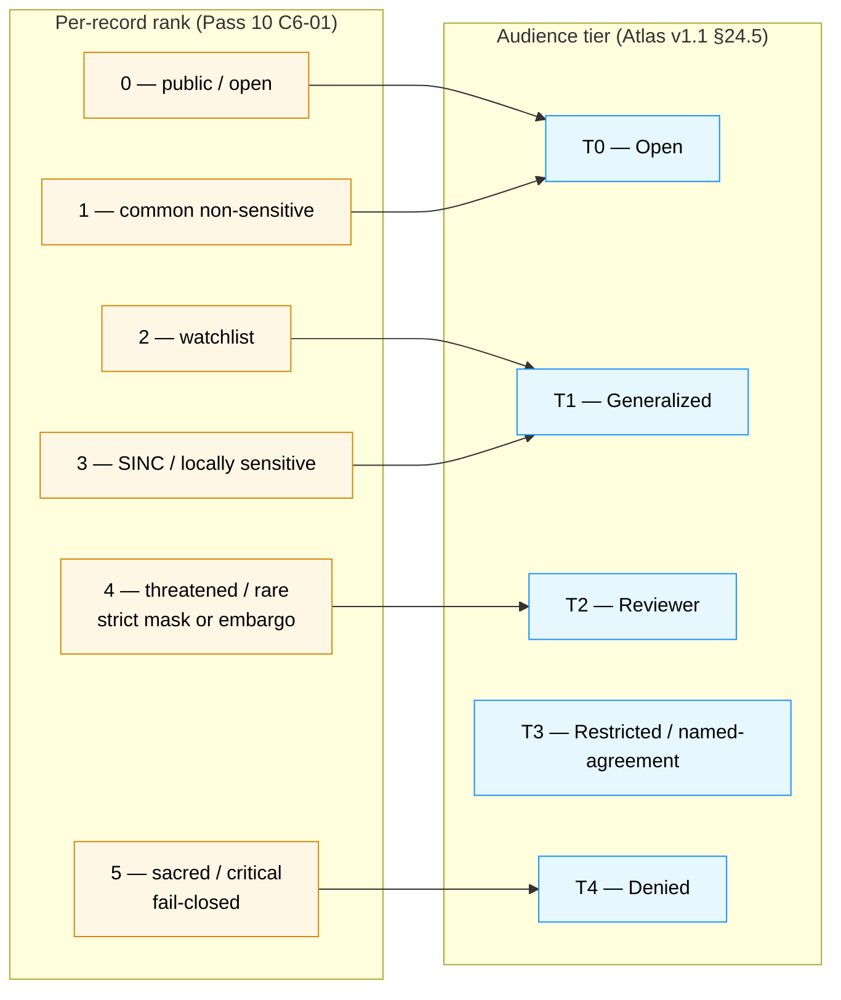
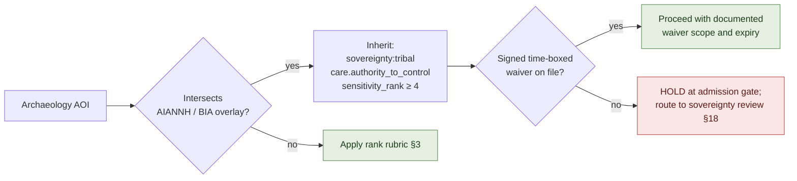
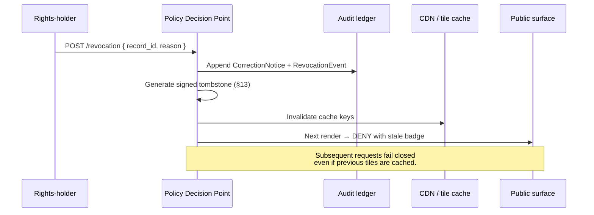

# Archaeology — Sensitivity

> Detailed sensitivity catalogue for the archaeology lane: the two-axis rubric (audience tier × per-record sensitivity rank), CARE labels, named redaction profiles, generalization parameters (the H3-r7 floor and its rationale), differential-privacy and k-anonymity rules, sovereignty label inheritance, consent / revocation / embargo machinery, the `RedactionReceipt` contract, and the sovereignty review workflow that admits and revokes oral-history and cultural-knowledge records.

<!-- [KFM_META_BLOCK_V2]
doc_id: kfm://doc/archaeology-sensitivity
title: Archaeology — Sensitivity
type: standard
version: v1
status: draft
owners: TODO — archaeology domain steward; sensitivity reviewer; rights-holder representative; AI surface steward; release authority; docs steward
created: 2026-05-28
updated: 2026-05-28
policy_label: public
related:
  - docs/doctrine/ai-build-operating-contract.md
  - docs/doctrine/directory-rules.md
  - docs/domains/archaeology/README.md                 # PROPOSED
  - docs/domains/archaeology/OBJECT_FAMILIES.md
  - docs/domains/archaeology/PIPELINE.md
  - docs/domains/archaeology/PRESERVATION_MATRIX.md
  - docs/domains/archaeology/PUBLICATION_AND_POLICY.md
  - docs/domains/archaeology/RELEASE_INDEX.md
  - docs/standards/SENSITIVITY_RUBRIC.md               # PROPOSED — Pass 10 C6-01 home
  - docs/standards/REDACTION_DETERMINISM.md            # PROPOSED — Pass 10 C6-03 home
  - docs/standards/DP_BUDGETS.md                       # PROPOSED — Pass 10 C6-05 home
  - docs/standards/CONSENT_TOKENS.md                   # PROPOSED — Pass 10 C6-07 home
  - docs/runbooks/archaeology/                         # PROPOSED — sovereignty review, rollback drill, parity tests
  - policy/domains/archaeology/                        # PROPOSED — Rego bundle
  - policy/sensitivity/archaeology/                    # PROPOSED — DENY lane
  - policy/consent/archaeology/                        # PROPOSED — oral history / cultural
  - policy/redaction/profiles.yaml                     # PROPOSED — Pass 10 C6-02 home
  - schemas/contracts/v1/receipts/redaction_receipt.schema.json  # PROPOSED
tags: [kfm, domain, archaeology, sensitivity, redaction, CARE, sovereignty, doctrine]
notes:
  - CONTRACT_VERSION pinned to "3.0.0"
  - Sensitive-domain doc; archaeology default tier is T4 (DENY) for site location, human remains, sacred sites.
  - All repo-state and path claims are PROPOSED until repo is mounted.
  - Companion to OBJECT_FAMILIES.md, PIPELINE.md, PRESERVATION_MATRIX.md, PUBLICATION_AND_POLICY.md, and RELEASE_INDEX.md.
[/KFM_META_BLOCK_V2] -->


**Status:** draft &nbsp;·&nbsp; **Owners:** *TODO — archaeology steward; sensitivity reviewer; rights-holder rep; AI surface steward; release authority; docs steward* &nbsp;·&nbsp; **Last updated:** 2026-05-28
**`CONTRACT_VERSION = "3.0.0"`** _(per `docs/doctrine/ai-build-operating-contract.md`)._

> [!CAUTION]
> **Sensitive-domain lane — deny-by-default at every gate.** Archaeology objects default to **Tier T4 (Denied)** and **sensitivity rank 5 (fail-closed)** for exact site geometry, human remains, sacred sites, collection security, and looting-risk exposure. **No transform releases these to T0.** Even at coarser tiers, every public-safe transformation MUST emit a `RedactionReceipt` against a **named, versioned redaction profile** and be reviewed by author + sensitivity reviewer + release authority + rights-holder representative.

---

## Quick jump

- [1 · Scope and purpose](#1--scope-and-purpose)
- [2 · Authority and source hierarchy](#2--authority-and-source-hierarchy)
- [3 · Two rubrics — audience tier × per-record rank](#3--two-rubrics--audience-tier--per-record-rank)
- [4 · CARE principles and sovereignty notice chips](#4--care-principles-and-sovereignty-notice-chips)
- [5 · The archaeology sensitive register](#5--the-archaeology-sensitive-register)
- [6 · Named redaction profiles](#6--named-redaction-profiles)
- [7 · Generalization parameters](#7--generalization-parameters)
- [8 · Differential privacy for aggregates only](#8--differential-privacy-for-aggregates-only)
- [9 · k-Anonymity for site-density surfaces](#9--k-anonymity-for-site-density-surfaces)
- [10 · Sovereignty label inheritance](#10--sovereignty-label-inheritance)
- [11 · Consent tokens — JWT and GA4GH AAI](#11--consent-tokens--jwt-and-ga4gh-aai)
- [12 · Revocation, embargo, and cache invalidation](#12--revocation-embargo-and-cache-invalidation)
- [13 · Tombstones for revocation](#13--tombstones-for-revocation)
- [14 · `RedactionReceipt` contract](#14--redactionreceipt-contract)
- [15 · Remote sensing and 3D controls](#15--remote-sensing-and-3d-controls)
- [16 · AI surface sensitivity discipline](#16--ai-surface-sensitivity-discipline)
- [17 · UI sensitivity rendering](#17--ui-sensitivity-rendering)
- [18 · Sovereignty review workflow](#18--sovereignty-review-workflow)
- [19 · Responsibility-root placement (PROPOSED)](#19--responsibility-root-placement-proposed)
- [20 · Worked example — a sensitive site through the full stack](#20--worked-example--a-sensitive-site-through-the-full-stack)
- [Open questions register](#open-questions-register)
- [Open verification backlog](#open-verification-backlog)
- [Changelog v0 → v1](#changelog-v0--v1)
- [Definition of done](#definition-of-done)
- [Related docs](#related-docs)

---

## 1 · Scope and purpose

**CONFIRMED doctrine / PROPOSED implementation.**

This document is the **detailed sensitivity catalogue** for the archaeology lane. It is the deepest of the five sibling archaeology docs and is where every sensitivity-bearing decision in the lane is finally specified:

- The two-axis sensitivity rubric (audience tier × per-record sensitivity rank) and the crosswalk between them.
- The named, versioned redaction profiles that govern every public-safe transformation.
- The exact generalization parameters (H3 r7 floor, cell sizing, jitter mechanics) and why they are what they are.
- The differential-privacy and k-anonymity rules and where each applies (or does not apply) in archaeology.
- The sovereignty label inheritance rule (AIANNH / BIA AOI intersection) and the CARE / FAIR labels.
- The consent / revocation / embargo / cache-invalidation machinery for oral-history and cultural-knowledge records.
- The `RedactionReceipt` contract that pins every transform.
- The sovereignty review workflow that admits, revokes, and escalates sensitive records.

It does **not** redefine:

- Object **meaning** — see [`OBJECT_FAMILIES.md`](./OBJECT_FAMILIES.md).
- The **lifecycle / Gates A–G** sequence — see [`PIPELINE.md`](./PIPELINE.md).
- The **navigator-level tier matrix** — see [`PRESERVATION_MATRIX.md` §4.2](./PRESERVATION_MATRIX.md#42-archaeology-object-class-tier-matrix-proposed).
- The **governed-API surfaces and OPA deny rules** — see [`PUBLICATION_AND_POLICY.md`](./PUBLICATION_AND_POLICY.md).
- The **release-plane index** — see [`RELEASE_INDEX.md`](./RELEASE_INDEX.md).

> [!IMPORTANT]
> This document is the **doctrine surface** for archaeology sensitivity decisions. When this doc disagrees with a sibling navigator (e.g. the tier-mapping table in `PRESERVATION_MATRIX.md` or `RELEASE_INDEX.md`), **this doc wins** for sensitivity-specific decisions; conflicts are filed against `docs/registers/DRIFT_REGISTER.md` per Directory Rules §2.5. Conversely, the schema / contract / Rego bundle / `ReleaseManifest` always win over this doc for actual machine-readable enforcement.

[Back to top ↑](#archaeology--sensitivity)

---

## 2 · Authority and source hierarchy

| Layer | Source | Role for this document |
|---|---|---|
| **Operating law** | `docs/doctrine/ai-build-operating-contract.md` v3.0 | Pins `CONTRACT_VERSION = "3.0.0"`; governs publication / rights / sensitivity invariants. |
| **Placement law** | `docs/doctrine/directory-rules.md` | Confirms `policy/`, `schemas/`, `docs/runbooks/` placements. |
| **Domain doctrine** | Atlas v1.1 Ch. 15 — §I (sensitivity / rights / publication), §L (governed AI), §M (publication / correction / rollback), §N (verification backlog). | Canonical archaeology sensitivity doctrine. |
| **Tier scheme** | Atlas v1.1 §24.5 (T0–T4); ENCY §20.5 (Deny-by-Default Register). | Audience-tier reference. |
| **Per-record rubric** | Components Pass 10 §C6-01 (sensitivity_rank 0–5). | Per-record sensitivity rubric. |
| **Redaction profiles** | Components Pass 10 §C6-02..06 (named profiles, seeded jitter, grid, DP, k-anonymity). | Profile catalogue and parameters. |
| **Consent / revocation** | Components Pass 10 §C6-07..08 (JWT, GA4GH, revocation, embargo); §C9-04 (GA4GH AAI, DUO). | Consent-machinery doctrine. |
| **Sovereignty inheritance** | KFM-P11-PROG-0025 (Tribal sovereignty label inheritance). | AOI-intersection rule. |
| **CARE / UI** | Master MapLibre v2.1 ML-061-158..164. | CARE labels, sovereignty notices, generalization logs, H3-r7 floor, Focus Mode discipline. |
| **Remote-sensing controls** | KFM-P9-PROG-0060 (Sentinel-1 SAR sovereignty / mask / lineage); KFM-P9-FEAT-0015 (preservation-state for 3D analyses). | SAR / LiDAR / 3D controls. |
| **Receipt catalog** | Atlas v1.1 §24.2; Build Manual §7.1. | `RedactionReceipt`, `AggregationReceipt`, `RepresentationReceipt`, `RealityBoundaryNote`, `AIReceipt`. |
| **Anti-patterns / risks** | Atlas v1.1 §24.9 (anti-patterns), §24.10 (risk register). | Failure modes guarded against. |

> [!NOTE]
> All paths under `policy/`, `schemas/`, `docs/standards/`, `docs/runbooks/` named in this document are **PROPOSED**. None are claimed to exist in the live repository until verified.

[Back to top ↑](#archaeology--sensitivity)

---

## 3 · Two rubrics — audience tier × per-record rank

**CONFIRMED doctrine.** KFM carries two complementary sensitivity scales. Treating them as one is a category error.

### 3.1 The two rubrics

| Rubric | Question it answers | Source | Where it lives |
|---|---|---|---|
| **Audience tier `T0–T4`** | *Who may see this released artifact, and under what controls?* | Atlas v1.1 §24.5.1. | `ReleaseManifest.sensitivity`; navigator tables. |
| **Per-record sensitivity rank `0–5`** | *How sensitive is this individual record before any transformation?* | Components Pass 10 §C6-01. | `SourceDescriptor.sensitivity_rank`; per-record metadata. |



### 3.2 PROPOSED crosswalk for archaeology

The mapping below is the **default**; a `ReviewRecord` may move a record to a more restrictive tier than its rank would imply (never less restrictive without sovereignty review).

| Per-record rank | Description (archaeology specialization) | Default audience tier | Default redaction profile |
|---|---|---|---|
| **0** | Public chronology / period vocabulary; non-locational context. | **T0** | `kfm:archaeology:none` |
| **1** | Coarse aggregate counts; public coverage summary at county or larger. | **T0** | `kfm:archaeology:none` *or* `kfm:archaeology:survey-coverage-county@v1` |
| **2** | Generalized survey-coverage footprints at H3 r7 or coarser; non-sensitive site context. | **T1** | `kfm:archaeology:site-h3-r7@v1` |
| **3** | Locally sensitive sites (e.g., known but not protected); precise provenience packets. | **T2 reviewer** (default) → **T1** only via generalization + review. | `kfm:archaeology:site-h3-r5@v1` |
| **4** | Threatened / rare sites (active erosion, known looting); collection-security records. | **T3 restricted** (named-agreement only) → **T2** only via sovereignty / steward review. | `kfm:archaeology:site-county-aggregate@v1` |
| **5** | Sacred sites, human remains, burials, sovereignty-restricted oral history, exact site location. | **T4 fail-closed**. **No transform releases this to T0.** | `kfm:archaeology:exact-site-deny@v1` |

> [!IMPORTANT]
> **The default is fail-closed.** A record without a `sensitivity_rank` is treated as **rank 5** until reviewed. A record with `rank ≥ 4` MUST NOT be admitted to RAW without a `SourceDescriptor` whose `rights_status` is `RESOLVED` and (where applicable) whose `sovereignty:tribal` label has been inherited per [§10](#10--sovereignty-label-inheritance).

> [!WARNING]
> **Tier transitions do not perform source-role upgrades.** A `CandidateFeature` released at T1 stays a candidate; its `source_role` is preserved across every transition. Role transitions are separate governed events with their own evidence and review. _See [`PRESERVATION_MATRIX.md` §11](./PRESERVATION_MATRIX.md#11--anti-collapse-and-source-role-preservation)._

[Back to top ↑](#archaeology--sensitivity)

---

## 4 · CARE principles and sovereignty notice chips

**CONFIRMED doctrine (ML-061-160; KFM-P11-PROG-0025; ENCY §13).**

Every archaeology surface — Evidence Drawer, Focus Mode panel, layer manifest, governed API payload — that exposes a record with `sensitivity_rank ≥ 2` or `sovereignty:tribal` MUST carry **CARE labels**, **sovereignty notice chips**, and a **generalization log** reference.

### 4.1 CARE labels (PROPOSED metadata)

The **CARE** principles for Indigenous Data Governance (Collective benefit · Authority to control · Responsibility · Ethics) extend FAIR with sovereignty obligations. Each public archaeology surface in KFM carries the four labels:

| Label | Meaning (PROPOSED summary) | Surfaced where |
|---|---|---|
| `care.collective_benefit` | Communities deriving collective benefit from this data are identified; data use serves those communities. | Evidence Drawer chip; Focus Mode panel. |
| `care.authority_to_control` | The rights-holders' authority over this data is named and active. | Evidence Drawer chip; release manifest. |
| `care.responsibility` | The retainer of this data accepts the responsibilities that come with stewardship. | Audit ledger; sovereignty review record. |
| `care.ethics` | The publication respects rights and well-being throughout the data lifecycle. | Evidence Drawer chip; correction / rollback notices. |

### 4.2 Sovereignty notice chips

A **sovereignty notice chip** is a small, accessible UI element that names the sovereign authority over the record being viewed.

| Chip variant | When it renders | Required content |
|---|---|---|
| `sovereignty:tribal` | Record is derived from sovereignty-controlled source **or** the record's AOI intersects an AIANNH / BIA polygon (see [§10](#10--sovereignty-label-inheritance)). | Sovereign name (or "tribal authority" if the specific authority is itself sovereignty-restricted); consent-token reference; revocation endpoint. |
| `sovereignty:state` | Record is derived from SHPO or state-historic-preservation source. | Source authority name; release date. |
| `sovereignty:federal` | Record is derived from NRHP or federal historic-preservation source. | Source authority name; release date. |
| `sovereignty:custodial` | Record is held under a named custodial agreement (e.g., museum collection security). | Custodian name; agreement reference; access class. |

### 4.3 Required when CARE-labeled

When CARE labels render, the surface MUST also expose:

- A **generalization-log reference** — the `RedactionReceipt` ID(s) that produced this public-safe carrier (ML-061-161).
- A **consent / custodial-review reference** — the `ReviewRecord` ID and reviewer role.
- A **revocation endpoint** when the record is consent-bound (§12).

> [!CAUTION]
> **UI labels are not a substitute for evidence.** A CARE chip on a surface that lacks a resolvable `RedactionReceipt` is itself an anti-pattern. The chip is a trust signal that the receipt machinery is functioning, not a replacement for it. _Source: ML-061-160 validation consequence._

[Back to top ↑](#archaeology--sensitivity)

---

## 5 · The archaeology sensitive register

**CONFIRMED doctrine (Atlas v1.1 §24.5.2; ENCY §11; ENCY §20.5; ML-061-158).** The following classes default to T4 / rank 5 unless explicit sovereignty / steward review approves a more public transform.

| Sensitive class | Default tier | Default rank | Rationale |
|---|---|---|---|
| **Exact archaeological site location** | T4 | 5 | Looting-risk exposure; sovereignty / heritage controls. |
| **Burial / human remains** | T4 | 5 | Sovereignty; heritage; sacred-site protection. **No transform releases this to T0.** |
| **Sacred sites** | T4 | 5 | Sovereignty; sacred-site protection. **No transform releases this to T0.** |
| **Unresolved cultural sensitivity** | T4 | 5 | Fail-closed until steward + rights-holder review. |
| **Collection security records** | T3 / T4 | 4 / 5 | Anti-theft posture; named custodial agreement gating. |
| **Private landowner details** | T3 | 3–4 | Privacy; rights confirmation required. |
| **Looting-risk exposure** | T4 | 5 | Active threat detail at precise location combined with site existence is among the highest-risk publications. |
| **Oral history / cultural knowledge without consent** | T4 | 5 | Sovereignty-controlled; consent-bound; revocable. |
| **Synthetic / reconstructed scene content** | T4 (until reviewed) | 4 | `RealityBoundaryNote` + `RepresentationReceipt` required before any release; anti-collapse rule applies. |
| **Provenience packets** (locational excavation detail) | T3 | 3 | Generalization + redaction → T2 under steward review. |
| **`CandidateFeature` / `RemoteSensingAnomaly` / `LiDARCandidate`** | T4 default for raw; **T1 only as labeled, generalized, candidate-not-site carrier** | 3 | Anti-collapse rule: candidate is not a site. |
| **`ThreeDDocumentation` sensitive scenes** | T4 | 4–5 | Surface fidelity may differ from evidence fidelity; representation receipt mandatory. |
| **`preservation_state` + active threat at precise location** | T4 | 4 | Combination is itself looting-risk-bearing. |

> [!CAUTION]
> **"Exact coordinates of sacred sites, burials, and restricted archives are prohibited without review."** _Source: ML-061-158, verbatim._ The corpus is explicit; KFM does not weaken this posture for any audience.

[Back to top ↑](#archaeology--sensitivity)

---

## 6 · Named redaction profiles

**CONFIRMED doctrine (Components Pass 10 §C6-02).** Every public-safe transformation in archaeology references a **named, versioned redaction profile** that specifies the strategy, parameters, seeding rule, and any embargo. The profile is a stable identifier; parameter changes require a new version.

### 6.1 PROPOSED archaeology profile catalogue

| Profile ID (PROPOSED) | Strategy | Parameters | Default sensitivity range | Use |
|---|---|---|---|---|
| `kfm:archaeology:none@v1` | No transformation. | — | rank 0–1; T0. | Vocabulary, period names, public chronology. |
| `kfm:archaeology:site-h3-r9@v1` | H3 hex grid snap to resolution 9. | `cell_resolution: 9` (~174 m edge). | rank 2; T2 reviewer surfaces only. | Reviewer-tier site location for known-non-sensitive sites. *(See `OQ-ARCH-S-02`.)* |
| `kfm:archaeology:site-h3-r7@v1` | H3 hex grid snap to resolution 7. | `cell_resolution: 7` (~1.2 km edge). | rank 2–3; T1 public-safe **floor**. | Default public archaeology generalization. |
| `kfm:archaeology:site-h3-r5@v1` | H3 hex grid snap to resolution 5. | `cell_resolution: 5` (~8 km edge). | rank 3–4; T1 with steward review. | Sensitive but releasable sites. |
| `kfm:archaeology:survey-coverage-county@v1` | County-level aggregate; per-site detail stripped. | `aggregation_unit: "county"`. | rank 1–2; T0–T1. | Survey-coverage summaries. |
| `kfm:archaeology:site-county-aggregate@v1` | County-level count aggregate; no individual sites. | `aggregation_unit: "county"`; minimum_count guard. | rank 3–4; T1. | Threatened / rare site aggregates. |
| `kfm:archaeology:candidate-anomaly-h3-r7@v1` | H3 r7 + **candidate-not-site label** baked into payload. | `cell_resolution: 7`; `role_candidate_disposition: "pending"`. | rank 2–3; T1 candidate carrier only. | Public-safe candidate surface (`RemoteSensingAnomaly`, `LiDARCandidate`). |
| `kfm:archaeology:3d-scene-clipped@v1` | Geometry clipped, downsampled, attached `RealityBoundaryNote` + `RepresentationReceipt`. | `clip_buffer_m`, `downsample_factor`, `representation_receipt_ref`. | rank 3–4; T2 reviewer or T1 generalized. | Sensitive `ThreeDDocumentation` releases. |
| `kfm:archaeology:exact-site-deny@v1` | Suppression / withholding; no public output. | `removed_fields: ["geometry", "exact_coords", "address"]`. | rank 5; T4. | Default for site location, burials, sacred sites. |
| `kfm:archaeology:oral-history-restricted@v1` | Named-party access; consent-bound; revocation-aware. | `consent_token_required: true`; `revocation_endpoint`; `embargo_until?`. | rank 4–5; T3 named-agreement. | Oral history / cultural knowledge. |
| `kfm:archaeology:provenience-redacted@v1` | Generalization to site-or-coarser; provenience detail removed. | `removed_fields: ["grid_x", "grid_y", "elevation_exact"]`. | rank 3; T2. | Provenience packets. |
| `kfm:archaeology:collection-security@v1` | Identifier aliasing under steward agreement; location detail withheld. | `id_aliasing: true`; `removed_fields: ["repository_location", "loan_status"]`. | rank 3–4; T2 / T3. | Collection / repository identifiers. |

### 6.2 Profile lifecycle

| Aspect | Rule |
|---|---|
| **Versioning** | Profile IDs are **versioned** (e.g., `…@v1`). Changing strategy or parameters requires a new version. Patch-only changes (documentation, comment fixes) MAY share a version; this is an open ADR (`OQ-ARCH-S-03`). |
| **Authoring** | Profiles are authored under `policy/redaction/profiles.yaml` (PROPOSED) with method documentation, an OPA / Rego fixture stating which sensitivity ranks it satisfies, and a **verifier** that re-runs the transform from a `RedactionReceipt` and checks determinism. |
| **Verification** | Every profile ships with at least one no-network fixture under `fixtures/domains/archaeology/redaction/`. |
| **Catalog reference** | Each `RedactionReceipt` cites `profile_id@version`; catalog records and `EvidenceBundle`s preserve the reference. |
| **Breaking changes** | Profile parameter changes are breaking for any record produced under the old profile. Old records are NOT re-rendered against the new profile silently; supersession is required. |

> [!IMPORTANT]
> **No inline redaction parameters.** A `RedactionReceipt` that carries strategy parameters inline without a `profile_id@version` reference fails the schema check (`deny.redaction_no_profile_ref`). The profile IS the policy; ad-hoc parameters bypass review.

[Back to top ↑](#archaeology--sensitivity)

---

## 7 · Generalization parameters

**CONFIRMED doctrine (ML-061-159; Components Pass 10 §C6-04).**

### 7.1 The H3-r7 floor

Any archaeology geometry below **H3 resolution 7** (≈ 1.2 km edge) is **prohibited** for sensitive archaeology products without explicit review. _Source: ML-061-159, verbatim._

| Property | Value |
|---|---|
| **Default public-safe floor** | H3 r7 |
| **Reviewer-tier surface** | H3 r9 or finer permitted **only for authenticated reviewers**, never public |
| **Sensitive-site public release** | H3 r5 or coarser by default (`kfm:archaeology:site-h3-r5@v1`) |
| **Vocabulary / period release** | No geometry; H3 not applicable |

> [!CAUTION]
> The H3 r7 floor is from the Master MapLibre v1.7 update packet (`ML-061-159`). The canonical archaeology generalization threshold — whether the floor is H3 r7 for all sensitive products or varies by sensitivity rank — is an open ADR (`OQ-ARCH-S-01`; mirrored across sibling docs as `OQ-ARCH-PIPE-03`, `OQ-ARCH-PM-03`, `OQ-ARCH-RI-02`).

### 7.2 Why hex, not square

KFM defaults to **H3 hex grids** for geometry generalization because (a) H3 has stable, reproducible global indexing; (b) hex cells have isotropic neighbor distances; (c) the H3 hierarchy supports clean coarsening (parent / child resolutions) for steward review. PostGIS `ST_SnapToGrid` is supported as a fallback for non-spatial-foundation contexts but is not the default. _Source: Components Pass 10 §C6-04._

### 7.3 When grid generalization is NOT enough

Grid generalization reveals **density**. In low-density regions of Kansas, even a coarse cell may narrow location significantly. The fallback rules:

| Condition | Required additional control |
|---|---|
| One site per H3 r7 cell in a low-density county | Coarsen to H3 r5 or aggregate to county. |
| Site cluster known to threat actors (looting risk) | Replace with county-level aggregate; emit `RedactionReceipt` with `removed_fields: ["geometry"]`. |
| Site in a named sovereignty AOI | Inherit `sovereignty:tribal` (§10); follow sovereignty review workflow (§18). |

### 7.4 Jitter — limited use in archaeology

**CONFIRMED doctrine (Components Pass 10 §C6-03).** Display-redaction jitter uses a deterministic PRNG seeded by `spec_hash + record_id`, so the same record always receives the same offset.

| Application in archaeology | Posture |
|---|---|
| Per-site jitter for site location | **NOT preferred.** Archaeological sites are typically point-or-polygon; jittering a point still implies a precise location somewhere in the radius, and triangulation across multiple renders defeats the goal. Default to **grid generalization** (§7.1–7.2). |
| Per-cell jitter (centroid offset) | Permitted within a coarser grid cell only when the cell would otherwise expose a known-sensitive feature. |
| Random-each-render jitter | **Forbidden.** Always deterministic, seeded, and reproducible from the `RedactionReceipt`. |

> [!WARNING]
> If `record_id` is leaked, the jitter seed is guessable. Jitter alone never substitutes for actual obfuscation. _Source: Components Pass 10 §C6-03 tensions._ For archaeology the conservative default is **grid generalization, not jitter**.

### 7.5 Suppression / withholding

For the highest-rank classes (rank 5 / T4), the only sound transform is **suppression**: the geometry, identifier, or attribute is removed entirely; the `RedactionReceipt` lists `removed_fields`. Lifting suppression requires `ReviewRecord` + `PolicyDecision` + (where applicable) sovereignty review.

[Back to top ↑](#archaeology--sensitivity)

---

## 8 · Differential privacy for aggregates only

**CONFIRMED doctrine (Components Pass 10 §C6-05).**

**Differential privacy (DP) is applied only to aggregate outputs** (counts, heatmaps, density surfaces) in archaeology. **Raw points are never DP-noised.** DP parameters (epsilon, delta) are recorded in the `AggregationReceipt`.

| Aspect | Rule |
|---|---|
| Where DP applies | County / H3-r7 site-count aggregates; survey-coverage heatmaps; chronology density surfaces. |
| Where DP does NOT apply | Raw sites; raw candidate features; individual provenience packets — these use suppression or grid generalization. |
| Parameter recording | `epsilon`, `delta`, `mechanism` (Laplace / Gaussian / etc.), library version, budget consumed — all in the receipt. |
| Library | OpenDP, Google DP, or PyDP per `docs/standards/DP_BUDGETS.md` (PROPOSED). |
| Budget tracking | Per-dataset epsilon budgets; cumulative leakage across heatmap views tracked. _See `OQ-ARCH-S-04`._ |

> [!IMPORTANT]
> **DP on raw points is harmful.** DP applied to raw site coordinates produces noise that misleads users while not formally protecting locations. DP applied to counts produces formally bounded leakage. For archaeology, the rule is: **DP for aggregates, suppression / grid for raw**. _Source: Components Pass 10 §C6-05._

[Back to top ↑](#archaeology--sensitivity)

---

## 9 · k-Anonymity for site-density surfaces

**CONFIRMED doctrine (Components Pass 10 §C6-06), specialized for archaeology.**

The k-anonymity pattern in C6-06 was developed for living-people overlays; for archaeology it specializes to **site-density k-anonymity**: a public archaeology cell renders site-count detail only when at least `k` distinct sites contribute to the cell. If `k` is not met, a fallback aggregation (e.g., zoom out to county or coarser H3 resolution) is applied **server-side**.

| Parameter | PROPOSED default | Rationale |
|---|---|---|
| `k` | `10` | Default from C6-06; archaeology calibration is an open question (`OQ-ARCH-S-05`). |
| `cell_resolution` | H3 r7 | The public-safe floor (§7.1). |
| Fallback when `k` not met | Coarsen to H3 r5 → H3 r4 → county aggregate; if still not met, suppress. | Cascading fallback. |
| Decision recorder | `AggregationReceipt` (and a `RedactionReceipt` if a final suppression was applied). | Auditable. |

> [!IMPORTANT]
> **k-anonymity is not consent.** Even when a cell meets `k`, oral-history-derived or sovereignty-controlled records are governed by §10–§11 first. k-anonymity is a per-cell density floor; consent / sovereignty rules are per-record obligations.

[Back to top ↑](#archaeology--sensitivity)

---

## 10 · Sovereignty label inheritance

**CONFIRMED doctrine (KFM-P11-PROG-0025).**

Any archaeology artifact whose **AOI intersects an AIANNH / BIA polygon** (American Indian / Alaska Native / Native Hawaiian Areas; Bureau of Indian Affairs administrative boundaries) MUST inherit the **`sovereignty:tribal`** label and the associated sensitivity labels — **or require a signed, time-boxed waiver** before promotion.

### 10.1 The inheritance rule



### 10.2 Waiver requirements

A waiver is a **signed, time-boxed override of the default sovereignty hold**, recorded as a first-class artifact (KFM-P3-IDEA-0003 override discipline applies). A waiver MUST name:

- The sovereign authority issuing the waiver.
- The scope (which sources, which AOI, which transforms).
- The expiry (waivers are time-boxed; no perpetual waivers).
- The signing identity and the cosign / DSSE signature.
- The remediation plan when the waiver expires.

> [!WARNING]
> **Sovereignty-related gates MUST NOT be bypassed by an override that is not signed by the sovereign authority itself.** A KFM-internal release authority cannot grant a sovereignty waiver. _See [`PUBLICATION_AND_POLICY.md` §13](./PUBLICATION_AND_POLICY.md#13--override-and-emergency-bypass-discipline)._

### 10.3 Label inheritance is durable

`sovereignty:tribal` and related labels **persist across every promotion** (anti-collapse rule). A T4 → T1 generalization does not strip the label; the generalized public-safe carrier still renders the sovereignty notice chip (§4.2).

[Back to top ↑](#archaeology--sensitivity)

---

## 11 · Consent tokens — JWT and GA4GH AAI

**CONFIRMED doctrine (Components Pass 10 §C6-07, §C9-04).**

Consent is **enforceable, machine-readable, and revocable**. For archaeology, consent applies primarily to **oral history**, **cultural-knowledge records**, and **named-party access** to T3 / T4 material.

### 11.1 Token shape

| Field | Purpose |
|---|---|
| `iss` | Issuer (sovereign / custodial authority). |
| `aud` | Audience (named party / KFM PDP). |
| `scopes[]` | What the bearer may do (view, summarize, derive, redistribute — DUO codes). |
| `exp` | Expiry (short-lived; default ≤ 24 h for clear-view scopes). |
| `revocation_endpoint` | URL introspected on every render. |
| `consent_history_hash` | Hash of the consent record chain. |
| `redaction_profile` | The profile ID under which the bearer's view is rendered. |
| `jti` | Token ID for audit. |
| `signatures` | JWT signature; GA4GH visa attestation where applicable. |

### 11.2 GA4GH AAI / DUO integration

Where archaeology consent intersects with health / genealogy / DNA work (e.g., ancestral DNA tied to cultural affiliation):

- Tokens are GA4GH Passport visas (not bare JWTs).
- Scopes use **DUO** (Data Use Ontology) codes.
- The PDP introspects the visa's revocation endpoint on every render and **fails closed** when introspection cannot complete. _Source: Components Pass 10 §C9-04._
- The audit ledger records the Passport fingerprint used at fetch time.

### 11.3 Non-GA4GH consent

Oral-history consent is rarely issued as a GA4GH visa. KFM normalizes free-text consent (e.g., a documented community release) into DUO codes via a **documented mapping** (PROPOSED, `docs/standards/CONSENT_TOKENS.md`). The mapping is preserved in the `RedactionReceipt` so the consent trail is auditable.

> [!IMPORTANT]
> **Consent is not text on a page.** A free-text consent statement is NOT enforceable on its own; KFM requires that every consent claim resolve to either a signed token or a documented mapping to DUO codes. _Source: Components Pass 10 §C6-07; §C9-04._

[Back to top ↑](#archaeology--sensitivity)

---

## 12 · Revocation, embargo, and cache invalidation

**CONFIRMED doctrine (Components Pass 10 §C6-08).**

Every public archaeology release that touches consent-bound or sovereignty-restricted content MUST expose:

- A **`revocation_endpoint`** — introspected on every render.
- An **`embargo_until`** field (where applicable) — date-based gate.
- **Cache invalidation hooks** — PMTiles index bumps, tile server purges, CDN invalidations.

### 12.1 Revocation flow



### 12.2 Embargo

| Aspect | Rule |
|---|---|
| Comparison | `now < embargo_until` → DENY regardless of other approvals. |
| Recorder | Embargo state recorded in `ReleaseManifest`; surfaced as a UI badge. |
| Embargo expiry | Does NOT auto-promote; a new promotion decision is required after expiry. |

### 12.3 Cache invalidation discipline

> [!WARNING]
> **Revocation that does not invalidate caches is incomplete.** Stale tiles can leak retracted content even after the source release is revoked. KFM REQUIRES that revocation triggers:
> - PMTiles index bump (so the old tileset is no longer indexed);
> - Tile-server cache purge (so freshly-fetched tiles do not serve old payloads);
> - CDN cache invalidation;
> - Downstream-derivative invalidation (graphs, exports, stories, AI summaries).
> The invalidation hooks MUST be **tested before the revocation pathway is relied upon**. _Source: Components Pass 10 §C6-08._

### 12.4 Fail-closed on introspection outage

If a revocation endpoint is unreachable for an extended window, the **rendering MUST fail closed** even if it inconveniences users. The fail-closed rule is non-negotiable.

[Back to top ↑](#archaeology--sensitivity)

---

## 13 · Tombstones for revocation

**CONFIRMED doctrine (Components Pass 10 §C5-09).**

When an archaeology record is revoked, it is **not silently deleted**. A **tombstone** replaces the public-facing record with a signed marker that names:

- The original `release_id` / `record_id`.
- The reason for revocation (without leaking sensitive content).
- The replacement pointer (if any) — usually `null` for sovereignty revocations.
- The supersession lineage entry.
- The signature of the issuing authority.

```text
{
  "object_type": "Tombstone",
  "schema_version": "v1",
  "tombstone_id": "kfm:archaeology:tombstone:…",
  "supersedes_release_id": "kfm:archaeology:release:…",
  "reason_code": "RIGHTS_REVOKED | SOVEREIGNTY_REVIEW | CORRECTION | EMBARGO_LIFTED",
  "reason_summary": "(non-sensitive summary)",
  "replacement_pointer": null,
  "issued_at": "2026-…",
  "issuer": "(authority)",
  "signatures": [...]
}
```

> [!NOTE]
> **Tombstone vs erasure.** Tombstones satisfy explainability — anyone querying the old ID gets a clear answer that the record was revoked. They do **not** satisfy right-to-be-forgotten / data-erasure obligations on their own; where a sovereign authority requires actual erasure (rather than tombstoning), the erasure path is logged separately. The boundary between tombstone and erasure for archaeology consent records is an open ADR (`OQ-ARCH-S-06`). _Source: Components Pass 10 §C5-09 tensions._

[Back to top ↑](#archaeology--sensitivity)

---

## 14 · `RedactionReceipt` contract

**CONFIRMED doctrine (Atlas v1.1 §24.2.1).** Every public-safe transformation of an archaeology object emits a `RedactionReceipt`. Missing the receipt means the transformation did not happen *in the governed sense*.

### 14.1 Required fields (PROPOSED schema)

| Field | Type | Required? | Purpose |
|---|---|---|---|
| `object_type` | `"RedactionReceipt"` | MUST | Type discriminator. |
| `schema_version` | `"v1"` | MUST | Schema version. |
| `receipt_id` | string | MUST | Deterministic ID (JCS + SHA-256). |
| `created_utc` | datetime | MUST | When the redaction was performed. |
| `actor` | string | MUST | Author / pipeline run. |
| `record_id` | string | MUST | The record this redaction applies to. |
| `source_id` | string | MUST | Source descriptor reference. |
| `source_role` | enum | MUST | Preserved from admission (anti-collapse). |
| `policy_ref` | string | MUST | `policy_bundle_digest@version`. |
| `profile_id` | string | MUST | Named profile reference, e.g. `kfm:archaeology:site-h3-r7@v1`. |
| `redaction_method` | enum | MUST | `generalization` / `aggregation` / `suppression` / `representation` / `named_party_access` / `tombstone`. |
| `kept_fields[]` | array | MUST | Fields preserved on the public-safe carrier. |
| `removed_fields[]` | array | MUST | Fields removed / masked / withheld. |
| `geometry_transform` | object | MUST when geometry changed | `{ from_hash, to_hash, method, parameters }`. |
| `parameters` | object | MUST | Strategy parameters per profile (e.g., `cell_resolution: 7`). |
| `seed` | string | MUST when stochastic | Deterministic seed (`spec_hash + record_id`). |
| `pre_redaction_hash` | string | MUST | Hash of input record. |
| `post_redaction_hash` | string | MUST | Hash of output record. |
| `reviewer` | string | MUST for sensitive lanes | `ReviewRecord` reference. |
| `rights_holder_review` | string | MUST when `sovereignty:tribal` | Rights-holder representative `ReviewRecord` reference. |
| `consent_token_ref` | string | MUST when consent-bound | Token jti / fingerprint. |
| `embargo_until` | datetime | MAY | Where applicable. |
| `revocation_endpoint` | URL | MUST when consent-bound | For PDP introspection. |
| `verifier_invocation` | object | SHOULD | How to replay the transform deterministically. |
| `care_labels` | object | MUST when public-safe | The four CARE labels. |
| `sovereignty_labels` | array | MUST when inherited | E.g., `["sovereignty:tribal"]`. |
| `signatures[]` | array | MUST | cosign / SLSA / Rekor entries. |
| `contract_version` | string | MUST | KFM `CONTRACT_VERSION`. |

### 14.2 Determinism property

> [!IMPORTANT]
> A `RedactionReceipt` is **deterministic-replayable**. Given the inputs named in `verifier_invocation` (source record by hash, profile by ID@version, seed), re-running the redaction MUST produce a record whose hash matches `post_redaction_hash`. Replay drift is a build break.

[Back to top ↑](#archaeology--sensitivity)

---

## 15 · Remote sensing and 3D controls

**CONFIRMED doctrine (KFM-P9-PROG-0060; KFM-P9-FEAT-0015; ML-061-157).**

### 15.1 Sentinel-1 SAR and other satellite-derived archaeology layers

Every SAR / optical / multispectral archaeology-derived layer carries, before public rendering:

- **Sovereignty uncertainty** — confidence that the AOI does or does not intersect a sovereign overlay.
- **H3 sensitivity labels** — per-cell sensitivity rank.
- **`mask_required`** flag — whether the cell needs a mask before public release.
- **CARE / FAIR labels** — full set per §4.
- **PROV lineage** — full provenance chain from source through receipts to release.

> [!CAUTION]
> SAR / LiDAR / imagery derivatives at high resolution can expose sensitive contexts even when the underlying source is public-domain. KFM treats the **derivative** as sensitivity-bearing in its own right; the mask / lineage requirements apply to the derivative regardless of source openness. _Source: KFM-P9-PROG-0060._

### 15.2 `ThreeDDocumentation` and synthetic scenes

3D documentation (photogrammetry, LiDAR-derived meshes, reconstructed scenes) is sensitivity-bearing in two ways:

| Property | Rule |
|---|---|
| **Surface fidelity vs evidence fidelity** | Surface fidelity MUST NOT exceed evidence fidelity (a smooth-rendered mesh implies precision the underlying capture does not). `RepresentationReceipt` records the difference. |
| **`RealityBoundaryNote`** | Synthetic / reconstructed / interpolated content carries a `RealityBoundaryNote` describing what is observation vs interpretation. |
| **AI surface** | AI MUST `ABSTAIN` from claims that rely on a synthetic-content surface without explicit reference to the `RealityBoundaryNote`. |

[Back to top ↑](#archaeology--sensitivity)

---

## 16 · AI surface sensitivity discipline

**CONFIRMED doctrine (Atlas v1.1 §15.L; GAI; ML-061-162..164, ML-061-167).**

### 16.1 Sovereignty-aware Focus Mode

Focus Mode for archaeology MUST:

- Be **sovereignty-aware** — explain which evidence influenced insights, including the sovereignty chain (ML-061-162).
- Frame cluster surfaces as **generalized cultural activity zones, not exact archaeological locations** (ML-061-163).
- Surface **CARE labels, provenance-chain badges, and generalization / uncertainty explanations** in the Focus panel (ML-061-164).
- **Never** interpret a candidate or anomaly cluster as precise site evidence (ML-061-167).

### 16.2 Bounded outcomes

| Outcome | Conditions in archaeology |
|---|---|
| **ANSWER** | Citation-validated summary of released `EvidenceBundle`s at the tier of the underlying record; CARE labels + sovereignty chips rendered. |
| **ABSTAIN** | Evidence insufficient; source-role conflict unresolved; `CitationValidationReport` fails; synthetic-content surface lacks `RealityBoundaryNote`. |
| **DENY** | Exact-coordinate request for any archaeological site; query about burial / human remains / sacred sites; unreviewed candidate-feature query; oral-history query without resolvable consent token. |
| **ERROR** | Missing schema, broken `EvidenceRef` resolution, runtime failure. |

### 16.3 AI never reads pre-published content

AI consumes **only released `EvidenceBundle` projections**. AI does NOT read `RAW`, `WORK`, `QUARANTINE`, canonical / internal stores, source APIs, or model runtimes — including the underlying full-fidelity 3D scene before its `RepresentationReceipt` is signed. _Source: ENCY §20.5; GAI._

### 16.4 Paraphrase ban-list

Periodic `AIReceipt` sampling MUST screen for **source-role-upgrade paraphrases** — e.g., AI describing an aggregate as a per-place observation, a model output as observed reality, or a candidate as a confirmed site. Atlas v1.1 §24.10 names this as a HIGH risk; a ban-list of upcasting phrases is an open verification item.

[Back to top ↑](#archaeology--sensitivity)

---

## 17 · UI sensitivity rendering

**CONFIRMED doctrine (ML-061-160..164).**

Every UI surface that consumes an archaeology release MUST render the following accessibility-aware trust signals.

| UI element | What it shows | When |
|---|---|---|
| **Generalization badge** | `Generalized to H3 r7` (or whatever resolution) with a link to the `RedactionReceipt`. | Always when geometry was generalized. |
| **CARE chip** | The four CARE labels in a small accessible chip cluster. | Always when `sensitivity_rank ≥ 2`. |
| **Sovereignty notice chip** | Named sovereign authority + consent / revocation reference. | When `sovereignty:tribal` or any sovereignty label is inherited. |
| **Stale-state badge** | Stale source / schema-drift / geography-drift / model-version / review-aged / rights-changed / policy-version (per [`PUBLICATION_AND_POLICY.md` §10.1](./PUBLICATION_AND_POLICY.md#10--stale-state-and-supersession)). | When any stale-state marker fires. |
| **Override-active badge** | When the underlying release carries an `override_record_ref`. | While an override is active. |
| **Candidate label** | "CANDIDATE — not a confirmed site" with link to anti-collapse explanation. | On any `CandidateFeature` / `RemoteSensingAnomaly` / `LiDARCandidate` surface. |
| **`RealityBoundaryNote` link** | Plain-language explanation of which parts of a 3D scene are observed vs reconstructed. | On any `ThreeDDocumentation` / synthetic surface. |
| **Embargo badge** | "Embargoed until \<date\>" with the manifest reference. | While `embargo_until` is in the future. |
| **Revocation indicator** | "Revoked — view tombstone" link. | When the underlying record has been tombstoned. |
| **Generalization-log link** | Link to `RedactionReceipt`(s) and `AggregationReceipt`(s) that produced the public-safe carrier. | Always when any transform was applied (ML-061-161). |

> [!CAUTION]
> **Style does not substitute for redaction.** A `StyleManifest` that hides sensitive geometry by opacity, filter, or layer visibility — without the underlying tile being generalized / redacted — fails the `deny.style_only_hiding` rule. _See [`PUBLICATION_AND_POLICY.md` §5.1](./PUBLICATION_AND_POLICY.md#5--policy-as-code--deny--abstain--allow); ML-061-160._

[Back to top ↑](#archaeology--sensitivity)

---

## 18 · Sovereignty review workflow

**CONFIRMED doctrine / PROPOSED implementation (KFM-P1-IDEA-0034; Atlas v1.1 §24.7.1).**

Sovereignty review is the formal process that admits, transforms, restricts, or revokes archaeology records that carry `sovereignty:tribal`, oral-history, sacred-site, or human-remains content. It is **distinct from the general steward review** that handles non-sovereign sensitivity.

### 18.1 Roles

| Role | Scope |
|---|---|
| **Rights-holder representative** | Sovereign / tribal / cultural authority's named representative. Their sign-off is **non-optional** for any T3 named-agreement release of sovereign-controlled content. |
| **Sensitivity reviewer** | Reviews redaction / generalization / suppression / representation receipts for sensitive content; recommends tier. |
| **Archaeology domain steward** | Owns the archaeology contracts and validators; coordinates the review. |
| **Release authority** | Issues the `ReleaseManifest`; distinct from authorship. |
| **AI surface steward** | Reviews how the resulting release is surfaced through Focus Mode and the Evidence Drawer; samples `AIReceipt`s. |

### 18.2 Admission (Pre-RAW → RAW for sovereign-controlled sources)

```mermaid
sequenceDiagram
  participant SRC as Source admission
  participant SOV as Rights-holder rep
  participant SR as Sensitivity reviewer
  participant DS as Domain steward
  participant LED as Audit ledger
  SRC->>DS: SourceDescriptor draft (with sovereignty:tribal flag)
  DS->>SOV: Notify; request consent terms and access class
  SOV-->>DS: Consent terms (DUO codes); embargo? revocation endpoint?
  DS->>SR: Apply rank rubric §3; bind to profile §6
  SR-->>DS: Profile assignment + reviewer recommendation
  DS->>LED: Append SourceDescriptor + ReviewRecord(s) + ConsentRecord
  Note over DS,LED: HOLD if any of: rights unresolved,<br/>consent terms missing, profile not assigned.
```

### 18.3 Promotion (CATALOG → PUBLISHED for sovereign-controlled content)

Required signatories (four-role rule, per [`PUBLICATION_AND_POLICY.md` §8](./PUBLICATION_AND_POLICY.md#8--separation-of-duties)):

- Author / domain steward.
- Sensitivity reviewer.
- Release authority (distinct from author).
- Rights-holder representative.

Any release that lacks any of the four fails Gate G with reason `REVIEW_INSUFFICIENT`.

### 18.4 Revocation (post-publication)

| Trigger | Action |
|---|---|
| Sovereign authority requests revocation. | Generate tombstone (§13); invalidate caches (§12.3); emit `CorrectionNotice` + `RollbackCard`; demote to T4 with `CorrectionNotice` + `ReviewRecord`. |
| Consent token revoked at endpoint. | PDP returns DENY on next render; cache invalidation cascade fires; tombstone issued. |
| Embargo expiry detected but new review not run. | Surface remains gated; no auto-promotion; record HOLD until new review. |

### 18.5 Escalation

When sensitivity reviewer and rights-holder representative disagree on a transform / tier, the case escalates to:

1. Archaeology domain steward + docs steward.
2. Release authority + AI surface steward.
3. If unresolved, the matter becomes an open ADR; no release proceeds until resolution.

> [!IMPORTANT]
> **The default during disagreement is HOLD at the current tier.** Disagreement is never resolved by silent release. _Source: Atlas v1.1 §24.9.3 governance-process anti-patterns._

[Back to top ↑](#archaeology--sensitivity)

---

## 19 · Responsibility-root placement (PROPOSED)

**PROPOSED** under Directory Rules §4 Step 3 and Atlas v1.1 §2.1 row 15:

```text
docs/domains/archaeology/
  ├── README.md                              # PROPOSED
  ├── OBJECT_FAMILIES.md                     # CONFIRMED draft sibling
  ├── PIPELINE.md                            # CONFIRMED draft sibling
  ├── PRESERVATION_MATRIX.md                 # CONFIRMED draft sibling (v0.2)
  ├── PUBLICATION_AND_POLICY.md              # CONFIRMED draft sibling
  ├── RELEASE_INDEX.md                       # CONFIRMED draft sibling (v2)
  └── SENSITIVITY.md                         # this file

docs/standards/                              # cross-cutting standards (Pass 10 C6)
  ├── SENSITIVITY_RUBRIC.md                  # PROPOSED — C6-01 rubric (0–5)
  ├── REDACTION_DETERMINISM.md               # PROPOSED — C6-03 seeded jitter
  ├── DP_BUDGETS.md                          # PROPOSED — C6-05 DP budgets
  └── CONSENT_TOKENS.md                      # PROPOSED — C6-07 / C9-04 tokens

docs/runbooks/archaeology/                   # PROPOSED
  ├── sovereignty_review.md                  # §18 workflow
  ├── revocation_drill.md                    # §12 drill
  ├── rollback_drill.md                      # cross-ref to PUBLICATION_AND_POLICY.md §9
  └── parity_test.md                         # CI policy bundle vs runtime

policy/redaction/profiles.yaml               # PROPOSED — C6-02 named profile catalogue
policy/domains/archaeology/                  # PROPOSED — archaeology Rego bundle
policy/sensitivity/archaeology/              # PROPOSED — site-location DENY lane
policy/consent/archaeology/                  # PROPOSED — oral history / cultural
policy/release/archaeology/                  # PROPOSED — staged release

schemas/contracts/v1/receipts/
  ├── redaction_receipt.schema.json          # PROPOSED — §14
  ├── aggregation_receipt.schema.json        # PROPOSED
  ├── representation_receipt.schema.json     # PROPOSED
  ├── reality_boundary_note.schema.json      # PROPOSED
  └── tombstone.schema.json                  # PROPOSED — §13

fixtures/domains/archaeology/redaction/      # PROPOSED — no-network fixtures per profile
tests/domains/archaeology/sensitivity/       # PROPOSED — Rego policy tests, replay determinism tests
```

> [!NOTE]
> Atlas v1.1 §2.1 row 15 names `policy/sensitivity/archaeology/` in flat form; Directory Rules §4 Step 3 illustrates `policy/domains/<domain>/` segmentation. This document follows the segmented form (`policy/domains/archaeology/`) consistent with the sibling docs; the reconciliation is tracked as `OQ-ARCH-S-07` (same question raised across all sibling docs).

[Back to top ↑](#archaeology--sensitivity)

---

## 20 · Worked example — a sensitive site through the full stack

The walk-through below threads §3–§18 into a single end-to-end admission and release. Values are illustrative; this is not a record of a real site.

> [!NOTE]
> **Example.** A SHPO inventory record describes a known late-prehistoric habitation site within an AIANNH polygon. The record has exact coordinates, an excavation history, and is referenced by a tribal cultural authority as a sensitive cultural-affiliation site. The archaeology steward must decide what, if anything, may be released.

### 20.1 Twelve-step trace

| Step | Action | Section | Receipts emitted |
|---|---|---|---|
| **1.** | Apply per-record rank rubric (§3.2): SHPO source + AIANNH-intersecting AOI + cultural-authority reference → **rank 5**. | §3 | `SourceDescriptor` with `sensitivity_rank: 5`. |
| **2.** | Inherit sovereignty labels (§10): `sovereignty:tribal` inherited from AIANNH intersection. | §10 | `SourceDescriptor.sovereignty_labels: ["sovereignty:tribal"]`. |
| **3.** | Bind default profile (§6.1): rank 5 → `kfm:archaeology:exact-site-deny@v1`. | §6 | Profile binding recorded in source registry. |
| **4.** | Sovereignty review admission (§18.2): notify rights-holder representative; request consent terms; archaeology steward holds admission. | §18 | `ConsentRecord` draft; `ReviewRecord`(s). |
| **5.** | Rights-holder representative returns: **no public release of geometry**; reviewer-tier access for named research collaborators only; consent token issued with DUO codes; embargo set for 5 years. | §11 | Signed consent token (JWT or GA4GH visa). |
| **6.** | Sensitivity reviewer applies §3.2: T4 default holds for exact location; an aggregate **county-level** count-only carrier is admissible for a T1 surface; reviewer-tier H3 r9 access permitted under consent token. | §3, §6 | `RedactionReceipt` (county aggregate); `RedactionReceipt` (H3 r9 reviewer carrier); `AggregationReceipt`. |
| **7.** | All transforms emit deterministic, profile-referenced receipts (§14): inputs hashed, profile pinned, seed recorded, CARE labels populated, sovereignty labels carried. | §14 | Each `RedactionReceipt` is replay-verified. |
| **8.** | Promotion to PUBLISHED (Gate G, [`PUBLICATION_AND_POLICY.md` §7](./PUBLICATION_AND_POLICY.md#7--gate-g--release--review--rollback)): author + sensitivity reviewer + release authority + rights-holder representative all sign. | §18.3 | `PromotionDecision`, `PromotionReceipt`, `ReleaseManifest`, `RollbackCard`, `ProofPack`. |
| **9.** | Public surface (Evidence Drawer, layer): renders the county-aggregate cell with CARE chips, `sovereignty:tribal` chip, generalization-log link, consent / revocation endpoint. **No row in `RELEASE_INDEX.md` §7 carries a public link to exact geometry.** | §4, §17 | `EvidenceDrawerPayload` projection. |
| **10.** | Focus Mode (§16): permitted to summarize the county aggregate as "evidence of late-prehistoric habitation in this county" with the CARE labels and generalization explanation. **DENIES** any exact-coordinate query; **ABSTAINS** if the user requests cluster precision beyond H3 r7. | §16 | `AIReceipt` per answer. |
| **11.** | Reviewer-tier surface (authenticated reviewers only): renders the H3 r9 carrier under a valid consent token. The PDP introspects the token's revocation endpoint on every render; if unreachable, **fails closed**. | §11, §12 | Per-render `PolicyDecision`. |
| **12.** | Two years later, the rights-holder revokes consent. KFM issues a tombstone (§13), invalidates caches (§12.3), demotes both the T1 and T2 surfaces to T4 via `CorrectionNotice` + `ReviewRecord`, and updates `RELEASE_INDEX.md` §9–§10 with the correction and rollback rows. | §12, §13 | `Tombstone`, `CorrectionNotice`, `RollbackCard`, cache-invalidation records. |

### 20.2 What this trace prevents

| Risk | How the stack blocks it |
|---|---|
| Exact site geometry leaks to a public client. | Profile `kfm:archaeology:exact-site-deny@v1` + Gate G + `deny.no_exact_coords` + style-only-hiding ban. |
| AI generates an exact-coordinate description by paraphrase. | Cite-or-abstain + `AIReceipt` + paraphrase ban-list; AI consumes only released `EvidenceBundle` projections. |
| A KFM-internal release authority "approves" the release without the rights-holder representative. | Four-role separation of duties; Gate G fails closed on missing `ReviewRecord` for rights-holder. |
| The consent endpoint becomes unreachable and old tiles continue to serve. | PDP introspects revocation endpoint on every render and fails closed on introspection outage; cache invalidation on revocation. |
| A future revocation silently deletes history. | Tombstone preserves the audit trail; the original `release_id` remains in the supersession lineage. |

[Back to top ↑](#archaeology--sensitivity)

---

## Open questions register

| ID | Question | Owner role | Resolution path |
|---|---|---|---|
| `OQ-ARCH-S-01` | What is the **canonical archaeology generalization threshold** — H3 r7 for all sensitive products, or does the floor vary by sensitivity rank? Mirrors `OQ-ARCH-PIPE-03` / `OQ-ARCH-PM-03` / `OQ-ARCH-RI-02`. | Domain steward + spatial-foundation steward | ADR; populate `policy/redaction/profiles.yaml` and `policy/domains/archaeology/thresholds.json`. |
| `OQ-ARCH-S-02` | Is reviewer-tier H3 r9 access ever justified for archaeology, or should the reviewer-tier floor also be H3 r7 to remove the risk of escalation? | Sensitivity reviewer + rights-holder rep | ADR; tighten or pin in `policy/sensitivity/archaeology/`. |
| `OQ-ARCH-S-03` | Are redaction-profile versions **major-only** (every change breaking) or do they include patch (documentation-only updates)? | Schema-home owner + policy owner | ADR; document in `docs/standards/REDACTION_DETERMINISM.md`. |
| `OQ-ARCH-S-04` | What are the canonical **epsilon budgets** for archaeology DP-noised aggregate surfaces? Should cumulative leakage across multiple heatmap views be tracked? | Policy owner + AI surface steward | ADR + `docs/standards/DP_BUDGETS.md`. |
| `OQ-ARCH-S-05` | What is the right **`k`** for archaeology site-density k-anonymity (Pass 10 default `k=10`)? Should it scale with county density? | Domain steward + sensitivity reviewer | Pilot the rule; tune `k` per density tier. |
| `OQ-ARCH-S-06` | What is the boundary between **tombstone** and **actual erasure** for archaeology consent records (especially when a sovereign authority requires erasure, not just tombstoning)? | Rights-holder rep + docs steward | ADR; `docs/runbooks/archaeology/revocation_drill.md`. |
| `OQ-ARCH-S-07` | Does the archaeology lane use flat `policy/sensitivity/archaeology/` segments (Atlas v1.1 §2.1 row 15) or `policy/domains/archaeology/` segments (Directory Rules §4 Step 3)? Same question tracked in all sibling docs. | Directory Rules owner + docs steward | ADR — reconcile §2.1 row 15 with §4 Step 3. |
| `OQ-ARCH-S-08` | How is **non-GA4GH oral-history consent** canonically normalized into DUO codes? | Rights-holder rep + AI surface steward | Author `docs/standards/CONSENT_TOKENS.md` mapping; align with Pass 10 §C9-04. |
| `OQ-ARCH-S-09` | What is the **introspection cache TTL** for archaeology revocation endpoints? Pass 10 §C6-08 flags the question but does not commit. | Policy owner + CI owner | Pilot; document in `docs/standards/CONSENT_TOKENS.md`. |
| `OQ-ARCH-S-10` | What is the **AI-surface paraphrase ban-list** for archaeology source-role upgrades, and how is it maintained? | AI surface steward | Author ban-list under `policy/domains/archaeology/`; audit cadence in `docs/runbooks/archaeology/`. |
| `OQ-ARCH-S-11` | Should redaction profiles be **archaeology-specific** (the `kfm:archaeology:…` namespace adopted here) or domain-agnostic with archaeology-specific parameter overrides? Pairs with Pass 10 C6-02 open question. | Domain steward + schema-home owner | ADR. |

## Open verification backlog

These items remain `NEEDS VERIFICATION` before promotion from `draft` to `published`:

1. Mounted-repo inspection of `policy/domains/archaeology/`, `policy/sensitivity/archaeology/`, `policy/consent/archaeology/`, `policy/redaction/profiles.yaml`, `schemas/contracts/v1/receipts/`, `docs/standards/`, `docs/runbooks/archaeology/`, `fixtures/domains/archaeology/redaction/`, `tests/domains/archaeology/sensitivity/`.
2. Confirmation that the `RedactionReceipt`, `AggregationReceipt`, `RepresentationReceipt`, `RealityBoundaryNote`, and `Tombstone` schemas exist at the proposed paths.
3. Confirmation that the canonical generalization threshold (`OQ-ARCH-S-01`) is decided and pinned in `policy/domains/archaeology/thresholds.json`.
4. Confirmation that the seven named redaction profiles in §6.1 (or their replacements) are authored in `policy/redaction/profiles.yaml` with method documentation, Rego fixtures, and replay verifiers.
5. Confirmation that the sovereignty review workflow runbook is authored at `docs/runbooks/archaeology/sovereignty_review.md` and rehearsed.
6. Confirmation that revocation / embargo / cache-invalidation hooks are wired and tested before relying on the revocation pathway (Pass 10 §C6-08 requirement).
7. Confirmation of CODEOWNERS / `control_plane/source_authority_register.yaml` entries for rights-holder representative, sensitivity reviewer, and AI surface steward.
8. Confirmation that the `AIReceipt` evaluator implements the paraphrase ban-list (`OQ-ARCH-S-10`).
9. Confirmation that the planned `GENERATED_RECEIPT.json` is wired into CI before merge.
10. Cross-document consistency review between this file and the five sibling docs for shared object classes, gates, transforms, tiers, deny rules, review roles, and reason codes.

## Changelog v0 → v1

| Change | Type (per contract §37) | Reason |
|---|---|---|
| New file at `docs/domains/archaeology/SENSITIVITY.md`. | new | Per-domain sensitivity catalogue did not previously exist; consolidates Atlas v1.1 §15.I / §24.5 with Components Pass 10 §C6 (rubric, profiles, jitter, grid, DP, k-anonymity, consent, revocation), §C5-09 (tombstones), §C9-04 (GA4GH AAI), KFM-P11-PROG-0025 (sovereignty inheritance), KFM-P9-PROG-0060 (SAR controls), Master MapLibre ML-061-158..164 (CARE, sovereignty chips, H3-r7, Focus Mode discipline) into a single archaeology-lane view. |
| Pinned `CONTRACT_VERSION = "3.0.0"` in meta block, badge row, and footer. | clarification | Doctrine-adjacent docs MUST pin the contract version. |
| Adopted `policy/domains/archaeology/` segmentation in proposed placements. | clarification | Aligns with Directory Rules §4 Step 3; flagged as drift against Atlas v1.1 §2.1 row 15 in `OQ-ARCH-S-07`. |
| Made the **two-rubric crosswalk** (T0–T4 audience tier × sensitivity rank 0–5) explicit. | gap closure | Atlas v1.1 §24.5 and Pass 10 §C6-01 each give one rubric; KFM doctrine uses both, and treating them as one is a category error. |
| Made the **named redaction profile catalogue** explicit (§6.1). | gap closure | Pass 10 §C6-02 specifies the named-profile pattern; this doc instantiates the archaeology-specific catalogue. |
| Made the **H3-r7 floor** doctrine explicit with rationale (§7) and pinned the open ADR. | gap closure | ML-061-159 specifies the floor; the canonical threshold ADR (`OQ-ARCH-S-01`) is open across all sibling docs. |
| Made the **sovereignty label inheritance** rule explicit (§10) with the waiver discipline. | gap closure | KFM-P11-PROG-0025 specifies the rule; this doc binds it to the archaeology admission gate. |
| Made the **consent / revocation / embargo / tombstone** machinery explicit (§§11–13). | gap closure | Pass 10 §C6-07/C6-08/C5-09/C9-04 specify the machinery; this doc binds it to oral-history and cultural-knowledge admission in archaeology. |
| Made the **`RedactionReceipt` field contract** explicit (§14). | gap closure | Atlas v1.1 §24.2.1 lists the receipt at the family level; this doc pins the field-level shape with determinism property. |
| Added a **worked example** (§20). | gap closure | Mirrors the worked-workflow pattern in `PRESERVATION_MATRIX.md` §12 and `PUBLICATION_AND_POLICY.md` §16; threads §3–§18 into one concrete release path. |

> **Backward compatibility.** This is a new file; no anchors are at risk. Future edits SHOULD preserve anchors under §1–§20 to keep cross-links stable. The redaction profile IDs in §6.1 (`kfm:archaeology:…@v1`), the H3-r7 floor in §7, the CARE label vocabulary in §4, the `RedactionReceipt` field names in §14, and the sovereignty review four-role rule in §18.3 MUST NOT be renamed without an accepted ADR.

## Definition of done

This document is done enough to enter the repository when:

- it is placed at `docs/domains/archaeology/SENSITIVITY.md` per Directory Rules §4 Step 3 and Atlas v1.1 §2.1 row 15;
- archaeology domain steward, sensitivity reviewer, release authority, AI surface steward, correction reviewer, and docs steward have reviewed it;
- a sovereignty / cultural-authority reviewer has reviewed and signed off (sensitive domain — mandatory);
- it is linked from `docs/domains/archaeology/README.md` (PROPOSED) and from `docs/standards/SENSITIVITY_RUBRIC.md` (PROPOSED);
- it is consistent with the five sibling archaeology docs ([`OBJECT_FAMILIES.md`](./OBJECT_FAMILIES.md), [`PIPELINE.md`](./PIPELINE.md), [`PRESERVATION_MATRIX.md`](./PRESERVATION_MATRIX.md), [`PUBLICATION_AND_POLICY.md`](./PUBLICATION_AND_POLICY.md), [`RELEASE_INDEX.md`](./RELEASE_INDEX.md)) for shared object classes, gates, transforms, tiers, deny rules, and review roles;
- the redaction profile catalogue in §6.1 has been authored under `policy/redaction/profiles.yaml` with at least one no-network fixture per profile;
- the sovereignty review runbook is authored at `docs/runbooks/archaeology/sovereignty_review.md`;
- it does not conflict with accepted ADRs (specifically ADR-0001 schema canonicality, Atlas v1.1 §24.12 ADR-S-01 schema home, ADR-S-03 receipt class home, ADR-S-04 source-role vocabulary, ADR-S-05 tier scheme);
- any conflict with current repo conventions is logged in `docs/registers/DRIFT_REGISTER.md`;
- the planned `GENERATED_RECEIPT.json` is wired into CI;
- future changes follow the operating contract's §37 lifecycle.

---

## Related docs

- [`docs/doctrine/ai-build-operating-contract.md`](../../doctrine/ai-build-operating-contract.md) — v3.0 operating law (`CONTRACT_VERSION = "3.0.0"`).
- [`docs/doctrine/directory-rules.md`](../../doctrine/directory-rules.md) — Placement law; §4 Step 3 segmentation.
- [`docs/domains/archaeology/README.md`](./README.md) — *(PROPOSED — link target)* domain landing page.
- [`docs/domains/archaeology/OBJECT_FAMILIES.md`](./OBJECT_FAMILIES.md) — Companion register of identity-bearing archaeology objects.
- [`docs/domains/archaeology/PIPELINE.md`](./PIPELINE.md) — Companion lifecycle / gate reference.
- [`docs/domains/archaeology/PRESERVATION_MATRIX.md`](./PRESERVATION_MATRIX.md) — Companion tier × transform decision matrix.
- [`docs/domains/archaeology/PUBLICATION_AND_POLICY.md`](./PUBLICATION_AND_POLICY.md) — Companion governed-API / OPA-deny / `ReleaseManifest` / SoD / correction / rollback / stale-state / audit doc.
- [`docs/domains/archaeology/RELEASE_INDEX.md`](./RELEASE_INDEX.md) — Companion release-plane navigator.
- [`docs/standards/SENSITIVITY_RUBRIC.md`](../../standards/SENSITIVITY_RUBRIC.md) — *(PROPOSED — link target)* canonical home for the Pass 10 §C6-01 rubric.
- [`docs/standards/REDACTION_DETERMINISM.md`](../../standards/REDACTION_DETERMINISM.md) — *(PROPOSED — link target)* C6-03 seed concatenation rules.
- [`docs/standards/DP_BUDGETS.md`](../../standards/DP_BUDGETS.md) — *(PROPOSED — link target)* C6-05 epsilon-budget standards.
- [`docs/standards/CONSENT_TOKENS.md`](../../standards/CONSENT_TOKENS.md) — *(PROPOSED — link target)* C6-07 / C9-04 token standards.
- [`docs/runbooks/archaeology/`](../../runbooks/archaeology/) — *(PROPOSED — link target)* sovereignty review, revocation drill, rollback drill, parity tests.
- [`docs/registers/DRIFT_REGISTER.md`](../../registers/DRIFT_REGISTER.md) — *(PROPOSED — link target)* drift register.
- [`docs/registers/OVERRIDE_REGISTER.md`](../../registers/OVERRIDE_REGISTER.md) — *(PROPOSED — link target)* override register.
- Atlas v1.1 Ch. 15 §I, §L, §M, §N; §24.5 (tiers), §24.2 (receipts), §24.7 (reviewer roles), §24.8 (stale-state / supersession), §24.9 (anti-patterns), §24.10 (risks), §24.11 (governance health indicators).
- KFM Components Pass 10 §C5-09 (tombstones), §C6 (sensitivity, redaction, geoprivacy: 0–5 rubric, named profiles, seeded jitter, grid generalization, DP for aggregates, k-anonymity, consent tokens, revocation), §C9-04 (GA4GH AAI / DUO).
- Master MapLibre v2.1 — ML-061-158 (exact-coordinate prohibition), ML-061-159 (H3-r7 floor), ML-061-160 (CARE / sovereignty chips), ML-061-161 (generalization logs), ML-061-162 (sovereignty-aware Focus Mode v3), ML-061-163 (cluster surfaces as generalized cultural activity zones), ML-061-164 (Focus Mode CARE labels), ML-061-167 (anomaly / cluster ≠ precise site evidence).
- Pass-32 seed cards: KFM-P11-PROG-0025 (tribal sovereignty label inheritance), KFM-P9-PROG-0060 (Sentinel-1 SAR sovereignty / mask / lineage), KFM-P9-FEAT-0015 (preservation-state for 3D analyses), KFM-P1-IDEA-0033 (living-person / DNA / genomic posture), KFM-P1-IDEA-0034 (cultural / archaeological / steward review).

---

_Last updated: 2026-05-28 · `CONTRACT_VERSION = "3.0.0"` · Version v1 (draft)_
_Next review trigger: ADR ratification of `OQ-ARCH-S-01` (generalization threshold); first mounted-repo inspection; authoring of `policy/redaction/profiles.yaml`._

[Back to top ↑](#archaeology--sensitivity)
