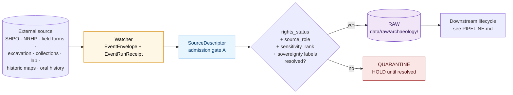
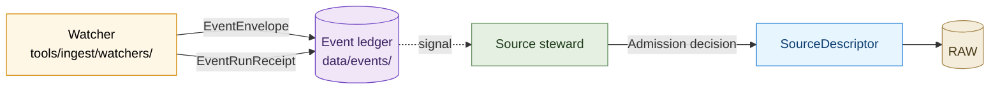

# Archaeology — Sources

> Canonical source-family catalogue for the archaeology lane: the eight archaeology source families from Atlas v1.1 §15.D, the `SourceDescriptor` contract that admits each one, the per-family source-role admission posture and sensitivity defaults, the HTTP-validator and watcher cadence, the authority crosswalks (KHRI ↔ NRHP ↔ SHPO ↔ local; Wikidata; SNAC; LCNAF; VIAF; Getty), and the admission and supersession rules that govern what may enter RAW.

<!-- [KFM_META_BLOCK_V2]
doc_id: kfm://doc/archaeology-sources
title: Archaeology — Sources
type: standard
version: v1
status: draft
owners: TODO — archaeology source steward; archaeology domain steward; sensitivity reviewer; rights-holder representative; AI surface steward; docs steward
created: 2026-05-28
updated: 2026-05-28
policy_label: public
related:
  - docs/doctrine/ai-build-operating-contract.md
  - docs/doctrine/directory-rules.md
  - docs/domains/archaeology/README.md                 # PROPOSED
  - docs/domains/archaeology/OBJECT_FAMILIES.md
  - docs/domains/archaeology/PIPELINE.md
  - docs/domains/archaeology/PRESERVATION_MATRIX.md
  - docs/domains/archaeology/PUBLICATION_AND_POLICY.md
  - docs/domains/archaeology/RELEASE_INDEX.md
  - docs/domains/archaeology/SENSITIVITY.md
  - docs/standards/SMART_SYNC.md                       # PROPOSED — Pass 10 C3 home
  - docs/runbooks/archaeology/source_refresh.md        # PROPOSED — per-family refresh
  - docs/runbooks/archaeology/sovereignty_review.md    # PROPOSED — SENSITIVITY §18
  - control_plane/source_authority_register.yaml      # PROPOSED — reviewer authority register
  - data/registry/archaeology/sources/                 # PROPOSED — SourceDescriptor ledger
  - schemas/contracts/v1/source_descriptor.schema.json # PROPOSED
  - policy/domains/archaeology/                        # PROPOSED — Rego bundle
  - tools/ingest/watchers/                             # PROPOSED — watcher home
tags: [kfm, domain, archaeology, sources, source-descriptor, doctrine, admission]
notes:
  - CONTRACT_VERSION pinned to "3.0.0"
  - Sensitive-domain doc; archaeology default tier is T4 (DENY) for site location, human remains, sacred sites.
  - All repo-state and path claims are PROPOSED until repo is mounted.
  - Companion to OBJECT_FAMILIES.md, PIPELINE.md, PRESERVATION_MATRIX.md, PUBLICATION_AND_POLICY.md, RELEASE_INDEX.md, and SENSITIVITY.md.
[/KFM_META_BLOCK_V2] -->


**Status:** draft &nbsp;·&nbsp; **Owners:** *TODO — archaeology source steward; archaeology domain steward; sensitivity reviewer; rights-holder rep; AI surface steward; docs steward* &nbsp;·&nbsp; **Last updated:** 2026-05-28
**`CONTRACT_VERSION = "3.0.0"`** _(per `docs/doctrine/ai-build-operating-contract.md`)._

> [!CAUTION]
> **Sensitive-domain lane — deny-by-default at admission.** Every archaeology source family carries `rights and current terms NEEDS VERIFICATION; sensitive joins fail closed` _(Atlas v1.1 §15.D, verbatim)_. No source enters `RAW` without a `SourceDescriptor` whose `rights_status`, `source_role`, `sensitivity_rank`, and (where applicable) `sovereignty:tribal` label are explicitly resolved. **Source role is fixed at admission and never upgraded by promotion.**

---

## Quick jump

- [1 · Scope and purpose](#1--scope-and-purpose)
- [2 · Authority and source hierarchy](#2--authority-and-source-hierarchy)
- [3 · The eight archaeology source families](#3--the-eight-archaeology-source-families)
- [4 · `SourceDescriptor` contract](#4--sourcedescriptor-contract)
- [5 · Source-role anti-collapse](#5--source-role-anti-collapse)
- [6 · Family 1 — State site inventory · SHPO / KHRI](#6--family-1--state-site-inventory--shpo--khri)
- [7 · Family 2 — Public NRHP-like listings](#7--family-2--public-nrhp-like-listings)
- [8 · Family 3 — Field survey forms](#8--family-3--field-survey-forms)
- [9 · Family 4 — Excavation records and provenience packets](#9--family-4--excavation-records-and-provenience-packets)
- [10 · Family 5 — Artifact / collection / repository records](#10--family-5--artifact--collection--repository-records)
- [11 · Family 6 — Lab reports](#11--family-6--lab-reports)
- [12 · Family 7 — Historic maps / plats / land records / newspapers](#12--family-7--historic-maps--plats--land-records--newspapers)
- [13 · Family 8 — Oral history and cultural knowledge](#13--family-8--oral-history-and-cultural-knowledge)
- [14 · Authority crosswalks](#14--authority-crosswalks)
- [15 · Source-watch cadence and CI probes](#15--source-watch-cadence-and-ci-probes)
- [16 · Admission posture summary](#16--admission-posture-summary)
- [17 · Supersession and source-stale rules](#17--supersession-and-source-stale-rules)
- [18 · Responsibility-root placement (PROPOSED)](#18--responsibility-root-placement-proposed)
- [19 · Worked admission walkthrough](#19--worked-admission-walkthrough)
- [Open questions register](#open-questions-register)
- [Open verification backlog](#open-verification-backlog)
- [Changelog v0 → v1](#changelog-v0--v1)
- [Definition of done](#definition-of-done)
- [Related docs](#related-docs)

---

## 1 · Scope and purpose

**CONFIRMED doctrine / PROPOSED implementation.**

This document is the **canonical source-family catalogue** for the archaeology lane. It is the seventh and final sibling in the archaeology lane docs. It is where every external source that may admit archaeology evidence into KFM is **named, characterized, and bound to a `SourceDescriptor` contract** before it ever enters `RAW`.

It pins down:

- The **eight archaeology source families** from Atlas v1.1 §15.D and their default admission posture.
- The **`SourceDescriptor` field contract** that admits each source.
- The **source-role anti-collapse** rule applied to each family.
- Per-family **rights / cadence / sensitivity / watcher** specification.
- **Authority crosswalks** (KHRI ↔ NRHP ↔ SHPO ↔ local; Wikidata; SNAC; LCNAF; VIAF; Getty).
- **HTTP-validator** strategy (ETag / Last-Modified / manifest checksum) per family.
- **Supersession and source-stale** rules per family.

It does **not** redefine:

- Object meaning — see [`OBJECT_FAMILIES.md`](./OBJECT_FAMILIES.md).
- The lifecycle / Gates A–G sequence — see [`PIPELINE.md`](./PIPELINE.md).
- The tier × transform decision matrix — see [`PRESERVATION_MATRIX.md`](./PRESERVATION_MATRIX.md).
- The governed-API surfaces and OPA deny rules — see [`PUBLICATION_AND_POLICY.md`](./PUBLICATION_AND_POLICY.md).
- The release-plane navigator — see [`RELEASE_INDEX.md`](./RELEASE_INDEX.md).
- The detailed transform catalogue and consent / sovereignty / revocation machinery — see [`SENSITIVITY.md`](./SENSITIVITY.md).

> [!IMPORTANT]
> This document is the **doctrine surface** for archaeology source admission. The actual `SourceDescriptor` ledger under `data/registry/archaeology/sources/` (PROPOSED) and the JSON schema at `schemas/contracts/v1/source_descriptor.schema.json` (PROPOSED) are the machine-readable counterparts that govern actual admission decisions. Where this doc and those artifacts disagree, the machine-readable artifact wins and the conflict is filed against `docs/registers/DRIFT_REGISTER.md` per Directory Rules §2.5.



**[⬆ Back to top](#archaeology--sources)**

---

## 2 · Authority and source hierarchy

| Layer | Source | Role for this document |
|---|---|---|
| **Operating law** | `docs/doctrine/ai-build-operating-contract.md` v3.0 | Pins `CONTRACT_VERSION = "3.0.0"`; governs rights / sensitivity invariants. |
| **Placement law** | `docs/doctrine/directory-rules.md` | Confirms `data/registry/`, `tools/ingest/`, `schemas/contracts/` placements. |
| **Domain doctrine** | Atlas v1.1 Ch. 15 — §D (key source families); §H (pipeline shape); §I (sensitivity / rights / publication); §N (verification backlog). | Canonical archaeology source-family list. |
| **Cross-cutting doctrine** | Atlas v1.1 §24.1 (source-role anti-collapse register); §24.2 (`SourceDescriptor` anchors every receipt); §24.5 (tier scheme); §24.7 (reviewer roles including **source steward**); §24.8 (stale-state markers). | Source-admission cross-cutting rules. |
| **Validator doctrine** | Components Pass 10 §C3 (event-driven ingestion, smart sync, conditional GETs); KFM-P1-PROG-0009 (HTTP validators as intake evidence); KFM-P18-PROG-0009 (conditional polling validator state); KFM-P1-PROG-0026 (CI source-health probes); KFM-P23-PROG-0033 (HTTP freshness state). | Watcher and validator pattern. |
| **Crosswalk doctrine** | KFM-P18-PROG-0034 (KHRI ↔ NRHP ↔ SHPO ↔ local crosswalk); Components Pass 10 §C7 (Wikidata, LCNAF, VIAF, ISNI, Getty ULAN/TGN, SNAC). | Authority crosswalks. |
| **Sovereignty inheritance** | KFM-P11-PROG-0025 (AIANNH / BIA AOI intersection). | Sovereignty label inheritance at admission. |
| **`SourceDescriptor` field shape** | Master MapLibre v2.1 §M (v1.6 / v1.9 / v2.0 / v2.1 updates); ENCY Appendix E. | Field-level contract. |

> [!NOTE]
> All paths under `data/registry/`, `tools/ingest/`, `schemas/contracts/`, `policy/`, `docs/runbooks/`, `docs/standards/`, and `control_plane/` named in this document are **PROPOSED**. None are claimed to exist in the live repository until verified.

**[⬆ Back to top](#archaeology--sources)**

---

## 3 · The eight archaeology source families

**CONFIRMED doctrine (Atlas v1.1 §15.D).** Atlas v1.1 enumerates exactly eight archaeology source families. Each one defaults to the same **per-family-row admission posture**: `authority / observation / context / model as source role requires`; `rights and current terms NEEDS VERIFICATION; sensitive joins fail closed`; `source-vintage or cadence specific`. _All four fields verbatim from §15.D._

| # | Family | Typical authority | Anchor section |
|---|---|---|---|
| 1 | **State site inventory · SHPO / equivalent** (Kansas: KHRI) | Kansas State Historical Society / KSHS-SHPO. | [§6](#6--family-1--state-site-inventory--shpo--khri) |
| 2 | **Public NRHP-like listings** | National Park Service · NRHP. | [§7](#7--family-2--public-nrhp-like-listings) |
| 3 | **Field survey forms** | CRM firms; academic projects; SHPO submissions. | [§8](#8--family-3--field-survey-forms) |
| 4 | **Excavation records and provenience packets** | Excavation principal investigators; project archives. | [§9](#9--family-4--excavation-records-and-provenience-packets) |
| 5 | **Artifact / collection / repository records** | Curating institutions; KSHS; KU NHM; university collections. | [§10](#10--family-5--artifact--collection--repository-records) |
| 6 | **Lab reports** | Specialist labs; radiocarbon facilities; OSL / TL labs; faunal / floral analysis. | [§11](#11--family-6--lab-reports) |
| 7 | **Historic maps / plats / land records / newspapers** | KSHS; National Archives; county registers; library archives. | [§12](#12--family-7--historic-maps--plats--land-records--newspapers) |
| 8 | **Oral history and cultural knowledge** | Tribal cultural authorities; community knowledge-holders; rights-holder representatives. | [§13](#13--family-8--oral-history-and-cultural-knowledge) |

> [!WARNING]
> **No source enters RAW with `source_role: "unknown"`.** Source role is fixed at admission by the source steward; a record without a resolved role is held at admission gate A (`SOURCE_ROLE_UNRESOLVED`). _See [§5](#5--source-role-anti-collapse) and Atlas v1.1 §24.1._

**[⬆ Back to top](#archaeology--sources)**

---

## 4 · `SourceDescriptor` contract

**CONFIRMED doctrine / PROPOSED schema (Atlas v1.1 §24.2.1; Master MapLibre §M; ENCY Appendix E).**

Every archaeology source admitted to KFM emits a `SourceDescriptor` that anchors every downstream receipt. The descriptor is **not optional** — if no descriptor exists, the source did not enter `RAW` in the governed sense.

### 4.1 Required fields

| Field | Type | Required? | Purpose |
|---|---|---|---|
| `object_type` | `"SourceDescriptor"` | MUST | Type discriminator. |
| `schema_version` | `"v1"` | MUST | Schema version. |
| `source_id` | string | MUST | Deterministic stable ID (e.g., `kfm:archaeology:source:khri:…`). |
| `source_family` | enum | MUST | One of the 8 families in §3 (e.g., `state_site_inventory`, `oral_history`). |
| `authority` | string | MUST | Issuing / publishing authority (e.g., `KSHS-SHPO`, `NPS-NRHP`). |
| `authority_role` | string | MUST | The authority's role in this source (e.g., `state_historic_preservation_office`, `tribal_cultural_authority`). |
| `source_role` | enum | MUST | **Fixed at admission.** One of: `observed`, `regulatory`, `modeled`, `aggregate`, `administrative`, `candidate`, `synthetic`. _See [§5](#5--source-role-anti-collapse)._ |
| `access_url` | URL | MUST when remote | Canonical access URL (HTTPS preferred). |
| `access_class` | enum | MUST | `public`, `authenticated`, `named_party_only`, `consent_bound`, `embargoed`. |
| `rights_status` | enum | MUST | `RESOLVED`, `NEEDS_VERIFICATION`, `UNRESOLVED`, `REVOKED`. |
| `rights_spdx` | string | MUST when `rights_status == RESOLVED` | SPDX identifier (e.g., `CC-BY-4.0`, `CC0-1.0`, `US-PD`, `ODbL-1.0`); `proprietary` allowed for named-party access. |
| `rights_holder` | string | MUST when sovereignty-controlled | Named rights-holder (e.g., `Tribal Nation`, `SHPO`, `Custodian`). |
| `consent_token_required` | boolean | MUST | `true` for oral-history / cultural-knowledge / named-party access. |
| `revocation_endpoint` | URL | MUST when `consent_token_required` | Per [`SENSITIVITY.md` §12](./SENSITIVITY.md#12--revocation-embargo-and-cache-invalidation). |
| `embargo_until` | datetime | MAY | Where applicable. |
| `sensitivity_rank` | integer 0–5 | MUST | Per-record sensitivity rubric per [`SENSITIVITY.md` §3](./SENSITIVITY.md#3--two-rubrics--audience-tier--per-record-rank). |
| `sovereignty_labels` | array | MUST when applicable | e.g., `["sovereignty:tribal"]`, `["sovereignty:state"]`, `["sovereignty:federal"]`. |
| `care_labels` | object | MUST when sensitivity ≥ 2 | The four CARE labels per [`SENSITIVITY.md` §4](./SENSITIVITY.md#4--care-principles-and-sovereignty-notice-chips). |
| `cadence` | string | MUST | Update / refresh cadence (e.g., `event-driven`, `weekly`, `quarterly`, `source-vintage`, `irregular`). |
| `freshness_tolerance` | string | MUST | How long the source may go un-rechecked before it is marked stale (e.g., `P30D`, `P1Y`). |
| `validator_state` | object | MUST when HTTP-accessible | `{ etag, last_modified, content_length, checksum, source_url, last_checked_utc }`. _See [§15](#15--source-watch-cadence-and-ci-probes)._ |
| `expected_geometry_form` | enum | MAY | `point`, `polygon`, `multi`, `none`, `aggregate`. |
| `expected_array_form` | enum | MAY | For raster / 3D sources. |
| `maplibre_tile_relevance` | enum | MAY | `none`, `style_only`, `tile_only`, `style_and_tile`. |
| `public_release_class` | enum | MUST | The maximum tier this source may release to **at any time** — most archaeology sources are `T4` or `T1_only_via_review`. |
| `crosswalks` | array | SHOULD | Authority crosswalks per [§14](#14--authority-crosswalks). |
| `pipeline_spec_ref` | string | MUST | Reference to the `pipeline_specs/archaeology/<family>/spec.yaml` (PROPOSED). |
| `ingest_hash` | string | MUST | Hash of the descriptor itself (JCS + SHA-256). |
| `admission_time_utc` | datetime | MUST | When admission completed. |
| `source_steward` | string | MUST | Named source steward who admitted the source. |
| `notes` | string | MAY | Free-text steward notes. |
| `signatures[]` | array | MUST | cosign / DSSE entries that bind the descriptor to its admission. |
| `contract_version` | string | MUST | KFM `CONTRACT_VERSION`. |

### 4.2 Source-role-specific fields (PROPOSED)

When `source_role` takes specific values, additional fields are required:

| `source_role` | Extra required field |
|---|---|
| `modeled` | `role_model_run_ref` → `ModelRunReceipt` (pins inputs, parameters, version). |
| `synthetic` | `role_synthetic_basis` → `{ method, inputs, reality_boundary_note_ref }`. |
| `candidate` | `role_candidate_disposition` ∈ `{ pending, merged, rejected, quarantined }` — **the PUBLISHED edge is forbidden until `merged`** (anti-collapse, §5). |
| `aggregate` | `role_aggregation_unit` (e.g., `county`, `h3:r7`); `role_minimum_count_guard`. |
| `regulatory` | `role_regulation_ref` (e.g., NHPA §106, NAGPRA reference). |

### 4.3 Determinism property

> [!IMPORTANT]
> A `SourceDescriptor` is **deterministic-identifiable**. Two admissions of the same source under the same authority, rights, cadence, and access class MUST produce descriptors whose `source_id` resolves to the same record. Re-admission of a source that has changed in any of those dimensions creates a **new descriptor** with a supersession link to the prior one ([§17](#17--supersession-and-source-stale-rules)).

**[⬆ Back to top](#archaeology--sources)**

---

## 5 · Source-role anti-collapse

**CONFIRMED doctrine (Atlas v1.1 §24.1).** Source role is the most consequential single field on a `SourceDescriptor`, because it controls how downstream evidence is interpreted, displayed, and bounded.

### 5.1 The source-role register for archaeology

| Role | Meaning in archaeology | Examples | Anti-collapse rule |
|---|---|---|---|
| `observed` | Direct observation of evidence by a competent observer (recorded artifact, recorded provenience, surveyed feature). | A field-recorded shovel test result; a measured artifact in a provenience packet. | Never produced by transform; only by direct observation receipt. |
| `regulatory` | Administrative determination by a competent authority. | NRHP listing; SHPO determination of eligibility; NHPA §106 finding. | Never auto-promoted to `observed`; carries its own evidence trail. |
| `modeled` | Computed by a documented model from inputs. | Site-prediction model output; LiDAR-derived microtopography classification. | MUST carry `ModelRunReceipt` (`role_model_run_ref`); never PUBLISHED as observation. |
| `aggregate` | Cell, region, or population summary; per-place identity removed. | County-level site count; H3 r7 survey-coverage cell density. | MUST NOT be queried as per-place observation. _See [`PUBLICATION_AND_POLICY.md` §5.1 `deny.aggregate_as_per_place`](./PUBLICATION_AND_POLICY.md#5--policy-as-code--deny--abstain--allow)._ |
| `administrative` | Administrative metadata about another record (e.g., loan status, custodian change). | Collection accession metadata; repository transfer record. | Never substitutes for the underlying object record. |
| `candidate` | Unconfirmed possible feature (anomaly, lead). | `RemoteSensingAnomaly`, `LiDARCandidate`, `GeophysicsObservation`. | **The PUBLISHED edge is forbidden until governed merge.** A candidate is NEVER silently promoted to `observed`. _See [§9.4 in this doc](#94-candidate-disposition-tracking)._ |
| `synthetic` | Reconstructed / interpolated / generated carrier. | Reconstructed 3D scene; AI-drafted summary; predicted ancestral-feature surface. | MUST carry `RealityBoundaryNote` + `RepresentationReceipt`. Never PUBLISHED as observation. |

### 5.2 The fixed-at-admission rule

> [!IMPORTANT]
> **Source role is fixed at admission and never upgraded by promotion.** A record admitted as `candidate` does not become `observed` by being generalized, released, or summarized. A record admitted as `modeled` does not become `observed` by being cited. A record admitted as `aggregate` does not become per-place by being clicked.
>
> **Role transitions** (e.g., candidate → observed when an excavation confirms a remote-sensing lead) are **separate governed events** with their own evidence, review, and a new `SourceDescriptor`. The old descriptor is retained with a supersession link.

### 5.3 The watcher-as-non-publisher invariant

**CONFIRMED doctrine (cross-cutting; ENCY §20.5).** Watchers (the entities that detect source changes) emit only `EventEnvelope` and `EventRunReceipt` records. **Watchers do not write to any other phase.** They never produce `SourceDescriptor`s, never write to `RAW`, and never bypass admission gate A.



**[⬆ Back to top](#archaeology--sources)**

---

## 6 · Family 1 — State site inventory · SHPO / KHRI

**CONFIRMED doctrine (Atlas v1.1 §15.D row 1; KFM-P18-PROG-0034).**

### 6.1 Identity and authority

| Field | Value (PROPOSED) |
|---|---|
| **Family ID** | `state_site_inventory` |
| **Kansas anchor** | **KHRI** — Kansas Historic Resources Inventory (KSHS-SHPO). |
| **Cross-state pattern** | Each state's SHPO maintains an equivalent inventory; the Kansas-first focus of KFM means KHRI is the primary anchor and other SHPO inventories are admitted under the same family pattern. |
| **Typical record** | A state-issued **trinomial** site number (e.g., Smithsonian-trinomial form `XX-YY-NNN`) bound to recorder, date, location, period, materials, condition, sensitivity flag. |
| **Authority role** | `state_historic_preservation_office`. |

### 6.2 Source-role admission posture

| Role | When it applies |
|---|---|
| `observed` | The inventory record itself (a SHPO professional recorded the site). |
| `regulatory` | When the same record carries a regulatory determination (eligibility, listing). |
| `administrative` | When the record carries collection-management metadata (custodian change, withdrawal). |

> [!CAUTION]
> **Many SHPO records bundle observed and regulatory roles.** KFM admits them as **separate `SourceDescriptor`s** when the underlying fields carry distinct trust posture; bundling them silently is a source-role-collapse risk.

### 6.3 Rights and sensitivity defaults

| Property | Default |
|---|---|
| `rights_status` | **`NEEDS_VERIFICATION`** until SHPO data-sharing agreement is confirmed (`OQ-ARCH-SRC-03`). |
| `rights_spdx` | Typically restricted; PROPOSED `proprietary` with named-party access until agreement. |
| `sensitivity_rank` | **5** by default for exact site location; reviewer-tier access for coarse-cell or aggregate. |
| `public_release_class` | **T1 only via generalization + sovereignty review**; T0 only for non-locational vocabulary (period names, etc.). |
| `consent_token_required` | `false` for the SHPO data itself; `true` when joined to oral-history overlays. |

### 6.4 Cadence and watcher strategy

| Aspect | Value |
|---|---|
| **Cadence** | `quarterly` (SHPO inventory updates are typically batch; exact cadence `NEEDS_VERIFICATION`). |
| **Watcher** | HTTP-validator watcher under `tools/ingest/watchers/archaeology_khri_watcher.py` (PROPOSED) per Pass 10 §C3-01. |
| **Validators** | ETag + Last-Modified + manifest checksum fallback. _See [§15](#15--source-watch-cadence-and-ci-probes)._ |
| **Freshness tolerance** | `P90D` (PROPOSED). |
| **CI probe** | Per KFM-P1-PROG-0026: source-health probe emits a `RunReceipt` for HEAD / ETag / Last-Modified checks; **does not treat endpoint availability as scientific or publication truth.** |

### 6.5 Crosswalks (mandatory for this family)

| Authority | Crosswalk field | Anchor |
|---|---|---|
| NRHP | `crosswalks[].nrhp_ref_no` | [§7](#7--family-2--public-nrhp-like-listings); KFM-P18-PROG-0034. |
| SHPO (other state) | `crosswalks[].shpo_id` | Where multi-state survey applies. |
| Local historic register | `crosswalks[].local_id` | County / municipal historic registers. |
| Wikidata QID | `crosswalks[].wikidata_qid` | C7-01 universal crosswalk. |
| SNAC ARK / EAC-CPF | `crosswalks[].snac_ark` | When archival-context applies. |
| Getty TGN | `crosswalks[].getty_tgn_id` | For historical place names. |

### 6.6 Per-family deny rules

| Rule (PROPOSED) | What it blocks |
|---|---|
| `deny.khri_exact_coords_to_public` | A KHRI record's exact site coordinates appearing on a T0 / T1 public surface. |
| `deny.khri_without_rights_resolved` | Admission of a KHRI source whose `rights_status` is `NEEDS_VERIFICATION` to any pipeline stage past RAW. |
| `deny.khri_to_synthetic_collapse` | A synthetic carrier framed as a KHRI-observed record. |

### 6.7 Example `SourceDescriptor` sketch (PROPOSED; values illustrative)

```json
{
  "object_type": "SourceDescriptor",
  "schema_version": "v1",
  "source_id": "kfm:archaeology:source:khri:vintage-2026Q1",
  "source_family": "state_site_inventory",
  "authority": "KSHS-SHPO",
  "authority_role": "state_historic_preservation_office",
  "source_role": "observed",
  "access_url": "https://(PROPOSED — KHRI access endpoint per agreement)",
  "access_class": "named_party_only",
  "rights_status": "NEEDS_VERIFICATION",
  "rights_holder": "Kansas State Historical Society",
  "consent_token_required": false,
  "sensitivity_rank": 5,
  "sovereignty_labels": [],
  "care_labels": { "collective_benefit": true, "authority_to_control": true, "responsibility": true, "ethics": true },
  "cadence": "quarterly",
  "freshness_tolerance": "P90D",
  "validator_state": { "etag": null, "last_modified": null, "checksum": null, "source_url": "…", "last_checked_utc": "…" },
  "expected_geometry_form": "point",
  "public_release_class": "T1_via_review",
  "crosswalks": [
    { "authority": "NRHP", "key": "nrhp_ref_no", "value": "(when applicable)" },
    { "authority": "wikidata", "key": "qid", "value": "(when applicable)" }
  ],
  "pipeline_spec_ref": "pipeline_specs/archaeology/state_site_inventory/spec.yaml",
  "ingest_hash": "(JCS+SHA-256 of canonical body)",
  "admission_time_utc": "…",
  "source_steward": "(TODO)",
  "signatures": ["(cosign / DSSE)"],
  "contract_version": "3.0.0"
}
```

**[⬆ Back to top](#archaeology--sources)**

---

## 7 · Family 2 — Public NRHP-like listings

**CONFIRMED doctrine (Atlas v1.1 §15.D row 2; KFM-P18-PROG-0034).**

### 7.1 Identity and authority

| Field | Value (PROPOSED) |
|---|---|
| **Family ID** | `public_nrhp_listings` |
| **Federal anchor** | **NRHP** — National Register of Historic Places (NPS). |
| **Typical record** | An NRHP reference number bound to property name, address (often public-address-only, not exact coordinates), period, listing date, criteria. |
| **Authority role** | `federal_historic_preservation_office`. |
| **Cross-pattern** | "NRHP-like" includes federal lists analogous to NRHP for non-state lands (e.g., National Historic Landmarks, World Heritage parallels where applicable). |

### 7.2 Source-role admission posture

| Role | When it applies |
|---|---|
| `regulatory` | The NRHP listing itself (a federal determination). |
| `administrative` | Listing-status changes, removals, boundary amendments. |

> [!NOTE]
> NRHP records are **regulatory by their nature** — they are not direct observation of the underlying site. The site itself is an `observed` record (potentially in family 1 or family 3); the NRHP listing is a regulatory record *about* the site. Both are admitted as separate `SourceDescriptor`s with crosswalks.

### 7.3 Rights and sensitivity defaults

| Property | Default |
|---|---|
| `rights_status` | **`RESOLVED`** in most cases (NRHP listings are public information). |
| `rights_spdx` | `US-PD` (federal government work). |
| `sensitivity_rank` | **2–3** for the listing record; **5** for any linked exact coordinates. |
| `public_release_class` | **T0–T1** for the listing fields (name, period, listing date); **never T0 for exact coordinates** even if NRHP discloses them. |

> [!CAUTION]
> NRHP listings sometimes include exact-coordinate fields. KFM does NOT inherit NRHP's disclosure posture for coordinates; **the archaeology lane's T4 default applies** regardless of upstream disclosure. _See [`SENSITIVITY.md` §5](./SENSITIVITY.md#5--the-archaeology-sensitive-register)._

### 7.4 Cadence and watcher strategy

| Aspect | Value |
|---|---|
| **Cadence** | `weekly` (NRHP weekly listings update; PROPOSED, `NEEDS_VERIFICATION`). |
| **Watcher** | `tools/ingest/watchers/archaeology_nrhp_watcher.py` (PROPOSED). |
| **Validators** | ETag + Last-Modified. |
| **Freshness tolerance** | `P30D` (PROPOSED). |

### 7.5 Crosswalks

| Authority | Crosswalk field |
|---|---|
| KHRI / SHPO | `crosswalks[].khri_trinomial` or equivalent. |
| Local historic register | `crosswalks[].local_id`. |
| Wikidata QID | `crosswalks[].wikidata_qid`. |
| Getty TGN | `crosswalks[].getty_tgn_id`. |
| LCNAF | `crosswalks[].lcnaf_id` for personal-name and corporate-name associations. |

### 7.6 Per-family deny rules

| Rule (PROPOSED) | What it blocks |
|---|---|
| `deny.nrhp_coords_inherit_public_class` | Treating NRHP's coordinate disclosure as a license to release at T0 / T1 in KFM. |
| `deny.nrhp_as_observed` | Treating an NRHP listing as direct observation of the site itself. |

**[⬆ Back to top](#archaeology--sources)**

---

## 8 · Family 3 — Field survey forms

**CONFIRMED doctrine (Atlas v1.1 §15.D row 3).**

### 8.1 Identity and authority

| Field | Value (PROPOSED) |
|---|---|
| **Family ID** | `field_survey_forms` |
| **Typical anchors** | CRM (Cultural Resource Management) firms; academic survey projects; SHPO survey-form submissions. |
| **Typical record** | A survey form bundling: project metadata, transect identifiers, shovel-test or surface-collection results, recorder, date, conditions, recommendations. |
| **Authority role** | `archaeological_survey_authority`. |

### 8.2 Source-role admission posture

| Role | When it applies |
|---|---|
| `observed` | The survey itself — what was seen, where, when, by whom. |
| `regulatory` | When the survey was conducted under §106 / NHPA mandate. |
| `administrative` | Project-level metadata. |

### 8.3 Rights and sensitivity defaults

| Property | Default |
|---|---|
| `rights_status` | **`NEEDS_VERIFICATION`**; survey-form rights vary by CRM firm and project agreement. |
| `rights_spdx` | Typically `proprietary` until agreement. |
| `sensitivity_rank` | **3–5** depending on what was found; covered surveys can release coverage summaries at rank 2. |
| `public_release_class` | **T1** as generalized survey-coverage summary; **T4** for per-transect or per-shovel-test results. |

### 8.4 Cadence and watcher strategy

| Aspect | Value |
|---|---|
| **Cadence** | `irregular` (survey forms are submitted on project completion; not continuous). |
| **Watcher** | Manual submission watcher (drop directory + steward review) under `tools/ingest/watchers/archaeology_survey_form_watcher.py` (PROPOSED). |
| **Validators** | Manifest checksum (no HTTP validator for submission-based intake). |
| **Freshness tolerance** | `P365D` per project; project completion is the natural freshness boundary. |

### 8.5 Crosswalks

| Authority | Crosswalk field |
|---|---|
| KHRI / SHPO | `crosswalks[].khri_trinomial` when the survey identifies recorded sites. |
| Project archive | `crosswalks[].project_archive_id`. |
| LCNAF | `crosswalks[].lcnaf_id` for the principal investigator. |

### 8.6 Per-family deny rules

| Rule (PROPOSED) | What it blocks |
|---|---|
| `deny.survey_per_transect_to_public` | Per-transect results appearing on a T0 / T1 surface. |
| `deny.survey_without_project_id` | Admission of a survey form without a resolvable project archive ID. |

**[⬆ Back to top](#archaeology--sources)**

---

## 9 · Family 4 — Excavation records and provenience packets

**CONFIRMED doctrine (Atlas v1.1 §15.D row 4).**

### 9.1 Identity and authority

| Field | Value (PROPOSED) |
|---|---|
| **Family ID** | `excavation_provenience` |
| **Typical anchor** | Excavation principal investigator; project archive; KSHS or university repository. |
| **Typical record** | Provenience packet: grid coordinates, depth, stratigraphic unit, feature association, recovery method, recorder, date. |
| **Authority role** | `excavation_principal_investigator` / `project_archive`. |

### 9.2 Source-role admission posture

| Role | When it applies |
|---|---|
| `observed` | The provenience record itself. |
| `administrative` | Project metadata, custody chain. |

### 9.3 Rights and sensitivity defaults

| Property | Default |
|---|---|
| `rights_status` | **`NEEDS_VERIFICATION`**; excavation records are often restricted by project agreement. |
| `rights_spdx` | Typically `proprietary` until agreement. |
| `sensitivity_rank` | **3–5**. Provenience packets at exact-grid coordinates are at minimum rank 3; provenience tied to human remains, burials, or sacred contexts is rank 5. |
| `public_release_class` | **T2 reviewer** (default) → **T1** only via generalization + `RedactionReceipt` per [`SENSITIVITY.md` §6.1](./SENSITIVITY.md#61-proposed-archaeology-profile-catalogue) profile `kfm:archaeology:provenience-redacted@v1`. |

### 9.4 Candidate disposition tracking

When the same provenience record is referenced by a candidate-feature workflow (e.g., a LiDAR candidate awaiting excavation confirmation), KFM tracks both as **distinct `SourceDescriptor`s** with `role_candidate_disposition` on the candidate side:

| Disposition | Meaning |
|---|---|
| `pending` | Candidate exists; no observation confirms or refutes yet. PUBLISHED edge **forbidden**. |
| `merged` | Excavation confirmed the candidate; a new `observed` descriptor is admitted and the candidate descriptor is retained with a supersession link. PUBLISHED edge **permitted** for the observed descriptor. |
| `rejected` | Excavation refuted the candidate. Candidate descriptor superseded with rejection lineage; no PUBLISHED edge on the original candidate hypothesis. |
| `quarantined` | Insufficient evidence to confirm or refute; held. |

> [!IMPORTANT]
> **A candidate is not a site.** Even when an excavation strongly suggests confirmation, the role transition is a **separate governed event** that creates a new `SourceDescriptor`. Silent in-place upgrading is a deny-rule violation (`deny.candidate_as_site`).

### 9.5 Cadence and watcher strategy

| Aspect | Value |
|---|---|
| **Cadence** | `irregular`; project-submission driven. |
| **Watcher** | `tools/ingest/watchers/archaeology_excavation_watcher.py` (PROPOSED). |
| **Validators** | Manifest checksum on packet ingest. |

### 9.6 Per-family deny rules

| Rule (PROPOSED) | What it blocks |
|---|---|
| `deny.provenience_exact_grid_to_public` | Exact grid coordinates appearing on any T0 / T1 surface. |
| `deny.provenience_human_remains_to_public` | Any release of provenience joined to human-remains context, regardless of generalization. |
| `deny.candidate_as_site` | Candidate disposition silently treated as observed site. |

**[⬆ Back to top](#archaeology--sources)**

---

## 10 · Family 5 — Artifact / collection / repository records

**CONFIRMED doctrine (Atlas v1.1 §15.D row 5).**

### 10.1 Identity and authority

| Field | Value (PROPOSED) |
|---|---|
| **Family ID** | `artifact_collection_repository` |
| **Typical anchors** | Kansas State Historical Society; KU Museum of Natural History; KU Anthropological Research and Cultural Collections; tribal cultural repositories; CRM firm collections. |
| **Typical record** | Accession ID; artifact catalog entry; repository custody record; condition / loan / disposition history. |
| **Authority role** | `curating_institution`. |

### 10.2 Source-role admission posture

| Role | When it applies |
|---|---|
| `observed` | The cataloged artifact entry. |
| `administrative` | Custody chain, loan / disposition records, condition updates. |
| `regulatory` | NAGPRA-related determinations and inventories. |

### 10.3 Rights and sensitivity defaults

| Property | Default |
|---|---|
| `rights_status` | **`NEEDS_VERIFICATION`**; varies by institution and accession agreement. |
| `rights_spdx` | Typically `proprietary` until agreement. |
| `sensitivity_rank` | **3** for the catalog record itself; **4–5** when joined to repository location or current condition (collection security). |
| `public_release_class` | **T2** for catalog metadata under steward agreement; **T3** for repository-security records (named-party only); **T1** for aggregate counts only. |

> [!CAUTION]
> **Collection security joins fail closed.** Public surfaces never join an artifact catalog record to repository location or loan status. _See [`PUBLICATION_AND_POLICY.md` §5.1 `deny.collection_security_join`](./PUBLICATION_AND_POLICY.md#5--policy-as-code--deny--abstain--allow)._

### 10.4 NAGPRA discipline

When an artifact / collection record falls within NAGPRA scope (Native American Graves Protection and Repatriation Act):

- The descriptor MUST carry `sovereignty_labels: ["sovereignty:tribal"]` regardless of AOI intersection.
- Admission requires sign-off from the rights-holder representative for the affected tribal authority.
- `public_release_class` defaults to T4 with sovereignty review for any public-facing transform.

### 10.5 Cadence and watcher strategy

| Aspect | Value |
|---|---|
| **Cadence** | `quarterly` (catalog updates are typically batch); custody changes are event-driven. |
| **Watcher** | `tools/ingest/watchers/archaeology_collection_watcher.py` (PROPOSED). |
| **Validators** | ETag + Last-Modified where institutions expose HTTP feeds; manifest checksum otherwise. |

### 10.6 Per-family deny rules

| Rule (PROPOSED) | What it blocks |
|---|---|
| `deny.collection_security_join` | Public join of artifact catalog to repository location. |
| `deny.nagpra_without_tribal_rep` | Admission of a NAGPRA-scope record without rights-holder representative sign-off. |
| `deny.accession_to_provenience_collapse` | Treating an accession ID as a provenience identifier. |

**[⬆ Back to top](#archaeology--sources)**

---

## 11 · Family 6 — Lab reports

**CONFIRMED doctrine (Atlas v1.1 §15.D row 6).**

### 11.1 Identity and authority

| Field | Value (PROPOSED) |
|---|---|
| **Family ID** | `lab_reports` |
| **Typical anchors** | Radiocarbon labs; OSL / TL labs; archaeobotanical labs; faunal-analysis labs; lithic-source labs. |
| **Typical record** | Lab report with sample ID, method, calibration, result, uncertainty, methodology version. |
| **Authority role** | `specialist_lab`. |

### 11.2 Source-role admission posture

| Role | When it applies |
|---|---|
| `observed` | The lab measurement itself (e.g., a radiocarbon date). |
| `modeled` | Calibrated date (calibration is a model applied to the measurement). |

> [!IMPORTANT]
> **Raw measurement and calibrated date are admitted as distinct descriptors** with crosswalks between them. The calibration model has its own `ModelRunReceipt` (calibration curve version, software, parameters). Conflating measurement and calibration is a source-role-collapse risk.

### 11.3 Rights and sensitivity defaults

| Property | Default |
|---|---|
| `rights_status` | **`NEEDS_VERIFICATION`**; lab reports are typically owned by the project submitting the sample. |
| `rights_spdx` | Typically `proprietary` until agreement; sometimes `CC-BY-4.0` for published reports. |
| `sensitivity_rank` | **2–3** for the measurement; rank propagates from the site context (a date for a sacred-context sample inherits rank 5). |
| `public_release_class` | **T1** for the measurement value with sample-anonymized context; **T4** when sample context is sensitive. |

### 11.4 Cadence and watcher strategy

| Aspect | Value |
|---|---|
| **Cadence** | `event-driven` (per-sample). |
| **Watcher** | Submission watcher + lab-vendor integration where available; `tools/ingest/watchers/archaeology_lab_watcher.py` (PROPOSED). |
| **Validators** | Per-report manifest checksum. |

### 11.5 Crosswalks

| Authority | Crosswalk field |
|---|---|
| Site descriptor | `crosswalks[].site_source_id`. |
| Calibration curve | `crosswalks[].calibration_curve_id` (e.g., IntCal20). |
| Lab accession | `crosswalks[].lab_accession_id`. |

### 11.6 Per-family deny rules

| Rule (PROPOSED) | What it blocks |
|---|---|
| `deny.calibration_as_measurement` | Treating a calibrated date as direct observation. |
| `deny.lab_to_site_collapse` | Joining a lab measurement to its site context without preserving the site's sensitivity rank. |

**[⬆ Back to top](#archaeology--sources)**

---

## 12 · Family 7 — Historic maps / plats / land records / newspapers

**CONFIRMED doctrine (Atlas v1.1 §15.D row 7).**

### 12.1 Identity and authority

| Field | Value (PROPOSED) |
|---|---|
| **Family ID** | `historic_documentary` |
| **Typical anchors** | Kansas State Historical Society; Library of Congress; National Archives; county registers of deeds; newspaper archives (Newspapers.com, Chronicling America, local archives). |
| **Typical record** | Historic map (georeferenced or not); plat / survey; deed / patent; newspaper article. |
| **Authority role** | `library_archive` / `government_archive` / `commercial_archive`. |

### 12.2 Source-role admission posture

| Role | When it applies |
|---|---|
| `observed` | Direct contemporary observation in the historical record itself (e.g., a surveyor's measured plat). |
| `context` | Most historical documentation is contextual, not observational, for archaeology purposes. |
| `regulatory` | Historic deeds, patents, county records are regulatory records. |
| `administrative` | Custody and provenance chain of the document itself. |

> [!NOTE]
> **`context` role is admissible but rare.** KFM's anti-collapse register names seven primary roles in §5.1; `context` is treated as an extension applicable mainly to this family. The role is documented as PROPOSED and is an open ADR (`OQ-ARCH-SRC-04`).

### 12.3 Rights and sensitivity defaults

| Property | Default |
|---|---|
| `rights_status` | Varies widely: `RESOLVED` for public-domain pre-1929 US works (per current US copyright term); `NEEDS_VERIFICATION` for later works; institution-specific for archives. |
| `rights_spdx` | `US-PD` for public-domain; otherwise institution-specific. |
| `sensitivity_rank` | **0–2** for the document itself; rank propagates upward when joined to sensitive site context. |
| `public_release_class` | **T0** for the document; **T1 / T2** for derivatives that join the document to site location. |

### 12.4 IIIF / Allmaps overlays

When historic maps are admitted as IIIF / Allmaps georeferenced overlays:

- Carry georeference evidence per KFM-P9-FEAT-0016 (rights evidence + georeference receipts).
- The overlay's accuracy and the source map's rights are recorded distinctly.

### 12.5 Cadence and watcher strategy

| Aspect | Value |
|---|---|
| **Cadence** | `source-vintage` for historical content (no new updates); `event-driven` for newly digitized accessions. |
| **Watcher** | Per-archive watcher (KSHS, LoC, NARA, Chronicling America); `tools/ingest/watchers/archaeology_historic_doc_watcher.py` (PROPOSED). |
| **Validators** | ETag + Last-Modified for online archives; manifest checksum for digitization batches. |

### 12.6 Crosswalks

| Authority | Crosswalk field |
|---|---|
| Wikidata QID | `crosswalks[].wikidata_qid` for documents with QIDs. |
| LCNAF | `crosswalks[].lcnaf_id` for named authors / creators. |
| VIAF | `crosswalks[].viaf_id` for international author clusters. |
| Getty TGN | `crosswalks[].getty_tgn_id` for historical place names. |
| SNAC ARK | `crosswalks[].snac_ark` for archival-context. |
| IIIF Manifest | `crosswalks[].iiif_manifest_url`. |

### 12.7 Per-family deny rules

| Rule (PROPOSED) | What it blocks |
|---|---|
| `deny.historic_doc_unjoined_rights_inheritance` | Joining a historic document to a sensitive site without inheriting the site's sensitivity rank. |
| `deny.iiif_without_rights_evidence` | IIIF overlay admission without `rights_status` resolution per KFM-P9-FEAT-0016. |

**[⬆ Back to top](#archaeology--sources)**

---

## 13 · Family 8 — Oral history and cultural knowledge

**CONFIRMED doctrine (Atlas v1.1 §15.D row 8; ENCY §13; KFM-P1-IDEA-0034).**

### 13.1 Identity and authority

| Field | Value (PROPOSED) |
|---|---|
| **Family ID** | `oral_history_cultural` |
| **Typical anchors** | Tribal cultural authorities; community knowledge-holders; cultural-authority-named research collaborators; documented community releases. |
| **Typical record** | Recorded oral history; documented cultural-knowledge release; community-authorized cultural-affiliation statement. |
| **Authority role** | `tribal_cultural_authority` / `community_knowledge_holder`. |

> [!CAUTION]
> **This family is the most sensitive in the lane.** Every admission requires sovereignty-aware review per [`SENSITIVITY.md` §18](./SENSITIVITY.md#18--sovereignty-review-workflow); every release requires the rights-holder representative's sign-off; every retained record exposes a `revocation_endpoint`.

### 13.2 Source-role admission posture

| Role | When it applies |
|---|---|
| `observed` | The oral-history recording or documented cultural release itself. |
| `regulatory` | Sovereignty-bearing cultural-authority determinations (e.g., cultural-affiliation finding). |
| `administrative` | Consent record updates; revocation events. |

### 13.3 Rights and sensitivity defaults

| Property | Default |
|---|---|
| `rights_status` | **`UNRESOLVED`** until explicit consent terms are documented; admission fails closed until resolved. |
| `rights_spdx` | Typically `proprietary` (sovereignty-controlled). |
| `rights_holder` | Named tribal nation or cultural authority. |
| `sovereignty_labels` | **`["sovereignty:tribal"]` by default** (or other named sovereign). |
| `consent_token_required` | **`true`** for any access; tokens follow [`SENSITIVITY.md` §11](./SENSITIVITY.md#11--consent-tokens--jwt-and-ga4gh-aai). |
| `sensitivity_rank` | **5 by default**. |
| `public_release_class` | **T4** by default; **T3 named-agreement** only with explicit rights-holder representative sign-off; **T0–T1 public derivative** ONLY when the cultural authority explicitly releases derivative content. |

### 13.4 Consent and revocation discipline

- Consent terms documented at admission; mapped to DUO codes per [`SENSITIVITY.md` §11.3](./SENSITIVITY.md#11--consent-tokens--jwt-and-ga4gh-aai).
- `revocation_endpoint` is **mandatory** and introspected on every render.
- Revocation triggers: tombstone (§13 of `SENSITIVITY.md`), cache invalidation (§12 of `SENSITIVITY.md`), demotion of all derived records to T4 via `CorrectionNotice`.
- Embargo timestamps supported and respected as date-based DENY gates.

### 13.5 Cadence and watcher strategy

| Aspect | Value |
|---|---|
| **Cadence** | `irregular` (admission is rights-holder-driven, not watcher-driven). |
| **Watcher** | **No automatic watcher.** Admission is by **rights-holder-initiated** workflow per [`SENSITIVITY.md` §18.2](./SENSITIVITY.md#18--sovereignty-review-workflow). The runbook lives at `docs/runbooks/archaeology/sovereignty_review.md` (PROPOSED). |
| **Validators** | Consent-token introspection on every render. |

> [!WARNING]
> **No automated polling for this family.** Watcher-driven admission is forbidden for oral history and cultural knowledge. Admission is always **initiated by the rights-holder** and gated by the sovereignty review workflow.

### 13.6 Crosswalks

| Authority | Crosswalk field |
|---|---|
| Tribal cultural authority register | `crosswalks[].tribal_authority_ref` (internal, controlled). |
| SNAC ARK | `crosswalks[].snac_ark` when archival context exists. |
| LCNAF | `crosswalks[].lcnaf_id` where the cultural authority is registered. |
| Wikidata QID | `crosswalks[].wikidata_qid` for known cultural authorities (subject to authority approval). |

### 13.7 Per-family deny rules

| Rule (PROPOSED) | What it blocks |
|---|---|
| `deny.oral_history_without_consent` | Admission of an oral-history source without a resolved consent token. _See [`PUBLICATION_AND_POLICY.md` §5.1](./PUBLICATION_AND_POLICY.md#5--policy-as-code--deny--abstain--allow)._ |
| `deny.oral_history_to_public_without_release` | Derivative release without explicit cultural-authority release. |
| `deny.oral_history_automated_watcher` | Any automated polling watcher for this family. |
| `deny.oral_history_revocation_unreachable_to_render` | Render when `revocation_endpoint` is unreachable (fail-closed per Pass 10 §C6-08). |

**[⬆ Back to top](#archaeology--sources)**

---

## 14 · Authority crosswalks

**CONFIRMED doctrine (KFM-P18-PROG-0034; Components Pass 10 §C7-01..06).**

KFM crosswalks archaeology authorities so that the same place, person, or property can be navigated across multiple authority registers without source-role collapse.

### 14.1 The authority ladder for archaeology

| Tier | Authority | Role | Identifier pattern |
|---|---|---|---|
| **Kansas-first anchors** | KHRI (KSHS-SHPO) | Primary state-side identity for archaeology sites. | trinomial `XX-YY-NNN`. |
| | KSHS collections | Curating-institution identity. | Accession ID. |
| | KU NHM / KU collections | Curating-institution identity. | Accession ID. |
| **National anchors** | NRHP | Federal listing identity. | NRHP reference number. |
| | NAGPRA inventories | Federal repatriation identity. | NAGPRA case ID. |
| **Universal crosswalks** | Wikidata QID | Universal identifier router across authorities (C7-01). | `Q…`. |
| | LCNAF | US-canonical name authority for persons / corporate bodies (C7-02). | LCCN. |
| | VIAF | International name authority cluster (C7-03). | VIAF ID. |
| | ISNI | ISO 27729 standard name identifier (C7-04). | ISNI URI. |
| | Getty ULAN / TGN | Cultural-heritage authority for artists and historical places (C7-05). | ULAN / TGN ID. |
| | SNAC + EAC-CPF | Archival-context authority cooperative (C7-06). | SNAC ARK. |
| | IIIF Manifest | Digital-object identifier for georeferenced imagery. | URL. |

### 14.2 Crosswalk arbitration

When two authorities disagree on the identity of a record (e.g., KHRI trinomial X is crosswalked to NRHP reference Y by one source and NRHP reference Z by another), KFM follows:

1. **Wikidata QID** as universal router (C7-01) when both authorities map cleanly to the same QID.
2. **SHPO determination** wins for state-side site identity.
3. **NRHP determination** wins for federal listing identity.
4. **Tribal cultural authority** wins for sovereignty-bearing identity decisions.

> [!IMPORTANT]
> **Crosswalk arbitration never overrides sovereignty.** When a tribal cultural authority's identity assertion conflicts with another authority's record, the sovereignty determination wins regardless of the universal-router answer. _See [`SENSITIVITY.md` §10](./SENSITIVITY.md#10--sovereignty-label-inheritance)._

### 14.3 Per-record crosswalk fields

Every `SourceDescriptor` carries a `crosswalks[]` array. Each element:

```json
{
  "authority": "(authority code, e.g. NRHP)",
  "key": "(field name, e.g. nrhp_ref_no)",
  "value": "(opaque identifier)",
  "confidence": "(exact | high | medium | low)",
  "evidence_ref": "(reference to crosswalk evidence)"
}
```

**[⬆ Back to top](#archaeology--sources)**

---

## 15 · Source-watch cadence and CI probes

**CONFIRMED doctrine (Pass 10 §C3-01; KFM-P1-PROG-0009; KFM-P18-PROG-0009; KFM-P1-PROG-0026; KFM-P23-PROG-0033).**

### 15.1 The validator stack

The corpus recommends a **layered validator approach**:

1. **HTTP validators first** — `ETag` / `If-None-Match`; `Last-Modified` / `If-Modified-Since`.
2. **Manifest checksums second** — SHA-256 over a canonical manifest (used when validators are absent or weak).
3. **Push-based object-store events third** — S3 ObjectCreated / GCS Pub/Sub for sources hosted on object stores.
4. **Change-data-capture fourth** — for database-backed sources where pull semantics don't fit.

### 15.2 Per-family validator strategy

| Family | Primary validator | Fallback | Watcher cadence (PROPOSED) | Freshness tolerance (PROPOSED) |
|---|---|---|---|---|
| State site inventory · SHPO / KHRI | ETag | Manifest checksum | `quarterly` | `P90D` |
| Public NRHP-like listings | ETag | Last-Modified | `weekly` | `P30D` |
| Field survey forms | Manifest checksum | (submission-driven) | `irregular` | `P365D` |
| Excavation records | Manifest checksum | (submission-driven) | `irregular` | `P365D` |
| Artifact / collection / repository | ETag | Manifest checksum | `quarterly` | `P180D` |
| Lab reports | Manifest checksum | (event-driven per sample) | `event-driven` | `P30D` per sample |
| Historic maps / plats / records / newspapers | ETag | Last-Modified | `monthly` | `P90D` |
| Oral history / cultural | **(no automated watcher)** | rights-holder-initiated | rights-holder-driven | rights-holder-driven |

### 15.3 Watcher receipt discipline

Every watcher invocation emits:

- An **`EventEnvelope`** describing the watcher invocation, the source, the validator state observed.
- An **`EventRunReceipt`** with the watcher's tool versions, inputs, outputs, hashes, commit, SBOM, telemetry.

Watchers do **not** write `SourceDescriptor`s. Watchers do **not** write to `RAW`. Watchers do **not** decide admission. _See [§5.3](#53-the-watcher-as-non-publisher-invariant)._

### 15.4 CI source-health probes

Per KFM-P1-PROG-0026:

- CI probes record source validators and receipts for HEAD / ETag / Last-Modified checks.
- **Endpoint availability is NOT treated as scientific or publication truth.** A source returning 200 OK does not mean its content is valid; a source returning 304 Not Modified does not constitute evidence of no change beyond what the validator covers.
- Probes fail only according to **explicit policy thresholds**, not on the first miss.

### 15.5 Stale-state detection

A source family's `freshness_tolerance` is enforced:

- After the tolerance expires without a refresh, the source is marked `stale_source` per [`PUBLICATION_AND_POLICY.md` §10.1](./PUBLICATION_AND_POLICY.md#10--stale-state-and-supersession).
- Stale sources surface a stale-source badge in the Evidence Drawer.
- Dependent published records inherit the stale badge until the source is re-admitted or superseded.

**[⬆ Back to top](#archaeology--sources)**

---

## 16 · Admission posture summary

**CONFIRMED doctrine (Atlas v1.1 §15.H; PIPELINE.md §3 Gate A).**

Gate A (admission) closes only when **all** of the following are true for an archaeology source:

1. `SourceDescriptor` exists with every required field of §4.1.
2. `rights_status` ∈ `{ RESOLVED }` (NOT `NEEDS_VERIFICATION` for any pipeline stage past RAW).
3. `source_role` is set to a non-`unknown` value from §5.1.
4. `sensitivity_rank` is set (0–5).
5. `sovereignty_labels` are set when applicable (AOI intersection check per [`SENSITIVITY.md` §10](./SENSITIVITY.md#10--sovereignty-label-inheritance)).
6. `consent_token_required` is set; where `true`, `revocation_endpoint` is set.
7. `source_steward` is named.
8. The descriptor is signed (cosign / DSSE).
9. `contract_version` matches the current KFM `CONTRACT_VERSION`.
10. The descriptor's `ingest_hash` is computed deterministically.

**Failure to satisfy any of (1)–(10) holds the source at admission gate A with one of these reason codes:**

| Reason code (PROPOSED) | Cause |
|---|---|
| `MISSING_SOURCE_DESCRIPTOR` | No descriptor exists. |
| `RIGHTS_UNKNOWN` | `rights_status` is not `RESOLVED`. |
| `SOURCE_ROLE_UNRESOLVED` | `source_role` not set or set to `unknown`. |
| `SENSITIVITY_UNRESOLVED` | `sensitivity_rank` not set. |
| `SOVEREIGNTY_REVIEW_REQUIRED` | AOI intersects sovereign overlay; no rights-holder rep sign-off. |
| `CONSENT_MISSING` | `consent_token_required: true` but no revocation endpoint. |
| `STEWARD_UNNAMED` | No `source_steward`. |
| `SIGNATURE_INVALID` | cosign / DSSE signature verification failed. |
| `CONTRACT_VERSION_MISMATCH` | Descriptor's `contract_version` ≠ current KFM `CONTRACT_VERSION`. |
| `INGEST_HASH_MISMATCH` | Recomputed hash does not match stored hash. |

**[⬆ Back to top](#archaeology--sources)**

---

## 17 · Supersession and source-stale rules

**CONFIRMED doctrine (Atlas v1.1 §24.8).**

### 17.1 Supersession

A `SourceDescriptor` is superseded — not edited — when any of its admission-fixed fields change:

| Field change | Required action |
|---|---|
| `authority`, `authority_role`, `source_role` | **New descriptor** with `superseded_by` link to prior; prior descriptor retained for audit. |
| `rights_status` (e.g., `RESOLVED` → `REVOKED`) | New descriptor recording the change; old retained; cascade revocation per `SENSITIVITY.md` §12. |
| `access_url`, `access_class`, `cadence`, `freshness_tolerance` | New descriptor with `superseded_by` link. |
| `consent_token_required`, `revocation_endpoint` | New descriptor; full consent / revocation review. |
| `sensitivity_rank`, `sovereignty_labels` | New descriptor; downstream records inherit the new sensitivity posture. |

### 17.2 Source-stale rules per family

| Family | When stale | When wrong |
|---|---|---|
| State site inventory · SHPO / KHRI | No re-admission within `P90D`. | Records found inconsistent with current SHPO determination. |
| Public NRHP-like listings | No re-admission within `P30D`. | Listing removal / boundary amendment. |
| Field survey forms | Source-vintage; stale by project age. | Recorder retraction. |
| Excavation records | Source-vintage. | Provenience-packet correction issued by project. |
| Artifact / collection / repository | No re-admission within `P180D`. | Custody change; condition update; NAGPRA finding. |
| Lab reports | Per-sample. | Calibration curve update (e.g., IntCal20 → IntCal26); methodology revision. |
| Historic documentary | Source-vintage. | Rights-status change in the holding archive. |
| Oral history / cultural | Rights-holder-driven. | Consent revoked; sovereignty revoked. |

> [!IMPORTANT]
> **Stale is not wrong.** A stale source still produces released claims that were correct at release time; a wrong source requires a `CorrectionNotice`. The two states have distinct UI badges and distinct lifecycles. _See [`PUBLICATION_AND_POLICY.md` §10](./PUBLICATION_AND_POLICY.md#10--stale-state-and-supersession)._

**[⬆ Back to top](#archaeology--sources)**

---

## 18 · Responsibility-root placement (PROPOSED)

**PROPOSED** under Directory Rules §4 Step 3 and Atlas v1.1 §2.1 row 15:

```text
docs/domains/archaeology/
  ├── README.md                              # PROPOSED
  ├── OBJECT_FAMILIES.md                     # CONFIRMED draft sibling
  ├── PIPELINE.md                            # CONFIRMED draft sibling
  ├── PRESERVATION_MATRIX.md                 # CONFIRMED draft sibling (v0.2)
  ├── PUBLICATION_AND_POLICY.md              # CONFIRMED draft sibling
  ├── RELEASE_INDEX.md                       # CONFIRMED draft sibling (v2)
  ├── SENSITIVITY.md                         # CONFIRMED draft sibling
  └── SOURCES.md                             # this file

data/registry/archaeology/sources/           # PROPOSED — SourceDescriptor ledger
  ├── state_site_inventory/
  ├── public_nrhp_listings/
  ├── field_survey_forms/
  ├── excavation_provenience/
  ├── artifact_collection_repository/
  ├── lab_reports/
  ├── historic_documentary/
  └── oral_history_cultural/

tools/ingest/watchers/                       # PROPOSED — watcher home (Pass 10 C3)
  ├── archaeology_khri_watcher.py
  ├── archaeology_nrhp_watcher.py
  ├── archaeology_survey_form_watcher.py
  ├── archaeology_excavation_watcher.py
  ├── archaeology_collection_watcher.py
  ├── archaeology_lab_watcher.py
  └── archaeology_historic_doc_watcher.py
  # (No watcher for oral history — rights-holder-initiated only.)

pipeline_specs/archaeology/                  # PROPOSED — per-family pipeline specs
  ├── state_site_inventory/spec.yaml
  ├── public_nrhp_listings/spec.yaml
  ├── field_survey_forms/spec.yaml
  ├── excavation_provenience/spec.yaml
  ├── artifact_collection_repository/spec.yaml
  ├── lab_reports/spec.yaml
  ├── historic_documentary/spec.yaml
  └── oral_history_cultural/spec.yaml

schemas/contracts/v1/
  └── source_descriptor.schema.json          # PROPOSED — §4 contract

docs/standards/
  └── SMART_SYNC.md                          # PROPOSED — Pass 10 C3 watcher pattern

docs/runbooks/archaeology/
  ├── source_refresh.md                      # PROPOSED — per-family refresh
  └── sovereignty_review.md                  # PROPOSED — Family 8 admission workflow

policy/domains/archaeology/                  # PROPOSED — Rego bundle (see PUBLICATION_AND_POLICY.md)

control_plane/source_authority_register.yaml # PROPOSED — reviewer / source steward register
```

> [!NOTE]
> Atlas v1.1 §2.1 row 15 names `contracts/archaeology/` and `schemas/contracts/v1/archaeology/` in flat form; Directory Rules §4 Step 3 illustrates `schemas/contracts/v1/domains/<domain>/`. The reconciliation is tracked as `OQ-ARCH-SRC-07` (same question raised in all sibling docs).

**[⬆ Back to top](#archaeology--sources)**

---

## 19 · Worked admission walkthrough

The walk-through below threads §4–§16 into a single end-to-end source admission. Values are illustrative; this is not a record of a real admission.

> [!NOTE]
> **Example.** The Kansas State Historical Society is publishing a quarterly KHRI refresh. The source steward must admit the updated batch into `RAW` for downstream processing.

### 19.1 Twelve-step admission trace

| Step | Action | Section | Receipts emitted |
|---|---|---|---|
| **1.** | The KHRI watcher (`tools/ingest/watchers/archaeology_khri_watcher.py`) detects an ETag change at the KHRI access endpoint. | §15.2 | `EventEnvelope` + `EventRunReceipt`. |
| **2.** | The watcher emits an event to the event ledger; **does not write `SourceDescriptor`, does not write to RAW**. | §5.3 | (Event ledger record only.) |
| **3.** | The source steward is notified by the event ledger. The steward opens the admission workflow. | §16 | None yet. |
| **4.** | The steward inspects the change: are `authority`, `authority_role`, `rights_status`, `consent_token_required`, `sovereignty_labels` unchanged? | §17.1 | Steward review log. |
| **5.** | Assume one field changed: a recently confirmed AIANNH boundary refinement now intersects a previously-non-sovereign AOI in a subset of records. Sovereignty inheritance fires per [`SENSITIVITY.md` §10](./SENSITIVITY.md#10--sovereignty-label-inheritance). | §13; §16.5 | Sovereignty inheritance trigger logged. |
| **6.** | The steward escalates the affected subset to the sovereignty review workflow per [`SENSITIVITY.md` §18.2](./SENSITIVITY.md#18--sovereignty-review-workflow). The remainder of the batch proceeds normally. | §13 | `ReviewRecord` (sovereignty review). |
| **7.** | For the non-sovereign subset, the steward composes a new `SourceDescriptor` with `superseded_by` link to the prior descriptor (`kfm:archaeology:source:khri:vintage-2025Q4`). The new descriptor is `kfm:archaeology:source:khri:vintage-2026Q1`. | §17.1 | New `SourceDescriptor`. |
| **8.** | All required fields of §4.1 are populated: `source_role: "observed"`, `rights_status: "RESOLVED"` (assumes prior SHPO agreement holds), `sensitivity_rank: 5`, `cadence: "quarterly"`, etc. The descriptor is hashed (`ingest_hash`) and signed (cosign / DSSE). | §4; §16 | Signature receipts. |
| **9.** | Admission gate A evaluates: all ten closure conditions pass. The descriptor admits the source to `RAW`. | §16 | `PolicyDecision` (admission ALLOW). |
| **10.** | For the sovereign subset (step 6): admission is **held** at gate A with reason `SOVEREIGNTY_REVIEW_REQUIRED` until the rights-holder representative completes review. | §16; §13.5 | Hold record + `ReviewRecord`. |
| **11.** | The watcher's `EventRunReceipt` is updated to reference both the admitted descriptor and the held subset. The event ledger is closed for this poll. | §15.3 | Updated `EventRunReceipt`. |
| **12.** | Downstream pipeline (per [`PIPELINE.md`](./PIPELINE.md)) consumes the admitted descriptor from `RAW`. The held subset waits at gate A until sovereignty review completes; no downstream work proceeds for the held records. | §16; [`PIPELINE.md` §3](./PIPELINE.md#3--lifecycle-backbone) | Downstream receipts as work proceeds. |

### 19.2 What this trace prevents

| Risk | How the source-admission stack blocks it |
|---|---|
| Watcher writes silent updates to RAW. | Watcher-as-non-publisher invariant (§5.3); no watcher path to RAW. |
| Source admitted with unresolved sovereignty. | Sovereignty inheritance check at admission gate A (§16, step 5); held subset waits for rights-holder review. |
| Same source's quarterly refresh silently mutates the prior descriptor. | Supersession rule (§17.1); new descriptor with `superseded_by` link. |
| Source role silently upgrades from candidate to observed across admissions. | Source role is fixed at admission (§5.2); role transitions are separate governed events. |
| Endpoint availability treated as scientific truth. | CI source-health probes do not treat 200/304 as truth (§15.4). |
| Crosswalk arbitration overrides sovereignty. | Sovereignty wins regardless of universal-router answer (§14.2). |

**[⬆ Back to top](#archaeology--sources)**

---

## Open questions register

| ID | Question | Owner role | Resolution path |
|---|---|---|---|
| `OQ-ARCH-SRC-01` | What is the **canonical KHRI access endpoint and data-sharing agreement** under which Kansas-first archaeology sources are admitted? | Source steward + rights-holder rep (KSHS-SHPO) | Author / sign data-sharing agreement; populate `data/registry/archaeology/sources/state_site_inventory/`. |
| `OQ-ARCH-SRC-02` | What is the **canonical NRHP API or bulk-download endpoint** that supports HTTP validators? | Source steward + CI owner | Verify against NPS public endpoints; pin in watcher config. |
| `OQ-ARCH-SRC-03` | What is the **SHPO data-sharing agreement** scope, term, and renewal cadence? Same question applies to other state SHPOs admitted under the same family. | Source steward + rights-holder rep | Author / sign agreement; record in `control_plane/source_authority_register.yaml`. |
| `OQ-ARCH-SRC-04` | Is the `context` source-role admissible as a peer of the seven roles in §5.1 (for the historic-documentary family), or should historic context records use `observed` / `regulatory` / `administrative` exclusively? | Domain steward + schema-home owner | ADR — pair with Atlas v1.1 §24.12 ADR-S-04 (source-role vocabulary). |
| `OQ-ARCH-SRC-05` | What is the **oral-history / cultural-knowledge admission protocol** — exact workflow, required artifacts, signatures, retention rules — for the archaeology lane? | Rights-holder rep + sensitivity reviewer + docs steward | Author `docs/runbooks/archaeology/sovereignty_review.md`; cross-link to `SENSITIVITY.md` §18. |
| `OQ-ARCH-SRC-06` | Which **crosswalk authority wins** when KHRI, NRHP, and a local register disagree on a property identity? KFM-P18-PROG-0034 specifies the crosswalk but does not pin arbitration. | Domain steward + docs steward | ADR — formalize §14.2 arbitration rule. |
| `OQ-ARCH-SRC-07` | Does the archaeology lane use flat `schemas/contracts/v1/archaeology/` (per Atlas v1.1 §2.1 row 15) or segmented `schemas/contracts/v1/domains/archaeology/` (per Directory Rules §4 Step 3)? Same question tracked in all sibling docs. | Directory Rules owner + docs steward | ADR — reconcile §2.1 row 15 with §4 Step 3. |
| `OQ-ARCH-SRC-08` | What are the **per-family watcher cadence SLAs** in production? The PROPOSED cadences in §15.2 are starting points; live tuning is required. | CI owner + source steward | Pilot per family; document in `docs/standards/SMART_SYNC.md`. |
| `OQ-ARCH-SRC-09` | How is the **`source_descriptor.schema.json`** validated against fixtures? Which fixtures cover each of the eight families? | Schema-home owner + CI owner | Author fixtures under `fixtures/domains/archaeology/sources/` (PROPOSED). |
| `OQ-ARCH-SRC-10` | What is the **retention rule for superseded `SourceDescriptor`s**? Indefinite? Time-bounded? | Docs steward + release authority | ADR — pair with Pass 10 §C5-09 tombstone retention question. |
| `OQ-ARCH-SRC-11` | Should each **lab-report calibration update** (e.g., IntCal20 → IntCal26) automatically cascade a `CorrectionNotice` against downstream calibrated dates, or should the cascade be steward-initiated? | Domain steward + correction reviewer | ADR. |
| `OQ-ARCH-SRC-12` | What is the **canonical SPDX allowlist** for archaeology sources? Components Pass 10 C5-02 names CC0-1.0 and CC-BY-4.0; should ODbL-1.0, PDDL, US-PD also be allowlisted, and what about `proprietary` for named-party access? | Policy owner + docs steward | ADR; pin in `policy/domains/archaeology/`. |

## Open verification backlog

These items remain `NEEDS VERIFICATION` before promotion from `draft` to `published`:

1. Mounted-repo inspection of `data/registry/archaeology/sources/`, `tools/ingest/watchers/`, `pipeline_specs/archaeology/`, `schemas/contracts/v1/source_descriptor.schema.json`, `docs/standards/SMART_SYNC.md`, `docs/runbooks/archaeology/source_refresh.md`, `docs/runbooks/archaeology/sovereignty_review.md`, `control_plane/source_authority_register.yaml`.
2. Confirmation of the KHRI access endpoint, data-sharing agreement, and rights status (`OQ-ARCH-SRC-01` / `OQ-ARCH-SRC-03`).
3. Confirmation of NRHP API / bulk-download endpoint and validator support (`OQ-ARCH-SRC-02`).
4. Confirmation of per-family watcher cadences in production (`OQ-ARCH-SRC-08`).
5. Confirmation that watchers do not write `SourceDescriptor`s, do not write to `RAW`, and do not bypass admission gate A (watcher-as-non-publisher invariant, §5.3).
6. Confirmation of the source-role vocabulary (seven roles per §5.1; `context` admissibility per `OQ-ARCH-SRC-04`).
7. Confirmation of the oral-history admission runbook and rights-holder representative roster (`OQ-ARCH-SRC-05`).
8. Confirmation of the canonical SPDX allowlist (`OQ-ARCH-SRC-12`).
9. Wiring of the planned `GENERATED_RECEIPT.json` into CI before merge.
10. Cross-document consistency review between this file and the six sibling archaeology docs for shared object classes, gates, transforms, tiers, deny rules, review roles, and reason codes.

## Changelog v0 → v1

| Change | Type (per contract §37) | Reason |
|---|---|---|
| New file at `docs/domains/archaeology/SOURCES.md`. | new | Per-domain source-family catalogue did not previously exist; consolidates Atlas v1.1 §15.D (eight families) with KFM-P18-PROG-0034 (KHRI ↔ NRHP ↔ SHPO crosswalk), Components Pass 10 §C3 (smart sync), §C7 (authority crosswalks), KFM-P1-PROG-0009 / KFM-P18-PROG-0009 / KFM-P1-PROG-0026 / KFM-P23-PROG-0033 (HTTP validator and CI probe doctrine), KFM-P11-PROG-0025 (sovereignty inheritance), KFM-P9-FEAT-0016 (IIIF rights evidence), Master MapLibre v2.1 §M (SourceDescriptor fields) into a single archaeology-lane view. |
| Pinned `CONTRACT_VERSION = "3.0.0"` in meta block, badge row, and footer. | clarification | Doctrine-adjacent docs MUST pin the contract version. |
| Adopted segmented `data/registry/archaeology/sources/`, `policy/domains/archaeology/`, `pipeline_specs/archaeology/` placement. | clarification | Aligns with Directory Rules §4 Step 3; flagged as drift against Atlas v1.1 §2.1 row 15 in `OQ-ARCH-SRC-07`. |
| Made the **`SourceDescriptor` contract** explicit (§4). | gap closure | Atlas v1.1 §24.2.1 lists `SourceDescriptor` at the family level; this doc pins the field-level shape with 28+ fields, determinism property, and source-role-specific fields. |
| Made the **source-role anti-collapse** rule explicit per family (§5; §§6–13). | gap closure | Atlas v1.1 §24.1 specifies the rule; this doc binds it to each of the eight archaeology source families and to the watcher-as-non-publisher invariant. |
| Made the **per-family deep dives** explicit (§§6–13). | gap closure | Atlas v1.1 §15.D lists the families with identical posture; this doc differentiates them with per-family identity, role posture, rights, sensitivity, watcher strategy, crosswalks, deny rules, and example descriptors. |
| Made the **authority crosswalk ladder** explicit (§14). | gap closure | KFM-P18-PROG-0034 specifies the crosswalk pattern; Pass 10 §C7 specifies the universal anchors; this doc consolidates them into a Kansas-first ladder with arbitration rules and per-record fields. |
| Made the **per-family watcher cadence and CI probe** rules explicit (§15). | gap closure | Pass 10 §C3 specifies the validator stack; KFM-P1-PROG-0026 specifies the probe discipline; this doc binds them to each archaeology family with PROPOSED cadences and freshness tolerances. |
| Made the **admission posture summary** explicit (§16) with ten closure conditions and reason codes. | gap closure | Atlas v1.1 §15.H lists `SourceDescriptor exists` as the RAW-stage gate; this doc decomposes the gate into ten conditions and a reason-code catalog. |
| Made the **supersession and source-stale** rules explicit per family (§17). | gap closure | Atlas v1.1 §24.8 specifies stale-state markers at the cross-cutting level; this doc binds them per family. |
| Added a **worked admission walkthrough** (§19). | gap closure | Mirrors the worked-workflow pattern in the sibling docs; threads §4–§16 into one concrete admission path with sovereignty escalation. |

> **Backward compatibility.** This is a new file; no anchors are at risk. Future edits SHOULD preserve anchors under §1–§19 to keep cross-links stable. The eight family IDs (`state_site_inventory`, `public_nrhp_listings`, `field_survey_forms`, `excavation_provenience`, `artifact_collection_repository`, `lab_reports`, `historic_documentary`, `oral_history_cultural`), the source-role names in §5.1, and the closure-condition reason codes in §16 MUST NOT be renamed without an accepted ADR.

## Definition of done

This document is done enough to enter the repository when:

- it is placed at `docs/domains/archaeology/SOURCES.md` per Directory Rules §4 Step 3 and Atlas v1.1 §2.1 row 15;
- archaeology source steward, archaeology domain steward, sensitivity reviewer, AI surface steward, release authority, correction reviewer, and docs steward have reviewed it;
- a sovereignty / cultural-authority reviewer has reviewed and signed off (sensitive domain — mandatory);
- it is linked from `docs/domains/archaeology/README.md` (PROPOSED) and from a sources or source-authority index under `docs/doctrine/` or `control_plane/`;
- it is consistent with the six sibling archaeology docs ([`OBJECT_FAMILIES.md`](./OBJECT_FAMILIES.md), [`PIPELINE.md`](./PIPELINE.md), [`PRESERVATION_MATRIX.md`](./PRESERVATION_MATRIX.md), [`PUBLICATION_AND_POLICY.md`](./PUBLICATION_AND_POLICY.md), [`RELEASE_INDEX.md`](./RELEASE_INDEX.md), [`SENSITIVITY.md`](./SENSITIVITY.md)) for shared object classes, gates, transforms, tiers, deny rules, and review roles;
- the eight per-family pipeline specs under `pipeline_specs/archaeology/<family>/spec.yaml` have been authored at least to a skeleton state;
- the `source_descriptor.schema.json` has been authored at `schemas/contracts/v1/`;
- the `docs/runbooks/archaeology/source_refresh.md` and `docs/runbooks/archaeology/sovereignty_review.md` have been authored;
- it does not conflict with accepted ADRs (specifically ADR-0001 schema canonicality, Atlas v1.1 §24.12 ADR-S-01 schema home, ADR-S-03 receipt class home, ADR-S-04 source-role vocabulary, ADR-S-05 tier scheme);
- any conflict with current repo conventions is logged in `docs/registers/DRIFT_REGISTER.md`;
- the planned `GENERATED_RECEIPT.json` is wired into CI;
- future changes follow the operating contract's §37 lifecycle.

---

## Related docs

- [`docs/doctrine/ai-build-operating-contract.md`](../../doctrine/ai-build-operating-contract.md) — v3.0 operating law (`CONTRACT_VERSION = "3.0.0"`).
- [`docs/doctrine/directory-rules.md`](../../doctrine/directory-rules.md) — Placement law; §4 Step 3, §6.1, §9 release/data planes, §15 README contract.
- [`docs/domains/archaeology/README.md`](./README.md) — *(PROPOSED — link target)* domain landing.
- [`docs/domains/archaeology/OBJECT_FAMILIES.md`](./OBJECT_FAMILIES.md) — Identity-bearing archaeology objects.
- [`docs/domains/archaeology/PIPELINE.md`](./PIPELINE.md) — Lifecycle and Gates A–G.
- [`docs/domains/archaeology/PRESERVATION_MATRIX.md`](./PRESERVATION_MATRIX.md) — Tier × transform decision matrix.
- [`docs/domains/archaeology/PUBLICATION_AND_POLICY.md`](./PUBLICATION_AND_POLICY.md) — Governed-API / OPA-deny / `ReleaseManifest` / SoD / correction / rollback / stale-state / audit.
- [`docs/domains/archaeology/RELEASE_INDEX.md`](./RELEASE_INDEX.md) — Release-plane navigator.
- [`docs/domains/archaeology/SENSITIVITY.md`](./SENSITIVITY.md) — Detailed transform catalogue; CARE labels; consent; sovereignty review workflow.
- [`docs/standards/SMART_SYNC.md`](../../standards/SMART_SYNC.md) — *(PROPOSED — link target)* Pass 10 §C3 smart-sync / HTTP-validator pattern.
- [`docs/runbooks/archaeology/source_refresh.md`](../../runbooks/archaeology/source_refresh.md) — *(PROPOSED — link target)* per-family source refresh runbook.
- [`docs/runbooks/archaeology/sovereignty_review.md`](../../runbooks/archaeology/sovereignty_review.md) — *(PROPOSED — link target)* sovereignty review workflow (admission, revocation, escalation).
- [`docs/registers/DRIFT_REGISTER.md`](../../registers/DRIFT_REGISTER.md) — *(PROPOSED — link target)* drift register.
- [`schemas/contracts/v1/source_descriptor.schema.json`](../../../schemas/contracts/v1/source_descriptor.schema.json) — *(PROPOSED)* `SourceDescriptor` schema home.
- [`control_plane/source_authority_register.yaml`](../../../control_plane/source_authority_register.yaml) — *(PROPOSED)* source steward + reviewer authority register.
- Atlas v1.1 Ch. 15 §D (key source families), §H (pipeline shape), §I (sensitivity / rights), §N (verification backlog).
- Atlas v1.1 §24.1 (source-role anti-collapse register), §24.2 (`SourceDescriptor` and receipt catalog), §24.5 (tiers), §24.7 (reviewer roles), §24.8 (stale-state / supersession).
- KFM Components Pass 10 §C3-01..04 (HTTP validators, manifest checksums, S3 events, debounce); §C5-02 (default-deny via signed receipts); §C7-01..06 (Wikidata, LCNAF, VIAF, ISNI, Getty ULAN/TGN, SNAC EAC-CPF); §C5-09 (tombstones for revocation).
- Pass-32 seed cards: KFM-P1-PROG-0009 (HTTP validators as intake evidence); KFM-P18-PROG-0009 (conditional polling validator state); KFM-P1-PROG-0026 (CI probes with source heads and run receipts); KFM-P23-PROG-0033 (HTTP freshness state); KFM-P18-PROG-0034 (KHRI ↔ NRHP ↔ SHPO crosswalk); KFM-P11-PROG-0025 (tribal sovereignty label inheritance); KFM-P9-PROG-0060 (SAR sovereignty / mask / lineage); KFM-P9-FEAT-0016 (IIIF / Allmaps rights / georeference).

---

_Last updated: 2026-05-28 · `CONTRACT_VERSION = "3.0.0"` · Version v1 (draft)_
_Next review trigger: KHRI / NRHP / SHPO data-sharing agreement confirmation; authoring of `schemas/contracts/v1/source_descriptor.schema.json`; first mounted-repo inspection of `data/registry/archaeology/sources/`._

[⬆ Back to top](#archaeology--sources)
