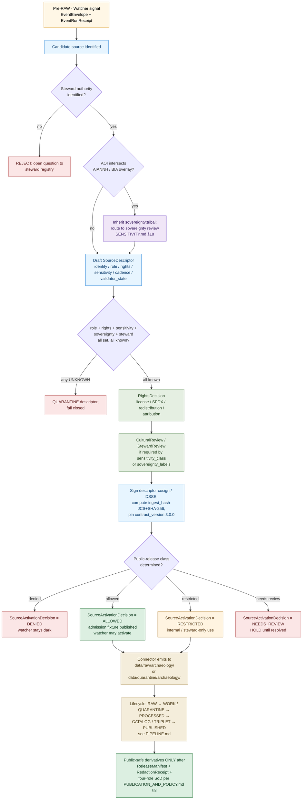

<!-- [KFM_META_BLOCK_V2]
doc_id: kfm://doc/archaeology/SOURCE_REGISTRY
title: Archaeology Source Registry — Human Guide
type: standard
version: v0.2
status: draft
owners: <archaeology-source-steward> · <archaeology-domain-steward> · <sensitivity-reviewer> · <rights-holder-representative> · <release-authority> · <docs-steward>   # NEEDS VERIFICATION — assign via CODEOWNERS / control_plane/source_authority_register.yaml before promotion
created: 2026-05-15
updated: 2026-05-28
policy_label: public
related:
  - docs/doctrine/ai-build-operating-contract.md
  - docs/doctrine/directory-rules.md
  - docs/doctrine/truth-posture.md
  - docs/doctrine/trust-membrane.md
  - docs/doctrine/lifecycle-law.md
  - docs/domains/archaeology/README.md                  # PROPOSED — link target
  - docs/domains/archaeology/OBJECT_FAMILIES.md
  - docs/domains/archaeology/PIPELINE.md
  - docs/domains/archaeology/PRESERVATION_MATRIX.md
  - docs/domains/archaeology/PUBLICATION_AND_POLICY.md
  - docs/domains/archaeology/RELEASE_INDEX.md
  - docs/domains/archaeology/SENSITIVITY.md
  - docs/domains/archaeology/SOURCES.md                  # CONFIRMED draft sibling — source-family catalogue
  - docs/domains/archaeology/CULTURAL_REVIEW.md          # PROPOSED — link target
  - docs/sources/SOURCE_DESCRIPTOR_STANDARD.md           # PROPOSED — link target
  - docs/standards/SMART_SYNC.md                         # PROPOSED — Pass 10 §C3 home
  - docs/runbooks/archaeology/source_refresh.md          # PROPOSED — per-family refresh
  - docs/runbooks/archaeology/sovereignty_review.md      # PROPOSED — SENSITIVITY §18
  - docs/adr/ADR-0001-schema-home.md
  - docs/adr/ADR-archaeology-source-roles.md             # PROPOSED — pairs with Atlas v1.1 §24.12 ADR-S-04
  - docs/adr/ADR-archaeology-exact-location-policy.md    # PROPOSED — pairs with OQ-ARCH-S-01 / RI-02 / PIPE-03 / PM-03
  - docs/registers/VERIFICATION_BACKLOG.md               # PROPOSED — aging admission backlog
  - docs/registers/DRIFT_REGISTER.md                     # PROPOSED — drift between guide and YAML
  - docs/registers/OVERRIDE_REGISTER.md                  # PROPOSED — KFM-P3-IDEA-0003
  - data/registry/sources/archaeology/sources.yaml
  - data/registry/sources/archaeology/source_roles.yaml
  - data/registry/sources/archaeology/sensitivity_policies.yaml
  - data/registry/sources/archaeology/rights_profiles.yaml
  - data/registry/sources/archaeology/steward_authorities.yaml
  - data/published/layers/archaeology/layer_registry.yaml
  - schemas/contracts/v1/source/source-descriptor.json   # PROPOSED — canonical schema home
  - schemas/contracts/v1/source/source-activation-decision.json   # PROPOSED
  - tools/ingest/watchers/                               # PROPOSED — watcher home
  - control_plane/source_authority_register.yaml         # PROPOSED — reviewer authority register
tags: [kfm, archaeology, registry, sources, governance, evidence, sensitivity, doctrine, admission]
notes:
  - CONTRACT_VERSION pinned to "3.0.0".
  - Companion doc; machine truth lives in data/registry/sources/archaeology/*.yaml.
  - All listed candidate source families are PROPOSED / NEEDS VERIFICATION.
  - Exact site geometry is DENY by default; cultural / sovereignty / steward review governs disclosure.
  - This file is the **human guide** to the source registry; SOURCES.md is the **source-family catalogue**. The two are companion docs and MUST agree.
[/KFM_META_BLOCK_V2] -->

# Archaeology Source Registry — Human Guide

> **Companion to `data/registry/sources/archaeology/*.yaml`.** This document
> explains what the Archaeology source registry **is**, how to **read** its
> descriptors, how to **add or change** an entry, and which gates **fail closed**
> when a descriptor is incomplete, when a source role is ambiguous, or when
> sensitivity, rights, or steward review is unresolved. The YAML is the
> **machine truth**. [`SOURCES.md`](./SOURCES.md) is the **source-family
> catalogue**. This file is the **human admission contract**.

<!-- Top-of-file impact block -->

[](#1-purpose)
[](#changelog-v01--v02)
[](../../doctrine/ai-build-operating-contract.md)
[](#)
[](./README.md)
[](../../doctrine/truth-posture.md)
[](../../doctrine/truth-posture.md)
[](#7-sensitivity-register)
[](#6-source-roles-for-archaeology)
[](#9-admission-flow--sourceactivationdecision)
[](#7-sensitivity-register)
[](#3-repo-fit)
[](#)

**Status:** `draft` · **Version:** `v0.2` · **Owners:** archaeology source steward · archaeology domain steward · sensitivity reviewer · rights-holder representative · release authority · docs steward *(placeholders — confirm via CODEOWNERS)* · **Last updated:** 2026-05-28
**`CONTRACT_VERSION = "3.0.0"`** _(per [`docs/doctrine/ai-build-operating-contract.md`](../../doctrine/ai-build-operating-contract.md))._

> [!IMPORTANT]
> The Archaeology lane operates under **deny-by-default exposure**. Exact site
> coordinates, sacred or burial-associated locations, human-remains contexts,
> private-landowner geometry, and collection-security details **MUST NOT**
> appear on any public surface, in any AI response, or in any export — at any
> zoom or coordinate precision — without a recorded `CulturalReview` /
> `StewardReview`, a `SensitivityTransform`, and a `RedactionReceipt`.
> *(CONFIRMED doctrine — implementation maturity PROPOSED.)*

> [!CAUTION]
> **Sensitive-domain lane — four-role release-time separation of duties.** Any
> archaeology release sourced from a record admitted via this registry is
> sensitive-lane by default. Release authority is **distinct from authorship**:
> author + sensitivity reviewer + release authority + rights-holder representative.
> _See [`PUBLICATION_AND_POLICY.md` §8](./PUBLICATION_AND_POLICY.md) and
> [`SENSITIVITY.md` §18](./SENSITIVITY.md)._

---

## Mini-TOC

- [1. Purpose](#1-purpose)
- [2. Scope & boundary](#2-scope--boundary)
- [3. Repo fit](#3-repo-fit)
- [4. How to read this registry](#4-how-to-read-this-registry)
- [5. SourceDescriptor field surface](#5-sourcedescriptor-field-surface)
- [6. Source roles for archaeology](#6-source-roles-for-archaeology)
- [7. Sensitivity register](#7-sensitivity-register)
- [8. Candidate source families](#8-candidate-source-families)
- [9. Admission flow & SourceActivationDecision](#9-admission-flow--sourceactivationdecision)
- [10. Anti-collapse failure modes](#10-anti-collapse-failure-modes)
- [11. Verification ladder](#11-verification-ladder)
- [12. Publication-eligibility ladder](#12-publication-eligibility-ladder)
- [13. Adding or changing a descriptor](#13-adding-or-changing-a-descriptor)
- [14. Open questions / verification backlog](#14-open-questions--verification-backlog)
- [15. Related docs](#15-related-docs)
- [Changelog v0.1 → v0.2](#changelog-v01--v02)
- [Definition of done](#definition-of-done)

---

## 1. Purpose

The Archaeology source registry is an **admission and authority-control surface**,
not a bibliography. *(CONFIRMED doctrine — see Directory Rules §11, source-registry
architecture.)* It records, for every source the Archaeology lane intends to
consume:

- **identity** (`source_id`, authoring body, persistent reference, `ingest_hash`);
- **source role** (`observed` · `regulatory` · `modeled` · `aggregate` · `administrative` · `candidate` · `synthetic`) — **fixed at admission and never upgraded by promotion**;
- **rights posture** (license, attribution, redistribution, embargo, SPDX);
- **access method** (file drop, restricted API, harvested PDF, MOU, steward-mediated) and HTTP-validator state (`etag`, `last_modified`, `content_length`, `checksum`);
- **update cadence** and freshness expectations (`cadence`, `freshness_tolerance`);
- **steward authority** (SHPO, tribal authority, repository, lab, university, agency) and `source_steward` name;
- **sensitivity classification** (per-record `sensitivity_rank` 0–5 × audience tier T0–T4 crosswalk; see [`SENSITIVITY.md` §3](./SENSITIVITY.md));
- **public-release class** (eligible for public-safe derivatives, restricted view only, or denied);
- **sovereignty inheritance** (AIANNH / BIA AOI intersection per [`SENSITIVITY.md` §10](./SENSITIVITY.md));
- **consent / revocation** machinery (token, revocation endpoint, embargo) when applicable;
- **attribution / citation guidance**;
- **crosswalks** (KHRI ↔ NRHP ↔ SHPO ↔ local; Wikidata; SNAC; LCNAF; VIAF; Getty ULAN/TGN).

The registry exists so that no archaeological material — site form, survey
record, anomaly, candidate feature, 3D model, oral-history transcript, or
collection accession — can shape a public claim before it has been **admitted,
quarantined, restricted, or denied** by an explicit `SourceActivationDecision`.
*(CONFIRMED doctrine; specific schema fields and file paths PROPOSED.)*

> [!NOTE]
> **What this registry is not.** It is not the place where sites, surveys, or
> artifacts live (those are canonical lane objects under
> `data/processed/archaeology/` and downstream lifecycle phases — PROPOSED paths,
> see [`OBJECT_FAMILIES.md`](./OBJECT_FAMILIES.md) and
> [`PIPELINE.md`](./PIPELINE.md)). It is not a publication queue — that role
> belongs to [`RELEASE_INDEX.md`](./RELEASE_INDEX.md). It is not a citation
> generator. It is the gate **upstream** of all of those.

> [!NOTE]
> **Relationship to `SOURCES.md`.** [`SOURCES.md`](./SOURCES.md) is the
> **source-family catalogue** — it specifies the eight archaeology source
> families from Atlas v1.1 §15.D, per-family identity / authority / rights /
> sensitivity / watcher / crosswalks, and the `SourceDescriptor` field-level
> contract. This guide is the **admission contract** — how a descriptor moves
> through the activation gates, how the verification ladder works, how
> publication eligibility is gated, and how to add / correct / retire a
> descriptor. The two docs are companions; when they conflict, file against
> `docs/registers/DRIFT_REGISTER.md`.

[↑ Back to top](#archaeology-source-registry--human-guide)

---

## 2. Scope & boundary

| What this registry governs | What this registry does **not** govern |
|---|---|
| Admission and activation of archaeological data sources. | Storage of canonical site, survey, artifact, or context records. |
| Source role, rights, cadence, sensitivity, steward authority, sovereignty inheritance. | Schema shape of archaeology objects (lives under `schemas/contracts/v1/domains/archaeology/…` — PROPOSED). |
| Public-release class per source. | Specific publication decisions on individual sites (those are `PromotionDecision` / `ReleaseManifest` artifacts; see [`PUBLICATION_AND_POLICY.md`](./PUBLICATION_AND_POLICY.md)). |
| Steward / cultural / sovereignty review requirements at admission. | Per-feature review queues (those are `ReviewRecord` artifacts in the lifecycle). |
| Attribution and citation guidance for downstream surfaces. | The text of citations themselves (rendered by the governed API and Evidence Drawer; see [`PUBLICATION_AND_POLICY.md` §4](./PUBLICATION_AND_POLICY.md)). |
| Sensitivity-class assignment that drives `SensitivityTransform`s. | Per-publication redaction parameters (those are recorded in the `RedactionReceipt`; profile catalogue is in [`SENSITIVITY.md` §6](./SENSITIVITY.md)). |
| HTTP-validator state (ETag / Last-Modified / manifest checksum) per source. | Per-tile / per-render runtime validators (those belong to the governed API / Evidence Drawer). |
| Watcher cadence and CI source-health probe configuration. | Per-pipeline-run receipts (those are `RunReceipt` artifacts; see [`PIPELINE.md`](./PIPELINE.md)). |

The Archaeology lane **owns** *(per [`OBJECT_FAMILIES.md`](./OBJECT_FAMILIES.md))*:
`ArchaeologicalSite`, `SiteComponent`, `CulturalTemporalPeriod`, `SurveyProject`,
`SurveyTransect`, `ShovelTest`, `TestUnit`, `ExcavationUnit`,
`ProvenienceContext`, `StratigraphicUnit`, `ArtifactRecord`,
`CollectionRepositoryRecord`, `CandidateFeature`, `RemoteSensingAnomaly`,
`LiDARCandidate`, `GeophysicsObservation`, `ThreeDDocumentation`,
`ChronologyAssertion`, `CulturalReview`, `StewardReview`,
`PublicationTransformReceipt`, `SensitivityTransform`. *(CONFIRMED doctrine from
DOM-ARCH / ENCY — field realization PROPOSED.)*

The Archaeology lane **does not own** (other lanes provide context): Roads /
Rail; People / Land; Geology; Hazards; Spatial Foundation. Context from those
lanes **cannot** confirm a site or bypass archaeological sensitivity rules.
*(CONFIRMED doctrine — see Atlas v1.1 §15.F cross-lane relations and
[`PRESERVATION_MATRIX.md` §11](./PRESERVATION_MATRIX.md) anti-collapse rule.)*

[↑ Back to top](#archaeology-source-registry--human-guide)

---

## 3. Repo fit

**Canonical placement** *(PROPOSED — pending mounted-repo verification, justified
by Directory Rules §12 Domain Placement Law and §4 placement protocol):*

```text
docs/domains/archaeology/
├── README.md                            ← PROPOSED (domain landing)
├── OBJECT_FAMILIES.md                   ← CONFIRMED draft sibling
├── PIPELINE.md                          ← CONFIRMED draft sibling
├── PRESERVATION_MATRIX.md               ← CONFIRMED draft sibling (v0.2)
├── PUBLICATION_AND_POLICY.md            ← CONFIRMED draft sibling
├── RELEASE_INDEX.md                     ← CONFIRMED draft sibling (v2)
├── SENSITIVITY.md                       ← CONFIRMED draft sibling
├── SOURCES.md                           ← CONFIRMED draft sibling (source-family catalogue)
└── SOURCE_REGISTRY.md                   ← this file (human admission guide)

data/registry/sources/archaeology/        ← machine truth (YAML)
├── sources.yaml                          ← SourceDescriptor entries
├── source_roles.yaml                     ← role-pinning per source
├── sensitivity_policies.yaml             ← sensitivity class & transforms
├── rights_profiles.yaml                  ← license / attribution / embargo
└── steward_authorities.yaml              ← SHPO / tribal / repository / lab contacts

schemas/contracts/v1/source/              ← PROPOSED schema home (ADR-0001)
├── source-descriptor.json
└── source-activation-decision.json       ← PROPOSED — SAD machine shape

tools/ingest/watchers/                    ← PROPOSED watcher home (Pass 10 §C3)
└── (per-family watchers per SOURCES.md §18)

control_plane/source_authority_register.yaml   ← PROPOSED — source steward + reviewer register
```

**Upstream (governs this registry).** *(All PROPOSED until repo-verified.)*

- [`docs/doctrine/ai-build-operating-contract.md`](../../doctrine/ai-build-operating-contract.md) — operating law (`CONTRACT_VERSION = "3.0.0"`).
- [`docs/doctrine/directory-rules.md`](../../doctrine/directory-rules.md) — §4 placement protocol; §11 source-registry architecture; §12 domain placement law.
- [`docs/doctrine/truth-posture.md`](../../doctrine/truth-posture.md) — cite-or-abstain.
- [`docs/doctrine/trust-membrane.md`](../../doctrine/trust-membrane.md) — RAW/WORK is not public.
- [`docs/doctrine/lifecycle-law.md`](../../doctrine/lifecycle-law.md) — Pre-RAW → RAW → WORK / QUARANTINE → PROCESSED → CATALOG / TRIPLET → PUBLISHED.
- [`docs/sources/SOURCE_DESCRIPTOR_STANDARD.md`](../../sources/SOURCE_DESCRIPTOR_STANDARD.md) — cross-domain descriptor contract.
- [`docs/architecture/contract-schema-policy-split.md`](../../architecture/contract-schema-policy-split.md) — contract vs schema vs policy.

**Downstream (consumers).** *(All PROPOSED until repo-verified.)*

- `connectors/archaeology/*` — must check activation state before fetch.
- `pipelines/domains/archaeology/*` — must read source role and sensitivity from registry.
- `policy/domains/archaeology/*.rego` — fail-closed decisions reference registry classes; see [`PUBLICATION_AND_POLICY.md` §5](./PUBLICATION_AND_POLICY.md).
- `tools/validators/archaeology/*` — descriptor validators, rights validators.
- `tools/ingest/watchers/archaeology_*_watcher.py` — per-family watchers per [`SOURCES.md` §18](./SOURCES.md).
- `tests/domains/archaeology/*` — fixture pairs (valid / invalid) per source family.
- `apps/governed-api/` — citation, sensitivity badge, and release-state surfaces.

> [!WARNING]
> The repository is **not mounted** in this session. Every path above is
> **PROPOSED** under Directory Rules §0 and §12, not asserted as present. Verify
> against the mounted tree before merging. Two open ADR-class questions affect
> placement: (a) `data/registry/sources/<domain>/` vs `data/registry/<domain>/sources/`
> (OQ-ARCH-SR-08); (b) flat `policy/sensitivity/archaeology/` vs segmented
> `policy/domains/archaeology/` (OQ-ARCH-SR-09, mirrored across all sibling docs).

[↑ Back to top](#archaeology-source-registry--human-guide)

---

## 4. How to read this registry

Each entry in `sources.yaml` is a `SourceDescriptor`. A descriptor is **set at
admission and never edited in place**. Corrections produce a new descriptor and
a `CorrectionNotice` referencing the prior. *(CONFIRMED doctrine, Atlas §24.1.3.)*

A descriptor tells you four things:

1. **What it is** — identity, authoring body, persistent reference (DOI / IRI / accession id), deterministic `source_id`, `ingest_hash` (JCS+SHA-256 of canonical body).
2. **What role it plays** — `source_role` is a first-class identity attribute. An observed survey is *not* interchangeable with a regulatory listing, a modeled anomaly, or an aggregate site-density product. **Promotion never upgrades a role.** Role transitions (e.g., candidate → observed when an excavation confirms a lead) are separate governed events with their own evidence and a new descriptor. *(CONFIRMED doctrine, Atlas §24.1; [`SENSITIVITY.md` §3](./SENSITIVITY.md); [`PRESERVATION_MATRIX.md` §11](./PRESERVATION_MATRIX.md); [`SOURCES.md` §5](./SOURCES.md).)*
3. **What constraints it carries** — rights, redistribution, embargo, attribution, cadence, freshness window, steward authority, HTTP-validator state.
4. **How sensitive it is** — `sensitivity_rank` (0–5 per Pass 10 §C6-01) × audience tier (`T0–T4` per Atlas v1.1 §24.5) drives default transforms (generalization, suppression, embargo, redaction) and the **public-release class**.

Read descriptors as a stack: identity → role → constraints → sensitivity →
sovereignty. If any layer is `UNKNOWN`, the gate fails closed. Unknown rights,
unknown role, or unknown sensitivity each cause `policy_decision = DENY` for any
public-derivative operation. *(CONFIRMED doctrine, ENCY Appendix E.)*

> [!IMPORTANT]
> **Watcher-as-non-publisher invariant.** Watchers (the entities that detect
> source changes — see [`SOURCES.md` §15](./SOURCES.md)) emit only
> `EventEnvelope` and `EventRunReceipt` records. **Watchers do not write
> `SourceDescriptor`s. Watchers do not write to `RAW`. Watchers do not decide
> admission.** Admission is always a steward decision recorded as a
> `SourceActivationDecision`. _Source: ENCY §20.5._

[↑ Back to top](#archaeology-source-registry--human-guide)

---

## 5. SourceDescriptor field surface

The canonical shape of `SourceDescriptor` lives under
`schemas/contracts/v1/source/source-descriptor.json` per ADR-0001's schema-home
convention. *(CONFIRMED rule — file presence PROPOSED; field names below are
PROPOSED illustrative shape, not authoritative.)* The catalogued field-level
contract is in [`SOURCES.md` §4](./SOURCES.md); this section summarizes the
reading view.

| Field | Type / vocabulary | Required? | Notes |
|---|---|---|---|
| `source_id` | string (KFM-prefixed, deterministic) | MUST | Stable identity. Never re-used. Deterministic identifier per `kfm_unified_doctrine_synthesis.md` §13 (JCS + SHA-256). |
| `title` | string | MUST | Human-readable name of source. |
| `source_family` | enum (8 families from [`SOURCES.md` §3](./SOURCES.md)) | MUST | One of: `state_site_inventory`, `public_nrhp_listings`, `field_survey_forms`, `excavation_provenience`, `artifact_collection_repository`, `lab_reports`, `historic_documentary`, `oral_history_cultural`. |
| `authority` | structured: `{ name, role, contact_ref }` | MUST | Authoring or stewarding body (SHPO, tribal authority, repository, agency, university, lab). |
| `source_role` | enum: `observed` \| `regulatory` \| `modeled` \| `aggregate` \| `administrative` \| `candidate` \| `synthetic` | MUST | Set at admission. *Never* edited in place. *(CONFIRMED — Atlas §24.1.)* |
| `role_authority` | string | MUST when role in {`regulatory`, `modeled`, `aggregate`} | Disambiguates the authoring authority for downstream citation. |
| `role_aggregation_unit` | geometry-scope token (county, township, quad, H3 r7, decade…) | MUST when `source_role = aggregate` | Prevents geometry-scope drift on join; pairs with `AggregationReceipt`. |
| `role_model_run_ref` | EvidenceRef → ModelRunReceipt | MUST when `source_role = modeled` | Pins inputs, parameters, version. |
| `role_synthetic_basis` | structured: `{ method, inputs, reality_boundary_note_ref }` | MUST when `source_role = synthetic` | What is and is not real in the carrier (e.g., reconstructed scenes, AI-drafted notes). |
| `role_candidate_disposition` | enum: `pending` \| `merged` \| `rejected` \| `quarantined` | MUST when `source_role = candidate` | Tracks promotion state; PUBLISHED edge **forbidden** until `merged` *(anti-collapse, [`PUBLICATION_AND_POLICY.md` §5.1 `deny.candidate_as_site`](./PUBLICATION_AND_POLICY.md))*. |
| `role_regulation_ref` | structured | MUST when `source_role = regulatory` | NHPA §106, NAGPRA, NRHP listing identifier, etc. |
| `rights_status` | enum: `public` \| `open` \| `controlled` \| `restricted` \| `unknown` | MUST | Default `unknown` fails closed. |
| `rights_terms_ref` | URI / IRI / license id | MUST when known | License or use-terms reference. |
| `rights_spdx` | string | MUST when `rights_status` resolved | SPDX identifier (e.g., `CC-BY-4.0`, `CC0-1.0`, `US-PD`, `ODbL-1.0`); `proprietary` allowed for named-party access; canonical archaeology allowlist is `OQ-ARCH-SR-12`. |
| `redistribution_class` | enum: `redistributable` \| `derivatives_only` \| `view_only` \| `forbidden` \| `unknown` | MUST | Drives `RightsDecision`. |
| `sensitivity_class` | enum: `public_safe` \| `restricted` \| `steward_only` \| `sealed` | MUST | Drives default `SensitivityTransform`. *(See §7; pairs with `sensitivity_rank`.)* |
| `sensitivity_rank` | integer 0–5 | MUST | Per-record rubric per [`SENSITIVITY.md` §3](./SENSITIVITY.md). |
| `sovereignty_labels` | array | MUST when AOI intersects sovereign overlay | E.g., `["sovereignty:tribal"]`; per [`SENSITIVITY.md` §10](./SENSITIVITY.md). |
| `care_labels` | object | MUST when sensitivity ≥ 2 | Four CARE labels per [`SENSITIVITY.md` §4](./SENSITIVITY.md). |
| `consent_token_required` | boolean | MUST | `true` for oral-history / cultural-knowledge / named-party access. |
| `revocation_endpoint` | URL | MUST when `consent_token_required = true` | PDP introspects on every render per [`SENSITIVITY.md` §12](./SENSITIVITY.md). |
| `cadence` | structured: `{ kind: stream \| periodic \| static \| irregular, period?, last_known }` | MUST | Freshness expectations. |
| `freshness_tolerance` | ISO 8601 duration | MUST | How long the source may go un-rechecked before it is marked stale (e.g., `P90D`). |
| `validator_state` | object: `{ etag, last_modified, content_length, checksum, source_url, last_checked_utc }` | MUST when HTTP-accessible | Per Pass 10 §C3-01 + KFM-P18-PROG-0009. |
| `access_method` | enum: `file_drop` \| `restricted_api` \| `pdf_harvest` \| `mou_request` \| `steward_mediated` \| `none` | MUST | How material enters the lifecycle. |
| `access_class` | enum: `public` \| `authenticated` \| `named_party_only` \| `consent_bound` \| `embargoed` | MUST | Pairs with `access_method`. |
| `public_release_class` | enum: `T0_open` \| `T1_generalized_only` \| `T1_via_review` \| `T2_reviewer_only` \| `T3_named_party_only` \| `T4_denied` | MUST | Maximum tier this source may release to at any time. |
| `crosswalks` | array of `{ authority, key, value, confidence, evidence_ref }` | SHOULD | KHRI ↔ NRHP ↔ SHPO ↔ local; Wikidata QID; LCNAF; VIAF; SNAC; Getty TGN; ISNI per [`SOURCES.md` §14](./SOURCES.md). |
| `citation_template` | string with `{placeholders}` | MUST | Used by governed API & Evidence Drawer. |
| `steward_review_required` | boolean | MUST | If `true`, no PROCESSED → CATALOG promotion without a `CulturalReview` or `StewardReview`. |
| `embargo_until` | RFC-3339 date-time \| null | MUST | Public-release gate. |
| `source_steward` | string | MUST | Named source steward who admitted the source. |
| `pipeline_spec_ref` | string | MUST | Reference to `pipeline_specs/archaeology/<family>/spec.yaml` (PROPOSED). |
| `ingest_hash` | string | MUST | JCS+SHA-256 of canonical descriptor body. |
| `admission_time_utc` | datetime | MUST | When admission completed. |
| `correction_notice_ref` | EvidenceRef → CorrectionNotice \| null | OPTIONAL | Set when this descriptor supersedes a prior one. |
| `signatures[]` | array | MUST | cosign / DSSE entries binding the descriptor to its admission. |
| `contract_version` | string | MUST | KFM `CONTRACT_VERSION` (currently `"3.0.0"`). |

> [!NOTE]
> The field names above are **PROPOSED** descriptor shape, illustrative of the
> doctrine in Atlas §24.1.3 and the catalogued field contract in
> [`SOURCES.md` §4](./SOURCES.md). The authoritative shape lives in the schema
> file once mounted and ADR-anchored. Treat this table as the reading guide,
> not the contract. v0.2 adds eight previously-omitted fields:
> `source_family`, `sensitivity_rank`, `sovereignty_labels`, `care_labels`,
> `consent_token_required`, `revocation_endpoint`, `freshness_tolerance`,
> `validator_state`, `access_class`, `source_steward`, `pipeline_spec_ref`,
> `ingest_hash`, `admission_time_utc`, `signatures[]`, `contract_version` —
> required to reconcile with the [`SOURCES.md` §4](./SOURCES.md) catalogue and
> with the four-role release-time SoD from [`PUBLICATION_AND_POLICY.md` §8](./PUBLICATION_AND_POLICY.md).

[↑ Back to top](#archaeology-source-registry--human-guide)

---

## 6. Source roles for archaeology

KFM treats `source_role` as a **first-class identity attribute** that survives
every promotion. *(CONFIRMED doctrine, Atlas §24.1.1.)* The canonical role enum
applies to all domains; the table below adapts each role to archaeology-specific
examples.

| Role | Archaeology example | Allowed downstream framing | Forbidden collapse |
|---|---|---|---|
| `observed` | A field crew's direct surface observation; a recorded artifact in situ; a stratigraphic profile drawing tied to a place and time. | Cite as observation; may feed modeled or aggregate products. | Never relabeled as `regulatory` or `administrative`. |
| `regulatory` | NRHP listing; state-level cultural protection designation; NHPA §106 finding; designated cultural landscape boundary. | Cite as regulatory context; informs eligibility, not occurrence. | Never labeled as an observed event or modeled product. **NRHP coordinate disclosure does NOT inherit T0/T1 in KFM** — see [`SOURCES.md` §7.3](./SOURCES.md). |
| `modeled` | LiDAR-derived anomaly score; predictive site-sensitivity surface; reconstructed viewshed; suitability raster; **calibrated radiocarbon date** (calibration is a model applied to the measurement). | Cite with model identity, run receipt, bounds; MUST carry `role_model_run_ref`. | Never labeled as an observed site. **Raw radiocarbon measurement and calibrated date are admitted as distinct descriptors** — see [`SOURCES.md` §11.2](./SOURCES.md). |
| `aggregate` | County-level site density; H3 r7 / r5 site count; period-bucketed regional summary; survey-coverage percentage by quadrangle. | Cite with `AggregationReceipt`; pins geometry scope. | Never used as per-place truth; no join from aggregate cell to single record. *(`deny.aggregate_as_per_place`.)* |
| `administrative` | SHPO trinomial registration record; permit roster; repository accession ledger; archive index; custody chain. | Cite as administrative context. | Never collapsed with observation or regulation. |
| `candidate` | LiDAR / remote-sensing / geophysics anomaly **before** ground-truth or steward review; unmerged duplicate-site assertion; quarantined connector output. Includes `RemoteSensingAnomaly`, `LiDARCandidate`, `GeophysicsObservation`. | May be cited as candidate evidence in WORK / QUARANTINE only. Public-safe carrier permitted ONLY as labeled candidate at T1 (e.g., `kfm:archaeology:candidate-anomaly-h3-r7@v1` per [`SENSITIVITY.md` §6.1](./SENSITIVITY.md)). | **Must not appear in PUBLISHED as a site** without explicit promotion to a new `observed` descriptor and review. *(`deny.candidate_as_site`.)* |
| `synthetic` | 3D reconstruction; AI-drafted EvidenceBundle summary; generated visualization; speculative reconstruction art. | Carries `RealityBoundaryNote` and `RepresentationReceipt`. | **Never** presented or queried as observed reality. *(CONFIRMED — Atlas §24.1.2; `deny.synthetic_without_reality_boundary_note`.)* |

> [!IMPORTANT]
> The candidate-vs-confirmed distinction is central to archaeology. A LiDAR pit
> on a hillside, a magnetometry anomaly, a satellite shape, a predictive model
> hotspot — none of these are sites. They are `CandidateFeature` objects under
> `source_role = candidate` until ground evidence, steward review, and source
> closure promote them — at which point a **new descriptor** with
> `source_role = observed` is admitted, with a supersession link to the prior
> candidate descriptor. The trust membrane forbids any PUBLISHED edge from
> WORK / QUARANTINE that frames a candidate as a confirmed site.
> *(CONFIRMED doctrine.)*

> [!NOTE]
> **`context` role is a known open question.** Historic-documentary records
> (family 7) sometimes need a `context` role because they are neither directly
> observational nor regulatory of present-day archaeology. The corpus does not
> currently include `context` in the canonical seven-role register; whether to
> admit it is `OQ-ARCH-SR-04` (mirrored in [`SOURCES.md` `OQ-ARCH-SRC-04`](./SOURCES.md)).
> Until the ADR resolves it, historic-documentary records use `observed`,
> `regulatory`, or `administrative` per their nature.

[↑ Back to top](#archaeology-source-registry--human-guide)

---

## 7. Sensitivity register

Archaeology is a **deny-by-default** lane for exact-location exposure.
*(CONFIRMED doctrine, ENCY §13 Sensitive / Deny-by-Default Register.)* The
following classes are forbidden public-surface output unless every gate has been
satisfied and a `RedactionReceipt` or `SensitivityTransform` has been issued.
The canonical transform catalogue (named redaction profiles, generalization
parameters, k-anonymity, DP, consent / revocation machinery) is in
[`SENSITIVITY.md`](./SENSITIVITY.md); this section is the navigator-level
register.

| Sensitivity class | Default `sensitivity_rank` | Examples | Default outcome | Required controls |
|---|---|---|---|---|
| **Burial / human remains** | **5** | NAGPRA-affected materials, burial features, human-remains contexts, mortuary architecture. | **DENY** at every public surface; sealed by default. **No transform releases this to T0.** | Tribal / cultural review with consent; sealed access lane; no AI summarization without explicit release state. Profile: `kfm:archaeology:exact-site-deny@v1`. |
| **Sacred / culturally sensitive places** | **5** | Sacred sites, ceremonial landscapes, oral-history-anchored places, cultural routes. | **DENY** until sovereignty review and access class approve. | Sovereignty review per [`SENSITIVITY.md` §18](./SENSITIVITY.md); consent; `SensitivityTransform`; steward-only review map. |
| **Exact site coordinates** | **5** | Trinomial sites, surface scatters with precise coordinates, exposed features. | **DENY** exact public location by default; generalized public products only. **Public-safe floor: H3 r7** per `ML-061-159`. | Generalization to H3 r7 or coarser; `PublicationTransformReceipt`; looting-risk review. Profiles: `kfm:archaeology:site-h3-r7@v1`, `kfm:archaeology:site-h3-r5@v1`, `kfm:archaeology:site-county-aggregate@v1`. |
| **Active excavation / unsecured collections** | **4–5** | In-progress excavation unit coordinates; unsecured collection holdings; security-sensitive curation details. | **RESTRICT / DENY** public precision and timing. | Embargo until field season closes; collection-security review; `embargo_until` field set. |
| **Private-landowner-affected geometry** | **3–4** | Sites on private land; landowner-identifying context. | **DENY** exact public release if private or rights are unclear. | Permissions; aggregation; rights-profile review. |
| **Looting-risk / threatened sites** | **4–5** | High-value, vandalism-prone, threatened-by-erosion sites; sites where preservation-state + threat at precise location compound risk per `KFM-P9-FEAT-0015`. | **DENY** exact public location; risk review required. | Looting-risk evaluation; steward review; staged or denied access. |
| **Source-rights-limited records** | **2–3** | Licensed databases; restricted SHPO extracts; embargoed reports. | **DENY** public release until terms resolved. | Rights register; attribution; no public derivative if barred; `rights_status` MUST be `RESOLVED`. |
| **`CandidateFeature` (anomaly / LiDAR candidate / geophysics observation)** | **3** | Unconfirmed remote-sensing or geophysics anomalies; predictive-model hotspots. | **DENY** as site; permitted as **labeled** candidate carrier at T1 only. | `role_candidate_disposition`; candidate-not-site UI label; profile `kfm:archaeology:candidate-anomaly-h3-r7@v1`. |
| **Synthetic / reconstructed scene content** | **4** until reviewed | 3D reconstructions; AI-drafted scenes; predicted ancestral surfaces. | **DENY** as observation; T2 review-only with `RealityBoundaryNote` + `RepresentationReceipt`. | Profile `kfm:archaeology:3d-scene-clipped@v1`; `RealityBoundaryNote`; `RepresentationReceipt`. |
| **Oral history / cultural knowledge** | **5** | Recorded oral history; documented cultural-knowledge releases; community-authorized cultural-affiliation statements. | **DENY** by default; T3 named-agreement only with rights-holder rep sign-off. **No automated watcher; rights-holder-initiated admission only.** | Sovereignty review; consent token (JWT / GA4GH AAI); `revocation_endpoint` mandatory; profile `kfm:archaeology:oral-history-restricted@v1`. |

> [!CAUTION]
> **Sensitive content can leak through side channels.** A redacted point can
> still leak via popup label text, AI Focus Mode narration, 3D scene captions,
> URL state, screenshots, or low-zoom labels. Every public surface in the
> Archaeology lane MUST exercise the `Sensitive-domain fail-closed` checks
> across **all** carriers — tile, vector, label, 3D, AI text, export. The
> redaction transform applies to the whole envelope, not just the geometry.
> _Style-only hiding is forbidden_ (`deny.style_only_hiding`). *(CONFIRMED risk
> register; control coverage PROPOSED. See [`SENSITIVITY.md` §17](./SENSITIVITY.md)
> for the full UI sensitivity rendering contract.)*

[↑ Back to top](#archaeology-source-registry--human-guide)

---

## 8. Candidate source families

These are the source families the Archaeology lane plans to admit. **All entries
below are PROPOSED / NEEDS VERIFICATION.** Activation requires a complete
`SourceDescriptor`, a `RightsDecision`, a recorded steward authority, an
admission fixture, and a `SourceActivationDecision`. Until then the source is
**inactive** — connectors and watchers dark, no public derivative permitted.

> [!NOTE]
> **Source-family catalogue authority.** This section is a navigator-level
> summary; the canonical per-family identity, authority, rights / sensitivity /
> watcher posture, crosswalks, per-family deny rules, and example
> `SourceDescriptor` shape are in [`SOURCES.md` §§6–13](./SOURCES.md). When this
> section conflicts with `SOURCES.md`, **`SOURCES.md` wins** and the drift is
> filed against `docs/registers/DRIFT_REGISTER.md`. The eight families and
> their Family IDs are pinned in Atlas v1.1 §15.D and are the same in both docs.

> [!NOTE]
> Source names below are illustrative families drawn from KFM source-basis
> records (SRC-ARCH, SRC-3DARCH) and the Kansas-first authority discussion in
> the Pass 10 dossier. Specific licensed datasets, agency endpoints, and MOUs
> are **NEEDS VERIFICATION** in this session.

### 8.1 State Historic Preservation / state archaeology offices

| Field | Value (PROPOSED) |
|---|---|
| **Family ID** | `SRC-ARCH-SHPO` *(per [`SOURCES.md` §6](./SOURCES.md): `state_site_inventory`)* |
| **Typical content** | Trinomial site forms, survey reports, eligibility determinations, archaeological compliance records. |
| **Authority** | State Historic Preservation Office or state-archaeology equivalent (in Kansas: Kansas State Historical Society archaeology program / KHRI — NEEDS VERIFICATION of current name and access path; pairs with `OQ-ARCH-SR-01`). |
| **Likely `source_role`** | `observed` (site forms) + `administrative` (registration ledgers) — **never collapsed**. |
| **Sensitivity** | `steward_only` for exact site geometry; `restricted` for redacted summaries. `sensitivity_rank` 5 default. |
| **Rights** | `controlled` — typically MOU- or qualification-gated; redistribution **forbidden** for exact geometry. |
| **Cadence** | `irregular` (per [`SOURCES.md` §6.4](./SOURCES.md): proposed `quarterly` for batch refresh; `freshness_tolerance: P90D`). |
| **Public-release class** | `T1_via_review` — generalized / suppressed products only after `CulturalReview`. |
| **Watcher** | `tools/ingest/watchers/archaeology_khri_watcher.py` (PROPOSED); ETag + Last-Modified + manifest-checksum fallback. |

### 8.2 National Register-style listings

| Field | Value (PROPOSED) |
|---|---|
| **Family ID** | `SRC-ARCH-NRHP` *(per [`SOURCES.md` §7](./SOURCES.md): `public_nrhp_listings`)* |
| **Typical content** | NRHP listings, state-level historic resource inventories (Kansas: KHRI — NEEDS VERIFICATION), district boundaries, eligibility status. |
| **Authority** | National Park Service / state preservation authority. |
| **Likely `source_role`** | `regulatory` (listings) + `administrative` (inventory rosters). |
| **Sensitivity** | `public_safe` for listing metadata; `restricted` for precise contributing-feature geometry. `sensitivity_rank` 2–3 for listings; 5 for linked exact coordinates. |
| **Rights** | `public` for listing record; license per record; `rights_spdx: US-PD` typical. |
| **Cadence** | `periodic` (weekly NRHP updates per `OQ-ARCH-SR-02`; `freshness_tolerance: P30D`). |
| **Public-release class** | `T1_via_review` for listing metadata; **never T0 for exact coordinates** even if NRHP discloses them. |
| **Watcher** | `tools/ingest/watchers/archaeology_nrhp_watcher.py` (PROPOSED); ETag + Last-Modified. |

### 8.3 Field survey records

| Field | Value (PROPOSED) |
|---|---|
| **Family ID** | `SRC-ARCH-SURVEY` *(per [`SOURCES.md` §8](./SOURCES.md): `field_survey_forms`)* |
| **Typical content** | Phase I / II / III survey reports, transect data, shovel-test logs, surface-collection records. |
| **Authority** | Permitting agency + survey contractor / academic PI. |
| **Likely `source_role`** | `observed`. |
| **Sensitivity** | `steward_only` for exact transect coordinates; `restricted` for survey-coverage polygons. `sensitivity_rank` 3–5 by content. |
| **Rights** | `controlled` — often report-protected; redistribution typically barred. |
| **Cadence** | `irregular` (submission-driven; `freshness_tolerance: P365D` per project). |
| **Public-release class** | `T1_generalized_only` for coverage polygons; **`T4_denied` for per-transect or per-shovel-test results**. |
| **Watcher** | Submission watcher (drop directory + steward review); no automated polling for project-submission intake. |

### 8.4 Excavation records and provenience packets

| Field | Value (PROPOSED) |
|---|---|
| **Family ID** | `SRC-ARCH-EXCAV` *(per [`SOURCES.md` §9](./SOURCES.md): `excavation_provenience`)* |
| **Typical content** | Excavation unit records, stratigraphic profiles, feature drawings, provenience tags, `ProvenienceContext` and `StratigraphicUnit` records. |
| **Authority** | Excavating institution + PI. |
| **Likely `source_role`** | `observed`; `administrative` for project metadata. |
| **Sensitivity** | `steward_only` during active excavation; `restricted` post-closure; class may downgrade after publication of formal report. `sensitivity_rank` 3–5; **5 for human-remains / burial / sacred-context provenience**. |
| **Rights** | `controlled` until institutional release. |
| **Cadence** | `static` per unit; `irregular` per project. |
| **Public-release class** | `T2_reviewer_only` (default); `T1_via_review` only via generalization + `RedactionReceipt` per profile `kfm:archaeology:provenience-redacted@v1`. |
| **Watcher** | Submission watcher; manifest-checksum on packet ingest. |
| **Candidate disposition** | When the same provenience record is referenced by a candidate-feature workflow (e.g., a LiDAR candidate awaiting excavation confirmation), KFM tracks both as **distinct `SourceDescriptor`s** with `role_candidate_disposition` on the candidate side. _See [`SOURCES.md` §9.4](./SOURCES.md)._ |

### 8.5 Artifact, collection, and repository records

| Field | Value (PROPOSED) |
|---|---|
| **Family ID** | `SRC-ARCH-COLL` *(per [`SOURCES.md` §10](./SOURCES.md): `artifact_collection_repository`)* |
| **Typical content** | `CollectionAccession`, `CollectionRepositoryRecord`, catalog entries, artifact descriptions, photographs. |
| **Authority** | Repository (museum, university curation facility — KSHS; KU NHM; KU collections — NEEDS VERIFICATION). |
| **Likely `source_role`** | `administrative` (accession ledgers) + `observed` (catalog records of physical artifacts) + `regulatory` (NAGPRA-related determinations). |
| **Sensitivity** | `restricted` for provenience linkage; collection-security-sensitive details `steward_only`. **NAGPRA-scope records carry `sovereignty:tribal` regardless of AOI.** |
| **Rights** | Per-repository license; images often restricted. |
| **Cadence** | `irregular` (quarterly for catalog updates; event-driven for custody changes; `freshness_tolerance: P180D`). |
| **Public-release class** | `T2_reviewer_only` for catalog metadata under steward agreement; `T3_named_party_only` for repository-security records; `T1_generalized_only` for aggregate counts. |
| **Watcher** | `tools/ingest/watchers/archaeology_collection_watcher.py` (PROPOSED); ETag + Last-Modified where institutions expose HTTP feeds. |

### 8.6 Lab reports

| Field | Value (PROPOSED) |
|---|---|
| **Family ID** | `SRC-ARCH-LAB` *(per [`SOURCES.md` §11](./SOURCES.md): `lab_reports`)* |
| **Typical content** | Radiocarbon dates, OSL dates, residue and isotopic analyses, ChronologyAssertions. |
| **Authority** | Analytical lab + submitting institution. |
| **Likely `source_role`** | `observed` (measurement) + `modeled` (calibrated date). **Admitted as distinct descriptors** with crosswalks. |
| **Sensitivity** | `restricted` when tied to sensitive site geometry; `public_safe` when decontextualized. `sensitivity_rank` 2–3 for the measurement; rank propagates from the site context. |
| **Rights** | Per-lab license; per-submitter agreement. |
| **Cadence** | `event-driven` per sample; `freshness_tolerance: P30D`. |
| **Public-release class** | `T1_generalized_only` for the measurement value with sample-anonymized context; `T4_denied` when sample context is sensitive. |
| **Watcher** | Submission watcher + lab-vendor integration where available. |
| **Calibration cascade** | When a calibration curve is updated (e.g., IntCal20 → IntCal26), downstream calibrated dates may require `CorrectionNotice` cascade per `OQ-ARCH-SR-11`. |

### 8.7 Historic maps, plats, land records, newspapers

| Field | Value (PROPOSED) |
|---|---|
| **Family ID** | `SRC-ARCH-HIST` *(per [`SOURCES.md` §12](./SOURCES.md): `historic_documentary`)* |
| **Typical content** | Historic maps, GLO plats, land office records, ethnohistoric newspaper accounts, Chronicling America, IIIF / Allmaps overlays. |
| **Authority** | Holding archive (state archives, university libraries, KSHS — NEEDS VERIFICATION). |
| **Likely `source_role`** | `administrative` (registers and plats) + `observed` (period-specific narrative accounts) + `regulatory` (historic deeds, patents). **`context` role is PROPOSED but not yet canonical** per `OQ-ARCH-SR-04`. |
| **Sensitivity** | Usually `public_safe` for the carrier; **derived archaeological inferences inherit site sensitivity**. `sensitivity_rank` 0–2 for the document; propagates upward on join. |
| **Rights** | Often public-domain (`US-PD` for pre-1929 US works); check per holding. IIIF overlays require rights evidence per KFM-P9-FEAT-0016. |
| **Cadence** | `static` for historical content; `event-driven` for newly digitized accessions; `freshness_tolerance: P90D`. |
| **Public-release class** | `T0_open` for the document; `T1_via_review` for derivatives that join the document to site location. |
| **Watcher** | Per-archive watcher (KSHS, LoC, NARA, Chronicling America). |

### 8.8 Oral history, tribal consultation, cultural knowledge

| Field | Value (PROPOSED) |
|---|---|
| **Family ID** | `SRC-ARCH-ORAL` *(per [`SOURCES.md` §13](./SOURCES.md): `oral_history_cultural`)* |
| **Typical content** | Oral history transcripts, cultural-knowledge testimony, consultation records, traditional ecological / cultural knowledge. |
| **Authority** | Tribal authority / community / consultant — **never** assumed; always recorded. |
| **Likely `source_role`** | `observed` (first-person testimony) — with explicit consent and authority pinning. |
| **Sensitivity** | `sealed` by default; access governed entirely by community / steward authority. `sensitivity_rank` 5; `sovereignty_labels: ["sovereignty:tribal"]` by default. |
| **Rights** | Community-controlled; redistribution typically **forbidden** without explicit, written permission per use; `consent_token_required: true`; `revocation_endpoint` mandatory. |
| **Cadence** | `irregular` — **rights-holder-driven, never watcher-driven** *(`deny.oral_history_automated_watcher`)*. |
| **Public-release class** | **`T4_denied` by default**. No public derivative, no AI summarization, no graph projection without explicit consent recorded as a `CulturalReview` and reflected in policy. |
| **Watcher** | **None.** Admission is rights-holder-initiated per [`SENSITIVITY.md` §18.2](./SENSITIVITY.md) and `docs/runbooks/archaeology/sovereignty_review.md` (PROPOSED). |

> [!IMPORTANT]
> Oral history and cultural knowledge are governed by **community authority,
> not KFM authority**. The registry records the consent and access regime; it
> does **not** assert ownership over the knowledge. Revocation is a first-class
> operation per [`SENSITIVITY.md` §12](./SENSITIVITY.md): revocation triggers
> tombstone issuance, cache invalidation, and demotion of all derived records
> to T4. *(CONFIRMED doctrine — ENCY §13 SRC-ARCH; verification of specific
> consultation protocols is `OQ-ARCH-SR-05`.)*

### 8.9 LiDAR, remote sensing, geophysics

| Field | Value (PROPOSED) |
|---|---|
| **Family ID** | `SRC-ARCH-REMOTE` *(cross-cuts [`SOURCES.md` §11.x candidate-feature rows](./SOURCES.md); often paired with family 1 or family 4 admissions)* |
| **Typical content** | LiDAR-derived DEMs and anomalies, magnetometry, GPR, resistivity, multispectral imagery, satellite-derived anomalies, Sentinel-1 SAR derivatives. |
| **Authority** | 3DEP, Planet, contracted geophysics provider, academic survey. |
| **Likely `source_role`** | `observed` (raw sensor capture) → `modeled` (derived anomaly score) → `candidate` (`LiDARCandidate`, `RemoteSensingAnomaly`, `GeophysicsObservation`). **Each stage carries its own descriptor.** |
| **Sensitivity** | `restricted` for anomalies near known sensitive areas; otherwise `restricted` until reviewed. SAR / LiDAR / imagery derivatives carry `sovereignty_uncertainty`, `mask_required` flags, CARE / FAIR labels, PROV lineage per KFM-P9-PROG-0060. |
| **Rights** | Per-provider license; Planet imagery licensed; 3DEP public. |
| **Cadence** | `irregular`. |
| **Public-release class** | **Candidates are never public as sites.** Confirmed-and-reviewed sites follow the standard archaeology release path. Profile: `kfm:archaeology:candidate-anomaly-h3-r7@v1`. |

### 8.10 3D documentation and photogrammetry

| Field | Value (PROPOSED) |
|---|---|
| **Family ID** | `SRC-ARCH-3D` *(cross-cuts SOURCES.md families; specialized via `ThreeDDocumentation` object class)* |
| **Typical content** | `ThreeDDocumentation`, photogrammetry meshes, structured-light scans, terrestrial laser scans, scene reconstructions. |
| **Authority** | Capturing institution + PI. |
| **Likely `source_role`** | `observed` for capture; `synthetic` for reconstruction or interpretive scene. |
| **Sensitivity** | Inherits site sensitivity; reconstructions of sealed sites are sealed. `sensitivity_rank` 4–5; **surface fidelity MUST NOT exceed evidence fidelity** per KFM-P9-FEAT-0015. |
| **Rights** | Per-institution license; access controls required. |
| **Cadence** | `static` per capture. |
| **Public-release class** | 3D site models require admission via the 3D admission gate; reconstructions require a `RealityBoundaryNote` + `RepresentationReceipt`. Profile: `kfm:archaeology:3d-scene-clipped@v1`. *(CONFIRMED — Atlas §23.3 figure-to-generate; gate implementation PROPOSED; pairs with `OQ-ARCH-SR-07`.)* |

[↑ Back to top](#archaeology-source-registry--human-guide)

---

## 9. Admission flow & SourceActivationDecision

Source admission is a **governed state transition**, not a file copy. *(CONFIRMED
doctrine, ENCY Appendix E.)* No connector, watcher, pipeline, or AI surface may
touch a source until a `SourceActivationDecision` exists.



**SourceActivationDecision** is the bound outcome of this flow. Its values are:

| Decision | Meaning | Connectors / watchers | Public derivative |
|---|---|---|---|
| `ALLOWED` | All gates passed; source admitted with declared role, rights, sensitivity, sovereignty, and public-release class. | May activate. | Permitted within the declared public-release class. |
| `RESTRICTED` | Admitted for internal / steward use only; not for any public surface. | May activate but route to restricted lanes. | **DENY**. |
| `DENIED` | Source fails one or more gates (unknown role, unknown rights, sensitivity unresolved, no steward authority, sovereignty review failed). | Stay dark. | **DENY** at every surface. |
| `NEEDS_REVIEW` | Admission paused pending steward, rights, sensitivity, or sovereignty resolution. | Stay dark. | **DENY**. |

> [!IMPORTANT]
> **The activation decision is not a promotion decision.** Each individual
> object (site, survey, anomaly, accession) still moves through the lifecycle's
> own `PromotionDecision` gates A–G (see [`PIPELINE.md` §3](./PIPELINE.md) and
> [`PUBLICATION_AND_POLICY.md` §7](./PUBLICATION_AND_POLICY.md)). Source
> activation only unlocks the **possibility** of admission; it does not
> authorize publication of any specific record.

> [!IMPORTANT]
> **Watcher-as-non-publisher invariant.** Watchers emit only `EventEnvelope`
> + `EventRunReceipt` at Pre-RAW. **Watchers MAY NOT write `SourceDescriptor`s,
> write to RAW, or bypass admission gate A.** Admission is always a source
> steward decision. _Source: ENCY §20.5; [`SOURCES.md` §5.3](./SOURCES.md)._

[↑ Back to top](#archaeology-source-registry--human-guide)

---

## 10. Anti-collapse failure modes

The registry exists to prevent the source-role collapses Atlas §24.1.2 enumerates.
For Archaeology, the high-risk collapses are:

| Collapse pattern | Denied outcome | Required guardrail |
|---|---|---|
| **Candidate exposed as confirmed site.** *(LiDAR pit, magnetometry anomaly, satellite shape, predictive hotspot rendered as a site marker.)* | DENY at trust membrane; route to QUARANTINE; no PUBLISHED edge from WORK / QUARANTINE. | Promotion gate; `role_candidate_disposition` pinned; explicit `CandidateFeature` rendering with badge; `deny.candidate_as_site`. |
| **Synthetic / reconstructed content presented as observed.** *(3D reconstruction, AI-drafted scene narrative.)* | DENY publication; HOLD for steward review; ABSTAIN at AI surface. | `RealityBoundaryNote`; `RepresentationReceipt`; UI badge; 3D admission gate; `deny.synthetic_without_reality_boundary_note`. |
| **Aggregate cited as a per-place truth.** *(County-level site-density cell read as "a site at this point.")* | DENY join from aggregate cell to single record; ABSTAIN at AI. | `AggregationReceipt`; geometry-scope guard; matrix-cell semantics; `deny.aggregate_as_per_place`. |
| **Administrative compilation cited as observation.** *(SHPO trinomial registration treated as an "event" instead of a registration record.)* | DENY publication of compilation as observed event timeline. | Source-role tag preserved through promotion; named `AdminEvent` typing. |
| **Modeled anomaly score read as a survey result.** | DENY at publication; ABSTAIN at AI. | `role_model_run_ref` + uncertainty surface + role-preserving DTO field. |
| **Regulatory listing read as occurrence evidence.** *(NRHP listing treated as a present-day site observation.)* | DENY publication of regulatory layer as event evidence. | Separate regulatory-layer and observed-event lanes; UI banner. |
| **AI text treated as evidence.** *(Focus Mode summary cited as observation; AI paraphrase upcasting an aggregate to per-place.)* | DENY publication; ABSTAIN at Focus Mode; `AIReceipt` mandatory; cite-or-abstain. | Cite-or-abstain rule; `AIReceipt`; release state required; paraphrase ban-list per [`SENSITIVITY.md` §16.4](./SENSITIVITY.md). |
| **Sovereignty bypass by override.** *(KFM-internal release authority "approves" a sensitive-lane release without rights-holder representative.)* | DENY at Gate G with reason `REVIEW_INSUFFICIENT`. | Four-role release-time SoD per [`PUBLICATION_AND_POLICY.md` §8](./PUBLICATION_AND_POLICY.md); sovereignty / rights / sensitivity gates MUST NOT be overridden per [`PUBLICATION_AND_POLICY.md` §13](./PUBLICATION_AND_POLICY.md). |
| **Source-role silent upgrade across re-admission.** *(Same source's quarterly refresh silently mutates the prior descriptor's role.)* | DENY in-place mutation; new descriptor with `superseded_by` link required. | Supersession discipline per [`SOURCES.md` §17.1](./SOURCES.md); descriptors are immutable. |
| **Watcher writes to RAW.** *(Polling watcher bypasses admission gate A.)* | DENY at the watcher boundary; watcher emits only EventEnvelope + EventRunReceipt. | Watcher-as-non-publisher invariant per §4 IMPORTANT callout and `deny.oral_history_automated_watcher` (family 8). |

[↑ Back to top](#archaeology-source-registry--human-guide)

---

## 11. Verification ladder

A descriptor moves up this ladder as evidence accumulates. The current rung
determines what gates can pass.

```text
Rung 0 — Drafted          : descriptor exists; fields may be UNKNOWN.            public derivative: DENY
Rung 1 — Rights-checked   : license / redistribution / attribution / SPDX        public derivative: DENY until role + sensitivity also resolved
                            resolved (rights_status ∈ {public, open, controlled,
                            restricted}; never `unknown`).
Rung 2 — Role-pinned      : source_role set + role-conditional fields valid;     public derivative: DENY until sensitivity also resolved
                            anti-collapse rule applied per §6.
Rung 3 — Sensitivity-set  : sensitivity_class + sensitivity_rank + transforms    public derivative: case-by-case per release class
                            determined; sovereignty_labels inherited where
                            applicable (AIANNH / BIA AOI intersection).
Rung 4 — Steward-cleared  : CulturalReview / StewardReview recorded if required; public derivative: per release class
                            rights-holder representative sign-off when
                            sovereignty:tribal applies.
Rung 5 — Signed           : ingest_hash computed (JCS+SHA-256); descriptor       public derivative: per release class
                            signed (cosign / DSSE); contract_version pinned to
                            current KFM CONTRACT_VERSION ("3.0.0").
Rung 6 — Activated        : SourceActivationDecision = ALLOWED or RESTRICTED.    lifecycle may flow per class
```

Treat `UNKNOWN` at any rung as **fail-closed**. Descriptors stalled at a rung
should be tracked in `docs/registers/VERIFICATION_BACKLOG.md` (PROPOSED).

> [!NOTE]
> v0.2 adds **Rung 5 — Signed** between sensitivity / steward and activation.
> Atlas v1.1 §24.2 requires signed descriptors; v0.1 implicitly bundled signing
> into Rung 5. Splitting it makes the closure check (§16 in
> [`SOURCES.md`](./SOURCES.md)) reviewable as a discrete step. The ladder is
> additive; no rung was removed.

[↑ Back to top](#archaeology-source-registry--human-guide)

---

## 12. Publication-eligibility ladder

Even an `ALLOWED` source does not automatically yield a public surface. The
publication ladder gates per-object release.

| Step | Gate | Required artifact |
|---|---|---|
| 1 | `SourceActivationDecision = ALLOWED` (or `RESTRICTED` for non-public lanes); `contract_version` matches current KFM `CONTRACT_VERSION`. | This registry. |
| 2 | `RawCaptureReceipt` exists for the specific record. | `data/receipts/archaeology/raw/…` (PROPOSED). |
| 3 | `ValidationReport` passes schema / geometry / temporal / rights / sensitivity / evidence / source-role-preservation checks. | `data/receipts/archaeology/validation/…` (PROPOSED). |
| 4 | `SensitivityTransform` and (if needed) `RedactionReceipt` applied for public-safe derivative; named, versioned profile per [`SENSITIVITY.md` §6.1](./SENSITIVITY.md). | `data/receipts/archaeology/sensitivity/…` (PROPOSED). |
| 5 | `EvidenceBundle` resolves; `EvidenceRef` stable; citation closure passes. | `data/proofs/archaeology/…` (PROPOSED). |
| 6 | `CulturalReview` / `StewardReview` if `steward_review_required = true`; rights-holder representative sign-off when `sovereignty:tribal` applies. | `data/receipts/archaeology/review/…` (PROPOSED). |
| 7 | `PromotionDecision` / `ReleaseManifest` issued; **four-role SoD** (author + sensitivity reviewer + release authority + rights-holder rep) satisfied per [`PUBLICATION_AND_POLICY.md` §8](./PUBLICATION_AND_POLICY.md). | `release/candidates/archaeology/…` (PROPOSED). |
| 8 | `LayerManifest` registers the public layer with sensitivity badges, attribution, freshness, evidence hooks, CARE labels per [`SENSITIVITY.md` §4](./SENSITIVITY.md). | `data/published/layers/archaeology/…` (PROPOSED). |
| 9 | `CorrectionNotice` and `RollbackCard` paths exist and have been drilled per [`PUBLICATION_AND_POLICY.md` §9](./PUBLICATION_AND_POLICY.md). | `release/` (PROPOSED). |
| 10 | For consent-bound sources (family 8): `revocation_endpoint` introspected; PDP fails closed on introspection outage; cache invalidation hooks tested. | Per [`SENSITIVITY.md` §12](./SENSITIVITY.md). |

Any missing step = `DENY` at the trust membrane. *(CONFIRMED doctrine,
ENCY Appendix E + DOM-ARCH §M; specific file paths PROPOSED.)*

[↑ Back to top](#archaeology-source-registry--human-guide)

---

## 13. Adding or changing a descriptor

<details>
<summary><strong>Standard procedure for a new descriptor</strong></summary>

1. **Open an intake card** under `docs/intake/` (PROPOSED) naming the source, the proposing steward, and the intended use case.
2. **Identify the steward authority** and record contact / authority class in `steward_authorities.yaml`. If unknown, stop and resolve before continuing.
3. **Check sovereignty inheritance** — if the source's AOI intersects an AIANNH / BIA polygon, inherit `sovereignty:tribal` and route to sovereignty review per [`SENSITIVITY.md` §18.2](./SENSITIVITY.md) BEFORE drafting the descriptor.
4. **Draft the `SourceDescriptor`** with the field surface in §5. Mark every `UNKNOWN` field explicitly. Set `source_family` to one of the eight from [`SOURCES.md` §3](./SOURCES.md). Set `source_role` from the seven-role register and apply the anti-collapse rule per §6.
5. **Run the descriptor validator** (PROPOSED at `tools/validators/source-descriptor/`) against the canonical schema (PROPOSED at `schemas/contracts/v1/source/source-descriptor.json`).
6. **Issue a `RightsDecision`** by evaluating license, attribution, redistribution, privacy, access. Unknown rights → DENY. Pin `rights_spdx` against the (PROPOSED) archaeology SPDX allowlist (`OQ-ARCH-SR-12`).
7. **Determine `sensitivity_class` and `sensitivity_rank`** using §7 and any tribal / cultural / agency consultation required. Record consultation outcomes as `CulturalReview` / `StewardReview`.
8. **Set HTTP-validator state** (`validator_state.etag`, `last_modified`, `content_length`, `checksum`, `source_url`, `last_checked_utc`) where applicable per Pass 10 §C3-01.
9. **Compute `ingest_hash`** (JCS+SHA-256 of canonical descriptor body) and **sign the descriptor** (cosign / DSSE). Pin `contract_version` to the current KFM `CONTRACT_VERSION` (`"3.0.0"`).
10. **Run a no-network admission fixture** in `tests/domains/archaeology/fixtures/source_admission/<source_id>/` (PROPOSED) — both valid and invalid cases.
11. **Issue the `SourceActivationDecision`** (`ALLOWED` / `RESTRICTED` / `DENIED` / `NEEDS_REVIEW`) and record it as part of the descriptor's promotion chain.
12. **Open an ADR** if the source requires a new role-pinning convention, a new sensitivity class, or a new public-release class.
13. **Update this guide, [`SOURCES.md`](./SOURCES.md), and `data/registry/sources/archaeology/sources.yaml`** in the same commit. The three artifacts should never drift; drift is filed against `docs/registers/DRIFT_REGISTER.md`.

</details>

<details>
<summary><strong>Correcting an existing descriptor</strong></summary>

- Descriptors are **immutable**. Corrections create a new descriptor with `correction_notice_ref` set to the prior, plus a `CorrectionNotice` recording invalidated derivatives.
- If the correction changes `source_role`, `sensitivity_class`, `sensitivity_rank`, `sovereignty_labels`, or `redistribution_class`, **all** released derivatives MUST be reviewed for republication or rollback.
- File a `RollbackCard` entry if any public derivative is affected.
- Sovereignty-related corrections (e.g., rights revoked, sovereignty newly inherited) trigger cascade revocation per [`SENSITIVITY.md` §12](./SENSITIVITY.md): tombstone issuance, cache invalidation, demotion of all derived records to T4.

</details>

<details>
<summary><strong>Retiring a descriptor</strong></summary>

- Issue a `SourceActivationDecision = DENIED` with reason `retired`.
- Mark the YAML entry as `retired: true` with `retired_at` timestamp; **do not delete the row** (history must remain inspectable). Retention follows the (PROPOSED) tombstone retention policy per `OQ-ARCH-SR-10`.
- Sweep all dependent layers and release manifests; emit `CorrectionNotice` or `RollbackCard` where applicable.

</details>

<details>
<summary><strong>Re-admitting a refreshed source (supersession)</strong></summary>

- Per [`SOURCES.md` §17.1](./SOURCES.md), re-admission of a source whose admission-fixed fields have changed creates a **new descriptor** with `superseded_by` link to the prior.
- Field changes that trigger supersession: `authority`, `authority_role`, `source_role`, `rights_status`, `access_url`, `access_class`, `cadence`, `freshness_tolerance`, `consent_token_required`, `revocation_endpoint`, `sensitivity_rank`, `sovereignty_labels`.
- The prior descriptor is **retained** for audit; downstream records bound to the prior descriptor remain at their published tier until they are explicitly migrated.
- If the supersession affects sensitivity or sovereignty, sensitive-lane SoD (four roles) applies to the new descriptor's `SourceActivationDecision`.

</details>

[↑ Back to top](#archaeology-source-registry--human-guide)

---

## 14. Open questions / verification backlog

These items are explicitly **not resolved** by this guide and should be tracked
in `docs/registers/VERIFICATION_BACKLOG.md` (PROPOSED). All are inherited from
the DOM-ARCH verification backlog (Atlas Chapter 15 §N), the Encyclopedia
§7.13 open items, and the cross-document `OQ-ARCH-*` registers maintained in
the sibling docs.

| # | Item | Evidence that would settle it | Status | Mirrors |
|---|---|---|---|---|
| `OQ-ARCH-SR-01` | Verify steward authority chain and confidentiality protocols for Kansas-specific archaeology sources (SHPO, tribal, repository); confirm KHRI access endpoint and data-sharing agreement. | mounted repo files, schemas, registry entries, signed MOUs, tests, logs, emitted artifacts, review records | NEEDS VERIFICATION | [`SOURCES.md` `OQ-ARCH-SRC-01`/`SRC-03`](./SOURCES.md) |
| `OQ-ARCH-SR-02` | Verify the canonical NRHP API or bulk-download endpoint and HTTP-validator support. | NPS public endpoint inspection; watcher config | NEEDS VERIFICATION | [`SOURCES.md` `OQ-ARCH-SRC-02`](./SOURCES.md) |
| `OQ-ARCH-SR-03` | Define **public geometry thresholds** and transform profiles for generalized site / coverage layers (radius mask, snap-to-H3, suppression, jitter). | mounted policy fixtures, transform-receipt validators, redaction-profile registry; ADR on H3 floor | NEEDS VERIFICATION | [`SOURCES.md` `OQ-ARCH-SRC-08`](./SOURCES.md), [`SENSITIVITY.md` `OQ-ARCH-S-01`](./SENSITIVITY.md), `OQ-ARCH-PIPE-03`, `OQ-ARCH-PM-03`, `OQ-ARCH-RI-02` |
| `OQ-ARCH-SR-04` | Is the `context` source-role admissible as a peer of the canonical seven roles, especially for the historic-documentary family? | ADR — pair with Atlas v1.1 §24.12 ADR-S-04 source-role vocabulary | NEEDS VERIFICATION | [`SOURCES.md` `OQ-ARCH-SRC-04`](./SOURCES.md) |
| `OQ-ARCH-SR-05` | Verify **oral history / cultural knowledge protocol** — consent capture (JWT / GA4GH AAI / DUO normalization), access regime, revocation, embargo, retention. | mounted consultation records, policy gates, fixture pairs; `docs/runbooks/archaeology/sovereignty_review.md` | NEEDS VERIFICATION | [`SOURCES.md` `OQ-ARCH-SRC-05`](./SOURCES.md), [`SENSITIVITY.md` `OQ-ARCH-S-08`/`S-09`](./SENSITIVITY.md) |
| `OQ-ARCH-SR-06` | Verify **emergency public-layer disablement** and rollback drill for sensitive archaeology layers; cadence and authority. | mounted runbook, rollback drill log, dashboard receipts | NEEDS VERIFICATION | [`PUBLICATION_AND_POLICY.md` `OQ-ARCH-PP-07`](./PUBLICATION_AND_POLICY.md), [`PRESERVATION_MATRIX.md` `OQ-ARCH-PM-08`](./PRESERVATION_MATRIX.md), [`PIPELINE.md` `OQ-ARCH-PIPE-07`](./PIPELINE.md) |
| `OQ-ARCH-SR-07` | Confirm the **3D admission gate** for `ThreeDDocumentation` and reconstructed scenes (`RealityBoundaryNote` + `RepresentationReceipt`). | mounted policy + fixtures + tests | NEEDS VERIFICATION | [`SENSITIVITY.md` §15.2](./SENSITIVITY.md) |
| `OQ-ARCH-SR-08` | Confirm `data/registry/sources/<domain>/` vs `data/registry/<domain>/sources/` placement for the YAML home (Directory Rules §12 implies `data/registry/sources/<domain>/`; the lane pattern table is authoritative pending an ADR). | mounted Directory Rules ADRs + repo evidence | NEEDS VERIFICATION | — |
| `OQ-ARCH-SR-09` | Does the archaeology lane use flat `policy/sensitivity/archaeology/` segments (Atlas v1.1 §2.1 row 15) or `policy/domains/archaeology/` segments (Directory Rules §4 Step 3)? | ADR — reconcile §2.1 row 15 with §4 Step 3 | NEEDS VERIFICATION | All sibling docs (`OQ-ARCH-OF-01`, `OQ-ARCH-PIPE-01`, `OQ-ARCH-PM-07`, `OQ-ARCH-PP-01`, `OQ-ARCH-RI-01`, `OQ-ARCH-S-07`, [`SOURCES.md` `OQ-ARCH-SRC-07`](./SOURCES.md)) |
| `OQ-ARCH-SR-10` | What is the **retention rule for superseded `SourceDescriptor`s** and the **tombstone vs erasure boundary** for archaeology consent records? | ADR — pair with Pass 10 §C5-09 tombstone retention question | NEEDS VERIFICATION | [`SOURCES.md` `OQ-ARCH-SRC-10`](./SOURCES.md), [`SENSITIVITY.md` `OQ-ARCH-S-06`](./SENSITIVITY.md) |
| `OQ-ARCH-SR-11` | Should each **lab-report calibration update** (e.g., IntCal20 → IntCal26) automatically cascade a `CorrectionNotice` against downstream calibrated dates, or should the cascade be steward-initiated? | ADR | NEEDS VERIFICATION | [`SOURCES.md` `OQ-ARCH-SRC-11`](./SOURCES.md) |
| `OQ-ARCH-SR-12` | What is the **canonical SPDX allowlist** for archaeology sources? CC0-1.0 and CC-BY-4.0 are mentioned by Pass 10 C5-02; should ODbL-1.0, PDDL, US-PD also be allowlisted, and what about `proprietary` for named-party access? | ADR; pin in `policy/domains/archaeology/` | NEEDS VERIFICATION | [`SOURCES.md` `OQ-ARCH-SRC-12`](./SOURCES.md) |
| `OQ-ARCH-SR-13` | What are the **per-family watcher cadence SLAs** in production? The PROPOSED cadences in §8 are starting points; live tuning is required. | Pilot per family; document in `docs/standards/SMART_SYNC.md` | NEEDS VERIFICATION | [`SOURCES.md` `OQ-ARCH-SRC-08`](./SOURCES.md) |
| `OQ-ARCH-SR-14` | What is the canonical `SourceActivationDecision` schema home (`schemas/contracts/v1/source/source-activation-decision.json` PROPOSED), and what fixtures cover each of the four outcomes? | mounted schema + fixtures | NEEDS VERIFICATION | — |

[↑ Back to top](#archaeology-source-registry--human-guide)

---

## 15. Related docs

> [!NOTE]
> All links below are **PROPOSED** until the mounted repo confirms their
> presence and paths. Use them as the intended navigation surface; expect
> drift until verified.

**Sibling archaeology docs** *(all CONFIRMED drafts in this session)*

- [`docs/domains/archaeology/README.md`](./README.md) — *(PROPOSED — link target)* lane overview
- [`docs/domains/archaeology/OBJECT_FAMILIES.md`](./OBJECT_FAMILIES.md) — identity-bearing archaeology objects; source-role anti-collapse register
- [`docs/domains/archaeology/PIPELINE.md`](./PIPELINE.md) — Pre-RAW → PUBLISHED lifecycle; Gates A–G
- [`docs/domains/archaeology/PRESERVATION_MATRIX.md`](./PRESERVATION_MATRIX.md) — tier × transform decision matrix; worked steward workflow
- [`docs/domains/archaeology/PUBLICATION_AND_POLICY.md`](./PUBLICATION_AND_POLICY.md) — governed API surfaces; OPA deny rules; `ReleaseManifest` contract; four-role SoD; correction / rollback / stale-state; override discipline; audit indicators
- [`docs/domains/archaeology/RELEASE_INDEX.md`](./RELEASE_INDEX.md) — release-plane navigator
- [`docs/domains/archaeology/SENSITIVITY.md`](./SENSITIVITY.md) — detailed transform catalogue; CARE labels; consent / revocation / embargo / tombstone machinery; sovereignty review workflow
- [`docs/domains/archaeology/SOURCES.md`](./SOURCES.md) — **canonical source-family catalogue** (the field-level contract; per-family identity / authority / rights / sensitivity / watcher / crosswalks / deny rules)
- [`docs/domains/archaeology/CULTURAL_REVIEW.md`](./CULTURAL_REVIEW.md) — *(PROPOSED — link target)* steward and cultural-review protocol

**Cross-cutting doctrine**

- [`docs/doctrine/ai-build-operating-contract.md`](../../doctrine/ai-build-operating-contract.md) — v3.0 operating law (`CONTRACT_VERSION = "3.0.0"`)
- [`docs/sources/SOURCE_DESCRIPTOR_STANDARD.md`](../../sources/SOURCE_DESCRIPTOR_STANDARD.md) — cross-domain descriptor contract
- [`docs/doctrine/directory-rules.md`](../../doctrine/directory-rules.md) — §11 source-registry architecture, §12 domain placement law
- [`docs/doctrine/truth-posture.md`](../../doctrine/truth-posture.md) — cite-or-abstain, EvidenceBundle outranks generated text
- [`docs/doctrine/trust-membrane.md`](../../doctrine/trust-membrane.md) — no public read of RAW / WORK / QUARANTINE
- [`docs/doctrine/lifecycle-law.md`](../../doctrine/lifecycle-law.md) — RAW → … → PUBLISHED invariant
- [`docs/standards/PROV.md`](../../standards/PROV.md) — W3C PROV-O / PAV provenance crosswalk
- [`docs/standards/SMART_SYNC.md`](../../standards/SMART_SYNC.md) — *(PROPOSED — link target)* Pass 10 §C3 smart-sync / HTTP-validator pattern

**Runbooks and registers**

- [`docs/runbooks/archaeology/source_refresh.md`](../../runbooks/archaeology/source_refresh.md) — *(PROPOSED — link target)* per-family source refresh runbook
- [`docs/runbooks/archaeology/sovereignty_review.md`](../../runbooks/archaeology/sovereignty_review.md) — *(PROPOSED — link target)* sovereignty review workflow
- [`docs/registers/VERIFICATION_BACKLOG.md`](../../registers/VERIFICATION_BACKLOG.md) — *(PROPOSED — link target)* aging admission backlog
- [`docs/registers/DRIFT_REGISTER.md`](../../registers/DRIFT_REGISTER.md) — *(PROPOSED — link target)* drift between this guide, `SOURCES.md`, and the YAML
- [`docs/registers/OVERRIDE_REGISTER.md`](../../registers/OVERRIDE_REGISTER.md) — *(PROPOSED — link target)* override register (KFM-P3-IDEA-0003)

**ADRs**

- [`docs/adr/ADR-0001-schema-home.md`](../../adr/ADR-0001-schema-home.md) — schema-home convention
- [`docs/adr/ADR-archaeology-source-roles.md`](../../adr/ADR-archaeology-source-roles.md) — *(TODO — pairs with Atlas v1.1 §24.12 ADR-S-04 source-role vocabulary; resolves `OQ-ARCH-SR-04`)*
- [`docs/adr/ADR-archaeology-exact-location-policy.md`](../../adr/ADR-archaeology-exact-location-policy.md) — *(TODO — pairs with `OQ-ARCH-SR-03`)*

**Machine truth**

- [`data/registry/sources/archaeology/sources.yaml`](../../../data/registry/sources/archaeology/sources.yaml) — machine truth (PROPOSED)
- [`schemas/contracts/v1/source/source-descriptor.json`](../../../schemas/contracts/v1/source/source-descriptor.json) — descriptor schema (PROPOSED)
- [`schemas/contracts/v1/source/source-activation-decision.json`](../../../schemas/contracts/v1/source/source-activation-decision.json) — `SourceActivationDecision` schema (PROPOSED)
- [`control_plane/source_authority_register.yaml`](../../../control_plane/source_authority_register.yaml) — source steward + reviewer register (PROPOSED)

[↑ Back to top](#archaeology-source-registry--human-guide)

---

## Changelog v0.1 → v0.2

| Change | Type (per contract §37) | Reason |
|---|---|---|
| Pinned `CONTRACT_VERSION = "3.0.0"` in meta block, badge row, and footer. | clarification | Doctrine-adjacent docs MUST pin the contract version. |
| Bumped `version: v0.1 → v0.2`; `updated: 2026-05-15 → 2026-05-28`. | housekeeping | Standard meta-block bump. |
| Expanded `owners` from `<archaeology-domain-stewards>` to the **six-role lineup** (archaeology source steward + archaeology domain steward + sensitivity reviewer + rights-holder representative + release authority + docs steward). | clarification | Aligns with the four-role sensitive-lane release SoD ([`PUBLICATION_AND_POLICY.md` §8](./PUBLICATION_AND_POLICY.md)) plus the dedicated source steward role (Atlas v1.1 §24.7.1). |
| Expanded `related:` list to include the seven sibling archaeology docs, three registers, two runbooks, two ADRs, two schema homes, the source-authority register, the SMART_SYNC standard, the watcher home, and the operating contract. | clarification | Companion-set cross-references; the archaeology lane is now eight docs strong including this one and [`SOURCES.md`](./SOURCES.md). |
| Added a `> [!CAUTION]` sensitive-domain banner under the existing `> [!IMPORTANT]` top callout. | clarification | Sensitive-domain disposition; surfaces the four-role release-time SoD at the top of the doc. |
| §1 Purpose — added bullets for `ingest_hash`, sensitivity rubric crosswalk (0–5 × T0–T4), sovereignty inheritance, consent / revocation machinery, crosswalks; added `> [!NOTE]` block describing the relationship to [`SOURCES.md`](./SOURCES.md). | gap closure | Reflects the v0.2 field-surface expansion in §5 and the now-authored sibling docs. |
| §2 Scope & boundary — added two rows (HTTP-validator state; watcher cadence and CI source-health probes); expanded the owned-objects list to the canonical 22-class lineup from [`OBJECT_FAMILIES.md`](./OBJECT_FAMILIES.md); cross-linked Atlas v1.1 §15.F and [`PRESERVATION_MATRIX.md` §11](./PRESERVATION_MATRIX.md) on cross-lane relations. | gap closure | v0.1's owned-objects list was a partial enumeration; v0.2 brings it into structural agreement with the sibling docs. |
| §3 Repo fit — expanded the directory tree to include the eight sibling docs, the (PROPOSED) schema home `schemas/contracts/v1/source/`, the watcher home `tools/ingest/watchers/`, and `control_plane/source_authority_register.yaml`; expanded the Upstream / Downstream lists; added a `> [!WARNING]` flagging two open ADR-class placement questions. | gap closure | Reflects the now-authored sibling set and the policy / schema / placement open questions tracked across the lane. |
| §4 How to read this registry — added the **watcher-as-non-publisher invariant** as a top-level callout; cross-linked the role-transition rule to [`SENSITIVITY.md` §3](./SENSITIVITY.md), [`PRESERVATION_MATRIX.md` §11](./PRESERVATION_MATRIX.md), and [`SOURCES.md` §5](./SOURCES.md); added `ingest_hash` and JCS+SHA-256 reference to identity bullet. | gap closure | The watcher-as-non-publisher invariant is doctrine-critical and was implicit in v0.1; v0.2 surfaces it at the read-the-registry layer. |
| §5 SourceDescriptor field surface — added **15 fields** that were absent from v0.1: `source_family`, `sensitivity_rank`, `sovereignty_labels`, `care_labels`, `consent_token_required`, `revocation_endpoint`, `freshness_tolerance`, `validator_state`, `access_class`, `public_release_class` (made enum-explicit), `crosswalks`, `source_steward`, `pipeline_spec_ref`, `ingest_hash`, `admission_time_utc`, `signatures[]`, `contract_version`, plus `role_regulation_ref` for the `regulatory` role and `rights_spdx` for the rights row. | gap closure | Reconciles the field surface with the catalogued contract in [`SOURCES.md` §4](./SOURCES.md), the SENSITIVITY two-rubric crosswalk, the four-role SoD, the watcher / validator stack from Pass 10 §C3, and the sovereignty inheritance rule. |
| §6 Source roles for archaeology — added concrete examples per role (calibrated radiocarbon date as `modeled`; H3 r7 / r5 site count as `aggregate`; specific candidate-feature class names); added deny-rule names per row (`deny.candidate_as_site`, `deny.aggregate_as_per_place`, `deny.synthetic_without_reality_boundary_note`); added `> [!NOTE]` flagging the `context` role open question (`OQ-ARCH-SR-04`). | gap closure | Brings the role table into structural agreement with [`SOURCES.md` §5.1](./SOURCES.md) and the cross-doc OQ register. |
| §7 Sensitivity register — added a `Default sensitivity_rank` column; added three new rows (`CandidateFeature`; synthetic / reconstructed scene content; oral history / cultural knowledge); cross-linked named redaction profiles (`kfm:archaeology:exact-site-deny@v1`, `kfm:archaeology:site-h3-r7@v1`, `kfm:archaeology:site-h3-r5@v1`, `kfm:archaeology:site-county-aggregate@v1`, `kfm:archaeology:candidate-anomaly-h3-r7@v1`, `kfm:archaeology:3d-scene-clipped@v1`, `kfm:archaeology:provenience-redacted@v1`, `kfm:archaeology:oral-history-restricted@v1`) per [`SENSITIVITY.md` §6.1](./SENSITIVITY.md); pinned the **H3 r7 public-safe floor** per `ML-061-159`; added `deny.style_only_hiding` to the side-channel callout. | gap closure | Brings the navigator-level register into structural agreement with [`SENSITIVITY.md`](./SENSITIVITY.md) and surfaces the named-profile pattern. |
| §8 Candidate source families — added a `> [!NOTE]` flagging [`SOURCES.md` §§6–13](./SOURCES.md) as the canonical source-family catalogue authority; added Family ID cross-reference annotations (e.g., `state_site_inventory`) to each subsection; added watcher / cadence / freshness-tolerance / public-release-class rows per family for consistency with [`SOURCES.md`](./SOURCES.md); strengthened the NAGPRA / sovereignty disposition for family 8.5; added explicit "no automated watcher" rule for family 8.8 (`deny.oral_history_automated_watcher`); added the SAR / sovereignty / mask-required posture for family 8.9 per KFM-P9-PROG-0060; added the surface-fidelity-vs-evidence-fidelity rule for family 8.10 per KFM-P9-FEAT-0015. | gap closure | Brings the navigator into structural agreement with [`SOURCES.md`](./SOURCES.md) and surfaces the watcher / cadence / public-release-class triple at the per-family level. |
| §9 Admission flow — added a **Pre-RAW node** (`EventEnvelope` + `EventRunReceipt`) before "Candidate source identified"; added a **sovereignty branch** (AIANNH / BIA AOI intersection → sovereignty review) before the `SourceDescriptor` draft; added a **signing node** (cosign / DSSE + `ingest_hash` + `contract_version`) between review and activation; added `NEEDS_REVIEW` as a fourth `SourceActivationDecision` outcome with an explicit HOLD branch; added a **public-derivative SoD note** cross-linking to [`PUBLICATION_AND_POLICY.md` §8](./PUBLICATION_AND_POLICY.md); added a watcher-as-non-publisher `> [!IMPORTANT]` callout at the section end. | gap closure | The admission flow in v0.1 omitted Pre-RAW, sovereignty inheritance, signing, and `NEEDS_REVIEW` as an explicit decision branch. v0.2 closes those gaps. |
| §10 Anti-collapse failure modes — added three new rows: **Sovereignty bypass by override**; **Source-role silent upgrade across re-admission**; **Watcher writes to RAW**. Added explicit deny-rule names per row. | gap closure | The original v0.1 list covered the seven primary collapses; v0.2 adds the supersession-related, watcher-related, and four-role-SoD-related failure modes surfaced by the sibling docs. |
| §11 Verification ladder — added **Rung 5 — Signed** between sensitivity / steward and activation; renumbered Activated to Rung 6; added `> [!NOTE]` explaining the split. | gap closure | Atlas v1.1 §24.2 requires signed descriptors; v0.1 implicitly bundled signing into Rung 5 (Activated). Splitting makes the closure check reviewable. |
| §12 Publication-eligibility ladder — added step 10 (revocation endpoint introspection and cache invalidation for consent-bound sources); strengthened step 7 to name the four-role SoD; added `source-role-preservation` to step 3 validation checks; added CARE labels to step 8; added `contract_version` to step 1. | gap closure | Brings the per-record publication ladder into structural agreement with [`SENSITIVITY.md` §12](./SENSITIVITY.md) and [`PUBLICATION_AND_POLICY.md` §8](./PUBLICATION_AND_POLICY.md). |
| §13 Adding or changing a descriptor — expanded the new-descriptor procedure from 10 to 13 steps to include: sovereignty inheritance check (step 3), HTTP-validator state population (step 8), `ingest_hash` computation + signing + `contract_version` pinning (step 9), and a closing step requiring this guide + [`SOURCES.md`](./SOURCES.md) + YAML to be updated in the same commit. Added a new collapsed section **Re-admitting a refreshed source (supersession)** referencing [`SOURCES.md` §17.1](./SOURCES.md). Added sovereignty-cascade language to the correction subsection. | gap closure | The v0.1 procedure was schema-shaped but did not capture sovereignty, signing, contract-version, or supersession discipline. v0.2 closes those gaps. |
| §14 Open questions / verification backlog — expanded from 8 items to 14, renamed with stable IDs (`OQ-ARCH-SR-01..14`), and **cross-linked each item to the mirror question** in `SOURCES.md`, `SENSITIVITY.md`, `PUBLICATION_AND_POLICY.md`, `PIPELINE.md`, `PRESERVATION_MATRIX.md`, or `RELEASE_INDEX.md`. Added new IDs for: NRHP endpoint (SR-02); SPDX allowlist (SR-12); watcher-cadence SLAs (SR-13); `SourceActivationDecision` schema home (SR-14). | gap closure | The v0.1 backlog was uncited and not cross-linked; v0.2 turns the backlog into a navigable register that surfaces drift across the eight-doc lane. |
| §15 Related docs — restructured into four labeled subsections (Sibling archaeology docs · Cross-cutting doctrine · Runbooks and registers · ADRs · Machine truth); added the seven sibling docs, three registers, two runbooks, the SMART_SYNC standard, the operating contract, the `SourceActivationDecision` schema home, and the `control_plane/source_authority_register.yaml`. | clarification | Reflects the now-authored sibling set and the schema / register / runbook expansion. |
| Added a **Changelog v0.1 → v0.2** companion section and a **Definition of done** companion section after §15. | clarification | Doctrine-adjacent docs adopt the companion-section pattern used in the sibling docs. |
| Refreshed badge row: added `version: v0.2`, `CONTRACT_VERSION`, `role: fixed at admission`, `watcher: non-publisher`; updated `last updated`. | housekeeping | Reflects new content; no doctrine change. |

> **Backward compatibility.** All §1–§15 anchors are **preserved exactly**.
> New material is added either inside existing sections (§§1–13 strengthened in
> place; §14 expanded under the same anchor) or as **unnumbered** companion
> sections after §15 (Changelog, Definition of done). No previously-published
> anchor in this file is retired or renamed. The eight family names from
> §8.1–§8.10, the seven source-role enum values, the four `SourceActivationDecision`
> outcomes, and the rung labels in §11 MUST NOT be renamed without an accepted ADR.

## Definition of done

This document is done enough to enter the repository when:

- it is placed at `docs/domains/archaeology/SOURCE_REGISTRY.md` per Directory Rules §4 Step 3 and Atlas v1.1 §2.1 row 15;
- archaeology source steward, archaeology domain steward, sensitivity reviewer, rights-holder representative, release authority, AI surface steward, correction reviewer, and docs steward have reviewed it;
- a sovereignty / cultural-authority reviewer has reviewed and signed off (sensitive domain — mandatory);
- it is linked from `docs/domains/archaeology/README.md` (PROPOSED) and from a sources / source-authority index under `docs/doctrine/` or `control_plane/`;
- it is consistent with the seven sibling archaeology docs (especially [`SOURCES.md`](./SOURCES.md), which is the canonical source-family catalogue; this file is its admission-procedure companion) for shared field surface, source roles, sensitivity classes, gates, transforms, tiers, deny rules, and review roles;
- the (PROPOSED) `schemas/contracts/v1/source/source-descriptor.json` and `schemas/contracts/v1/source/source-activation-decision.json` have been authored to at least skeleton state;
- the `docs/runbooks/archaeology/source_refresh.md` and `docs/runbooks/archaeology/sovereignty_review.md` runbooks have been authored;
- it does not conflict with accepted ADRs (specifically ADR-0001 schema canonicality, Atlas v1.1 §24.12 ADR-S-01 schema home, ADR-S-03 receipt class home, ADR-S-04 source-role vocabulary, ADR-S-05 tier scheme);
- the path-pattern questions `OQ-ARCH-SR-08` (registry placement) and `OQ-ARCH-SR-09` (policy segmentation) are resolved or logged in `docs/registers/DRIFT_REGISTER.md`;
- the planned `GENERATED_RECEIPT.json` is wired into CI;
- future changes follow the operating contract's §37 lifecycle.

---

**Last updated:** 2026-05-28 · **Version:** `v0.2 (draft)` · **`CONTRACT_VERSION = "3.0.0"`** · **Doc class:** standard companion guide · **Authority:** human-facing admission contract; machine truth lives in `data/registry/sources/archaeology/*.yaml`; canonical source-family catalogue is [`SOURCES.md`](./SOURCES.md) · [↑ Back to top](#archaeology-source-registry--human-guide)
