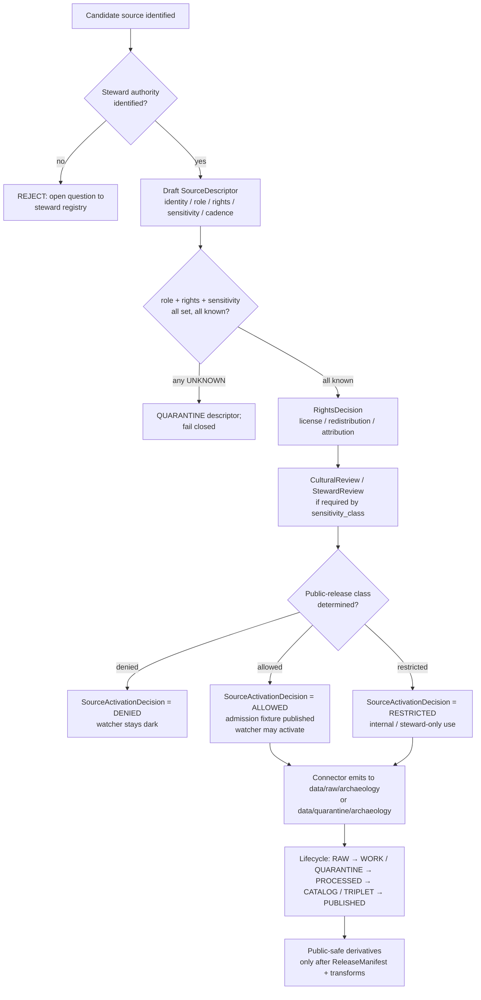

<!-- [KFM_META_BLOCK_V2]
doc_id: kfm://doc/archaeology/SOURCE_REGISTRY
title: Archaeology Source Registry — Human Guide
type: standard
version: v0.1
status: draft
owners: <archaeology-domain-stewards>            # NEEDS VERIFICATION — assign before promotion
created: 2026-05-15
updated: 2026-05-15
policy_label: public
related:
  - docs/domains/archaeology/README.md
  - docs/domains/archaeology/ARCHITECTURE.md
  - docs/domains/archaeology/PUBLICATION_AND_POLICY.md
  - docs/domains/archaeology/CULTURAL_REVIEW.md
  - docs/sources/SOURCE_DESCRIPTOR_STANDARD.md
  - docs/adr/ADR-archaeology-source-roles.md
  - docs/adr/ADR-archaeology-exact-location-policy.md
  - data/registry/sources/archaeology/sources.yaml
  - data/registry/sources/archaeology/source_roles.yaml
  - data/registry/sources/archaeology/sensitivity_policies.yaml
  - data/registry/sources/archaeology/rights_profiles.yaml
  - data/registry/sources/archaeology/steward_authorities.yaml
  - data/published/layers/archaeology/layer_registry.yaml
tags: [kfm, archaeology, registry, sources, governance, evidence, sensitivity]
notes:
  - Companion doc; machine truth lives in data/registry/sources/archaeology/*.yaml.
  - All listed candidate source families are PROPOSED / NEEDS VERIFICATION.
  - Exact site geometry is DENY by default; cultural/steward review governs disclosure.
[/KFM_META_BLOCK_V2] -->

# Archaeology Source Registry — Human Guide

> **Companion to `data/registry/sources/archaeology/*.yaml`.** This document explains
> what the Archaeology source registry **is**, how to **read** its descriptors,
> how to **add or change** an entry, and which gates **fail closed** when a
> descriptor is incomplete, when a source role is ambiguous, or when sensitivity,
> rights, or steward review is unresolved. The YAML is the machine truth. This
> guide is the human contract.

<!-- Top-of-file impact block -->

[](#1-purpose)
[](#)
[](./README.md)
[](../../doctrine/truth-posture.md)
[](../../doctrine/truth-posture.md)
[](#7-sensitivity-register)
[](#7-sensitivity-register)
[](#repo-fit)

**Status:** `draft` · **Owners:** `<archaeology-domain-stewards>` (PROPOSED) · **Last updated:** 2026-05-15 · **Authority class:** human-facing companion to machine registry

> [!IMPORTANT]
> The Archaeology lane operates under **deny-by-default exposure**. Exact site
> coordinates, sacred or burial-associated locations, human-remains contexts,
> private-landowner geometry, and collection-security details **MUST NOT** appear
> on any public surface, in any AI response, or in any export — at any zoom or
> coordinate precision — without a recorded `CulturalReview` / `StewardReview`,
> a `SensitivityTransform`, and a `RedactionReceipt`. *(CONFIRMED doctrine —
> implementation maturity PROPOSED.)*

---

## Mini-TOC

- [1. Purpose](#1-purpose)
- [2. Scope & boundary](#2-scope--boundary)
- [3. Repo fit](#3-repo-fit)
- [4. How to read this registry](#4-how-to-read-this-registry)
- [5. SourceDescriptor field surface](#5-sourcedescriptor-field-surface)
- [6. Source roles for archaeology](#6-source-roles-for-archaeology)
- [7. Sensitivity register](#7-sensitivity-register)
- [8. Candidate source families](#8-candidate-source-families)
- [9. Admission flow & SourceActivationDecision](#9-admission-flow--sourceactivationdecision)
- [10. Anti-collapse failure modes](#10-anti-collapse-failure-modes)
- [11. Verification ladder](#11-verification-ladder)
- [12. Publication-eligibility ladder](#12-publication-eligibility-ladder)
- [13. Adding or changing a descriptor](#13-adding-or-changing-a-descriptor)
- [14. Open questions / verification backlog](#14-open-questions--verification-backlog)
- [15. Related docs](#15-related-docs)

---

## 1. Purpose

The Archaeology source registry is an **admission and authority-control surface**,
not a bibliography. *(CONFIRMED doctrine — see Directory Rules §11, source-registry
architecture.)* It records, for every source the Archaeology lane intends to
consume:

- **identity** (`source_id`, authoring body, persistent reference)
- **source role** (observed · regulatory · modeled · aggregate · administrative · candidate · synthetic)
- **rights posture** (license, attribution, redistribution, embargo)
- **access method** (file drop, restricted API, harvested PDF, MOU, steward-mediated)
- **update cadence** and freshness expectations
- **steward authority** (SHPO, tribal authority, repository, lab, university, agency)
- **sensitivity classification** (public-safe · restricted · steward-only · sealed)
- **public-release class** (eligible for public-safe derivatives, restricted view only, or denied)
- **attribution / citation guidance**

The registry exists so that no archaeological material — site form, survey
record, anomaly, candidate feature, 3D model, oral-history transcript, or
collection accession — can shape a public claim before it has been **admitted,
quarantined, restricted, or denied** by an explicit `SourceActivationDecision`.
*(CONFIRMED doctrine; specific schema fields and file paths PROPOSED.)*

> [!NOTE]
> **What this registry is not.** It is not the place where sites, surveys, or
> artifacts live (those are canonical lane objects under `data/processed/archaeology/`
> and downstream lifecycle phases — PROPOSED paths). It is not a publication
> queue. It is not a citation generator. It is the gate **upstream** of all of
> those.

[↑ Back to top](#archaeology-source-registry--human-guide)

---

## 2. Scope & boundary

| What this registry governs | What this registry does **not** govern |
|---|---|
| Admission and activation of archaeological data sources. | Storage of canonical site, survey, artifact, or context records. |
| Source role, rights, cadence, sensitivity, steward authority. | Schema shape of archaeology objects (lives under `schemas/contracts/v1/domains/archaeology/…` — PROPOSED). |
| Public-release class per source. | Specific publication decisions on individual sites (those are `PromotionDecision` / `ReleaseManifest` artifacts). |
| Steward / cultural review requirements at admission. | Per-feature review queues (those are `ReviewRecord` artifacts in the lifecycle). |
| Attribution and citation guidance for downstream surfaces. | The text of citations themselves (rendered by the governed API and Evidence Drawer). |
| Sensitivity-class assignment that drives `SensitivityTransform`s. | Per-publication redaction parameters (those are recorded in the `RedactionReceipt`). |

The Archaeology lane **owns**: Archaeological Site; Survey; Artifact; Feature; Context;
ExcavationUnit; RemoteSensingAnomaly; LiDARCandidate; GeophysicsObservation;
ThreeDDocumentation; CulturalReview; StewardReview; CollectionAccession;
ChronologyAssertion; SensitivityTransform; CollectionRepositoryRecord;
CandidateFeature; PublicationTransformReceipt; ProvenienceContext; StratigraphicUnit.
*(CONFIRMED doctrine from DOM-ARCH / ENCY — field realization PROPOSED.)*

The Archaeology lane **does not own** (other lanes provide context): Roads/Rail;
People/Land; Geology; Hazards; Spatial Foundation. Context from those lanes
**cannot** confirm a site or bypass archaeological sensitivity rules.
*(CONFIRMED doctrine.)*

[↑ Back to top](#archaeology-source-registry--human-guide)

---

## 3. Repo fit

**Canonical placement** *(PROPOSED — pending mounted-repo verification, justified
by Directory Rules §12 Domain Placement Law and §4 placement protocol):*

```text
docs/domains/archaeology/SOURCE_REGISTRY.md      ← this file (human guide)
data/registry/sources/archaeology/               ← machine truth (YAML)
├── sources.yaml                                 ← SourceDescriptor entries
├── source_roles.yaml                            ← role-pinning per source
├── sensitivity_policies.yaml                    ← sensitivity class & transforms
├── rights_profiles.yaml                         ← license / attribution / embargo
└── steward_authorities.yaml                     ← SHPO / tribal / repository contacts
```

**Upstream (governs this registry).** *(All PROPOSED until repo-verified.)*

- `docs/doctrine/directory-rules.md` — domain placement law, source-registry doctrine
- `docs/doctrine/truth-posture.md` — cite-or-abstain
- `docs/doctrine/trust-membrane.md` — RAW/WORK is not public
- `docs/doctrine/lifecycle-law.md` — `RAW → WORK / QUARANTINE → PROCESSED → CATALOG / TRIPLET → PUBLISHED`
- `docs/sources/SOURCE_DESCRIPTOR_STANDARD.md` — cross-domain descriptor contract
- `docs/architecture/contract-schema-policy-split.md` — contract vs schema vs policy

**Downstream (consumers).** *(All PROPOSED until repo-verified.)*

- `connectors/archaeology/*` — must check activation state before fetch
- `pipelines/domains/archaeology/*` — must read source role and sensitivity from registry
- `policy/domains/archaeology/*.rego` — fail-closed decisions reference registry classes
- `tools/validators/archaeology/*` — descriptor validators, rights validators
- `tests/domains/archaeology/*` — fixture pairs (valid / invalid) per source family
- `apps/governed-api/` — citation, sensitivity badge, and release-state surfaces

> [!WARNING]
> The repository is **not mounted** in this session. Every path above is
> **PROPOSED** under Directory Rules §0 and §12, not asserted as present. Verify
> against the mounted tree before merging.

[↑ Back to top](#archaeology-source-registry--human-guide)

---

## 4. How to read this registry

Each entry in `sources.yaml` is a `SourceDescriptor`. A descriptor is **set at
admission and never edited in place**. Corrections produce a new descriptor and
a `CorrectionNotice` referencing the prior. *(CONFIRMED doctrine, Atlas §24.1.3.)*

A descriptor tells you four things:

1. **What it is** — identity, authoring body, persistent reference (DOI / IRI / accession id).
2. **What role it plays** — `source_role` is a first-class identity attribute. An observed survey is *not* interchangeable with a regulatory listing, a modeled anomaly, or an aggregate site-density product. Promotion **never** upgrades a role.
3. **What constraints it carries** — rights, redistribution, embargo, attribution, cadence, freshness window, steward authority.
4. **How sensitive it is** — sensitivity class drives default transforms (generalization, suppression, embargo, redaction) and the **public-release class**.

Read descriptors as a stack: identity → role → constraints → sensitivity. If any
layer is `UNKNOWN`, the gate fails closed. Unknown rights, unknown role, or
unknown sensitivity each cause `policy_decision = DENY` for any public-derivative
operation. *(CONFIRMED doctrine, ENCY Appendix E.)*

[↑ Back to top](#archaeology-source-registry--human-guide)

---

## 5. SourceDescriptor field surface

The canonical shape of `SourceDescriptor` lives under `schemas/contracts/v1/source/source-descriptor.json`
per ADR-0001's schema-home convention. *(CONFIRMED rule — file presence PROPOSED;
field names below are PROPOSED illustrative shape, not authoritative.)*

| Field | Type / vocabulary | Required? | Notes |
|---|---|---|---|
| `source_id` | string (KFM-prefixed, deterministic) | MUST | Stable identity. Never re-used. |
| `title` | string | MUST | Human-readable name of source. |
| `authority` | structured: { name, role, contact_ref } | MUST | Authoring or stewarding body (SHPO, tribal authority, repository, agency, university, lab). |
| `source_role` | enum: `observed` \| `regulatory` \| `modeled` \| `aggregate` \| `administrative` \| `candidate` \| `synthetic` | MUST | Set at admission. *Never* edited in place. *(CONFIRMED — Atlas §24.1.)* |
| `role_authority` | string | MUST when role in {regulatory, modeled, aggregate} | Disambiguates the authoring authority for downstream citation. |
| `role_aggregation_unit` | geometry-scope token (county, township, quad, decade…) | MUST when `source_role = aggregate` | Prevents geometry-scope drift on join. |
| `role_model_run_ref` | EvidenceRef → ModelRunReceipt | MUST when `source_role = modeled` | Pins inputs, parameters, version. |
| `role_synthetic_basis` | structured: { method, inputs, reality_boundary_note_ref } | MUST when `source_role = synthetic` | What is and is not real in the carrier (e.g. reconstructed scenes, AI-drafted notes). |
| `role_candidate_disposition` | enum: `pending` \| `merged` \| `rejected` \| `quarantined` | MUST when `source_role = candidate` | Tracks promotion state; PUBLISHED edge **forbidden** until merged. |
| `rights_status` | enum: `public` \| `open` \| `controlled` \| `restricted` \| `unknown` | MUST | Default `unknown` fails closed. |
| `rights_terms_ref` | URI / IRI / license id | MUST when known | License or use-terms reference. |
| `redistribution_class` | enum: `redistributable` \| `derivatives_only` \| `view_only` \| `forbidden` \| `unknown` | MUST | Drives `RightsDecision`. |
| `sensitivity_class` | enum: `public_safe` \| `restricted` \| `steward_only` \| `sealed` | MUST | Drives default `SensitivityTransform`. *(See §7.)* |
| `cadence` | structured: { kind: `stream` \| `periodic` \| `static` \| `irregular`, period?, last_known } | MUST | Freshness expectations. |
| `access_method` | enum: `file_drop` \| `restricted_api` \| `pdf_harvest` \| `mou_request` \| `steward_mediated` \| `none` | MUST | How material enters the lifecycle. |
| `citation_template` | string with `{placeholders}` | MUST | Used by governed API & Evidence Drawer. |
| `steward_review_required` | boolean | MUST | If `true`, no PROCESSED → CATALOG promotion without a `CulturalReview` or `StewardReview`. |
| `embargo_until` | RFC-3339 date-time \| null | MUST | Public-release gate. |
| `correction_notice_ref` | EvidenceRef → CorrectionNotice \| null | OPTIONAL | Set when this descriptor supersedes a prior one. |

> [!NOTE]
> The field names above are **PROPOSED** descriptor shape, illustrative of the
> doctrine in Atlas §24.1.3. The authoritative shape lives in the schema file
> once mounted and ADR-anchored. Treat this table as the reading guide, not the
> contract.

[↑ Back to top](#archaeology-source-registry--human-guide)

---

## 6. Source roles for archaeology

KFM treats `source_role` as a **first-class identity attribute** that survives
every promotion. *(CONFIRMED doctrine, Atlas §24.1.1.)* The canonical role enum
applies to all domains; the table below adapts each role to archaeology-specific
examples.

| Role | Archaeology example | Allowed downstream framing | Forbidden collapse |
|---|---|---|---|
| `observed` | A field crew's direct surface observation; a recorded artifact in situ; a stratigraphic profile drawing tied to a place and time. | Cite as observation; may feed modeled or aggregate products. | Never relabeled as `regulatory` or `administrative`. |
| `regulatory` | NRHP listing; state-level cultural protection designation; designated cultural landscape boundary. | Cite as regulatory context; informs eligibility, not occurrence. | Never labeled as an observed event or modeled product. |
| `modeled` | LiDAR-derived anomaly score; predictive site-sensitivity surface; reconstructed viewshed; suitability raster. | Cite with model identity, run receipt, bounds; must carry `role_model_run_ref`. | Never labeled as an observed site. |
| `aggregate` | County-level site density; period-bucketed regional summary; survey-coverage percentage by quadrangle. | Cite with aggregation receipt; pins geometry scope. | Never used as per-place truth; no join from aggregate cell to single record. |
| `administrative` | SHPO trinomial registration record; permit roster; repository accession ledger; archive index. | Cite as administrative context. | Never collapsed with observation or regulation. |
| `candidate` | LiDAR / remote-sensing / geophysics anomaly **before** ground-truth or steward review; unmerged duplicate-site assertion; quarantined connector output. | May be cited as candidate evidence in WORK / QUARANTINE only. | **Must not appear in PUBLISHED** without explicit promotion and review. |
| `synthetic` | 3D reconstruction; AI-drafted EvidenceBundle summary; generated visualization; speculative reconstruction art. | Carries `Reality Boundary Note` and `Representation Receipt`. | **Never** presented or queried as observed reality. *(CONFIRMED — Atlas §24.1.2.)* |

> [!IMPORTANT]
> The candidate-vs-confirmed distinction is central to archaeology. A LiDAR pit
> on a hillside, a magnetometry anomaly, a satellite shape, a predictive model
> hotspot — none of these are sites. They are `CandidateFeature` objects under
> `source_role = candidate` until ground evidence, steward review, and source
> closure promote them. The trust membrane forbids any PUBLISHED edge from
> WORK / QUARANTINE. *(CONFIRMED doctrine.)*

[↑ Back to top](#archaeology-source-registry--human-guide)

---

## 7. Sensitivity register

Archaeology is a **deny-by-default** lane for exact-location exposure.
*(CONFIRMED doctrine, ENCY §13 Sensitive / Deny-by-Default Register.)* The
following classes are forbidden public-surface output unless every gate has been
satisfied and a `RedactionReceipt` or `SensitivityTransform` has been issued.

| Sensitivity class | Examples | Default outcome | Required controls |
|---|---|---|---|
| **Burial / human remains** | NAGPRA-affected materials, burial features, human-remains contexts, mortuary architecture. | **DENY** at every public surface; sealed by default. | Tribal / cultural review with consent; sealed access lane; no AI summarization without explicit release state. |
| **Sacred / culturally sensitive places** | Sacred sites, ceremonial landscapes, oral-history-anchored places, cultural routes. | **DENY** until steward review and access class approve. | Consultation record; consent; `SensitivityTransform`; steward-only review map. |
| **Exact site coordinates** | Trinomial sites, surface scatters with precise coordinates, exposed features. | **DENY** exact public location by default; generalized public products only. | Generalization to township/quad/HUC; `PublicationTransformReceipt`; looting-risk review. |
| **Active excavation / unsecured collections** | In-progress excavation unit coordinates; unsecured collection holdings; security-sensitive curation details. | **RESTRICT / DENY** public precision and timing. | Embargo until field season closes; collection-security review. |
| **Private-landowner-affected geometry** | Sites on private land; landowner-identifying context. | **DENY** exact public release if private or rights are unclear. | Permissions; aggregation; rights-profile review. |
| **Looting-risk / threatened sites** | High-value, vandalism-prone, threatened-by-erosion sites. | **DENY** exact public location; risk review required. | Looting-risk evaluation; steward review; staged or denied access. |
| **Source-rights-limited records** | Licensed databases; restricted SHPO extracts; embargoed reports. | **DENY** public release until terms resolved. | Rights register; attribution; no public derivative if barred. |

> [!CAUTION]
> **Sensitive content can leak through side channels.** A redacted point can
> still leak via popup label text, AI Focus Mode narration, 3D scene captions,
> URL state, screenshots, or low-zoom labels. Every public surface in the
> Archaeology lane MUST exercise the `Sensitive-domain fail-closed` checks
> across **all** carriers — tile, vector, label, 3D, AI text, export. The
> redaction transform applies to the whole envelope, not just the geometry.
> *(CONFIRMED risk register; control coverage PROPOSED.)*

[↑ Back to top](#archaeology-source-registry--human-guide)

---

## 8. Candidate source families

These are the source families the Archaeology lane plans to admit. **All entries
below are PROPOSED / NEEDS VERIFICATION.** Activation requires a complete
`SourceDescriptor`, a `RightsDecision`, a recorded steward authority, an
admission fixture, and a `SourceActivationDecision`. Until then the source is
**inactive** — connectors and watchers dark, no public derivative permitted.

> [!NOTE]
> Source names below are illustrative families drawn from KFM source-basis
> records (SRC-ARCH, SRC-3DARCH) and the Kansas-first authority discussion in
> the Pass 10 dossier. Specific licensed datasets, agency endpoints, and MOUs
> are **NEEDS VERIFICATION** in this session.

### 8.1 State Historic Preservation / state archaeology offices

| Field | Value (PROPOSED) |
|---|---|
| **Family ID** | `SRC-ARCH-SHPO` |
| **Typical content** | Trinomial site forms, survey reports, eligibility determinations, archaeological compliance records. |
| **Authority** | State Historic Preservation Office or state-archaeology equivalent (in Kansas: Kansas State Historical Society archaeology program — NEEDS VERIFICATION of current name and access path). |
| **Likely `source_role`** | `observed` (site forms) + `administrative` (registration ledgers) — **never collapsed**. |
| **Sensitivity** | `steward_only` for exact site geometry; `restricted` for redacted summaries. |
| **Rights** | `controlled` — typically MOU- or qualification-gated; redistribution **forbidden** for exact geometry. |
| **Cadence** | `irregular` — driven by survey activity. |
| **Public-release class** | Generalized / suppressed products only after `CulturalReview`. |

### 8.2 National Register-style listings

| Field | Value (PROPOSED) |
|---|---|
| **Family ID** | `SRC-ARCH-NRHP` |
| **Typical content** | NRHP listings, state-level historic resource inventories (Kansas: KHRI — NEEDS VERIFICATION), district boundaries, eligibility status. |
| **Authority** | National Park Service / state preservation authority. |
| **Likely `source_role`** | `regulatory` (listings) + `administrative` (inventory rosters). |
| **Sensitivity** | `public_safe` for listing metadata; `restricted` for precise contributing-feature geometry. |
| **Rights** | `public` for listing record; license per record. |
| **Cadence** | `periodic`. |
| **Public-release class** | Eligible for public-safe derivatives at building/district level; archaeological listings often suppressed per NHPA Section 304. |

### 8.3 Field survey records

| Field | Value (PROPOSED) |
|---|---|
| **Family ID** | `SRC-ARCH-SURVEY` |
| **Typical content** | Phase I / II / III survey reports, transect data, shovel-test logs, surface-collection records. |
| **Authority** | Permitting agency + survey contractor / academic PI. |
| **Likely `source_role`** | `observed`. |
| **Sensitivity** | `steward_only` for exact transect coordinates; `restricted` for survey-coverage polygons. |
| **Rights** | `controlled` — often report-protected; redistribution typically barred. |
| **Cadence** | `irregular`. |
| **Public-release class** | Coverage polygons (generalized) may be public-safe; site-level data is not. |

### 8.4 Excavation records and provenience packets

| Field | Value (PROPOSED) |
|---|---|
| **Family ID** | `SRC-ARCH-EXCAV` |
| **Typical content** | Excavation unit records, stratigraphic profiles, feature drawings, provenience tags, `ProvenienceContext` and `StratigraphicUnit` records. |
| **Authority** | Excavating institution + PI. |
| **Likely `source_role`** | `observed`. |
| **Sensitivity** | `steward_only` during active excavation; `restricted` post-closure; class may downgrade after publication of formal report. |
| **Rights** | `controlled` until institutional release. |
| **Cadence** | `static` per unit; `irregular` per project. |
| **Public-release class** | Public-safe summaries of published projects only; in-progress excavations embargoed. |

### 8.5 Artifact, collection, and repository records

| Field | Value (PROPOSED) |
|---|---|
| **Family ID** | `SRC-ARCH-COLL` |
| **Typical content** | `CollectionAccession`, `CollectionRepositoryRecord`, catalog entries, artifact descriptions, photographs. |
| **Authority** | Repository (museum, university curation facility). |
| **Likely `source_role`** | `administrative` (accession ledgers) + `observed` (catalog records of physical artifacts). |
| **Sensitivity** | `restricted` for provenience linkage; collection-security-sensitive details `steward_only`. |
| **Rights** | Per-repository license; images often restricted. |
| **Cadence** | `irregular`. |
| **Public-release class** | Artifact-level public-safe records may be eligible; collection-location precision is not. |

### 8.6 Lab reports

| Field | Value (PROPOSED) |
|---|---|
| **Family ID** | `SRC-ARCH-LAB` |
| **Typical content** | Radiocarbon dates, OSL dates, residue and isotopic analyses, ChronologyAssertions. |
| **Authority** | Analytical lab + submitting institution. |
| **Likely `source_role`** | `observed` (measurement) + `modeled` (calibrated dates). |
| **Sensitivity** | `restricted` when tied to sensitive site geometry; `public_safe` when decontextualized. |
| **Rights** | Per-lab license; per-submitter agreement. |
| **Cadence** | `static` per result. |
| **Public-release class** | Public-safe at site-decoupled level; site-linked dates inherit site sensitivity. |

### 8.7 Historic maps, plats, land records, newspapers

| Field | Value (PROPOSED) |
|---|---|
| **Family ID** | `SRC-ARCH-HIST` |
| **Typical content** | Historic maps, GLO plats, land office records, ethnohistoric newspaper accounts. |
| **Authority** | Holding archive (state archives, university libraries, KSHS — NEEDS VERIFICATION). |
| **Likely `source_role`** | `administrative` (registers and plats) + `observed` (period-specific narrative accounts, with uncertainty). |
| **Sensitivity** | Usually `public_safe` for the carrier; **derived archaeological inferences** inherit site sensitivity. |
| **Rights** | Often public-domain; check per holding. |
| **Cadence** | `static`. |
| **Public-release class** | Carrier public-safe; inferred site locations follow the deny-by-default rule. |

### 8.8 Oral history, tribal consultation, cultural knowledge

| Field | Value (PROPOSED) |
|---|---|
| **Family ID** | `SRC-ARCH-ORAL` |
| **Typical content** | Oral history transcripts, cultural-knowledge testimony, consultation records, traditional ecological / cultural knowledge. |
| **Authority** | Tribal authority / community / consultant — **never** assumed; always recorded. |
| **Likely `source_role`** | `observed` (first-person testimony) — with explicit consent and authority pinning. |
| **Sensitivity** | `sealed` by default; access governed entirely by community / steward authority. |
| **Rights** | Community-controlled; redistribution typically **forbidden** without explicit, written permission per use. |
| **Cadence** | `irregular`. |
| **Public-release class** | **Default DENY.** No public derivative, no AI summarization, no graph projection without explicit consent recorded as a `CulturalReview` and reflected in policy. |

> [!IMPORTANT]
> Oral history and cultural knowledge are governed by **community authority,
> not KFM authority**. The registry records the consent and access regime; it
> does **not** assert ownership over the knowledge. *(CONFIRMED doctrine —
> ENCY §13 SRC-ARCH; verification of specific consultation protocols is
> NEEDS VERIFICATION in this session.)*

### 8.9 LiDAR, remote sensing, geophysics

| Field | Value (PROPOSED) |
|---|---|
| **Family ID** | `SRC-ARCH-REMOTE` |
| **Typical content** | LiDAR-derived DEMs and anomalies, magnetometry, GPR, resistivity, multispectral imagery, satellite-derived anomalies. |
| **Authority** | 3DEP, Planet, contracted geophysics provider, academic survey. |
| **Likely `source_role`** | `observed` (raw sensor capture) → `modeled` (derived anomaly score) → `candidate` (`LiDARCandidate`, `RemoteSensingAnomaly`, `GeophysicsObservation`). Each stage carries its own descriptor. |
| **Sensitivity** | `restricted` for anomalies near known sensitive areas; otherwise `restricted` until reviewed. |
| **Rights** | Per-provider license; Planet imagery licensed; 3DEP public. |
| **Cadence** | `irregular`. |
| **Public-release class** | **Candidates are never public.** Confirmed-and-reviewed sites follow the standard archaeology release path. |

### 8.10 3D documentation and photogrammetry

| Field | Value (PROPOSED) |
|---|---|
| **Family ID** | `SRC-ARCH-3D` |
| **Typical content** | `ThreeDDocumentation`, photogrammetry meshes, structured-light scans, terrestrial laser scans, scene reconstructions. |
| **Authority** | Capturing institution + PI. |
| **Likely `source_role`** | `observed` for capture; `synthetic` for reconstruction or interpretive scene. |
| **Sensitivity** | Inherits site sensitivity; reconstructions of sealed sites are sealed. |
| **Rights** | Per-institution license; access controls required. |
| **Cadence** | `static` per capture. |
| **Public-release class** | 3D site models require admission via the 3D admission gate; reconstructions require a `Reality Boundary Note`. *(CONFIRMED — Atlas §23.3 figure-to-generate; gate implementation PROPOSED.)* |

[↑ Back to top](#archaeology-source-registry--human-guide)

---

## 9. Admission flow & SourceActivationDecision

Source admission is a **governed state transition**, not a file copy. *(CONFIRMED
doctrine, ENCY Appendix E.)* No connector, watcher, pipeline, or AI surface may
touch a source until a `SourceActivationDecision` exists.



**SourceActivationDecision** is the bound outcome of this flow. Its values are:

| Decision | Meaning | Connectors / watchers | Public derivative |
|---|---|---|---|
| `ALLOWED` | All gates passed; source admitted with declared role, rights, sensitivity, and public-release class. | May activate. | Permitted within the declared public-release class. |
| `RESTRICTED` | Admitted for internal / steward use only; not for any public surface. | May activate but route to restricted lanes. | **DENY**. |
| `DENIED` | Source fails one or more gates (unknown role, unknown rights, sensitivity unresolved, no steward authority). | Stay dark. | **DENY** at every surface. |
| `NEEDS_REVIEW` | Admission paused pending steward, rights, or sensitivity resolution. | Stay dark. | **DENY**. |

> [!NOTE]
> The activation decision is **not** a promotion decision. Each individual
> object (site, survey, anomaly, accession) still moves through the lifecycle's
> own `PromotionDecision` gates. Source activation only unlocks the **possibility**
> of admission; it does not authorize publication of any specific record.

[↑ Back to top](#archaeology-source-registry--human-guide)

---

## 10. Anti-collapse failure modes

The registry exists to prevent the source-role collapses Atlas §24.1.2 enumerates.
For Archaeology, the high-risk collapses are:

| Collapse pattern | Denied outcome | Required guardrail |
|---|---|---|
| **Candidate exposed as confirmed site.** *(LiDAR pit, magnetometry anomaly, satellite shape, predictive hotspot rendered as a site marker.)* | DENY at trust membrane; route to QUARANTINE; no PUBLISHED edge from WORK / QUARANTINE. | Promotion gate; `role_candidate_disposition` pinned; explicit `CandidateFeature` rendering with badge. |
| **Synthetic / reconstructed content presented as observed.** *(3D reconstruction, AI-drafted scene narrative.)* | DENY publication; HOLD for steward review; ABSTAIN at AI surface. | `Reality Boundary Note`; `Representation Receipt`; UI badge; 3D admission gate. |
| **Aggregate cited as a per-place truth.** *(County-level site-density cell read as "a site at this point.")* | DENY join from aggregate cell to single record; ABSTAIN at AI. | `AggregationReceipt`; geometry-scope guard; matrix-cell semantics. |
| **Administrative compilation cited as observation.** *(SHPO trinomial registration treated as an "event" instead of a registration record.)* | DENY publication of compilation as observed event timeline. | Source-role tag preserved through promotion; named `AdminEvent` typing. |
| **Modeled anomaly score read as a survey result.** | DENY at publication; ABSTAIN at AI. | `role_model_run_ref` + uncertainty surface + role-preserving DTO field. |
| **Regulatory listing read as occurrence evidence.** *(NRHP listing treated as a present-day site observation.)* | DENY publication of regulatory layer as event evidence. | Separate regulatory-layer and observed-event lanes; UI banner. |
| **AI text treated as evidence.** | DENY publication; ABSTAIN at Focus Mode; `AIReceipt` mandatory; cite-or-abstain. | Cite-or-abstain rule; `AIReceipt`; release state required. |

[↑ Back to top](#archaeology-source-registry--human-guide)

---

## 11. Verification ladder

A descriptor moves up this ladder as evidence accumulates. The current rung
determines what gates can pass.

```text
Rung 0 — Drafted        : descriptor exists; fields may be UNKNOWN.        public derivative: DENY
Rung 1 — Rights-checked : license / redistribution / attribution resolved. public derivative: DENY until role + sensitivity also resolved
Rung 2 — Role-pinned    : source_role set + role-conditional fields valid. public derivative: DENY until sensitivity also resolved
Rung 3 — Sensitivity-set: sensitivity_class + transforms determined.       public derivative: case-by-case per release class
Rung 4 — Steward-cleared: CulturalReview / StewardReview recorded if req.  public derivative: per release class
Rung 5 — Activated      : SourceActivationDecision = ALLOWED or RESTRICTED. lifecycle may flow per class
```

Treat `UNKNOWN` at any rung as **fail-closed**. Descriptors stalled at a rung
should be tracked in `docs/registers/VERIFICATION_BACKLOG.md` (PROPOSED).

[↑ Back to top](#archaeology-source-registry--human-guide)

---

## 12. Publication-eligibility ladder

Even an `ALLOWED` source does not automatically yield a public surface. The
publication ladder gates per-object release.

| Step | Gate | Required artifact |
|---|---|---|
| 1 | `SourceActivationDecision = ALLOWED` (or `RESTRICTED` for non-public lanes) | This registry. |
| 2 | `RawCaptureReceipt` exists for the specific record. | `data/receipts/archaeology/raw/…` (PROPOSED). |
| 3 | `ValidationReport` passes schema / geometry / temporal / rights / sensitivity / evidence checks. | `data/receipts/archaeology/validation/…` (PROPOSED). |
| 4 | `SensitivityTransform` and (if needed) `RedactionReceipt` applied for public-safe derivative. | `data/receipts/archaeology/sensitivity/…` (PROPOSED). |
| 5 | `EvidenceBundle` resolves; `EvidenceRef` stable. | `data/proofs/archaeology/…` (PROPOSED). |
| 6 | `CulturalReview` / `StewardReview` if `steward_review_required = true`. | `data/receipts/archaeology/review/…` (PROPOSED). |
| 7 | `PromotionDecision` / `ReleaseManifest` issued. | `release/candidates/archaeology/…` (PROPOSED). |
| 8 | `LayerManifest` registers the public layer with sensitivity badges, attribution, freshness, evidence hooks. | `data/published/layers/archaeology/…` (PROPOSED). |
| 9 | `CorrectionNotice` and `RollbackCard` paths exist and have been drilled. | `release/` (PROPOSED). |

Any missing step = `DENY` at the trust membrane. *(CONFIRMED doctrine,
ENCY Appendix E + DOM-ARCH §M; specific file paths PROPOSED.)*

[↑ Back to top](#archaeology-source-registry--human-guide)

---

## 13. Adding or changing a descriptor

<details>
<summary><strong>Standard procedure for a new descriptor</strong></summary>

1. **Open an intake card** under `docs/intake/` (PROPOSED) naming the source, the proposing steward, and the intended use case.
2. **Identify the steward authority** and record contact / authority class in `steward_authorities.yaml`. If unknown, stop and resolve before continuing.
3. **Draft the `SourceDescriptor`** with the field surface in §5. Mark every `UNKNOWN` field explicitly.
4. **Run the descriptor validator** (PROPOSED at `tools/validators/source-descriptor/`) against the canonical schema (PROPOSED at `schemas/contracts/v1/source/source-descriptor.json`).
5. **Issue a `RightsDecision`** by evaluating license, attribution, redistribution, privacy, access. Unknown rights → DENY.
6. **Determine `sensitivity_class`** using §7 and any tribal / cultural / agency consultation required. Record consultation outcomes as `CulturalReview` / `StewardReview`.
7. **Run a no-network admission fixture** in `tests/domains/archaeology/fixtures/source_admission/<source_id>/` (PROPOSED) — both valid and invalid cases.
8. **Issue the `SourceActivationDecision`** (`ALLOWED` / `RESTRICTED` / `DENIED` / `NEEDS_REVIEW`) and record it as part of the descriptor's promotion chain.
9. **Open an ADR** if the source requires a new role-pinning convention, a new sensitivity class, or a new public-release class.
10. **Update this guide and `data/registry/sources/archaeology/sources.yaml`** in the same commit. The guide and the YAML should never drift.

</details>

<details>
<summary><strong>Correcting an existing descriptor</strong></summary>

- Descriptors are **immutable**. Corrections create a new descriptor with `correction_notice_ref` set to the prior, plus a `CorrectionNotice` recording invalidated derivatives.
- If the correction changes `source_role`, `sensitivity_class`, or `redistribution_class`, **all** released derivatives MUST be reviewed for republication or rollback.
- File a `RollbackCard` entry if any public derivative is affected.

</details>

<details>
<summary><strong>Retiring a descriptor</strong></summary>

- Issue a `SourceActivationDecision = DENIED` with reason `retired`.
- Mark the YAML entry as `retired: true` with `retired_at` timestamp; do not delete the row (history must remain inspectable).
- Sweep all dependent layers and release manifests; emit `CorrectionNotice` or `RollbackCard` where applicable.

</details>

[↑ Back to top](#archaeology-source-registry--human-guide)

---

## 14. Open questions / verification backlog

These items are explicitly **not resolved** by this guide and should be tracked
in `docs/registers/VERIFICATION_BACKLOG.md` (PROPOSED). All are inherited from
the DOM-ARCH verification backlog (Atlas Chapter 15 §N) and the Encyclopedia
§7.13 open items.

| # | Item | Evidence that would settle it | Status |
|---|---|---|---|
| 1 | Verify steward authority chain and confidentiality protocols for Kansas-specific archaeology sources (SHPO, tribal, repository). | mounted repo files, schemas, registry entries, signed MOUs, tests, logs, emitted artifacts, review records | NEEDS VERIFICATION |
| 2 | Define **public geometry thresholds** and transform profiles for generalized site / coverage layers (radius mask, snap-to-quad, suppression, jitter). | mounted policy fixtures, transform-receipt validators, redaction-profile registry | NEEDS VERIFICATION |
| 3 | Verify **oral history / cultural knowledge protocol** — consent capture, access regime, revocation. | mounted consultation records, policy gates, fixture pairs | NEEDS VERIFICATION |
| 4 | Verify **emergency public-layer disablement** and rollback drill for sensitive archaeology layers. | mounted runbook, rollback drill log, dashboard receipts | NEEDS VERIFICATION |
| 5 | Confirm specific Kansas authorities and their identifier schemes (KSHS, KHRI access classes; tribal consultation paths). | source-authority register, signed MOUs, harvest cadence records | NEEDS VERIFICATION |
| 6 | Confirm the canonical schema home and field shape of `SourceDescriptor` (Atlas §24.1.3 shape is PROPOSED). | mounted `schemas/contracts/v1/source/source-descriptor.json` + ADR | NEEDS VERIFICATION |
| 7 | Confirm the **3D admission gate** for `ThreeDDocumentation` and reconstructed scenes (Reality Boundary Note + Representation Receipt). | mounted policy + fixtures + tests | NEEDS VERIFICATION |
| 8 | Confirm `data/registry/sources/<domain>/` vs `data/registry/<domain>/` placement for the YAML home (Directory Rules §12 implies `data/registry/sources/<domain>/`; the lane pattern table is authoritative pending an ADR). | mounted Directory Rules ADRs + repo evidence | NEEDS VERIFICATION |

[↑ Back to top](#archaeology-source-registry--human-guide)

---

## 15. Related docs

> [!NOTE]
> All links below are **PROPOSED** until the mounted repo confirms their
> presence and paths. Use them as the intended navigation surface; expect
> drift until verified.

- [`docs/domains/archaeology/README.md`](./README.md) — lane overview
- [`docs/domains/archaeology/ARCHITECTURE.md`](./ARCHITECTURE.md) — object families, lifecycle, pipelines
- [`docs/domains/archaeology/PUBLICATION_AND_POLICY.md`](./PUBLICATION_AND_POLICY.md) — public-release classes, transforms
- [`docs/domains/archaeology/CULTURAL_REVIEW.md`](./CULTURAL_REVIEW.md) — steward and cultural-review protocol
- [`docs/sources/SOURCE_DESCRIPTOR_STANDARD.md`](../../sources/SOURCE_DESCRIPTOR_STANDARD.md) — cross-domain descriptor contract
- [`docs/doctrine/directory-rules.md`](../../doctrine/directory-rules.md) — §11 source-registry architecture, §12 domain placement law
- [`docs/doctrine/truth-posture.md`](../../doctrine/truth-posture.md) — cite-or-abstain, EvidenceBundle outranks generated text
- [`docs/doctrine/trust-membrane.md`](../../doctrine/trust-membrane.md) — no public read of RAW / WORK / QUARANTINE
- [`docs/doctrine/lifecycle-law.md`](../../doctrine/lifecycle-law.md) — `RAW → WORK / QUARANTINE → PROCESSED → CATALOG / TRIPLET → PUBLISHED`
- [`docs/standards/PROV.md`](../../standards/PROV.md) — W3C PROV-O / PAV provenance crosswalk
- [`docs/adr/ADR-0001-schema-home.md`](../../adr/ADR-0001-schema-home.md) — schema-home convention
- [`docs/adr/ADR-archaeology-source-roles.md`](../../adr/ADR-archaeology-source-roles.md) — TODO if not present
- [`docs/adr/ADR-archaeology-exact-location-policy.md`](../../adr/ADR-archaeology-exact-location-policy.md) — TODO if not present
- [`data/registry/sources/archaeology/sources.yaml`](../../../data/registry/sources/archaeology/sources.yaml) — machine truth (PROPOSED)
- [`schemas/contracts/v1/source/source-descriptor.json`](../../../schemas/contracts/v1/source/source-descriptor.json) — descriptor schema (PROPOSED)

---

**Last updated:** 2026-05-15 · **Doc class:** standard companion guide · **Authority:** human-facing; machine truth lives in `data/registry/sources/archaeology/*.yaml` · [↑ Back to top](#archaeology-source-registry--human-guide)
