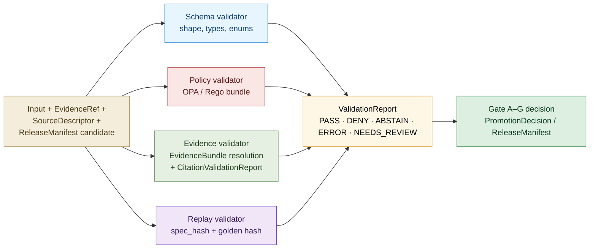
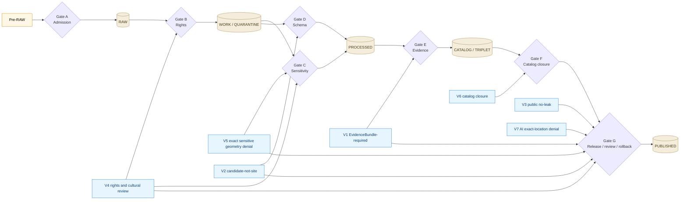
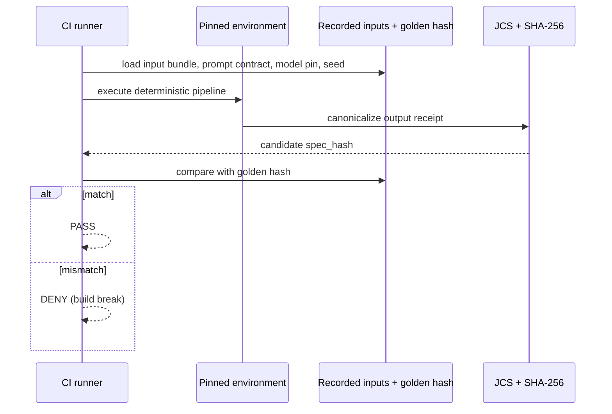

# Archaeology — Validators

> Canonical validator reference for the archaeology lane: the seven validators from Atlas v1.1 §15.K, the finite-outcome envelope, per-validator inputs / outputs / reason codes / fixtures / CI binding, the validator → Gates A–G mapping, the fixture discipline (no-network, valid / invalid pairs), policy parity between CI and runtime, replay determinism, the `spec_hash` gate, the canonical `validate_all.py` entrypoint, and the validator authoring and approval workflow.

<!-- [KFM_META_BLOCK_V2]
doc_id: kfm://doc/archaeology-validators
title: Archaeology — Validators
type: standard
version: v1
status: draft
owners: TODO — archaeology domain steward; CI owner; sensitivity reviewer; AI surface steward; release authority; correction reviewer; docs steward
created: 2026-05-28
updated: 2026-05-28
policy_label: public
related:
  - docs/doctrine/ai-build-operating-contract.md
  - docs/doctrine/directory-rules.md
  - docs/domains/archaeology/README.md                  # PROPOSED
  - docs/domains/archaeology/OBJECT_FAMILIES.md
  - docs/domains/archaeology/PIPELINE.md
  - docs/domains/archaeology/PRESERVATION_MATRIX.md
  - docs/domains/archaeology/PUBLICATION_AND_POLICY.md
  - docs/domains/archaeology/RELEASE_INDEX.md
  - docs/domains/archaeology/SENSITIVITY.md
  - docs/domains/archaeology/SOURCES.md
  - docs/domains/archaeology/SOURCE_REGISTRY.md
  - docs/standards/SMART_SYNC.md                        # PROPOSED — Pass 10 §C3 home
  - docs/standards/REDACTION_DETERMINISM.md             # PROPOSED — Pass 10 §C6-03 home
  - docs/runbooks/archaeology/parity_test.md            # PROPOSED — CI / runtime parity
  - docs/runbooks/archaeology/rollback_drill.md         # PROPOSED — drill cadence
  - tools/validators/                                   # PROPOSED — validator home
  - tools/validators/validate_all.py                    # PROPOSED — canonical entrypoint
  - tools/replay/                                       # PROPOSED — replay harness home
  - tests/domains/archaeology/                          # PROPOSED — archaeology test home
  - tests/replay/fixtures/                              # PROPOSED — replay fixtures
  - fixtures/domains/archaeology/                       # PROPOSED — no-network fixtures
  - policy/domains/archaeology/                         # PROPOSED — Rego bundle
  - schemas/contracts/v1/receipts/validation_report.schema.json   # PROPOSED
tags: [kfm, domain, archaeology, validators, tests, fixtures, CI, doctrine, fail-closed]
notes:
  - CONTRACT_VERSION pinned to "3.0.0"
  - Sensitive-domain doc; archaeology default tier is T4 (DENY) for site location, human remains, sacred sites.
  - All repo-state and path claims are PROPOSED until repo is mounted.
  - Companion to OBJECT_FAMILIES.md, PIPELINE.md, PRESERVATION_MATRIX.md, PUBLICATION_AND_POLICY.md, RELEASE_INDEX.md, SENSITIVITY.md, SOURCES.md, and SOURCE_REGISTRY.md.
[/KFM_META_BLOCK_V2] -->


**Status:** draft &nbsp;·&nbsp; **Owners:** *TODO — archaeology domain steward; CI owner; sensitivity reviewer; AI surface steward; release authority; correction reviewer; docs steward* &nbsp;·&nbsp; **Last updated:** 2026-05-28
**`CONTRACT_VERSION = "3.0.0"`** _(per [`docs/doctrine/ai-build-operating-contract.md`](../../doctrine/ai-build-operating-contract.md))._

> [!CAUTION]
> **Sensitive-domain lane — validators fail closed.** Every archaeology validator defaults to **DENY** when its inputs are incomplete or its policy bundle cannot be evaluated. Validators are **receipt-emitting** — every invocation produces a `ValidationReport` regardless of outcome; missing the receipt means the validator did not run *in the governed sense*. *(CONFIRMED doctrine — KFM-P1-PROG-0025.)*

---

## Quick jump

- [1 · Scope and purpose](#1--scope-and-purpose)
- [2 · Authority and source hierarchy](#2--authority-and-source-hierarchy)
- [3 · Validator taxonomy](#3--validator-taxonomy)
- [4 · Finite-outcome envelope](#4--finite-outcome-envelope)
- [5 · Receipt emission discipline](#5--receipt-emission-discipline)
- [6 · The seven canonical archaeology validators](#6--the-seven-canonical-archaeology-validators)
- [7 · V1 — EvidenceBundle-required](#7--v1--evidencebundle-required)
- [8 · V2 — Candidate-not-site](#8--v2--candidate-not-site)
- [9 · V3 — Public no-leak](#9--v3--public-no-leak)
- [10 · V4 — Rights and cultural review](#10--v4--rights-and-cultural-review)
- [11 · V5 — Exact sensitive geometry denial](#11--v5--exact-sensitive-geometry-denial)
- [12 · V6 — Catalog closure](#12--v6--catalog-closure)
- [13 · V7 — AI exact-location denial](#13--v7--ai-exact-location-denial)
- [14 · Validator → Gate A–G binding](#14--validator--gate-ag-binding)
- [15 · Fixture discipline](#15--fixture-discipline)
- [16 · Policy parity — CI equals runtime](#16--policy-parity--ci-equals-runtime)
- [17 · Replay verification and golden hashes](#17--replay-verification-and-golden-hashes)
- [18 · `spec_hash` gate](#18--spec_hash-gate)
- [19 · `validate_all.py` — canonical entrypoint](#19--validate_allpy--canonical-entrypoint)
- [20 · Validator authoring and approval](#20--validator-authoring-and-approval)
- [21 · Responsibility-root placement (PROPOSED)](#21--responsibility-root-placement-proposed)
- [22 · Worked example](#22--worked-example)
- [Open questions register](#open-questions-register)
- [Open verification backlog](#open-verification-backlog)
- [Changelog v0 → v1](#changelog-v0--v1)
- [Definition of done](#definition-of-done)
- [Related docs](#related-docs)

---

## 1 · Scope and purpose

**CONFIRMED doctrine / PROPOSED implementation.**

This document is the **canonical validator reference** for the archaeology lane. It is the eighth sibling in the archaeology lane docs. It pins down:

- The **seven canonical archaeology validators** named by Atlas v1.1 §15.K.
- The **finite-outcome envelope** every validator returns (`PASS` / `DENY` / `ABSTAIN` / `ERROR` / `NEEDS_REVIEW` per KFM-P1-PROG-0025; with validator-class subset `PASS` / `FAIL` / `ERROR` per Atlas v1.1 §24.3.1).
- **Receipt emission discipline** — every validator emits a `ValidationReport`; failures cite reason codes.
- Per-validator deep dives: **inputs, outputs, reason codes, fixtures, CI binding, and Gate A–G binding**.
- The **validator → Gates A–G mapping** that anchors lifecycle promotion.
- **Fixture discipline** — no-network preferred, valid / invalid pairs per family.
- **Policy parity** — the same OPA / Rego bundle digest is referenced by CI and the runtime PDP.
- **Replay verification** — pinned environment, golden hashes, replay drift is a build break.
- The **`spec_hash` gate** — JCS+SHA-256 canonicalization for canonicalization-stable receipts.
- The **canonical `validate_all.py` entrypoint** — single CI command, deterministic exit codes, single `validation_report.json`.
- **Validator authoring and approval** — how a new validator enters the lane.

It does **not** redefine:

- Object meaning — see [`OBJECT_FAMILIES.md`](./OBJECT_FAMILIES.md).
- The lifecycle / Gates A–G sequence — see [`PIPELINE.md`](./PIPELINE.md).
- The tier × transform decision matrix — see [`PRESERVATION_MATRIX.md`](./PRESERVATION_MATRIX.md).
- The OPA deny-rule catalog or `ReleaseManifest` contract — see [`PUBLICATION_AND_POLICY.md`](./PUBLICATION_AND_POLICY.md).
- The release-plane navigator — see [`RELEASE_INDEX.md`](./RELEASE_INDEX.md).
- The transform catalogue and consent / sovereignty / revocation machinery — see [`SENSITIVITY.md`](./SENSITIVITY.md).
- The source-family catalogue or admission contract — see [`SOURCES.md`](./SOURCES.md) and [`SOURCE_REGISTRY.md`](./SOURCE_REGISTRY.md).

> [!IMPORTANT]
> This document is the **doctrine surface** for archaeology validators. The actual validator implementations under `tools/validators/` (PROPOSED), the policy bundles under `policy/domains/archaeology/` (PROPOSED), and the fixtures under `fixtures/domains/archaeology/` (PROPOSED) are the machine-readable counterparts that govern actual validation decisions. Where this doc and those artifacts disagree, the machine-readable artifact wins and the conflict is filed against `docs/registers/DRIFT_REGISTER.md` per Directory Rules §2.5.

**[⬆ Back to top](#archaeology--validators)**

---

## 2 · Authority and source hierarchy

| Layer | Source | Role for this document |
|---|---|---|
| **Operating law** | `docs/doctrine/ai-build-operating-contract.md` v3.0 | Pins `CONTRACT_VERSION = "3.0.0"`; governs validator / receipt / fail-closed invariants. |
| **Placement law** | `docs/doctrine/directory-rules.md` | Confirms `tools/validators/`, `tests/`, `fixtures/`, `schemas/contracts/` placements. |
| **Domain doctrine** | Atlas v1.1 Ch. 15 — §K (canonical validators / tests / fixtures); §J (DTOs and outcomes); §L (governed AI behavior); §M (publication / correction / rollback); §N (verification backlog). | Canonical archaeology validator list and outcomes. |
| **Finite-outcome envelope** | Atlas v1.1 §24.3 (Master Decision Outcome Envelope Reference); §24.3.1 (outcome classes including validator-class `PASS` / `FAIL`); §24.3.2 (outcome × surface mapping); KFM-P1-PROG-0025 (validators fail closed; receipt-emitting; finite outcomes). | Outcome envelope and discipline. |
| **Validator catalog** | Atlas v1.1 §20.4 (Master Validator / Test Catalogue: lifecycle boundary, source-role anti-collapse, sensitivity redaction, AI citation and policy, catalog / release closure, public-safe transformation). | Cross-domain validator backbone. |
| **Policy parity** | Components Pass 10 §C5-03 (CI equals runtime; same bundle digest; fixtures.lock; golden suite). | Parity discipline. |
| **`spec_hash` gate** | Components Pass 10 §C5-04 (JCS+SHA-256 canonicalization; receipt-equals-spec on promotion). | Hash gate. |
| **Replay verification** | KFM-P5-PROG-0010 (replay drift is a build break); `kfm_unified_doctrine_synthesis.md` §28. | Replay invariant. |
| **`validate_all.py`** | KFM-P5-PROG-0009 (single CI entrypoint; deterministic exit codes; single `validation_report.json`). | Canonical CI entrypoint. |
| **Fixture patterns** | Master MapLibre v2.1 §12 (test plan); stale-source fixture; sensitive-geometry deny fixture; `kfm_unified_doctrine_synthesis.md` §27 (CI command matrix + fixtures-to-create). | Fixture discipline. |
| **Gate sequence** | Atlas v1.1 §24.6 (Gates A–G + reason codes); [`PIPELINE.md` §3](./PIPELINE.md). | Validator → Gate binding. |

> [!NOTE]
> All paths under `tools/validators/`, `tools/replay/`, `tests/`, `fixtures/`, `policy/`, `schemas/contracts/`, `docs/runbooks/` named in this document are **PROPOSED**. None are claimed to exist in the live repository until verified.

**[⬆ Back to top](#archaeology--validators)**

---

## 3 · Validator taxonomy

**CONFIRMED doctrine (Atlas v1.1 §20.4; §15.K).** Archaeology validators fall into four orthogonal layers; each archaeology-specific validator (§§7–13) instantiates one or more layers.

| Layer | Purpose | Cross-domain backbone |
|---|---|---|
| **Schema** | Does the input match its declared schema? | Atlas v1.1 §20.4 schema validation; JCS canonicalization. |
| **Policy** | Does OPA / Rego allow the operation given source role, rights, sensitivity, sovereignty, and release state? | Pass 10 §C5; same bundle digest in CI and runtime (§16). |
| **Evidence** | Does the claim resolve to a citable, current `EvidenceBundle`? | Pass 10 §C4 (citations); Atlas v1.1 §24.3 (`CitationValidationReport`). |
| **Replay** | Does the recorded `spec_hash` match a freshly computed JCS+SHA-256, and does the pipeline reproduce its golden hash? | KFM-P5-PROG-0010 (replay); Pass 10 §C5-04 (`spec_hash` gate). |



**[⬆ Back to top](#archaeology--validators)**

---

## 4 · Finite-outcome envelope

**CONFIRMED doctrine (KFM-P1-PROG-0025; Atlas v1.1 §24.3.1).**

Every archaeology validator returns one of five outcomes. The outcome IS the decision; there is no implicit silent path.

| Outcome | When | Public-surface effect | Required artifact |
|---|---|---|---|
| **`PASS`** | Input satisfies the schema / policy / evidence / replay check. | Internal — does not directly emit a public answer. Promotion may proceed pending other gates. | `ValidationReport` PASS. |
| **`DENY`** | Policy, rights, sensitivity, or release state forbids the operation. Sensitive lanes default here. | DENY at the trust membrane; promotion blocked; reason code recorded. | `ValidationReport` with `decision: DENY` + `reason_code`. |
| **`ABSTAIN`** | Evidence is insufficient or stale; the validator cannot cite; no released alternative is available. | Non-substantive note with reason; never invents a `PASS`. | `ValidationReport` with `decision: ABSTAIN` + `reason_code`. |
| **`ERROR`** | The validator cannot evaluate — missing schema, malformed input, contract violation, infrastructure failure. | Finite, actionable error; never silently falls through. | `ValidationReport` with `decision: ERROR` + diagnostic. |
| **`NEEDS_REVIEW`** | Validator-class outcome where steward / rights-holder / sensitivity review is required before the gate can finalize. | HOLD; surface remains in prior state; no silent promotion. | `ValidationReport` with `decision: NEEDS_REVIEW` + reviewer role. |

> [!IMPORTANT]
> **Validator-class outcomes are the subset `PASS` / `FAIL` / `ERROR`** in Atlas v1.1 §24.3.2 (validator harness row). The five-outcome envelope above extends that subset to include `DENY` (rights / sensitivity gates), `ABSTAIN` (evidence-insufficient), and `NEEDS_REVIEW` (review-pending) because archaeology validators frequently encounter policy- and review-class conditions that go beyond simple structural failure. _Source: KFM-P1-PROG-0025 (Pass 23 addendum)._ The mapping is: validator-class `FAIL` ⊇ {`DENY` for policy-bearing failures, `ABSTAIN` for evidence-bearing failures, `NEEDS_REVIEW` for review-pending failures}.

> [!IMPORTANT]
> **Forbidden:** silent skip; emitting `PASS` for a process-only check; returning `PASS` without a `ValidationReport`; collapsing `ABSTAIN` into `PASS`. _Source: Atlas v1.1 §24.3.2 validator harness row._

**[⬆ Back to top](#archaeology--validators)**

---

## 5 · Receipt emission discipline

**CONFIRMED doctrine (Atlas v1.1 §24.2 receipt catalog; KFM-P1-PROG-0025).**

### 5.1 Every validator emits a `ValidationReport`

| Aspect | Rule |
|---|---|
| Trigger | Every invocation of any archaeology validator. |
| Required fields | `validator_id`, `validator_version`, `inputs` (hashed), `outputs` (hashed), `spec_hash` of the validator spec, `policy_bundle_digest`, `decision` ∈ five-outcome envelope, `reason_code`, `details[]`, `actor`, `started_utc`, `finished_utc`, `signatures[]`, `contract_version`. |
| Persistence | Under `data/receipts/archaeology/validation/` (PROPOSED). |
| Replay | Receipt is canonicalized via JCS + SHA-256; `spec_hash` matches the validator spec (§18). |
| Audit | Receipts appear in the [`RELEASE_INDEX.md` §6](./RELEASE_INDEX.md) audit roster. |

### 5.2 No silent failure

> [!WARNING]
> **Missing the receipt means the validator did not run in the governed sense.** A pipeline that observes a missing `ValidationReport` at a gate MUST treat the validator as having failed with reason `VALIDATOR_NOT_RUN` and HOLD at that gate. _Source: Atlas v1.1 §24.2 (receipt anchors every governed operation) + KFM-P1-PROG-0025 (validators are receipt-emitting and finite)._

### 5.3 Receipts are signed

Validator receipts are signed (cosign / DSSE) and recorded with `contract_version` matching the current KFM `CONTRACT_VERSION`. Receipts whose `contract_version` does not match are treated as ERROR with reason `CONTRACT_VERSION_MISMATCH` (§16).

**[⬆ Back to top](#archaeology--validators)**

---

## 6 · The seven canonical archaeology validators

**CONFIRMED doctrine (Atlas v1.1 §15.K).** Atlas v1.1 §15.K names exactly seven validators for the archaeology lane. The list is verbatim from the corpus:

| # | Validator name (Atlas v1.1 §15.K verbatim) | Section | Primary gate | Outcome envelope |
|---|---|---|---|---|
| **V1** | EvidenceBundle-required tests | [§7](#7--v1--evidencebundle-required) | Gate E (Evidence closure) | PASS / ABSTAIN / DENY / ERROR |
| **V2** | candidate-not-site tests | [§8](#8--v2--candidate-not-site) | Gates D / G (Schema validity; Release / review / rollback) | PASS / DENY / ABSTAIN / ERROR |
| **V3** | public no-leak tests | [§9](#9--v3--public-no-leak) | Gate G (Release / review / rollback) | PASS / DENY / ERROR |
| **V4** | rights and cultural-review tests | [§10](#10--v4--rights-and-cultural-review) | Gates B / C (Rights resolution; Sensitivity placement) | PASS / DENY / NEEDS_REVIEW / ERROR |
| **V5** | exact sensitive geometry denial | [§11](#11--v5--exact-sensitive-geometry-denial) | Gate G (Release / review / rollback) | PASS / DENY / ERROR |
| **V6** | catalog closure tests | [§12](#12--v6--catalog-closure) | Gate F (Catalog provenance closure) | PASS / DENY / ABSTAIN / ERROR |
| **V7** | AI exact-location denial | [§13](#13--v7--ai-exact-location-denial) | Gate G (governed AI surface release) | PASS / DENY / ABSTAIN / ERROR |

> [!NOTE]
> All seven are marked `PROPOSED` in Atlas v1.1 §15.K. The implementations are unverified until the mounted repo confirms them; the **doctrine** for what they validate is CONFIRMED. Cross-cutting validators that apply lane-wide (schema validation, source-ledger completeness, source-role anti-collapse, no public raw path, replay determinism) operate via the cross-domain backbone of Atlas v1.1 §20.4 and are referenced rather than duplicated here.

**[⬆ Back to top](#archaeology--validators)**

---

## 7 · V1 — EvidenceBundle-required

**CONFIRMED doctrine (Atlas v1.1 §15.K; §24.3.1 ANSWER conditions; Pass 10 §C4 citations).**

### 7.1 What V1 validates

Every published archaeology claim — site detail, layer feature, Evidence Drawer payload, governed-API response, Focus Mode answer — MUST resolve a citable, current `EvidenceBundle`. V1 fails closed when any of the following holds:

- The claim has no `EvidenceRef`.
- The `EvidenceRef` does not resolve to a current `EvidenceBundle`.
- The `EvidenceBundle` is stale (per [`PUBLICATION_AND_POLICY.md` §10](./PUBLICATION_AND_POLICY.md)).
- The `CitationValidationReport` fails (claim ↔ citation mismatch).
- The `EvidenceBundle` lacks closure (missing `source_id`, missing `release_state`, missing review).

### 7.2 Inputs and outputs

| Input | Output |
|---|---|
| Candidate publication artifact (feature, drawer payload, layer manifest entry, AI response) | `ValidationReport.evidence_bundle_required` |
| `EvidenceRef`(s) cited by the candidate | `CitationValidationReport` (companion receipt) |
| `EvidenceBundle` projection from CATALOG | `decision` ∈ {PASS, ABSTAIN, DENY, ERROR} |
| Current `ReleaseManifest` digest | `reason_code` |

### 7.3 Reason codes (PROPOSED)

| Reason code | Meaning |
|---|---|
| `EVIDENCE_REF_MISSING` | Claim has no `EvidenceRef`. → `ABSTAIN`. |
| `EVIDENCE_BUNDLE_UNRESOLVED` | `EvidenceRef` does not resolve. → `ABSTAIN`. |
| `EVIDENCE_BUNDLE_STALE` | Bundle's stale-state marker fired. → `ABSTAIN`. |
| `CITATION_VALIDATION_FAIL` | Claim contradicts cited evidence. → `DENY`. |
| `EVIDENCE_BUNDLE_REVIEW_MISSING` | Required `ReviewRecord` absent. → `NEEDS_REVIEW`. |
| `INFRASTRUCTURE_ERROR` | Evidence-resolution service unavailable. → `ERROR`. |

### 7.4 Fixtures (PROPOSED)

| Fixture | Path (PROPOSED) | Expected outcome |
|---|---|---|
| Valid: archaeology site with resolved `EvidenceBundle` | `fixtures/domains/archaeology/evidence/v1_valid_site.json` | `PASS` |
| Invalid: claim with no `EvidenceRef` | `fixtures/domains/archaeology/evidence/v1_invalid_no_ref.json` | `ABSTAIN` |
| Invalid: stale `EvidenceBundle` | `fixtures/domains/archaeology/evidence/v1_invalid_stale.json` | `ABSTAIN` |
| Invalid: citation contradicts evidence | `fixtures/domains/archaeology/evidence/v1_invalid_citation_mismatch.json` | `DENY` |

### 7.5 CI binding

| Aspect | Value |
|---|---|
| Gate | E (Evidence closure) and G (Release / review / rollback) — see [`PIPELINE.md` §3](./PIPELINE.md). |
| `validate_all.py` invocation | `--validator archaeology.evidence_bundle_required`. |
| Replay coverage | `tests/replay/fixtures/archaeology_v1_evidence_bundle/`. |

**[⬆ Back to top](#archaeology--validators)**

---

## 8 · V2 — Candidate-not-site

**CONFIRMED doctrine (Atlas v1.1 §15.K; §24.1 source-role anti-collapse register; [`SOURCES.md` §5](./SOURCES.md)).**

### 8.1 What V2 validates

A `CandidateFeature`, `RemoteSensingAnomaly`, `LiDARCandidate`, or `GeophysicsObservation` is **NOT a site**. V2 fails closed when any of the following holds:

- A candidate-class record appears as a confirmed site on a public surface.
- A candidate-class record reaches `PUBLISHED` without `role_candidate_disposition: "merged"`.
- A candidate-class record is paraphrased as observed at the AI surface (Focus Mode says "a site at this location" when the underlying record is a candidate).
- A `source_role` upgrade is attempted in place (silent role mutation across promotion).

### 8.2 Inputs and outputs

| Input | Output |
|---|---|
| Candidate publication artifact | `ValidationReport.candidate_not_site` |
| `source_role` from `SourceDescriptor` | `decision` ∈ {PASS, DENY, ABSTAIN, ERROR} |
| `role_candidate_disposition` (when applicable) | `reason_code` |
| UI projection / Evidence Drawer payload | Candidate-label presence indicator |
| AI surface text (when applicable) | Paraphrase-upcasting indicator |

### 8.3 Reason codes (PROPOSED)

| Reason code | Meaning |
|---|---|
| `CANDIDATE_FRAMED_AS_SITE` | Candidate-class record appears as confirmed site. → `DENY`. |
| `CANDIDATE_DISPOSITION_PENDING` | `role_candidate_disposition` is `pending` / `quarantined` and PUBLISHED edge attempted. → `DENY`. |
| `ROLE_UPGRADE_IN_PLACE` | Existing descriptor's `source_role` mutated; new descriptor with supersession not created. → `DENY`. |
| `CANDIDATE_LABEL_MISSING` | Candidate carrier on public surface lacks "candidate-not-site" UI label. → `DENY`. |
| `AI_PARAPHRASE_UPCAST` | AI text describes candidate as observation. → `DENY` (Focus Mode). |
| `INFRASTRUCTURE_ERROR` | Validator cannot evaluate. → `ERROR`. |

### 8.4 Fixtures (PROPOSED)

| Fixture | Path (PROPOSED) | Expected outcome |
|---|---|---|
| Valid: candidate labeled as candidate on public surface | `fixtures/domains/archaeology/candidate/v2_valid_labeled.json` | `PASS` |
| Invalid: candidate framed as site | `fixtures/domains/archaeology/candidate/v2_invalid_framed_as_site.json` | `DENY` |
| Invalid: pending candidate published | `fixtures/domains/archaeology/candidate/v2_invalid_pending_published.json` | `DENY` |
| Invalid: AI paraphrase upcast | `fixtures/domains/archaeology/candidate/v2_invalid_ai_upcast.json` | `DENY` |
| Invalid: in-place role upgrade across re-admission | `fixtures/domains/archaeology/candidate/v2_invalid_role_upgrade.json` | `DENY` |

### 8.5 CI binding

| Aspect | Value |
|---|---|
| Gate | D (Schema validity — source-role preservation) and G (Release / review / rollback). |
| `validate_all.py` invocation | `--validator archaeology.candidate_not_site`. |
| Pairs with | `deny.candidate_as_site` (Rego rule in [`PUBLICATION_AND_POLICY.md` §5.1](./PUBLICATION_AND_POLICY.md)). |

**[⬆ Back to top](#archaeology--validators)**

---

## 9 · V3 — Public no-leak

**CONFIRMED doctrine (Atlas v1.1 §15.K; ENCY §20.5; ML-061-158; ML-061-160; ML-061-161).**

### 9.1 What V3 validates

No archaeology public surface — tile, vector, label, 3D scene, AI text, export, URL state — may carry exact site coordinates, exact-coordinate-bearing identifiers, sacred-site location, human-remains context, sensitive-collection security details, or unreviewed candidate-feature claims. V3 fails closed when any of the following holds:

- A public surface includes exact coordinates of a sensitive site.
- A public surface includes a popup, label, screenshot caption, or URL-state parameter that reveals exact location.
- A `StyleManifest` hides sensitive geometry by opacity / filter / visibility without the underlying tile being generalized / redacted (`deny.style_only_hiding`).
- An AI text answer narrates exact location even though the rendered tile is generalized.
- A 3D scene caption reveals coordinates that the geometry was clipped to obscure.
- An export bundle includes a field that the tile and drawer redacted.

### 9.2 Inputs and outputs

| Input | Output |
|---|---|
| Candidate `LayerManifest` + `StyleManifest` + `TileArtifactManifest` | `ValidationReport.public_no_leak` |
| Evidence Drawer payload projection | `decision` ∈ {PASS, DENY, ERROR} |
| Focus Mode response text + `AIReceipt` | `reason_code` |
| Export bundle projection | Side-channel leak indicators per carrier |
| URL state parameters | |

### 9.3 Reason codes (PROPOSED)

| Reason code | Meaning |
|---|---|
| `EXACT_COORD_IN_TILE` | Tile carries exact-coordinate-bearing geometry below the H3 r7 floor. → `DENY`. |
| `EXACT_COORD_IN_LABEL` | Popup / label / caption reveals exact location. → `DENY`. |
| `STYLE_ONLY_HIDING` | `StyleManifest` hides sensitive geometry without underlying redaction. → `DENY`. |
| `EXACT_COORD_IN_AI_TEXT` | Focus Mode narrates exact location. → `DENY`. |
| `EXACT_COORD_IN_3D_SCENE` | 3D scene caption / geometry leaks exact location. → `DENY`. |
| `EXACT_COORD_IN_EXPORT` | Export bundle field reveals exact location. → `DENY`. |
| `EXACT_COORD_IN_URL_STATE` | URL state parameter encodes exact location. → `DENY`. |
| `INFRASTRUCTURE_ERROR` | Validator cannot evaluate. → `ERROR`. |

### 9.4 Side-channel coverage

> [!CAUTION]
> **V3 MUST exercise every carrier.** A passing tile validator is necessary but not sufficient. V3 checks the **envelope as a whole**: tile + vector + label + 3D + AI text + export + URL state. _Source: §7 CAUTION callout in [`SOURCE_REGISTRY.md`](./SOURCE_REGISTRY.md); ENCY §20.5; ML-061-160 / ML-061-161._

### 9.5 Fixtures (PROPOSED)

| Fixture | Path (PROPOSED) | Expected outcome |
|---|---|---|
| Valid: generalized H3 r7 site cell | `fixtures/domains/archaeology/no_leak/v3_valid_h3r7.json` | `PASS` |
| Invalid: exact coord in tile | `fixtures/domains/archaeology/no_leak/v3_invalid_exact_in_tile.json` | `DENY` |
| Invalid: exact coord in popup label | `fixtures/domains/archaeology/no_leak/v3_invalid_label_leak.json` | `DENY` |
| Invalid: style-only hiding | `fixtures/domains/archaeology/no_leak/v3_invalid_style_only_hiding.json` | `DENY` |
| Invalid: AI text exact-location | `fixtures/domains/archaeology/no_leak/v3_invalid_ai_text_exact.json` | `DENY` |
| Invalid: export carries unmasked geometry | `fixtures/domains/archaeology/no_leak/v3_invalid_export_leak.json` | `DENY` |

### 9.6 CI binding

| Aspect | Value |
|---|---|
| Gate | G (Release / review / rollback). |
| `validate_all.py` invocation | `--validator archaeology.public_no_leak`. |
| Pairs with | Master MapLibre v2.1 `sensitive-geometry deny fixture` (negative fixture pattern). |

**[⬆ Back to top](#archaeology--validators)**

---

## 10 · V4 — Rights and cultural review

**CONFIRMED doctrine (Atlas v1.1 §15.I; §15.K; KFM-P11-PROG-0025 sovereignty inheritance; KFM-P1-IDEA-0034 cultural / archaeological / steward review controls; [`SENSITIVITY.md` §18](./SENSITIVITY.md).)**

### 10.1 What V4 validates

Every archaeology source admitted, every transform applied, every release issued MUST carry the rights resolution and the cultural / sovereignty / steward reviews its sensitivity demands. V4 fails closed when any of the following holds:

- `rights_status` is `unknown` or `NEEDS_VERIFICATION` and the record reaches any stage past RAW.
- `sovereignty_labels` should be inherited (AOI intersects AIANNH / BIA) but is empty.
- `CulturalReview` is required by `sensitivity_class` but absent.
- `StewardReview` is required by `source_family` but absent.
- The rights-holder representative's sign-off is missing for `sovereignty:tribal` content.
- The four-role release-time SoD ([`PUBLICATION_AND_POLICY.md` §8](./PUBLICATION_AND_POLICY.md)) is not satisfied at Gate G.
- A `consent_token_required: true` source lacks a resolvable `revocation_endpoint`.

### 10.2 Inputs and outputs

| Input | Output |
|---|---|
| `SourceDescriptor` (from [`SOURCES.md` §4](./SOURCES.md) / [`SOURCE_REGISTRY.md` §5](./SOURCE_REGISTRY.md)) | `ValidationReport.rights_and_cultural_review` |
| Candidate `ReleaseManifest` | `decision` ∈ {PASS, DENY, NEEDS_REVIEW, ERROR} |
| `ReviewRecord`(s) (cultural, sovereignty, steward) | `reason_code` |
| Four-role signatures at Gate G | Required-review missing list |
| Consent / revocation endpoint state | Endpoint introspection result |

### 10.3 Reason codes (PROPOSED)

| Reason code | Meaning |
|---|---|
| `RIGHTS_UNRESOLVED` | `rights_status` ≠ `RESOLVED` at any stage past RAW. → `DENY`. |
| `SOVEREIGNTY_LABEL_MISSING` | AIANNH / BIA AOI intersection; no `sovereignty:tribal` label. → `DENY`. |
| `CULTURAL_REVIEW_MISSING` | Required `CulturalReview` absent. → `NEEDS_REVIEW`. |
| `STEWARD_REVIEW_MISSING` | Required `StewardReview` absent. → `NEEDS_REVIEW`. |
| `RIGHTS_HOLDER_SIGNATURE_MISSING` | `sovereignty:tribal` content without rights-holder representative signature. → `DENY`. |
| `FOUR_ROLE_SOD_INCOMPLETE` | Author + sensitivity reviewer + release authority + rights-holder rep not all distinct. → `DENY`. |
| `REVOCATION_ENDPOINT_UNREACHABLE` | Consent-bound source's revocation endpoint cannot be introspected. → `DENY` (fail-closed per Pass 10 §C6-08). |
| `INFRASTRUCTURE_ERROR` | Validator cannot evaluate. → `ERROR`. |

### 10.4 Fixtures (PROPOSED)

| Fixture | Path (PROPOSED) | Expected outcome |
|---|---|---|
| Valid: T1 release with full rights + cultural review + sovereignty + four-role signatures | `fixtures/domains/archaeology/rights/v4_valid_full.json` | `PASS` |
| Invalid: rights_status `NEEDS_VERIFICATION` | `fixtures/domains/archaeology/rights/v4_invalid_rights_unknown.json` | `DENY` |
| Invalid: sovereignty AOI but no `sovereignty:tribal` | `fixtures/domains/archaeology/rights/v4_invalid_sovereignty_missing.json` | `DENY` |
| Invalid: cultural review missing | `fixtures/domains/archaeology/rights/v4_invalid_cultural_review_missing.json` | `NEEDS_REVIEW` |
| Invalid: rights-holder representative signature missing | `fixtures/domains/archaeology/rights/v4_invalid_rep_signature_missing.json` | `DENY` |
| Invalid: revocation endpoint unreachable | `fixtures/domains/archaeology/rights/v4_invalid_revocation_unreachable.json` | `DENY` |

### 10.5 CI binding

| Aspect | Value |
|---|---|
| Gate | B (Rights resolution) and C (Sensitivity placement); also G (Release / review / rollback). |
| `validate_all.py` invocation | `--validator archaeology.rights_and_cultural_review`. |
| Pairs with | `deny.oral_history_without_consent`, `deny.unsigned_or_unapproved_provider`, `deny.review_missing_or_insufficient` (Rego rules in [`PUBLICATION_AND_POLICY.md` §5.1](./PUBLICATION_AND_POLICY.md)). |

**[⬆ Back to top](#archaeology--validators)**

---

## 11 · V5 — Exact sensitive geometry denial

**CONFIRMED doctrine (Atlas v1.1 §15.K; ENCY §20.5 Deny-by-Default Register: archaeology row; ML-061-158 exact-coordinate prohibition; ML-061-159 H3 r7 floor; [`SENSITIVITY.md` §6.1](./SENSITIVITY.md) named profile catalogue.)**

### 11.1 What V5 validates

No archaeology release may carry geometry below the H3 r7 floor for any record whose `sensitivity_rank ≥ 3`. V5 fails closed when any of the following holds:

- Geometry resolution finer than H3 r7 appears in a public-safe carrier.
- A site / burial / sacred-site / human-remains record reaches PUBLISHED without `kfm:archaeology:exact-site-deny@v1` or an explicit alternative profile.
- A `RedactionReceipt` references an inline parameter set without a named profile ID (`@v1` namespace required).
- The `pre_redaction_hash` does not match the source record; the `post_redaction_hash` does not match the public-safe carrier (replay determinism per §17).
- A profile-versioned change occurs without supersession lineage.

### 11.2 Inputs and outputs

| Input | Output |
|---|---|
| Public-safe carrier candidate | `ValidationReport.exact_sensitive_geometry_denial` |
| `RedactionReceipt` (every public-safe transform) | `decision` ∈ {PASS, DENY, ERROR} |
| Source record geometry digest | `reason_code` |
| Named profile reference (`profile_id@version`) | Profile-binding validity indicator |
| Generalization parameters (cell resolution, jitter seed) | Replay-determinism indicator |

### 11.3 Reason codes (PROPOSED)

| Reason code | Meaning |
|---|---|
| `GEOMETRY_BELOW_H3_R7` | Public carrier geometry finer than H3 r7 for `sensitivity_rank ≥ 3`. → `DENY`. |
| `EXACT_SITE_DENY_PROFILE_MISSING` | Sensitive record reaches PUBLISHED without `kfm:archaeology:exact-site-deny@v1`. → `DENY`. |
| `REDACTION_NO_PROFILE_REF` | `RedactionReceipt` lacks named profile reference. → `DENY`. |
| `REDACTION_HASH_MISMATCH` | Pre / post hash does not match recomputed transform. → `DENY`. |
| `PROFILE_VERSION_BREAKING` | Profile parameters changed without supersession lineage. → `DENY`. |
| `BURIAL_OR_SACRED_TO_T0` | Burial / sacred-site / human-remains record attempted at T0. → `DENY`. |
| `INFRASTRUCTURE_ERROR` | Validator cannot evaluate. → `ERROR`. |

### 11.4 Fixtures (PROPOSED)

| Fixture | Path (PROPOSED) | Expected outcome |
|---|---|---|
| Valid: H3 r7 generalized site cell with profile `kfm:archaeology:site-h3-r7@v1` | `fixtures/domains/archaeology/sensitive_geometry/v5_valid_h3r7.json` | `PASS` |
| Valid: county aggregate with `kfm:archaeology:site-county-aggregate@v1` | `fixtures/domains/archaeology/sensitive_geometry/v5_valid_county_aggregate.json` | `PASS` |
| Invalid: geometry finer than H3 r7 | `fixtures/domains/archaeology/sensitive_geometry/v5_invalid_below_floor.json` | `DENY` |
| Invalid: burial record at T0 | `fixtures/domains/archaeology/sensitive_geometry/v5_invalid_burial_t0.json` | `DENY` |
| Invalid: `RedactionReceipt` with inline parameters | `fixtures/domains/archaeology/sensitive_geometry/v5_invalid_no_profile_ref.json` | `DENY` |
| Invalid: replay hash mismatch | `fixtures/domains/archaeology/sensitive_geometry/v5_invalid_hash_mismatch.json` | `DENY` |

### 11.5 CI binding

| Aspect | Value |
|---|---|
| Gate | G (Release / review / rollback). |
| `validate_all.py` invocation | `--validator archaeology.exact_sensitive_geometry_denial`. |
| Pairs with | `deny.no_exact_coords`, `deny.style_only_hiding`, `deny.redaction_no_profile_ref` (Rego rules in [`PUBLICATION_AND_POLICY.md` §5.1](./PUBLICATION_AND_POLICY.md)). |

**[⬆ Back to top](#archaeology--validators)**

---

## 12 · V6 — Catalog closure

**CONFIRMED doctrine (Atlas v1.1 §15.K; §15.H stage gate "Catalog/proof closure passes"; Pass 10 §C5-04 spec_hash gate.)**

### 12.1 What V6 validates

A catalog record cannot promote to `PUBLISHED` until **every required field, digest, evidence link, policy decision, review, and rollback target is closed**. V6 fails closed when any of the following holds:

- A required catalog field is empty or invalid.
- A digest is missing or fails recomputation (`spec_hash` mismatch).
- An `EvidenceRef` is broken (does not resolve).
- A `PromotionDecision` is absent or `HOLD`.
- A `ReleaseManifest` is missing rollback target (`deny.missing_rollback_target`).
- A `RollbackCard` does not have an exercise log (rollback drill not run).
- A `ProofPack` is incomplete.

### 12.2 Inputs and outputs

| Input | Output |
|---|---|
| Candidate catalog record | `ValidationReport.catalog_closure` |
| All referenced receipts (raw, transform, redaction, aggregation, validation, citation, promotion, release) | `decision` ∈ {PASS, ABSTAIN, DENY, ERROR} |
| `spec_hash` recomputation result | `reason_code` |
| `RollbackCard` + drill log | Closure-completeness indicator |
| `ProofPack` integrity check | |

### 12.3 Reason codes (PROPOSED)

| Reason code | Meaning |
|---|---|
| `CATALOG_FIELD_MISSING` | Required catalog field empty. → `DENY`. |
| `SPEC_HASH_MISMATCH` | Recomputed hash does not match recorded hash. → `DENY`. |
| `EVIDENCE_REF_BROKEN` | `EvidenceRef` does not resolve. → `ABSTAIN`. |
| `PROMOTION_DECISION_MISSING` | No `PromotionDecision` for the candidate. → `DENY`. |
| `RELEASE_MANIFEST_INCOMPLETE` | `ReleaseManifest` missing required fields (e.g., rollback target). → `DENY`. |
| `MISSING_ROLLBACK_TARGET` | `ReleaseManifest.rollback_target` empty. → `DENY`. |
| `ROLLBACK_DRILL_NOT_RUN` | `RollbackCard` exists but no exercise log. → `NEEDS_REVIEW`. |
| `PROOFPACK_INCOMPLETE` | `ProofPack` missing receipts. → `DENY`. |
| `INFRASTRUCTURE_ERROR` | Validator cannot evaluate. → `ERROR`. |

### 12.4 Fixtures (PROPOSED)

| Fixture | Path (PROPOSED) | Expected outcome |
|---|---|---|
| Valid: full catalog record with all receipts, signed manifest, rollback drilled | `fixtures/domains/archaeology/catalog/v6_valid_full_closure.json` | `PASS` |
| Invalid: `spec_hash` mismatch | `fixtures/domains/archaeology/catalog/v6_invalid_spec_hash.json` | `DENY` |
| Invalid: broken `EvidenceRef` | `fixtures/domains/archaeology/catalog/v6_invalid_broken_evidence.json` | `ABSTAIN` |
| Invalid: missing rollback target | `fixtures/domains/archaeology/catalog/v6_invalid_no_rollback.json` | `DENY` |
| Invalid: rollback drill not run | `fixtures/domains/archaeology/catalog/v6_invalid_drill_not_run.json` | `NEEDS_REVIEW` |
| Invalid: incomplete ProofPack | `fixtures/domains/archaeology/catalog/v6_invalid_proofpack.json` | `DENY` |

### 12.5 CI binding

| Aspect | Value |
|---|---|
| Gate | F (Catalog provenance closure). |
| `validate_all.py` invocation | `--validator archaeology.catalog_closure`. |
| Pairs with | `deny.missing_rollback_target`, `deny.missing_spec_hash` (Rego rules in [`PUBLICATION_AND_POLICY.md` §5.1](./PUBLICATION_AND_POLICY.md)). |

**[⬆ Back to top](#archaeology--validators)**

---

## 13 · V7 — AI exact-location denial

**CONFIRMED doctrine (Atlas v1.1 §15.K; §15.L governed AI behavior; ML-061-162..164 Focus Mode sovereignty-awareness; ML-061-167 anomaly / cluster ≠ precise site evidence; [`SENSITIVITY.md` §16](./SENSITIVITY.md).)**

### 13.1 What V7 validates

Archaeology Focus Mode AI MUST NOT produce exact-location text under any framing, paraphrase, prompt-injection, or pre-formatted-output attack. V7 fails closed when any of the following holds:

- The AI response includes exact coordinates of any archaeological site.
- The AI response describes a candidate / anomaly / cluster as a precise site.
- The AI response paraphrases an aggregate as per-place truth.
- The AI response narrates location detail that the underlying tile / drawer redacted.
- The `AIReceipt` is missing or unsigned.
- The `CitationValidationReport` fails for the AI response.
- The AI was given prompt content from RAW / WORK / QUARANTINE (forbidden context).

### 13.2 Inputs and outputs

| Input | Output |
|---|---|
| Focus Mode answer text | `ValidationReport.ai_exact_location_denial` |
| `AIReceipt` (provider, model, runtime, context IDs, citations, policy decision, finite outcome) | `decision` ∈ {PASS, DENY, ABSTAIN, ERROR} |
| `CitationValidationReport` | `reason_code` |
| Underlying `EvidenceBundle`(s) cited | Paraphrase-upcasting indicator |
| Source-role of each cited record | Forbidden-context indicator |

### 13.3 Reason codes (PROPOSED)

| Reason code | Meaning |
|---|---|
| `AI_EXACT_LOCATION_TEXT` | AI response includes exact coordinates. → `DENY`. |
| `AI_CANDIDATE_AS_SITE` | AI describes candidate / anomaly / cluster as precise site. → `DENY` (ML-061-167). |
| `AI_AGGREGATE_AS_PER_PLACE` | AI paraphrases aggregate as per-place truth. → `DENY` (paraphrase ban-list). |
| `AI_NARRATES_REDACTED_LOCATION` | AI narrates location detail redacted in the underlying tile. → `DENY`. |
| `AI_RECEIPT_MISSING` | `AIReceipt` absent. → `DENY`. |
| `AI_RECEIPT_UNSIGNED` | `AIReceipt` not signed. → `DENY`. |
| `AI_CITATION_VALIDATION_FAIL` | Citation does not support claim. → `ABSTAIN`. |
| `AI_CONTEXT_FROM_FORBIDDEN_PHASE` | AI prompt content sourced from RAW / WORK / QUARANTINE. → `DENY` (`deny.no_public_raw_path`). |
| `INFRASTRUCTURE_ERROR` | Validator cannot evaluate. → `ERROR`. |

### 13.4 Paraphrase ban-list (PROPOSED)

V7 maintains a **ban-list of upcasting phrases** that signal source-role collapse. Examples (illustrative; canonical list is `OQ-ARCH-V-04`):

- "a site at [location]" — when the underlying record is `candidate` or `aggregate`.
- "this is where" — when the underlying record is generalized.
- "the precise location of" — for any record above `sensitivity_rank 2`.
- "we know that" — when the underlying record is `modeled` or `candidate`.
- "the observed evidence" — when the underlying record is `synthetic` or `modeled`.

Periodic `AIReceipt` sampling MUST screen for ban-list hits. _Source: Atlas v1.1 §24.10 HIGH-risk paraphrase upcast; [`SENSITIVITY.md` §16.4](./SENSITIVITY.md)._

### 13.5 Fixtures (PROPOSED)

| Fixture | Path (PROPOSED) | Expected outcome |
|---|---|---|
| Valid: Focus Mode summary of county aggregate with CARE labels | `fixtures/domains/archaeology/ai/v7_valid_county_summary.json` | `PASS` |
| Valid: Focus Mode ABSTAIN on insufficient evidence | `fixtures/domains/archaeology/ai/v7_valid_abstain.json` | `PASS` (ABSTAIN downstream) |
| Invalid: Focus Mode emits exact coordinates | `fixtures/domains/archaeology/ai/v7_invalid_exact_coords.json` | `DENY` |
| Invalid: candidate framed as site | `fixtures/domains/archaeology/ai/v7_invalid_candidate_as_site.json` | `DENY` |
| Invalid: paraphrase upcasts aggregate | `fixtures/domains/archaeology/ai/v7_invalid_paraphrase_upcast.json` | `DENY` |
| Invalid: `AIReceipt` missing | `fixtures/domains/archaeology/ai/v7_invalid_no_ai_receipt.json` | `DENY` |
| Invalid: prompt content from QUARANTINE | `fixtures/domains/archaeology/ai/v7_invalid_quarantine_context.json` | `DENY` |

### 13.6 CI binding

| Aspect | Value |
|---|---|
| Gate | G (Release / review / rollback) for AI surfaces; also runtime per-request. |
| `validate_all.py` invocation | `--validator archaeology.ai_exact_location_denial`. |
| Pairs with | `deny.uncited_ai_text`, `deny.no_public_raw_path`, `deny.aggregate_as_per_place` (Rego rules in [`PUBLICATION_AND_POLICY.md` §5.1](./PUBLICATION_AND_POLICY.md)). |
| Replay coverage | Every governed-AI use case per KFM-P5-PROG-0010. |

**[⬆ Back to top](#archaeology--validators)**

---

## 14 · Validator → Gate A–G binding

**CONFIRMED doctrine (Atlas v1.1 §24.6; [`PIPELINE.md` §3](./PIPELINE.md); [`PUBLICATION_AND_POLICY.md` §7](./PUBLICATION_AND_POLICY.md).)**

| Gate | Stage edge | Closure criterion | Archaeology validator(s) |
|---|---|---|---|
| **A — Admission** | Pre-RAW → RAW | `SourceDescriptor` complete and signed (see [`SOURCE_REGISTRY.md` §16](./SOURCE_REGISTRY.md)). | (cross-cutting source-descriptor validators; no archaeology-specific §15.K validator) |
| **B — Rights resolution** | RAW → WORK | `rights_status = RESOLVED`; SPDX present; rights-holder named. | **V4** (rights and cultural review). |
| **C — Sensitivity placement** | WORK → PROCESSED | `sensitivity_class` and `sensitivity_rank` set; sovereignty inheritance applied; required transforms identified. | **V4** (cultural / sovereignty review); **V5** (sensitive geometry denial). |
| **D — Schema validity** | WORK → PROCESSED | All objects validate against their pinned schemas; source-role preservation across transforms. | **V2** (candidate-not-site role preservation). |
| **E — Evidence closure** | PROCESSED → CATALOG / TRIPLET | Every claim resolves an `EvidenceBundle`; citations validated. | **V1** (EvidenceBundle-required). |
| **F — Catalog / provenance closure** | CATALOG / TRIPLET | All receipts present; `spec_hash` recomputed and matches; rollback target named. | **V6** (catalog closure). |
| **G — Release / review / rollback** | CATALOG / TRIPLET → PUBLISHED | `ReleaseManifest` issued; four-role SoD satisfied; rollback drilled; correction path live. | **V1**, **V2**, **V3**, **V4**, **V5**, **V7** (the public-facing validators converge here). |

> [!IMPORTANT]
> **Gate G is the convergence point.** Six of the seven validators are checked at Gate G (only V6 is exclusive to Gate F). A Gate G closure that lacks any of the six validator receipts fails with reason `VALIDATOR_NOT_RUN`. _Source: KFM-P1-PROG-0025 + Atlas v1.1 §24.6._



**[⬆ Back to top](#archaeology--validators)**

---

## 15 · Fixture discipline

**CONFIRMED doctrine (Master MapLibre v2.1 §12 test plan; `kfm_unified_doctrine_synthesis.md` §27 CI command matrix.)**

### 15.1 No-network fixtures preferred

Every validator ships with **no-network fixtures** that run deterministically without external API access. Remote-resource dependencies use **content-addressed cached responses** under `tests/replay/fixtures/<use_case>/cached_responses/` (PROPOSED).

### 15.2 Valid / invalid pairs per family

Every validator (V1–V7) ships with:

- **At least one valid fixture** that exercises a `PASS` path.
- **At least one invalid fixture per reason code** that exercises the corresponding `DENY` / `ABSTAIN` / `NEEDS_REVIEW` / `ERROR` path.
- **Negative-state coverage** — `DENY` and `ABSTAIN` fixtures are mandatory; the "happy path" alone is insufficient.

### 15.3 Cross-cutting fixtures the archaeology lane MUST honor

| Fixture (Pass 10 / Master MapLibre v2.1) | Expected outcome | Archaeology applicability |
|---|---|---|
| `public-safe hydrology HUC12 EvidenceBundle` | `ANSWER` | Pattern; archaeology equivalent: T1 H3 r7 site cell with EvidenceBundle. |
| `missing EvidenceBundle` | `ABSTAIN` | V1. |
| `stale source` | `ABSTAIN` | V1; cross-cutting source-staleness. |
| `unknown rights` | `DENY` | V4. |
| `sensitive exact geometry` | `DENY` | V5; mandatory archaeology fixture. |
| `unpublished candidate` | `DENY` | V2. |
| `invalid citation` | `ABSTAIN` or `ERROR` | V1. |
| `policy engine unavailable` | `ERROR` / `DENY` | All validators (fail-closed). |
| `bad PMTiles hash` | `DENY` publication | V6. |
| `missing rollback target` | `DENY` promotion | V6. |
| `replay drift (golden hash mismatch)` | `FAIL` build | V5 + cross-cutting replay. |
| `source-role collapse` | `FAIL` validator | V2. |

### 15.4 Fixture metadata

Every fixture file carries:

- `fixture_id` (deterministic).
- `validator_id` (which validator it exercises).
- `reason_code` it targets (for invalid fixtures).
- `expected_outcome` (`PASS` / `DENY` / `ABSTAIN` / `ERROR` / `NEEDS_REVIEW`).
- `expected_reason_code` (when `expected_outcome` ≠ `PASS`).
- `spec_hash` (canonical).
- `last_verified_utc`.

### 15.5 `fixtures.lock`

The canonical fixture set is pinned via a `fixtures.lock` file (PROPOSED `fixtures/domains/archaeology/fixtures.lock`) recording each fixture's `spec_hash`. CI fails if a fixture's recomputed hash does not match its lock entry. _Source: Pass 10 §C5-03 policy parity._

**[⬆ Back to top](#archaeology--validators)**

---

## 16 · Policy parity — CI equals runtime

**CONFIRMED doctrine (Components Pass 10 §C5-03.)**

What is enforced in production MUST be exactly what was tested. For archaeology validators, parity means:

| Aspect | Rule |
|---|---|
| **Bundle digest** | The same OPA / Rego bundle digest is referenced by CI workflows and the runtime PDP. |
| **PDP version** | The PDP container tag in CI matches the production sidecar tag. |
| **Fixtures** | Pinned via `fixtures.lock` (§15.5). |
| **Golden suite** | A golden allow / deny suite that every PR must pass. |
| **Drift detection** | A CI check fails when the deployment manifest digest does not match the workflow's digest. |
| **Decision logging** | CI and runtime log **identical decision fields** so audit trails are comparable. |

### 16.1 Parity workflow

1. The policy bundle is built and pinned by **OCI digest** (or git SHA).
2. The bundle is referenced by digest in:
   - `policy/governance/policy-bundle.json` (PROPOSED canonical digest reference).
   - GitHub Actions workflows that run validators in CI.
   - The Kubernetes / runtime deployment manifest of the PDP.
3. CI boots the **same PDP container** locally, runs Conftest against fixtures, and runs contract HTTP hits against the live PDP for the most critical decisions.
4. Golden tests deterministically compare current decisions to stored expected outcomes.

> [!IMPORTANT]
> **Without parity, a rule that looks right in CI can fail differently in production, and an audit cannot answer what the system was actually enforcing yesterday.** Parity is the difference between policy theater and enforced policy. _Source: Pass 10 §C5-03 verbatim._

### 16.2 Parity-related reason codes

| Reason code | Meaning |
|---|---|
| `POLICY_BUNDLE_DIGEST_MISMATCH` | CI digest ≠ runtime digest. → `ERROR` (build break). |
| `PDP_VERSION_MISMATCH` | CI PDP tag ≠ runtime PDP tag. → `ERROR`. |
| `FIXTURES_LOCK_DRIFT` | Recomputed fixture hash ≠ lock entry. → `ERROR`. |
| `GOLDEN_SUITE_FAIL` | Golden decision differs from expected. → `DENY` (PR blocked). |

**[⬆ Back to top](#archaeology--validators)**

---

## 17 · Replay verification and golden hashes

**CONFIRMED doctrine (KFM-P5-PROG-0010; `kfm_unified_doctrine_synthesis.md` §28.)**

**Replay is what prevents silent drift.** A model update, a dependency upgrade, a prompt edit, or a non-deterministic library change that affects outputs is caught at the next CI run, not in production.

### 17.1 Replay invariant

1. Load a recorded run's input bundle, prompt contract, model pin, and seed.
2. Execute the run in a **deterministic environment** (pinned Python version, pinned dependency lock, pinned model bin hash, pinned random seed).
3. Compute the canonical hash (JCS + SHA-256) of the resulting receipt.
4. Compare against the recorded golden hash.
5. **DENY on mismatch (build break).**



### 17.2 Coverage requirements

| Pipeline class | Replay coverage |
|---|---|
| Every governed-AI use case (Focus Mode for archaeology) | **MUST** be replay-verified per KFM-P5-PROG-0010. |
| Every named redaction profile in `kfm:archaeology:…@v1` | **MUST** be replay-verified for determinism (V5). |
| Selected non-AI deterministic pipelines | SHOULD be replay-verified (e.g., site-to-H3-r7 generalization). |
| Pipelines with remote dependencies | Replay uses content-addressed cached responses under `tests/replay/fixtures/<use_case>/cached_responses/`. |

### 17.3 Pinned environment

| Aspect | Rule |
|---|---|
| **Container** | Replay runs against a Docker image with explicit pinned versions. |
| **Python** | Pinned version + pinned `requirements.lock` (or equivalent). |
| **Model** | Pinned binary hash for any locally-run model; pinned API version for any remote model. |
| **Seed** | Pinned random seed where stochastic steps exist (e.g., seeded jitter per Pass 10 §C6-03). |
| **Receipts** | Recorded golden hashes under `tests/replay/fixtures/archaeology_<use_case>/golden_hash.txt`. |

### 17.4 Tension — remote / non-deterministic dependencies

Some pipelines depend on remote resources (model APIs, web sources) whose determinism cannot be guaranteed. For those, replay uses **cached responses** under `tests/replay/fixtures/<use_case>/cached_responses/`. The cache itself is **content-addressed** so cache poisoning fails the gate.

**[⬆ Back to top](#archaeology--validators)**

---

## 18 · `spec_hash` gate

**CONFIRMED doctrine (Components Pass 10 §C5-04.)**

The `spec_hash` gate is what makes governance reproducible. Auditors can recompute and verify months or years later.

| Aspect | Rule |
|---|---|
| **Canonicalization** | RFC 8785 JCS canonicalization of the spec → SHA-256. |
| **Storage** | Hash stored in receipts, STAC properties, manifests. |
| **Promotion check** | Promotion verifies that the receipt's `spec_hash` equals a freshly recomputed JCS+SHA-256 of the checked-in spec; mismatch is a **hard fail**. |
| **Attack surface** | A tampered spec cannot ride a previously valid receipt to publication. |

### 18.1 Tension — JSON-LD whitespace

> [!CAUTION]
> Whitespace or context-list edits in JSON-LD can change the JCS bytes without changing the semantics; authors must learn to canonicalize before committing. KFM SHOULD add a pre-commit hook that warns when a spec file is not canonicalized. _Source: Pass 10 §C5-04 tensions._

### 18.2 Open ADR — JCS vs URDNA2015

The canonical form for JSON-LD specs is an open ADR (`OQ-ARCH-V-08`). Pass 10 §C8-04 discusses the trade-off; pinning the choice is required before archaeology JSON-LD specs are promoted.

**[⬆ Back to top](#archaeology--validators)**

---

## 19 · `validate_all.py` — canonical entrypoint

**CONFIRMED doctrine (KFM-P5-PROG-0009.)**

A single entrypoint script `tools/validators/validate_all.py` runs every validator in deterministic order, with deterministic exit codes, emitting a single `validation_report.json`.

### 19.1 Properties

| Property | Value |
|---|---|
| **Path** | `tools/validators/validate_all.py` (PROPOSED). |
| **Coverage** | Schema, evidence, attestation, STAC, DCAT, PROV, proof pack, Merkle, release manifest, consent, OPA tests, replay; plus the seven archaeology validators V1–V7. |
| **Order** | Deterministic. |
| **Exit codes** | `0` = all pass; `1` = any fail; `2` = system error. |
| **Output** | Single `validation_report.json` with per-validator results. |
| **CI usage** | CI workflows call this single script rather than orchestrating individual validators. |

### 19.2 Archaeology-specific invocations

| Invocation | What it runs |
|---|---|
| `validate_all.py --domain archaeology` | All seven archaeology validators (V1–V7) + cross-cutting validators. |
| `validate_all.py --validator archaeology.evidence_bundle_required` | V1 only. |
| `validate_all.py --validator archaeology.candidate_not_site` | V2 only. |
| `validate_all.py --validator archaeology.public_no_leak` | V3 only. |
| `validate_all.py --validator archaeology.rights_and_cultural_review` | V4 only. |
| `validate_all.py --validator archaeology.exact_sensitive_geometry_denial` | V5 only. |
| `validate_all.py --validator archaeology.catalog_closure` | V6 only. |
| `validate_all.py --validator archaeology.ai_exact_location_denial` | V7 only. |
| `validate_all.py --release <release_id>` | All validators against a specific release candidate. |

### 19.3 `validation_report.json` shape (PROPOSED)

```json
{
  "object_type": "ValidationReport",
  "schema_version": "v1",
  "report_id": "(deterministic)",
  "started_utc": "…",
  "finished_utc": "…",
  "validator_results": [
    {
      "validator_id": "archaeology.evidence_bundle_required",
      "validator_version": "v1",
      "decision": "PASS",
      "reason_code": null,
      "details": [],
      "spec_hash": "(JCS+SHA-256)",
      "policy_bundle_digest": "(OCI digest)",
      "inputs_hash": "(BLAKE3)",
      "outputs_hash": "(BLAKE3)"
    }
    // …per-validator entries
  ],
  "aggregate_decision": "PASS",
  "exit_code": 0,
  "signatures": ["(cosign / DSSE)"],
  "contract_version": "3.0.0"
}
```

**[⬆ Back to top](#archaeology--validators)**

---

## 20 · Validator authoring and approval

**CONFIRMED doctrine / PROPOSED implementation.**

A new archaeology validator (or a major change to V1–V7) follows a documented authoring path.

### 20.1 Authoring procedure

1. **Open an intake card** under `docs/intake/` (PROPOSED) naming the validator, the proposing steward, and the intended Gate binding.
2. **Cite doctrine** — every validator MUST trace to Atlas v1.1, Pass 10, Pass-32 seed cards, or sibling-doc doctrine.
3. **Draft the validator spec** — `validator_id`, `validator_version`, target Gate(s), inputs, outputs, reason codes, finite-outcome envelope mapping, fixture requirements.
4. **Author no-network fixtures** — valid + invalid per reason code (§15).
5. **Author Rego rules** under `policy/domains/archaeology/` that the validator references.
6. **Pin the policy bundle digest** in `policy/governance/policy-bundle.json` (PROPOSED).
7. **Wire into `validate_all.py`** with the appropriate invocation string.
8. **Author replay coverage** under `tests/replay/fixtures/archaeology_<validator_id>/`.
9. **Run the golden suite** — every PR MUST pass the existing golden suite plus the new validator's fixtures.
10. **Compute `ingest_hash`** and **sign the validator spec** (cosign / DSSE).
11. **Open an ADR** if the validator requires a new reason code class, a new fixture category, a new Gate binding, or a new finite-outcome rule.
12. **Update this document and `policy/domains/archaeology/<validator_id>.rego` in the same commit**. The doc and the Rego should never drift.

### 20.2 Approval (sensitive-domain lane)

Archaeology validator additions require sign-off from:

- Archaeology domain steward.
- CI owner.
- Sensitivity reviewer.
- (For validators affecting public / AI surfaces) AI surface steward.
- (For validators affecting sovereignty / rights gates) Rights-holder representative.
- Docs steward.

### 20.3 Changes to V1–V7

> [!IMPORTANT]
> The seven validators in §§7–13 are **named by Atlas v1.1 §15.K** and are not renamed without an accepted ADR. Reason-code additions are non-breaking; reason-code removals are breaking and require a deprecation cycle. Finite-outcome envelope expansions (e.g., adding a new outcome) require an ADR that updates Atlas v1.1 §24.3.

**[⬆ Back to top](#archaeology--validators)**

---

## 21 · Responsibility-root placement (PROPOSED)

**PROPOSED** under Directory Rules §4 Step 3 and Atlas v1.1 §2.1 row 15:

```text
docs/domains/archaeology/
├── README.md                            # PROPOSED (domain landing)
├── OBJECT_FAMILIES.md                   # CONFIRMED draft sibling
├── PIPELINE.md                          # CONFIRMED draft sibling
├── PRESERVATION_MATRIX.md               # CONFIRMED draft sibling (v0.2)
├── PUBLICATION_AND_POLICY.md            # CONFIRMED draft sibling
├── RELEASE_INDEX.md                     # CONFIRMED draft sibling (v2)
├── SENSITIVITY.md                       # CONFIRMED draft sibling
├── SOURCES.md                           # CONFIRMED draft sibling
├── SOURCE_REGISTRY.md                   # CONFIRMED draft sibling (v0.2)
└── VALIDATORS.md                        # this file

tools/validators/                        # PROPOSED — validator home
├── validate_all.py                      # PROPOSED — canonical entrypoint (KFM-P5-PROG-0009)
└── archaeology/
    ├── evidence_bundle_required.py      # PROPOSED — V1
    ├── candidate_not_site.py            # PROPOSED — V2
    ├── public_no_leak.py                # PROPOSED — V3
    ├── rights_and_cultural_review.py    # PROPOSED — V4
    ├── exact_sensitive_geometry_denial.py # PROPOSED — V5
    ├── catalog_closure.py               # PROPOSED — V6
    └── ai_exact_location_denial.py      # PROPOSED — V7

tools/replay/                            # PROPOSED — replay harness (KFM-P5-PROG-0010)
└── replay_run.py

tests/domains/archaeology/               # PROPOSED — archaeology tests
└── (per-validator test files)

tests/replay/fixtures/                   # PROPOSED — replay fixtures
└── archaeology_<use_case>/
    ├── input_bundle.json
    ├── prompt_contract.json
    ├── model_pin.json
    ├── seed.txt
    └── golden_hash.txt

fixtures/domains/archaeology/            # PROPOSED — no-network fixtures
├── evidence/                            # V1
├── candidate/                           # V2
├── no_leak/                             # V3
├── rights/                              # V4
├── sensitive_geometry/                  # V5
├── catalog/                             # V6
├── ai/                                  # V7
└── fixtures.lock                        # PROPOSED — pinned fixture hashes

policy/domains/archaeology/              # PROPOSED — Rego bundle
policy/governance/policy-bundle.json     # PROPOSED — canonical bundle digest reference

schemas/contracts/v1/receipts/
└── validation_report.schema.json        # PROPOSED — §5.1 contract

docs/runbooks/archaeology/
├── parity_test.md                       # PROPOSED — §16 parity workflow
└── rollback_drill.md                    # PROPOSED — V6 drill
```

> [!NOTE]
> Atlas v1.1 §2.1 row 15 implies different placements for some of these paths; reconciliation is tracked as `OQ-ARCH-V-09` (mirrors `OQ-ARCH-SR-08` / `OQ-ARCH-SR-09` and the same question across all sibling docs).

**[⬆ Back to top](#archaeology--validators)**

---

## 22 · Worked example

The walk-through threads §§4–17 into a single end-to-end validator pass. Values are illustrative.

> [!NOTE]
> **Example.** A release candidate for an archaeology county-aggregate site-density layer is staged for promotion to T1. The release authority runs `validate_all.py --release rel-arch-2026Q2`.

### 22.1 Twelve-step trace

| Step | Action | Validator(s) | Outcome |
|---|---|---|---|
| **1.** | CI loads the candidate `ReleaseManifest`, `EvidenceBundle`(s), `SourceDescriptor`(s), and all referenced receipts into the pinned PDP container. | Cross-cutting setup | (no decision) |
| **2.** | Schema validators (cross-cutting) check `SourceDescriptor`, `LayerManifest`, `StyleManifest`, `TileArtifactManifest`, `MapReleaseManifest`, `EvidenceBundle`, `PolicyDecision`, `PromotionDecision`, `RunReceipt`, `AIReceipt` against pinned schemas. | Schema layer (§3) | `PASS` |
| **3.** | `spec_hash` recomputation (§18): each receipt's recorded `spec_hash` is recomputed via JCS+SHA-256 and compared. | Cross-cutting | `PASS` (every hash matches) |
| **4.** | **V4 (rights and cultural review)** evaluates rights status, sovereignty labels, cultural / steward review records, four-role SoD signatures, and revocation endpoint introspection. | V4 | `PASS` (rights `RESOLVED`; sovereignty inherited; four-role SoD complete) |
| **5.** | **V2 (candidate-not-site)** checks: aggregate carrier preserves `source_role: aggregate`; no candidate-class records framed as sites; UI candidate labels present where applicable. | V2 | `PASS` (no candidates in this release; aggregate role preserved) |
| **6.** | **V5 (exact sensitive geometry denial)** checks: no geometry below H3 r7; named redaction profile `kfm:archaeology:site-county-aggregate@v1` referenced in every `RedactionReceipt`; `pre_redaction_hash` / `post_redaction_hash` replayed deterministically. | V5 | `PASS` |
| **7.** | **V1 (EvidenceBundle-required)** checks: every claim in the layer payload resolves an `EvidenceBundle`; `CitationValidationReport` passes; no stale-state markers. | V1 | `PASS` |
| **8.** | **V6 (catalog closure)** checks: catalog records complete; rollback target present and drill exercised; `ProofPack` complete. | V6 | `PASS` |
| **9.** | **V3 (public no-leak)** checks: tiles, styles, drawer payloads, export bundles, URL state — none reveal exact coordinates; no style-only hiding. | V3 | `PASS` |
| **10.** | **V7 (AI exact-location denial)** checks: Focus Mode test prompts against the release; no exact-location text; no candidate-as-site paraphrase; no aggregate-as-per-place paraphrase; paraphrase ban-list clean. | V7 | `PASS` |
| **11.** | Replay verification (§17): every governed-AI use case + every named redaction profile + the H3-r7 generalization pipeline are replayed; recorded golden hashes match. | Cross-cutting replay | `PASS` |
| **12.** | `validate_all.py` aggregates: all validator decisions `PASS`; exit code `0`; single `validation_report.json` written. The release authority proceeds with Gate G promotion. | `validate_all.py` (§19) | `aggregate_decision: PASS` |

### 22.2 What this trace prevents

| Risk | How the validator stack blocks it |
|---|---|
| A new release silently promotes with a stale `EvidenceBundle`. | V1 fails with `EVIDENCE_BUNDLE_STALE`. |
| A `CandidateFeature` is framed as a confirmed site in the layer payload. | V2 fails with `CANDIDATE_FRAMED_AS_SITE`. |
| A label on a tile leaks exact coordinates the geometry was generalized to hide. | V3 fails with `EXACT_COORD_IN_LABEL`. |
| A sovereignty-affected record is promoted without the rights-holder representative's sign-off. | V4 fails with `RIGHTS_HOLDER_SIGNATURE_MISSING`. |
| A `RedactionReceipt` uses inline parameters instead of a named profile. | V5 fails with `REDACTION_NO_PROFILE_REF`. |
| A release lacks a rollback target. | V6 fails with `MISSING_ROLLBACK_TARGET`. |
| Focus Mode paraphrases a county aggregate as "a site at this point." | V7 fails with `AI_AGGREGATE_AS_PER_PLACE`. |
| A model update silently changes a calibrated date. | Replay verification (§17) fails with golden-hash mismatch (build break). |
| A CI policy bundle drifts from runtime. | Parity check (§16) fails with `POLICY_BUNDLE_DIGEST_MISMATCH`. |

**[⬆ Back to top](#archaeology--validators)**

---

## Open questions register

| ID | Question | Owner role | Resolution path |
|---|---|---|---|
| `OQ-ARCH-V-01` | What is the **canonical `ValidationReport` schema home** — `schemas/contracts/v1/receipts/validation_report.schema.json` PROPOSED — and what fixtures cover each of the five finite outcomes? | Schema-home owner + CI owner | ADR + author the schema + author fixtures. |
| `OQ-ARCH-V-02` | What is the **fixture coverage minimum** per validator — one valid + one invalid per reason code (per §15.2), or stricter (e.g., combinatorial coverage)? | CI owner + domain steward | ADR; pin in `docs/standards/`. |
| `OQ-ARCH-V-03` | What is the **golden-hash retention policy** — how long are recorded golden hashes kept, and how are they regenerated when intentional changes occur? | CI owner + correction reviewer | ADR; pair with Pass 10 §C5-09 retention question. |
| `OQ-ARCH-V-04` | What is the **canonical AI paraphrase ban-list** for archaeology source-role upgrades, and how is it maintained? Pairs with [`SENSITIVITY.md` `OQ-ARCH-S-10`](./SENSITIVITY.md). | AI surface steward + sensitivity reviewer | Author ban-list under `policy/domains/archaeology/ai_paraphrase_banlist.json`; audit cadence in `docs/runbooks/archaeology/`. |
| `OQ-ARCH-V-05` | What is the **CI policy-parity wiring** — how does the canonical `policy-bundle.json` digest reference propagate to GitHub Actions workflows, Kubernetes manifests, and the live PDP sidecar? | CI owner + policy owner | Author `docs/runbooks/archaeology/parity_test.md`. |
| `OQ-ARCH-V-06` | What is the **replay-drift tolerance** — is any tolerance permitted (e.g., for floating-point boundary cases), or is byte-exact match required? | CI owner + AI surface steward | ADR — pair with Pass 10 §C5-04 canonicalization. |
| `OQ-ARCH-V-07` | What is the **bundle digest update cadence**, and who owns updating it across CI + runtime + manifest references? Pass 10 §C5-03 raises the question but does not commit. | Policy owner + CI owner | ADR. |
| `OQ-ARCH-V-08` | What is the **canonical form for JSON-LD specs** — JCS or URDNA2015? Pass 10 §C8-04 discusses the trade-off; archaeology JSON-LD specs cannot promote until this is pinned. | Schema-home owner | ADR. |
| `OQ-ARCH-V-09` | Does the archaeology lane use flat `tools/validators/archaeology/` (per Atlas v1.1 §2.1 row 15) or `tools/validators/domains/archaeology/` (per Directory Rules §4 Step 3)? Same question tracked across all sibling docs. | Directory Rules owner + docs steward | ADR — reconcile §2.1 row 15 with §4 Step 3. |
| `OQ-ARCH-V-10` | What is the **canonical Rego policy bundle layout** for archaeology — single bundle covering all V1–V7, or per-validator sub-bundles? | Policy owner + CI owner | ADR. |
| `OQ-ARCH-V-11` | Should validator-class outcomes use `PASS` / `FAIL` / `ERROR` (Atlas v1.1 §24.3.2) **strictly**, or extend to the five-outcome envelope (§4 of this doc) that KFM-P1-PROG-0025 implies? The choice affects how `ValidationReport.decision` is typed. | Schema-home owner + docs steward | ADR — pair with Atlas v1.1 §24.12 outcome-vocabulary question. |
| `OQ-ARCH-V-12` | What is the **negative-state coverage minimum** — is one fixture per reason code sufficient, or are multiple fixtures per reason code required to cover edge cases (e.g., different geometries, different sources)? | CI owner + sensitivity reviewer | ADR. |

## Open verification backlog

These items remain `NEEDS VERIFICATION` before promotion from `draft` to `published`:

1. Mounted-repo inspection of `tools/validators/`, `tools/replay/`, `tests/domains/archaeology/`, `tests/replay/fixtures/`, `fixtures/domains/archaeology/`, `policy/domains/archaeology/`, `policy/governance/policy-bundle.json`, `schemas/contracts/v1/receipts/validation_report.schema.json`, `docs/runbooks/archaeology/`.
2. Confirmation that the `validate_all.py` entrypoint exists at `tools/validators/validate_all.py` (per KFM-P5-PROG-0009).
3. Confirmation that the replay harness exists at `tools/replay/replay_run.py` (per KFM-P5-PROG-0010).
4. Confirmation that each of V1–V7 has an implementation under `tools/validators/archaeology/`.
5. Confirmation that each of V1–V7 has at least one valid fixture and at least one invalid fixture per reason code.
6. Confirmation that the canonical `policy-bundle.json` digest reference is wired into CI + runtime + deployment manifests.
7. Confirmation that recorded golden hashes exist under `tests/replay/fixtures/archaeology_<use_case>/golden_hash.txt` for every governed-AI use case and every named redaction profile.
8. Confirmation that the AI paraphrase ban-list (`OQ-ARCH-V-04`) is authored and audited.
9. Wiring of the planned `GENERATED_RECEIPT.json` into CI before merge.
10. Cross-document consistency review between this file and the seven sibling archaeology docs for shared reason codes, gate bindings, deny rules, review roles, and finite-outcome semantics.

## Changelog v0 → v1

| Change | Type (per contract §37) | Reason |
|---|---|---|
| New file at `docs/domains/archaeology/VALIDATORS.md`. | new | Per-domain validator reference did not previously exist; consolidates Atlas v1.1 §15.K (seven canonical archaeology validators), §24.3 (finite-outcome envelope), §24.6 (Gates A–G), Components Pass 10 §C5-03 (policy parity), §C5-04 (`spec_hash` gate), KFM-P1-PROG-0025 (validators fail closed; receipt-emitting; finite), KFM-P5-PROG-0009 (`validate_all.py` canonical entrypoint), KFM-P5-PROG-0010 (replay verification receipt hash discipline), and Master MapLibre v2.1 §12 (validation and test plan) into a single archaeology-lane view. |
| Pinned `CONTRACT_VERSION = "3.0.0"` in meta block, badge row, and footer. | clarification | Doctrine-adjacent docs MUST pin the contract version. |
| Adopted segmented `tools/validators/archaeology/`, `policy/domains/archaeology/`, `fixtures/domains/archaeology/`, `tests/domains/archaeology/` placement. | clarification | Aligns with Directory Rules §4 Step 3; flagged as drift against Atlas v1.1 §2.1 row 15 in `OQ-ARCH-V-09`. |
| Made the **finite-outcome envelope** explicit (§4) with five outcomes (`PASS` / `DENY` / `ABSTAIN` / `ERROR` / `NEEDS_REVIEW`) and the validator-class subset mapping to Atlas v1.1 §24.3.2 `PASS` / `FAIL` / `ERROR`. | gap closure | KFM-P1-PROG-0025 specifies the five-outcome envelope; Atlas v1.1 §24.3.2 specifies the validator-class subset; the relationship was not previously consolidated in one place. |
| Made the **per-validator deep dives** explicit (§§7–13). | gap closure | Atlas v1.1 §15.K names the seven validators but does not specify inputs, outputs, reason codes, fixtures, or Gate bindings; this doc instantiates 6–9 PROPOSED reason codes per validator and 4–7 fixtures per validator. |
| Made the **validator → Gate A–G mapping** explicit (§14). | gap closure | Atlas v1.1 §24.6 specifies the gate sequence; [`PIPELINE.md` §3](./PIPELINE.md) specifies the gate closures; this doc binds the seven validators to the gates and surfaces Gate G as the six-validator convergence point. |
| Made the **fixture discipline** explicit (§15) with no-network preference, valid / invalid pairs per family, `fixtures.lock` pinning, and the cross-cutting fixture roster from `kfm_unified_doctrine_synthesis.md` §27. | gap closure | The fixture-pinning rule is doctrine-critical but distributed across Master MapLibre v2.1 and `unified_doctrine_synthesis.md`; this doc consolidates it for archaeology. |
| Made the **policy parity** rule explicit (§16) with parity-related reason codes. | gap closure | Pass 10 §C5-03 specifies the rule; this doc binds it to archaeology validators and surfaces parity-related reason codes. |
| Made the **replay verification** invariant explicit (§17) with the sequence diagram, coverage requirements, pinned-environment rule, and remote-dependency tension. | gap closure | KFM-P5-PROG-0010 specifies the invariant; this doc binds it to archaeology's seven validators and surfaces every-named-profile coverage. |
| Made the **`spec_hash` gate** explicit (§18) with the JSON-LD whitespace tension and the JCS-vs-URDNA2015 open ADR. | gap closure | Pass 10 §C5-04 specifies the gate; this doc binds it to archaeology promotion and surfaces the tension. |
| Made the **`validate_all.py` canonical entrypoint** explicit (§19) with archaeology-specific invocation strings and the `validation_report.json` shape. | gap closure | KFM-P5-PROG-0009 specifies the entrypoint pattern; this doc instantiates seven archaeology validator invocations. |
| Made the **validator authoring and approval workflow** explicit (§20) with sensitive-lane sign-off roles. | gap closure | The sibling docs implicitly assumed the authoring workflow; this doc codifies it. |
| Added a **worked example** (§22). | gap closure | Mirrors the worked-workflow pattern in the sibling docs; threads §§4–17 into a 12-step end-to-end validator pass and demonstrates what each validator prevents (§22.2). |

> **Backward compatibility.** This is a new file; no anchors are at risk. Future edits SHOULD preserve anchors under §1–§22 to keep cross-links stable. The seven validator names from §§7–13 (V1 EvidenceBundle-required, V2 candidate-not-site, V3 public no-leak, V4 rights and cultural review, V5 exact sensitive geometry denial, V6 catalog closure, V7 AI exact-location denial), the five-outcome envelope from §4, the validator → Gate binding from §14, the `validate_all.py` invocation strings from §19.2, and the reason codes from §§7–13 MUST NOT be renamed without an accepted ADR.

## Definition of done

This document is done enough to enter the repository when:

- it is placed at `docs/domains/archaeology/VALIDATORS.md` per Directory Rules §4 Step 3 and Atlas v1.1 §2.1 row 15;
- archaeology domain steward, CI owner, sensitivity reviewer, AI surface steward, release authority, correction reviewer, and docs steward have reviewed it;
- a sovereignty / cultural-authority reviewer has reviewed and signed off (sensitive domain — mandatory);
- it is linked from `docs/domains/archaeology/README.md` (PROPOSED) and from a validator / CI index under `docs/doctrine/` or `docs/standards/`;
- it is consistent with the seven sibling archaeology docs ([`OBJECT_FAMILIES.md`](./OBJECT_FAMILIES.md), [`PIPELINE.md`](./PIPELINE.md), [`PRESERVATION_MATRIX.md`](./PRESERVATION_MATRIX.md), [`PUBLICATION_AND_POLICY.md`](./PUBLICATION_AND_POLICY.md), [`RELEASE_INDEX.md`](./RELEASE_INDEX.md), [`SENSITIVITY.md`](./SENSITIVITY.md), [`SOURCES.md`](./SOURCES.md), [`SOURCE_REGISTRY.md`](./SOURCE_REGISTRY.md)) for shared reason codes, gate bindings, deny rules, review roles, and finite-outcome semantics;
- each of V1–V7 has been authored to at least skeleton state under `tools/validators/archaeology/`;
- each of V1–V7 has at least one valid and one invalid no-network fixture under `fixtures/domains/archaeology/`;
- the canonical `validate_all.py` entrypoint has been authored at `tools/validators/validate_all.py`;
- the replay harness has been authored at `tools/replay/replay_run.py`;
- the `ValidationReport` schema has been authored at `schemas/contracts/v1/receipts/validation_report.schema.json`;
- the policy bundle digest reference has been pinned at `policy/governance/policy-bundle.json`;
- the parity test runbook has been authored at `docs/runbooks/archaeology/parity_test.md`;
- it does not conflict with accepted ADRs (specifically ADR-0001 schema canonicality, Atlas v1.1 §24.12 ADR-S-01 schema home, ADR-S-03 receipt class home, ADR-S-04 source-role vocabulary, ADR-S-05 tier scheme);
- any conflict with current repo conventions is logged in `docs/registers/DRIFT_REGISTER.md`;
- the planned `GENERATED_RECEIPT.json` is wired into CI;
- future changes follow the operating contract's §37 lifecycle.

---

## Related docs

- [`docs/doctrine/ai-build-operating-contract.md`](../../doctrine/ai-build-operating-contract.md) — v3.0 operating law (`CONTRACT_VERSION = "3.0.0"`).
- [`docs/doctrine/directory-rules.md`](../../doctrine/directory-rules.md) — Placement law; §4 Step 3, §6 placement, §13 receipt placement.
- [`docs/domains/archaeology/README.md`](./README.md) — *(PROPOSED — link target)* domain landing.
- [`docs/domains/archaeology/OBJECT_FAMILIES.md`](./OBJECT_FAMILIES.md) — Identity-bearing archaeology objects.
- [`docs/domains/archaeology/PIPELINE.md`](./PIPELINE.md) — Lifecycle and Gates A–G; validators bind to these gates.
- [`docs/domains/archaeology/PRESERVATION_MATRIX.md`](./PRESERVATION_MATRIX.md) — Tier × transform decision matrix; V5's input space.
- [`docs/domains/archaeology/PUBLICATION_AND_POLICY.md`](./PUBLICATION_AND_POLICY.md) — Governed-API surfaces; OPA deny rules each validator pairs with; `ReleaseManifest` contract; four-role SoD.
- [`docs/domains/archaeology/RELEASE_INDEX.md`](./RELEASE_INDEX.md) — Release-plane navigator; V6's input space.
- [`docs/domains/archaeology/SENSITIVITY.md`](./SENSITIVITY.md) — Named redaction profiles V5 enforces; CARE labels V3 / V4 check; paraphrase ban-list V7 enforces.
- [`docs/domains/archaeology/SOURCES.md`](./SOURCES.md) — Source-family catalogue; V4's input space.
- [`docs/domains/archaeology/SOURCE_REGISTRY.md`](./SOURCE_REGISTRY.md) — Admission contract; V4's gate B / C inputs.
- [`docs/standards/SMART_SYNC.md`](../../standards/SMART_SYNC.md) — *(PROPOSED — link target)* Pass 10 §C3 watcher / validator pattern.
- [`docs/standards/REDACTION_DETERMINISM.md`](../../standards/REDACTION_DETERMINISM.md) — *(PROPOSED — link target)* Pass 10 §C6-03 seeded jitter / replay determinism rules V5 relies on.
- [`docs/runbooks/archaeology/parity_test.md`](../../runbooks/archaeology/parity_test.md) — *(PROPOSED — link target)* CI / runtime parity test workflow.
- [`docs/runbooks/archaeology/rollback_drill.md`](../../runbooks/archaeology/rollback_drill.md) — *(PROPOSED — link target)* rollback drill V6 references.
- [`docs/registers/DRIFT_REGISTER.md`](../../registers/DRIFT_REGISTER.md) — *(PROPOSED — link target)* drift register.
- Atlas v1.1 Ch. 15 §K (validators / tests / fixtures), §J (DTOs / outcomes), §L (governed AI), §M (publication / correction / rollback), §N (verification backlog).
- Atlas v1.1 §20.4 (Master Validator / Test Catalogue), §24.3 (finite-outcome envelope), §24.6 (Gates A–G), §24.7 (reviewer roles).
- KFM Components Pass 10 §C5-02 (default-deny + signed receipts), §C5-03 (policy parity), §C5-04 (`spec_hash` gate), §C5-09 (tombstones), §C8-04 (JCS vs URDNA2015).
- Pass-32 seed cards: KFM-P1-PROG-0025 (validators fail closed; receipt-emitting; finite outcomes); KFM-P5-PROG-0009 (`validate_all.py` canonical entrypoint); KFM-P5-PROG-0010 (replay verification receipt hash discipline); KFM-P11-PROG-0025 (sovereignty inheritance — V4); KFM-P9-FEAT-0015 (preservation-state for 3D analyses — V5 / V7); KFM-P1-IDEA-0034 (cultural / archaeological / steward review controls — V4); KFM-P3-IDEA-0003 (override discipline).
- Master MapLibre v2.1 §12 (validation and test plan) — ML-061-158..167 (sensitive geometry / CARE / Focus Mode discipline that V3 / V5 / V7 enforce).
- `kfm_unified_doctrine_synthesis.md` §27 (CI command matrix; fixtures-to-create), §28 (replay verification).

---

_Last updated: 2026-05-28 · `CONTRACT_VERSION = "3.0.0"` · Version v1 (draft)_
_Next review trigger: ADR ratification of `OQ-ARCH-V-11` (validator-class outcome vocabulary); first mounted-repo inspection of `tools/validators/archaeology/`; authoring of `schemas/contracts/v1/receipts/validation_report.schema.json`._

[⬆ Back to top](#archaeology--validators)
