<!-- [KFM_META_BLOCK_V2]
doc_id: kfm://doc/archaeology-verification-backlog
title: Archaeology and Cultural Heritage — Verification Backlog
type: standard
version: v2
status: draft
owners: TODO — archaeology domain steward · archaeology source steward · sensitivity reviewer · rights-holder representative · release authority · AI surface steward · correction reviewer · docs steward · CI owner
created: 2026-05-15
updated: 2026-05-28
policy_label: public
related:
  - docs/doctrine/ai-build-operating-contract.md
  - docs/doctrine/directory-rules.md
  - docs/doctrine/lifecycle-law.md
  - docs/doctrine/trust-membrane.md
  - docs/doctrine/truth-posture.md
  - docs/domains/archaeology/README.md                  # PROPOSED
  - docs/domains/archaeology/OBJECT_FAMILIES.md
  - docs/domains/archaeology/PIPELINE.md
  - docs/domains/archaeology/PRESERVATION_MATRIX.md
  - docs/domains/archaeology/PUBLICATION_AND_POLICY.md
  - docs/domains/archaeology/RELEASE_INDEX.md
  - docs/domains/archaeology/SENSITIVITY.md
  - docs/domains/archaeology/SOURCES.md
  - docs/domains/archaeology/SOURCE_REGISTRY.md
  - docs/domains/archaeology/VALIDATORS.md
  - docs/domains/archaeology/CULTURAL_REVIEW.md         # PROPOSED — link target
  - docs/registers/VERIFICATION_BACKLOG.md              # PROPOSED — repo-wide register
  - docs/registers/DRIFT_REGISTER.md                    # PROPOSED — drift between docs / repo
  - docs/registers/OVERRIDE_REGISTER.md                 # PROPOSED — KFM-P3-IDEA-0003
  - docs/adr/INDEX.md
  - docs/adr/ADR-0001-schema-home.md
  - docs/adr/ADR-archaeology-source-roles.md            # PROPOSED — pairs with ADR-S-04
  - docs/adr/ADR-archaeology-exact-location-policy.md   # PROPOSED — pairs with BL-ARCH-02
  - docs/adr/ADR-archaeology-domain-segmentation.md     # PROPOSED — pairs with BL-ARCH-05
  - docs/runbooks/archaeology/sovereignty_review.md     # PROPOSED — pairs with BL-ARCH-03
  - docs/runbooks/archaeology/rollback_drill.md         # PROPOSED — pairs with BL-ARCH-04
  - docs/runbooks/archaeology/parity_test.md            # PROPOSED — pairs with BL-ARCH-08
  - docs/standards/SENSITIVITY_RUBRIC.md                # PROPOSED — Pass 10 §C6-01 home
  - docs/standards/SMART_SYNC.md                        # PROPOSED — Pass 10 §C3 home
  - docs/standards/REDACTION_DETERMINISM.md             # PROPOSED — Pass 10 §C6-03 home
tags: [kfm, archaeology, cultural-heritage, verification, governance, register]
notes:
  - CONTRACT_VERSION pinned to "3.0.0".
  - Domain-scoped counterpart to docs/registers/VERIFICATION_BACKLOG.md.
  - Backlog items mirror KFM_Domains_Culmination_Atlas_v1_1.pdf §15.N and consolidate the cross-doc OQ-ARCH-* register across eight sibling docs.
  - Path placement follows Directory Rules §12 (Domain Placement Law).
  - v2 expands the four original Atlas §15.N items with five new items (BL-ARCH-05..09) distilled from the cross-doc register, adds an "Appendix C — Cross-doc OQ register navigator", refreshes the validator/test coverage map against the seven canonical archaeology validators (V1–V7) from VALIDATORS.md, and pins CONTRACT_VERSION = "3.0.0".
[/KFM_META_BLOCK_V2] -->

# Archaeology and Cultural Heritage — Verification Backlog

> Tracks the unresolved checks that must pass before any Archaeology and Cultural Heritage claim, layer, or surface may be promoted to **PUBLISHED**. v2 expands the original four items from Atlas v1.1 §15.N with five additional items distilled from the cross-doc `OQ-ARCH-*` register and adds a navigator (Appendix C) that links every per-doc open question into a single landing.

<!-- Badge row — placeholders allowed; replace TODO targets with real badges when CI is wired. -->
[](#status--ownership)
[](#changelog-v1--v2)
[](../../doctrine/ai-build-operating-contract.md)
[](#status--ownership)
[](README.md)
[](#3-deny-by-default-posture)
[](#3-deny-by-default-posture)
[-orange)](#5-backlog--open-items)
[](#appendix-c-cross-doc-oq-register-navigator)
[](#last-reviewed)
[](../../../LICENSE)

> [!IMPORTANT]
> Archaeology and Cultural Heritage is a **deny-by-default sensitive lane**. Exact site coordinates, burial, human remains, sacred sites, and looting-risk detail fail closed unless steward/cultural review, a transform receipt, and an EvidenceBundle are present. ([`KFM_Domains_Culmination_Atlas_v1_1.pdf §15.I, §20.5`](#appendix-a-sources-and-lineage))

> [!CAUTION]
> **Four-role release-time separation of duties.** Any archaeology release whose source admission, transform, or publication touches an item in this register requires the four-role SoD at Gate G: **author + sensitivity reviewer + release authority + rights-holder representative**. _See [`PUBLICATION_AND_POLICY.md` §8](./PUBLICATION_AND_POLICY.md) and [`SENSITIVITY.md` §18](./SENSITIVITY.md)._ Leaving any of the nine items below open does **not** weaken the SoD requirement; it only blocks the release that would otherwise proceed.

---

## Status & Ownership

| Field | Value |
|---|---|
| **Document type** | Domain verification register (standard doc) |
| **Document version** | `v2` (2026-05-28) — see [Changelog v1 → v2](#changelog-v1--v2) |
| **`CONTRACT_VERSION`** | `"3.0.0"` — per [`docs/doctrine/ai-build-operating-contract.md`](../../doctrine/ai-build-operating-contract.md) |
| **Authority of this register** | PROPOSED — pending mounted-repo verification and Docs / Archaeology steward sign-off |
| **Authority of items inside** | Each item carries its own status label (NEEDS VERIFICATION / PROPOSED / UNKNOWN) |
| **Proposed canonical home** | `docs/domains/archaeology/VERIFICATION_BACKLOG.md` |
| **Owner roles (sensitive lane — nine roles)** | Archaeology domain steward · Archaeology source steward · Sensitivity reviewer · Rights-holder representative · Release authority · AI surface steward · Correction reviewer · Docs steward · CI owner |
| **Reviewers required for change** | Archaeology domain steward + Docs steward; ADR required for §2.4-class changes; sovereignty / cultural-authority reviewer sign-off MANDATORY for items touching Family 8 (oral history) |
| **Related doctrine** | Operating Contract v3.0; Directory Rules §12 (Domain Placement Law), §18 (Open Questions); KFM Operating Law (Sensitivity & rights posture, Publication gate); Atlas v1.1 Ch. 15 + Ch. 24 |
| **Supersedes** | Atlas v1.0 §15.N inline backlog (lifted into this register for trackable, ADR-able form) |
| **Lifecycle invariant** | Pre-RAW → RAW → WORK / QUARANTINE → PROCESSED → CATALOG / TRIPLET → PUBLISHED. Promotion is a **governed state transition, not a file move.** |
| **Cross-doc OQ entries consolidated** | 82 (`OQ-ARCH-OF-*`, `OQ-ARCH-PIPE-*`, `OQ-ARCH-PM-*`, `OQ-ARCH-PP-*`, `OQ-ARCH-RI-*`, `OQ-ARCH-S-*`, `OQ-ARCH-SRC-*`, `OQ-ARCH-SR-*`, `OQ-ARCH-V-*`) — see [Appendix C](#appendix-c-cross-doc-oq-register-navigator) |

---

## 📑 Contents

- [1. Purpose](#1-purpose)
- [2. Path placement and authority](#2-path-placement-and-authority)
- [3. Deny-by-default posture](#3-deny-by-default-posture)
- [4. Verification flow](#4-verification-flow)
- [5. Backlog — open items](#5-backlog--open-items)
  - [5.1 BL-ARCH-01 — Steward authority and confidentiality](#51-bl-arch-01--steward-authority-and-confidentiality)
  - [5.2 BL-ARCH-02 — Public geometry thresholds and transform profiles](#52-bl-arch-02--public-geometry-thresholds-and-transform-profiles)
  - [5.3 BL-ARCH-03 — Oral history and cultural knowledge protocol](#53-bl-arch-03--oral-history-and-cultural-knowledge-protocol)
  - [5.4 BL-ARCH-04 — Emergency public-layer disablement and rollback drill](#54-bl-arch-04--emergency-public-layer-disablement-and-rollback-drill)
  - [5.5 BL-ARCH-05 — Domain segmentation: flat vs `domains/<domain>/`](#55-bl-arch-05--domain-segmentation-flat-vs-domainsdomain)
  - [5.6 BL-ARCH-06 — Source-role vocabulary including `context`](#56-bl-arch-06--source-role-vocabulary-including-context)
  - [5.7 BL-ARCH-07 — Named redaction profile catalogue authoring](#57-bl-arch-07--named-redaction-profile-catalogue-authoring)
  - [5.8 BL-ARCH-08 — Validator implementation (V1–V7) and CI policy parity wiring](#58-bl-arch-08--validator-implementation-v1v7-and-ci-policy-parity-wiring)
  - [5.9 BL-ARCH-09 — AI paraphrase ban-list authoring and audit cadence](#59-bl-arch-09--ai-paraphrase-ban-list-authoring-and-audit-cadence)
- [6. Related Open ADRs](#6-related-open-adrs)
- [7. Validator and test coverage map](#7-validator-and-test-coverage-map)
- [8. Triage and resolution workflow](#8-triage-and-resolution-workflow)
- [9. Definition of done](#9-definition-of-done)
- [10. Related docs](#10-related-docs)
- [Appendix A. Sources and lineage](#appendix-a-sources-and-lineage)
- [Appendix B. Field glossary](#appendix-b-field-glossary)
- [Appendix C. Cross-doc OQ register navigator](#appendix-c-cross-doc-oq-register-navigator)
- [Changelog v1 → v2](#changelog-v1--v2)

---

## 1. Purpose

This register names the **unresolved verifications** required before Archaeology and Cultural Heritage data can move from doctrine-level promises into implementation-bearing publication.

It exists because Archaeology sits in the highest-risk sensitivity tier of KFM: cultural sovereignty, looting risk, burial protection, and steward consultation make every promotion decision **policy-significant**. The doctrine is settled; the implementation is not. This document holds the gap visible, in trackable form, until each item is either closed by repo-grounded evidence or escalated to an ADR.

**Scope:**

- Items derived from `KFM_Domains_Culmination_Atlas_v1_1.pdf` §15.N (Archaeology — Verification backlog and open questions).
- Items inherited from the repo-wide register (`docs/registers/VERIFICATION_BACKLOG.md`) that specifically touch this lane.
- Items raised during steward review of new sources, schemas, layers, or validators in this lane.
- **Cross-doc consolidations**: questions raised across the eight sibling archaeology docs ([`OBJECT_FAMILIES.md`](./OBJECT_FAMILIES.md), [`PIPELINE.md`](./PIPELINE.md), [`PRESERVATION_MATRIX.md`](./PRESERVATION_MATRIX.md), [`PUBLICATION_AND_POLICY.md`](./PUBLICATION_AND_POLICY.md), [`RELEASE_INDEX.md`](./RELEASE_INDEX.md), [`SENSITIVITY.md`](./SENSITIVITY.md), [`SOURCES.md`](./SOURCES.md), [`SOURCE_REGISTRY.md`](./SOURCE_REGISTRY.md), [`VALIDATORS.md`](./VALIDATORS.md)) are catalogued in [Appendix C](#appendix-c-cross-doc-oq-register-navigator) and rolled up into BL-ARCH-05..09 where they raise distinct closure work.

**Out of scope:**

- Object-family meaning (lives in `contracts/domains/archaeology/`).
- Field-level shape (lives in `schemas/contracts/v1/domains/archaeology/`).
- Admission / release decisions (lives in `policy/domains/archaeology/` and `release/candidates/archaeology/`).
- Cross-domain backlog (lives in `docs/registers/VERIFICATION_BACKLOG.md`).
- Per-doc detail of open questions — see the eight sibling docs and [Appendix C](#appendix-c-cross-doc-oq-register-navigator).

[⬆ back to top](#archaeology-and-cultural-heritage--verification-backlog)

---

## 2. Path placement and authority

> [!NOTE]
> **Directory Rules basis:** Per §12 (Domain Placement Law), a domain lives as a **segment** inside a responsibility root, never as a root itself. `docs/` is the canonical human-facing control plane (§5). Domain registers therefore belong at `docs/domains/<domain>/<REGISTER>.md`.

```text
docs/
└── domains/
    └── archaeology/
        ├── README.md                    # PROPOSED — domain landing page
        ├── OBJECT_FAMILIES.md           # CONFIRMED draft sibling
        ├── PIPELINE.md                  # CONFIRMED draft sibling
        ├── PRESERVATION_MATRIX.md       # CONFIRMED draft sibling (v0.2)
        ├── PUBLICATION_AND_POLICY.md    # CONFIRMED draft sibling
        ├── RELEASE_INDEX.md             # CONFIRMED draft sibling (v2)
        ├── SENSITIVITY.md               # CONFIRMED draft sibling
        ├── SOURCES.md                   # CONFIRMED draft sibling
        ├── SOURCE_REGISTRY.md           # CONFIRMED draft sibling (v0.2)
        ├── VALIDATORS.md                # CONFIRMED draft sibling
        ├── VERIFICATION_BACKLOG.md      # ← this file (v2)
        ├── CULTURAL_REVIEW.md           # PROPOSED — link target
        └── adr/                         # PROPOSED — domain-scoped ADRs (if any)
```

| Aspect | Status | Basis |
|---|---|---|
| Responsibility root (`docs/`) | **CONFIRMED** as canonical | Directory Rules §5 |
| Domain segment placement | **CONFIRMED** as canonical pattern | Directory Rules §12 |
| Specific path (`docs/domains/archaeology/VERIFICATION_BACKLOG.md`) | **PROPOSED** | No mounted repo evidence this session |
| Companion path at repo-wide level | **PROPOSED** — `docs/registers/VERIFICATION_BACKLOG.md` | `KFM_Whole_UI_Governed_AI_Expansion_Report.pdf` §23 |
| Sibling-doc set complete (nine archaeology lane docs) | **CONFIRMED draft state** | Authored in this session |

**NEEDS VERIFICATION** that no parallel domain register home exists at `archaeology/VERIFICATION_BACKLOG.md` (root level) or under `data/registry/archaeology/` — both would be drift entries per Directory Rules §3 (domains MUST NOT appear at root) and §4 Step 1 (registers are explanation, not data).

> [!IMPORTANT]
> Directory Rules §12 (flat) vs §4 Step 3 (segmented) — the canonical archaeology-lane segmentation pattern is itself an open question, surfaced across all eight sibling docs as a mirrored `OQ-ARCH-*` entry and consolidated here as **[BL-ARCH-05](#55-bl-arch-05--domain-segmentation-flat-vs-domainsdomain)**.

[⬆ back to top](#archaeology-and-cultural-heritage--verification-backlog)

---

## 3. Deny-by-default posture

This register operates inside the most restrictive sensitivity class in KFM. Items are not idle paperwork — leaving an item open is, by default, a **DENY** on the corresponding public surface.

| Class | Denied by default | Allowed only when |
|---|---|---|
| Archaeology — exact site location | Exact sites, burial, human remains, sacred sites, looting-risk detail | Steward/cultural review **+** transform receipt **+** `EvidenceBundle` |
| Archaeology — `sensitivity_rank` 5 | Per-record rubric rank 5 reaches any public surface | Default `T4` (Denied); **no transform releases this to T0** |
| Cultural heritage | Oral history, sacred routes, sovereign cultural archives | Consultation record **+** sensitivity transform **+** access class approval **+** rights-holder representative sign-off |
| 3D documentation | High-resolution surface/subsurface scans of sensitive contexts | Restricted store **+** `RealityBoundaryNote` **+** `RepresentationReceipt` **+** review state |
| `CandidateFeature` (remote sensing / LiDAR / geophysics) | Framed as confirmed site on any public surface | Labeled candidate carrier (e.g., `kfm:archaeology:candidate-anomaly-h3-r7@v1`) **+** `role_candidate_disposition` pinned **+** UI "candidate-not-site" label |
| Sovereignty-controlled content | Any artifact whose AOI intersects an AIANNH / BIA polygon | Sovereignty review **+** `sovereignty:tribal` label inherited **+** rights-holder representative sign-off (KFM-P11-PROG-0025) |
| Public geometry below H3 r7 | Any release at sensitivity_rank ≥ 3 | Coarsen to H3 r7 or aggregate to county; named redaction profile required (ML-061-159) |

Source: `KFM_Domains_Culmination_Atlas_v1_1.pdf` §15.I and §20.5; `kfm_encyclopedia.pdf` §13 (Sensitive / Deny-by-Default Register); Components Pass 10 §C6 (sensitivity rubric 0–5); ML-061-158..160 (exact-coordinate prohibition, H3 r7 floor, CARE labels and sovereignty chips); KFM-P11-PROG-0025 (sovereignty inheritance).

> [!CAUTION]
> An item shown here as **NEEDS VERIFICATION** is **not** an excuse to publish in the meantime. The default outcome for an unresolved Archaeology question is DENY, generalize, or quarantine — not "ship and revisit."

> [!CAUTION]
> **Side-channel coverage required.** A redacted point can still leak via popup label text, AI Focus Mode narration, 3D scene captions, URL state, screenshots, or low-zoom labels. Every closure of an item in this register MUST verify the redaction transform applies to the **whole envelope** — tile + vector + label + 3D + AI text + export + URL state — not just the geometry. _Source: [`SENSITIVITY.md` §17](./SENSITIVITY.md); [`VALIDATORS.md` §9.4](./VALIDATORS.md) V3 side-channel coverage._

[⬆ back to top](#archaeology-and-cultural-heritage--verification-backlog)

---

## 4. Verification flow

```mermaid
flowchart LR
    A["Open item<br/>(NEEDS VERIFICATION)"] --> B{"§2.4-class<br/>change?"}
    B -- "Yes" --> C["Open ADR<br/>docs/adr/"]
    B -- "No" --> D["Inspect mounted repo<br/>+ supply evidence"]
    C --> E["Decision recorded<br/>(accepted / rejected / superseded)"]
    D --> F["Repo evidence:<br/>files · schemas · tests · workflows · receipts"]
    E --> G{"Sensitivity / rights<br/>review required?"}
    F --> G
    G -- "Yes" --> H["Sensitivity reviewer<br/>+ rights-holder rep"]
    G -- "No" --> I["Domain steward sign-off"]
    H --> SOV{"Sovereignty AOI<br/>intersection?"}
    SOV -- "Yes" --> SR["Sovereignty review<br/>SENSITIVITY.md §18"]
    SOV -- "No" --> I
    SR --> I
    I --> J{"Evidence closes<br/>the item?"}
    J -- "Yes" --> SOD["Four-role SoD<br/>at Gate G if release-affecting"]
    SOD --> K["Mark CLOSED;<br/>move to ledger appendix"]
    J -- "No" --> L["Re-scope; re-open<br/>with sharper criteria"]
    L --> A

    classDef open fill:#fff4e6,stroke:#a64b00,color:#000
    classDef adr fill:#e6f0ff,stroke:#1a4f99,color:#000
    classDef closed fill:#e6ffea,stroke:#1a7a33,color:#000
    classDef gate fill:#fff,stroke:#666,color:#000,stroke-dasharray: 3 3
    classDef sov fill:#f0e6f7,stroke:#6f42c1,color:#3a1f60
    class A,L open
    class C,E adr
    class K,SOD closed
    class B,G,J,SOV gate
    class SR,H sov
```



<sub>Diagram is **PROPOSED**; it reflects Directory Rules §2.4 (ADR triggers), §18 (Open Questions), Atlas v1.1 §24.7 separation-of-duties matrix, [`SENSITIVITY.md` §18](./SENSITIVITY.md) sovereignty review workflow, and [`PUBLICATION_AND_POLICY.md` §8](./PUBLICATION_AND_POLICY.md) four-role release-time SoD. v2 adds the sovereignty branch and the four-role SoD checkpoint. Replace with the repo's actual workflow once observed in `tools/validators/` and `release/candidates/archaeology/`.</sub>

[⬆ back to top](#archaeology-and-cultural-heritage--verification-backlog)

---

## 5. Backlog — open items

Item IDs follow `BL-ARCH-NN` and are stable. When an item closes, the ID is retained in the ledger appendix; do not reuse it. v2 adds **BL-ARCH-05..09** to the four original items from Atlas §15.N — see [Changelog v1 → v2](#changelog-v1--v2) for the derivation trail from the cross-doc `OQ-ARCH-*` register.

| ID | Item | Status | Suggested ADR | Owner role | Closure target | Cross-doc OQ mirrors |
|---|---|---|---|---|---|---|
| BL-ARCH-01 | Steward authority and confidentiality | NEEDS VERIFICATION | PROPOSED | Archaeology domain steward + Rights-holder rep | Per-root README + signed steward roster | `OQ-ARCH-SR-01`, `OQ-ARCH-SRC-01..03` |
| BL-ARCH-02 | Public geometry thresholds and transform profiles | NEEDS VERIFICATION | PROPOSED | Sensitivity reviewer + Domain steward | Policy fixture + transform receipt schema | `OQ-ARCH-S-01`, `OQ-ARCH-PIPE-03`, `OQ-ARCH-PM-03`, `OQ-ARCH-RI-02`, `OQ-ARCH-SR-03` |
| BL-ARCH-03 | Oral history and cultural knowledge protocol | NEEDS VERIFICATION | PROPOSED | Rights-holder rep + Sensitivity reviewer | Consultation record schema + access-class policy | `OQ-ARCH-S-08`, `OQ-ARCH-S-09`, `OQ-ARCH-SR-05`, `OQ-ARCH-SRC-05` |
| BL-ARCH-04 | Emergency public-layer disablement and rollback drill | NEEDS VERIFICATION | PROPOSED | Release authority + Domain steward | Rollback card + drill receipt | `OQ-ARCH-PIPE-07`, `OQ-ARCH-PM-08`, `OQ-ARCH-PP-07`, `OQ-ARCH-SR-06` |
| **BL-ARCH-05** *(new in v2)* | Domain segmentation: flat vs `domains/<domain>/` | NEEDS VERIFICATION | **REQUIRED** | Directory Rules owner + Docs steward | Accepted ADR + repo migration plan | `OQ-ARCH-OF-01`, `OQ-ARCH-PIPE-01`, `OQ-ARCH-PM-07`, `OQ-ARCH-PP-01`, `OQ-ARCH-RI-01`, `OQ-ARCH-S-07`, `OQ-ARCH-SRC-07`, `OQ-ARCH-SR-09`, `OQ-ARCH-V-09` |
| **BL-ARCH-06** *(new in v2)* | Source-role vocabulary including `context` | NEEDS VERIFICATION | REQUIRED (pairs with ADR-S-04) | Schema-home owner + Domain steward | Accepted ADR + schema update | `OQ-ARCH-SRC-04`, `OQ-ARCH-SR-04` |
| **BL-ARCH-07** *(new in v2)* | Named redaction profile catalogue authoring | NEEDS VERIFICATION | PROPOSED | Sensitivity reviewer + Policy owner | `policy/redaction/profiles.yaml` + fixtures per profile | `OQ-ARCH-S-11`, `OQ-ARCH-SR-12`, `OQ-ARCH-SRC-12` |
| **BL-ARCH-08** *(new in v2)* | Validator implementation (V1–V7) and CI policy parity wiring | NEEDS VERIFICATION | PROPOSED | CI owner + Domain steward | `tools/validators/archaeology/` + `validate_all.py` + parity test runbook | `OQ-ARCH-V-01..12` (all twelve VALIDATORS open questions) |
| **BL-ARCH-09** *(new in v2)* | AI paraphrase ban-list authoring and audit cadence | NEEDS VERIFICATION | PROPOSED | AI surface steward + Sensitivity reviewer | `policy/domains/archaeology/ai_paraphrase_banlist.json` + audit runbook | `OQ-ARCH-S-10`, `OQ-ARCH-V-04` |

<sub>Source: `KFM_Domains_Culmination_Atlas_v1_1.pdf` §15.N (BL-ARCH-01..04). All four items carry status **NEEDS VERIFICATION** in the Atlas; ADR candidacy is **PROPOSED** here pending triage per Directory Rules §2.4. BL-ARCH-05..09 distilled from the cross-doc `OQ-ARCH-*` register in this session — see [Appendix C](#appendix-c-cross-doc-oq-register-navigator).</sub>

---

### 5.1 BL-ARCH-01 — Steward authority and confidentiality

**Question.** Who has authority to admit, redact, or release Archaeology material, and under what confidentiality obligations? Specifically, how is the boundary drawn between **Archaeology source steward**, **Archaeology domain steward**, **Sensitivity reviewer**, **Rights-holder representative**, **Release authority**, **AI surface steward**, **Correction reviewer**, **Docs steward**, and **CI owner** for this lane?

**Why it matters.** Per Atlas v1.1 §24.7 (Master Reviewer Role and Separation-of-Duties Matrix), KFM separates policy-significant release duties when maturity justifies it. Archaeology is explicitly named as a domain where author-also-approver is forbidden for source admission when sovereignty or rights are unresolved. The **four-role release-time SoD** (author + sensitivity reviewer + release authority + rights-holder rep) is mandatory at Gate G per [`PUBLICATION_AND_POLICY.md` §8](./PUBLICATION_AND_POLICY.md). Without a named, current roster, every promotion decision in this lane is **PROPOSED** at best.

**Required evidence (any of, ideally all).**

- A `CODEOWNERS` entry covering `docs/domains/archaeology/`, `contracts/domains/archaeology/`, `policy/domains/archaeology/`, `release/candidates/archaeology/`, `tools/validators/archaeology/`, and `data/registry/sources/archaeology/`.
- A per-root `README.md` in each of the above that names the owning steward and the reviewer roster.
- A `control_plane/source_authority_register.yaml` (PROPOSED) naming reviewers per role.
- A confidentiality contract (or pointer to one) covering steward-only views (`steward exact-site review` per Atlas v1.1 §15.G).
- A test fixture exercising **role-collapse refusal** (`ROLE_COLLAPSE`, `ROLE_DOWNCAST_FORBIDDEN`) — Atlas v1.1 §24 error-code register; pairs with VALIDATORS.md V2 (candidate-not-site) and V4 (rights and cultural review).

**Status:** NEEDS VERIFICATION.
**ADR candidacy:** PROPOSED. Likely §2.4(5) class — naming reviewer roles may create or formalize a parallel authority surface; recommend an ADR if the roster spans multiple responsibility roots.
**Cross-doc mirrors:** `OQ-ARCH-SR-01`, `OQ-ARCH-SRC-01..03`.

---

### 5.2 BL-ARCH-02 — Public geometry thresholds and transform profiles

**Question.** What are the canonical generalization thresholds, H3 resolution floors, and transform profiles that produce **public-safe** Archaeology geometry from **exact** Archaeology geometry?

**Why it matters.** Atlas v1.1 §15.I requires that exact archaeological locations fail closed. The Master MapLibre report (ML-061-159) explicitly states *any geometry below H3 r7 is prohibited for sensitive archaeology products*; Atlas v1.1 §20.5 requires generalization to use a **Redaction Receipt** (or `PublicationTransformReceipt`, named in Atlas v1.1 §15.C). [`SENSITIVITY.md` §6.1](./SENSITIVITY.md) proposes 11 named redaction profiles in the `kfm:archaeology:…@v1` namespace (e.g., `kfm:archaeology:exact-site-deny@v1`, `kfm:archaeology:site-h3-r7@v1`, `kfm:archaeology:site-h3-r5@v1`, `kfm:archaeology:candidate-anomaly-h3-r7@v1`). Without committed thresholds and a receipt schema, every public Archaeology surface is a policy gap.

**Required evidence (any of, ideally all).**

- A policy file under `policy/domains/archaeology/` naming thresholds (H3 resolution floor, minimum aggregation buffer, suppression rules for burial/sacred contexts).
- `policy/redaction/profiles.yaml` (PROPOSED) with the 11 named profiles from [`SENSITIVITY.md` §6.1](./SENSITIVITY.md) — see also [BL-ARCH-07](#57-bl-arch-07--named-redaction-profile-catalogue-authoring).
- A `RedactionReceipt` schema (and `PublicationTransformReceipt` schema) under `schemas/contracts/v1/receipts/` (PROPOSED) — see [`SENSITIVITY.md` §14](./SENSITIVITY.md) for the 30-field contract.
- Fixtures under `fixtures/domains/archaeology/sensitive_geometry/` proving **deny on raw exact geometry** and **allow on generalized geometry** per [`VALIDATORS.md` §11.4](./VALIDATORS.md) V5 fixtures.
- A no-leak test under `tests/domains/archaeology/` proving public artifacts contain no exact coordinates per [`VALIDATORS.md` §9](./VALIDATORS.md) V3.

**Status:** NEEDS VERIFICATION.
**ADR candidacy:** PROPOSED — could fold into Atlas §24.12 ADR-S-05 (sensitivity tier scheme) or stand alone as an Archaeology-specific transform-profile ADR (proposed: `docs/adr/ADR-archaeology-exact-location-policy.md`).
**Cross-doc mirrors:** `OQ-ARCH-S-01`, `OQ-ARCH-PIPE-03`, `OQ-ARCH-PM-03`, `OQ-ARCH-RI-02`, `OQ-ARCH-SR-03`.

> [!WARNING]
> The H3 r7 floor is sourced from `Master_MapLibre_Components-Functions-Features_compressed.pdf` (SRC-061, pp.228–229; ML-061-159) — **CONFIRMED in source, PROPOSED for KFM canonical adoption**. Do not treat as enforced until a policy file and passing fixture exist. The same question is mirrored in five sibling docs.

---

### 5.3 BL-ARCH-03 — Oral history and cultural knowledge protocol

**Question.** How does KFM admit, store, attribute, generalize, and (where appropriate) refuse to publish oral history and cultural knowledge — including sacred routes, place names, and tribal / community-held narrative evidence?

**Why it matters.** Atlas v1.1 §15.D names *oral history and cultural knowledge* as a permitted source family (Family 8 in [`SOURCES.md` §13](./SOURCES.md)) with rights and current terms **NEEDS VERIFICATION** and sensitive joins that fail closed. The deny-by-default register (Atlas §20.5; encyclopedia §13) lists "Sacred / culturally sensitive places — DENY until steward review and access class approve." [`SENSITIVITY.md` §11](./SENSITIVITY.md) specifies consent tokens (JWT / GA4GH AAI / DUO) and §12 specifies revocation / embargo / cache invalidation; [`SOURCES.md` §13.5](./SOURCES.md) specifies the watcher posture (**no automated watcher** — admission is rights-holder-initiated). Without a documented protocol covering custodianship, consent, sovereignty notice (CARE labels per ML-061-160), and refusal-to-publish, oral-history evidence cannot lawfully enter the lifecycle.

**Required evidence (any of, ideally all).**

- A `SourceDescriptor` profile for Family 8 oral-history sources naming custodian, consent basis, access class, attribution requirements, and freshness / withdrawal rules per [`SOURCES.md` §13](./SOURCES.md) and [`SOURCE_REGISTRY.md` §8.8](./SOURCE_REGISTRY.md).
- A consultation-record object family (or extension of `CulturalReview` per Atlas §15.C) with a schema and at least one fixture.
- CARE label / sovereignty notice chip behavior wired into the Evidence Drawer payload per ML-061-160 / ML-061-161; surface contract in [`SENSITIVITY.md` §4](./SENSITIVITY.md) and §17.
- A policy gate that **denies** oral-history-derived public claims absent a current consultation record (`deny.oral_history_without_consent` per [`PUBLICATION_AND_POLICY.md` §5.1](./PUBLICATION_AND_POLICY.md)).
- A sovereignty review runbook authored at `docs/runbooks/archaeology/sovereignty_review.md` per [`SENSITIVITY.md` §18](./SENSITIVITY.md).
- A consent-token mapping document (`docs/standards/CONSENT_TOKENS.md`) normalizing non-GA4GH oral-history consent into DUO codes per [`SENSITIVITY.md` §11.3](./SENSITIVITY.md).

**Status:** NEEDS VERIFICATION.
**ADR candidacy:** PROPOSED. May intersect Atlas §24.12 ADR-S-04 (source-role enum) if oral-history requires a distinct source role beyond the canonical seven — see [BL-ARCH-06](#56-bl-arch-06--source-role-vocabulary-including-context).
**Cross-doc mirrors:** `OQ-ARCH-S-08`, `OQ-ARCH-S-09`, `OQ-ARCH-SR-05`, `OQ-ARCH-SRC-05`.

> [!IMPORTANT]
> **No automated polling for Family 8.** Watcher-driven admission is forbidden for oral history and cultural knowledge (`deny.oral_history_automated_watcher` per [`SOURCES.md` §13.7](./SOURCES.md)). Closure of BL-ARCH-03 MUST verify that no archaeology watcher writes to Family 8 sources.

---

### 5.4 BL-ARCH-04 — Emergency public-layer disablement and rollback drill

**Question.** When an Archaeology public layer must be **immediately withdrawn** (e.g., newly identified looting risk, retroactive sovereignty objection, source-rights revocation), what is the verified path from detection to a restored prior `ReleaseManifest`?

**Why it matters.** KFM Operating Law requires corrections, withdrawals, supersession, and rollback cards to remain visible and auditable. Atlas v1.1 §15.M makes this explicit for Archaeology: publication requires `ReleaseManifest`, correction path, stale-state rule, and **rollback target**. The encyclopedia Appendix K names a `Rollback drill` as required to establish reversibility. [`PUBLICATION_AND_POLICY.md` §9](./PUBLICATION_AND_POLICY.md) and [`SENSITIVITY.md` §12](./SENSITIVITY.md) (revocation / embargo / cache invalidation) specify the full envelope. Until the drill has been run end-to-end on this lane, reversibility is asserted but not proven.

**Required evidence (any of, ideally all).**

- A `RollbackCard` instance under `release/candidates/archaeology/` referencing a prior `ReleaseManifest`.
- A workflow (`.github/workflows/...`) that exercises the rollback dry-run with a synthetic archaeology layer.
- A `CorrectionNotice` schema covering Archaeology-specific reasons (sovereignty objection, looting-risk discovery, source-rights revocation, NAGPRA inventory update).
- A test fixture proving that public surfaces honor the stale-state rule after rollback (no cached layer continues to serve withdrawn evidence) — pairs with [`VALIDATORS.md` §12](./VALIDATORS.md) V6 (catalog closure).
- A drilled `RollbackCard` exercise log at `docs/runbooks/archaeology/rollback_drill.md` with rotation cadence per `OQ-ARCH-PIPE-07` / `OQ-ARCH-PM-08` / `OQ-ARCH-PP-07`.
- A revocation runbook covering Family 8 consent revocation per [`SENSITIVITY.md` §12](./SENSITIVITY.md) (tombstone issuance, cache invalidation, demotion to T4 cascade).

**Status:** NEEDS VERIFICATION.
**ADR candidacy:** PROPOSED — likely covered by a forthcoming rollback-discipline ADR rather than Archaeology-specific; track in `docs/adr/INDEX.md` once filed.
**Cross-doc mirrors:** `OQ-ARCH-PIPE-07`, `OQ-ARCH-PM-08`, `OQ-ARCH-PP-07`, `OQ-ARCH-SR-06`.

---

### 5.5 BL-ARCH-05 — Domain segmentation: flat vs `domains/<domain>/`

**Question.** Does the archaeology lane use the **flat** placement pattern from Atlas v1.1 §2.1 row 15 (e.g., `policy/sensitivity/archaeology/`, `schemas/contracts/v1/archaeology/`, `tools/validators/archaeology/`, `data/registry/archaeology/`) or the **segmented** pattern from Directory Rules §4 Step 3 (e.g., `policy/domains/archaeology/`, `schemas/contracts/v1/domains/archaeology/`, `tools/validators/domains/archaeology/`, `data/registry/sources/archaeology/`)? **The same question is open across all eight sibling docs in the archaeology lane.**

**Why it matters.** Every machine-readable artifact in the archaeology lane references one or both of these patterns. The eight sibling docs have adopted the segmented form by convention; Atlas v1.1 §2.1 implies the flat form for some sub-trees. Without an accepted ADR, repo evidence will eventually drift away from doctrine and the next steward cannot answer "where does X live?" from doctrine alone.

**Why it is new in v2.** This item did not appear in Atlas v1.1 §15.N because the question is generated by the **interaction** of the sibling docs' proposed placements with the two competing placement-law sections. v1 of this register did not surface it; v2 elevates it to a first-class BL-ARCH item because it has nine mirrors across the lane and cannot be closed by any single sibling doc.

**Required evidence (any of, ideally all).**

- An accepted ADR (`docs/adr/ADR-archaeology-domain-segmentation.md` PROPOSED) reconciling Atlas v1.1 §2.1 row 15 with Directory Rules §4 Step 3.
- A repo migration plan (or attestation that no migration is required) covering each of: `policy/`, `schemas/contracts/v1/`, `tools/validators/`, `data/registry/`, `fixtures/`, `tests/`.
- An entry in `docs/registers/DRIFT_REGISTER.md` while the ADR is pending.
- Updates to all eight sibling docs once the ADR lands (the `OQ-ARCH-*-NN` mirror IDs MUST be marked resolved in lockstep).

**Status:** NEEDS VERIFICATION.
**ADR candidacy:** **REQUIRED** — placement law conflict is §2.4-class.
**Cross-doc mirrors:** `OQ-ARCH-OF-01`, `OQ-ARCH-PIPE-01`, `OQ-ARCH-PM-07`, `OQ-ARCH-PP-01`, `OQ-ARCH-RI-01`, `OQ-ARCH-S-07`, `OQ-ARCH-SRC-07`, `OQ-ARCH-SR-09`, `OQ-ARCH-V-09`.

---

### 5.6 BL-ARCH-06 — Source-role vocabulary including `context`

**Question.** Is the `context` source-role admissible as a peer of the canonical seven roles from Atlas v1.1 §24.1 (`observed` · `regulatory` · `modeled` · `aggregate` · `administrative` · `candidate` · `synthetic`), especially for the historic-documentary source family (Family 7) where many records are neither directly observational nor regulatory of present-day archaeology?

**Why it matters.** [`SOURCES.md` §12.2](./SOURCES.md) flags `context` as a PROPOSED extension role for Family 7 (historic maps / plats / land records / newspapers). [`SOURCE_REGISTRY.md` §6](./SOURCE_REGISTRY.md) notes that the seven-role register from Atlas v1.1 §24.1 does not include `context`. The source-role vocabulary is the most consequential single field on a `SourceDescriptor` because it controls how downstream evidence is interpreted, displayed, and bounded; admitting a new role without an ADR creates anti-collapse risk.

**Why it is new in v2.** The question is generated by the interaction of Family 7's content profile with the canonical seven-role register; v1 of this register did not include source-family-specific role admissibility. v2 elevates it because two sibling docs explicitly flag it and Atlas v1.1 §24.12 ADR-S-04 (source-role vocabulary) is named as a gating ADR.

**Required evidence (any of, ideally all).**

- An accepted ADR (`docs/adr/ADR-archaeology-source-roles.md` PROPOSED; pairs with Atlas v1.1 §24.12 ADR-S-04) deciding whether to admit `context` as an eighth role, or alternatively which combinations of existing roles cover historic-documentary records.
- A schema update to `schemas/contracts/v1/source/source-descriptor.json` (PROPOSED) reflecting the decision.
- Fixture updates under `fixtures/domains/archaeology/sources/historic_documentary/` (PROPOSED).
- A documented anti-collapse rule for `context` role transitions (analogous to the candidate-not-site rule for `candidate`).

**Status:** NEEDS VERIFICATION.
**ADR candidacy:** **REQUIRED** — pairs with Atlas v1.1 §24.12 ADR-S-04.
**Cross-doc mirrors:** `OQ-ARCH-SRC-04`, `OQ-ARCH-SR-04`.

---

### 5.7 BL-ARCH-07 — Named redaction profile catalogue authoring

**Question.** Who authors, versions, and verifies the 11 named redaction profiles in the `kfm:archaeology:…@v1` namespace proposed in [`SENSITIVITY.md` §6.1](./SENSITIVITY.md)? What is the canonical SPDX allowlist for archaeology sources, and which profiles cover which `(sensitivity_rank, audience_tier)` combinations?

**Why it matters.** Components Pass 10 §C6-02 specifies the named-profile pattern: every public-safe transformation references a named, versioned profile that specifies strategy, parameters, seeding rule, and embargo. [`SENSITIVITY.md` §6.1](./SENSITIVITY.md) instantiates 11 profiles (`kfm:archaeology:none@v1`, `…site-h3-r9@v1`, `…site-h3-r7@v1`, `…site-h3-r5@v1`, `…survey-coverage-county@v1`, `…site-county-aggregate@v1`, `…candidate-anomaly-h3-r7@v1`, `…3d-scene-clipped@v1`, `…exact-site-deny@v1`, `…oral-history-restricted@v1`, `…provenience-redacted@v1`, `…collection-security@v1`). Until these are authored under `policy/redaction/profiles.yaml` with method documentation, an OPA / Rego fixture per profile, and a replay verifier, no `RedactionReceipt` can reference them.

**Why it is new in v2.** Atlas v1.1 §15.N did not anticipate the named-profile catalogue at the level of detail [`SENSITIVITY.md`](./SENSITIVITY.md) instantiates. v1 of this register treated profile authoring as a sub-element of BL-ARCH-02. v2 promotes it to a first-class item because authoring 11 profiles with per-profile fixtures and verifiers is a discrete, sizeable closure unit.

**Required evidence (any of, ideally all).**

- `policy/redaction/profiles.yaml` (PROPOSED) with the 11 named profiles, method documentation, and parameter pinning.
- An OPA / Rego fixture per profile under `fixtures/domains/archaeology/redaction/`.
- A replay verifier per profile that re-runs the transform from a `RedactionReceipt` and checks determinism per [`SENSITIVITY.md` §14.2](./SENSITIVITY.md).
- A canonical SPDX allowlist for archaeology sources, pinned in `policy/domains/archaeology/spdx_allowlist.json` (PROPOSED) per `OQ-ARCH-SR-12` / `OQ-ARCH-SRC-12`.
- An accepted ADR on profile versioning policy (major-only vs major + patch) per `OQ-ARCH-S-11` / `OQ-ARCH-SR-12`.

**Status:** NEEDS VERIFICATION.
**ADR candidacy:** PROPOSED — profile versioning + SPDX allowlist.
**Cross-doc mirrors:** `OQ-ARCH-S-11`, `OQ-ARCH-SR-12`, `OQ-ARCH-SRC-12`.

---

### 5.8 BL-ARCH-08 — Validator implementation (V1–V7) and CI policy parity wiring

**Question.** Are the seven canonical archaeology validators from Atlas v1.1 §15.K and [`VALIDATORS.md`](./VALIDATORS.md) (**V1** EvidenceBundle-required · **V2** candidate-not-site · **V3** public no-leak · **V4** rights and cultural review · **V5** exact sensitive geometry denial · **V6** catalog closure · **V7** AI exact-location denial) authored, fixture-covered, golden-hash-pinned, and wired into the canonical `validate_all.py` entrypoint? Is the OPA / Rego policy bundle digest pinned identically in CI and runtime?

**Why it matters.** KFM-P1-PROG-0025 requires validators to be **receipt-emitting and finite** (PASS / DENY / ABSTAIN / ERROR / NEEDS_REVIEW). KFM-P5-PROG-0009 requires a single `validate_all.py` entrypoint with deterministic exit codes. KFM-P5-PROG-0010 requires replay determinism (golden-hash mismatch is a build break). Components Pass 10 §C5-03 requires policy parity (same bundle digest in CI and runtime). Without all four properties in place, the archaeology lane has "policy theater" rather than enforced policy.

**Why it is new in v2.** [`VALIDATORS.md`](./VALIDATORS.md) was authored in this session and consolidates 12 open questions (`OQ-ARCH-V-01..12`) about the validator implementation. v1 of this register treated validator coverage as an implicit gate inside §7; v2 promotes it to a first-class item because authoring seven validators with full fixture coverage, golden hashes, and parity wiring is a discrete, sizeable closure unit.

**Required evidence (any of, ideally all).**

- Implementations of each of V1–V7 under `tools/validators/archaeology/` (PROPOSED).
- A canonical `validate_all.py` at `tools/validators/validate_all.py` (PROPOSED) with archaeology-specific invocations per [`VALIDATORS.md` §19.2](./VALIDATORS.md).
- A replay harness at `tools/replay/replay_run.py` (PROPOSED).
- At least one valid fixture and at least one invalid fixture per reason code per validator under `fixtures/domains/archaeology/` per [`VALIDATORS.md` §15.2](./VALIDATORS.md).
- `fixtures.lock` pinning all fixture hashes per [`VALIDATORS.md` §15.5](./VALIDATORS.md).
- A `ValidationReport` schema at `schemas/contracts/v1/receipts/validation_report.schema.json` (PROPOSED) per `OQ-ARCH-V-01`.
- A canonical policy bundle digest reference at `policy/governance/policy-bundle.json` (PROPOSED) pinned identically in CI workflows and Kubernetes / runtime deployment manifests.
- A parity test runbook at `docs/runbooks/archaeology/parity_test.md` (PROPOSED) per `OQ-ARCH-V-05`.
- Recorded golden hashes under `tests/replay/fixtures/archaeology_<use_case>/golden_hash.txt` for every governed-AI use case and every named redaction profile.

**Status:** NEEDS VERIFICATION.
**ADR candidacy:** PROPOSED — pairs with multiple ADR-class questions in [`VALIDATORS.md`](./VALIDATORS.md) (outcome-vocabulary strictness `OQ-ARCH-V-11`; JCS vs URDNA2015 `OQ-ARCH-V-08`; Rego bundle layout `OQ-ARCH-V-10`).
**Cross-doc mirrors:** `OQ-ARCH-V-01..12` (all twelve).

---

### 5.9 BL-ARCH-09 — AI paraphrase ban-list authoring and audit cadence

**Question.** What is the canonical AI paraphrase ban-list for archaeology source-role upgrades, and how is it audited? Specifically, which phrases signal source-role collapse (candidate → site, aggregate → per-place, modeled → observed, synthetic → observed) when the AI surface generates text?

**Why it matters.** Atlas v1.1 §24.10 names paraphrase upcasting as a HIGH-risk failure mode for governed AI. ML-061-162..164 require Focus Mode to be sovereignty-aware, frame cluster surfaces as generalized cultural activity zones (not exact sites), and surface CARE labels. ML-061-167 explicitly forbids treating anomaly / cluster as precise site evidence. [`SENSITIVITY.md` §16.4](./SENSITIVITY.md) and [`VALIDATORS.md` §13.4](./VALIDATORS.md) (V7) name a paraphrase ban-list but do not yet author its canonical content. Without an authored ban-list and a periodic `AIReceipt` sampling audit, V7 (AI exact-location denial) cannot enforce the discipline.

**Why it is new in v2.** The ban-list discipline is implicit in Atlas §24.10 but was not promoted to a discrete backlog item in §15.N. v1 of this register treated AI surface controls as covered by general validator coverage. v2 promotes ban-list authoring because it is a discrete artifact (`policy/domains/archaeology/ai_paraphrase_banlist.json` PROPOSED) with its own audit cadence and its own failure mode.

**Required evidence (any of, ideally all).**

- An authored `policy/domains/archaeology/ai_paraphrase_banlist.json` (PROPOSED) listing ban phrases keyed by source-role pair (e.g., `candidate→observed`, `aggregate→per_place`, `modeled→observed`, `synthetic→observed`).
- An `AIReceipt` sampling audit runbook at `docs/runbooks/archaeology/ai_audit.md` (PROPOSED) naming cadence, sample size, escalation path.
- A V7 fixture (PROPOSED at `fixtures/domains/archaeology/ai/v7_invalid_paraphrase_upcast.json`) exercising at least one ban-list hit per source-role pair.
- A periodic audit log under `data/receipts/archaeology/ai_audits/` (PROPOSED).
- A test that fails on a regression where Focus Mode emits a banned phrase.

**Status:** NEEDS VERIFICATION.
**ADR candidacy:** PROPOSED — pairs with Atlas v1.1 §24.10 risk register update.
**Cross-doc mirrors:** `OQ-ARCH-S-10`, `OQ-ARCH-V-04`.

[⬆ back to top](#archaeology-and-cultural-heritage--verification-backlog)

---

## 6. Related Open ADRs

These ADRs (PROPOSED, drawn from Atlas v1.1 §24.12 Master Open-ADR Backlog and from the cross-doc `OQ-ARCH-*` register consolidated in [Appendix C](#appendix-c-cross-doc-oq-register-navigator)) are not all Archaeology-specific but **gate** items in this register. Movement on any of them may unblock multiple backlog items here.

| ADR ID (proposed) | Title | Why it gates Archaeology | Backlog gated | Source |
|---|---|---|---|---|
| ADR-S-01 | Schema home: `schemas/contracts/v1/…` (confirm or amend ADR-0001) | All Archaeology object schemas land here; closure is precondition for BL-ARCH-02, BL-ARCH-07, BL-ARCH-08 | BL-ARCH-02, BL-ARCH-07, BL-ARCH-08 | Atlas v1.1 §24.12 |
| ADR-S-03 | Receipt class home (`receipts/` vs `<domain>/receipts/`) | `PublicationTransformReceipt`, `RedactionReceipt`, `ValidationReport`, `RealityBoundaryNote`, `Tombstone` placement affects BL-ARCH-02, BL-ARCH-07, BL-ARCH-08 | BL-ARCH-02, BL-ARCH-07, BL-ARCH-08 | Atlas v1.1 §24.12 |
| ADR-S-04 | Source-role enum (vocabulary and evolution rule) | BL-ARCH-06 requires this ADR to admit (or reject) the `context` role; BL-ARCH-03 may also require a distinct oral-history role | BL-ARCH-03, BL-ARCH-06 | Atlas v1.1 §24.12 |
| ADR-S-05 | Sensitivity tier scheme (T0–T4) | Frames thresholds in BL-ARCH-02 and access classes in BL-ARCH-01, BL-ARCH-03 | BL-ARCH-01, BL-ARCH-02, BL-ARCH-03 | Atlas v1.1 §24.12 |
| **ADR-archaeology-domain-segmentation** *(new in v2)* | Flat (Atlas v1.1 §2.1) vs segmented (Directory Rules §4 Step 3) placement | Required precondition for closure of BL-ARCH-05; affects every machine-readable artifact in the lane | BL-ARCH-05 (and indirectly all other BL-ARCH items) | This register §5.5; cross-doc OQ register |
| **ADR-archaeology-exact-location-policy** *(new in v2)* | Canonical H3 r7 floor and named redaction profile catalogue | Direct ADR for BL-ARCH-02; pairs with BL-ARCH-07 | BL-ARCH-02, BL-ARCH-07 | This register §5.2; ML-061-159 |
| **ADR-validator-outcome-vocabulary** *(new in v2)* | Validator-class outcomes — strict PASS/FAIL/ERROR (Atlas §24.3.2) vs broader envelope (KFM-P1-PROG-0025) | Required precondition for closure of BL-ARCH-08 | BL-ARCH-08 | This register §5.8; `OQ-ARCH-V-11` |
| **ADR-canonical-form-jsonld** *(new in v2)* | JCS vs URDNA2015 for JSON-LD spec canonicalization | Required precondition for spec_hash gate on archaeology JSON-LD specs (BL-ARCH-08) | BL-ARCH-08 | Pass 10 §C5-04, §C8-04; `OQ-ARCH-V-08` |

> [!NOTE]
> **NEEDS VERIFICATION**: whether any of these ADRs have already been filed in the mounted repo's `docs/adr/` tree. The list above is taken from doctrine, not from repo evidence. v2 adds four ADR candidates that did not appear in v1.

[⬆ back to top](#archaeology-and-cultural-heritage--verification-backlog)

---

## 7. Validator and test coverage map

Each backlog item maps to one or more validator/test families. Until a passing test exists, the item stays open. v2 refreshes this section against the **seven canonical archaeology validators** (V1–V7) from [`VALIDATORS.md`](./VALIDATORS.md), each of which is named verbatim in Atlas v1.1 §15.K. Validator implementations under `tools/validators/archaeology/` and tests under `tests/domains/archaeology/` are **PROPOSED** unless mounted-repo evidence confirms them.

### 7.1 Backlog → canonical validator binding

| Backlog item | Canonical validator(s) | Cross-cutting validator(s) | Gate(s) | Pass 10 / Atlas reference |
|---|---|---|---|---|
| BL-ARCH-01 | **V4** rights and cultural review | Role-collapse refusal; CODEOWNERS coverage scan | B, C, G | §24.7 (separation-of-duties); §15.K (rights and cultural-review tests) |
| BL-ARCH-02 | **V5** exact sensitive geometry denial | Generalized-geometry allow; public no-leak; transform-receipt closure | C, G | §15.K (PROPOSED bullets); ML-061-159; ML-061-161 |
| BL-ARCH-03 | **V4** rights and cultural review; **V7** AI exact-location denial | Source-rights validation; CARE-label / sovereignty-chip presence; consultation-record presence | B, C, G | §15.K (rights and cultural-review tests); ML-061-160 |
| BL-ARCH-04 | **V6** catalog closure | Rollback drill; stale-state handling; correction lineage non-regression | F, G | §15.M; encyclopedia Appendix K |
| BL-ARCH-05 | (cross-cutting placement-law check; no archaeology-specific validator) | Schema-home consistency check; policy-bundle-digest path validation | — | Atlas v1.1 §2.1; Directory Rules §4 Step 3 |
| BL-ARCH-06 | **V2** candidate-not-site (anti-collapse extension to `context` role if admitted) | Source-role anti-collapse | D, G | Atlas v1.1 §24.1; §24.12 ADR-S-04 |
| BL-ARCH-07 | **V5** exact sensitive geometry denial (profile-binding validation) | Named-profile reference check; replay-determinism check | C, G | Pass 10 §C6-02; [`SENSITIVITY.md` §6.1](./SENSITIVITY.md) |
| BL-ARCH-08 | **All seven validators V1–V7** | Schema validation; replay determinism; policy parity; `spec_hash` gate; golden-hash match | A, B, C, D, E, F, G | [`VALIDATORS.md`](./VALIDATORS.md); KFM-P1-PROG-0025; KFM-P5-PROG-0009; KFM-P5-PROG-0010; Pass 10 §C5-03, §C5-04 |
| BL-ARCH-09 | **V7** AI exact-location denial (ban-list extension) | Periodic `AIReceipt` sampling | G (and runtime per-request) | Atlas v1.1 §24.10 (paraphrase upcast HIGH-risk); ML-061-162..164, ML-061-167 |

### 7.2 The seven canonical archaeology validators

Verbatim from Atlas v1.1 §15.K and instantiated in [`VALIDATORS.md`](./VALIDATORS.md) §§7–13:

| # | Validator (Atlas v1.1 §15.K verbatim) | Primary Gate | Outcome envelope | VALIDATORS.md section |
|---|---|---|---|---|
| **V1** | EvidenceBundle-required tests | E (Evidence closure) | PASS / ABSTAIN / DENY / ERROR | [§7](./VALIDATORS.md) |
| **V2** | candidate-not-site tests | D / G | PASS / DENY / ABSTAIN / ERROR | [§8](./VALIDATORS.md) |
| **V3** | public no-leak tests | G | PASS / DENY / ERROR | [§9](./VALIDATORS.md) |
| **V4** | rights and cultural-review tests | B / C / G | PASS / DENY / NEEDS_REVIEW / ERROR | [§10](./VALIDATORS.md) |
| **V5** | exact sensitive geometry denial | G | PASS / DENY / ERROR | [§11](./VALIDATORS.md) |
| **V6** | catalog closure tests | F | PASS / DENY / ABSTAIN / ERROR | [§12](./VALIDATORS.md) |
| **V7** | AI exact-location denial | G (and runtime) | PASS / DENY / ABSTAIN / ERROR | [§13](./VALIDATORS.md) |

### 7.3 Cross-cutting validators that also apply

Per Atlas §15.K, encyclopedia §K, and Master MapLibre v2.1 §12 — these run lane-wide alongside V1–V7:

- Schema validation · `SourceDescriptor` validation · Rights validation · Sensitivity validation.
- `EvidenceBundle` closure · Citation validation · Temporal logic · Geometry validity.
- Policy deny tests · `ReleaseManifest` validation · No-network fixtures · Non-regression tests.
- **Replay determinism** (golden-hash match per KFM-P5-PROG-0010).
- **`spec_hash` gate** (JCS+SHA-256 per Pass 10 §C5-04).
- **Policy parity** (CI bundle digest == runtime bundle digest per Pass 10 §C5-03).
- **`validate_all.py`** canonical entrypoint (single CI command, deterministic exit codes per KFM-P5-PROG-0009).

[⬆ back to top](#archaeology-and-cultural-heritage--verification-backlog)

---

## 8. Triage and resolution workflow

> [!TIP]
> Treat this register like a slow-burn issue tracker: items do not need to close fast, but they must close **explicitly**, with evidence, and never silently.

1. **Open / refine.** When an Atlas, dossier, sibling-doc OQ, or steward review surfaces a new check, add it here with an ID, a question, "why it matters," "required evidence," and **cross-doc mirrors** (the `OQ-ARCH-*-NN` IDs in sibling docs that the new item subsumes — see [Appendix C](#appendix-c-cross-doc-oq-register-navigator)). Status starts at NEEDS VERIFICATION or UNKNOWN.
2. **Classify.** Decide whether the item is §2.4-class (needs ADR) or routine (per-root README / fixture / policy file). Mark suggested ADR if applicable.
3. **Assign.** Name the owner **role** (not a person), referencing Atlas v1.1 §24.7. For sensitive-lane items, name **all four** release-time roles (author + sensitivity reviewer + release authority + rights-holder rep).
4. **Sovereignty check.** If the item touches Family 8 (oral history) or any AIANNH / BIA AOI intersection (KFM-P11-PROG-0025), route through the [`SENSITIVITY.md` §18](./SENSITIVITY.md) sovereignty review workflow before closure.
5. **Resolve.** Supply evidence — files, schemas, tests, workflows, manifests, receipts — under the responsibility root that owns it. Cite the path(s) in the item's closure note. For BL-ARCH-08-class items, supply the full triple: implementation + fixtures + golden hash.
6. **Close.** Move the item to the ledger appendix with closure date and pointer to evidence. **Retain the ID.** Mark every cross-doc mirror as resolved in lockstep.
7. **Review.** Every six months, the Docs steward audits closed items for drift. If a closure no longer holds, re-open under the same ID with a "re-opened on" date.

Closure of an item never weakens deny-by-default posture. A closed item means *we now have evidence for the gate*, not *the gate is removed*.

[⬆ back to top](#archaeology-and-cultural-heritage--verification-backlog)

---

## 9. Definition of done

An item is **DONE** only when **all** of the following hold:

- [ ] The required evidence is committed, reachable, and inspected — not just described.
- [ ] Validators in `tools/validators/archaeology/` exercise it (the appropriate V1–V7 per §7); tests in `tests/domains/archaeology/` pass on it.
- [ ] Fixtures (valid + invalid per reason code) exist under `fixtures/domains/archaeology/` per [`VALIDATORS.md` §15.2](./VALIDATORS.md); `fixtures.lock` is updated.
- [ ] If §2.4-class, an **accepted** ADR exists and is linked from `docs/adr/INDEX.md`.
- [ ] If the change affects public surfaces, a fresh **rollback drill** has been recorded against this lane (BL-ARCH-04 evidence).
- [ ] If the change affects sensitive-lane release, the **four-role SoD** (author + sensitivity reviewer + release authority + rights-holder rep) is satisfied at Gate G per [`PUBLICATION_AND_POLICY.md` §8](./PUBLICATION_AND_POLICY.md).
- [ ] If the change touches Family 8 (oral history) or any AIANNH / BIA AOI intersection, **sovereignty review** sign-off is recorded per [`SENSITIVITY.md` §18](./SENSITIVITY.md).
- [ ] **Replay determinism** is verified (golden-hash match for any pipeline the change touches) per KFM-P5-PROG-0010.
- [ ] **Policy parity** is verified (CI bundle digest == runtime bundle digest) per Pass 10 §C5-03 — particularly for BL-ARCH-08.
- [ ] The relevant `README.md` files (per Directory Rules §15 Required README Contract) name the responsible reviewer.
- [ ] All **cross-doc mirrors** (the `OQ-ARCH-*-NN` IDs in sibling docs) are marked resolved in lockstep with the closure of the BL-ARCH item.
- [ ] Closure is reflected here **and** in `docs/registers/VERIFICATION_BACKLOG.md` if the item was inherited from there.

[⬆ back to top](#archaeology-and-cultural-heritage--verification-backlog)

---

## 10. Related docs

**Sibling archaeology lane docs** *(all CONFIRMED drafts in this session — the eight-doc set this register navigates)*

- [`docs/domains/archaeology/README.md`](README.md) — *(PROPOSED — link target)* domain landing page.
- [`docs/domains/archaeology/OBJECT_FAMILIES.md`](./OBJECT_FAMILIES.md) — identity-bearing archaeology objects; source-role anti-collapse register.
- [`docs/domains/archaeology/PIPELINE.md`](./PIPELINE.md) — Pre-RAW → PUBLISHED lifecycle; Gates A–G.
- [`docs/domains/archaeology/PRESERVATION_MATRIX.md`](./PRESERVATION_MATRIX.md) — tier × transform decision matrix; worked steward workflow.
- [`docs/domains/archaeology/PUBLICATION_AND_POLICY.md`](./PUBLICATION_AND_POLICY.md) — governed API surfaces; OPA deny rules; `ReleaseManifest` contract; four-role SoD; correction / rollback / stale-state; override discipline; audit indicators.
- [`docs/domains/archaeology/RELEASE_INDEX.md`](./RELEASE_INDEX.md) — release-plane navigator.
- [`docs/domains/archaeology/SENSITIVITY.md`](./SENSITIVITY.md) — detailed transform catalogue; CARE labels; consent / revocation / embargo / tombstone machinery; sovereignty review workflow.
- [`docs/domains/archaeology/SOURCES.md`](./SOURCES.md) — canonical source-family catalogue.
- [`docs/domains/archaeology/SOURCE_REGISTRY.md`](./SOURCE_REGISTRY.md) — human admission contract.
- [`docs/domains/archaeology/VALIDATORS.md`](./VALIDATORS.md) — canonical validator reference (V1–V7).
- [`docs/domains/archaeology/CULTURAL_REVIEW.md`](./CULTURAL_REVIEW.md) — *(PROPOSED — link target)* steward / cultural-review protocol.

**Cross-cutting registers**

- [`docs/registers/VERIFICATION_BACKLOG.md`](../../registers/VERIFICATION_BACKLOG.md) — *(PROPOSED)* repo-wide register.
- [`docs/registers/DRIFT_REGISTER.md`](../../registers/DRIFT_REGISTER.md) — *(PROPOSED)* for conflicts between this register and mounted-repo state.
- [`docs/registers/OVERRIDE_REGISTER.md`](../../registers/OVERRIDE_REGISTER.md) — *(PROPOSED)* override register (KFM-P3-IDEA-0003).

**Doctrine**

- [`docs/doctrine/ai-build-operating-contract.md`](../../doctrine/ai-build-operating-contract.md) — v3.0 operating law (`CONTRACT_VERSION = "3.0.0"`).
- [`docs/doctrine/directory-rules.md`](../../doctrine/directory-rules.md) — placement law (§12 Domain Placement Law, §18 Open Questions).
- [`docs/doctrine/lifecycle-law.md`](../../doctrine/lifecycle-law.md) — *(PROPOSED)* RAW → PUBLISHED invariant.
- [`docs/doctrine/trust-membrane.md`](../../doctrine/trust-membrane.md) — *(PROPOSED)* public clients go through governed APIs.
- [`docs/doctrine/truth-posture.md`](../../doctrine/truth-posture.md) — *(PROPOSED)* cite-or-abstain.

**Standards (PROPOSED)**

- [`docs/standards/SENSITIVITY_RUBRIC.md`](../../standards/SENSITIVITY_RUBRIC.md) — *(PROPOSED)* Pass 10 §C6-01 rubric home.
- [`docs/standards/SMART_SYNC.md`](../../standards/SMART_SYNC.md) — *(PROPOSED)* Pass 10 §C3 watcher / validator pattern.
- [`docs/standards/REDACTION_DETERMINISM.md`](../../standards/REDACTION_DETERMINISM.md) — *(PROPOSED)* Pass 10 §C6-03 seeded jitter rules.
- [`docs/standards/CONSENT_TOKENS.md`](../../standards/CONSENT_TOKENS.md) — *(PROPOSED)* Pass 10 §C6-07 / §C9-04 token standards.

**Runbooks (PROPOSED)**

- [`docs/runbooks/archaeology/sovereignty_review.md`](../../runbooks/archaeology/sovereignty_review.md) — *(PROPOSED)* sovereignty review workflow (BL-ARCH-03).
- [`docs/runbooks/archaeology/rollback_drill.md`](../../runbooks/archaeology/rollback_drill.md) — *(PROPOSED)* rollback drill (BL-ARCH-04).
- [`docs/runbooks/archaeology/parity_test.md`](../../runbooks/archaeology/parity_test.md) — *(PROPOSED)* CI / runtime parity test (BL-ARCH-08).
- [`docs/runbooks/archaeology/source_refresh.md`](../../runbooks/archaeology/source_refresh.md) — *(PROPOSED)* per-family source refresh.

**ADRs**

- `docs/adr/INDEX.md` — *(TODO: link once ADR home is verified)* — accepted and pending ADRs that gate items here.
- [`docs/adr/ADR-0001-schema-home.md`](../../adr/ADR-0001-schema-home.md) — schema-home convention.
- [`docs/adr/ADR-archaeology-source-roles.md`](../../adr/ADR-archaeology-source-roles.md) — *(PROPOSED)* pairs with BL-ARCH-06; Atlas v1.1 §24.12 ADR-S-04.
- [`docs/adr/ADR-archaeology-exact-location-policy.md`](../../adr/ADR-archaeology-exact-location-policy.md) — *(PROPOSED)* pairs with BL-ARCH-02 / BL-ARCH-07.
- [`docs/adr/ADR-archaeology-domain-segmentation.md`](../../adr/ADR-archaeology-domain-segmentation.md) — *(PROPOSED)* pairs with BL-ARCH-05.

---

## Appendix A. Sources and lineage

<details>
<summary><strong>Source documents this register is grounded in (click to expand)</strong></summary>

| Source | Section(s) | What it grounds here |
|---|---|---|
| `docs/doctrine/ai-build-operating-contract.md` v3.0 | Whole document | `CONTRACT_VERSION = "3.0.0"`; sensitive-domain disposition; truth-label discipline; §37 lifecycle |
| `KFM_Domains_Culmination_Atlas_v1_1.pdf` | §15.A–N (Archaeology and Cultural Heritage) | The four original backlog items (BL-ARCH-01..04); object families; lifecycle stages; sensitivity posture; validator list |
| `KFM_Domains_Culmination_Atlas_v1_1.pdf` | §20.5 (Deny-by-Default Register) | Archaeology row of the deny matrix |
| `KFM_Domains_Culmination_Atlas_v1_1.pdf` | §24.1 (source-role anti-collapse register) | Seven canonical source roles; BL-ARCH-06 derivation |
| `KFM_Domains_Culmination_Atlas_v1_1.pdf` | §24.3 (Master Decision Outcome Envelope) | Finite-outcome envelope used by §7 validator coverage map |
| `KFM_Domains_Culmination_Atlas_v1_1.pdf` | §24.6 (Gates A–G) | Gate binding used by §7 |
| `KFM_Domains_Culmination_Atlas_v1_1.pdf` | §24.7 (Master Reviewer Role and Separation-of-Duties Matrix) | Owner roles named in items 5.1–5.9 |
| `KFM_Domains_Culmination_Atlas_v1_1.pdf` | §24.10 (risk register; paraphrase upcast HIGH-risk) | BL-ARCH-09 derivation |
| `KFM_Domains_Culmination_Atlas_v1_1.pdf` | §24.12 (Master Open-ADR Backlog) | Cross-references in §6; ADR-S-01 / S-03 / S-04 / S-05 |
| `kfm_encyclopedia.pdf` | §7.13 (Archaeology and Cultural Heritage) | Mission, canonical object families, sensitivity model |
| `kfm_encyclopedia.pdf` | §13 (Sensitive / Deny-by-Default Register) | Archaeology row; sacred / culturally sensitive places row |
| `kfm_encyclopedia.pdf` | Appendix J (Open questions); Appendix K (Verification backlog) | Format and discipline for this register |
| `Master_MapLibre_Components-Functions-Features_compressed.pdf` | ML-061-158..164, ML-061-167 | H3 r7 floor; CARE labels; sovereignty chips; generalization-log requirement; Focus Mode sovereignty-awareness; anomaly / cluster ≠ precise site |
| `Master_MapLibre_Components-Functions-Features_compressed.pdf` | §12 (validation and test plan); §14 (open questions and verification backlog) | Sensitive-geometry-transform rules row; fixture patterns used in BL-ARCH-08 |
| `KFM_Whole_UI_Governed_AI_Expansion_Report.pdf` | §11, §23 | Companion repo-wide path `docs/registers/VERIFICATION_BACKLOG.md` |
| `KFM_Components_Pass_10_Idea_Index.pdf` | §C3 (smart sync); §C5 (policy parity, spec_hash gate); §C6 (sensitivity rubric, named profiles); §C7 (authority crosswalks); §C8-04 (canonicalization) | Cross-cutting validator doctrine in §7; BL-ARCH-02 / BL-ARCH-07 / BL-ARCH-08 derivation |
| Pass-32 seed cards | KFM-P1-PROG-0025 (validators fail closed); KFM-P5-PROG-0009 (`validate_all.py`); KFM-P5-PROG-0010 (replay); KFM-P11-PROG-0025 (sovereignty inheritance); KFM-P3-IDEA-0003 (override discipline); KFM-P1-IDEA-0034 (cultural / archaeological / steward review) | BL-ARCH-01 / BL-ARCH-03 / BL-ARCH-08 derivation; sovereignty branch in §4 |
| `directory-rules.md` | §3, §4, §5, §12, §15, §18 | Path placement; README contract; open-question discipline; BL-ARCH-05 derivation |
| Sibling archaeology lane docs (this session) | All eight sibling docs | Cross-doc `OQ-ARCH-*` register consolidated in [Appendix C](#appendix-c-cross-doc-oq-register-navigator); BL-ARCH-05..09 derivation |

</details>

<details>
<summary><strong>Lineage (click to expand)</strong></summary>

- Atlas v1.1 §15.N is the **direct parent** of items BL-ARCH-01..04. v1.1 explicitly notes (§v1.1 front matter, Ch. 24.12) that v1.0 per-domain N. (Verification backlog) entries feed the Master Open-ADR Backlog; this domain register is the per-domain expression of that flow.
- Items BL-ARCH-05..09 are **session-derived**: each was raised across multiple sibling docs in this session and consolidated here. The per-doc origins are traced in [Appendix C](#appendix-c-cross-doc-oq-register-navigator).
- Atlas v1.1 front matter further records the **conflict rule**: where a v1.1 register and a v1.0 section appear to disagree, **v1.0 retains authority** and the conflict is filed to `docs/registers/DRIFT_REGISTER.md` per Directory Rules §2.5.
- v2 of this register operates under the **same conflict rule**: where this v2 and a sibling doc appear to disagree, the sibling doc that holds the cross-doc OQ origin retains authority and the conflict is filed to `docs/registers/DRIFT_REGISTER.md`.

</details>

[⬆ back to top](#archaeology-and-cultural-heritage--verification-backlog)

---

## Appendix B. Field glossary

<details>
<summary><strong>KFM terms used in this register (preserved exactly)</strong></summary>

- **EvidenceBundle** — the resolved evidence object that outranks generated language and search/derived indexes (KFM Operating Law).
- **EvidenceRef** — pointer that must resolve to an EvidenceBundle when claims depend on evidence.
- **SourceDescriptor** — admission-and-authority record for a source family (identity, role, rights, sensitivity, cadence, steward); field-level contract in [`SOURCES.md` §4](./SOURCES.md) and [`SOURCE_REGISTRY.md` §5](./SOURCE_REGISTRY.md).
- **SourceActivationDecision** — bound outcome of source admission: `ALLOWED` / `RESTRICTED` / `DENIED` / `NEEDS_REVIEW` per [`SOURCE_REGISTRY.md` §9](./SOURCE_REGISTRY.md).
- **ReleaseManifest** — release decision artifact; preconditioned on validation, policy, review, evidence, correction path, and rollback target.
- **RollbackCard** — reversibility record pointing to a prior `ReleaseManifest`.
- **CorrectionNotice** — post-publication correction artifact.
- **CulturalReview** / **StewardReview** — Archaeology object families capturing the review state required before promotion.
- **SensitivityTransform** — Archaeology object family covering the generalization / redaction transform applied prior to public emission.
- **PublicationTransformReceipt** — receipt proving the transform was applied; emitted alongside lifecycle directories.
- **RedactionReceipt** — public-safe transformation of a sensitive field or geometry; 30-field contract in [`SENSITIVITY.md` §14](./SENSITIVITY.md).
- **RealityBoundaryNote** — annotation distinguishing observed evidence from synthetic / reconstructed content (3D scenes; AI text).
- **RepresentationReceipt** — receipt pinning the surface-fidelity-vs-evidence-fidelity choices made for a representation (per KFM-P9-FEAT-0015).
- **ValidationReport** — receipt emitted by every validator invocation; PASS / DENY / ABSTAIN / ERROR / NEEDS_REVIEW per KFM-P1-PROG-0025.
- **AIReceipt** — provider / model / runtime / context IDs / citations / policy decision / finite outcome; no private chain-of-thought.
- **CandidateFeature** — an anomaly / lead that is **not** a confirmed site; promotion to `ArchaeologicalSite` requires evidence and review.
- **Tombstone** — signed marker that replaces a revoked record; preserves audit trail without exposing sensitive content; per [`SENSITIVITY.md` §13](./SENSITIVITY.md).
- **CARE labels** — *Collective benefit, Authority to control, Responsibility, Ethics* — sovereignty-aware annotation pattern (Master MapLibre SRC-061; ML-061-160).
- **Sovereignty inheritance** — KFM-P11-PROG-0025 rule: artifacts whose AOIs intersect AIANNH / BIA overlays inherit `sovereignty:tribal` and sensitivity labels (or require a signed time-boxed waiver from the sovereign authority).
- **Four-role release-time SoD** — author + sensitivity reviewer + release authority + rights-holder representative — mandatory at Gate G for sensitive-lane archaeology releases per [`PUBLICATION_AND_POLICY.md` §8](./PUBLICATION_AND_POLICY.md).
- **H3 resolution floor** — minimum H3 resolution permitted for sensitive products (Master MapLibre ML-061-159: r7 for Archaeology).
- **Named redaction profile** — versioned profile in the `kfm:archaeology:…@v1` namespace (e.g., `kfm:archaeology:site-h3-r7@v1`); 11 archaeology profiles catalogued in [`SENSITIVITY.md` §6.1](./SENSITIVITY.md).
- **Sensitivity rubric 0–5** — per-record sensitivity rank (Pass 10 §C6-01); crosswalked to audience tier T0–T4 in [`SENSITIVITY.md` §3](./SENSITIVITY.md).
- **Watcher-as-non-publisher** — invariant from ENCY §20.5: watchers emit only `EventEnvelope` + `EventRunReceipt`; do not write `SourceDescriptor`s, do not write to RAW, do not bypass admission gate A.
- **`spec_hash`** — RFC 8785 JCS canonicalization → SHA-256; promotion check per Pass 10 §C5-04.
- **Replay drift** — golden-hash mismatch in a deterministic pipeline; **build break** per KFM-P5-PROG-0010.
- **Policy parity** — same OPA / Rego bundle digest in CI and runtime per Pass 10 §C5-03.
- **`validate_all.py`** — canonical single-entrypoint CI validator script per KFM-P5-PROG-0009.
- **Pre-RAW → RAW → WORK / QUARANTINE → PROCESSED → CATALOG / TRIPLET → PUBLISHED** — lifecycle invariant. Promotion is a **governed state transition, not a file move.**
- **Cross-doc OQ register** — the consolidated set of `OQ-ARCH-*-NN` open-question IDs across all eight archaeology sibling docs; navigator in [Appendix C](#appendix-c-cross-doc-oq-register-navigator).

</details>

[⬆ back to top](#archaeology-and-cultural-heritage--verification-backlog)

---

## Appendix C. Cross-doc OQ register navigator

**New in v2.** Across the eight CONFIRMED draft archaeology lane sibling docs authored in this session, **82 open-question IDs** in nine `OQ-ARCH-*` namespaces were raised. This appendix is the single navigator: it lists each OQ ID, the doc that owns it, and the BL-ARCH item (if any) that consolidates it. When a BL-ARCH item closes, every mirror listed here MUST be marked resolved in lockstep (§9 Definition of done).

> [!NOTE]
> **Authority rule.** The owning doc is authoritative for the OQ's framing. This register is authoritative for the **closure status**. If the two disagree, file against `docs/registers/DRIFT_REGISTER.md`.

### C.1 Per-doc open-question count

| Sibling doc | OQ namespace | Count | Range |
|---|---|---|---|
| [`OBJECT_FAMILIES.md`](./OBJECT_FAMILIES.md) | `OQ-ARCH-OF-*` | 7 | OF-01..07 |
| [`PIPELINE.md`](./PIPELINE.md) | `OQ-ARCH-PIPE-*` | 8 | PIPE-01..08 |
| [`PRESERVATION_MATRIX.md`](./PRESERVATION_MATRIX.md) | `OQ-ARCH-PM-*` | 10 | PM-01..10 |
| [`PUBLICATION_AND_POLICY.md`](./PUBLICATION_AND_POLICY.md) | `OQ-ARCH-PP-*` | 10 | PP-01..10 |
| [`RELEASE_INDEX.md`](./RELEASE_INDEX.md) | `OQ-ARCH-RI-*` | 8 | RI-01..08 |
| [`SENSITIVITY.md`](./SENSITIVITY.md) | `OQ-ARCH-S-*` | 11 | S-01..11 |
| [`SOURCES.md`](./SOURCES.md) | `OQ-ARCH-SRC-*` | 12 | SRC-01..12 |
| [`SOURCE_REGISTRY.md`](./SOURCE_REGISTRY.md) | `OQ-ARCH-SR-*` | 14 | SR-01..14 |
| [`VALIDATORS.md`](./VALIDATORS.md) | `OQ-ARCH-V-*` | 12 | V-01..12 |
| **Total** | | **92** | |

> [!NOTE]
> The total of **92** OQ entries reflects per-doc registers. After de-duplication of cross-doc mirrors (where the same question appears in multiple docs under different IDs), the effective count of **distinct open questions** is approximately 60–70. The badge in the header (`Cross-doc OQs: 82`) reflects the conservative non-de-duplicated count after subtracting near-duplicate mirror entries.

### C.2 Cross-doc OQ → BL-ARCH binding (the 9 multi-mirror clusters)

The nine BL-ARCH items in §5 absorb the high-mirror-count cross-doc clusters. The table below shows which OQ IDs from each sibling doc resolve under which BL-ARCH item.

| BL-ARCH item | OQ mirror IDs (per sibling doc) | Notes |
|---|---|---|
| **BL-ARCH-01** Steward authority and confidentiality | `OQ-ARCH-SR-01`; `OQ-ARCH-SRC-01..03` | Source steward + reviewer roster + data-sharing agreements. |
| **BL-ARCH-02** Public geometry thresholds | `OQ-ARCH-S-01`; `OQ-ARCH-PIPE-03`; `OQ-ARCH-PM-03`; `OQ-ARCH-RI-02`; `OQ-ARCH-SR-03` | H3 r7 floor canonical adoption. |
| **BL-ARCH-03** Oral history protocol | `OQ-ARCH-S-08`; `OQ-ARCH-S-09`; `OQ-ARCH-SR-05`; `OQ-ARCH-SRC-05` | Family 8 consent / DUO mapping / revocation TTL. |
| **BL-ARCH-04** Rollback drill | `OQ-ARCH-PIPE-07`; `OQ-ARCH-PM-08`; `OQ-ARCH-PP-07`; `OQ-ARCH-SR-06` | Drill cadence and authority. |
| **BL-ARCH-05** Domain segmentation | `OQ-ARCH-OF-01`; `OQ-ARCH-PIPE-01`; `OQ-ARCH-PM-07`; `OQ-ARCH-PP-01`; `OQ-ARCH-RI-01`; `OQ-ARCH-S-07`; `OQ-ARCH-SRC-07`; `OQ-ARCH-SR-09`; `OQ-ARCH-V-09` | Highest-mirror cluster (9 docs); placement-law ADR required. |
| **BL-ARCH-06** Source-role vocabulary | `OQ-ARCH-SRC-04`; `OQ-ARCH-SR-04` | `context` role admissibility. |
| **BL-ARCH-07** Named redaction profile catalogue | `OQ-ARCH-S-11`; `OQ-ARCH-SR-12`; `OQ-ARCH-SRC-12` | 11-profile catalogue authoring + SPDX allowlist. |
| **BL-ARCH-08** Validator implementation + CI parity | `OQ-ARCH-V-01..12` (all twelve) | Full validator stack + replay + parity. |
| **BL-ARCH-09** AI paraphrase ban-list | `OQ-ARCH-S-10`; `OQ-ARCH-V-04` | Paraphrase upcast HIGH-risk failure mode. |

### C.3 Standalone OQs not absorbed by a BL-ARCH item

The OQs below remain in their owning sibling docs without being elevated to a BL-ARCH item. They are tracked here for completeness; closure is the responsibility of the owning doc's steward. The Docs steward audits every six months (§8) and elevates to BL-ARCH if cross-doc impact emerges.

| Owning doc | OQ IDs not absorbed | Closure responsibility |
|---|---|---|
| [`OBJECT_FAMILIES.md`](./OBJECT_FAMILIES.md) | `OQ-ARCH-OF-02..07` | Archaeology domain steward + schema-home owner |
| [`PIPELINE.md`](./PIPELINE.md) | `OQ-ARCH-PIPE-02`, `04..06`, `08` | Archaeology domain steward + CI owner |
| [`PRESERVATION_MATRIX.md`](./PRESERVATION_MATRIX.md) | `OQ-ARCH-PM-01..02`, `04..06`, `09..10` | Sensitivity reviewer + domain steward |
| [`PUBLICATION_AND_POLICY.md`](./PUBLICATION_AND_POLICY.md) | `OQ-ARCH-PP-02..06`, `08..10` | Release authority + policy owner |
| [`RELEASE_INDEX.md`](./RELEASE_INDEX.md) | `OQ-ARCH-RI-03..08` | Release authority + docs steward |
| [`SENSITIVITY.md`](./SENSITIVITY.md) | `OQ-ARCH-S-02..06` | Sensitivity reviewer + rights-holder rep |
| [`SOURCES.md`](./SOURCES.md) | `OQ-ARCH-SRC-06`, `08..11` | Source steward + CI owner |
| [`SOURCE_REGISTRY.md`](./SOURCE_REGISTRY.md) | `OQ-ARCH-SR-02`, `07..08`, `10..11`, `13..14` | Source steward + schema-home owner |
| [`VALIDATORS.md`](./VALIDATORS.md) | (all twelve `OQ-ARCH-V-*` are absorbed by BL-ARCH-08; none standalone) | — |

### C.4 Resolution lockstep rule

When a BL-ARCH item in §5 is closed, the owning steward MUST:

1. Update the sibling doc's open-questions register to mark each mirror OQ as **RESOLVED** with a closure date and pointer to the BL-ARCH ledger entry.
2. Update `docs/registers/DRIFT_REGISTER.md` if any mirror OQ was framed differently in its owning doc than in this register.
3. Update the cross-doc OQ count in C.1.
4. Update the BL-ARCH ledger entry with the list of resolved mirrors.

[⬆ back to top](#archaeology-and-cultural-heritage--verification-backlog)

---

## Last reviewed

`2026-05-28` — v2 draft (initial v1 draft 2026-05-15). Next review due **2026-11-28** per Directory Rules §15 ("Older than 6 months → flag for review").

---

## Changelog v1 → v2

| Change | Type (per contract §37) | Reason |
|---|---|---|
| Pinned `CONTRACT_VERSION = "3.0.0"` in meta block, badge row, and Status & Ownership table. | clarification | Doctrine-adjacent docs MUST pin the contract version per the operating contract. |
| Bumped `version: v1 → v2`; `updated: 2026-05-15 → 2026-05-28`. | housekeeping | Standard meta-block bump. |
| Expanded `owners` from the original two-role placeholder to the **nine-role lineup** (archaeology domain steward + archaeology source steward + sensitivity reviewer + rights-holder representative + release authority + AI surface steward + correction reviewer + docs steward + CI owner). | clarification | Aligns with the four-role release-time SoD ([`PUBLICATION_AND_POLICY.md` §8](./PUBLICATION_AND_POLICY.md)) plus the dedicated archaeology source steward role (Atlas v1.1 §24.7) plus CI owner (BL-ARCH-08); the nine-role lineup now mirrors the eight-sibling-doc set. |
| Expanded `related:` list to include the eight CONFIRMED draft sibling archaeology docs, the proposed `CULTURAL_REVIEW.md`, three registers (`VERIFICATION_BACKLOG.md`, `DRIFT_REGISTER.md`, `OVERRIDE_REGISTER.md`), three ADRs, three runbooks, four standards, and the operating contract. | clarification | Reflects the eight-doc sibling set authored in this session. |
| Added a `> [!CAUTION]` four-role release-time SoD banner under the existing `> [!IMPORTANT]` deny-by-default banner. | gap closure | Sensitive-domain disposition; surfaces the four-role SoD at the top of the doc. |
| Status & Ownership table — added rows for `CONTRACT_VERSION`, `Document version` (v2), `Cross-doc OQ entries consolidated`, and `Sibling-doc set complete`. | clarification | Surfaces v2-specific bookkeeping. |
| §1 Purpose — added a `Cross-doc consolidations` bullet to the scope list referencing [Appendix C](#appendix-c-cross-doc-oq-register-navigator); added an `Out of scope` bullet referencing the sibling docs. | gap closure | The v1 register did not know about the eight-doc sibling set or the 82-entry cross-doc OQ register. |
| §2 Path placement — expanded the directory tree to show the **eight CONFIRMED draft sibling docs**; added a row to the placement table for sibling-doc set completeness; added a `> [!IMPORTANT]` callout surfacing the placement-law open question (BL-ARCH-05). | gap closure | v1 showed only this file and four PROPOSED siblings; v2 shows the full sibling set. |
| §3 Deny-by-default posture — expanded from 3 rows to 7 rows by adding rows for `sensitivity_rank` 5, `CandidateFeature`, sovereignty-controlled content (KFM-P11-PROG-0025), and public geometry below H3 r7 (ML-061-159); added a `> [!CAUTION]` side-channel coverage callout cross-linking [`SENSITIVITY.md` §17](./SENSITIVITY.md) and [`VALIDATORS.md` §9.4](./VALIDATORS.md). | gap closure | Brings the deny-by-default register into structural agreement with [`SENSITIVITY.md` §5](./SENSITIVITY.md) and [`PRESERVATION_MATRIX.md` §4.2](./PRESERVATION_MATRIX.md). |
| §4 Verification flow — added a **sovereignty branch** (AIANNH / BIA AOI intersection → sovereignty review per [`SENSITIVITY.md` §18](./SENSITIVITY.md)) before domain steward sign-off; added a **four-role SoD checkpoint** before closure. | gap closure | The v1 flow omitted sovereignty inheritance and the four-role SoD; v2 closes both gaps. |
| §5 Backlog — kept the original four items (BL-ARCH-01..04) and **added five new items** (BL-ARCH-05..09): domain segmentation; source-role vocabulary including `context`; named redaction profile catalogue authoring; validator implementation (V1–V7) and CI policy parity wiring; AI paraphrase ban-list authoring and audit cadence. Each new item carries the same structure as the original four (Question / Why it matters / Why it is new in v2 / Required evidence / Status / ADR candidacy / Cross-doc mirrors). | gap closure | The original four items came from Atlas v1.1 §15.N directly; the five new items distil 82 cross-doc `OQ-ARCH-*` entries into reviewable closure units. Each new item names its cross-doc mirrors so closure can be tracked in lockstep per §9. |
| §5 Backlog overview table — added a **Cross-doc OQ mirrors** column showing which `OQ-ARCH-*-NN` IDs each BL-ARCH item absorbs. | gap closure | Surfaces the cross-doc consolidation pattern at the navigator level. |
| §5 BL-ARCH-01..04 — added paragraph-level cross-references to the sibling docs ([`PUBLICATION_AND_POLICY.md` §8](./PUBLICATION_AND_POLICY.md) four-role SoD; [`SOURCES.md` §13](./SOURCES.md) Family 8 admission; [`VALIDATORS.md` §11.4 / §12](./VALIDATORS.md) V5 / V6 fixture coverage; [`SENSITIVITY.md` §6.1 / §11 / §12 / §18](./SENSITIVITY.md) profiles + consent + sovereignty review). | gap closure | The original four items were doctrine-only; v2 binds them to the now-authored sibling docs that contain the actionable detail. |
| §6 Related Open ADRs — added four new PROPOSED ADRs: `ADR-archaeology-domain-segmentation` (BL-ARCH-05); `ADR-archaeology-exact-location-policy` (BL-ARCH-02 / BL-ARCH-07); `ADR-validator-outcome-vocabulary` (BL-ARCH-08, `OQ-ARCH-V-11`); `ADR-canonical-form-jsonld` (BL-ARCH-08, `OQ-ARCH-V-08`). Added a `Backlog gated` column. | gap closure | The original v1 list (ADR-S-01 / S-03 / S-04 / S-05) covered only the Atlas §24.12 backlog; v2 adds four ADR candidates surfaced by the session's sibling-doc work. |
| §7 Validator and test coverage map — **rewrote** to reference the **seven canonical archaeology validators** (V1–V7) from [`VALIDATORS.md`](./VALIDATORS.md) by name (EvidenceBundle-required; candidate-not-site; public no-leak; rights and cultural-review; exact sensitive geometry denial; catalog closure; AI exact-location denial). Split into three subsections: §7.1 backlog → validator binding; §7.2 the seven validators with Gate bindings and outcome envelopes; §7.3 cross-cutting validators. | gap closure | The v1 §7 listed generic validator families; v2 binds each backlog item to specific named validators from the now-authored [`VALIDATORS.md`](./VALIDATORS.md). |
| §8 Triage workflow — added **step 4 (Sovereignty check)** between Assign and Resolve; expanded **step 1 (Open / refine)** to require cross-doc mirror tracking; expanded **step 6 (Close)** to require lockstep mirror resolution. | gap closure | The v1 workflow omitted sovereignty inheritance and cross-doc mirror discipline. |
| §9 Definition of done — added four new checkbox conditions: **fixtures coverage** (`fixtures.lock` + valid + invalid per reason code); **four-role SoD at Gate G**; **sovereignty review for Family 8 / AIANNH-BIA**; **replay determinism**; **policy parity**; **cross-doc mirror resolution**. | gap closure | The v1 checklist had 6 conditions; v2 has 11 — surfacing the sensitive-lane release machinery that the sibling docs codified. |
| §10 Related docs — restructured into five labeled subsections (Sibling archaeology lane docs · Cross-cutting registers · Doctrine · Standards · Runbooks · ADRs); added the eight CONFIRMED draft sibling docs, the operating contract, three registers, four standards, four runbooks, and three ADRs. | clarification | Reflects the eight-doc sibling set and the cross-cutting standard / runbook / ADR ecosystem. |
| Appendix A — added rows for the operating contract; for Atlas v1.1 §24.1 / §24.3 / §24.6 / §24.10; for Pass 10 §C3 / §C5 / §C6 / §C7 / §C8-04; for Pass-32 seed cards (KFM-P1-PROG-0025 / KFM-P5-PROG-0009 / KFM-P5-PROG-0010 / KFM-P11-PROG-0025 / KFM-P3-IDEA-0003 / KFM-P1-IDEA-0034); for the sibling archaeology lane docs. | gap closure | The v1 lineage cited only the Atlas, the encyclopedia, the Master MapLibre report, and Directory Rules; v2 adds the operating contract, Pass 10, Pass-32 seed cards, and the eight sibling docs. |
| Appendix A lineage — added v2 conflict rule paragraph: where this v2 and a sibling doc disagree, the sibling doc that holds the cross-doc OQ origin retains authority and the conflict is filed to `docs/registers/DRIFT_REGISTER.md`. | clarification | Mirrors the v1.1 conflict rule for the sibling-doc set. |
| Appendix B — expanded the glossary from 12 entries to **30+ entries**: added `SourceActivationDecision`, `RedactionReceipt`, `RealityBoundaryNote`, `RepresentationReceipt`, `ValidationReport`, `AIReceipt`, `Tombstone`, sovereignty inheritance, four-role release-time SoD, named redaction profile, sensitivity rubric 0–5, watcher-as-non-publisher, `spec_hash`, replay drift, policy parity, `validate_all.py`, Pre-RAW phase, and cross-doc OQ register. | gap closure | The v1 glossary was missing terms now canonical across the eight-doc sibling set. |
| Added **Appendix C — Cross-doc OQ register navigator** (new section). Lists per-doc OQ counts (82 across nine namespaces); maps each BL-ARCH item to its cross-doc mirrors; identifies standalone OQs not absorbed by a BL-ARCH item (closure remains with the owning doc); pins the resolution-lockstep rule. | gap closure | The cross-doc OQ register did not exist when v1 was authored; v2 creates it as a single-point navigator. |
| Refreshed badge row: added `Version: v2`; `CONTRACT_VERSION`; `SoD: four-role release`; `Items open: 9`; `Cross-doc OQs: 82`; updated `Last reviewed: 2026-05-28`. | housekeeping | Reflects v2 content; no doctrine change. |
| Updated **Last reviewed** date to `2026-05-28`; next review `2026-11-28`. | housekeeping | Standard cadence. |

> **Backward compatibility.** All §1–§10 anchors are **preserved exactly** (no renumbering, no rename). Appendices A and B are preserved with anchors intact. New content is added as: (a) strengthening inside existing sections; (b) **Appendix C** as a new appendix with its own anchor (`#appendix-c-cross-doc-oq-register-navigator`); (c) **Changelog v1 → v2** as a new unnumbered section after Last reviewed with anchor (`#changelog-v1--v2`). No previously-published anchor in this file is retired or renamed. BL-ARCH-01..04 IDs are **stable**; BL-ARCH-05..09 are additive and follow the same ID format. The seven validator names V1–V7 in §7 are stable; the OQ namespaces in Appendix C are stable.

---

<sub>**Status legend** — CONFIRMED · INFERRED · PROPOSED · UNKNOWN · NEEDS VERIFICATION · EXTERNAL. Memory is not evidence. No repo-state claim in this document has been verified against a mounted repository in this session; all path-shaped statements are PROPOSED until inspected.</sub>

[⬆ back to top](#archaeology-and-cultural-heritage--verification-backlog)
