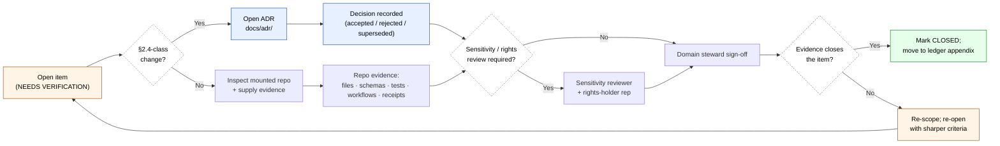

<!-- [KFM_META_BLOCK_V2]
doc_id: kfm://doc/archaeology-verification-backlog
title: Archaeology and Cultural Heritage — Verification Backlog
type: standard
version: v1
status: draft
owners: TODO — Docs steward + Archaeology domain steward
created: 2026-05-15
updated: 2026-05-15
policy_label: public
related:
  - docs/domains/archaeology/README.md
  - docs/registers/VERIFICATION_BACKLOG.md
  - docs/registers/DRIFT_REGISTER.md
  - docs/doctrine/directory-rules.md
  - docs/doctrine/lifecycle-law.md
  - docs/doctrine/trust-membrane.md
  - docs/adr/INDEX.md
tags: [kfm, archaeology, cultural-heritage, verification, governance, register]
notes:
  - Domain-scoped counterpart to docs/registers/VERIFICATION_BACKLOG.md.
  - Backlog items mirror KFM_Domains_Culmination_Atlas_v1_1.pdf §15.N.
  - Path placement follows Directory Rules §12 (Domain Placement Law).
[/KFM_META_BLOCK_V2] -->

# Archaeology and Cultural Heritage — Verification Backlog

> Tracks the unresolved checks that must pass before any Archaeology and Cultural Heritage claim, layer, or surface may be promoted to **PUBLISHED**.

<!-- Badge row — placeholders allowed; replace TODO targets with real badges when CI is wired. -->
[](#status--ownership)
[](#1-status--ownership)
[](README.md)
[](#3-deny-by-default-posture)
[](#last-reviewed)
[](../../../LICENSE)

> [!IMPORTANT]
> Archaeology and Cultural Heritage is a **deny-by-default sensitive lane**. Exact site coordinates, burial, human remains, sacred sites, and looting-risk detail fail closed unless steward/cultural review, a transform receipt, and an EvidenceBundle are present. ([`KFM_Domains_Culmination_Atlas_v1_1.pdf §15.I, §20.5`](#a-sources))

---

## Status & Ownership

| Field | Value |
|---|---|
| **Document type** | Domain verification register (standard doc) |
| **Authority of this register** | PROPOSED — pending mounted-repo verification and Docs/Archaeology steward sign-off |
| **Authority of items inside** | Each item carries its own status label (NEEDS VERIFICATION / PROPOSED / UNKNOWN) |
| **Proposed canonical home** | `docs/domains/archaeology/VERIFICATION_BACKLOG.md` |
| **Owner roles** | Archaeology domain steward · Sensitivity reviewer · Rights-holder representative · Docs steward |
| **Reviewers required for change** | Archaeology domain steward + Docs steward; ADR required for §2.4-class changes |
| **Related doctrine** | Directory Rules §12 (Domain Placement Law), §18 (Open Questions); KFM Operating Law (Sensitivity & rights posture, Publication gate) |
| **Supersedes** | Atlas v1.0 §15.N inline backlog (lifted into this register for trackable, ADR-able form) |
| **Lifecycle invariant** | RAW → WORK / QUARANTINE → PROCESSED → CATALOG / TRIPLET → PUBLISHED. Promotion is a **governed state transition, not a file move.** |

---

## 📑 Contents

- [1. Purpose](#1-purpose)
- [2. Path placement and authority](#2-path-placement-and-authority)
- [3. Deny-by-default posture](#3-deny-by-default-posture)
- [4. Verification flow](#4-verification-flow)
- [5. Backlog — open items](#5-backlog--open-items)
  - [5.1 BL-ARCH-01 — Steward authority and confidentiality](#51-bl-arch-01--steward-authority-and-confidentiality)
  - [5.2 BL-ARCH-02 — Public geometry thresholds and transform profiles](#52-bl-arch-02--public-geometry-thresholds-and-transform-profiles)
  - [5.3 BL-ARCH-03 — Oral history and cultural knowledge protocol](#53-bl-arch-03--oral-history-and-cultural-knowledge-protocol)
  - [5.4 BL-ARCH-04 — Emergency public-layer disablement and rollback drill](#54-bl-arch-04--emergency-public-layer-disablement-and-rollback-drill)
- [6. Related Open ADRs](#6-related-open-adrs)
- [7. Validator and test coverage map](#7-validator-and-test-coverage-map)
- [8. Triage and resolution workflow](#8-triage-and-resolution-workflow)
- [9. Definition of done](#9-definition-of-done)
- [10. Related docs](#10-related-docs)
- [Appendix A. Sources and lineage](#appendix-a-sources-and-lineage)
- [Appendix B. Field glossary](#appendix-b-field-glossary)

---

## 1. Purpose

This register names the **unresolved verifications** required before Archaeology and Cultural Heritage data can move from doctrine-level promises into implementation-bearing publication.

It exists because Archaeology sits in the highest-risk sensitivity tier of KFM: cultural sovereignty, looting risk, burial protection, and steward consultation make every promotion decision **policy-significant**. The doctrine is settled; the implementation is not. This document holds the gap visible, in trackable form, until each item is either closed by repo-grounded evidence or escalated to an ADR.

**Scope:**
- Items derived from `KFM_Domains_Culmination_Atlas_v1_1.pdf` §15.N (Archaeology — Verification backlog and open questions).
- Items inherited from the repo-wide register (`docs/registers/VERIFICATION_BACKLOG.md`) that specifically touch this lane.
- Items raised during steward review of new sources, schemas, or layers in this lane.

**Out of scope:**
- Object-family meaning (lives in `contracts/domains/archaeology/`).
- Field-level shape (lives in `schemas/contracts/v1/domains/archaeology/`).
- Admission / release decisions (lives in `policy/domains/archaeology/` and `release/candidates/archaeology/`).
- Cross-domain backlog (lives in `docs/registers/VERIFICATION_BACKLOG.md`).

---

## 2. Path placement and authority

> [!NOTE]
> **Directory Rules basis:** Per §12 (Domain Placement Law), a domain lives as a **segment** inside a responsibility root, never as a root itself. `docs/` is the canonical human-facing control plane (§5). Domain registers therefore belong at `docs/domains/<domain>/<REGISTER>.md`.

```text
docs/
└── domains/
    └── archaeology/
        ├── README.md                    # PROPOSED — domain landing page
        ├── VERIFICATION_BACKLOG.md      # ← this file (PROPOSED)
        ├── SOURCES.md                   # PROPOSED — source registry summary
        ├── SENSITIVITY.md               # PROPOSED — deny-by-default register slice
        └── adr/                         # PROPOSED — domain-scoped ADRs (if any)
```

| Aspect | Status | Basis |
|---|---|---|
| Responsibility root (`docs/`) | **CONFIRMED** as canonical | Directory Rules §5 |
| Domain segment placement | **CONFIRMED** as canonical pattern | Directory Rules §12 |
| Specific path (`docs/domains/archaeology/VERIFICATION_BACKLOG.md`) | **PROPOSED** | No mounted repo evidence this session |
| Companion path at repo-wide level | **PROPOSED** — `docs/registers/VERIFICATION_BACKLOG.md` | `KFM_Whole_UI_Governed_AI_Expansion_Report.pdf` §23 |

**NEEDS VERIFICATION** that no parallel domain register home exists at `archaeology/VERIFICATION_BACKLOG.md` (root level) or under `data/registry/archaeology/` — both would be drift entries per Directory Rules §3 (domains MUST NOT appear at root) and §4 Step 1 (registers are explanation, not data).

[⬆ back to top](#archaeology-and-cultural-heritage--verification-backlog)

---

## 3. Deny-by-default posture

This register operates inside the most restrictive sensitivity class in KFM. Items are not idle paperwork — leaving an item open is, by default, a **DENY** on the corresponding public surface.

| Class | Denied by default | Allowed only when |
|---|---|---|
| Archaeology | Exact sites, burial, human remains, sacred sites, looting-risk detail | Steward/cultural review **+** transform receipt **+** EvidenceBundle |
| Cultural heritage | Oral history, sacred routes, sovereign cultural archives | Consultation record **+** sensitivity transform **+** access class approval |
| 3D documentation | High-resolution surface/subsurface scans of sensitive contexts | Restricted store **+** transform receipts **+** review state |

Source: `KFM_Domains_Culmination_Atlas_v1_1.pdf` §15.I and §20.5; `kfm_encyclopedia.pdf` §13 (Sensitive / Deny-by-Default Register).

> [!CAUTION]
> An item shown here as **NEEDS VERIFICATION** is **not** an excuse to publish in the meantime. The default outcome for an unresolved Archaeology question is DENY, generalize, or quarantine — not "ship and revisit."

[⬆ back to top](#archaeology-and-cultural-heritage--verification-backlog)

---

## 4. Verification flow



<sub>Diagram is **PROPOSED**; it reflects Directory Rules §2.4 (ADR triggers), §18 (Open Questions), and the Atlas v1.1 §24.7 separation-of-duties matrix. Replace with the repo's actual workflow once observed in `tools/validators/` and `release/candidates/archaeology/`.</sub>

[⬆ back to top](#archaeology-and-cultural-heritage--verification-backlog)

---

## 5. Backlog — open items

Item IDs follow `BL-ARCH-NN` and are stable. When an item closes, the ID is retained in the ledger appendix; do not reuse it.

| ID | Item | Status | Suggested ADR | Owner role | Closure target |
|---|---|---|---|---|---|
| BL-ARCH-01 | Steward authority and confidentiality | NEEDS VERIFICATION | PROPOSED | Archaeology domain steward + Rights-holder rep | Per-root README + signed steward roster |
| BL-ARCH-02 | Public geometry thresholds and transform profiles | NEEDS VERIFICATION | PROPOSED | Sensitivity reviewer + Domain steward | Policy fixture + transform receipt schema |
| BL-ARCH-03 | Oral history and cultural knowledge protocol | NEEDS VERIFICATION | PROPOSED | Rights-holder rep + Sensitivity reviewer | Consultation record schema + access-class policy |
| BL-ARCH-04 | Emergency public-layer disablement and rollback drill | NEEDS VERIFICATION | PROPOSED | Release authority + Domain steward | Rollback card + drill receipt |

<sub>Source: `KFM_Domains_Culmination_Atlas_v1_1.pdf` §15.N (Archaeology). All four items carry status **NEEDS VERIFICATION** in the Atlas; ADR candidacy is **PROPOSED** here pending triage per Directory Rules §2.4.</sub>

---

### 5.1 BL-ARCH-01 — Steward authority and confidentiality

**Question.** Who has authority to admit, redact, or release Archaeology material, and under what confidentiality obligations? Specifically, how is the boundary drawn between **Source steward**, **Domain steward**, **Sensitivity reviewer**, and **Rights-holder representative** for this lane?

**Why it matters.** Per Atlas v1.1 §24.7 (Master Reviewer Role and Separation-of-Duties Matrix), KFM separates policy-significant release duties when maturity justifies it. Archaeology is explicitly named as a domain where author-also-approver is forbidden for source admission when sovereignty or rights are unresolved. Without a named, current roster, every promotion decision in this lane is **PROPOSED** at best.

**Required evidence (any of, ideally all).**
- A `CODEOWNERS` entry covering `docs/domains/archaeology/`, `contracts/domains/archaeology/`, `policy/domains/archaeology/`, and `release/candidates/archaeology/`.
- A per-root `README.md` in each of the above that names the owning steward and the reviewer roster.
- A confidentiality contract (or pointer to one) covering steward-only views (`steward exact-site review` per Atlas v1.1 §15.G).
- A test fixture exercising **role-collapse refusal** (`ROLE_COLLAPSE`, `ROLE_DOWNCAST_FORBIDDEN`) — Atlas v1.1 §24 error-code register.

**Status:** NEEDS VERIFICATION.
**ADR candidacy:** PROPOSED. Likely §2.4(5) class — naming reviewer roles may create or formalize a parallel authority surface; recommend an ADR if the roster spans multiple responsibility roots.

---

### 5.2 BL-ARCH-02 — Public geometry thresholds and transform profiles

**Question.** What are the canonical generalization thresholds, H3 resolution floors, and transform profiles that produce **public-safe** Archaeology geometry from **exact** Archaeology geometry?

**Why it matters.** Atlas v1.1 §15.I requires that exact archaeological locations fail closed. The Master MapLibre report (ML-061-159) explicitly states *any geometry below H3 r7 is prohibited for sensitive archaeology products*; Atlas v1.1 §20.5 requires generalization to use a **Redaction Receipt** (or `PublicationTransformReceipt`, named in Atlas v1.1 §15.C). Without committed thresholds and a receipt schema, every public Archaeology surface is a policy gap.

**Required evidence (any of, ideally all).**
- A policy file under `policy/domains/archaeology/` naming thresholds (H3 resolution floor, minimum aggregation buffer, suppression rules for burial/sacred contexts).
- A `PublicationTransformReceipt` schema under `schemas/contracts/v1/domains/archaeology/`.
- Fixtures under `fixtures/domains/archaeology/` proving **deny on raw exact geometry** and **allow on generalized geometry** (Master MapLibre report: "Sensitive geometry deny and generalized-geometry allow tests").
- A no-leak test under `tests/domains/archaeology/` proving public artifacts contain no exact coordinates.

**Status:** NEEDS VERIFICATION.
**ADR candidacy:** PROPOSED — could fold into Atlas §24.12 ADR-S-05 (sensitivity tier scheme) or stand alone as an Archaeology-specific transform-profile ADR.

> [!WARNING]
> The H3 r7 floor is sourced from `Master_MapLibre_Components-Functions-Features_compressed.pdf` (SRC-061, pp.228–229) — **CONFIRMED in source, PROPOSED for KFM canonical adoption**. Do not treat as enforced until a policy file and passing fixture exist.

---

### 5.3 BL-ARCH-03 — Oral history and cultural knowledge protocol

**Question.** How does KFM admit, store, attribute, generalize, and (where appropriate) refuse to publish oral history and cultural knowledge — including sacred routes, place names, and tribal/community-held narrative evidence?

**Why it matters.** Atlas v1.1 §15.D names *oral history and cultural knowledge* as a permitted source family with rights and current terms **NEEDS VERIFICATION** and sensitive joins that fail closed. The deny-by-default register (Atlas §20.5; encyclopedia §13) lists "Sacred/culturally sensitive places — DENY until steward review and access class approve." Without a documented protocol covering custodianship, consent, sovereignty notice (CARE labels per ML-061-160), and refusal-to-publish, oral-history evidence cannot lawfully enter the lifecycle.

**Required evidence (any of, ideally all).**
- A `SourceDescriptor` profile for oral-history sources naming custodian, consent basis, access class, attribution requirements, and freshness/withdrawal rules.
- A consultation-record object family (or extension of `CulturalReview` per Atlas §15.C) with a schema and at least one fixture.
- CARE label / sovereignty notice chip behavior wired into the Evidence Drawer payload (ML-061-160 / ML-061-161).
- A policy gate that **denies** oral-history-derived public claims absent a current consultation record.

**Status:** NEEDS VERIFICATION.
**ADR candidacy:** PROPOSED. May intersect Atlas §24.12 ADR-S-04 (source-role enum) if oral-history requires a distinct source role beyond `authority / observation / context / model`.

---

### 5.4 BL-ARCH-04 — Emergency public-layer disablement and rollback drill

**Question.** When an Archaeology public layer must be **immediately withdrawn** (e.g., newly identified looting risk, retroactive sovereignty objection, source-rights revocation), what is the verified path from detection to a restored prior `ReleaseManifest`?

**Why it matters.** KFM Operating Law requires corrections, withdrawals, supersession, and rollback cards to remain visible and auditable. Atlas v1.1 §15.M makes this explicit for Archaeology: publication requires `ReleaseManifest`, correction path, stale-state rule, and **rollback target**. The encyclopedia Appendix K names a `Rollback drill` as required to establish reversibility. Until the drill has been run end-to-end on this lane, reversibility is asserted but not proven.

**Required evidence (any of, ideally all).**
- A `RollbackCard` instance under `release/candidates/archaeology/` referencing a prior `ReleaseManifest`.
- A workflow (`.github/workflows/...`) that exercises the rollback dry-run with a synthetic archaeology layer.
- A `CorrectionNotice` schema covering Archaeology-specific reasons (sovereignty objection, looting-risk discovery, source-rights revocation).
- A test fixture proving that public surfaces honor the stale-state rule after rollback (no cached layer continues to serve withdrawn evidence).

**Status:** NEEDS VERIFICATION.
**ADR candidacy:** PROPOSED — likely covered by a forthcoming rollback-discipline ADR rather than Archaeology-specific; track in `docs/adr/INDEX.md` once filed.

[⬆ back to top](#archaeology-and-cultural-heritage--verification-backlog)

---

## 6. Related Open ADRs

These ADRs (PROPOSED, drawn from Atlas v1.1 §24.12 Master Open-ADR Backlog) are not Archaeology-specific but **gate** items in this register. Movement on any of them may unblock multiple backlog items here.

| ADR ID (proposed) | Title | Why it gates Archaeology | Source |
|---|---|---|---|
| ADR-S-01 | Schema home: `schemas/contracts/v1/…` (confirm or amend ADR-0001) | All Archaeology object schemas land here; closure is precondition for BL-ARCH-02 | Atlas v1.1 §24.12 |
| ADR-S-03 | Receipt class home (`receipts/` vs `<domain>/receipts/`) | `PublicationTransformReceipt` and `RedactionReceipt` placement affects BL-ARCH-02 | Atlas v1.1 §24.12 |
| ADR-S-04 | Source-role enum (vocabulary and evolution rule) | BL-ARCH-03 may require a role distinct from `authority / observation / context / model` | Atlas v1.1 §24.12 |
| ADR-S-05 | Sensitivity tier scheme (T0–T4) | Frames thresholds in BL-ARCH-02 and access classes in BL-ARCH-01, BL-ARCH-03 | Atlas v1.1 §24.12 |

> [!NOTE]
> **NEEDS VERIFICATION**: whether any of these ADRs have already been filed in the mounted repo's `docs/adr/` tree. The list above is taken from doctrine, not from repo evidence.

[⬆ back to top](#archaeology-and-cultural-heritage--verification-backlog)

---

## 7. Validator and test coverage map

Each backlog item maps to one or more validator/test families. Until a passing test exists, the item stays open. Validator names below are **PROPOSED** unless mounted-repo evidence confirms them under `tools/validators/` and `tests/domains/archaeology/`.

| Backlog item | Validator / test family | Atlas reference |
|---|---|---|
| BL-ARCH-01 | Role-collapse refusal tests; CODEOWNERS coverage scan | §24.7 (separation-of-duties); §15.K (rights and cultural-review tests) |
| BL-ARCH-02 | Exact sensitive geometry denial; generalized-geometry allow; public no-leak; transform-receipt closure | §15.K (PROPOSED bullets); ML-061-159; ML-061-161 |
| BL-ARCH-03 | Source-rights validation; CARE-label / sovereignty-chip presence; consultation-record presence | §15.K (rights and cultural-review tests); ML-061-160 |
| BL-ARCH-04 | Rollback drill; stale-state handling; correction lineage non-regression | §15.M; encyclopedia Appendix K |

Cross-cutting validators that **also** apply (per Atlas §15.K / encyclopedia §K):

- Schema validation · SourceDescriptor validation · Rights validation · Sensitivity validation
- EvidenceBundle closure · Citation validation · Temporal logic · Geometry validity
- Policy deny tests · ReleaseManifest validation · No-network fixtures · Non-regression tests

[⬆ back to top](#archaeology-and-cultural-heritage--verification-backlog)

---

## 8. Triage and resolution workflow

> [!TIP]
> Treat this register like a slow-burn issue tracker: items do not need to close fast, but they must close **explicitly**, with evidence, and never silently.

1. **Open / refine.** When an Atlas, dossier, or steward review surfaces a new check, add it here with an ID, a question, "why it matters," and "required evidence." Status starts at NEEDS VERIFICATION or UNKNOWN.
2. **Classify.** Decide whether the item is §2.4-class (needs ADR) or routine (per-root README / fixture / policy file). Mark suggested ADR if applicable.
3. **Assign.** Name the owner **role** (not a person), referencing Atlas v1.1 §24.7.
4. **Resolve.** Supply evidence — files, schemas, tests, workflows, manifests, receipts — under the responsibility root that owns it. Cite the path(s) in the item's closure note.
5. **Close.** Move the item to the ledger appendix with closure date and pointer to evidence. **Retain the ID.**
6. **Review.** Every six months, the Docs steward audits closed items for drift. If a closure no longer holds, re-open under the same ID with a "re-opened on" date.

Closure of an item never weakens deny-by-default posture. A closed item means *we now have evidence for the gate*, not *the gate is removed*.

[⬆ back to top](#archaeology-and-cultural-heritage--verification-backlog)

---

## 9. Definition of done

An item is **DONE** only when **all** of the following hold:

- [ ] The required evidence is committed, reachable, and inspected — not just described.
- [ ] Validators in `tools/validators/` exercise it; tests in `tests/domains/archaeology/` pass on it.
- [ ] If §2.4-class, an **accepted** ADR exists and is linked from `docs/adr/INDEX.md`.
- [ ] If the change affects public surfaces, a fresh **rollback drill** has been recorded against this lane.
- [ ] The relevant `README.md` files (per Directory Rules §15 Required README Contract) name the responsible reviewer.
- [ ] Closure is reflected here **and** in `docs/registers/VERIFICATION_BACKLOG.md` if the item was inherited from there.

[⬆ back to top](#archaeology-and-cultural-heritage--verification-backlog)

---

## 10. Related docs

- [`docs/domains/archaeology/README.md`](README.md) — *(PROPOSED)* domain landing page.
- [`docs/registers/VERIFICATION_BACKLOG.md`](../../registers/VERIFICATION_BACKLOG.md) — *(PROPOSED)* repo-wide register.
- [`docs/registers/DRIFT_REGISTER.md`](../../registers/DRIFT_REGISTER.md) — *(PROPOSED)* for conflicts between this register and mounted-repo state.
- [`docs/doctrine/directory-rules.md`](../../doctrine/directory-rules.md) — placement law (§12 Domain Placement Law, §18 Open Questions).
- [`docs/doctrine/lifecycle-law.md`](../../doctrine/lifecycle-law.md) — *(PROPOSED)* RAW → PUBLISHED invariant.
- [`docs/doctrine/trust-membrane.md`](../../doctrine/trust-membrane.md) — *(PROPOSED)* public clients go through governed APIs.
- `docs/adr/INDEX.md` — *(TODO: link once ADR home is verified)* — accepted and pending ADRs that gate items here.

---

## Appendix A. Sources and lineage

<details>
<summary><strong>Source documents this register is grounded in (click to expand)</strong></summary>

| Source | Section(s) | What it grounds here |
|---|---|---|
| `KFM_Domains_Culmination_Atlas_v1_1.pdf` | §15.A–N (Archaeology and Cultural Heritage) | The four backlog items, object families, lifecycle stages, sensitivity posture, validator list |
| `KFM_Domains_Culmination_Atlas_v1_1.pdf` | §20.5 (Deny-by-Default Register) | Archaeology row of the deny matrix |
| `KFM_Domains_Culmination_Atlas_v1_1.pdf` | §24.7 (Master Reviewer Role and Separation-of-Duties Matrix) | Owner roles named in items 5.1–5.4 |
| `KFM_Domains_Culmination_Atlas_v1_1.pdf` | §24.12 (Master Open-ADR Backlog) | Cross-references in §6 |
| `kfm_encyclopedia.pdf` | §7.13 (Archaeology and Cultural Heritage) | Mission, canonical object families, sensitivity model |
| `kfm_encyclopedia.pdf` | §13 (Sensitive / Deny-by-Default Register) | Archaeology row; sacred/culturally sensitive places row |
| `kfm_encyclopedia.pdf` | Appendix J (Open questions); Appendix K (Verification backlog) | Format and discipline for this register |
| `Master_MapLibre_Components-Functions-Features_compressed.pdf` | ML-061-159 / ML-061-160 / ML-061-161 / ML-061-162 / ML-061-163 | H3 r7 floor, CARE labels, sovereignty chips, generalization-log requirement, Focus Mode sensitivity gating |
| `Master_MapLibre_Components-Functions-Features_compressed.pdf` | §14 (Open Questions and Verification Backlog) | Sensitive-geometry-transform rules row |
| `KFM_Whole_UI_Governed_AI_Expansion_Report.pdf` | §23 (Documentation/control-plane impact); §11 (Required files that should exist next) | Companion repo-wide path `docs/registers/VERIFICATION_BACKLOG.md` |
| `directory-rules.md` | §3, §4, §5, §12, §15, §18 | Path placement; README contract; open-question discipline |

</details>

<details>
<summary><strong>Lineage (click to expand)</strong></summary>

- Atlas v1.1 §15.N is the **direct parent** of the four open items here. v1.1 explicitly notes (§v1.1 front matter, Ch. 24.12) that v1.0 per-domain N. (Verification backlog) entries feed the Master Open-ADR Backlog; this domain register is the per-domain expression of that flow.
- Atlas v1.1 front matter further records the **conflict rule**: where a v1.1 register and a v1.0 section appear to disagree, **v1.0 retains authority** and the conflict is filed to `docs/registers/DRIFT_REGISTER.md` per Directory Rules §2.5.

</details>

[⬆ back to top](#archaeology-and-cultural-heritage--verification-backlog)

---

## Appendix B. Field glossary

<details>
<summary><strong>KFM terms used in this register (preserved exactly)</strong></summary>

- **EvidenceBundle** — the resolved evidence object that outranks generated language and search/derived indexes (KFM Operating Law).
- **EvidenceRef** — pointer that must resolve to an EvidenceBundle when claims depend on evidence.
- **SourceDescriptor** — admission-and-authority record for a source family (identity, role, rights, sensitivity, cadence, steward).
- **ReleaseManifest** — release decision artifact; preconditioned on validation, policy, review, evidence, correction path, and rollback target.
- **RollbackCard** — reversibility record pointing to a prior `ReleaseManifest`.
- **CorrectionNotice** — post-publication correction artifact.
- **CulturalReview** / **StewardReview** — Archaeology object families capturing the review state required before promotion.
- **SensitivityTransform** — Archaeology object family covering the generalization / redaction transform applied prior to public emission.
- **PublicationTransformReceipt** — receipt proving the transform was applied; emitted alongside lifecycle directories.
- **CandidateFeature** — an anomaly / lead that is **not** a confirmed site; promotion to `ArchaeologicalSite` requires evidence and review.
- **CARE labels** — *Collective benefit, Authority to control, Responsibility, Ethics* — sovereignty-aware annotation pattern (Master MapLibre SRC-061).
- **H3 resolution floor** — minimum H3 resolution permitted for sensitive products (Master MapLibre: r7 for Archaeology).
- **RAW → WORK / QUARANTINE → PROCESSED → CATALOG / TRIPLET → PUBLISHED** — lifecycle invariant. Promotion is a **governed state transition, not a file move.**

</details>

[⬆ back to top](#archaeology-and-cultural-heritage--verification-backlog)

---

## Last reviewed

`2026-05-15` — initial draft. Next review due **2026-11-15** per Directory Rules §15 ("Older than 6 months → flag for review").

---

<sub>**Status legend** — CONFIRMED · INFERRED · PROPOSED · UNKNOWN · NEEDS VERIFICATION · EXTERNAL. Memory is not evidence. No repo-state claim in this document has been verified against a mounted repository in this session; all path-shaped statements are PROPOSED until inspected.</sub>

[⬆ back to top](#archaeology-and-cultural-heritage--verification-backlog)
