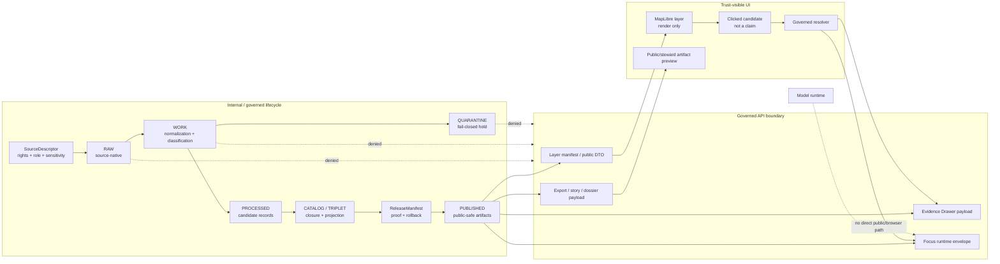

<!-- [KFM_META_BLOCK_V2]
doc_id: kfm://doc/NEEDS_VERIFICATION__docs_domains_archaeology_architecture_api_and_ui_surfaces
title: Archaeology API and UI Surfaces
type: standard
version: v1
status: draft
owners: TODO-NEEDS-OWNER
created: NEEDS_VERIFICATION__YYYY-MM-DD
updated: 2026-05-06
policy_label: public-draft-NEEDS_VERIFICATION
related: [../README.md, ./ARCHITECTURE.md, ../../../architecture/governed-api.md, ../../../adr/ADR-0003-maplibre-renderer-boundary.md, ../../../adr/ADR-0009-sensitive-location-policy.md, ../../../../policy/crosswalk/source-role-to-claim-policy.md, ../../../../policy/crosswalk/domain-lane-policy-map.md]
tags: [kfm, archaeology, api, ui, governed-api, maplibre, evidence-drawer, focus-mode, sensitivity, exact-location-deny]
notes: [Revises existing thin archaeology API/UI surface doc. GitHub connector confirmed this target file exists on main but only contains a short boundary stub. Owners, created date, final doc_id, policy label, route names, schema enforcement, CI status, and runtime maturity require verification.]
[/KFM_META_BLOCK_V2] -->

<a id="top"></a>

# Archaeology API and UI Surfaces

Define the governed API, MapLibre, Evidence Drawer, Focus Mode, review, export, and public/steward UI boundaries for the KFM Archaeology lane.

<p align="center">
  
  
  
  
  
</p>

<p align="center">
  <a href="#surface-law">Surface law</a> ·
  <a href="#repo-fit">Repo fit</a> ·
  <a href="#boundary-flow">Boundary flow</a> ·
  <a href="#accepted-inputs">Inputs</a> ·
  <a href="#exclusions">Exclusions</a> ·
  <a href="#api-surface-families">API</a> ·
  <a href="#ui-surface-families">UI</a> ·
  <a href="#payload-contract-sketches">Payloads</a> ·
  <a href="#validation-gates">Validation</a> ·
  <a href="#rollback-and-incident-response">Rollback</a> ·
  <a href="#open-verification">Open verification</a>
</p>

> [!IMPORTANT]
> Archaeology surfaces are **governed interfaces**, not convenience endpoints. Public and ordinary UI clients must consume released, policy-safe artifacts and governed API envelopes only. Exact archaeological site locations are denied by default unless a reviewed policy decision and public-safe transform explicitly allow a narrower release.

> [!WARNING]
> A site can leak through more than a point coordinate. Tiles, popups, map feature properties, graph edges, exports, screenshots, search results, source IDs, bounding boxes, centroids, permalink state, and Focus Mode context can all reintroduce restricted location detail. The API/UI boundary must be validated as one leak surface.

---

## Surface law

KFM’s archaeology API and UI surfaces inherit the lane architecture rule:

```text
RAW -> WORK / QUARANTINE -> PROCESSED -> CATALOG / TRIPLET -> PUBLISHED
     -> governed API -> trust-visible UI
```

The archaeology surface contract is:

1. **Public clients never read RAW, WORK, QUARANTINE, restricted exact geometry, source-native records, canonical internal stores, graph internals, vector indexes, or model runtimes directly.**
2. **MapLibre identifies visual candidates; the governed API resolves meaning.**
3. **Evidence Drawer explains claims through source role, evidence, rights, sensitivity, review state, release state, correction state, and transform state.**
4. **Focus Mode answers only from released or review-authorized evidence context and returns finite outcomes: `ANSWER`, `ABSTAIN`, `DENY`, or `ERROR`.**
5. **Exact public site-location requests deny by default.**
6. **Remote-sensing, LiDAR, aerial, geophysical, or model anomalies remain candidate features until evidence and review support stronger classification.**
7. **Public-safe geometry requires a transform receipt and release linkage.**
8. **Corrections, withdrawals, supersessions, and rollback targets stay visible after release.**

The safest default is boring and explicit: when the API cannot prove evidence, rights, sensitivity, review, release, and public-safe precision, it should return `ABSTAIN`, `DENY`, or `ERROR` rather than polished uncertainty.

[Back to top](#top)

---

## Repo fit

| Field | Value |
|---|---|
| Target path | `docs/domains/archaeology/architecture/API_AND_UI_SURFACES.md` |
| Owning root | `docs/` — human-facing control plane |
| Domain lane | `docs/domains/archaeology/` |
| Architecture peer | [`./ARCHITECTURE.md`](./ARCHITECTURE.md) |
| Domain landing page | [`../README.md`](../README.md) |
| System API boundary | [`../../../architecture/governed-api.md`](../../../architecture/governed-api.md) |
| Renderer boundary | [`../../../adr/ADR-0003-maplibre-renderer-boundary.md`](../../../adr/ADR-0003-maplibre-renderer-boundary.md) |
| Sensitive-location policy | [`../../../adr/ADR-0009-sensitive-location-policy.md`](../../../adr/ADR-0009-sensitive-location-policy.md) |
| Source-role policy | [`../../../../policy/crosswalk/source-role-to-claim-policy.md`](../../../../policy/crosswalk/source-role-to-claim-policy.md) |
| Domain policy map | [`../../../../policy/crosswalk/domain-lane-policy-map.md`](../../../../policy/crosswalk/domain-lane-policy-map.md) |
| Current file status | CONFIRMED target file exists on `main`; this revision expands a thin boundary stub |
| Archaeology-specific route status | NEEDS VERIFICATION — route names, handlers, OpenAPI entries, tests, and runtime behavior are not asserted here |
| Implementation posture | Standard architecture doc; not a schema, route implementation, policy engine, source registry, or release artifact |

> [!NOTE]
> Path note: this file is intentionally under `docs/domains/archaeology/architecture/` because it explains architecture behavior for the archaeology lane. It should not create a root-level archaeology folder or duplicate machine-contract authority.

---

## Boundary flow



A map click is a candidate-resolution event, not proof. It may carry layer ID, feature ID, public-safe geometry, time scope, and release context to the governed resolver. The resolver decides whether the user sees an evidence-backed drawer, an abstention, a denial, or an error.

[Back to top](#top)

---

## Accepted inputs

The API may accept bounded request context. Accepted does not mean publishable.

| Input | Accepted from | Required guardrail |
|---|---|---|
| `layer_id` | Map shell, catalog, export preview | Must resolve to released or review-authorized archaeology layer manifest |
| `public_feature_id` | Map click, hover, selection, export | Must not encode restricted exact geometry or source-native ID |
| `evidence_ref` | Evidence Drawer, Focus, review | Must resolve to `EvidenceBundle` for consequential `ANSWER` |
| `release_id` / `release_ref` | Layer catalog, story, export | Must bind artifacts to review, proof, correction, and rollback state |
| `time_scope` | Timeline, compare, Focus, review | Must preserve valid/source/release/stale/correction time where material |
| `map_context` | MapLibre shell | Candidate context only; not evidence authority |
| `review_action` | Steward/review console | Role-gated, auditable, and rollback-aware |
| `focus_question` | Focus Mode | Evidence-bounded and policy-prechecked before model invocation |
| `export_request` | Export/story/dossier surface | Must inherit release, citation, sensitivity, and correction state |
| `transform_receipt_ref` | Public-safe geometry payloads | Required when exact geometry is suppressed, generalized, aggregated, withheld, or otherwise transformed |

---

## Exclusions

| Excluded from public or ordinary UI/API surfaces | Reason | Required outcome |
|---|---|---|
| RAW, WORK, or QUARANTINE payloads | Pre-publication lifecycle state | `DENY` / `ERROR` |
| Restricted exact site geometry | Archaeology exposure and looting risk | `DENY` |
| Burial, human-remains, sacred-site, or culturally sensitive precise location | High sensitivity and steward/cultural review burden | `DENY` or restricted review path |
| Private landowner identity, access path, collection storage, or security detail | Privacy and security risk | `DENY` |
| Unreviewed candidate anomaly labeled as confirmed site | Remote sensing or models are not confirmation | `ABSTAIN` or candidate-only response |
| Unknown-rights public artifact | Redistribution/use rights unresolved | `DENY` |
| Unknown sensitivity public artifact | Public precision unresolved | `DENY` / `QUARANTINE` |
| UI-only hiding of restricted features | Client-side filtering can leak existence, count, or geometry | `DENY` promotion |
| Raw model or vector-index answer | AI/search is derivative, not evidence | `ABSTAIN`, `DENY`, or `ERROR` |
| Public popup with consequential uncited claim | Popups cannot replace Evidence Drawer | `ABSTAIN` or drawer-required state |
| Export that strips trust metadata | Outward artifacts must preserve evidence/release/correction context | `DENY` export |

[Back to top](#top)

---

## API surface families

Route names below are **surface families**, not confirmed route implementations. Implementers should map them to the repo’s confirmed API framework and OpenAPI conventions.

| Surface family | Intended clients | Minimum response object | Public posture |
|---|---|---|---|
| Public layer manifest | Map shell, catalog, export preview | `ArchaeologyLayerManifest` / `LayerManifest` | Released public-safe layers only |
| Public feature explain | Map click, popup affordance, Evidence Drawer | `EvidenceDrawerPayload` or finite negative envelope | No exact sensitive geometry; no unsupported claim |
| Public summary / aggregate | Public map, story, dossier, export | `PublicSafeSummaryDTO` | Generalized, aggregated, or withheld-detail summary only |
| Candidate-feature explain | Review console, steward users, internal QA | `CandidateFeatureDTO` with review state | Public view must label candidate status or withhold |
| Steward review queue | Review console | `ReviewQueueItem`, `ReviewRecord` | Role-gated; audit receipt required |
| Sensitivity / transform status | Review console, release validator, Evidence Drawer | `SensitivityClassification`, `TransformReceiptRef` | Public version shows generalized/withheld state without leaking details |
| Evidence bundle lookup | Evidence Drawer, Focus, reviewer tools | `EvidenceBundle` or safe failure envelope | Only public-safe support returned to public users |
| Focus Mode answer | Focus panel | `RuntimeResponseEnvelope` | `ANSWER`, `ABSTAIN`, `DENY`, or `ERROR` only |
| Export / story / dossier | Export panel, Story surface | `ExportManifestPreview` / story payload | Trust metadata travels with artifact |
| Correction / withdrawal state | Map shell, Evidence Drawer, export, Focus | `CorrectionNotice`, `RollbackCardRef` | Must stay visible after public meaning changes |
| Health / diagnostic | Operators, CI, local runtime | safe diagnostic envelope | Must not leak internal stores, secrets, paths, source credentials, or restricted state |

### API response obligations

Every archaeology API family that can affect a public or semi-public claim should preserve:

- `outcome`
- `reason_code`
- `claim_type`
- `source_role`
- `evidence_ref` and/or `evidence_bundle_ref`
- `policy_decision_ref`
- `release_ref`
- `review_state`
- `sensitivity_state`
- `geometry_publication_state`
- `transform_receipt_ref` when public geometry has been altered
- `freshness_state` when time or source currency matters
- `correction_state`
- `limitations`
- `obligations`

[Back to top](#top)

---

## UI surface families

| UI surface | Primary role | Required trust behavior |
|---|---|---|
| MapLibre archaeology layer | Show released public-safe spatial context | Renders only manifest-bound artifacts; never treats feature properties as evidence authority |
| Popup / hover affordance | Lightweight orientation | No consequential claim unless already supported; should route to Evidence Drawer |
| Evidence Drawer | Main trust object for selected claim/layer/feature | Shows source role, evidence, rights, sensitivity, review, release, transform, correction, and limitations |
| Focus Mode | Evidence-bounded synthesis over admissible context | Finite outcomes only; no exact-location answer for public users |
| Timeline / compare mode | Time-aware exploration | Active time scope travels to drawer and Focus; visual time cannot silently diverge from evidence time |
| Review console | Steward and policy review | Role-gated actions; review state changes are explicit, logged, and separate from public display |
| Export / story / dossier | Outward artifact packaging | Citations, release ID, correction state, generalization state, and trust metadata travel with export |
| Diagnostics | Authorized runtime/manifest inspection | Not a public backdoor to raw/canonical/restricted stores |

### UI negative states

The UI must distinguish negative and bounded states rather than hiding them behind empty panels:

| State | User-facing meaning |
|---|---|
| `MISSING_EVIDENCE` | Evidence support cannot be resolved |
| `DENIED_BY_POLICY` | Policy blocks the requested detail |
| `GENERALIZED_GEOMETRY` | Geometry has been transformed for public safety |
| `WITHHELD_LOCATION` | KFM has evidence but cannot expose precise location |
| `RESTRICTED_ACCESS` | User lacks role or review authorization |
| `CANDIDATE_ONLY` | The feature is an unconfirmed candidate/anomaly |
| `SOURCE_STALE` | Source or release is stale for the requested claim |
| `CITATION_FAILED` | A proposed answer or claim lacks citation support |
| `RELEASE_WITHDRAWN` | Release has been withdrawn or superseded |
| `CONFLICTED_SUPPORT` | Evidence conflicts or is not sufficient to answer |
| `RUNTIME_ERROR` | Resolver, schema, policy, or runtime failure |

> [!TIP]
> The best public archaeology UI often explains **why precision is withheld** more clearly than it shows where a thing is.

[Back to top](#top)

---

## Payload contract sketches

The examples below are **illustrative sketches**, not confirmed JSON Schemas. They should be converted into repo-native schemas and fixtures only after schema-home and API conventions are verified.

### Public layer manifest sketch

```json
{
  "schema": "kfm.archaeology.layer_manifest.v1",
  "layer_id": "archaeology.public.generalized_sites.v1",
  "domain": "archaeology",
  "release_id": "kfm://release/NEEDS_VERIFICATION",
  "artifact_refs": [
    "kfm://artifact/NEEDS_VERIFICATION_PUBLIC_SAFE_TILE"
  ],
  "geometry_policy": {
    "public_exact_geometry_allowed": false,
    "public_geometry_state": "generalized | aggregated | withheld | suppressed",
    "transform_receipt_required": true,
    "withheld_accounting_required": true
  },
  "evidence_policy": {
    "requires_evidence_bundle": true,
    "supports_popup_claims": false,
    "drawer_payload_contract": "ArchaeologyEvidenceDrawerPayload.v1"
  },
  "time_model": [
    "valid_time",
    "source_publication_time",
    "review_time",
    "release_time",
    "correction_transaction_time"
  ],
  "trust_badges": [
    "released",
    "public_safe",
    "generalized_geometry",
    "citable"
  ],
  "correction_state": "current | corrected | superseded | withdrawn"
}
```

### Evidence Drawer payload sketch

```json
{
  "schema": "kfm.archaeology.evidence_drawer_payload.v1",
  "selection_id": "kfm://selection/NEEDS_VERIFICATION",
  "outcome": "ANSWER | ABSTAIN | DENY | ERROR",
  "candidate_feature": {
    "layer_id": "archaeology.public.generalized_sites.v1",
    "public_feature_id": "public_safe_id_only",
    "geometry_state": "generalized",
    "exact_geometry_present": false
  },
  "claim_summary": "Public-safe archaeology context summary.",
  "claim_type": "public_safe_summary | candidate_feature | source_stated_context",
  "source_roles": [
    "documentary_archival",
    "statutory_administrative",
    "direct_observational_instrumented"
  ],
  "evidence_bundle_refs": [
    "kfm://evidence-bundle/NEEDS_VERIFICATION"
  ],
  "policy": {
    "policy_decision_ref": "kfm://policy-decision/NEEDS_VERIFICATION",
    "sensitivity_state": "sensitive_location",
    "public_exact_location": "DENY",
    "reason_codes": [
      "sensitivity.exact_location"
    ],
    "obligations": [
      "generalize",
      "cite",
      "preserve_correction_state"
    ]
  },
  "review_state": "approved_public_safe | pending | denied | steward_only | unknown",
  "release_ref": "kfm://release/NEEDS_VERIFICATION",
  "transform_receipt_refs": [
    "kfm://receipt/geoprivacy/NEEDS_VERIFICATION"
  ],
  "time_scope": {
    "valid_time": "NEEDS_VERIFICATION",
    "source_publication_time": "NEEDS_VERIFICATION",
    "review_time": "NEEDS_VERIFICATION",
    "release_time": "NEEDS_VERIFICATION"
  },
  "correction_state": "current",
  "limitations": [
    "Exact location withheld by policy.",
    "Candidate features require review before confirmation."
  ]
}
```

### Focus Mode response sketch

```json
{
  "schema": "kfm.archaeology.focus_mode_response.v1",
  "request_id": "kfm://focus-request/NEEDS_VERIFICATION",
  "outcome": "ANSWER | ABSTAIN | DENY | ERROR",
  "reason_code": "sensitivity.exact_location",
  "answer": null,
  "safe_explanation": "Exact archaeological site locations are withheld on public surfaces. Use the Evidence Drawer for public-safe context and source support.",
  "evidence_bundle_refs": [],
  "policy_decision_ref": "kfm://policy-decision/NEEDS_VERIFICATION",
  "citation_validation_report_ref": null,
  "release_ref": "kfm://release/NEEDS_VERIFICATION",
  "review_state": "restricted_or_steward_review_required",
  "obligations": [
    "do_not_disclose_exact_location",
    "preserve_public_safe_generalization"
  ],
  "receipt_refs": [
    "kfm://ai-receipt/NEEDS_VERIFICATION"
  ]
}
```

[Back to top](#top)

---

## Source role and claim limits

Archaeology surfaces should preserve source-role limits so the UI does not overstate certainty.

| Source role | API/UI may say | API/UI must not say |
|---|---|---|
| `documentary_archival` | “The source depicts / describes / records…” | “This is the current exact site boundary” unless separately supported |
| `statutory_administrative` | “The inventory or administrative record designates…” | “This proves cultural truth, ownership, or exact public location” |
| `direct_observational_instrumented` | “The field/survey/lab record observed…” | “This authorizes public disclosure” |
| `modeled_assimilated_derived` | “The model/anomaly suggests a candidate feature…” | “This confirms an archaeological site” |
| `community_contributed` | “A contributor reported…” | “KFM verified…” without review/evidence |
| `authority_crosswalk_system` | “This crosswalk maps an identifier/name…” | “These records are identical” when ambiguity remains |
| `mirror_discovery_service` | “The catalog indexes…” | “The origin source proves…” |

### Candidate-feature language

Use candidate language when support is interpretive, modeled, remote-sensed, or unreviewed:

| Better wording | Avoid |
|---|---|
| “candidate feature” | “confirmed site” |
| “possible anomaly” | “settlement” |
| “requires review” | “known archaeology” |
| “public-safe generalized context” | “site location” |
| “source states” | “KFM proves” |

---

## Validation gates

| Gate | Must prove | Failure outcome |
|---|---|---|
| Source descriptor gate | Source identity, source role, rights posture, sensitivity hints, cadence, and citation rules exist | `ABSTAIN`, `DENY`, or `QUARANTINE` |
| Evidence closure gate | `EvidenceRef` resolves to `EvidenceBundle` before `ANSWER` | `ABSTAIN` or `ERROR` |
| Rights gate | Public or steward surface is compatible with rights and redistribution rules | `DENY` |
| Sensitivity gate | Public surface does not expose exact sensitive location or reverse-engineering proxy | `DENY` |
| Transform receipt gate | Any public-safe generalized/suppressed/aggregated geometry has a receipt | `DENY` promotion |
| Candidate-feature gate | Remote-sensing/model/geophysical candidate is not labeled as confirmed | `ABSTAIN` or candidate-only `ANSWER` |
| Review gate | Steward, cultural, rights, or sensitivity review exists when required | `HOLD`, `ABSTAIN`, or `DENY` |
| Layer manifest gate | Map layer is release-bound, evidence-bound, sensitivity-aware, and correction-aware | `DENY` layer publication |
| Evidence Drawer gate | Drawer payload carries source role, evidence, policy, review, release, transform, and correction state | `ERROR` or block merge |
| Focus Mode gate | Context is released/public-safe; citations validate; exact-location request denied | `ABSTAIN`, `DENY`, or `ERROR` |
| Export/story gate | Trust metadata survives export; no sensitive data leaks through narrative or screenshot | `DENY` export |
| No-bypass gate | Browser/API code cannot reach raw/work/quarantine, direct model runtime, or restricted stores | `ERROR` / CI failure |
| Correction/rollback gate | Release can be corrected, withdrawn, superseded, and rolled back | `DENY` release |

### Minimum fixture matrix

| Fixture | Expected result |
|---|---|
| `public_generalized_site.valid.json` | `ANSWER` with `GENERALIZED_GEOMETRY` and transform receipt |
| `exact_site_public_request.denied.json` | `DENY` with `sensitivity.exact_location` |
| `unreviewed_lidar_candidate.valid_candidate.json` | candidate-only response; no confirmed-site claim |
| `unknown_rights_public_layer.denied.json` | `DENY` |
| `missing_evidence_bundle.abstain.json` | `ABSTAIN` |
| `drawer_payload_leaks_coordinate.invalid.json` | validation failure |
| `focus_exact_location.denied.json` | `DENY` |
| `popup_uncited_claim.invalid.json` | validation failure |
| `withdrawn_release.denied.json` | `DENY` or withdrawn-state payload |
| `export_strips_trust_metadata.invalid.json` | validation failure |

[Back to top](#top)

---

## Implementation checklist

A PR that changes archaeology API/UI behavior should include a compact review card:

| Review question | Required answer |
|---|---|
| Owning root | `docs/`, `schemas/`, `contracts/`, `policy/`, `tests/`, `fixtures/`, `tools/`, `apps/`, `data/`, or `release/` |
| Directory Rules basis | Why this path belongs in that root |
| Public exposure possible? | yes/no; if yes, name policy gates |
| Exact or sensitive location affected? | yes/no; if yes, transform and review refs |
| EvidenceRef/EvidenceBundle impact | Added, changed, or unaffected |
| API contract affected | yes/no; link OpenAPI/schema/contract |
| UI payload affected | MapLibre, Evidence Drawer, Focus, review, export, or none |
| Policy gates affected | rights, sensitivity, source-role, evidence closure, release, rollback |
| Fixtures updated | valid and invalid |
| Validation commands run | repo-native command list |
| Rollback plan | release alias, manifest, feature flag, or route rollback |
| Remaining unknowns | explicit `NEEDS VERIFICATION` list |

### Definition of done

- [ ] This file’s meta block has a real `doc_id`, owner, creation date, and policy label.
- [ ] Archaeology route names and OpenAPI locations are verified before linking as implementation.
- [ ] Public API payloads prove they do not expose exact sensitive geometry.
- [ ] Evidence Drawer payloads show source role, sensitivity, rights, review state, release state, transform state, and correction state.
- [ ] Focus Mode denies exact public location requests.
- [ ] Candidate-feature payloads do not claim confirmation.
- [ ] Public layer manifests require EvidenceBundle support and transform receipts.
- [ ] Valid and invalid fixtures exist for drawer, layer, Focus, export, denial, abstention, and withdrawn-release states.
- [ ] Tests include no-public-raw-path and no-direct-model-client checks.
- [ ] Rollback target and correction path exist before public release.
- [ ] Documentation, schema, contract, policy, fixtures, and validators are updated together or gaps are labeled.

---

## Rollback and incident response

If an unsafe archaeology detail reaches a public or semi-public surface:

1. Disable the affected layer, route, export, story, Focus context, or search/index projection.
2. Preserve the release artifact and audit trail for investigation; do not silently delete history.
3. Emit or draft a `CorrectionNotice` / `WithdrawalNotice`.
4. Repoint public aliases to the prior safe release using a rollback card.
5. Invalidate public caches and stale map assets.
6. Add a negative fixture matching the leak pattern.
7. Update the transform receipt, policy rule, layer manifest, Evidence Drawer payload, and Focus tests.
8. Record the incident in the release/correction lineage.

| Trigger | Immediate result |
|---|---|
| Exact site location exposed | Withdraw layer/API/export, invalidate caches, publish correction path |
| Focus reveals restricted precision | Disable Focus path for archaeology until policy and citation tests pass |
| Popup shows unsupported claim | Disable popup claim text; route to Evidence Drawer only |
| Candidate anomaly labeled confirmed | Correct language; add candidate-only fixture |
| Transform receipt missing | Block release; regenerate public-safe artifact with receipt |
| Withdrawn release still visible | Repoint alias; invalidate cache; expose withdrawn state |
| Public route reads internal lifecycle stage | Treat as trust-membrane incident; block route until fixed |

[Back to top](#top)

---

## Open verification

| Item | Status | Verification path |
|---|---:|---|
| Owner / CODEOWNERS for archaeology API/UI surfaces | NEEDS VERIFICATION | Inspect CODEOWNERS, document registry, domain lane register |
| Stable `doc_id` and creation date | NEEDS VERIFICATION | Inspect document registry or Git history |
| Correct policy label | NEEDS VERIFICATION | Confirm governance label taxonomy |
| Whether archaeology OpenAPI routes already exist | UNKNOWN | Inspect API route tree and OpenAPI files |
| Canonical API app path for archaeology | UNKNOWN | Reconcile active API app, governed API ADRs, and route registration |
| Machine schema home | NEEDS VERIFICATION | Follow accepted schema-home ADR; avoid parallel `contracts/`/`schemas/` drift |
| Existing archaeology Evidence Drawer component | UNKNOWN | Inspect web/UI component tree |
| Existing archaeology Focus Mode component | UNKNOWN | Inspect web/UI and API Focus integration |
| Public layer manifest schema | NEEDS VERIFICATION | Inspect `schemas/`, `contracts/`, `fixtures/`, and map layer manifests |
| Policy engine and enforcement path | UNKNOWN | Inspect `policy/`, `policies/`, tests, CI workflows |
| Sensitive-location denial tests | NEEDS VERIFICATION | Inspect tests/fixtures and CI reports |
| Transform receipt schema and artifacts | NEEDS VERIFICATION | Inspect schemas/contracts, `data/receipts/`, proofs, releases |
| Release/correction/rollback object locations | NEEDS VERIFICATION | Inspect `release/`, `data/proofs/`, `data/receipts/`, docs/runbooks |
| Runtime logs, dashboards, deployment posture | UNKNOWN | Inspect runtime/infra/logging/deployment evidence |
| Whether `../README.md` should link to this architecture-path file instead of a domain-root same-name file | NEEDS VERIFICATION | Update archaeology README links after path inventory |

---

## Maintainer notes

<details>
<summary><strong>Future editor guardrails</strong></summary>

- Do not replace `DENY exact public site locations by default` with softer language.
- Do not add route names as if implemented unless route files, OpenAPI output, or tests are inspected.
- Do not put archaeology source data, schemas, policies, or fixtures under `docs/`.
- Do not rely on MapLibre filters as sensitivity protection.
- Do not let Focus Mode answer from map feature properties alone.
- Do not allow exports or screenshots to bypass Evidence Drawer and release metadata.
- Do not publish remote-sensing/model/geophysical candidate features as confirmed sites without evidence and review.
- Keep correction and rollback obligations visible near release-facing surfaces.

</details>

<details>
<summary><strong>Suggested neighboring updates after verification</strong></summary>

- Link this file from `../README.md` using the verified architecture-path location.
- Add or verify `ARCHITECTURE.md` links to this file.
- Add OpenAPI / DTO docs only after route conventions are confirmed.
- Add `ArchaeologyEvidenceDrawerPayload` and `ArchaeologyFocusModeResponse` fixtures.
- Add no-public-exact-location, no-direct-model-client, no-public-raw-path, and candidate-only validation tests.
- Add a release dry-run with rollback card before any public archaeology map layer is promoted.

</details>

[Back to top](#top)
