<!-- [KFM_META_BLOCK_V2]
doc_id: kfm://doc/TODO-NEEDS-UUID
title: Archaeology Architecture
type: standard
version: v1
status: draft
owners: TODO-NEEDS-OWNER
created: TODO-NEEDS-VERIFICATION
updated: 2026-05-06
policy_label: TODO-NEEDS-VERIFICATION
related: [../README.md, ./DOMAIN_MODEL.md, ../governance/SOURCE_REGISTRY.md, ../governance/SENSITIVITY_AND_RIGHTS.md, ../governance/VALIDATION_AND_POLICY.md, ../governance/CATALOG_AND_PROOF_OBJECTS.md, ../../../doctrine/lifecycle-law.md, ../../../adr/ADR-0014-truth-path.md, ../../../adr/ADR-0009-sensitive-location-policy.md, ../../../architecture/governed-api.md]
tags: [kfm, archaeology, architecture, evidence, sensitivity, rights, governed-api, maplibre, focus-mode, rollback]
notes: [Revises the existing archaeology architecture stub. doc_id, owners, created date, policy label, schema-home authority, CI enforcement, runtime routes, release objects, and steward review process require verification before publication.]
[/KFM_META_BLOCK_V2] -->

<a id="top"></a>

# Archaeology Architecture

A governed architecture boundary for admitting, protecting, validating, publishing, explaining, correcting, and rolling back archaeology evidence in KFM without exposing sensitive heritage locations or weakening the trust membrane.

<p align="center">
  
  
  
  
  
  
</p>

> [!IMPORTANT]
> **Status:** `draft`  
> **Owners:** `TODO-NEEDS-OWNER`  
> **Path:** `docs/domains/archaeology/architecture/ARCHITECTURE.md`  
> **Owning root:** `docs/` — human-facing control plane and domain documentation.  
> **Architecture confidence:** `CONFIRMED` for KFM doctrine and the visible repo documentation surface; `NEEDS VERIFICATION` for executable schemas, policies, validators, workflows, release artifacts, API routes, UI components, steward roles, and runtime behavior.

## Quick navigation

| Start here | Architecture | Governance | Verification |
|---|---|---|---|
| [Architecture rule](#architecture-rule) | [Boundary model](#boundary-model) | [Sensitivity and rights](#sensitivity-and-rights) | [Validation gates](#validation-gates) |
| [Repo fit](#repo-fit) | [Layer responsibilities](#layer-responsibilities) | [Source roles](#source-roles) | [Definition of done](#definition-of-done) |
| [Inputs](#accepted-inputs) | [Domain object families](#domain-object-families) | [Catalog, proof, and release](#catalog-proof-and-release) | [Open verification](#open-verification) |
| [Exclusions](#exclusions) | [Runtime surfaces](#runtime-surfaces) | [Change discipline](#change-discipline) | [Architecture checklist](#architecture-checklist) |

---

## Architecture rule

Archaeology in KFM is **not** a public site-coordinate map. It is a governed domain lane whose public value is an inspectable, evidence-backed, policy-safe claim or public-safe derivative.

The lane preserves the project-wide truth path:

```text
SOURCE EDGE -> RAW -> WORK / QUARANTINE -> PROCESSED -> CATALOG / TRIPLET -> PUBLISHED
```

A public archaeology output may be exposed only after evidence, source role, rights, sensitivity, validation, policy, review, release state, correction path, and rollback target are sufficient for the requested audience.

### Non-negotiable lane decisions

| Decision | Architecture consequence |
|---|---|
| Public exact archaeological site geometry is denied by default. | Public surfaces use withheld, generalized, aggregated, redacted, or suppressed geometry unless a reviewed policy exception exists. |
| Candidate features are not confirmed sites. | LiDAR, aerial, satellite, geophysical, model, or anomaly outputs stay candidate records until evidence and review support stronger claims. |
| Evidence is resolved before explanation. | Consequential claims resolve `EvidenceRef -> EvidenceBundle`; unsupported claims return `ABSTAIN`, `DENY`, or `ERROR`. |
| Promotion is a governed state transition. | A releasable output requires proof, policy decision, release manifest, correction path, and rollback target. |
| UI and AI are downstream surfaces. | MapLibre, Evidence Drawer, Focus Mode, Story, export, graph, search, and 3D scenes consume governed payloads and released artifacts only. |

[Back to top](#top)

---

## Repo fit

| Field | Value |
|---|---|
| This file | `docs/domains/archaeology/architecture/ARCHITECTURE.md` |
| Owning responsibility root | `docs/` |
| Domain lane root | [`../README.md`](../README.md) |
| Adjacent architecture file | [`./DOMAIN_MODEL.md`](./DOMAIN_MODEL.md) |
| Governance companions | [`../governance/SOURCE_REGISTRY.md`](../governance/SOURCE_REGISTRY.md), [`../governance/SENSITIVITY_AND_RIGHTS.md`](../governance/SENSITIVITY_AND_RIGHTS.md), [`../governance/VALIDATION_AND_POLICY.md`](../governance/VALIDATION_AND_POLICY.md), [`../governance/CATALOG_AND_PROOF_OBJECTS.md`](../governance/CATALOG_AND_PROOF_OBJECTS.md) |
| Shared lifecycle doctrine | [`../../../doctrine/lifecycle-law.md`](../../../doctrine/lifecycle-law.md) |
| Trust-path ADR | [`../../../adr/ADR-0014-truth-path.md`](../../../adr/ADR-0014-truth-path.md) |
| Sensitive-location ADR | [`../../../adr/ADR-0009-sensitive-location-policy.md`](../../../adr/ADR-0009-sensitive-location-policy.md) |
| Governed API architecture | [`../../../architecture/governed-api.md`](../../../architecture/governed-api.md) |
| Directory placement basis | Domain work belongs under responsibility roots such as `docs/domains/`, not as a root-level `archaeology/` folder. |

### Accepted inputs for this architecture document

This document may define:

- archaeology lane boundaries, object families, source roles, and architecture seams;
- public/restricted geometry posture;
- lifecycle flow and promotion boundaries;
- policy and validation gates;
- governed API, MapLibre, Evidence Drawer, Focus Mode, export, story, and optional 3D responsibilities;
- catalog/proof/release/rollback obligations;
- open verification items and implementation acceptance criteria.

### Exclusions from this document

| Excluded | Proper home |
|---|---|
| Machine-readable schema definitions | `schemas/` or the repo-confirmed schema authority |
| Semantic contract details | `contracts/` or repo-confirmed contract home |
| Executable policy rules | `policy/` |
| Validators and transformation code | `tools/`, `packages/`, or repo-native implementation roots |
| Source-native data or restricted records | `data/raw/archaeology/`, `data/work/archaeology/`, `data/quarantine/archaeology/`, or restricted stores |
| Release artifacts, proofs, receipts, rollback cards | `data/receipts/`, `data/proofs/`, `release/`, or repo-confirmed emitted-object roots |
| Runtime route implementation | `apps/` or repo-confirmed API implementation root |
| UI component implementation | `apps/web/`, `ui/`, `web/`, or repo-confirmed UI root |
| Proof of enforcement | Tests, workflows, release manifests, validators, logs, dashboards, or runtime traces |

[Back to top](#top)

---

## Accepted inputs

Accepted inputs are candidates for governed intake. They are not automatically publishable.

| Input family | Examples | Admission requirement |
|---|---|---|
| Source descriptors | source owner, role, rights, sensitivity defaults, cadence, citation expectations | Descriptor review before connector activation |
| Field and survey records | survey projects, transects, field notes, observations, excavation/test units | Evidence refs, source role, rights, and sensitivity classification |
| Site and component records | site records, components, features, provenience context, stratigraphic units | Restricted by default until public profile is approved |
| Artifact and assemblage records | artifacts, assemblages, repositories, collections context | Provenience, rights, repository/access context, and public-safe field review |
| Lab and chronometric records | samples, lab results, dates, calibration/method context | Method, uncertainty, provenance, and evidence support visible |
| Reports and archival sources | reports, gray literature, bibliographic records, historic maps, archives | Citation, source-role mapping, rights review, and sensitivity review |
| Oral, cultural, or steward knowledge | oral histories, steward-reviewed cultural context, community knowledge | Permission, access role, cultural/steward review, and fail-closed public posture |
| Remote sensing and geophysics | LiDAR, aerial, satellite, GPR, magnetic, resistivity, model/anomaly surfaces | Candidate-feature handling only; review required before stronger classification |
| Public derivatives | generalized summaries, survey coverage, public-safe stories, public layers | Transform receipt, catalog closure, policy decision, release manifest, rollback target |

---

## Exclusions

| Exclusion | Why it is excluded | Correct posture |
|---|---|---|
| Public exact archaeological site coordinates | Looting, cultural sensitivity, private-land, collection-security, and stewardship risk | `DENY` exact public location by default |
| Burial, human remains, sacred-site, or culturally sensitive precise locations | High consequence and steward/cultural review burden | Restricted review path; public withheld/generalized form only if approved |
| Private landowner identity, access routes, or access permissions | Privacy and site-security risk | Restricted store and role-gated review |
| Collection storage/security details | Collection and site protection risk | Restricted operations context |
| Unknown-rights source material | Rights and redistribution are unresolved | `QUARANTINE`, `DENY`, or hold for review |
| Unreviewed model/anomaly output labeled as a confirmed site | Candidate evidence is not confirmation | Candidate feature with review state |
| RAW, WORK, or QUARANTINE references in public payloads | Violates lifecycle law and trust membrane | Governed API DTOs backed by released artifacts only |
| Derived graph/search/vector/tile outputs as canonical truth | Derived projections are rebuildable carriers | Preserve evidence-backed canonical records and release manifests |
| Uncited Focus Mode or AI claims | Generated language is interpretive only | `ABSTAIN`, `DENY`, or cited evidence-bounded answer |

[Back to top](#top)

---

## Boundary model

```mermaid
flowchart LR
  subgraph Intake["Source edge and intake"]
    Source[SourceDescriptor<br/>role + rights + sensitivity + cadence]
    Raw[RAW<br/>source-native capture]
    Source --> Raw
  end

  subgraph Workbench["Processing and review interior"]
    Work[WORK<br/>normalize + classify + QA]
    Quarantine[QUARANTINE<br/>unknown rights / sensitivity / support]
    Processed[PROCESSED<br/>validated restricted candidate]
    Raw --> Work
    Work -->|fail closed| Quarantine
    Quarantine -->|remediate with review| Work
    Work -->|validated| Processed
  end

  subgraph Closure["Evidence, catalog, proof, and release"]
    Catalog[CATALOG / TRIPLET<br/>STAC + DCAT + PROV + relation projection]
    Evidence[EvidenceRef -> EvidenceBundle]
    Policy[PolicyDecision<br/>ALLOW / DENY / ABSTAIN / ERROR]
    Review[ReviewRecord<br/>steward + rights + sensitivity]
    Proof[ProofPack<br/>validation + digests + receipts]
    Release[ReleaseManifest<br/>correction + rollback refs]
    Published[PUBLISHED<br/>public-safe artifacts only]
    Processed --> Catalog
    Catalog --> Evidence
    Evidence --> Policy
    Policy --> Review
    Review --> Proof
    Proof --> Release
    Release --> Published
  end

  subgraph Delivery["Governed delivery"]
    API[Governed API<br/>finite envelopes]
    Map[MapLibre layer<br/>public-safe geometry]
    Drawer[Evidence Drawer<br/>support + caveats]
    Focus[Focus Mode<br/>ANSWER / ABSTAIN / DENY / ERROR]
    Export[Story / export / dossier<br/>release-bound]
    Published --> API
    API --> Map
    API --> Drawer
    API --> Focus
    API --> Export
  end

  Raw -. no public path .-> API
  Work -. no public path .-> API
  Quarantine -. no public path .-> API
  Processed -. not publication .-> Map
```



The diagram is a responsibility model. It does not prove that any specific runtime service, workflow, validator, schema, or UI route currently enforces the model.

[Back to top](#top)

---

## Layer responsibilities

| Layer | Owns | Must not do |
|---|---|---|
| Source edge | Source discovery, descriptor review, source role, rights, sensitivity defaults, cadence, citation expectations | Treat source availability as publication permission |
| RAW | Source-native capture and integrity preservation | Mutate in place or serve publicly |
| WORK | Normalization, georeferencing, classification, QA, transformations, candidate derivation | Become public evidence or public DTO |
| QUARANTINE | Fail-closed holds for invalid, unresolved, sensitive, or unsupported material | Become shadow production or silent deletion |
| PROCESSED | Validated candidate objects and restricted internal derivatives | Be treated as published truth |
| CATALOG / TRIPLET | Metadata, provenance, evidence linkage, graph/relation projections | Replace canonical evidence or authorize public release alone |
| POLICY / REVIEW / PROOF | Rights, sensitivity, source-role, evidence, validation, reviewer, and integrity gates | Collapse into one unreviewable “approved” flag |
| RELEASE / PUBLISHED | Release manifest, public-safe artifacts, correction path, rollback target | Publish by file move or tile upload alone |
| Governed API | Finite public/steward response envelopes | Read RAW/WORK/QUARANTINE or direct model output for normal public paths |
| MapLibre / Evidence Drawer / Focus Mode | Trust-visible rendering and explanation | Act as truth store, policy authority, citation authority, or release authority |

---

## Domain object families

The lane’s object families are summarized here and detailed in [`DOMAIN_MODEL.md`](./DOMAIN_MODEL.md).

| Family | Examples | Public posture |
|---|---|---|
| Site and component | `archaeology_site`, `archaeology_component` | Restricted by default; public summaries require approved publication profile |
| Feature and stratigraphy | `archaeological_feature`, `stratigraphic_unit`, `provenience_context` | Context-sensitive; public precision must be reviewed |
| Survey and excavation | `survey_project`, `survey_transect`, `survey_observation`, `excavation_unit` | Public survey coverage may be safer than exact find locations |
| Artifact and assemblage | `artifact_record`, `assemblage`, repository/collection references | Provenience and storage/security context require careful public allowlisting |
| Samples and lab work | `sample_record`, `lab_result`, `chronometric_determination` | Method, uncertainty, provenance, and evidence support required |
| Sources and citations | `report_bibliographic_source`, `historic_archival_source` | Citation, rights, and source-role mapping required |
| Candidate features | `geophysical_observation`, model/remote-sensing anomaly, interpreted feature candidate | Candidate only; no confirmed-site implication without review |
| Public derivatives | generalized summaries, coverage layers, public stories, safe exports | Require transform receipt, policy decision, release manifest, and rollback path |

### Relationship expectations

- A site may have many components, features, provenience contexts, observations, artifacts, samples, and supporting sources.
- Survey and excavation objects support site-level or feature-level claims; they do not automatically become public geometry.
- Artifact, lab, and chronometric records require provenience and evidence links.
- Candidate-feature objects cannot imply confirmed-site status without source evidence and review.
- Public payloads use public-safe representation and preserve enough source, provenance, and review context to remain inspectable.

[Back to top](#top)

---

## Source roles

Source-role discipline prevents false certainty and unsupported publication.

| Source role | Best use | Must not become |
|---|---|---|
| Field / survey / excavation | Direct observation, provenience, transects, excavation units, controlled context | Unreviewed public site disclosure |
| Lab / analytical / chronometric | Material analysis, dates, method-specific support, uncertainty | General chronology without method and support |
| Archival / documentary / report | Historic maps, reports, bibliographic evidence, textual descriptions | Unsupported exact coordinate authority |
| Oral / steward / cultural knowledge | Steward-reviewed cultural context, interpretation, knowledge constraints | Public claim without permission and role-gated review |
| Regulatory / administrative / inventory | Administrative context, inventory/listing status, review status | Cultural truth, ownership truth, or exact public-location authority by itself |
| Remote sensing / geophysical / modeled | Candidate-feature detection, survey targeting, interpretation support | Confirmed site record without review |
| Derived public | Generalized summaries, survey coverage, safe story assets | Canonical record or restricted-data substitute |
| Restricted canonical / steward-only | Exact geometry, sensitive source detail, controlled review material | Public DTO, public tile, public graph edge, or public export |

[Back to top](#top)

---

## Sensitivity and rights

The archaeology lane inherits KFM’s sensitive-location default: **deny exact public disclosure unless a reviewed public-safe release explicitly permits the outward form.**

| Risk class | Default public outcome | Required before any public-safe derivative |
|---|---|---|
| Exact site geometry | `DENY` | Approved public geometry treatment and transform receipt |
| Burial / human remains | `DENY` | Steward/cultural/legal review and likely withholding |
| Sacred or culturally sensitive place | `DENY` | Permission, steward review, public-safe narrative or generalized form |
| Looting-prone site detail | `DENY` | Public-safe suppression/generalization and no reconstruction path |
| Private landowner identity/access detail | `DENY` | Removal, redaction, or restricted access |
| Collection/storage/security detail | `DENY` | Restricted operations context only |
| Unknown rights | `DENY` / `QUARANTINE` | Rights assessment and redistribution eligibility |
| Unknown sensitivity | `DENY` / `QUARANTINE` | Sensitivity classification and review |
| Candidate-feature precision | `ABSTAIN` or `DENY` if asked as confirmed | Review and evidence upgrade before stronger claim |

### Public geometry rule

Public geometry must be one of:

- withheld;
- generalized to an approved geography;
- aggregated above a safe threshold;
- redacted or suppressed;
- delayed/embargoed;
- represented as a public-safe narrative or coverage summary.

Every public geometry transform must be linked to a transform receipt and release scope.

> [!WARNING]
> “Generalized” is not automatically safe. Review public tiles, API payloads, source IDs, timestamps, centroids, bounding boxes, graph projections, screenshots, search results, exports, and Evidence Drawer fields for reconstruction risk.

[Back to top](#top)

---

## Catalog, proof, and release

A releasable archaeology output needs coherent closure across catalog, proof, policy, review, release, correction, and rollback surfaces.

| Required object family | Architecture responsibility |
|---|---|
| `SourceDescriptor` | Establish source identity, role, rights, sensitivity, cadence, and authority limits |
| `EvidenceRef` | Link a claim, layer, object, feature, or narrative node to support |
| `EvidenceBundle` | Resolve support into inspectable evidence, caveats, source roles, and review context |
| `ValidationReport` | Record schema, source-role, geometry, rights, sensitivity, catalog, and DTO checks |
| `PolicyDecision` | Record allow/deny/abstain/error outcome, reasons, obligations, and audience |
| `ReviewRecord` | Preserve steward, rights, cultural, policy, domain, or release review |
| `publication_transform_receipt` | Link restricted input to public-safe output without leaking restricted geometry |
| `ReleaseManifest` | Bind public artifact set, digests, policy, evidence, review, correction, and rollback refs |
| `CorrectionNotice` | Record public correction, withdrawal, supersession, or amended support |
| `RollbackCard` | Identify safe rollback target and operational withdrawal path |

A public archaeology layer, story, export, or Focus Mode answer is not release-ready unless it can answer:

1. What evidence supports this claim?
2. Which source role is being used?
3. What spatial and temporal scope is valid?
4. What rights and sensitivity conditions apply?
5. What geometry was transformed or withheld?
6. Who or what reviewed it?
7. What release manifest published it?
8. How can it be corrected or rolled back?

---

## Runtime surfaces

Runtime surfaces are consumers of governed state. They do not own archaeology truth.

| Surface | Architecture requirement | Status |
|---|---|---:|
| Governed API | Emit finite `ANSWER`, `ABSTAIN`, `DENY`, `ERROR` envelopes with evidence, policy, review, release, freshness, correction, and rollback context where material | `PROPOSED` for archaeology-specific runtime |
| MapLibre layer | Render only release-backed public-safe geometry and public-safe fields | `PROPOSED` |
| Evidence Drawer | Show source role, support, rights/sensitivity posture, transform state, review state, release state, caveats, correction state | `PROPOSED` |
| Focus Mode | Use released, policy-safe evidence context; deny exact-location disclosure; abstain on unsupported claims | `PROPOSED` |
| Review console | Role-gated, auditable steward/reviewer action surface | `NEEDS VERIFICATION` |
| Export / Story / Dossier | Release-bound public-safe narratives or artifacts that preserve citations and correction state | `PROPOSED` |
| Optional 2.5D / 3D scene | Conditional derivative for real evidentiary burden; same evidence, sensitivity, release, and rollback controls as 2D | `PROPOSED` |

### Runtime outcome behavior

| Request condition | Expected outcome |
|---|---|
| Public asks for exact site location | `DENY` |
| Public asks why a site is generalized or withheld | `ANSWER` if the explanation can cite public-safe policy/evidence |
| Claim lacks resolved EvidenceBundle | `ABSTAIN` or `ERROR` |
| Rights or sensitivity is unknown | `DENY` |
| Candidate feature is requested as confirmed site | `ABSTAIN` or `DENY` |
| Model/runtime adapter fails | `ERROR` |
| Citation validation fails | `ABSTAIN` or `ERROR` |
| Public route attempts internal lifecycle access | `DENY` or test failure |

[Back to top](#top)

---

## Implementation seams

Use responsibility roots and repo-confirmed conventions. Do not create a root-level `archaeology/` folder.

| Concern | Preferred responsibility root | Candidate / confirmed path | Status |
|---|---|---|---:|
| Human domain docs | `docs/` | `docs/domains/archaeology/` | `CONFIRMED` docs surface |
| Architecture docs | `docs/` | `docs/domains/archaeology/architecture/` | `CONFIRMED` docs surface |
| Governance docs | `docs/` | `docs/domains/archaeology/governance/` | `CONFIRMED` docs surface |
| Source registry | `data/registry/` | `data/registry/archaeology/` | `PROPOSED / NEEDS VERIFICATION` |
| Semantic contracts | `contracts/` | `contracts/domains/archaeology/` or repo-equivalent | `NEEDS VERIFICATION` |
| Machine schemas | `schemas/` | `schemas/contracts/v1/domains/archaeology/` or repo-equivalent | `NEEDS VERIFICATION` |
| Policy | `policy/` | `policy/domains/archaeology/` or repo-equivalent | `NEEDS VERIFICATION` |
| Fixtures | `fixtures/` or `tests/fixtures/` | repo-confirmed fixture home | `NEEDS VERIFICATION` |
| Tests | `tests/` | `tests/domains/archaeology/` or repo-equivalent | `NEEDS VERIFICATION` |
| Validators | `tools/` or `packages/` | `tools/validators/archaeology/` or repo-equivalent | `NEEDS VERIFICATION` |
| Lifecycle data | `data/` | `data/raw|work|quarantine|processed|catalog|triplets|receipts|proofs|published/archaeology/` | `PROPOSED / NEEDS VERIFICATION` |
| Release operations | `release/` | `release/archaeology/` or repo-equivalent | `NEEDS VERIFICATION` |
| API runtime | `apps/` | governed API route family; exact path must follow active ADRs | `NEEDS VERIFICATION` |
| UI runtime | `apps/`, `ui/`, `web/` compatibility roots | MapLibre / Evidence Drawer / Focus surfaces; exact path must be verified | `NEEDS VERIFICATION` |

> [!NOTE]
> Current repo documentation includes both broad governed API guidance and archaeology docs. It does not, by this document alone, prove that archaeology-specific route handlers, policies, schemas, validators, CI workflows, or release objects are implemented.

---

## Validation gates

A change touching archaeology publication, runtime exposure, or source activation must pass or explicitly defer the gates below.

| Gate | Required check | Failure outcome |
|---|---|---|
| Source descriptor | Source owner, role, rights, sensitivity defaults, cadence, citation expectations, activation state | `DENY`, `QUARANTINE`, or source activation blocked |
| Schema / contract | Object shape and semantic invariants match accepted schema and contract home | `ERROR` or blocked merge |
| Rights | Rights, redistribution, terms, permission, citation, and attribution are compatible with target audience | `DENY` |
| Sensitivity | Exact site, burial, sacred, cultural, landowner, collection, or looting-risk exposure is blocked | `DENY` |
| Public geometry | Public artifact contains only approved public-safe geometry and fields | `DENY` |
| Transform receipt | Restricted-to-public transform is recorded and linked | `DENY` |
| Evidence closure | `EvidenceRef -> EvidenceBundle` resolves for consequential claim | `ABSTAIN` or `ERROR` |
| Candidate-feature discipline | Remote-sensing/model/geophysical candidate is not treated as confirmed site without review | `DENY` or `ABSTAIN` |
| Catalog/proof closure | Catalog, provenance, policy, release, proof, correction, and rollback references align | `ERROR` or release blocked |
| Public DTO safety | Public payload contains no restricted geometry, lifecycle-internal references, secret paths, source-native leaks, or reconstruction fields | `DENY` |
| Runtime envelope | API/Focus response uses finite outcomes and policy-safe reason codes | `ERROR` |
| UI trust | Map, drawer, story, and export surfaces show support, restrictions, withheld state, or correction state where material | Block release or mark `NEEDS VERIFICATION` |
| Rollback | Release has withdrawal or rollback target | Release blocked |
| Negative regression | Known leak patterns remain blocked | Merge or promotion blocked |

### Minimum negative-path fixtures

- Exact site point in public layer: denied.
- Burial/sacred/culturally sensitive exact coordinate in public payload: denied.
- Candidate LiDAR/geophysical anomaly promoted to confirmed site without review: denied.
- Unknown-rights source in public release candidate: denied.
- Transform exists but receipt missing: denied.
- Evidence Drawer payload includes restricted coordinate/source ID: denied.
- Focus Mode tries to reveal or infer exact location: denied.
- Public API reads `RAW`, `WORK`, or `QUARANTINE`: denied/test failure.
- Release manifest lacks rollback target: error/release blocked.
- Published correction silently overwrites prior artifact: error/release blocked.

[Back to top](#top)

---

## Change discipline

| Change event | Required architecture response |
|---|---|
| New source family | Add descriptor, source-role mapping, rights/sensitivity posture, disabled-by-default activation state, fixtures, and review entry |
| New object family | Update domain model, contracts/schemas, fixtures, validators, Evidence Drawer payload, and catalog/proof expectations |
| New public layer | Add layer manifest, source/evidence refs, public-safe geometry transform receipt, policy decision, release manifest, rollback target |
| New API/Focus behavior | Add envelope contract, valid/invalid fixtures, policy tests, no internal-path checks, citation validation |
| New 2.5D/3D output | Add scene/asset manifest, same sensitivity and evidence gates as 2D, and explicit reason why 3D carries evidentiary value |
| New public story/export | Preserve evidence, policy, release, correction, and geometry-generalization context |
| Backfill or source refresh | Emit run receipt, validation report, catalog/proof delta, release impact assessment, and correction if public state changes |
| Correction | Publish correction notice, update affected release/catalog/evidence refs, retain prior lineage |
| Rollback | Use rollback card; disable or repoint public surfaces; preserve audit and correction history |
| Deprecation | Mark successor, reason, affected consumers, and removal conditions; do not silently orphan references |

---

## Definition of done

An archaeology architecture change is ready for review when:

- [ ] Directory placement follows responsibility-root rules.
- [ ] This document’s meta block is complete or unresolved values are clearly marked.
- [ ] Related archaeology docs are linked and not contradicted.
- [ ] Exact public location denial remains visible and executable in policy/fixtures or tracked as `NEEDS VERIFICATION`.
- [ ] Public/restricted geometry separation is described and backed by transform-receipt expectations.
- [ ] Source roles are explicit.
- [ ] Candidate-feature handling is explicit.
- [ ] Evidence closure is required for consequential claims.
- [ ] Public API/UI/AI surfaces remain downstream of governed API and released artifacts.
- [ ] Catalog, proof, release, correction, and rollback obligations are visible.
- [ ] No runtime, CI, schema, policy, release, or test enforcement is claimed without direct evidence.
- [ ] Open verification items are listed and narrow enough to close.

---

## Open verification

| Item | Status | Why it matters |
|---|---:|---|
| Stable `doc_id` | `NEEDS VERIFICATION` | Required for the document registry and durable cross-references |
| Owners | `NEEDS VERIFICATION` | Required for review, CODEOWNERS, source activation, and release escalation |
| Created date | `NEEDS VERIFICATION` | Should be filled from Git history or document registry |
| Policy label | `NEEDS VERIFICATION` | Determines public/restricted handling of this doc |
| Schema home for archaeology objects | `NEEDS VERIFICATION` | Avoids `contracts/` vs `schemas/` drift |
| Executable sensitive-location policy | `NEEDS VERIFICATION` | The architecture decision needs policy/test enforcement |
| Archaeology source registry path and entries | `NEEDS VERIFICATION` | Source activation must be descriptor-first |
| Steward/cultural/rights review workflow | `NEEDS VERIFICATION` | Blocks public release of sensitive material |
| Public geometry generalization thresholds | `NEEDS VERIFICATION` | Determines public layer precision and transform receipt requirements |
| API runtime path and archaeology route inventory | `UNKNOWN` | Prevents invented route claims |
| MapLibre/Evidence Drawer/Focus implementation paths | `UNKNOWN` | Prevents UI path drift and trust-surface bypass |
| CI workflow coverage | `UNKNOWN` | Enforcement cannot be claimed without workflow/test evidence |
| Release object and proof-pack implementation | `UNKNOWN` | Publication cannot be claimed without release/proof evidence |
| Runtime logs, dashboards, deployment posture | `UNKNOWN` | Operational maturity is not established by documentation |

[Back to top](#top)

---

## Architecture checklist

<details>
<summary><strong>Reviewer checklist</strong></summary>

- [ ] The document has one H1 and synchronized KFM Meta Block title.
- [ ] Unverified owners, UUIDs, policy labels, routes, schemas, tests, workflows, and runtime claims remain labeled.
- [ ] Public exact archaeology location disclosure is denied by default.
- [ ] Candidate features are visibly separated from confirmed sites.
- [ ] Source roles are not collapsed.
- [ ] Rights and sensitivity unknowns fail closed.
- [ ] Public geometry requires reviewed public-safe treatment and transform receipt.
- [ ] `EvidenceRef -> EvidenceBundle` is required for consequential claims.
- [ ] Derived layers, graphs, search indexes, summaries, scenes, dashboards, exports, and AI answers are not canonical truth.
- [ ] MapLibre is a downstream renderer only.
- [ ] Focus Mode uses finite outcomes and citation validation.
- [ ] Release requires proof, review, correction path, and rollback target.
- [ ] Adjacent docs, ADRs, policy, schemas, fixtures, validators, API/UI surfaces, and runbooks are updated or explicitly deferred.

</details>

<details>
<summary><strong>Architecture anti-patterns</strong></summary>

| Anti-pattern | Why it fails | Required correction |
|---|---|---|
| Publishing exact site points because the source file is public | Public availability is not rights, safety, or stewardship clearance | Run rights/sensitivity review; publish only approved safe form |
| Treating LiDAR anomalies as sites | Candidate detection is not confirmation | Keep candidate state and require review/evidence |
| Letting the UI hide a restricted field while API still returns it | UI filtering is not a security boundary | Emit only public-safe DTOs from governed API |
| Using tiles as proof | Tiles are derived artifacts | Link layer to release manifest and EvidenceBundle |
| Allowing Focus Mode to answer from model memory | Generated text is not evidence | Scope model context to released EvidenceBundles and validate citations |
| Correcting by overwriting a public file | Erases lineage | Emit correction notice and rollback/supersession refs |
| Creating a root-level `archaeology/` folder | Breaks responsibility-root discipline | Place domain work under `docs/`, `data/`, `schemas/`, `policy/`, `tests/`, etc. |

</details>

[Back to top](#top)
