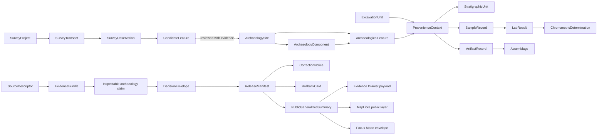

<!-- [KFM_META_BLOCK_V2]
doc_id: kfm://doc/TODO-NEEDS-UUID
title: Archaeology Domain Model
type: standard
version: v1
status: draft
owners: TODO-NEEDS-OWNER
created: TODO-NEEDS-VERIFICATION
updated: 2026-05-06
policy_label: TODO-NEEDS-POLICY-LABEL
related: [docs/domains/archaeology/README.md, docs/domains/archaeology/architecture/ARCHITECTURE.md, docs/domains/archaeology/governance/FILE_MAP.md, KFM_Archaeology_Architecture_Plan_PDF_Only.pdf]
tags: [kfm, archaeology, domain-model, evidence, sensitivity, rights, public-safe-geometry]
notes: [Revises the existing bare domain model at docs/domains/archaeology/architecture/DOMAIN_MODEL.md. doc_id, owners, created date, policy label, schema-home authority, downstream schemas, validators, API routes, UI components, CI gates, and live source posture require verification before publication.]
[/KFM_META_BLOCK_V2] -->

# Archaeology Domain Model

Defines the archaeology lane’s semantic object model, relationship grammar, evidence posture, and public-safe representation rules without claiming downstream schema, API, UI, validator, or release implementation maturity.


> [!IMPORTANT]
> **Document posture:** `CONFIRMED` repo path and adjacent archaeology docs; `PROPOSED` expanded domain semantics; `UNKNOWN` downstream machine schemas, validators, API routes, UI components, CI enforcement, source rights, and steward assignments.

**Quick jumps:** [Scope](#scope) · [Repo fit](#repo-fit) · [Accepted inputs](#accepted-inputs) · [Exclusions](#exclusions) · [Model principles](#model-principles) · [Object families](#object-families) · [Relationship grammar](#relationship-grammar) · [Geometry profiles](#geometry-profiles) · [Evidence and claims](#evidence-and-claims) · [Temporal model](#temporal-model) · [Source roles](#source-roles) · [Public-safe profiles](#public-safe-profiles) · [Validation handoff](#validation-handoff) · [Open verification](#open-verification)

---

## Scope

This file is the semantic model for the KFM archaeology lane.

It describes the entities and relationships needed to represent archaeological sites, components, features, stratigraphy, survey and excavation records, artifacts, assemblages, samples, lab results, chronometric determinations, reports, archival sources, geophysical observations, candidate features, public derivatives, and trust-bearing release objects.

It is intentionally **not** an executable JSON Schema, OpenAPI contract, database migration, source registry, policy file, or UI component spec. Those surfaces should implement this model only after the relevant repo homes and stewardship rules are verified.

### What this model must preserve

| KFM burden | Archaeology interpretation |
|---|---|
| Evidence-first truth posture | Every consequential archaeological claim resolves to admissible evidence. |
| Map-first operation | Spatial context matters, but rendered geometry is not truth by itself. |
| Time-aware modeling | Occupation, source, survey, excavation, lab, ingest, review, release, and correction times remain distinct where material. |
| Policy-aware publication | Rights, sensitivity, cultural/steward review, landowner privacy, and looting risk are release blockers. |
| Public-safe defaults | Exact public archaeological site geometry is denied by default. |
| Correctable release | Published summaries need correction and rollback paths. |
| Derived-not-canonical rule | Tiles, layers, graph projections, summaries, scenes, exports, and AI answers never replace canonical evidence. |

[Back to top](#archaeology-domain-model)

---

## Repo fit

| Field | Value |
|---|---|
| **Target path** | `docs/domains/archaeology/architecture/DOMAIN_MODEL.md` |
| **Owning root** | `docs/` — human-facing control plane |
| **Domain home** | `docs/domains/archaeology/` |
| **Architecture sibling** | `ARCHITECTURE.md` |
| **Lane entry point** | `../README.md` |
| **File map** | `../governance/FILE_MAP.md` |
| **Downstream semantic contracts** | `contracts/domains/archaeology/` — `NEEDS VERIFICATION` |
| **Downstream executable schemas** | `schemas/contracts/v1/domains/archaeology/` or repo-confirmed equivalent — `NEEDS VERIFICATION` |
| **Downstream policy** | `policy/domains/archaeology/` or repo-confirmed equivalent — `NEEDS VERIFICATION` |
| **Downstream tests / fixtures** | `tests/domains/archaeology/`, `fixtures/domains/archaeology/` or repo-confirmed equivalent — `NEEDS VERIFICATION` |

> [!NOTE]
> Directory responsibility is clear: archaeology belongs under the appropriate responsibility roots, not as a new root-level `archaeology/` folder. The exact machine homes for schemas, contracts, policy, fixtures, and validators still require repo convention verification.

---

## Accepted inputs

Accepted inputs are candidates for governed intake. They are not automatically publishable.

| Input family | What belongs here | Model requirement |
|---|---|---|
| Field and survey records | Survey projects, transects, observations, shovel tests, excavation/test units, field notes | Preserve investigation context, method, spatial precision, source role, and review state. |
| Site and component records | Site records, cultural/temporal components, features, stratigraphic units, provenience contexts | Keep site, component, feature, and provenience distinct. |
| Artifact and assemblage records | Artifact records, assemblages, collection/repository references | Require provenience and collection context. |
| Samples and lab records | Samples, lab results, chronometric determinations, calibration notes | Preserve method, uncertainty, sample context, lab/source citation, and date interpretation. |
| Reports and archival sources | Bibliographic records, gray literature, historic maps, archival descriptions | Model as source support, not as automatic site truth. |
| Steward or cultural knowledge | Steward-reviewed cultural context, oral history, restricted knowledge | Role-gated, permission-aware, and public-deny by default unless approved. |
| Remote sensing and geophysics | LiDAR, aerial, satellite, magnetometry, resistivity, GPR, modeled anomalies | Candidate-feature support only until evidence and review support stronger classification. |
| Public derivatives | Generalized summaries, survey coverage, public story payloads, public layer descriptors | Require transform receipt, catalog closure, policy decision, release manifest, and rollback path. |

---

## Exclusions

| Excluded from this domain model | Reason | Correct handling |
|---|---|---|
| Public exact archaeological site coordinates | Sensitive-location and looting risk | Restricted/steward-only geometry profile; public generalized or suppressed profile. |
| Burial, human remains, sacred-site, or culturally sensitive exact locations | High sensitivity and review burden | `DENY` public exposure unless a future steward-reviewed exception exists. |
| Private landowner identity or access details | Privacy and security risk | Restricted record family, never public DTO by default. |
| Collection storage or security-sensitive details | Collection and looting risk | Restricted operations/security context. |
| RAW / WORK / QUARANTINE as public data sources | Violates lifecycle law | Public surfaces consume released artifacts through governed APIs. |
| Remote-sensing anomaly as confirmed site | Candidate evidence is not confirmation | Candidate feature with review state and evidence limits. |
| Unknown-rights material in public summaries | Rights and redistribution are unresolved | QUARANTINE or `DENY` release until rights resolve. |
| AI-generated archaeological claims without evidence | Generated language is not source evidence | `ABSTAIN`, `DENY`, or evidence-bounded answer with validated citations. |

[Back to top](#archaeology-domain-model)

---

## Model principles

1. **Assertion first.** A record may describe an object, but a public claim must state what is asserted, what evidence supports it, and what review/release state applies.
2. **Source roles are load-bearing.** Field observation, archival report, steward knowledge, administrative inventory, lab result, remote-sensing candidate, and derived public summary are not interchangeable.
3. **Candidate is not confirmed.** Candidate features can guide review; they do not become confirmed archaeological sites without evidence and review.
4. **Geometry is profile-specific.** Restricted exact geometry, working candidate geometry, generalized public geometry, and suppressed public stubs are different products with different rules.
5. **Provenience is structural.** Artifacts, samples, lab results, chronometric determinations, and assemblages require provenience/context links.
6. **Temporal meaning stays explicit.** Occupation interval, cultural period, excavation date, source publication date, lab date, ingest date, review date, release date, and correction date are not the same thing.
7. **Derived surfaces stay downstream.** Graph edges, tiles, search indexes, layer descriptors, dashboards, scenes, reports, and Focus Mode answers remain rebuildable derivatives or interpretation surfaces.
8. **Public release is reversible.** Public summaries require correction, withdrawal, and rollback references.

---

## Object families

### Family map

| Family | Core object types | What the family means | Required support | Public posture |
|---|---|---|---|---|
| **Site and component** | `archaeology_site`, `archaeology_component` | A site-level record and its cultural, temporal, functional, or interpretive components. | EvidenceBundle, source role, review state, sensitivity profile. | Restricted by default; public summary only after review. |
| **Feature and stratigraphy** | `archaeological_feature`, `stratigraphic_unit`, `provenience_context` | Physical, depositional, or context units used to explain archaeological relationships. | Investigation context, provenience, relation type, uncertainty. | Context-sensitive; public precision requires review. |
| **Survey and excavation** | `survey_project`, `survey_transect`, `survey_observation`, `excavation_unit`, `test_unit_record` | Investigation events and spatial/sample frames that support claims. | Source descriptor, method, time, spatial precision, personnel/steward review where applicable. | Survey coverage may be public safer than find locations. |
| **Artifacts and assemblages** | `artifact_record`, `assemblage`, `collection_repository_record` | Material culture records and grouped analytical collections. | Provenience, repository/source context, rights and sensitivity review. | Avoid sensitive storage/security details. |
| **Samples and lab work** | `sample_record`, `lab_result`, `chronometric_determination` | Analytical samples, results, methods, dates, and uncertainty. | Sample context, lab source, method, uncertainty, calibration/context notes. | Publish only with context and rights. |
| **Sources and citations** | `report_bibliographic_source`, `historic_archival_source`, `steward_context_record` | Documentary, archival, report, or steward-controlled support. | Citation, rights posture, source role, access obligations. | Public only when rights and permissions allow. |
| **Candidate features** | `geophysical_observation`, `remote_sensing_anomaly`, `model_candidate_feature` | Possible archaeological signals requiring review. | Method, processing level, uncertainty, reviewer state. | Candidate-only; never confirmed-site public claim by itself. |
| **Public derivatives** | `public_generalized_summary`, `publication_transform_receipt`, `archaeology_layer_manifest` | Release-ready public carriers derived from governed inputs. | Transform receipt, policy decision, catalog closure, release manifest, rollback card. | Public-safe only; exact sensitive geometry excluded. |
| **Governance and release** | `EvidenceBundle`, `DecisionEnvelope`, `release_manifest`, `catalog_matrix`, `correction_notice`, `rollback_card` | Cross-lane trust objects required for publication and explanation. | Shared governance schemas and validators when available. | Visible to the appropriate public or steward role. |

### Minimal entity cards

#### `archaeology_site`

A governed site-level identity used to group evidence-supported components, features, contexts, investigations, and public-safe summaries.

Must not be used as:

- a public exact-coordinate payload;
- a substitute for evidence;
- a blanket label for every candidate anomaly;
- an ownership, access, or land-title record.

Expected semantic fields:

| Field family | Examples |
|---|---|
| Identity | `site_id`, `stable_local_id`, `source_record_refs`, `identity_confidence` |
| Classification | `site_status`, `site_type`, `knowledge_character`, `review_state` |
| Spatial profile | `restricted_geometry_ref`, `public_geometry_profile`, `spatial_precision`, `spatial_basis` |
| Temporal profile | `occupation_interval`, `cultural_period_label`, `source_time`, `review_time`, `release_time` |
| Evidence profile | `evidence_bundle_refs`, `source_role_refs`, `citation_refs`, `sensitivity_assessment_ref` |
| Publication profile | `public_release_allowed`, `publication_transform_receipt_ref`, `release_manifest_ref`, `rollback_ref` |

#### `archaeology_component`

A component is a source- and evidence-supported interpretation within a site, such as a cultural, temporal, functional, or stratigraphic component.

Rules:

- Components inherit site sensitivity unless explicitly reviewed.
- Components may overlap in time or space; overlap is not a conflict by itself.
- Components need evidence support independent enough to avoid becoming decorative labels.
- Public component names may require generalization if the label itself creates sensitivity risk.

#### `archaeological_feature`

A feature is an archaeological or context feature observed or interpreted within a site, survey, excavation, or candidate-feature frame.

Rules:

- Feature type, observation method, interpretation confidence, and review state must be visible.
- Features can be physical, documentary, derived, or modeled; the `knowledge_character` must not be hidden.
- A modeled or remotely sensed feature remains candidate until reviewed.

#### `stratigraphic_unit` and `provenience_context`

Stratigraphic units and provenience contexts anchor artifacts, samples, lab results, and chronology.

Rules:

- Artifacts and samples should not float without provenience/context.
- Provenience precision may be restricted even when a public assemblage summary is allowed.
- Vertical or 3D context may be modeled when it carries real evidence burden; it must keep the same evidence, policy, and public-safety controls as 2D.

#### `artifact_record` and `assemblage`

Artifacts are individual or grouped material records; assemblages are analytic groupings.

Rules:

- Artifact records require provenience and source support.
- Assemblages should identify grouping method, date/version, analyst/review state, and evidence scope.
- Public summaries must avoid leaking exact provenience, repository security details, or restricted collection information.

#### `sample_record`, `lab_result`, and `chronometric_determination`

Samples and lab results provide analytical support. Chronometric determinations are not simple dates; they include method, uncertainty, sample context, and interpretive frame.

Rules:

- Preserve sample-to-context lineage.
- Keep measured result, calibrated/normalized interpretation, and narrative chronology distinct.
- Do not collapse lab date, sample collection date, source publication date, and interpreted occupation interval.

#### `geophysical_observation`, `remote_sensing_anomaly`, and `model_candidate_feature`

Candidate-feature records represent signals that may inform investigation.

Rules:

- Candidate features must carry method, processing level, confidence, source, and review state.
- Candidate features may support a review queue or survey planning.
- Candidate features do not imply site confirmation by themselves.
- Public candidate surfaces require generalization/suppression review.

---

## Relationship grammar

### Relationship overview



### Relationship expectations

| Relationship | Meaning | Required guardrail |
|---|---|---|
| `site -> component` | A site can have many interpreted components. | Component status and evidence support must be explicit. |
| `site/component -> feature` | Components and sites can contain or reference features. | Feature type and observation/interpretation character must be visible. |
| `survey_project -> transect -> observation` | Survey objects support observations and candidate features. | Survey coverage is distinct from site confirmation. |
| `excavation_unit -> provenience_context` | Excavation units structure provenience and stratigraphy. | Context precision may be restricted. |
| `provenience_context -> artifact/sample` | Artifacts and samples are anchored to context. | No floating artifacts or samples in release candidates. |
| `sample -> lab_result -> chronometric_determination` | Lab work supports analytical or chronological claims. | Preserve method, uncertainty, and sample lineage. |
| `source -> EvidenceBundle -> claim` | Sources support evidence bundles, which support claims. | Consequential claims cannot bypass evidence resolution. |
| `candidate_feature -> site` | Candidate may become site-supporting only after review. | No automatic promotion from anomaly to site. |
| `canonical restricted object -> public summary` | Public payload is a transformed derivative. | Transform receipt and release manifest required. |
| `release -> correction/rollback` | Public release is correctable and reversible. | No silent replacement of public artifacts. |

[Back to top](#archaeology-domain-model)

---

## Geometry profiles

Archaeology geometry must be modeled as a family of release profiles, not as one field.

| Geometry profile | Audience | Allowed use | Required support | Public-safe? |
|---|---|---|---|---|
| `restricted_exact` | Steward / authorized roles | Internal review, source reconciliation, restricted evidence context | Source role, sensitivity assessment, access policy, audit trail | No |
| `work_candidate` | Work / review roles | Candidate detection, QA, triage, interpretation | Candidate status, method, uncertainty, review state | No |
| `processed_canonical` | Governed internal systems | Normalized record prior to release | Evidence closure, validation, policy precheck | No public direct access |
| `public_generalized` | Public / semi-public | Generalized map, story, summary, layer, export | Transform receipt, policy decision, release manifest | Yes, if approved |
| `public_suppressed` | Public / semi-public | Non-spatial or coarse spatial stub | Suppression reason, public explanation, release manifest | Yes |
| `withheld` | None / restricted governance only | Denial record and audit-only handling | Reason code and review record | No |

> [!CAUTION]
> Public geometry safety must be checked across all outward carriers: API DTOs, map tiles, layer manifests, Evidence Drawer payloads, graph projections, exports, story assets, telemetry, screenshots, and Focus Mode context.

---

## Evidence and claims

KFM archaeology should model public-facing statements as evidence-bound claims, not as unqualified record fields.

### Claim classes

| Claim class | Example | Required evidence posture |
|---|---|---|
| Site existence | “A site record exists for this generalized area.” | EvidenceBundle, review state, public transform. |
| Component interpretation | “This site includes a Late Archaic component.” | Source/citation support, uncertainty, reviewer state. |
| Feature interpretation | “This is interpreted as a hearth feature.” | Observation method, context, support, confidence. |
| Provenience claim | “This artifact belongs to this provenience context.” | Excavation/survey record, context linkage. |
| Chronology claim | “This sample supports an interval estimate.” | Sample lineage, lab result, method, uncertainty. |
| Survey coverage claim | “This area has been surveyed under this project.” | Survey project, transect/coverage geometry, source role. |
| Candidate-feature claim | “This anomaly may warrant review.” | Method, processing level, candidate status, no confirmation language. |
| Public release claim | “This generalized layer is safe to publish.” | Policy decision, transform receipt, release manifest, rollback path. |

### Required claim support

Every consequential claim should carry or resolve:

- `claim_id`
- `claim_type`
- `subject_ref`
- `evidence_bundle_ref`
- `source_role_refs`
- `spatial_scope`
- `temporal_scope`
- `sensitivity_assessment_ref`
- `rights_assessment_ref`
- `review_state`
- `release_state`
- `correction_lineage_ref`
- `rollback_ref` when published

If any required support is missing, the runtime posture is `ABSTAIN`, `DENY`, `ERROR`, or `QUARANTINE` depending on whether the problem is evidence insufficiency, policy block, system failure, or lifecycle hold.

---

## Temporal model

Archaeology is time-dense. The model must avoid “single date” collapse.

| Time basis | Meaning | Example use |
|---|---|---|
| `occupation_interval` | Interpreted past time interval associated with activity or component. | Cultural period or modeled occupation span. |
| `cultural_period_label` | Human-readable period label. | “Archaic,” “Late Woodland,” or local controlled vocabulary value. |
| `observation_time` | When field observation happened. | Survey or excavation date. |
| `source_publication_time` | When documentary source was published or created. | Report year, historic map date. |
| `retrieval_time` | When KFM captured source data. | Ingest receipt timestamp. |
| `lab_analysis_time` | When lab work occurred. | Radiocarbon lab report date. |
| `review_time` | When steward/reviewer assessed record or release. | Sensitivity or public-profile review date. |
| `release_time` | When public artifact was promoted. | Release manifest timestamp. |
| `correction_time` | When claim/artifact was corrected, withdrawn, or superseded. | Correction notice timestamp. |

Chronometric determinations should keep measured result, calibrated result, method, uncertainty, sample context, and interpretive conclusion separate.

---

## Source roles

| Source role | Best use | Must not become |
|---|---|---|
| `field_observation` | Direct survey/excavation observation. | Public exact-site disclosure without review. |
| `excavation_record` | Context, stratigraphy, provenience, feature interpretation. | Free-floating artifact or sample truth. |
| `lab_analytical` | Method-specific support for material or chronological claims. | General chronology without uncertainty. |
| `bibliographic_report` | Published or gray-literature claim support. | Automatic source of exact public geometry. |
| `historic_archival` | Historic map, description, documentary context. | Unreviewed coordinate truth. |
| `steward_cultural` | Steward-reviewed cultural context. | Public claim without permission and role-gated review. |
| `administrative_inventory` | Inventory/listing/status context. | Cultural truth or public location authority by itself. |
| `remote_sensing` | Candidate detection or survey targeting. | Confirmed archaeological site without evidence review. |
| `geophysical` | Subsurface/candidate feature support. | Site confirmation without review. |
| `derived_public` | Public-safe summaries and map products. | Canonical evidence or restricted-data substitute. |

[Back to top](#archaeology-domain-model)

---

## Public-safe profiles

Public release should choose a profile deliberately.

| Public profile | Description | Allows | Blocks |
|---|---|---|---|
| `public_generalized_summary` | Generalized public record with evidence and sensitivity context. | Coarse map display, public story, public API summary. | Exact geometry, restricted source rows, landowner/access details. |
| `public_survey_coverage` | Survey area/coverage without sensitive find locations. | Showing where reviewed survey coverage exists. | Find spots, site coordinates, restricted observations. |
| `public_candidate_surface` | Generalized candidate/anomaly surface with clear candidate status. | Public explanation of method or broad pattern where approved. | Confirmed-site language and precise sensitive geometry. |
| `public_suppressed_stub` | Non-spatial or highly generalized acknowledgment. | “Information withheld for sensitivity” with evidence/policy context. | Any coordinate precision that leaks protected location. |
| `no_public_release` | No public artifact. | Steward-only review and audit trail. | Public map, export, story, Focus, or API payload. |

A public profile is release-ready only when it has:

- rights assessment;
- sensitivity assessment;
- evidence bundle;
- publication transform receipt when geometry is generalized, redacted, or suppressed;
- policy decision;
- review record;
- catalog closure;
- release manifest;
- rollback card;
- correction path.

---

## Validation handoff

This domain model should drive later schemas, fixtures, validators, policies, API DTOs, and UI payloads. It does not prove those files exist.

### Proposed fixture bundle

| Fixture | Purpose | Required negative case |
|---|---|---|
| `restricted_exact_site.valid.json` | Steward-only exact geometry record. | Public DTO leaks exact geometry. |
| `public_generalized_summary.valid.json` | Released public generalized summary. | Missing transform receipt. |
| `candidate_feature.valid.json` | Remote-sensing/geophysical candidate. | Candidate labeled as confirmed site. |
| `artifact_with_provenience.valid.json` | Artifact anchored to context. | Artifact lacks provenience. |
| `chronometric_determination.valid.json` | Lab result and chronology with uncertainty. | Single date without method/uncertainty. |
| `evidence_bundle.valid.json` | Evidence closure for a claim. | Claim lacks EvidenceBundle. |
| `decision_envelope_deny_exact_location.valid.json` | Exact public request denial. | Runtime returns exact location. |
| `catalog_closure_public_layer.valid.json` | Release/cat/proof alignment. | STAC/DCAT/PROV/release digests diverge. |

### Proposed object-card sketch

```yaml
# Illustrative object card — not an executable schema.
object_type: archaeology_site
status: PROPOSED
description: >
  Governed site-level identity that groups evidence-supported
  components, features, contexts, investigations, and public-safe summaries.
must_have:
  - stable identity
  - source role references
  - EvidenceBundle references
  - sensitivity assessment
  - rights assessment
  - geometry profile
  - review state
  - release state
must_not:
  - expose exact public geometry by default
  - promote candidate anomalies into confirmed sites
  - bypass public geometry transform receipts
  - replace evidence with AI-generated narrative
public_release:
  default: DENY exact geometry
  allowed_profiles:
    - public_generalized_summary
    - public_survey_coverage
    - public_suppressed_stub
```

### Done means

- [ ] This file has a real `doc_id`, confirmed owner, confirmed policy label, and verified creation date.
- [ ] Object families are mapped to human contracts and machine schemas, or explicitly deferred.
- [ ] Exact-location denial is represented in docs, policy, fixtures, validators, API DTOs, UI payloads, and Focus Mode negative tests.
- [ ] Public geometry profiles have transform receipt fixtures.
- [ ] Candidate-feature fixtures prove anomalies are not confirmed sites.
- [ ] Artifact/sample/lab fixtures prove provenience lineage.
- [ ] Chronometric fixtures preserve method and uncertainty.
- [ ] EvidenceBundle fixtures support at least one public claim.
- [ ] Release manifest and catalog closure fixtures support at least one public generalized layer.
- [ ] Correction and rollback fixtures exist for a released public summary.
- [ ] Public DTO tests prove restricted geometry, landowner/access details, and collection-security details are omitted.
- [ ] Focus Mode tests return `DENY` for exact public location requests and `ABSTAIN` for unsupported claims.

---

## Open verification

| Item | Status | Why it matters |
|---|---:|---|
| Owner/steward for this file | UNKNOWN | Required for review and update responsibility. |
| Creation date of the original target file | UNKNOWN | Metadata should not fabricate history. |
| Policy label for this doc | NEEDS VERIFICATION | The doc may be public, internal, or restricted depending on repo policy. |
| Schema-home authority for archaeology | NEEDS VERIFICATION | Prevents `contracts/` and `schemas/` divergence. |
| Canonical policy path for archaeology | NEEDS VERIFICATION | Prevents duplicate policy homes. |
| Actual validator language and test runner | UNKNOWN | Tooling should follow repo-native conventions. |
| API app path and route naming | UNKNOWN | Avoids invented runtime claims. |
| UI layer descriptor and Evidence Drawer component paths | UNKNOWN | Avoids bypassing the governed shell. |
| Steward, tribal, cultural, landowner, and collection review process | NEEDS VERIFICATION | Blocks public release of sensitive archaeology material. |
| Public generalization thresholds | NEEDS VERIFICATION | Required before public map/layer release. |
| Live source rights and terms | NEEDS VERIFICATION | Blocks connector activation and public redistribution. |
| Existing archaeology schemas, fixtures, policies, validators, releases, dashboards, and logs | UNKNOWN | Not verified from the current evidence checked for this edit. |

[Back to top](#archaeology-domain-model)

---

## Maintenance notes

1. Keep the exact-public-location `DENY` rule near the top-level model.
2. Preserve the original core entity names unless a schema/ADR intentionally supersedes them.
3. Add new object families as `PROPOSED` until schema, fixture, validator, and policy evidence exists.
4. Update this file when source roles, sensitivity rules, public geometry profiles, or release objects change.
5. Do not use this domain model to activate live sources, publish data, or claim API/UI behavior.
6. When a public archaeology artifact is released, update the model only with release-backed object behavior and retain correction/rollback references.
