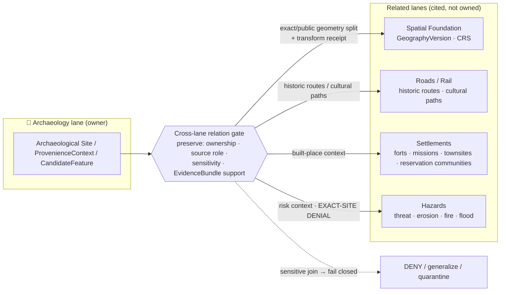

<!-- [KFM_META_BLOCK_V2]
doc_id: kfm://doc/PLACEHOLDER-uuid
title: Archaeology — Cross-Lane Relations
type: standard
version: v1
status: draft
owners: <archaeology-domain-steward> (PLACEHOLDER — confirm)
created: 2026-05-28
updated: 2026-05-28
policy_label: public
related: [docs/domains/archaeology/README.md, ai-build-operating-contract.md, directory-rules.md, policy/sensitivity/archaeology/]
tags: [kfm, archaeology, cross-lane, governance]
notes: [CONTRACT_VERSION = "3.0.0" pinned; repo paths PROPOSED, repo not mounted this session]
[/KFM_META_BLOCK_V2] -->

# 🏺 Archaeology — Cross-Lane Relations

> How the Archaeology / Cultural Heritage lane relates to other KFM domains **without** weakening ownership, source role, sensitivity, or EvidenceBundle support — and **without** ever exposing exact site geometry.

**Status:** `draft` · **Owners:** `<archaeology-domain-steward>` (PLACEHOLDER) · **Updated:** 2026-05-28

> [!CAUTION]
> **Sensitive domain.** Archaeology is a `DENY`-by-default lane. Exact site coordinates, burial, human remains, sacred sites, collection-security detail, and looting-risk exposure **fail closed**. No cross-lane relation in this document authorizes exposing exact archaeological geometry. Disposition is governed by `ai-build-operating-contract.md` §23.2; this doc does **not** re-derive it.

---

## Quick jump

- [1. Scope](#1-scope)
- [2. Repo fit](#2-repo-fit)
- [3. What a cross-lane relation must preserve](#3-what-a-cross-lane-relation-must-preserve)
- [4. The four canonical relations](#4-the-four-canonical-relations)
- [5. Relation detail](#5-relation-detail)
- [6. Relation flow diagram](#6-relation-flow-diagram)
- [7. Sensitivity posture for joins](#7-sensitivity-posture-for-joins)
- [8. What this lane does **not** own](#8-what-this-lane-does-not-own)
- [9. Open questions register](#open-questions-register)
- [10. Open verification backlog](#open-verification-backlog)
- [11. Changelog](#changelog-v0--v1)
- [12. Definition of done](#definition-of-done)
- [Related docs](#related-docs)

---

## 1. Scope

This document specifies the **cross-lane relations** for the Archaeology / Cultural Heritage domain: which other KFM lanes Archaeology relates to, what kind of relation each is, and the governance constraint every such relation must satisfy.

A *cross-lane relation* is an edge between an Archaeology object family (e.g., `Archaeological Site`, `ProvenienceContext`, `StratigraphicUnit`, `CandidateFeature`) and an object owned by another domain. It is **context**, never a transfer of ownership.

> [!NOTE]
> **Truth labels in this doc.** The relation set and its constraint are `CONFIRMED` doctrine, sourced from the Domains v1.1 / Pass 23–32 Consolidated Atlas, §15 (Archaeology), table **F. Cross-lane relations**. The per-relation operational detail is `CONFIRMED / PROPOSED` — the relation exists in doctrine; its implementation (schemas, joins, validators) is `PROPOSED` and unverified in this session. All repo paths are `PROPOSED` because no repository is mounted.

[↑ Back to top](#top)

---

## 2. Repo fit

| Aspect | Value | Status |
|---|---|---|
| Proposed path | `docs/domains/archaeology/cross-lane-relations.md` | `PROPOSED` |
| Owning responsibility root | `docs/` (explains something to humans) | `CONFIRMED` rule |
| Domain segment | `archaeology` as a **lane inside** `docs/`, never a root | `CONFIRMED` rule |
| Upstream (governs this doc) | `ai-build-operating-contract.md` §23.2; `directory-rules.md` | `CONFIRMED` rule / `PROPOSED` presence |
| Sibling lane (expected) | `docs/domains/archaeology/README.md` | `PROPOSED` |
| Policy counterpart | `policy/sensitivity/archaeology/` | `PROPOSED` |
| Schema counterpart | `schemas/contracts/v1/archaeology/` | `PROPOSED` |

**Directory Rules basis.** A doc that *explains to humans* belongs under `docs/`; a domain name is a **segment inside** a responsibility root, never a root folder (`directory-rules.md` §3–§4). `archaeology` therefore lives at `docs/domains/archaeology/`, matching the responsibility-root crosswalk for `[DOM-ARCH]`.

[↑ Back to top](#top)

---

## 3. What a cross-lane relation must preserve

Every Archaeology cross-lane relation — regardless of the related lane — **MUST** preserve the same four invariants. This is the single `CONFIRMED` constraint attached to all four relations in the Atlas §15.F table.

> [!IMPORTANT]
> A cross-lane relation **MUST** preserve **ownership**, **source role**, **sensitivity**, and **EvidenceBundle support**. A relation that drops any of these is not a valid KFM relation.

| Invariant | Meaning | Failure mode if dropped |
|---|---|---|
| **Ownership** | The related object stays owned by its home lane; Archaeology only *cites* it. | Silent ownership capture; competing authority. |
| **Source role** | `authority` / `observation` / `context` / `model` roles are not collapsed across the join. | A `candidate` silently promoted to `observed`. |
| **Sensitivity** | The **most restrictive** sensitivity of either side governs the join; sensitive joins **fail closed**. | Exact-site leakage through a "safe" neighbor lane. |
| **EvidenceBundle support** | The relation resolves to evidence; `EvidenceRef → EvidenceBundle` closure holds. | An asserted edge with no admissible basis. |

[↑ Back to top](#top)

---

## 4. The four canonical relations

`CONFIRMED` doctrine — Atlas §15.F. The constraint column is identical for all four (see §3 above) and is abbreviated here as **the four invariants**.

| This domain | Related lane | Relation type | Constraint |
|---|---|---|---|
| Archaeology | **Spatial Foundation** | exact/public geometry split and transform receipts | the four invariants |
| Archaeology | **Roads / Rail** | historic routes and cultural paths | the four invariants |
| Archaeology | **Settlements** | forts, missions, townsites, reservation communities | the four invariants |
| Archaeology | **Hazards** | threat, erosion, fire, flood, exposure context **with exact-site denial** | the four invariants |

[↑ Back to top](#top)

---

## 5. Relation detail

### 5.1 Archaeology ↔ Spatial Foundation

**Relation type (`CONFIRMED`):** exact/public geometry split and transform receipts.

Spatial Foundation owns `GeographyVersion` and `CoordinateReferenceProfile`; every Archaeology spatial product carries a version and CRS from that lane. The defining feature of this relation is the **geometry split**: an exact internal geometry and a public-safe generalized derivative, bridged by a transform receipt.

- **`PROPOSED`** — public release uses generalized geometry only (county/region), per §23.2; exact UTM is redacted.
- **`PROPOSED`** — the split is recorded by a `RedactionReceipt` / `PublicationTransformReceipt`; no public geometry exists without one.
- **`NEEDS VERIFICATION`** — public geometry thresholds and transform profiles are not yet defined (Atlas §15.N).

> [!CAUTION]
> The "public" side of this split is the **only** geometry that may reach a public surface. The exact side is steward-only and never published without cultural review.

### 5.2 Archaeology ↔ Roads / Rail

**Relation type (`CONFIRMED`):** historic routes and cultural paths.

Historic trails, military roads, and rail alignments provide route context for sites; cultural paths may themselves be culturally sensitive.

- **`PROPOSED`** — route association is `context` source role; it does not make a road an authority for a site's existence.
- **`PROPOSED`** — where a path is itself sensitive (e.g., a culturally significant trail), the sensitivity invariant escalates the join to the most restrictive side.

### 5.3 Archaeology ↔ Settlements

**Relation type (`CONFIRMED`):** forts, missions, townsites, reservation communities.

Settlements owns built-place objects; Archaeology cites them as historical and cultural context for sites and proveniences.

- **`PROPOSED`** — `reservation communities` joins may carry Indigenous / steward-controlled sensitivity; route disposition through §23.2 (Indigenous / cultural records row), not the generic settlement row.
- **`PROPOSED`** — the relation preserves Settlements ownership; Archaeology does not redefine a fort or townsite record.

### 5.4 Archaeology ↔ Hazards

**Relation type (`CONFIRMED`):** threat, erosion, fire, flood, exposure context **with exact-site denial**.

Hazards provides threat context — erosion, fire, flood, exposure — that bears on site preservation and risk review.

> [!WARNING]
> This relation carries an **explicit exact-site denial** written into the relation type itself. A hazard overlay **MUST NOT** become a back-channel that reveals an exact site location. Threat/risk views are steward-only or generalized; the hazard join never lowers the Archaeology sensitivity floor.

- **`PROPOSED`** — risk surfaces are generalized; exact-site geometry is denied even in a hazards/erosion review context.
- **`CONFIRMED` doctrine** — Hazards content must never be presented as a life-safety instruction or alert authority (Atlas §20.4 emergency-alert boundary).

[↑ Back to top](#top)

---

## 6. Relation flow diagram

> [!NOTE]
> `NEEDS VERIFICATION` — this diagram reflects **doctrine relationships** from Atlas §15.F, not a verified implementation graph. Object families and routes are illustrative of the lane, not confirmed schema homes.

[↑ Back to top](#top)

---

## 7. Sensitivity posture for joins

Cross-lane joins are where exact-site leakage is most likely, so the sensitivity invariant is enforced at the join, not only at the source. The relevant `§23.2` row (`CONFIRMED` doctrine, `PROPOSED` defaults) for Archaeology — site locations:

| Field | Value |
|---|---|
| Default disposition at public surface | `DENY` exact coordinates; generalize to county/region |
| Required transform before any release | Geometry generalization; redact precise UTM |
| Required reviewer beyond domain steward | Tribal/cultural reviewer; rights-holder rep |
| Required receipts/manifests | `RedactionReceipt`; `PolicyDecision`; `MapReleaseManifest` |

**Join rule (`CONFIRMED` doctrine):** when Archaeology joins a less-sensitive lane, the **most restrictive applicable row** governs the combined output. A neighbor lane's public posture never relaxes Archaeology's floor.

[↑ Back to top](#top)

---

## 8. What this lane does **not** own

Per the anti-collapse rule, Archaeology relates to these lanes but does not own them:

- Spatial Foundation owns `GeographyVersion`, CRS, and base geometry.
- Roads / Rail owns route alignments.
- Settlements owns forts, missions, townsites, and reservation-community records.
- Hazards owns threat, erosion, fire, and flood layers.
- People / Genealogy / DNA / Land relates *into* Archaeology for historic-person and cultural-place context, but living-person, DNA, title, and parcel-boundary controls are **not** weakened by that context.

> [!IMPORTANT]
> A cross-lane relation is a **citation with constraints**, not a merge. A `candidate` is never silently promoted to `observed` across a join.

[↑ Back to top](#top)

---

## Open questions register

| ID | Question | Owner role | Resolution path |
|---|---|---|---|
| OQ-ARCH-XLANE-01 | Where do cross-lane join schemas live — `schemas/contracts/v1/archaeology/` or a shared relations home? | schema steward | ADR / Directory Rules §2.4 |
| OQ-ARCH-XLANE-02 | What are the public geometry thresholds and transform profiles for the Spatial Foundation split? | archaeology steward | repo inspection / ADR |
| OQ-ARCH-XLANE-03 | Does the `reservation communities` Settlements join route through the Indigenous/cultural §23.2 row by default? | tribal/cultural reviewer | steward ratification |
| OQ-ARCH-XLANE-04 | Is there a separate validator for "no exact-site leak through Hazards join"? | policy steward | repo inspection |

## Open verification backlog

These items remain `NEEDS VERIFICATION` before promotion from `draft` to `published`:

1. Confirm `docs/domains/archaeology/` exists (or is created with a per-root/lane README) in the mounted repo.
2. Confirm the §23.2 Archaeology defaults are ratified (currently `PROPOSED`).
3. Confirm transform-receipt object (`RedactionReceipt` / `PublicationTransformReceipt`) names and schema homes.
4. Confirm the cross-lane relation set has no additional relations beyond the four in Atlas §15.F.
5. Confirm owner field and `doc_id` placeholders against the real docs index.

## Changelog v0 → v1

| Change | Type (per contract §37) | Reason |
|---|---|---|
| Initial draft of Archaeology cross-lane relations | new | No prior doc; synthesizes Atlas §15.F + §23.2 |
| Pinned `CONTRACT_VERSION = "3.0.0"` | clarification | Doctrine-adjacent doc requirement |

> **Backward compatibility.** New document; no prior anchors to preserve. Anchor `#top` and section anchors are stable for future revisions.

## Definition of done

This document is done enough to enter the repository when:

- it is placed according to Directory Rules (`docs/domains/archaeology/`);
- a docs steward and the archaeology domain steward review it;
- it is linked from the archaeology lane README and the docs/doctrine index;
- it does not conflict with accepted ADRs;
- any conflict with current repo conventions is logged in `docs/registers/DRIFT_REGISTER.md`;
- the `GENERATED_RECEIPT.json` planned in Section 2 is wired into CI;
- future changes follow the operating contract's §37 lifecycle.

---

## Related docs

- `docs/domains/archaeology/README.md` — archaeology lane landing page (`PROPOSED`)
- `ai-build-operating-contract.md` — §23.1–§23.2 sensitive-domain matrix (canonical)
- `directory-rules.md` — placement authority
- `policy/sensitivity/archaeology/` — fail-closed policy home (`PROPOSED`)
- `docs/registers/DRIFT_REGISTER.md` — conflict log (`PROPOSED`)

**Last updated:** 2026-05-28 · `CONTRACT_VERSION = "3.0.0"`

[↑ Back to top](#top)
