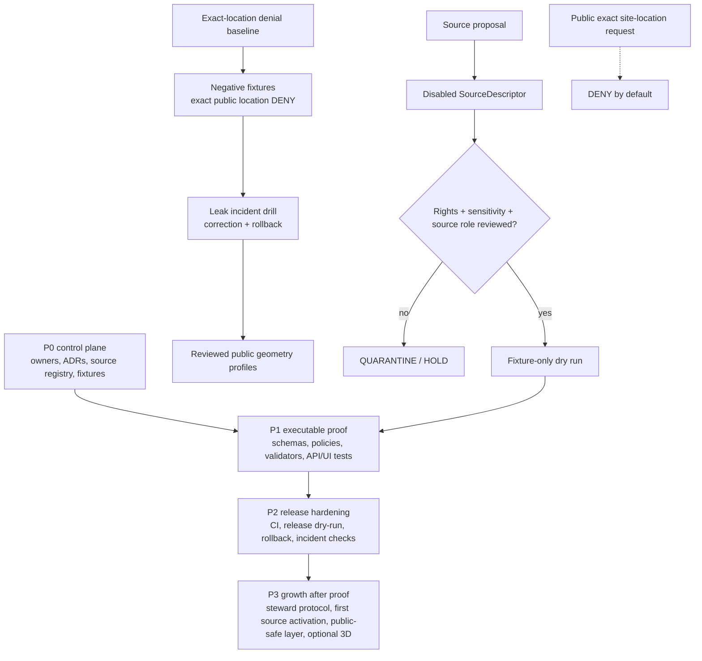

<!-- [KFM_META_BLOCK_V2]
doc_id: kfm://doc/NEEDS-VERIFICATION-docs-domains-archaeology-governance-backlog
title: Archaeology Governance Backlog
type: standard
version: v1
status: draft
owners: TODO-NEEDS-OWNER
created: NEEDS-VERIFICATION-GIT-HISTORY
updated: 2026-05-06
policy_label: NEEDS-VERIFICATION-public-or-restricted
related: [../README.md, ../architecture/ARCHITECTURE.md, ../architecture/DOMAIN_MODEL.md, ./FILE_MAP.md, ./OPEN_QUESTIONS.md, ./SOURCE_REGISTRY.md, ./SENSITIVITY_AND_RIGHTS.md, ./VALIDATION_AND_POLICY.md, ./CATALOG_AND_PROOF_OBJECTS.md, ../operations/RUNBOOK.md, ../../../adr/ADR-0009-sensitive-location-policy.md, ../../../adr/ADR-0014-truth-path.md, ../../../architecture/governed-api.md, ../../../doctrine/lifecycle-law.md]
tags: [kfm, archaeology, backlog, governance, sensitivity, rights, validation, policy, evidence, release, rollback]
notes: [Revises the existing archaeology backlog stub into a prioritized governance backlog. doc_id, owner, created date, policy label, CODEOWNERS mapping, schema home, policy runtime, CI coverage, API/UI paths, release automation, dashboard existence, and steward review process remain NEEDS VERIFICATION.]
[/KFM_META_BLOCK_V2] -->

<a id="top"></a>

# Archaeology Governance Backlog

Prioritized build, verification, and release-hardening work for the KFM Archaeology lane.

<p align="center">
  
  
  
  
  
  
</p>

> [!IMPORTANT]
> **Status:** `draft`  
> **Owners:** `TODO-NEEDS-OWNER`  
> **Target path:** `docs/domains/archaeology/governance/BACKLOG.md`  
> **Owning root:** `docs/` — human-facing domain governance and control-plane documentation.  
> **Reading rule:** This backlog orders work. It does not prove that the listed schemas, policies, validators, fixtures, workflows, API routes, UI surfaces, dashboards, release objects, or steward reviews are implemented.

> [!WARNING]
> Archaeology is a fail-closed lane. Exact public archaeological site locations are denied by default. Public output requires evidence support, rights and sensitivity review, an approved public geometry treatment, release proof, correction path, and rollback target.

## Quick navigation

| Start | Build queue | Review surfaces |
|---|---|---|
| [Status and triage model](#status-and-triage-model) | [P0 — Control-plane blockers](#p0--control-plane-blockers) | [Gate checklist by task type](#gate-checklist-by-task-type) |
| [Repo fit](#repo-fit) | [P1 — Executable policy and contract proof](#p1--executable-policy-and-contract-proof) | [Review cadence](#review-cadence) |
| [Priority map](#priority-map) | [P2 — Release automation, observability, and rollback](#p2--release-automation-observability-and-rollback) | [Definition of done](#definition-of-done) |
| [Backlog board](#backlog-board) | [P3 — Domain growth after proof](#p3--domain-growth-after-proof) | [Open verification](#open-verification) |

---

## Status and triage model

This file upgrades the earlier short backlog into a reviewable build queue. The original priorities are preserved and expanded: ownership, schema-home resolution, disabled source examples, fixtures, policy parity, public DTO safety, Focus denial tests, CI coverage, release verification, and correction/rollback checks remain central.

### Truth labels

| Label | Use in this backlog |
|---|---|
| `CONFIRMED` | Verified from current repository evidence or governing KFM doctrine. |
| `PROPOSED` | Recommended task, path, gate, fixture, test, or implementation direction not yet verified as implemented. |
| `UNKNOWN` | Not verified from current repo files, CI, release artifacts, runtime logs, dashboards, or steward records. |
| `NEEDS VERIFICATION` | Specific check must be completed before a task can close. |
| `DENY` | Policy blocks the action or publication. |
| `ABSTAIN` | Evidence is insufficient to support a claim or answer. |
| `ERROR` | Required validation or system behavior failed. |
| `QUARANTINE` | Material is held because rights, sensitivity, evidence, source role, or validation is unresolved. |

### Priority levels

| Priority | Meaning | Merge posture |
|---|---|---|
| `P0` | Control-plane blockers. Close these before live sources, public layers, or runtime expansion. | Required for first safe archaeology slice. |
| `P1` | Executable proof. Add fixtures, validators, policies, contract tests, and finite-envelope checks. | Required before public-facing archaeology behavior. |
| `P2` | Release hardening. Add CI, release dry-run, rollback, incident, and observability checks. | Required before routine publication. |
| `P3` | Growth after proof. Add broader source, review, UI, and optional 2.5D/3D work only after gates exist. | Deferred until P0/P1 are substantially closed. |

### Task states

| State | Meaning |
|---|---|
| `not-started` | No implementation or verification evidence attached. |
| `ready` | Requirements are clear and dependencies are closed enough to begin. |
| `blocked` | A prerequisite owner, ADR, path, policy, source, or review decision is missing. |
| `in-review` | A PR, review packet, or steward decision is underway. |
| `done` | Exit criteria are met and cited to repo evidence. |
| `deferred` | Valid work, but intentionally postponed. |

[Back to top](#top)

---

## Repo fit

| Field | Value |
|---|---|
| Current file | `docs/domains/archaeology/governance/BACKLOG.md` |
| File role | Prioritized lane build tasks and verification queue |
| Owning root | `docs/` |
| Domain lane | `archaeology` |
| Companion map | [`FILE_MAP.md`](./FILE_MAP.md) |
| Related open questions | [`OPEN_QUESTIONS.md`](./OPEN_QUESTIONS.md) |
| Governance companions | [`SOURCE_REGISTRY.md`](./SOURCE_REGISTRY.md), [`SENSITIVITY_AND_RIGHTS.md`](./SENSITIVITY_AND_RIGHTS.md), [`VALIDATION_AND_POLICY.md`](./VALIDATION_AND_POLICY.md), [`CATALOG_AND_PROOF_OBJECTS.md`](./CATALOG_AND_PROOF_OBJECTS.md) |
| Architecture companions | [`../architecture/ARCHITECTURE.md`](../architecture/ARCHITECTURE.md), [`../architecture/DOMAIN_MODEL.md`](../architecture/DOMAIN_MODEL.md) |
| Operations companion | [`../operations/RUNBOOK.md`](../operations/RUNBOOK.md) |
| Cross-domain sensitive-location ADR | [`../../../adr/ADR-0009-sensitive-location-policy.md`](../../../adr/ADR-0009-sensitive-location-policy.md) |
| Governed API doctrine | [`../../../architecture/governed-api.md`](../../../architecture/governed-api.md) |
| Lifecycle doctrine | [`../../../doctrine/lifecycle-law.md`](../../../doctrine/lifecycle-law.md) |

### Directory Rules basis

This backlog belongs under `docs/domains/archaeology/governance/` because it is a human-facing governance and planning document for one domain lane. It should not create a root-level `archaeology/` folder. Machine schemas, policies, fixtures, validators, lifecycle data, release objects, and runtime code belong under their responsibility roots after the repo’s active conventions are verified.

### Accepted inputs

This backlog may accept:

- unresolved archaeology governance work;
- verification tasks from neighboring archaeology docs;
- source-registry, rights, sensitivity, evidence, policy, validation, catalog, release, rollback, API, UI, and Focus Mode tasks;
- PR review outcomes;
- regression failures;
- incident findings;
- ADR follow-up work;
- steward review requirements;
- current implementation gaps that are backed by repo evidence.

### Exclusions

| Excluded from this file | Proper home |
|---|---|
| Real source data or restricted archaeology records | `data/raw/archaeology/`, `data/work/archaeology/`, `data/quarantine/archaeology/`, or repo-confirmed lifecycle homes |
| Machine source descriptor instances | `data/registry/…` after registry convention verification |
| JSON Schemas or OpenAPI contracts | `schemas/`, `contracts/`, or repo-confirmed schema/contract homes |
| Executable policy bundles | `policy/` or repo-confirmed policy home |
| Validators, scripts, and test code | `tools/`, `packages/`, `tests/`, or repo-confirmed implementation roots |
| Release manifests, receipts, proofs, rollback cards | `release/`, `data/receipts/`, `data/proofs/`, or repo-confirmed release/proof homes |
| Live source credentials or private steward contacts | secret manager or restricted operational runbook |
| Exact archaeological coordinates | restricted/steward-only governed access surface |

[Back to top](#top)

---

## Priority map



---

## Backlog board

### P0 — Control-plane blockers

| ID | Work item | Why it matters | Exit criteria | Status |
|---|---|---|---|---|
| `ARCH-BL-P0-01` | Confirm lane owner and CODEOWNERS mapping. | Archaeology needs named accountability before source activation, rights review, sensitivity review, or release. | Owner appears in meta blocks, review cards, and CODEOWNERS or repo-approved ownership surface. | `NEEDS VERIFICATION` |
| `ARCH-BL-P0-02` | Resolve archaeology schema-home ADR. | Prevents parallel `contracts/` vs `schemas/` authority and duplicate machine definitions. | ADR or existing repo decision identifies canonical schema path and migration/compatibility rule. | `blocked` |
| `ARCH-BL-P0-03` | Verify policy runtime and policy-home convention. | Validation docs name policy outcomes, but executable stack and path must be repo-native. | Rego, Python parity, or other policy runtime is confirmed; policy path and test pattern are documented. | `NEEDS VERIFICATION` |
| `ARCH-BL-P0-04` | Add disabled-by-default source registry examples. | Source admission must begin with SourceDescriptor review, not live fetching. | At least one synthetic or public-safe example descriptor is present, disabled, and linked to rights/sensitivity review expectations. | `PROPOSED` |
| `ARCH-BL-P0-05` | Lock exact-location denial baseline into docs, fixtures, and policy targets. | Public exact archaeology locations are the highest-risk failure mode for this lane. | `SENSITIVITY_AND_RIGHTS.md`, `VALIDATION_AND_POLICY.md`, and ADR-0009 agree on default `DENY`; fixture/test targets are named. | `PROPOSED` |
| `ARCH-BL-P0-06` | Add valid/invalid fixtures for public safety and evidence closure. | KFM needs denial examples before public output. | Fixtures cover restricted exact site, public generalized summary, candidate feature, unknown rights, missing EvidenceBundle, and transform receipt missing. | `PROPOSED` |
| `ARCH-BL-P0-07` | Synchronize `FILE_MAP.md`, `OPEN_QUESTIONS.md`, and this backlog. | Keeps governance docs from drifting. | File map includes this backlog role; open questions are either carried into tasks or marked closed with evidence. | `PROPOSED` |
| `ARCH-BL-P0-08` | Confirm safe first-run runbook sequence against this backlog. | Operators need a no-live-source path for first proof. | `RUNBOOK.md` sequence references fixtures, public DTO safety, catalog/proof closure, and review evidence. | `PROPOSED` |
| `ARCH-BL-P0-09` | Add a compact archaeology PR review card. | Non-trivial PRs must expose hidden risk: public exposure, EvidenceBundle impact, policy gates, rollback. | PR card template exists or cross-links to repo-wide card with archaeology-specific sensitivity fields. | `PROPOSED` |

### P1 — Executable policy and contract proof

| ID | Work item | Why it matters | Exit criteria | Status |
|---|---|---|---|---|
| `ARCH-BL-P1-01` | Add policy parity tests if both Rego and Python are used. | Dual policy surfaces must not disagree on denial outcomes. | Same valid/invalid fixtures produce equivalent `ALLOW`, `DENY`, `ABSTAIN`, or `ERROR` decisions. | `NEEDS VERIFICATION` |
| `ARCH-BL-P1-02` | Add API contract tests proving restricted geometry omission. | UI filtering is not a security boundary. | Public DTO fixtures omit exact restricted geometry, source-native coordinates, reconstruction fields, and internal lifecycle refs. | `PROPOSED` |
| `ARCH-BL-P1-03` | Add Focus Mode denial tests for exact-location prompts. | AI must not infer or disclose protected site locations. | Exact-location, access-route, coordinate-recovery, and uncited-answer prompts return `DENY` or `ABSTAIN` with safe reason codes. | `PROPOSED` |
| `ARCH-BL-P1-04` | Add EvidenceBundle resolver fixture for one public-safe claim. | Public claims need inspectable support. | Valid fixture resolves `EvidenceRef -> EvidenceBundle`; invalid fixture returns `ABSTAIN` or `ERROR`. | `PROPOSED` |
| `ARCH-BL-P1-05` | Add candidate-feature promotion denial. | LiDAR, aerial, satellite, geophysical, or model anomalies are not confirmed sites by default. | Candidate-only fixture cannot be promoted as confirmed site without review evidence. | `PROPOSED` |
| `ARCH-BL-P1-06` | Add public geometry transform receipt validation. | Generalization, suppression, redaction, aggregation, or withholding must be auditable. | Public-safe geometry fixture links to transform receipt, policy decision, reviewer requirement, and release scope. | `PROPOSED` |
| `ARCH-BL-P1-07` | Add catalog/proof closure fixture and validator target. | Release requires cross-object closure, not just a map file. | Release candidate links EvidenceBundle refs, STAC/DCAT/PROV or repo-equivalent catalog records, policy decision receipt, transform receipt, and rollback target. | `PROPOSED` |
| `ARCH-BL-P1-08` | Add Evidence Drawer payload no-leak tests. | The trust panel can leak as easily as a map popup. | Drawer payload includes source role, rights, sensitivity, review, transform, release, correction state; omits restricted coordinates and internal refs. | `PROPOSED` |
| `ARCH-BL-P1-09` | Add no-RAW/WORK/QUARANTINE public path tests. | Public clients must use governed APIs and released artifacts only. | API, layer, Focus, story, export, search, graph, and vector fixtures deny internal lifecycle refs. | `PROPOSED` |
| `ARCH-BL-P1-10` | Add reason-code and obligation-code fixture coverage. | Denials must be reviewable and remediable. | Denial fixtures emit stable reason codes for exact location, unknown rights, missing evidence, missing review, and transform receipt missing. | `PROPOSED` |

### P2 — Release automation, observability, and rollback

| ID | Work item | Why it matters | Exit criteria | Status |
|---|---|---|---|---|
| `ARCH-BL-P2-01` | Add CI workflow coverage for archaeology fixture checks. | Backlog rules need automated regression protection. | Repo-native workflow or shared CI invokes archaeology fixtures, policy, no-leak, and catalog/proof checks. | `NEEDS VERIFICATION` |
| `ARCH-BL-P2-02` | Add release verification dry-run automation. | Promotion is a governed state transition, not a file move. | Dry-run emits or validates release manifest, proof refs, policy decision, transform receipt, and rollback target without publishing. | `PROPOSED` |
| `ARCH-BL-P2-03` | Add correction/rollback dashboard checks. | Operators need visibility into withdrawal and correction state. | Dashboard or review-console existence is verified; if absent, create a backlog item for a minimal report/check. | `UNKNOWN` |
| `ARCH-BL-P2-04` | Add sensitivity leakage incident drill. | Archaeology failures require fast, auditable withdrawal. | Drill disables affected release, publishes correction notice, executes rollback card, and re-runs closure validation. | `PROPOSED` |
| `ARCH-BL-P2-05` | Add publication alias and withdrawal runbook check. | Public aliases must be reversible without deleting lineage. | Release alias movement or withdrawal is documented with rollback receipt and prior/current release references. | `PROPOSED` |
| `ARCH-BL-P2-06` | Add drift/register update automation or checklist. | Source, schema, policy, layer, and release changes must update companion registers. | PR checks or review card require registry/doc/test updates for source, schema, validator, policy, route, layer, and release changes. | `PROPOSED` |
| `ARCH-BL-P2-07` | Add release non-regression set for public-safe geometry. | Generalization rules must not silently loosen. | Same fixture remains withheld/generalized/suppressed across releases unless a reviewed change updates expected output. | `PROPOSED` |
| `ARCH-BL-P2-08` | Add audit receipt review for denied/abstained runtime outcomes. | Negative states are part of trust, not errors to hide. | `DENY`, `ABSTAIN`, and `ERROR` outcomes preserve safe reason, evidence/policy refs when allowed, and no restricted details. | `PROPOSED` |

### P3 — Domain growth after proof

| ID | Work item | Why it matters | Exit criteria | Status |
|---|---|---|---|---|
| `ARCH-BL-P3-01` | Define stewardship, tribal, cultural, and domain review protocol. | Sensitive releases cannot rely on generic approval. | Review protocol names required reviewer classes, decision records, escalation, and public-safe handling. | `NEEDS VERIFICATION` |
| `ARCH-BL-P3-02` | Define approved public generalization thresholds. | Public-safe geometry needs explicit precision rules. | Generalization, suppression, aggregation, embargo, or withholding thresholds are reviewed and documented. | `NEEDS VERIFICATION` |
| `ARCH-BL-P3-03` | Add first public-safe generalized archaeology layer fixture. | A public map layer should be proven with a fixture before live source activation. | Released layer fixture resolves EvidenceBundle, transform receipt, layer manifest, policy decision, release manifest, and rollback target. | `PROPOSED` |
| `ARCH-BL-P3-04` | Add steward-only review payload fixture. | Restricted workflows need separate DTO expectations. | Steward payload is role-gated, audited, and cannot be confused with public payload. | `PROPOSED` |
| `ARCH-BL-P3-05` | Add first real source activation decision. | Live sources must enter through governed source admission. | SourceActivationDecision records source role, rights, sensitivity, review, cadence, fixtures, and activation state. | `deferred` |
| `ARCH-BL-P3-06` | Add optional 2.5D/3D archaeology candidate-feature pathway. | 3D/2.5D can help archaeology, but visualization must not become proof. | 3D/2.5D artifact has source role, candidate status, EvidenceBundle refs, no public exact-location leak, and release proof. | `deferred` |
| `ARCH-BL-P3-07` | Add story/dossier export fixture. | Public narratives must carry evidence, restrictions, and correction state. | Export preserves citations, public-safe geometry state, release ID, correction lineage, and denial/withholding explanation where material. | `PROPOSED` |
| `ARCH-BL-P3-08` | Add correction intake path for public archaeology claims. | Users and stewards need a way to challenge claims safely. | Correction candidate links claim/layer/release, receives review state, and can trigger withdrawal or supersession. | `PROPOSED` |

[Back to top](#top)

---

## Gate checklist by task type

| Task type | Required companion updates |
|---|---|
| New source family | `SOURCE_REGISTRY.md`, machine source registry, rights/sensitivity review, source-role policy, fixtures, runbook, and verification backlog. |
| New schema or contract | Schema-home ADR, semantic contract, machine schema, valid/invalid fixtures, validators, docs, and drift tests. |
| New policy rule | Policy bundle, reason/obligation codes, denial fixtures, parity tests if applicable, docs, and release-gate checklist. |
| New public layer | Layer manifest, public geometry treatment, transform receipt, EvidenceBundle refs, catalog/proof closure, release manifest, rollback card, and UI trust test. |
| New API route or DTO | Governed API contract, finite envelope, public DTO no-leak test, EvidenceBundle resolution, policy outcome, and negative fixture. |
| New Evidence Drawer payload | Drawer schema/contract, source-role display, rights/sensitivity display, transform state, correction state, and restricted-field omission test. |
| New Focus Mode behavior | RuntimeResponseEnvelope, MockAdapter or deterministic fixture, citation validation, exact-location denial test, and no direct model-client test. |
| New release path | ReleaseManifest, ProofPack or proof refs, validation reports, policy decision, correction path, rollback card, and release dry-run. |
| New correction or withdrawal | CorrectionNotice, affected release refs, catalog update, public notice rule, rollback receipt, and regression fixture. |
| Rename, relocation, or deletion | ADR or migration note, successor pointer, compatibility map, updated links, rollback plan, and non-regression check. |

---

## Review cadence

`PROPOSED` cadence until owners and repo process are verified:

| Rhythm | Activity | Output |
|---|---|---|
| Each archaeology PR | Review task IDs touched, public exposure, EvidenceBundle impact, policy gates, rollback plan, and unknowns. | PR review card. |
| Weekly while P0/P1 is active | Close blockers, convert open questions into tasks, and check that no live source or public layer bypassed gates. | Backlog status update. |
| Before any public release candidate | Run no-leak, evidence closure, catalog/proof closure, public DTO, Focus denial, and rollback checks. | Promotion dry-run result. |
| After any correction or incident | Update release, correction, rollback, affected fixtures, and denial regressions. | Correction notice and rollback receipt. |

[Back to top](#top)

---

## Definition of done

This backlog revision is ready for review when:

- [ ] Meta block placeholders are acknowledged and tracked.
- [ ] Owner, `doc_id`, created date, and policy label remain visible as unresolved until verified.
- [ ] The backlog preserves the original P0/P1/P2 work rather than replacing it.
- [ ] P0 tasks block live connector activation and public archaeology layers.
- [ ] Exact public location denial is visible in P0, P1, and P2 work.
- [ ] Unknown rights, unknown sensitivity, missing EvidenceBundle, missing review, and missing transform receipt fail closed.
- [ ] Candidate features are separated from confirmed sites.
- [ ] Public DTO, MapLibre, Evidence Drawer, Focus Mode, story, export, graph, search, and vector surfaces are treated as downstream of governed release.
- [ ] Release work includes correction and rollback.
- [ ] No executable enforcement, route, dashboard, workflow, release artifact, or validator is claimed without repo evidence.
- [ ] Directory Rules placement is preserved: this file stays under `docs/domains/archaeology/governance/`.

### First safe close target

The smallest useful closure target is:

```text
P0 owner + schema-home + policy-runtime verification
  + disabled source descriptor fixture
  + exact-location DENY fixture
  + missing-EvidenceBundle ABSTAIN fixture
  + public DTO no-leak fixture
  + runbook dry-run note
```

---

## Open verification

| Item | Status | Why it matters |
|---|---:|---|
| Stable `doc_id` | `NEEDS VERIFICATION` | Required for document registry and durable cross-references. |
| Owners | `TODO-NEEDS-OWNER` | Required for review, CODEOWNERS, source activation, policy decisions, and release escalation. |
| Created date | `NEEDS VERIFICATION-GIT-HISTORY` | Should be filled from Git history or document registry. |
| Policy label | `NEEDS VERIFICATION` | Determines whether this backlog is public, restricted, or mixed. |
| CODEOWNERS mapping | `NEEDS VERIFICATION` | Required before ownership task can close. |
| Schema-home ADR | `NEEDS VERIFICATION` | Blocks schema/contract expansion. |
| Policy runtime stack | `UNKNOWN` | Blocks parity-test and executable gate claims. |
| Machine source registry layout | `NEEDS VERIFICATION` | Avoids parallel source-registry homes. |
| Approved public generalization thresholds | `NEEDS VERIFICATION` | Required for public archaeology layers. |
| Stewardship / tribal / cultural review protocol | `NEEDS VERIFICATION` | Required for sensitive releases. |
| API route and DTO paths | `UNKNOWN` | Prevents invented runtime claims. |
| MapLibre / Evidence Drawer / Focus Mode paths | `UNKNOWN` | Prevents UI path drift and trust-surface bypass. |
| CI workflow coverage | `UNKNOWN` | Enforcement cannot be claimed until workflow/test evidence is inspected. |
| Release manifests, proof packs, rollback cards | `UNKNOWN` | Publication maturity cannot be claimed from this backlog alone. |
| Correction/rollback dashboard | `UNKNOWN` | Existing dashboard checks were not verified; backlog keeps this as a P2 verification item. |

---

## Appendix: backlog item template

<details>
<summary><strong>Use this template when adding new backlog items</strong></summary>

| Field | Required value |
|---|---|
| ID | `ARCH-BL-P<priority>-NN` |
| Priority | `P0`, `P1`, `P2`, or `P3` |
| Work item | One reviewable task, not a vague theme |
| Why it matters | Trust, evidence, policy, rights, sensitivity, release, correction, rollback, or maintainability reason |
| Owning root | `docs/`, `data/`, `schemas/`, `contracts/`, `policy/`, `tests/`, `fixtures/`, `tools/`, `apps/`, `release/`, or repo-confirmed equivalent |
| Companion updates | Docs, ADRs, registries, schemas, policies, fixtures, validators, API/UI contracts, release artifacts, runbooks |
| Exit criteria | Observable repo evidence required to mark done |
| Status | `not-started`, `ready`, `blocked`, `in-review`, `done`, or `deferred` |
| Rollback / correction impact | Required when public output, release state, or trust-bearing artifact changes |

</details>

<details>
<summary><strong>Backlog anti-patterns</strong></summary>

- Closing a task because prose exists, without fixtures, validators, policy, or release evidence where those are required.
- Activating a live source before SourceDescriptor, rights, sensitivity, and source-role review.
- Treating candidate LiDAR, aerial, satellite, geophysical, or model outputs as confirmed sites.
- Publishing public geometry without transform receipt and release manifest.
- Hiding restricted fields in UI while the API still emits them.
- Allowing Focus Mode to answer exact-location prompts from generated text.
- Treating tiles, graphs, search indexes, or summaries as proof.
- Creating parallel schema, policy, source, release, or proof homes without ADR or migration note.
- Marking correction/rollback as “future work” after public release.
- Replacing earlier release lineage instead of superseding or withdrawing it visibly.

</details>

[Back to top](#top)
